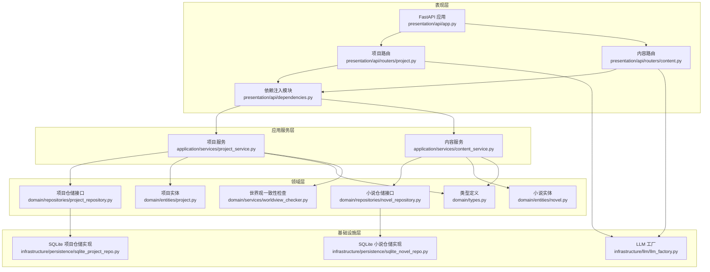
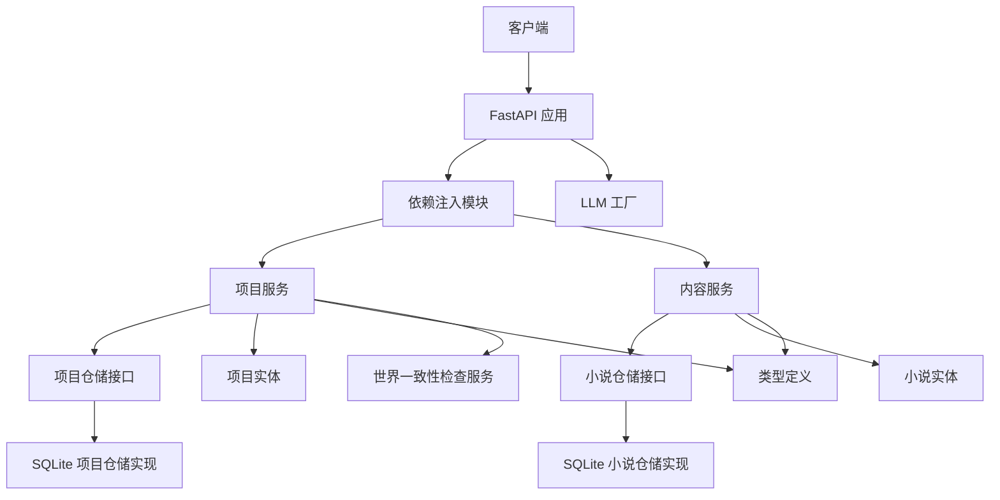
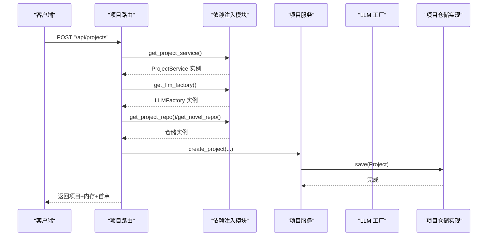
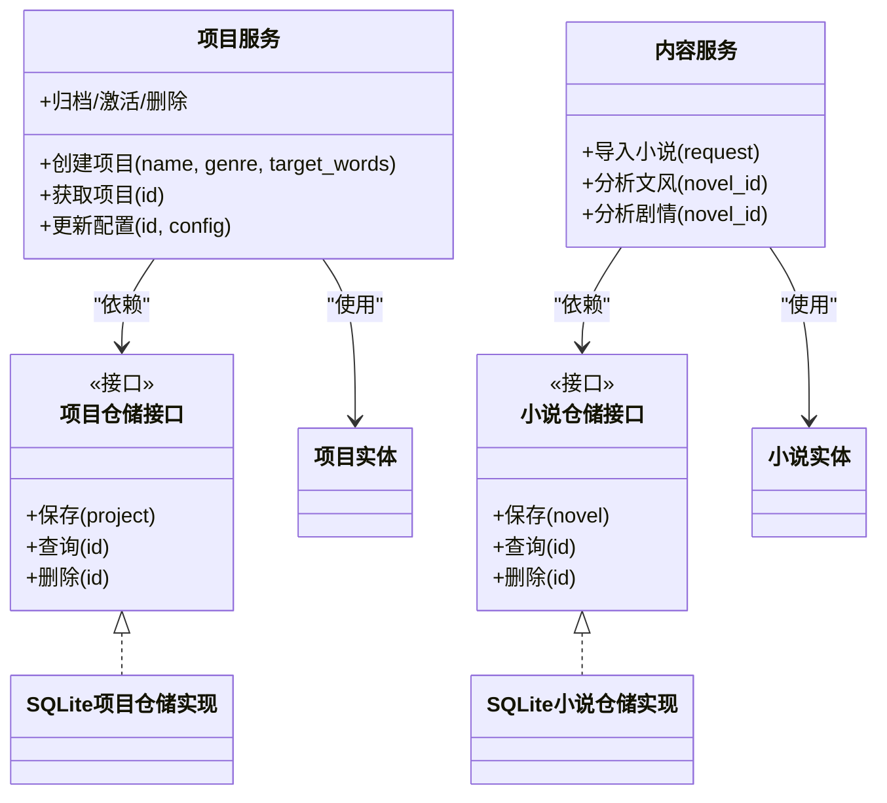
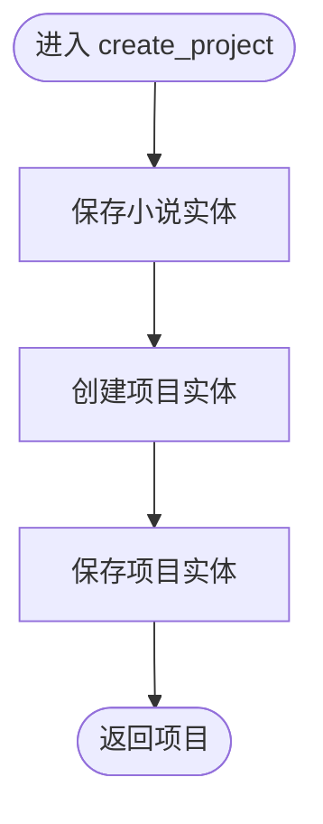
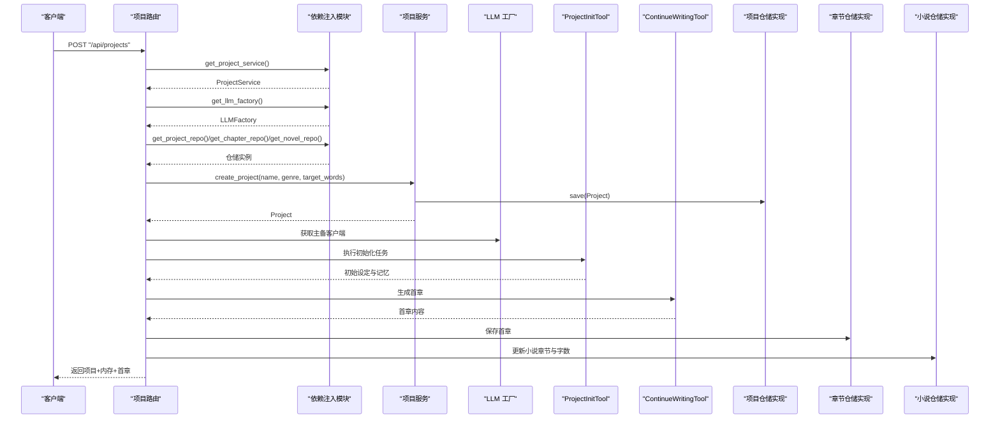
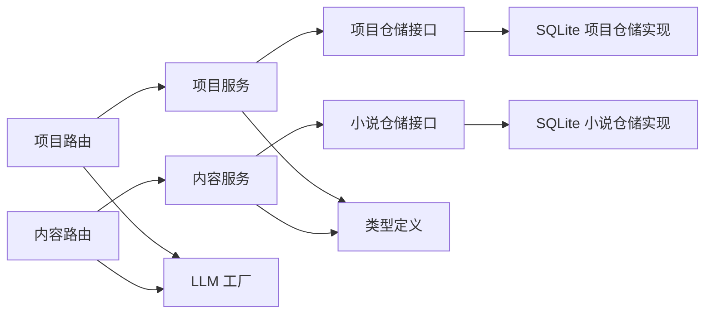

# 组件交互关系

<cite>
**本文引用的文件**
- [presentation/api/app.py](file://presentation/api/app.py)
- [presentation/api/dependencies.py](file://presentation/api/dependencies.py)
- [presentation/api/routers/project.py](file://presentation/api/routers/project.py)
- [presentation/api/routers/content.py](file://presentation/api/routers/content.py)
- [application/services/project_service.py](file://application/services/project_service.py)
- [application/services/content_service.py](file://application/services/content_service.py)
- [application/dto/request_dto.py](file://application/dto/request_dto.py)
- [application/dto/response_dto.py](file://application/dto/response_dto.py)
- [domain/entities/project.py](file://domain/entities/project.py)
- [domain/entities/novel.py](file://domain/entities/novel.py)
- [domain/repositories/project_repository.py](file://domain/repositories/project_repository.py)
- [domain/repositories/novel_repository.py](file://domain/repositories/novel_repository.py)
- [domain/types.py](file://domain/types.py)
- [domain/services/worldview_checker.py](file://domain/services/worldview_checker.py)
- [infrastructure/persistence/sqlite_project_repo.py](file://infrastructure/persistence/sqlite_project_repo.py)
- [infrastructure/persistence/sqlite_novel_repo.py](file://infrastructure/persistence/sqlite_novel_repo.py)
- [infrastructure/llm/llm_factory.py](file://infrastructure/llm/llm_factory.py)
- [application/agent_mvp/orchestrator.py](file://application/agent_mvp/orchestrator.py)
</cite>

## 目录
1. [引言](#引言)
2. [项目结构](#项目结构)
3. [核心组件](#核心组件)
4. [架构总览](#架构总览)
5. [详细组件分析](#详细组件分析)
6. [依赖关系分析](#依赖关系分析)
7. [性能考量](#性能考量)
8. [故障排查指南](#故障排查指南)
9. [结论](#结论)

## 引言
本文件聚焦 InkTrace 项目的组件交互关系，系统性梳理表现层（API 路由器）、应用服务层、领域实体与基础设施服务之间的依赖注入、调用链路、数据传递与错误处理机制。重点覆盖以下方面：
- 表现层 API 路由器与应用服务层的依赖注入关系
- 应用服务层如何协调领域实体与基础设施服务
- 领域层实体如何通过仓储接口进行数据持久化
- 典型业务流程（如“创建项目并生成首章”）中的组件协作与时序
- 组件解耦策略与接口设计原则

## 项目结构
InkTrace 采用分层架构：表现层（FastAPI）、应用服务层（业务编排）、领域层（实体与服务）、基础设施层（仓储与外部服务）。依赖注入集中在表现层的依赖模块中，统一提供各服务与仓储实例。

图表来源
- [presentation/api/app.py:19-62](file://presentation/api/app.py#L19-L62)
- [presentation/api/dependencies.py:50-178](file://presentation/api/dependencies.py#L50-L178)
- [presentation/api/routers/project.py:26-290](file://presentation/api/routers/project.py#L26-L290)
- [presentation/api/routers/content.py:23-214](file://presentation/api/routers/content.py#L23-L214)
- [application/services/project_service.py:21-203](file://application/services/project_service.py#L21-L203)
- [application/services/content_service.py:29-169](file://application/services/content_service.py#L29-L169)
- [domain/entities/project.py:17-112](file://domain/entities/project.py#L17-L112)
- [domain/entities/novel.py:20-178](file://domain/entities/novel.py#L20-L178)
- [domain/repositories/project_repository.py:17-55](file://domain/repositories/project_repository.py#L17-L55)
- [domain/repositories/novel_repository.py:17-70](file://domain/repositories/novel_repository.py#L17-L70)
- [domain/types.py:15-284](file://domain/types.py#L15-L284)
- [domain/services/worldview_checker.py:29-161](file://domain/services/worldview_checker.py#L29-L161)
- [infrastructure/persistence/sqlite_project_repo.py:21-137](file://infrastructure/persistence/sqlite_project_repo.py#L21-L137)
- [infrastructure/persistence/sqlite_novel_repo.py:20-116](file://infrastructure/persistence/sqlite_novel_repo.py#L20-L116)
- [infrastructure/llm/llm_factory.py:31-121](file://infrastructure/llm/llm_factory.py#L31-L121)

章节来源
- [presentation/api/app.py:19-62](file://presentation/api/app.py#L19-L62)
- [presentation/api/dependencies.py:50-178](file://presentation/api/dependencies.py#L50-L178)

## 核心组件
- 表现层（FastAPI）
  - 应用工厂负责注册 CORS 中间件与多组路由（项目、内容、写作、导出、向量检索、RAG、配置等），统一对外提供 API。
  - 依赖注入模块集中声明各仓储与服务的构造与缓存，供路由层通过依赖注入获取。
- 应用服务层
  - 项目服务：负责项目生命周期管理（创建、查询、更新、归档/激活、删除），并与小说实体协同维护聚合关系。
  - 内容服务：负责内容导入、解析、文风/剧情分析，并与 LLM 工厂协作进行智能分析。
- 领域层
  - 实体：项目、小说等聚合根，封装业务不变式与行为；类型定义提供强类型 ID 与枚举。
  - 仓储接口：抽象数据访问契约；具体实现由基础设施层提供。
  - 服务：如世界一致性检查服务，用于跨实体的规则校验。
- 基础设施层
  - 仓储实现：SQLite 与 ChromaDB 等，负责数据持久化与查询。
  - LLM 工厂：提供主备模型客户端，支持可用性检测与自动切换。

章节来源
- [presentation/api/app.py:19-62](file://presentation/api/app.py#L19-L62)
- [presentation/api/dependencies.py:50-178](file://presentation/api/dependencies.py#L50-L178)
- [application/services/project_service.py:21-203](file://application/services/project_service.py#L21-L203)
- [application/services/content_service.py:29-169](file://application/services/content_service.py#L29-L169)
- [domain/entities/project.py:17-112](file://domain/entities/project.py#L17-L112)
- [domain/entities/novel.py:20-178](file://domain/entities/novel.py#L20-L178)
- [domain/repositories/project_repository.py:17-55](file://domain/repositories/project_repository.py#L17-L55)
- [domain/repositories/novel_repository.py:17-70](file://domain/repositories/novel_repository.py#L17-L70)
- [domain/types.py:15-284](file://domain/types.py#L15-L284)
- [domain/services/worldview_checker.py:29-161](file://domain/services/worldview_checker.py#L29-L161)
- [infrastructure/persistence/sqlite_project_repo.py:21-137](file://infrastructure/persistence/sqlite_project_repo.py#L21-L137)
- [infrastructure/persistence/sqlite_novel_repo.py:20-116](file://infrastructure/persistence/sqlite_novel_repo.py#L20-L116)
- [infrastructure/llm/llm_factory.py:31-121](file://infrastructure/llm/llm_factory.py#L31-L121)

## 架构总览
InkTrace 的架构遵循整洁架构思想：
- 表现层仅负责请求接入与响应输出，不承载业务逻辑
- 应用服务层编排业务用例，协调领域实体与基础设施
- 领域层保持稳定，通过接口隔离变化
- 基础设施层实现具体技术细节，如数据库与外部 LLM

图表来源
- [presentation/api/app.py:19-62](file://presentation/api/app.py#L19-L62)
- [presentation/api/dependencies.py:50-178](file://presentation/api/dependencies.py#L50-L178)
- [application/services/project_service.py:21-203](file://application/services/project_service.py#L21-L203)
- [application/services/content_service.py:29-169](file://application/services/content_service.py#L29-L169)
- [domain/repositories/project_repository.py:17-55](file://domain/repositories/project_repository.py#L17-L55)
- [domain/repositories/novel_repository.py:17-70](file://domain/repositories/novel_repository.py#L17-L70)
- [infrastructure/persistence/sqlite_project_repo.py:21-137](file://infrastructure/persistence/sqlite_project_repo.py#L21-L137)
- [infrastructure/persistence/sqlite_novel_repo.py:20-116](file://infrastructure/persistence/sqlite_novel_repo.py#L20-L116)
- [domain/services/worldview_checker.py:29-161](file://domain/services/worldview_checker.py#L29-L161)
- [domain/types.py:15-284](file://domain/types.py#L15-L284)
- [infrastructure/llm/llm_factory.py:31-121](file://infrastructure/llm/llm_factory.py#L31-L121)

## 详细组件分析

### 表现层 API 路由器与依赖注入
- 依赖注入模块集中提供仓储与服务实例，使用缓存避免重复创建，降低资源消耗。
- 路由器通过依赖注入获取服务实例，实现松耦合与可测试性。
- LLM 工厂在路由中按需注入，支持主备模型自动切换。

图表来源
- [presentation/api/routers/project.py:91-181](file://presentation/api/routers/project.py#L91-L181)
- [presentation/api/dependencies.py:122-141](file://presentation/api/dependencies.py#L122-L141)
- [application/services/project_service.py:32-67](file://application/services/project_service.py#L32-L67)
- [infrastructure/persistence/sqlite_project_repo.py:83-98](file://infrastructure/persistence/sqlite_project_repo.py#L83-L98)
- [infrastructure/llm/llm_factory.py:31-121](file://infrastructure/llm/llm_factory.py#L31-L121)

章节来源
- [presentation/api/routers/project.py:91-181](file://presentation/api/routers/project.py#L91-L181)
- [presentation/api/dependencies.py:122-141](file://presentation/api/dependencies.py#L122-L141)

### 应用服务层：项目服务与内容服务
- 项目服务
  - 聚合创建小说与项目，维护项目配置与状态，提供查询、更新、归档/激活、删除等能力。
  - 通过仓储接口与领域实体交互，保证业务不变式（如状态转换、名称非空）。
- 内容服务
  - 负责内容导入、解析、文风/剧情分析；与 LLM 工厂协作进行智能分析。
  - 通过仓储接口读取/写入小说与章节数据，维持聚合内的一致性。

图表来源
- [application/services/project_service.py:21-203](file://application/services/project_service.py#L21-L203)
- [application/services/content_service.py:29-169](file://application/services/content_service.py#L29-L169)
- [domain/repositories/project_repository.py:17-55](file://domain/repositories/project_repository.py#L17-L55)
- [domain/repositories/novel_repository.py:17-70](file://domain/repositories/novel_repository.py#L17-L70)
- [infrastructure/persistence/sqlite_project_repo.py:21-137](file://infrastructure/persistence/sqlite_project_repo.py#L21-L137)
- [infrastructure/persistence/sqlite_novel_repo.py:20-116](file://infrastructure/persistence/sqlite_novel_repo.py#L20-L116)
- [domain/entities/project.py:17-112](file://domain/entities/project.py#L17-L112)
- [domain/entities/novel.py:20-178](file://domain/entities/novel.py#L20-L178)

章节来源
- [application/services/project_service.py:21-203](file://application/services/project_service.py#L21-L203)
- [application/services/content_service.py:29-169](file://application/services/content_service.py#L29-L169)

### 领域实体与仓储接口：数据持久化流程
- 项目服务在创建项目时，先保存小说实体，再保存项目实体，确保聚合完整性。
- 仓储接口定义了标准操作，具体实现负责 SQL/存储细节。
- 类型系统（如 ProjectId、NovelId、GenreType）保障 ID 一致性和枚举安全。

图表来源
- [application/services/project_service.py:32-67](file://application/services/project_service.py#L32-L67)
- [domain/entities/project.py:49-112](file://domain/entities/project.py#L49-L112)
- [domain/entities/novel.py:20-178](file://domain/entities/novel.py#L20-L178)
- [domain/repositories/project_repository.py:17-55](file://domain/repositories/project_repository.py#L17-L55)
- [domain/repositories/novel_repository.py:17-70](file://domain/repositories/novel_repository.py#L17-L70)
- [infrastructure/persistence/sqlite_project_repo.py:83-98](file://infrastructure/persistence/sqlite_project_repo.py#L83-L98)
- [infrastructure/persistence/sqlite_novel_repo.py:50-66](file://infrastructure/persistence/sqlite_novel_repo.py#L50-L66)

章节来源
- [application/services/project_service.py:32-67](file://application/services/project_service.py#L32-L67)
- [domain/entities/project.py:49-112](file://domain/entities/project.py#L49-L112)
- [domain/entities/novel.py:20-178](file://domain/entities/novel.py#L20-L178)
- [infrastructure/persistence/sqlite_project_repo.py:83-98](file://infrastructure/persistence/sqlite_project_repo.py#L83-L98)
- [infrastructure/persistence/sqlite_novel_repo.py:50-66](file://infrastructure/persistence/sqlite_novel_repo.py#L50-L66)

### 典型业务流程：创建项目并生成首章
该流程贯穿表现层、应用服务层、领域实体与基础设施层，体现依赖注入与仓储持久化的协作。

图表来源
- [presentation/api/routers/project.py:91-181](file://presentation/api/routers/project.py#L91-L181)
- [presentation/api/dependencies.py:122-141](file://presentation/api/dependencies.py#L122-L141)
- [application/services/project_service.py:32-67](file://application/services/project_service.py#L32-L67)
- [infrastructure/llm/llm_factory.py:31-121](file://infrastructure/llm/llm_factory.py#L31-L121)
- [infrastructure/persistence/sqlite_project_repo.py:83-98](file://infrastructure/persistence/sqlite_project_repo.py#L83-L98)
- [infrastructure/persistence/sqlite_novel_repo.py:50-66](file://infrastructure/persistence/sqlite_novel_repo.py#L50-L66)

章节来源
- [presentation/api/routers/project.py:91-181](file://presentation/api/routers/project.py#L91-L181)
- [presentation/api/dependencies.py:122-141](file://presentation/api/dependencies.py#L122-L141)

### 错误处理机制
- 路由层捕获业务异常并转换为 HTTP 响应（如 400/404/500），附带用户可读提示与内部错误码。
- 应用服务层抛出语义化异常（如“项目不存在”“小说不存在”），由路由层统一处理。
- LLM 工厂提供可用性检测与主备切换，增强鲁棒性。

章节来源
- [presentation/api/routers/project.py:245-274](file://presentation/api/routers/project.py#L245-L274)
- [presentation/api/routers/content.py:121-124](file://presentation/api/routers/content.py#L121-L124)
- [application/services/project_service.py:83-99](file://application/services/project_service.py#L83-L99)
- [infrastructure/llm/llm_factory.py:78-121](file://infrastructure/llm/llm_factory.py#L78-L121)

## 依赖关系分析
- 低耦合高内聚
  - 路由器仅依赖服务接口，通过依赖注入获取具体实现，便于替换与测试。
  - 服务层依赖仓储接口，不直接依赖具体实现，符合依赖倒置原则。
- 接口契约清晰
  - 仓储接口定义明确的 CRUD 与查询方法，实现类严格遵循契约。
  - DTO 层提供请求/响应的结构化定义，减少歧义与错误传播。
- 解耦策略
  - 使用工厂/注入容器统一管理对象生命周期与依赖关系。
  - 类型系统与枚举约束输入合法性，降低运行期错误。

图表来源
- [presentation/api/routers/project.py:71-89](file://presentation/api/routers/project.py#L71-L89)
- [presentation/api/routers/content.py:88-94](file://presentation/api/routers/content.py#L88-L94)
- [application/services/project_service.py:24-30](file://application/services/project_service.py#L24-L30)
- [application/services/content_service.py:36-48](file://application/services/content_service.py#L36-L48)
- [infrastructure/persistence/sqlite_project_repo.py:21-137](file://infrastructure/persistence/sqlite_project_repo.py#L21-L137)
- [infrastructure/persistence/sqlite_novel_repo.py:20-116](file://infrastructure/persistence/sqlite_novel_repo.py#L20-L116)
- [domain/types.py:15-284](file://domain/types.py#L15-L284)
- [infrastructure/llm/llm_factory.py:31-121](file://infrastructure/llm/llm_factory.py#L31-L121)

章节来源
- [presentation/api/routers/project.py:71-89](file://presentation/api/routers/project.py#L71-L89)
- [presentation/api/routers/content.py:88-94](file://presentation/api/routers/content.py#L88-L94)
- [application/services/project_service.py:24-30](file://application/services/project_service.py#L24-L30)
- [application/services/content_service.py:36-48](file://application/services/content_service.py#L36-L48)

## 性能考量
- 缓存与复用
  - 依赖注入模块使用缓存函数，避免重复创建仓储与服务实例，降低启动与运行开销。
- I/O 优化
  - 仓储实现采用批量/合并写入策略（如 INSERT OR REPLACE），减少事务次数。
- 模型可用性与降级
  - LLM 工厂支持主备模型自动切换，提升整体可用性与稳定性。

章节来源
- [presentation/api/dependencies.py:50-110](file://presentation/api/dependencies.py#L50-L110)
- [infrastructure/persistence/sqlite_project_repo.py:83-98](file://infrastructure/persistence/sqlite_project_repo.py#L83-L98)
- [infrastructure/llm/llm_factory.py:78-121](file://infrastructure/llm/llm_factory.py#L78-L121)

## 故障排查指南
- 常见错误与定位
  - “项目不存在/小说不存在”：通常来自应用服务层的参数校验与查询结果判断，检查路由传参与仓储查询。
  - “无效的题材类型/状态”：来自 DTO 校验与类型枚举转换，确认前端传参与类型定义。
  - LLM 相关失败：检查 LLM 工厂可用性检测与主备切换逻辑。
- 建议排查步骤
  - 核对路由层依赖注入是否正确提供服务与仓储实例
  - 检查仓储实现的 SQL 与字段映射是否匹配
  - 关注服务层异常抛出点与路由层的 HTTP 状态码映射

章节来源
- [presentation/api/routers/project.py:100-103](file://presentation/api/routers/project.py#L100-L103)
- [presentation/api/routers/project.py:245-274](file://presentation/api/routers/project.py#L245-L274)
- [application/services/project_service.py:83-99](file://application/services/project_service.py#L83-L99)
- [infrastructure/llm/llm_factory.py:78-121](file://infrastructure/llm/llm_factory.py#L78-L121)

## 结论
InkTrace 的组件交互以依赖注入为核心，实现表现层与应用层的解耦、应用层与领域层的解耦以及领域层与基础设施层的解耦。通过清晰的接口契约、强类型系统与稳健的错误处理机制，系统在保证可维护性的同时具备良好的扩展性与可靠性。建议在后续迭代中持续强化 DTO 的版本兼容与错误码标准化，进一步完善可观测性与日志追踪。