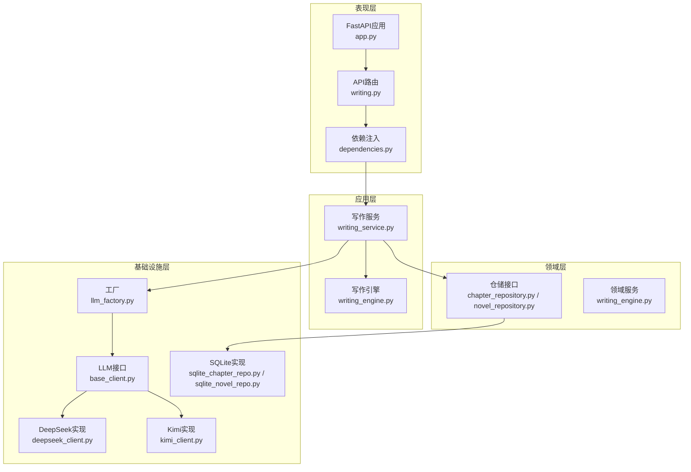
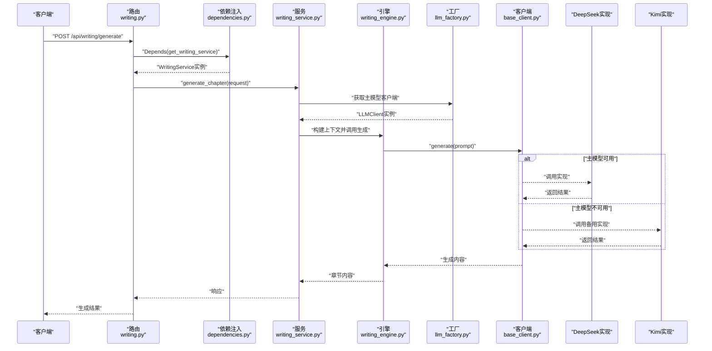
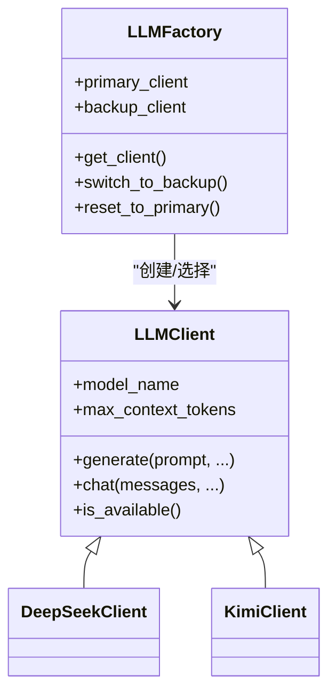
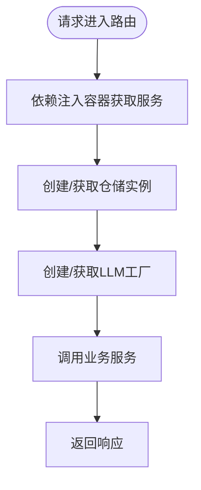
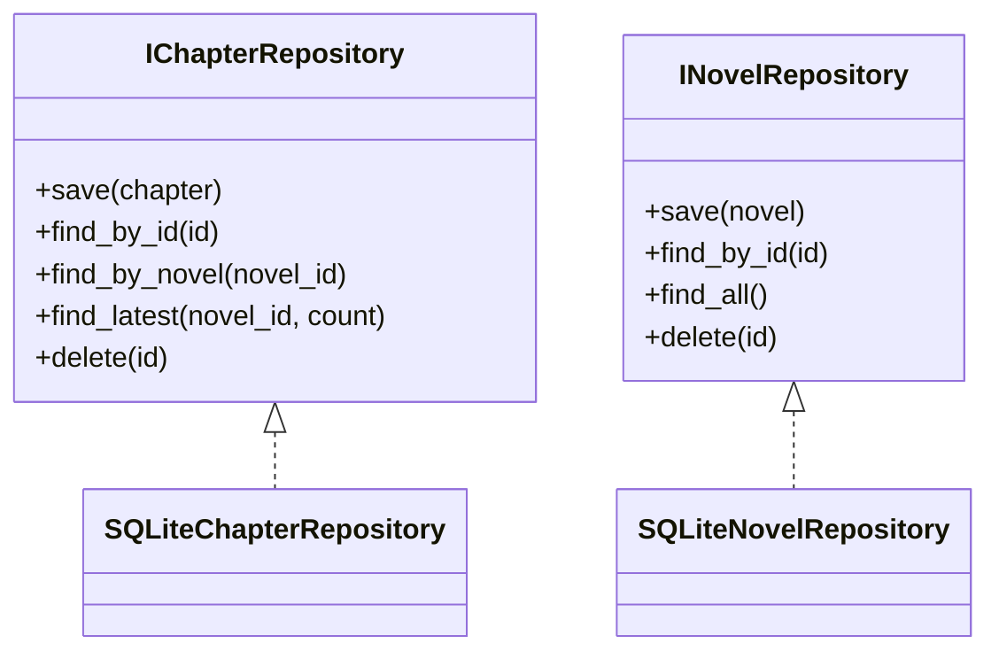
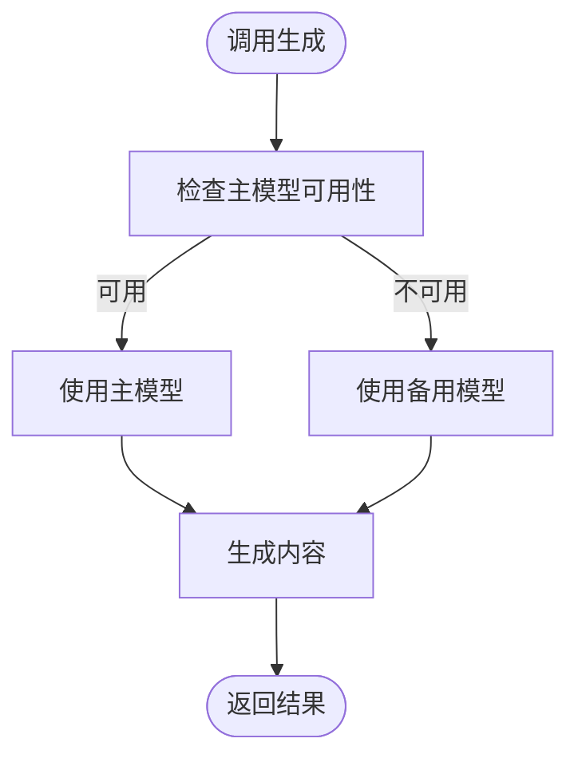
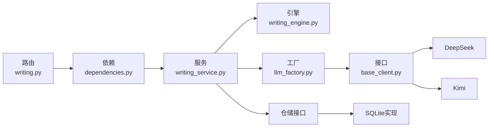

# 设计模式应用

<cite>
**本文引用的文件**
- [llm_factory.py](file://infrastructure/llm/llm_factory.py)
- [base_client.py](file://infrastructure/llm/base_client.py)
- [deepseek_client.py](file://infrastructure/llm/deepseek_client.py)
- [kimi_client.py](file://infrastructure/llm/kimi_client.py)
- [dependencies.py](file://presentation/api/dependencies.py)
- [app.py](file://presentation/api/app.py)
- [writing_service.py](file://application/services/writing_service.py)
- [writing_engine.py](file://domain/services/writing_engine.py)
- [writing.py](file://presentation/api/routers/writing.py)
- [chapter_repository.py](file://domain/repositories/chapter_repository.py)
- [sqlite_chapter_repo.py](file://infrastructure/persistence/sqlite_chapter_repo.py)
- [novel_repository.py](file://domain/repositories/novel_repository.py)
- [sqlite_novel_repo.py](file://infrastructure/persistence/sqlite_novel_repo.py)
- [model_router.py](file://application/agent_mvp/model_router.py)
- [tools.py](file://application/agent_mvp/tools.py)
</cite>

## 目录
1. [引言](#引言)
2. [项目结构](#项目结构)
3. [核心组件](#核心组件)
4. [架构总览](#架构总览)
5. [详细组件分析](#详细组件分析)
6. [依赖关系分析](#依赖关系分析)
7. [性能考量](#性能考量)
8. [故障排查指南](#故障排查指南)
9. [结论](#结论)
10. [附录](#附录)

## 引言
本文件聚焦InkTrace项目中关键设计模式的应用与协同，围绕以下主题展开：
- 工厂模式：在LLM客户端工厂中的实现与主备模型切换策略
- 依赖注入模式：在FastAPI依赖系统中的应用与缓存优化
- 仓储模式：数据访问层的接口与实现分离
- 策略模式：在不同AI模型切换中的使用与扩展点

我们将解释每种设计模式解决的具体问题、实现方式、带来的好处，并提供最佳实践建议与代码示例路径。

## 项目结构
InkTrace采用分层架构，清晰划分基础设施、领域、应用与表现层。与设计模式相关的模块主要分布在：
- 基础设施层：LLM客户端抽象与具体实现、仓储实现
- 领域层：仓储接口、领域服务
- 应用层：服务编排与业务流程
- 表现层：FastAPI依赖注入与路由

**图表来源**
- [writing.py:1-278](file://presentation/api/routers/writing.py#L1-L278)
- [dependencies.py:1-178](file://presentation/api/dependencies.py#L1-L178)
- [app.py:1-66](file://presentation/api/app.py#L1-L66)
- [writing_service.py:1-180](file://application/services/writing_service.py#L1-L180)
- [writing_engine.py:1-184](file://domain/services/writing_engine.py#L1-L184)
- [base_client.py:1-83](file://infrastructure/llm/base_client.py#L1-L83)
- [llm_factory.py:1-121](file://infrastructure/llm/llm_factory.py#L1-L121)
- [deepseek_client.py:1-238](file://infrastructure/llm/deepseek_client.py#L1-L238)
- [kimi_client.py:1-244](file://infrastructure/llm/kimi_client.py#L1-L244)
- [chapter_repository.py:1-89](file://domain/repositories/chapter_repository.py#L1-L89)
- [sqlite_chapter_repo.py:1-125](file://infrastructure/persistence/sqlite_chapter_repo.py#L1-L125)
- [novel_repository.py:1-70](file://domain/repositories/novel_repository.py#L1-L70)
- [sqlite_novel_repo.py](file://infrastructure/persistence/sqlite_novel_repo.py)

**章节来源**
- [writing.py:1-278](file://presentation/api/routers/writing.py#L1-L278)
- [dependencies.py:1-178](file://presentation/api/dependencies.py#L1-L178)
- [app.py:1-66](file://presentation/api/app.py#L1-L66)

## 核心组件
- LLM客户端抽象与工厂：通过统一接口与工厂封装多模型客户端，支持主备切换与可用性检测
- 依赖注入容器：集中管理仓储与服务实例，结合缓存提升性能
- 仓储接口与实现：面向接口编程，隔离数据存储细节
- 写作引擎与服务：组合LLM客户端与风格配置，执行章节生成与剧情规划

**章节来源**
- [base_client.py:1-83](file://infrastructure/llm/base_client.py#L1-L83)
- [llm_factory.py:1-121](file://infrastructure/llm/llm_factory.py#L1-L121)
- [dependencies.py:1-178](file://presentation/api/dependencies.py#L1-L178)
- [chapter_repository.py:1-89](file://domain/repositories/chapter_repository.py#L1-L89)
- [sqlite_chapter_repo.py:1-125](file://infrastructure/persistence/sqlite_chapter_repo.py#L1-L125)
- [writing_engine.py:1-184](file://domain/services/writing_engine.py#L1-L184)
- [writing_service.py:1-180](file://application/services/writing_service.py#L1-L180)

## 架构总览
下图展示设计模式在端到端请求中的协作关系：FastAPI路由通过依赖注入获取服务，服务调用领域引擎与仓储，引擎通过工厂获取LLM客户端，客户端实现类负责与外部模型API交互。

**图表来源**
- [writing.py:111-171](file://presentation/api/routers/writing.py#L111-L171)
- [dependencies.py:122-141](file://presentation/api/dependencies.py#L122-L141)
- [writing_service.py:91-165](file://application/services/writing_service.py#L91-L165)
- [writing_engine.py:52-80](file://domain/services/writing_engine.py#L52-L80)
- [llm_factory.py:78-95](file://infrastructure/llm/llm_factory.py#L78-L95)
- [base_client.py:21-41](file://infrastructure/llm/base_client.py#L21-L41)
- [deepseek_client.py:78-116](file://infrastructure/llm/deepseek_client.py#L78-L116)
- [kimi_client.py:84-122](file://infrastructure/llm/kimi_client.py#L84-L122)

## 详细组件分析

### 工厂模式：LLM客户端工厂
- 解决的问题
  - 统一LLM客户端接口，屏蔽不同模型供应商差异
  - 实现主备模型自动切换，提升系统可用性
  - 延迟创建与缓存客户端实例，降低启动成本
- 实现方式
  - 抽象接口：定义标准生成与对话能力
  - 具体实现：DeepSeek与Kimi客户端
  - 工厂：集中管理主备客户端，提供可用性检测与切换
- 带来的好处
  - 易于扩展新模型供应商
  - 降低调用方对具体实现的耦合
  - 提升容错与稳定性
- 最佳实践
  - 在工厂中增加健康检查与降级策略
  - 为不同模型设置独立的超时与重试参数
  - 通过环境变量注入API密钥与基础URL

**图表来源**
- [base_client.py:14-82](file://infrastructure/llm/base_client.py#L14-L82)
- [deepseek_client.py:25-238](file://infrastructure/llm/deepseek_client.py#L25-L238)
- [kimi_client.py:25-244](file://infrastructure/llm/kimi_client.py#L25-L244)
- [llm_factory.py:31-121](file://infrastructure/llm/llm_factory.py#L31-L121)

**章节来源**
- [llm_factory.py:1-121](file://infrastructure/llm/llm_factory.py#L1-L121)
- [base_client.py:1-83](file://infrastructure/llm/base_client.py#L1-L83)
- [deepseek_client.py:1-238](file://infrastructure/llm/deepseek_client.py#L1-L238)
- [kimi_client.py:1-244](file://infrastructure/llm/kimi_client.py#L1-L244)

### 依赖注入模式：FastAPI依赖系统
- 解决的问题
  - 避免在路由中直接构造复杂对象
  - 统一管理服务与仓储实例，便于测试与替换
  - 通过缓存减少重复创建开销
- 实现方式
  - 依赖函数：集中定义仓储与服务的创建逻辑
  - 缓存装饰器：对昂贵对象进行进程内缓存
  - 路由注入：使用Depends按需注入服务实例
- 带来的好处
  - 降低模块间耦合
  - 提升可测试性与可维护性
  - 明确的生命周期管理
- 最佳实践
  - 将环境变量读取集中在依赖层
  - 对数据库连接等资源使用上下文管理器
  - 将业务逻辑与基础设施解耦

**图表来源**
- [dependencies.py:50-177](file://presentation/api/dependencies.py#L50-L177)
- [writing.py:111-171](file://presentation/api/routers/writing.py#L111-L171)

**章节来源**
- [dependencies.py:1-178](file://presentation/api/dependencies.py#L1-L178)
- [writing.py:1-278](file://presentation/api/routers/writing.py#L1-L278)
- [app.py:1-66](file://presentation/api/app.py#L1-L66)

### 仓储模式：数据访问层设计
- 解决的问题
  - 将业务逻辑与数据持久化解耦
  - 通过接口隔离具体存储实现
- 实现方式
  - 接口定义：抽象出常用CRUD操作
  - 具体实现：SQLite实现承载SQL细节
- 带来的好处
  - 易于替换存储后端（如迁移到PostgreSQL）
  - 单元测试中可注入Mock仓储
- 最佳实践
  - 在接口中明确空值与异常语义
  - 对批量查询与排序提供明确约束
  - 保证事务一致性与并发安全

**图表来源**
- [chapter_repository.py:17-89](file://domain/repositories/chapter_repository.py#L17-L89)
- [novel_repository.py:17-70](file://domain/repositories/novel_repository.py#L17-L70)
- [sqlite_chapter_repo.py:19-125](file://infrastructure/persistence/sqlite_chapter_repo.py#L19-L125)
- [sqlite_novel_repo.py](file://infrastructure/persistence/sqlite_novel_repo.py)

**章节来源**
- [chapter_repository.py:1-89](file://domain/repositories/chapter_repository.py#L1-L89)
- [novel_repository.py:1-70](file://domain/repositories/novel_repository.py#L1-L70)
- [sqlite_chapter_repo.py:1-125](file://infrastructure/persistence/sqlite_chapter_repo.py#L1-L125)

### 策略模式：不同AI模型切换
- 解决的问题
  - 在运行时根据条件选择不同的LLM实现
  - 为未来引入新模型提供扩展点
- 实现方式
  - 工厂模式承担“策略选择”职责：优先主模型，失败则切换备用
  - 写作引擎通过注入的LLM客户端执行生成，无需关心具体实现
- 带来的好处
  - 业务层与模型层解耦
  - 便于灰度发布与A/B测试
- 最佳实践
  - 将模型选择策略封装在工厂或路由层
  - 为不同模型设置独立的超时与重试策略
  - 记录模型切换日志以便监控

**图表来源**
- [llm_factory.py:78-95](file://infrastructure/llm/llm_factory.py#L78-L95)
- [writing_engine.py:52-80](file://domain/services/writing_engine.py#L52-L80)

**章节来源**
- [llm_factory.py:1-121](file://infrastructure/llm/llm_factory.py#L1-L121)
- [writing_engine.py:1-184](file://domain/services/writing_engine.py#L1-L184)

### Agent与工具链中的模型路由（扩展）
- 在Agent MVP中，存在ModelRouter用于在主备模型之间进行选择与回退
- 工具链中的初始化过程包含“执行—修复—回退—降级”的恢复流程，体现策略与容错的协同

**章节来源**
- [model_router.py:1-41](file://application/agent_mvp/model_router.py#L1-L41)
- [tools.py:226-284](file://application/agent_mvp/tools.py#L226-L284)

## 依赖关系分析
- 路由层依赖依赖注入容器，获取服务实例
- 服务层依赖仓储接口与工厂，组合领域引擎
- 领域引擎依赖LLM客户端接口，实现与模型解耦
- 工厂依赖具体客户端实现，但对外暴露统一接口
- 仓储接口与实现分离，便于替换与测试

**图表来源**
- [writing.py:111-171](file://presentation/api/routers/writing.py#L111-L171)
- [dependencies.py:122-141](file://presentation/api/dependencies.py#L122-L141)
- [writing_service.py:91-165](file://application/services/writing_service.py#L91-L165)
- [writing_engine.py:52-80](file://domain/services/writing_engine.py#L52-L80)
- [llm_factory.py:31-121](file://infrastructure/llm/llm_factory.py#L31-L121)
- [base_client.py:14-82](file://infrastructure/llm/base_client.py#L14-L82)
- [sqlite_chapter_repo.py:19-125](file://infrastructure/persistence/sqlite_chapter_repo.py#L19-L125)

**章节来源**
- [writing.py:1-278](file://presentation/api/routers/writing.py#L1-L278)
- [dependencies.py:1-178](file://presentation/api/dependencies.py#L1-L178)
- [writing_service.py:1-180](file://application/services/writing_service.py#L1-L180)

## 性能考量
- 依赖注入缓存：对仓储与服务实例使用缓存，避免重复创建
- LLM客户端连接复用：HTTP客户端连接池减少握手开销
- 延迟创建：工厂按需创建客户端，缩短启动时间
- I/O并发：异步生成与可用性检测，提升吞吐
- 建议
  - 为不同模型设置独立超时与重试策略
  - 对高频调用的生成接口增加本地缓存
  - 监控模型可用性与错误率，动态调整主备权重

[本节为通用指导，无需列出具体文件来源]

## 故障排查指南
- LLM客户端不可用
  - 检查API密钥与基础URL配置
  - 查看可用性检测日志与错误类型
  - 切换到备用模型验证网络与鉴权
- 仓储访问异常
  - 确认数据库路径与目录权限
  - 检查表结构初始化与字段映射
- 依赖注入问题
  - 确认环境变量与缓存键
  - 检查服务构造参数与依赖顺序

**章节来源**
- [deepseek_client.py:213-227](file://infrastructure/llm/deepseek_client.py#L213-L227)
- [kimi_client.py:219-227](file://infrastructure/llm/kimi_client.py#L219-L227)
- [sqlite_chapter_repo.py:32-50](file://infrastructure/persistence/sqlite_chapter_repo.py#L32-L50)
- [dependencies.py:45-96](file://presentation/api/dependencies.py#L45-L96)

## 结论
InkTrace通过工厂模式、依赖注入、仓储模式与策略模式的协同应用，实现了：
- 模型与实现解耦、易于扩展
- 服务与基础设施解耦、便于测试
- 数据访问抽象、可替换性强
- 运行时策略选择、具备容错与灰度能力

这些设计模式共同提升了系统的可维护性、可扩展性与稳定性，为后续功能迭代提供了坚实基础。

[本节为总结性内容，无需列出具体文件来源]

## 附录
- 快速定位代码示例
  - 工厂与客户端接口：[llm_factory.py:31-121](file://infrastructure/llm/llm_factory.py#L31-L121)，[base_client.py:14-82](file://infrastructure/llm/base_client.py#L14-L82)
  - 依赖注入与路由：[dependencies.py:103-141](file://presentation/api/dependencies.py#L103-L141)，[writing.py:111-171](file://presentation/api/routers/writing.py#L111-L171)
  - 仓储接口与实现：[chapter_repository.py:17-89](file://domain/repositories/chapter_repository.py#L17-L89)，[sqlite_chapter_repo.py:19-125](file://infrastructure/persistence/sqlite_chapter_repo.py#L19-L125)
  - 写作引擎与服务：[writing_engine.py:30-184](file://domain/services/writing_engine.py#L30-L184)，[writing_service.py:30-180](file://application/services/writing_service.py#L30-L180)

[本节为补充说明，无需列出具体文件来源]