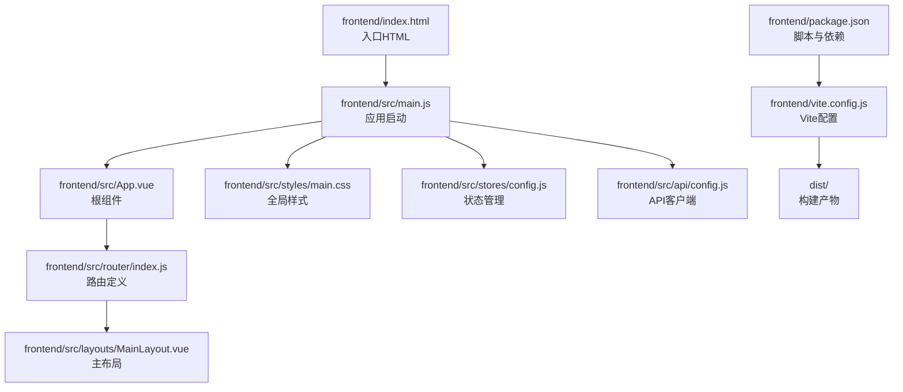
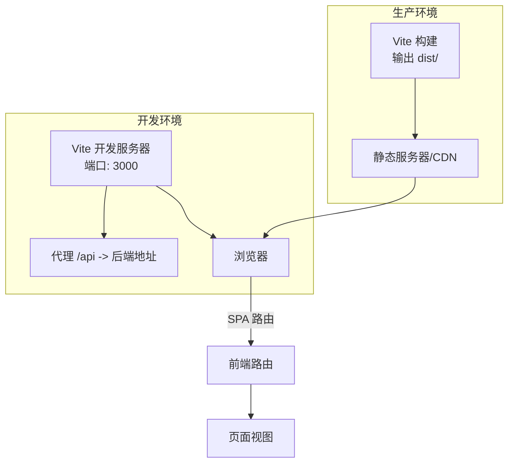
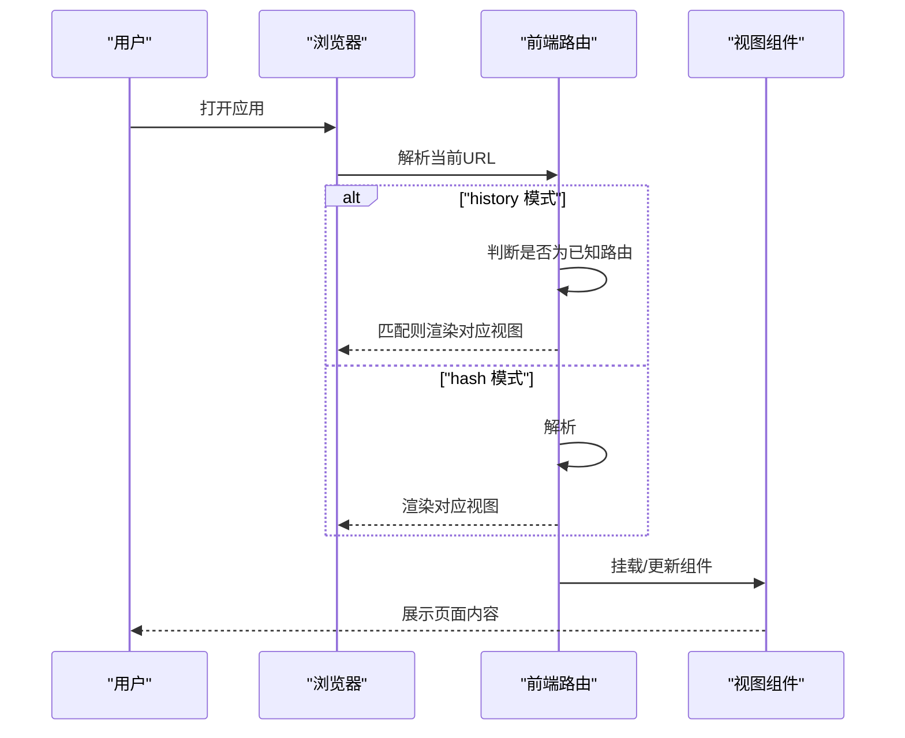
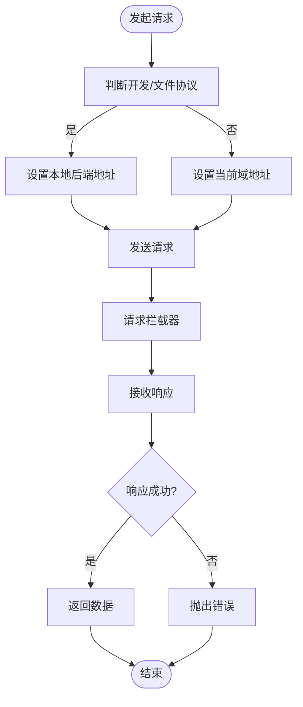
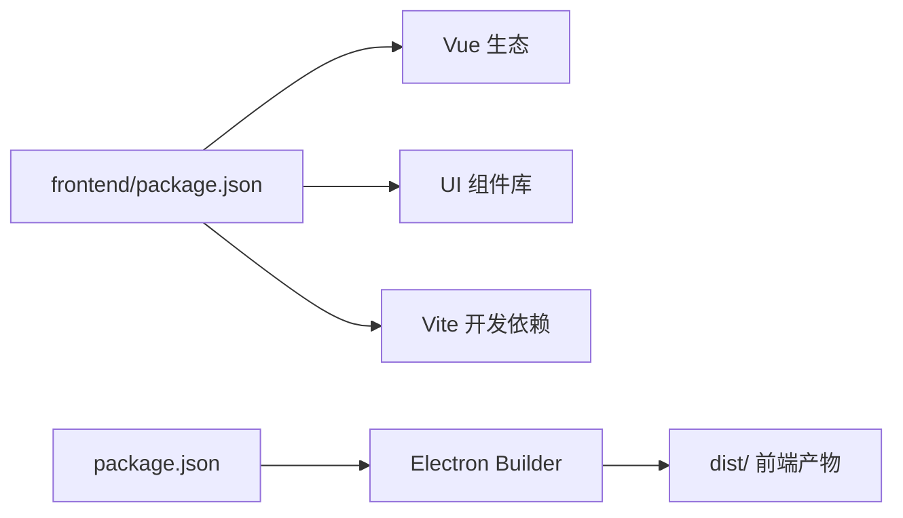

# 前端应用部署

<cite>
**本文引用的文件**
- [frontend/package.json](file://frontend/package.json)
- [frontend/vite.config.js](file://frontend/vite.config.js)
- [frontend/index.html](file://frontend/index.html)
- [frontend/src/main.js](file://frontend/src/main.js)
- [frontend/src/router/index.js](file://frontend/src/router/index.js)
- [frontend/src/App.vue](file://frontend/src/App.vue)
- [frontend/src/layouts/MainLayout.vue](file://frontend/src/layouts/MainLayout.vue)
- [frontend/src/styles/main.css](file://frontend/src/styles/main.css)
- [frontend/src/stores/config.js](file://frontend/src/stores/config.js)
- [frontend/src/api/config.js](file://frontend/src/api/config.js)
- [package.json](file://package.json)
- [start-frontend.bat](file://start-frontend.bat)
- [config.py](file://config.py)
</cite>

## 目录
1. [简介](#简介)
2. [项目结构](#项目结构)
3. [核心组件](#核心组件)
4. [架构总览](#架构总览)
5. [详细组件分析](#详细组件分析)
6. [依赖分析](#依赖分析)
7. [性能考虑](#性能考虑)
8. [故障排查指南](#故障排查指南)
9. [结论](#结论)
10. [附录](#附录)

## 简介
本文件面向InkTrace前端应用的部署与运维，覆盖以下主题：
- Node.js运行时与包管理器（npm/yarn）要求与使用
- Vite构建工具的配置与生产构建参数
- 静态资源生成与优化策略（代码分割、资源压缩、缓存）
- 前端部署位置与服务器配置要点
- CDN与静态托管方案
- 不同环境的构建脚本使用指南
- SPA路由与部署注意事项
- 浏览器兼容性与性能优化建议
- 持续集成中的前端构建流程

## 项目结构
前端位于仓库根目录的frontend子目录，采用Vue 3 + Vite技术栈，配合Element Plus UI框架与Pinia状态管理。入口HTML模板通过相对路径引用资源，路由采用history/hash双模式以适配不同部署场景。

图表来源
- [frontend/index.html:1-14](file://frontend/index.html#L1-L14)
- [frontend/src/main.js:1-23](file://frontend/src/main.js#L1-L23)
- [frontend/src/App.vue:1-17](file://frontend/src/App.vue#L1-L17)
- [frontend/src/router/index.js:1-74](file://frontend/src/router/index.js#L1-L74)
- [frontend/src/layouts/MainLayout.vue:1-143](file://frontend/src/layouts/MainLayout.vue#L1-L143)
- [frontend/src/styles/main.css:1-72](file://frontend/src/styles/main.css#L1-L72)
- [frontend/src/stores/config.js:1-240](file://frontend/src/stores/config.js#L1-L240)
- [frontend/src/api/config.js:1-55](file://frontend/src/api/config.js#L1-L55)
- [frontend/vite.config.js:1-28](file://frontend/vite.config.js#L1-L28)
- [frontend/package.json:1-24](file://frontend/package.json#L1-L24)

章节来源
- [frontend/package.json:1-24](file://frontend/package.json#L1-L24)
- [frontend/vite.config.js:1-28](file://frontend/vite.config.js#L1-L28)
- [frontend/index.html:1-14](file://frontend/index.html#L1-L14)
- [frontend/src/main.js:1-23](file://frontend/src/main.js#L1-L23)
- [frontend/src/router/index.js:1-74](file://frontend/src/router/index.js#L1-L74)
- [frontend/src/App.vue:1-17](file://frontend/src/App.vue#L1-L17)
- [frontend/src/layouts/MainLayout.vue:1-143](file://frontend/src/layouts/MainLayout.vue#L1-L143)
- [frontend/src/styles/main.css:1-72](file://frontend/src/styles/main.css#L1-L72)
- [frontend/src/stores/config.js:1-240](file://frontend/src/stores/config.js#L1-L240)
- [frontend/src/api/config.js:1-55](file://frontend/src/api/config.js#L1-L55)

## 核心组件
- 应用入口与启动
  - 入口HTML通过相对路径加载资源，确保在子路径部署时仍可正确解析。
  - 应用启动文件注册Pinia、路由、Element Plus，并挂载到DOM。
- 路由系统
  - 使用Vue Router，支持history与hash两种模式；在file协议下自动切换为hash模式，保障离线调试可用。
  - 定义多级嵌套路由，覆盖项目管理、小说列表、续写、人物与世界观管理等页面。
- 状态与API
  - Pinia Store集中管理配置状态，封装加载、保存、测试、删除等操作。
  - API客户端根据开发/文件协议自动选择后端地址，支持请求/响应拦截器。
- 构建与打包
  - Vite配置启用Vue插件、路径别名、开发代理与生产输出目录设置。
  - package.json提供dev/build/preview脚本，便于本地开发与预览。

章节来源
- [frontend/index.html:1-14](file://frontend/index.html#L1-L14)
- [frontend/src/main.js:1-23](file://frontend/src/main.js#L1-L23)
- [frontend/src/router/index.js:1-74](file://frontend/src/router/index.js#L1-L74)
- [frontend/src/stores/config.js:1-240](file://frontend/src/stores/config.js#L1-L240)
- [frontend/src/api/config.js:1-55](file://frontend/src/api/config.js#L1-L55)
- [frontend/vite.config.js:1-28](file://frontend/vite.config.js#L1-L28)
- [frontend/package.json:1-24](file://frontend/package.json#L1-L24)

## 架构总览
前端应用采用单页应用（SPA）架构，通过Vite进行开发与构建，路由在客户端渲染。开发阶段通过Vite内置服务器与代理访问后端服务；生产阶段输出静态资源至dist目录，可部署于任意静态服务器或CDN。

图表来源
- [frontend/vite.config.js:13-21](file://frontend/vite.config.js#L13-L21)
- [frontend/src/router/index.js:61-66](file://frontend/src/router/index.js#L61-L66)
- [frontend/package.json:6-10](file://frontend/package.json#L6-L10)

## 详细组件分析

### Vite构建与优化
- 基础配置
  - 插件：启用Vue插件以支持单文件组件与组合式API。
  - 路径别名：将@映射到src目录，简化导入路径。
  - 开发服务器：端口3000，配置/api前缀代理至后端地址。
  - 生产输出：输出目录dist，资源目录assets，构建时清空输出目录。
- 生产构建参数建议
  - 可在现有基础上扩展：设置base为部署子路径（如“./”）、启用压缩、配置Rollup插件以进一步优化体积与Tree-shaking。
  - 代码分割：保持按需加载的路由组件与视图，利用Vite默认的动态导入实现分块。
  - 资源哈希：启用文件名哈希以便浏览器缓存控制。
  - 预加载策略：对首屏关键路由组件进行预加载，提升首屏性能。
- 与后端交互
  - 开发代理确保前后端联调顺畅；生产环境需确保静态资源与API接口在同一域或正确跨域。

章节来源
- [frontend/vite.config.js:1-28](file://frontend/vite.config.js#L1-L28)
- [frontend/package.json:6-10](file://frontend/package.json#L6-L10)

### SPA路由与部署注意事项
- 路由模式选择
  - 在file协议（离线/打包桌面应用）下使用hash模式；在HTTP(S)服务器上使用history模式。
  - 路由守卫统一设置页面标题，增强用户体验。
- 服务器配置要点
  - 对于history模式，需在服务器层将所有未匹配路径重定向到index.html，以避免刷新后404。
  - 若部署在子路径，需调整Vite base与静态资源路径，确保资源正确加载。
- 路由与布局
  - 主布局包含头部、侧边栏菜单与内容区域，配合过渡动画提升页面切换体验。

图表来源
- [frontend/src/router/index.js:61-71](file://frontend/src/router/index.js#L61-L71)
- [frontend/src/layouts/MainLayout.vue:1-143](file://frontend/src/layouts/MainLayout.vue#L1-L143)

章节来源
- [frontend/src/router/index.js:1-74](file://frontend/src/router/index.js#L1-L74)
- [frontend/src/layouts/MainLayout.vue:1-143](file://frontend/src/layouts/MainLayout.vue#L1-L143)

### API客户端与后端交互
- 自动化地址选择
  - 开发环境或file协议时指向本地后端地址；否则使用当前页面所在域。
- 请求/响应拦截
  - 统一设置超时、内容类型与日志输出；对错误响应提取详细信息并抛出。
- 与后端端口约定
  - 开发代理指向后端地址；后端默认监听端口在配置模块中定义。

图表来源
- [frontend/src/api/config.js:9-55](file://frontend/src/api/config.js#L9-L55)
- [config.py:19-42](file://config.py#L19-L42)

章节来源
- [frontend/src/api/config.js:1-55](file://frontend/src/api/config.js#L1-L55)
- [config.py:1-45](file://config.py#L1-L45)

### 状态管理与配置
- Store职责
  - 维护LLM配置与状态，提供加载、保存、测试、删除等动作。
  - 校验API密钥格式，保证配置有效性。
- 初始化流程
  - 应用启动时先查询配置状态，若存在则加载详细配置，确保UI与后端一致。

章节来源
- [frontend/src/stores/config.js:1-240](file://frontend/src/stores/config.js#L1-L240)

### 全局样式与UI
- 全局样式
  - 统一字体、滚动条样式与页面容器布局，适配中文界面。
- UI框架
  - Element Plus提供组件库与国际化支持，图标通过批量注册方式注入应用。

章节来源
- [frontend/src/styles/main.css:1-72](file://frontend/src/styles/main.css#L1-L72)
- [frontend/src/main.js:3-20](file://frontend/src/main.js#L3-L20)

## 依赖分析
- 运行时依赖
  - Vue 3、Vue Router、Pinia、Axios、Element Plus及其图标。
- 开发依赖
  - Vite与Vue插件，用于开发与构建。
- 桌面端集成
  - 顶层package.json定义了Electron构建脚本，并将前端dist目录作为额外资源打包进桌面应用。

图表来源
- [frontend/package.json:11-22](file://frontend/package.json#L11-L22)
- [package.json:8-19](file://package.json#L8-L19)

章节来源
- [frontend/package.json:1-24](file://frontend/package.json#L1-L24)
- [package.json:1-81](file://package.json#L1-L81)

## 性能考虑
- 代码分割
  - 保持按需加载的路由与视图，减少首屏体积。
- 资源优化
  - 启用压缩与资源哈希，结合浏览器缓存策略提升二次加载速度。
- 路由与组件
  - 使用过渡动画与懒加载，避免不必要的初始渲染。
- 服务器缓存
  - 对静态资源设置长缓存，对HTML设置短缓存或no-cache，确保版本更新时可及时生效。

## 故障排查指南
- 启动失败（Node.js未安装）
  - 启动批处理会检测Node版本，未安装时提示并退出。请安装Node.js 18+后再试。
- 开发代理无法访问后端
  - 确认后端监听地址与端口与代理配置一致；检查防火墙与跨域设置。
- 生产部署404
  - 若使用history模式，请在服务器层将未匹配路径重定向到index.html。
- API请求异常
  - 查看请求拦截器日志与响应错误信息，确认后端地址、鉴权与网络连通性。

章节来源
- [start-frontend.bat:7-13](file://start-frontend.bat#L7-L13)
- [frontend/vite.config.js:15-20](file://frontend/vite.config.js#L15-L20)
- [frontend/src/api/config.js:29-55](file://frontend/src/api/config.js#L29-L55)

## 结论
InkTrace前端应用具备清晰的工程化结构与完善的开发/构建流程。通过合理配置Vite与路由模式，结合静态资源优化与服务器缓存策略，可在多种部署环境中稳定运行。建议在CI/CD中标准化构建与发布流程，确保版本一致性与可追溯性。

## 附录

### 环境与工具要求
- Node.js：18+（启动脚本会检测）
- 包管理器：npm（也可使用yarn，需自行替换命令）

章节来源
- [start-frontend.bat:8-13](file://start-frontend.bat#L8-L13)

### 构建脚本使用指南
- 开发模式
  - 在frontend目录执行开发脚本，启动Vite服务器并打开浏览器。
- 生产构建
  - 在frontend目录执行构建脚本，生成dist目录下的静态资源。
- 本地预览
  - 在frontend目录执行预览脚本，快速验证生产构建效果。

章节来源
- [frontend/package.json:6-10](file://frontend/package.json#L6-L10)

### 部署位置与服务器配置
- 部署位置
  - 将dist目录部署至静态服务器或CDN根目录或子路径。
- 服务器配置
  - history模式：将未匹配路径重定向到index.html。
  - 子路径部署：调整Vite base与资源路径，确保静态资源正确加载。

章节来源
- [frontend/vite.config.js:7-26](file://frontend/vite.config.js#L7-L26)
- [frontend/src/router/index.js:61-66](file://frontend/src/router/index.js#L61-L66)

### CDN与静态托管方案
- 推荐方案
  - 使用CDN分发静态资源，结合缓存头与HTTPS加速。
  - 对dist目录进行版本化发布，确保灰度与回滚能力。
- 注意事项
  - 确保路由回退策略与资源路径配置正确。

### 浏览器兼容性与性能优化建议
- 兼容性
  - 基于Vue 3生态，现代浏览器可良好运行；如需兼容旧版IE，需引入相应polyfill与转译。
- 性能
  - 启用压缩与资源哈希；合理拆分代码；对关键路由组件进行预加载；优化图片与字体资源。

### 持续集成中的前端构建流程
- 建议步骤
  - 安装依赖 → 执行构建 → 上传dist目录制品 → 部署至目标环境。
- 与桌面端集成
  - 桌面端构建会将前端dist作为额外资源打包，确保最终安装包包含最新前端资源。

章节来源
- [package.json:8-19](file://package.json#L8-L19)