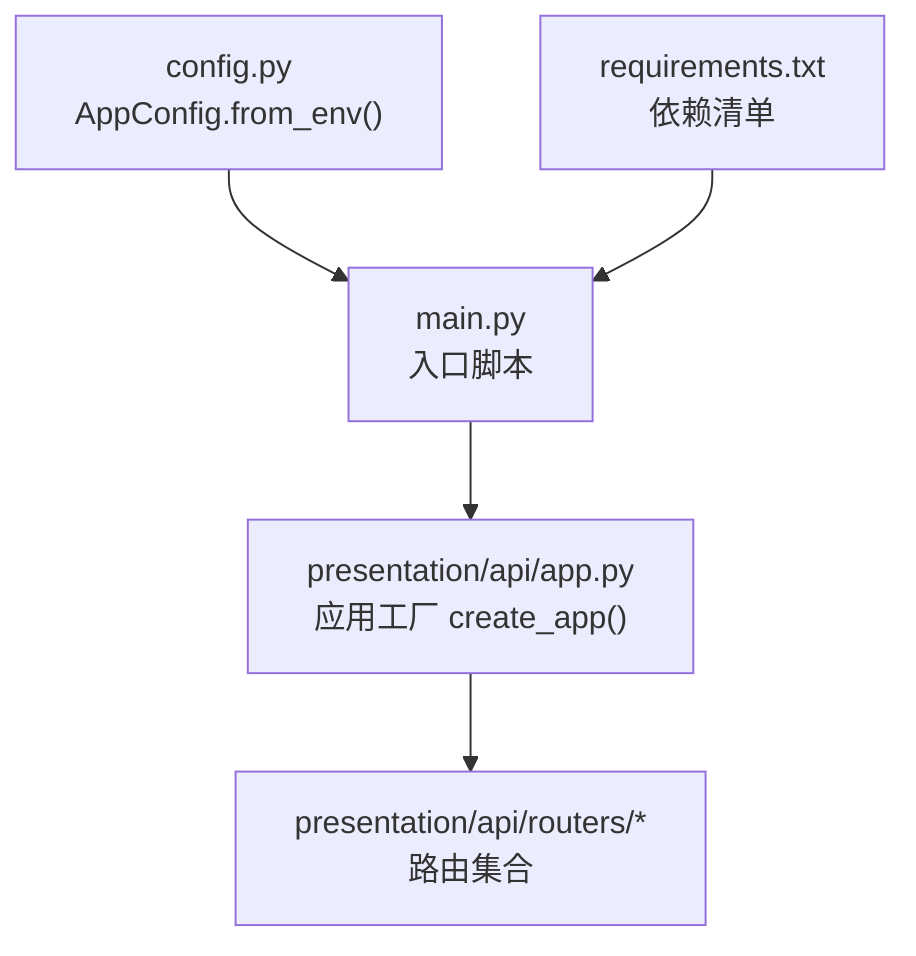
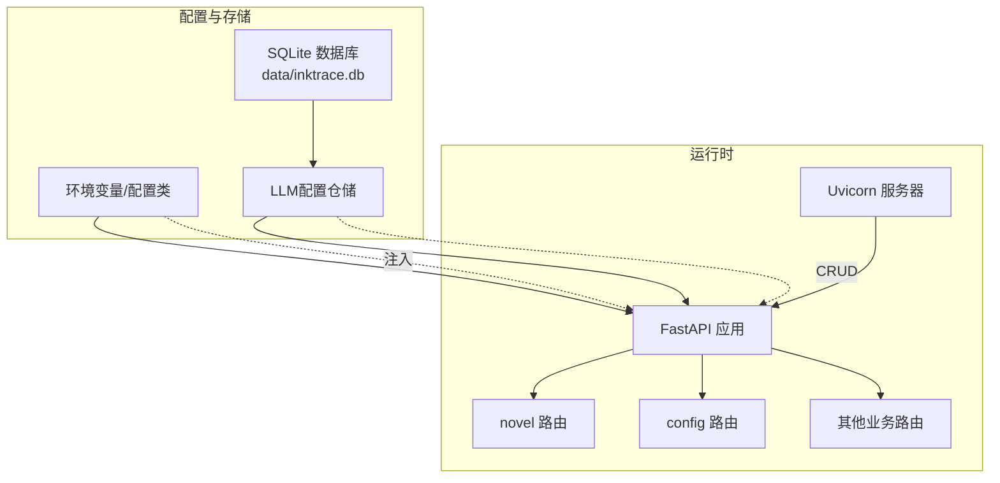
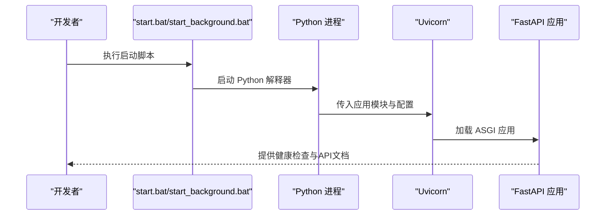
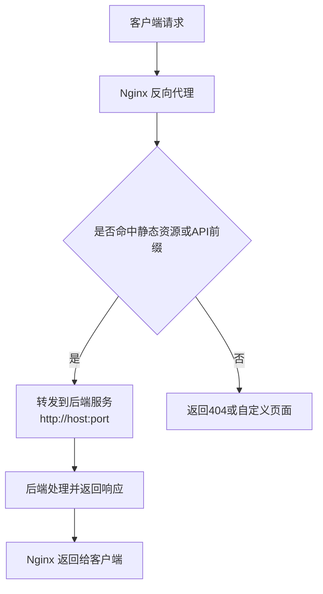

# 后端服务部署

<cite>
**本文引用的文件**
- [config.py](file://config.py)
- [requirements.txt](file://requirements.txt)
- [main.py](file://main.py)
- [presentation/api/app.py](file://presentation/api/app.py)
- [presentation/api/routers/config.py](file://presentation/api/routers/config.py)
- [presentation/api/routers/novel.py](file://presentation/api/routers/novel.py)
- [infrastructure/persistence/sqlite_llm_config_repo.py](file://infrastructure/persistence/sqlite_llm_config_repo.py)
- [start.bat](file://start.bat)
- [start_background.bat](file://start_background.bat)
- [stop.bat](file://stop.bat)
- [README.md](file://README.md)
- [desktop/process-manager.js](file://desktop/process-manager.js)
</cite>

## 目录
1. [简介](#简介)
2. [项目结构](#项目结构)
3. [核心组件](#核心组件)
4. [架构总览](#架构总览)
5. [详细组件分析](#详细组件分析)
6. [依赖分析](#依赖分析)
7. [性能考虑](#性能考虑)
8. [故障排查指南](#故障排查指南)
9. [结论](#结论)
10. [附录](#附录)

## 简介
本文件面向InkTrace后端服务的部署与运维，覆盖Python环境与依赖安装、配置文件部署、启动流程（前台/后台）、Uvicorn服务器配置与性能调优、Docker容器化方案、Nginx反向代理示例、进程管理与监控最佳实践，以及常见部署问题排查。

## 项目结构
后端采用FastAPI + Uvicorn，入口位于根目录的启动脚本，应用工厂函数在表现层创建，路由按功能分组组织，配置通过环境变量注入。

图示来源
- [main.py:15-21](file://main.py#L15-L21)
- [presentation/api/app.py:19-65](file://presentation/api/app.py#L19-L65)
- [config.py:30-45](file://config.py#L30-L45)

章节来源
- [main.py:1-22](file://main.py#L1-L22)
- [presentation/api/app.py:1-66](file://presentation/api/app.py#L1-L66)
- [config.py:1-46](file://config.py#L1-L46)

## 核心组件
- 配置系统：通过环境变量注入主机、端口、调试开关、数据库路径及API密钥。
- 应用工厂：创建FastAPI实例，注册CORS与多期路由，提供健康检查端点。
- 启动入口：使用Uvicorn运行ASGI应用，支持热重载调试模式。
- 配置管理API：提供LLM密钥的增删查改与连通性测试。
- SQLite仓储：持久化LLM配置，含建表、CRUD与历史查询。

章节来源
- [config.py:14-45](file://config.py#L14-L45)
- [presentation/api/app.py:19-65](file://presentation/api/app.py#L19-L65)
- [main.py:15-21](file://main.py#L15-L21)
- [presentation/api/routers/config.py:52-173](file://presentation/api/routers/config.py#L52-L173)
- [infrastructure/persistence/sqlite_llm_config_repo.py:18-145](file://infrastructure/persistence/sqlite_llm_config_repo.py#L18-L145)

## 架构总览
后端服务以Uvicorn承载的ASGI应用为核心，通过FastAPI提供REST接口；配置来源于环境变量；数据持久化使用SQLite；路由按业务域划分。

图示来源
- [main.py:15-21](file://main.py#L15-L21)
- [presentation/api/app.py:19-65](file://presentation/api/app.py#L19-L65)
- [presentation/api/routers/config.py:56-64](file://presentation/api/routers/config.py#L56-L64)
- [infrastructure/persistence/sqlite_llm_config_repo.py:21-26](file://infrastructure/persistence/sqlite_llm_config_repo.py#L21-L26)

## 详细组件分析

### 配置系统与部署要点
- 关键配置项
  - 服务地址与端口：INKTRACE_HOST、INKTRACE_PORT
  - 调试模式：INKTRACE_DEBUG（布尔）
  - 数据库路径：INKTRACE_DB_PATH（默认 data/inktrace.db）
  - LLM API密钥：DEEPSEEK_API_KEY、KIMI_API_KEY
- 加载机制：AppConfig.from_env()从环境变量读取并提供默认值。
- 部署建议
  - 在系统环境或容器环境设置上述变量。
  - 生产环境务必禁用调试模式，避免热重载带来的安全与性能风险。
  - 数据库路径需确保后端进程有读写权限。

章节来源
- [config.py:14-45](file://config.py#L14-L45)
- [README.md:160-169](file://README.md#L160-L169)

### 应用工厂与路由
- 应用工厂负责：
  - 初始化FastAPI实例（标题、描述、版本）
  - 注册CORS中间件（允许跨域）
  - 包含多期路由（小说、内容、写作、导出、项目、模板、角色、世界观、向量、RAG、配置等）
  - 提供根路径与健康检查端点
- 路由示例：小说管理路由提供创建、查询、详情、删除等接口。

章节来源
- [presentation/api/app.py:19-65](file://presentation/api/app.py#L19-L65)
- [presentation/api/routers/novel.py:21-162](file://presentation/api/routers/novel.py#L21-L162)

### 启动流程（前台与后台）
- 前台启动
  - 直接执行入口脚本，输出到当前终端，便于开发调试与日志查看。
  - 适合本地开发与问题定位。
- 后台启动
  - 使用批处理脚本在后台启动，并将标准输出与错误输出重定向至日志文件。
  - 适合生产环境长期运行。
- 停止服务
  - 通过端口扫描查找进程并终止，便于运维控制。

图示来源
- [start.bat:39-39](file://start.bat#L39-L39)
- [start_background.bat:14-14](file://start_background.bat#L14-L14)
- [main.py:15-21](file://main.py#L15-L21)

章节来源
- [start.bat:1-40](file://start.bat#L1-L40)
- [start_background.bat:1-21](file://start_background.bat#L1-L21)
- [stop.bat:7-24](file://stop.bat#L7-L24)
- [main.py:15-21](file://main.py#L15-L21)

### Uvicorn服务器配置与性能调优
- 基本参数
  - 应用模块：presentation.api.app:app
  - 主机与端口：来自配置类
  - 热重载：仅在调试模式启用
- 性能调优建议（通用实践）
  - 并发与工作者：根据CPU核心数设置工作者数量，合理配置uvicorn的workers与threads参数（注意异步与同步阻塞的权衡）。
  - 超时与keepalive：结合Nginx与反向代理设置超时策略，避免长连接占用资源。
  - 日志级别：生产环境降低日志级别，减少I/O开销。
  - 内存与GC：在容器环境中限制内存并观察GC行为，必要时调整Python解释器参数。
- 注意事项
  - 禁用调试模式以提升安全性与性能。
  - 如需多进程部署，确保应用无状态或正确处理共享资源。

章节来源
- [main.py:15-21](file://main.py#L15-L21)
- [config.py:18-21](file://config.py#L18-L21)

### Docker容器化部署方案
- 建议的Dockerfile要点
  - 基础镜像：选择官方Python运行时镜像，确保版本满足项目要求。
  - 工作目录：设置应用工作目录，COPY依赖与源码。
  - 依赖安装：先复制依赖清单，利用镜像缓存优化；再安装依赖。
  - 环境变量：通过ENV设置INKTRACE_*与API密钥相关变量。
  - 健康检查：添加HTTP健康检查端点，便于编排系统管理。
  - 用户与权限：以非root用户运行，限制文件权限。
  - 端口暴露：暴露应用监听端口。
- 镜像构建与运行
  - 构建：docker build -t inktrace-backend .
  - 运行：docker run -d -p <宿主端口>:9527 --env-file .env inktrace-backend
  - 编排：结合docker-compose定义网络、卷与环境变量文件。

说明：本节为通用容器化实践建议，未直接对应仓库内现有Dockerfile文件，具体实现请依据上述要点补充。

### Nginx反向代理配置示例
- 典型配置要点
  - 监听端口与域名：配置server块监听外部端口与域名。
  - 反向代理：将 / 及 /api/* 请求转发至后端服务地址与端口。
  - 超时设置：proxy_connect_timeout、proxy_send_timeout、proxy_read_timeout。
  - 缓冲与压缩：合理设置缓冲区大小与gzip压缩。
  - 健康检查：可结合后端健康检查端点进行探活。
  - 安全与头部：设置必要的安全头与X-Forwarded-*头部。
- 示例流程

说明：本图为概念性流程示意，不直接映射到具体源码文件。

### 进程管理与服务监控最佳实践
- 进程管理
  - 使用系统服务（Windows服务或Linux systemd）托管后端进程，具备自动重启与日志轮转能力。
  - 结合批处理脚本实现启动、停止与状态查询。
  - 桌面端进程管理器可用于桌面场景的Python后端托管与状态通知。
- 监控
  - 健康检查：定期探测 /health 端点，异常告警。
  - 日志采集：集中化收集后端日志，设置滚动与保留策略。
  - 性能指标：结合系统监控工具观测CPU、内存、磁盘与网络。
  - 配置变更：对配置文件与环境变量变更进行审计与回滚。

章节来源
- [stop.bat:7-24](file://stop.bat#L7-L24)
- [desktop/process-manager.js:20-55](file://desktop/process-manager.js#L20-L55)

## 依赖分析
- Python运行时：要求3.11+（参考项目文档与脚本校验逻辑）。
- 关键依赖：FastAPI、Uvicorn、Pydantic、httpx、python-multipart、aiosqlite、chromadb、sentence-transformers。
- 依赖安装：可通过pip安装requirements.txt中的依赖，或使用项目提供的启动脚本自动安装。

图示来源
- [requirements.txt:1-10](file://requirements.txt#L1-L10)
- [start.bat:22-26](file://start.bat#L22-L26)

章节来源
- [requirements.txt:1-10](file://requirements.txt#L1-L10)
- [README.md:25-39](file://README.md#L25-L39)
- [start.bat:11-27](file://start.bat#L11-L27)

## 性能考虑
- 调试模式关闭：生产环境禁用调试模式与热重载，降低CPU与内存消耗。
- 并发与工作者：根据硬件资源与业务特性调整Uvicorn并发参数。
- 数据库I/O：SQLite适用于小规模场景，高并发或大数据量建议迁移到更合适的数据库。
- 依赖库优化：合理使用缓存与连接池，避免重复初始化昂贵对象。
- 网络与代理：通过Nginx设置合理的超时与缓冲，减少后端压力。

## 故障排查指南
- 端口占用
  - 现象：启动失败或端口冲突。
  - 排查：检查端口占用情况，修改端口或释放占用进程。
  - 参考：停止脚本通过端口扫描定位并终止进程。
- Python版本不匹配
  - 现象：命令不可用或导入失败。
  - 排查：确认已安装Python 3.11+，并在PATH中可用。
  - 参考：启动脚本包含Python版本检查。
- 依赖缺失
  - 现象：导入第三方库报错。
  - 排查：使用pip安装requirements.txt中的依赖，或使用启动脚本自动安装。
- API密钥未配置
  - 现象：LLM相关功能不可用或报错。
  - 排查：设置DEEPSEEK_API_KEY与KIMI_API_KEY环境变量，并通过配置管理API保存。
- 数据库权限
  - 现象：无法创建或写入数据库文件。
  - 排查：确保数据目录与数据库文件具有读写权限。
- 健康检查失败
  - 现象：探针持续告警。
  - 排查：访问 /health 端点，检查后端日志与依赖状态。

章节来源
- [stop.bat:7-24](file://stop.bat#L7-L24)
- [start.bat:11-27](file://start.bat#L11-L27)
- [presentation/api/routers/config.py:67-100](file://presentation/api/routers/config.py#L67-L100)
- [infrastructure/persistence/sqlite_llm_config_repo.py:34-48](file://infrastructure/persistence/sqlite_llm_config_repo.py#L34-L48)

## 结论
本文提供了InkTrace后端服务的完整部署指南，涵盖环境准备、配置注入、启动与停止、Uvicorn调优、容器化与反向代理、进程管理与监控，以及常见问题排查。建议在生产环境中严格遵循安全与性能最佳实践，确保服务稳定运行。

## 附录

### 配置项一览（环境变量）
- INKTRACE_HOST：服务绑定地址，默认127.0.0.1
- INKTRACE_PORT：服务端口，默认9527
- INKTRACE_DEBUG：调试模式，默认true
- INKTRACE_DB_PATH：数据库文件路径，默认data/inktrace.db
- DEEPSEEK_API_KEY：DeepSeek API密钥
- KIMI_API_KEY：Kimi API密钥

章节来源
- [config.py:35-42](file://config.py#L35-L42)
- [README.md:160-169](file://README.md#L160-L169)

### API端点概览（部分）
- GET /health：健康检查
- GET /：根路径信息
- /api/config/llm：获取/更新/测试/删除LLM配置
- /api/novels：小说管理相关接口

章节来源
- [presentation/api/app.py:54-61](file://presentation/api/app.py#L54-L61)
- [presentation/api/routers/config.py:52-173](file://presentation/api/routers/config.py#L52-L173)
- [presentation/api/routers/novel.py:21-162](file://presentation/api/routers/novel.py#L21-L162)