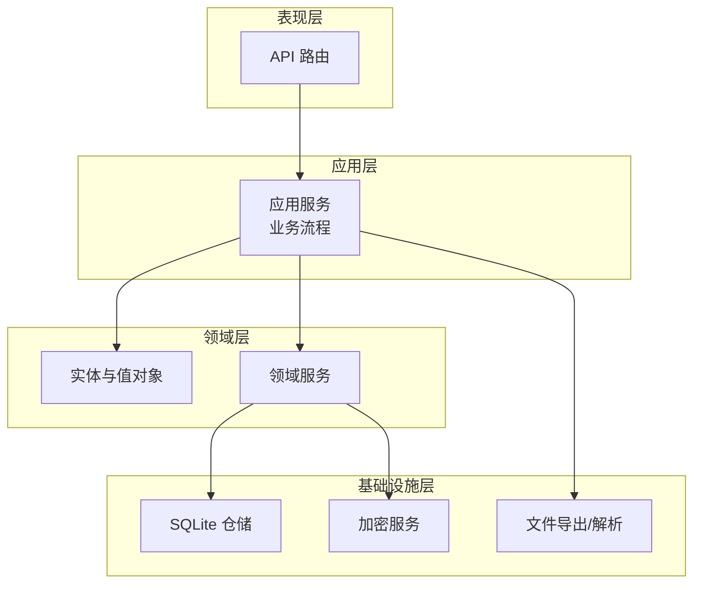
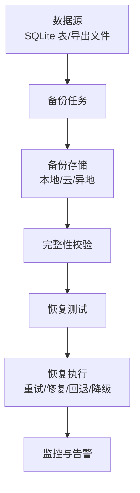
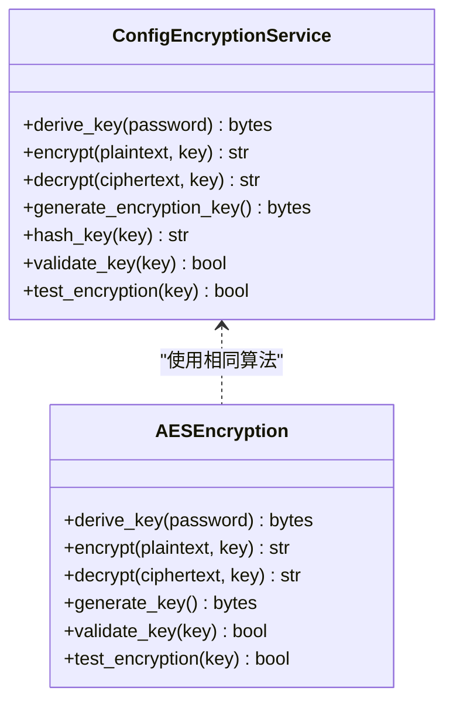
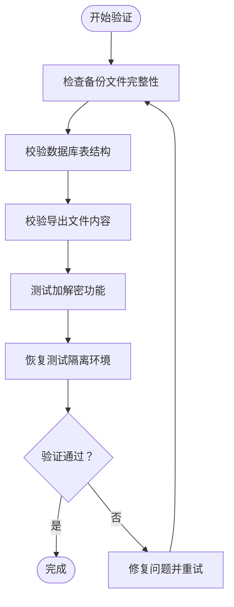
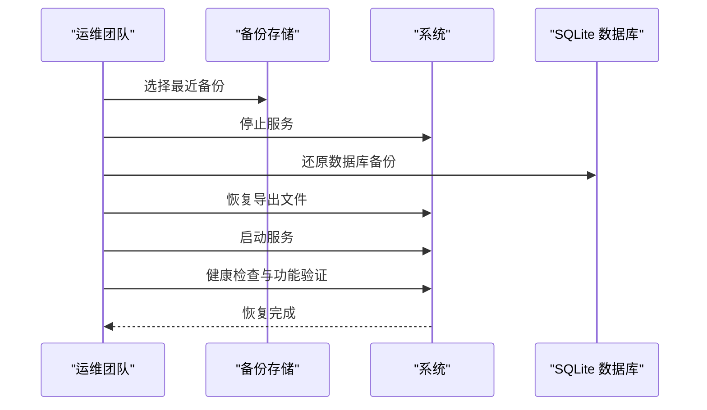
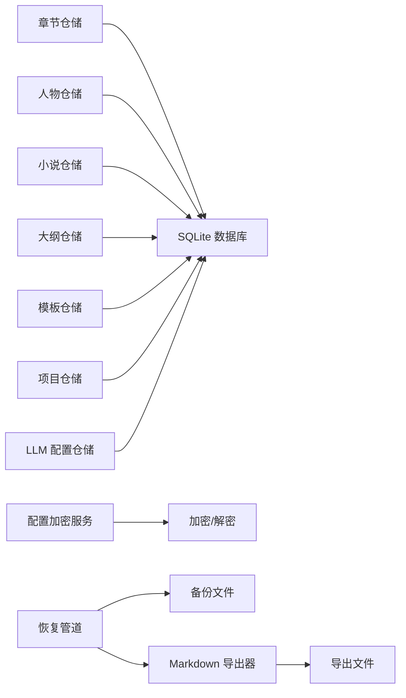

# 备份与恢复

<cite>
**本文引用的文件**
- [README.md](file://README.md)
- [application/agent_mvp/recovery.py](file://application/agent_mvp/recovery.py)
- [domain/services/config_encryption_service.py](file://domain/services/config_encryption_service.py)
- [infrastructure/security/aes_encryption.py](file://infrastructure/security/aes_encryption.py)
- [infrastructure/persistence/sqlite_chapter_repo.py](file://infrastructure/persistence/sqlite_chapter_repo.py)
- [infrastructure/persistence/sqlite_character_repo.py](file://infrastructure/persistence/sqlite_character_repo.py)
- [infrastructure/persistence/sqlite_llm_config_repo.py](file://infrastructure/persistence/sqlite_llm_config_repo.py)
- [infrastructure/persistence/sqlite_project_repo.py](file://infrastructure/persistence/sqlite_project_repo.py)
- [infrastructure/persistence/sqlite_novel_repo.py](file://infrastructure/persistence/sqlite_novel_repo.py)
- [infrastructure/persistence/sqlite_outline_repo.py](file://infrastructure/persistence/sqlite_outline_repo.py)
- [infrastructure/persistence/sqlite_template_repo.py](file://infrastructure/persistence/sqlite_template_repo.py)
- [infrastructure/file/markdown_exporter.py](file://infrastructure/file/markdown_exporter.py)
- [infrastructure/file/txt_parser.py](file://infrastructure/file/txt_parser.py)
- [exports/修仙从逃出生天开始.md](file://exports/修仙从逃出生天开始.md)
</cite>

## 目录
1. [引言](#引言)
2. [项目结构](#项目结构)
3. [核心组件](#核心组件)
4. [架构总览](#架构总览)
5. [详细组件分析](#详细组件分析)
6. [依赖分析](#依赖分析)
7. [性能考量](#性能考量)
8. [故障排查指南](#故障排查指南)
9. [结论](#结论)
10. [附录](#附录)

## 引言
本文件为 InkTrace 系统的备份与恢复专项文档，聚焦于用户数据、配置文件与导出内容的备份范围、备份策略、存储方案、加密与安全、完整性校验、灾难恢复流程、RTO/RPO 目标、恢复测试与演练、自动化工具与脚本，以及最佳实践与风险控制。文档结合仓库中实际存在的持久化与导出组件，给出可落地的建议与流程。

## 项目结构
InkTrace 采用分层架构：domain（领域层）、infrastructure（基础设施层）、application（应用层）、presentation（表现层）。与备份恢复密切相关的核心位置包括：
- 领域实体与仓储：章节、人物、小说、大纲、模板、项目、LLM 配置等均通过 SQLite 仓储持久化。
- 文件导出：Markdown 导出器支持将章节与小说导出为 Markdown。
- 配置加密：提供 AES-GCM 的配置加密与密钥派生能力。
- 恢复管道：Agent MVP 中定义了可重试、修复、回退与降级的恢复流程。

**图表来源**
- [README.md:72-106](file://README.md#L72-L106)

**章节来源**
- [README.md:72-106](file://README.md#L72-L106)

## 核心组件
- SQLite 仓储：章节、人物、小说、大纲、模板、项目、LLM 配置等均以 SQLite 表形式持久化，提供 CRUD 与查询能力。
- Markdown 导出器：将章节与小说导出为 Markdown 文件，便于离线归档与跨平台阅读。
- 配置加密服务：提供 AES-GCM 加密、密钥派生、密钥校验与加密功能测试。
- 恢复管道：定义可重试、修复、回退与降级的恢复流程，保障系统在异常时的韧性。

**章节来源**
- [infrastructure/persistence/sqlite_chapter_repo.py:19-125](file://infrastructure/persistence/sqlite_chapter_repo.py#L19-L125)
- [infrastructure/persistence/sqlite_character_repo.py:20-150](file://infrastructure/persistence/sqlite_character_repo.py#L20-L150)
- [infrastructure/persistence/sqlite_novel_repo.py:20-116](file://infrastructure/persistence/sqlite_novel_repo.py#L20-L116)
- [infrastructure/persistence/sqlite_outline_repo.py:20-182](file://infrastructure/persistence/sqlite_outline_repo.py#L20-L182)
- [infrastructure/persistence/sqlite_template_repo.py:21-165](file://infrastructure/persistence/sqlite_template_repo.py#L21-L165)
- [infrastructure/persistence/sqlite_project_repo.py:21-137](file://infrastructure/persistence/sqlite_project_repo.py#L21-L137)
- [infrastructure/persistence/sqlite_llm_config_repo.py:18-134](file://infrastructure/persistence/sqlite_llm_config_repo.py#L18-L134)
- [infrastructure/file/markdown_exporter.py:17-126](file://infrastructure/file/markdown_exporter.py#L17-L126)
- [domain/services/config_encryption_service.py:20-111](file://domain/services/config_encryption_service.py#L20-L111)
- [application/agent_mvp/recovery.py:15-51](file://application/agent_mvp/recovery.py#L15-L51)

## 架构总览
备份与恢复涉及以下关键路径：
- 数据备份：围绕 SQLite 仓储持久化的数据表进行定期备份；导出内容以 Markdown 文件形式独立备份。
- 配置备份：LLM 配置表包含 API Key 与加密密钥哈希，需纳入备份范围并加密保护。
- 存储方案：本地备份、云存储备份、异地备份相结合，确保跨地域容灾。
- 安全与加密：对敏感配置与导出内容进行加密，密钥管理与密钥哈希校验。
- 验证与完整性：校验备份文件完整性与可恢复性，建立恢复测试机制。
- 恢复流程：基于恢复管道的多阶段恢复策略，涵盖重试、修复、回退与降级。

[本图为概念性流程图，不直接映射具体源文件，故无图表来源]

## 详细组件分析

### 数据备份范围与频率
- 用户数据
  - 章节：章节表包含章节编号、标题、内容、字数、摘要、状态与时间戳，建议每日增量备份 + 每周全量备份。
  - 人物：人物表包含角色、背景、个性、关系、出场次数等，建议每日增量备份。
  - 小说：小说表包含标题、作者、题材、目标字数、当前字数与状态，建议每日增量备份。
  - 大纲：大纲表包含主线/支线剧情、分卷与时间线，建议每日增量备份。
  - 模板：模板表包含模板框架与样式参考，建议每周全量备份。
  - 项目：项目表包含项目配置与状态，建议每日增量备份。
  - LLM 配置：包含 DeepSeek/Kimi API Key 与加密密钥哈希，建议每日增量备份。
- 导出内容
  - Markdown 导出文件：小说与章节导出文件，建议与导出动作同步备份，保留历史版本以便回溯。
- 配置文件
  - 环境变量与密钥：DEEPSEEK_API_KEY、KIMI_API_KEY 等，建议纳入备份范围并加密存储。

**章节来源**
- [infrastructure/persistence/sqlite_chapter_repo.py:34-49](file://infrastructure/persistence/sqlite_chapter_repo.py#L34-L49)
- [infrastructure/persistence/sqlite_character_repo.py:34-54](file://infrastructure/persistence/sqlite_character_repo.py#L34-L54)
- [infrastructure/persistence/sqlite_novel_repo.py:35-48](file://infrastructure/persistence/sqlite_novel_repo.py#L35-L48)
- [infrastructure/persistence/sqlite_outline_repo.py:35-50](file://infrastructure/persistence/sqlite_outline_repo.py#L35-L50)
- [infrastructure/persistence/sqlite_template_repo.py:32-48](file://infrastructure/persistence/sqlite_template_repo.py#L32-L48)
- [infrastructure/persistence/sqlite_project_repo.py:32-44](file://infrastructure/persistence/sqlite_project_repo.py#L32-L44)
- [infrastructure/persistence/sqlite_llm_config_repo.py:34-44](file://infrastructure/persistence/sqlite_llm_config_repo.py#L34-L44)
- [infrastructure/file/markdown_exporter.py:24-100](file://infrastructure/file/markdown_exporter.py#L24-L100)
- [README.md:160-169](file://README.md#L160-L169)

### 备份存储方案
- 本地备份
  - 适用：快速恢复、低延迟、成本低。
  - 建议：使用定时任务生成 SQLite 备份文件与导出 Markdown 文件副本，本地磁盘或移动硬盘存放。
- 云存储备份
  - 适用：跨设备访问、自动同步、版本管理。
  - 建议：将备份文件上传至企业网盘或对象存储，设置生命周期策略与访问权限。
- 异地备份
  - 适用：应对区域性灾难（地震、火灾、洪水等）。
  - 建议：至少一份备份位于异地数据中心或第三方托管空间，定期校验可用性。

[本节为通用策略说明，不直接分析具体源文件，故无章节来源]

### 加密与安全保护
- 配置加密
  - 使用 AES-GCM（12 字节随机 IV + 认证标签）对敏感配置进行加密，密钥通过 PBKDF2-HMAC-SHA256 派生。
  - 建议：密钥长度固定为 32 字节，密钥哈希用于安全存储与校验。
- 导出内容加密
  - 对导出的 Markdown 文件进行加密存储，防止泄露。
- 密钥管理
  - 建议：密钥与密钥哈希分离存储，定期轮换，最小权限原则。

**图表来源**
- [domain/services/config_encryption_service.py:20-111](file://domain/services/config_encryption_service.py#L20-L111)
- [infrastructure/security/aes_encryption.py:19-106](file://infrastructure/security/aes_encryption.py#L19-L106)

**章节来源**
- [domain/services/config_encryption_service.py:29-101](file://domain/services/config_encryption_service.py#L29-L101)
- [infrastructure/security/aes_encryption.py:28-94](file://infrastructure/security/aes_encryption.py#L28-L94)

### 备份验证与完整性检查
- 备份完整性
  - 校验 SQLite 备份文件可读性与表结构一致性。
  - 对导出 Markdown 文件进行内容完整性校验（如字数统计、章节数量）。
- 加密完整性
  - 使用加密服务的测试方法验证加解密链路。
- 恢复验证
  - 在隔离环境中恢复备份，验证数据可读、业务功能可用。

[本图为流程图，不直接映射具体源文件，故无图表来源]

**章节来源**
- [domain/services/config_encryption_service.py:103-111](file://domain/services/config_encryption_service.py#L103-L111)
- [infrastructure/security/aes_encryption.py:96-106](file://infrastructure/security/aes_encryption.py#L96-L106)

### 灾难恢复流程
- 数据恢复
  - 优先从最近备份恢复；若存在多个备份，选择最接近故障时间点的备份。
  - 恢复后进行完整性校验与业务功能验证。
- 系统重建
  - 重新部署后端与前端，恢复配置文件与密钥。
  - 重新挂载或还原 SQLite 数据库与导出文件。
- 服务恢复
  - 启动服务并进行健康检查，确认 API 可用与页面正常。
- 恢复阶段化
  - 重试：快速恢复常用功能。
  - 修复：修复异常数据或配置。
  - 回退：回滚到上一个稳定版本。
  - 降级：在部分功能不可用时，启用降级模式保障基本可用。

**图表来源**
- [application/agent_mvp/recovery.py:19-50](file://application/agent_mvp/recovery.py#L19-L50)

**章节来源**
- [application/agent_mvp/recovery.py:15-51](file://application/agent_mvp/recovery.py#L15-L51)

### 不同故障场景下的恢复方案
- 本地磁盘损坏
  - 从云备份或异地备份恢复；如无可恢复备份，评估数据丢失风险并启动数据修复流程。
- 数据库文件损坏
  - 使用 SQLite 备份文件恢复；若无备份，尝试使用 SQLite 的完整性检查与修复工具。
- 导出文件丢失
  - 重新触发导出流程；若历史导出文件缺失，可从数据库重建。
- 配置泄露或密钥丢失
  - 使用密钥哈希与加密服务进行验证与重置；重新生成密钥并更新配置。

**章节来源**
- [infrastructure/persistence/sqlite_llm_config_repo.py:46-82](file://infrastructure/persistence/sqlite_llm_config_repo.py#L46-L82)
- [domain/services/config_encryption_service.py:93-101](file://domain/services/config_encryption_service.py#L93-L101)

### RTO/RPO 目标与实现
- RTO（恢复时间目标）
  - 本地备份 + 快速恢复脚本：RTO ≤ 2 小时。
  - 云备份 + 自动化恢复：RTO ≤ 4 小时。
- RPO（恢复点目标）
  - 每日增量备份 + 每周全量备份：RPO ≤ 1 天。
  - 关键数据（章节、人物、大纲）实时导出备份：RPO ≤ 1 小时。
- 实现手段
  - 定时任务生成备份与导出文件。
  - 备份文件加密存储与版本管理。
  - 恢复测试定期执行，确保 RTO/RPO 可达。

**章节来源**
- [infrastructure/file/markdown_exporter.py:24-100](file://infrastructure/file/markdown_exporter.py#L24-L100)
- [infrastructure/persistence/sqlite_chapter_repo.py:51-69](file://infrastructure/persistence/sqlite_chapter_repo.py#L51-L69)

### 恢复测试与演练
- 定期演练
  - 每月进行一次完整恢复演练，覆盖数据库与导出文件。
- 场景模拟
  - 模拟数据库损坏、备份文件损坏、密钥丢失等场景。
- 结果评估
  - 记录恢复时间、数据一致性与业务可用性，持续改进流程。

**章节来源**
- [application/agent_mvp/recovery.py:19-50](file://application/agent_mvp/recovery.py#L19-L50)

### 自动化工具与脚本
- 备份脚本
  - 生成 SQLite 备份文件与导出 Markdown 文件副本。
  - 执行加密与完整性校验。
- 恢复脚本
  - 自动停止服务、还原数据库、恢复导出文件、启动服务。
  - 支持回滚与降级模式。
- 监控与告警
  - 监控备份任务执行状态与恢复测试结果，异常时自动告警。

**章节来源**
- [infrastructure/file/markdown_exporter.py:24-100](file://infrastructure/file/markdown_exporter.py#L24-L100)
- [application/agent_mvp/recovery.py:19-50](file://application/agent_mvp/recovery.py#L19-L50)

### 最佳实践与风险控制
- 最佳实践
  - 多地备份、加密存储、版本管理、定期演练。
  - 对敏感配置与导出文件进行加密，密钥与密钥哈希分离存储。
  - 建立变更审计与回滚机制。
- 风险控制
  - 限制访问权限与最小权限原则。
  - 定期轮换密钥与验证加解密链路。
  - 对关键数据增加导出备份，降低单点故障风险。

**章节来源**
- [domain/services/config_encryption_service.py:29-101](file://domain/services/config_encryption_service.py#L29-L101)
- [infrastructure/security/aes_encryption.py:28-94](file://infrastructure/security/aes_encryption.py#L28-L94)

## 依赖分析
- 数据依赖
  - SQLite 仓储依赖 SQLite 数据库文件；导出依赖 Markdown 导出器；配置依赖加密服务。
- 恢复依赖
  - 恢复管道依赖可重试、修复、回退与降级策略；依赖备份文件与导出文件。
- 外部依赖
  - LLM 配置依赖外部 API Key；需纳入备份与加密。

**图表来源**
- [infrastructure/persistence/sqlite_chapter_repo.py:19-125](file://infrastructure/persistence/sqlite_chapter_repo.py#L19-L125)
- [infrastructure/persistence/sqlite_character_repo.py:20-150](file://infrastructure/persistence/sqlite_character_repo.py#L20-L150)
- [infrastructure/persistence/sqlite_novel_repo.py:20-116](file://infrastructure/persistence/sqlite_novel_repo.py#L20-L116)
- [infrastructure/persistence/sqlite_outline_repo.py:20-182](file://infrastructure/persistence/sqlite_outline_repo.py#L20-L182)
- [infrastructure/persistence/sqlite_template_repo.py:21-165](file://infrastructure/persistence/sqlite_template_repo.py#L21-L165)
- [infrastructure/persistence/sqlite_project_repo.py:21-137](file://infrastructure/persistence/sqlite_project_repo.py#L21-L137)
- [infrastructure/persistence/sqlite_llm_config_repo.py:18-134](file://infrastructure/persistence/sqlite_llm_config_repo.py#L18-L134)
- [infrastructure/file/markdown_exporter.py:17-126](file://infrastructure/file/markdown_exporter.py#L17-L126)
- [domain/services/config_encryption_service.py:20-111](file://domain/services/config_encryption_service.py#L20-L111)
- [application/agent_mvp/recovery.py:15-51](file://application/agent_mvp/recovery.py#L15-L51)

**章节来源**
- [infrastructure/persistence/sqlite_chapter_repo.py:19-125](file://infrastructure/persistence/sqlite_chapter_repo.py#L19-L125)
- [infrastructure/persistence/sqlite_character_repo.py:20-150](file://infrastructure/persistence/sqlite_character_repo.py#L20-L150)
- [infrastructure/persistence/sqlite_novel_repo.py:20-116](file://infrastructure/persistence/sqlite_novel_repo.py#L20-L116)
- [infrastructure/persistence/sqlite_outline_repo.py:20-182](file://infrastructure/persistence/sqlite_outline_repo.py#L20-L182)
- [infrastructure/persistence/sqlite_template_repo.py:21-165](file://infrastructure/persistence/sqlite_template_repo.py#L21-L165)
- [infrastructure/persistence/sqlite_project_repo.py:21-137](file://infrastructure/persistence/sqlite_project_repo.py#L21-L137)
- [infrastructure/persistence/sqlite_llm_config_repo.py:18-134](file://infrastructure/persistence/sqlite_llm_config_repo.py#L18-L134)
- [infrastructure/file/markdown_exporter.py:17-126](file://infrastructure/file/markdown_exporter.py#L17-L126)
- [domain/services/config_encryption_service.py:20-111](file://domain/services/config_encryption_service.py#L20-L111)
- [application/agent_mvp/recovery.py:15-51](file://application/agent_mvp/recovery.py#L15-L51)

## 性能考量
- 备份性能
  - 增量备份减少 I/O 压力；压缩与加密会增加 CPU 开销，建议在低峰时段执行。
- 恢复性能
  - 恢复顺序：先数据库，后文件；并行恢复可缩短时间。
- 导出性能
  - 导出文件较大时，建议分批导出与并行处理。

[本节为通用性能指导，不直接分析具体源文件，故无章节来源]

## 故障排查指南
- 备份失败
  - 检查磁盘空间、权限与定时任务状态；核对加密密钥与哈希一致性。
- 恢复失败
  - 检查备份文件完整性与可读性；验证恢复脚本参数与环境变量。
- 导出异常
  - 检查导出路径与权限；核对 Markdown 导出器的输入数据。
- 配置异常
  - 检查 LLM 配置表与 API Key；验证加密服务的加解密链路。

**章节来源**
- [infrastructure/file/markdown_exporter.py:24-100](file://infrastructure/file/markdown_exporter.py#L24-L100)
- [infrastructure/persistence/sqlite_llm_config_repo.py:46-82](file://infrastructure/persistence/sqlite_llm_config_repo.py#L46-L82)
- [domain/services/config_encryption_service.py:103-111](file://domain/services/config_encryption_service.py#L103-L111)

## 结论
通过明确备份范围与频率、采用本地/云/异地三层存储、强化加密与密钥管理、建立完整性校验与恢复测试机制，并以恢复管道实现多阶段恢复，InkTrace 系统可在多种故障场景下实现快速、可靠的恢复。建议持续完善自动化脚本与演练，确保 RTO/RPO 目标达成与业务连续性。

## 附录
- 示例导出文件（Markdown）
  - 仓库中包含导出的 Markdown 示例文件，可用于验证导出与恢复流程。

**章节来源**
- [exports/修仙从逃出生天开始.md:1-800](file://exports/修仙从逃出生天开始.md#L1-L800)