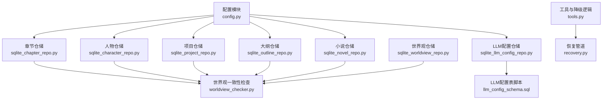
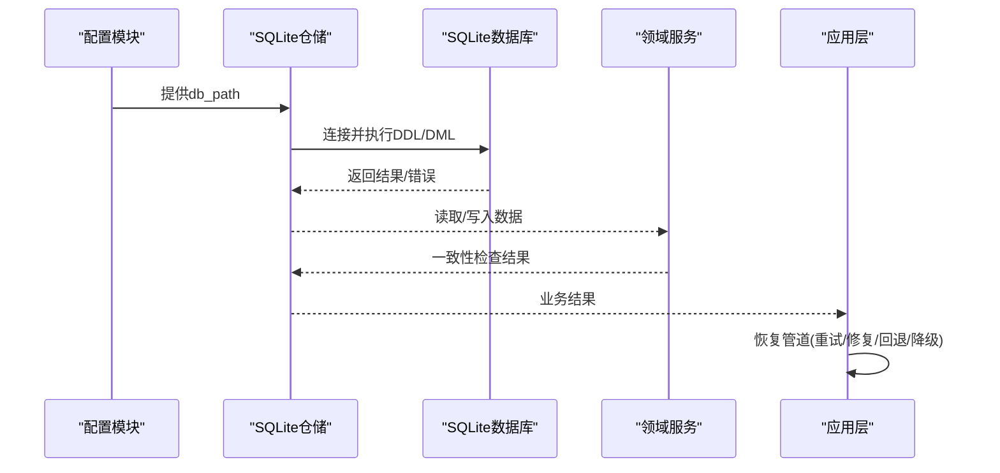
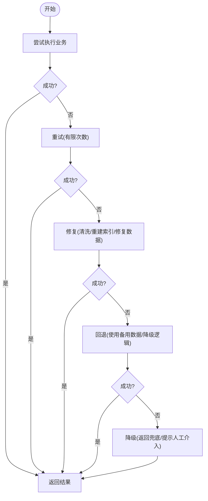
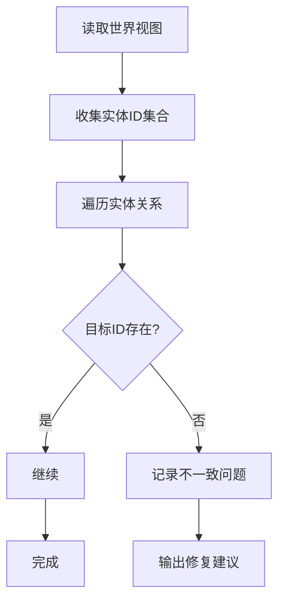

# 数据库维护

<cite>
**本文引用的文件**
- [config.py](file://config.py)
- [sqlite_chapter_repo.py](file://infrastructure/persistence/sqlite_chapter_repo.py)
- [sqlite_character_repo.py](file://infrastructure/persistence/sqlite_character_repo.py)
- [sqlite_project_repo.py](file://infrastructure/persistence/sqlite_project_repo.py)
- [sqlite_outline_repo.py](file://infrastructure/persistence/sqlite_outline_repo.py)
- [sqlite_novel_repo.py](file://infrastructure/persistence/sqlite_novel_repo.py)
- [sqlite_llm_config_repo.py](file://infrastructure/persistence/sqlite_llm_config_repo.py)
- [llm_config_schema.sql](file://infrastructure/persistence/llm_config_schema.sql)
- [sqlite_worldview_repo.py](file://infrastructure/persistence/sqlite_worldview_repo.py)
- [recovery.py](file://application/agent_mvp/recovery.py)
- [tools.py](file://application/agent_mvp/tools.py)
- [worldview_checker.py](file://domain/services/worldview_checker.py)
</cite>

## 目录
1. [简介](#简介)
2. [项目结构](#项目结构)
3. [核心组件](#核心组件)
4. [架构总览](#架构总览)
5. [详细组件分析](#详细组件分析)
6. [依赖分析](#依赖分析)
7. [性能考虑](#性能考虑)
8. [故障排查指南](#故障排查指南)
9. [结论](#结论)
10. [附录](#附录)

## 简介
本维护文档面向InkTrace数据库系统的运维与开发人员，聚焦SQLite数据库的部署与配置、备份与恢复、性能监控与优化、迁移与版本管理、健康检查与自愈机制、故障应急处理、数据完整性检查与修复、容量规划与扩容、安全配置与访问控制，以及最佳实践与常见问题解决方案。文档以代码库中的实际实现为依据，结合仓储层、配置层与领域服务，给出可落地的维护建议。

## 项目结构
InkTrace采用分层架构，数据库相关逻辑集中在基础设施层的SQLite仓储实现中，并通过应用配置集中管理数据库路径。关键目录与文件如下：
- 配置层：应用配置集中于配置模块，统一读取环境变量并提供默认值。
- 基础设施层：各实体的SQLite仓储实现，负责建表、CRUD与序列化。
- 领域服务：数据一致性检查与校验逻辑，辅助完整性维护。
- 应用层：具备重试与降级的恢复管道，提升系统韧性。

图表来源
- [config.py:14-46](file://config.py#L14-L46)
- [sqlite_chapter_repo.py:19-125](file://infrastructure/persistence/sqlite_chapter_repo.py#L19-L125)
- [sqlite_character_repo.py:20-150](file://infrastructure/persistence/sqlite_character_repo.py#L20-L150)
- [sqlite_project_repo.py:21-137](file://infrastructure/persistence/sqlite_project_repo.py#L21-L137)
- [sqlite_outline_repo.py:20-182](file://infrastructure/persistence/sqlite_outline_repo.py#L20-L182)
- [sqlite_novel_repo.py:20-116](file://infrastructure/persistence/sqlite_novel_repo.py#L20-L116)
- [sqlite_llm_config_repo.py:18-46](file://infrastructure/persistence/sqlite_llm_config_repo.py#L18-L46)
- [llm_config_schema.sql:1-31](file://infrastructure/persistence/llm_config_schema.sql#L1-L31)
- [sqlite_worldview_repo.py:325-454](file://infrastructure/persistence/sqlite_worldview_repo.py#L325-L454)
- [worldview_checker.py:79-160](file://domain/services/worldview_checker.py#L79-L160)
- [recovery.py:15-50](file://application/agent_mvp/recovery.py#L15-L50)
- [tools.py:87-118](file://application/agent_mvp/tools.py#L87-L118)

章节来源
- [config.py:14-46](file://config.py#L14-L46)
- [sqlite_chapter_repo.py:19-125](file://infrastructure/persistence/sqlite_chapter_repo.py#L19-L125)
- [sqlite_character_repo.py:20-150](file://infrastructure/persistence/sqlite_character_repo.py#L20-L150)
- [sqlite_project_repo.py:21-137](file://infrastructure/persistence/sqlite_project_repo.py#L21-L137)
- [sqlite_outline_repo.py:20-182](file://infrastructure/persistence/sqlite_outline_repo.py#L20-L182)
- [sqlite_novel_repo.py:20-116](file://infrastructure/persistence/sqlite_novel_repo.py#L20-L116)
- [sqlite_llm_config_repo.py:18-46](file://infrastructure/persistence/sqlite_llm_config_repo.py#L18-L46)
- [llm_config_schema.sql:1-31](file://infrastructure/persistence/llm_config_schema.sql#L1-L31)
- [sqlite_worldview_repo.py:325-454](file://infrastructure/persistence/sqlite_worldview_repo.py#L325-L454)
- [worldview_checker.py:79-160](file://domain/services/worldview_checker.py#L79-L160)
- [recovery.py:15-50](file://application/agent_mvp/recovery.py#L15-L50)
- [tools.py:87-118](file://application/agent_mvp/tools.py#L87-L118)

## 核心组件
- 应用配置与数据库路径
  - 配置模块提供默认数据库文件路径与从环境变量读取的能力，便于在不同运行环境中灵活指定数据库位置。
- SQLite仓储实现
  - 各实体仓储均在构造时执行建表逻辑，确保首次使用时表结构存在；使用连接池外的短连接模式，配合上下文管理器保证事务性与资源释放。
- LLM配置仓储与脚本
  - 提供LLM配置表的建表与索引定义，支持API密钥的加密存储与时间戳字段。
- 世界视图与一致性检查
  - 世界视图仓储支持复杂JSON字段的序列化与反序列化；领域服务提供关系一致性检查，辅助完整性维护。
- 恢复与降级机制
  - 应用层提供带重试、修复、回退与降级的恢复管道，增强数据库异常场景下的可用性。

章节来源
- [config.py:24](file://config.py#L24)
- [sqlite_chapter_repo.py:32-49](file://infrastructure/persistence/sqlite_chapter_repo.py#L32-L49)
- [sqlite_llm_config_repo.py:32-44](file://infrastructure/persistence/sqlite_llm_config_repo.py#L32-L44)
- [llm_config_schema.sql:5-19](file://infrastructure/persistence/llm_config_schema.sql#L5-L19)
- [sqlite_worldview_repo.py:325-454](file://infrastructure/persistence/sqlite_worldview_repo.py#L325-L454)
- [worldview_checker.py:79-160](file://domain/services/worldview_checker.py#L79-L160)
- [recovery.py:15-50](file://application/agent_mvp/recovery.py#L15-L50)

## 架构总览
下图展示数据库层与应用层之间的交互关系，以及关键的数据流与控制流。

图表来源
- [config.py:24](file://config.py#L24)
- [sqlite_chapter_repo.py:51-69](file://infrastructure/persistence/sqlite_chapter_repo.py#L51-L69)
- [sqlite_llm_config_repo.py:32-44](file://infrastructure/persistence/sqlite_llm_config_repo.py#L32-L44)
- [worldview_checker.py:79-160](file://domain/services/worldview_checker.py#L79-L160)
- [recovery.py:19-50](file://application/agent_mvp/recovery.py#L19-L50)

## 详细组件分析

### 组件A：数据库部署与配置
- 数据库文件位置
  - 默认路径由配置模块提供；可通过环境变量覆盖，便于容器化或多实例部署。
- 权限设置
  - 建议将数据库文件所在目录设置为仅管理员与运行用户可写，避免被非预期进程修改。
- 连接与事务
  - 仓储普遍使用短连接并在with块内提交，有助于减少锁竞争与资源泄漏风险。

章节来源
- [config.py:24](file://config.py#L24)
- [sqlite_chapter_repo.py:51-69](file://infrastructure/persistence/sqlite_chapter_repo.py#L51-L69)

### 组件B：备份策略与自动化
- 建议策略
  - 增量备份：基于WAL模式与时间戳增量导出变更记录。
  - 全量备份：定期生成数据库快照，保留多个历史版本。
  - 校验备份：对备份文件进行完整性校验与抽样恢复测试。
- 自动化脚本
  - 建议使用定时任务触发备份脚本，脚本需包含：
    - 锁定写入（如关闭写入接口或进入只读模式）。
    - 触发SQLite备份命令或复制数据库文件。
    - 校验备份文件完整性。
    - 清理过期备份。
    - 记录日志与告警。

[本节为通用运维建议，不直接分析具体文件，故无“章节来源”]

### 组件C：性能监控与优化
- 查询优化
  - 使用索引覆盖常用查询条件（如按novel_id、id、状态、时间戳等）。
  - 对高频排序与分页查询（如按number或updated_at）建立合适索引。
- 索引优化
  - 在章节、人物、项目、大纲、小说等表上为过滤与排序字段建立索引。
  - 对JSON字段的查询建议使用虚拟列+索引的方式（如需要）。
- I/O与并发
  - 控制并发写入峰值，必要时引入队列或批处理。
  - 调整SQLite页面大小与缓存参数（如需要）。
- 监控指标
  - 关注慢查询、锁等待、页读写次数、数据库文件大小增长趋势。

章节来源
- [sqlite_outline_repo.py:36-49](file://infrastructure/persistence/sqlite_outline_repo.py#L36-L49)
- [sqlite_chapter_repo.py:85-105](file://infrastructure/persistence/sqlite_chapter_repo.py#L85-L105)
- [sqlite_project_repo.py:58-81](file://infrastructure/persistence/sqlite_project_repo.py#L58-L81)

### 组件D：迁移与版本管理
- 版本化迁移
  - 将每次结构变更记录为独立SQL脚本，按版本号命名，包含前滚与回滚步骤。
- 执行顺序
  - 先执行DDL，再执行数据迁移，最后更新版本标记。
- 回滚策略
  - 保留备份与回滚脚本，确保可快速恢复到上一个稳定版本。
- 自动化
  - 在启动时检测当前版本并自动执行未执行的迁移脚本。

[本节为通用运维建议，不直接分析具体文件，故无“章节来源”]

### 组件E：健康检查与自愈
- 健康检查
  - 定期执行轻量查询（如SELECT 1）、检查数据库文件可读写、验证关键表存在性。
- 自愈机制
  - 结合恢复管道：重试失败请求、修复后重试、回退到备用方案、最终降级返回兜底结果。
  - 对数据库异常（连接失败、锁超时）进行分类处理与退避重试。

图表来源
- [recovery.py:19-50](file://application/agent_mvp/recovery.py#L19-L50)
- [tools.py:87-118](file://application/agent_mvp/tools.py#L87-L118)

章节来源
- [recovery.py:15-50](file://application/agent_mvp/recovery.py#L15-L50)
- [tools.py:87-118](file://application/agent_mvp/tools.py#L87-L118)

### 组件F：故障应急处理流程
- 快速定位
  - 查看最近日志与错误栈，确认是连接问题、锁冲突还是数据异常。
- 临时措施
  - 限制写入、开启只读模式、重启服务清理会话。
- 数据修复
  - 使用一致性检查工具识别问题，必要时回滚到最近备份。
- 恢复验证
  - 执行关键查询与导出校验，确认数据完整与性能达标。

[本节为通用运维建议，不直接分析具体文件，故无“章节来源”]

### 组件G：数据完整性检查与修复
- 一致性检查
  - 使用领域服务对人物、势力、地点等关系进行一致性校验，发现缺失或非法引用。
- 修复策略
  - 删除或修正非法关系；对缺失引用进行补全或清理。
- 预防措施
  - 在写入阶段增加前置校验，避免产生不一致数据。

图表来源
- [worldview_checker.py:79-160](file://domain/services/worldview_checker.py#L79-L160)

章节来源
- [worldview_checker.py:79-160](file://domain/services/worldview_checker.py#L79-L160)

### 组件H：容量规划与扩容策略
- 规划步骤
  - 统计当前数据量与增长趋势，评估索引与JSON字段占用。
  - 设定阈值（如数据库文件大小、查询延迟、锁等待），触发预警。
- 扩容策略
  - 读扩展：引入只读副本或外部索引服务。
  - 存储扩展：迁移到更大磁盘或使用分片（如按novel_id分区）。
  - 结构优化：拆分大表、清理历史数据、归档冷数据。

[本节为通用运维建议，不直接分析具体文件，故无“章节来源”]

### 组件I：安全配置与访问控制
- 最小权限原则
  - 数据库文件所在目录仅允许运行用户访问；避免共享账户。
- 加密与密钥
  - API密钥采用加密存储与哈希校验；定期轮换密钥。
- 网络与端口
  - 本地监听为主，避免暴露公网；如需远程访问，使用VPN或隧道。
- 审计与日志
  - 记录关键操作与异常事件，定期审计访问与变更。

章节来源
- [llm_config_schema.sql:7-14](file://infrastructure/persistence/llm_config_schema.sql#L7-L14)
- [sqlite_llm_config_repo.py:36-44](file://infrastructure/persistence/sqlite_llm_config_repo.py#L36-L44)

## 依赖分析
- 组件耦合
  - 仓储层依赖配置模块提供的db_path；领域服务依赖仓储读取数据；应用层通过恢复管道提升鲁棒性。
- 外部依赖
  - SQLite驱动；Python标准库sqlite3；JSON序列化用于复杂字段持久化。
- 循环依赖
  - 当前结构清晰，未见循环依赖迹象。

图表来源
- [config.py:24](file://config.py#L24)
- [sqlite_chapter_repo.py:51-69](file://infrastructure/persistence/sqlite_chapter_repo.py#L51-L69)
- [worldview_checker.py:79-160](file://domain/services/worldview_checker.py#L79-L160)
- [recovery.py:19-50](file://application/agent_mvp/recovery.py#L19-L50)

章节来源
- [config.py:24](file://config.py#L24)
- [sqlite_chapter_repo.py:51-69](file://infrastructure/persistence/sqlite_chapter_repo.py#L51-L69)
- [worldview_checker.py:79-160](file://domain/services/worldview_checker.py#L79-L160)
- [recovery.py:19-50](file://application/agent_mvp/recovery.py#L19-L50)

## 性能考虑
- 索引设计
  - 针对高频过滤与排序字段建立索引；避免过度索引导致写入性能下降。
- 查询模式
  - 使用参数化查询防止注入；尽量使用LIMIT与分页。
- JSON字段
  - 对频繁查询的JSON子字段，考虑拆分或添加派生列。
- 并发控制
  - 避免长事务；批量写入时合并提交。

[本节提供通用指导，不直接分析具体文件，故无“章节来源”]

## 故障排查指南
- 连接失败
  - 检查db_path是否存在与权限是否正确；确认SQLite驱动可用。
- 锁超时
  - 减少单次事务大小；拆分写入批次；检查是否有长时间查询阻塞。
- 数据异常
  - 使用一致性检查工具定位问题；必要时回滚到最近备份。
- 恢复管道
  - 观察重试/修复/回退/降级阶段的错误原因，针对性处理。

章节来源
- [sqlite_chapter_repo.py:51-69](file://infrastructure/persistence/sqlite_chapter_repo.py#L51-L69)
- [recovery.py:19-50](file://application/agent_mvp/recovery.py#L19-L50)

## 结论
InkTrace的数据库层以SQLite为核心，仓储实现遵循统一的建表与CRUD模式，结合配置模块与领域服务，形成可维护、可扩展的数据层。通过合理的索引策略、备份与恢复机制、健康检查与自愈流程，以及严格的安全与访问控制，可有效保障系统的稳定性与可靠性。建议在生产环境中持续监控性能与容量，定期演练备份与恢复流程，并将迁移与版本管理纳入标准化流程。

## 附录
- 关键文件清单
  - 配置：config.py
  - 仓储：sqlite_chapter_repo.py、sqlite_character_repo.py、sqlite_project_repo.py、sqlite_outline_repo.py、sqlite_novel_repo.py、sqlite_llm_config_repo.py、sqlite_worldview_repo.py
  - 脚本：llm_config_schema.sql
  - 领域服务：worldview_checker.py
  - 应用层：recovery.py、tools.py

[本节为概览性内容，不直接分析具体文件，故无“章节来源”]