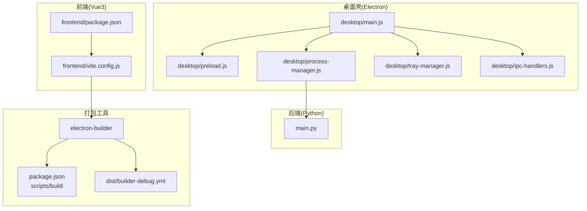
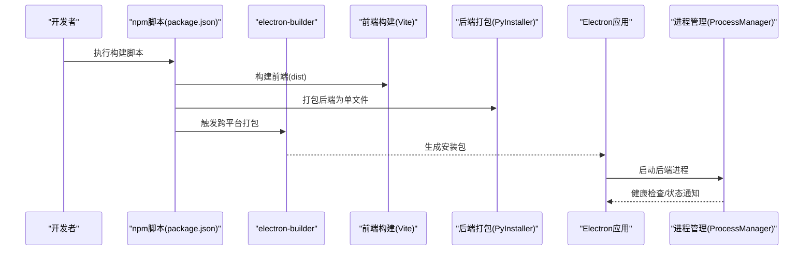
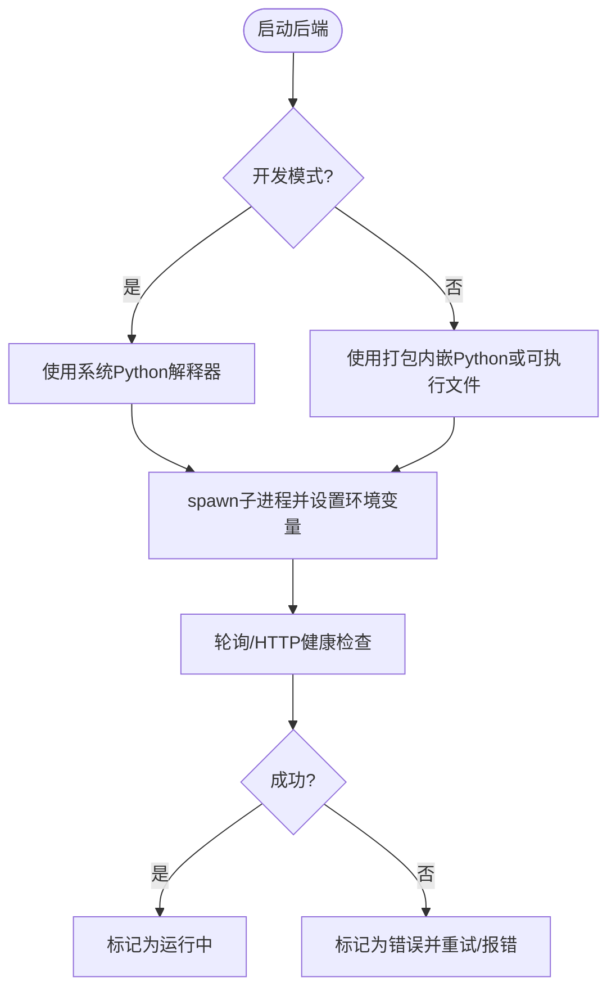
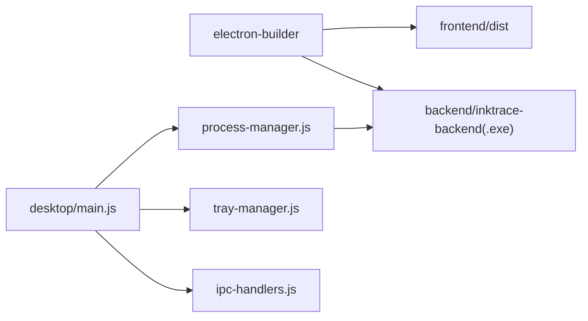

# 桌面应用打包

<cite>
**本文引用的文件**
- [package.json](file://package.json)
- [build-desktop.bat](file://build-desktop.bat)
- [desktop/main.js](file://desktop/main.js)
- [desktop/preload.js](file://desktop/preload.js)
- [desktop/process-manager.js](file://desktop/process-manager.js)
- [desktop/tray-manager.js](file://desktop/tray-manager.js)
- [desktop/ipc-handlers.js](file://desktop/ipc-handlers.js)
- [frontend/package.json](file://frontend/package.json)
- [frontend/vite.config.js](file://frontend/vite.config.js)
- [main.py](file://main.py)
- [dist/builder-debug.yml](file://dist/builder-debug.yml)
- [README.md](file://README.md)
</cite>

## 目录
1. [简介](#简介)
2. [项目结构](#项目结构)
3. [核心组件](#核心组件)
4. [架构总览](#架构总览)
5. [详细组件分析](#详细组件分析)
6. [依赖分析](#依赖分析)
7. [性能考虑](#性能考虑)
8. [故障排查指南](#故障排查指南)
9. [结论](#结论)
10. [附录](#附录)

## 简介
本文件面向InkTrace桌面应用的打包与发布，围绕Electron应用的打包流程、构建脚本使用、多平台构建策略、应用签名与公证、图标与安装包配置、更新机制、asar与资源优化、安装包制作方法、自动更新配置、应用权限与沙箱、常见问题与CI/CD自动化等方面进行系统化说明。文档内容严格基于仓库现有配置与源码，确保可操作性与准确性。

## 项目结构
InkTrace采用前后端分离的桌面应用架构：
- 前端：Vue3 + Vite，产物输出至frontend/dist
- 后端：Python FastAPI，通过PyInstaller打包为独立可执行文件
- 桌面壳：Electron，负责窗口、托盘、IPC通信与后端进程管理
- 构建：通过npm脚本与electron-builder完成跨平台打包

图表来源
- [package.json:8-18](file://package.json#L8-L18)
- [frontend/package.json:6-10](file://frontend/package.json#L6-L10)
- [frontend/vite.config.js:22-26](file://frontend/vite.config.js#L22-L26)
- [desktop/main.js:130-141](file://desktop/main.js#L130-L141)
- [desktop/process-manager.js:21-102](file://desktop/process-manager.js#L21-L102)
- [dist/builder-debug.yml:1-226](file://dist/builder-debug.yml#L1-L226)

章节来源
- [README.md:72-106](file://README.md#L72-L106)
- [package.json:20-76](file://package.json#L20-L76)
- [frontend/vite.config.js:1-28](file://frontend/vite.config.js#L1-L28)

## 核心组件
- 打包配置与脚本
  - npm脚本：提供跨平台构建入口，调用electron-builder
  - electron-builder配置：定义应用元数据、目标平台、安装包类型、资源拷贝等
- 进程管理
  - 后端进程启动、环境变量注入、健康检查、优雅停止与重启
- 窗口与托盘
  - 主窗口创建、开发/生产模式加载策略、托盘菜单与状态提示
- IPC通信
  - 预加载桥接暴露API，IPC处理器响应前端请求
- 前端构建
  - Vite构建输出到dist，代理指向本地后端端口
- 后端入口
  - Python入口文件启动FastAPI服务

章节来源
- [package.json:8-18](file://package.json#L8-L18)
- [package.json:20-76](file://package.json#L20-L76)
- [desktop/process-manager.js:13-218](file://desktop/process-manager.js#L13-L218)
- [desktop/main.js:21-74](file://desktop/main.js#L21-L74)
- [desktop/tray-manager.js:9-96](file://desktop/tray-manager.js#L9-L96)
- [desktop/ipc-handlers.js:9-50](file://desktop/ipc-handlers.js#L9-L50)
- [frontend/vite.config.js:1-28](file://frontend/vite.config.js#L1-L28)
- [main.py:11-22](file://main.py#L11-L22)

## 架构总览
下图展示桌面应用打包与运行的关键交互：

图表来源
- [package.json:8-18](file://package.json#L8-L18)
- [build-desktop.bat:10-27](file://build-desktop.bat#L10-L27)
- [frontend/vite.config.js:22-26](file://frontend/vite.config.js#L22-L26)
- [desktop/process-manager.js:21-102](file://desktop/process-manager.js#L21-L102)

## 详细组件分析

### 打包配置与脚本
- npm脚本
  - start：开发模式启动
  - build：调用electron-builder进行打包
  - build:win/mac/linux：指定平台打包
  - pack：生成目录形式的打包产物
- electron-builder配置要点
  - appId与productName：应用标识与显示名称
  - directories.output：输出目录
  - files与extraResources：控制打包包含的文件与额外资源（后端与前端dist）
  - 平台差异化配置
    - Windows：NSIS安装包，自定义图标与快捷方式行为
    - macOS：DMG镜像
    - Linux：AppImage
  - NSIS定制：支持多语言、静默升级、多用户安装等

章节来源
- [package.json:8-18](file://package.json#L8-L18)
- [package.json:20-76](file://package.json#L20-L76)
- [dist/builder-debug.yml:22-226](file://dist/builder-debug.yml#L22-L226)

### 前端构建与代理
- Vite配置
  - base: "./"，适配打包后相对路径
  - dev server代理：将/api转发到本地后端端口
  - build输出：dist目录，供Electron在生产模式加载
- npm脚本
  - 前端安装与构建在打包前执行

章节来源
- [frontend/vite.config.js:7-26](file://frontend/vite.config.js#L7-L26)
- [frontend/package.json:6-10](file://frontend/package.json#L6-L10)
- [build-desktop.bat:10-14](file://build-desktop.bat#L10-L14)

### 后端打包与运行
- 打包
  - 使用PyInstaller将Python入口打包为单文件可执行程序
  - 输出到backend目录，随安装包分发
- 运行
  - Electron主进程根据开发/生产模式选择不同的后端路径
  - 注入环境变量（端口、数据库路径、向量化存储目录等）
  - 通过健康检查确认后端可用

图表来源
- [desktop/process-manager.js:21-102](file://desktop/process-manager.js#L21-L102)
- [desktop/main.js:130-141](file://desktop/main.js#L130-L141)
- [main.py:15-22](file://main.py#L15-L22)

章节来源
- [build-desktop.bat:21-23](file://build-desktop.bat#L21-L23)
- [desktop/process-manager.js:34-49](file://desktop/process-manager.js#L34-L49)
- [desktop/main.js:133-135](file://desktop/main.js#L133-L135)

### 窗口与托盘
- 窗口
  - 开发模式加载本地3000端口，生产模式加载打包后的index.html
  - 启动时直接显示，避免白屏
- 托盘
  - 双击显示窗口，右键菜单包含显示/隐藏、重启后端、退出
  - 根据后端状态动态更新提示文本

章节来源
- [desktop/main.js:21-74](file://desktop/main.js#L21-L74)
- [desktop/tray-manager.js:16-92](file://desktop/tray-manager.js#L16-L92)

### IPC通信与预加载
- 预加载桥接
  - 暴露有限API给渲染进程，仅包含后端状态查询、重启、外部打开、文件定位、版本与路径查询
- IPC处理器
  - 提供后端状态查询、重启、外部链接打开、文件资源定位、应用版本与路径查询
  - 后端状态变更广播到所有窗口

章节来源
- [desktop/preload.js:9-24](file://desktop/preload.js#L9-L24)
- [desktop/ipc-handlers.js:9-50](file://desktop/ipc-handlers.js#L9-L50)

### 多平台构建策略
- Windows
  - NSIS安装包，支持自定义图标、桌面/开始菜单快捷方式、安装目录选择
- macOS
  - DMG镜像，使用icns图标
- Linux
  - AppImage，使用目录图标资源
- 平台差异化
  - 图标路径、安装包类型、快捷方式策略均在配置中明确

章节来源
- [package.json:47-75](file://package.json#L47-L75)

### 应用签名与公证
- Windows
  - 使用electron-builder的sign功能对生成的安装包或可执行文件进行数字签名
  - 在CI中配置代码签名证书与密码
- macOS
  - 使用electron-builder的osxSign/osxCertificates配置进行签名
  - 可选公证（notarize）以满足Gatekeeper要求
- Linux
  - AppImage通常不需要签名；如需，可使用通用签名工具
- 注意事项
  - 证书与密码应通过环境变量注入，避免硬编码
  - 签名与公证应在最终产物阶段执行

章节来源
- [package.json:20-76](file://package.json#L20-L76)

### 图标、安装包与更新机制
- 图标
  - Windows：ico格式
  - macOS：icns格式
  - Linux：目录图标
- 安装包
  - Windows：NSIS
  - macOS：DMG
  - Linux：AppImage
- 更新机制
  - electron-updater集成于Electron应用中，用于下载与安装新版本
  - 需要在构建配置中启用自动更新，并提供更新服务器地址
  - 发布时在更新服务器上放置最新版本清单与增量包

章节来源
- [package.json:56-75](file://package.json#L56-L75)

### asar打包与资源优化
- asar
  - electron-builder默认将资源打包为asar归档，提升加载速度与安全性
  - 如需解包特定资源，可在extraResources中显式声明
- 资源优化
  - 前端dist使用相对路径，确保asar内正确加载
  - extraResources将后端与前端dist作为原生资源分发，减少二次打包成本

章节来源
- [package.json:26-46](file://package.json#L26-L46)
- [frontend/vite.config.js:7-26](file://frontend/vite.config.js#L7-L26)

### 不同平台下的安装包制作方法
- Windows
  - 使用npm run build:win生成NSIS安装包
  - 支持静默安装与多用户安装参数
- macOS
  - 使用npm run build:mac生成DMG镜像
  - 可配置.dmg背景图与窗口布局
- Linux
  - 使用npm run build:linux生成AppImage
  - 可配置图标与菜单项

章节来源
- [package.json:11-13](file://package.json#L11-L13)
- [package.json:68-75](file://package.json#L68-L75)

### 自动更新系统配置与实现
- 配置
  - 在electron-builder配置中启用自动更新
  - 指定更新服务器地址与发布通道
- 实现
  - 应用启动时检查更新
  - 下载完成后提示安装
  - 安装后重启应用
- 发布
  - 将新版本文件上传至更新服务器
  - 生成版本清单与校验信息

章节来源
- [package.json:20-76](file://package.json#L20-L76)

### 应用权限与沙箱配置
- 权限
  - 读写用户数据目录（数据库与向量化存储）
  - 访问本地后端端口
- 沙箱
  - 启用contextIsolation与禁用nodeIntegration，降低安全风险
  - 通过预加载桥接暴露必要API
- 最佳实践
  - 仅暴露最小必要API
  - 对外部链接打开进行白名单校验

章节来源
- [desktop/main.js:30-37](file://desktop/main.js#L30-L37)
- [desktop/preload.js:9-24](file://desktop/preload.js#L9-L24)

### CI/CD自动化打包方案
- 流水线步骤建议
  - 安装依赖：npm ci && pip install -r requirements.txt
  - 前端构建：npm run build
  - 后端打包：pyinstaller生成单文件
  - 应用打包：npm run build:win/mac/linux
  - 签名与公证：Windows签名、macOS公证
  - 上传发布：上传安装包与更新清单
- 环境变量
  - 代码签名证书与密码
  - 更新服务器凭据
- 缓存策略
  - 缓存node_modules与pip依赖，加速构建

章节来源
- [build-desktop.bat:10-27](file://build-desktop.bat#L10-L27)
- [package.json:8-18](file://package.json#L8-L18)

## 依赖分析
- 组件耦合
  - desktop/main.js依赖进程管理、托盘与IPC处理器
  - 进程管理依赖Python后端可执行文件与健康检查
  - electron-builder依赖前端dist与后端可执行文件
- 外部依赖
  - electron、electron-builder、PyInstaller、Vite、Python运行时

图表来源
- [package.json:26-46](file://package.json#L26-L46)
- [desktop/main.js:9-11](file://desktop/main.js#L9-L11)
- [desktop/process-manager.js:7-11](file://desktop/process-manager.js#L7-L11)

章节来源
- [package.json:26-46](file://package.json#L26-L46)
- [desktop/main.js:9-11](file://desktop/main.js#L9-L11)

## 性能考虑
- 前端资源
  - 使用Vite构建，开启产物清理与静态资源目录分离
- 进程管理
  - 后端进程优雅启动与停止，健康检查避免无效等待
- 打包体积
  - asar归档与extraResources原生分发，减少重复打包

章节来源
- [frontend/vite.config.js:22-26](file://frontend/vite.config.js#L22-L26)
- [desktop/process-manager.js:83-101](file://desktop/process-manager.js#L83-L101)
- [package.json:26-46](file://package.json#L26-L46)

## 故障排查指南
- 前端文件未找到
  - 现象：生产模式加载失败，弹出错误页面
  - 排查：确认frontend/dist已复制到resourcesPath/frontend
- 后端无法启动
  - 现象：健康检查超时或错误
  - 排查：检查后端可执行文件路径、环境变量、端口占用
- 托盘无响应
  - 现象：双击托盘无反应
  - 排查：确认托盘初始化与事件绑定
- 安装包无法运行
  - 现象：Windows弹出安全警告或无法启动
  - 排查：检查代码签名与公证状态

章节来源
- [desktop/main.js:76-128](file://desktop/main.js#L76-L128)
- [desktop/process-manager.js:173-214](file://desktop/process-manager.js#L173-L214)
- [desktop/tray-manager.js:45-47](file://desktop/tray-manager.js#L45-L47)
- [package.json:47-75](file://package.json#L47-L75)

## 结论
本文基于仓库现有配置与源码，系统梳理了InkTrace桌面应用的打包与发布流程，覆盖多平台构建、签名与公证、图标与安装包、更新机制、asar与资源优化、安装包制作、自动更新、权限与沙箱以及CI/CD自动化等关键环节。建议在实际落地时结合团队安全策略完善签名与公证流程，并在CI中统一管理环境变量与发布通道。

## 附录
- 快速参考
  - 构建前端：npm run build
  - 构建后端：pyinstaller --onefile main.py
  - 打包Windows：npm run build:win
  - 打包macOS：npm run build:mac
  - 打包Linux：npm run build:linux
- 关键路径
  - 前端dist：frontend/dist
  - 后端可执行：backend/inktrace-backend(.exe)
  - 打包输出：dist/

章节来源
- [frontend/package.json:6-10](file://frontend/package.json#L6-L10)
- [build-desktop.bat:21-23](file://build-desktop.bat#L21-L23)
- [package.json:11-13](file://package.json#L11-L13)
- [package.json:23-46](file://package.json#L23-L46)