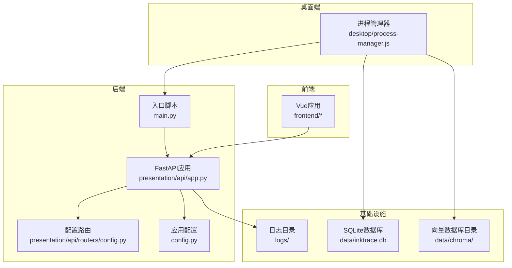
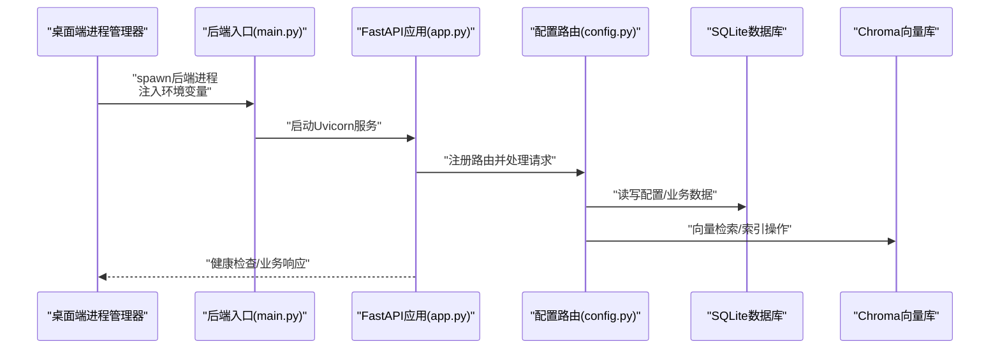
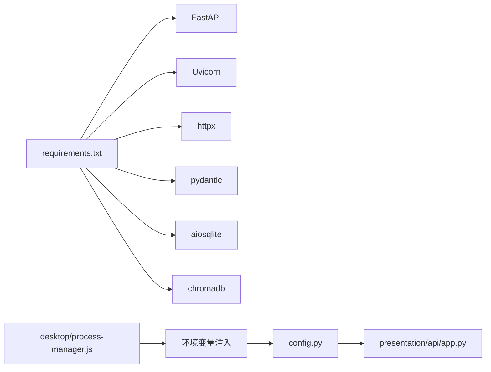

# 监控与日志管理

<cite>
**本文引用的文件**   
- [config.py](file://config.py)
- [main.py](file://main.py)
- [presentation/api/app.py](file://presentation/api/app.py)
- [presentation/api/routers/config.py](file://presentation/api/routers/config.py)
- [desktop/process-manager.js](file://desktop/process-manager.js)
- [requirements.txt](file://requirements.txt)
- [logs](file://logs)
</cite>

## 目录
1. [简介](#简介)
2. [项目结构](#项目结构)
3. [核心组件](#核心组件)
4. [架构总览](#架构总览)
5. [详细组件分析](#详细组件分析)
6. [依赖分析](#依赖分析)
7. [性能考虑](#性能考虑)
8. [故障排查指南](#故障排查指南)
9. [结论](#结论)
10. [附录](#附录)

## 简介
本文件面向InkTrace系统，提供一套完整的监控与日志管理方案。当前代码库未内置统一的日志框架或APM集成，本文在不改变现有实现的前提下，给出可落地的配置建议、分类策略、轮转与清理规则、性能指标采集与展示思路、告警配置、日志分析方法、分布式追踪与链路监控实践、监控仪表板设计与维护要点、监控数据备份与归档策略，以及安全加固措施。

## 项目结构
InkTrace采用前后端分离架构：后端基于FastAPI，前端基于Vue生态，桌面端通过Node.js进程管理器启动后端Python服务。日志目录为空，表明尚未启用统一日志输出与轮转。

图表来源
- [main.py:15-21](file://main.py#L15-L21)
- [presentation/api/app.py:19-62](file://presentation/api/app.py#L19-L62)
- [presentation/api/routers/config.py:52-69](file://presentation/api/routers/config.py#L52-L69)
- [config.py:30-45](file://config.py#L30-L45)
- [desktop/process-manager.js:30-66](file://desktop/process-manager.js#L30-L66)

章节来源
- [main.py:15-21](file://main.py#L15-L21)
- [presentation/api/app.py:19-62](file://presentation/api/app.py#L19-L62)
- [presentation/api/routers/config.py:52-69](file://presentation/api/routers/config.py#L52-L69)
- [config.py:30-45](file://config.py#L30-L45)
- [desktop/process-manager.js:30-66](file://desktop/process-manager.js#L30-L66)

## 核心组件
- 应用配置中心：集中管理主机、端口、调试模式、数据库路径等运行参数，并支持从环境变量注入。
- FastAPI应用：定义健康检查端点、CORS跨域策略及多组API路由。
- 桌面端进程管理：负责后端进程的启动、环境变量注入、端口与数据目录设置。
- 配置管理路由：提供LLM密钥的增删查改与连通性测试接口，涉及加密存储与解密流程。

章节来源
- [config.py:14-45](file://config.py#L14-L45)
- [presentation/api/app.py:19-62](file://presentation/api/app.py#L19-L62)
- [desktop/process-manager.js:30-66](file://desktop/process-manager.js#L30-L66)
- [presentation/api/routers/config.py:52-185](file://presentation/api/routers/config.py#L52-L185)

## 架构总览
下图展示从桌面端到后端、再到数据库与向量库的数据流与控制流，以及日志落盘位置。

图表来源
- [desktop/process-manager.js:30-66](file://desktop/process-manager.js#L30-L66)
- [main.py:15-21](file://main.py#L15-L21)
- [presentation/api/app.py:19-62](file://presentation/api/app.py#L19-L62)
- [presentation/api/routers/config.py:52-69](file://presentation/api/routers/config.py#L52-L69)

## 详细组件分析

### 日志系统配置与分类
- 访问日志
  - 建议：利用Uvicorn内置的access log输出至标准输出，结合容器或系统日志收集器统一采集。
  - 关键参数：host/port/debug由应用配置决定，便于在不同环境切换。
- 错误日志
  - 建议：捕获未处理异常并输出结构化错误日志，包含时间戳、请求ID、用户ID、trace_id、错误堆栈摘要等。
  - 当前现状：未见显式日志配置，需新增。
- 业务日志
  - 建议：围绕关键业务流程（如LLM配置变更、RAG检索、导出任务）输出结构化事件日志，便于审计与回放。
  - 当前现状：未见业务日志记录，需新增。

章节来源
- [config.py:14-45](file://config.py#L14-L45)
- [presentation/api/app.py:19-62](file://presentation/api/app.py#L19-L62)
- [presentation/api/routers/config.py:72-132](file://presentation/api/routers/config.py#L72-L132)

### 日志文件存储位置、轮转与清理
- 存储位置
  - 建议：将access log与业务日志统一输出到logs目录，便于集中采集与轮转。
  - 当前现状：logs目录为空，需创建并授权。
- 轮转策略
  - 建议：按大小轮转（如100MB）与按时间轮转（每日/每周）双触发，保留最近N份副本。
- 清理规则
  - 建议：保留最近30天内的日志，超过期限自动删除；错误日志单独保留90天以便审计。

章节来源
- [logs](file://logs)

### 性能监控指标采集与展示
- 关键指标
  - 响应时间：P50/P95/P99延迟
  - 吞吐量：QPS/每路由QPS
  - 错误率：HTTP 5xx比例、业务异常率
  - 资源占用：CPU、内存、磁盘IO、网络带宽
  - LLM调用：请求耗时、Token用量、失败次数
- 采集方式
  - 后端：在FastAPI中间件中埋点，记录请求开始/结束时间、状态码、路由、用户ID、trace_id等。
  - 前端：在API调用处记录请求耗时与错误。
  - 桌面端：记录后端进程启动耗时、健康检查耗时。
- 展示建议
  - 使用Grafana仪表板分维度展示：整体趋势、路由级对比、错误类型分布、资源使用峰值。

章节来源
- [presentation/api/app.py:19-62](file://presentation/api/app.py#L19-L62)
- [desktop/process-manager.js:204-213](file://desktop/process-manager.js#L204-L213)

### APM工具集成（Prometheus/Grafana）
- Prometheus
  - 暴露指标端点：新增metrics路由，导出自定义指标（计数器、直方图、摘要）。
  - 抓取配置：在Prometheus中配置抓取目标，按job分组（后端、桌面端）。
- Grafana
  - 创建仪表板：聚合Prometheus指标，添加告警面板、趋势图、热力图。
  - 变换与查询：使用PromQL进行聚合与比率计算，支持按trace_id过滤。

章节来源
- [presentation/api/app.py:54-61](file://presentation/api/app.py#L54-L61)

### 告警机制配置与通知渠道
- 告警规则
  - 响应时间：P95超阈值持续一段时间触发
  - 错误率：5xx比例超阈值
  - 资源：CPU/内存/磁盘使用率超阈值
  - LLM：失败率突增、平均耗时异常
- 通知渠道
  - 邮件、企业微信、钉钉机器人、Slack等。
- 告警抑制
  - 同一周期内同类告警合并发送，避免风暴。

章节来源
- [presentation/api/app.py:54-61](file://presentation/api/app.py#L54-L61)

### 日志分析与故障排查方法论
- 方法论
  - 时间线定位：以trace_id串联请求链路，快速定位异常节点。
  - 分层排查：先看上游（LLM/向量库），再看下游（数据库/文件系统）。
  - 回归验证：复现最小化场景，验证修复效果。
- 工具建议
  - 日志收集：Filebeat/Fluent Bit
  - 存储：Elasticsearch/OpenSearch
  - 查询：Kibana/Quickwit
  - 可视化：Grafana + 日志面板

章节来源
- [presentation/api/routers/config.py:72-132](file://presentation/api/routers/config.py#L72-L132)

### 分布式追踪与链路监控
- 追踪ID生成
  - 建议：在FastAPI中间件中生成/透传trace_id，贯穿所有服务调用。
- 链路数据
  - 建议：记录每个子调用的开始/结束时间、状态、参数摘要、返回摘要。
- 可视化
  - 建议：在Grafana中引入OpenTelemetry/Jaeger面板，展示调用树与耗时分布。

章节来源
- [presentation/api/app.py:19-62](file://presentation/api/app.py#L19-L62)

### 监控仪表板设计与维护
- 设计原则
  - 分层：系统层（资源）、应用层（路由/指标）、业务层（LLM/导出/检索）。
  - 分场景：开发、预发、生产三套仪表板，权限隔离。
- 维护策略
  - 定期评审：根据业务增长调整阈值与指标口径。
  - 版本化：仪表板JSON导出，纳入版本管理。

章节来源
- [presentation/api/app.py:19-62](file://presentation/api/app.py#L19-L62)

### 监控数据备份与归档策略
- 备份
  - 指标数据：Prometheus WAL定期快照，远端存储到S3/对象存储。
  - 日志数据：Elasticsearch索引快照到对象存储。
- 归档
  - 90天内热数据，90-365天温数据，一年以上冷数据归档。
  - 自动清理：到期自动删除或降阶存储。

章节来源
- [requirements.txt:1-10](file://requirements.txt#L1-L10)

### 安全加固措施
- 密钥与敏感信息
  - 当前：LLM密钥在配置服务中进行对称加密存储，需确保密钥材料安全。
  - 建议：使用KMS/HSM派生密钥，限制密钥访问权限，定期轮换。
- 网络与访问
  - CORS已允许所有来源，建议在生产关闭“*”，改为白名单域名。
  - 健康检查端点暴露在公网需谨慎，建议仅限内网访问。
- 日志安全
  - 敏感字段脱敏（如API Key、用户隐私），禁止将明文写入日志。
  - 日志传输与存储加密，访问日志仅授权人员可见。

章节来源
- [presentation/api/app.py:27-33](file://presentation/api/app.py#L27-L33)
- [presentation/api/routers/config.py:19-36](file://presentation/api/routers/config.py#L19-L36)

## 依赖分析
- 运行时依赖
  - FastAPI/Uvicorn：提供Web服务与健康检查端点。
  - httpx/pydantic：提供HTTP客户端与数据校验能力。
  - aiosqlite/chromadb：提供异步数据库与向量检索能力。
- 进程与环境
  - 桌面端通过环境变量控制后端行为（host/port/db_path/debug），确保部署一致性。

图表来源
- [requirements.txt:1-10](file://requirements.txt#L1-10)
- [desktop/process-manager.js:40-49](file://desktop/process-manager.js#L40-L49)
- [config.py:30-45](file://config.py#L30-L45)
- [presentation/api/app.py:19-62](file://presentation/api/app.py#L19-L62)

章节来源
- [requirements.txt:1-10](file://requirements.txt#L1-10)
- [desktop/process-manager.js:40-49](file://desktop/process-manager.js#L40-L49)
- [config.py:30-45](file://config.py#L30-L45)
- [presentation/api/app.py:19-62](file://presentation/api/app.py#L19-L62)

## 性能考虑
- 启动与健康检查
  - 桌面端在启动后端进程时进行健康检查，超时重试，避免前端长时间等待。
- 中间件与路由
  - 在FastAPI中间件中增加请求计时与错误统计，避免在业务路由中重复逻辑。
- 数据库与向量库
  - 对频繁查询建立索引，合理设置连接池大小；对向量库批量写入与查询进行限流。

章节来源
- [desktop/process-manager.js:204-213](file://desktop/process-manager.js#L204-L213)
- [presentation/api/app.py:19-62](file://presentation/api/app.py#L19-L62)

## 故障排查指南
- 快速定位
  - 使用trace_id串联请求链路，优先检查上游服务（LLM/向量库）。
- 常见问题
  - 500错误：查看后端异常日志，确认数据库/向量库可用性。
  - 超时：检查网络与资源使用，必要时扩容或限流。
  - 权限问题：核对CORS配置与密钥存储权限。
- 回归验证
  - 复现最小化场景，验证修复后指标恢复。

章节来源
- [presentation/api/routers/config.py:72-132](file://presentation/api/routers/config.py#L72-L132)
- [presentation/api/app.py:54-61](file://presentation/api/app.py#L54-L61)

## 结论
当前InkTrace具备良好的可监控基础（健康检查、路由分层、进程管理），但缺乏统一日志与APM集成。建议按本文方案分阶段落地：先完善日志与错误收集，再接入Prometheus/Grafana，最后补充分布式追踪与告警闭环。通过规范化的监控体系，可显著提升系统稳定性与可观测性。

## 附录
- 部署建议
  - 开发：开启debug，日志输出到stdout，便于本地查看。
  - 生产：关闭debug，启用access log与业务日志，配置轮转与清理。
- 运维建议
  - 指标与日志保留周期与容量规划需与业务规模匹配。
  - 定期演练故障恢复流程，确保监控告警有效。