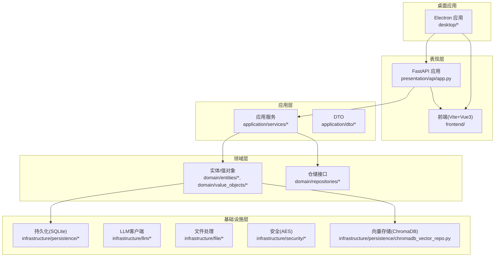
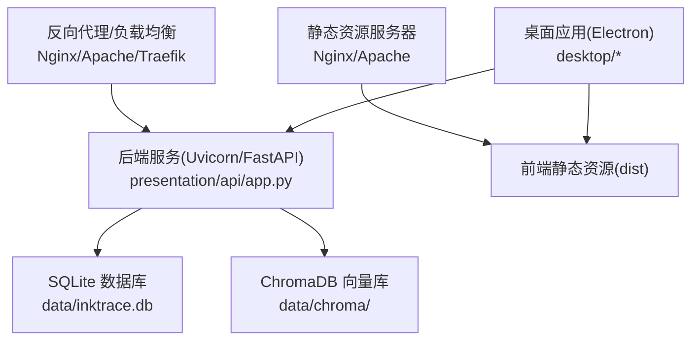
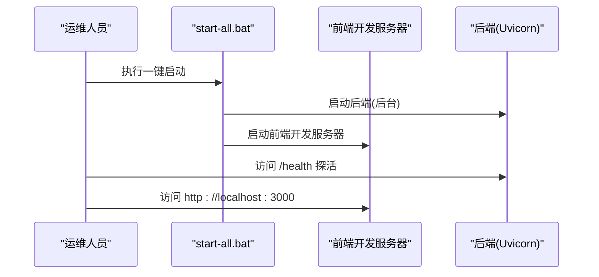
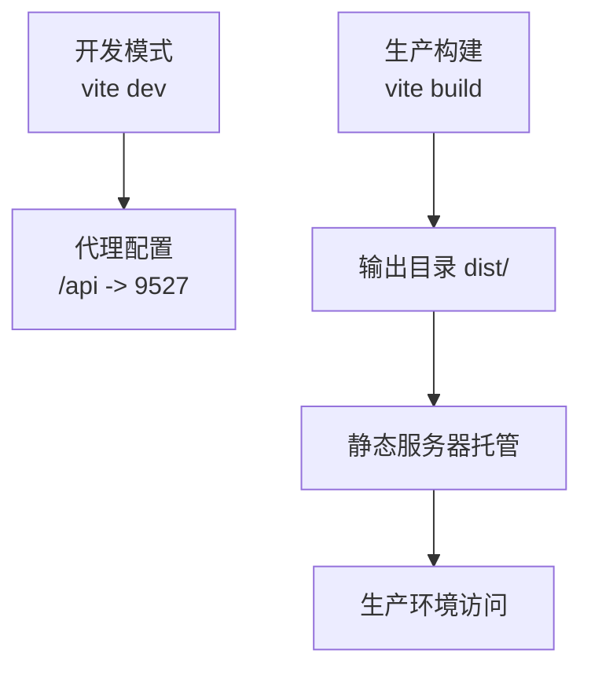
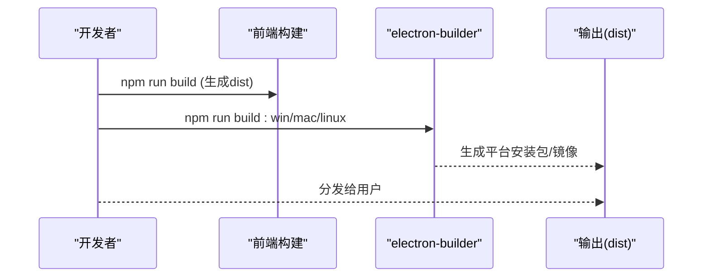
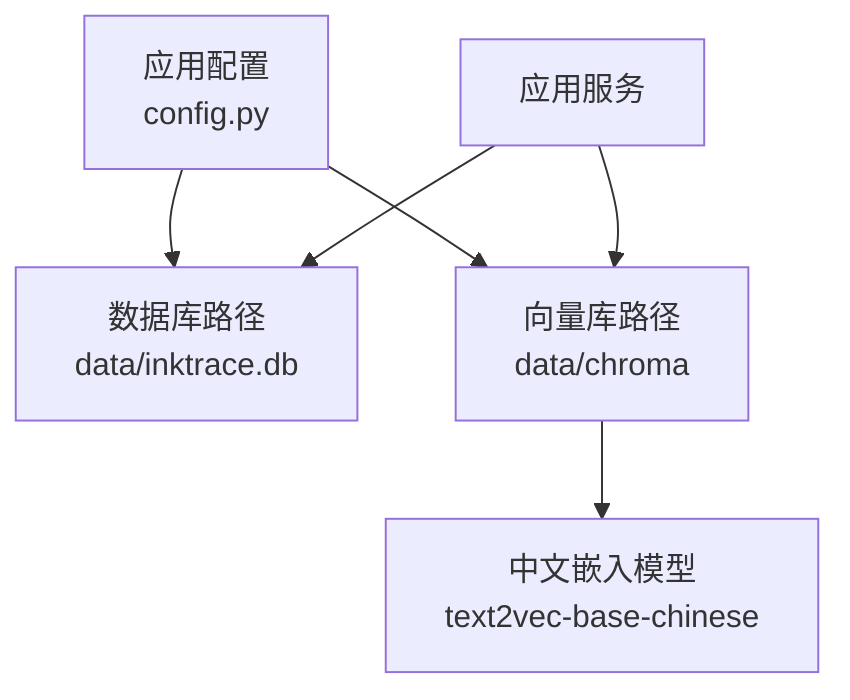
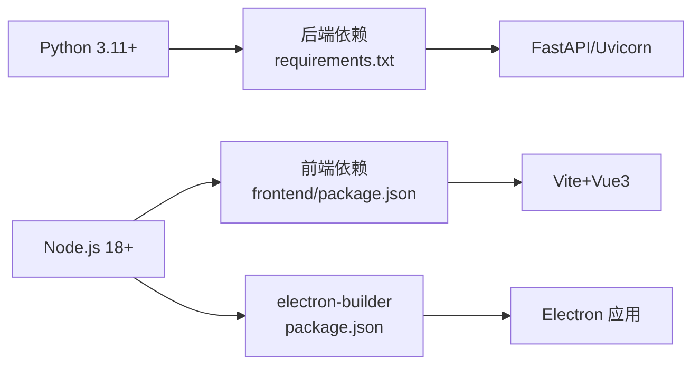

# 部署与运维

<cite>
**本文引用的文件**
- [README.md](file://README.md)
- [requirements.txt](file://requirements.txt)
- [package.json](file://package.json)
- [frontend/package.json](file://frontend/package.json)
- [frontend/vite.config.js](file://frontend/vite.config.js)
- [start.bat](file://start.bat)
- [start-all.bat](file://start-all.bat)
- [stop.bat](file://stop.bat)
- [build-desktop.bat](file://build-desktop.bat)
- [config.py](file://config.py)
- [main.py](file://main.py)
- [presentation/api/app.py](file://presentation/api/app.py)
- [presentation/api/routers/novel.py](file://presentation/api/routers/novel.py)
- [infrastructure/persistence/sqlite_llm_config_repo.py](file://infrastructure/persistence/sqlite_llm_config_repo.py)
- [infrastructure/persistence/chromadb_vector_repo.py](file://infrastructure/persistence/chromadb_vector_repo.py)
- [infrastructure/security/aes_encryption.py](file://infrastructure/security/aes_encryption.py)
- [scripts/run_agent_mvp.py](file://scripts/run_agent_mvp.py)
</cite>

## 目录
1. [简介](#简介)
2. [项目结构](#项目结构)
3. [核心组件](#核心组件)
4. [架构总览](#架构总览)
5. [详细组件分析](#详细组件分析)
6. [依赖分析](#依赖分析)
7. [性能考虑](#性能考虑)
8. [故障排查指南](#故障排查指南)
9. [结论](#结论)
10. [附录](#附录)

## 简介
本文件面向InkTrace项目的生产部署与运维，覆盖后端服务、前端应用、桌面应用、数据库与向量存储、监控与日志、备份恢复、性能与安全加固、以及运维脚本与自动化工具的使用指南。内容以仓库现有文件为依据，结合实际代码结构给出可操作的部署策略与运维建议。

## 项目结构
InkTrace采用分层架构：domain（领域层）、application（应用层）、infrastructure（基础设施层）、presentation（表现层），以及独立的desktop（桌面应用）与frontend（前端）。后端通过FastAPI提供REST API，前端使用Vite+Vue3开发，桌面应用基于Electron与electron-builder打包，数据库默认使用SQLite，向量检索使用ChromaDB持久化。

图表来源
- [presentation/api/app.py:19-66](file://presentation/api/app.py#L19-L66)
- [frontend/vite.config.js:1-28](file://frontend/vite.config.js#L1-L28)
- [infrastructure/persistence/chromadb_vector_repo.py:19-73](file://infrastructure/persistence/chromadb_vector_repo.py#L19-L73)
- [package.json:1-81](file://package.json#L1-L81)

章节来源
- [README.md:72-106](file://README.md#L72-L106)

## 核心组件
- 后端服务：基于FastAPI，通过Uvicorn运行，支持CORS跨域，提供健康检查端点。
- 前端应用：Vite开发服务器，代理到后端9527端口；生产构建输出至dist目录。
- 桌面应用：Electron应用，使用electron-builder进行多平台打包，内置后端与前端产物。
- 数据库与向量存储：SQLite用于业务数据，ChromaDB用于向量索引持久化。
- 安全组件：AES对称加密用于敏感配置的加解密。
- 运维脚本：Windows批处理脚本负责后端/前端/全量启动与停止，桌面应用构建脚本。

章节来源
- [presentation/api/app.py:19-66](file://presentation/api/app.py#L19-L66)
- [frontend/vite.config.js:13-27](file://frontend/vite.config.js#L13-L27)
- [package.json:8-19](file://package.json#L8-L19)
- [config.py:14-46](file://config.py#L14-L46)
- [infrastructure/persistence/chromadb_vector_repo.py:19-73](file://infrastructure/persistence/chromadb_vector_repo.py#L19-L73)
- [infrastructure/security/aes_encryption.py:19-106](file://infrastructure/security/aes_encryption.py#L19-L106)
- [start.bat:1-40](file://start.bat#L1-L40)
- [start-all.bat:1-50](file://start-all.bat#L1-L50)
- [stop.bat:1-31](file://stop.bat#L1-L31)
- [build-desktop.bat:1-35](file://build-desktop.bat#L1-L35)

## 架构总览
下图展示生产环境中的典型部署形态：反向代理/负载均衡前置，后端服务监听固定端口，桌面应用作为独立可执行程序分发，前端静态资源可由Nginx/Apache提供或内嵌于桌面应用。

图表来源
- [presentation/api/app.py:19-66](file://presentation/api/app.py#L19-L66)
- [frontend/vite.config.js:22-27](file://frontend/vite.config.js#L22-L27)
- [config.py:23-24](file://config.py#L23-L24)
- [infrastructure/persistence/chromadb_vector_repo.py:22-29](file://infrastructure/persistence/chromadb_vector_repo.py#L22-L29)

## 详细组件分析

### 后端服务部署与启动
- 环境要求
  - Python 3.11+，Node.js 18+（用于桌面应用构建与前端开发）
- 依赖安装
  - 后端：pip安装fastapi、uvicorn、httpx、pydantic、aiosqlite、chromadb、sentence-transformers等
  - 前端：在frontend目录执行npm install
- 环境变量
  - INKTRACE_HOST、INKTRACE_PORT、INKTRACE_DEBUG、INKTRACE_DB_PATH、DEEPSEEK_API_KEY、KIMI_API_KEY
- 启动方式
  - 单独启动后端：设置端口与主机，调用main.py启动Uvicorn
  - 一键启动：同时启动后端与前端，后台最小化运行
  - 停止：扫描端口9527，终止对应进程
- 健康检查
  - 提供根路径与/health端点，便于探活

图表来源
- [start-all.bat:30-39](file://start-all.bat#L30-L39)
- [presentation/api/app.py:54-61](file://presentation/api/app.py#L54-L61)
- [frontend/vite.config.js:13-21](file://frontend/vite.config.js#L13-L21)

章节来源
- [README.md:25-69](file://README.md#L25-L69)
- [requirements.txt:1-10](file://requirements.txt#L1-L10)
- [config.py:30-46](file://config.py#L30-L46)
- [main.py:15-22](file://main.py#L15-L22)
- [start.bat:11-39](file://start.bat#L11-L39)
- [start-all.bat:10-49](file://start-all.bat#L10-L49)
- [stop.bat:7-24](file://stop.bat#L7-L24)
- [presentation/api/app.py:54-61](file://presentation/api/app.py#L54-L61)

### 前端应用构建与部署
- 开发与预览
  - 开发服务器默认端口3000，通过代理转发/api到后端9527
- 生产构建
  - 输出目录dist，静态资源相对路径配置，避免CDN场景下的路径问题
- 部署建议
  - Nginx/Apache直接托管dist目录
  - 若与桌面应用集成，可将dist目录打包进应用资源

图表来源
- [frontend/vite.config.js:13-27](file://frontend/vite.config.js#L13-L27)
- [frontend/package.json:6-10](file://frontend/package.json#L6-L10)

章节来源
- [frontend/vite.config.js:13-27](file://frontend/vite.config.js#L13-L27)
- [frontend/package.json:6-10](file://frontend/package.json#L6-L10)

### 桌面应用打包与分发
- 技术栈
  - Electron + electron-builder
- 构建流程
  - 先构建前端dist，再安装electron-builder，最后按平台打包
  - extraResources将后端与前端产物打入最终包
- 平台与目标
  - Windows: nsis安装包
  - macOS: dmg镜像
  - Linux: AppImage
- 签名与发布
  - 建议在CI/CD中配置各平台签名证书，确保应用可信任分发

图表来源
- [build-desktop.bat:10-28](file://build-desktop.bat#L10-L28)
- [package.json:8-19](file://package.json#L8-L19)
- [package.json:20-76](file://package.json#L20-L76)

章节来源
- [build-desktop.bat:1-35](file://build-desktop.bat#L1-L35)
- [package.json:8-19](file://package.json#L8-L19)
- [package.json:20-76](file://package.json#L20-L76)

### 数据库与向量存储部署
- SQLite
  - 默认路径data/inktrace.db，可通过环境变量INKTRACE_DB_PATH调整
  - LLM配置仓储使用SQLite表llm_config存储密钥与时间戳
- ChromaDB
  - 默认持久化目录data/chroma，使用SentenceTransformer中文嵌入模型
  - 支持按novel_id/source_type过滤检索，提供增删改查与计数能力

图表来源
- [config.py:23-24](file://config.py#L23-L24)
- [config.py:39-39](file://config.py#L39-L39)
- [infrastructure/persistence/sqlite_llm_config_repo.py:34-48](file://infrastructure/persistence/sqlite_llm_config_repo.py#L34-L48)
- [infrastructure/persistence/chromadb_vector_repo.py:22-29](file://infrastructure/persistence/chromadb_vector_repo.py#L22-L29)
- [infrastructure/persistence/chromadb_vector_repo.py:64-72](file://infrastructure/persistence/chromadb_vector_repo.py#L64-L72)

章节来源
- [config.py:23-42](file://config.py#L23-L42)
- [infrastructure/persistence/sqlite_llm_config_repo.py:34-127](file://infrastructure/persistence/sqlite_llm_config_repo.py#L34-L127)
- [infrastructure/persistence/chromadb_vector_repo.py:19-270](file://infrastructure/persistence/chromadb_vector_repo.py#L19-L270)

### 安全加固与密钥管理
- API密钥注入
  - 通过DEEPSEEK_API_KEY与KIMI_API_KEY环境变量注入
- 敏感配置保护
  - AES对称加密组件可用于存储与传输加密，配合密钥派生与GCM模式
- 最佳实践
  - 在生产环境使用密钥管理服务（如KMS/HashiCorp Vault）或环境变量机密管理
  - 限制密钥权限与轮换周期，避免硬编码

章节来源
- [README.md:41-47](file://README.md#L41-L47)
- [config.py:26-28](file://config.py#L26-L28)
- [infrastructure/security/aes_encryption.py:19-106](file://infrastructure/security/aes_encryption.py#L19-L106)

### 监控与日志管理
- 健康检查
  - /health端点返回服务健康状态
- 日志
  - 建议在Uvicorn/UWGSI进程中启用access/error日志，结合系统日志收集器集中管理
- 告警
  - 结合探活脚本与外部监控系统（如Prometheus/Grafana/PagerDuty）建立阈值告警

章节来源
- [presentation/api/app.py:54-61](file://presentation/api/app.py#L54-L61)

### 备份与灾难恢复
- 数据备份
  - SQLite数据库：定期复制data/inktrace.db
  - ChromaDB：复制data/chroma目录
- 恢复流程
  - 停服 -> 恢复数据库与向量库 -> 启动服务 -> 健康检查
- 灾难恢复
  - 建立异地备份与演练，确保RTO/RPO指标满足业务需求

章节来源
- [config.py:23-24](file://config.py#L23-L24)
- [infrastructure/persistence/chromadb_vector_repo.py:22-29](file://infrastructure/persistence/chromadb_vector_repo.py#L22-L29)

### 性能监控与优化
- 向量检索
  - 合理设置collection名称与距离度量，控制n_results大小
  - 对高频查询建立缓存层，减少重复计算
- 数据库
  - SQLite适用于中小规模数据，若并发高可评估迁移至PostgreSQL/MySQL
- 前端
  - 生产构建开启压缩与分包，合理拆分第三方库
- 服务
  - 使用多进程/异步任务处理长耗时操作，避免阻塞主线程

章节来源
- [infrastructure/persistence/chromadb_vector_repo.py:52-57](file://infrastructure/persistence/chromadb_vector_repo.py#L52-L57)
- [frontend/vite.config.js:22-27](file://frontend/vite.config.js#L22-L27)

### 运维脚本与自动化
- 后端启动：start.bat自动检测Python与依赖，设置端口并启动服务
- 全量启动：start-all.bat同时启动后端与前端，后台最小化运行
- 停止服务：stop.bat扫描端口9527并终止进程
- 桌面应用构建：build-desktop.bat完成前端构建、后端打包与应用打包

章节来源
- [start.bat:11-39](file://start.bat#L11-L39)
- [start-all.bat:30-39](file://start-all.bat#L30-L39)
- [stop.bat:7-24](file://stop.bat#L7-L24)
- [build-desktop.bat:10-28](file://build-desktop.bat#L10-L28)

## 依赖分析
- 后端依赖
  - FastAPI、Uvicorn、HTTPX、Pydantic、aiosqlite、chromadb、sentence-transformers、pytest
- 前端依赖
  - Vue3、Vue Router、Pinia、Element Plus、Axios、Vite、@vitejs/plugin-vue
- 桌面应用
  - Electron、electron-builder，extraResources包含后端与前端产物

图表来源
- [requirements.txt:1-10](file://requirements.txt#L1-L10)
- [frontend/package.json:11-22](file://frontend/package.json#L11-L22)
- [package.json:16-19](file://package.json#L16-L19)
- [package.json:26-46](file://package.json#L26-L46)

章节来源
- [requirements.txt:1-10](file://requirements.txt#L1-L10)
- [frontend/package.json:11-22](file://frontend/package.json#L11-L22)
- [package.json:16-46](file://package.json#L16-L46)

## 性能考虑
- I/O密集型：利用异步IO与连接池，避免阻塞
- 向量检索：控制返回条数与过滤条件，必要时增加索引与缓存
- 数据库：合理设计表结构与索引，避免全表扫描
- 前端：按需加载、代码分割、资源压缩与CDN加速

## 故障排查指南
- 后端无法启动
  - 检查Python版本与依赖是否安装，确认端口未被占用
  - 查看Uvicorn日志与错误堆栈
- 前端无法访问
  - 确认代理配置正确，后端已启动且/health可用
- 桌面应用无法运行
  - 检查extraResources是否包含后端与前端dist
  - 确认平台签名与沙箱策略
- 数据库异常
  - 检查data/inktrace.db与data/chroma目录权限与磁盘空间
- API密钥无效
  - 核对DEEPSEEK_API_KEY与KIMI_API_KEY环境变量

章节来源
- [start.bat:11-27](file://start.bat#L11-L27)
- [start-all.bat:20-27](file://start-all.bat#L20-L27)
- [stop.bat:7-24](file://stop.bat#L7-L24)
- [config.py:23-28](file://config.py#L23-L28)
- [infrastructure/persistence/chromadb_vector_repo.py:22-29](file://infrastructure/persistence/chromadb_vector_repo.py#L22-L29)

## 结论
InkTrace的部署与运维围绕“清晰分层、脚本化启动、容器化可选、安全与备份并重”的原则展开。通过统一的环境变量与配置类、完善的健康检查、以及可扩展的构建与打包流程，可在不同环境中稳定交付产品。建议在生产中引入CI/CD流水线、密钥管理、监控告警与灾备演练，持续提升可靠性与可维护性。

## 附录
- 快速参考
  - 后端启动：start.bat 或 start-all.bat
  - 停止服务：stop.bat
  - 前端构建：frontend目录执行npm run build
  - 桌面应用构建：build-desktop.bat
  - 环境变量：INKTRACE_HOST、INKTRACE_PORT、INKTRACE_DEBUG、INKTRACE_DB_PATH、DEEPSEEK_API_KEY、KIMI_API_KEY

章节来源
- [README.md:25-69](file://README.md#L25-L69)
- [start.bat:1-40](file://start.bat#L1-L40)
- [start-all.bat:1-50](file://start-all.bat#L1-L50)
- [stop.bat:1-31](file://stop.bat#L1-L31)
- [frontend/package.json:6-10](file://frontend/package.json#L6-L10)
- [build-desktop.bat:1-35](file://build-desktop.bat#L1-L35)
- [config.py:30-42](file://config.py#L30-L42)