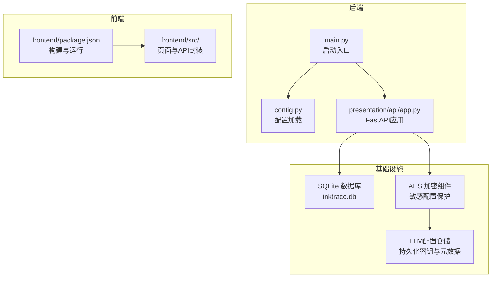
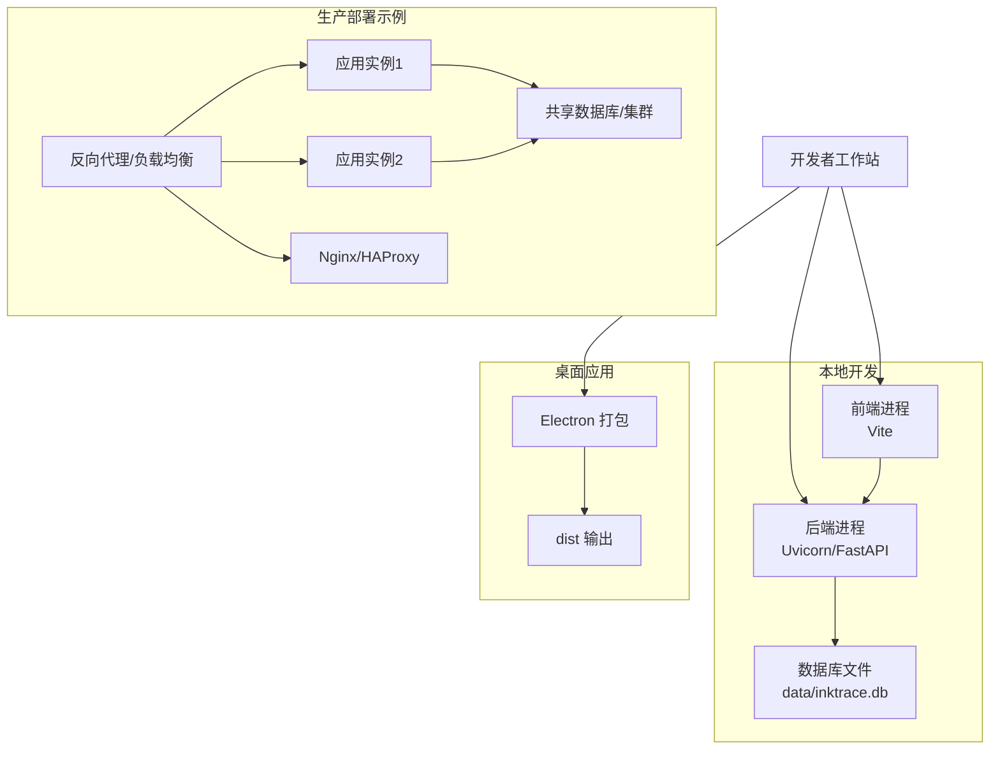
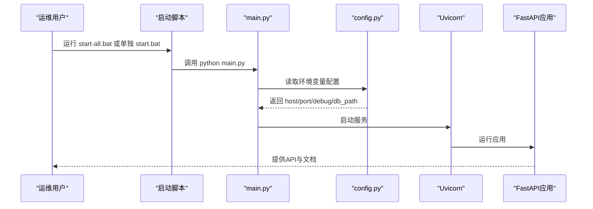
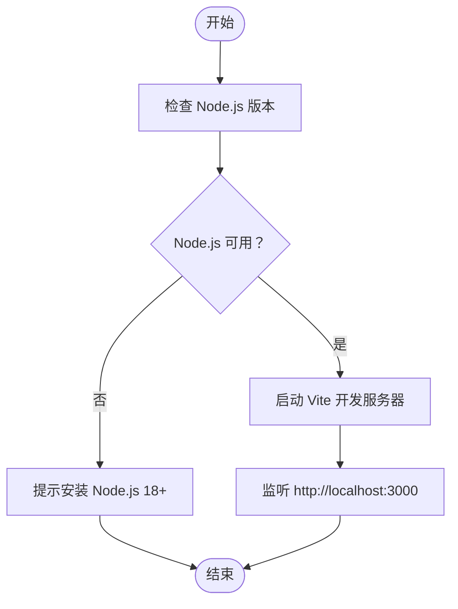
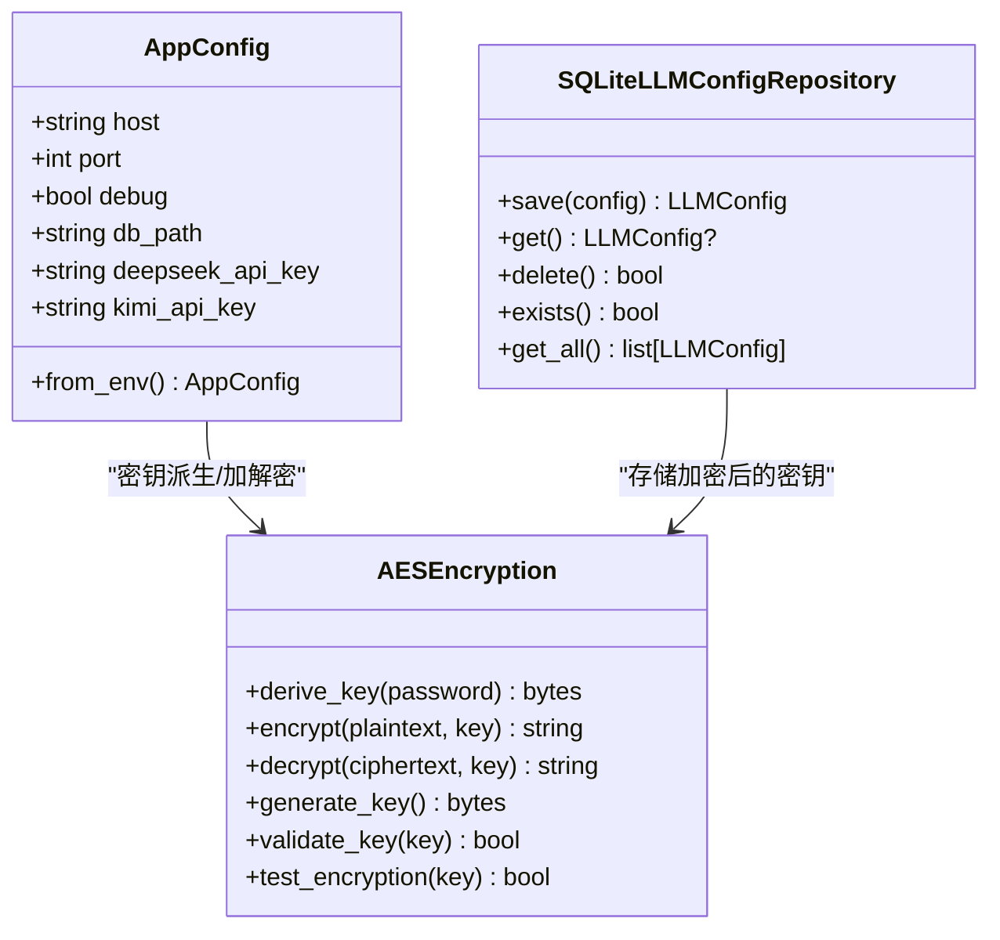
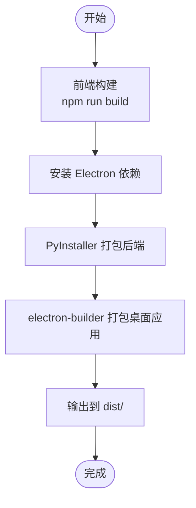

# 部署运维

<cite>
**本文引用的文件**
- [README.md](file://README.md)
- [requirements.txt](file://requirements.txt)
- [package.json](file://package.json)
- [main.py](file://main.py)
- [config.py](file://config.py)
- [start.bat](file://start.bat)
- [start-frontend.bat](file://start-frontend.bat)
- [start-all.bat](file://start-all.bat)
- [stop.bat](file://stop.bat)
- [build-desktop.bat](file://build-desktop.bat)
- [infrastructure/persistence/sqlite_llm_config_repo.py](file://infrastructure/persistence/sqlite_llm_config_repo.py)
- [infrastructure/security/aes_encryption.py](file://infrastructure/security/aes_encryption.py)
</cite>

## 目录
1. [简介](#简介)
2. [项目结构](#项目结构)
3. [核心组件](#核心组件)
4. [架构总览](#架构总览)
5. [详细组件分析](#详细组件分析)
6. [依赖分析](#依赖分析)
7. [性能考虑](#性能考虑)
8. [故障排查指南](#故障排查指南)
9. [结论](#结论)
10. [附录](#附录)

## 简介
本文件面向运维工程师与平台管理员，提供InkTrace项目的部署与运维全生命周期指南。内容覆盖开发环境搭建、生产部署流程、容器化与桌面应用打包、监控与日志、备份与恢复、高可用与负载均衡、安全加固、运维自动化与CI/CD建议等。

## 项目结构
InkTrace采用前后端分离架构：后端使用FastAPI+Uvicorn提供REST API；前端使用Vue3+Vite；桌面应用通过Electron进行打包分发。项目根目录提供Windows批处理脚本用于本地开发与一键启动，同时包含基础设施层的数据库与安全组件。

图表来源
- [main.py:15-22](file://main.py#L15-L22)
- [config.py:30-46](file://config.py#L30-L46)
- [infrastructure/persistence/sqlite_llm_config_repo.py:18-145](file://infrastructure/persistence/sqlite_llm_config_repo.py#L18-L145)
- [infrastructure/security/aes_encryption.py:19-106](file://infrastructure/security/aes_encryption.py#L19-L106)
- [package.json:8-19](file://package.json#L8-L19)

章节来源
- [README.md:72-106](file://README.md#L72-L106)
- [main.py:11-22](file://main.py#L11-L22)
- [config.py:14-46](file://config.py#L14-L46)

## 核心组件
- 后端服务
  - 启动入口：通过Uvicorn运行FastAPI应用，支持热重载调试模式。
  - 配置来源：从环境变量读取主机、端口、调试开关、数据库路径及大模型API密钥。
- 前端服务
  - 开发服务器：Vite提供热更新开发体验。
  - 构建产物：用于桌面应用打包或Web发布。
- 基础设施
  - SQLite数据库：默认位于data/inktrace.db，承载业务与配置数据。
  - AES加密组件：用于存储与传输敏感配置（如API密钥）时的加解密。
  - LLM配置仓储：负责LLM密钥与元数据的持久化与查询。

章节来源
- [main.py:15-22](file://main.py#L15-L22)
- [config.py:30-46](file://config.py#L30-L46)
- [infrastructure/persistence/sqlite_llm_config_repo.py:18-145](file://infrastructure/persistence/sqlite_llm_config_repo.py#L18-L145)
- [infrastructure/security/aes_encryption.py:19-106](file://infrastructure/security/aes_encryption.py#L19-L106)

## 架构总览
下图展示InkTrace在开发与生产中的典型部署形态：单机开发（本地）与多进程并行（后端+前端），以及可选的容器化与桌面应用打包形态。

图表来源
- [start-all.bat:30-39](file://start-all.bat#L30-L39)
- [start-frontend.bat:17-23](file://start-frontend.bat#L17-L23)
- [main.py:15-22](file://main.py#L15-L22)
- [config.py:19-24](file://config.py#L19-L24)

## 详细组件分析

### 后端启动与配置
- 启动流程
  - 通过main.py调用Uvicorn运行FastAPI应用，host/port来自config.py，debug控制是否启用热重载。
- 配置加载
  - 从环境变量读取INKTRACE_HOST、INKTRACE_PORT、INKTRACE_DEBUG、INKTRACE_DB_PATH、DEEPSEEK_API_KEY、KIMI_API_KEY。
- 依赖安装
  - requirements.txt声明FastAPI、Uvicorn、HTTPX、Pydantic、SQLite异步驱动、ChromaDB、SentenceTransformers、pytest等。

图表来源
- [start-all.bat:30-39](file://start-all.bat#L30-L39)
- [main.py:15-22](file://main.py#L15-L22)
- [config.py:30-46](file://config.py#L30-L46)

章节来源
- [main.py:11-22](file://main.py#L11-L22)
- [config.py:14-46](file://config.py#L14-L46)
- [requirements.txt:1-10](file://requirements.txt#L1-L10)

### 前端开发与构建
- 开发模式
  - start-frontend.bat检查Node.js版本并启动Vite开发服务器。
- 构建与打包
  - package.json定义了Electron构建脚本，用于桌面应用打包；也可用于Web静态资源构建（结合Vite）。

图表来源
- [start-frontend.bat:7-23](file://start-frontend.bat#L7-L23)
- [package.json:8-19](file://package.json#L8-L19)

章节来源
- [start-frontend.bat:1-23](file://start-frontend.bat#L1-L23)
- [package.json:1-81](file://package.json#L1-L81)

### 数据库与配置持久化
- SQLite数据库
  - 默认路径为data/inktrace.db，用于存储业务数据与配置。
- LLM配置仓储
  - 提供LLM密钥与元数据的增删改查，支持历史版本查询。
- AES加密组件
  - 提供密钥派生、GCM加密/解密、密钥生成与校验，用于敏感配置的安全存储与传输。

图表来源
- [config.py:14-46](file://config.py#L14-L46)
- [infrastructure/security/aes_encryption.py:19-106](file://infrastructure/security/aes_encryption.py#L19-L106)
- [infrastructure/persistence/sqlite_llm_config_repo.py:18-145](file://infrastructure/persistence/sqlite_llm_config_repo.py#L18-L145)

章节来源
- [config.py:14-46](file://config.py#L14-L46)
- [infrastructure/security/aes_encryption.py:19-106](file://infrastructure/security/aes_encryption.py#L19-L106)
- [infrastructure/persistence/sqlite_llm_config_repo.py:18-145](file://infrastructure/persistence/sqlite_llm_config_repo.py#L18-L145)

### 桌面应用打包
- 构建流程
  - build-desktop.bat顺序执行：前端构建、安装Electron依赖、使用PyInstaller打包后端、最后使用electron-builder构建桌面应用。
- 输出位置
  - dist目录输出安装包或便携包，具体目标取决于平台配置。

图表来源
- [build-desktop.bat:10-28](file://build-desktop.bat#L10-L28)
- [package.json:16-76](file://package.json#L16-L76)

章节来源
- [build-desktop.bat:1-35](file://build-desktop.bat#L1-L35)
- [package.json:1-81](file://package.json#L1-L81)

## 依赖分析
- 后端依赖
  - FastAPI/Uvicorn：提供高性能ASGI服务与自动API文档。
  - HTTPX：异步HTTP客户端，便于调用外部LLM服务。
  - Pydantic：数据验证与序列化。
  - aiosqlite：异步SQLite访问。
  - ChromaDB + SentenceTransformers：向量检索与嵌入。
  - pytest：单元测试框架。
- 前端依赖
  - Electron + electron-builder：桌面应用打包。
  - docx：文档处理（桌面端）。

章节来源
- [requirements.txt:1-10](file://requirements.txt#L1-L10)
- [package.json:77-79](file://package.json#L77-L79)

## 性能考虑
- 服务并发
  - 生产环境建议使用多进程或多实例部署，结合反向代理实现水平扩展。
- 数据库
  - SQLite适合小中型场景；若并发较高，建议迁移到PostgreSQL/MySQL并启用连接池与只读副本。
- 向量化与检索
  - 合理设置向量维度与索引参数，避免频繁重建索引；对高频查询建立缓存层。
- 前端构建
  - 生产构建开启压缩与Tree-shaking，减少首屏加载时间。

## 故障排查指南
- 启动失败
  - 检查Python与Node.js版本是否满足要求；确认端口未被占用。
- 端口占用
  - 使用stop.bat停止占用9527端口的进程，或修改端口后重新启动。
- 依赖缺失
  - start.bat会自动安装后端依赖；若失败，手动执行pip安装。
- 数据库异常
  - 确认data/inktrace.db可读写权限；必要时迁移至共享存储或云数据库。
- 桌面应用无法运行
  - 确认已成功执行前端构建与后端打包；检查dist输出目录与平台目标。

章节来源
- [start.bat:11-27](file://start.bat#L11-L27)
- [stop.bat:7-24](file://stop.bat#L7-L24)
- [build-desktop.bat:10-28](file://build-desktop.bat#L10-L28)

## 结论
InkTrace提供了清晰的前后端分离架构与便捷的本地开发脚本。生产部署建议采用多实例+反向代理的高可用方案，配合数据库迁移、向量检索优化与桌面应用打包策略，以满足性能与可维护性需求。安全方面应强化密钥管理与传输加密，日志与监控需覆盖请求链路与系统资源，形成闭环的运维体系。

## 附录

### 开发环境搭建步骤
- 系统要求
  - Python 3.11+、Node.js 18+。
- 安装依赖
  - 后端：pip安装requirements.txt中的依赖。
  - 前端：进入frontend目录执行npm install。
- 配置API密钥
  - 设置DEEPSEEK_API_KEY与KIMI_API_KEY环境变量。
- 启动服务
  - 方式一：一键启动start-all.bat。
  - 方式二：分别启动后端start.bat与前端start-frontend.bat。

章节来源
- [README.md:25-47](file://README.md#L25-L47)
- [requirements.txt:1-10](file://requirements.txt#L1-L10)
- [start.bat:21-27](file://start.bat#L21-L27)
- [start-all.bat:30-39](file://start-all.bat#L30-L39)
- [start-frontend.bat:7-14](file://start-frontend.bat#L7-L14)

### 生产环境部署流程
- 依赖安装
  - 在目标服务器安装Python与Node.js，执行pip与npm安装。
- 环境配置
  - 设置INKTRACE_HOST、INKTRACE_PORT、INKTRACE_DEBUG、INKTRACE_DB_PATH、DEEPSEEK_API_KEY、KIMI_API_KEY。
- 服务启动
  - 使用Uvicorn直接运行main.py，或通过系统服务管理器（如systemd）托管。
- 前端部署
  - 构建前端产物并部署至Nginx/CDN，或与后端同机部署。

章节来源
- [config.py:30-46](file://config.py#L30-L46)
- [main.py:15-22](file://main.py#L15-L22)
- [package.json:8-19](file://package.json#L8-L19)

### Docker容器化部署（建议方案）
- 多阶段构建
  - 前端：使用Node官方镜像构建产物。
  - 后端：使用Python官方镜像安装依赖并复制代码。
  - 最终镜像：仅包含运行时产物，减小体积。
- 环境变量注入
  - 通过docker run或Compose注入环境变量（如INKTRACE_*、API密钥）。
- 数据卷
  - 将data/inktrace.db映射到持久化存储或共享卷。
- 健康检查
  - 对后端提供/health端点进行健康检查。
- 示例要点
  - 请根据实际网络与安全策略调整暴露端口、代理与TLS。

[本节为概念性说明，不直接对应具体源文件]

### 监控与日志管理最佳实践
- 日志
  - 后端：统一输出到标准输出，结合容器日志收集（如Fluent Bit/Fluentd）。
  - 前端：浏览器端错误上报与埋点。
- 性能监控
  - 关键指标：请求延迟、吞吐、错误率、数据库连接数、向量索引查询耗时。
  - 工具：Prometheus + Grafana或APM工具。
- 告警
  - 基于阈值与趋势的告警策略，结合邮件/IM通知。

[本节为通用运维实践，不直接对应具体源文件]

### 备份与恢复策略
- 数据备份
  - SQLite：定期拷贝inktrace.db；生产建议使用数据库快照或WAL模式备份。
  - 向量库：备份ChromaDB数据目录或导出索引。
- 配置备份
  - LLM配置与密钥通过加密后存储，定期备份密钥材料与加密盐。
- 灾难恢复
  - 制定RTO/RPO目标，演练恢复流程，验证数据一致性。

章节来源
- [infrastructure/persistence/sqlite_llm_config_repo.py:34-48](file://infrastructure/persistence/sqlite_llm_config_repo.py#L34-L48)
- [infrastructure/security/aes_encryption.py:28-36](file://infrastructure/security/aes_encryption.py#L28-L36)

### 负载均衡与高可用
- 反向代理
  - 使用Nginx/HAProxy/Envoy分发请求至多个后端实例。
- 会话与状态
  - 无状态设计，使用共享数据库与缓存；必要时引入Redis做会话缓存。
- 健康检查与故障转移
  - 配置探针与自动摘除，实现故障隔离与快速恢复。

[本节为通用架构实践，不直接对应具体源文件]

### 安全加固与漏洞防护
- 密钥管理
  - 使用AES加密组件对敏感配置进行加密存储；最小权限原则与轮换策略。
- 网络安全
  - 限制端口暴露范围，启用TLS；对外API增加鉴权与速率限制。
- 供应链安全
  - 固定依赖版本，定期扫描漏洞并更新。

章节来源
- [infrastructure/security/aes_encryption.py:19-106](file://infrastructure/security/aes_encryption.py#L19-L106)

### 运维自动化与CI/CD建议
- 自动化脚本
  - 建议将start/stop/build逻辑抽象为PowerShell/Bash脚本，统一入口。
- CI/CD流水线
  - 触发条件：push/tag触发构建与测试。
  - 步骤：安装依赖 → 单测 → 构建前端 → 构建后端 → 打包桌面应用 → 发布制品。
  - 建议使用GitHub Actions/GitLab CI/Azure DevOps等平台。

[本节为通用工程实践，不直接对应具体源文件]