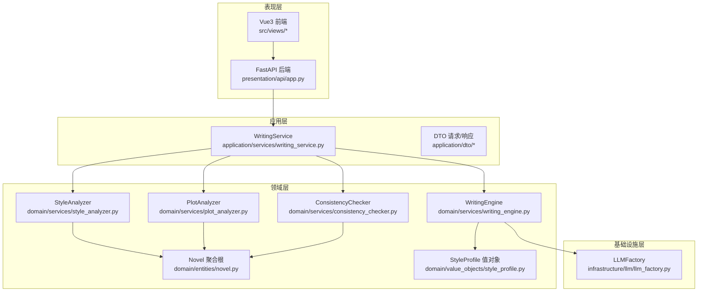
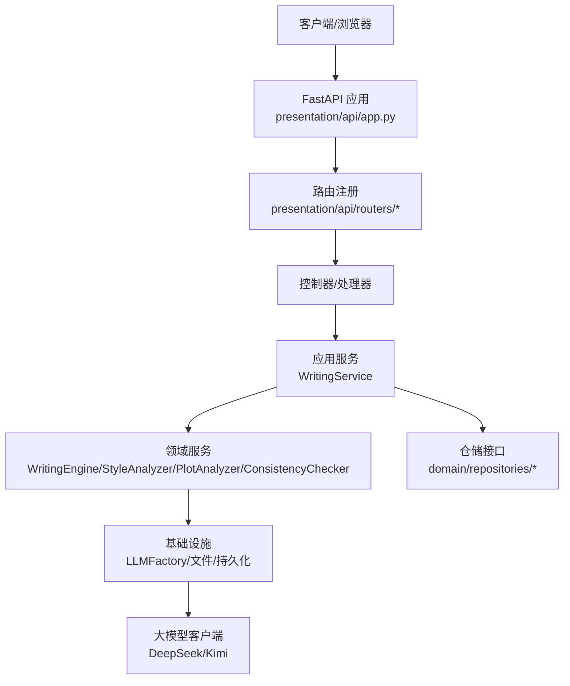
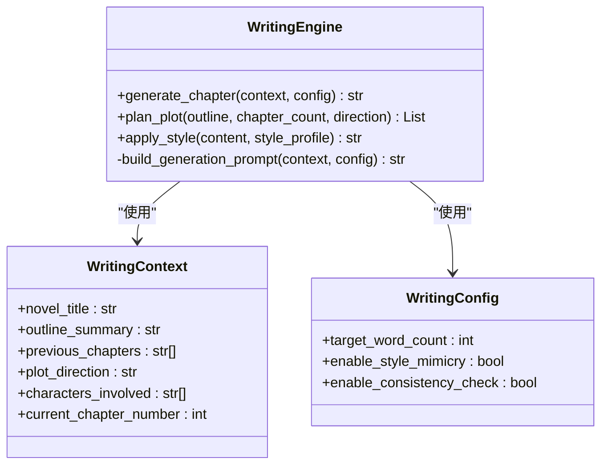
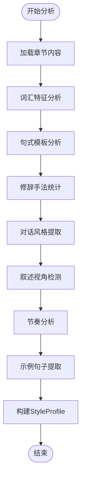
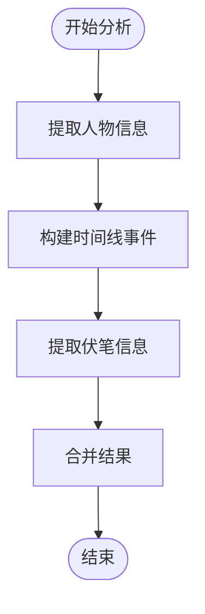
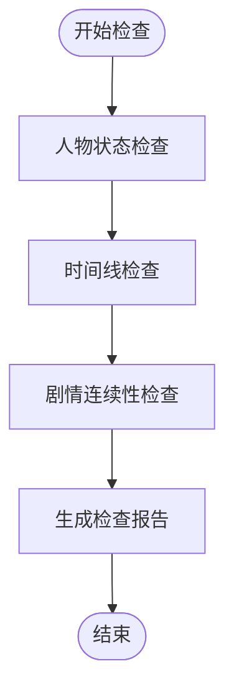
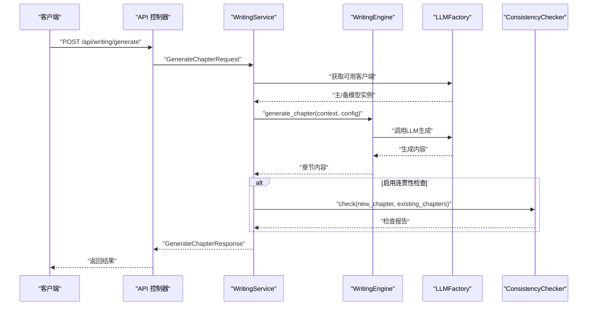
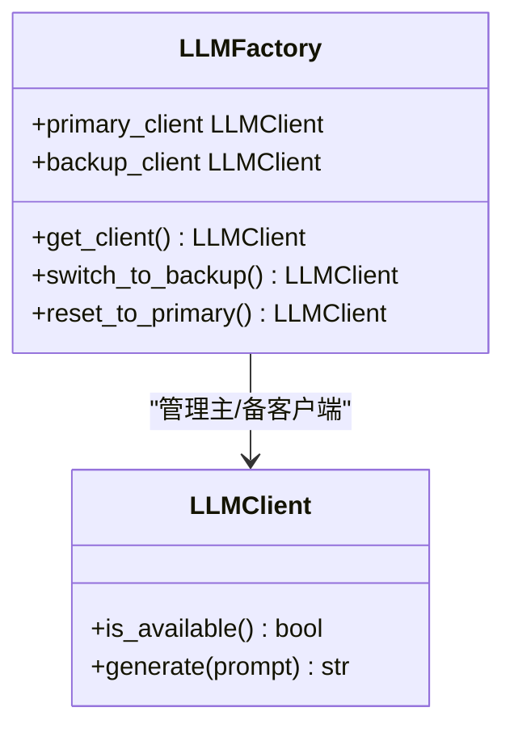
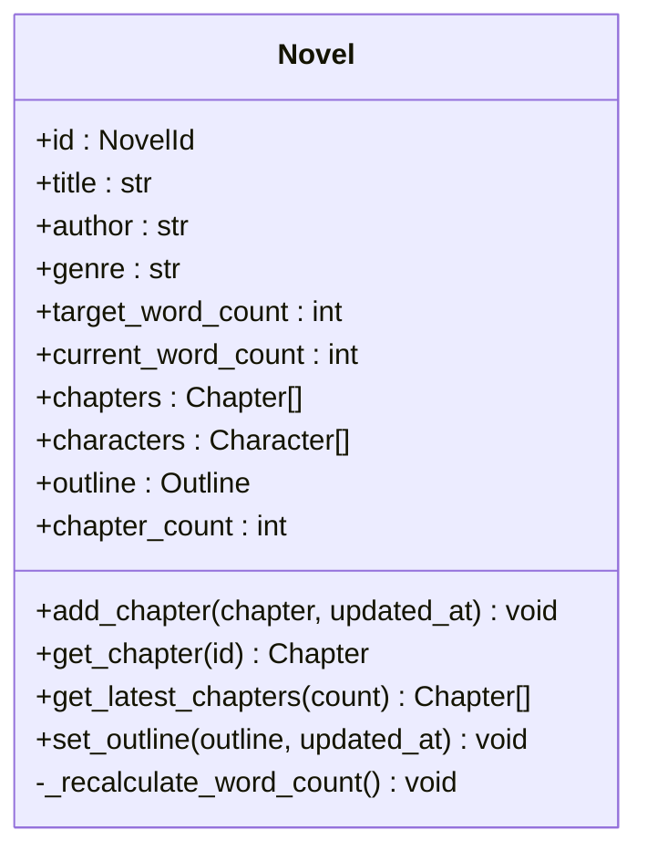
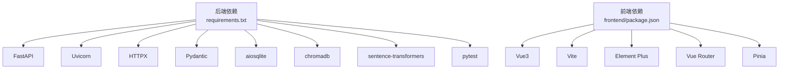

# 项目概述

<cite>
**本文引用的文件**
- [README.md](file://README.md)
- [docs/STARTUP_GUIDE.md](file://docs/STARTUP_GUIDE.md)
- [main.py](file://main.py)
- [requirements.txt](file://requirements.txt)
- [presentation/api/app.py](file://presentation/api/app.py)
- [domain/services/writing_engine.py](file://domain/services/writing_engine.py)
- [domain/services/style_analyzer.py](file://domain/services/style_analyzer.py)
- [domain/services/plot_analyzer.py](file://domain/services/plot_analyzer.py)
- [domain/services/consistency_checker.py](file://domain/services/consistency_checker.py)
- [application/services/writing_service.py](file://application/services/writing_service.py)
- [infrastructure/llm/llm_factory.py](file://infrastructure/llm/llm_factory.py)
- [domain/entities/novel.py](file://domain/entities/novel.py)
- [domain/value_objects/style_profile.py](file://domain/value_objects/style_profile.py)
- [application/dto/request_dto.py](file://application/dto/request_dto.py)
</cite>

## 目录
1. [引言](#引言)
2. [项目结构](#项目结构)
3. [核心组件](#核心组件)
4. [架构总览](#架构总览)
5. [详细组件分析](#详细组件分析)
6. [依赖分析](#依赖分析)
7. [性能考虑](#性能考虑)
8. [故障排查指南](#故障排查指南)
9. [结论](#结论)
10. [附录](#附录)

## 引言
InkTrace 小说AI自动编写助手旨在帮助创作者基于已有小说原文与大纲，自动完成文风分析、剧情分析，并进行智能续写新章节，同时提供连贯性检查与主备模型切换能力，以提升创作效率与质量稳定性。项目采用分层架构设计，覆盖领域层、应用层、基础设施层与表现层，结合FastAPI后端与Vue3前端，形成完整的本地化工作流。

- 项目目标：降低AI续写门槛，保障文风一致性与剧情连贯性，提供稳定可靠的主备模型切换。
- 主要特性：智能导入、文风分析、剧情分析、智能续写、连贯性检查、主备模型切换。
- 技术价值：通过领域驱动设计（DDD）与分层架构，实现高内聚低耦合；通过LLM工厂与多客户端策略，增强可用性与容错能力。

## 项目结构
项目采用“领域层-应用层-基础设施层-表现层”的分层组织方式，配合前端Vue3与后端FastAPI，形成前后端分离的完整体系。

图表来源
- [presentation/api/app.py:19-66](file://presentation/api/app.py#L19-L66)
- [application/services/writing_service.py:30-180](file://application/services/writing_service.py#L30-L180)
- [domain/services/writing_engine.py:30-184](file://domain/services/writing_engine.py#L30-L184)
- [domain/services/style_analyzer.py:18-286](file://domain/services/style_analyzer.py#L18-L286)
- [domain/services/plot_analyzer.py:46-225](file://domain/services/plot_analyzer.py#L46-L225)
- [domain/services/consistency_checker.py:37-218](file://domain/services/consistency_checker.py#L37-L218)
- [domain/entities/novel.py:20-178](file://domain/entities/novel.py#L20-L178)
- [domain/value_objects/style_profile.py:14-30](file://domain/value_objects/style_profile.py#L14-L30)
- [infrastructure/llm/llm_factory.py:31-121](file://infrastructure/llm/llm_factory.py#L31-L121)

章节来源
- [README.md:72-106](file://README.md#L72-L106)
- [docs/STARTUP_GUIDE.md:161-183](file://docs/STARTUP_GUIDE.md#L161-L183)

## 核心组件
- 写作引擎（WritingEngine）：负责构建续写提示词、调用LLM生成内容、可选应用文风特征。
- 文风分析（StyleAnalyzer）：从词汇、句式、修辞、对话风格、叙述视角、节奏等方面提取文风特征。
- 剧情分析（PlotAnalyzer）：抽取人物、时间线、伏笔等关键剧情要素。
- 连贯性检查（ConsistencyChecker）：检查人物状态、时间线与剧情连续性，给出不一致项与建议。
- 续写服务（WritingService）：协调仓库、引擎与检查器，完成剧情规划与章节生成。
- LLM工厂（LLMFactory）：统一管理主备模型（DeepSeek/Kimi），支持自动切换与健康检查。
- 小说聚合根（Novel）：承载小说元数据、章节集合、人物与大纲，维护字数与排序。
- 文风特征值对象（StyleProfile）：不可变的数据载体，封装文风统计与示例。

章节来源
- [domain/services/writing_engine.py:30-184](file://domain/services/writing_engine.py#L30-L184)
- [domain/services/style_analyzer.py:18-286](file://domain/services/style_analyzer.py#L18-L286)
- [domain/services/plot_analyzer.py:46-225](file://domain/services/plot_analyzer.py#L46-L225)
- [domain/services/consistency_checker.py:37-218](file://domain/services/consistency_checker.py#L37-L218)
- [application/services/writing_service.py:30-180](file://application/services/writing_service.py#L30-L180)
- [infrastructure/llm/llm_factory.py:31-121](file://infrastructure/llm/llm_factory.py#L31-L121)
- [domain/entities/novel.py:20-178](file://domain/entities/novel.py#L20-L178)
- [domain/value_objects/style_profile.py:14-30](file://domain/value_objects/style_profile.py#L14-L30)

## 架构总览
InkTrace 采用Clean Architecture与DDD思想，将业务规则与外部依赖解耦。后端通过FastAPI提供REST接口，前端通过Vue3进行交互。应用服务作为编排者，组合领域服务与基础设施能力，确保职责单一、扩展灵活。

图表来源
- [presentation/api/app.py:19-66](file://presentation/api/app.py#L19-L66)
- [application/services/writing_service.py:30-180](file://application/services/writing_service.py#L30-L180)
- [infrastructure/llm/llm_factory.py:31-121](file://infrastructure/llm/llm_factory.py#L31-L121)

## 详细组件分析

### 写作引擎（WritingEngine）
- 职责：构建续写提示词、调用LLM生成内容、可选应用文风特征。
- 关键流程：接收写作上下文与配置，拼装提示词，调用LLM生成，必要时应用文风特征，返回章节内容。
- 设计要点：通过上下文对象与配置对象解耦输入参数；对异步/同步客户端做兼容处理。

图表来源
- [domain/services/writing_engine.py:19-184](file://domain/services/writing_engine.py#L19-L184)

章节来源
- [domain/services/writing_engine.py:30-184](file://domain/services/writing_engine.py#L30-L184)

### 文风分析（StyleAnalyzer）
- 职责：从文本中提取词汇统计、句式模板、修辞手法、对话风格、叙述视角、节奏与示例句子。
- 关键流程：拼接全部章节内容，逐项分析并汇总为StyleProfile。
- 设计要点：正则表达式匹配与统计，保证中文文本处理的鲁棒性。

图表来源
- [domain/services/style_analyzer.py:25-286](file://domain/services/style_analyzer.py#L25-L286)

章节来源
- [domain/services/style_analyzer.py:18-286](file://domain/services/style_analyzer.py#L18-L286)

### 剧情分析（PlotAnalyzer）
- 职责：抽取人物、构建时间线、提取伏笔。
- 关键流程：基于正则模式匹配人名、时间词与伏笔关键词，生成结构化结果。
- 设计要点：对常见中文命名与时间表达进行模式化抽取，限制输出规模以保证性能。

图表来源
- [domain/services/plot_analyzer.py:55-225](file://domain/services/plot_analyzer.py#L55-L225)

章节来源
- [domain/services/plot_analyzer.py:46-225](file://domain/services/plot_analyzer.py#L46-L225)

### 连贯性检查（ConsistencyChecker）
- 职责：检查人物状态、时间线与剧情连续性，输出不一致项与建议。
- 关键流程：对人物修为等级、时间事件顺序与剧情承接进行规则化校验。
- 设计要点：以关键词映射与正则匹配实现轻量规则引擎，便于扩展。

图表来源
- [domain/services/consistency_checker.py:44-218](file://domain/services/consistency_checker.py#L44-L218)

章节来源
- [domain/services/consistency_checker.py:37-218](file://domain/services/consistency_checker.py#L37-L218)

### 续写服务（WritingService）
- 职责：协调仓库、引擎与检查器，完成剧情规划与章节生成；可选进行连贯性检查。
- 关键流程：读取小说与章节，构造上下文与配置，调用引擎生成内容，必要时执行一致性检查并返回报告。
- 设计要点：通过LLM工厂选择主备模型；缓存文风特征以减少重复分析。

图表来源
- [application/services/writing_service.py:91-165](file://application/services/writing_service.py#L91-L165)
- [domain/services/writing_engine.py:52-80](file://domain/services/writing_engine.py#L52-L80)
- [infrastructure/llm/llm_factory.py:78-121](file://infrastructure/llm/llm_factory.py#L78-L121)
- [domain/services/consistency_checker.py:44-87](file://domain/services/consistency_checker.py#L44-L87)

章节来源
- [application/services/writing_service.py:30-180](file://application/services/writing_service.py#L30-L180)

### LLM工厂（LLMFactory）
- 职责：统一管理主备模型客户端，提供可用客户端获取与自动切换能力。
- 关键流程：优先使用主模型，若不可用则切换至备用模型；支持重置为主模型。
- 设计要点：延迟初始化与当前客户端缓存，避免频繁创建；通过异步可用性检测提升健壮性。

图表来源
- [infrastructure/llm/llm_factory.py:31-121](file://infrastructure/llm/llm_factory.py#L31-L121)

章节来源
- [infrastructure/llm/llm_factory.py:31-121](file://infrastructure/llm/llm_factory.py#L31-L121)

### 小说聚合根（Novel）
- 职责：承载小说元数据、章节集合、人物与大纲，维护字数与排序。
- 关键方法：添加/获取章节与人物、设置大纲、计算总字数。
- 设计要点：通过dataclass与字段默认值简化实体定义；排序与去重逻辑内聚在实体内部。

图表来源
- [domain/entities/novel.py:20-178](file://domain/entities/novel.py#L20-L178)

章节来源
- [domain/entities/novel.py:20-178](file://domain/entities/novel.py#L20-L178)

### 文风特征值对象（StyleProfile）
- 职责：不可变地封装文风统计与示例，供写作引擎应用。
- 字段：词汇统计、句式模板、修辞统计、对话风格、叙述视角、节奏、示例句子。
- 设计要点：使用frozen数据类保证值对象的不可变性与可比较性。

章节来源
- [domain/value_objects/style_profile.py:14-30](file://domain/value_objects/style_profile.py#L14-L30)

## 依赖分析
- 后端依赖：FastAPI、Uvicorn、HTTPX、Pydantic、SQLite异步驱动、ChromaDB、Sentence-Transformers、PyTest。
- 前端依赖：Vue3、Vite、Element Plus、Vue Router、Pinia。
- 运行环境：Python 3.11+、Node.js 18+。

图表来源
- [requirements.txt:1-10](file://requirements.txt#L1-L10)

章节来源
- [requirements.txt:1-10](file://requirements.txt#L1-L10)
- [docs/STARTUP_GUIDE.md:3-27](file://docs/STARTUP_GUIDE.md#L3-L27)

## 性能考虑
- 文风与剧情分析：对全文本进行正则扫描与统计，建议在章节较多时分批处理或缓存中间结果。
- LLM调用：通过工厂模式与异步可用性检测，避免阻塞；合理设置提示词长度与上下文窗口。
- 数据访问：仓储接口抽象利于替换实现，SQLite适合本地开发；生产场景可考虑更高效存储。
- 前端渲染：组件拆分与懒加载，避免一次性渲染大量章节内容。

## 故障排查指南
- 端口占用：9527（后端）、3000（前端）。可通过系统工具查询并终止占用进程。
- Python/Node环境：确认已加入系统PATH，版本满足要求。
- API密钥：检查环境变量或.env文件配置是否正确。
- 服务访问：若无法访问，检查防火墙与服务启动日志，尝试使用127.0.0.1替代localhost。
- 一键启动：使用提供的批处理脚本，按清单核对各组件状态。

章节来源
- [docs/STARTUP_GUIDE.md:119-160](file://docs/STARTUP_GUIDE.md#L119-L160)

## 结论
InkTrace 将文风分析、剧情分析与智能续写有机结合，借助主备模型切换与连贯性检查，显著提升了AI续写的质量与稳定性。其分层架构与领域驱动设计使系统具备良好的可维护性与扩展性，适合创作者与团队在本地化环境中高效开展AI辅助写作。

## 附录

### 快速开始
- 环境要求：Python 3.11+、Node.js 18+。
- 安装依赖：后端使用pip安装requirements.txt中的依赖；前端进入frontend目录执行npm install。
- 配置API密钥：设置DEEPSEEK_API_KEY与KIMI_API_KEY，或在项目根目录创建.env文件。
- 启动服务：一键启动或分别启动后端与前端；访问前端界面与API文档。
- 使用流程：导入小说 → 文风/剧情分析 → 续写章节 → 导出小说。

章节来源
- [README.md:23-68](file://README.md#L23-L68)
- [docs/STARTUP_GUIDE.md:3-118](file://docs/STARTUP_GUIDE.md#L3-L118)

### API概览
- 主要接口：创建/获取小说、导入小说、文风/剧情分析、生成章节、导出小说等。
- 访问地址：前端界面 http://localhost:3000；API文档 http://127.0.0.1:9527/docs。

章节来源
- [README.md:139-155](file://README.md#L139-L155)

### 启动入口与配置
- 后端入口：main.py通过Uvicorn运行presentation.api.app。
- 配置文件：config.py中host/port/debug等参数可调整。

章节来源
- [main.py:15-21](file://main.py#L15-L21)