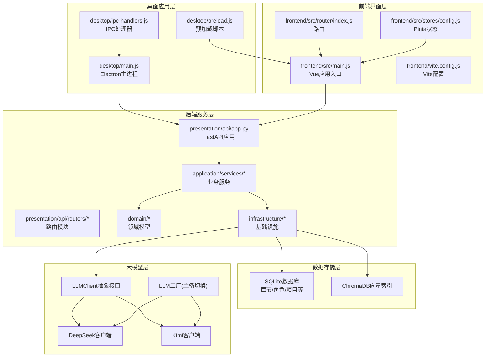
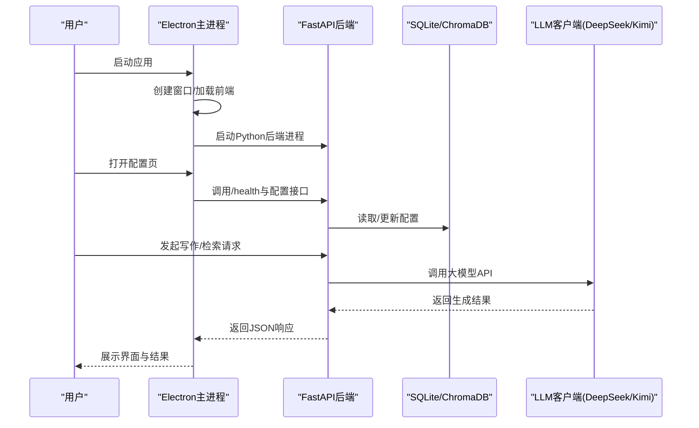
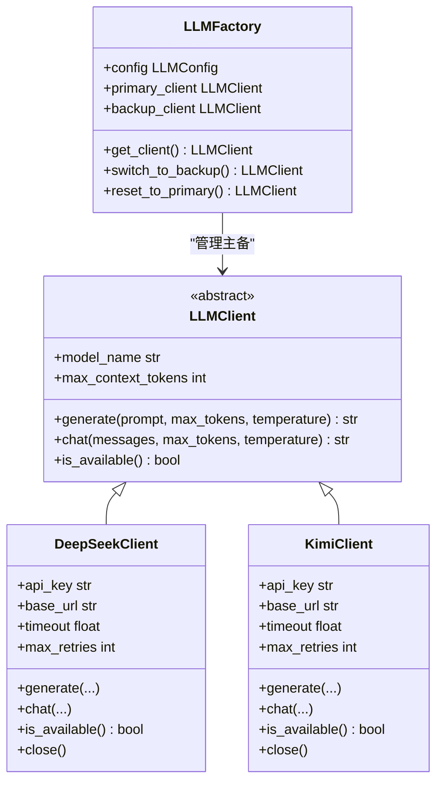
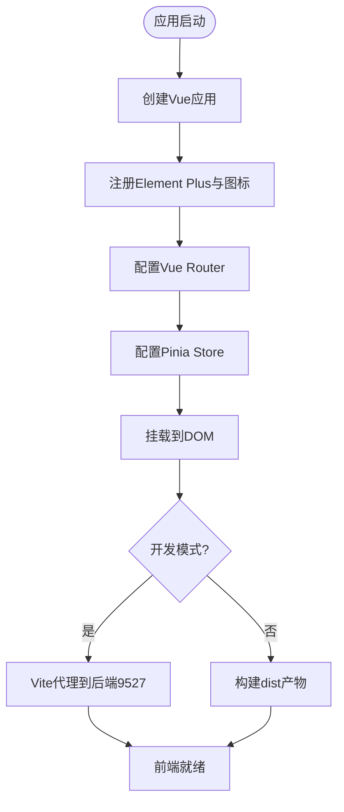
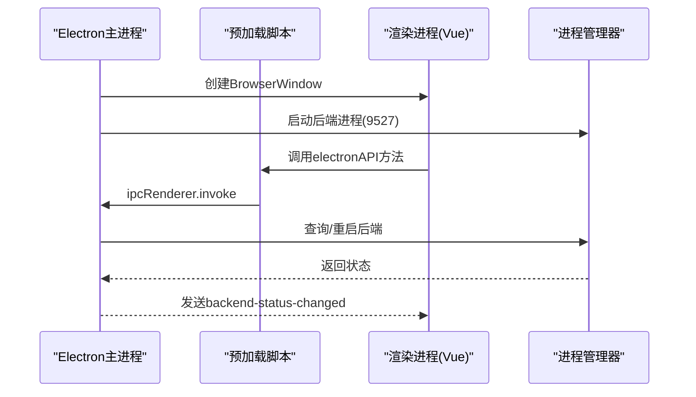
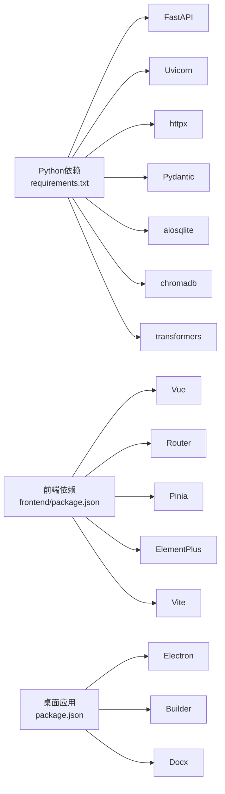

# 技术栈概览

<cite>
**本文档引用的文件**
- [requirements.txt](file://requirements.txt)
- [package.json](file://package.json)
- [frontend/package.json](file://frontend/package.json)
- [main.py](file://main.py)
- [desktop/main.js](file://desktop/main.js)
- [infrastructure/llm/base_client.py](file://infrastructure/llm/base_client.py)
- [infrastructure/llm/deepseek_client.py](file://infrastructure/llm/deepseek_client.py)
- [infrastructure/llm/kimi_client.py](file://infrastructure/llm/kimi_client.py)
- [infrastructure/llm/llm_factory.py](file://infrastructure/llm/llm_factory.py)
- [presentation/api/app.py](file://presentation/api/app.py)
- [frontend/src/main.js](file://frontend/src/main.js)
- [frontend/vite.config.js](file://frontend/vite.config.js)
- [frontend/src/router/index.js](file://frontend/src/router/index.js)
- [frontend/src/stores/config.js](file://frontend/src/stores/config.js)
- [config.py](file://config.py)
- [infrastructure/persistence/sqlite_chapter_repo.py](file://infrastructure/persistence/sqlite_chapter_repo.py)
- [desktop/preload.js](file://desktop/preload.js)
- [desktop/ipc-handlers.js](file://desktop/ipc-handlers.js)
</cite>

## 目录
1. [引言](#引言)
2. [项目结构](#项目结构)
3. [核心组件](#核心组件)
4. [架构总览](#架构总览)
5. [详细组件分析](#详细组件分析)
6. [依赖关系分析](#依赖关系分析)
7. [性能考虑](#性能考虑)
8. [故障排除指南](#故障排除指南)
9. [结论](#结论)

## 引言
本技术栈概览面向InkTrace项目的后端、前端、桌面应用以及开发工具链，系统性梳理Python 3.11+、FastAPI、SQLite、DeepSeek/Kimi大模型API、Vue 3/Vite、Element Plus、Vue Router/Pinia、Electron等核心技术的选型理由、版本兼容性与集成方式，并给出依赖管理策略与环境配置要求。

## 项目结构
InkTrace采用分层清晰的多模块组织方式：
- 后端服务：基于FastAPI提供REST API，统一在presentation/api中注册路由
- 应用层：application目录承载业务服务与DTO定义
- 领域层：domain目录定义实体、值对象、仓库接口与业务服务
- 基础设施层：infrastructure目录实现持久化、LLM客户端、向量索引、安全等
- 前端：frontend目录使用Vue 3 + Vite构建
- 桌面应用：desktop目录使用Electron封装，内嵌后端与前端资源
- 测试：tests目录覆盖单元测试

图表来源
- [desktop/main.js:1-213](file://desktop/main.js#L1-L213)
- [presentation/api/app.py:1-66](file://presentation/api/app.py#L1-L66)
- [frontend/src/main.js:1-23](file://frontend/src/main.js#L1-L23)
- [infrastructure/llm/base_client.py:1-83](file://infrastructure/llm/base_client.py#L1-L83)
- [infrastructure/llm/llm_factory.py:1-121](file://infrastructure/llm/llm_factory.py#L1-L121)

章节来源
- [main.py:1-22](file://main.py#L1-L22)
- [config.py:1-46](file://config.py#L1-L46)

## 核心组件
- 后端框架：FastAPI 0.104+ + Uvicorn 0.24+，提供高性能ASGI服务与OpenAPI文档
- 数据库：SQLite（章节/角色/项目等实体持久化），配合aiosqlite实现异步访问
- 向量检索：ChromaDB + sentence-transformers，支持RAG场景
- 大模型API：DeepSeek与Kimi双客户端，统一抽象接口与工厂主备切换
- 前端框架：Vue 3.4+ + Vite 5.x + Element Plus 2.4+，路由与状态管理完整
- 桌面应用：Electron 28 + electron-builder 24，跨平台打包与IPC通信
- 测试：pytest 7.0+，覆盖业务与集成测试

章节来源
- [requirements.txt:1-10](file://requirements.txt#L1-L10)
- [frontend/package.json:1-24](file://frontend/package.json#L1-L24)
- [package.json:1-81](file://package.json#L1-L81)

## 架构总览
InkTrace采用前后端分离与桌面应用封装的混合架构：
- 桌面应用通过Electron主进程启动后端Python进程与前端静态资源
- 前端通过Vite开发服务器或打包产物与后端FastAPI交互
- 后端提供REST API，调用应用层服务与基础设施实现业务逻辑
- 基础设施层对接SQLite与ChromaDB，封装LLM客户端并提供工厂化主备切换

图表来源
- [desktop/main.js:130-141](file://desktop/main.js#L130-L141)
- [presentation/api/app.py:54-61](file://presentation/api/app.py#L54-L61)
- [config.py:30-42](file://config.py#L30-L42)

## 详细组件分析

### 后端技术栈（FastAPI + SQLite + LLM）
- FastAPI应用与中间件：启用CORS，按阶段注册路由模块，提供根与健康检查端点
- 配置管理：支持从环境变量加载主机、端口、数据库路径与API密钥
- 数据持久化：SQLite章节仓储实现CRUD操作，使用异步上下文管理器确保连接释放
- LLM抽象与实现：统一LLMClient接口，DeepSeek/Kimi客户端封装HTTP调用、重试与错误处理，工厂负责主备切换

图表来源
- [infrastructure/llm/base_client.py:14-83](file://infrastructure/llm/base_client.py#L14-L83)
- [infrastructure/llm/deepseek_client.py:25-238](file://infrastructure/llm/deepseek_client.py#L25-L238)
- [infrastructure/llm/kimi_client.py:25-244](file://infrastructure/llm/kimi_client.py#L25-L244)
- [infrastructure/llm/llm_factory.py:31-121](file://infrastructure/llm/llm_factory.py#L31-L121)

章节来源
- [presentation/api/app.py:19-62](file://presentation/api/app.py#L19-L62)
- [config.py:14-45](file://config.py#L14-L45)
- [infrastructure/persistence/sqlite_chapter_repo.py:19-137](file://infrastructure/persistence/sqlite_chapter_repo.py#L19-L137)

### 前端技术栈（Vue 3 + Vite + Element Plus + Router + Pinia）
- 应用入口：创建Vue实例，全局注册Element Plus图标，挂载Pinia与Vue Router
- 路由：基于history/hash历史模式，定义项目/小说/写作/配置等页面
- 状态管理：Pinia Store集中管理LLM配置、加载状态与错误处理
- 构建：Vite开发服务器端口3000，代理到后端9527端口，生产构建输出dist

图表来源
- [frontend/src/main.js:1-23](file://frontend/src/main.js#L1-L23)
- [frontend/src/router/index.js:1-74](file://frontend/src/router/index.js#L1-L74)
- [frontend/src/stores/config.js:14-240](file://frontend/src/stores/config.js#L14-L240)
- [frontend/vite.config.js:1-28](file://frontend/vite.config.js#L1-L28)

章节来源
- [frontend/src/main.js:12-22](file://frontend/src/main.js#L12-L22)
- [frontend/src/router/index.js:61-71](file://frontend/src/router/index.js#L61-L71)
- [frontend/src/stores/config.js:42-107](file://frontend/src/stores/config.js#L42-L107)
- [frontend/vite.config.js:13-26](file://frontend/vite.config.js#L13-L26)

### 桌面应用技术栈（Electron + IPC）
- 主进程：创建窗口、加载开发/生产前端、启动后端Python进程、托盘与IPC事件
- 预加载：通过contextBridge暴露受控API给渲染进程
- IPC：提供后端状态查询/重启、打开外部链接/文件夹、获取应用版本与路径等

图表来源
- [desktop/main.js:21-74](file://desktop/main.js#L21-L74)
- [desktop/main.js:130-141](file://desktop/main.js#L130-L141)
- [desktop/preload.js:9-24](file://desktop/preload.js#L9-L24)
- [desktop/ipc-handlers.js:9-47](file://desktop/ipc-handlers.js#L9-L47)

章节来源
- [desktop/main.js:13-20](file://desktop/main.js#L13-L20)
- [desktop/preload.js:7-24](file://desktop/preload.js#L7-L24)
- [desktop/ipc-handlers.js:9-47](file://desktop/ipc-handlers.js#L9-L47)

### 开发工具链与测试
- 版本控制：Git（仓库根目录包含.gitignore）
- 单元测试：pytest，覆盖章节、角色、一致性检查、LLM客户端、向量索引等
- 代码质量：未发现专用lint配置文件，建议结合flake8/black/isort等工具

章节来源
- [requirements.txt:9-10](file://requirements.txt#L9-L10)
- [tests/unit/test_llm_client.py](file://tests/unit/test_llm_client.py)
- [tests/unit/test_chapter.py](file://tests/unit/test_chapter.py)

## 依赖关系分析
- Python后端依赖：FastAPI、Uvicorn、httpx、Pydantic、aiosqlite、chromadb、sentence-transformers、pytest
- 前端依赖：Vue 3、Vue Router、Pinia、Element Plus、Axios、Vite插件
- 桌面应用：Electron、electron-builder；打包时将后端与前端产物一并包含

图表来源
- [requirements.txt:1-10](file://requirements.txt#L1-L10)
- [frontend/package.json:11-22](file://frontend/package.json#L11-L22)
- [package.json:16-79](file://package.json#L16-L79)

章节来源
- [requirements.txt:1-10](file://requirements.txt#L1-L10)
- [frontend/package.json:11-22](file://frontend/package.json#L11-L22)
- [package.json:16-79](file://package.json#L16-L79)

## 性能考虑
- 异步与连接池：后端使用aiosqlite与httpx AsyncClient，减少阻塞与提升并发
- LLM重试与降级：客户端内置最大重试次数与主备模型切换，提高可用性
- 前端开发体验：Vite热更新与代理，缩短迭代周期
- 桌面应用优化：窗口直接显示、背景色避免白屏、预加载脚本限制权限

章节来源
- [infrastructure/llm/deepseek_client.py:61-64](file://infrastructure/llm/deepseek_client.py#L61-L64)
- [infrastructure/llm/kimi_client.py:61-64](file://infrastructure/llm/kimi_client.py#L61-L64)
- [desktop/main.js:23-36](file://desktop/main.js#L23-L36)
- [frontend/vite.config.js:13-21](file://frontend/vite.config.js#L13-L21)

## 故障排除指南
- 后端无法启动：检查主机/端口配置与环境变量，确认9527端口未被占用
- 前端加载失败：开发模式需先启动Vite，生产模式需确保dist与后端资源打包完整
- LLM配置错误：至少配置一个API密钥，格式校验失败会抛出异常
- IPC通信问题：检查预加载脚本暴露的方法与主进程IPC处理器是否匹配

章节来源
- [config.py:30-42](file://config.py#L30-L42)
- [desktop/main.js:52-73](file://desktop/main.js#L52-L73)
- [frontend/src/stores/config.js:80-91](file://frontend/src/stores/config.js#L80-L91)
- [desktop/preload.js:9-24](file://desktop/preload.js#L9-L24)
- [desktop/ipc-handlers.js:9-47](file://desktop/ipc-handlers.js#L9-L47)

## 结论
InkTrace技术栈围绕“Python后端 + Vue前端 + Electron桌面封装”的组合展开，后端以FastAPI为核心，结合SQLite与ChromaDB满足数据与检索需求；前端采用现代化生态保证开发效率与用户体验；桌面应用通过Electron实现跨平台部署与IPC通信。整体架构清晰、组件职责明确，具备良好的扩展性与可维护性。