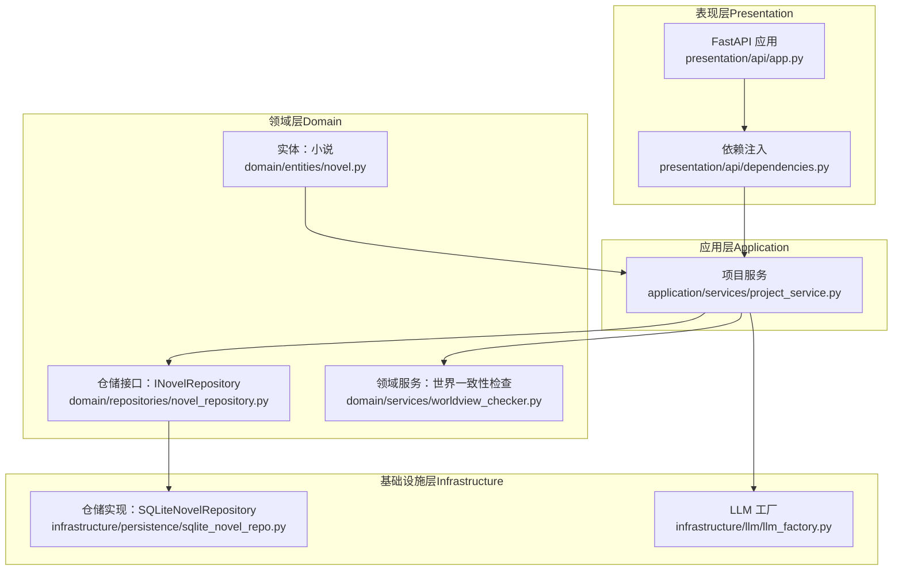
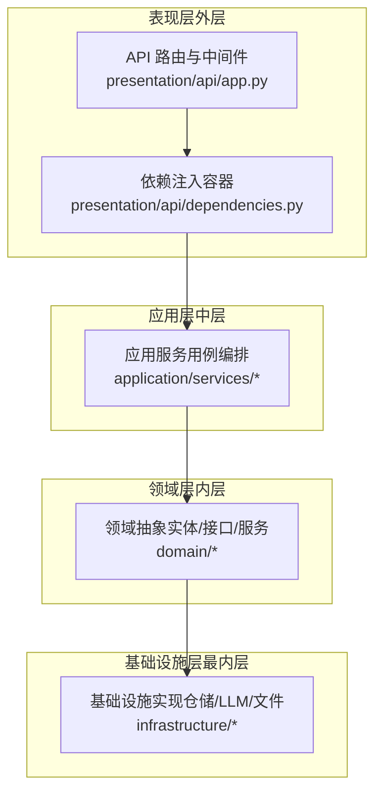
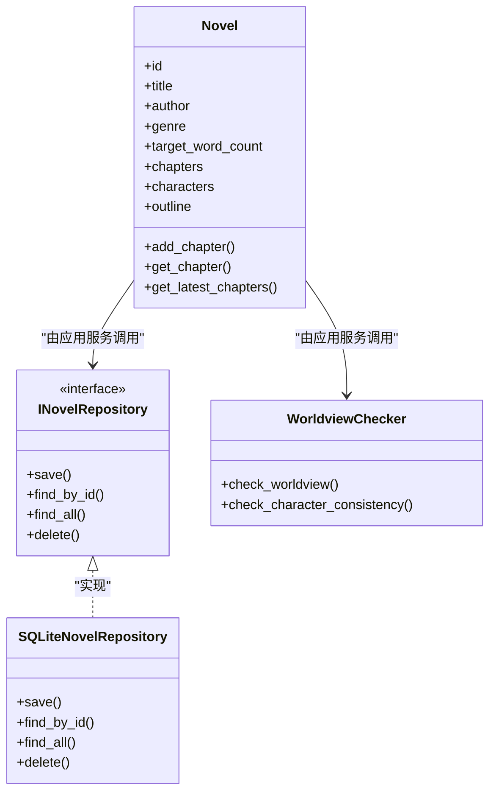
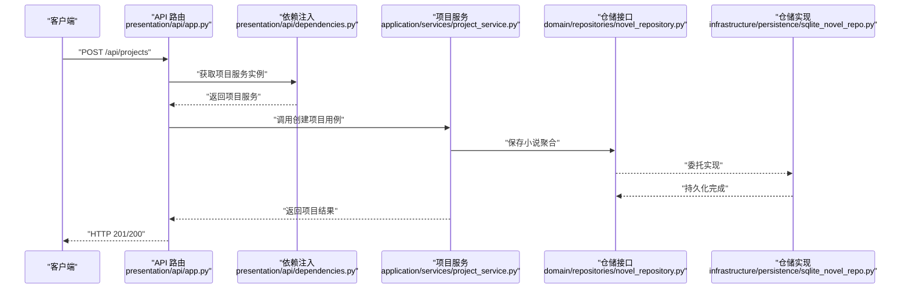
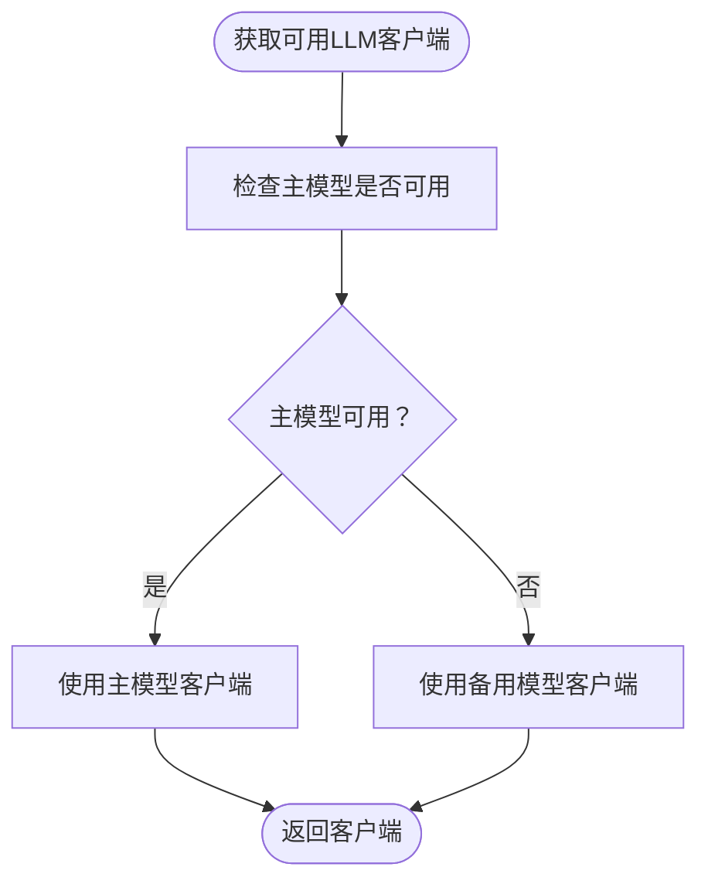
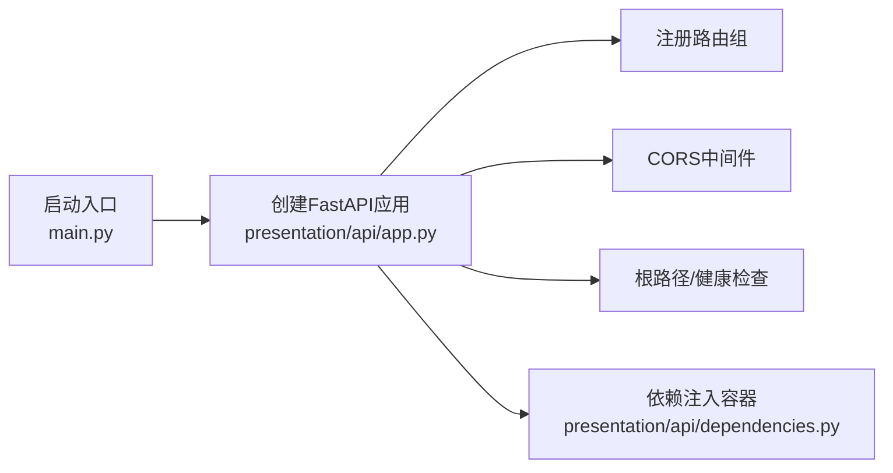
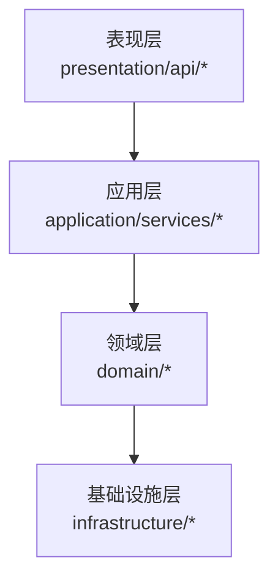

# 架构设计理念

<cite>
**本文引用的文件**
- [README.md](file://README.md)
- [main.py](file://main.py)
- [presentation/api/app.py](file://presentation/api/app.py)
- [presentation/api/dependencies.py](file://presentation/api/dependencies.py)
- [domain/__init__.py](file://domain/__init__.py)
- [domain/entities/__init__.py](file://domain/entities/__init__.py)
- [domain/repositories/__init__.py](file://domain/repositories/__init__.py)
- [domain/entities/novel.py](file://domain/entities/novel.py)
- [domain/repositories/novel_repository.py](file://domain/repositories/novel_repository.py)
- [domain/services/worldview_checker.py](file://domain/services/worldview_checker.py)
- [application/services/project_service.py](file://application/services/project_service.py)
- [application/services/__init__.py](file://application/services/__init__.py)
- [infrastructure/persistence/__init__.py](file://infrastructure/persistence/__init__.py)
- [infrastructure/persistence/sqlite_novel_repo.py](file://infrastructure/persistence/sqlite_novel_repo.py)
- [infrastructure/llm/llm_factory.py](file://infrastructure/llm/llm_factory.py)
</cite>

## 目录
1. [引言](#引言)
2. [项目结构](#项目结构)
3. [核心组件](#核心组件)
4. [架构总览](#架构总览)
5. [详细组件分析](#详细组件分析)
6. [依赖分析](#依赖分析)
7. [性能考虑](#性能考虑)
8. [故障排查指南](#故障排查指南)
9. [结论](#结论)
10. [附录](#附录)

## 引言
本项目采用Clean Architecture与领域驱动设计（DDD）相结合的理念，围绕“小说自动编写”这一核心业务，构建分层清晰、职责明确、可维护与可扩展的软件架构。通过四大核心层次（领域层、应用层、基础设施层、表现层）与依赖倒置原则，实现业务逻辑与技术细节的解耦，确保系统在演进过程中保持稳定与可控。

## 项目结构
项目采用前后端分离与多层架构结合的方式组织代码：
- 领域层（Domain）：定义实体、值对象、仓储接口与领域服务，承载核心业务规则与不变量。
- 应用层（Application）：编排业务用例，协调领域层与基础设施层，提供应用服务。
- 基础设施层（Infrastructure）：实现仓储接口、外部系统对接（如LLM、文件与数据库）、工具组件。
- 表现层（Presentation）：对外提供API与前端界面，负责用户交互与请求入口。
- 前端（frontend）：Vue3 + Vite，提供页面与交互；与后端通过REST API通信。

图示来源
- [presentation/api/app.py:19-62](file://presentation/api/app.py#L19-L62)
- [presentation/api/dependencies.py:112-141](file://presentation/api/dependencies.py#L112-L141)
- [application/services/project_service.py:21-31](file://application/services/project_service.py#L21-L31)
- [domain/entities/novel.py:20-40](file://domain/entities/novel.py#L20-L40)
- [domain/repositories/novel_repository.py:17-30](file://domain/repositories/novel_repository.py#L17-L30)
- [domain/services/worldview_checker.py:29-40](file://domain/services/worldview_checker.py#L29-L40)
- [infrastructure/persistence/sqlite_novel_repo.py:20-32](file://infrastructure/persistence/sqlite_novel_repo.py#L20-L32)
- [infrastructure/llm/llm_factory.py:31-53](file://infrastructure/llm/llm_factory.py#L31-L53)

章节来源
- [README.md:72-106](file://README.md#L72-L106)
- [main.py:15-21](file://main.py#L15-L21)

## 核心组件
- 领域层
  - 实体与聚合根：如小说聚合根，包含章节、人物、大纲等聚合内协作关系与不变量。
  - 仓储接口：以抽象接口隔离具体存储实现，保障领域逻辑不被基础设施细节污染。
  - 领域服务：如世界一致性检查服务，封装跨实体的复杂业务规则。
- 应用层
  - 应用服务：如项目服务，编排业务用例，协调仓储与领域服务，处理用例边界与事务语义。
- 基础设施层
  - 仓储实现：如SQLite小说仓储，负责持久化细节与SQL映射。
  - LLM工厂：统一管理主备大模型客户端，提供自动切换能力。
- 表现层
  - FastAPI应用与路由：集中注册路由，提供健康检查与根路径响应。
  - 依赖注入：集中声明与缓存各组件实例，降低耦合度。

章节来源
- [domain/entities/novel.py:20-40](file://domain/entities/novel.py#L20-L40)
- [domain/repositories/novel_repository.py:17-30](file://domain/repositories/novel_repository.py#L17-L30)
- [domain/services/worldview_checker.py:29-40](file://domain/services/worldview_checker.py#L29-L40)
- [application/services/project_service.py:21-31](file://application/services/project_service.py#L21-L31)
- [infrastructure/persistence/sqlite_novel_repo.py:20-32](file://infrastructure/persistence/sqlite_novel_repo.py#L20-L32)
- [infrastructure/llm/llm_factory.py:31-53](file://infrastructure/llm/llm_factory.py#L31-L53)
- [presentation/api/app.py:19-62](file://presentation/api/app.py#L19-L62)
- [presentation/api/dependencies.py:50-110](file://presentation/api/dependencies.py#L50-L110)

## 架构总览
Clean Architecture强调“依赖倒置”：高层策略（应用层与表现层）仅依赖抽象（领域与应用服务），而底层（基础设施层）实现这些抽象。本项目通过以下方式落地：
- 领域层不依赖应用层或基础设施层，仅暴露接口与实体。
- 应用层依赖领域抽象（仓储接口、领域服务），并通过依赖注入装配具体实现。
- 基础设施层实现仓储与外部系统接口，向上提供一致的服务契约。
- 表现层仅负责请求接入与路由注册，不参与业务决策。

图示来源
- [presentation/api/app.py:19-62](file://presentation/api/app.py#L19-L62)
- [presentation/api/dependencies.py:112-141](file://presentation/api/dependencies.py#L112-L141)
- [application/services/project_service.py:21-31](file://application/services/project_service.py#L21-L31)
- [domain/repositories/novel_repository.py:17-30](file://domain/repositories/novel_repository.py#L17-L30)
- [infrastructure/persistence/sqlite_novel_repo.py:20-32](file://infrastructure/persistence/sqlite_novel_repo.py#L20-L32)

## 详细组件分析

### 领域层：小说聚合与一致性检查
- 小说聚合根承担章节、人物、大纲的聚合内一致性与排序逻辑，提供新增章节、获取最新章节等行为。
- 仓储接口定义了保存、查询、删除等操作，保证应用层与基础设施层的解耦。
- 世界一致性检查服务封装跨实体的规则校验，如功法等级、势力关系、地点层级与人物关联等。

图示来源
- [domain/entities/novel.py:20-40](file://domain/entities/novel.py#L20-L40)
- [domain/repositories/novel_repository.py:17-30](file://domain/repositories/novel_repository.py#L17-L30)
- [infrastructure/persistence/sqlite_novel_repo.py:20-32](file://infrastructure/persistence/sqlite_novel_repo.py#L20-L32)
- [domain/services/worldview_checker.py:29-40](file://domain/services/worldview_checker.py#L29-L40)

章节来源
- [domain/entities/novel.py:46-62](file://domain/entities/novel.py#L46-L62)
- [domain/repositories/novel_repository.py:17-30](file://domain/repositories/novel_repository.py#L17-L30)
- [domain/services/worldview_checker.py:32-40](file://domain/services/worldview_checker.py#L32-L40)

### 应用层：项目服务与用例编排
- 项目服务作为应用服务代表，负责创建/查询/更新/归档项目，并在必要时与小说聚合根协作，确保项目与小说的绑定与配置一致性。
- 该服务通过依赖注入获取仓储与领域服务，体现应用层对领域抽象的依赖与对基础设施的无感知。

图示来源
- [presentation/api/app.py:36-52](file://presentation/api/app.py#L36-L52)
- [presentation/api/dependencies.py:122-124](file://presentation/api/dependencies.py#L122-L124)
- [application/services/project_service.py:32-67](file://application/services/project_service.py#L32-L67)
- [domain/repositories/novel_repository.py:21-30](file://domain/repositories/novel_repository.py#L21-L30)
- [infrastructure/persistence/sqlite_novel_repo.py:50-66](file://infrastructure/persistence/sqlite_novel_repo.py#L50-L66)

章节来源
- [application/services/project_service.py:32-67](file://application/services/project_service.py#L32-L67)

### 基础设施层：仓储实现与LLM工厂
- SQLite小说仓储实现负责数据库表初始化、CRUD操作与类型转换，隐藏SQL细节。
- LLM工厂负责主备模型客户端的创建与自动切换，提供统一的客户端获取接口，增强系统的容错能力。

图示来源
- [infrastructure/llm/llm_factory.py:78-95](file://infrastructure/llm/llm_factory.py#L78-L95)

章节来源
- [infrastructure/persistence/sqlite_novel_repo.py:33-48](file://infrastructure/persistence/sqlite_novel_repo.py#L33-L48)
- [infrastructure/llm/llm_factory.py:31-53](file://infrastructure/llm/llm_factory.py#L31-L53)

### 表现层：API应用与依赖注入
- FastAPI应用集中注册路由与CORS中间件，提供根路径与健康检查接口。
- 依赖注入模块集中声明与缓存各类组件实例，避免在路由层直接构造对象，提升可测试性与可维护性。

图示来源
- [main.py:15-21](file://main.py#L15-L21)
- [presentation/api/app.py:19-62](file://presentation/api/app.py#L19-L62)
- [presentation/api/dependencies.py:50-110](file://presentation/api/dependencies.py#L50-L110)

章节来源
- [presentation/api/app.py:19-62](file://presentation/api/app.py#L19-L62)
- [presentation/api/dependencies.py:50-110](file://presentation/api/dependencies.py#L50-L110)

## 依赖分析
- 层间依赖方向
  - 表现层 → 应用层：通过依赖注入获取应用服务实例。
  - 应用层 → 领域层：依赖仓储接口与领域服务。
  - 领域层 ← 基础设施层：通过实现类满足接口契约。
- 内聚与耦合
  - 领域层高内聚：围绕小说聚合与一致性检查的核心业务规则。
  - 应用层低耦合：仅依赖抽象接口，便于替换与测试。
  - 基础设施层可替换：仓储与LLM客户端均可替换实现。
- 循环依赖
  - 当前结构未见循环依赖迹象，接口与实现分离清晰。

图示来源
- [presentation/api/app.py:19-62](file://presentation/api/app.py#L19-L62)
- [presentation/api/dependencies.py:112-141](file://presentation/api/dependencies.py#L112-L141)
- [application/services/project_service.py:21-31](file://application/services/project_service.py#L21-L31)
- [domain/repositories/novel_repository.py:17-30](file://domain/repositories/novel_repository.py#L17-L30)
- [infrastructure/persistence/sqlite_novel_repo.py:20-32](file://infrastructure/persistence/sqlite_novel_repo.py#L20-L32)

## 性能考虑
- 依赖缓存与懒加载
  - 依赖注入模块使用缓存机制减少重复创建，降低启动与运行时开销。
- I/O 优化
  - SQLite仓储在批量读取时可利用游标与行工厂，减少内存占用与序列化成本。
- LLM 容错与降级
  - LLM工厂支持主备模型自动切换，提高服务可用性与稳定性。
- 可扩展性
  - 新增仓储或LLM实现只需遵循接口契约，不影响上层逻辑。
- 可维护性
  - 清晰的分层与接口使代码职责明确，便于单元测试与重构。

## 故障排查指南
- 启动与路由
  - 若无法访问根路径或健康检查，请检查应用创建与路由注册逻辑。
- 依赖注入
  - 若出现“未找到服务实例”，检查依赖注入函数是否正确注册与缓存。
- 仓储问题
  - 若数据库初始化失败，确认数据库路径与权限，以及表结构初始化逻辑。
- LLM 客户端
  - 若模型不可用，检查API密钥与网络连通性，观察工厂的主备切换行为。

章节来源
- [presentation/api/app.py:54-60](file://presentation/api/app.py#L54-L60)
- [presentation/api/dependencies.py:50-110](file://presentation/api/dependencies.py#L50-L110)
- [infrastructure/persistence/sqlite_novel_repo.py:33-48](file://infrastructure/persistence/sqlite_novel_repo.py#L33-L48)
- [infrastructure/llm/llm_factory.py:78-95](file://infrastructure/llm/llm_factory.py#L78-L95)

## 结论
本项目通过Clean Architecture与DDD的结合，实现了业务与技术的解耦、职责的清晰划分与良好的可扩展性。领域层聚焦核心业务不变量，应用层编排用例，基础设施层屏蔽实现细节，表现层专注交互与接入。配合依赖注入、工厂模式与仓储模式，系统在可维护性、可扩展性与性能方面均具备良好基础。

## 附录
- 关键设计模式
  - 工厂模式：LLM工厂统一创建与切换主备客户端。
  - 仓储模式：以接口抽象存储实现，便于替换与测试。
  - 依赖注入：集中声明与缓存组件，降低层间耦合。
- 技术考量与权衡
  - 可维护性：接口与实现分离，职责单一，易于测试与演进。
  - 可扩展性：新增功能通过实现接口即可接入，不影响既有逻辑。
  - 性能：缓存与懒加载减少资源消耗，主备模型提升可用性。