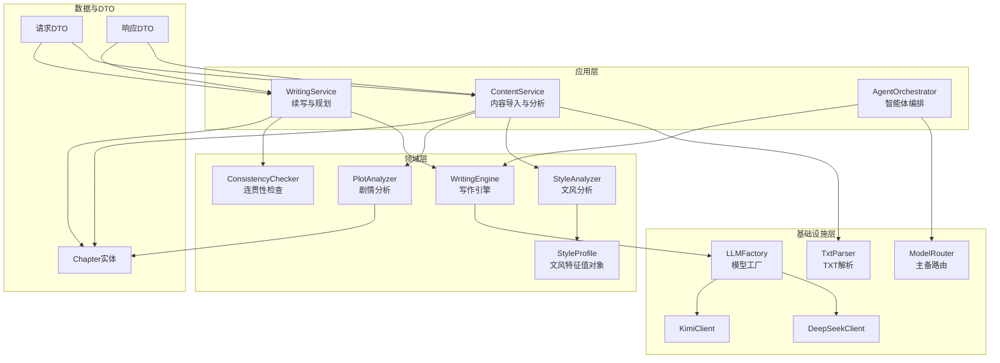
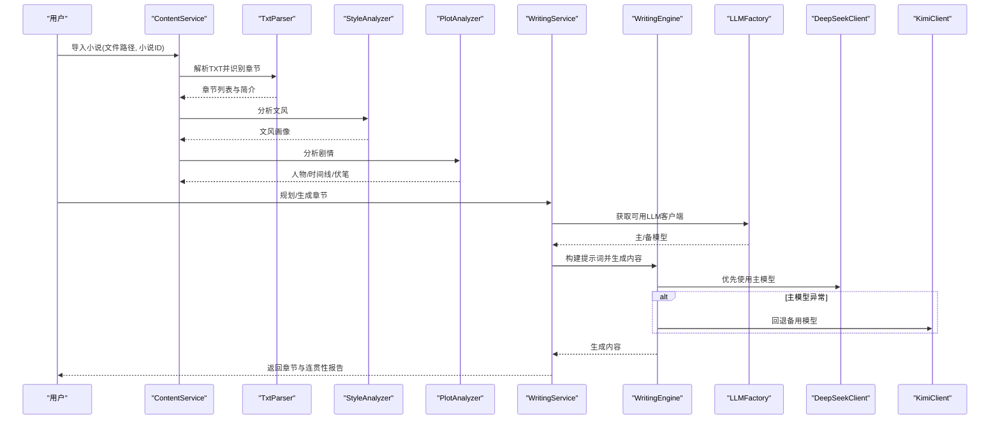
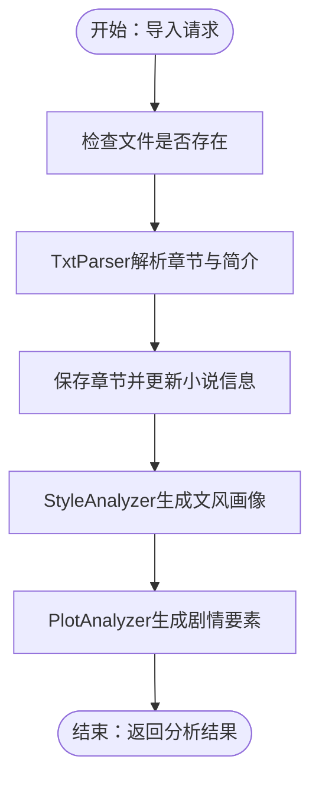
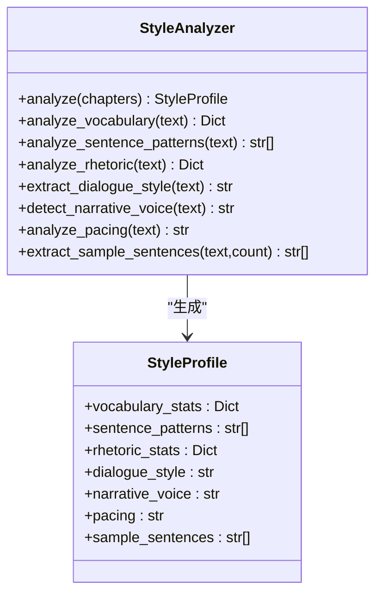
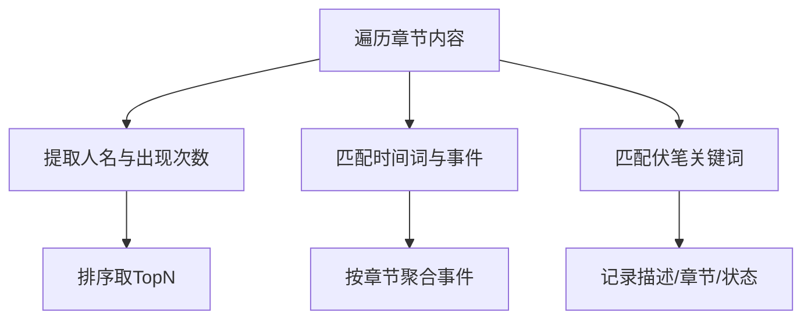
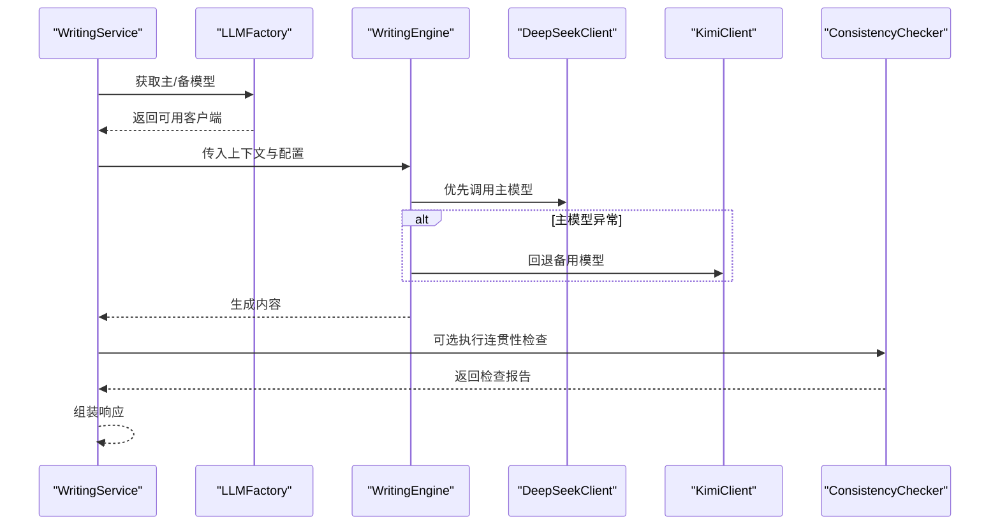
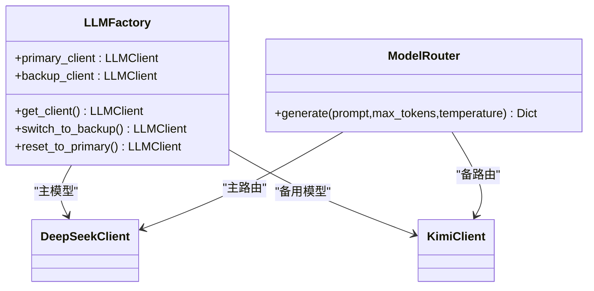
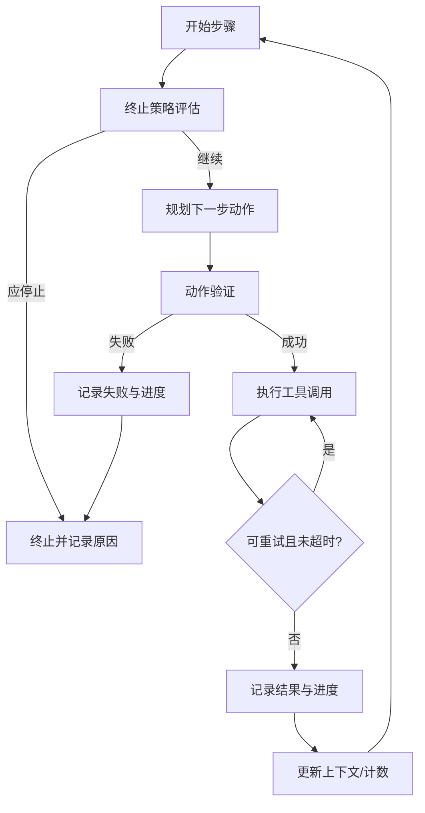
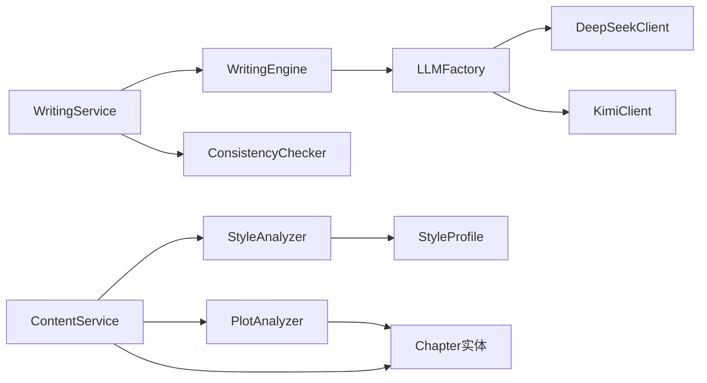

# 核心功能特性

<cite>
**本文引用的文件**   
- [application/services/content_service.py](file://application/services/content_service.py)
- [infrastructure/file/txt_parser.py](file://infrastructure/file/txt_parser.py)
- [domain/services/style_analyzer.py](file://domain/services/style_analyzer.py)
- [domain/services/plot_analyzer.py](file://domain/services/plot_analyzer.py)
- [domain/entities/chapter.py](file://domain/entities/chapter.py)
- [domain/value_objects/style_profile.py](file://domain/value_objects/style_profile.py)
- [application/services/writing_service.py](file://application/services/writing_service.py)
- [domain/services/writing_engine.py](file://domain/services/writing_engine.py)
- [domain/services/consistency_checker.py](file://domain/services/consistency_checker.py)
- [infrastructure/llm/llm_factory.py](file://infrastructure/llm/llm_factory.py)
- [infrastructure/llm/deepseek_client.py](file://infrastructure/llm/deepseek_client.py)
- [infrastructure/llm/kimi_client.py](file://infrastructure/llm/kimi_client.py)
- [application/agent_mvp/orchestrator.py](file://application/agent_mvp/orchestrator.py)
- [application/agent_mvp/model_router.py](file://application/agent_mvp/model_router.py)
- [application/dto/request_dto.py](file://application/dto/request_dto.py)
- [application/dto/response_dto.py](file://application/dto/response_dto.py)
</cite>

## 目录
1. [简介](#简介)
2. [项目结构](#项目结构)
3. [核心组件](#核心组件)
4. [架构总览](#架构总览)
5. [详细组件分析](#详细组件分析)
6. [依赖分析](#依赖分析)
7. [性能考虑](#性能考虑)
8. [故障排查指南](#故障排查指南)
9. [结论](#结论)
10. [附录](#附录)

## 简介
本文件面向InkTrace项目的使用者与开发者，系统化介绍项目的核心功能特性，涵盖小说导入与分析、文风分析、剧情分析、智能续写以及主备模型切换机制，并提供流程图与使用场景说明，帮助快速理解与落地应用。

## 项目结构
InkTrace采用分层架构：前端负责交互；后端通过应用层服务编排业务；领域层封装核心分析与引擎逻辑；基础设施层对接外部模型与文件解析；数据传输对象统一请求/响应格式。

**图表来源**
- [application/services/content_service.py:29-91](file://application/services/content_service.py#L29-L91)
- [application/services/writing_service.py:30-165](file://application/services/writing_service.py#L30-L165)
- [domain/services/style_analyzer.py:18-66](file://domain/services/style_analyzer.py#L18-L66)
- [domain/services/plot_analyzer.py:46-75](file://domain/services/plot_analyzer.py#L46-L75)
- [domain/services/writing_engine.py:30-113](file://domain/services/writing_engine.py#L30-L113)
- [domain/services/consistency_checker.py:37-87](file://domain/services/consistency_checker.py#L37-L87)
- [infrastructure/file/txt_parser.py:25-139](file://infrastructure/file/txt_parser.py#L25-L139)
- [infrastructure/llm/llm_factory.py:31-95](file://infrastructure/llm/llm_factory.py#L31-L95)
- [infrastructure/llm/deepseek_client.py:25-115](file://infrastructure/llm/deepseek_client.py#L25-L115)
- [infrastructure/llm/kimi_client.py:25-121](file://infrastructure/llm/kimi_client.py#L25-L121)
- [application/agent_mvp/orchestrator.py:17-187](file://application/agent_mvp/orchestrator.py#L17-L187)
- [application/agent_mvp/model_router.py:6-41](file://application/agent_mvp/model_router.py#L6-L41)
- [domain/entities/chapter.py:18-41](file://domain/entities/chapter.py#L18-L41)
- [domain/value_objects/style_profile.py:14-29](file://domain/value_objects/style_profile.py#L14-L29)
- [application/dto/request_dto.py:30-43](file://application/dto/request_dto.py#L30-L43)
- [application/dto/response_dto.py:22-76](file://application/dto/response_dto.py#L22-L76)

**章节来源**
- [application/services/content_service.py:29-91](file://application/services/content_service.py#L29-L91)
- [application/services/writing_service.py:30-165](file://application/services/writing_service.py#L30-L165)
- [infrastructure/file/txt_parser.py:25-139](file://infrastructure/file/txt_parser.py#L25-L139)
- [domain/services/style_analyzer.py:18-66](file://domain/services/style_analyzer.py#L18-L66)
- [domain/services/plot_analyzer.py:46-75](file://domain/services/plot_analyzer.py#L46-L75)
- [domain/services/writing_engine.py:30-113](file://domain/services/writing_engine.py#L30-L113)
- [domain/services/consistency_checker.py:37-87](file://domain/services/consistency_checker.py#L37-L87)
- [infrastructure/llm/llm_factory.py:31-95](file://infrastructure/llm/llm_factory.py#L31-L95)
- [infrastructure/llm/deepseek_client.py:25-115](file://infrastructure/llm/deepseek_client.py#L25-L115)
- [infrastructure/llm/kimi_client.py:25-121](file://infrastructure/llm/kimi_client.py#L25-L121)
- [application/agent_mvp/orchestrator.py:17-187](file://application/agent_mvp/orchestrator.py#L17-L187)
- [application/agent_mvp/model_router.py:6-41](file://application/agent_mvp/model_router.py#L6-L41)
- [domain/entities/chapter.py:18-41](file://domain/entities/chapter.py#L18-L41)
- [domain/value_objects/style_profile.py:14-29](file://domain/value_objects/style_profile.py#L14-L29)
- [application/dto/request_dto.py:30-43](file://application/dto/request_dto.py#L30-L43)
- [application/dto/response_dto.py:22-76](file://application/dto/response_dto.py#L22-L76)

## 核心组件
- 小说导入与分析：负责TXT文件解析、章节结构识别、元数据提取、文风与剧情分析。
- 文风分析：基于词汇、句式、修辞、对话风格、叙述视角、节奏等维度生成文风画像。
- 剧情分析：抽取人物、梳理时间线、标记伏笔，形成可检索的知识图谱基础。
- 智能续写：结合文风特征与上下文，生成符合设定的章节内容，并支持连贯性检查。
- 主备模型切换：基于工厂与路由策略，自动在DeepSeek与Kimi之间切换，保障稳定性与可用性。
- 智能体编排：通过终止策略与动作验证，驱动RAG检索与写作生成的协同执行。

**章节来源**
- [application/services/content_service.py:52-147](file://application/services/content_service.py#L52-L147)
- [domain/services/style_analyzer.py:25-66](file://domain/services/style_analyzer.py#L25-L66)
- [domain/services/plot_analyzer.py:55-75](file://domain/services/plot_analyzer.py#L55-L75)
- [application/services/writing_service.py:50-165](file://application/services/writing_service.py#L50-L165)
- [domain/services/writing_engine.py:52-113](file://domain/services/writing_engine.py#L52-L113)
- [infrastructure/llm/llm_factory.py:31-95](file://infrastructure/llm/llm_factory.py#L31-L95)
- [application/agent_mvp/orchestrator.py:28-187](file://application/agent_mvp/orchestrator.py#L28-L187)

## 架构总览
InkTrace围绕“导入-分析-续写-检查-导出”的闭环展开。应用层服务作为编排者，调用领域层分析器与引擎，借助基础设施层完成文件解析与模型交互；数据传输对象贯穿请求与响应，确保接口一致性。

**图表来源**
- [application/services/content_service.py:52-147](file://application/services/content_service.py#L52-L147)
- [infrastructure/file/txt_parser.py:108-139](file://infrastructure/file/txt_parser.py#L108-L139)
- [domain/services/style_analyzer.py:25-66](file://domain/services/style_analyzer.py#L25-L66)
- [domain/services/plot_analyzer.py:55-75](file://domain/services/plot_analyzer.py#L55-L75)
- [application/services/writing_service.py:50-165](file://application/services/writing_service.py#L50-L165)
- [domain/services/writing_engine.py:52-113](file://domain/services/writing_engine.py#L52-L113)
- [infrastructure/llm/llm_factory.py:78-95](file://infrastructure/llm/llm_factory.py#L78-L95)
- [infrastructure/llm/deepseek_client.py:78-115](file://infrastructure/llm/deepseek_client.py#L78-L115)
- [infrastructure/llm/kimi_client.py:84-121](file://infrastructure/llm/kimi_client.py#L84-L121)

## 详细组件分析

### 小说导入与分析
- 功能要点
  - TXT文件解析：自动检测章节标题模式，切分章节与简介，统计字数。
  - 章节结构识别：支持中文序号、英文Chapter、数字+分隔符等多种格式。
  - 元数据提取：从简介与章节内容中抽取关键字段，支撑后续分析。
  - 文风与剧情分析：调用领域服务生成文风画像与剧情要素。
- 关键流程
  - 导入请求校验 → 文件存在性检查 → 解析章节 → 保存章节与小说信息 → 返回响应。

**图表来源**
- [application/services/content_service.py:52-91](file://application/services/content_service.py#L52-L91)
- [infrastructure/file/txt_parser.py:108-139](file://infrastructure/file/txt_parser.py#L108-L139)
- [domain/services/style_analyzer.py:25-66](file://domain/services/style_analyzer.py#L25-L66)
- [domain/services/plot_analyzer.py:55-75](file://domain/services/plot_analyzer.py#L55-L75)

**章节来源**
- [application/services/content_service.py:52-147](file://application/services/content_service.py#L52-L147)
- [infrastructure/file/txt_parser.py:45-139](file://infrastructure/file/txt_parser.py#L45-L139)
- [domain/entities/chapter.py:18-41](file://domain/entities/chapter.py#L18-L41)

### 文风分析技术实现
- 词汇统计：高频词、平均词长、词汇丰富度、总词数与独立词数。
- 句式分析：基于逗号分割的句式模板归纳。
- 修辞手法：统计比喻、拟人、排比、夸张等出现频次。
- 对话风格：按平均长度与语气标点判断简洁/适中/详细与情感强度。
- 叙述视角：基于“我/他”等代词频率判定第一/第三人称或混合视角。
- 节奏特点：短句占比衡量快/中/慢节奏。
- 示例句子：抽取若干代表性句子用于风格参考。

**图表来源**
- [domain/services/style_analyzer.py:25-286](file://domain/services/style_analyzer.py#L25-L286)
- [domain/value_objects/style_profile.py:14-29](file://domain/value_objects/style_profile.py#L14-L29)

**章节来源**
- [domain/services/style_analyzer.py:68-286](file://domain/services/style_analyzer.py#L68-L286)
- [domain/value_objects/style_profile.py:14-29](file://domain/value_objects/style_profile.py#L14-L29)

### 剧情分析技术实现
- 人物抽取：基于常见命名模式与上下文动词，提取出现频次最高的角色。
- 时间线梳理：识别时间词与事件片段，按章节编号组织事件。
- 伏笔标记：匹配“神秘/等待/时机/秘密/真相/暗示/埋下”等关键词，标注章节与状态。
- 名称提取：辅助从事件描述中抽取出涉及人物名。

**图表来源**
- [domain/services/plot_analyzer.py:77-202](file://domain/services/plot_analyzer.py#L77-L202)

**章节来源**
- [domain/services/plot_analyzer.py:77-202](file://domain/services/plot_analyzer.py#L77-L202)

### 智能续写功能
- 文风模仿机制：在生成后可对内容进行风格映射（当前实现预留）。
- 剧情规划算法：根据大纲与方向生成剧情节点，区分主线与支线。
- 连贯性检查：对人物状态、时间线与剧情连续性进行校验，输出不一致项与建议。
- 上下文构建：基于最近若干章节摘要，增强续写连贯性。

**图表来源**
- [application/services/writing_service.py:50-165](file://application/services/writing_service.py#L50-L165)
- [domain/services/writing_engine.py:52-113](file://domain/services/writing_engine.py#L52-L113)
- [domain/services/consistency_checker.py:44-87](file://domain/services/consistency_checker.py#L44-L87)
- [infrastructure/llm/llm_factory.py:78-95](file://infrastructure/llm/llm_factory.py#L78-L95)
- [infrastructure/llm/deepseek_client.py:78-115](file://infrastructure/llm/deepseek_client.py#L78-L115)
- [infrastructure/llm/kimi_client.py:84-121](file://infrastructure/llm/kimi_client.py#L84-L121)

**章节来源**
- [application/services/writing_service.py:50-165](file://application/services/writing_service.py#L50-L165)
- [domain/services/writing_engine.py:52-138](file://domain/services/writing_engine.py#L52-L138)
- [domain/services/consistency_checker.py:44-87](file://domain/services/consistency_checker.py#L44-L87)

### 主备模型切换机制
- 自动切换策略
  - 首次获取：优先使用主模型（DeepSeek），若可用则固定使用；否则回退备用（Kimi）。
  - 回退路由：当主模型调用失败时，自动改用备用模型，并返回路由标识。
  - 重置策略：可主动将当前客户端重置为主模型，前提是主模型可用。
- 客户端能力
  - 均支持连接池、超时控制、重试与错误分类（API密钥、限流、网络、Token限制等）。
  - 均提供可用性探测，便于工厂选择。

**图表来源**
- [infrastructure/llm/llm_factory.py:31-121](file://infrastructure/llm/llm_factory.py#L31-L121)
- [application/agent_mvp/model_router.py:6-41](file://application/agent_mvp/model_router.py#L6-L41)
- [infrastructure/llm/deepseek_client.py:25-115](file://infrastructure/llm/deepseek_client.py#L25-L115)
- [infrastructure/llm/kimi_client.py:25-121](file://infrastructure/llm/kimi_client.py#L25-L121)

**章节来源**
- [infrastructure/llm/llm_factory.py:78-121](file://infrastructure/llm/llm_factory.py#L78-L121)
- [application/agent_mvp/model_router.py:11-41](file://application/agent_mvp/model_router.py#L11-L41)
- [infrastructure/llm/deepseek_client.py:213-227](file://infrastructure/llm/deepseek_client.py#L213-L227)
- [infrastructure/llm/kimi_client.py:219-226](file://infrastructure/llm/kimi_client.py#L219-L226)

### 智能体编排（Agent MVP）
- 决策循环：根据终止策略评估是否停止；若上下文缺失，先执行RAG检索补充信息；随后调用写作生成工具。
- 动作验证：对工具调用进行合法性校验，记录追踪与重试信息。
- 幂等键：对写入类操作自动生成幂等键，避免重复执行。
- 可观测性：全程记录决策层、执行层与观察层的轨迹，便于审计与调试。

**图表来源**
- [application/agent_mvp/orchestrator.py:28-187](file://application/agent_mvp/orchestrator.py#L28-L187)

**章节来源**
- [application/agent_mvp/orchestrator.py:28-187](file://application/agent_mvp/orchestrator.py#L28-L187)

## 依赖分析
- 应用层服务依赖领域服务与基础设施组件，职责清晰、耦合可控。
- 文风与剧情分析依赖章节实体与值对象，保证数据结构稳定。
- 续写服务依赖写作引擎与连贯性检查，形成闭环质量保障。
- 模型工厂与客户端解耦，便于扩展其他模型供应商。

**图表来源**
- [application/services/content_service.py:48-50](file://application/services/content_service.py#L48-L50)
- [application/services/writing_service.py:45-46](file://application/services/writing_service.py#L45-L46)
- [domain/services/style_analyzer.py:14-15](file://domain/services/style_analyzer.py#L14-L15)
- [domain/services/plot_analyzer.py:15-16](file://domain/services/plot_analyzer.py#L15-L16)
- [domain/entities/chapter.py:14-15](file://domain/entities/chapter.py#L14-L15)
- [domain/value_objects/style_profile.py:14-29](file://domain/value_objects/style_profile.py#L14-L29)
- [infrastructure/llm/llm_factory.py:40-51](file://infrastructure/llm/llm_factory.py#L40-L51)
- [infrastructure/llm/deepseek_client.py:33-57](file://infrastructure/llm/deepseek_client.py#L33-L57)
- [infrastructure/llm/kimi_client.py:33-57](file://infrastructure/llm/kimi_client.py#L33-L57)

**章节来源**
- [application/services/content_service.py:48-50](file://application/services/content_service.py#L48-L50)
- [application/services/writing_service.py:45-46](file://application/services/writing_service.py#L45-L46)
- [infrastructure/llm/llm_factory.py:40-51](file://infrastructure/llm/llm_factory.py#L40-L51)

## 性能考虑
- I/O与解析
  - TXT解析采用多模式匹配与一次性读取，减少磁盘访问；章节切分按首个匹配位置定位，避免全量扫描。
- 模型调用
  - 客户端使用连接池与超时控制，降低延迟与资源占用；支持重试与错误分类，提升鲁棒性。
- 文风与剧情分析
  - 文风统计基于词频与正则，复杂度与文本长度线性相关；剧情分析采用有限规则集，适合大规模文本。
- 续写与检查
  - 写作引擎仅在需要时应用文风映射；连贯性检查按需启用，避免不必要的开销。

[本节为通用指导，无需列出具体文件来源]

## 故障排查指南
- 导入失败
  - 症状：找不到文件或解析不到章节。
  - 排查：确认文件路径与编码；检查章节标题是否符合预设模式。
- 文风/剧情分析为空
  - 症状：返回空画像或空列表。
  - 排查：确认章节内容非空；检查正则模式覆盖率。
- 续写失败或质量不佳
  - 症状：模型报错或生成内容不连贯。
  - 排查：查看主/备模型可用性；调整温度与目标字数；开启连贯性检查定位问题。
- 连贯性检查告警
  - 症状：人物境界倒退或跳级警告。
  - 排查：修正人物状态描述；确保事件顺序与章节编号一致。

**章节来源**
- [application/services/content_service.py:68-71](file://application/services/content_service.py#L68-L71)
- [domain/services/style_analyzer.py:37-46](file://domain/services/style_analyzer.py#L37-L46)
- [domain/services/plot_analyzer.py:16-20](file://domain/services/plot_analyzer.py#L16-L20)
- [infrastructure/llm/deepseek_client.py:163-193](file://infrastructure/llm/deepseek_client.py#L163-L193)
- [infrastructure/llm/kimi_client.py:169-199](file://infrastructure/llm/kimi_client.py#L169-L199)
- [domain/services/consistency_checker.py:127-140](file://domain/services/consistency_checker.py#L127-L140)

## 结论
InkTrace通过“导入-分析-续写-检查-导出”的完整链路，将文本解析、文风与剧情分析、智能写作与质量保障有机结合。主备模型切换机制提升了系统的可靠性；智能体编排使流程可追踪、可验证。建议在实际使用中结合业务场景调整参数与策略，持续优化生成效果与一致性。

[本节为总结性内容，无需列出具体文件来源]

## 附录
- 使用场景示例
  - 小说导入：批量导入TXT，自动切分章节并生成文风画像与剧情要素。
  - 文风迁移：基于文风画像生成风格一致的新章节。
  - 剧情规划：根据大纲与方向生成剧情节点，指导后续创作。
  - 连贯性保障：在生成后自动检查人物状态与时间线，及时发现不一致。
- 数据传输对象
  - 请求DTO：统一承载用户ID、会话ID、跟踪ID与业务参数。
  - 响应DTO：标准化返回成功标志、消息与业务数据。

**章节来源**
- [application/dto/request_dto.py:30-43](file://application/dto/request_dto.py#L30-L43)
- [application/dto/response_dto.py:22-76](file://application/dto/response_dto.py#L22-L76)