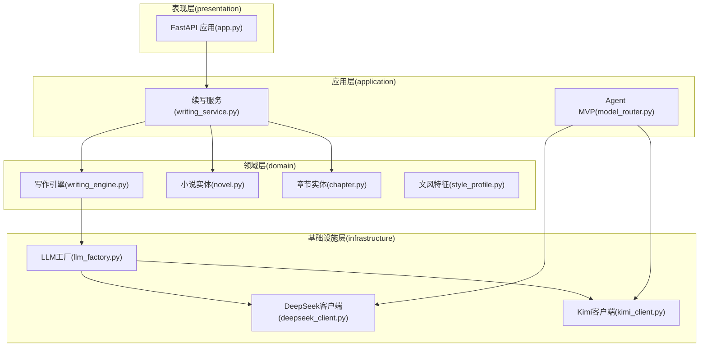
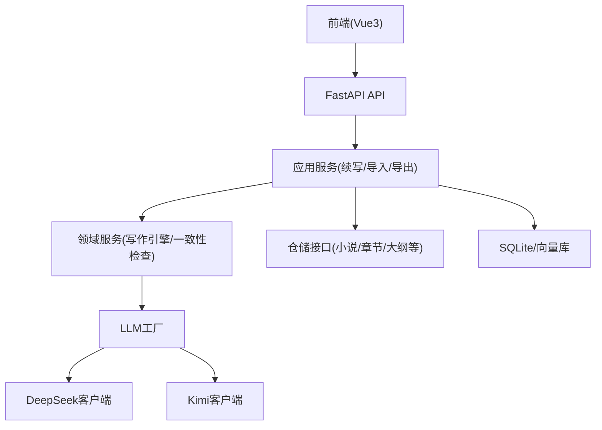
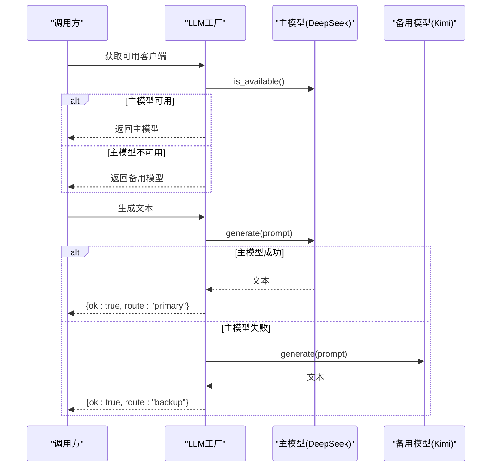
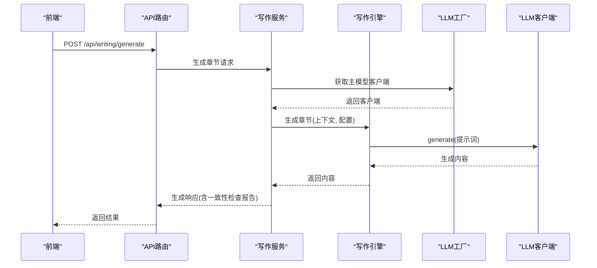
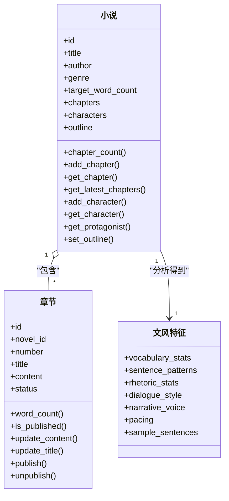
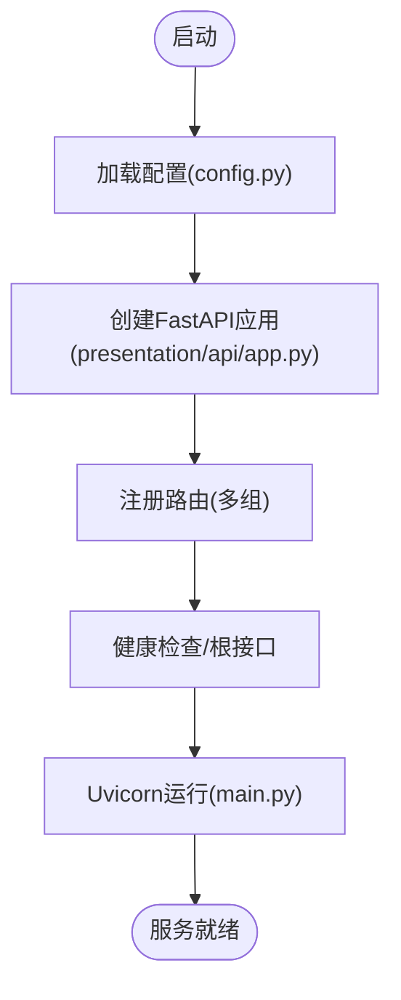
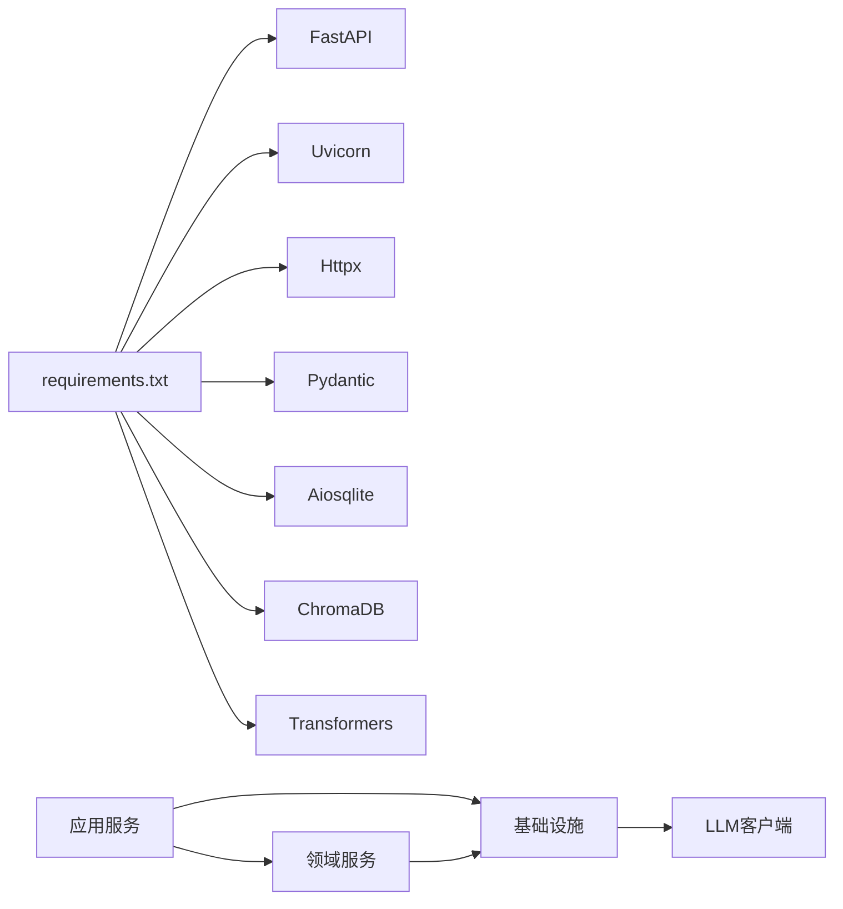

# 项目概述

<cite>
**本文引用的文件**
- [README.md](file://README.md)
- [main.py](file://main.py)
- [config.py](file://config.py)
- [requirements.txt](file://requirements.txt)
- [presentation/api/app.py](file://presentation/api/app.py)
- [application/services/writing_service.py](file://application/services/writing_service.py)
- [domain/services/writing_engine.py](file://domain/services/writing_engine.py)
- [infrastructure/llm/llm_factory.py](file://infrastructure/llm/llm_factory.py)
- [infrastructure/llm/deepseek_client.py](file://infrastructure/llm/deepseek_client.py)
- [infrastructure/llm/kimi_client.py](file://infrastructure/llm/kimi_client.py)
- [domain/entities/novel.py](file://domain/entities/novel.py)
- [domain/entities/chapter.py](file://domain/entities/chapter.py)
- [domain/value_objects/style_profile.py](file://domain/value_objects/style_profile.py)
- [application/agent_mvp/model_router.py](file://application/agent_mvp/model_router.py)
</cite>

## 目录
1. [引言](#引言)
2. [项目结构](#项目结构)
3. [核心组件](#核心组件)
4. [架构总览](#架构总览)
5. [详细组件分析](#详细组件分析)
6. [依赖分析](#依赖分析)
7. [性能考虑](#性能考虑)
8. [故障排查指南](#故障排查指南)
9. [结论](#结论)
10. [附录](#附录)

## 引言
InkTrace AI小说自动编写助手旨在帮助创作者基于已有小说原文与大纲，自动分析文风与剧情，并生成符合原作风格的新章节内容。项目强调“文风模仿”“剧情连贯性检查”“主备AI模型自动切换”，并提供从导入、分析、续写到导出的一体化工作流。项目采用领域驱动设计（DDD）分层架构，结合FastAPI后端、Vue3前端与Electron桌面应用形态，覆盖从数据模型到基础设施的完整链路。

## 项目结构
项目采用清晰的分层组织：
- domain：领域层，包含实体、值对象、领域服务与仓储接口，定义业务规则与不变量
- application：应用层，包含应用服务与DTO，编排领域逻辑与外部交互
- infrastructure：基础设施层，包含LLM客户端、持久化实现、文件处理与安全工具
- presentation：表现层，FastAPI应用与路由，对外提供REST API
- frontend：Vue3前端工程，页面与状态管理
- desktop：Electron桌面应用入口与进程管理
- docs：项目文档与路线图
- tests：单元测试与集成测试

图表来源
- [presentation/api/app.py:19-62](file://presentation/api/app.py#L19-L62)
- [application/services/writing_service.py:30-180](file://application/services/writing_service.py#L30-L180)
- [domain/services/writing_engine.py:30-184](file://domain/services/writing_engine.py#L30-L184)
- [infrastructure/llm/llm_factory.py:31-121](file://infrastructure/llm/llm_factory.py#L31-L121)
- [infrastructure/llm/deepseek_client.py:25-238](file://infrastructure/llm/deepseek_client.py#L25-L238)
- [infrastructure/llm/kimi_client.py:25-244](file://infrastructure/llm/kimi_client.py#L25-L244)

章节来源
- [README.md:72-106](file://README.md#L72-L106)

## 核心组件
- 启动与配置
  - 后端通过Uvicorn运行FastAPI应用，配置来源于环境变量
  - 应用配置集中于配置模块，支持主机、端口、调试模式、数据库路径与API密钥
- API服务
  - FastAPI应用注册多组路由，覆盖小说、内容、写作、导出、项目、模板、角色、世界观、向量检索与配置管理
- 写作服务
  - 负责剧情规划、章节生成与连贯性检查；协调LLM工厂与领域引擎
- 写作引擎
  - 构建生成提示词、调用LLM生成内容、可选应用文风特征
- LLM工厂与客户端
  - 工厂负责主备模型选择与可用性探测；DeepSeek与Kimi客户端封装API调用、重试与错误处理
- 领域模型
  - 小说与章节实体承载业务不变量；文风特征值对象描述风格统计

章节来源
- [main.py:15-22](file://main.py#L15-L22)
- [config.py:14-46](file://config.py#L14-L46)
- [presentation/api/app.py:19-62](file://presentation/api/app.py#L19-L62)
- [application/services/writing_service.py:30-180](file://application/services/writing_service.py#L30-L180)
- [domain/services/writing_engine.py:30-184](file://domain/services/writing_engine.py#L30-L184)
- [infrastructure/llm/llm_factory.py:31-121](file://infrastructure/llm/llm_factory.py#L31-L121)
- [infrastructure/llm/deepseek_client.py:25-238](file://infrastructure/llm/deepseek_client.py#L25-L238)
- [infrastructure/llm/kimi_client.py:25-244](file://infrastructure/llm/kimi_client.py#L25-L244)
- [domain/entities/novel.py:20-178](file://domain/entities/novel.py#L20-L178)
- [domain/entities/chapter.py:18-109](file://domain/entities/chapter.py#L18-L109)
- [domain/value_objects/style_profile.py:14-30](file://domain/value_objects/style_profile.py#L14-L30)

## 架构总览
项目采用DDD分层架构，职责清晰：
- 表现层：提供REST API与健康检查
- 应用层：编排业务流程，协调领域服务与仓储
- 领域层：定义实体、值对象与领域服务，确保业务规则
- 基础设施层：实现持久化、LLM接入与文件处理

图表来源
- [presentation/api/app.py:19-62](file://presentation/api/app.py#L19-L62)
- [application/services/writing_service.py:30-180](file://application/services/writing_service.py#L30-L180)
- [domain/services/writing_engine.py:30-184](file://domain/services/writing_engine.py#L30-L184)
- [infrastructure/llm/llm_factory.py:31-121](file://infrastructure/llm/llm_factory.py#L31-L121)

## 详细组件分析

### 组件A：主备模型切换与路由
- 设计思路
  - LLM工厂负责主备模型实例化与可用性探测；当主模型不可用时自动切换备用模型
  - Agent MVP提供简化路由策略，优先尝试主模型，失败则回退备用模型
- 关键流程
  - 获取客户端：优先主模型可用则使用，否则使用备用模型
  - 生成文本：主模型成功则返回主模型结果，失败则尝试备用模型
- 性能与可靠性
  - 连接池复用与超时控制降低延迟与资源占用
  - 统一异常类型便于上层统一处理

图表来源
- [infrastructure/llm/llm_factory.py:78-121](file://infrastructure/llm/llm_factory.py#L78-L121)
- [application/agent_mvp/model_router.py:11-42](file://application/agent_mvp/model_router.py#L11-L42)
- [infrastructure/llm/deepseek_client.py:213-238](file://infrastructure/llm/deepseek_client.py#L213-L238)
- [infrastructure/llm/kimi_client.py:219-244](file://infrastructure/llm/kimi_client.py#L219-L244)

章节来源
- [infrastructure/llm/llm_factory.py:31-121](file://infrastructure/llm/llm_factory.py#L31-L121)
- [application/agent_mvp/model_router.py:6-42](file://application/agent_mvp/model_router.py#L6-L42)
- [infrastructure/llm/deepseek_client.py:25-238](file://infrastructure/llm/deepseek_client.py#L25-L238)
- [infrastructure/llm/kimi_client.py:25-244](file://infrastructure/llm/kimi_client.py#L25-L244)

### 组件B：写作服务与引擎
- 设计思路
  - 写作服务编排：接收请求、查询小说与章节、构建上下文、调用写作引擎生成内容、可选执行一致性检查
  - 写作引擎：构建提示词、调用LLM、可选应用文风特征
- 关键流程
  - 生成章节：组装上下文与配置，调用引擎生成内容，保存为新章节
  - 规划剧情：基于大纲与方向生成剧情节点
- 性能与可靠性
  - 上下文截断与温度参数控制提升稳定性
  - 文风特征缓存减少重复计算

图表来源
- [application/services/writing_service.py:91-165](file://application/services/writing_service.py#L91-L165)
- [domain/services/writing_engine.py:52-80](file://domain/services/writing_engine.py#L52-L80)
- [infrastructure/llm/llm_factory.py:78-95](file://infrastructure/llm/llm_factory.py#L78-L95)

章节来源
- [application/services/writing_service.py:30-180](file://application/services/writing_service.py#L30-L180)
- [domain/services/writing_engine.py:30-184](file://domain/services/writing_engine.py#L30-L184)

### 组件C：领域模型与数据结构
- 小说实体
  - 聚合根，维护章节、人物、大纲集合，提供字数统计与最新章节查询
- 章节实体
  - 章节状态机与字数计算，支持发布/取消发布操作
- 文风特征值对象
  - 描述词汇、句式、修辞、对白风格、叙述语态、节奏与样例句子等

图表来源
- [domain/entities/novel.py:20-178](file://domain/entities/novel.py#L20-L178)
- [domain/entities/chapter.py:18-109](file://domain/entities/chapter.py#L18-L109)
- [domain/value_objects/style_profile.py:14-30](file://domain/value_objects/style_profile.py#L14-L30)

章节来源
- [domain/entities/novel.py:20-178](file://domain/entities/novel.py#L20-L178)
- [domain/entities/chapter.py:18-109](file://domain/entities/chapter.py#L18-L109)
- [domain/value_objects/style_profile.py:14-30](file://domain/value_objects/style_profile.py#L14-L30)

### 组件D：API与启动流程
- 启动流程
  - 通过Uvicorn运行FastAPI应用，读取配置并暴露健康检查与根接口
- API路由
  - 注册多组路由，覆盖小说、内容、写作、导出、项目、模板、角色、世界观、向量检索与配置管理
- 配置管理
  - 从环境变量加载主机、端口、调试模式、数据库路径与API密钥

图表来源
- [main.py:15-22](file://main.py#L15-L22)
- [config.py:30-46](file://config.py#L30-L46)
- [presentation/api/app.py:19-62](file://presentation/api/app.py#L19-L62)

章节来源
- [main.py:15-22](file://main.py#L15-L22)
- [config.py:14-46](file://config.py#L14-L46)
- [presentation/api/app.py:19-62](file://presentation/api/app.py#L19-L62)

## 依赖分析
- 技术栈概览
  - 后端：Python 3.11+、FastAPI、SQLite、DeepSeek/Kimi API
  - 前端：Vue 3、Vite、Element Plus、Vue Router、Pinia
  - 基础设施：httpx、aiosqlite、chromadb、sentence-transformers
- 依赖关系
  - 应用服务依赖领域服务与仓储接口
  - 领域服务依赖LLM工厂与值对象
  - LLM工厂依赖具体客户端实现
  - API层依赖应用服务

图表来源
- [requirements.txt:1-10](file://requirements.txt#L1-L10)

章节来源
- [requirements.txt:1-10](file://requirements.txt#L1-L10)
- [README.md:172-186](file://README.md#L172-L186)

## 性能考虑
- 模型侧
  - 连接池复用与超时控制，避免频繁握手与阻塞
  - 输入截断与温度参数控制，平衡质量与稳定性
- 应用侧
  - 文风特征缓存与最近章节上下文截断，减少重复计算与上下文膨胀
  - 主备切换快速回退，保障可用性
- 前端与桌面
  - 前端工程化构建与热更新，提升开发体验；桌面应用通过IPC与进程管理提升用户体验

## 故障排查指南
- 常见问题
  - API密钥无效：检查环境变量配置，确认主备模型密钥均正确设置
  - 限流/网络错误：查看日志与重试机制，适当调整超时与重试次数
  - 模型不可用：通过客户端可用性探测接口判断，必要时手动切换备用模型
- 排查步骤
  - 启动后端并访问健康检查接口确认服务状态
  - 查看日志定位具体错误类型（APIKey/RateLimit/Network/TokenLimit）
  - 在写作服务中开启/关闭一致性检查与文风模仿，逐步定位问题

章节来源
- [infrastructure/llm/deepseek_client.py:163-193](file://infrastructure/llm/deepseek_client.py#L163-L193)
- [infrastructure/llm/kimi_client.py:169-199](file://infrastructure/llm/kimi_client.py#L169-L199)
- [presentation/api/app.py:54-60](file://presentation/api/app.py#L54-L60)

## 结论
InkTrace通过清晰的DDD分层与主备模型切换机制，实现了从文风分析到章节生成的自动化流程。项目具备良好的扩展性与可靠性，适合希望提升创作效率的网文作者与团队使用。后续可在文风特征提取、RAG检索增强与更多模型接入方面持续演进。

## 附录
- 版本信息
  - 后端版本：3.0.0
  - 项目版本：1.0.0
- 许可证
  - MIT License
- 快速开始
  - 安装依赖、配置API密钥、启动后端与前端，访问本地界面与API文档

章节来源
- [README.md:4,24-69,158-169,172-186,205-208:4-208](file://README.md#L4-L208)