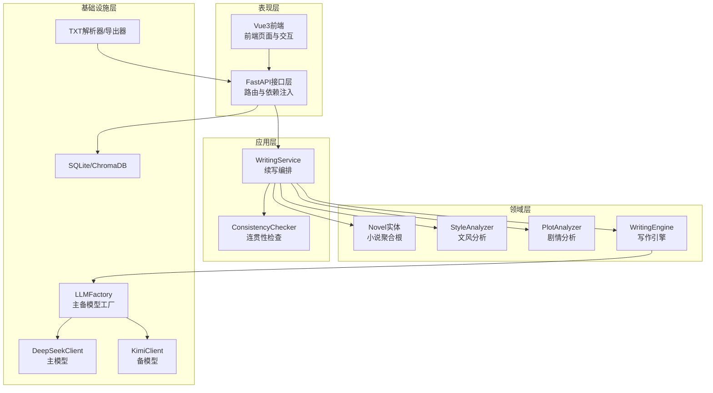
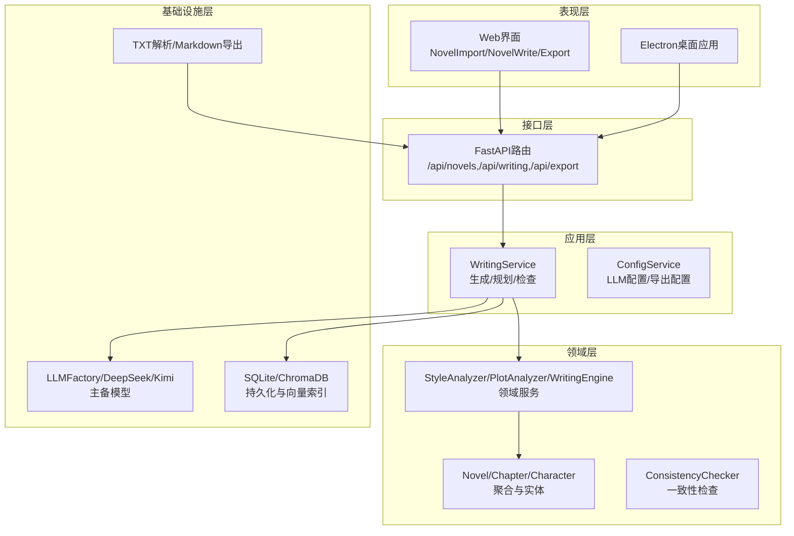
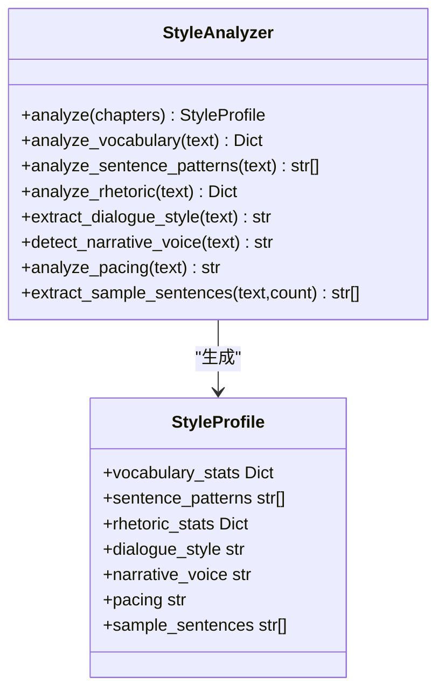
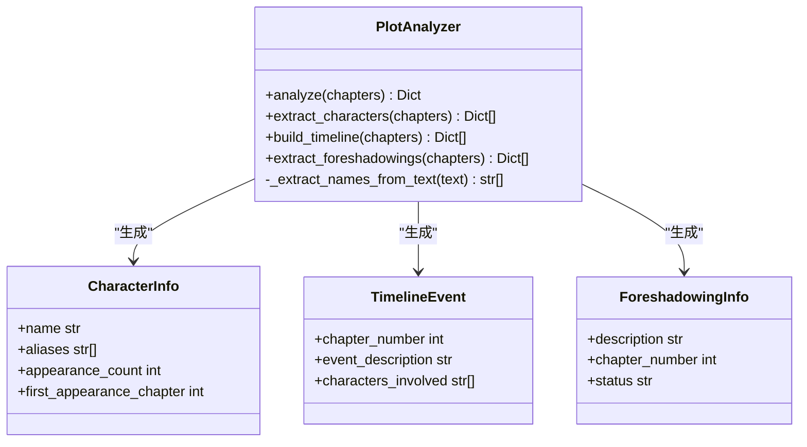
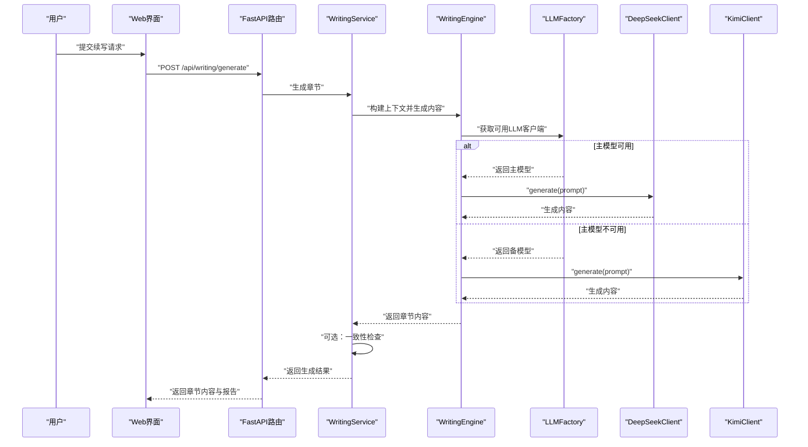
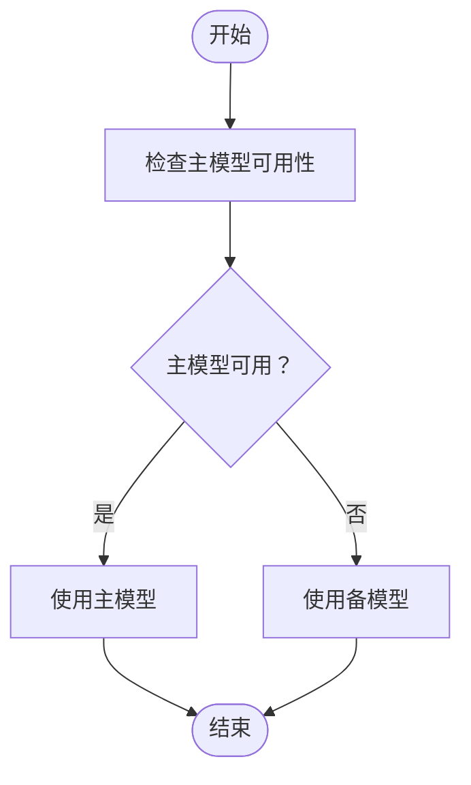
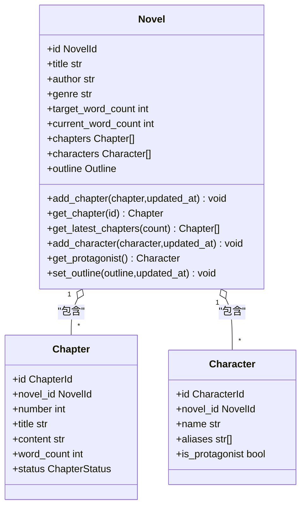
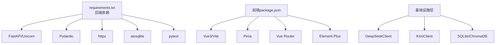

# 项目简介与核心价值

<cite>
**本文引用的文件**
- [README.md](file://README.md)
- [docs/PROJECT_MEMO.md](file://docs/PROJECT_MEMO.md)
- [docs/STARTUP_GUIDE.md](file://docs/STARTUP_GUIDE.md)
- [main.py](file://main.py)
- [config.py](file://config.py)
- [requirements.txt](file://requirements.txt)
- [domain/entities/novel.py](file://domain/entities/novel.py)
- [domain/services/style_analyzer.py](file://domain/services/style_analyzer.py)
- [domain/services/plot_analyzer.py](file://domain/services/plot_analyzer.py)
- [domain/services/writing_engine.py](file://domain/services/writing_engine.py)
- [application/services/writing_service.py](file://application/services/writing_service.py)
- [infrastructure/llm/llm_factory.py](file://infrastructure/llm/llm_factory.py)
- [infrastructure/llm/deepseek_client.py](file://infrastructure/llm/deepseek_client.py)
- [infrastructure/llm/kimi_client.py](file://infrastructure/llm/kimi_client.py)
</cite>

## 目录
1. [项目简介](#项目简介)
2. [项目结构](#项目结构)
3. [核心组件](#核心组件)
4. [架构总览](#架构总览)
5. [详细组件分析](#详细组件分析)
6. [依赖分析](#依赖分析)
7. [性能考虑](#性能考虑)
8. [故障排查指南](#故障排查指南)
9. [结论](#结论)
10. [附录](#附录)

## 项目简介
InkTrace AI小说自动编写助手是一款面向网络小说作者与内容创作者的智能化写作辅助平台。其核心价值在于：以“已有小说原文+大纲”为起点，自动完成文风与剧情的深度分析，并基于分析结果进行高质量续写；在保证内容质量的同时，规避AI检测风险，提升创作效率与可持续产出能力。

- 核心目标：帮助作者将一部中长篇小说从现有章节扩展至更高字数规模，维持风格一致与情节连贯。
- 独特优势：
  - AI检测规避：通过多模型主备切换与提示工程优化，降低生成内容被识别为AI的概率。
  - 文风模仿精度：基于词汇、句式、修辞、对话风格等多维度特征，实现高保真风格迁移。
  - 自动化程度高：从导入、分析、续写到导出形成闭环，减少人工干预。
  - 可靠性保障：主备模型自动切换、超时与限流处理、连接池复用等工程化设计。

**章节来源**
- [README.md:10-20](file://README.md#L10-L20)
- [README.md:12-20](file://README.md#L12-L20)
- [docs/PROJECT_MEMO.md:19-21](file://docs/PROJECT_MEMO.md#L19-L21)

## 项目结构
项目采用清洁架构（Clean Architecture），分层清晰、职责分离，便于维护与扩展。主要分为领域层、应用层、基础设施层与表现层（API与前端），并辅以桌面应用层。

**图表来源**
- [docs/PROJECT_MEMO.md:34-47](file://docs/PROJECT_MEMO.md#L34-L47)
- [docs/PROJECT_MEMO.md:120-130](file://docs/PROJECT_MEMO.md#L120-L130)
- [docs/PROJECT_MEMO.md:109-119](file://docs/PROJECT_MEMO.md#L109-L119)

**章节来源**
- [docs/PROJECT_MEMO.md:34-47](file://docs/PROJECT_MEMO.md#L34-L47)
- [docs/PROJECT_MEMO.md:109-119](file://docs/PROJECT_MEMO.md#L109-L119)
- [docs/PROJECT_MEMO.md:120-130](file://docs/PROJECT_MEMO.md#L120-L130)

## 核心组件
- 智能导入：支持TXT格式小说文件解析，自动识别章节结构并抽取人物、大纲信息，为后续分析与续写提供素材。
- 文风分析：从词汇、句式、修辞、对话风格、叙述视角、节奏等多个维度提取特征，形成可复用的文风档案。
- 剧情分析：提取人物关系、时间线事件、潜在伏笔，构建故事骨架，指导续写方向。
- 智能续写：基于文风模仿与剧情规划，结合上下文与提示词工程，生成符合原作风格的新章节。
- 连贯性检查：对生成章节进行人物状态、时间线一致性等检查，输出连贯性报告，辅助人工审阅。
- 主备模型切换：内置DeepSeek主模型与Kimi备模型，自动探测可用性并进行无缝切换，提升稳定性与可用性。

**章节来源**
- [README.md:14-19](file://README.md#L14-L19)
- [docs/STARTUP_GUIDE.md:197-218](file://docs/STARTUP_GUIDE.md#L197-L218)
- [domain/services/style_analyzer.py:25-66](file://domain/services/style_analyzer.py#L25-L66)
- [domain/services/plot_analyzer.py:55-75](file://domain/services/plot_analyzer.py#L55-L75)
- [domain/services/writing_engine.py:52-80](file://domain/services/writing_engine.py#L52-L80)
- [application/services/writing_service.py:144-165](file://application/services/writing_service.py#L144-L165)
- [infrastructure/llm/llm_factory.py:78-95](file://infrastructure/llm/llm_factory.py#L78-L95)

## 架构总览
InkTrace采用分层架构，围绕领域模型构建业务能力，应用层负责编排与协调，基础设施层提供具体实现（LLM、存储、文件处理），表现层提供Web与桌面两种交互形态。

**图表来源**
- [docs/PROJECT_MEMO.md:34-47](file://docs/PROJECT_MEMO.md#L34-L47)
- [presentation/api/routers/writing.py](file://presentation/api/routers/writing.py)
- [presentation/api/routers/novel.py](file://presentation/api/routers/novel.py)
- [presentation/api/routers/export.py](file://presentation/api/routers/export.py)

**章节来源**
- [docs/PROJECT_MEMO.md:34-47](file://docs/PROJECT_MEMO.md#L34-L47)
- [presentation/api/app.py](file://presentation/api/app.py)

## 详细组件分析

### 文风分析组件
文风分析服务通过对原始文本进行词汇、句式、修辞、对话风格、叙述视角与节奏的统计与归纳，输出可量化、可复用的文风特征，为后续风格迁移提供依据。

**图表来源**
- [domain/services/style_analyzer.py:18-66](file://domain/services/style_analyzer.py#L18-L66)
- [domain/value_objects/style_profile.py](file://domain/value_objects/style_profile.py)

**章节来源**
- [domain/services/style_analyzer.py:25-66](file://domain/services/style_analyzer.py#L25-L66)
- [domain/services/style_analyzer.py:68-99](file://domain/services/style_analyzer.py#L68-L99)
- [domain/services/style_analyzer.py:101-126](file://domain/services/style_analyzer.py#L101-L126)
- [domain/services/style_analyzer.py:128-177](file://domain/services/style_analyzer.py#L128-L177)
- [domain/services/style_analyzer.py:179-215](file://domain/services/style_analyzer.py#L179-L215)
- [domain/services/style_analyzer.py:217-237](file://domain/services/style_analyzer.py#L217-L237)
- [domain/services/style_analyzer.py:239-267](file://domain/services/style_analyzer.py#L239-L267)
- [domain/services/style_analyzer.py:269-285](file://domain/services/style_analyzer.py#L269-L285)

### 剧情分析组件
剧情分析服务从章节文本中抽取人物、时间线事件与伏笔线索，形成结构化的剧情视图，支撑续写过程中的情节连贯与主题深化。

**图表来源**
- [domain/services/plot_analyzer.py:46-75](file://domain/services/plot_analyzer.py#L46-L75)
- [domain/services/plot_analyzer.py:77-119](file://domain/services/plot_analyzer.py#L77-L119)
- [domain/services/plot_analyzer.py:121-168](file://domain/services/plot_analyzer.py#L121-L168)
- [domain/services/plot_analyzer.py:170-202](file://domain/services/plot_analyzer.py#L170-L202)

**章节来源**
- [domain/services/plot_analyzer.py:55-75](file://domain/services/plot_analyzer.py#L55-L75)
- [domain/services/plot_analyzer.py:77-119](file://domain/services/plot_analyzer.py#L77-L119)
- [domain/services/plot_analyzer.py:121-168](file://domain/services/plot_analyzer.py#L121-L168)
- [domain/services/plot_analyzer.py:170-202](file://domain/services/plot_analyzer.py#L170-L202)

### 写作引擎与续写服务
写作引擎负责将文风特征与剧情规划转化为可执行的提示词，并调用LLM生成章节内容；应用层的续写服务则完成请求编排、上下文构建与连贯性检查。

**图表来源**
- [application/services/writing_service.py:91-165](file://application/services/writing_service.py#L91-L165)
- [domain/services/writing_engine.py:52-80](file://domain/services/writing_engine.py#L52-L80)
- [infrastructure/llm/llm_factory.py:78-95](file://infrastructure/llm/llm_factory.py#L78-L95)
- [infrastructure/llm/deepseek_client.py:78-115](file://infrastructure/llm/deepseek_client.py#L78-L115)
- [infrastructure/llm/kimi_client.py:84-121](file://infrastructure/llm/kimi_client.py#L84-L121)

**章节来源**
- [application/services/writing_service.py:91-165](file://application/services/writing_service.py#L91-L165)
- [domain/services/writing_engine.py:52-80](file://domain/services/writing_engine.py#L52-L80)
- [domain/services/writing_engine.py:139-183](file://domain/services/writing_engine.py#L139-L183)
- [infrastructure/llm/llm_factory.py:31-95](file://infrastructure/llm/llm_factory.py#L31-L95)
- [infrastructure/llm/deepseek_client.py:25-115](file://infrastructure/llm/deepseek_client.py#L25-L115)
- [infrastructure/llm/kimi_client.py:25-121](file://infrastructure/llm/kimi_client.py#L25-L121)

### 主备模型切换流程
主备模型工厂根据可用性动态选择LLM客户端，确保在主模型异常时自动切换至备模型，提升整体稳定性。

**图表来源**
- [infrastructure/llm/llm_factory.py:78-95](file://infrastructure/llm/llm_factory.py#L78-L95)
- [infrastructure/llm/deepseek_client.py:213-220](file://infrastructure/llm/deepseek_client.py#L213-L220)
- [infrastructure/llm/kimi_client.py:219-226](file://infrastructure/llm/kimi_client.py#L219-L226)

**章节来源**
- [infrastructure/llm/llm_factory.py:78-121](file://infrastructure/llm/llm_factory.py#L78-L121)
- [infrastructure/llm/deepseek_client.py:213-227](file://infrastructure/llm/deepseek_client.py#L213-L227)
- [infrastructure/llm/kimi_client.py:219-233](file://infrastructure/llm/kimi_client.py#L219-L233)

### 小说聚合根与数据模型
小说作为聚合根，聚合了章节、人物、大纲等实体，提供章节管理、人物管理与大纲设置等能力，支撑续写与分析流程。

**图表来源**
- [domain/entities/novel.py:21-178](file://domain/entities/novel.py#L21-L178)

**章节来源**
- [domain/entities/novel.py:21-178](file://domain/entities/novel.py#L21-L178)

## 依赖分析
- 后端依赖：FastAPI、Uvicorn、Pydantic、httpx、aiosqlite、pytest等，提供高性能API与测试能力。
- 前端依赖：Vue3、Element Plus、Vite、Pinia、Vue Router等，构建现代化Web界面。
- LLM集成：DeepSeek主模型与Kimi备模型，支持连接池复用与错误重试。
- 存储与向量：SQLite用于关系数据，ChromaDB用于向量检索，提升RAG效果。

**图表来源**
- [requirements.txt:1-10](file://requirements.txt#L1-L10)
- [frontend/package.json](file://frontend/package.json)

**章节来源**
- [requirements.txt:1-10](file://requirements.txt#L1-L10)
- [docs/PROJECT_MEMO.md:49-59](file://docs/PROJECT_MEMO.md#L49-L59)

## 性能考虑
- 连接池与复用：LLM客户端使用httpx.AsyncClient并配置连接池与keepalive，降低连接开销。
- 超时与重试：统一的超时与重试策略，避免单次请求阻塞影响整体性能。
- Token控制：对输入文本进行长度截断，防止超出模型上下文限制。
- 并发与异步：主备模型切换与生成过程采用异步调用，提升吞吐能力。
- 存储优化：SQLite与ChromaDB配合使用，兼顾结构化数据与语义检索效率。

**章节来源**
- [infrastructure/llm/deepseek_client.py:60-64](file://infrastructure/llm/deepseek_client.py#L60-L64)
- [infrastructure/llm/kimi_client.py:60-64](file://infrastructure/llm/kimi_client.py#L60-L64)
- [infrastructure/llm/deepseek_client.py:106-107](file://infrastructure/llm/deepseek_client.py#L106-L107)
- [infrastructure/llm/kimi_client.py:112-113](file://infrastructure/llm/kimi_client.py#L112-L113)

## 故障排查指南
- 端口占用：若9527或3000端口被占用，可通过环境变量或配置文件调整端口，或终止占用进程。
- Python/Node环境：确认Python 3.11+与Node.js 18+已正确安装并加入PATH。
- API密钥：确保DEEPSEEK_API_KEY与KIMI_API_KEY已正确配置，或放置于.env文件中。
- 依赖安装：前端node_modules损坏时，删除后重新安装；后端依赖使用requirements.txt安装。
- 服务启动：使用一键启动脚本或分别启动后端与前端；若无法访问，检查防火墙与代理设置。

**章节来源**
- [docs/STARTUP_GUIDE.md:101-118](file://docs/STARTUP_GUIDE.md#L101-L118)
- [docs/STARTUP_GUIDE.md:131-138](file://docs/STARTUP_GUIDE.md#L131-L138)
- [docs/STARTUP_GUIDE.md:140-146](file://docs/STARTUP_GUIDE.md#L140-L146)
- [docs/STARTUP_GUIDE.md:148-153](file://docs/STARTUP_GUIDE.md#L148-L153)
- [docs/STARTUP_GUIDE.md:155-159](file://docs/STARTUP_GUIDE.md#L155-L159)

## 结论
InkTrace以“分析—规划—生成—检查”的完整链路，将AI技术与创作实践深度融合。通过多维文风分析、结构化剧情抽取、主备模型切换与连贯性检查，显著提升了续写质量与效率，降低了AI检测风险。项目采用清洁架构与工程化实践，具备良好的可维护性与扩展性，适合网络小说作者、内容创作者与AI爱好者持续使用与迭代。

[无需章节来源：总结性内容不直接分析具体文件]

## 附录

### 发展历程与版本演进
- 一期：核心写作功能完成，实现导入、分析与续写的基础能力。
- 二期：引入多项目、模板、人物与世界观管理，增强创作组织能力。
- 三期：集成向量数据库与RAG检索，提升上下文理解与续写质量。
- 四期：推出Electron桌面应用，提供离线与本地化体验。
- 五期：计划实现批量续写、自动发布与多格式导出，进一步提升自动化水平。

**章节来源**
- [docs/PROJECT_MEMO.md:22-31](file://docs/PROJECT_MEMO.md#L22-L31)

### 快速启动与访问
- 后端：通过main.py与Uvicorn启动，监听配置端口。
- 前端：Vite开发服务器提供热更新与调试能力。
- API文档：Swagger与ReDoc在线交互文档，便于接口调试与联调。

**章节来源**
- [main.py:15-21](file://main.py#L15-L21)
- [config.py:14-45](file://config.py#L14-L45)
- [docs/STARTUP_GUIDE.md:93-100](file://docs/STARTUP_GUIDE.md#L93-L100)