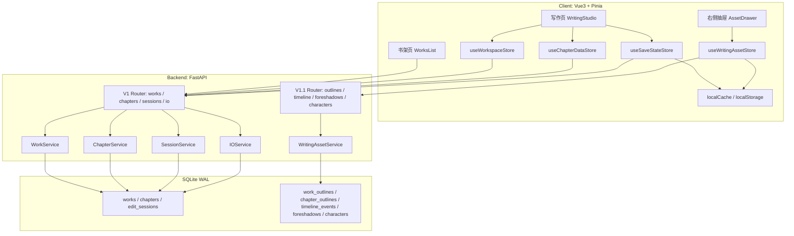
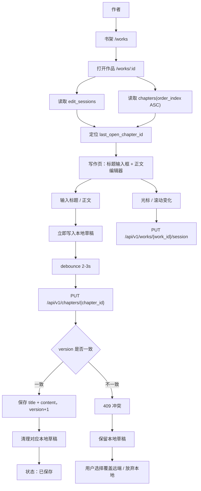
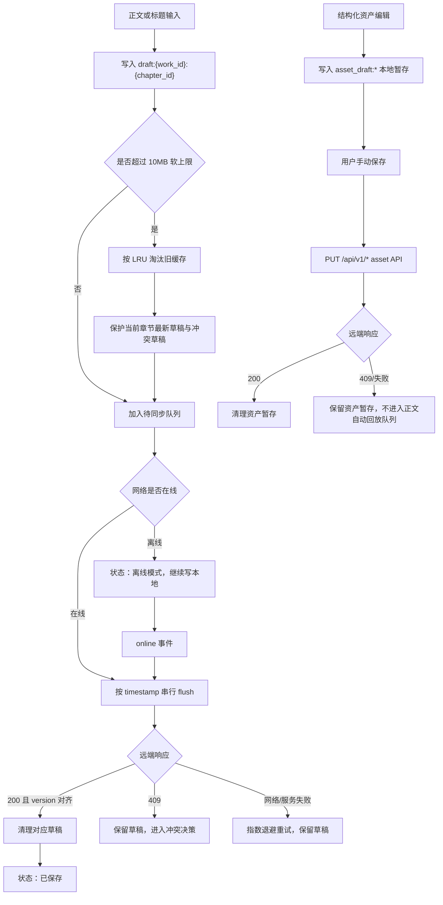
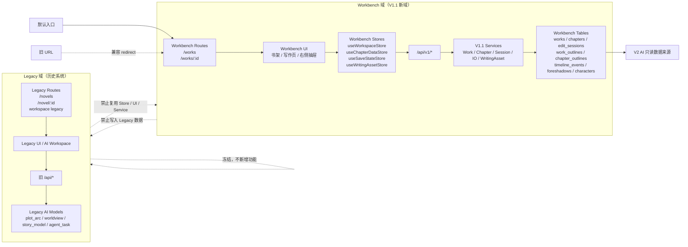
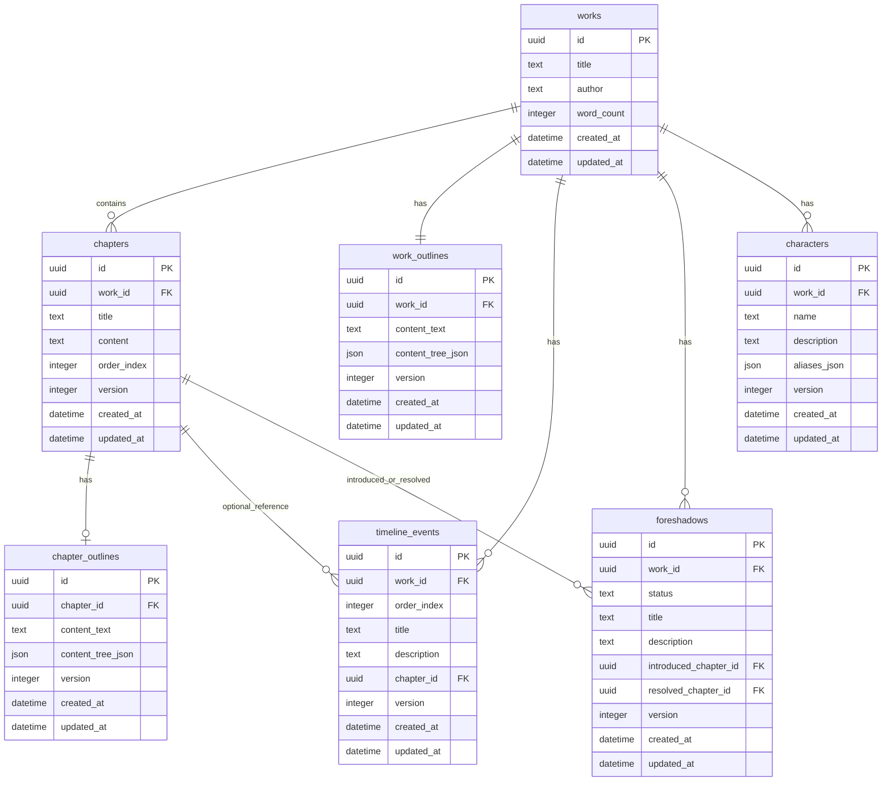
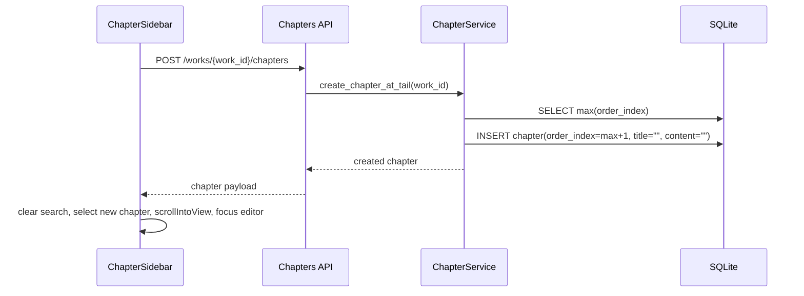
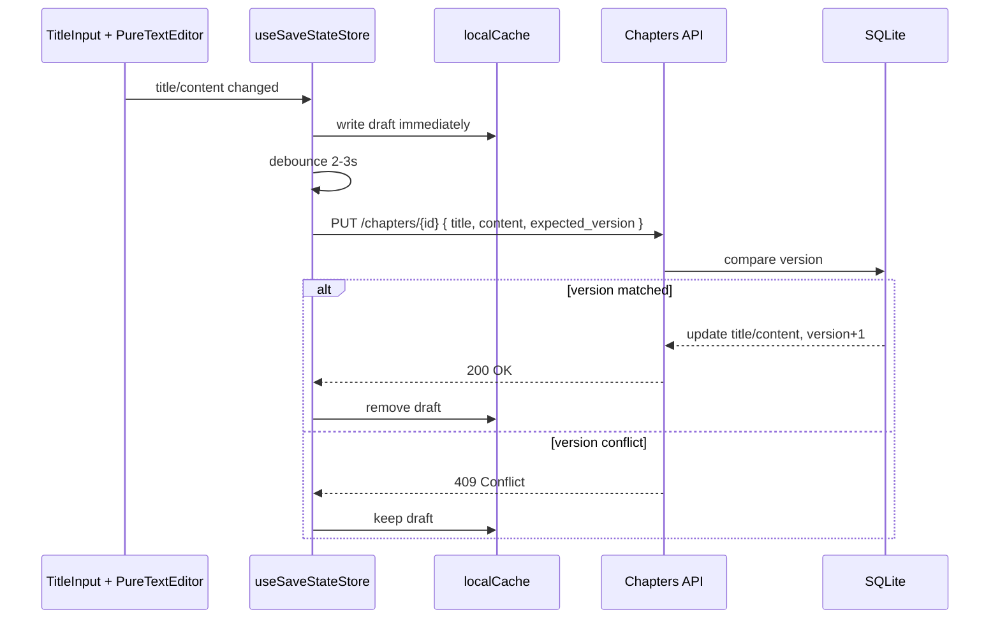
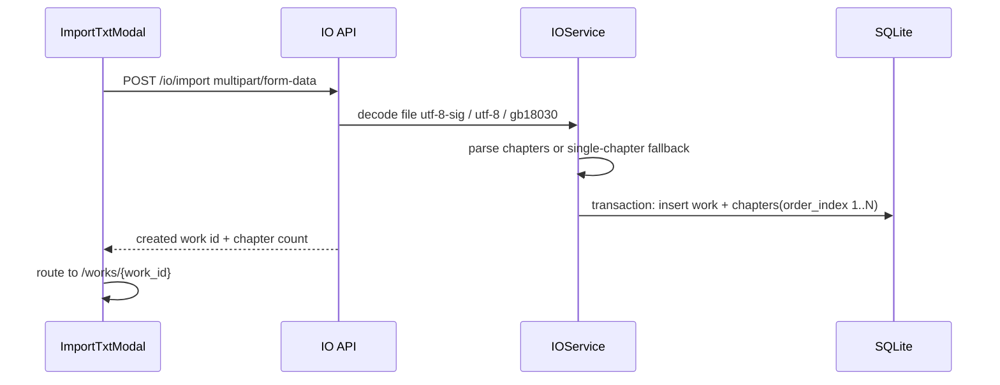
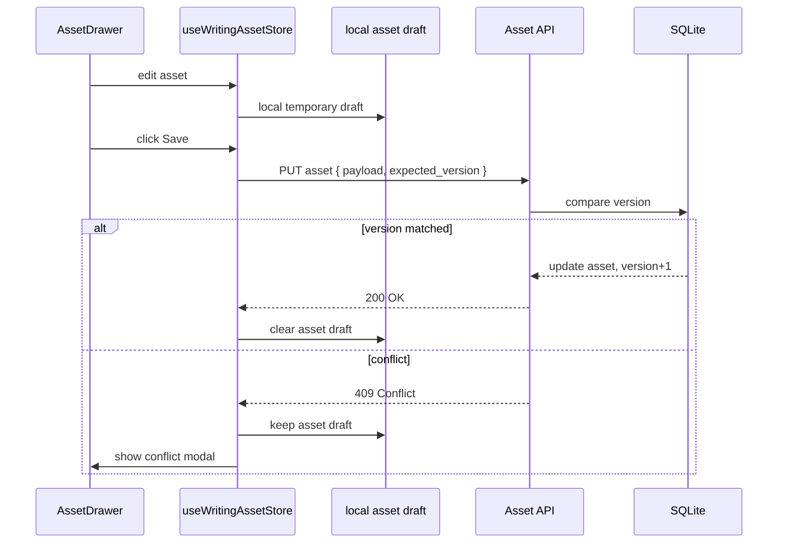
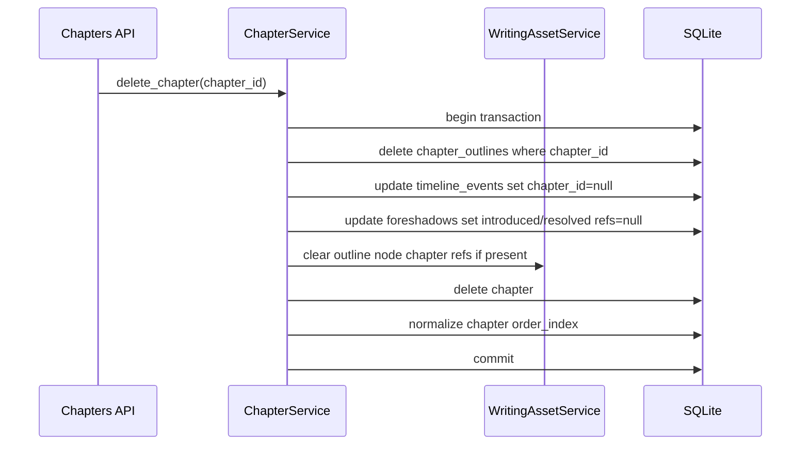

# InkTrace V1.1 架构设计文档

版本：v1.1
更新时间：2026-04-29
依据文档：`docs/01_requirements/InkTrace-V1.1-需求规格说明书.md`

***

## 1. 架构目标

V1.1 在 V1 纯文本写作主链路稳定可用的基础上，完成 V2 AI 接入前的非 AI 创作工作台架构定型。

架构目标：

- 写作体验收口：写作页以正文区为中心，去除说明/调试占位，保留标题、正文与必要状态。
- 数据闭环增强：作品管理、章节定位、Web TXT 导入导出、手动同步入口具备确定性行为。
- 结构化资产沉淀：新增大纲、章节细纲、时间线、伏笔、人物卡，全部为用户手写资产。
- 非 AI 边界隔离：V1.1 不接入 AI 调用、Prompt、模型配置、自动分析、自动抽取与自动生成。
- V2 可读取：V1.1 产出的结构化资产可作为 V2 输入，但 V2 不得直接覆盖 V1.1 手写数据。

***

## 2. 阶段与交付边界

### 2.1 批次定义

- V1.1-A：写作体验与数据闭环收口，必须交付，可单独提测。
- V1.1-B：非 AI 写作组织能力，必须交付，完成后才视为 V1.1 完整完成。
- V1.1-C：体验偏好增强，可选交付，不影响 V1.1 完整性定义。

### 2.2 非 AI 架构边界

V1.1 禁止出现以下架构能力：

- AI 服务、Agent、LLM Client、Prompt Template、模型配置。
- 正文生成、续写、改写、润色、扩写、缩写。
- 正文自动分析、人物自动抽取、伏笔自动抽取、时间线自动抽取。
- 结构化资产自动创建或自动更新。

所有结构化资产只允许由用户手动创建、编辑、排序、关联、保存。

***

## 3. 域隔离与迁移策略（Workbench / Legacy）

### 3.1 背景

当前代码库中仍存在历史 AI 工作台相关模块，包括 `novel`、`workspace`、`copilot` 等旧语义。历史模块的数据模型与交互逻辑包含 AI 分析、剧情、人物、世界观等语义，与 V1.1 “非 AI 创作工作台”的定位不同。

V1.1 采用并行新域 `Workbench` 的方式落地，避免在 Legacy 模块上继续叠加改造。

隔离目标：

- 避免复用旧 AI 语义导致 V1.1 数据污染。
- 避免在现有复杂模块上继续叠加功能导致结构失控。
- 保持 V1.1 与 V2 AI 能力边界清晰。
- 为 V2 提供干净、稳定、可读取的结构化资产来源。

### 3.2 域划分

#### 3.2.1 Legacy 域（历史系统）

Legacy 域包含历史小说工作台与 AI 工作流相关能力。

范围：

- 路由：`/novels`、`/novel/:id`、历史 `workspace` 相关路径。
- API：旧 `/api/*` 中的 Novel、AI、Workspace、Copilot 相关接口。
- 数据：历史 AI 分析、剧情、人物、世界观、向量、生成任务等旧语义数据。

约束：

- 不再新增功能。
- 不作为 V1.1 用户主入口。
- 仅用于历史兼容、开发期回溯或旧数据查看。
- 不作为 V2 AI 的数据来源。

#### 3.2.2 Workbench 域（V1.1 新域）

Workbench 域是 V1.1 的唯一新增功能域。

范围：

- 路由：`/works`、`/works/:id`。
- API：`/api/v1/*`。
- 核心数据：`works`、`chapters`、`edit_sessions`。
- 结构化资产：`work_outlines`、`chapter_outlines`、`timeline_events`、`foreshadows`、`characters`。

约束：

- 完全非 AI。
- 新功能一律落在 Workbench 域。
- 数据语义只包含写作、章节、会话、结构化资产。
- V2 AI 只能读取 Workbench 域数据。

### 3.3 运行时策略（软隔离）

V1.1 不执行一次性 Legacy 数据迁移，采用软隔离策略。

运行时规则：

- 默认入口指向 Workbench：`/works`。
- 允许路由层保留旧 URL 到 Workbench 的兼容 redirect。
- Legacy 页面不参与 V1.1 主流程。
- Workbench 页面禁止加载 Legacy UI、Legacy Store、Legacy Service。
- Workbench 与 Legacy 之间不共享运行时状态。

### 3.4 前端隔离约束

前端必须通过命名、目录和依赖方向隔离 Workbench 与 Legacy。

Store 规则：

- Workbench Store 必须归属 Workbench/V1 语义。
- 已存在的 `useWorkspaceStore`、`useChapterDataStore`、`useSaveStateStore` 可继续作为 Workbench Store 使用。
- 新增结构化资产 Store 使用独立命名，例如 `useWritingAssetStore` 或 `useWritingAssetStoreV1`。
- 禁止 Workbench 页面引用 Legacy Store。
- 禁止 Legacy 页面复用 Workbench Store 作为隐式迁移路径。

UI 规则：

- Workbench UI 禁止混入 AI 面板、AI 状态、AI 按钮、AI 生成入口。
- Workbench 右侧抽屉只承载大纲、时间线、伏笔、人物卡等非 AI 写作资产。
- Legacy UI 不得作为 Workbench 组件来源。

路由规则：

- `/works` 与 `/works/:id` 是 V1.1 主路由。
- 允许旧 URL 兼容 redirect 到 Workbench。
- 禁止 Workbench 页面运行时跳入 Legacy 工作台作为功能补齐。

### 3.5 后端隔离约束

后端必须通过 API、Domain、Service、Repository 四层隔离 Workbench 与 Legacy。

API 规则：

- `/api/v1/*` 只服务 Workbench。
- 旧 `/api/*` 保持 Legacy 兼容，不承载 V1.1 新能力。

Domain 规则：

- Workbench 使用独立实体：`work`、`chapter`、`edit_session`、`work_outline`、`chapter_outline`、`timeline_event`、`foreshadow`、`character_profile`。
- 禁止复用旧 AI 实体，例如 `plot_arc`、`story_model`、`worldview`、`agent_task`、`generation_result` 等。

Service 规则：

- V1.1 新增能力只能进入 V1.1 专用服务，例如 `WritingAssetService`。
- 禁止在 Workbench Service 中调用 Legacy AI Service。

Repository 规则：

- 可以复用基础数据库连接与事务工具。
- 禁止复用旧业务语义 Repository。
- Workbench Repository 必须围绕 Workbench 表设计。

### 3.6 数据隔离策略

Workbench 数据表与 Legacy 数据表保持语义隔离。

规则：

- V1.1 使用独立结构化资产表，不把旧 AI 分析结果写入 Workbench 表。
- Legacy 数据不自动导入 Workbench。
- 如需从 Legacy 获得内容，只允许通过 TXT 导入或用户手动重建结构化资产完成。
- Workbench 数据不得反向写入 Legacy。

迁移策略：

- V1.1 阶段不做自动迁移。
- V2 阶段 AI 只读取 Workbench 数据。
- 长期目标是逐步废弃 Legacy 域，最终统一到 Workbench 架构。

### 3.7 生命周期策略

| 阶段 | Workbench | Legacy |
| --- | --- | --- |
| V1.1 | 主系统，承载全部新增能力 | 冻结，仅兼容或回溯 |
| V2 | AI 唯一数据来源 | 不参与 AI 接入 |
| 长期 | 统一架构基线 | 逐步废弃并删除 |

***

## 4. 总体架构

系统保持 V1 的前后端分离和分层架构。V1.1 新增一个独立的 `Writing Assets` 子域，用于承载非 AI 写作组织数据。



***

## 5. 架构视图（Mermaid）

### 5.1 写作主链路图



### 5.2 本地缓存策略图



### 5.3 Workbench / Legacy 分域图



### 5.4 结构化资产关系图



***

## 6. 前端架构

### 6.1 页面结构

V1.1 继续保持两页主结构：

- `WorksList.vue`：书架页，负责作品创建、导入、作品卡片管理、导出入口。
- `WritingStudio.vue`：写作页，负责章节列表、标题输入、正文编辑、状态条、右侧抽屉入口。

兼容旧 URL 的 redirect 仅作为路由兼容层存在，不作为产品页面结构。

### 6.2 写作页布局分区

```text
+--------------------+--------------------------------------+----------------+
| ChapterSidebar     | EditorColumn                         | AssetRail      |
| 搜索/跳转/章节列表 | Header: 作品名/作者/状态             | 抽屉入口 Tabs  |
| 新建/删除/调序     | TitleInput: 第X章 + title            | 大纲/时间线等  |
|                    | PureTextEditor                       |                |
|                    | BottomStatus                         | AssetDrawer    |
+--------------------+--------------------------------------+----------------+
```

布局约束：

- 中间正文区只保留标题输入框、正文输入区、底部轻量信息。
- Header 显示作品名与可选作者，不显示 `workId`。
- 右侧同一时间只允许一个抽屉打开。
- 打开/关闭抽屉不主动改变正文焦点；用户点击抽屉输入控件时允许焦点进入抽屉。
- 移动端下抽屉使用全屏覆盖层或底部覆盖层。

### 6.3 组件分层

#### 6.3.1 V1.1-A 组件

- `WorksList.vue`
- `WorkCard.vue`
- `WorkActionMenu.vue`
- `ImportTxtModal.vue`
- `ExportTxtModal.vue`
- `WritingStudio.vue`
- `ChapterSidebar.vue`
- `ChapterSearchBox.vue`
- `ChapterJumpInput.vue`
- `ChapterTitleInput.vue`
- `PureTextEditor.vue`
- `StatusBar.vue`
- `VersionConflictModal.vue`

#### 6.3.2 V1.1-B 组件

- `AssetRail.vue`
- `AssetDrawer.vue`
- `OutlinePanel.vue`
- `ChapterOutlinePanel.vue`
- `TimelinePanel.vue`
- `ForeshadowPanel.vue`
- `CharacterPanel.vue`
- `AssetConflictModal.vue`

#### 6.3.3 V1.1-C 组件

- `FocusModeToggle.vue`
- `WritingPreferencePanel.vue`
- `TodayWordDelta.vue`
- `ManualSyncButton.vue`

### 6.4 Pinia Store 边界

V1.1 保持 V1 的写作主链路 Store，并新增结构化资产 Store。

| Store                  | 职责                               | 数据范围                                                                           |
| ---------------------- | -------------------------------- | ------------------------------------------------------------------------------ |
| `useWorkspaceStore`    | 当前作品、激活章节、会话恢复、光标、滚动位置           | `workId`, `activeChapterId`, `cursorPosition`, `scrollTop`                     |
| `useChapterDataStore`  | 章节列表、当前章节内容、标题草稿、章节搜索过滤          | `chapters`, `activeChapter`, `draftByChapterId`, `searchKeyword`               |
| `useSaveStateStore`    | 正文 Local-First 保存、离线回放、409 冲突、重试 | `saveStatus`, `pendingQueue`, `retryState`, `conflictPayload`                  |
| `useWritingAssetStore` | V1.1-B 结构化资产读取、编辑草稿、显式保存、冲突状态    | `workOutline`, `chapterOutline`, `timelineEvents`, `foreshadows`, `characters` |
| `usePreferenceStore`   | V1.1-C 本地偏好、专注模式、今日新增字数          | `fontSize`, `lineHeight`, `theme`, `focusMode`, `todayWordDelta`               |

### 6.5 本地缓存策略

#### 6.5.1 正文本地缓存

正文保存沿用 V1 Local-First：

- 输入立即写入本地缓存。
- 防抖 2-3 秒同步后端。
- 后端成功且版本对齐后清理对应缓存。
- 断网进入离线模式，联网后按时间戳串行回放。
- 409 冲突时保留本地草稿直到用户决策。

缓存键建议：

```text
draft:{work_id}:{chapter_id}
```

#### 6.5.2 结构化资产本地暂存

V1.1-B 结构化资产不进入正文自动回放队列。

- 编辑过程中允许写本地暂存，防止刷新或离线造成编辑内容丢失。
- 提交由用户点击保存或 `Ctrl/Cmd+S` 触发。
- 离线时显示“离线，未保存”，联网后仍需用户手动保存。
- 409 冲突时保留本地暂存，等待用户选择“覆盖保存 / 放弃并刷新”。

缓存键建议：

```text
asset_draft:{asset_type}:{work_id}
asset_draft:chapter_outline:{chapter_id}
```

***

## 7. 后端架构

### 7.1 分层结构

后端保持 DDD + 清洁架构风格分层。依赖方向必须由外向内：`Presentation -> Application -> Domain`，`Infrastructure` 只作为实现细节被 Application 通过 Repository 接口使用。Domain 层不得依赖 FastAPI、数据库连接、ORM、HTTP DTO 或前端展示模型。

```text
presentation/api/routers/v1/
  works.py
  chapters.py
  sessions.py
  io.py
  outlines.py
  timeline.py
  foreshadows.py
  characters.py

application/services/v1/
  work_service.py
  chapter_service.py
  session_service.py
  io_service.py
  writing_asset_service.py

domain/entities/
  work.py
  chapter.py
  edit_session.py
  work_outline.py
  chapter_outline.py
  timeline_event.py
  foreshadow.py
  character_profile.py

infrastructure/database/
  models.py
  session.py
  repositories/
    work_repo.py
    chapter_repo.py
    edit_session_repo.py
    work_outline_repo.py
    chapter_outline_repo.py
    timeline_event_repo.py
    foreshadow_repo.py
    character_profile_repo.py
```

### 7.2 服务职责

| Service               | 职责                                |
| --------------------- | --------------------------------- |
| `WorkService`         | 作品列表、创建、更新作品信息、删除作品、静默创建首章        |
| `ChapterService`      | 章节 CRUD、追加末尾、删除后焦点建议、原子调序、乐观锁保存   |
| `SessionService`      | 最后打开章节、光标位置、滚动位置保存与恢复             |
| `IOService`           | Web TXT 上传导入、编码识别、章节解析、TXT 导出格式选项 |
| `WritingAssetService` | 大纲、细纲、时间线、伏笔、人物卡 CRUD、显式保存、版本冲突   |

### 7.3 事务边界

必须使用单事务的场景：

- 创建作品 + 创建第一章。
- 删除作品 + 删除章节 + 删除结构化资产。
- 删除章节 + 删除章节细纲 + 置空时间线/伏笔/大纲节点章节引用。
- 章节全量调序。
- 时间线排序保存。
- TXT 导入创建作品 + 批量创建章节。

Timeline 调序接口必须一次性提交完整映射列表 `[{ id, order_index }]`，由 Service 在单个数据库事务中批量写入。禁止前端逐条提交或后端逐条独立 `commit`。

允许单实体事务的场景：

- 更新作品标题/作者。
- 保存单章标题/正文。
- 保存全书大纲。
- 保存单章细纲。
- 保存单个伏笔。
- 保存单个人物卡。

***

## 8. API 架构

所有接口统一挂载在 `/api/v1` 下。

### 8.1 Works API

| 方法       | 路径                 | 说明              |
| -------- | ------------------ | --------------- |
| `GET`    | `/works`           | 获取作品列表          |
| `POST`   | `/works`           | 创建作品，事务内创建第 1 章 |
| `GET`    | `/works/{work_id}` | 获取作品详情          |
| `PUT`    | `/works/{work_id}` | 更新作品标题、作者       |
| `DELETE` | `/works/{work_id}` | 删除作品及其章节、结构化资产  |

### 8.2 Chapters API

| 方法       | 路径                                  | 说明                                   |
| -------- | ----------------------------------- | ------------------------------------ |
| `GET`    | `/works/{work_id}/chapters`         | 按 `order_index` 获取章节列表               |
| `POST`   | `/works/{work_id}/chapters`         | 新建章节，默认追加末尾                          |
| `PUT`    | `/chapters/{chapter_id}`            | 保存标题与正文，携带 `expected_version`        |
| `DELETE` | `/chapters/{chapter_id}`            | 删除章节，返回建议激活章节                        |
| `PUT`    | `/works/{work_id}/chapters/reorder` | 一次性提交 `[{ id, order_index }]` 并单事务写入 |

### 8.3 Sessions API

| 方法    | 路径                         | 说明               |
| ----- | -------------------------- | ---------------- |
| `GET` | `/works/{work_id}/session` | 获取最后编辑会话         |
| `PUT` | `/works/{work_id}/session` | 保存最后编辑章节、光标、滚动位置 |

### 8.4 IO API

| 方法     | 路径                     | 说明                                       |
| ------ | ---------------------- | ---------------------------------------- |
| `POST` | `/io/import`           | multipart/form-data 上传 TXT 并导入           |
| `GET`  | `/io/export/{work_id}` | 导出 TXT，支持 `include_titles` 与 `gap_lines` |

### 8.5 Writing Assets API

#### Outlines

| 方法    | 路径                               | 说明                           |
| ----- | -------------------------------- | ---------------------------- |
| `GET` | `/works/{work_id}/outline`       | 获取全书大纲                       |
| `PUT` | `/works/{work_id}/outline`       | 保存全书大纲，携带 `expected_version` |
| `GET` | `/chapters/{chapter_id}/outline` | 获取章节细纲                       |
| `PUT` | `/chapters/{chapter_id}/outline` | 保存章节细纲，携带 `expected_version` |

#### Timeline

| 方法       | 路径                                         | 说明                            |
| -------- | ------------------------------------------ | ----------------------------- |
| `GET`    | `/works/{work_id}/timeline-events`         | 获取时间线事件列表                     |
| `POST`   | `/works/{work_id}/timeline-events`         | 新增事件                          |
| `PUT`    | `/timeline-events/{event_id}`              | 更新事件，携带 `expected_version`    |
| `DELETE` | `/timeline-events/{event_id}`              | 删除事件                          |
| `PUT`    | `/works/{work_id}/timeline-events/reorder` | 单事务保存 `[{ id, order_index }]` |

交互约束：前端优先支持“上移 / 下移”完成时间线排序，拖拽排序作为增强交互，不作为 V1.1-B 首要实现依赖。
提交约束：Timeline 调序接口必须一次性提交完整映射列表 `[{ id, order_index }]`，由 Service 在单个数据库事务中批量写入。禁止前端逐条提交或后端逐条独立 `commit`。

#### Foreshadows

| 方法       | 路径                             | 说明                         |
| -------- | ------------------------------ | -------------------------- |
| `GET`    | `/works/{work_id}/foreshadows` | 获取伏笔列表，支持 `status` 过滤      |
| `POST`   | `/works/{work_id}/foreshadows` | 新增伏笔                       |
| `PUT`    | `/foreshadows/{foreshadow_id}` | 更新伏笔，携带 `expected_version` |
| `DELETE` | `/foreshadows/{foreshadow_id}` | 删除伏笔                       |

#### Characters

| 方法       | 路径                            | 说明                          |
| -------- | ----------------------------- | --------------------------- |
| `GET`    | `/works/{work_id}/characters` | 获取人物卡列表，支持 `keyword` 搜索     |
| `POST`   | `/works/{work_id}/characters` | 新增人物卡                       |
| `PUT`    | `/characters/{character_id}`  | 更新人物卡，携带 `expected_version` |
| `DELETE` | `/characters/{character_id}`  | 删除人物卡                       |

***

## 9. 数据模型

### 9.1 核心表

#### `works`

| 字段           | 类型      | 约束           |
| ------------ | ------- | ------------ |
| `id`         | text    | primary key  |
| `title`      | text    | not null     |
| `author`     | text    | nullable     |
| `word_count` | integer | default 0    |
| `created_at` | text    | ISO datetime |
| `updated_at` | text    | ISO datetime |

#### `chapters`

| 字段               | 类型      | 约束                        |
| ---------------- | ------- | ------------------------- |
| `id`             | text    | primary key               |
| `work_id`        | text    | not null, indexed         |
| `chapter_number` | integer | display compatibility     |
| `title`          | text    | nullable as empty string  |
| `content`        | text    | not null default empty    |
| `word_count`     | integer | effective character count |
| `order_index`    | integer | sort source of truth      |
| `version`        | integer | optimistic lock           |
| `created_at`     | text    | ISO datetime              |
| `updated_at`     | text    | ISO datetime              |

标题空值策略：后端统一存储空字符串，不使用 `NULL`。`title` 只保存用户输入的章节标题，禁止写入“第X章”前缀；当前端 `title` 为空时，由 UI 根据 `order_index` 显示“第X章”。

#### `edit_sessions`

| 字段                     | 类型      | 约束           |
| ---------------------- | ------- | ------------ |
| `work_id`              | text    | primary key  |
| `last_open_chapter_id` | text    | nullable     |
| `cursor_position`      | integer | default 0    |
| `scroll_top`           | integer | default 0    |
| `updated_at`           | text    | ISO datetime |

### 9.2 结构化资产表

#### `work_outlines`

| 字段                  | 类型      | 约束              |
| ------------------- | ------- | --------------- |
| `id`                | text    | primary key     |
| `work_id`           | text    | unique, indexed |
| `content_text`      | text    | default empty   |
| `content_tree_json` | text    | nullable JSON   |
| `version`           | integer | optimistic lock |
| `created_at`        | text    | ISO datetime    |
| `updated_at`        | text    | ISO datetime    |

存储规则：`content_text` 为唯一真实存储；`content_tree_json` 为派生视图缓存，不保证与 `content_text` 强一致同步。

节点关联规则：若大纲树节点需要关联章节，关联信息存放在 `content_tree_json` 的节点字段中。删除章节时仅置空对应节点中的章节引用，不删除大纲节点本身。

#### `chapter_outlines`

| 字段                  | 类型      | 约束              |
| ------------------- | ------- | --------------- |
| `id`                | text    | primary key     |
| `chapter_id`        | text    | unique, indexed |
| `content_text`      | text    | default empty   |
| `content_tree_json` | text    | nullable JSON   |
| `version`           | integer | optimistic lock |
| `created_at`        | text    | ISO datetime    |
| `updated_at`        | text    | ISO datetime    |

存储规则：`content_text` 为唯一真实存储；`content_tree_json` 为派生视图缓存，不保证与 `content_text` 强一致同步。

节点关联规则：若细纲树节点需要关联章节，关联信息存放在 `content_tree_json` 的节点字段中。删除章节时仅置空对应节点中的章节引用，不删除细纲节点本身。

#### `timeline_events`

| 字段            | 类型      | 约束                   |
| ------------- | ------- | -------------------- |
| `id`          | text    | primary key          |
| `work_id`     | text    | indexed              |
| `order_index` | integer | sort source of truth |
| `title`       | text    | not null             |
| `description` | text    | default empty        |
| `chapter_id`  | text    | nullable             |
| `version`     | integer | optimistic lock      |
| `created_at`  | text    | ISO datetime         |
| `updated_at`  | text    | ISO datetime         |

#### `foreshadows`

| 字段                      | 类型      | 约束                   |
| ----------------------- | ------- | -------------------- |
| `id`                    | text    | primary key          |
| `work_id`               | text    | indexed              |
| `status`                | text    | `open` or `resolved` |
| `title`                 | text    | not null             |
| `description`           | text    | default empty        |
| `introduced_chapter_id` | text    | nullable             |
| `resolved_chapter_id`   | text    | nullable             |
| `version`               | integer | optimistic lock      |
| `created_at`            | text    | ISO datetime         |
| `updated_at`            | text    | ISO datetime         |

#### `characters`

| 字段             | 类型      | 约束              |
| -------------- | ------- | --------------- |
| `id`           | text    | primary key     |
| `work_id`      | text    | indexed         |
| `name`         | text    | not null        |
| `description`  | text    | default empty   |
| `aliases_json` | text    | JSON array      |
| `version`      | integer | optimistic lock |
| `created_at`   | text    | ISO datetime    |
| `updated_at`   | text    | ISO datetime    |

***

## 10. 核心流程

### 10.1 新建章节追加末尾



### 10.2 标题与正文同次保存



### 10.3 Web TXT 导入



### 10.4 结构化资产显式保存



### 10.5 删除章节后的引用处理



***

## 11. 冲突与异常处理

### 11.1 正文冲突

- 后端发现 `expected_version != db.version` 时返回 `409 Conflict`。
- 前端保留正文草稿缓存。
- 用户必须选择“覆盖远端”或“放弃本地”。
- 在用户决策前禁止清理本地草稿。

### 11.2 结构化资产冲突

- 结构化资产保存也使用 `expected_version`。
- 409 时保留本地暂存。
- 用户选择“覆盖保存”时，后端以当前远端版本为基准保存并递增版本。
- 用户选择“放弃并刷新”时，前端清除本地暂存并重新加载远端数据。

### 11.3 离线处理

| 数据类型  | 离线输入 | 是否自动回放             | 恢复方式        |
| ----- | ---- | ------------------ | ----------- |
| 正文与标题 | 允许   | 是，按 timestamp 串行回放 | 联网后自动 flush |
| 结构化资产 | 允许   | 否                  | 联网后用户手动保存   |
| 偏好设置  | 允许   | 不涉及远端              | 本地持久化       |

### 11.4 导入异常

- 空文件导入成功，创建作品与单章空内容。
- 无章节标记导入成功，全文写入单章。
- 编码识别失败返回明确提示。
- 超过 20MB 拒绝导入并提示拆分。

***

## 12. 性能与容量设计

### 12.1 章节列表

- 章节列表必须支持 500+ 章节流畅渲染。
- 搜索只过滤展示，不改变原始数据顺序。
- 新建章节后清空搜索并滚动到新章。

### 12.2 编辑器

- 编辑器保持纯文本 `textarea` 或等价纯文本输入方案。
- 粘贴统一读取 `text/plain`。
- 单章 20 万有效字符仅软提示，不阻断输入。

### 12.3 本地缓存

- 正文缓存总容量沿用 V1 10MB 软上限和 LRU 淘汰。
- 结构化资产本地暂存使用独立 key 前缀，计入同一容量治理。
- 清理策略不得提前删除存在冲突或未提交的最新草稿。

***

## 13. 统计一致性边界

### 13.1 今日新增字数

- 今日新增字数由前端按本地自然日统计。
- 统计口径只包含正文有效字符新增，不包含标题。
- 该数据为近似统计，不作为强一致数据来源。
- 跨端编辑、撤销、删除、离线编辑导致的差异不进入服务端强一致校正流程。

***

## 14. V2 衔接设计

V1.1 为 V2 提供稳定的只读资产输入：

- 全书大纲：作品级结构输入。
- 章节细纲：章节级计划输入。
- 时间线：事件顺序输入。
- 伏笔：开放与已回收线索输入。
- 人物卡：人物描述与别名输入。

V2 接入约束：

- V2 只能读取 V1.1 资产，不得静默修改。
- V2 生成内容必须进入候选结果或草稿机制。
- V2 若需要写回资产，必须通过用户显式确认，并保留原始手写数据可恢复。

***

## 15. 系统复杂度约束

V1.1 必须控制系统复杂度，防止非 AI 创作工作台重新演化为多域混杂的复杂工作台。

约束：

- 不新增需求文档之外的核心实体类型。
- 所有结构化写作能力必须通过右侧抽屉承载。
- 不新增新的主页面，主结构固定为 `书架 -> 写作页`。
- 不新增 AI、自动分析、自动抽取、自动生成相关架构入口。
- 新能力必须优先落入既有 Workbench 分层：Router、Service、Domain Entity、Repository、Store、Drawer Panel。

***

## 16. 架构验收清单

### V1.1-A

- [ ] 写作页保持书架到写作页两页主结构。
- [ ] 标题与正文同一保存链路提交。
- [ ] 新建章节默认追加末尾。
- [ ] 作品标题/作者可更新。
- [ ] 章节搜索与跳转不改变真实顺序。
- [ ] Web TXT 导入使用 multipart 上传。
- [ ] TXT 导出支持标题与空行选项。

### V1.1-B

- [ ] 结构化资产表与旧 AI 语义隔离。
- [ ] 结构化资产采用显式保存与乐观锁。
- [ ] 时间线排序单事务提交。
- [ ] 删除章节后引用置空或级联删除规则落实。
- [ ] 右侧抽屉同一时间只打开一个。

### V1.1-C

- [ ] 偏好只影响本地展示。
- [ ] 今日新增字数基于本地自然日统计。
- [ ] 立即同步按钮只触发正文保存 flush，不改变自动保存架构。


