# InkTrace V2.0-P2 架构设计说明书

版本：v2.0-p2-architecture
更新时间：2026-06-08
状态：冻结生效（Opening Agent 已同步 v2.0 人本化裁决）

依据文档：

- `docs/01_requirements/InkTrace-V2.0-需求规格说明书.md`（第 4.3、11 节）
- `docs/07_overview/InkTrace-V2.0-概要设计说明书.md`（第 13.3 节）
- `docs/02_architecture/InkTrace-V2.0-架构设计说明书.md`（第 15.3 节）
- `docs/03_design/InkTrace-V2.0-P1-详细设计总纲.md`（第 1.4 节 P1 与 P2 边界）

**修订记录**：

| 版本 | 日期 | 修订内容 |
|---|---|---|
| v1.0 | 2026-06-08 | 初始版本 |
| v1.1 | 2026-06-08 | 架构评审修订：修正架构图 Domain→Infra 依赖方向；明确自动队列默认安全模式 + StoryState 硬边界；删除 call_opening_model 改为业务 Tool 命名；StyleProfile 独立子域对象；Citation Link 双阶段校验；@ 引用存储方案升级为必须决策项；SelectionRewrite apply 路径明确；LLMCallLog 为唯一成本事实源；AI 痕迹→AI 使用分析；调整 P2-S1 实施顺序 |

---

## 一、文档定位与范围

### 1.1 文档定位

本文档是 InkTrace V2.0-P2 的架构设计说明书。它承接已冻结的需求规格说明书、概要设计说明书、架构设计说明书及 P1 详细设计总纲，**不推翻任何已有设计**。

本文档回答：

- P2 十大增强能力各自的子域边界、模块职责与依赖关系。
- P2 如何复用 P0/P1 已落地的 Core + Agent 基础设施、哪些需要新增。
- P2 对 P0/P1 安全边界的继承与加固策略。
- P2 的持久化、API、前端架构方向。
- P2 对现有 P1 代码的改动面与新增文件清单。
- 哪些模块后续进入详细设计。

本文档**不做**：写代码、改源码、生成数据库迁移、字段级 DTO/API 设计、表结构详细设计。

### 1.2 P2 定位

P2 是 V2.0 的增强层。它不改变 P1 的核心架构——仍然是一个 Core + Agent、Tool Facade 受控入口、Candidate Draft 隔离、Human Review Gate 门控的体系。

P2 把 InkTrace 从"单次受控 AI 辅助写作"升级为"持续受控 AI 辅助写作 + 深度资产联动 + 成本可观测"。

### 1.3 P2 与 P0/P1 的核心关系

**一句话：P2 只扩展，不推翻；只增强，不越权。**

| P0/P1 成果 | P2 处理方式 |
|---|---|
| AI Infrastructure (Provider/ModelRouter/Prompt/Validator) | **复用**，新增 model_role: `opening_agent`、`style_extractor`、`selection_rewriter` |
| AI Job System | **复用**，自动续写队列通过 `job_type = auto_continuation_queue` 跟踪 |
| Agent Runtime / PPAO 循环 | **复用**，Opening Agent 作为新 AgentType 注册到 Runtime |
| 五 Agent Workflow | **复用**，多章续写 = 循环调用单章 Workflow |
| Core Tool Facade | **复用**，权限矩阵新增 Opening Agent 行 |
| Story Memory / Story State | **复用**，Style DNA 扩展记忆域（非覆盖） |
| Vector Recall | **复用**，Citation Link 引用其 RAG 结果 |
| Context Pack | **复用**，新增 Style DNA 可选层 |
| CandidateDraft / HumanReviewGate | **复用**，多章续写每章独立 CandidateDraft |
| AI Review | **复用**，Opening Agent 扩展签约向审稿维度 |
| AI Suggestion / Conflict Guard | **复用**，大纲辅助/@引用/选区改写建议均进入 AI Suggestion |
| Plot Arc（四层轨道） | **复用**，自动续写停止条件依赖 Sequence Arc 状态 |
| Agent Trace | **复用**，所有 P2 子系统写入 Trace |
| V1.1 Local-First | **不动**，所有 P2 写操作仍走候选隔离→用户确认→草稿区→Local-First |

### 1.4 P2 十大子系统一览

| # | 子系统 | 需求编号 | 一句话职责 | 复杂度 | 新增 Agent 类型 |
|---|---|---|---|---|---|
| 1 | 多章续写 | R-AI-DRAFT-04 | P1 AgentWorkflow 循环 N 次，章间更新状态 | 中 | 否 |
| 2 | 受控自动续写队列 | R-AI-DRAFT-05 | 无人值守逐章生成，9 重停止条件 | 高 | 否 |
| 3 | Style DNA | R-AI-ENH-01 | 文风指纹提取→Context Pack 可选层 | 中 | 否（复用 Memory Agent） |
| 4 | Citation Link | R-AI-CITE-01 | 候选稿元数据标记前文引用来源 | 中 | 否 |
| 5 | @ 标签引用 | R-AI-CITE-02 | 正文 @ 联想/高亮/悬停/mentions 持久化 | 高 | 否 |
| 6 | Opening Agent | R-AI-ENH-02 | 签约向开篇：参考分析→策略→候选稿→审稿 | 高 | **是（opening）** |
| 7 | 大纲辅助 | R-AI-ENH-03 | 润色/扩写/细纲→AI Suggestion | 中 | 否（复用 Planner） |
| 8 | 选区改写/润色 | R-AI-ENH-04 | 选中→扩写/重写/缩写/润色→候选替换区 | 中 | 否 |
| 9 | 成本看板 | R-AI-ENH-05 | LLMCallLog 聚合 + 三级预算体系 | 中 | 否 |
| 10 | 分析看板 | R-AI-ENH-05 | 写作统计/节奏/对白/风格/AI 使用分析 | 中 | 否 |

### 1.5 P2 安全红线（继承 + 加固）

以下红线在 P2 中不可违反。每条红线对应 P0/P1 已有约束，P2 只在更高自动化场景下**加固**。

| # | 红线 | P2 加固措施 |
|---|---|---|
| 1 | AI 不自动写正式正文 | 自动队列只生成候选稿，apply 必须 user_action |
| 2 | 正式正文走 V1.1 Local-First | 选区改写→候选替换区→用户确认→草稿区→Local-First |
| 3 | CandidateDraft 隔离 | 多章续写每章独立 CandidateDraft；自动队列不批量合并 |
| 4 | HumanReviewGate 门控 | Opening Agent 前三章候选稿逐章走门控 |
| 5 | ToolFacade 唯一入口 | Opening Agent 只能调用注册 Tool |
| 6 | Agent 不直连 Infra | Opening Agent 禁止访问 DB/Provider/Vector |
| 7 | Agent 不伪造 user_action | accept/apply/reject 仍由 Presentation→Core Application |
| 8 | 正式资产不静默覆盖 | 大纲辅助/@引用建议→AI Suggestion→Conflict Guard→用户确认 |
| 9 | Memory 正式化需确认 | Style DNA 作为独立子域对象，正式化需走独立确认流程 |
| 10 | formal_write 禁止 | P2 不新增 formal_write 权限，不向 Agent 开放 |

---

## 二、P2 总体架构

### 2.1 分层扩展概览

P2 不引入新架构层。扩展分布在现有五层：

```
Presentation  →  新增 9 组 API 路由
Application  →  新增 10 个 Service
Domain       →  新增 18 个实体/值对象/枚举
Infrastructure → 新增 12 个 Repository Adapter
Agent        →  新增 1 个 Agent 类型 (Opening Agent)
Frontend     →  新增 12 个 UI 模块
```

### 2.2 总体架构图

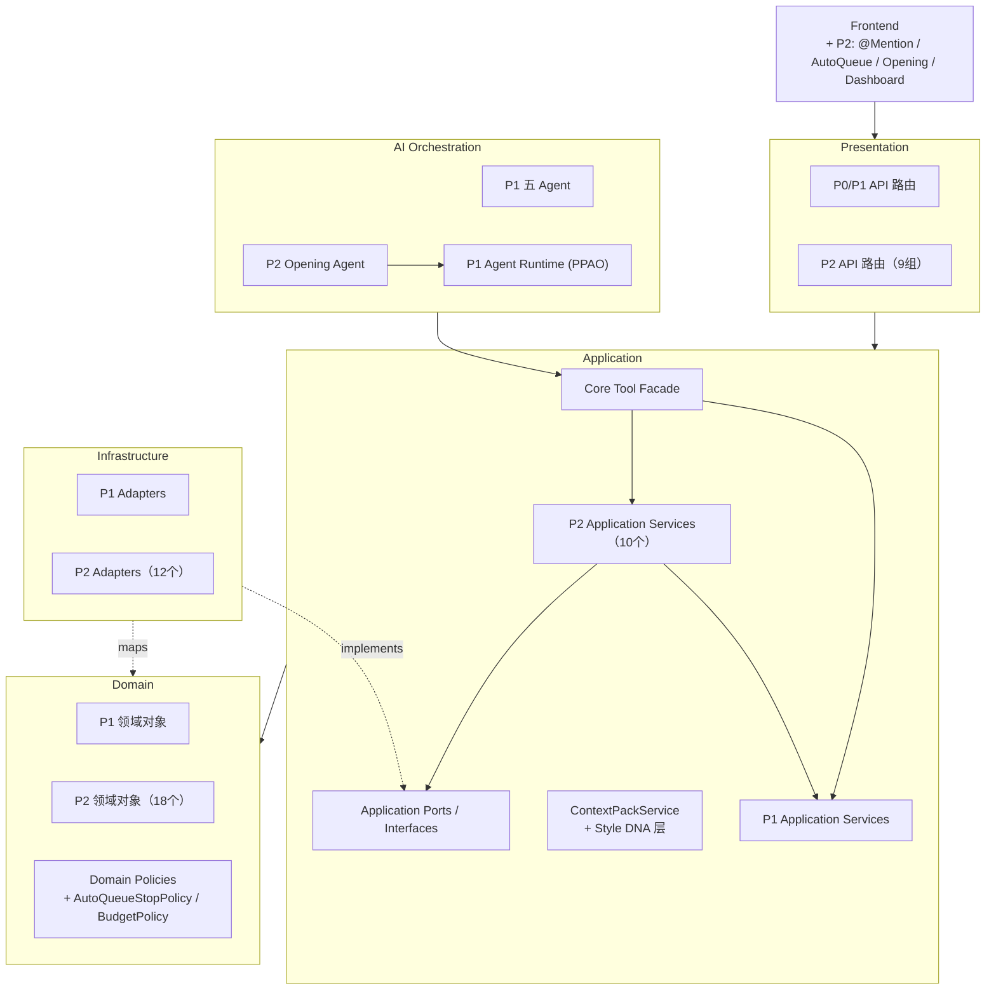

### 2.3 子系统依赖拓扑

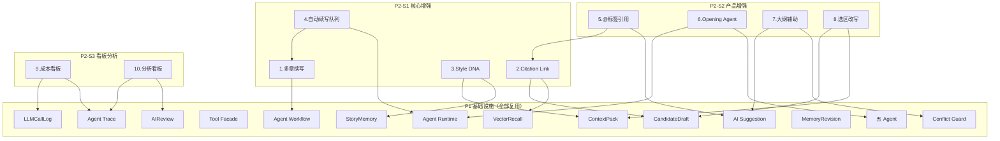

### 2.4 分阶段实施路径

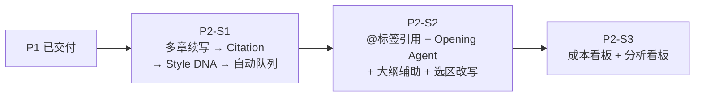

S1→S2→S3 为建议顺序。**P2-S1 内部顺序说明**：自动续写队列依赖多章续写、停止条件、预算、审稿和 StoryState 章间更新，是 S1 中最复杂的子系统。建议先做多章续写和 Citation Link 打好基础，再做 Style DNA 的提取和 ContextPack 集成，最后做自动续写队列。P2-S2 内部各子系统可适度并行（Opening Agent、大纲辅助、选区改写无直接顺序依赖）。

---

## 三、P2 对 P1 代码的改动面

在深入各子系统设计之前，先明确 P2 对已有代码的**改动面**。

### 3.1 不可修改的文件（冻结）

以下文件是 P0/P1 的**安全边界承载体**，P2 **不得修改**：

| 文件 | 原因 |
|---|---|
| `domain/entities/ai/models.py` | P1 领域模型定义；P2 新增枚举值可以追加，现有类签名/字段不可改 |
| `application/services/ai/tool_facade.py` | ToolFacade 权限执行核心；P2 只能追加 Tool 注册和权限行 |
| `application/services/ai/agent_runtime_service.py` | Agent Runtime PPAO 循环；P2 只能注册新 AgentType，不改循环逻辑 |
| `application/services/ai/agent_workflow.py` | Workflow Stage/Transition 定义；不改现有 Stage |
| `application/services/ai/candidate_review_service.py` | CandidateDraft apply 路径；不改 |
| `application/services/v1/*` | V1.1 Local-First 保存链路；永远不动 |

### 3.2 需要修改的文件

| 文件 | 改动内容 | 风险 |
|---|---|---|
| `domain/entities/ai/models.py` | 追加枚举值：`AgentType.OPENING`、`ModelRole.STYLE_EXTRACTOR`、`ModelRole.SELECTION_REWRITER`、`AISuggestionType.OUTLINE_POLISH/OUTLINE_EXPAND/CHAPTER_OUTLINE_DETAIL/MENTION_SUGGESTION`、`AgentWorkflowType.OPENING_ANALYSIS`；追加实体类（StyleProfile / CitationLink / ChapterMention 等） | 低（追加不改已有） |
| `application/services/ai/tool_facade.py` | 注册 P2 新增 Tool；权限矩阵新增 Opening Agent 行 | 低（追加行） |
| `application/services/ai/agent_runtime_service.py` | 注册 `AgentType.OPENING` 的 AgentExecutionProfile | 低（追加配置） |
| `application/services/ai/agent_workflow.py` | 新增 `WorkflowType.OPENING_WORKFLOW` 的 Stage 定义 | 低（新增 WorkflowDefinition） |
| `application/services/ai/context_pack_service.py` | `_assemble_optional_layers()` 增加 Style DNA 层组装逻辑 | 低（在可选层列表追加一项） |
| `application/services/ai/agent_trace_service.py` | 新增 P2 审计事件类型（见 4.3 节事件清单） | 低（追加事件类型） |
| `application/services/ai/ai_suggestion_service.py` | 新增 P2 建议类型处理（大纲辅助/mention 建议） | 低（追加分支） |
| `presentation/api/app.py` | 注册 P2 路由模块 | 低（追加路由注册） |

### 3.3 需要新增的文件

按 DDD 分层组织：

```
application/services/ai/
  auto_queue_service.py           # AutoContinuationQueueService
  style_dna_service.py            # StyleDNAExtractionService
  citation_link_service.py        # CitationLinkService
  mention_service.py              # MentionService（@联想/mentions CRUD）
  opening_agent_service.py        # OpeningAgentService（编排分段短用例）
  outline_assist_service.py       # OutlineAssistService
  selection_rewrite_service.py    # SelectionRewriteService
  cost_dashboard_service.py       # CostDashboardService
  analysis_dashboard_service.py   # AnalysisDashboardService

presentation/api/routers/v2/ai/
  auto_queues.py                  # 自动续写队列 API
  style_dna.py                    # Style DNA API
  citations.py                    # Citation Link API
  mentions.py                     # @ Mentions API
  opening.py                      # Opening Agent API
  outline_assist.py               # 大纲辅助 API
  selection_rewrite.py            # 选区改写 API
  cost_dashboard.py               # 成本看板 API
  analysis_dashboard.py           # 分析看板 API

infrastructure/persistence/
  sqlite_auto_queue_repo.py       # AutoQueueRepository
  sqlite_style_dna_repo.py        # StyleDNARepository
  sqlite_citation_link_repo.py    # CitationLinkRepository
  sqlite_mention_repo.py          # MentionRepository
  sqlite_opening_agent_repo.py    # OpeningAgentRepository
  sqlite_selection_rewrite_repo.py # SelectionRewriteRepository
  sqlite_cost_repo.py             # CostRepository
  sqlite_analysis_repo.py         # AnalysisRepository

frontend/src/components/workspace/
  AutoQueuePanel.vue              # 自动续写面板
  AtMentionPopup.vue              # @联想弹窗
  AtMentionHighlight.vue          # @高亮渲染
  OpeningAgentWizard.vue          # Opening Agent 向导
  SelectionRewriteToolbar.vue     # 选区改写工具栏
  SelectionRewriteDiffModal.vue   # 选区改写 Diff 弹窗
  OutlineAssistPanel.vue          # 大纲辅助面板

frontend/src/views/
  CostDashboard.vue               # 成本看板页面
  AnalysisDashboard.vue           # 分析看板页面
```

---

## 四、子系统设计

以下按 P2-S1→S2→S3 顺序展开。每个子系统按统一模板：**复用关系 → 核心流程 → 关键对象 → 安全约束**。

### 4.1 多章续写（P2-S1）

**复用关系**：100% 复用 P1 AgentWorkflow。不新增 Agent 类型，不新增 Workflow Stage。

**核心流程**：

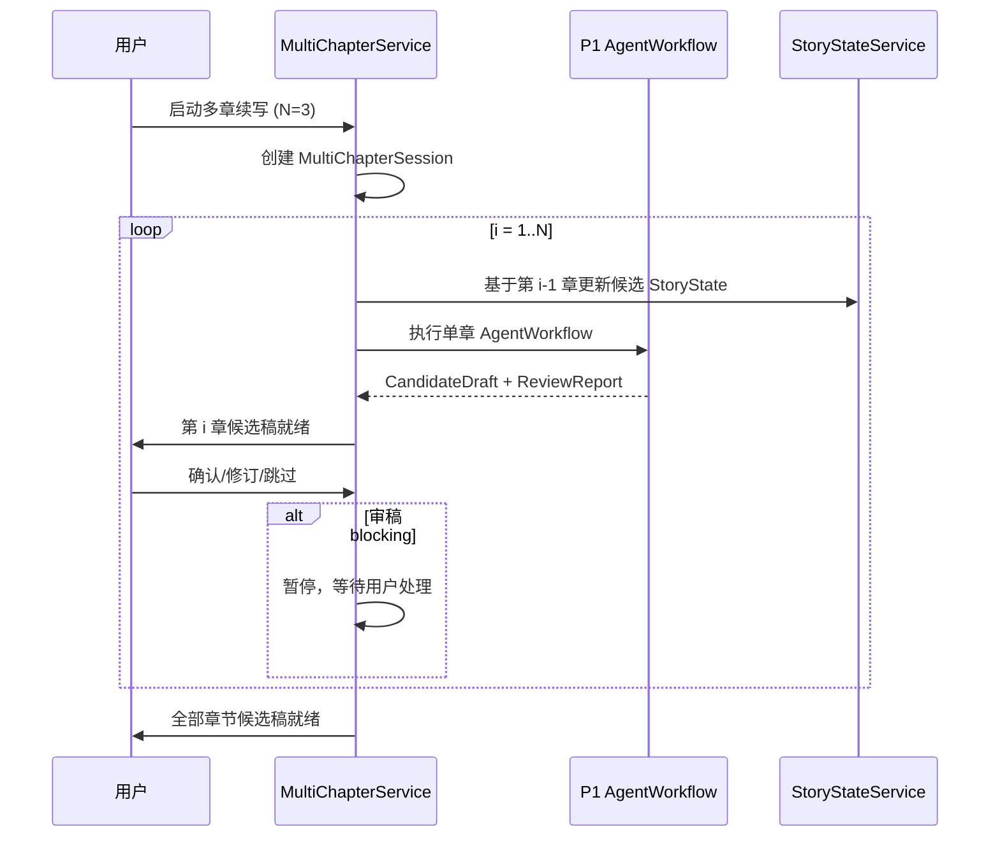

**设计要点**：

- `MultiChapterSession` 是轻量容器——记录目标章数、每章状态（pending/generating/reviewing/ready/blocked）、关联的 AgentSession ID 列表。
- 章间不自动更新**正式** Story State。`InterChapterStateUpdater` 生成的是**候选 Story State**，与候选稿一起展示给用户。
- 某章审稿 blocking 时，`MultiChapterSession.status = paused`，后续章节不继续。
- 每章候选稿完全独立走 HumanReviewGate。**不设计"一键全部接受"**按钮。

**关键对象**：

| 对象 | 核心字段 |
|---|---|
| MultiChapterSession | session_id, work_id, target_chapters, current_chapter_index, per_chapter_status[], agent_session_ids[] |
| MultiChapterProgress | 当前第几章、总章数、每章状态与 CandidateDraft ID |

---

### 4.2 受控自动连续续写队列（P2-S1）

**复用关系**：依赖 4.1 多章续写 + P1 AgentWorkflow + P0 AIJobSystem。不新增 Agent 类型。

**默认交互模式（冻结）**：

自动续写队列默认采用**安全模式**：每章生成候选稿 + 审稿后**暂停等待用户确认是否继续下一章**。用户确认后才推进章间状态更新和下一章生成。

提供**连续候选模式**作为高级开关（用户显式开启）：审稿通过后自动继续生成下一章候选稿。**两种模式下均不得自动合并正式正文**——apply 始终必须 user_action。

```
安全模式（默认）：生成→审稿→暂停→用户确认继续→下一章
连续候选模式（开关）：生成→审稿→自动下一章→...→全部完成后用户逐章确认
```

**StoryState 章间更新硬边界（冻结）**：

自动续写队列运行期间产生的 StoryState 变更**只能是 candidate/runtime state**，不得静默写入正式 StoryState baseline。具体规则：

- 队列维护 `AutoQueueRun.current_candidate_story_state` 和 `QueueStateSnapshot`，仅供章间续写上下文使用。
- 队列**不得**调用 `update_story_memory_directly` 或任何 `formal_write` 级别的 Tool。
- 用户确认某章候选稿（apply）后，才基于已确认正文触发正式的 StoryState 更新流程（走 MemoryUpdateSuggestion → MemoryReviewGate → 用户确认）。
- 违反以上规则视为安全红线违规，必须阻断。

**核心流程**：

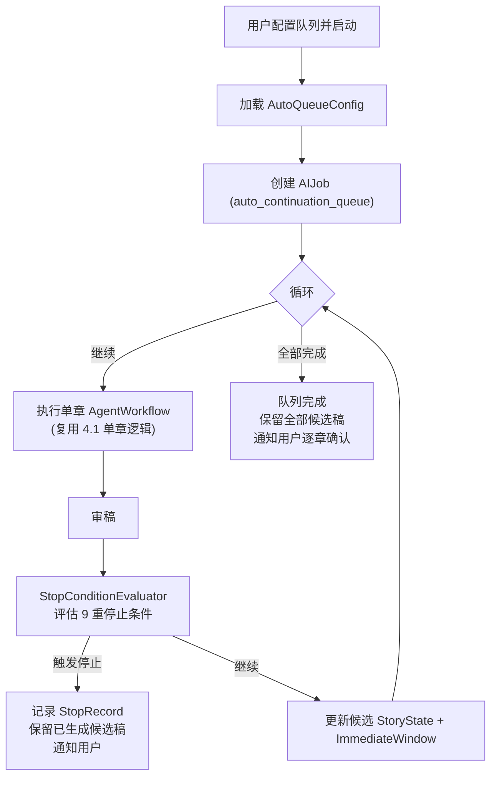

**9 重停止条件矩阵**：

| # | 停止条件 | 判定逻辑 | 类别 |
|---|---|---|---|
| 1 | 达到目标章数 | `generated_count >= target_chapters` | 正常终止 |
| 2 | 达到目标字数 | `Σ(word_count) >= target_words` | 正常终止 |
| 3 | Sequence Arc 结束 | `SequenceArc.status == completed` | 正常终止 |
| 4 | 审稿连续 blocking | ReviewIssue.severity=blocking 连续 ≥2 章 | 异常中断 |
| 5 | 伏笔提前揭示 | Reviewer 检测到尚未到达揭示阶段的伏笔被使用 | 异常中断 |
| 6 | 连续修订失败 | 连续 ≥3 次 Rewriter→Reviewer 循环不通过 | 异常中断 |
| 7 | 成本超限 | 作品级预算或月度预算超限 | 预算中断 |
| 8 | Provider 不可恢复 | auth_failed / quota_exceeded 等不可恢复错误 | 异常中断 |
| 9 | 用户手动停止 | 用户主动暂停/取消 | 用户中断 |

**章间用户交互策略（冻结）**：

- **安全模式（默认）**：每章审稿后暂停，等用户确认方向后再继续。用户逐章审阅候选稿。
- **连续候选模式（高级开关）**：审稿通过→自动下一章，用户事后批量审阅候选稿。apply 仍必须逐章 user_action。
- 两种模式下，自动队列**均不自动合并正式正文**。

**关键对象**：

| 对象 | 核心字段 |
|---|---|
| AutoQueueConfig | queue_id, work_id, target_chapters, target_words, stop_at_sequence_end, stop_on_blocking_review, stop_on_budget_exceeded, max_consecutive_revision_failures(default=3), **queue_mode(default=safe, enum: safe/continuous)** |
| AutoQueueRun | run_id, config_id, status(queued/running/paused/stopped/completed), generated_count, total_word_count, stop_reason, stop_context, **current_candidate_story_state, queue_state_snapshots[]** |
| QueueStateSnapshot | 队列运行期间的候选 Story State 快照，仅供章间续写上下文使用。**不是正式 StoryState baseline** |
| StopConditionEvaluator | 统一评估 9 重条件，返回 (should_stop: bool, reason: str, severity: normal/abnormal/budget/user) |

**安全约束**：

- 自动队列**不自动合并**正式正文。用户事后逐章确认。
- 成本超限停止后，已消费 token 记录持久化到 CostRecord。
- 停止原因写入 AgentTrace 审计事件。

---

### 4.3 Style DNA（P2-S1）

**复用关系**：复用 Memory Agent 的 `call_memory_extractor_model` Tool 做提取；ContextPackService 增加可选层。

**核心流程**：

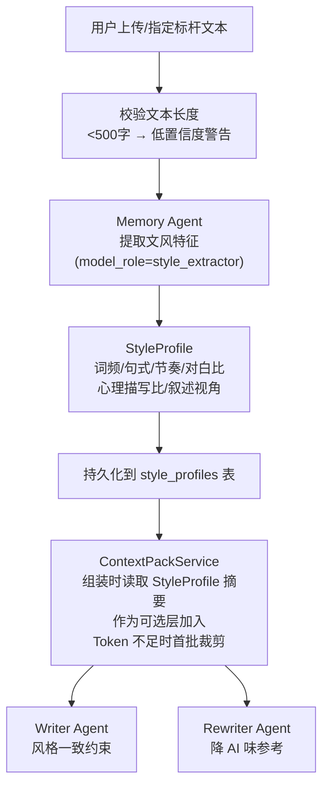

**StyleProfile 结构**：

| 字段 | 类型 | 说明 |
|---|---|---|
| profile_id | str | 主键 |
| work_id | str | 作品 ID |
| source_type | enum(user_upload/chapter_ref/manual) | 来源 |
| confidence | float(0-1) | 置信度；<0.5 时标记 low_confidence |
| dialogue_ratio | float | 对白占比 |
| psychological_ratio | float | 心理描写占比 |
| narrative_perspective | str | first_person / third_person_limited / omniscient |
| avg_sentence_length | float | 平均句长 |
| avg_paragraph_length | float | 平均段长 |
| style_summary | str | 一句话摘要，供 ContextPack 使用（~200 tokens） |
| style_tags | list[str] | 标签：「简洁」「华丽」「冷峻」「幽默」等 |
| version | int | 版本号，支持重新提取 |

**Context Pack 集成**：

```
层级：可裁剪层（Token 不足时首批裁剪）
内容：Style DNA 风格摘要 + 关键约束（如"多用短句""对白占比约 40%""避免长段心理描写"）
Token 预算：约 200-300 tokens
裁剪策略：ContextPriorityPolicy 中 Style DNA 排在 RAG 召回片段之后、历史章节摘要之前
```

**StyleProfile 归属原则（冻结）**：

- `StyleProfile` 是**独立的 P2 子域对象**，拥有独立的 `style_profiles` 持久化表。
- StoryMemory 可以**引用（reference）** StyleProfile（通过 style_profile_id），但 StyleProfile **不直接混入 StoryMemory 主体的字段**。
- ContextPackService 读取 StyleProfile 摘要作为可选层，关系为：`StoryMemory references StyleProfile → ContextPackService loads as optional layer`。
- StyleProfile 的正式化（用户确认后生效）走独立的确认流程，不经过 MemoryReviewGate（StyleProfile 不是 StoryMemory 的一部分）。

**StyleProfile 状态机方向**（详细设计冻结）：

| 状态 | 说明 | 是否可进入 ContextPack |
|---|---|---|
| `draft` | 已提取，未提交用户确认 | 否 |
| `pending_confirm` | 等待用户确认 | 否 |
| `active` | 用户已确认，当前生效 | **是** |
| `disabled` | 用户手动关闭 | 否 |
| `archived` | 已被新版本取代 | 否 |

只有 `status = active` 的 StyleProfile 才进入 ContextPack 可选层。

**安全约束**：Style DNA 提取不修改正文；低置信度 StyleProfile 标记警告并在 ContextPack 中标注；用户可随时删除或重新提取。

---

### 4.4 Citation Link（P2-S1）

**复用关系**：依赖 CandidateDraft + Vector Recall；复用 Writer Agent 的 Output Schema 扩展能力。

**核心设计思路（冻结）**：Citation Link 采用**"模型建议 + 系统校验"双阶段机制**，不完全信任模型自报的引用来源。

1. **模型建议阶段**：Writer Agent 的 Output Schema 包含 `citations` 字段，模型输出候选引用列表。
2. **系统校验阶段**：`CitationValidator` 逐条验证 `source_id` 和 `source_span` 是否真实存在。必要时通过 Vector Recall 反查引用片段是否确实出现在声称的章节。
3. 校验通过的标记 `is_verified=true`。校验失败标记 `unknown_source` 或 `low_confidence`，仍保留候选稿但前端显著标注。

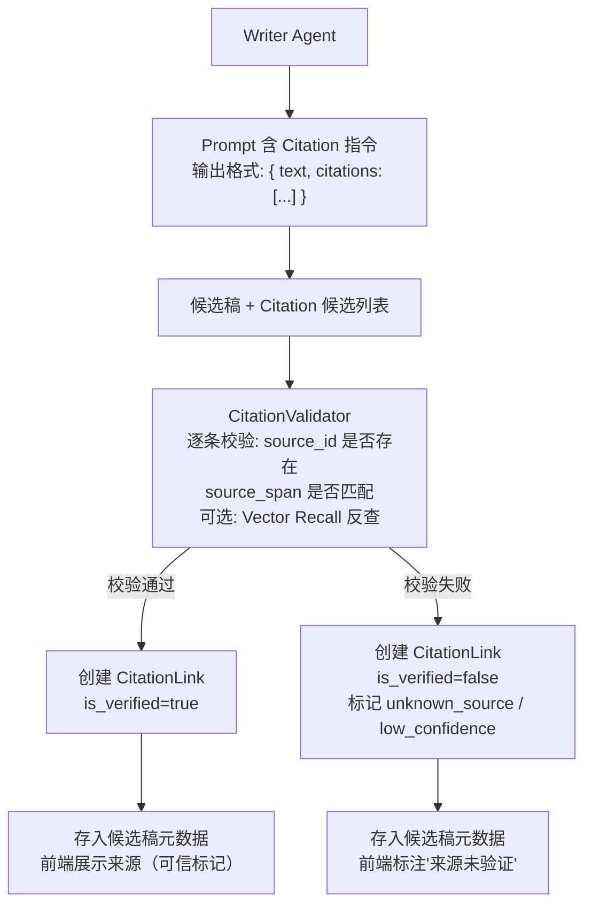

**CitationLink 结构**：

| 字段 | 说明 |
|---|---|
| citation_id | 主键 |
| candidate_version_id | 关联候选稿版本 |
| source_type | chapter / character / foreshadow / setting / event / location |
| source_id | 来源实体 ID |
| source_span | 来源位置（如"第3章第12段"） |
| source_excerpt | 来源摘要（≤120字） |
| context_in_draft | 在候选稿中的使用上下文（≤80字） |
| is_verified | 是否校验通过 |
| confidence | 匹配置信度 |

**与 Vector Recall 的增强关系**：CitationValidator 可选通过 Vector Recall 反查引用片段是否确实存在于声称的章节，提升校验可靠性。

**安全约束**：Citation 是元数据，不写入正文；unknown_source 不阻断候选稿使用。

---

### 4.5 @ 标签引用系统（P2-S2）

**复用关系**：依赖 Citation Link + AI Suggestion；P1 已预留 `citation_placeholder` 建议类型。

这是 P2 中**唯一涉及 V1.1 编辑器（PureTextEditor）深度改造**的子系统。

**前端架构**：

```
PureTextEditor（改造）
├── MentionDetector      # 检测 @ 字符→触发联想
├── MentionPopup         # 联想菜单（最多10条，按类型分组）
├── MentionHighlight     # 行内高亮渲染（@实体 样式区分于普通文本）
├── MentionTooltip       # 悬停→GET /api/v2/mentions/{id}/summary→弹出资产卡片
└── useMentionStore      # Pinia store：mentions 本地状态 + API 同步
```

**前后端交互**：

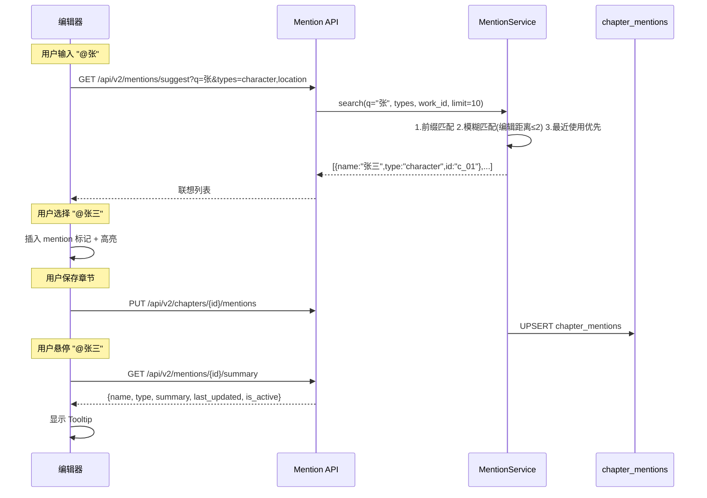

**chapter_mentions 结构**：

| 字段 | 类型 | 说明 |
|---|---|---|
| mention_id | str | 主键 |
| chapter_id | str | 所属章节 |
| entity_type | enum | character/location/event/foreshadow |
| entity_id | str | 实体 ID |
| entity_name | str | 实体名称（冗余，便于展示） |
| start_pos | int | 正文中的起始字符位置 |
| end_pos | int | 结束字符位置 |
| source | enum | user_input / ai_suggestion |
| ai_suggestion_id | str? | 关联 AI Suggestion |
| is_active | bool | 实体被删除后=false |

**AI @ 引用建议**：

- Memory Agent / Reviewer Agent 可生成 @ 引用建议→AI Suggestion（type=`mention_suggestion`，继承 P1 的 `citation_placeholder`）。
- 用户在 AI 建议面板中采纳→自动建立 chapter_mentions 记录。
- AI 建议**不直接修改正文内联标记**——用户需手动在正文中输入 @ 或将 AI 建议的 mention 插入正文。

**正文存储方案：P2-S2 开发前必须决策项（冻结）**

@ 引用的存储方案直接影响 PureTextEditor 存储格式、Local-First 保存、导入导出等核心链路。**必须在 P2-S2 详细设计启动前完成决策**。

| 方案 | 描述 | 优点 | 风险 |
|---|---|---|---|
| A. 位置映射（**推荐默认**） | 正文保持纯文本，mentions 独立存储在 `chapter_mentions` 表，通过 start_pos/end_pos 关联 | 不污染正文；导入导出简单；Local-First 不受影响 | 编辑后位置需重算 |
| B. 内联标记 | 正文中嵌入特殊标记如 `@[c_01\|张三]` | 位置稳定 | 污染正文；破坏纯文本链路；导入导出需特殊处理 |

**默认推荐方案 A**：正文保持纯文本，@ 引用关系独立存储在 `chapter_mentions`。前端渲染层做高亮，不把特殊标记写入正文内容。此方案不破坏 V1.1 纯文本链路。

**安全约束**：AI 建议不自动建立 mentions；同名实体必须让用户选择；实体删除后 mention 保留但标记 is_active=false。

---

### 4.6 Opening Agent（P2-S2）

**产品定位**：产品内统一称“开篇助手”。面向普通小说作者，默认不要求参考作品，也不暴露 Agent、Job、Session、Prompt 等技术概念。

**复用关系**：复用 P1 Agent Runtime 的短任务执行能力、Tool Facade、ContextPack、WritingTask、Reviewer、CandidateDraft 与 HumanReviewGate；不使用跨用户确认的长生命周期 AIJob。

**用户四步流程**：


**后台短用例**：

| Use Case | 职责 | 是否等待用户 |
|---|---|---|
| `prepare_opening_brief` | 汇总作者回答与作品已有大纲/人物/设定 | 否 |
| `analyze_opening_references` | 可选参考分析，完成后立即清理完整原文 | 否 |
| `generate_opening_directions` | 生成三个白话、差异明确的开篇方向 | 否 |
| `confirm_opening_direction` | 真实用户确认唯一方向 | 是，业务状态等待，不保持运行中 Job |
| `generate_opening_drafts` | 按章生成 1–3 章 CandidateDraft，并委托 Reviewer 审稿 | 否 |

**风险双门控**：

- 生成前检查方向与参考分析摘要的策略相似风险；high 时后端阻止生成。
- 每章生成后检查稿件原创性；high 时保留 CandidateDraft，但后端阻止 apply，P2 初期不提供 override。

**参考文本边界**：完整参考文本不得进入通用 AIJob.context 或业务表。跨请求临时保存必须通过 `TemporarySensitiveTextStore` Port，本地加密、默认 TTL 30 分钟、分析完成立即删除、启动时清理过期残留。

**领域关系**：OpeningBrief → OpeningDirectionBatch/Direction → OpeningDraftBatch → CandidateDraft → OriginalityReport。历史记录版本化保留，不按 work_id 覆盖旧主键。

**安全约束**：

- 无参考作品是正式主路径；参考作品为可选增强。
- 生成不超过三章，每章独立 CandidateDraft。
- 不创建或覆盖正式章节，不提供“一键全部应用”。
- 方向确认、停止生成、候选稿 apply 均必须由真实 `user_action` 触发。
- 普通日志不记录完整参考文本、Prompt、ContextPack、正文或候选稿。

---

### 4.7 大纲辅助（P2-S2）

**复用关系**：Planner Agent 扩展 + AI Suggestion Store + Conflict Guard。不新增 Agent。

**四种辅助模式**：

| 模式 | 触发方式 | 输出 | 存储位置 |
|---|---|---|---|
| 大纲润色 | 用户选中大纲文本→"AI润色" | 优化后的大纲文本 | AI Suggestion (type=outline_polish) |
| 大纲扩写 | 用户在大纲节点上→"AI扩写" | 补充细节/分支/伏笔 | AI Suggestion (type=outline_expand) |
| 章节细纲 | 用户在章节上→"生成细纲" | 该章的节拍/场景拆分 | AI Suggestion (type=chapter_outline_detail) |
| WritingTask 建议 | Planner 触发→"优化WritingTask" | 优化后的 WritingTask | WritingTask（标记 generated_by=ai） |

**核心流程**：

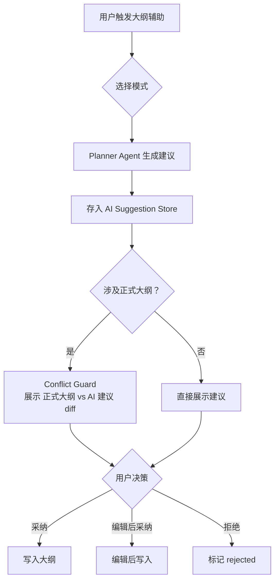

**新增 AI Suggestion 类型**：`outline_polish`、`outline_expand`、`chapter_outline_detail`。

**安全约束**：AI 大纲建议不自动覆盖正式大纲；涉及正式大纲时触发 Conflict Guard。

---

### 4.8 选区改写/润色（P2-S2）

**复用关系**：ContextPackService（选区级上下文）+ Writer Agent（候选稿生成能力）+ CandidateDraft 隔离模式。

**六种改写模式**：

| 模式 | 说明 | model_role |
|---|---|---|
| 扩写 (expand) | 扩展选中内容，增加细节 | writer |
| 重写 (rewrite) | 完全重写选中内容 | writer |
| 缩写 (abbreviate) | 压缩选中内容 | writer |
| 润色 (polish) | 优化表达，不改内容 | rewriter |
| 对白优化 (dialogue_opt) | 优化对白的自然度和角色辨识度 | rewriter |
| 降 AI 味 (de_ai) | 减少 AI 写作痕迹 | rewriter |

**核心流程**：

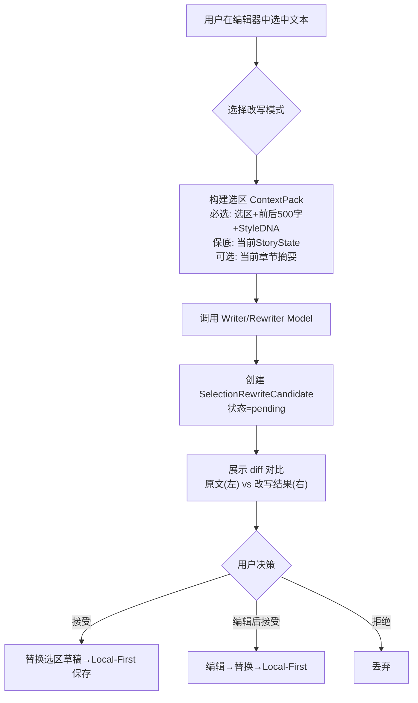

**SelectionRewriteCandidate 结构**：

| 字段 | 说明 |
|---|---|
| rewrite_id | 主键 |
| chapter_id | 所属章节 |
| rewrite_mode | expand/rewrite/abbreviate/polish/dialogue_opt/de_ai |
| source_text | 原始选中文本 |
| source_start_pos, source_end_pos | 选区位置 |
| rewritten_text | 改写结果 |
| diff_summary | 差异摘要（字数变化 + 关键改动） |
| status | pending/applied/rejected |

**选区 ContextPack（轻量版）**：

| 层级 | 内容 | Token 预算 |
|---|---|---|
| 必选 | 选区上下文 + 前后各 500 字 + Style DNA（若有） | ~1000 |
| 保底 | 当前 Story State（角色在场、地点） | ~200 |
| 可裁剪 | 当前章节摘要、相关角色卡 | ~500 |

**apply 路径（冻结）**：

`SelectionRewriteCandidate` 的 apply 路径与 CandidateDraft 接受流程一致：

```
用户确认 → Presentation 调 Core Application.apply_selection_rewrite_to_draft
→ 替换当前编辑区草稿中对应选区内容（不改正式章节）
→ 后续保存走 V1.1 Local-First
```

SelectionRewriteCandidate 的 apply **不能**直接写正式数据库中的章节内容。Agent 不得调用 `apply_selection_rewrite_to_draft`（该动作必须 `caller_type=user_action`）。

**安全约束**：改写结果不自动替换正文；不改变选区之外的内容；用户确认后进入章节草稿区（非正式章节）；后续保存走 Local-First。

---

### 4.9 成本看板（P2-S3）

**复用关系**：LLMCallLog (P0) + AgentTrace (P1)。纯只读聚合，不产生新 AI 调用。

**架构**：

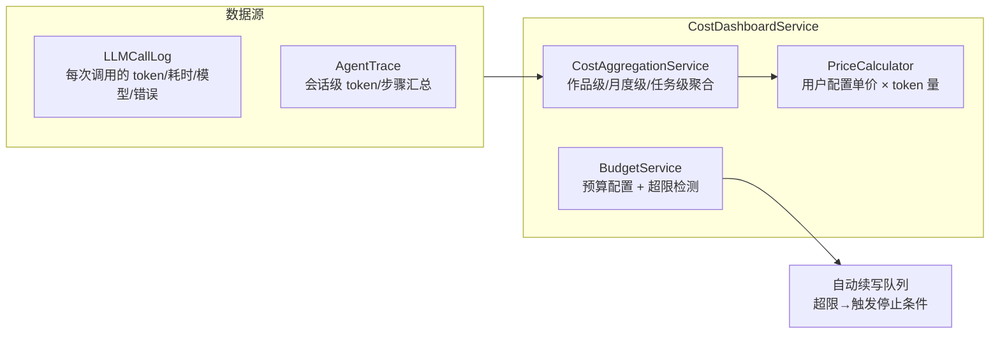

**三级预算体系**：

| 级别 | 配置粒度 | 超限行为 |
|---|---|---|
| 作品初始化预算 | 单次初始化 max_tokens | 暂停初始化，用户确认继续 |
| 单次自动续写预算 | 单次队列 max_tokens | 触发停止条件 #7 |
| 月度预算 | 每月 max_cost | 暂停所有 AI 能力，等待下月或用户手动调整 |

**数据源策略（冻结）**：

- **`LLMCallLog` 是成本事实的唯一权威源**（P0 已有，每次 LLM 调用写入一条）。
- `CostDashboardService` 直接查询 `LLMCallLog` 做实时的聚合计算（按作品/月度/任务维度 GROUP BY），**不另建 `cost_records` 事实表**，避免同一笔模型调用在两处存储导致的数据不一致。
- 如果后续有性能需求，可在 P2-S3 详细设计中评估是否引入定时物化缓存，但缓存不是新的事实源。

| 字段 | 来源 |
|---|---|
| work_id, task_id | LLMCallLog + AgentTrace 关联 |
| provider_name, model_name, model_role | LLMCallLog |
| total_tokens, elapsed_ms | LLMCallLog |
| cost | CostDashboardService 实时计算：total_tokens × unit_price |
| user_adopted | AgentTrace → UserDecisionTrace（后续关联） |

**安全约束**：只读不写；API Key 不入看板；完整正文不入看板；单价本地存储。

---

### 4.10 分析看板（P2-S3）

**复用关系**：StoryMemory + AIReview 历史 + AgentTrace + 章节正文。纯只读。

**六大分析维度**：

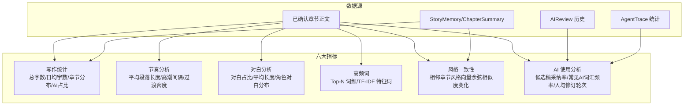

**指标存储策略**：

- 分析指标**异步计算 + 缓存**。大作品（>50 万字）定时批量计算（如每日一次），小作品可实时计算。
- `AnalysisMetric` 表存计算结果，字段：metric_id, work_id, metric_type, metric_name, metric_value, chapter_range, computed_at, stale。
- `stale=true` 表示自上次计算后有新章节，需重新计算。前端展示时显示"数据更新于 X 时间"。

**安全约束**：只读；AI 使用分析结果不自动修改正文或 Prompt（不将"AI 辅助占比高"作为自动处罚依据）；高频词不包含敏感信息；不使用"AI 检测器"等暗示精确判断能力的命名。

---

## 五、P2 对 P1 的增量影响总结

### 5.1 枚举扩展

在 `domain/entities/ai/models.py` 中追加：

```python
# AgentType 新增
class AgentType(StrEnum):
    # ... 已有 ...
    OPENING = "opening"      # P2 新增

# ModelRole 新增
class ModelRole(StrEnum):
    # ... 已有 ...
    STYLE_EXTRACTOR = "style_extractor"        # P2: Style DNA 提取
    SELECTION_REWRITER = "selection_rewriter"  # P2: 选区改写专用

# AgentWorkflowType 新增
class AgentWorkflowType(StrEnum):
    # ... 已有 ...
    OPENING_ANALYSIS = "opening_analysis"  # P2: Opening Agent Workflow

# AISuggestionType 新增
class AISuggestionType(StrEnum):
    # ... 已有 ...
    OUTLINE_POLISH = "outline_polish"
    OUTLINE_EXPAND = "outline_expand"
    CHAPTER_OUTLINE_DETAIL = "chapter_outline_detail"
    MENTION_SUGGESTION = "mention_suggestion"

# WorkflowType 新增
class WorkflowType(StrEnum):
    # ... 已有 ...
    OPENING_WORKFLOW = "opening_workflow"      # P2 新增

# TraceEventType 新增
class TraceEventType(StrEnum):
    # ... 已有 ...
    AUTO_QUEUE_STARTED = "auto_queue_started"
    AUTO_QUEUE_STOPPED = "auto_queue_stopped"
    AUTO_QUEUE_CHAPTER_COMPLETED = "auto_queue_chapter_completed"
    STYLE_DNA_EXTRACTED = "style_dna_extracted"
    CITATION_VERIFIED = "citation_verified"
    CITATION_UNVERIFIED = "citation_unverified"
    MENTION_CREATED = "mention_created"
    MENTION_SUGGESTION_ACCEPTED = "mention_suggestion_accepted"
    OPENING_REFERENCE_IMPORTED = "opening_reference_imported"
    OPENING_IMITATION_RISK_HIGH = "opening_imitation_risk_high"
    SELECTION_REWRITE_APPLIED = "selection_rewrite_applied"
    BUDGET_EXCEEDED = "budget_exceeded"
```

### 5.2 权限矩阵扩展

在 P1 五 Agent 权限表基础上新增 Opening Agent 列，格式与 P1 总纲 §5.7 一致：

| Tool | Opening Agent |
|---|---|
| get_work_outline / get_chapter_context / get_story_memory / get_story_state | allow |
| build_context_pack / create_writing_task | allow |
| create_candidate_draft / create_review_report | allow |
| import_reference_novel / analyze_opening_patterns / generate_opening_drafts | allow |
| check_imitation_risk / create_opening_strategy | allow |
| write_agent_trace / update_ai_job_progress | allow |
| **所有 formal_write Tool** | **-** |
| accept_suggestion_as_user / bypass_human_review_gate | **-** |

### 5.3 Workflow Stage 扩展

在 P1 `agent_workflow.py` 中新增 Opening Workflow 的 Stage 定义：

| Stage | 负责 Agent | 说明 |
|---|---|---|
| OPENING_IMPORT_REFERENCE | Opening Agent | 导入参考小说 |
| OPENING_ANALYZE_PATTERNS | Opening Agent | 分析开篇规律 |
| OPENING_CREATE_STRATEGY | Opening Agent | 制定开篇策略 |
| OPENING_GENERATE_DRAFTS | Opening Agent | 生成前三章候选稿 |
| OPENING_REVIEW | Reviewer Agent（复用） | 签约向审稿 |
| OPENING_IMITATION_CHECK | Opening Agent | 过度模仿检测 |

---

## 六、P2 持久化架构

### 6.1 新增持久化对象

| 表名 | 子域 | 数据性质 | 用户确认 |
|---|---|---|---|
| auto_queue_configs | 自动续写队列 | 配置 | 需要 |
| auto_queue_runs | 自动续写队列 | 运行时状态 | - |
| auto_queue_stop_records | 自动续写队列 | 日志 | - |
| style_profiles | Style DNA | AI 分析 | 正式化需确认 |
| citation_links | Citation Link | 元数据 | - |
| chapter_mentions | @ 标签引用 | 用户数据 + AI 建议 | 采纳时确认 |
| opening_briefs | 开篇助手 | 作者故事说明与作品信息引用，版本化保留 | 用户输入 |
| opening_reference_sessions | 开篇助手 | 可选参考摘要、版权确认与临时敏感存储引用 | 用户确认 |
| opening_direction_batches / opening_directions | 开篇助手 | 三个开篇方向、版本与唯一确认结果 | 需要 user_action |
| opening_draft_batches | 开篇助手 | 分章生成状态与 CandidateDraft result_ref | 用户可停止 |
| opening_originality_reports | 开篇助手 | 策略级/稿件级原创性检查，关联具体方向和候选稿 | - |
| selection_rewrite_candidates | 选区改写 | 候选数据 | 接受才替换 |
| cost_budgets | 成本看板 | 配置 | 需要 |
| cost_aggregation_cache | 成本看板 | 聚合缓存（可选，详细设计决策） | - |
| analysis_metrics | 分析看板 | 计算缓存 | - |

### 6.2 持久化原则

- 全部为**新增表**，不修改 P0/P1 已有表结构。
- AI 建议类数据进入 AI Suggestion 通用表（通过 `suggestion_type` 区分），不单独建表。
- **成本数据以 `LLMCallLog` 为唯一事实源**（P0 已有）。`CostDashboardService` 直接查询聚合，不另建成本事实表。`cost_aggregation_cache` 为可选物化缓存，由 P2-S3 详细设计决策是否引入。
- 分析指标为计算缓存表，可由后台定时批量生成。
- V1.1 的 work/chapter/asset 表永不被 P2 直接写入。

---

## 七、P2 API 架构

### 7.1 新增 API 分组

| 分组 | 路由前缀 | 阶段 |
|---|---|---|
| Auto Queue | `/api/v2/ai/auto-queues` | P2-S1 |
| Style DNA | `/api/v2/ai/style-dna` | P2-S1 |
| Citation Link | `/api/v2/ai/citations` | P2-S1 |
| Mentions | `/api/v2/mentions` | P2-S2 |
| Opening Agent | `/api/v2/ai/opening` | P2-S2 |
| Outline Assist | `/api/v2/ai/outline-assist` | P2-S2 |
| Selection Rewrite | `/api/v2/ai/selection-rewrite` | P2-S2 |
| Cost Dashboard | `/api/v2/ai/cost-dashboard` | P2-S3 |
| Analysis Dashboard | `/api/v2/ai/analysis-dashboard` | P2-S3 |

### 7.2 关键端点

```
# 自动续写队列
POST   /api/v2/ai/auto-queues/config            # 创建/更新队列配置
POST   /api/v2/ai/auto-queues/{id}/start         # 启动队列
POST   /api/v2/ai/auto-queues/{id}/pause         # 暂停
POST   /api/v2/ai/auto-queues/{id}/stop          # 停止
GET    /api/v2/ai/auto-queues/{id}/status         # 状态与进度
GET    /api/v2/ai/auto-queues/{id}/chapters       # 已生成候选稿列表

# Style DNA
POST   /api/v2/ai/style-dna/extract              # 触发提取
GET    /api/v2/ai/style-dna/{work_id}             # 查看风格画像
PUT    /api/v2/ai/style-dna/{work_id}/source      # 更新标杆文本

# @ Mentions
GET    /api/v2/mentions/suggest?q=&types=         # 联想查询
GET    /api/v2/chapters/{id}/mentions             # 查询章节 mentions
PUT    /api/v2/chapters/{id}/mentions             # 更新章节 mentions
GET    /api/v2/mentions/{id}/summary              # 悬停摘要

# Opening Agent
POST   /api/v2/ai/opening/briefs                                      # 保存作者的故事说明
POST   /api/v2/ai/opening/briefs/{brief_id}/references                # 可选：添加灵感参考
POST   /api/v2/ai/opening/briefs/{brief_id}/directions:generate       # 生成三个开篇方向
POST   /api/v2/ai/opening/directions/{direction_id}:confirm           # 用户确认方向
POST   /api/v2/ai/opening/directions/{direction_id}/drafts:generate   # 分章生成候选稿
GET    /api/v2/ai/opening/draft-batches/{batch_id}                    # 查询分章结果

# 选区改写
POST   /api/v2/ai/selection-rewrite               # 触发改写
GET    /api/v2/ai/selection-rewrite/{id}           # 查询候选
POST   /api/v2/ai/selection-rewrite/{id}/apply     # 应用改写

# 成本看板
GET    /api/v2/ai/cost-dashboard/summary?work_id=&month=
GET    /api/v2/ai/cost-dashboard/details?work_id=&task_id=
GET    /api/v2/ai/cost-dashboard/budget
PUT    /api/v2/ai/cost-dashboard/budget

# 分析看板
GET    /api/v2/ai/analysis-dashboard/overview?work_id=
GET    /api/v2/ai/analysis-dashboard/rhythm?work_id=
GET    /api/v2/ai/analysis-dashboard/dialogue?work_id=
GET    /api/v2/ai/analysis-dashboard/style?work_id=
GET    /api/v2/ai/analysis-dashboard/ai-usage?work_id=
```

### 7.3 API 设计原则

- 继承 P0-11 的 Request/Response/Error 通用格式（`request_id`/`trace_id`/`status`/`data`/`error`/`polling_hint`）。
- API 层不承载业务逻辑，不直连 Provider/Repository/ModelRouter。
- `accept`/`apply`/`reject` 动作必须走 `caller_type=user_action`。

---

## 八、P2 前端架构

### 8.1 新增 UI 模块

| 模块 | 阶段 | 位置 |
|---|---|---|
| 多章续写入口 + 进度条 | P2-S1 | WritingStudio 顶部工具栏 |
| 自动续写面板 | P2-S1 | RightWorkspacePanel 新增 Tab |
| Style DNA 配置区 | P2-S1 | AI Settings 页面扩展 |
| Citation 引用浮层 | P2-S1 | AIPanel 候选稿查看区 |
| @ 联想弹窗 + 高亮 + 悬停 | P2-S2 | PureTextEditor 内联 |
| Opening Agent 向导 | P2-S2 | 作品列表→"签约开篇助手"入口→独立向导页 |
| 大纲辅助面板 | P2-S2 | RightWorkspacePanel 新增 Tab |
| 选区改写浮动工具栏 | P2-S2 | PureTextEditor 选中文本弹出 |
| 选区改写 Diff 弹窗 | P2-S2 | 模态弹窗 |
| 成本看板页面 | P2-S3 | 独立路由 `/works/{id}/cost` |
| 分析看板页面 | P2-S3 | 独立路由 `/works/{id}/analysis` |

### 8.2 编辑器改动范围（@ 引用）

`PureTextEditor.vue` 是 P0 的核心组件，P2 需要在**不破坏现有编辑功能**的前提下扩展：

1. **MentionDetector**：在 `input`/`compositionend` 事件中检测 `@` 字符，触发联想查询。
2. **MentionPopup**：浮动定位在光标下方，键盘上下选择，Enter 确认，Escape 关闭。
3. **MentionHighlight**：mentions 在正文中以 `<span class="mention">` 渲染，与普通文本区分颜色。
4. **MentionTooltip**：`mouseenter` 时请求摘要 API，展示资产卡片。

建议实现策略：**先做独立 MentionStore + 后 hook 进编辑器**，最小化对 PureTextEditor 的侵入。

---

## 九、P2 验收标准

### 9.1 P2 DoD（Definition of Done）

- [ ] 多章续写按章独立生成候选稿，每章独立走 HumanReviewGate。
- [ ] 自动续写队列具备 9 重停止条件，停止后保留已生成候选稿和停止原因。
- [ ] 自动续写队列不自动合并正式正文。apply 仍必须 user_action。
- [ ] Style DNA 可提取并进入 Context Pack 可选层。
- [ ] Citation Link 可在候选稿中标记来源，不存在来源时标记 unknown_source。
- [ ] @ 标签引用可联想、高亮、悬停、持久化到 chapter_mentions。
- [ ] Opening Agent 签约开篇分析与候选稿生成可用，不自动创建正式章节。
- [ ] Opening Agent 导入参考文本前弹版权确认，不持久化完整参考文本。
- [ ] 大纲辅助输出不自动覆盖正式大纲，涉及正式大纲时触发 Conflict Guard。
- [ ] 选区改写结果不自动替换正文，用户确认后才进入草稿区。
- [ ] 成本看板可展示作品/月度/任务级成本，预算超限可触发自动队列停止。
- [ ] 分析看板六大维度数据可查。
- [ ] 所有 P2 新增 API 不承载业务逻辑，不走私 Provider/Repository/ModelRouter。
- [ ] 所有 P2 子系统写入 AgentTrace 审计事件。
- [ ] P0/P1 安全红线全部回归通过。

### 9.2 验收矩阵

| 子系统 | 正常场景 | 边界场景 | 异常场景 | 安全红线 |
|---|---|---|---|---|
| 多章续写 | N=3 正常生成 | N=1 降级为单章 | 某章审稿 blocking→暂停 | 不批量合并正文 |
| 自动续写队列 | 自动 5 章完成后逐章确认 | 用户手动停止→保留候选稿 | 成本超限→停止+记录 | 不自动 apply |
| Style DNA | 上传→提取→进入 ContextPack | 文本<500字→低置信度 | 提取失败→跳过层 | 不修改正文 |
| Citation Link | 生成候选稿+引用来��� | 来源不存在→unknown_source | 校验超时→跳过校验 | 不污染正文 |
| @ 标签引用 | @→联想→选择→高亮→保存 | 同名实体→用户选择 | 实体被删→标记不活跃 | AI 建议不自动建立 |
| Opening Agent | 导入→分析→生成→审稿 | 无参考文→通用规则 | 模仿风险 high→警告 | 不自动创建正式章节 |
| 大纲辅助 | 润色→建议→采纳 | 与手写大纲冲突→ConflictGuard | 生成失败→错误提示 | 不自动覆盖 |
| 选区改写 | 选中→扩写→diff→应用 | 选区为空→不显示入口 | 生成失败→保留原文 | 不自动替换 |
| 成本看板 | 展示三级成本 | 数据不足→显示提示 | 单价缺失→用户配置 | 不暴露 Key |
| 分析看板 | 六大维度可查 | 大作品→异步计算 | 计算超时→stale | 不读取候选稿 |

---

## 十、架构风险

| 风险 | 影响 | 缓解策略 | 阻塞级 |
|---|---|---|---|
| 自动续写队列被误解为无人化写书 | 产品边界失控 | 前端多处显著标注"候选稿/待确认"；不提供"一键全接受" | **是** |
| @ 引用编辑器改动破坏现有编辑功能 | 核心写作链路退化 | 渐进增强：先独立 Store→再 hook 编辑器；全量回归 PureTextEditor 测试 | **是** |
| Opening Agent 版权风险 | 法律风险 | 强制版权确认弹窗；不持久化完整参考文本；仅存分析摘要 | **是** |
| 多章续写 + 自动队列状态管理复杂 | 流程卡死 | 每章独立 AgentSession；章间状态可恢复；支持跳过失败章节 | **是** |
| P2 功能过多稀释 P1 安全约束 | 安全边界退化 | 每个子系统验收时强制回归 P0/P1 全部安全红线 | **是** |
| Style DNA 效果不明显 | 用户失望 | 低置信度标注；提供开关关闭；设为 ContextPack 最低优先级 | 否 |
| Citation Link 引用不准确 | 可信度降低 | CitationValidator 校验；unknown_source 标记；不阻断候选稿使用 | 否 |
| 分析看板大作品性能 | 计算超时 | 异步 + 缓存 + 增量更新 + stale 标记 | 否 |

---

## 十一、P2 后续详细设计清单

### P2-S1（核心增强）

| # | 文档 | 建议文件名 | 设计顺序 |
|---|---|---|---|
| 1 | 多章续写详细设计 | `InkTrace-V2.0-P2-01-多章续写详细设计.md` | ① 先做（S1 基础） |
| 2 | Citation Link 详细设计 | `InkTrace-V2.0-P2-02-CitationLink详细设计.md` | ② 与 01 可并行 |
| 3 | Style DNA 详细设计 | `InkTrace-V2.0-P2-03-StyleDNA详细设计.md` | ③ 与 01/02 可并行 |
| 4 | 受控自动续写队列详细设计 | `InkTrace-V2.0-P2-04-自动续写队列详细设计.md` | ④ 后做（依赖 01+停止条件） |

### P2-S2（产品增强）

| # | 文档 | 建议文件名 |
|---|---|---|
| 5 | @ 标签引用系统详细设计 | `InkTrace-V2.0-P2-05-AtMention详细设计.md` |
| 6 | Opening Agent 详细设计 | `InkTrace-V2.0-P2-06-OpeningAgent详细设计.md` |
| 7 | 大纲辅助详细设计 | `InkTrace-V2.0-P2-07-大纲辅助详细设计.md` |
| 8 | 选区改写与润色详细设计 | `InkTrace-V2.0-P2-08-选区改写详细设计.md` |

### P2-S3（看板分析）

| # | 文档 | 建议文件名 |
|---|---|---|
| 9 | 成本看板详细设计 | `InkTrace-V2.0-P2-09-成本看板详细设计.md` |
| 10 | 分析看板详细设计 | `InkTrace-V2.0-P2-10-分析看板详细设计.md` |

### 集成

| # | 文档 | 建议文件名 |
|---|---|---|
| 11 | P2 API 与前端集成边界详细设计 | `InkTrace-V2.0-P2-11-API与前端集成边界详细设计.md` |

**设计顺序理由**：

1. **P2-01 多章续写**是 P2-S1 的基础编排模式，后续自动续写队列基于它。
2. **P2-02 Citation Link** 依赖 CandidateDraft + VectorRecall，与多章续写无直接依赖，可并行设计。
3. **P2-03 Style DNA** 依赖 Memory Agent + ContextPack，与前两者无直接依赖，可并行设计。
4. **P2-04 自动续写队列**依赖多章续写 + 停止条件 + 预算 + 审稿 + StoryState 章间更新，是 P2-S1 最复杂的子系统，**建议最后做**。
5. **P2-05 @ 标签引用**依赖 Citation Link + AI Suggestion，需在 P2-02 之后。
6. **P2-06 Opening Agent** 依赖 P1 AgentRuntime + 五 Agent，可独立设计。
7. **P2-07/08** 相对独立，可与 P2-06 并行。
8. **P2-09/10** 依赖 LLMCallLog + AgentTrace，适合最后设计。

---

## 十二、设计待确认点

### 已决策项（本轮架构设计已冻结）

| # | 决策项 | 决策结果 |
|---|---|---|
| D1 | 自动队列章间交互模式 | 默认安全模式（逐章暂停确认），连续候选模式为高级开关。详见 §4.2 |
| D2 | 自动队列 StoryState 边界 | candidate/runtime state 仅供章间续写用，不静默写入正式 StoryState baseline。详见 §4.2 |
| D3 | Opening Agent Tool 命名 | 禁止 `call_opening_model` 等表达"调用模型"的 Tool 名。Tool 名必须表达业务用例。详见 §4.6 |
| D4 | StyleProfile 归属 | StyleProfile 是独立 P2 子域对象，被 StoryMemory/ContextPack 引用，不混入 StoryMemory 主体。详见 §4.3 |
| D5 | Citation Link 验证机制 | "模型建议 + 系统校验"双阶段，不完全信任模型自报。详见 §4.4 |
| D6 | @ 引用正文存储方案 | **默认方案 A（位置映射）**：正文纯文本，mentions 独立存储。P2-S2 开发前须最终确认。详见 §4.5 |
| D7 | SelectionRewrite apply 路径 | 用户确认→草稿区→Local-First，不能直接写正式章节。详见 §4.8 |
| D8 | 成本数据事实源 | LLMCallLog 为唯一权威源，不另建 cost_records 事实表。详见 §4.9 |
| D9 | AI 使用分析命名 | 不使用"AI 检测器"等暗示精确判断能力的命名，改为"AI 使用分析"。详见 §4.10 |
| D10 | P2-S1 实施顺序 | 多章续写 → Citation Link → Style DNA → 自动续写队列。详见 §2.4 |
| D11 | Opening Agent | 作为独立 AgentType 注册到 P1 Runtime，以独立权限行管控。详见 §4.6 |

### 待确认项（P2 详细设计阶段确认）

1. **Style DNA 标杆文本来源**：仅上传还是可从已有章节指定？建议两者都支持。
2. **Citation Link 引用粒度**：片段级（逐句）还是章节级？建议 P2 先做章节级，片段级留 P3。
3. **Opening Agent 参考文本摘要（已由 P2-06 v2.0 裁决）**：持久化结构化摘要、范围、字数与不可逆 hash；完整原文只进入加密 `TemporarySensitiveTextStore`，分析完成立即删除。
4. **选区改写 diff**：是否需要逐句/逐词对比？建议 P2 先做全文 diff 摘要，精细 diff 留 P3。
5. **成本看板单价配置**：全局默认+作品可覆盖。
6. **分析看板计算策略**：建议 ≤30 万字实时，>30 万字每日批量。
7. **P2 是否引入正文 token streaming**：建议 P2 保持不启用。
8. **成本看板/分析看板路由**：建议独立路由页面。

---

## 附录 A：需求规格引用

| 需求编号 | 需求名称 | P2 子系统 |
|---|---|---|
| R-AI-DRAFT-04 | 多章续写 | 4.1 |
| R-AI-DRAFT-05 | 受控自动连续续写队列 | 4.2 |
| R-AI-ENH-01 | Style DNA | 4.3 |
| R-AI-CITE-01 | Citation Link | 4.4 |
| R-AI-CITE-02 | @ 标签引用系统 | 4.5 |
| R-AI-ENH-02 | Opening Agent | 4.6 |
| R-AI-ENH-03 | 大纲辅助 | 4.7 |
| R-AI-ENH-04 | 选区改写/润色 | 4.8 |
| R-AI-ENH-05 | 成本看板与分析看板 | 4.9 + 4.10 |
| R-AI-BOUNDARY-01~05 | AI 边界 | 全部子系统（继承） |

## 附录 B：P2 DoD 检查清单

在 P2 开发完成后逐条验证：

- [ ] 自动续写队列不自动合并正式正文（自动化测试可验证）
- [ ] Opening Agent 不被授予 formal_write 权限（权限矩阵单元测试）
- [ ] @ 引用 AI 建议进入 AI Suggestion，不自动建立 mentions
- [ ] 大纲辅助 AI 建议不自动覆盖正式大纲
- [ ] 选区改写结果不自动替换正文
- [ ] 参考文本完整内容不持久化
- [ ] 成本看板不暴露 API Key
- [ ] 所有 P2 子系统写入 AgentTrace
- [ ] P0/P1 全部已有测试仍通过
