# InkTrace V2.0 架构设计说明书

版本：v2.0-architecture  
更新时间：2026-05-08  
依据文档：

- `docs/01_requirements/InkTrace-V2.0-需求规格说明书.md`
- `docs/07_overview/InkTrace-V2.0-概要设计说明书.md`

***

## 一、架构设计目标与范围

### 1.1 文档定位

本文档是 InkTrace V2.0 的架构设计说明书，用于承接已经冻结的 V2.0 需求规格说明书与概要设计说明书。

本文档回答：

- 系统如何分层。
- 模块如何拆分。
- 子域如何划分。
- Core 与 Agent 如何依赖。
- Tool Facade 如何作为受控边界。
- Application Service、Domain、Ports、Infrastructure Adapter 如何组织。
- P0 如何落地，P1 / P2 如何扩展。
- 关键流程如何在架构层闭环。
- 哪些模块后续进入详细设计。

本文档不做：

- 不写业务代码。
- 不修改现有源码。
- 不生成数据库迁移。
- 不做字段级 DTO / API 设计。
- 不做表结构详细设计。
- 不扩大 P0 范围。

### 1.2 架构设计目标

V2.0 架构目标：

- 在 V1.1 Workbench 上接入 AI 写作智能体系统。
- 保持 V1.1 Local-First 正文保存链路不变。
- 保持正式正文、正式资产、正式 Story Memory 的用户确认边界。
- 建立 InkTrace Core 与 InkTrace Agent 的单向依赖。
- 建立 Core Application Tool Facade 作为 Agent 唯一受控入口。
- 建立 Candidate Draft、AI Suggestion、Review Report、Memory Update Suggestion 等隔离层。
- 支撑 P0 最小闭环，并为 P1 完整 Agent Runtime 预留演进路径。

### 1.3 核心边界

必须保持：

- AI 不直接合并正式正文。
- AI 不直接覆盖正式资产。
- AI 不直接创建正式章节。
- AI 不直接写正式 Story Memory。
- Agent 不直接访问数据库、LLM Provider、Embedding、Vector DB、文件系统、Repository、Domain 或正式资产。
- Agent 不直接调用 Kimi / DeepSeek SDK。
- Agent 不直接调用 Model Router。
- Agent 只能通过 Core Application Tool Facade 调用受控能力。

### 1.4 分阶段架构边界

| 阶段 | 架构定位 | 包含能力 | 明确不包含 |
|---|---|---|---|
| P0 | Agent-ready 的最小 AI 写作闭环 | AI Infrastructure、AI Job、两阶段初始化、P0 Story Memory、Story State、向量索引、Context Pack 最小版、Writing Task、Minimal Continuation Workflow、WorkflowRunContext、单章 Candidate Draft、Human Review Gate、基础 AI Review | 完整 Agent Runtime、完整五 Agent Workflow、完整四层剧情轨道、自动连续续写、多章自动队列、Opening Agent、@ 引用系统、复杂 Knowledge Graph、复杂分析看板 |
| P1 | 完整智能体工作流与剧情轨道 | Agent Runtime、AgentSession、AgentStep、AgentObservation、AgentTrace、五 Agent Workflow、AgentPermissionPolicy、完整 Tool 权限矩阵、四层剧情轨道、A/B/C 方向、章节计划、多轮候选稿、AI Suggestion、Conflict Guard、Memory Revision、引用建议占位 | P2 增强能力 |
| P2 | 增强能力 | 多章续写、受控自动连续续写队列、Style DNA、Citation Link、@ 标签引用系统、Opening Agent、大纲辅助、选区改写/润色、成本看板、分析看板 | 无人化自动写书 |

***

## 二、总体架构

### 2.1 InkTrace Core

职责：

- 承载 DDD 领域模型。
- 承载正式业务规则。
- 承载正式数据边界。
- 承载 Application Services。
- 定义 Application Ports / Interfaces。
- 通过 Infrastructure Adapters 接入数据库、Provider、Embedding、Vector、文件和日志。
- 继续承载 V1.1 Workbench、作品、章节、资产、Local-First 保存链路。

### 2.2 InkTrace Agent

职责：

- 负责 AI Orchestration。
- P1 负责完整 Perception → Planning → Action → Observation 循环。
- 负责编排 Memory Agent、Planner Agent、Writer Agent、Reviewer Agent、Rewriter Agent。
- 维护 AgentSession、AgentStep、AgentObservation、AgentTrace。

限制：

- Agent 不直接访问 Infrastructure。
- Agent 不直接访问 Domain。
- Agent 不直接访问 Repository。
- Agent 不直接访问正式数据。
- Agent 不直接调用 Model Router。
- Agent 不直接调用 Provider SDK。
- Agent 只能调用 Core Tool Facade。

### 2.3 Core Tool Facade

职责：

- 位于 Core Application 层。
- 是 Agent 调用 Core 的唯一受控入口。
- 封装 Application Services。
- 暴露安全用例级工具。
- 不暴露危险写操作。
- 执行 Tool Registry 与 AgentPermissionPolicy 校验。
- 通过 Core Application Services 执行 Human Review Gate / Conflict Guard。

### 2.4 总体架构图

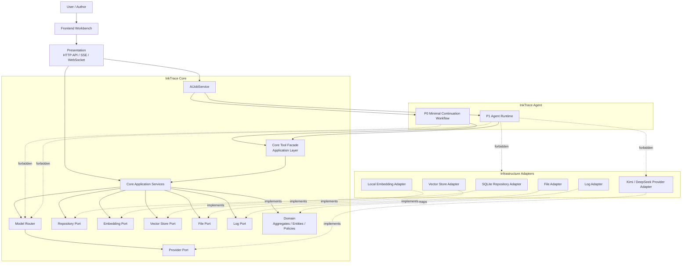

***

## 三、Clean Architecture 分层架构

### 3.1 Presentation 层

职责：

- HTTP API。
- SSE / WebSocket。
- 前端入口。
- AI Job 进度查询。
- 用户确认动作入口。
- 请求参数适配与响应适配。

不负责：

- 不承载 Tool 业务语义。
- 不执行 Agent 权限判断。
- 不直接写正式业务数据。

P0 / P1 / P2：

- P0：初始化 API、Job API、Continuation API、Candidate Draft API、Review API。
- P1：Agent Trace API、AI Suggestion API、Conflict Guard API、Plot Arc API。
- P2：自动续写、@ 引用、Opening Agent、看板入口。

### 3.2 Application 层

职责：

- Core Application Services。
- Core Tool Facade。
- Application Ports / Interfaces。
- AI Job 编排。
- ContextPackService。
- CandidateDraftService。
- ReviewService。
- AISuggestionService。
- StoryMemoryService。
- StoryStateService，可在详细设计中决定是否独立。
- ModelRouter。
- PromptRegistry。
- OutputValidator。
- Human Review Gate 编排。
- Conflict Guard 编排。

Application 依赖：

- 依赖 Domain。
- 依赖 Application Ports / Interfaces。
- 不依赖 Infrastructure 具体实现。

### 3.3 Domain 层

职责：

- 聚合。
- 实体。
- 值对象。
- Domain Policy。
- 业务规则。
- HumanReviewGatePolicy。
- ConflictGuardPolicy。
- AgentPermissionPolicy。
- CandidateDraft 状态规则。
- StoryMemoryRevision 规则。

Domain 不依赖：

- 不依赖 Application。
- 不依赖 Infrastructure。
- 不依赖 Presentation。
- 不依赖 Agent。

### 3.4 Infrastructure 层

职责：

- SQLite Repository Adapter。
- KimiProvider Adapter。
- DeepSeekProvider Adapter。
- LocalEmbeddingAdapter。
- VectorStoreAdapter。
- PromptTemplateStore。
- LLMCallLogger。
- AISettingsStore。
- File Adapter。
- Log Adapter。

Infrastructure 实现 Application Ports / Interfaces。

Infrastructure 只允许依赖 Domain 模型进行持久化对象与领域对象映射，不承载或修改 Domain 业务规则。Domain 不依赖 Infrastructure。

### 3.5 分层图

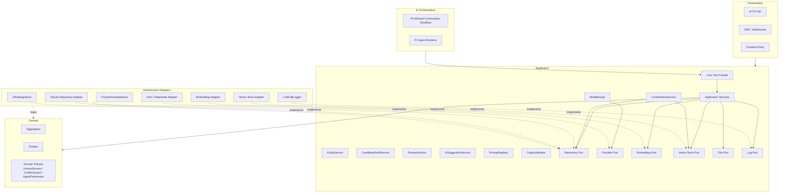

***

## 四、Core + Agent 架构关系

### 4.1 Agent 的架构定位

Agent 可以独立模块化，但不是第二套业务系统。

Agent 是：

- AI Orchestration。
- 非人类用户的自动化入口。
- 应用层编排客户端。

Agent 不是：

- 不是 DDD Domain。
- 不是 Infrastructure。
- 不是传统 Presentation。
- 不是正式业务数据所有者。

### 4.2 P0 与 P1 的关系

P0：

- 不实现完整 Agent Runtime。
- 使用 Minimal Continuation Workflow。
- 使用 WorkflowRunContext / Lightweight AgentRunContext。
- 只支撑单章候选续写闭环。
- 必须通过 Core Tool Facade 调用 Core。

P1：

- 引入完整 Agent Runtime。
- 引入 AgentSession、AgentStep、AgentObservation、AgentTrace。
- 引入完整 Memory / Planner / Writer / Reviewer / Rewriter Agent Workflow。
- 引入完整 PPAO 循环。

### 4.3 Tool Facade 与跨进程

Tool Facade 是 Application 层内部能力。

CoreToolFacade 是独立 Application Service / Facade，不内嵌在 MinimalContinuationWorkflow 中。MinimalContinuationWorkflow 只能依赖 CoreToolFacade；CoreToolFacade 再调用 WritingTaskService、ContextPackService、WritingGenerationService、CandidateDraftService、ReviewService、AIJobService 等 Application Services。P1 Agent Runtime 复用同一个 CoreToolFacade，不另建工具入口。

同进程阶段：

- Agent / Workflow 直接调用 Tool Facade 的本地接口。

未来跨进程：

- 可通过 HTTP / RPC 传输适配暴露 Tool Facade。
- Tool HTTP API 只是传输 Adapter，不是 Tool 本体。
- Tool 业务语义仍属于 Core Application。

### 4.4 Core + Agent 依赖图

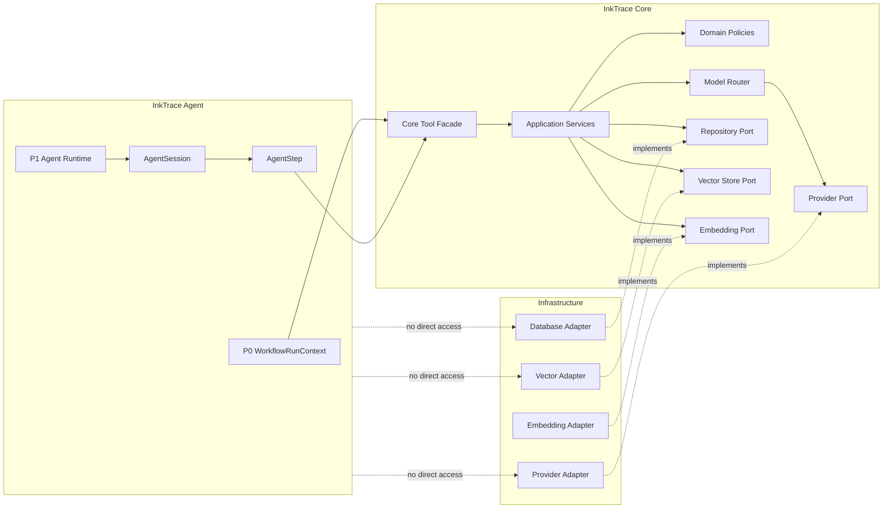

***

## 五、子域划分

### 5.1 子域关系图

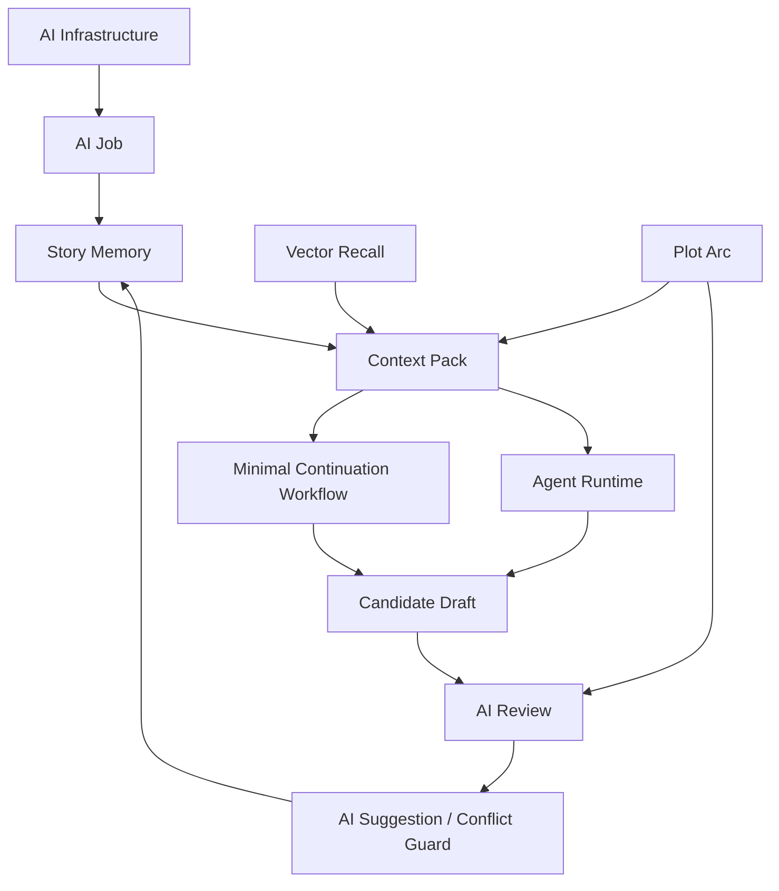

### 5.2 AI Infrastructure 子域

职责：

- AI Settings。
- Provider 抽象。
- Model Router。
- Prompt Registry。
- Output Validator。
- LLM Call Log。

输入：

- Core Application Service 发起的模型角色请求。
- prompt_key / prompt_version。
- Context Pack。
- 模型参数。

输出：

- 模型调用结果。
- schema 校验结果。
- 调用日志。
- 成本记录。

核心对象：

- AISettings。
- ModelRoleConfig。
- PromptTemplate。
- LLMCallLog。

所在层：

- Application：ModelRouter、PromptRegistry、OutputValidator、ProviderPort。
- Infrastructure：KimiProviderAdapter、DeepSeekProviderAdapter、PromptTemplateStore、LLMCallLogger。

模型请求来源：

- 模型角色请求只能由 Core Application Service 发起。
- Agent 只能通过 Tool Facade 触发受控 Application Use Case。
- Agent 不直接向 ModelRouter 提交模型请求。
- Agent 不直接调用 Provider。

Prompt 调用追踪：

- 每次 LLM 调用必须关联 prompt_key、prompt_version、model_role、provider、model、output_schema_key、request_id / trace_id。
- 如调用由 Context Pack 驱动，必须关联 context_pack_snapshot_id。
- token usage、elapsed time、error code / error message、用户采纳状态后续关联写入 LLMCallLog / AgentTrace。
- 普通日志不得记录完整正文、完整 Prompt、API Key。

阶段：

- P0。

### 5.3 AI Job 子域

职责：

- 管理 AIJob。
- 管理 AIJobStep。
- 管理进度。
- 支持暂停 / 继续 / 取消 / 重试。
- 支持失败恢复。

输入：

- 初始化任务。
- 分析任务。
- 向量索引任务。
- 续写任务。

输出：

- Job 状态。
- Job Step 结果。
- 进度事件。
- 错误原因。

核心对象：

- AIJob。
- AIJobStep。

所在层：

- Application：AIJobService。
- Domain：Job 状态规则。
- Infrastructure：Job Repository Adapter。

阶段：

- P0。

### 5.4 Story Memory 子域

职责：

- 维护长期记忆。
- 维护当前状态锁。
- 管理记忆版本。
- 支撑 Context Pack、Planner、Reviewer。

输入：

- 大纲分析结果。
- 正文分析结果。
- AI 记忆更新建议。
- 用户采纳动作。

输出：

- StoryMemory。
- StoryState。
- ChapterSummary。
- StoryMemoryRevision。

核心对象：

- StoryMemory。
- StoryMemoryRevision。
- ChapterSummary。
- StoryState。

职责边界：

- StoryMemory 是长期记忆。
- StoryState 是当前状态锁。
- 二者可以同属 Story Memory 子系统，但不能混为万能 MemoryService。

正文分析依赖：

- ManuscriptAnalysisService 必须读取 OutlineAnalysisResult / OutlineStoryBlueprint。
- 正文分析必须基于大纲分析结果判断正文写到的大纲阶段、已完成剧情、偏离剧情、已出现伏笔、未出现伏笔、距离下一阶段目标的差距。
- 正文分析不是独立的正文摘要任务。

StoryState 正式化规则：

- AI 分析生成的 StoryState 可以作为分析快照或候选状态。
- StoryState 若要成为正式续写基线，必须来自已确认章节正文的确定性分析、用户采纳的 AI 建议或用户手动维护的正式资产。
- AI 不能静默更新正式 StoryState。
- StoryState 的候选更新失败不得污染正式 StoryState。

阶段：

- P0：最小记忆与 Story State。
- P1：完整记忆与 Revision。

### 5.5 Vector Recall 子域

职责：

- 管理 VectorChunk。
- 管理 VectorIndexEntry。
- 提供 EmbeddingPort。
- 提供 VectorStorePort。
- 执行 RAG 召回。

输入：

- 章节正文。
- 当前章节上下文。
- Writing Task。
- 查询文本。

输出：

- Top-K 召回片段。
- 来源章节与位置。

所在层：

- Application：VectorIndexService、EmbeddingPort、VectorStorePort。
- Infrastructure：LocalEmbeddingAdapter、VectorStoreAdapter。

阶段：

- P0：初始索引与 Top-K 召回。
- P1：Attention Filter 接入。
- P2：Citation Link 接入。

### 5.6 Context Pack 子域

职责：

- 构建 ContextPack。
- 管理 ContextLayer。
- 执行 TokenBudgetPolicy。
- 执行 ContextPriorityPolicy。
- 执行 AttentionFilter。
- 生成 ContextPackSnapshot。

输入：

- 章节上下文。
- StoryMemory。
- StoryState。
- WritingTask。
- StoryArc。
- RAG 召回片段。
- Style DNA，可选。

输出：

- ContextPack。
- Token 明细。
- 裁剪记录。
- ContextPackSnapshot。

Token 策略：

- 必选层缺失时，正式续写返回 blocked。
- 保底层可压缩但不能完全缺失。
- 可裁剪层按相关性、优先级和 Token 预算裁剪。
- 裁剪后仍不满足最低上下文要求时，正式续写 blocked；用户只能补全初始化、重建索引或选择快速试写降级。
- 快速试写降级不得更新 Story Memory，不得生成正式 Memory Update Suggestion。

阶段：

- P0：最小 Context Pack。
- P1：完整四层剧情轨道。
- P2：Style DNA 可选层。

### 5.7 Minimal Continuation Workflow 子域（P0）

职责：

- 执行 P0 单章续写最小编排。
- 维护 WorkflowRunContext。
- 执行 writer-like step。
- 执行 reviewer-like step。
- 为 P1 Agent Runtime 预留扩展点。

输入：

- 用户续写请求。
- 当前章节。
- P0 Context Pack。
- Writing Task。

输出：

- CandidateDraft。
- ReviewReport。

阶段：

- P0。

### 5.8 Agent Runtime 子域（P1）

职责：

- 管理 AgentSession。
- 管理 AgentStep。
- 管理 AgentObservation。
- 生成 AgentResult。
- 编排 MemoryAgent、PlannerAgent、WriterAgent、ReviewerAgent、RewriterAgent。

输入：

- 用户 AI 任务。
- ToolResult。
- Model 输出。
- 用户反馈。

输出：

- CandidateDraft。
- ReviewReport。
- AISuggestion。
- Memory Update Suggestion。
- AgentTrace。

阶段：

- P1。

### 5.9 Candidate Draft 子域

职责：

- 隔离 AI 正文输出与正式正文。
- 管理 CandidateDraft。
- 管理 CandidateDraftVersion。
- 管理候选稿状态。
- 管理用户反馈。
- 支持接受、丢弃、重新生成。

输入：

- Writer-like step 输出。
- Writer Agent 输出。
- Rewriter 输出。
- 用户反馈。

输出：

- CandidateDraft。
- CandidateDraftVersion。
- 用户决策。

P0 拒绝理由：

- discarded / rejected 时允许记录 reject_reason_text，可为空。
- reject_reason_code 为 P0 可选扩展方向，枚举方向包括 off_topic、style_mismatch、logic_conflict、too_ai_like、too_long、too_short、bad_rhythm、user_other。
- P0 不做复杂统计分析。
- P1 可扩展 reject_reason_code 统计、质量分析与 Prompt 优化闭环。

与 V1.1 Local-First 关系：

- 用户接受候选稿后，内容进入章节草稿区。
- 后续保存继续走 V1.1 Local-First。

阶段：

- P0：单章 Candidate Draft。
- P1：多轮版本。
- P2：多章候选稿队列。

### 5.10 AI Review 子域

职责：

- 生成 ReviewReport。
- 识别 ReviewIssue。
- 支持 Rewriter 修订。

输入：

- CandidateDraft。
- ContextPack。
- WritingTask。
- StoryState。
- StoryArc。

输出：

- ReviewReport。
- ReviewIssue。
- CandidateDraftVersion。

阶段：

- P0：基础审稿。
- P1：完整审稿与修订。
- P2：签约向审稿。

### 5.11 AI Suggestion / Conflict Guard 子域

职责：

- 管理 AISuggestion。
- 管理 ConflictGuardRecord。
- 管理 Human Review Gate。
- 支持引用建议占位。
- 保护正式资产。

输入：

- Memory Agent 提取结果。
- Reviewer 建议。
- Planner 建议。
- 引用建议。

输出：

- AISuggestion。
- ConflictGuardRecord。
- 用户采纳 / 拒绝 / 编辑后采纳决策。

阶段：

- P1。

### 5.12 Plot Arc 子域

职责：

- 管理 Master Arc。
- 管理 Volume / Act Arc。
- 管理 Sequence Arc。
- 管理 Immediate Window。
- 支撑 Context Pack、Planner、Reviewer。

输入：

- 大纲分析结果。
- 正文分析结果。
- StoryMemory。
- Planner 建议。

输出：

- StoryArc。
- 四层轨道。

阶段：

- P0：最小占位。
- P1：完整实现。

***

## 六、核心模块架构

### 6.1 Core Tool Facade

职责：

- Agent 调用 Core 的唯一入口。
- 工具注册。
- 权限校验。
- 参数适配。
- 调用 Core Application Services。
- 包装 ToolResult。
- 记录 forbidden / observation。
- 返回 ToolResult。
- 拒绝未注册、越权、危险工具。
- Tool Facade 不承载核心业务逻辑。
- 核心业务逻辑必须位于 Application Service / Domain Policy。
- Tool Facade 不允许演变为 CRUD 后门或上帝服务。
- CoreToolFacade 是 Application 层独立门面服务，不内嵌在 MinimalContinuationWorkflow 中。
- MinimalContinuationWorkflow 只能依赖 CoreToolFacade。
- CoreToolFacade 再调用 WritingTaskService、ContextPackService、WritingGenerationService、CandidateDraftService、ReviewService、AIJobService 等 Application Services。
- P1 Agent Runtime 复用同一个 CoreToolFacade，不另建工具入口。

Tool 分类：

| 类型 | 示例 | 阶段 |
|---|---|---|
| Read Tools | `get_work_outline`、`get_chapter_context`、`get_story_memory`、`get_story_state`、`get_story_arcs`、`search_related_memories` | P0/P1 |
| Build Tools | `build_context_pack`、`create_writing_task`、`run_writer_step` / `generate_candidate_text`、`run_reviewer_step` / `generate_review_report` | P0 |
| Safe Write Tools | `create_candidate_draft`、`create_candidate_version`、`create_review_report`、`create_ai_suggestion`、`create_memory_update_suggestion` | P0/P1 |
| Trace / Job Tools | `write_agent_trace`、`request_human_review`、`update_ai_job_progress`、`record_tool_observation` | P0/P1 |
| Forbidden Tools | `update_official_chapter_content`、`overwrite_character_asset`、`delete_asset`、`create_official_chapter_directly`、`update_story_memory_directly`、`accept_suggestion_as_user`、`bypass_human_review_gate`、`call_llm_provider_directly`、`access_database_directly`、`access_vector_db_directly` | 禁止清单 |

Forbidden Tools 不是实际注册的工具。Forbidden Tools 是禁止清单和安全说明。

落地机制：

- 第一层：Tool Registry 只注册允许工具。
- 第二层：AgentPermissionPolicy 按 Agent 类型校验可调用工具。
- 第三层：Core Application Service 执行 Human Review Gate / Conflict Guard。

未注册工具、越权工具、危险写操作返回 forbidden。forbidden 写入 AgentTrace 或安全日志。

`accept_candidate_draft` / `apply_candidate_to_draft` 不是 Agent Tool。它是用户确认后的 Core Application Use Case，Agent 无权调用。

#### Tool Facade 结构图

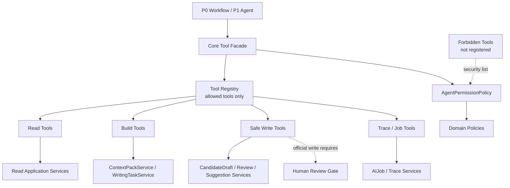

#### AgentPermissionPolicy / Tool Registry 权限图

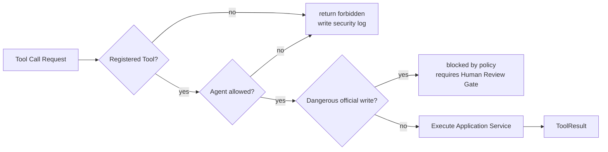

### 6.2 AI Job System

Job 类型：

- outline_analysis。
- manuscript_analysis。
- chapter_summary。
- character_extract。
- foreshadow_extract。
- vector_index_build。
- continuation。
- review。

Job 状态：

- queued。
- running。
- paused。
- failed。
- cancelled。
- completed。

Job 与 Workflow / Agent 关系：

- P0：AIJobService 启动 Minimal Continuation Workflow。
- P1：AIJobService 启动 Agent Runtime 或 Agent Workflow。
- P2：AIJobService 支撑自动连续续写队列。

服务重启策略：

- running Job 标记为 failed 或 paused。
- 用户可继续、重试或取消。

失败章节策略：

- 支持跳过失败章节。
- 支持重新分析某章。
- 支持重新构建记忆。

#### AI Job 状态机

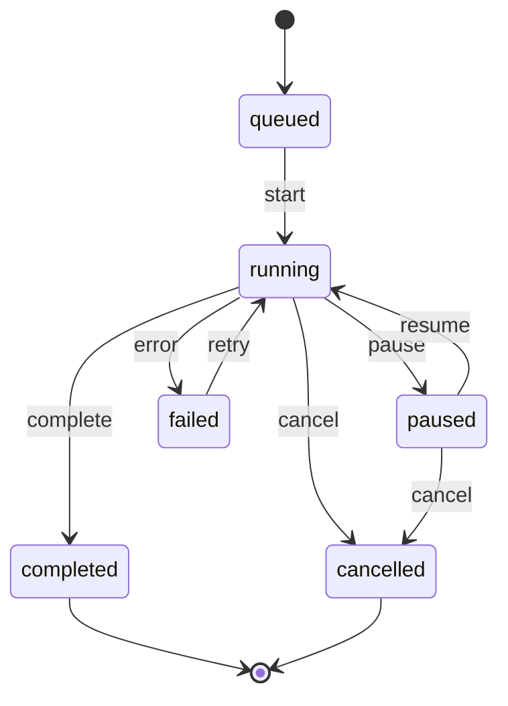

### 6.3 Context Pack

职责：

- ContextPackService 属于 Core Application。
- Agent 只能通过 `build_context_pack` Tool 请求构建。
- Agent 不能自行读取章节、大纲、Story Memory、Vector DB 并拼上下文。

输入来源：

- 当前章节 / 选区上下文。
- 最近章节摘要。
- 当前卷摘要。
- StoryState。
- WritingTask。
- 全书摘要。
- 角色卡。
- 设定。
- 伏笔。
- RAG 召回片段。
- 四层剧情轨道。
- Style DNA，可选 P2。

P0 最小 Context Pack：

- 当前章节。
- 最近章节摘要。
- 全书当前进度摘要。
- 当前 StoryState。
- WritingTask。
- RAG 召回片段。

P1 完整 Context Pack：

- 加入完整四层剧情轨道。
- 加入更完整 StoryMemory。
- 加入更完整 AttentionFilter。

Context Pack 层级策略：

| 层级类型 | 内容 | 策略 |
|---|---|---|
| 必选层 | 当前章节 / 当前选区上下文、Writing Task、Story State、全书当前进度摘要、最近章节摘要 | 缺失时正式续写 blocked |
| 保底层 | 全文弧 / 全书当前进度、当前卷或阶段目标、当前小段落弧或 P0 最小剧情轨道占位、临近窗口摘要 | 可以压缩，但不能完全缺失 |
| 可裁剪层 | RAG 召回片段、角色卡详情、设定详情、伏笔详情、历史章节摘要、Style DNA、四层剧情轨道详细版、Citation Link 证据 | Token 不足时按相关性与优先级裁剪 |

Token Budget 与降级：

- TokenBudgetPolicy 负责判断 Context Pack 是否超出预算。
- ContextPriorityPolicy 负责确定层级优先级和裁剪顺序。
- AttentionFilter 负责降低无关角色、地点、设定、伏笔、RAG 片段的权重。
- 如果必选层缺失，ContextPackService 返回 blocked。
- 如果可裁剪层不足，允许 degraded Context Pack，但必须记录 degraded、missing_layers、trimmed_layers、token_budget、actual_tokens、degrade_reason。
- 如果裁剪后低于最低上下文要求，正式续写 blocked；用户可重新初始化、补全 Story State、重建向量索引，或选择快速试写降级。
- 快速试写降级不能更新 Story Memory，不能生成正式 Memory Update Suggestion。

#### P0 开发前必须决策项：是否启用流式输出

| 方案 | 架构行为 | 影响 |
|---|---|---|
| 方案 A：P0 不启用流式输出，默认推荐 | 只展示 AI Job 进度；模型完成后一次性创建 Candidate Draft；候选稿完整生成后触发审稿 | 架构最简单，P0 风险最低 |
| 方案 B：P0 启用流式输出 | 需要 SSE / WebSocket token streaming；Candidate Draft 支持 generating / partial_content；处理生成中断、部分内容保留、取消生成；前端候选稿区支持 streaming 状态；审稿在正文生成完成后触发 | 架构复杂度更高 |

P0 默认采用方案 A。流式输出作为 P0.5 或 P1-A 增强能力，除非产品明确要求 P0 必须支持。

#### Context Pack 组装流程图

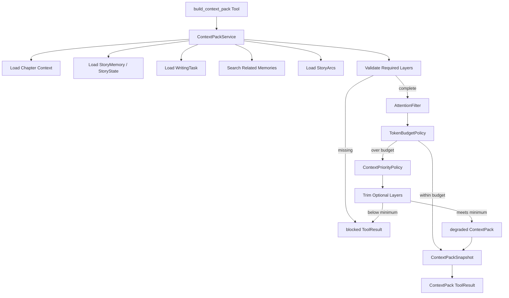

### 6.4 Candidate Draft

职责：

- Candidate Draft 是 AI 正文输出隔离层。
- AI 只能创建 Candidate Draft。
- Agent 只能创建候选稿，不能接受候选稿。
- 用户接受后，由 Presentation 调用 Core Application 的 `accept_candidate_draft` / `apply_candidate_to_draft`。
- 内容进入当前章节草稿区。
- 后续保存走 V1.1 Local-First。
- discarded / rejected 时允许记录 reject_reason_text，可为空。
- reject_reason_code 为 P0 可选扩展方向，枚举方向包括 off_topic、style_mismatch、logic_conflict、too_ai_like、too_long、too_short、bad_rhythm、user_other。
- P0 不做复杂统计分析；P1 可扩展 reject_reason_code 统计、质量分析与 Prompt 优化闭环。

#### Candidate Draft 状态图

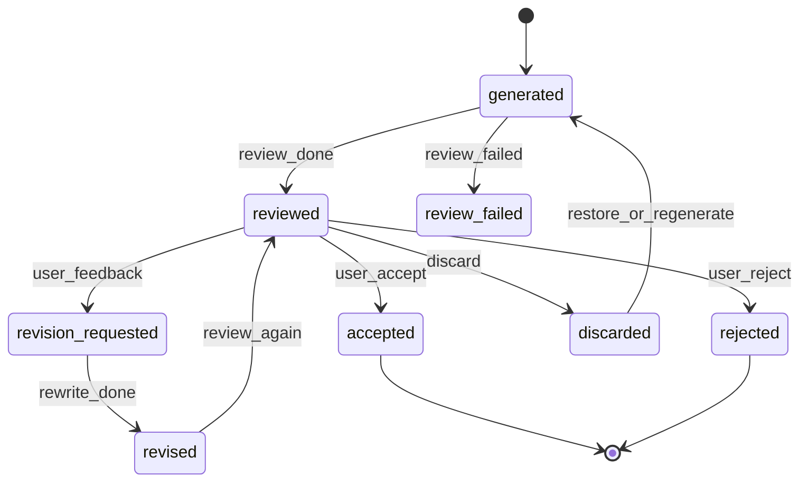

#### Candidate Draft 接受流程图

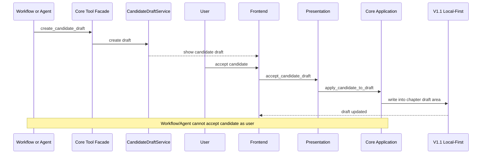

### 6.5 AI Review

职责：

- 触发审稿。
- 生成 ReviewReport。
- 生成 ReviewIssue。
- 支持 Rewriter 修订。

审稿输入：

- CandidateDraft。
- ContextPack。
- WritingTask。
- StoryState。
- StoryArc。

审稿维度：

- 人物一致性。
- 设定冲突。
- 时间线冲突。
- 伏笔误用。
- 风格漂移。
- AI 味。
- Writing Task 完成度。
- 四层剧情轨道偏离。

失败处理：

- P0：审稿失败时候选稿标记未审稿，允许用户手动决策。
- P1：审稿失败进入 Agent Observation，决定重试、修订、暂停或等待用户。

Rewriter 边界：

- Rewriter 只能生成新的 CandidateDraftVersion。
- Rewriter 不能修改正式正文。

### 6.6 Story Memory / Story State

StoryMemory：

- 长期记忆。
- 章节摘要。
- 全书当前进度。
- 角色状态。
- 伏笔。
- 设定。
- 记忆版本。

StoryState：

- 当前状态锁。
- 当前地点。
- 在场角色。
- 当前阶段。
- 禁止事项。
- 当前上下文约束。

边界：

- 二者可以同属 Story Memory 子系统。
- 二者不能混为万能 MemoryService。
- 详细设计阶段可决定是否拆 StoryMemoryService 与 StoryStateService。

Memory 更新：

- AI 只能创建 Memory Update Suggestion。
- 用户确认后形成 StoryMemoryRevision。
- 用户采纳 AI 记忆更新建议时，StoryMemoryRevision 写入、AISuggestion 状态更新、ConflictGuardRecord 决策结果更新、必要的 StoryState / StoryMemory snapshot 更新必须处于同一应用事务边界。
- 任一写入失败，整体回滚；不允许出现 AISuggestion 已 accepted 但 StoryMemoryRevision 未生成的半成功状态。
- 事务失败时，建议保持 pending 或标记 apply_failed，并记录错误原因，允许用户重试采纳。
- 事务执行前必须再次检查正式资产版本 / revision；如对比期间正式资产已变化，重新触发 Conflict Guard。

StoryState 正式化：

- AI 分析生成的 StoryState 可以作为分析快照或候选状态。
- StoryState 若要成为正式续写基线，必须来自已确认章节正文的确定性分析、用户采纳的 AI 建议或用户手动维护的正式资产。
- AI 不能静默更新正式 StoryState。
- 当 StoryState 更新会影响后续正式续写时，必须经过用户确认或通过已确认数据的确定性规则更新。

### 6.7 Vector Recall

职责：

- VectorIndexService 属于 Application。
- EmbeddingPort 属于 Application Port。
- VectorStorePort 属于 Application Port。
- Embedding Model 属于 Infrastructure。
- Vector DB 属于 Infrastructure。

Agent 边界：

- Agent 不直接调用 Embedding。
- Agent 不直接访问 Vector DB。
- RAG 结果通过 ContextPackService 进入 Context Pack。

### 6.8 Prompt Registry / Model Router / Output Validator

Prompt Registry：

- 属于 Core Application / AI Infrastructure。
- Agent 使用 prompt_key / prompt_version。
- Prompt 输出必须绑定 schema。
- Prompt 不承载越权业务规则。
- 业务边界必须由 Domain Policy / Application Service 约束。
- Prompt 调用必须写入可追踪记录，至少包含 prompt_key、prompt_version、model_role、provider、model、context_pack_snapshot_id、output_schema_key、request_id / trace_id、token usage、elapsed time、error code / error message。
- prompt_key / prompt_version 与用户采纳状态的后续关联写入 LLMCallLog / AgentTrace。
- 普通日志不得记录完整正文、完整 Prompt、API Key。

Model Router：

- 由 Core Application Service 调用。
- Agent 不直接调用 Model Router。
- Kimi 默认用于分析、摘要、记忆抽取、规划、Writing Task、审稿。
- DeepSeek 默认用于续写、改写、润色、对白、场景生成、修订。

Output Validator：

- 校验结构化输出。
- 校验失败可重试。
- 重试失败后任务 failed。
- 不合格输出不得落入正式数据。

### 6.9 Agent Runtime（P1）

P0 不实现完整 Agent Runtime。

P1 引入：

- AgentSession。
- AgentStep。
- AgentObservation。
- AgentResult。
- AgentTrace。
- PPAO 循环。
- MemoryAgent。
- PlannerAgent。
- WriterAgent。
- ReviewerAgent。
- RewriterAgent。

Agent 与 Tool Facade：

- Agent 只能调用 Tool Facade。
- Tool Facade 执行权限。
- ToolResult 被 AgentObservation 记录。

Agent 与 AIJob：

- 长流程由 AIJob 承载生命周期。
- AgentSession 关联 AIJob。
- AgentStep 可关联 AIJobStep。

Agent 与 Prompt / Model：

- Agent 只持有 prompt_key / prompt_version。
- Agent 不直接调用 Provider。
- Agent 不直接调用 Model Router。

#### Agent 权限矩阵

| Agent | 允许能力 | 禁止能力 |
|---|---|---|
| MemoryAgent | 大纲分析、正文分析、章节摘要、记忆更新建议 | 写正式 Story Memory、覆盖正式资产 |
| PlannerAgent | 方向推演、章节计划、Writing Task | 创建正式章节、改变作品主线 |
| WriterAgent | 创建 CandidateDraft / CandidateDraftVersion | 写正式正文、接受候选稿 |
| ReviewerAgent | 创建 ReviewReport / ReviewIssue | 修改候选稿、写正式正文 |
| RewriterAgent | 创建修订候选稿版本 | 合并正文、覆盖正式正文 |
| OpeningAgent | 创建开篇候选稿和审稿报告 | 创建正式章节 |

#### P1 Agent Workflow 图

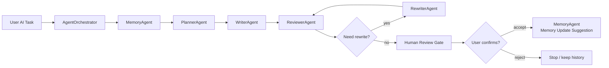

### 6.10 Plot Arc

四层剧情轨道：

- Master Arc：全文弧。
- Volume / Act Arc：卷 / 大段落弧。
- Sequence Arc：剧情波次 / 小段落弧。
- Immediate Window：临近窗口。

关系：

- 与 StoryMemory 共同支撑长期一致性。
- 与 Context Pack 共同约束生成。
- Planner 使用 Plot Arc 生成方向和章节计划。
- Reviewer 使用 Plot Arc 检查偏离。

阶段：

- P0 最小占位。
- P1 完整实现。

#### 四层剧情轨道结构图

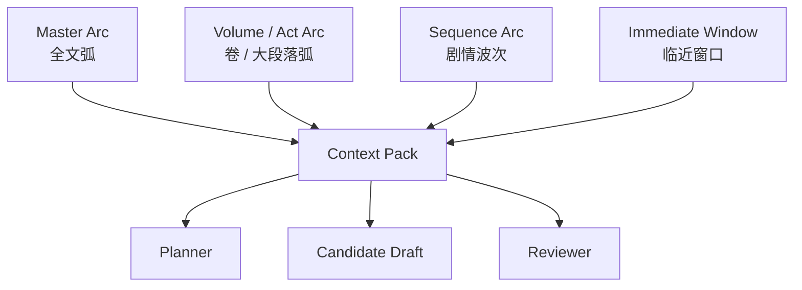

***

## 七、关键流程架构

### 7.1 作品 AI 初始化流程

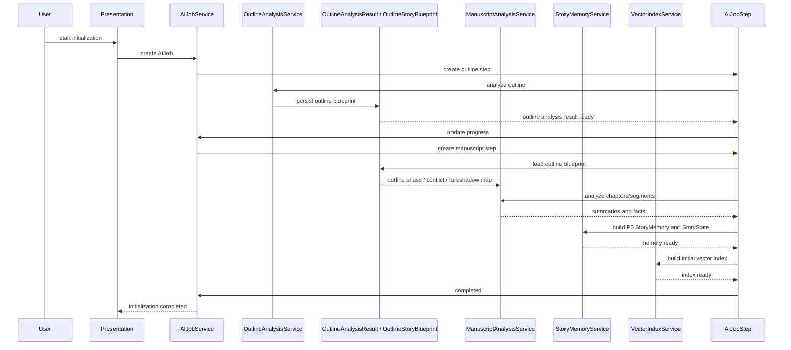

正文分析必须依赖大纲分析结果。ManuscriptAnalysisService 必须读取 OutlineAnalysisResult / OutlineStoryBlueprint，用于判断正文已推进到的大纲阶段、已完成剧情、偏离剧情、已出现伏笔、未出现伏笔以及距离下一阶段目标的差距。

### 7.2 快速试写降级流程

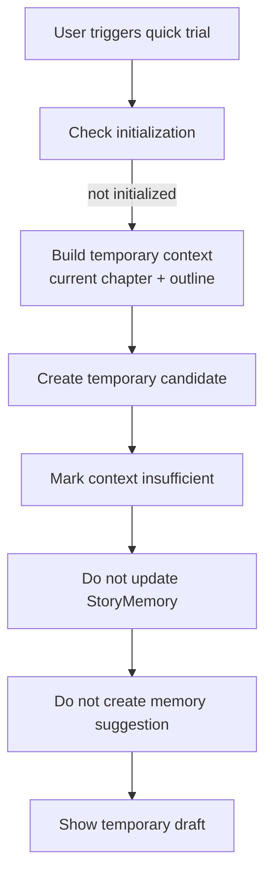


Quick Trial 不是正式续写，不等于初始化完成，不改变正式续写必须初始化完成的主规则。Quick Trial 只能使用当前章节、当前选区、用户输入的大纲或作品原始大纲等临时上下文；结果只能进入 Candidate Draft 或临时候选区；不得更新 Story Memory、正式 StoryState 或正式 Memory Update Suggestion，不作为正式续写质量验收依据，不绕过 Human Review Gate。

### 7.3 P0 单章候选续写流程

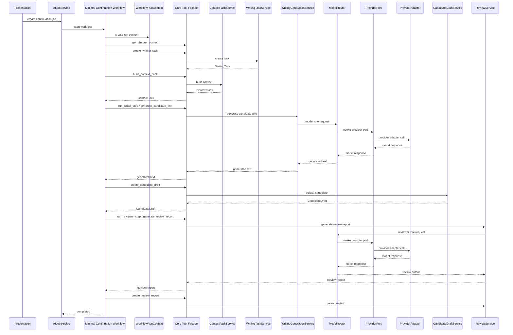

### 7.4 Candidate Draft 接受流程

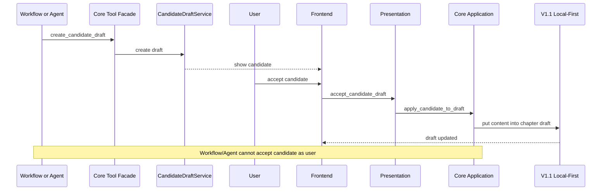

### 7.5 AI Review / Rewriter 流程

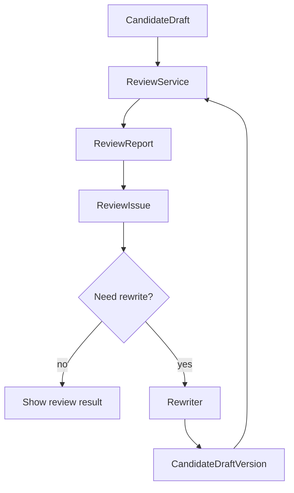

### 7.6 AI Suggestion / Conflict Guard 流程

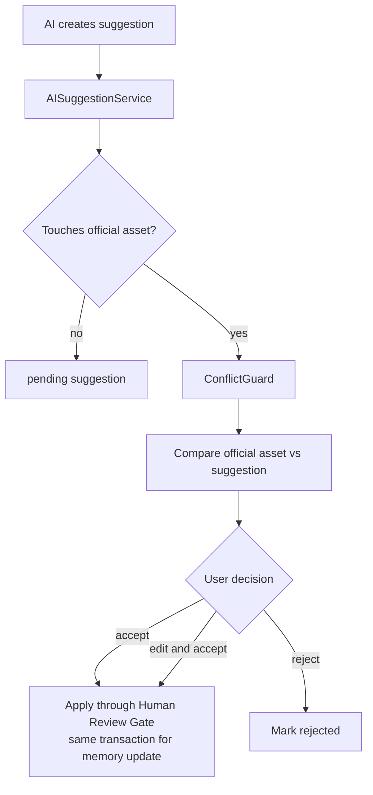

涉及 Story Memory / StoryState 的采纳必须进入 7.9 的 Memory Update Suggestion 采纳事务流程。

### 7.7 P1 Agent Workflow 流程

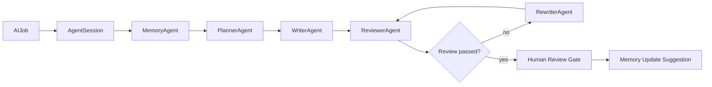

### 7.8 P2 自动连续续写队列流程（占位）

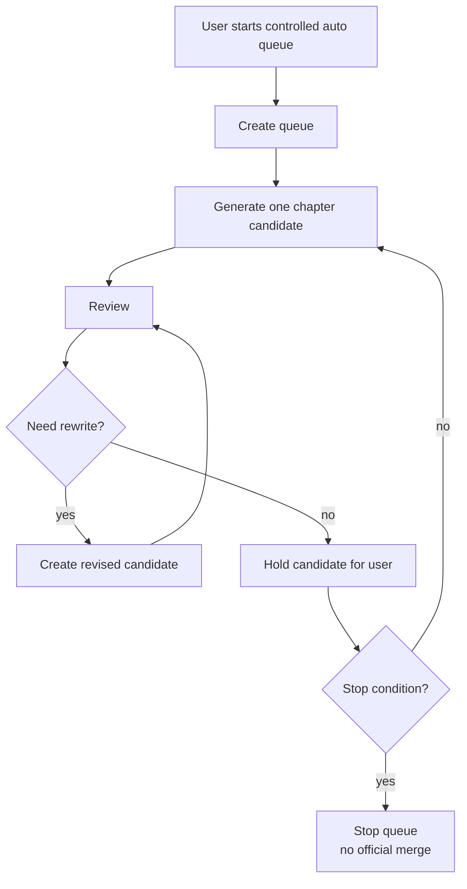

### 7.9 Memory Update Suggestion 采纳事务流程

```mermaid
flowchart TB
    Start["User accepts Memory Update Suggestion"] --> VersionCheck["Check latest official asset / memory revision"]
    VersionCheck -->|changed| Reopen["Reopen Conflict Guard"]
    VersionCheck -->|unchanged| Tx["Begin application transaction"]
    Tx --> Revision["Write StoryMemoryRevision"]
    Revision --> Suggestion["Update AISuggestion status"]
    Suggestion --> Guard["Update ConflictGuardRecord decision"]
    Guard --> Snapshot["Update StoryMemory / StoryState snapshot if needed"]
    Snapshot --> Commit["Commit transaction"]
    Tx -->|any write failed| Rollback["Rollback all writes"]
    Rollback --> Failed["Keep pending or mark apply_failed\nrecord error and allow retry"]
```

Memory Update 采纳必须保持同一应用事务边界。不允许出现 AISuggestion 已 accepted 但 StoryMemoryRevision 未生成的半成功状态。

***

## 八、领域模型架构

### 8.1 P0 / P1 / P2 归属

| 对象 | 阶段 | 说明 |
|---|---|---|
| AIJob | P0 | 长任务根对象 |
| AIJobStep | P0 | 长任务步骤 |
| WorkflowRunContext | P0 | P0 最小续写编排上下文 |
| StoryMemory | P0/P1 | 长期记忆 |
| StoryMemoryRevision | P1 | 记忆正式更新版本 |
| StoryState | P0 | 当前状态锁 |
| ChapterSummary | P0 | 章节摘要 |
| StoryArc | P1 | 四层剧情轨道 |
| ContextPack | P0 | 上下文情报包 |
| ContextLayer | P0/P1 | 上下文层 |
| WritingTask | P0 | 写作任务 |
| CandidateDraft | P0 | 候选稿 |
| CandidateDraftVersion | P1 | 候选稿版本 |
| ReviewReport | P0 | 审稿报告 |
| ReviewIssue | P1 | 审稿问题 |
| AISuggestion | P1 | AI 建议 |
| ConflictGuardRecord | P1 | 冲突保护记录 |
| AgentSession | P1 | Agent 会话 |
| AgentStep | P1 | Agent 步骤 |
| AgentObservation | P1 | Agent 观察 |
| AgentTrace | P1 | 执行轨迹 |
| VectorChunk | P0 | 向量切片 |
| VectorIndexEntry | P0 | 向量索引条目 |
| PromptTemplate | P0 | Prompt 模板 |
| ModelRoleConfig | P0 | 模型角色配置 |
| LLMCallLog | P0 | 调用日志 |

### 8.2 核心领域模型 classDiagram

```mermaid
classDiagram
    class AIJob
    class AIJobStep
    class WorkflowRunContext
    class StoryMemory
    class StoryMemoryRevision
    class StoryState
    class ChapterSummary
    class StoryArc
    class ContextPack
    class ContextLayer
    class WritingTask
    class CandidateDraft
    class CandidateDraftVersion
    class ReviewReport
    class ReviewIssue
    class AISuggestion
    class ConflictGuardRecord
    class AgentSession
    class AgentStep
    class AgentObservation
    class AgentTrace
    class VectorChunk
    class VectorIndexEntry
    class PromptTemplate
    class ModelRoleConfig
    class LLMCallLog

    AIJob "1" --> "*" AIJobStep
    AIJob --> WorkflowRunContext
    StoryMemory "1" --> "*" StoryMemoryRevision
    StoryMemory "1" --> "*" ChapterSummary
    StoryMemory "1" --> "1" StoryState
    StoryMemory "1" --> "*" StoryArc
    ContextPack "1" --> "*" ContextLayer
    ContextPack --> WritingTask
    ContextPack --> StoryMemory
    CandidateDraft "1" --> "*" CandidateDraftVersion
    CandidateDraft "1" --> "*" ReviewReport
    ReviewReport "1" --> "*" ReviewIssue
    AISuggestion --> ConflictGuardRecord
    AgentSession "1" --> "*" AgentStep
    AgentStep "1" --> "*" AgentObservation
    AgentSession --> AgentTrace
    VectorChunk --> VectorIndexEntry
    PromptTemplate --> ModelRoleConfig
    LLMCallLog --> ModelRoleConfig
```

***

## 九、持久化架构

本文档只做架构级持久化说明，不写迁移 SQL，不做字段级设计。

| 持久化对象 | 用途 | 子域 | 阶段 | 数据性质 | 用户确认 | 与 V1.1 关系 |
|---|---|---|---|---|---|---|
| ai_settings | AI 配置 | AI Infrastructure | P0 | 配置 | 不需要 | 新增配置，不改 V1.1 |
| model_role_configs | 模型角色路由 | AI Infrastructure | P0 | 配置 | 不需要 | 新增配置 |
| prompt_templates | Prompt 模板 | AI Infrastructure | P0 | 配置 | 不需要 | 新增配置 |
| ai_jobs | AI 任务 | AI Job | P0 | 任务状态 | 不需要 | 不影响 V1.1 正文 |
| ai_job_steps | AI 任务步骤 | AI Job | P0 | 任务状态 | 不需要 | 不影响 V1.1 正文 |
| llm_call_logs | LLM 调用日志 | AI Infrastructure | P0 | 日志 | 不需要 | 记录 prompt_key / version / role / provider / model / schema / trace / token / elapsed / error，不记录完整正文、完整 Prompt、API Key |
| story_memory_snapshots | 记忆快照 | Story Memory | P0/P1 | AI 分析 / 快照 | 进入正式版本需确认 | 不覆盖 V1.1 资产 |
| story_memory_revisions | 记忆版本 | Story Memory | P1 | 正式记忆版本 | 需要 | AI 建议采纳后生成 |
| story_states | 当前状态锁 | Story Memory | P0 | AI 分析 / 状态 | 正式化需确认或确定性规则 | 不覆盖正式正文 |
| chapter_summaries | 章节摘要 | Story Memory | P0 | AI 分析 | 可作为分析结果 | 不改章节正文 |
| story_arcs | 剧情轨道 | Plot Arc | P1 | AI 分析 / 规划 | 正式化需确认 | 不改 V1.1 大纲 |
| vector_chunks | 向量切片 | Vector Recall | P0 | 索引数据 | 不需要 | 来源于章节，只读引用 |
| vector_index_entries | 向量索引 | Vector Recall | P0 | 索引数据 | 不需要 | 不改章节正文 |
| context_pack_snapshots | 上下文快照 | Context Pack | P0 | Trace / 快照 | 不需要 | 调试与追踪 |
| writing_tasks | 写作任务 | Context / Planning | P0 | 任务约束 | 用户可确认/编辑 | 不改正式章节 |
| candidate_drafts | 候选稿与 P0 拒绝理由 | Candidate Draft | P0 | 候选数据 | 接受才进入草稿 | 不直接写正式正文；discarded / rejected 可记录 reject_reason_text |
| candidate_draft_versions | 候选稿版本 | Candidate Draft | P1 | 候选数据 | 接受才进入草稿 | 不直接写正式正文 |
| review_reports | 审稿报告 | AI Review | P0 | 报告 | 不需要 | 不改正文 |
| review_issues | 审稿问题 | AI Review | P1 | 报告 | 不需要 | 不改正文 |
| ai_suggestions | AI 建议 | AI Suggestion | P1 | 建议数据 | 采纳才正式化 | 不直接覆盖资产 |
| conflict_guard_records | 冲突记录 | Conflict Guard | P1 | 决策记录 | 需要 | 保护 V1.1 正式资产 |
| agent_sessions | Agent 会话 | Agent Runtime | P1 | Trace / 编排 | 不需要 | 不改正式数据 |
| agent_steps | Agent 步骤 | Agent Runtime | P1 | Trace / 编排 | 不需要 | 不改正式数据 |
| agent_observations | Agent 观察 | Agent Runtime | P1 | Trace / 编排 | 不需要 | 不改正式数据 |
| agent_traces | Agent 轨迹 | Agent Runtime | P1 | Trace | 不需要 | 默认脱敏 |

原则：

- V1.1 正式 work / chapter / asset 表不被 AI 直接覆盖。
- AI 结果默认进入候选、建议、报告、快照、Trace 类表。
- 正式数据变更必须经过 Human Review Gate。
- AI 分析生成的 StoryState 可以作为候选状态；StoryState 成为正式续写基线时，必须来自已确认章节正文的确定性分析、用户采纳的 AI 建议或用户手动维护的正式资产。
- AI 记忆建议采纳时，StoryMemoryRevision、AISuggestion、ConflictGuardRecord、必要的 StoryState / StoryMemory snapshot 更新必须处于同一应用事务边界。

***

## 十、API 架构

本文档只定义 API 方向，不做字段级 DTO。

| API 方向 | 用途 | 阶段 |
|---|---|---|
| AI Settings API | 配置 Key、模型角色、预算、开关 | P0 |
| AI Initialization API | 启动大纲分析、正文分析、初始化流程 | P0 |
| AI Job API | 查询进度、暂停、继续、取消、重试 | P0 |
| Context Pack Preview API | 高级模式预览上下文与裁剪结果 | P0/P1 |
| Writing Task API | 查看、编辑、确认 Writing Task | P0 |
| Continuation API | 触发 P0 单章候选续写 | P0 |
| Candidate Draft API | 查看候选稿、接受、丢弃、重新生成、记录 P0 拒绝理由 | P0 |
| Review API | 查看审稿报告与问题 | P0/P1 |
| AI Suggestion API | 查看、采纳、拒绝、编辑建议 | P1 |
| Conflict Guard API | 对比冲突并提交用户决策 | P1 |
| Agent Trace API | 查看 Agent 执行轨迹 | P1 |
| Plot Arc API | 查看和维护剧情轨道 | P1 |
| 自动续写 API | 自动队列占位 | P2 |
| @ 引用 API | mentions 与引用交互占位 | P2 |
| Opening Agent API | 签约向开篇助手占位 | P2 |

用户接受候选稿 API 属于 Candidate Draft / Core Application，不是 Agent Tool API。

***

## 十一、前端架构

前端原则：

- 前端不直接调用 Agent 内部方法。
- 前端通过 Presentation API 触发 Job / Workflow / Candidate Draft / Suggestion 等用例。
- 前端不绕过 Human Review Gate。

| 模块 | 职责 | 阶段 |
|---|---|---|
| AI Settings 页面 | 配置 Kimi / DeepSeek、模型角色、预算、开关 | P0 |
| 作品 AI 初始化向导 | 引导两阶段初始化 | P0 |
| 初始化进度面板 | 展示 Job 进度、暂停、继续、取消、重试 | P0 |
| 写作页 AI 续写入口 | 触发单章候选续写 | P0 |
| 快速试写入口 | 未初始化时生成临时候选稿 | P0 |
| Candidate Draft 候选稿区 | 展示候选稿、接受、丢弃、重新生成 | P0 |
| 审稿报告面板 | 展示 ReviewReport / ReviewIssue | P0/P1 |
| AI 建议区 | 展示建议，支持采纳/拒绝/编辑后采纳 | P1 |
| Conflict Guard 对比弹窗 | 对比正式资产与 AI 建议 | P1 |
| Agent Trace 查看面板 | 查看 Agent 执行轨迹 | P1 |
| Context Pack 预览/调试面板 | 高级模式查看上下文层与裁剪 | P0/P1 |
| 剧情方向推演面板 | A/B/C 方向选择 | P1 |
| 四层剧情轨道面板 | 查看 Master / Volume / Sequence / Immediate | P1 |
| @ 引用入口占位 | @ 联想、高亮、悬停 | P2 |
| Opening Agent 入口占位 | 签约向开篇助手 | P2 |

***

## 十二、错误处理与降级架构

| 场景 | 架构处理 | V1.1 是否受影响 |
|---|---|---|
| Provider Key 未配置 | AI 能力不可用，提示配置 | 不影响 |
| Provider 超时 | Job failed 或 retry | 不影响 |
| 模型输出不符合 schema | Output Validator 拒绝，进入 retry / failed | 不影响 |
| AI Job 中断 | 保留状态，支持继续 / 重试 / 取消 | 不影响 |
| 服务重启 | running Job 标记 paused / failed | 不影响 |
| 向量索引未完成 | Context Pack 降级，不使用 RAG 层 | 不影响 |
| Context Pack 必选层缺失 | 正式续写 blocked，可提示补全初始化、补全 Story State、重建索引或选择快速试写 | 不影响 |
| Context Pack 可裁剪层不足 | 返回 degraded Context Pack，记录 missing_layers / trimmed_layers / token_budget / actual_tokens / degrade_reason | 不影响 |
| Story State 缺失 | 正式续写阻断或降级 | 不影响 |
| 审稿失败 | 标记未审稿或进入 Observation | 不影响 |
| 候选稿生成中断 | 保留临时候选片段 | 不影响 |
| AI 建议与正式资产冲突 | 进入 Conflict Guard | 不影响 |
| Local-First 保存冲突 | 沿用 V1.1 409 处理 | 不影响 |
| 快速试写降级 | 非正式试写；只用临时上下文；进入 Candidate Draft 或临时候选区；标记上下文不足；不更新 Memory / 正式 StoryState / 正式记忆建议 | 不影响 |
| Memory Update 事务失败 | 整体回滚，建议保持 pending 或标记 apply_failed，允许重试 | 不影响 |
| 流式输出中断，若 P0 选择启用流式 | 保留或丢弃 partial_content 按 P0 流式方案处理，审稿只在完整生成后触发 | 不影响 |
| Agent 越权调用工具 | 返回 forbidden，写安全日志 | 不影响 |
| Tool 未注册 | 返回 forbidden | 不影响 |
| forbidden tool call | 写 AgentTrace 或安全日志 | 不影响 |
| AI 不可用 | AI 入口置灰或提示 | V1.1 仍可用 |

***

## 十三、安全、隐私与成本架构

### 13.1 API Key

- API Key 加密存储。
- 普通日志不记录 API Key。
- Key 无效时对应 Provider 不可用。

### 13.2 日志脱敏

- 普通日志不记录完整正文。
- 普通日志不记录完整 Prompt。
- 普通日志不记录 API Key。
- 导出调试信息必须脱敏。

### 13.3 Agent Trace 隐私级别

默认记录：

- trace_id。
- Agent 类型。
- Prompt key / version。
- Context Pack 摘要。
- 引用 ID。
- 输出摘要。
- 用户决策。

待确认：

- 是否保存完整 Prompt。
- 是否保存完整 Context Pack。
- 是否保存完整正文片段。

### 13.4 成本与预算

- 记录 provider、model、role、tokens、耗时、错误、成本、用户是否采纳。
- 支持 token 预算。
- 支持单作品初始化预算。
- 支持自动续写成本停止条件。
- 超预算暂停并等待用户确认。

LLMCallLog 可追踪字段：

- prompt_key。
- prompt_version。
- model_role。
- provider。
- model。
- context_pack_snapshot_id，可为空。
- output_schema_key。
- request_id / trace_id。
- token usage。
- elapsed time。
- error code / error message。
- 是否被用户采纳，可后续关联。

日志边界：

- LLMCallLog / AgentTrace 用于追踪调用链，不进入普通日志。
- 普通日志不得记录完整正文、完整 Prompt、API Key。
- 若 P0 启用流式输出，token streaming 进度只进入 Job 进度或 Trace 摘要；最终成本以模型完成后的 usage 为准。

### 13.5 安全边界

- AgentPermissionPolicy 控制 Agent 可调用工具。
- Tool Registry 只注册允许工具。
- Human Review Gate 控制正式数据变更。
- Conflict Guard 保护正式资产。

***

## 十四、架构风险与约束

| 风险 | 影响 | 架构缓解策略 |
|---|---|---|
| P0 写成临时方案导致 P1 重构 | P1 接入成本高 | P0 使用 WorkflowRunContext，保留 Tool Facade 与 Agent-ready 边界 |
| Agent 绕过 Tool Facade | 正式数据被污染 | Agent 只能依赖 Tool Facade，禁用直连 Infrastructure / ModelRouter |
| Tool Facade 变成上帝类或 CRUD 后门 | 权限失控、业务规则分散 | Tool Facade 只负责注册、权限、参数适配、ToolResult 包装和 observation 记录；核心业务逻辑留在 Application Service / Domain Policy |
| Context Pack 过大或污染 | 生成质量下降 | TokenBudgetPolicy、ContextPriorityPolicy、AttentionFilter 统一处理裁剪与降级 |
| Context Pack 裁剪策略不一致 | 同一任务上下文不可复现 | ContextPackService 统一执行必选层、保底层、可裁剪层策略，并持久化 ContextPackSnapshot |
| Memory Update 半成功 | 记忆版本和建议状态不一致 | StoryMemoryRevision、AISuggestion、ConflictGuardRecord、必要 snapshot / StoryState 更新必须在同一应用事务中提交 |
| StoryMemory 与 StoryState 混成万能服务 | 后续不可维护 | 概要层明确职责，详细设计决定服务拆分 |
| Prompt 散落在 Agent 内部 | 难测试、难追踪 | Prompt Registry 统一管理 prompt_key / version / schema |
| AI Job 长任务失败恢复复杂 | 初始化不稳定 | JobStep 状态、暂停/继续/重试、跳过失败章节 |
| Vector Recall 与正式资产关系不清 | 召回污染正式数据 | Vector 只读来源，不直接写正式资产 |
| 正文分析脱离大纲分析 | 记忆与主线阶段错位 | ManuscriptAnalysisService 必须读取 OutlineStoryBlueprint 后再分析正文 |
| P0 流式输出未决导致返工 | 前端、Job、Candidate Draft、审稿流程返工 | P0 开发前必须决策；默认不启用流式输出 |
| 自动续写被误解为无人化写书 | 产品边界失控 | 自动队列只生成候选稿，不自动合并正文 |
| Agent Trace 隐私风险 | 敏感内容泄露 | 默认脱敏，完整内容记录进入待确认项 |
| 成本失控 | 用户不可控支出 | Token 预算、成本停止条件、调用日志 |

***

## 十五、分阶段架构落地建议

### 15.1 P0 架构落地

范围：

- AI Infrastructure。
- AI Job。
- 两阶段初始化。
- P0 Story Memory。
- Story State。
- Vector Recall 初始索引。
- Context Pack 最小版。
- Writing Task。
- Minimal Continuation Workflow。
- WorkflowRunContext。
- Candidate Draft。
- AI Review 基础能力。
- Human Review Gate。

重点：

- 保持 P0 最小闭环。
- 不引入完整 Agent Runtime。
- 确保 Tool Facade 边界稳定。

### 15.2 P1 架构扩展

范围：

- Agent Runtime。
- AgentSession / AgentStep / AgentObservation / AgentTrace。
- 五 Agent Workflow。
- 四层剧情轨道。
- AI Suggestion / Conflict Guard。
- Memory Revision。
- 多轮候选稿。

重点：

- P0 WorkflowRunContext 平滑演进到 AgentSession。
- Tool Facade 权限矩阵完整化。
- AgentPermissionPolicy 细化到 Agent 类型。

### 15.3 P2 架构扩展

范围：

- 自动连续续写队列。
- Style DNA。
- Citation Link。
- @ 引用。
- Opening Agent。
- 成本看板。
- 分析看板。

重点：

- 继续保持候选稿隔离。
- 继续保持 Human Review Gate。
- 不把自动队列变成无人化写书。

***

## 十六、后续详细设计清单

建议后续详细设计文档：

1. Tool Facade 与 Application Service 边界、AgentPermissionPolicy 详细设计。
2. AI Job System 详细设计。
3. AI Infrastructure 详细设计。
4. Story Memory / Story State 详细设计。
5. Context Pack 详细设计。
6. Candidate Draft / Human Review Gate 详细设计。
7. AI Review / Rewriter 详细设计。
8. Vector Recall 详细设计。
9. P0 Minimal Continuation Workflow 详细设计。
10. Agent Runtime 详细设计，P1。
11. AI Suggestion / Conflict Guard 详细设计，P1。
12. Plot Arc 详细设计，P1。
13. Context Pack Token 策略详细设计。
14. Memory Update 事务边界详细设计。

P0 开发前必须决策：

1. P0 是否启用流式输出。
2. 默认架构建议为 P0 不启用流式输出，只展示 AI Job 进度，模型完成后一次性创建 Candidate Draft。
3. 如产品明确要求 P0 启用流式输出，详细设计必须同步覆盖 SSE / WebSocket、generating / partial_content、生成中断、取消生成、前端 streaming 状态、审稿触发时机和 token streaming 成本追踪。

待确认项：

- Agent Trace 是否保存完整 Prompt / Context Pack。
- StoryMemoryService 与 StoryStateService 是否拆分。
- Vector DB 具体选型。
- Candidate Draft 接受时的草稿合并交互细节。
- Tool Facade 跨进程传输适配是否在 P1 前准备。
