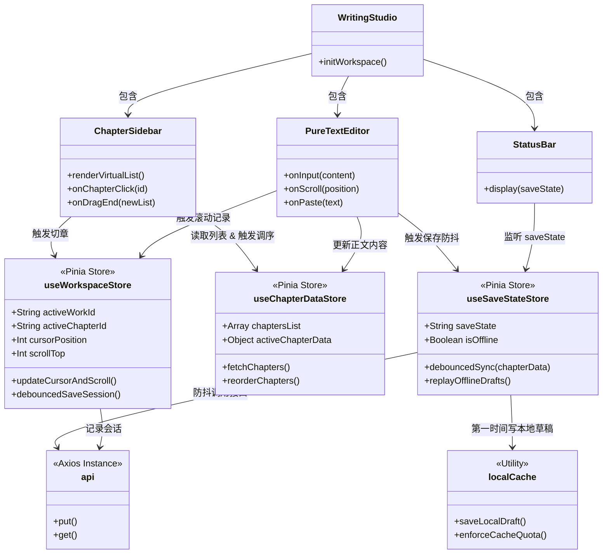
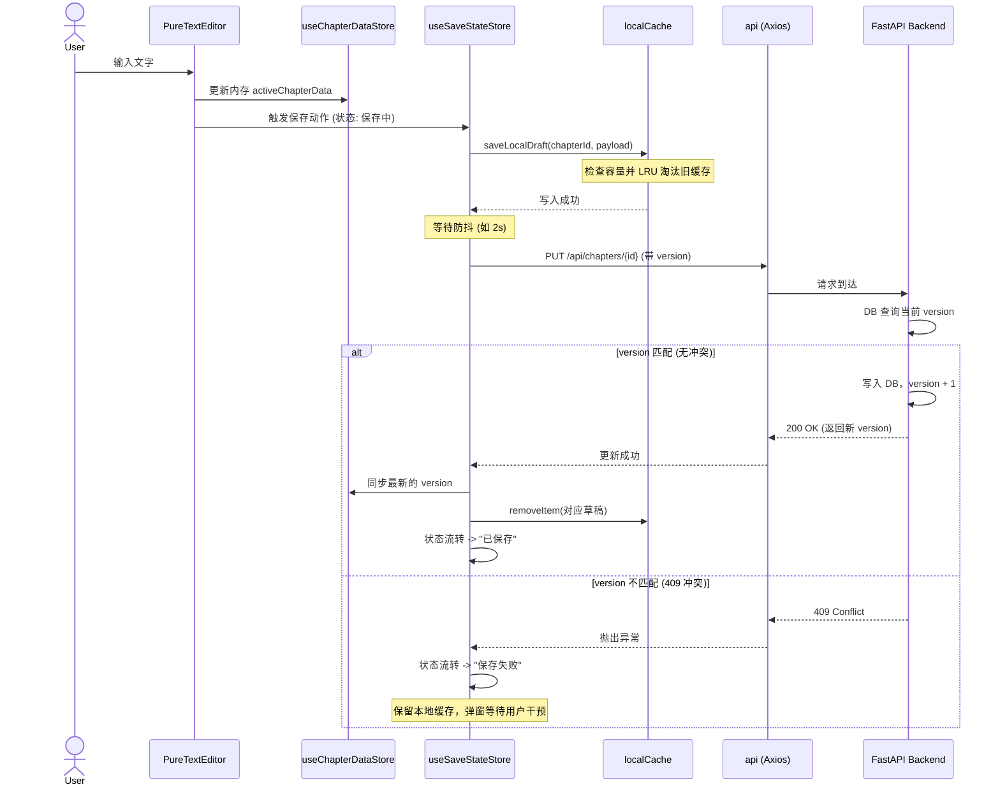
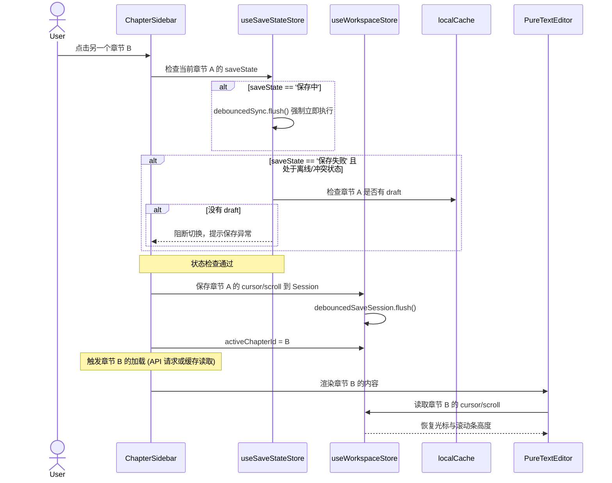

# InkTrace 详细设计文档

更新时间：2026-04-27
适用阶段：当前版本

***

## 1. 详细设计目标

基于架构设计文档，本详细设计文档旨在将架构蓝图拆解为具体的**组件级实现方案、接口通信协议及核心算法伪代码**。本设计将作为开发阶段的直接实现依据，确保所有模块遵循“简单、可靠、容错”的核心原则。

***

## 2. 后端详细设计 (FastAPI + SQLAlchemy)

### 2.1 数据库与 ORM 模型

为实现 `R-SAVE-04` (乐观锁) 和性能目标，数据库引擎使用 SQLite 并配置 WAL 模式。

#### 2.1.1 数据库连接配置 (`database/session.py`)

在 FastAPI 启动生命周期（`lifespan`）中配置引擎参数：

```python
from sqlalchemy import create_engine, event

# 启用 WAL 模式以提升并发读写性能
engine = create_engine(
    "sqlite:///./inktrace.db",
    connect_args={"check_same_thread": False}, # 允许 FastAPI 的多线程访问
    pool_size=5,
    max_overflow=10
)

@event.listens_for(engine, "connect")
def set_sqlite_pragma(dbapi_connection, connection_record):
    cursor = dbapi_connection.cursor()
    cursor.execute("PRAGMA journal_mode=WAL")
    cursor.execute("PRAGMA synchronous=NORMAL")
    cursor.execute("PRAGMA busy_timeout=5000") # 5秒超时，防止锁定
    cursor.close()
```

#### 2.1.2 核心 ORM 模型 (`database/models.py`)

详细 ORM 定义（仅展示关键部分）：

```python
class ChapterModel(Base):
    __tablename__ = "chapters"
    
    id = Column(String(36), primary_key=True)
    work_id = Column(String(36), ForeignKey("works.id", ondelete="CASCADE"), nullable=False, index=True)
    title = Column(String(255), nullable=False, default="")
    content = Column(Text, nullable=False, default="")
    order_index = Column(Integer, nullable=False, index=True) # 用于快速排序
    version = Column(Integer, nullable=False, default=1)      # 乐观锁
    
    # ... 其他基础字段 ...
```

### 2.2 核心业务服务 (Service Layer)

#### 2.2.1 保存章节与乐观锁校验 (`application/services/chapter_service.py`)

实现带版本控制的正文保存，处理并发冲突。

```python
from sqlalchemy.orm import Session
from fastapi import HTTPException

def update_chapter_content(db: Session, chapter_id: str, title: str, content: str, client_version: int, force_override: bool = False):
    chapter = db.query(ChapterModel).filter(ChapterModel.id == chapter_id).first()
    
    if not chapter:
        raise HTTPException(status_code=404, detail="Chapter not found")

    # 乐观锁校验
    if not force_override and chapter.version != client_version:
        raise HTTPException(
            status_code=409, 
            detail={"message": "Version conflict", "server_version": chapter.version}
        )

    # 执行更新
    chapter.title = title
    chapter.content = content
    # 重新计算字数（服务端也需校验）
    chapter.word_count = len(re.sub(r'\s+', '', content)) 
    chapter.version += 1 # 版本递增
    
    db.commit()
    return chapter # 返回更新后的实体，包含新 version
```

#### 2.2.2 原子化全量调序 (`application/services/chapter_service.py`)

确保拖拽排序的数据一致性。

```python
def reorder_chapters(db: Session, work_id: str, order_mapping: list[dict]):
    """
    order_mapping: [{"id": "uuid1", "order_index": 1}, {"id": "uuid2", "order_index": 2}]
    """
    try:
        # 在一个事务中执行所有更新
        for mapping in order_mapping:
            db.query(ChapterModel).filter(
                ChapterModel.id == mapping["id"], 
                ChapterModel.work_id == work_id
            ).update({"order_index": mapping["order_index"]})
            
        db.commit()
    except Exception as e:
        db.rollback()
        raise HTTPException(status_code=500, detail="Reorder failed, transaction rolled back.")
```

### 2.3 TXT 导入策略 (`application/services/io_service.py`)

实现 `R-DATA-03`：采用非中断的正则分割。

```python
import re
import uuid

def import_txt(db: Session, file_content: str, work_title: str):
    work_id = str(uuid.uuid4())
    work = WorkModel(id=work_id, title=work_title)
    db.add(work)

    # 匹配 "第XXX章" 及其标题，支持卷/部，但统一视为章
    pattern = re.compile(r'(第[零一二三四五六七八九十百千0-9]+[章卷部].*?\n)')
    
    # split 会返回: [前言, 标题1, 内容1, 标题2, 内容2...]
    parts = pattern.split(file_content)
    
    chapters_to_insert = []
    order_idx = 1
    
    # 兜底：如果没有匹配到任何章节
    if len(parts) <= 1:
         chapters_to_insert.append(ChapterModel(
             id=str(uuid.uuid4()), work_id=work_id, 
             title="全本导入", content=file_content, order_index=order_idx
         ))
    else:
        # parts[0] 可能是前言或空字符串
        if parts[0].strip():
            chapters_to_insert.append(ChapterModel(
                id=str(uuid.uuid4()), work_id=work_id, 
                title="前言", content=parts[0], order_index=order_idx
            ))
            order_idx += 1
            
        # 遍历标题和内容对
        for i in range(1, len(parts), 2):
            title = parts[i].strip()
            content = parts[i+1] if i+1 < len(parts) else ""
            
            chapters_to_insert.append(ChapterModel(
                id=str(uuid.uuid4()), work_id=work_id, 
                title=title, content=content, order_index=order_idx
            ))
            order_idx += 1

    db.add_all(chapters_to_insert)
    db.commit()
```

***

## 3. 前端详细设计 (Vue3 + Pinia)

### 3.1 本地缓存与 LRU 管理 (`utils/localCache.js`)

实现 Local-First 核心机制，确保容量不超过 10MB。

```javascript
const CACHE_PREFIX = 'inktrace_draft_';
const MAX_CACHE_SIZE_BYTES = 10 * 1024 * 1024; // 10MB 软限制

// 估算字符串字节大小
function getByteLen(normal_val) {
    normal_val = String(normal_val);
    var byteLen = 0;
    for (var i = 0; i < normal_val.length; i++) {
        var c = normal_val.charCodeAt(i);
        byteLen += c < (1 << 7) ? 1 :
                   c < (1 << 11) ? 2 :
                   c < (1 << 16) ? 3 :
                   c < (1 << 21) ? 4 :
                   c < (1 << 26) ? 5 :
                   c < (1 << 31) ? 6 : Number.NaN;
    }
    return byteLen;
}

export function saveLocalDraft(chapterId, payload) {
    const key = `${CACHE_PREFIX}${chapterId}`;
    payload.timestamp = Date.now();
    const payloadStr = JSON.stringify(payload);
    
    // 检查容量并执行 LRU 清理
    enforceCacheQuota(getByteLen(payloadStr));
    
    localStorage.setItem(key, payloadStr);
}

function enforceCacheQuota(newPayloadSize) {
    let currentSize = 0;
    const drafts = [];
    
    // 收集所有草稿信息
    for (let i = 0; i < localStorage.length; i++) {
        const key = localStorage.key(i);
        if (key.startsWith(CACHE_PREFIX)) {
            const itemStr = localStorage.getItem(key);
            currentSize += getByteLen(itemStr);
            try {
                const parsed = JSON.parse(itemStr);
                drafts.push({ key, timestamp: parsed.timestamp || 0 });
            } catch(e) {}
        }
    }
    
    // 如果超限，按时间戳升序排序（最旧的在前），逐个删除直到腾出足够空间
    if (currentSize + newPayloadSize > MAX_CACHE_SIZE_BYTES) {
        drafts.sort((a, b) => a.timestamp - b.timestamp);
        
        for (const draft of drafts) {
            const sizeFreed = getByteLen(localStorage.getItem(draft.key));
            localStorage.removeItem(draft.key);
            currentSize -= sizeFreed;
            if (currentSize + newPayloadSize <= MAX_CACHE_SIZE_BYTES) {
                break;
            }
        }
    }
}
```

### 3.2 状态管理与 Store 边界划分 (Pinia)

为避免单一 Store 臃肿导致数据混乱，严格按照职责拆分为三个独立的 Store：

1. **`useWorkspaceStore`**：管理当前编辑上下文（作品 ID、激活章节 ID、光标位置等 EditSession 数据）。
2. **`useChapterDataStore`**：管理章节数据列表与缓存（负责读写数据）。
3. **`useSaveStateStore`**：专门管理保存状态机（`已保存` / `保存中` / `保存失败` / `离线`）。

#### 3.2.1 离线草稿回放逻辑 (`useSaveStateStore` 内部)

修复隐患：采用按时间戳排序的**串行回放**，避免瞬间并发打爆接口，保证数据恢复顺序的确定性。

```javascript
import { defineStore } from 'pinia'
import api from '@/api'

export const useSaveStateStore = defineStore('saveState', {
  state: () => ({
    saveState: '已保存',
    isOffline: !navigator.onLine
  }),
  actions: {
    async replayOfflineDrafts() {
        if (this.isOffline) return;
        
        // 1. 收集并按时间戳排序
        const drafts = [];
        for (let i = 0; i < localStorage.length; i++) {
            const key = localStorage.key(i);
            if (key.startsWith('inktrace_draft_')) {
                try {
                    const draft = JSON.parse(localStorage.getItem(key));
                    drafts.push({ key, chapterId: key.replace('inktrace_draft_', ''), ...draft });
                } catch(e) {}
            }
        }
        drafts.sort((a, b) => a.timestamp - b.timestamp);

        // 2. 串行回放，避免打爆接口并保证顺序
        for (const draft of drafts) {
            try {
                await api.put(`/api/chapters/${draft.chapterId}`, {
                    title: draft.title,
                    content: draft.content,
                    version: draft.version
                });
                // 回放成功，清除缓存
                localStorage.removeItem(draft.key);
            } catch (error) {
                console.error(`Replay failed for ${draft.chapterId}`, error);
                // 遇到冲突 (409) 时跳过，保留缓存交由用户后续决策
            }
        }
    }
  }
})
```

#### 3.2.2 EditSession 机制与上下文管理 (`useWorkspaceStore`)

满足 `R-EDIT-01`：实时记录光标与滚动位置，在重新打开或多标签页切换时准确恢复。

```javascript
import { defineStore } from 'pinia'
import debounce from 'lodash/debounce'
import api from '@/api'

export const useWorkspaceStore = defineStore('workspace', {
  state: () => ({
    activeWorkId: null,
    activeChapterId: null,
    cursorPosition: 0,
    scrollTop: 0
  }),
  actions: {
    // 监听编辑器滚动与光标变化，防抖记录到远端（或本地会话缓存）
    debouncedSaveSession: debounce(async function() {
        if (!this.activeWorkId) return;
        
        try {
            await api.put(`/api/works/${this.activeWorkId}/session`, {
                last_open_chapter_id: this.activeChapterId,
                cursor_position: this.cursorPosition,
                scroll_top: this.scrollTop
            });
        } catch (error) {
            console.error("Failed to save session", error);
        }
    }, 1000),

    updateCursorAndScroll(position, scroll) {
        this.cursorPosition = position;
        this.scrollTop = scroll;
        this.debouncedSaveSession();
    }
  }
})
```

### 3.3 纯文本编辑器组件 (`components/PureTextEditor.vue`)

实现 `R-EDIT-04`，拦截富文本并统一口径计算字数。

```vue
<template>
  <div class="editor-container">
    <textarea 
      ref="textareaRef"
      v-model="localContent"
      @input="onInput"
      @paste="onPaste"
      class="pure-textarea"
      placeholder="开始创作..."
    ></textarea>
  </div>
</template>

<script setup>
import { ref, watch } from 'vue'
import { useChapterStore } from '@/stores/chapterStore'

const props = defineProps({
  chapterId: String,
  initialContent: String
})

const store = useChapterStore()
const localContent = ref(props.initialContent)
const textareaRef = ref(null)

// 拦截粘贴，仅提取纯文本
const onPaste = (e) => {
    e.preventDefault();
    // 获取纯文本
    let text = (e.originalEvent || e).clipboardData.getData('text/plain');
    
    // 插入到当前光标位置
    const el = textareaRef.value;
    const start = el.selectionStart;
    const end = el.selectionEnd;
    
    localContent.value = localContent.value.substring(0, start) + text + localContent.value.substring(end);
    
    // 恢复光标位置
    setTimeout(() => {
        el.selectionStart = el.selectionEnd = start + text.length;
        onInput(); // 手动触发保存
    }, 0);
}

const onInput = () => {
    store.handleInput(store.activeChapter.title, localContent.value);
}
</script>

<style scoped>
.pure-textarea {
    width: 100%;
    height: 100%;
    resize: none;
    border: none;
    outline: none;
    font-family: 'Courier New', Courier, monospace; /* 或其他等宽/易读字体 */
    font-size: 16px;
    line-height: 1.6;
}
</style>
```

***

## 4. 关键交互流程与组件间通信

### 4.1 核心组件与状态流转类图

为避免后期维护时出现“单一 Store 过于臃肿”的情况，这里严格定义了组件和 Store 之间的单向数据流与依赖关系：



### 4.2 自动保存时序图 (V1 核心链路)

展示用户输入触发 Local-First 保存机制的全过程：



### 4.3 章节切换时序图

防丢字、防状态错乱的切换流程：



***

## 5. 遗留系统清理说明

在实施本详细设计前，需清理以下不再需要的旧代码和依赖：

- 移除所有与 AI 分析、大纲生成、知识库嵌入相关的路由（`routers/content.py`, `routers/ai.py` 等）。
- 移除 `token_budget_manager.py` 及复杂的依赖注入容器设计。
- 移除前端 `NovelWorkspace.vue` 复杂的卡片切换逻辑，回归传统的 `Sidebar + MainContent` 布局。

