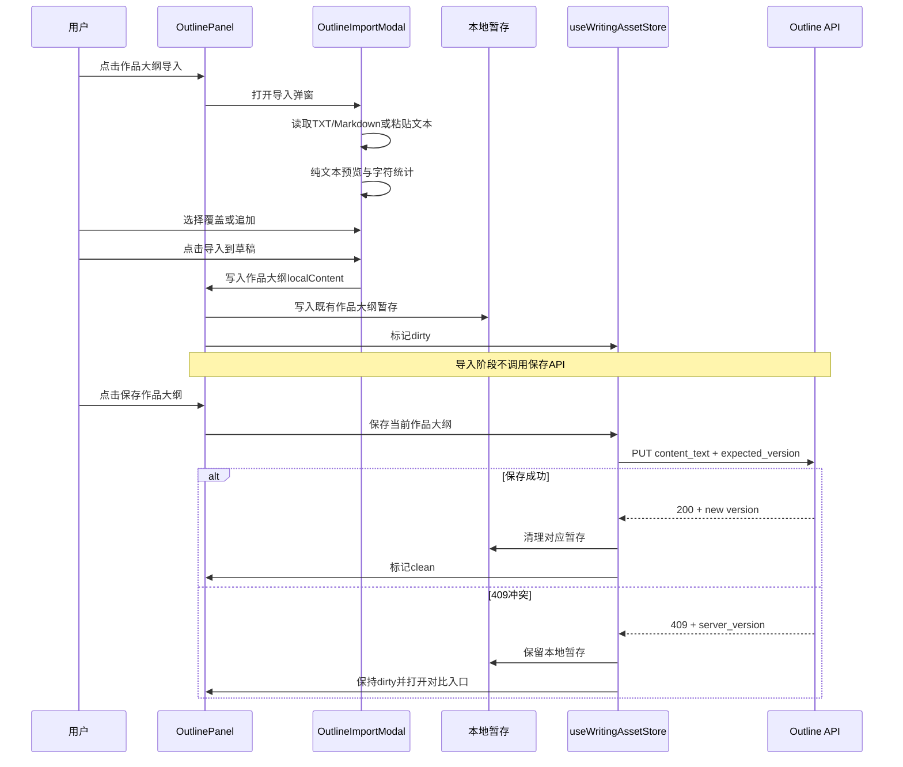

# InkTrace V1.1 作品大纲导入功能设计文档

> 版本：v1.1-outline-import  
> 所属阶段：V1.1-B 结构化写作资产  
> 功能性质：非 AI、作品级结构化资产输入能力

---

## 1. 功能定位

作品大纲导入用于帮助作者快速建立作品级大纲草稿。

本功能只处理用户提供的纯文本内容，不进行 AI 分析、章节拆分、结构推断或资产抽取。

本功能必须保持：

- 非 AI。
- 不新增页面。
- 不新增后端解析 API。
- 不改变章节系统。
- 不破坏结构化资产手动保存体系。
- 不破坏正文 Local-First 写作链路。

---

## 2. 功能范围

支持输入来源：

- TXT 文件。
- Markdown 文件。
- 手动粘贴文本。

仅作用于：

```text
作品大纲（Work Outline）
```

不作用于：

- 章节细纲。
- 章节正文。
- 章节列表。
- 时间线。
- 人物卡。
- 伏笔。

---

## 3. 入口位置

入口位置：

```text
写作页
→ AssetDrawer
→ OutlinePanel
→ 作品大纲模式 Header
→ [导入]
```

显示规则：

- 作品大纲模式显示“导入”按钮。
- 章节大纲模式不显示“导入”按钮。
- AssetRail 不显示导入入口。
- Editor 正文区不显示导入入口。
- Header 全局区域不显示导入入口。

---

## 4. UI 原型

### 4.1 作品大纲区域

```text
┌──────────────────────────────────────┐
│ OutlinePanel                         │
├──────────────────────────────────────┤
│ [作品大纲]*  [章节大纲]       [导入] │
├──────────────────────────────────────┤
│ 状态：未保存                         │
│                                      │
│ 作品大纲 textarea                    │
│ ┌──────────────────────────────────┐ │
│ │ 第一卷：旧城                      │ │
│ │ - 主角入城                       │ │
│ │ - 暗线出现                       │ │
│ │                                  │ │
│ │ 第二卷：风雪                     │ │
│ └──────────────────────────────────┘ │
│                                      │
│ 当前字符数：12,345                   │
│ 建议控制在 20,000 字以内             │
│                                      │
│                    [保存作品大纲]    │
└──────────────────────────────────────┘
```

### 4.2 导入弹窗

```text
┌──────────────────────────────────────┐
│ 导入作品大纲                         │
├──────────────────────────────────────┤
│ 上传文件：                           │
│ [选择 TXT / Markdown 文件]           │
│                                      │
│ 或                                   │
│                                      │
│ 粘贴作品大纲：                       │
│ ┌──────────────────────────────────┐ │
│ │                                  │ │
│ │                                  │ │
│ │                                  │ │
│ └──────────────────────────────────┘ │
│                                      │
│ 当前字符数：8,245                    │
│ 建议控制在 20,000 字以内             │
├──────────────────────────────────────┤
│ 导入预览：                           │
│ ----------------------------------   │
│ # 第一卷：逃出宗门                   │
│ 主角出生于边境小城……                 │
│ ----------------------------------   │
├──────────────────────────────────────┤
│ 导入方式：                           │
│ (●) 覆盖当前草稿                     │
│ ( ) 追加到末尾                       │
├──────────────────────────────────────┤
│                 [取消] [导入到草稿]  │
└──────────────────────────────────────┘
```

---

## 5. 输入规则

### 5.1 TXT 文件

规则：

- 文件后缀仅允许 `.txt`。
- 按纯文本读取。
- 不识别章节标记。
- 不拆分章节。
- 不创建正文内容。

### 5.2 Markdown 文件

规则：

- 文件后缀仅允许 `.md`。
- Markdown 原样导入。
- 不渲染 Markdown。
- 不解析标题层级。
- 不生成树结构。

示例：

```markdown
# 第一卷
## 第1章
```

导入后在 textarea 中仍按原始文本展示。

### 5.3 手动粘贴

规则：

- 支持直接粘贴大纲文本。
- 粘贴内容与文件导入内容走同一预览、统计、覆盖/追加流程。

---

## 6. 文件与字符边界

文件规则：

- 文件大小上限：2MB。
- 支持编码：`utf-8-sig`、`utf-8`。
- 不支持的编码必须提示失败，不写入草稿。
- 不做自动转码。

字符统计：

- 使用原始字符数。
- 包含空格、换行、制表符。
- 不复用正文 `word_count` 口径。

性能提示：

- 20,000 字符以上：显示“建议控制在 20,000 字以内以获得更好编辑体验”。
- 50,000 字符以上：显示“当前内容较大，可能影响编辑性能”。
- 超过提示阈值不阻断导入。

---

## 7. 覆盖与追加规则

当前作品大纲草稿为空：

- 直接导入到草稿。

当前作品大纲草稿非空：

- 必须显示导入方式选择。
- 默认选择“覆盖当前草稿”。
- 用户可选择“追加到末尾”。

追加规则：

```text
原草稿 + "\n\n" + 导入文本
```

当原草稿或导入文本为空时，不额外插入换行。

---

## 8. 导入后行为

导入后：

- 写入作品大纲当前 `localContent`。
- 设置作品大纲 dirty。
- 写入既有作品大纲本地暂存。
- 关闭导入弹窗。

导入后不执行：

- 不调用保存 API。
- 不写入数据库。
- 不更新 `version`。
- 不生成 `content_tree_json`。
- 不创建章节。
- 不更新章节细纲。

保存仍由用户点击：

```text
保存作品大纲
```

保存接口仍使用：

```text
PUT /api/v1/works/{work_id}/outline
```

---

## 9. Dirty 与冲突规则

Dirty 规则：

- 导入复用现有 OutlinePanel dirty 状态。
- 禁止新增 `outlineImportDraft` 状态。
- Drawer 切换、关闭、切章时继续复用现有 dirty 保护。

409 冲突规则：

- 保存返回 409 时，必须保留导入后的本地草稿。
- 不清理本地暂存。
- 保持 dirty 状态。
- 打开本地版本 vs 服务端版本对比入口。
- 用户完成覆盖服务端或放弃本地后，才允许清理对应暂存。

---

## 10. 前端组件设计

新增组件：

```text
OutlineImportModal.vue
```

建议位置：

```text
frontend/src/components/workspace/
```

职责：

- 文件选择。
- 文本粘贴。
- 纯文本预览。
- 字符统计。
- 覆盖/追加选择。
- 将导入结果提交给 OutlinePanel 草稿。

OutlinePanel 职责调整：

- 在作品大纲模式 Header 展示“导入”按钮。
- 管理导入弹窗开关。
- 接收导入文本并写入作品大纲草稿。
- 标记 dirty 并写入既有本地暂存。

---

## 11. 数据流

```text
TXT / Markdown / Paste
        ↓
OutlineImportModal
        ↓
纯文本预览 + 字符统计
        ↓
覆盖 / 追加
        ↓
OutlinePanel.localContent
        ↓
dirty = true
        ↓
既有作品大纲本地暂存
        ↓
用户点击保存作品大纲
        ↓
PUT /api/v1/works/{work_id}/outline
        ↓
保存成功后 version 更新并清理暂存
```

---

## 12. Mermaid 流程图



---

## 13. 明确禁止行为

V1.1 作品大纲导入禁止：

- AI 自动分析大纲。
- AI 自动拆章节。
- AI 自动生成章节细纲。
- AI 自动抽取人物。
- AI 自动抽取时间线。
- AI 自动抽取伏笔。
- AI 自动结构化。
- 导入后直接覆盖数据库。
- 导入后自动创建章节。
- 导入章节细纲。
- 新增独立 `outlineImportDraft` 状态链路。
- 新增后端解析 API。

---

## 14. DoD

- 作品大纲模式显示“导入”按钮。
- 章节大纲模式不显示“导入”按钮。
- TXT 文件可导入到作品大纲草稿。
- Markdown 文件可原样导入到作品大纲草稿。
- 手动粘贴可导入到作品大纲草稿。
- 覆盖当前草稿行为正确。
- 追加到末尾行为正确，非空文本之间插入两个换行。
- 导入后 dirty=true。
- 导入后不调用保存 API。
- 导入后刷新前可从既有本地暂存恢复。
- 保存成功后更新版本并清理对应暂存。
- 保存返回 409 时保留本地草稿与对比入口。
- 导入不创建章节、不修改章节细纲、不影响正文。
