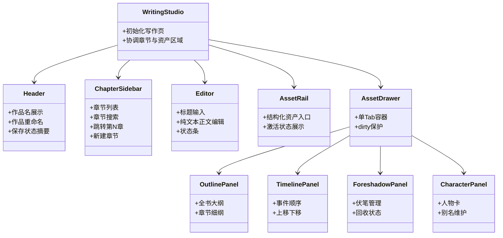
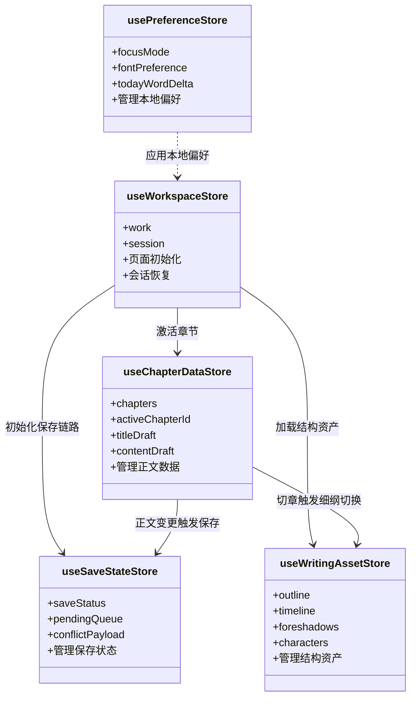
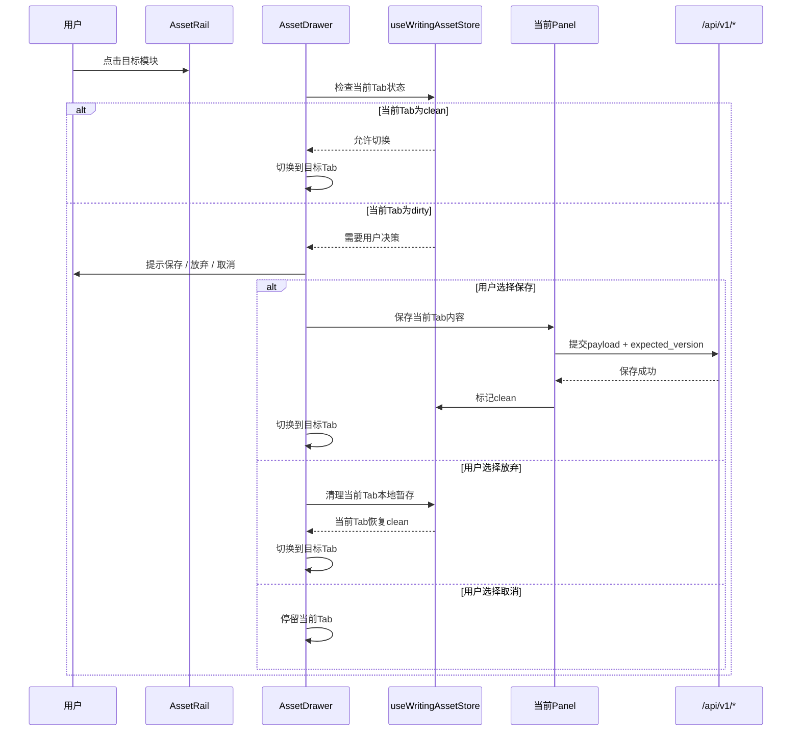
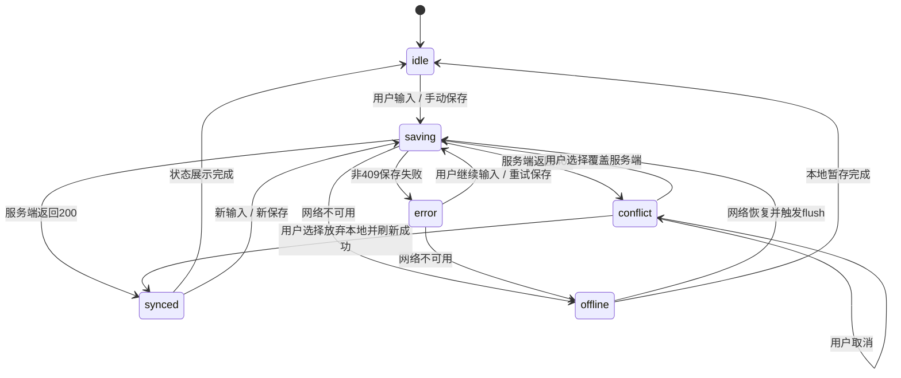
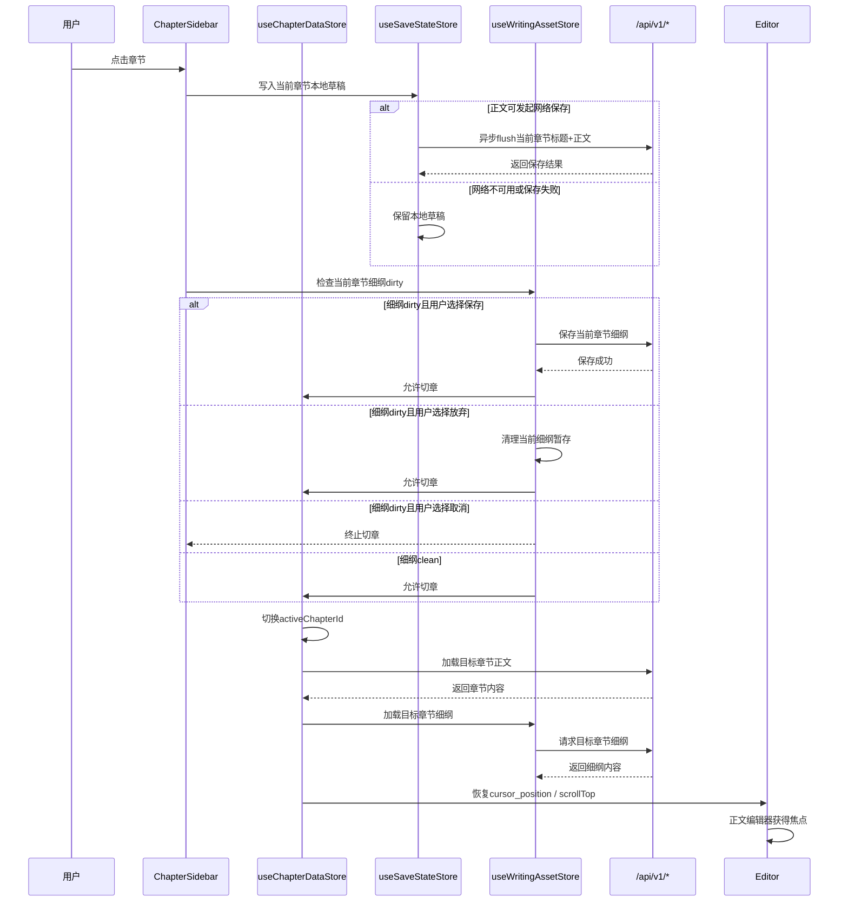
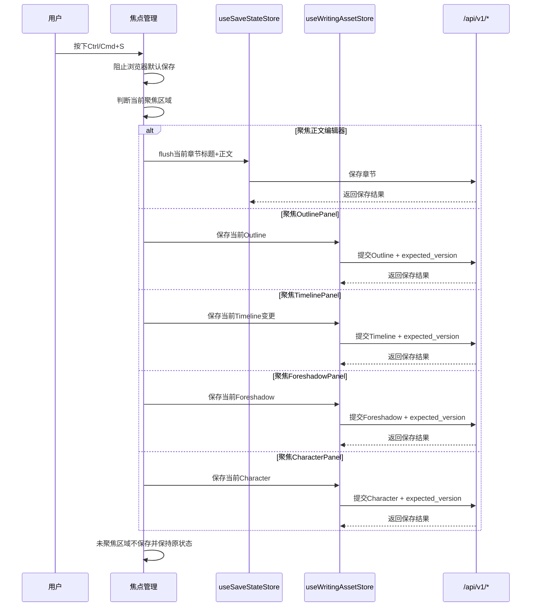
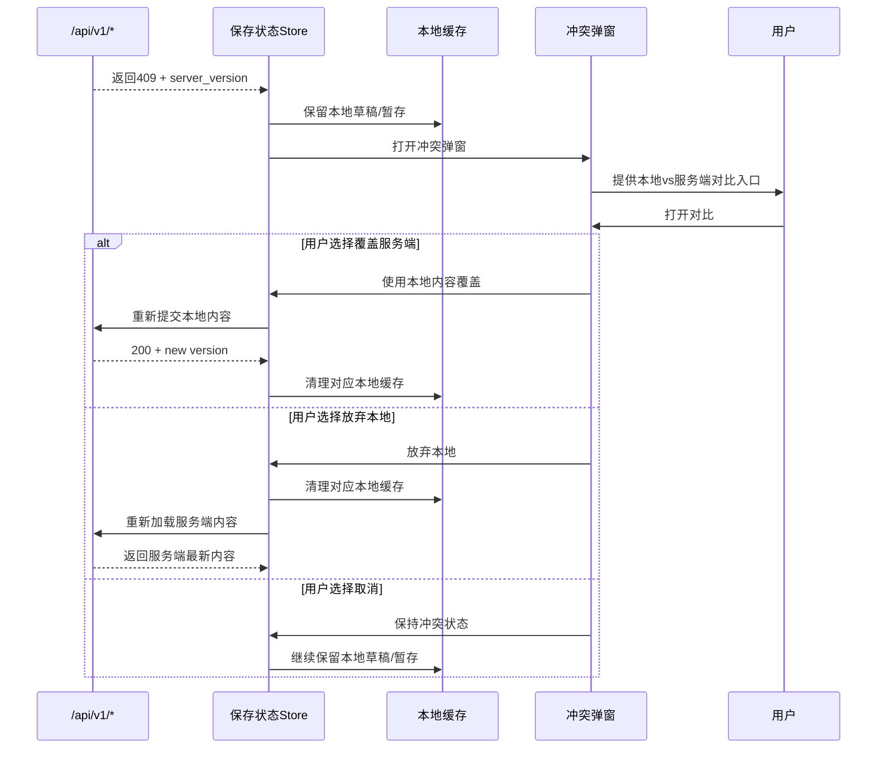

# InkTrace V1.1 UI/UE 详细设计文档

版本：v1.1  
阶段：非 AI 创作工作台  
页面范围：写作页 `/works/:id`

***

## 1. 设计目标

### 1.1 写作优先

写作页以正文输入为最高优先级。所有布局、交互、提示、面板展开行为，均不得阻断正文输入链路。

规则：

- 正文编辑区位于页面中心。
- 页面打开、切章、新建章节后默认焦点给正文 textarea。
- 标题输入框仅在用户点击或触发标题编辑快捷入口时进入编辑态。
- Drawer 展开、关闭、Tab 切换不得主动抢占正文焦点。
- 保存状态提示使用轻量状态，不使用阻断式全屏弹窗。
- 正文保存采用 Local-First 自动保存。

### 1.2 结构辅助

结构化资产用于辅助写作，不替代正文写作。

结构化资产包括：

- Outline：全书大纲、章节细纲。
- Timeline：事件顺序。
- Foreshadow：伏笔管理。
- Character：人物卡。

规则：

- 结构化资产只允许在右侧 AssetDrawer 中编辑。
- 结构化资产不允许出现在正文主编辑区。
- 结构化资产采用手动保存。
- 结构化资产离线编辑时写入本地暂存，不自动回放。

### 1.3 不打断输入流

页面交互必须保证作者持续输入不中断。

规则：

- 正文保存失败时不弹出全屏阻断弹窗。
- 网络异常时正文继续允许输入。
- 409 冲突时保留本地草稿。
- 切章前必须将当前编辑内容写入本地草稿；网络保存允许异步完成。
- Ctrl/Cmd+S 只保存当前聚焦区域。

***

## 2. 写作页整体布局

### 2.1 默认布局

```text
┌──────────────────────────────────────────────────────────────────────────────┐
│ Header                                                                       │
│  InkTrace / 作品名                                           保存状态 / 操作 │
├──────────────────┬──────────────────────────────────────────────┬────────────┤
│ ChapterSidebar   │ Editor                                       │ AssetRail  │
│                  │                                              │            │
│ [搜索章节]        │  第12章  章节标题输入                         │   [纲]     │
│ [跳转第N章]       │ ───────────────────────────────────────────  │   [线]     │
│                  │                                              │   [伏]     │
│  第1章            │  纯文本正文编辑区                             │   [人]     │
│  第2章            │                                              │            │
│ >第12章           │  光标位置 / 正文内容                          │            │
│  第13章           │                                              │            │
│                  │                                              │            │
│ [+ 新建章节]      │                                              │            │
│                  │──────────────────────────────────────────────│            │
│                  │ 状态条：已保存 / 保存中 / 离线 / 保存失败       │            │
└──────────────────┴──────────────────────────────────────────────┴────────────┘
```

### 2.2 Drawer 展开布局

```text
┌──────────────────────────────────────────────────────────────────────────────────────────────┐
│ Header                                                                                       │
├──────────────────┬──────────────────────────────────────────────┬────────────┬───────────────┤
│ ChapterSidebar   │ Editor                                       │ AssetRail  │ AssetDrawer   │
│                  │                                              │            │               │
│ [搜索章节]        │  第12章  章节标题输入                         │  [纲]*     │ [Outline]     │
│ [跳转第N章]       │ ───────────────────────────────────────────  │  [线]      │ [Timeline]    │
│                  │                                              │  [伏]      │ [Foreshadow]  │
│  第1章            │  纯文本正文编辑区                             │  [人]      │ [Character]   │
│  第2章            │                                              │            │───────────────│
│ >第12章           │                                              │            │ 当前 Tab 内容  │
│  第13章           │                                              │            │               │
│                  │                                              │            │ [保存] [关闭] │
│ [+ 新建章节]      │                                              │            │               │
│                  │──────────────────────────────────────────────│            │               │
│                  │ 状态条                                       │            │               │
└──────────────────┴──────────────────────────────────────────────┴────────────┴───────────────┘
```

### 2.3 移动端布局

```text
┌──────────────────────────────────────┐
│ Header                               │
├──────────────────────────────────────┤
│ Editor                               │
│                                      │
│ 第12章  章节标题输入                  │
│ ───────────────────────────────────  │
│ 纯文本正文编辑区                      │
│                                      │
│                                      │
│ 状态条                               │
├──────────────────────────────────────┤
│ Bottom / Floating AssetRail          │
│ [章节] [纲] [线] [伏] [人]            │
└──────────────────────────────────────┘

Drawer 打开时：

┌──────────────────────────────────────┐
│ AssetDrawer 全屏覆盖层                │
│ [Outline] [Timeline] [Foreshadow] [X] │
├──────────────────────────────────────┤
│ 当前结构化资产编辑内容                │
│                                      │
│ [保存]                               │
└──────────────────────────────────────┘
```

### 2.4 Mermaid：写作页组件结构图



### 2.5 Mermaid：前端 Store 关系图



***

## 3. 各区域详细设计

### 3.1 Header

#### 显示内容

Header 固定显示：

- 产品标识：InkTrace。
- 当前作品名。
- 当前作品保存状态摘要。
- 返回书架入口。
- 作品操作入口。

```text
┌──────────────────────────────────────────────────────────────────────────────┐
│ InkTrace  /  我的长篇小说标题                          已保存   [更多操作] │
└──────────────────────────────────────────────────────────────────────────────┘
```

#### 重命名行为

规则：

- 点击作品名进入编辑态。
- 编辑态失焦或按 Enter 提交。
- 按 Esc 放弃本次编辑。
- 空字符串不提交。
- 提交失败时恢复编辑前展示值，并显示轻量错误提示。

```text
展示态：
┌────────────────────────────────────────────────┐
│ InkTrace / 我的长篇小说标题                     │
└────────────────────────────────────────────────┘

编辑态：
┌────────────────────────────────────────────────┐
│ InkTrace / [我的长篇小说标题____________]        │
└────────────────────────────────────────────────┘
```

#### 长标题截断规则

规则：

- Header 中作品名单行展示。
- 超出区域时使用省略号截断。
- 鼠标悬停显示完整作品名。
- 不显示作品 UUID。

```text
InkTrace / 我的长篇小说标题非常非常长需要被截断...
```

### 3.2 ChapterSidebar

#### 区域结构

ChapterSidebar 固定在页面左侧，用于章节定位和章节管理。

```text
┌──────────────────────────┐
│ ChapterSidebar           │
├──────────────────────────┤
│ [ 搜索章节标题/编号 ]      │
│ [ 跳转第 __ 章 ] [Go]      │
├──────────────────────────┤
│  第1章                    │
│  第2章  夜雨              │
│  第3章                    │
│ >第4章  旧城              │
│  第5章                    │
│  第6章                    │
│  ...                     │
├──────────────────────────┤
│ [+ 新建章节]              │
└──────────────────────────┘
```

#### 列表结构

每个章节项展示：

- 动态章节编号：`第X章`。
- 用户标题：为空时不展示标题。
- 当前激活状态。
- 本地草稿状态标记。

```text
┌──────────────────────────┐
│  第1章                    │
│  第2章  夜雨              │
│ >第3章  城门        ●     │
│  第4章                    │
└──────────────────────────┘
```

标记规则：

- `>`：当前激活章节。
- `●`：该章节存在未同步本地草稿。
- `!`：该章节存在保存冲突。

#### 搜索框位置

搜索框位于列表顶部。

规则：

- 搜索仅过滤展示结果。
- 搜索不改变章节原始顺序。
- 搜索结果仍按 `order_index ASC` 展示。
- 清空搜索后恢复完整章节列表。
- 新建章节后自动清空搜索。

```text
┌──────────────────────────┐
│ [ 夜雨______________ ]     │
├──────────────────────────┤
│  第2章  夜雨              │
│  第8章  夜雨归来          │
└──────────────────────────┘
```

#### 跳转第 N 章入口

跳转入口位于搜索框下方。

规则：

- N 从 1 开始。
- 非数字输入显示轻量提示。
- 超出章节数量显示轻量提示。
- 跳转成功后目标章节设为激活，并滚动到可见区域。

```text
┌──────────────────────────┐
│ [ 跳转第  12  章 ] [Go]   │
└──────────────────────────┘
```

#### 新建章节位置

新建章节按钮固定在 Sidebar 底部。

规则：

- 点击后新章节追加到全书末尾。
- 新章节创建成功后自动激活。
- 新章节滚动到可见区域。
- 正文编辑区获得焦点。

```text
┌──────────────────────────┐
│                          │
│                          │
├──────────────────────────┤
│ [+ 新建章节]              │
└──────────────────────────┘
```

#### 激活项高亮规则

规则：

- 激活项背景高亮。
- 激活项左侧有明确指示。
- 激活项字体权重高于普通项。
- 激活项变化后执行 `scrollIntoView`。

```text
普通项：
  第11章  风起

激活项：
> 第12章  入城
```

### 3.3 Editor 区域

#### 区域结构

Editor 是页面主区域，承载章节标题、正文输入和保存状态。

```text
┌──────────────────────────────────────────────────────────────┐
│ Editor                                                       │
├──────────────────────────────────────────────────────────────┤
│ 第12章  [章节标题输入_______________________________]          │
│──────────────────────────────────────────────────────────────│
│                                                              │
│  纯文本正文编辑区                                             │
│                                                              │
│  用户在这里持续输入正文。                                     │
│  不显示富文本工具栏。                                         │
│  不显示 AI 入口。                                             │
│                                                              │
│                                                              │
├──────────────────────────────────────────────────────────────┤
│ 已保存        字数：12,340        光标：第 201 行              │
└──────────────────────────────────────────────────────────────┘
```

#### 标题输入框

展示规则：

```text
固定前缀：第{order_index}章
可编辑内容：title
```

原型：

```text
┌──────────────────────────────────────────────────────────────┐
│ [第12章] [旧城雨夜__________________________________]         │
└──────────────────────────────────────────────────────────────┘
```

保存规则：

- 只保存用户输入的 `title`。
- 不保存“第X章”前缀。
- “第X章”前缀作为独立展示元素，不进入输入框值。
- 必须避免把固定前缀写入输入框，防止中文输入法组合态异常。
- 标题为空时保存空字符串。
- 标题与正文走同一自动保存链路。
- 每次正文 flush 必须同时提交标题与正文。

#### 正文编辑区

规则：

- 仅支持纯文本。
- 不显示富文本工具栏。
- 粘贴内容按纯文本处理。
- 支持长文输入。
- 单章内容超过软上限时显示轻量提示，不阻断输入。
- 页面打开、切章、新建章节后，正文 textarea 获得默认焦点。
- 标题输入框不得在页面初始化或切章后自动抢占焦点。

```text
┌──────────────────────────────────────────────────────────────┐
│                                                              │
│  正文正文正文正文正文正文正文正文正文正文正文正文正文正文       │
│  正文正文正文正文正文正文正文正文正文正文正文正文正文正文       │
│                                                              │
│  光标停留处继续输入。                                         │
│                                                              │
└──────────────────────────────────────────────────────────────┘
```

#### 状态条

状态条位于 Editor 底部。

```text
┌──────────────────────────────────────────────────────────────┐
│ 保存中...        字数：12,340        今日新增：1,024           │
└──────────────────────────────────────────────────────────────┘
```

状态规则：

- `saving`：显示“保存中...”。
- `synced`：显示“已保存”。
- `offline`：显示“离线模式，本地已暂存”。
- `conflict`：显示“保存冲突，需处理”。
- `error`：显示“保存失败，已暂存本地”。

### 3.4 AssetRail

AssetRail 固定在 Editor 右侧，用于打开结构化资产 Drawer。

```text
┌────────────┐
│ AssetRail  │
├────────────┤
│ [纲]       │
│ [线]       │
│ [伏]       │
│ [人]       │
└────────────┘
```

图标含义：

- `[纲]`：大纲。
- `[线]`：时间线。
- `[伏]`：伏笔。
- `[人]`：人物。

激活状态：

```text
┌────────────┐
│ AssetRail  │
├────────────┤
│            │  ← 当前模块为“大纲”时，[纲] 不显示
│ [线]       │
│ [伏]       │
│ [人]       │
└────────────┘
```

规则：

- 点击未激活图标：打开 Drawer 并切换到对应模块。
- Drawer 打开后，AssetRail 隐藏当前激活模块入口。
- 当前模块名称由 Drawer Header 展示。
- Drawer 关闭入口由 Drawer Header 的关闭按钮承担。
- 已隐藏的当前模块入口不再承担关闭行为。
- Drawer 同一时间只允许打开一个模块。
- Rail 按钮只显示单字入口，不再同时显示全称。
- 完整模块名称由 Drawer 标题承担，Rail 可选提供 hover 提示。
- AssetRail 不改变正文编辑区内容。
- AssetRail 点击不触发正文保存。

### 3.5 AssetDrawer

#### Drawer 展开效果

AssetDrawer 从右侧展开，承载结构化资产编辑。Drawer 内不再重复显示模块切换按钮，`AssetRail` 是唯一一级导航入口。

```text
┌──────────────────────────────┐
│ AssetDrawer                  │
├──────────────────────────────┤
│ 当前模块标题             [X] │
│ 模块说明                      │
├──────────────────────────────┤
│ 当前 Tab 内容                 │
│                              │
│                              │
├──────────────────────────────┤
│ 状态                         │
│ [保存]                        │
└──────────────────────────────┘
```

#### 模块切换

规则：

- 同一时间只显示一个模块。
- 模块切换由 `AssetRail` 触发，Drawer 内不再提供重复 Tab。
- Drawer 打开后，`AssetRail` 仅显示未激活模块入口。
- 当前激活模块不在 `AssetRail` 中重复显示。
- 当前激活模块只在 Drawer Header 中显示名称。
- 切换前检查当前模块是否存在 dirty。
- 当前模块 dirty 时，必须提示保存或放弃。
- 用户取消时停留在当前 Tab。
- Tab 切换不影响正文激活章节。
- Drawer 内容区独立滚动，底部状态与保存操作保持吸底可见。

```text
┌──────────────────────────────┐
│ 大纲                     [X] │
├──────────────────────────────┤
│ OutlinePanel                 │
└──────────────────────────────┘
```

#### Drawer 关闭

规则：

- 当前面板 clean 时直接关闭。
- 当前面板 dirty 时提示保存或放弃。
- 用户取消时保持 Drawer 打开。
- 关闭 Drawer 不改变正文焦点。
- 打开 Drawer 后，模块标题由头部显示，不再重复渲染导航按钮。

#### Mermaid：AssetDrawer 模块切换流程



***

## 4. 四大面板设计

### 4.1 OutlinePanel

#### 功能范围

OutlinePanel 包含：

- 全书大纲。
- 当前章节细纲。
- 单视图文本编辑主区。
- 保存按钮。
- dirty 状态提示。
- 二级切换：`作品大纲 / 章节大纲`。

#### 全书大纲原型

```text
┌──────────────────────────────────────┐
│ OutlinePanel                         │
├──────────────────────────────────────┤
│ [全书大纲]*  [当前章节细纲]           │
├──────────────────────────────────────┤
│ 状态：dirty                           │
│                                      │
│ 全书大纲文本                          │
│ ┌──────────────────────────────────┐ │
│ │ 第一卷：旧城                      │ │
│ │ - 主角入城                       │ │
│ │ - 暗线出现                       │ │
│ │                                  │ │
│ │ 第二卷：风雪                     │ │
│ └──────────────────────────────────┘ │
│                                      │
│                            [保存]    │
└──────────────────────────────────────┘
```

#### 当前章节细纲原型

```text
┌──────────────────────────────────────┐
│ OutlinePanel                         │
├──────────────────────────────────────┤
│ [全书大纲]  [当前章节细纲]*           │
├──────────────────────────────────────┤
│ 第12章  旧城雨夜                     │
│ 状态：已保存                          │
│                                      │
│ ┌──────────────────────────────────┐ │
│ │ 本章目标：                        │ │
│ │ 1. 主角进入旧城                  │ │
│ │ 2. 发现第一条伏笔                │ │
│ │ 3. 结尾留下悬念                  │ │
│ └──────────────────────────────────┘ │
│                                      │
│ [保存]                              │
└──────────────────────────────────────┘
```

#### 保存规则

- Outline 手动保存。
- 保存请求必须携带 `expected_version`。
- 保存成功后状态变为 clean。
- 保存冲突时弹出冲突处理入口。
- `content_tree_json` 仅在用户显式保存时更新。
- 同一时间只显示一个编辑区，避免“全书大纲 + 章节细纲”上下同时挤压。
- Footer 区域固定在面板底部，保证状态与保存按钮始终可见。
- V1.1 写作页内不提供“大纲导入”入口。
- 如需导入大纲，仅允许走作品导入流程，不在 OutlinePanel 内新增上传能力。

### 3.6 写作偏好面板

写作偏好属于本地展示配置，不应以页内整块展开方式推挤 Header 和正文布局。

#### 展开方式

- 桌面端：点击 Header 内“写作偏好”按钮后，显示锚定在按钮下方的悬浮面板。
- 移动端：使用底部弹层或右侧覆盖层。
- 不改变 Header 高度。
- 不占据正文上方整行空间。

```text
┌──────────────────────────────────────┐
│ Header                         [按钮]│
└──────────────────────────────────────┘
                          ┌───────────┐
                          │ 写作偏好   │
                          │ 字体       │
                          │ 字号       │
                          │ 行距       │
                          │ 主题       │
                          └───────────┘
```

#### 规则

- 点击按钮打开或关闭。
- 点击空白区域关闭。
- 支持 `Esc` 关闭。
- 修改偏好不触发正文保存。
- 修改偏好不改变正文内容，只影响本地展示样式。

### 4.2 TimelinePanel

#### 功能范围

TimelinePanel 用于管理事件顺序。

包含：

- 事件列表。
- 上移 / 下移按钮。
- 关联章节。
- 保存排序。

#### 事件列表原型

```text
┌──────────────────────────────────────┐
│ TimelinePanel                        │
├──────────────────────────────────────┤
│ 状态：clean                           │
│ [+ 新建事件]                          │
├──────────────────────────────────────┤
│ 01  主角入城                         │
│     关联：第12章 旧城雨夜             │
│     [上移] [下移] [编辑] [删除]       │
│                                      │
│ 02  发现旧信                         │
│     关联：第13章                     │
│     [上移] [下移] [编辑] [删除]       │
│                                      │
│ 03  暗线人物出现                     │
│     关联：未关联                     │
│     [上移] [下移] [编辑] [删除]       │
├──────────────────────────────────────┤
│ [保存排序]                            │
└──────────────────────────────────────┘
```

#### 编辑事件原型

```text
┌──────────────────────────────────────┐
│ 编辑事件                              │
├──────────────────────────────────────┤
│ 标题                                  │
│ [发现旧信________________________]    │
│                                      │
│ 描述                                  │
│ ┌──────────────────────────────────┐ │
│ │ 主角在客栈发现十年前的旧信。       │ │
│ └──────────────────────────────────┘ │
│                                      │
│ 关联章节                              │
│ [第13章 v]                            │
│                                      │
│ [保存] [取消]                         │
└──────────────────────────────────────┘
```

#### 排序规则

- 首期交互以“上移 / 下移”为主。
- 拖拽仅作为增强交互。
- 保存排序时提交完整事件映射。
- `items` 数量必须等于当前作品下事件数量。
- 缺失、重复、多余事件映射必须拒绝。

### 4.3 ForeshadowPanel

#### 功能范围

ForeshadowPanel 用于管理伏笔。

包含：

- 未回收列表。
- 已回收列表。
- 引入章节。
- 回收章节。
- 状态切换。

#### 默认视图

默认展示未回收。

```text
┌──────────────────────────────────────┐
│ ForeshadowPanel                      │
├──────────────────────────────────────┤
│ [未回收]*  [已回收]                  │
│ [+ 新建伏笔]                         │
├──────────────────────────────────────┤
│ 伏笔：旧信上的徽记                    │
│ 引入：第13章                          │
│ 回收：未回收                          │
│ [编辑] [标记已回收] [删除]            │
│                                      │
│ 伏笔：城门守卫的眼神                  │
│ 引入：第12章                          │
│ 回收：未回收                          │
│ [编辑] [标记已回收] [删除]            │
└──────────────────────────────────────┘
```

#### 已回收视图

```text
┌──────────────────────────────────────┐
│ ForeshadowPanel                      │
├──────────────────────────────────────┤
│ [未回收]  [已回收]*                  │
├──────────────────────────────────────┤
│ 伏笔：破损玉佩                        │
│ 引入：第4章                           │
│ 回收：第18章                          │
│ [编辑] [重新打开] [删除]              │
└──────────────────────────────────────┘
```

#### 编辑伏笔原型

```text
┌──────────────────────────────────────┐
│ 编辑伏笔                              │
├──────────────────────────────────────┤
│ 标题                                  │
│ [旧信上的徽记____________________]    │
│                                      │
│ 描述                                  │
│ ┌──────────────────────────────────┐ │
│ │ 徽记与主角家族有关。              │ │
│ └──────────────────────────────────┘ │
│                                      │
│ 引入章节                              │
│ [第13章 v]                            │
│                                      │
│ 回收章节                              │
│ [未回收 v]                            │
│                                      │
│ [保存] [取消]                         │
└──────────────────────────────────────┘
```

#### 状态规则

- `open`：未回收。
- `resolved`：已回收。
- 删除章节时，引入章 / 回收章引用置空。
- 伏笔记录本身不删除。

### 4.4 CharacterPanel

#### 功能范围

CharacterPanel 用于管理人物卡。

包含：

- 人物列表。
- 人物编辑区。
- `name`。
- `aliases`。
- `description`。

#### 原型图

```text
┌──────────────────────────────────────┐
│ CharacterPanel                       │
├──────────────────────────────────────┤
│ [ 搜索人物/别名___________ ]          │
│ [+ 新建人物]                          │
├───────────────┬──────────────────────┤
│ 人物列表       │ 编辑区                │
│               │                      │
│ > 林澈         │ 姓名                  │
│   沈青         │ [林澈____________]    │
│   老周         │                      │
│               │ 别名                  │
│               │ [阿澈, 少主______]    │
│               │                      │
│               │ 描述                  │
│               │ ┌──────────────────┐ │
│               │ │ 旧城来的少年。    │ │
│               │ │                  │ │
│               │ └──────────────────┘ │
│               │                      │
│               │ [保存] [删除]        │
└───────────────┴──────────────────────┘
```

#### 重名提示

```text
┌──────────────────────────────────────┐
│ 姓名                                  │
│ [林澈____________________________]    │
│ ! 当前作品中已存在同名人物             │
└──────────────────────────────────────┘
```

规则：

- `name` 必填。
- `aliases` 以数组存储。
- 前端输入为空时提交空数组。
- 重名允许继续保存，但必须提示。
- 搜索匹配 `name` 与 `aliases`。
- 搜索不改变人物原始存储顺序。

***

## 5. 状态设计

### 5.1 saving

含义：正在保存。

UI 表现：

```text
状态条：保存中...
按钮：保存中 / disabled
```

规则：

- 正文保存中不阻断输入。
- 结构化资产保存中禁用当前资产保存按钮。
- 切章时若正文正在保存，必须先确保当前内容已写入本地草稿，网络保存异步继续。

### 5.2 synced

含义：远端已确认保存成功。

UI 表现：

```text
状态条：已保存
资产状态：clean
```

规则：

- 正文 synced 后允许清理对应本地草稿。
- 结构化资产 synced 后允许清理对应本地暂存。

### 5.3 offline

含义：网络不可用或远端保存失败进入离线保护。

UI 表现：

```text
顶部提示：离线模式
状态条：离线模式，本地已暂存
```

规则：

- 正文继续允许输入。
- 正文输入实时写入本地缓存。
- 网络恢复后正文草稿自动串行回放。
- 结构化资产继续允许编辑，但联网后需手动保存。

### 5.4 conflict

含义：服务端版本与本地版本不一致。

UI 表现：

```text
状态条：保存冲突，需处理
弹窗入口：查看本地 vs 服务端
```

冲突弹窗：

```text
┌──────────────────────────────────────────────┐
│ 保存冲突                                      │
├──────────────────────────────────────────────┤
│ 该内容在其他地方已被修改。                    │
│                                              │
│ [查看本地版本]    [查看服务端版本]             │
│                                              │
│ 本地版本：v3                                  │
│ 服务端版本：v4                                │
│                                              │
│ [覆盖服务端] [放弃本地并刷新] [取消]           │
└──────────────────────────────────────────────┘
```

规则：

- 冲突未处理前不得清理本地缓存。
- 覆盖服务端使用本地内容再次提交。
- 放弃本地时清理本地缓存并重新加载远端内容。
- 取消时保留当前编辑状态。

### 5.5 dirty

含义：当前结构化资产存在未保存修改。

UI 表现：

```text
状态：dirty
保存按钮：可点击
关闭/切换时：触发保存或放弃提示
```

规则：

- dirty 仅用于结构化资产。
- 正文不使用 dirty 作为主状态，正文使用 Local-First 保存状态。
- dirty 状态下切换 Drawer Tab、关闭 Drawer、切章时必须提示。

### 5.6 Mermaid：保存状态机



***

## 6. 关键交互流程

### 6.1 切章流程

正常切章：

```text
用户点击章节
  ↓
检查正文保存状态
  ↓
当前编辑内容写入本地草稿
  ↓
网络保存异步继续
  ↓
检查当前章节细纲 dirty
  ↓
无 dirty
  ↓
切换 activeChapterId
  ↓
加载目标章节正文
  ↓
恢复 cursor_position / scrollTop
  ↓
加载目标章节细纲
  ↓
正文编辑器获得焦点
```

含未保存保护：

```text
用户点击目标章节
  ↓
当前编辑内容写入本地草稿
  ↓
正文网络保存异步继续
  ↓
当前章节细纲 dirty
  ↓
提示：保存 / 放弃 / 取消
  ├─ 保存：保存成功后继续切章
  ├─ 放弃：清理细纲暂存后继续切章
  └─ 取消：保持当前章节不变
```

提示原型：

```text
┌──────────────────────────────────────────────┐
│ 当前章节细纲尚未保存                          │
├──────────────────────────────────────────────┤
│ 切换章节前需要处理当前章节细纲修改。           │
│                                              │
│ [保存并切换] [放弃并切换] [取消]              │
└──────────────────────────────────────────────┘
```

#### Mermaid：切章流程时序图



### 6.2 Ctrl/Cmd+S 保存逻辑

规则：

- 阻止浏览器默认保存页面行为。
- 只保存当前聚焦编辑区。
- 不保存其它未聚焦 dirty 内容。
- 其它未保存项保持原状态并提示。

行为矩阵：

| 当前焦点 | 行为 |
|---|---|
| 正文 textarea | 触发当前章节标题与正文立即 flush，并更新会话位置 |
| OutlinePanel | 保存当前激活 Outline 资源 |
| TimelinePanel | 保存当前 Timeline 编辑项或排序 |
| ForeshadowPanel | 保存当前 Foreshadow 编辑项 |
| CharacterPanel | 保存当前 Character 编辑项 |
| Header / ChapterSidebar / AssetRail | 不发起保存请求，显示当前无可保存编辑区 |

流程：

```text
用户按 Ctrl/Cmd+S
  ↓
判断当前焦点
  ├─ 正文编辑器
  │   ↓
  │   立即 flush 当前章节标题 + 正文
  │
  ├─ OutlinePanel
  │   ↓
  │   保存当前 Outline / ChapterOutline
  │
  ├─ TimelinePanel
  │   ↓
  │   保存当前编辑事件或排序
  │
  ├─ ForeshadowPanel
  │   ↓
  │   保存当前伏笔
  │
  └─ CharacterPanel
      ↓
      保存当前人物卡
```

提示：

```text
┌──────────────────────────────────────┐
│ 已保存当前编辑区。其它未保存内容仍保留。 │
└──────────────────────────────────────┘
```

#### Mermaid：Ctrl/Cmd+S 保存流程图



### 6.3 冲突处理流程

```text
保存请求
  ↓
服务端返回 409 + server_version
  ↓
保留本地草稿 / 本地暂存
  ↓
显示冲突状态
  ↓
用户打开冲突弹窗
  ↓
查看本地版本 vs 服务端版本
  ↓
用户决策
  ├─ 覆盖服务端
  │   ↓
  │   使用本地内容重新提交
  │   ↓
  │   成功后清理本地缓存
  │
  ├─ 放弃本地
  │   ↓
  │   清理本地缓存
  │   ↓
  │   重新加载服务端内容
  │
  └─ 取消
      ↓
      保留本地编辑状态
```

对比入口原型：

```text
┌──────────────────────────────────────────────┐
│ 本地版本 vs 服务端版本                        │
├──────────────────────┬───────────────────────┤
│ 本地内容              │ 服务端内容             │
│                      │                       │
│ 用户当前编辑内容       │ 远端最新内容            │
│                      │                       │
├──────────────────────┴───────────────────────┤
│ [覆盖服务端] [放弃本地并刷新] [取消]           │
└──────────────────────────────────────────────┘
```

#### Mermaid：冲突处理流程图



### 6.4 搜索 / 跳转行为

搜索流程：

```text
用户输入搜索词
  ↓
章节列表按标题 / 编号过滤展示
  ↓
原始 chapters 顺序不变
  ↓
清空搜索
  ↓
恢复完整列表
```

规则：

- 搜索不改变 `order_index`。
- 搜索不改变 activeChapterId。
- 搜索结果为空时展示空状态。
- 搜索状态下新建章节后清空搜索并定位新章节。

空状态：

```text
┌──────────────────────────┐
│ 未找到匹配章节             │
│ [清空搜索]                │
└──────────────────────────┘
```

跳转流程：

```text
用户输入 N
  ↓
校验 N
  ├─ 非数字：提示请输入数字
  ├─ 小于 1：提示章节从 1 开始
  ├─ 大于章节数量：提示章节不存在
  └─ 合法：激活第 N 章
       ↓
       滚动到可见区域
       ↓
       正文编辑器获得焦点
```

***

## 7. UI 约束

### 7.1 Drawer 约束

- 同一时间只允许一个 Drawer 打开。
- 同一 Drawer 内同一时间只允许一个 Tab 激活。
- Drawer 不允许嵌套 Drawer。
- Drawer 不允许打开新页面。
- Drawer 关闭不得改变正文内容。
- Drawer 打开不得抢占正文输入焦点。

### 7.2 正文区优先

- 正文区是写作页唯一主工作区。
- 正文区不得显示结构化资产编辑器。
- 正文区不得显示 AI 入口。
- 正文区不得显示富文本工具栏。
- 正文输入不得被保存失败、离线、Drawer 切换打断。

### 7.3 页面约束

- V1.1 不新增主页面。
- 结构化资产不新增独立页面。
- `/works/:id` 是写作工作台唯一页面。
- 书架页只负责作品入口和作品级操作。

### 7.4 结构化资产约束

- Outline、Timeline、Foreshadow、Character 只允许在 AssetDrawer 中编辑。
- 结构化资产不进入正文自动保存队列。
- 结构化资产必须手动保存。
- 结构化资产 dirty 状态下切换或关闭必须提示。

### 7.5 非 AI 约束

- V1.1 不允许出现自动生成内容入口。
- V1.1 不允许出现 AI 分析、AI 改写、AI 续写、AI 抽取入口。
- V1.1 不允许结构化资产字段承载 AI 语义。
- V1.1 所有内容均由用户手动输入或 TXT 导入。
