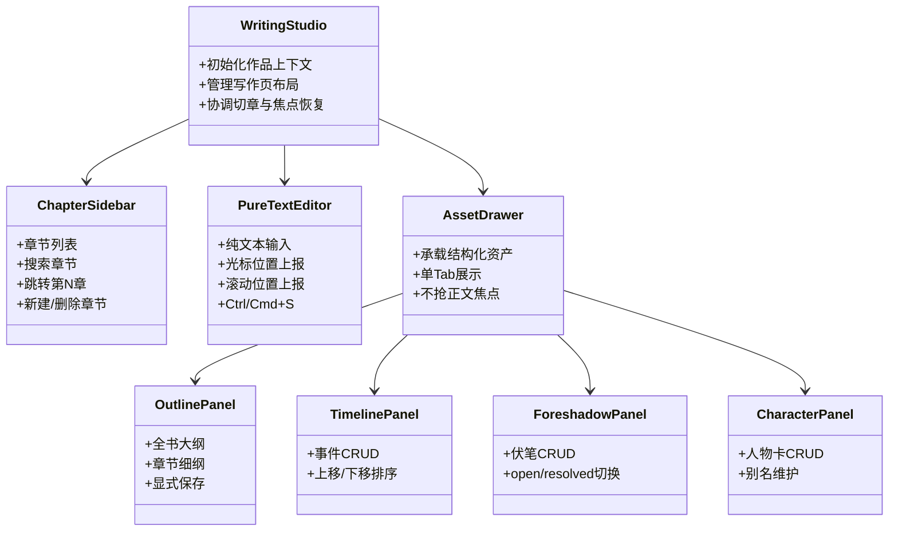
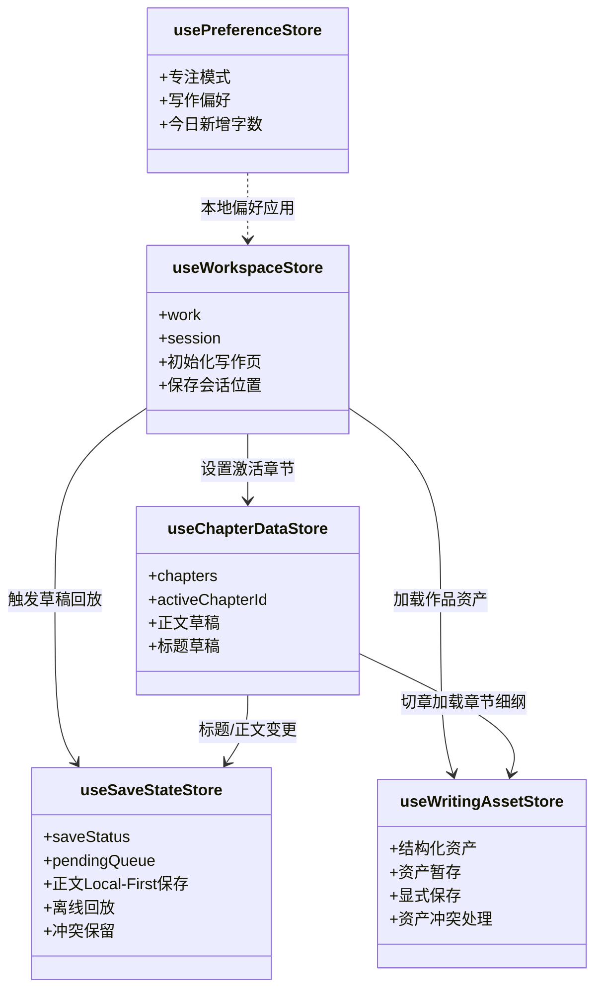
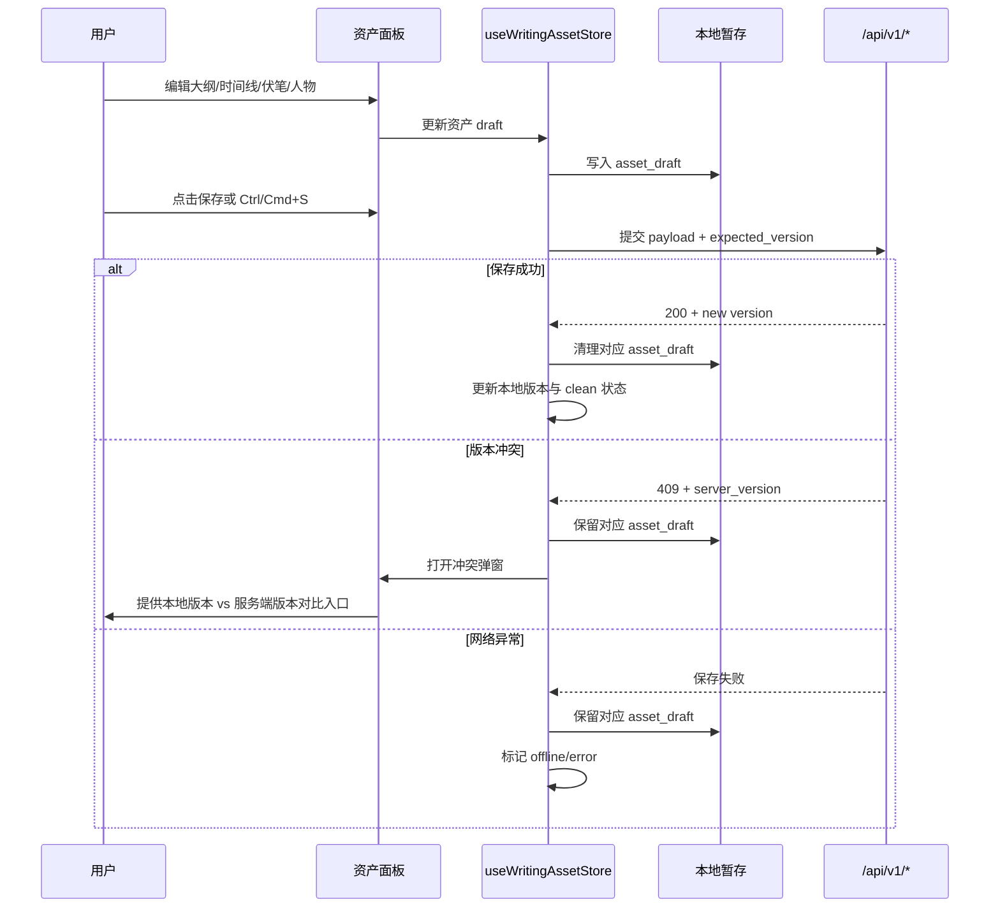
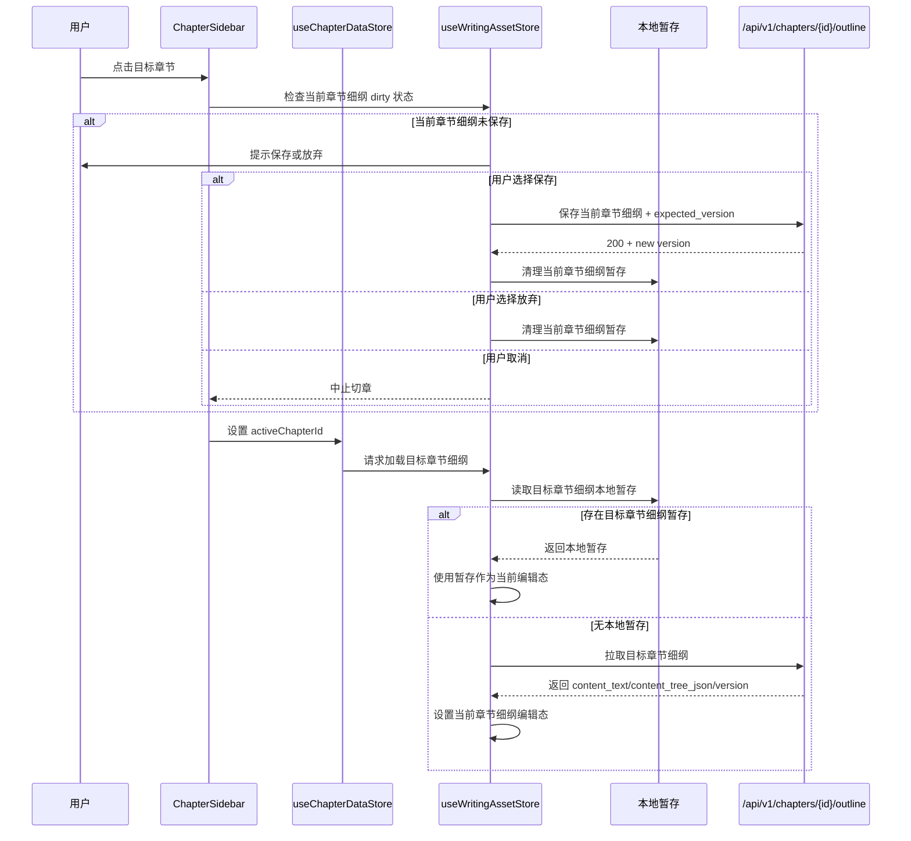

# InkTrace V1.1 详细设计文档

版本：v1.1
更新时间：2026-04-29
依据文档：

- `docs/01_requirements/InkTrace-V1.1-需求规格说明书.md`
- `docs/02_architecture/InkTrace-V1.1-架构设计文档.md`

***

## 1. 设计目标与范围

V1.1 详细设计用于将需求与架构拆解为可开发、可测试的实现规格。

设计目标：

- 固化 Workbench 新域，避免复用 Legacy AI 语义。
- 完成 V1.1-A 写作体验与数据闭环收口。
- 完成 V1.1-B 非 AI 结构化资产能力。
- 为 V1.1-C 可选体验能力预留清晰实现边界。
- 保持 DDD + 清洁架构依赖方向：`Presentation -> Application -> Domain`，`Infrastructure` 作为实现细节。

不在本设计范围：

- AI 调用、Prompt、模型配置、自动生成、自动分析、自动抽取。
- 新增主页面。
- 自动迁移 Legacy 数据。

***

## 2. Workbench / Legacy 实现边界

### 2.1 前端边界

Workbench 主路由：

- `/works`
- `/works/:id`

Legacy 旧 URL 允许通过 router redirect 进入 Workbench，但 Workbench 页面禁止引用 Legacy Store、Legacy UI、Legacy API 封装。

Workbench Store：

- `useWorkspaceStore`
- `useChapterDataStore`
- `useSaveStateStore`
- `useWritingAssetStore`
- `usePreferenceStore`

新增 Store 必须位于 Workbench 语义下，不得放入 Legacy 命名空间。

### 2.2 后端边界

Workbench API 统一挂载：

```text
/api/v1/*
```

Legacy 旧 `/api/*` 不承载 V1.1 新能力。

Workbench 后端模块：

```text
presentation/api/routers/v1/
application/services/v1/
infrastructure/database/repositories/
domain/entities/
```

Domain 层实体禁止依赖 FastAPI、SQLite、HTTP DTO、前端字段名。

***

## 3. 数据库详细设计

### 3.1 表清单

V1.1 Workbench 表：

- `works`
- `chapters`
- `edit_sessions`
- `work_outlines`
- `chapter_outlines`
- `timeline_events`
- `foreshadows`
- `characters`

### 3.2 迁移原则

- 使用 `CREATE TABLE IF NOT EXISTS` 创建新增表。
- 对既有 `works`、`chapters`、`edit_sessions` 做最小兼容迁移。
- 新增结构化资产表不读取、不写入 Legacy 表。
- 所有 `version` 默认值为 `1`。
- 所有时间字段使用 ISO datetime 字符串。

### 3.3 核心表字段规则

#### 通用字段

存储规则：

- `id` 统一使用 UUID 字符串。
- `version` 为资源级自增版本号，每条记录独立维护。
- `created_at` 与 `updated_at` 统一使用 ISO 8601 字符串。
- 时间字段必须统一时区口径，不允许同一部署内混用 UTC 与 `+08:00`。

#### `chapters.title`

存储规则：

- 后端统一存储空字符串，不使用 `NULL`。
- `title` 只保存用户输入的章节标题。
- 禁止写入“第X章”前缀。
- 当前端 `title` 为空时，由 UI 根据 `order_index` 显示“第X章”。

保存规则：

```text
request.title == null      -> 不更新 title
request.title == ""        -> 保存空字符串
request.title == "标题"    -> 保存 "标题"
```

#### `chapters.order_index`

排序规则：

- `order_index` 是章节排序唯一依据。
- 新建章节默认使用 `max(order_index) + 1`。
- 删除章节后必须重排为 `1..N`。
- 调序接口必须一次性提交完整映射列表。

#### `chapters.word_count`

统计规则：

- `word_count` 按正文有效字符数计算，不包含空格、换行符、制表符等不可见字符。
- 持久化 `word_count` 由服务端根据 `content` 重新计算。
- 前端输入过程中的字数仅作为实时展示值，不作为持久化来源。

### 3.4 结构化资产表字段规则

#### `work_outlines`

字段：

```text
id
work_id
content_text
content_tree_json
version
created_at
updated_at
```

规则：

- `work_id` 唯一。
- `content_text` 为唯一真实存储。
- `content_tree_json` 为派生视图缓存，不保证与 `content_text` 强一致同步。
- `content_tree_json` 仅在用户显式保存 outline 时更新，不做自动同步或后台同步。
- `content_tree_json` 节点仅承载视图展示与章节关联字段，不承载 AI 语义字段。
- 若大纲树节点关联章节，关联信息存放在 `content_tree_json` 的节点字段中。
- 删除章节时，仅置空树节点中的章节引用，不删除大纲节点本身。

#### `chapter_outlines`

字段：

```text
id
chapter_id
content_text
content_tree_json
version
created_at
updated_at
```

规则：

- `chapter_id` 唯一。
- `content_text` 为唯一真实存储。
- `content_tree_json` 为派生视图缓存，不保证与 `content_text` 强一致同步。
- `content_tree_json` 仅在用户显式保存 outline 时更新，不做自动同步或后台同步。
- `content_tree_json` 节点仅承载视图展示与章节关联字段，不承载 AI 语义字段。
- 删除章节时，章节细纲整条记录随章节删除。
- 若细纲树节点关联章节，关联信息存放在 `content_tree_json` 的节点字段中。

#### `timeline_events`

字段：

```text
id
work_id
order_index
title
description
chapter_id
version
created_at
updated_at
```

规则：

- `order_index` 是时间线事件排序唯一依据。
- `chapter_id` 可为空。
- 删除章节时，相关事件 `chapter_id` 置空。
- 调序必须单事务批量更新。

#### `foreshadows`

字段：

```text
id
work_id
status
title
description
introduced_chapter_id
resolved_chapter_id
version
created_at
updated_at
```

规则：

- `status` 只允许 `open` 或 `resolved`。
- `introduced_chapter_id` 与 `resolved_chapter_id` 可为空。
- 删除章节时，对应章节引用置空，伏笔记录保留。

#### `characters`

字段：

```text
id
work_id
name
description
aliases_json
version
created_at
updated_at
```

规则：

- `name` 必填。
- `aliases_json` 存储 JSON array 字符串。
- 前端传入 `null` 或空数组时，后端统一存储为 `[]`。
- 重名允许，但前端提示。
- 搜索按 `name` 与 `aliases_json` 匹配，大小写不敏感。

***

## 4. 后端详细设计

### 4.1 Repository 设计

Repository 只负责数据库读写，不包含业务编排。

#### `ChapterRepo`

方法：

```python
list_by_work(work_id: str) -> list[Chapter]
find_by_id(chapter_id: str) -> Chapter | None
save(chapter: Chapter) -> None
delete(chapter_id: str) -> None
reorder(work_id: str, mappings: list[dict]) -> None
normalize_order(work_id: str) -> list[Chapter]
```

约束：

- `list_by_work` 必须按 `order_index ASC` 返回。
- `reorder` 必须在调用方传入的同一事务内批量执行，不得逐条独立 `commit`。

#### `WorkOutlineRepo`

方法：

```python
find_by_work(work_id: str) -> WorkOutline | None
save(outline: WorkOutline) -> None
clear_chapter_refs(work_id: str, chapter_id: str) -> None
delete_by_work(work_id: str) -> None
```

`clear_chapter_refs` 仅处理 `content_tree_json` 中节点字段的章节引用，不删除节点。

#### `ChapterOutlineRepo`

方法：

```python
find_by_chapter(chapter_id: str) -> ChapterOutline | None
save(outline: ChapterOutline) -> None
delete_by_chapter(chapter_id: str) -> None
delete_by_work(work_id: str) -> None
```

#### `TimelineEventRepo`

方法：

```python
list_by_work(work_id: str) -> list[TimelineEvent]
find_by_id(event_id: str) -> TimelineEvent | None
save(event: TimelineEvent) -> None
delete(event_id: str) -> None
reorder(work_id: str, mappings: list[dict]) -> list[TimelineEvent]
clear_chapter_ref(chapter_id: str) -> None
delete_by_work(work_id: str) -> None
```

#### `ForeshadowRepo`

方法：

```python
list_by_work(work_id: str, status: str | None = None) -> list[Foreshadow]
find_by_id(foreshadow_id: str) -> Foreshadow | None
save(foreshadow: Foreshadow) -> None
delete(foreshadow_id: str) -> None
clear_chapter_ref(chapter_id: str) -> None
delete_by_work(work_id: str) -> None
```

#### `CharacterProfileRepo`

方法：

```python
list_by_work(work_id: str, keyword: str = "") -> list[CharacterProfile]
find_by_id(character_id: str) -> CharacterProfile | None
save(character: CharacterProfile) -> None
delete(character_id: str) -> None
delete_by_work(work_id: str) -> None
```

### 4.2 Service 设计

#### `WorkService`

方法：

```python
list_works() -> list[Work]
create_work(title: str, author: str = "") -> Work
get_work(work_id: str) -> Work
update_work(work_id: str, title: str | None, author: str | None) -> Work
delete_work(work_id: str) -> None
```

规则：

- 创建作品必须在同一事务内创建首章。
- 删除作品必须删除章节与所有结构化资产。

#### `ChapterService`

方法：

```python
list_chapters(work_id: str) -> list[Chapter]
create_chapter(work_id: str) -> Chapter
update_chapter(chapter_id: str, title: str | None, content: str | None, expected_version: int | None, force_override: bool = False) -> Chapter
delete_chapter(chapter_id: str) -> str
reorder_chapters(work_id: str, mappings: list[dict]) -> list[Chapter]
```

规则：

- `create_chapter` 默认追加末尾。
- `update_chapter` 同次提交 `title` 与 `content`。
- `title` 为 `None` 时不更新，空字符串时保存空字符串。
- `word_count` 必须在 `update_chapter` 内根据提交后的 `content` 重新计算。
- `expected_version` 不匹配时返回版本冲突。
- `force_override=True` 时以数据库当前版本为基准保存并 `version+1`。
- `delete_chapter` 返回建议激活章节 ID，优先下一章，无下一章则上一章。

#### `SessionService`

方法：

```python
get_session(work_id: str) -> EditSession
save_session(work_id: str, last_open_chapter_id: str, cursor_position: int, scroll_top: int) -> EditSession
```

规则：

- `get_session` 无记录时返回兜底会话，不抛出异常。
- 兜底会话优先指向第一章；作品无章节时 `last_open_chapter_id` 为空。
- `cursor_position` 与 `scroll_top` 无记录时均为 `0`。
- `save_session` 仅保存会话位置，不触发正文保存。

#### `WritingAssetService`

方法：

```python
get_work_outline(work_id: str) -> WorkOutline
save_work_outline(work_id: str, content_text: str, content_tree_json: dict | None, expected_version: int | None, force_override: bool = False) -> WorkOutline
get_chapter_outline(chapter_id: str) -> ChapterOutline
save_chapter_outline(chapter_id: str, content_text: str, content_tree_json: dict | None, expected_version: int | None, force_override: bool = False) -> ChapterOutline

list_timeline_events(work_id: str) -> list[TimelineEvent]
create_timeline_event(work_id: str, payload: dict) -> TimelineEvent
update_timeline_event(event_id: str, payload: dict, expected_version: int | None, force_override: bool = False) -> TimelineEvent
delete_timeline_event(event_id: str) -> None
reorder_timeline_events(work_id: str, mappings: list[dict]) -> list[TimelineEvent]

list_foreshadows(work_id: str, status: str | None = None) -> list[Foreshadow]
create_foreshadow(work_id: str, payload: dict) -> Foreshadow
update_foreshadow(foreshadow_id: str, payload: dict, expected_version: int | None, force_override: bool = False) -> Foreshadow
delete_foreshadow(foreshadow_id: str) -> None

list_characters(work_id: str, keyword: str = "") -> list[CharacterProfile]
create_character(work_id: str, payload: dict) -> CharacterProfile
update_character(character_id: str, payload: dict, expected_version: int | None, force_override: bool = False) -> CharacterProfile
delete_character(character_id: str) -> None
```

规则：

- 所有更新接口携带 `expected_version`。
- `expected_version` 不匹配时抛出 `asset_version_conflict`。
- Timeline 调序必须一次性提交完整映射列表并单事务写入。
- Outline 的 `content_text` 是唯一真实存储，树 JSON 只做派生缓存。

### 4.3 删除章节编排

删除章节必须在单事务中完成：

```text
1. 读取章节与所属 work_id
2. 计算删除后的建议激活章节
3. 删除 chapter_outlines
4. timeline_events.chapter_id 置空
5. foreshadows introduced/resolved 引用置空
6. work_outlines.content_tree_json 中匹配章节引用置空
7. 删除章节
8. 重新规范化章节 order_index
9. 更新作品 word_count
10. commit
```

任一步失败时事务回滚。

***

## 5. API 详细设计

### 5.1 通用响应约定

错误响应：

```json
{
  "detail": "error_code"
}
```

版本冲突：

```json
{
  "detail": "version_conflict",
  "server_version": 4
}
```

前端收到 `409` 后必须保留本地草稿或本地暂存。

错误码规则：

| error_code | HTTP 状态码 |
|---|---:|
| `version_conflict` | 409 |
| `asset_version_conflict` | 409 |
| `work_not_found` | 404 |
| `chapter_not_found` | 404 |
| `asset_not_found` | 404 |
| `invalid_input` | 400 |

冲突处理规则：

- `server_version` 必须返回服务端当前版本。
- 冲突弹窗必须提供本地版本与服务端版本的对比入口。
- 用户选择覆盖保存时，前端使用当前本地内容再次提交，服务端保存成功后返回新版本。
- 用户选择放弃本地时，前端清理对应本地缓存，并重新加载远端内容。
- 用户未完成冲突决策前，禁止清理对应本地缓存。

### 5.2 Works API

#### `PUT /api/v1/works/{work_id}`

Request:

```json
{
  "title": "作品名",
  "author": "作者"
}
```

Response:

```json
{
  "id": "work-id",
  "title": "作品名",
  "author": "作者",
  "word_count": 12000,
  "created_at": "2026-04-29T00:00:00+08:00",
  "updated_at": "2026-04-29T00:00:00+08:00"
}
```

### 5.3 Chapters API

#### `POST /api/v1/works/{work_id}/chapters`

Request:

```json
{
  "title": ""
}
```

Behavior:

- 忽略当前章节位置。
- 使用 `max(order_index)+1` 追加末尾。

#### `PUT /api/v1/chapters/{chapter_id}`

Request:

```json
{
  "title": "",
  "content": "正文",
  "expected_version": 3,
  "force_override": false
}
```

Response:

```json
{
  "id": "chapter-id",
  "work_id": "work-id",
  "title": "",
  "content": "正文",
  "word_count": 2,
  "order_index": 1,
  "version": 4,
  "updated_at": "2026-04-29T00:00:00+08:00"
}
```

#### `PUT /api/v1/works/{work_id}/chapters/reorder`

Request:

```json
{
  "items": [
    { "id": "chapter-a", "order_index": 1 },
    { "id": "chapter-b", "order_index": 2 }
  ]
}
```

Rules:

- 必须一次性提交完整映射列表。
- 后端单事务批量写入。
- 禁止前端逐条提交。
- 禁止后端逐条独立 `commit`。

### 5.4 IO API

#### `POST /api/v1/io/import`

Content-Type:

```text
multipart/form-data
```

Fields:

```text
file: .txt
title?: string
author?: string
```

Rules:

- 文件大小上限 20MB。
- 编码识别顺序：`utf-8-sig -> utf-8 -> gb18030`。
- 空文件成功导入为单章空内容。
- 无章节标记成功导入为单章全文。
- 导入后 `order_index` 必须连续 `1..N`。

#### `GET /api/v1/io/export/{work_id}`

Query:

```text
include_titles=true|false
gap_lines=0|1|2
```

Rules:

- 按 `order_index ASC` 导出。
- 文件名：`{作品名}-{YYYYMMDD}.txt`。
- 空作品导出 0 字节 UTF-8 无 BOM。

### 5.5 Outlines API

#### `PUT /api/v1/works/{work_id}/outline`

Request:

```json
{
  "content_text": "全书大纲文本",
  "content_tree_json": {
    "nodes": [
      {
        "id": "node-1",
        "title": "第一卷",
        "chapter_id": "chapter-id",
        "children": []
      }
    ]
  },
  "expected_version": 1,
  "force_override": false
}
```

Rules:

- `content_text` 为唯一真实存储。
- `content_tree_json` 为派生视图缓存。
- 删除章节时仅置空节点 `chapter_id`，不删除节点。

#### `PUT /api/v1/chapters/{chapter_id}/outline`

Request 与全书大纲一致。

Rules:

- 保存仅影响当前章节细纲。
- 删除章节时删除整条 `chapter_outlines` 记录。

### 5.6 Timeline API

#### `POST /api/v1/works/{work_id}/timeline-events`

Request:

```json
{
  "title": "事件标题",
  "description": "事件描述",
  "chapter_id": "chapter-id"
}
```

Rules:

- 新事件追加到末尾，`order_index=max+1`。
- `chapter_id` 可为空。

#### `PUT /api/v1/timeline-events/{event_id}`

Request:

```json
{
  "title": "事件标题",
  "description": "事件描述",
  "chapter_id": null,
  "expected_version": 1,
  "force_override": false
}
```

#### `PUT /api/v1/works/{work_id}/timeline-events/reorder`

Request:

```json
{
  "items": [
    { "id": "event-a", "order_index": 1 },
    { "id": "event-b", "order_index": 2 }
  ]
}
```

Rules:

- 前端优先提供上移/下移。
- 拖拽为增强交互。
- `items` 数量必须等于当前作品下时间线事件数量。
- 后端必须单事务更新。

### 5.7 Foreshadows API

#### `POST /api/v1/works/{work_id}/foreshadows`

Request:

```json
{
  "title": "伏笔标题",
  "description": "描述",
  "status": "open",
  "introduced_chapter_id": "chapter-id",
  "resolved_chapter_id": null
}
```

Rules:

- `status` 只允许 `open`、`resolved`。
- 列表默认请求 `status=open`。

### 5.8 Characters API

#### `POST /api/v1/works/{work_id}/characters`

Request:

```json
{
  "name": "人物名",
  "description": "人物描述",
  "aliases": ["别名A", "别名B"]
}
```

Rules:

- `name` 必填。
- `aliases` 后端存储为 JSON array。
- 重名允许，前端提示。

***

## 6. 前端详细设计

### 6.1 `WritingStudio.vue`

职责：

- 初始化 work、session、chapters。
- 管理写作页整体布局。
- 连接章节列表、标题输入、正文编辑器、状态条、右侧抽屉。
- 处理新建章节、切章、删除章节后的焦点迁移。

初始化流程：

```text
1. 读取 route.params.id
2. 并行请求 session 与 chapters
3. 加载本地正文草稿
4. 解析 initialChapterId：session.last_open_chapter_id 命中则使用，否则第一章
5. 设置 activeChapterId
6. nextTick 后恢复光标与滚动
7. 若在线，触发正文离线草稿回放
```

### 6.2 `ChapterTitleInput.vue`

Props:

```ts
chapterId: string
orderIndex: number
modelValue: string
```

Emits:

```ts
update:modelValue(title: string)
focus()
blur()
```

Display:

```text
title 非空：第{orderIndex}章 {title}
title 为空：第{orderIndex}章
```

Save:

- 只将用户标题写入 `title`。
- 不保存“第X章”前缀。
- 空标题保存空字符串。

### 6.3 `ChapterSidebar.vue`

新增能力：

- 搜索框。
- 跳转第 N 章输入框。
- 新建章节追加末尾。
- active chapter 变化后 `scrollIntoView`。

搜索规则：

- 搜索只过滤展示。
- 不改变 `chapters` 原数组顺序。
- 创建新章后清空搜索。

跳转规则：

- N 从 1 开始。
- 非数字提示。
- 越界提示。
- 成功后选中章节并滚动到可见区。

### 6.4 `AssetDrawer.vue`

职责：

- 承载 V1.1-B 所有结构化资产模块。
- 同一时间只显示一个 Tab。
- 打开/关闭不主动改变正文焦点。
- 移动端使用覆盖层。

Tabs:

```text
outline
timeline
foreshadow
character
```

### 6.5 `OutlinePanel.vue`

职责：

- 编辑全书大纲。
- 编辑当前章节细纲。
- 显示文本编辑区作为主视图。
- 树状视图作为派生视图缓存。

保存：

- 用户点击保存或 `Ctrl/Cmd+S`。
- 请求携带 `expected_version`。
- 409 弹出资产冲突弹窗。

切换规则：

- 切换当前章节时，章节细纲内容必须同步切换为新章节细纲。
- 当前章节细纲存在未保存编辑时，切换章节前必须提示用户保存或放弃。
- 用户未完成保存或放弃决策前，禁止静默丢弃当前章节细纲暂存。

### 6.6 `TimelinePanel.vue`

职责：

- 事件列表 CRUD。
- 上移/下移排序。
- 关联章节跳转。

排序：

- 前端每次上移/下移后重算完整 `order_index`。
- 点击保存排序时提交完整 `items` 映射。
- V1.1-B 首期不依赖拖拽。

### 6.7 `ForeshadowPanel.vue`

职责：

- 伏笔 CRUD。
- `open/resolved` 切换。
- 引入章节、回收章节引用。

默认视图：

```text
status=open
```

### 6.8 `CharacterPanel.vue`

职责：

- 人物卡 CRUD。
- aliases 逗号输入转换为数组。
- 搜索 `name + aliases`。

重名提示：

- 前端检测同 work 内同名人物。
- 允许继续保存。

***

## 7. Store 详细设计

### 7.1 `useChapterDataStore`

State:

```ts
chapters: Chapter[]
activeChapterId: string
draftByChapterId: Record<string, string>
titleDraftByChapterId: Record<string, string>
searchKeyword: string
```

Getters:

```ts
activeChapter
activeChapterContent
filteredChapters
activeOrderIndex
```

Actions:

```ts
setChapters(chapters)
setActiveChapter(chapterId)
updateChapterDraft(chapterId, content)
updateChapterTitleDraft(chapterId, title)
upsertChapter(chapter)
removeChapter(chapterId)
setSearchKeyword(keyword)
clearSearch()
```

### 7.2 `useSaveStateStore`

State:

```ts
saveStatus: "synced" | "saving" | "offline" | "error"
pendingQueue: Draft[]
retryCount: number
nextRetryAt: string
conflictPayload: object | null
```

Actions:

```ts
upsertDraft(draft)
removeDraft(chapterId)
markSaving()
markSynced()
markOffline()
markError(message)
replayOfflineDrafts()
flushDraftQueue()
```

正文保存队列规则：

- 以 `chapterId` 去重。
- 同章节只保留最新 timestamp。
- 回放时按 timestamp ASC 串行提交。
- 回放遇到 `409` 时保留对应草稿并进入冲突状态，不得继续覆盖该章节远端内容。
- 回放成功前不得删除对应本地草稿。

### 7.3 `useWritingAssetStore`

State:

```ts
activeTab: "outline" | "timeline" | "foreshadow" | "character"
workOutline: WorkOutline | null
chapterOutlineByChapterId: Record<string, ChapterOutline>
timelineEvents: TimelineEvent[]
foreshadows: Foreshadow[]
characters: CharacterProfile[]
assetDrafts: Record<string, object>
assetSaveStatus: Record<string, "clean" | "dirty" | "saving" | "error" | "offline">
assetConflictPayload: object | null
```

Actions:

```ts
loadAssets(workId)
loadChapterOutline(chapterId)
editAssetDraft(key, payload)
saveWorkOutline()
saveChapterOutline(chapterId)
saveTimelineEvent(eventId)
reorderTimelineEvents(items)
saveForeshadow(foreshadowId)
saveCharacter(characterId)
discardAssetDraft(key)
resolveAssetConflict(action)
```

规则：

- 结构化资产不进入正文自动回放队列。
- 离线时允许编辑并写本地暂存。
- 联网后需要用户手动保存。
- 409 保留本地暂存。
- 结构化资产保存成功后必须更新本地版本并清理对应暂存。
- 结构化资产冲突未决策前不得从远端响应覆盖本地暂存。

### 7.4 `usePreferenceStore`

State:

```ts
focusMode: boolean
fontFamily: string
fontSize: number
lineHeight: number
theme: "light" | "dark"
todayWordDelta: number
todayKey: string
```

规则：

- 偏好只存本地。
- 今日新增字数为近似统计，不做服务端强一致校正。

***

## 8. 本地缓存详细设计

### 8.1 Key 设计

正文草稿：

```text
draft:{work_id}:{chapter_id}
```

结构化资产暂存：

```text
asset_draft:work_outline:{work_id}
asset_draft:chapter_outline:{chapter_id}
asset_draft:timeline_event:{event_id}
asset_draft:foreshadow:{foreshadow_id}
asset_draft:character:{character_id}
```

偏好：

```text
preference:{work_id}
today_word_delta:{work_id}:{YYYY-MM-DD}
```

### 8.2 正文草稿 Payload

```json
{
  "workId": "work-id",
  "chapterId": "chapter-id",
  "title": "标题",
  "content": "正文",
  "version": 3,
  "cursorPosition": 10,
  "scrollTop": 200,
  "timestamp": 1714380000000
}
```

### 8.3 结构化资产暂存 Payload

```json
{
  "assetType": "work_outline",
  "assetId": "asset-id",
  "payload": {},
  "version": 1,
  "timestamp": 1714380000000
}
```

### 8.4 容量策略

- 总容量软上限：10MB。
- LRU 淘汰以 `timestamp` 为准。
- 淘汰优先级：结构化资产暂存优先淘汰，正文草稿优先保留。
- 禁止淘汰当前正在编辑的正文草稿。
- 禁止淘汰冲突状态草稿。
- 淘汰结构化资产暂存前必须确认其不是当前打开抽屉正在编辑项。
- 发生缓存淘汰时，必须提示用户“非当前编辑资产已被清理”。

***

## 9. 关键算法伪代码

### 9.1 新建章节追加末尾

```python
def create_chapter(work_id: str) -> Chapter:
    with transaction() as tx:
        work = work_repo.find_by_id(work_id, tx)
        if not work:
            raise ValueError("work_not_found")

        max_order = chapter_repo.max_order_index(work_id, tx) or 0
        chapter = Chapter(
            id=new_uuid(),
            work_id=work_id,
            title="",
            content="",
            order_index=max_order + 1,
            version=1,
        )
        chapter_repo.save(chapter, tx)
        return chapter
```

### 9.2 Timeline 调序

```python
def reorder_timeline_events(work_id: str, items: list[dict]) -> list[TimelineEvent]:
    assert_complete_mapping(work_id, items)
    assert_items_count_equals_current_events(work_id, items)
    assert_continuous_order(items)

    with transaction() as tx:
        for item in items:
            timeline_repo.update_order(
                event_id=item["id"],
                work_id=work_id,
                order_index=item["order_index"],
                tx=tx,
            )
        return timeline_repo.list_by_work(work_id, tx)
```

### 9.3 Outline 清理章节引用

```python
def clear_outline_chapter_refs(work_id: str, chapter_id: str) -> None:
    outline = work_outline_repo.find_by_work(work_id)
    if not outline or not outline.content_tree_json:
        return

    tree = parse_json(outline.content_tree_json)
    for node in walk_nodes(tree):
        if node.get("chapter_id") == chapter_id:
            node["chapter_id"] = None

    outline.content_tree_json = dump_json(tree)
    outline.version += 1
    work_outline_repo.save(outline)
```

### 9.4 字数统计

```typescript
function countEffectiveCharacters(content: string): number {
  return String(content || '').replace(/\s/g, '').length
}
```

今日新增字数基于本地编辑行为计算，为近似统计，不作为强一致数据来源。

***

## 10. 前端交互状态设计

### 10.1 正文保存状态

```text
synced -> input -> saving
saving -> 200 -> synced
saving -> offline -> offline
saving -> 409 -> error + conflict modal
error -> user input -> saving
offline -> online -> replay queue
```

### 10.2 结构化资产保存状态

```text
clean -> edit -> dirty
dirty -> save -> saving
saving -> 200 -> clean
saving -> 409 -> error + asset conflict modal
saving -> offline -> offline
offline -> online -> dirty
dirty -> manual save -> saving
```

### 10.3 快捷键保存

`Ctrl/Cmd+S` 规则：

- 浏览器默认保存页面行为必须被阻止。
- 正文编辑器聚焦时，触发当前章节正文与标题立即 flush。
- 结构化资产编辑区聚焦时，触发当前激活资产保存。
- `Ctrl/Cmd+S` 只保存当前聚焦编辑区，其它未保存项必须保持原状态并显式提示。
- 当前无可保存变更时，不发起远端请求。

### 10.4 切章保护

切章前检查：

```text
if saveStatus == saving:
  flush current draft first
if save failed but local draft exists:
  allow switch
if save failed and local draft missing:
  block switch
```

若正文保存中且当前章节细纲存在未保存编辑，必须优先等待正文保存完成，再处理结构化资产提示。

切章后执行：

```text
set activeChapterId
save session
restore cursor/scroll
scroll chapter item into view
focus editor
```

章节细纲保护：

```text
if current chapter outline is dirty:
  ask user to save or discard first
if user saves successfully:
  continue switch
if user discards:
  clear local outline draft and continue switch
if user cancels:
  keep current chapter active
```

### 10.5 关键设计图

#### 前端组件关系图



#### Store 关系图



#### 结构化资产保存时序图



#### 切章时章节细纲切换时序图



***

## 11. 测试设计

### 11.1 后端测试

必须覆盖：

- Work 创建时自动创建首章。
- Chapter 新建默认追加末尾。
- Chapter title 空字符串保存与展示字段不混淆。
- Chapter `word_count` 由服务端按正文有效字符数重新计算。
- Chapter 乐观锁冲突返回 409。
- 409 响应包含服务端当前 `server_version`。
- Chapter 删除后引用清理。
- Timeline 调序单事务。
- Timeline 调序拒绝缺失、重复、多余事件映射。
- Outline `content_text` 与 `content_tree_json` 存储规则。
- Foreshadow 删除章节后引用置空。
- Character aliases JSON array 存取。
- TXT 导入空文件、无章节标记、编码失败、20MB 上限。

### 11.2 前端测试

必须覆盖：

- 标题输入不保存“第X章”前缀。
- 搜索状态新建章节后清空搜索并定位新章。
- 跳转第 N 章非数字和越界提示。
- active chapter 变化后 `scrollIntoView`。
- 正文输入立即写本地缓存。
- `Ctrl/Cmd+S` 阻止浏览器默认保存，并触发当前上下文保存。
- 409 冲突不清理本地缓存。
- 冲突弹窗展示本地版本与服务端版本，并提供对比入口、覆盖保存与放弃本地决策。
- AssetDrawer 同一时间只打开一个 Tab。
- 打开或关闭 AssetDrawer 不改变正文焦点。
- 切换章节时，未保存章节细纲必须先保存或放弃。
- Timeline 上移/下移后提交完整映射。
- 结构化资产离线不进入自动回放队列。
- 今日新增字数刷新后仍保持本地值。

### 11.3 集成验收

V1.1-A：

- 从书架创建作品，打开写作页，创建章节，输入标题与正文，刷新不丢。
- Web 导入 TXT 后进入写作页，章节顺序连续。
- 导出 TXT 选项生效。

V1.1-B：

- 创建大纲、时间线、伏笔、人物卡，刷新后数据仍在。
- 删除章节后，细纲删除，时间线/伏笔/大纲节点引用置空。
- 结构化资产 409 冲突要求用户决策。

V1.1-C：

- 专注模式切换不丢稿。
- 偏好本地持久化。
- 立即同步触发正文 flush。

***

## 12. 实施顺序

### 12.1 V1.1-A

1. Works 更新接口与书架更多菜单。
2. 写作页 Header、标题输入框、正文区去噪。
3. 新建章节追加末尾。
4. 章节搜索、跳转第 N 章、激活项可见。
5. Web TXT 上传导入。
6. TXT 导出格式选项。
7. 本地缓存与保存链路回归测试。

### 12.2 V1.1-B

1. 新增结构化资产表与 Repository。
2. 新增 WritingAssetService。
3. 新增 Outlines API 与面板。
4. 新增 Timeline API 与面板。
5. 新增 Foreshadow API 与面板。
6. 新增 Characters API 与面板。
7. 删除章节引用清理。
8. 结构化资产冲突与离线暂存。

### 12.3 V1.1-C

1. 专注模式。
2. 写作偏好本地持久化。
3. 今日新增字数近似统计。
4. 立即同步按钮。

***

## 13. 复杂度约束执行清单

- [ ] 不新增需求文档之外的核心实体。
- [ ] 不新增主页面。
- [ ] 结构化资产只通过右侧抽屉承载。
- [ ] 不新增 AI 入口。
- [ ] 不复用 Legacy Store、Legacy UI、Legacy Service。
- [ ] 新能力落入 Workbench DDD 分层。
