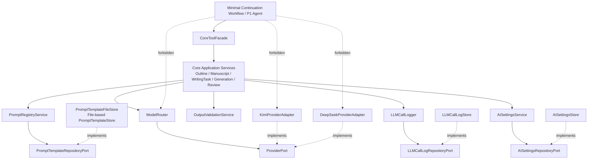
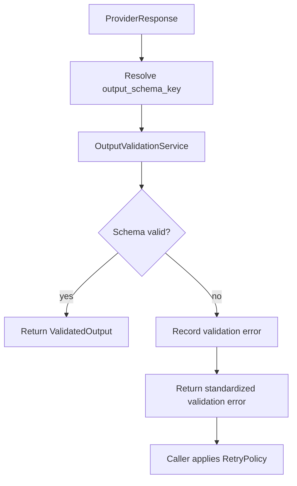
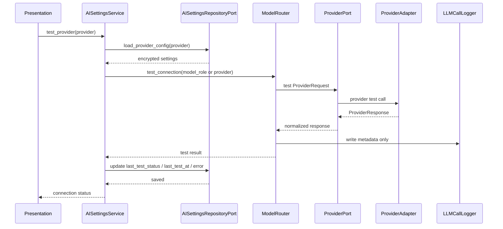
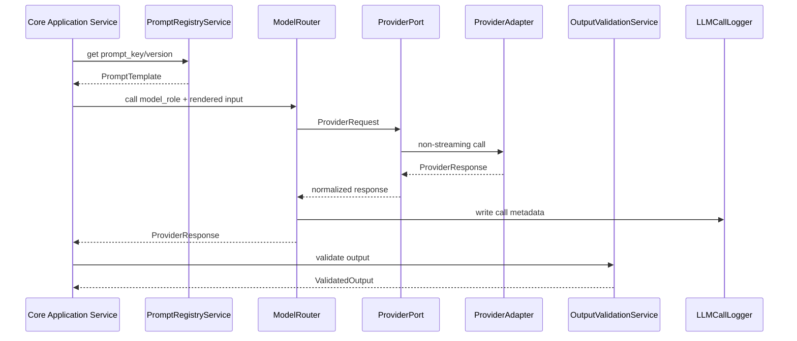
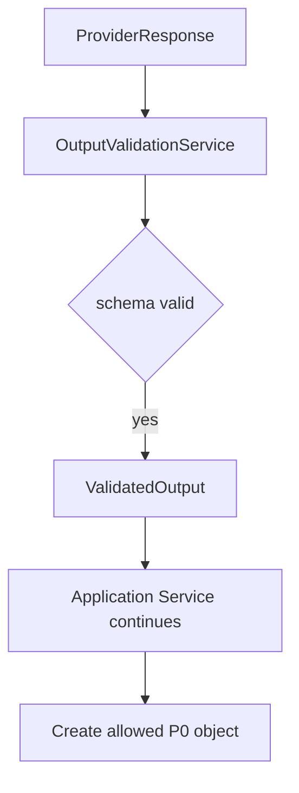
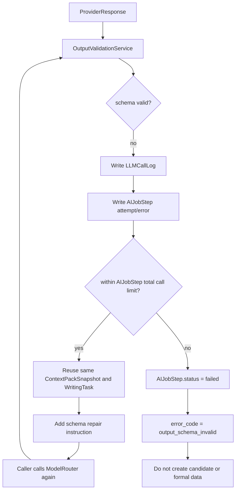
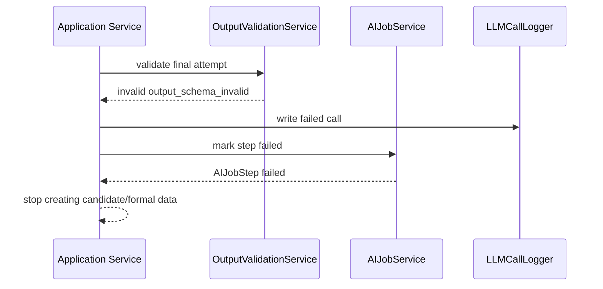

# InkTrace V2.0-P0-01 AI 基础设施详细设计

版本：v2.0-p0-detail-01  
状态：P0 模块级详细设计  
依据文档：

- `docs/01_requirements/InkTrace-V2.0-需求规格说明书.md`
- `docs/07_overview/InkTrace-V2.0-概要设计说明书.md`
- `docs/02_architecture/InkTrace-V2.0-架构设计说明书.md`
- `docs/03_design/InkTrace-V2.0-P0-详细设计总纲.md`

说明：用户输入中的概要设计与架构设计路径为逻辑引用，本文档使用仓库中实际存在的冻结文档路径。

---

## 一、文档定位与设计范围

### 1.1 文档定位

本文档是 InkTrace V2.0-P0 的第一个模块级详细设计文档，仅覆盖 P0 AI Infrastructure。

本文档用于指导后续实现设计、开发计划与 Task 拆分，但本文档本身不写代码、不生成数据库迁移、不拆 Task、不进入开发计划。

### 1.2 设计范围

本模块覆盖：

- AI Settings。
- AISettingsRepositoryPort。
- AISettingsStore。
- Provider 抽象。
- ProviderPort。
- KimiProviderAdapter。
- DeepSeekProviderAdapter。
- Model Router。
- ModelRoleConfig。
- Prompt Registry。
- PromptTemplate。
- PromptTemplateRepositoryPort。
- Output Validator。
- OutputValidationService。
- RetryPolicy，P0 最小策略。
- LLM Call Log。
- LLMCallLogRepositoryPort。
- LLMCallLogger。
- 基础 token usage / elapsed time 记录。
- Provider 连接测试能力。
- P0 非流式输出默认策略。

### 1.3 本文档不覆盖

本文档不覆盖：

- AI Job System 的完整详细设计。
- 初始化流程的完整详细设计。
- Story Memory / Story State 的完整详细设计。
- Vector Recall 的完整详细设计。
- Context Pack 的完整详细设计。
- Tool Facade 与权限矩阵的完整详细设计。
- Minimal Continuation Workflow 的完整详细设计。
- Candidate Draft 与 Human Review Gate 的完整详细设计。
- AI Review 的完整详细设计。
- API 与前端交互的完整详细设计。
- 完整 Agent Runtime。
- AgentSession / AgentStep / AgentObservation / AgentTrace 完整能力。
- 五 Agent Workflow。
- 成本看板、分析看板、Style DNA、Citation Link、@ 标签引用系统、自动连续续写队列。

---

## 二、P0 AI 基础设施目标

### 2.1 模块目标

P0 AI 基础设施为 V2.0 最小 AI 闭环提供模型调用底座。

目标：

- 允许用户配置 Kimi / DeepSeek。
- 允许系统测试 Provider 连接。
- 通过 ProviderPort 隔离外部模型 SDK。
- 通过 ModelRouter 按 `model_role` 选择模型。
- 通过 PromptRegistry 管理 Prompt 模板、版本和输出 schema。
- 通过 OutputValidator 校验结构化输出。
- 通过 RetryPolicy 约束 schema 校验失败后的重试行为。
- 通过 LLMCallLog 记录模型调用元数据、错误与耗时。
- 保证普通日志不记录 API Key、完整正文、完整 Prompt。

### 2.2 与 P0 主链路的关系

AI 基础设施被以下 P0 模块调用：

- OutlineAnalysisService 调用模型执行大纲分析。
- ManuscriptAnalysisService 调用模型执行正文分析。
- WritingTaskService 调用模型生成写作任务。
- WritingGenerationService 调用模型生成候选正文。
- ReviewService 调用模型生成基础审稿结果。
- Quick Trial 流程调用模型生成非正式临时候选稿。

### 2.3 基础原则

- AI Infrastructure 属于 Core Application + Infrastructure Adapter 的基础能力。
- ModelRouter 只能由 Core Application Service 调用。
- Workflow / Agent 不能直接调用 ModelRouter。
- Workflow / Agent 不能直接调用 Provider SDK。
- Workflow / Agent 不能直接访问数据库、Repository、Vector DB、Embedding 或 Infrastructure。
- Provider SDK 只能被 Infrastructure Adapter 封装。
- 业务服务不能硬编码 Kimi / DeepSeek。
- 所有模型调用必须通过 ModelRouter 按 `model_role` 路由。
- Prompt 不能承载越权业务规则。
- OutputValidator schema 校验失败时，不得进入正式数据或候选数据。

---

## 三、模块边界与不做事项

### 3.1 P0 做什么

P0 AI 基础设施必须完成：

- Provider 配置读取与保存。
- API Key 加密存储原则定义。
- Provider 连接测试。
- ProviderPort 标准化请求与响应。
- Kimi / DeepSeek Adapter 封装。
- ModelRoleConfig 路由配置。
- ModelRouter 按任务角色选择 Provider 与模型。
- PromptTemplate 按 `prompt_key` / `prompt_version` 获取。
- PromptTemplate 与 `model_role`、`output_schema_key` 绑定。
- OutputValidationService 校验结构化输出。
- schema 校验失败最多 2 次重试。
- LLMCallLog 记录调用元数据、耗时、token usage、错误。
- P0 默认非流式输出。

### 3.2 P0 不做什么

P0 AI 基础设施不做：

- 成本看板。
- 分析看板。
- 完整 Agent Trace。
- Prompt 在线编辑后台。
- Prompt A/B 实验。
- 多 Provider 动态负载均衡。
- 自动成本优化。
- 用户级模型市场。
- 流式 token 输出。
- 自动连续续写队列。
- 完整 Agent Runtime。

### 3.3 禁止调用路径

禁止：

- Workflow / Agent -> ModelRouter。
- Workflow / Agent -> Provider SDK。
- Workflow / Agent -> ProviderAdapter。
- Workflow / Agent -> AISettingsStore。
- Workflow / Agent -> PromptTemplateRepositoryPort。
- Workflow / Agent -> LLMCallLogRepositoryPort。
- Workflow / Agent -> Database。
- Workflow / Agent -> Vector DB。

允许：

- Workflow / Agent -> CoreToolFacade -> Core Application Service -> ModelRouter -> ProviderPort -> ProviderAdapter。

---

## 四、总体架构

### 4.1 模块关系说明

AI 基础设施跨越 Application 与 Infrastructure 两层。

Application 层包含：

- AISettingsService。
- ModelRouter。
- PromptRegistryService。
- OutputValidationService。
- LLMCallLogger。
- ProviderPort。
- AISettingsRepositoryPort。
- PromptTemplateRepositoryPort。
- LLMCallLogRepositoryPort。

Infrastructure 层包含：

- AISettingsStore。
- KimiProviderAdapter。
- DeepSeekProviderAdapter。
- PromptTemplateFileStore，或文件型 PromptTemplateStore。
- LLMCallLogStore。

Application 依赖 Ports。Infrastructure Adapters 使用虚线 `implements` 实现 Ports。

### 4.2 模块关系图



### 4.3 Application / Ports / Infrastructure Adapter 依赖方向

规则：

- Application Service 使用实线依赖 Application Ports / Interfaces。
- Infrastructure Adapters 使用虚线 `implements` 指向 Application Ports / Interfaces。
- Infrastructure 可依赖 Domain 模型进行映射，但不得承载或修改 Domain 业务规则。
- Domain 不依赖 Infrastructure。

### 4.4 禁止调用路径说明

ModelRouter 是 Core Application 层能力，不是 Agent / Workflow 工具。

Workflow 或 Agent 必须通过 CoreToolFacade 触发具体 Application Use Case；具体 Application Service 再根据任务角色调用 ModelRouter。

---

## 五、AI Settings 详细设计

### 5.1 AISettingsService 职责

AISettingsService 负责 AI Provider 配置的应用层管理。

职责：

- 保存 Provider 配置。
- 读取 Provider 配置。
- 更新 API Key。
- 标记 Provider 启用状态。
- 维护默认模型配置。
- 维护 ModelRoleConfig。
- 发起 Provider 连接测试。
- 保证 API Key 不进入普通日志。

不允许：

- 不直接调用 Kimi / DeepSeek SDK。
- 不直接写普通日志输出 API Key。
- 不承载模型路由策略之外的业务规则。
- 不替代 ModelRouter 执行模型调用。

### 5.2 AISettingsRepositoryPort

AISettingsRepositoryPort 是 Application Port。

职责：

- 持久化 AI Settings。
- 持久化 Provider 配置。
- 持久化 ModelRoleConfig。
- 读取启用状态与模型配置。
- 支持 Provider 连接测试所需配置读取。

约束：

- AISettingsService 依赖 AISettingsRepositoryPort。
- AISettingsStore 实现 AISettingsRepositoryPort。
- 禁止 AISettingsStore 实现 WorkRepositoryPort。
- 禁止出现 Settings -> WorkRepositoryPort 关系。

### 5.3 AISettingsStore

AISettingsStore 属于 Infrastructure Adapter。

职责：

- 实现 AISettingsRepositoryPort。
- 完成配置的持久化读写。
- 处理 API Key 的加密写入与解密读取。
- 不在普通日志记录解密后的 API Key。

边界：

- AISettingsStore 不承载路由决策。
- AISettingsStore 不调用 Provider SDK。
- AISettingsStore 不处理 Prompt。
- AISettingsStore 不处理 LLMCallLog。

### 5.4 API Key 加密存储原则

规则：

- API Key 必须加密存储。
- API Key 不得写入普通日志。
- API Key 不得写入 LLMCallLog。
- API Key 不得出现在错误响应中。
- API Key 展示时必须脱敏。

P0 只定义加密存储原则；具体加密方案在实现阶段或安全详细设计中确定。

### 5.5 Provider 配置

P0 Provider 配置至少支持：

- provider 名称。
- enabled 状态。
- encrypted_api_key。
- default_model。
- timeout。
- base_url，可选。
- last_test_status。
- last_test_at。
- last_test_error_code，可选。
- last_test_error_message，可选，必须脱敏。

### 5.6 ModelRoleConfig 配置

ModelRoleConfig 用于声明 `model_role` 到 provider / model 的映射。

P0 默认 `model_role`：

| model_role | 默认倾向 | 用途 |
|---|---|---|
| outline_analyzer | Kimi | 大纲分析 |
| manuscript_analyzer | Kimi | 正文分析 |
| memory_extractor | Kimi | 记忆抽取 |
| planner | Kimi | Writing Task / 规划 |
| writer | DeepSeek | 续写候选正文 |
| reviewer | Kimi | 审稿 |
| quick_trial_writer | DeepSeek | 快速试写候选正文 |

### 5.7 Provider 连接测试

连接测试由 AISettingsService 发起，固定路径为：

```text
AISettingsService
  -> ModelRouter.test_connection(...)
  -> ProviderPort.test_connection(...)
  -> ProviderAdapter
```

连接测试不得绕过 ModelRouter 直接调用 ProviderPort。

连接测试必须：

- 使用脱敏日志。
- 不记录完整测试 Prompt。
- 不记录 API Key。
- 不记录完整响应正文。
- 不创建 Candidate Draft。
- 不创建 Review Report。
- 不进入 Story Memory。
- 不影响 V1.1 写作能力。
- 测试成功和测试失败都必须写回 AISettingsRepositoryPort。
- 测试完成后更新 last_test_status、last_test_at。
- 测试失败时更新 last_test_error_code、last_test_error_message，可选，错误信息必须脱敏。
- 服务重启后，上次测试状态必须可读取。
- last_test_status 只表示最近一次连接测试结果，不代表 Provider 当前实时可用。
- 连接测试不得创建 StoryState 或任何正式数据。

---

## 六、Provider 抽象详细设计

### 6.1 ProviderPort 职责

ProviderPort 是外部模型能力的 Application Port。

职责：

- 接收标准 ProviderRequest。
- 返回标准 ProviderResponse。
- 隔离不同 Provider SDK 差异。
- 统一错误码方向。
- 支持非流式模型调用。
- 支持连接测试。

### 6.2 ProviderRequest 概念字段

ProviderRequest 概念字段：

| 字段 | 说明 |
|---|---|
| provider | Provider 名称 |
| model | 模型名称 |
| model_role | 任务角色 |
| prompt_key | Prompt Key |
| prompt_version | Prompt 版本 |
| input_messages | 模型输入消息，普通日志不得完整记录 |
| temperature | 温度 |
| max_tokens | 最大输出 token |
| timeout | 超时时间 |
| output_schema_key | 结构化输出 schema |
| request_id | 单次请求 ID |
| trace_id | 调用链追踪 ID |

### 6.3 ProviderResponse 概念字段

ProviderResponse 概念字段：

| 字段 | 说明 |
|---|---|
| provider | Provider 名称 |
| model | 模型名称 |
| raw_text | 模型原始输出，普通日志不得完整记录 |
| parsed_output | 结构化结果，可为空 |
| token_usage | token 使用量 |
| elapsed_ms | 耗时 |
| finish_reason | 完成原因 |
| request_id | 请求 ID |
| error_code | 错误码 |
| error_message | 错误信息，必须脱敏 |

### 6.4 KimiProviderAdapter

KimiProviderAdapter 属于 Infrastructure Adapter。

职责：

- 封装 Kimi SDK / HTTP 调用。
- 实现 ProviderPort。
- 将 ProviderRequest 转换为 Kimi 请求。
- 将 Kimi 响应转换为 ProviderResponse。
- 统一处理 Kimi 鉴权失败、限流、超时、服务不可用。

Kimi 默认适合：

- 大纲分析。
- 正文分析。
- 摘要。
- 记忆抽取。
- 规划。
- Writing Task。
- 审稿。
- 结构化输出。

### 6.5 DeepSeekProviderAdapter

DeepSeekProviderAdapter 属于 Infrastructure Adapter。

职责：

- 封装 DeepSeek SDK / HTTP 调用。
- 实现 ProviderPort。
- 将 ProviderRequest 转换为 DeepSeek 请求。
- 将 DeepSeek 响应转换为 ProviderResponse。
- 统一处理 DeepSeek 鉴权失败、限流、超时、服务不可用。

DeepSeek 默认适合：

- 续写。
- 改写。
- 润色。
- 对白。
- 场景生成。
- 修订。

### 6.6 Provider 错误码方向

Provider 错误码方向：

| error_code | 含义 |
|---|---|
| provider_key_missing | Provider Key 未配置 |
| provider_auth_failed | Provider 鉴权失败 |
| provider_timeout | Provider 超时 |
| provider_rate_limited | Provider 限流 |
| provider_unavailable | Provider 服务不可用 |
| provider_empty_response | Provider 返回空内容 |
| provider_invalid_response | Provider 返回不可处理内容 |
| provider_unknown_error | Provider 未分类错误 |

### 6.7 非流式输出默认策略

P0 默认不启用流式输出。

规则：

- 只展示 AI Job 步骤进度。
- 模型完成后一次性返回 ProviderResponse。
- 续写生成完成后一次性创建 Candidate Draft。
- 审稿在候选稿完整生成后触发。
- 不设计 streaming_draft。
- 不设计 partial_content。
- 不要求前端候选稿区支持 token streaming。

流式输出不属于 P0；如后续需要，应在 P1 / P2 或单独变更评审中重新设计。

---

## 七、Model Router 详细设计

### 7.1 ModelRouter 职责

ModelRouter 属于 Core Application 层。

职责：

- 根据 `model_role` 读取 ModelRoleConfig。
- 选择 provider 与 model。
- 构建 ProviderRequest。
- 调用 ProviderPort。
- 返回 ProviderResponse。
- 在调用前后协助记录 LLMCallLog。

不允许：

- 不承载业务规则。
- 不判断 AI 是否可以合并正式正文。
- 不绕过 Human Review Gate。
- 不直接读取数据库。
- 不被 Workflow / Agent 直接调用。

### 7.2 model_role 路由规则

规则：

- Core Application Service 只提交 `model_role`。
- 业务服务不得写死 Kimi / DeepSeek。
- ModelRouter 通过 ModelRoleConfig 获取 provider / model。
- ModelRoleConfig 缺失时返回 `model_role_config_missing`。
- Provider 未启用时返回 `provider_disabled`。
- Provider Key 未配置时返回 `provider_key_missing`。

### 7.3 Kimi / DeepSeek 默认分工

| 能力 | 默认 model_role | 默认 Provider 倾向 |
|---|---|---|
| 大纲分析 | outline_analyzer | Kimi |
| 正文分析 | manuscript_analyzer | Kimi |
| 记忆抽取 | memory_extractor | Kimi |
| 写作任务规划 | planner | Kimi |
| 单章候选续写 | writer | DeepSeek |
| 快速试写 | quick_trial_writer | DeepSeek |
| 审稿 | reviewer | Kimi |

### 7.4 fallback 策略边界

P0 fallback 只做最小设计：

- ModelRoleConfig 可配置备用 provider / model。
- 主 provider 调用失败时，是否启用 fallback 由配置决定。
- fallback 不得改变任务语义。
- fallback 失败后按原错误处理进入 failed。
- fallback 的每次调用都必须写入 LLMCallLog。

P0 不做：

- 自动成本优化 fallback。
- 多模型投票。
- 并发请求竞速。
- Agent 自主选择模型。

### 7.5 业务服务不能硬编码 Provider 的原因

业务服务硬编码 Provider 会导致：

- Kimi / DeepSeek 分工无法调整。
- 调用日志难以统一。
- Prompt 版本与模型角色难以追踪。
- Provider 迁移需要改业务代码。
- Agent / Workflow 边界容易被绕开。

因此业务服务只能使用 `model_role` 触发 ModelRouter。

### 7.6 Workflow / Agent 不能直接调用 ModelRouter

Workflow / Agent 只能通过 CoreToolFacade 触发受控 Application Use Case。

原因：

- ModelRouter 不执行 Human Review Gate。
- ModelRouter 不判断正式数据边界。
- ModelRouter 不知道业务用例语义。
- 直接调用会绕过 Tool 权限与 Application Service。

### 7.7 WritingTaskService 调用边界

WritingTaskService 可通过 ModelRouter 使用 `planner` 角色生成 Writing Task。

边界：

- Workflow 必须通过 CoreToolFacade 的 `create_writing_task` Tool 触发 WritingTaskService。
- Workflow 不得直接调用 WritingTaskService。
- Workflow 不得直接调用 ModelRouter。
- WritingTaskService 不创建正式章节。
- WritingTaskService 不写正式正文。
- WritingTaskService 不绕过 Human Review Gate。

---

## 八、Prompt Registry 详细设计

### 8.1 PromptRegistryService 职责

PromptRegistryService 属于 Core Application / AI Infrastructure。

职责：

- 根据 `prompt_key` / `prompt_version` 获取 PromptTemplate。
- 校验 PromptTemplate 是否启用。
- 校验 PromptTemplate 绑定的 `model_role`。
- 校验 PromptTemplate 绑定的 `output_schema_key`。
- 为 Application Service 提供 Prompt 渲染输入。

### 8.2 PromptTemplate

PromptTemplate 是 Prompt 模板定义。

概念字段方向：

| 字段 | 说明 |
|---|---|
| prompt_key | Prompt 唯一键 |
| prompt_version | Prompt 版本 |
| model_role | 绑定模型角色 |
| output_schema_key | 输出 schema key |
| template_text | Prompt 模板正文，普通日志不得完整记录 |
| enabled | 是否启用 |
| created_at | 创建时间 |
| updated_at | 更新时间 |

### 8.3 PromptTemplateRepositoryPort

PromptTemplateRepositoryPort 是 Application Port。

职责：

- 按 prompt_key / prompt_version 查询 PromptTemplate。
- 查询默认启用版本。
- 支持 PromptTemplate 最小版本治理。

### 8.4 P0 PromptTemplate 存储方式

P0 默认采用文件管理 PromptTemplate 的方式。

规则：

- PromptTemplate 推荐使用 YAML 或 JSON 文件。
- PromptTemplate 文件随代码仓库版本管理。
- P0 不使用数据库表管理 PromptTemplate。
- P0 不提供在线 Prompt 编辑后台。
- P0 不使用代码内硬编码 Prompt 作为主要方案。
- PromptTemplateRepositoryPort 在 P0 可由 PromptTemplateFileStore 实现。
- PromptTemplateFileStore 属于 Infrastructure Adapter。
- PromptTemplateFileStore 按 prompt_key / prompt_version 加载 PromptTemplate 文件。
- Prompt 版本随代码提交走，不做运行时动态治理。
- P1 / P2 可扩展为数据库表、后台治理、Prompt 版本管理与灰度发布。

### 8.5 prompt_key

P0 prompt_key 示例方向：

| prompt_key | 用途 |
|---|---|
| outline_analysis_p0 | 大纲分析 |
| manuscript_chapter_analysis_p0 | 正文章节分析 |
| memory_extract_p0 | P0 记忆抽取 |
| writing_task_p0 | Writing Task |
| continuation_writer_p0 | 单章续写 |
| quick_trial_writer_p0 | 快速试写 |
| review_candidate_p0 | 候选稿审稿 |

### 8.6 prompt_version

规则：

- PromptTemplate 必须有版本。
- LLMCallLog 必须记录 prompt_version。
- P0 不做 Prompt A/B 实验。
- P0 不做在线 Prompt 编辑后台。
- Prompt 版本变更不得破坏 output_schema_key 兼容性。

### 8.7 model_role 与 output_schema_key 绑定

规则：

- PromptTemplate 必须绑定 model_role。
- 结构化输出 Prompt 必须绑定 output_schema_key。
- 非结构化续写 Prompt 也必须声明输出类型。
- OutputValidator 根据 output_schema_key 校验输出。

### 8.8 Prompt 不能承载越权业务规则

Prompt 只能约束模型输出格式、任务目标和风格要求。

Prompt 不得承载：

- 绕过 Human Review Gate 的规则。
- 直接合并正式正文的规则。
- 直接覆盖正式资产的规则。
- 直接写正式 Story Memory 的规则。
- Agent 权限策略。

正式业务边界必须由 Domain Policy / Application Service / Tool Facade 约束。

---

## 九、Output Validator 详细设计

### 9.1 OutputValidationService 职责

OutputValidationService 属于 Core Application 层。

职责：

- 根据 output_schema_key 获取 schema。
- 校验模型输出结构。
- 返回 validation success / failed。
- 标准化校验错误。
- 将失败信息交给 AIJobStep 与 LLMCallLog 记录。

边界：

- OutputValidationService 负责输出校验与错误标准化。
- P0 默认 RetryPolicy 由调用方 Application Service 或统一调用编排逻辑执行。
- OutputValidationService 不直接负责模型重试编排。
- OutputValidationService 不调用 ModelRouter。

### 9.2 schema registry

schema registry 用于管理结构化输出 schema。

P0 默认采用 Pydantic Model 作为 schema registry 实现方向：

- `output_schema_key` 映射到具体 Pydantic Model。
- OutputValidationService 根据 `output_schema_key` 获取对应 Pydantic Model 并执行校验。
- JSON Schema 可由 Pydantic 导出，供文档和调试使用。
- P0 不使用数据库表保存 schema。
- P0 不提供 schema 在线编辑能力。
- 文件型 schema 作为 P1 / P2 扩展，不作为 P0 默认。
- schema registry 必须支持按 `output_schema_key` 加载。
- schema 缺失时返回 `output_schema_missing`。
- schema 校验失败时返回 `output_schema_invalid`。
- schema registry 不承载业务权限规则，只负责输出结构约束。

P0 schema 方向：

- 大纲分析输出 schema。
- 正文章节分析输出 schema。
- P0 记忆抽取输出 schema。
- Writing Task 输出 schema。
- Review Report 输出 schema。

续写正文可以是非 JSON 文本，但仍需通过输出类型校验：

- 内容非空。
- 文本长度在合理范围内。
- 不包含明显 Provider 错误文本。
- 不得直接进入正式正文。

### 9.3 校验流程



### 9.4 OutputValidator 重试策略，P0 默认

规则：

- schema 校验失败默认最多重试 2 次。
- 总调用次数 = 首次调用 + 2 次重试。
- 重试时不重新构建 Context Pack。
- 重试时沿用同一个 ContextPackSnapshot。
- 重试时沿用同一个 WritingTask。
- 重试时重新调用模型。
- 重试 Prompt 可以附加 schema 修复提示，例如“必须返回合法 JSON / 必须符合 schema”。
- 每次失败写入 LLMCallLog。
- 每次失败写入 AIJobStep attempt / error。
- 超过最大重试次数后，AIJobStep.status = failed。
- 超过最大重试次数后，error_code = output_schema_invalid。
- 超过最大重试次数后，不得创建候选数据或正式数据。
- schema 重试由调用方 Application Service 或统一调用编排逻辑执行，OutputValidationService 只返回校验结果与标准化错误。

### 9.5 Provider 调用重试与 OutputValidator 重试边界

Provider 调用重试与 OutputValidator 重试是两个不同机制，不得混为一谈。

Provider 调用重试：

- 属于网络 / 服务层重试。
- P0 默认 Provider 调用重试最多 1 次。
- 即首次 Provider 调用失败后，可再重试 1 次。
- 仅适用于 `provider_timeout`、`provider_rate_limited`、`provider_unavailable`。
- `provider_auth_failed`、`provider_key_missing`、`provider_disabled` 不重试。

OutputValidator 重试：

- 属于输出质量 / schema 修复重试。
- schema 校验失败默认最多重试 2 次。
- 即首次生成 + 2 次 schema 修复重试。
- 重试时沿用同一个 ContextPackSnapshot 与 WritingTask。
- 重试时重新调用模型。

总调用上限：

- P0 必须设置单个 AIJobStep 的模型调用总上限。
- P0 单个 AIJobStep 总 Provider 调用次数上限为 3 次。
- 该上限与 OutputValidator 策略保持一致：首次调用 + 2 次 schema 修复重试。
- Provider 层重试不得突破该总上限。
- 如果某次调用发生 provider_timeout 并消耗 retry attempt，也必须计入同一个 AIJobStep 的 attempt / LLMCallLog。
- Provider retry 与 schema retry 必须共享 trace_id。
- 每次 retry attempt 必须记录 request_id / trace_id / attempt_no。
- 超过总调用上限后，AIJobStep.status = failed。
- 超过总调用上限后，error_code 使用最后一次失败原因；如果最后失败是 schema，使用 `output_schema_invalid`。
- 超过总调用上限后，不得创建候选数据或正式数据。
- P1 / P2 如需更复杂 RetryPolicy，必须单独扩展；P0 策略必须简单、可控、可验收。

### 9.6 不同任务失败差异

| 任务类型 | schema / 输出校验失败后的行为 |
|---|---|
| 续写生成 | 不创建 CandidateDraft；continuation Job failed |
| 快速试写 | 不创建 CandidateDraft 或临时候选区内容；Quick Trial failed |
| 审稿 | CandidateDraft 可保留；ReviewReport 不创建，或候选稿标记 review_failed；用户可手动决定是否使用候选稿 |
| 正文分析某章 | 该章节 AIJobStep failed；允许跳过或重试；不必整书初始化失败，除非失败比例超过后续详细设计设定阈值 |
| 大纲分析 | OutlineAnalysisResult 不创建；初始化 Job failed 或等待重试 |
| Writing Task | WritingTask 不创建；续写流程 blocked |

### 9.7 与 AIJobStep / LLMCallLog 的关系

OutputValidationService 不直接吞掉错误。

每次失败必须传递给：

- AIJobStep：记录 attempt、error_code、error_message、status。
- LLMCallLog：记录调用元数据、错误、耗时、token usage。

### 9.8 超过最大重试次数后的禁止行为

禁止：

- 创建 CandidateDraft。
- 创建 ReviewReport。
- 创建 WritingTask。
- 创建正式正文。
- 更新正式资产。
- 更新正式 Story Memory。
- 更新正式 StoryState。

---

## 十、LLM Call Log 详细设计

### 10.1 LLMCallLog 职责

LLMCallLog 用于记录模型调用元数据、错误、token 使用量和耗时。

LLMCallLog 是追踪与排障基础，不是普通日志，不是完整 Prompt 存档，不是完整正文存档。

### 10.2 LLMCallLog 字段方向

LLMCallLog 至少记录：

| 字段 | 说明 |
|---|---|
| prompt_key | Prompt Key |
| prompt_version | Prompt 版本 |
| model_role | 模型角色 |
| provider | Provider |
| model | 模型名称 |
| context_pack_snapshot_id | Context Pack 快照 ID，可为空 |
| output_schema_key | 输出 schema key |
| request_id | 单次请求 ID |
| trace_id | 调用链追踪 ID |
| token_usage | token 使用量 |
| elapsed_ms | 耗时 |
| error_code | 错误码 |
| error_message | 脱敏错误信息 |
| attempt_no | 第几次尝试 |
| job_id | 可选 |
| job_step_id | 可选 |
| created_at | 创建时间 |

### 10.3 LLMCallLogRepositoryPort

LLMCallLogRepositoryPort 是 Application Port。

职责：

- 写入 LLMCallLog。
- 按 request_id 查询调用记录。
- 按 trace_id 查询同一流程调用链。
- 按 job_id / job_step_id 查询任务调用记录。

### 10.4 LLMCallLogger

LLMCallLogger 属于 Core Application 层。

职责：

- 作为 Application 层调用日志应用服务 / 记录器。
- 组织脱敏后的模型调用元数据。
- 接收模型调用前后元数据。
- 记录成功调用。
- 记录失败调用。
- 记录 schema 校验失败调用。
- 记录 retry attempt。
- 调用 LLMCallLogRepositoryPort 持久化日志。
- 真正持久化由 Infrastructure 的 LLMCallLogStore / Repository Adapter 完成。

边界：

- 不记录 API Key。
- 不记录完整正文。
- 不记录完整 Prompt。
- 不记录完整 Context Pack。

### 10.5 request_id / trace_id 串联

规则：

- 每次 Provider 调用必须有 request_id。
- 同一业务流程共享 trace_id。
- 同一 ContextPackSnapshot / WritingTask 下的重试调用必须可通过 trace_id 串联。
- 每次 retry attempt 使用不同 request_id。

### 10.6 token usage 与 elapsed time

LLMCallLog 必须记录：

- input_tokens。
- output_tokens。
- total_tokens。
- elapsed_ms。

如果 Provider 未返回 token usage，则记录为空并标记 `token_usage_unavailable`。

### 10.7 P0 默认保留策略

P0 默认 LLMCallLog 保留策略：

- 默认保留 90 天。
- 或默认最多保留最近 10000 条。
- 两者满足任一条件即可清理。
- P0 可先只设计保留策略，不要求实现自动清理任务。
- 自动清理任务可在后续开发计划或 P1 / P2 中实现。
- 用户手动清理失败 Job / 过期调试信息时，可以联动清理相关 LLMCallLog。
- 清理不得影响正式正文、正式资产、Candidate Draft 正文内容。
- LLMCallLog 不保存完整 Prompt、完整正文、API Key，因此清理只影响排障与成本追踪元数据。

### 10.8 P2 成本看板扩展点

P2 成本看板可以消费 LLMCallLog。

如果 P2 成本看板需要更长周期统计，必须在 P2 重新设计归档策略。

P0 不实现：

- 成本聚合看板。
- 预算告警看板。
- Provider 成本分析。
- 用户级成本报表。

---

## 十一、核心流程

### 11.1 Provider 连接测试流程



连接测试结果持久化规则：

- 测试成功和测试失败都必须写回 AISettingsRepositoryPort。
- 写回字段包括 last_test_status、last_test_at。
- 失败时可写回 last_test_error_code、last_test_error_message，错误信息必须脱敏。
- 服务重启后，上次测试状态仍可读取。
- last_test_status 只表示最近一次连接测试结果，不代表 Provider 当前实时可用。

### 11.2 普通模型调用流程



### 11.3 schema 校验成功流程



### 11.4 schema 校验失败重试流程



### 11.5 超过重试次数失败流程



---

## 十二、Application Service 与 Port 总览

| 名称 | 类型 | 职责 | 输入 | 输出 | 依赖 | 不允许做的事情 | P1 / P2 扩展点 |
|---|---|---|---|---|---|---|---|
| AISettingsService | Service | 管理 AI 配置与连接测试 | Provider 配置、ModelRoleConfig | 保存结果、连接状态 | AISettingsRepositoryPort、ModelRouter | 记录明文 Key、直接调用 SDK | P1 增加更细权限，P2 成本配置 |
| AISettingsRepositoryPort | Port | 持久化 AI Settings | AISettings | AISettings | Infrastructure Adapter | 绑定 WorkRepositoryPort | P1/P2 扩展更多配置 |
| AISettingsStore | Adapter | 实现 AISettingsRepositoryPort | 配置读写请求 | 持久化结果 | 存储设施 | 路由模型、调用 Provider | 加密方案增强 |
| ProviderPort | Port | 标准化模型调用 | ProviderRequest | ProviderResponse | ProviderAdapter | 承载业务规则 | 流式输出不属于 P0，后续需单独设计 |
| KimiProviderAdapter | Adapter | 封装 Kimi | ProviderRequest | ProviderResponse | Kimi SDK / HTTP | 被 Agent 直接调用 | 更多 Kimi 模型 |
| DeepSeekProviderAdapter | Adapter | 封装 DeepSeek | ProviderRequest | ProviderResponse | DeepSeek SDK / HTTP | 被 Agent 直接调用 | 更多生成模型 |
| ModelRouter | Service | 按 model_role 路由 | model_role、Prompt 输入 | ProviderResponse | ModelRoleConfig、ProviderPort、LLMCallLogger | 被 Workflow / Agent 直接调用 | fallback 策略增强 |
| PromptRegistryService | Service | 管理 PromptTemplate 读取 | prompt_key、version | PromptTemplate | PromptTemplateRepositoryPort | 承载越权业务规则 | Prompt 治理后台，P2 |
| PromptTemplateRepositoryPort | Port | 读取文件型 PromptTemplate | 查询条件 | PromptTemplate | PromptTemplateFileStore | 承载业务用例、要求数据库迁移 | Prompt 版本治理增强 |
| PromptTemplateFileStore | Adapter | 从 YAML / JSON 文件加载 PromptTemplate | prompt_key、version | PromptTemplate | 文件系统 | 在线编辑 Prompt、写数据库 | P1/P2 可扩展数据库治理 |
| OutputValidationService | Service | 校验模型输出并标准化错误 | output_schema_key、输出 | ValidatedOutput / error | Pydantic schema registry | 创建候选稿或正式数据、直接编排模型重试 | 更复杂修复策略 |
| WritingTaskService | Service | 使用 planner 角色生成 Writing Task | 当前上下文、任务目标 | WritingTask | PromptRegistry、ModelRouter、OutputValidationService | 被 Workflow 直接调用、绕过 CoreToolFacade | P1 Planner Agent |
| LLMCallLogger | Service | 组织脱敏调用元数据并写日志 | 调用结果、错误 | LLMCallLog | LLMCallLogRepositoryPort | 记录完整正文、Prompt、API Key、直接持久化 | P2 成本看板 |
| LLMCallLogRepositoryPort | Port | 持久化调用日志 | LLMCallLog | 写入结果 | LLMCallLogStore | 成本看板聚合 | P2 成本分析 |

---

## 十三、错误处理与降级

### 13.1 错误处理表

| 场景 | error_code | P0 行为 |
|---|---|---|
| Provider Key 未配置 | provider_key_missing | 阻断 AI 调用，提示配置 Key |
| Provider 鉴权失败 | provider_auth_failed | 标记调用失败，写 LLMCallLog |
| Provider 超时 | provider_timeout | 可执行 Provider 调用重试 1 次，但不得突破单个 AIJobStep 总调用上限 3 次 |
| Provider 限流 | provider_rate_limited | 可执行 Provider 调用重试 1 次，但不得突破单个 AIJobStep 总调用上限 3 次 |
| Provider 服务不可用 | provider_unavailable | 可执行 Provider 调用重试 1 次，但不得突破单个 AIJobStep 总调用上限 3 次 |
| Provider 返回空内容 | provider_empty_response | 进入输出失败处理 |
| Provider 返回非 JSON | output_schema_invalid | 结构化任务进入重试 |
| schema 校验失败 | output_schema_invalid | 最多 2 次重试 |
| schema 缺失 | output_schema_missing | 当前 AI 任务 failed，不调用 Provider |
| 超过最大重试次数 | output_schema_invalid | AIJobStep failed，不创建候选或正式数据 |
| LLMCallLog 写入失败 | llm_call_log_write_failed | 不得阻塞 V1.1；AI 调用可标记日志异常 |
| PromptTemplate 缺失 | prompt_template_missing | 当前 AI 任务 failed |
| ModelRoleConfig 缺失 | model_role_config_missing | 当前 AI 任务 failed |
| Provider 未启用 | provider_disabled | 当前 AI 任务 blocked |

### 13.2 对 V1.1 能力的影响

AI 基础设施错误不得影响：

- V1.1 正文编辑。
- V1.1 Local-First 保存。
- V1.1 导入。
- V1.1 导出。
- V1.1 结构化资产手动编辑。

### 13.3 LLMCallLog 写入失败

LLMCallLog 写入失败时：

- 普通写作链路不受影响。
- 当前 AI 调用结果是否继续由调用方根据任务安全级别决定。
- 必须记录脱敏系统日志。
- 不得将完整 Prompt、正文、API Key 写入普通日志。

### 13.4 Provider 调用重试与 OutputValidator 重试边界

P0 错误处理必须区分 Provider 调用重试与 OutputValidator 重试：

- Provider 调用重试处理网络 / 服务层错误。
- OutputValidator 重试处理输出质量 / schema 修复错误。
- Provider 调用重试最多 1 次。
- OutputValidator schema 修复重试最多 2 次。
- 单个 AIJobStep 总 Provider 调用次数上限为 3 次。
- Provider retry 不得突破总调用上限。
- 每次 Provider retry 与 schema retry 均必须写入 AIJobStep attempt 与 LLMCallLog。
- 同一业务步骤下，Provider retry 与 schema retry 必须共享 trace_id。
- 超过总调用上限后，AIJobStep.status = failed。
- 超过总调用上限后，不得创建候选数据或正式数据。

---

## 十四、安全、隐私与日志

### 14.1 API Key

规则：

- API Key 加密存储。
- API Key 不进入普通日志。
- API Key 不进入 LLMCallLog。
- API Key 不进入错误响应。
- API Key 展示必须脱敏。

### 14.2 正文与 Prompt

规则：

- 普通日志不记录完整正文。
- 普通日志不记录完整 Prompt。
- 普通日志不记录完整 Context Pack。
- Context Pack Snapshot 默认不保存完整正文。
- PromptTemplate 可持久化模板，但调用日志只记录 prompt_key / prompt_version。

### 14.3 LLMCallLog 隐私边界

LLMCallLog 只记录必要元数据：

- prompt_key。
- prompt_version。
- model_role。
- provider。
- model。
- context_pack_snapshot_id。
- output_schema_key。
- request_id / trace_id。
- token usage。
- elapsed time。
- error_code / error_message。
- attempt_no。

### 14.4 用户可清理数据

P0 应为后续清理能力保留边界：

- 清理失败 Job。
- 丢弃候选稿。
- 清理过期调试信息。
- 清理过期 LLMCallLog。
- 用户手动清理失败 Job / 过期调试信息时，可以联动清理相关 LLMCallLog。
- 清理不得影响正式正文、正式资产、Candidate Draft 正文内容。
- LLMCallLog 不保存完整 Prompt、完整正文、API Key，因此清理只影响排障与成本追踪元数据。

---

## 十五、P0 验收标准

P0 AI 基础设施验收标准：

- 可以保存 Kimi / DeepSeek 配置。
- 可以测试 Provider 连接。
- Provider 连接测试结果会写回 last_test_status / last_test_at。
- 服务重启后仍能读取上次 Provider 连接测试状态。
- AISettingsService 依赖 AISettingsRepositoryPort。
- AISettingsStore 实现 AISettingsRepositoryPort。
- 不存在 AISettingsStore -> WorkRepositoryPort 的错误关系。
- ModelRouter 能按 model_role 路由。
- 默认 model_role 至少包含 outline_analyzer、manuscript_analyzer、memory_extractor、planner、writer、reviewer、quick_trial_writer。
- 业务服务不硬编码 Provider。
- Workflow 不能直接调用 ModelRouter。
- Provider SDK 只在 Adapter 中使用。
- PromptRegistry 能按 prompt_key / version 获取 Prompt。
- P0 PromptTemplate 默认由 YAML / JSON 文件管理。
- P0 不需要 PromptTemplate 数据库迁移。
- P0 不提供 Prompt 在线编辑后台。
- PromptTemplate 能绑定 model_role 与 output_schema_key。
- Prompt 不承载越权业务规则。
- schema registry 默认采用 output_schema_key -> Pydantic Model 静态注册表。
- schema 缺失返回 output_schema_missing。
- OutputValidator 能拒绝不符合 schema 的输出。
- schema 校验失败默认最多重试 2 次。
- Provider 调用重试与 OutputValidator 重试必须区分。
- P0 默认 Provider 调用重试最多 1 次。
- 单个 AIJobStep 总 Provider 调用次数上限为 3 次。
- 重试时不重新构建 Context Pack。
- 重试时沿用同一个 ContextPackSnapshot。
- 重试时沿用同一个 WritingTask。
- 每次失败写入 LLMCallLog 与 AIJobStep attempt / error。
- 超过最大重试次数后 error_code = output_schema_invalid。
- 超过最大重试次数后不得创建候选数据或正式数据。
- 续写生成失败时不创建 CandidateDraft。
- 审稿失败时 CandidateDraft 可保留，ReviewReport 不创建或候选稿标记 review_failed。
- 正文分析某章失败时该章节 AIJobStep failed，并允许后续跳过或重试。
- LLMCallLog 记录 prompt_key、prompt_version、model_role、provider、model、token usage、elapsed time、error_code。
- P0 LLMCallLog 默认保留 90 天或最近 10000 条。
- 普通日志不记录 API Key、完整正文、完整 Prompt。
- P0 默认不启用流式输出。
- AI Provider 不可用时，V1.1 写作、保存、导入、导出能力不受影响。
