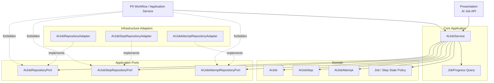
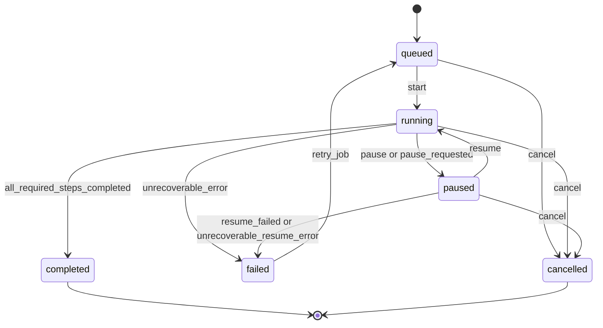
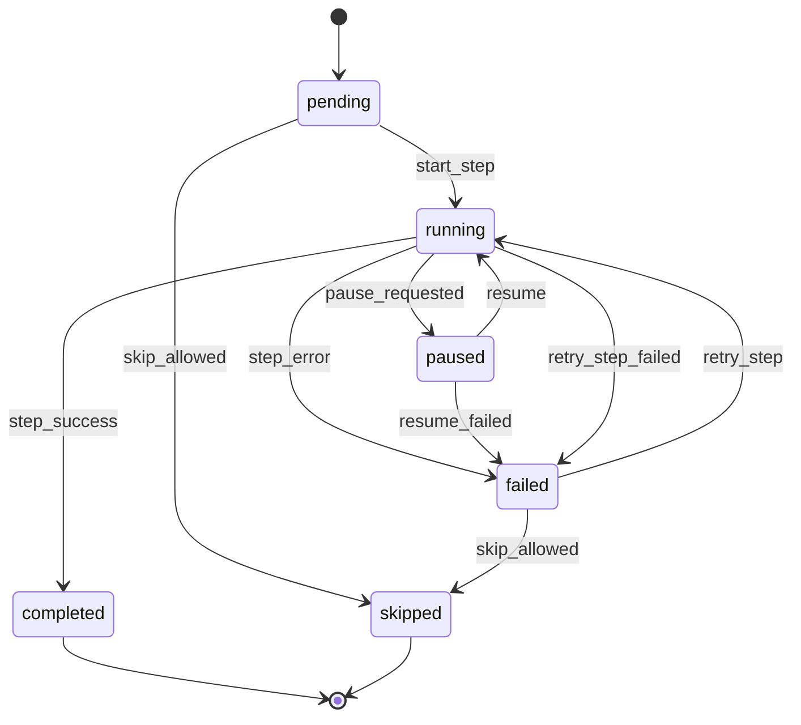

# InkTrace V2.0-P0-02 AIJobSystem 详细设计

版本：v2.0-p0-detail-02  
状态：P0 模块级详细设计  
依据文档：

- `docs/01_requirements/InkTrace-V2.0-需求规格说明书.md`
- `docs/07_overview/InkTrace-V2.0-概要设计说明书.md`
- `docs/02_architecture/InkTrace-V2.0-架构设计说明书.md`
- `docs/03_design/InkTrace-V2.0-P0-详细设计总纲.md`
- `docs/03_design/InkTrace-V2.0-P0-01-AI基础设施详细设计.md`

---

## 一、文档定位与设计范围

### 1.1 文档定位

本文档是 InkTrace V2.0-P0 的第二个模块级详细设计文档，仅覆盖 P0 AIJobSystem。

本文档用于指导后续实现设计、开发计划与 Task 拆分，但本文档本身不写代码、不修改源码、不生成数据库迁移、不拆 Task、不进入开发计划。

### 1.2 设计范围

本模块覆盖：

- AIJob。
- AIJobStep。
- AIJobService。
- AIJobRepositoryPort。
- AIJobStepRepositoryPort。
- AIJobAttemptRepositoryPort。
- Job Progress。
- Job 状态机。
- Step 状态机。
- pause / resume / cancel / retry。
- Provider 调用 attempt 记录。
- OutputValidator schema 校验失败 attempt / error 记录。
- 与 LLMCallLog 的关联。
- 与 P0 初始化流程的关系。
- 与 P0 单章续写 Workflow 的关系。
- 与 Quick Trial 的关系。
- 服务重启后的恢复策略。
- P0 非流式输出下的步骤级进度。
- Job 失败、部分失败、可重试、可跳过边界。
- V1.1 Local-First 写作、保存、导入、导出能力不受影响的边界。

### 1.3 本文档不覆盖

本文档不覆盖：

- AI 基础设施的 Provider / Prompt / OutputValidator 详细设计。
- 初始化流程内部分析规则。
- Story Memory / Story State 详细设计。
- Vector Recall 详细设计。
- Context Pack 详细设计。
- Minimal Continuation Workflow 内部编排详细设计。
- Candidate Draft 详细设计。
- AI Review 详细设计。
- API 与前端交互详细设计。
- 完整 Agent Runtime。
- AgentSession / AgentStep / AgentObservation / AgentTrace 完整能力。
- 五 Agent Workflow。
- 自动连续续写队列。
- token streaming。
- 成本看板。
- 分析看板。

---

## 二、P0 AIJobSystem 目标

### 2.1 模块目标

AIJobSystem 在 P0 中负责长任务生命周期、步骤级进度、失败恢复、attempt 记录和用户控制入口。

目标：

- 为 AI 初始化、正文分析、向量索引、单章续写、候选稿审稿、Quick Trial 提供统一 Job 生命周期。
- 为前端提供可查询的步骤级进度。
- 为失败、暂停、继续、取消、重试提供确定性状态规则。
- 记录 Provider retry 与 schema retry 的 attempt。
- 关联 LLMCallLog，保证模型调用可追踪。
- 在服务重启后避免误判任务完成、重复创建候选稿或重复写正式数据。
- 保持 V1.1 写作、保存、导入、导出能力不受 AI Job 错误影响。

### 2.2 核心原则

- AIJobService 负责 Job 生命周期，不负责模型调用细节。
- AIJobService 不直接调用 Provider SDK。
- AIJobService 不直接调用 Kimi / DeepSeek。
- AIJobService 不直接构建 Prompt。
- AIJobService 不直接校验模型输出 schema。
- AIJobService 不创建 CandidateDraft 正文内容。
- AIJobService 不写正式正文。
- AIJobService 不更新正式资产。
- AIJobService 不绕过 Human Review Gate。
- Workflow 不直接访问 AIJobRepositoryPort，必须通过 AIJobService 或对应 Application Service 更新 Job 状态。
- P0 默认非流式输出，只展示步骤级进度，不展示 token streaming。

---

## 三、模块边界与不做事项

### 3.1 P0 做什么

P0 AIJobSystem 必须完成：

- 创建 AIJob。
- 创建 AIJobStep。
- 维护 Job / Step 状态。
- 查询 Job Progress。
- 记录 Step attempt。
- 记录 error_code / error_message。
- 支持 pause / resume / cancel / retry。
- 支持正文分析章节失败后的 retry / skip 机制。
- 支持服务重启恢复策略。
- 关联 LLMCallLog。
- 为 P0 初始化流程提供步骤级 Job。
- 为 P0 continuation Workflow 提供步骤级 Job。
- 为 Quick Trial 提供非正式试写 Job。

### 3.2 P0 不做什么

P0 AIJobSystem 不做：

- 完整 Agent Runtime。
- AgentSession / AgentStep / AgentObservation / AgentTrace。
- 五 Agent Workflow。
- 自动连续续写队列。
- 多 Job 队列调度器。
- 分布式任务调度。
- token streaming。
- partial_content。
- 成本看板。
- 分析看板。
- 复杂任务优先级调度。
- 后台自动恢复正在执行的 Provider 调用。

### 3.3 禁止调用路径

禁止：

- AIJobService -> Provider SDK。
- AIJobService -> Kimi / DeepSeek。
- AIJobService -> PromptRegistry 直接构建业务 Prompt。
- AIJobService -> OutputValidationService 执行 schema 校验。
- AIJobService -> CandidateDraftService 创建候选稿正文内容。
- Workflow -> AIJobRepositoryPort。
- Workflow -> AIJobStepRepositoryPort。
- Workflow -> AIJobAttemptRepositoryPort。

允许：

- Presentation -> AIJobService。
- Workflow / Application Service -> AIJobService 更新状态与进度。
- AIJobService -> AIJobRepositoryPort。
- AIJobService -> AIJobStepRepositoryPort。
- AIJobService -> AIJobAttemptRepositoryPort。

---

## 四、总体架构

### 4.1 模块关系说明

AIJobSystem 横跨 Application、Domain、Repository Port 与 Infrastructure Adapter。

Application 层：

- AIJobService。
- Job Progress 查询用例。
- pause / resume / cancel / retry 用例。
- Step 状态更新用例。
- Attempt 记录用例。

Domain 层：

- AIJob。
- AIJobStep。
- AIJobAttempt。
- JobStatus。
- StepStatus。
- JobProgress。
- JobStatePolicy。
- StepRetryPolicy。

Ports：

- AIJobRepositoryPort。
- AIJobStepRepositoryPort。
- AIJobAttemptRepositoryPort。

Infrastructure：

- AIJobRepositoryAdapter。
- AIJobStepRepositoryAdapter。
- AIJobAttemptRepositoryAdapter。

实现弹性：

- AIJobRepositoryPort、AIJobStepRepositoryPort、AIJobAttemptRepositoryPort 是 Application 层职责边界。
- P0 不强制要求三个独立数据库表。
- P0 不强制要求三个独立 Repository Adapter 实现类。
- 实现时可以使用一个底层 Repository Adapter 统一持久化 Job / Step / Attempt。
- 实现时也可以拆分为多个 Adapter。
- 无论物理实现是否拆分，Application 层职责边界必须清晰。
- Workflow 仍然不得直接访问任何 Repository Port。

partial_success 委托边界：

- AIJobSystem 只提供 mark_step_failed、mark_step_skipped、update_progress、mark_job_failed、mark_job_completed、pause_job、retry_step 等状态能力。
- AIJobSystem 不负责判断初始化失败比例阈值。
- 初始化流程中的 partial_success 判定属于 P0-03 初始化流程详细设计。
- JobStatePolicy 只负责通用状态流转合法性，不承载初始化业务阈值。
- AIJobService 可以暴露 failed_step_count、skipped_step_count、total_chapter_analysis_steps 等聚合统计给 P0-03 使用。
- P0-02 不定义具体失败比例阈值。

### 4.2 模块关系图

### 4.3 依赖方向

规则：

- Presentation 调用 AIJobService。
- Workflow / Application Service 调用 AIJobService 更新 Job / Step。
- AIJobService 依赖 Domain 对象与 Repository Ports。
- Infrastructure Adapter 实现 Repository Ports。
- Workflow 不直接访问 Repository。
- AIJobSystem 不直接调用 Provider / ModelRouter / PromptRegistry / OutputValidator。

---

## 五、AIJob 详细设计

### 5.1 AIJob 职责

AIJob 表示一个用户可见或系统可追踪的 AI 长任务。

职责：

- 记录任务类型。
- 记录任务状态。
- 记录任务级进度。
- 聚合多个 AIJobStep。
- 支持暂停、继续、取消、重试。
- 记录任务级错误与恢复状态。

### 5.2 AIJob 概念字段

| 字段 | 说明 |
|---|---|
| id | Job ID |
| work_id | 作品 ID |
| chapter_id | 章节 ID，可为空 |
| job_type | 任务类型 |
| status | queued / running / paused / failed / cancelled / completed |
| progress | JobProgress 快照 |
| created_by | 触发来源，用户或系统 |
| created_at | 创建时间 |
| started_at | 开始时间 |
| finished_at | 完成时间 |
| paused_at | 暂停时间 |
| cancelled_at | 取消时间 |
| error_code | 任务级错误码 |
| error_message | 脱敏错误信息 |
| status_reason | 非 failed 状态原因，如 service_restarted / pause_requested / user_cancelled / waiting_user_config / context_pack_blocked |
| resume_reason | 恢复原因，可选 |
| retry_of_job_id | 后续扩展字段；P0 retry_job 默认复用原 Job，不使用该字段创建新 Job |
| metadata | 脱敏元数据，不保存完整正文 / Prompt |

### 5.3 job_type

P0 job_type：

| job_type | 用途 |
|---|---|
| ai_initialization | 作品 AI 初始化总任务 |
| outline_analysis | 单独大纲分析任务 |
| manuscript_analysis | 正文分析任务 |
| vector_indexing | 向量索引构建任务 |
| continuation | 单章受控候选续写任务 |
| candidate_review | 候选稿基础审稿任务 |
| quick_trial | 未初始化时的非正式快速试写任务 |
| provider_test | 后续扩展预留；P0 默认 Provider 连接测试不纳入 AIJob |

### 5.4 Job 状态

AIJob 状态：

- queued。
- running。
- paused。
- failed。
- cancelled。
- completed。

### 5.5 Job 状态机

### 5.6 Job 生命周期规则

- queued 可进入 running。
- paused 可 resume 进入 running。
- failed 可 retry，P0 默认 retry_job 复用原 AIJob，重试后进入 queued 或 running，由调用方决定。
- retry_job 不新建 Job，不改变 Job ID，不删除历史 Step / Attempt / LLMCallLog。
- retry_of_job_id 仅作为后续“复制为新 Job 重试”的扩展字段，P0 默认不使用。
- queued / running / paused 可 cancel。
- running 可 pause。
- completed 是终态。
- cancelled 是终态。
- failed 不是终态，可 retry。
- retry_job 失败不通过 paused -> failed 表达；retry_job 进入 running 后，如果执行失败，再由 running -> failed 表达。
- P0 不做自动连续队列，Job 之间不自动串联执行。
- Job completed 必须以必需 Step 完成或允许 partial success 的规则为前提。
- blocked 不是 AIJob.status。Context Pack blocked、Provider Key 未配置、Provider 未启用等业务阻断原因必须通过 failed / paused + error_code / status_reason 表达。

---

## 六、AIJobStep 详细设计

### 6.1 AIJobStep 职责

AIJobStep 表示 AIJob 内的一个可追踪执行步骤。

职责：

- 记录步骤类型。
- 记录步骤状态。
- 记录步骤级进度与错误。
- 记录 Provider / schema retry attempt。
- 支持 failed 后 retry。
- 支持特定场景 skipped。

### 6.2 AIJobStep 概念字段

| 字段 | 说明 |
|---|---|
| id | Step ID |
| job_id | 所属 Job ID |
| step_type | 步骤类型 |
| status | pending / running / paused / failed / skipped / completed |
| order_index | 步骤顺序 |
| label | 前端展示标签 |
| started_at | 开始时间 |
| finished_at | 完成时间 |
| error_code | 步骤错误码 |
| error_message | 脱敏错误信息 |
| status_reason | 非 failed 状态原因，如 pause_requested / user_skipped / workflow_skipped / context_pack_blocked |
| warning_count | 警告数 |
| attempt_count | attempt 数量 |
| max_attempts | P0 默认 3 |
| can_retry | 是否可重试；可持久化为快照，也可查询时动态计算 |
| can_skip | 是否可跳过；可持久化为快照，也可查询时动态计算 |
| metadata | 脱敏元数据 |

can_retry / can_skip 赋值规则：

- can_retry / can_skip 是给前端展示操作按钮的派生能力字段。
- P0 推荐由 AIJobService 根据 step_type、status、job_status、policy 动态计算。
- step_type 可有静态 capability，例如 retryable、skippable；最终 can_retry / can_skip 由静态 capability + 当前状态动态计算。
- can_retry = true 的典型条件：Step.status = failed；Job.status = failed / paused / running 中允许局部重试；step_type 允许 retry；当前 Step 未超过 retry / attempt 上限；Job 未 cancelled / completed。
- can_retry = false 的典型条件：Job.status = cancelled / completed；Step.status = completed / skipped；step_type 不允许 retry；attempt 已达到上限；错误类型不可重试，例如 provider_auth_failed / provider_key_missing / provider_disabled，除非用户更新配置后重新触发。
- can_skip = true 的典型条件：Step.status = failed；step_type 允许 partial success；当前任务允许跳过该 Step；跳过不会破坏正式续写的必选条件。
- can_skip = false 的典型条件：continuation 关键步骤；build_context_pack blocked 后继续正式续写；run_writer_step；create_candidate_draft；Job.status = cancelled / completed。
- can_skip 是否允许初始化完成由 P0-03 初始化流程判断。

### 6.3 step_type

P0 常见 step_type：

| step_type | 用途 |
|---|---|
| load_settings | 加载 AI Settings / ModelRoleConfig |
| outline_analysis | 大纲分析 |
| manuscript_chapter_analysis | 单章正文分析 |
| build_story_memory | 构建 P0 Story Memory |
| build_story_state | 构建 P0 StoryState |
| build_vector_index | 构建向量索引 |
| create_writing_task | 创建 Writing Task |
| build_context_pack | 构建 Context Pack |
| run_writer_step | 调用写作生成受控步骤 |
| create_candidate_draft | 保存候选稿，不是正式正文保存 |
| run_reviewer_step | 调用审稿受控步骤 |
| quick_trial_writer | 快速试写生成步骤 |
| provider_connection_test | 后续扩展预留；P0 默认不作为必需 Step |

Tool / Service 命名规则：

- Tool 名必须保持为 `run_writer_step` / `run_reviewer_step`。
- `run_writer_step` Tool 内部调用 `WritingGenerationService.generate_candidate_text()`。
- `run_reviewer_step` Tool 内部调用 `ReviewService.generate_review_report()`。
- `create_candidate_draft` 是 Tool / Application Service 调用保存候选稿，不是正式正文保存。
- `accept_candidate_draft` / `apply_candidate_to_draft` 不是 Agent Tool，不属于 AIJob 自动步骤。

### 6.4 Step 状态

AIJobStep 状态：

- pending。
- running。
- paused。
- failed。
- skipped。
- completed。

### 6.5 Step 状态机

### 6.6 Step 与 Job 的关系

- 一个 AIJob 包含多个 AIJobStep。
- Job Progress 由 Step 状态聚合生成。
- 必需 Step failed 时，Job failed 或 paused 等待用户处理。
- 可跳过 Step skipped 时，Job 可继续执行。
- completed / skipped 都计入已处理 Step。
- skipped 仅适用于允许 partial success 的任务，例如正文分析某章失败后用户选择跳过。
- skipped 只允许用于可 partial success 的任务。
- continuation 的关键步骤不允许 skipped 后继续正式续写：create_writing_task 不应 skipped；build_context_pack blocked 不应 skipped 后继续正式续写；run_writer_step 不应 skipped 后创建 CandidateDraft；create_candidate_draft 不应 skipped 后进入 review。
- manuscript_chapter_analysis 可允许 skipped。
- vector_indexing 可按 chapter / chunk 允许 partial success。
- skipped 必须记录 reason，例如 user_skipped 或 workflow_skipped。
- skipped 不等于 success。
- skipped 是否允许初始化完成，由 P0-03 初始化流程详细设计确定失败比例阈值。
- AIJobSystem 只提供 skipped 状态能力与统计能力，不判断初始化 partial_success 阈值。

---

## 七、AIJobStep Attempt 详细设计

### 7.1 Attempt 职责

AIJobAttempt 用于记录单个 AIJobStep 内的每次模型调用尝试。

Attempt 记录 Provider retry 与 schema retry，保证每次调用可追踪、可审计、可与 LLMCallLog 关联。

### 7.2 Attempt 概念字段

| 字段 | 说明 |
|---|---|
| id | Attempt ID |
| job_id | Job ID |
| step_id | Step ID |
| attempt_no | Step 内第几次 attempt |
| request_id | 单次 Provider 调用 ID |
| trace_id | 同一业务步骤共享的 trace_id |
| provider | Provider 名称 |
| model | 模型名称 |
| model_role | 模型角色 |
| prompt_key | Prompt Key |
| prompt_version | Prompt 版本 |
| output_schema_key | 输出 schema key |
| status | running / failed / completed |
| started_at | 开始时间 |
| finished_at | 结束时间 |
| elapsed_ms | 耗时 |
| error_code | 错误码 |
| error_message | 脱敏错误信息 |
| llm_call_log_id | 关联 LLMCallLog ID，可选 |
| retry_reason | provider_timeout / output_schema_invalid 等 |

### 7.3 request_id / trace_id 规则

- 每次 Provider 调用必须生成新的 request_id。
- 同一 AIJobStep 下的 Provider retry 与 schema retry 必须共享 trace_id。
- 同一业务步骤下的 attempt_no 必须递增。
- Step retry 可以共享 job_id，但应生成 retry_trace_id 或 retry_group_id。
- Step retry 必须保留原失败记录。

### 7.4 与 LLMCallLog 的关系

- Attempt 不替代 LLMCallLog。
- LLMCallLog 记录模型调用元数据、token usage、elapsed time、错误。
- Attempt 记录 Step 视角下的调用尝试与 retry_reason。
- Attempt 可保存 llm_call_log_id 与 LLMCallLog 互相关联。
- 每次 Provider retry 与 schema retry 都必须写入 Attempt 与 LLMCallLog。

### 7.5 单个 Step 总调用次数上限

P0 继承 P0-01 规则：

- Provider 调用重试最多 1 次。
- OutputValidator schema 校验失败默认最多重试 2 次。
- 单个 AIJobStep 总 Provider 调用次数上限为 3 次。
- Provider retry 不得突破该总上限。
- 超过总调用上限后，AIJobStep.status = failed。
- error_code 使用最后一次失败原因；如果最后失败是 schema，使用 `output_schema_invalid`。
- 超过总调用上限后，不得创建候选数据或正式数据。

### 7.6 Attempt 隐私边界

Attempt 不保存：

- 完整 Prompt。
- 完整正文。
- API Key。
- Provider 原始完整响应正文。
- CandidateDraft 正文内容。
- 正式正文内容。

---

## 八、AIJobService 详细设计

### 8.1 AIJobService 职责

AIJobService 是 Core Application 层服务，负责 AI Job 生命周期。

职责：

- 创建 Job。
- 创建 Step。
- 更新 Job / Step 状态。
- 更新 Progress。
- 记录 Step attempt。
- 支持 pause / resume / cancel / retry。
- 查询 Job Progress。
- 执行服务重启恢复策略。
- 提供 failed_step_count、skipped_step_count、total_chapter_analysis_steps 等聚合统计给初始化流程使用。
- 提供通用状态流转能力，不判断初始化 partial_success 业务阈值。

### 8.2 核心用例

| 用例 | 说明 |
|---|---|
| create_job | 创建 AIJob 与初始 steps |
| start_job | 将 queued Job 置为 running |
| update_progress | 更新步骤级进度快照 |
| mark_step_running | 标记 Step running |
| mark_step_completed | 标记 Step completed |
| mark_step_failed | 标记 Step failed 并记录 error |
| mark_step_skipped | 标记 Step skipped |
| record_attempt | 记录 Provider / schema retry attempt |
| pause_job | 请求暂停 Job |
| resume_job | 恢复 paused Job |
| cancel_job | 取消 queued / running / paused Job |
| retry_job | 重试 failed Job |
| retry_step | 重试 failed Step |
| query_job_progress | 查询 Job Progress |
| recover_after_restart | 服务重启后恢复 Job 状态 |

retry_job 与 retry_step 关系：

- retry_job 是任务级重试。
- P0 默认 retry_job 复用原 Job，从第一个 failed / paused 且未完成的关键 Step 开始继续，不无条件从第一个 Step 全量重跑。
- 已 completed 的 Step 默认不重复执行，除非用户或调用方明确选择 reset / rerun。
- retry_step 是步骤级重试，只重试指定 failed Step。
- retry_step 成功后，如果该 Step 后续还有未完成 Step，Job 可以继续执行后续 Step，或由 Workflow / Application Service 决定是否继续后续 Step。
- AIJobService 只负责状态更新，不自行执行业务编排。
- retry_step 失败后，Step 回到 failed，并记录新的 attempt / error。
- retry_job 和 retry_step 都不得删除历史 attempt / LLMCallLog。
- retry_job 和 retry_step 都不得自动接受 CandidateDraft。
- retry_job 和 retry_step 都不得写正式正文。

### 8.3 不允许做的事情

AIJobService 不允许：

- 调用 Provider SDK。
- 调用 Kimi / DeepSeek。
- 调用 ModelRouter 执行模型生成。
- 构建 Prompt。
- 校验模型输出 schema。
- 创建 CandidateDraft 正文内容。
- 写正式正文。
- 更新正式资产。
- 更新正式 Story Memory。
- 绕过 Human Review Gate。
- 直接接受候选稿。

### 8.4 Workflow 回调边界

Workflow / Application Service 可以调用 AIJobService：

- 标记 Step running。
- 标记 Step completed。
- 标记 Step failed。
- 记录 attempt。
- 更新 progress。

Workflow / Application Service 不得直接访问 Repository Port。

P0-03 初始化流程边界：

- P0-03 的 InitializationWorkflow / InitializationApplicationService 根据章节分析结果、failed_step_count、skipped_step_count、失败比例阈值，决定是否继续初始化、是否允许用户跳过、是否标记初始化完成。
- P0-03 根据业务判定调用 AIJobService.mark_job_failed 或 AIJobService.mark_job_completed。
- AIJobService 不定义具体失败比例阈值。

---

## 九、Repository Port 详细设计

### 9.1 AIJobRepositoryPort

职责：

- 创建 AIJob。
- 查询 AIJob。
- 更新 AIJob 状态。
- 更新 Job Progress 快照。
- 查询可恢复 Job。
- 查询用户 / 作品下 Job 列表。

### 9.2 AIJobStepRepositoryPort

职责：

- 创建 AIJobStep。
- 查询 Job 下 Step 列表。
- 更新 Step 状态。
- 更新 Step 错误信息。
- 更新 Step attempt_count。
- 查询 failed / skipped Step。

### 9.3 AIJobAttemptRepositoryPort

职责：

- 创建 AIJobAttempt。
- 查询 Step 下 attempt 列表。
- 按 request_id 查询 attempt。
- 按 trace_id 查询 attempt。
- 关联 llm_call_log_id。

### 9.4 Infrastructure Repository Adapter

Infrastructure Repository Adapter 负责实现 Repository Ports。

规则：

- AIJobRepositoryPort、AIJobStepRepositoryPort、AIJobAttemptRepositoryPort 是应用层职责边界，不强制对应独立表或独立实现类。
- 实现时可以使用一个底层 Repository Adapter 统一持久化 Job / Step / Attempt。
- 实现时也可以拆分为多个 Adapter。
- 无论物理实现是否拆分，Application 层职责边界必须清晰。
- Workflow 仍然不得直接访问任何 Repository Port。
- Adapter 不承载 Job 状态业务规则。
- Adapter 不判断哪些状态可 retry。
- Adapter 不调用 Provider SDK。
- Adapter 不写完整 Prompt / 正文 / API Key。
- Adapter 只执行持久化读写与领域对象映射。

---

## 十、Job Progress 详细设计

### 10.1 Progress 字段

Job Progress 至少包含：

| 字段 | 说明 |
|---|---|
| total_steps | 总 Step 数 |
| completed_steps | completed + skipped 的 Step 数 |
| current_step | 当前 Step Type |
| current_step_label | 当前 Step 展示名称 |
| percent | 可选百分比 |
| status | Job 状态 |
| error_code | 任务或当前 Step 错误码 |
| error_message | 脱敏错误信息 |
| warning_count | 警告数，可选 |
| failed_step_count | failed Step 数 |
| skipped_step_count | skipped Step 数 |
| updated_at | 更新时间 |

### 10.2 步骤级进度

P0 默认非流式输出，Progress 只表达步骤级进度：

- 不展示 token streaming。
- 不展示 partial_content。
- 不保存完整 Prompt。
- 不保存完整正文。
- 续写生成完成后才一次性创建 CandidateDraft。
- 审稿在完整候选稿生成后触发。

### 10.3 UI 查询模型

前端通过 AI Job API 查询：

- Job 状态。
- 当前 Step。
- Step label。
- percent。
- 错误和警告。
- 是否可 pause / resume / cancel / retry。
- can_retry / can_skip 派生能力。
- failed_step_count / skipped_step_count。

P0 不要求 SSE / WebSocket token streaming。

### 10.4 Progress 聚合规则

- total_steps 来自 Job 初始化时创建的 Step 列表。
- completed_steps 包含 completed 与 skipped。
- percent 可由 completed_steps / total_steps 计算。
- failed_step_count 统计 failed。
- skipped_step_count 统计 skipped。
- Job failed 时 percent 不强制 100%。
- Job cancelled 时保留最后进度快照。
- percent 只表示流程处理进度。
- percent 不表示 AI 分析质量。
- percent 不表示任务成功率。
- skipped 计入流程进度完成，但必须同时展示 skipped_step_count。
- failed_step_count / skipped_step_count 必须独立展示。
- 对正文分析这类允许 partial success 的任务，前端不能只看 percent 判断初始化质量。
- 初始化是否满足正式续写要求，由 P0-03 初始化流程详细设计中的初始化完成规则决定。

---

## 十一、暂停 / 继续 / 取消 / 重试设计

### 11.1 pause

规则：

- running Job 可暂停。
- 如果当前 Provider 调用正在执行，P0 可在当前 Step 完成后进入 paused，或标记 pause_requested。
- P0 不强制中断外部 Provider 请求，除非后续实现支持安全取消。
- pause_requested 必须记录为 status_reason 或 metadata reason。
- 如果 Job 处于 pause_requested，当前 Provider 调用返回后，可以完成当前 attempt 的记录。
- 如果 Job 处于 pause_requested，当前 Provider 调用返回后，可以安全完成当前 Step，或将 Step 标记 paused，具体由用例决定。
- 如果 Job 处于 pause_requested，当前 Provider 调用返回后不得自动启动下一个 Step。
- Job 必须进入 paused，等待用户 resume。
- paused Job 不继续启动新 Step。
- pause 不删除已生成 CandidateDraft。
- pause 不影响 V1.1 正文草稿。

### 11.2 resume

规则：

- paused Job 可恢复。
- resume 从未完成 Step 继续。
- 已完成 Step 不重复执行，除非用户明确 retry。
- skipped Step 不自动恢复。
- resume 后 Job.status = running。
- resume_failed 或 unrecoverable_resume_error 可使 Job 从 paused 进入 failed。
- paused 表示等待用户恢复或恢复中，不表示 retry 执行中。

### 11.3 cancel

规则：

- queued / running / paused Job 可取消。
- cancelled 是终态。
- cancel 不删除已有 CandidateDraft。
- cancel 不删除 LLMCallLog。
- cancel 不删除 attempt 历史。
- cancel 不影响 V1.1 正文草稿。
- cancel 必须记录 status_reason，例如 user_cancelled 或 system_cancelled。
- P0 不强制中断正在执行的外部 Provider 请求，除非后续实现支持安全取消。
- 如果 Job 已进入 cancelled，后续迟到的 ProviderResponse 不得继续推进 Step。
- 如果 Job 已进入 cancelled，迟到结果不得创建 CandidateDraft。
- 如果 Job 已进入 cancelled，迟到结果不得创建 ReviewReport。
- 如果 Job 已进入 cancelled，迟到结果不得创建 StoryMemory、StoryState、正式正文或正式资产。
- 迟到结果最多只能记录脱敏日志、Attempt 终止状态或 ignored_result 状态。

### 11.4 retry

规则：

- failed Job 可 retry。
- failed Step 可 retry。
- P0 默认 retry_job 复用原 AIJob。
- retry_job 将 failed Job 重新置为 queued 或 running。
- retry_job 保留原 Job ID。
- retry_job 保留历史 Step / Attempt / LLMCallLog。
- retry_job 不删除失败记录。
- retry_job 可以重置待执行 Step 的状态。
- retry_of_job_id 作为后续扩展字段，用于未来支持“复制为新 Job 重试”。
- P0 默认不使用 retry_of_job_id 创建新 Job。
- retry 不删除历史 LLMCallLog。
- retry 不删除历史 attempt。
- retry 使用新的 request_id。
- 同一次 Job 内 step retry 共享 job_id。
- Step retry 应新建 retry_trace_id 或 retry_group_id，并保留原 trace_id 的失败记录。
- retry_step 保留原 Step 历史 attempt，并为新的执行生成新的 request_id / retry_trace_id 或 retry_group_id。
- retry_step 成功后，如果该 Step 后续还有未完成 Step，Job 可以继续执行后续 Step，或由 Workflow / Application Service 决定是否继续后续 Step。
- retry_step 失败后，Step.status = failed，并新增 attempt / error。
- retry_job 失败后，Job.status = failed，并保留原失败记录和新 attempt。
- retry 成功后更新 Step / Job 状态。
- retry 不自动接受候选稿。
- retry 不写正式正文。
- retry_job 和 retry_step 均不得自动接受 CandidateDraft。
- retry_job 和 retry_step 均不得写正式正文。

---

## 十二、服务重启恢复策略

### 12.1 恢复原则

服务重启时，running Job 不假定仍在执行。

P0 默认策略：

- running Job 标记为 paused，reason = service_restarted。
- running Step 标记为 paused 或 failed，等待用户 resume / retry。
- queued Job 保持 queued。
- paused Job 保持 paused。
- failed Job 保持 failed。
- completed Job 保持 completed。
- cancelled Job 保持 cancelled。

### 12.2 禁止行为

服务重启恢复时禁止：

- 自动恢复正在进行的 Provider 调用。
- 重复创建 CandidateDraft。
- 重复创建 ReviewReport。
- 重复写正式数据。
- 处理迟到 ProviderResponse 时继续推进已 cancelled Job。
- 处理迟到 ProviderResponse 时创建 CandidateDraft、ReviewReport、StoryMemory、StoryState、正式正文或正式资产。
- 将 running Job 误判为 completed。
- 删除历史 attempt / LLMCallLog。

### 12.3 用户恢复入口

服务重启后，用户可以从 UI 选择：

- resume。
- retry。
- cancel。

AIJobSystem 必须提供足够状态给前端展示恢复原因。

---

## 十三、不同任务类型的 Job / Step 设计

### 13.1 job_type 设计表

| job_type | 典型 Step | pause / resume | cancel | retry | partial success | 是否创建候选数据 | 是否创建正式数据 | V1.1 影响 |
|---|---|---|---|---|---|---|---|---|
| ai_initialization | outline_analysis、manuscript_chapter_analysis、build_story_memory、build_story_state、build_vector_index | 支持 | 支持 | 支持 | 支持章节级 partial success | 否 | 否 | 不影响 |
| outline_analysis | load_settings、outline_analysis | 支持 | 支持 | 支持 | 不支持 | 否 | 否 | 不影响 |
| manuscript_analysis | manuscript_chapter_analysis | 支持 | 支持 | 支持 | 支持章节级 partial success | 否 | 否 | 不影响 |
| vector_indexing | build_vector_index | 支持 | 支持 | 支持 | 可按 chunk / chapter partial success | 否 | 否 | 不影响 |
| continuation | create_writing_task、build_context_pack、run_writer_step、create_candidate_draft、run_reviewer_step | 支持 | 支持 | 支持 | 不支持关键步骤 partial success | 是，CandidateDraft | 否 | 不影响 |
| candidate_review | run_reviewer_step | 支持 | 支持 | 支持 | 不支持 | 否 | 否 | 不影响 |
| quick_trial | build_context_pack 或临时上下文、quick_trial_writer、create_candidate_draft | 支持 | 支持 | 支持 | 不支持 | 是，非正式标记 CandidateDraft 或临时候选区 | 否 | 不影响 |
| provider_test | provider_connection_test | 后续扩展预留，P0 默认不纳入 AIJob | 后续扩展预留 | 后续扩展预留 | 不支持 | 否 | 否 | 不影响 |

### 13.2 provider_test 是否纳入 Job

P0 默认 Provider 连接测试不纳入 AIJob。

规则：

- Provider 连接测试由 AISettingsService 执行。
- AISettingsService 负责写回 last_test_status、last_test_at、last_test_error_code、last_test_error_message。
- provider_test job_type 仅作为后续扩展预留，不作为 P0 必须实现 job_type。
- provider_connection_test step_type 仅作为可选扩展，不作为 P0 默认必需 Step。
- Provider 连接测试不得创建 CandidateDraft、ReviewReport、StoryMemory、StoryState 或正式数据。
- 服务重启后，上次连接测试状态由 AISettingsRepositoryPort 读取，不依赖 AIJob 恢复。

### 13.3 初始化任务

ai_initialization 是组合任务，包含：

- 大纲分析。
- 正文分析。
- P0 StoryMemory 构建。
- P0 StoryState 构建。
- 向量索引构建。

正文分析某章失败时，允许对应 Step failed 后由用户 retry 或 skip。

失败比例阈值由 P0-03 初始化流程详细设计确认；P0-02 只定义 failed / skipped 机制。

P0-02 与 P0-03 的接口边界：

- AIJobSystem 只提供 mark_step_failed、mark_step_skipped、update_progress、mark_job_failed、mark_job_completed、pause_job、retry_step 等状态能力。
- AIJobSystem 不负责判断初始化失败比例阈值。
- P0-03 的 InitializationWorkflow / InitializationApplicationService 根据章节分析结果、failed_step_count、skipped_step_count、失败比例阈值，决定是否继续初始化、是否允许用户跳过、是否标记初始化完成、是否调用 AIJobService.mark_job_failed、是否调用 AIJobService.mark_job_completed。
- JobStatePolicy 只负责通用状态流转合法性，不承载初始化业务阈值。
- AIJobService 可以暴露 failed_step_count、skipped_step_count、total_chapter_analysis_steps 等聚合统计给 P0-03 使用。
- P0-02 不定义具体失败比例阈值。

### 13.4 continuation 任务

continuation Job 包含：

- create_writing_task。
- build_context_pack。
- run_writer_step。
- create_candidate_draft。
- run_reviewer_step。

规则：

- run_writer_step 成功后才可创建 CandidateDraft。
- create_candidate_draft 只保存候选稿，不写正式正文。
- run_reviewer_step 失败时 CandidateDraft 可保留。
- AIJob 失败不得自动接受候选稿。

### 13.5 quick_trial 任务

quick_trial 是非正式降级试写任务。

规则：

- Quick Trial 不等于初始化完成。
- Quick Trial 不更新 StoryMemory。
- Quick Trial 不更新正式 StoryState。
- Quick Trial 不生成正式 Memory Update Suggestion。
- Quick Trial 生成结果必须标记“上下文不足，非正式智能续写”。
- Quick Trial 不作为正式续写质量验收依据。
- quick_trial Job 不得改变作品 initialization_status。
- quick_trial Job 成功不代表 AI 初始化完成。
- quick_trial Job 不得使正式续写入口变为可用。
- quick_trial 生成的 CandidateDraft 或临时候选区内容必须带 quick_trial 标记。
- quick_trial 生成结果必须带 degraded_context 或 context_insufficient 标记。
- quick_trial 的成功 / 失败不参与正式续写质量验收。
- quick_trial Job 不更新 StoryMemory、正式 StoryState、VectorIndex 或正式资产。

---

## 十四、错误处理与降级

### 14.1 错误处理表

| 场景 | error_code | P0 行为 | V1.1 影响 |
|---|---|---|---|
| Provider Key 未配置 | provider_key_missing | Job failed；或 Job paused 且 status_reason = waiting_user_config，由用例决定 | 不影响 |
| Provider 鉴权失败 | provider_auth_failed | Step failed，不重试 | 不影响 |
| Provider 超时 | provider_timeout | 可 Provider retry 1 次，但不得突破 Step 总上限 3 次 | 不影响 |
| Provider 限流 | provider_rate_limited | 可 Provider retry 1 次，但不得突破 Step 总上限 3 次 | 不影响 |
| Provider 服务不可用 | provider_unavailable | 可 Provider retry 1 次，但不得突破 Step 总上限 3 次 | 不影响 |
| schema 缺失 | output_schema_missing | Step failed，不调用 Provider | 不影响 |
| schema 校验失败 | output_schema_invalid | schema 修复重试最多 2 次 | 不影响 |
| PromptTemplate 缺失 | prompt_template_missing | Step failed | 不影响 |
| ModelRoleConfig 缺失 | model_role_config_missing | Step failed | 不影响 |
| Context Pack blocked | context_pack_blocked | Job failed，error_code = context_pack_blocked；或 Job paused 且 status_reason = context_pack_blocked，不创建 CandidateDraft | 不影响 |
| Job cancelled | job_cancelled | Job cancelled，保留历史记录 | 不影响 |
| 服务重启 | service_restarted | running Job 标记 paused | 不影响 |

blocked 语义规则：

- P0 不新增 blocked 作为 AIJob.status。
- blocked 是业务阻断原因，不是 Job 状态。
- Context Pack blocked、Provider Key 未配置、Provider 未启用等场景，AIJob.status 使用 failed 或 paused，具体由用例决定。
- error_code 使用 context_pack_blocked / provider_key_missing / provider_disabled。
- status_reason 或 metadata 可记录 blocked reason。

### 14.2 不同任务失败策略

续写生成失败：

- CandidateDraft 不创建。
- continuation Job failed。
- V1.1 不受影响。

审稿失败：

- CandidateDraft 可保留。
- ReviewReport 不创建，或候选稿标记 review_failed。
- 用户可手动决定是否使用候选稿。
- V1.1 不受影响。

正文分析某章失败：

- 该章节 AIJobStep failed。
- 允许用户选择重试或跳过。
- 不必整书初始化失败，除非失败比例超过后续详细设计设定阈值。
- P0-02 保留 failed / skipped 机制，阈值由 P0-03 初始化流程详细设计确认。
- skipped 只允许用于可 partial success 的任务。
- manuscript_chapter_analysis 可允许 skipped。
- skipped 必须记录 reason。
- skipped 不等于 success。
- skipped 是否允许初始化完成，由 P0-03 初始化流程详细设计确定失败比例阈值。

大纲分析失败：

- OutlineAnalysisResult 不创建。
- 初始化 Job failed 或等待重试。

Writing Task 失败：

- WritingTask 不创建。
- 正式续写 blocked。

Context Pack blocked：

- continuation Job failed，error_code = context_pack_blocked；或 Job paused，status_reason = context_pack_blocked。
- 可提示用户走 Quick Trial。
- 不创建 CandidateDraft。

continuation 关键步骤失败：

- create_writing_task 不应 skipped。
- build_context_pack blocked 不应 skipped 后继续正式续写。
- run_writer_step 不应 skipped 后创建 CandidateDraft。
- create_candidate_draft 不应 skipped 后进入 review。

---

## 十五、与 P0-01 规则的一致性

P0-02 必须继承 P0-01 AI 基础设施规则：

- Provider retry 与 schema retry 必须区分。
- Provider 调用重试是网络 / 服务层重试。
- OutputValidator 重试是输出质量 / schema 修复重试。
- Provider 调用重试最多 1 次。
- 仅 `provider_timeout`、`provider_rate_limited`、`provider_unavailable` 可触发 Provider retry。
- `provider_auth_failed`、`provider_key_missing`、`provider_disabled` 不重试。
- OutputValidator schema 校验失败默认最多重试 2 次。
- 单个 AIJobStep 总 Provider 调用次数上限为 3 次。
- Provider retry 不得突破 AIJobStep 总调用上限。
- 每次 Provider retry 与 schema retry 均必须写入 AIJobStep attempt 与 LLMCallLog。
- 同一业务步骤下，Provider retry 与 schema retry 必须共享 trace_id。
- 每次 attempt 必须记录 request_id / trace_id / attempt_no。
- 超过总调用上限后，AIJobStep.status = failed。
- 超过总调用上限后，error_code 使用最后一次失败原因；如果最后失败是 schema，使用 `output_schema_invalid`。
- 超过总调用上限后，不得创建候选数据或正式数据。
- 普通日志不记录 API Key、完整正文、完整 Prompt。
- LLMCallLog 默认保留 90 天或最近 10000 条。

---

## 十六、安全、隐私与日志

### 16.1 Job / Step / Attempt 隐私边界

Job / Step / Attempt 不保存：

- 完整正文。
- 完整 Prompt。
- API Key。
- CandidateDraft 正文。
- 正式正文。
- Provider 原始完整响应正文。

### 16.2 error_message 脱敏

error_message 必须脱敏。

禁止写入：

- API Key。
- 完整 Prompt。
- 完整正文。
- Provider 原始敏感响应。
- 用户隐私内容。

### 16.3 普通日志边界

普通日志只允许记录：

- job_id。
- step_id。
- attempt_no。
- request_id。
- trace_id。
- error_code。
- status_reason。
- 脱敏 error_message。
- 状态变化。

普通日志不得记录完整正文、完整 Prompt、API Key。

status_reason / metadata reason 规则：

- error_code 用于 failed 场景的标准错误码。
- status_reason 用于 paused / cancelled / skipped / blocked reason 等非错误或半错误原因。
- status_reason 可以记录 service_restarted、pause_requested、user_cancelled、system_cancelled、user_skipped、workflow_skipped、waiting_user_config、context_pack_blocked。
- 如果实现不新增 status_reason 字段，这些 reason 必须以统一口径存放在 metadata 中。
- status_reason / metadata reason 不得保存完整正文、完整 Prompt、API Key。
- skipped 必须记录 user_skipped 或 workflow_skipped 等 reason。
- cancelled 必须记录 user_cancelled 或 system_cancelled 等 reason。

---

## 十七、P0 验收标准

P0 AIJobSystem 验收标准：

- 可以创建 AIJob。
- 可以创建 AIJobStep。
- AIJob 支持 queued / running / paused / failed / cancelled / completed。
- AIJobStep 支持 pending / running / paused / failed / skipped / completed。
- 可以查询 Job Progress。
- P0 默认展示步骤级进度，不展示 token streaming。
- Progress 不展示 partial_content。
- 可以 pause / resume / cancel / retry。
- retry_job 默认复用原 Job，不默认新建 Job。
- retry_of_job_id 仅作为后续扩展字段，P0 默认不使用。
- retry_job 从第一个 failed / paused 且未完成的关键 Step 开始继续，不无条件全量重跑。
- retry_step 只重试指定 failed Step。
- retry_job 和 retry_step 都不删除历史 attempt / LLMCallLog。
- retry_job 和 retry_step 都不得自动接受 CandidateDraft 或写正式正文。
- 服务重启后 running Job 不会被误判 completed。
- 服务重启后 running Job 默认标记为 paused，reason = service_restarted。
- cancel 后迟到的 ProviderResponse 不会继续创建 CandidateDraft、ReviewReport、StoryMemory、StoryState、正式正文或正式资产。
- pause_requested 后当前 Provider 调用返回时不会自动启动下一个 Step。
- Step attempt 能记录 request_id / trace_id / attempt_no。
- Provider retry 与 schema retry 都计入 attempt。
- 单个 AIJobStep 总 Provider 调用次数不超过 3。
- can_retry / can_skip 由 AIJobService 基于 step_type、status、job_status、policy 动态计算或持久化快照。
- can_skip 只允许用于可 partial success 的任务。
- continuation 关键步骤不得 skipped 后继续正式续写。
- skipped_step_count / failed_step_count 独立展示。
- Progress percent 只表示流程处理进度，不代表 AI 分析质量或任务成功率。
- 每次失败写入 AIJobStep attempt / error。
- 每次模型调用关联 LLMCallLog。
- 续写生成失败不创建 CandidateDraft。
- 审稿失败 CandidateDraft 可保留。
- 正文分析某章失败可重试或跳过。
- 正文分析 partial_success 判定委托给 P0-03，AIJobSystem 只提供状态能力和统计能力。
- 大纲分析失败不创建 OutlineAnalysisResult。
- Context Pack blocked 时不创建 CandidateDraft。
- Context Pack blocked 不作为 AIJob.status，只通过 failed / paused + error_code / status_reason 表达。
- Quick Trial 不改变作品 initialization_status。
- Quick Trial 成功不代表初始化完成。
- Quick Trial 不得使正式续写入口变为可用。
- Quick Trial 生成内容必须带 quick_trial 与 degraded_context 或 context_insufficient 标记。
- Provider 连接测试默认由 AISettingsService 处理，不依赖 AIJob。
- provider_test job_type 仅作为后续扩展预留，不作为 P0 必须实现 job_type。
- provider_connection_test step_type 仅作为可选扩展，不作为 P0 默认必需 Step。
- Repository Port 拆分不强制对应独立表或独立实现类。
- Job / Step / Attempt 不保存 API Key、完整正文、完整 Prompt。
- 普通日志不记录 API Key、完整正文、完整 Prompt。
- AIJobSystem 错误不影响 V1.1 写作、保存、导入、导出能力。
- AIJobService 不直接调用 Provider SDK。
- AIJobService 不直接调用 Kimi / DeepSeek。
- AIJobService 不直接构建 Prompt。
- AIJobService 不直接校验模型输出 schema。
- AIJobService 不创建 CandidateDraft 正文内容。
- Workflow 不直接访问 AIJobRepositoryPort。
- P0 不实现完整 Agent Runtime。
- P0 不实现自动连续续写队列。
