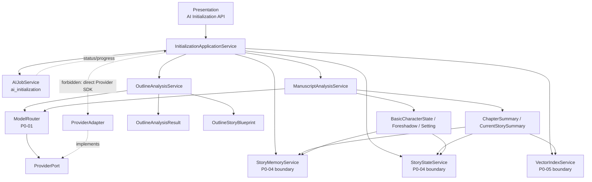
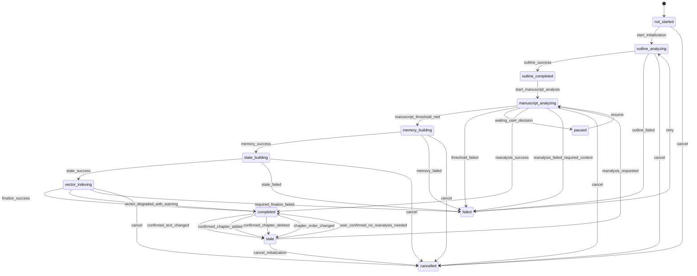
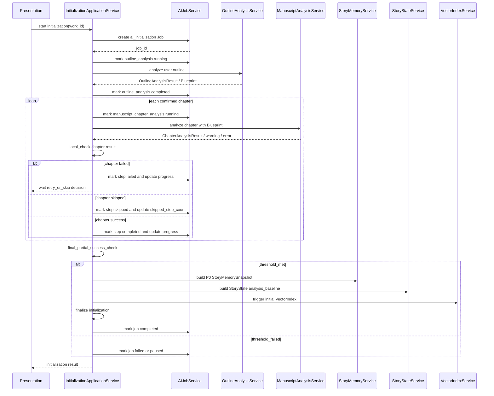

# InkTrace V2.0-P0-03 初始化流程详细设计

版本：v2.0-p0-detail-03  
状态：P0 模块级详细设计  
依据文档：

- `docs/01_requirements/InkTrace-V2.0-需求规格说明书.md`
- `docs/07_overview/InkTrace-V2.0-概要设计说明书.md`
- `docs/02_architecture/InkTrace-V2.0-架构设计说明书.md`
- `docs/03_design/InkTrace-V2.0-P0-详细设计总纲.md`
- `docs/03_design/InkTrace-V2.0-P0-01-AI基础设施详细设计.md`
- `docs/03_design/InkTrace-V2.0-P0-02-AIJobSystem详细设计.md`

---

## 一、文档定位与设计范围

### 1.1 文档定位

本文档是 InkTrace V2.0-P0 的第三个模块级详细设计文档，仅覆盖 P0 AI Initialization 初始化流程。

本文档用于冻结 P0 初始化流程的阶段、状态、完成判定、partial_success、Quick Trial 边界，以及初始化对 StoryMemory / StoryState / VectorIndex 的触发边界。

本文档不写代码、不修改源码、不生成数据库迁移、不拆 Task、不进入开发计划。

### 1.2 设计范围

本模块覆盖：

- 作品 AI 初始化总流程。
- 大纲分析阶段。
- 正文分析阶段。
- OutlineAnalysisService。
- ManuscriptAnalysisService。
- OutlineAnalysisResult。
- OutlineStoryBlueprint。
- ChapterSummary。
- CurrentStorySummary。
- BasicCharacterState。
- BasicForeshadowCandidate。
- BasicSettingFact。
- 初始化生成 P0 StoryMemory 的输入。
- 初始化生成 StoryState analysis_baseline 的输入。
- 初始化触发 VectorIndex 初始构建的边界。
- initialization_status。
- 正文分析章节失败后的 retry / skip / partial success 规则。
- 初始化完成判定规则。
- 初始化失败 / 暂停 / 继续 / 取消 / 重试规则。
- 与 AIJobSystem 的关系。
- 与 P0-01 AI 基础设施的关系。
- 与 P0-04 StoryMemory 与 StoryState 的边界。
- 与 P0-05 VectorRecall 的边界。
- 与 Quick Trial 的关系。

### 1.3 本文档不覆盖

本文档不覆盖：

- P0-04 StoryMemory 与 StoryState 的内部结构详细设计。
- P0-05 VectorRecall 的切片、Embedding、VectorStore 详细设计。
- P0-06 ContextPack 的完整组装策略。
- P0-08 MinimalContinuationWorkflow 的单章续写编排。
- P0-09 CandidateDraft 与 HumanReviewGate 详细设计。
- P0-10 AIReview 详细设计。
- 完整 Agent Runtime。
- AgentSession / AgentStep / AgentObservation / AgentTrace。
- 五 Agent Workflow。
- 完整 AI Suggestion / Conflict Guard。
- 完整 Story Memory Revision。
- 完整四层剧情轨道。
- A/B/C 剧情方向推演。
- Style DNA、Citation Link、@ 标签引用系统、成本看板、分析看板。

---

## 二、P0 初始化目标

### 2.1 初始化目标

P0 初始化的目标是让作品从未初始化状态进入可正式 AI 续写状态。

初始化必须完成：

- 通过大纲分析形成 OutlineAnalysisResult / OutlineStoryBlueprint。
- 通过正文分析生成章节摘要、当前进度摘要、主要角色状态、基础伏笔候选、基础设定事实。
- 为 P0 StoryMemory 构建提供输入。
- 为 StoryState analysis_baseline 构建提供输入。
- 为 VectorIndex 初始构建提供输入。
- 初始化完成后开放正式续写入口。
- 初始化未完成时禁止正式续写。
- 初始化未完成时只允许 Quick Trial 快速试写降级。

### 2.2 初始化主原则

- P0 初始化必须分两阶段：先大纲分析，再正文分析。
- 正文分析必须读取 OutlineAnalysisResult / OutlineStoryBlueprint。
- 正文分析不是独立摘要任务，必须对照大纲分析结果。
- 大纲分析结果不得覆盖用户原始大纲。
- 正文分析不得修改正式正文。
- 初始化结果不得覆盖正式资产。
- AI 不得静默更新正式 StoryState。
- Quick Trial 不等于初始化完成，不改变 initialization_status。

---

## 三、模块边界与不做事项

### 3.1 P0 做什么

P0 初始化流程必须完成：

- 创建 ai_initialization Job。
- 执行 outline_analysis Step。
- 生成 OutlineAnalysisResult。
- 生成 OutlineStoryBlueprint。
- 执行多章 manuscript_chapter_analysis Step。
- 生成 ChapterSummary。
- 聚合 CurrentStorySummary。
- 抽取 BasicCharacterState。
- 抽取 BasicForeshadowCandidate。
- 抽取 BasicSettingFact。
- 调用 StoryMemoryService 构建 P0 StoryMemorySnapshot。
- 调用 StoryStateService 构建 StoryState analysis_baseline。
- 触发 VectorIndexService 构建初始索引。
- 根据完成判定写入 initialization_status。
- 根据正文修改标记 stale 或 analysis_stale。

### 3.2 P0 不做什么

P0 初始化流程不做：

- 完整 Agent Runtime。
- Memory Agent。
- 完整 Story Memory Revision。
- AI Suggestion / Conflict Guard 完整流程。
- 自动覆盖正式资产。
- 自动创建正式章节。
- 自动合并正式正文。
- 完整四层剧情轨道。
- A/B/C 剧情方向推演。
- 多轮候选稿迭代。
- 复杂 Knowledge Graph。
- 分析看板。
- 成本看板。
- 正文分析失败比例的动态学习策略。
- 复杂版本化。

### 3.3 禁止调用路径

禁止：

- OutlineAnalysisService / ManuscriptAnalysisService 直接调用 Kimi / DeepSeek SDK。
- OutlineAnalysisService / ManuscriptAnalysisService 直接硬编码 Provider。
- OutlineAnalysisService / ManuscriptAnalysisService 直接访问 Infrastructure Adapter。
- 初始化流程直接写正式正文。
- 初始化流程直接覆盖正式资产。
- 初始化流程通过 AI Suggestion 更新正式 StoryState。
- 初始化流程绕过 AIJobSystem 更新任务状态。

允许：

- OutlineAnalysisService / ManuscriptAnalysisService 通过 ModelRouter 发起模型调用。
- 初始化流程通过 AIJobService 更新 Job / Step 状态。
- 初始化流程调用 StoryMemoryService / StoryStateService / VectorIndexService。
- 初始化流程把分析结果作为 P0 StoryMemory / StoryState / VectorIndex 的输入。

---

## 四、总体架构

### 4.1 模块关系说明

P0 初始化流程位于 Core Application 层，由 AIJobSystem 管理生命周期，由 AI 基础设施提供模型调用能力，由 StoryMemory / StoryState / VectorIndex 模块承接分析结果。

职责边界：

- P0-01 AI 基础设施：提供 ModelRouter、PromptRegistry、OutputValidator、LLMCallLog、Provider 调用与 retry / attempt 规则。
- P0-02 AIJobSystem：提供 ai_initialization Job、Step 状态、retry / skip / progress / pause / cancel 能力。
- P0-03 初始化流程：负责初始化业务阶段、partial_success 判定、初始化完成判定、initialization_status。
- P0-04 StoryMemory / StoryState：负责 StoryMemorySnapshot 与 StoryState analysis_baseline 内部结构与持久化细节。
- P0-05 VectorRecall：负责 VectorIndex 切片、Embedding、写入、重建与召回细节。
- P0-08 MinimalContinuationWorkflow：依赖 initialization_status 判断正式续写是否可用。

### 4.2 模块关系图



### 4.3 初始化主链路

```text
Start ai_initialization
  -> load_settings
  -> outline_analysis
  -> save OutlineAnalysisResult / OutlineStoryBlueprint
  -> manuscript_chapter_analysis per chapter
  -> local_check per chapter
  -> final_partial_success_check
  -> build_story_memory
  -> build_story_state analysis_baseline
  -> build_vector_index
  -> finalize_initialization
  -> initialization_status = completed / failed / paused / stale
```

---

## 五、初始化状态设计

### 5.1 initialization_status

作品级 initialization_status 至少包含：

| 状态 | 含义 |
|---|---|
| not_started | 尚未开始 AI 初始化 |
| outline_analyzing | 正在进行大纲分析 |
| outline_completed | 大纲分析完成，正文分析可开始 |
| manuscript_analyzing | 正在进行正文分析 |
| memory_building | 正在构建 P0 StoryMemory |
| state_building | 正在构建 StoryState analysis_baseline |
| vector_indexing | 正在构建 VectorIndex 初始索引 |
| completed | 初始化完成，正式续写可用 |
| failed | 初始化失败，正式续写不可用 |
| paused | 初始化暂停，正式续写不可用 |
| cancelled | 初始化取消，正式续写不可用 |
| stale | 初始化结果可能过期 |

### 5.2 状态流转



### 5.3 正式续写可用性

正式续写可用状态：

- completed。

正式续写不可用状态：

- not_started。
- outline_analyzing。
- outline_completed。
- manuscript_analyzing。
- memory_building。
- state_building。
- vector_indexing。
- failed。
- paused。
- cancelled。

stale 状态默认策略：

- stale 表示初始化结果可能过期，不是终态。
- stale 不等于 failed。
- stale 不等于 cancelled。
- 修改当前续写目标章节或最近 3 章：正式续写 blocked，要求重新分析。
- 新增 / 删除当前续写目标章节或最近 3 章：正式续写 blocked，要求重新分析或重新选择续写上下文。
- 修改较早章节：允许 degraded，但提示 StoryState / Context Pack 可能过期。
- 新增 / 删除较早章节：允许 degraded / warning，但应提示重新分析。
- P0 不做复杂版本化，只做最小状态标记或 metadata.analysis_stale = true。
- stale 可通过重新分析回到 completed。
- stale 重新分析失败后，如果失败影响正式续写必需上下文，则 initialization_status = failed 或 paused，status_reason = reanalysis_failed / waiting_user_decision。
- stale 状态下用户可以 cancel 重新分析流程，但不建议把作品 initialization_status 直接改为 cancelled，除非用户明确取消整个初始化状态。
- 如果用户取消的是“重新分析 Job”，作品可继续保持 stale。
- 如果用户明确取消初始化状态，则 initialization_status = cancelled，正式续写不可用。

### 5.4 Quick Trial 可用性

Quick Trial 可用状态：

- not_started。
- outline_analyzing。
- outline_completed。
- manuscript_analyzing。
- memory_building。
- state_building。
- vector_indexing。
- failed。
- paused。
- cancelled。
- stale。

Quick Trial 生成结果必须标记“上下文不足，非正式智能续写”。

stale 状态下：

- 如果正式续写被 blocked，Quick Trial 仍可用。
- stale 状态下触发 Quick Trial，结果必须标记 stale_context。
- stale 状态下触发 Quick Trial，结果必须同时标记 degraded_context 或 context_insufficient。
- stale 状态下 Quick Trial 不改变 initialization_status。
- stale 状态下 Quick Trial 成功不代表重新初始化完成。
- stale 状态下 Quick Trial 不更新 StoryMemory、StoryState、VectorIndex 或正式资产。
- stale 状态下正式续写是否可用由 stale 影响范围决定：当前续写目标章节或最近 3 章 stale 时正式续写 blocked；较早章节 stale 时正式续写 degraded / warning。
- degraded 仍然不是 initialization_status，只是续写可用性提示。

### 5.5 cancelled 与 retry

- cancelled 是初始化流程终止状态。
- cancelled 不自动删除已生成分析快照。
- cancelled 不允许继续写 StoryMemory / StoryState / VectorIndex。
- failed 后可 retry。
- paused 后可 resume。
- retry / resume 规则沿用 P0-02 AIJobSystem。

---

## 六、初始化总流程

### 6.1 两阶段流程

第一阶段：大纲分析。

- 读取用户原始大纲。
- 调用 OutlineAnalysisService。
- 使用 model_role = outline_analyzer。
- 生成 OutlineAnalysisResult / OutlineStoryBlueprint。
- 大纲分析结果不得覆盖用户原始大纲。
- 大纲分析失败时，OutlineAnalysisResult 不创建。
- 大纲分析完成后，正文分析才能开始。
- user_outline 可为空。
- 用户大纲为空时，不应导致初始化直接失败。
- 用户大纲为空时，可生成 minimal OutlineStoryBlueprint，并标记 outline_empty = true。
- 大纲为空时，初始化可以继续进入正文分析；后续 Context Pack / Writing Task 必须感知 outline_empty = true，并进入 degraded 或 warning。
- user_outline 为空时，outline_analysis Step 不标记 failed。
- minimal OutlineStoryBlueprint 生成成功时，outline_analysis Step = completed。
- 此时必须记录 outline_empty = true，并在 warnings 或 warning_count 中记录 outline_empty。
- status_reason 或 metadata 中必须记录 minimal_blueprint / outline_empty。
- 如果连 minimal OutlineStoryBlueprint 都无法生成，才视为 outline_analysis failed。

第二阶段：正文分析。

- ManuscriptAnalysisService 必须读取 OutlineAnalysisResult / OutlineStoryBlueprint。
- 正文分析不是独立摘要任务，必须对照大纲分析结果。
- 正文分析只读取 confirmed chapters。
- confirmed chapters 指已经由用户确认并进入 V1.1 Local-First 正式正文保存链路的章节内容。
- 未接受的 CandidateDraft、Quick Trial 输出、临时候选区内容、未保存草稿均不属于 confirmed chapters。
- 按章节或章节片段进行分析。
- 为每章生成 ChapterSummary。
- 生成 CurrentStorySummary。
- 抽取 BasicCharacterState。
- 抽取 BasicForeshadowCandidate。
- 抽取 BasicSettingFact。
- 记录与大纲的偏差、进展、冲突或伏笔信息。
- 正文分析结果不得修改正式正文。
- 正文分析结果不得覆盖正式资产。
- 正文分析结果只作为 P0 StoryMemory / StoryState / VectorIndex 的输入。

### 6.2 初始化流程图



### 6.3 非流式进度

P0 初始化默认非流式输出。

- AIJob Progress 只展示步骤级进度。
- 不展示 token streaming。
- 不展示 partial_content。
- 大纲分析完成后一次性返回 OutlineAnalysisResult。
- 每章正文分析完成后更新对应 Step 状态。
- 每章分析后，InitializationApplicationService 执行局部检查，用于 retry / skip / pause 交互和 progress 更新。
- 每章局部检查不是最终 completed 判定。
- 所有章节处理完成后，final_partial_success_check 统一判断是否允许进入 StoryMemory / StoryState 构建。
- StoryMemory / StoryState / VectorIndex 构建按 Step 更新进度。

---

## 七、大纲分析详细设计

### 7.1 OutlineAnalysisService 职责

OutlineAnalysisService 负责分析用户原始大纲，生成 P0 所需的大纲分析结果与故事蓝图。

职责：

- 读取用户原始大纲。
- 读取作品标题与可选章节列表。
- 使用 model_role = outline_analyzer 调用 ModelRouter。
- 使用 PromptRegistry 获取大纲分析 Prompt。
- 使用 OutputValidator 校验结构化输出。
- 生成 OutlineAnalysisResult。
- 生成 OutlineStoryBlueprint。
- 向 AIJobService 回报 Step 状态。

### 7.2 输入

输入至少包括：

| 输入 | 说明 |
|---|---|
| work_id | 作品 ID |
| work_title | 作品标题 |
| user_outline | 用户原始大纲，可为空 |
| existing_chapter_list | 已有章节列表，可选 |
| genre | 类型，可选 |
| style_hints | 风格提示，可选 |

### 7.3 输出

输出至少包括：

| 输出 | 说明 |
|---|---|
| OutlineAnalysisResult | 大纲分析结果 |
| OutlineStoryBlueprint | 正文分析依赖的故事蓝图 |
| story_phase_map | 阶段结构映射 |
| main_conflict | 主线冲突 |
| important_characters | 主要人物 |
| setting_facts | 设定事实 |
| foreshadow_map | 伏笔地图 |
| expected_story_direction | 预期故事方向 |
| analysis_confidence | 分析置信度，可选 |
| warnings | 警告，可选 |

OutlineAnalysisResult 字段方向：

| 字段 | 说明 |
|---|---|
| outline_analysis_id | 大纲分析结果 ID |
| work_id | 作品 ID |
| analysis_version | 分析版本 |
| story_phase_map | 阶段结构映射 |
| main_conflict | 主线冲突 |
| important_characters | 主要人物 |
| setting_facts | 设定事实 |
| foreshadow_map | 伏笔地图 |
| expected_story_direction | 预期故事方向 |
| analysis_confidence | 分析置信度，可选 |
| warnings | 警告，可选 |
| outline_empty | 大纲为空标记，可选 |
| created_at | 创建时间 |

OutlineStoryBlueprint 字段方向：

| 字段 | 说明 |
|---|---|
| story_blueprint_id | 故事蓝图 ID |
| work_id | 作品 ID |
| phases | 阶段结构 |
| key_plot_points | 关键剧情点 |
| character_archetypes | 角色原型 |
| world_rules | 世界规则 |
| genre_analysis | 类型分析 |
| created_at | 创建时间 |

说明：

- 以上字段为概念字段方向，不是数据库迁移设计。
- 具体持久化结构可在后续实现或持久化设计中细化。
- OutlineAnalysisResult 是分析结果。
- OutlineStoryBlueprint 是正文分析和后续记忆构建使用的结构化蓝图。
- OutlineAnalysisResult / OutlineStoryBlueprint 均不得覆盖用户原始大纲。

### 7.4 用户大纲为空处理

用户大纲为空时：

- 不应导致初始化直接失败。
- 可生成 minimal OutlineStoryBlueprint。
- minimal OutlineStoryBlueprint 至少包含 work_id、work_title、空 story_phase_map 或 phases、空 important_characters、空 setting_facts、outline_empty = true。
- OutlineAnalysisResult 可标记为 minimal / degraded。
- outline_analysis Step 不标记 failed。
- minimal OutlineStoryBlueprint 生成成功时，outline_analysis Step = completed。
- 必须记录 outline_empty = true。
- warnings 或 warning_count 必须记录 outline_empty。
- status_reason 或 metadata 必须记录 minimal_blueprint / outline_empty。
- 大纲为空不跳过 outline_analysis Step；只是该 Step 产出 minimal 结果。
- 如果连 minimal OutlineStoryBlueprint 都无法生成，才视为 outline_analysis failed。
- 初始化可以继续进入正文分析。
- 后续 Context Pack / Writing Task 必须知道 outline_empty = true，可能进入 degraded 或 warning。
- 大纲为空不覆盖用户原始大纲。
- 如果大纲为空且正文也不足，正式初始化完成仍需满足正文分析与 StoryMemory / StoryState 最小阈值。

### 7.5 Prompt 与 Schema

| 项 | 方向 |
|---|---|
| model_role | outline_analyzer |
| prompt_key | outline_analysis_p0 |
| output_schema_key | outline_analysis_result_p0 |
| 默认 Provider 倾向 | Kimi |

规则：

- PromptTemplate 默认由 YAML / JSON 文件管理。
- schema registry 默认使用 output_schema_key -> Pydantic Model 静态注册。
- OutputValidator 只负责校验与错误标准化，不直接编排模型重试。
- Provider retry 与 schema retry 继承 P0-01。

### 7.6 与 AIJobStep / LLMCallLog 的关系

- outline_analysis 必须作为 ai_initialization Job 的 required Step。
- 每次模型调用必须记录 request_id / trace_id / attempt_no。
- 每次模型调用必须关联 LLMCallLog。
- outline_analysis Step 失败时，AIJobStep.status = failed。
- 大纲分析失败时，OutlineAnalysisResult 不创建。

### 7.7 边界

OutlineAnalysisService 不允许：

- 覆盖用户原始大纲。
- 创建正式章节。
- 写正式 StoryMemory。
- 写正式 StoryState。
- 创建 CandidateDraft。
- 替用户决定剧情方向。
- 直接调用 Provider SDK。
- 硬编码 Kimi / DeepSeek。

### 7.8 失败处理

- Provider Key 未配置：outline_analysis Step failed，error_code = provider_key_missing。
- PromptTemplate 缺失：outline_analysis Step failed，error_code = prompt_template_missing。
- output_schema_missing：outline_analysis Step failed，不调用 Provider。
- output_schema_invalid：按 P0-01 schema retry，超过上限后 failed。
- 大纲分析失败时 initialization_status = failed 或 paused，具体由用户是否可立即处理决定。

---

## 八、正文分析详细设计

### 8.1 ManuscriptAnalysisService 职责

ManuscriptAnalysisService 负责对已有正式章节正文进行章节级分析，并对照 OutlineStoryBlueprint 生成 P0 初始化所需的正文分析结果。

职责：

- 读取 OutlineAnalysisResult / OutlineStoryBlueprint。
- 读取 confirmed chapters。
- 排除未接受的 CandidateDraft、Quick Trial 输出、临时候选区内容和未保存草稿。
- 按章节或章节片段执行分析。
- 生成 ChapterSummary。
- 聚合 CurrentStorySummary 输入。
- 抽取 BasicCharacterState。
- 抽取 BasicForeshadowCandidate。
- 抽取 BasicSettingFact。
- 识别 deviations_from_outline。
- 向 AIJobService 回报章节级 Step 状态。

### 8.2 输入

输入至少包括：

| 输入 | 说明 |
|---|---|
| work_id | 作品 ID |
| OutlineAnalysisResult | 大纲分析结果 |
| OutlineStoryBlueprint | 正文分析依赖蓝图 |
| confirmed chapters | 已由用户确认并进入 V1.1 Local-First 正式正文保存链路的章节正文集合 |
| chapter_id | 当前章节 ID |
| chapter_title | 当前章节标题 |
| chapter_content | 当前章节正文 |
| chapter_order | 章节顺序 |
| previous_chapter_summaries | 前序章节摘要，可选 |
| token_budget | token budget 信息，可选 |

### 8.3 输出

输出至少包括：

| 输出 | 说明 |
|---|---|
| ChapterSummary | 章节摘要 |
| chapter_position | 章节位置 |
| plot_progress | 剧情进度 |
| character_state_delta | 角色状态变化 |
| setting_fact_delta | 设定事实变化 |
| foreshadow_candidate_delta | 伏笔候选变化 |
| unresolved_questions | 未解问题 |
| deviations_from_outline | 与大纲偏差 |
| timeline_info | 时间线信息 |
| warnings | 警告 |
| analysis_confidence | 分析置信度，可选 |

ChapterAnalysisResult 字段方向：

| 字段 | 说明 |
|---|---|
| chapter_id | 章节 ID |
| chapter_order | 章节顺序 |
| chapter_summary | ChapterSummary，章节摘要对象 |
| chapter_position | 章节在故事进程中的位置 |
| plot_progress | 剧情进度 |
| character_state_delta | 角色状态变化 |
| setting_fact_delta | 设定事实变化 |
| foreshadow_candidate_delta | 伏笔候选变化 |
| unresolved_questions | 未解问题 |
| deviations_from_outline | 与大纲偏差 |
| timeline_info | 时间线信息 |
| warnings | 警告 |
| analysis_confidence | 分析置信度，可选 |

ChapterSummary 字段方向：

| 字段 | 说明 |
|---|---|
| chapter_id | 章节 ID |
| summary_text | 摘要文本 |
| key_events | 关键事件 |
| mentioned_characters | 提及人物 |
| created_at | 创建时间 |

BasicCharacterState 字段方向：

| 字段 | 说明 |
|---|---|
| character_name | 角色名称 |
| current_location | 当前地点 |
| current_status | 当前状态 |
| recent_actions | 近期行动 |
| relationships | 关系变化 |
| confidence | 置信度 |

BasicForeshadowCandidate 字段方向：

| 字段 | 说明 |
|---|---|
| description | 伏笔描述 |
| related_chapter_id | 关联章节 ID |
| confidence | 置信度 |

BasicSettingFact 字段方向：

| 字段 | 说明 |
|---|---|
| fact_type | 设定类型 |
| description | 设定描述 |
| confidence | 置信度 |

CurrentStorySummary 字段方向：

| 字段 | 说明 |
|---|---|
| work_id | 作品 ID |
| summary_text | 当前全书进度摘要 |
| completed_phases | 已完成阶段 |
| current_phase | 当前阶段 |
| progress_percentage | 当前进度百分比 |
| active_conflicts | 活跃冲突 |
| unresolved_foreshadows | 未回收伏笔 |
| updated_at | 更新时间 |

说明：

- 以上字段只作为 P0 StoryMemory / StoryState 输入方向。
- ChapterAnalysisResult 是单章完整分析结果。
- ChapterSummary 是 ChapterAnalysisResult 中的摘要对象。
- 以上字段不得写成正式资产覆盖规则。
- 本文档不展开 P0-04 内部持久化结构。

### 8.4 Prompt 与 Schema

| 项 | 方向 |
|---|---|
| model_role | manuscript_analyzer |
| prompt_key | manuscript_chapter_analysis_p0 |
| output_schema_key | manuscript_chapter_analysis_p0 |
| 默认 Provider 倾向 | Kimi |

### 8.5 正文分析必须对照大纲

正文分析必须回答：

- 正文写到了大纲哪个阶段。
- 哪些剧情已完成。
- 哪些剧情偏离大纲。
- 哪些伏笔已出现。
- 哪些伏笔未出现。
- 当前剧情距离下一阶段目标还有多远。

### 8.6 confirmed chapters 定义

confirmed chapters 指已经由用户确认并进入正式正文保存链路的章节内容。

规则：

- confirmed chapters 来源于 V1.1 Local-First 正文保存链路。
- 未接受的 CandidateDraft 不属于 confirmed chapters。
- Quick Trial 输出不属于 confirmed chapters。
- 临时候选区内容不属于 confirmed chapters。
- 未保存草稿不属于 confirmed chapters。
- 未经用户确认的 AI 输出不得参与初始化正文分析。
- StoryState analysis_baseline 只能基于 confirmed chapters 的分析结果生成。
- StoryMemorySnapshot 的 P0 初始化输入也只能基于 confirmed chapters 及用户原始大纲 / 大纲分析结果。

### 8.7 与 AIJobStep / LLMCallLog 的关系

- 每个章节或章节片段必须对应 manuscript_chapter_analysis Step。
- 每次模型调用必须记录 request_id / trace_id / attempt_no。
- 每次模型调用必须关联 LLMCallLog。
- 章节分析失败后 Step.status = failed。
- 用户选择跳过后 Step.status = skipped，并记录 user_skipped / workflow_skipped reason。

### 8.8 边界

ManuscriptAnalysisService 不允许：

- 修改章节正文。
- 创建正式章节。
- 覆盖正式资产。
- 直接写正式 StoryMemory。
- 直接写正式 StoryState。
- 直接触发正式续写。
- 创建 CandidateDraft。
- 直接调用 Provider SDK。
- 硬编码 Provider。

### 8.9 单章特殊情况处理

单章内容为空：

- 可跳过模型分析。
- 可生成空摘要或 minimal ChapterSummary。
- 必须标记 chapter_empty = true。
- 不视为失败。
- 不计入高质量成功分析。
- 可计入流程进度并产生 warning。
- chapter_empty minimal 不视为章节分析成功。
- 如果最近 3 章中存在 chapter_empty minimal，默认不满足“最近 3 章必须分析成功”的完成条件。
- 如果当前续写目标章节前一章为 chapter_empty minimal，默认阻断正式续写。
- 例外情况：用户明确确认该空章不参与正文上下文；或该章节被排除在 confirmed chapters 之外；或该章节是占位章节且不计入正文分析范围。
- 如果采用例外，必须记录 warning / status_reason / metadata。
- chapter_empty 可以计入流程进度 percent，但不能计入 analyzed_chapter_count。
- chapter_empty 不计入章节分析成功率分子。

单章过长：

- P0 可按段落或片段分段分析后合并摘要。
- 分段策略细节不在 P0-03 展开，后续可由实现或 Context / TokenBudget 相关设计细化。
- 分段分析仍必须遵守单个 AIJobStep 总 Provider 调用次数上限 = 3；如需要更多调用，每个片段必须作为独立 Step 设计。
- P0-03 只定义“过长章节需要分段分析或 blocked / degraded”，不定义具体切片算法。

单章无法匹配大纲位置：

- 标记 position_unmapped。
- 可继续分析。
- 必须记录 warning。
- 不直接导致初始化失败。
- 如果 position_unmapped 影响最近章节 / 目标上下文的完成判定，则由初始化完成判定决定是否阻断正式续写。

---

## 九、partial_success 与章节失败处理

### 9.1 partial_success 归属

P0-03 承担正文分析 partial_success 判定。

partial_success 判定执行者：

- partial_success 判定由 InitializationApplicationService 执行。
- AIJobService 不执行 partial_success 阈值判断。
- finalize_initialization 是最终判定入口。
- initialization_status = completed 只能由 finalize_initialization 写入。
- 文档不得要求 AIJobService 与 InitializationApplicationService 重复实现初始化阈值判断。

AIJobSystem 只提供状态能力与统计能力：

- mark_step_failed。
- mark_step_skipped。
- update_progress。
- mark_job_failed。
- mark_job_completed。
- pause_job。
- retry_step。
- failed_step_count。
- skipped_step_count。
- total_chapter_analysis_steps。

每章局部即时检查：

- 每章 manuscript_chapter_analysis 完成后，InitializationApplicationService 可以执行局部即时检查。
- 局部即时检查用于决定是否暂停等待用户 retry / skip、继续分析下一章、提前发现最近 3 章或目标上下文失败风险、更新 warning / progress。
- 局部即时检查不是最终 completed 判定。
- 所有章节处理完成后，finalize_initialization 必须统一执行 final_partial_success_check。

### 9.2 章节失败处理规则

- 正文分析按章节 Step 执行。
- 每章失败可以 retry。
- 每章失败后，用户可选择 skip，前提是 manuscript_chapter_analysis Step 允许 skipped。
- skipped 不等于 success。
- skipped 计入流程进度，但不计入成功质量。
- failed_step_count / skipped_step_count / total_chapter_analysis_steps 是初始化质量判断输入。
- 章节分析成功率只统计成功分析 completed 的章节。
- 章节分析成功率不包含 skipped / failed / chapter_empty minimal。
- 单章内容为空生成的 minimal ChapterSummary 可计入流程进度，但不计入成功质量。
- chapter_empty 不计入章节分析成功率分子。
- chapter_empty 不计入 analyzed_chapter_count。
- 每章分析后如果必需章节失败，InitializationApplicationService 可以通过 AIJobService 将 Job 置为 paused，并记录 status_reason = waiting_user_decision。
- Job 暂停后，用户可选择 retry 或 skip；skip 后仍必须满足最终 partial_success 阈值。

### 9.3 P0 默认最小完成阈值

P0 默认最小完成阈值：

- 大纲分析必须成功。
- 章节分析成功率 >= 80%。
- 最近 3 章必须分析成功；如果作品少于 3 章，则所有已有章节必须分析成功。
- 最后一章或当前续写目标章节前一章必须分析成功。
- 最近 3 章中存在 chapter_empty minimal 时，默认不满足“最近 3 章必须分析成功”的完成条件。
- 当前续写目标章节前一章为 chapter_empty minimal 时，默认阻断正式续写。
- 例外仅限：用户明确确认该空章不参与正文上下文；该章节被排除在 confirmed chapters 之外；该章节是占位章节且不计入正文分析范围。例外必须记录 warning / status_reason / metadata。
- StoryMemory 构建必须成功。
- StoryState analysis_baseline 构建必须成功。
- StoryState baseline source 必须为 confirmed_chapter_analysis。
- final_partial_success_check 不通过时，不得进入 StoryMemory / StoryState / VectorIndex 构建。
- 如果用户 skip 后仍不满足最终阈值，finalize_initialization 必须写 failed 或 paused，不得写 completed。

### 9.4 completed + warnings

如果部分章节 skipped 但满足阈值：

- initialization_status 可以写为 completed。
- 必须记录 warning_count。
- 必须记录 skipped_step_count。
- 可以在 metadata 中记录 skipped_chapter_ids。
- 必须记录 status_reason 或 metadata，例如 completed_with_warnings。
- P0 不新增 completed_with_warnings 状态。
- skipped 不计入章节分析成功率。
- skipped 可以计入流程进度 percent。
- 前端不得只根据 percent 判断初始化质量。

### 9.5 阈值未满足

如果失败章节超过阈值：

- initialization_status = failed，或 initialization_status = paused 且 status_reason = waiting_user_decision。
- 正式续写入口不可用。
- 用户可 retry failed Step。
- 用户可 skip 允许跳过的章节 Step，但最终仍必须满足最小完成阈值。

---

## 十、初始化完成判定

### 10.1 completed 必要条件

initialization_status = completed 必须满足：

- OutlineAnalysisResult 已生成。
- OutlineStoryBlueprint 已生成。
- 正文分析达到 P0 最小成功阈值。
- P0 StoryMemorySnapshot 构建成功。
- StoryState analysis_baseline 构建成功。
- StoryState baseline source = confirmed_chapter_analysis。
- 必要 Job Step completed。
- 不存在阻断正式续写的 failed required Step。
- initialization_status 写为 completed。

### 10.2 阻断正式续写的缺失项

以下缺失必须阻断正式续写：

- OutlineAnalysisResult 缺失。
- OutlineStoryBlueprint 缺失。
- StoryMemorySnapshot 缺失。
- StoryState analysis_baseline 缺失。
- StoryState baseline source 不是 confirmed_chapter_analysis。
- 正文分析低于最小成功阈值。
- 最近章节或当前续写目标上下文相关章节分析失败。

### 10.3 VectorIndex degraded 规则

P0 默认：

- VectorIndex 初始构建失败不必阻断 initialization_status = completed。
- VectorIndex 失败必须记录 warning。
- VectorIndex 失败后，后续 Context Pack 进入 degraded，无 RAG 层。
- VectorIndex 失败不影响 V1.1 写作、保存、导入、导出。
- 用户可后续重建 VectorIndex，具体由 P0-05 详细设计定义。

### 10.4 finalize_initialization

finalize_initialization 负责：

- 校验 completed 必要条件。
- 执行 final_partial_success_check。
- 汇总 failed_step_count / skipped_step_count / warning_count。
- 写入 initialization_status。
- 写入 status_reason / metadata。
- 控制正式续写入口可用性。

finalize_initialization 写入顺序：

- finalize_initialization 必须最后写入 initialization_status = completed。
- 写 completed 之前，必须确认 OutlineAnalysisResult、OutlineStoryBlueprint、P0 StoryMemorySnapshot、StoryState analysis_baseline 已持久化成功。
- 写 completed 之前，必须确认 StoryState baseline source = confirmed_chapter_analysis。
- 写 completed 之前，必须确认正文分析达到最小成功阈值。
- 如果任一必需结果未持久化成功，不得写 initialization_status = completed。
- 如果 VectorIndex 构建失败，仍可写 completed，但必须先写入 vector_index_warning / degraded metadata。
- completed metadata 与 initialization_status 应作为同一 finalize 操作的一部分写入，或保证具备一致性。
- 如 finalize 写入失败，应保持 initialization_status 为 failed 或 paused，并记录 error_code / status_reason。
- 不允许出现 initialization_status = completed 但缺少 StoryMemorySnapshot 或 StoryState baseline 的状态。

### 10.5 completed 后 metadata 字段方向

initialization_status = completed 后，作品 metadata 可记录：

| 字段 | 说明 |
|---|---|
| initialization_status | completed |
| initialization_completed_at | 初始化完成时间 |
| initialization_job_id | 初始化 Job ID |
| total_chapter_count | 初始化时章节总数 |
| analyzed_chapter_count | 成功分析章节数，不包含 skipped / failed / chapter_empty minimal |
| skipped_chapter_count | 跳过章节数 |
| failed_chapter_count | 失败章节数 |
| skipped_chapter_ids | 跳过章节 ID 列表，可选 |
| warning_count | 警告数量 |
| vector_index_warning | VectorIndex 降级 warning |
| outline_empty | 大纲为空标记 |
| outline_analysis_id | OutlineAnalysisResult ID |
| story_memory_snapshot_id | StoryMemorySnapshot ID |
| story_state_baseline_id | StoryState analysis_baseline ID |
| stale_reason | stale 触发原因，可选 |
| stale_since | stale 标记时间，可选 |
| affected_chapter_ids | stale 影响章节 ID，可选 |

说明：

- 以上是 metadata 字段方向，不是数据库迁移设计。
- vector_index_warning 不表示初始化失败。
- skipped_chapter_count 必须独立于 analyzed_chapter_count。
- analyzed_chapter_count 只统计成功分析章节，不包含 skipped / failed / chapter_empty minimal。
- completed metadata 中的 analyzed_chapter_count、skipped_chapter_count、failed_chapter_count、total_chapter_count 由 finalize_initialization 统一计算并写入。
- finalize_initialization 的统计来源为 AIJobStep 状态与已持久化的 ChapterAnalysisResult。
- 每章分析过程中，前端进度通过 AIJob Progress 实时读取 completed_steps、skipped_step_count、failed_step_count。
- completed metadata 不要求每章实时累加。
- 为避免服务重启或 retry 导致重复计数，最终 metadata 以 finalize_initialization 的统一汇总为准。
- analyzed_chapter_count 只统计成功 completed、存在有效 ChapterAnalysisResult、非 skipped、非 failed、非 chapter_empty minimal 的章节。
- skipped_chapter_count 只统计最终 Step.status = skipped 的章节。
- failed_chapter_count 只统计最终 failed 且未被 retry 成功或 skip 的章节。
- total_chapter_count 来自本次初始化范围内的 confirmed chapters 数量。
- 如果章节新增 / 删除导致 stale，completed metadata 不实时改写；系统记录 stale metadata，等待 reanalysis / finalize 后重新计算。

---

## 十一、StoryMemory / StoryState 构建边界

### 11.1 StoryMemory 边界

本文档只定义初始化对 StoryMemory 的输入和触发边界，不展开 P0-04 内部结构。

规则：

- P0-03 调用 StoryMemoryService 构建 P0 StoryMemorySnapshot。
- StoryMemoryService 根据大纲分析与正文分析结果构建 P0 StoryMemorySnapshot。
- StoryMemorySnapshot 的 P0 初始化输入只能基于 confirmed chapters 及用户原始大纲 / 大纲分析结果。
- StoryMemorySnapshot 构建失败必须阻断正式续写。
- P0-03 不设计 StoryMemorySnapshot 内部字段细节。
- P0 不实现完整 Story Memory Revision。

### 11.2 StoryState 边界

规则：

- P0-03 调用 StoryStateService 构建 StoryState analysis_baseline。
- StoryStateService 根据已确认章节正文分析形成 analysis_baseline。
- StoryState analysis_baseline 只能基于 confirmed chapters 的分析结果生成。
- StoryState analysis_baseline 的 source 必须是 confirmed_chapter_analysis。
- StoryState analysis_baseline 构建失败必须阻断正式续写。
- P0 不通过 AI Suggestion 更新正式 StoryState。
- P0 不提供复杂手动 StoryState 维护入口。
- AI 不得静默更新正式 StoryState。
- 用户采纳 AI 建议更新 StoryState 属于 P1。
- 用户手动资产影响 StoryState 属于 P1 / P2 扩展。
- 如果 P0 允许用户修正某些初始化分析结果，也只能作为非正式修正或后续重新分析输入。
- 用户修正分析结果不得自动写入正式 StoryState。
- 用户修正分析结果不得自动覆盖正式资产。
- 用户修正分析结果不得自动改变正式正文。
- 正式 StoryState / StoryMemory 的人工维护和 AI 建议采纳属于 P1 / P2。

---

## 十二、VectorIndex 初始构建边界

### 12.1 触发边界

初始化流程可以触发 VectorIndexService 构建初始索引。

规则：

- VectorIndexService 负责章节切片、Embedding、写入 VectorStore。
- P0-03 不设计切片策略细节。
- P0-03 不设计 Embedding 模型细节。
- P0-03 不设计 VectorStore 细节。
- VectorIndex 构建状态作为 ai_initialization Job 的 build_vector_index Step。

### 12.2 失败与降级

- VectorIndex 构建失败不影响 V1.1。
- VectorIndex 构建失败不默认阻断 initialization_status = completed。
- VectorIndex 构建失败必须记录 warning。
- VectorIndex 构建失败会导致后续 Context Pack degraded，无 RAG 层。
- P0-05 详细设计可细化重建和召回策略。

---

## 十三、AIJob 与 Step 设计

### 13.1 Job 类型

初始化 Job：

```text
job_type = ai_initialization
```

### 13.2 Step 列表

| Step | required | skippable | retryable | 说明 |
|---|---|---|---|---|
| load_settings | 是 | 否 | 是 | 加载 AI Settings / ModelRoleConfig |
| outline_analysis | 是 | 否 | 是 | 大纲分析；user_outline 为空时生成 minimal 结果并 completed |
| manuscript_chapter_analysis | 条件必需 | 是 | 是 | 每章正文分析，允许 partial success |
| build_story_memory | 是 | 否 | 是 | 构建 P0 StoryMemorySnapshot |
| build_story_state | 是 | 否 | 是 | 构建 StoryState analysis_baseline |
| build_vector_index | 否 | 可降级 | 是 | 构建初始向量索引，失败可 warning |
| finalize_initialization | 是 | 否 | 是 | 初始化完成判定与状态写入 |

### 13.3 Step 失败规则

- load_settings failed：Job failed 或 paused，等待用户配置。
- outline_analysis failed：Job failed 或 paused，OutlineAnalysisResult 不创建。
- user_outline 为空且 minimal OutlineStoryBlueprint 生成成功时，outline_analysis Step = completed，并记录 outline_empty warning / metadata。
- user_outline 为空但 minimal OutlineStoryBlueprint 无法生成时，outline_analysis Step failed。
- manuscript_chapter_analysis failed：对应章节 Step failed，可 retry / skip。
- build_story_memory failed：Job failed，正式续写不可用。
- build_story_state failed：Job failed，正式续写不可用。
- build_vector_index failed：记录 warning，可继续 finalize。
- finalize_initialization failed：Job failed；不得写 initialization_status = completed。

### 13.4 cancel / pause / retry

- 初始化 Job cancelled 后不得继续写 StoryMemory / StoryState / VectorIndex。
- 初始化 Job paused 后不得自动进入后续 Step。
- cancelled 后迟到 ProviderResponse 不得继续写 StoryMemory / StoryState / VectorIndex。
- retry_job / retry_step 规则沿用 P0-02。
- retry 不删除历史 Step / Attempt / LLMCallLog。

### 13.5 update_progress

update_progress 输入：

- total_steps。
- completed_steps。
- failed_step_count。
- skipped_step_count。
- current_step。
- current_step_label。
- warning_count。
- status_reason。

规则：

- Progress percent 只表示流程处理进度。
- Progress percent 不表示 AI 分析质量。
- skipped_step_count / failed_step_count 必须独立展示。
- 初始化质量由 P0-03 完成判定规则决定。
- AIJob Progress 用于前端实时进度展示；completed metadata 用于初始化最终结果记录。
- 每章分析过程中的 completed_steps / skipped_step_count / failed_step_count 可从 AIJobStep 状态实时聚合。
- 服务重启后，AIJob Progress 可以从 AIJobStep 状态重新聚合。
- Progress 统计不得作为最终质量判定依据。
- finalize_initialization 统一计算并写入 completed metadata，避免服务重启或 retry 导致 analyzed_chapter_count 重复累加。

---

## 十四、Quick Trial 与初始化关系

### 14.1 Quick Trial 定位

初始化未完成时，正式续写不可用。Quick Trial 可用，但只是非正式降级试写。

### 14.2 Quick Trial 上下文

Quick Trial 只能使用：

- 当前章节。
- 当前选区。
- 用户输入的大纲。
- 作品原始大纲。
- 临时上下文。

### 14.3 Quick Trial 边界

Quick Trial 必须满足：

- 标记“上下文不足，非正式智能续写”。
- 结果只能进入 Candidate Draft 或临时候选区。
- 不更新 StoryMemory。
- 不生成正式 Memory Update Suggestion。
- 不更新正式 StoryState。
- 不改变 initialization_status。
- 成功不代表初始化完成。
- 不使正式续写入口可用。
- 不作为正式续写质量验收依据。
- 不绕过 Human Review Gate。
- stale 状态下触发 Quick Trial 时，结果必须额外标记 stale_context。
- stale 状态下触发 Quick Trial 时，结果必须标记 degraded_context 或 context_insufficient。
- stale 状态下 Quick Trial 成功不代表重新初始化完成。

---

## 十五、正文修改后的 stale / reanalysis 规则

### 15.1 stale 标记

初始化 completed 后，如果已确认正文或章节结构变化，应标记相关章节分析可能过期。

P0 stale 触发来源至少包括：

- 已确认章节正文修改。
- 已确认章节删除。
- 已确认章节新增。
- 章节顺序变化，可选。

P0 可采用：

- initialization_status = stale。
- 或 metadata.analysis_stale = true。
- 或 chapter_analysis_stale 标记，具体持久化细节由后续实现决定。
- metadata 可记录 stale_reason、stale_since、affected_chapter_ids。

### 15.2 P0 默认策略

- 修改当前续写目标章节或最近 3 章：正式续写 blocked，要求重新分析。
- 删除当前续写目标章节或最近 3 章：正式续写 blocked，要求重新分析或重新选择续写上下文。
- 新增章节后，如果用户要基于该章节继续续写，该章节必须进入 confirmed chapters 并完成正文分析，否则正式续写 blocked。
- 新增章节属于较早章节时，允许 degraded / warning，但应提示重新分析。
- 修改较早章节：允许 degraded，但提示 StoryState / Context Pack 可能过期。
- 删除已参与 StoryState analysis_baseline 或 StoryMemorySnapshot 的章节时，必须标记 StoryState / StoryMemory 可能过期。
- 删除章节后，不得继续使用该章节的 ChapterAnalysisResult 作为当前正式续写上下文；历史分析记录可保留用于调试。
- 新增章节未分析前，不计入 analyzed_chapter_count；如果新增章节属于最近 3 章或目标上下文，则必须分析成功后才能正式续写。
- P0 不实现复杂版本化。
- P0 不实现全量依赖图追踪。
- P0 可提示用户重新分析相关章节。
- P1 / P2 可扩展完整 StoryMemoryRevision 与 Conflict Guard。
- 更复杂的自动依赖失效属于 P1 / P2。
- degraded 不作为 initialization_status。
- degraded 是 Context Pack / 正式续写可用性提示，不是初始化状态。

### 15.3 reanalysis

重新分析规则：

- 可对相关章节重新执行 manuscript_chapter_analysis。
- 最近 3 章或当前续写目标上下文相关章节重新分析成功后，且必要 StoryState / StoryMemory 评估完成后，解除 blocked。
- StoryMemory / StoryState 是否重建由 P0-04 详细设计定义。
- VectorIndex 是否重建由 P0-05 详细设计定义。
- 如果重新分析影响到 StoryState analysis_baseline 所依赖章节，应重新触发 StoryState baseline 评估。
- 如果重新分析影响 StoryMemorySnapshot 的输入，应重新触发 StoryMemory 构建或标记 StoryMemory 可能过期。
- P0-03 只定义触发边界，不展开 P0-04 内部重建策略。
- 修改当前续写目标章节或最近 3 章时，正式续写 blocked，直到相关章节重新分析成功，并完成必要 StoryState / StoryMemory 评估。
- stale 重新分析成功后，必须满足：相关章节 manuscript_chapter_analysis 成功、必要 StoryState baseline 评估完成、必要 StoryMemory 评估或重建完成。
- stale 重新分析成功后，initialization_status 从 stale 回到 completed。
- stale 重新分析成功后，必须清理或更新 metadata.analysis_stale / stale_since / stale_reason。
- stale 重新分析失败后，如果失败影响正式续写必需上下文，则 initialization_status = failed 或 paused，并记录 status_reason = reanalysis_failed / waiting_user_decision。
- stale 重新分析失败后，正式续写不可用；Quick Trial 仍可用，但必须标记 stale_context / degraded_context。
- 用户取消“重新分析 Job”时，作品可继续保持 stale。
- 只有用户明确取消整个初始化状态时，initialization_status 才写为 cancelled，正式续写不可用。

---

## 十六、错误处理与降级

| 场景 | error_code / status_reason | P0 行为 | V1.1 影响 |
|---|---|---|---|
| Provider Key 未配置 | provider_key_missing / waiting_user_config | 初始化 Job failed 或 paused，提示配置 Key | 不影响 |
| ModelRoleConfig 缺失 | model_role_config_missing | 对应 Step failed | 不影响 |
| PromptTemplate 缺失 | prompt_template_missing | 对应 Step failed | 不影响 |
| schema 缺失 | output_schema_missing | 对应 Step failed，不调用 Provider | 不影响 |
| schema 校验失败 | output_schema_invalid | 按 P0-01 retry，超过上限 Step failed | 不影响 |
| Provider timeout | provider_timeout | Provider retry 最多 1 次，不突破 Step 总上限 3 次 | 不影响 |
| Provider rate limited | provider_rate_limited | Provider retry 最多 1 次，不突破 Step 总上限 3 次 | 不影响 |
| Provider unavailable | provider_unavailable | Provider retry 最多 1 次，不突破 Step 总上限 3 次 | 不影响 |
| 大纲分析失败 | outline_analysis_failed | OutlineAnalysisResult 不创建，初始化 failed 或 paused | 不影响 |
| 正文分析某章失败 | manuscript_chapter_analysis_failed | 该章节 Step failed，可 retry / skip | 不影响 |
| 单章内容为空 | chapter_empty | 可生成空摘要或 minimal ChapterSummary，计入流程进度并产生 warning，不计入成功质量 | 不影响 |
| 单章过长 | chapter_too_long | 需要分段分析或 blocked / degraded，具体策略后续细化 | 不影响 |
| 单章无法匹配大纲位置 | position_unmapped | 可继续分析并记录 warning；如影响最近章节 / 目标上下文则由完成判定决定是否阻断 | 不影响 |
| 正文分析失败比例过高 | manuscript_threshold_failed | initialization_status = failed 或 paused | 不影响 |
| final partial_success 未通过 | manuscript_threshold_failed | 不进入 StoryMemory / StoryState / VectorIndex 构建，初始化 failed 或 paused | 不影响 |
| 用户选择跳过章节分析 | user_skipped | Step skipped，不等于 success | 不影响 |
| StoryMemory 构建失败 | story_memory_build_failed | 初始化 failed，正式续写不可用 | 不影响 |
| StoryState 构建失败 | story_state_build_failed | 初始化 failed，正式续写不可用 | 不影响 |
| VectorIndex 构建失败 | vector_index_degraded | 初始化可 completed + warning，Context Pack 后续 degraded | 不影响 |
| 章节新增导致过期 | chapter_added_stale | 标记 stale / analysis_stale；如属于最近 3 章或目标上下文，正式续写不可用直到分析成功 | 不影响 |
| 章节删除导致过期 | chapter_deleted_stale | 标记 stale / analysis_stale；旧分析结果不得作为当前正式续写上下文 | 不影响 |
| 章节顺序变化导致过期 | chapter_order_changed | 可标记 stale / warning，提示重新分析 | 不影响 |
| stale 重新分析失败 | reanalysis_failed / waiting_user_decision | 如影响必需上下文，initialization_status = failed 或 paused，正式续写不可用 | 不影响 |
| 初始化 Job cancelled | user_cancelled / system_cancelled | 停止后续写入，正式续写不可用 | 不影响 |
| 初始化 Job paused | pause_requested | 等待用户 resume | 不影响 |
| finalize 写入失败 | finalize_initialization_failed | initialization_status 保持 failed 或 paused，不得写 completed | 不影响 |
| 服务重启 | service_restarted | running Job 标记 paused | 不影响 |
| 迟到 ProviderResponse | ignored_result | 不得继续写 StoryMemory / StoryState / VectorIndex | 不影响 |

错误处理规则：

- 任何初始化错误都不影响 V1.1 写作、保存、导入、导出。
- 初始化失败不得破坏已有正式正文。
- 初始化失败不得覆盖用户原始大纲。
- 初始化失败不得写正式资产。
- 初始化失败不得让正式续写入口可用。
- 初始化失败后可 retry。
- cancelled 后迟到结果不得继续写 StoryMemory / StoryState / VectorIndex。
- 不允许出现 initialization_status = completed 但缺少 StoryMemorySnapshot 或 StoryState baseline 的状态。

---

## 十七、安全、隐私与日志

### 17.1 日志边界

普通日志不得记录：

- 完整正文。
- 完整 Prompt。
- API Key。
- 完整 Provider 原始响应。

### 17.2 分析输入隐私

大纲分析和正文分析输入可能包含正文与创作隐私。

规则：

- AIJobStep / Attempt 不保存完整正文。
- LLMCallLog 只记录元数据。
- request_id / trace_id / attempt_no 可记录。
- error_message 必须脱敏。

### 17.3 初始化结果边界

- ChapterSummary 可以持久化，但不能替代正式正文。
- OutlineAnalysisResult 不覆盖用户原始大纲。
- 初始化结果可被用户查看。
- P0 初始化分析结果默认可查看。
- P0 不提供复杂分析结果编辑治理。
- 如果 P0 允许用户修正某些分析结果，也只能作为非正式修正或后续重新分析输入。
- 用户修正分析结果不得自动写入正式 StoryState。
- 用户修正分析结果不得自动覆盖正式资产。
- 用户修正分析结果不得自动改变正式正文。
- 正式 StoryState / StoryMemory 的人工维护和 AI 建议采纳属于 P1 / P2。
- 正式资产仍以用户手动维护为准。
- 清理失败 Job 不得删除正式正文。
- 清理失败 Job 不得删除用户原始大纲。
- 清理失败 Job 不得删除正式资产。
- 分析结果清理策略后续另行定义。

### 17.4 confirmed chapters 隐私与来源边界

- 初始化正文分析只能读取 confirmed chapters。
- 未接受的 CandidateDraft、Quick Trial 输出、临时候选区内容、未保存草稿不得进入初始化正文分析。
- 未经用户确认的 AI 输出不得参与 StoryMemorySnapshot 初始化输入。
- 未经用户确认的 AI 输出不得参与 StoryState analysis_baseline。

---

## 十八、P0 验收标准

P0 初始化流程验收标准：

- 可以启动 ai_initialization Job。
- 初始化 Job 包含 outline_analysis、manuscript_chapter_analysis、build_story_memory、build_story_state、build_vector_index、finalize_initialization 等 Step。
- 大纲分析成功后生成 OutlineAnalysisResult / OutlineStoryBlueprint。
- 大纲分析不覆盖用户原始大纲。
- 用户大纲为空时不导致初始化直接失败。
- 用户大纲为空时可生成 minimal OutlineStoryBlueprint，并标记 outline_empty = true。
- 用户大纲为空时 outline_analysis Step 不标记 failed。
- 用户大纲为空且 minimal OutlineStoryBlueprint 生成成功后 outline_analysis Step = completed。
- outline_empty = true 必须被记录为 warning / metadata。
- 大纲分析失败时 OutlineAnalysisResult 不创建。
- confirmed chapters 已定义为已由用户确认并进入 V1.1 Local-First 正式正文保存链路的章节内容。
- CandidateDraft / Quick Trial / 临时候选区 / 未保存草稿不参与初始化正文分析。
- 正文分析必须基于 OutlineStoryBlueprint。
- 正文分析可按章节执行。
- 正文分析某章失败可 retry。
- 正文分析某章失败可 skip，但 skipped 不等于 success。
- skipped 计入流程进度，但不计入成功质量。
- skipped 不计入章节分析成功率。
- 单章内容为空可生成 minimal ChapterSummary，标记 chapter_empty = true，不计入成功质量。
- 最近 3 章或目标章节前一章为 chapter_empty minimal 时，默认阻断正式续写，除非有明确例外记录。
- 单章无法匹配大纲位置时标记 position_unmapped，可继续分析并记录 warning。
- 初始化完成判定包含章节分析成功率阈值。
- partial_success 判定由 InitializationApplicationService 执行，AIJobService 不执行初始化阈值判断。
- 每章分析后必须支持局部即时检查，用于 retry / skip / pause 交互和进度更新。
- finalize_initialization 必须执行 final_partial_success_check。
- final_partial_success_check 不通过时，不得进入 StoryMemory / StoryState / VectorIndex 构建。
- P0 默认章节分析成功率阈值为 >= 80%。
- 最近 3 章必须分析成功；作品少于 3 章时所有已有章节必须分析成功。
- 最后一章或当前续写目标章节前一章必须分析成功。
- StoryMemory 构建失败阻断正式续写。
- StoryState analysis_baseline 构建失败阻断正式续写。
- StoryState baseline source = confirmed_chapter_analysis。
- VectorIndex 失败不影响 V1.1，可让 Context Pack 后续 degraded。
- VectorIndex 失败不默认阻断 initialization_status = completed，但必须记录 warning。
- completed 后 metadata 可记录 initialization_completed_at、initialization_job_id、total_chapter_count、analyzed_chapter_count、skipped_chapter_count、failed_chapter_count、warning_count、vector_index_warning、outline_empty、outline_analysis_id、story_memory_snapshot_id、story_state_baseline_id。
- completed metadata 中的 analyzed_chapter_count、skipped_chapter_count、failed_chapter_count、total_chapter_count 由 finalize_initialization 统一计算。
- AIJob Progress 与 completed metadata 用途必须区分；Progress 用于实时流程展示，completed metadata 用于最终初始化结果记录。
- 服务重启 / retry 不得导致 analyzed_chapter_count 重复累加。
- finalize_initialization 必须最后写 initialization_status = completed。
- completed 前必需结果必须已持久化成功。
- 不允许出现 completed 但缺少 StoryMemorySnapshot 或 StoryState baseline 的状态。
- initialization_status = completed 后正式续写入口可用。
- initialization_status 未 completed 时正式续写不可用。
- Quick Trial 不改变 initialization_status。
- Quick Trial 成功不代表初始化完成。
- Quick Trial 不使正式续写入口可用。
- stale 状态下 Quick Trial 必须标记 stale_context 与 degraded_context 或 context_insufficient。
- Quick Trial 不更新 StoryMemory、正式 StoryState、VectorIndex 或正式资产。
- 正文修改后可标记 stale / analysis_stale。
- 章节新增 / 删除后可标记 stale / analysis_stale。
- 修改当前续写目标章节或最近 3 章后，正式续写 blocked，要求重新分析。
- 新增最近章节或目标上下文相关章节未分析时，正式续写 blocked。
- 删除已参与 baseline 的章节后，旧 ChapterAnalysisResult 不得继续作为当前正式续写上下文。
- stale 状态可通过 reanalysis_requested 进入 manuscript_analyzing，并在重新分析成功后回到 completed。
- stale 重新分析失败后，如果影响必需上下文，则 initialization_status = failed 或 paused，正式续写不可用。
- stale 状态下取消重新分析 Job 不得将作品 initialization_status 改为 cancelled，除非用户明确取消整个初始化状态。
- 重新分析影响 StoryState analysis_baseline 所依赖章节时，应重新触发 StoryState baseline 评估。
- 重新分析影响 StoryMemorySnapshot 输入时，应重新触发 StoryMemory 构建或标记 StoryMemory 可能过期。
- 初始化失败不影响 V1.1 写作、保存、导入、导出。
- 初始化流程不写正式正文。
- 初始化流程不覆盖正式资产。
- 初始化流程不静默更新正式 StoryState。
- 初始化分析结果默认可查看，但不自动覆盖正式资产 / StoryState / 正文。
- P0 不提供复杂分析结果编辑治理。
- 普通日志不记录 API Key、完整正文、完整 Prompt。
- P0 不实现完整 Agent Runtime。
- P0 不实现完整 Story Memory Revision。
- P0 不实现 AI Suggestion / Conflict Guard 完整能力。
