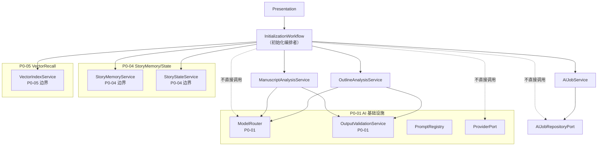
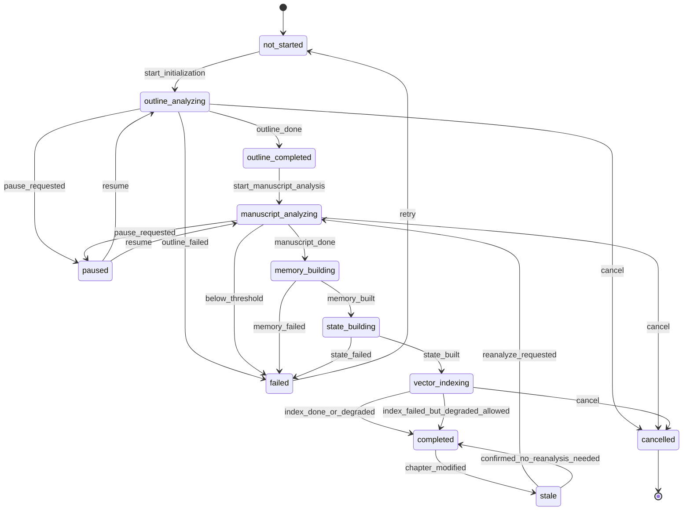
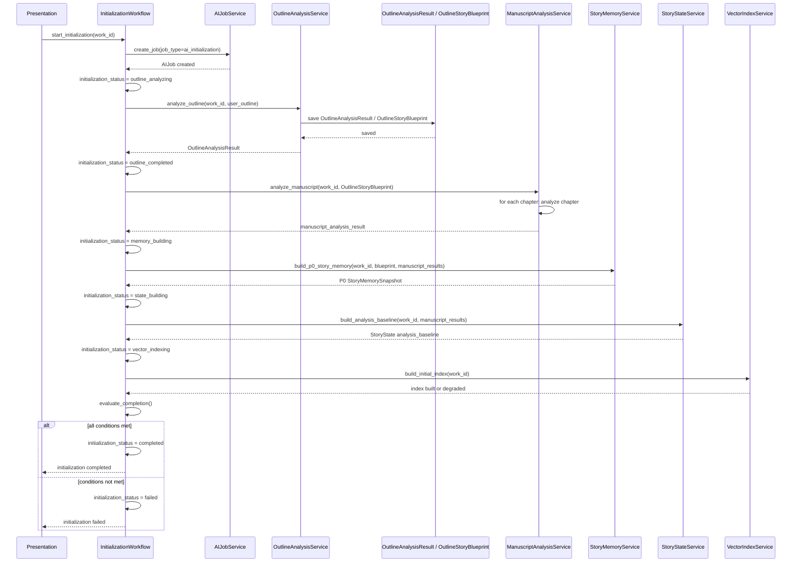

# InkTrace V2.0-P0-03 初始化流程详细设计

版本：v2.0-p0-detail-03  
状态：P0 模块级详细设计  
依据文档：

- `docs/01_requirements/InkTrace-V2.0-需求规格说明书.md`
- `docs/07_overview/InkTrace-V2.0-概要设计说明书.md`
- `docs/02_architecture/InkTrace-V2.0-架构设计说明书.md`
- `docs/03_design/InkTrace-V2.0-P0-详细设计总纲.md`
- `docs/03_design/InkTrace-V2.0-P0-01-AI基础设施详细设计.md`
- `docs/03_design/InkTrace-V2.0-P0-02-AIJobSystem详细设计.md`

---

## 一、文档定位与设计范围

### 1.1 文档定位

本文档是 InkTrace V2.0-P0 的第三个模块级详细设计文档，仅覆盖 P0 AI Initialization。

本文档用于指导后续实现设计、开发计划与 Task 拆分，但本文档本身不写代码、不修改源码、不生成数据库迁移、不拆 Task、不进入开发计划。

### 1.2 设计范围

本模块覆盖：

- 作品 AI 初始化总流程。
- 两阶段设计：大纲分析阶段与正文分析阶段。
- OutlineAnalysisService。
- ManuscriptAnalysisService。
- OutlineAnalysisResult。
- OutlineStoryBlueprint。
- ChapterSummary。
- CurrentStorySummary。
- BasicCharacterState。
- BasicForeshadowCandidate。
- BasicSettingFact。
- 初始化生成 P0 StoryMemory 的输入。
- 初始化生成 StoryState analysis_baseline 的输入。
- 初始化触发 VectorIndex 初始构建的边界。
- 初始化状态 initialization_status。
- 正文分析章节失败后的 retry / skip / partial success 规则。
- 初始化完成判定规则。
- 初始化失败 / 暂停 / 继续 / 取消 / 重试规则。
- 与 AIJobSystem 的关系。
- 与 P0-01 AI 基础设施的关系。
- 与 P0-04 StoryMemory 与 StoryState 的边界。
- 与 P0-05 VectorRecall 的边界。
- 与 Quick Trial 的关系。

### 1.3 本文档不覆盖

本文档不覆盖：

- AI 基础设施的 Provider / Prompt / OutputValidator 详细设计。
- AIJobSystem 的 Job / Step / Attempt / 状态机 / pause / resume / cancel / retry 详细内部设计。
- StoryMemory / StoryState 的详细内部结构设计。
- VectorRecall / VectorIndexService 的切片策略、Embedding 模型、召回策略详细设计。
- Context Pack 详细设计。
- Minimal Continuation Workflow 详细设计。
- Candidate Draft 与 Human Review Gate 详细设计。
- AI Review 详细设计。
- API 与前端交互详细设计。
- 完整 Agent Runtime。
- 完整四层剧情轨道。
- A/B/C 剧情方向推演。
- AI Suggestion / Conflict Guard 完整能力。
- Story Memory Revision 完整能力。
- Style DNA、Citation Link、@ 标签引用系统。

---

## 二、P0 初始化目标

### 2.1 模块目标

P0 初始化是 AI 进入作品的第一道流程。

目标：

- 让作品从**未初始化**状态进入**可正式 AI 续写**状态。
- 通过大纲分析形成 OutlineAnalysisResult / OutlineStoryBlueprint。
- 通过正文分析生成章节摘要、当前进度摘要、主要角色状态、基础伏笔候选、基础设定事实。
- 为 P0 StoryMemory 构建提供输入。
- 为 StoryState analysis_baseline 构建提供输入。
- 为 VectorIndex 初始构建提供输入。
- 初始化完成后，正式续写入口可用。
- 初始化未完成时，正式续写不可用。
- 初始化未完成时，只允许 Quick Trial 快速试写降级。

### 2.2 与 P0 主链路的关系

```
初始化完成
    │
    ▼
正式续写入口可用
    │
    ▼
用户触发续写 → Context Pack → Writing Task → Writer → Candidate Draft → Review → Human Review Gate
```

初始化是正式续写的前置条件。

### 2.3 基础原则

- 初始化分为两个阶段：先大纲分析，再正文分析。
- 正文分析必须对照大纲分析结果，不是独立摘要任务。
- 大纲分析结果不得覆盖用户原始大纲。
- 正文分析结果不得修改正式正文。
- 初始化结果不得直接覆盖正式资产。
- 初始化结果只作为 P0 StoryMemory / StoryState / VectorIndex 的输入。
- 初始化失败不得让正式续写入口可用。
- 初始化失败不影响 V1.1 写作、保存、导入、导出能力。

---

## 三、模块边界与不做事项

### 3.1 P0 做什么

P0 初始化流程必须完成：

- 两阶段初始化编排。
- OutlineAnalysisService 大纲分析。
- ManuscriptAnalysisService 正文分析。
- 生成章节级 ChapterSummary。
- 生成 CurrentStorySummary。
- 抽取 BasicCharacterState。
- 抽取 BasicForeshadowCandidate。
- 抽取 BasicSettingFact。
- 构建 P0 StoryMemory 的输入数据。
- 构建 StoryState analysis_baseline 的输入数据。
- 触发 VectorIndex 初始构建。
- 维护 initialization_status。
- 判定初始化是否完成。
- 支持章节分析 retry / skip / partial success。

### 3.2 P0 不做什么

P0 初始化流程不做：

- 不实现完整 Agent Runtime。
- 不实现完整四层剧情轨道。
- 不实现 A/B/C 剧情方向推演。
- 不实现 AI Suggestion / Conflict Guard 完整能力。
- 不实现完整 Story Memory Revision。
- 不覆盖用户原始大纲。
- 不创建正式章节。
- 不写正式正文。
- 不创建 CandidateDraft。
- 不直接更新正式资产。
- 不静默更新正式 StoryState。
- 不设计 StoryMemory 详细内部结构。
- 不设计 VectorIndex 切片策略与 Embedding 模型细节。
- 不设计 Context Pack。
- 不设计 Minimal Continuation Workflow。

### 3.3 禁止行为

初始化流程禁止：

- 修改用户原始大纲。
- 创建正式章节。
- 写入正式正文。
- 覆盖正式资产。
- 静默更新正式 StoryState。
- 绕过 Human Review Gate。
- 创建 CandidateDraft。
- 初始化失败后让正式续写入口可用。
- 未经用户确认写入正式 StoryMemory。
- 未经用户确认写入正式 StoryState。

---

## 四、总体架构

### 4.1 模块关系说明

初始化流程编排由 InitializationWorkflow（或 InitializationApplicationService）执行，它调用多个 Core Application Service，这些 Service 通过 ModelRouter 使用 AI 基础设施。

初始化流程不是 P1 的五 Agent Workflow。它不属于 Tool Facade / Minimal Continuation Workflow。

初始化流程的模块关系：

```
InitializationWorkflow（编排者）
    │
    ├── AIJobService（Job 生命周期管理）
    ├── OutlineAnalysisService（大纲分析）
    ├── ManuscriptAnalysisService（正文分析）
    ├── StoryMemoryService（P0 记忆构建，P0-04）
    ├── StoryStateService（P0 状态构建，P0-04）
    └── VectorIndexService（向量索引构建，P0-05）
```

### 4.2 模块关系图



### 4.3 与 P0-01 / P0-02 / P0-04 / P0-05 / P0-08 的边界

| 模块 | 与 P0-03 的关系 |
|---|---|
| P0-01 AI 基础设施 | OutlineAnalysisService 和 ManuscriptAnalysisService 通过 ModelRouter 调用模型，使用 PromptRegistry 获取 PromptTemplate，使用 OutputValidator 校验输出 |
| P0-02 AIJobSystem | 初始化流程通过 AIJobService 创建和管理 ai_initialization Job，查询 failed_step_count / skipped_step_count |
| P0-04 StoryMemory / StoryState | 初始化流程调用 StoryMemoryService 和 StoryStateService 构建记忆和状态，但不设计其内部结构 |
| P0-05 VectorRecall | 初始化流程调用 VectorIndexService 触发初始索引构建，但不设计切片和 Embedding 细节 |
| P0-08 Minimal Continuation Workflow | 初始化完成后才开放续写；初始化未完成时正式续写 blocked |

### 4.4 禁止调用路径

- InitializationWorkflow 不得直接调用 ModelRouter。
- InitializationWorkflow 不得直接调用 ProviderPort。
- InitializationWorkflow 不得直接调用 AIJobRepositoryPort。
- InitializationWorkflow 不得直接创建 CandidateDraft。
- InitializationWorkflow 不得直接写正式正文。
- InitializationWorkflow 不得直接覆盖正式资产。

允许：

- InitializationWorkflow -> AIJobService（更新 Job / Step 状态）。
- InitializationWorkflow -> OutlineAnalysisService（调用大纲分析）。
- InitializationWorkflow -> ManuscriptAnalysisService（调用正文分析）。
- InitializationWorkflow -> StoryMemoryService（触发记忆构建）。

---

## 五、初始化状态设计

### 5.1 initialization_status

作品级初始化状态，记录在作品元数据中。

| 状态 | 说明 |
|---|---|
| not_started | 从未启动初始化 |
| outline_analyzing | 大纲分析执行中 |
| outline_completed | 大纲分析完成，等待正文分析 |
| manuscript_analyzing | 正文分析执行中 |
| memory_building | P0 StoryMemory 构建中 |
| state_building | StoryState analysis_baseline 构建中 |
| vector_indexing | 向量索引构建中 |
| completed | 初始化完成，正式续写可用 |
| failed | 初始化失败 |
| paused | 初始化暂停 |
| cancelled | 初始化取消，终态 |
| stale | 初始化完成后正文修改，结果可能过期 |

### 5.2 状态流转



### 5.3 正式续写可用性

| initialization_status | 正式续写可用 | Quick Trial 可用 |
|---|---|---|
| not_started | 不可用 | 可用 |
| outline_analyzing | 不可用 | 可用 |
| outline_completed | 不可用 | 可用 |
| manuscript_analyzing | 不可用 | 可用 |
| memory_building | 不可用 | 可用 |
| state_building | 不可用 | 可用 |
| vector_indexing | 不可用 | 可用 |
| **completed** | **可用** | 可用 |
| failed | 不可用 | 可用 |
| paused | 不可用 | 可用 |
| cancelled | 不可用 | 可用 |
| stale | **degraded（见 5.5）** | 可用 |

### 5.4 completed 的判定条件

initialization_status = completed 必须同时满足：

1. OutlineAnalysisResult 已生成。
2. OutlineStoryBlueprint 已生成。
3. 正文分析达到 P0 最小成功阈值（见第九章）。
4. P0 StoryMemorySnapshot 构建成功。
5. StoryState analysis_baseline 构建成功。
6. StoryState baseline source = confirmed_chapter_analysis。
7. 不存在阻断正式续写的 failed required step。

VectorIndex 初始构建失败**不阻断** completed，但必须在 metadata 中记录 `vector_index_warning = true`，后续 Context Pack 进入 degraded（无 RAG 层）。

### 5.5 stale 规则

stale 不是终态，表示初始化完成后正文被修改，分析结果可能过期。

进入条件：

- initialization_status = completed 且已确认章节正文被用户修改。

阻断规则：

- 修改当前续写目标章节或最近 3 章：正式续写 blocked，要求重新分析（stale → manuscript_analyzing）。
- 修改较早章节：允许 degraded 续写，但提示 StoryState / Context Pack 可能过期；用户可选择重新分析或忽略。

退出条件：

- 用户触发重新分析（stale → manuscript_analyzing）。
- 用户确认无需重新分析（stale → completed），仅标记 `analysis_confirmed = true`，不清除历史分析数据。

P0 不实现复杂版本化，只实现最小 stale 标记。stale 标记在作品元数据中记录 `analysis_stale = true` 和 `stale_since` 时间。

### 5.6 failed 后能否 retry

- failed 不是终态，可 retry。
- retry 将 initialization_status 重置为 not_started，并重新创建 ai_initialization Job。
- 已完成的 Step 可重新执行或跳过，取决于用户选择。
- retry 不清除历史 OutlineAnalysisResult（但重新分析后会覆盖）。

### 5.7 paused 后能否 resume

- paused 不是终态，可 resume。
- resume 从 paused 时的未完成 Step 继续。
- 已 completed 的 Step 不重复执行。
- 已 skipped 的 Step 不自动恢复。

### 5.8 cancelled 是否终态

- cancelled 是终态。
- cancelled 后可以重新启动新的初始化流程（相当于从 not_started 重新开始）。
- cancelled 保留历史分析结果作为调试信息，但不作为正式分析依据。

---

## 六、初始化总流程

### 6.1 两阶段初始化流程

作品 AI 初始化分两个阶段顺序执行：

```
第一阶段：大纲分析
├── OutlineAnalysisService 分析用户原始大纲
├── 生成 OutlineAnalysisResult / OutlineStoryBlueprint
└── 大纲分析结果落库（不覆盖用户大纲）

第二阶段：正文分析
├── ManuscriptAnalysisService 按章节分析正文
├── 必须读取 OutlineStoryBlueprint
├── 生成 ChapterSummary（每章）
├── 生成 CurrentStorySummary
├── 抽取 BasicCharacterState
├── 抽取 BasicForeshadowCandidate
├── 抽取 BasicSettingFact
└── 正文分析结果作为 StoryMemory / StoryState / VectorIndex 的输入

构建阶段（正文分析完成后顺序执行）：
├── StoryMemoryService 构建 P0 StoryMemorySnapshot
├── StoryStateService 构建 StoryState analysis_baseline
└── VectorIndexService 构建向量索引
```

### 6.2 初始化总流程图



---

## 七、大纲分析详细设计

### 7.1 OutlineAnalysisService 职责

OutlineAnalysisService 负责分析用户作品大纲，生成结构化分析结果。

职责：

- 读取用户原始大纲。
- 调用模型通过 `outline_analyzer` 角色分析大纲。
- 生成 OutlineAnalysisResult。
- 生成 OutlineStoryBlueprint。
- 输出结果不得覆盖用户原始大纲。

### 7.2 输入

| 输入 | 说明 | 必需 |
|---|---|---|
| work_id | 作品 ID | 是 |
| work_title | 作品标题 | 是 |
| user_outline | 用户作品大纲文本（work_outlines.content_text） | 否，为空时跳过详细分析 |
| existing_chapter_list | 已有章节标题和 order_index 列表 | 否 |
| genre_hints | 题材提示，可选 | 否 |
| style_hints | 风格提示，可选 | 否 |

### 7.3 输出

OutlineAnalysisResult 概念字段：

| 字段 | 说明 |
|---|---|
| outline_analysis_id | 分析结果 ID |
| work_id | 作品 ID |
| analysis_version | 分析版本 |
| story_phase_map | 故事阶段划分列表 |
| main_conflict | 核心冲突描述 |
| important_characters | 主要人物列表 |
| setting_facts | 世界观设定事实列表 |
| foreshadow_map | 伏笔线索地图 |
| expected_story_direction | 预期故事走向 |
| analysis_confidence | 分析置信度，可选 |
| warnings | 警告列表，可选 |
| created_at | 创建时间 |

OutlineStoryBlueprint 概念字段：

| 字段 | 说明 |
|---|---|
| story_blueprint_id | Blueprint ID |
| work_id | 作品 ID |
| phases | 阶段划分列表，每阶段包含阶段名称、目标、核心冲突、预期章节范围 |
| key_plot_points | 关键剧情节点列表 |
| character_archetypes | 角色原型的结构化描述 |
| world_rules | 世界观核心规则 |
| genre_analysis | 题材分析结果 |
| created_at | 创建时间 |

### 7.4 Prompt key 方向

- `outline_analysis_p0`

### 7.5 output_schema_key 方向

- `outline_analysis_result_v1`
- `outline_story_blueprint_v1`

### 7.6 使用 ModelRouter 的 model_role

- `outline_analyzer`

### 7.7 依赖

- ModelRouter（P0-01）
- PromptRegistryService（P0-01）
- OutputValidationService（P0-01）
- LLMCallLogger（P0-01）
- AIJobService（P0-02，用于更新 Step 状态和记录 attempt）

### 7.8 不允许做的事情

- 不覆盖用户原始大纲。
- 不创建正式章节。
- 不写正式 StoryMemory。
- 不写正式 StoryState。
- 不创建 CandidateDraft。
- 不替用户决定剧情方向。
- 不直接写正式资产。

### 7.9 失败处理

| 场景 | 处理 |
|---|---|
| 用户大纲为空 | 跳过详细大纲分析，生成 minimal OutlineStoryBlueprint（含作品标题、空阶段列表、空角色列表）；初始化可继续，但标记 `outline_empty = true` |
| Provider 调用失败 | Step 进入 retry，最多 3 次总调用上限（继承 P0-01）；超过后初始化 Job failed |
| schema 校验失败 | Step 进入 retry，最多 2 次 schema 修复重试（继承 P0-01）；超过后初始化 Job failed |
| 大纲分析失败 | OutlineAnalysisResult 不创建；初始化 Job failed；正式续写不可用 |

### 7.10 边界

大纲分析是**第一阶段必需 Step**。大纲分析失败时：

- OutlineAnalysisResult 不生成。
- 正文分析不能开始。
- 初始化不能 completed。
- 正式续写不可用。

### 7.11 与 AIJobStep / LLMCallLog 的关系

- OutlineAnalysisService 在执行过程中通过 AIJobService 记录 Step 状态和 attempt。
- 每次模型调用通过 LLMCallLogger 记录 LLMCallLog。
- 失败时写入 Attempt 的 error_code / error_message。

---

## 八、正文分析详细设计

### 8.1 ManuscriptAnalysisService 职责

ManuscriptAnalysisService 负责分析已有正文，生成章节级分析结果。

职责：

- 按章节分析已确认正文。
- 必须读取 OutlineAnalysisResult / OutlineStoryBlueprint。
- 对照大纲判断正文进度、偏差、冲突和伏笔信息。
- 生成 ChapterSummary。
- 生成 CurrentStorySummary。
- 抽取 BasicCharacterState。
- 抽取 BasicForeshadowCandidate。
- 抽取 BasicSettingFact。
- 记录与大纲的偏差和进展。

### 8.2 输入

| 输入 | 说明 | 必需 |
|---|---|---|
| work_id | 作品 ID | 是 |
| outline_blueprint | OutlineAnalysisResult / OutlineStoryBlueprint | 是 |
| chapter_id | 当前分析章节 ID | 是 |
| chapter_title | 当前章节标题 | 是 |
| chapter_content | 当前章节正文 | 是 |
| chapter_order | 当前章节 order_index | 是 |
| previous_chapter_summaries | 之前章节的摘要列表，可选 | 否 |
| token_budget_info | token 预算信息，可选 | 否 |

### 8.3 输出

每章输出 ChapterAnalysisResult：

| 字段 | 说明 |
|---|---|
| chapter_id | 章节 ID |
| chapter_order | 章节序号 |
| chapter_summary | ChapterSummary，含章节摘要 |
| chapter_position | 章节在大纲阶段中的位置 |
| plot_progress | 剧情推进情况 |
| character_state_delta | 本章角色状态变化 |
| setting_fact_delta | 本章设定事实变化 |
| foreshadow_candidate_delta | 本章伏笔候选 |
| unresolved_questions | 未解答问题列表 |
| deviations_from_outline | 与大纲的偏差列表 |
| timeline_info | 时间线信息 |
| warnings | 警告列表 |
| analysis_confidence | 分析置信度，可选 |

ChapterSummary 概念字段：

| 字段 | 说明 |
|---|---|
| chapter_id | 章节 ID |
| summary_text | 章节摘要文本（1-3 句） |
| key_events | 关键事件列表 |
| mentioned_characters | 本章提及的角色 ID 列表 |
| created_at | 创建时间 |

BasicCharacterState 概念字段：

| 字段 | 说明 |
|---|---|
| character_name | 角色名称 |
| current_location | 当前地点 |
| current_status | 当前状态描述 |
| recent_actions | 近期行动 |
| relationships | 关系变化 |
| confidence | 提取置信度 |

BasicForeshadowCandidate 概念字段：

| 字段 | 说明 |
|---|---|
| description | 伏笔描述 |
| related_chapter_id | 关联章节 ID |
| confidence | 提取置信度 |

BasicSettingFact 概念字段：

| 字段 | 说明 |
|---|---|
| fact_type | 事实类型（世界观/规则/物品/地点） |
| description | 事实描述 |
| confidence | 提取置信度 |

CurrentStorySummary 概念字段：

| 字段 | 说明 |
|---|---|
| work_id | 作品 ID |
| summary_text | 全书当前进度摘要 |
| completed_phases | 已完成阶段列表 |
| current_phase | 当前所处阶段 |
| progress_percentage | 预估完成百分比 |
| active_conflicts | 当前活跃冲突 |
| unresolved_foreshadows | 未解伏笔列表 |
| updated_at | 更新时间 |

### 8.4 Prompt key 方向

- `manuscript_chapter_analysis_p0`

### 8.5 output_schema_key 方向

- `chapter_analysis_result_v1`
- `chapter_summary_v1`
- `character_state_v1`
- `foreshadow_candidate_v1`
- `setting_fact_v1`

### 8.6 使用 ModelRouter 的 model_role

- `manuscript_analyzer`

### 8.7 依赖

- ModelRouter（P0-01）
- PromptRegistryService（P0-01）
- OutputValidationService（P0-01）
- LLMCallLogger（P0-01）
- AIJobService（P0-02）
- OutlineAnalysisResult / OutlineStoryBlueprint（本模块输出）

### 8.8 不允许做的事情

- 不修改章节正文。
- 不创建正式章节。
- 不覆盖正式资产。
- 不直接写正式 StoryMemory。
- 不直接写正式 StoryState。
- 不直接触发正式续写。
- 不创建 CandidateDraft。

### 8.9 章节级失败处理

| 场景 | 处理 |
|---|---|
| 单章 Provider 调用失败 | 该章 Step failed，用户可选择 retry 或 skip |
| 单章 schema 校验失败 | 最多 2 次 schema 修复重试；超过后该章 Step failed |
| 单章分析跳过后 | skipped 计入流程进度，不计入成功质量 |
| 单章内容为空 | 跳过分析，生成空摘要，标记 `chapter_empty = true`，不视为失败 |
| 单章过长（> 2 万字） | 按段落分段分析后合并摘要，每段独立调用模型或一次性送入取决于 token 预算 |
| 单章从大纲蓝图中找不到对应位置 | 标记 `position_unmapped`，可继续分析 |

---

## 九、partial_success 与章节失败处理

### 9.1 正文分析按章节 Step 执行

正文分析中，每章对应一个独立的 `manuscript_chapter_analysis` Step。每个 Step 有独立的 attempt、retry、skip 控制。

### 9.2 每章失败后的 retry

- 单章 Step failed 后，用户可点击 retry。
- retry 后该章重新进入 running 状态，生成新的 attempt。
- retry 不删除之前的 failed attempt 记录。
- 每次 retry 消耗该 Step 的总调用次数配额（继承 P0-01：单 Step 最多 3 次总调用）。
- retry 仍然失败后 Step 回到 failed。

### 9.3 每章失败后的 skip

- 单章 Step failed 后，用户可选择 skip。
- skip 的前提是该 Step 的 step_type 允许 partial success。
- `manuscript_chapter_analysis` 默认允许 skip。
- skip 后该章不重新分析，不生成该章的 ChapterAnalysisResult。
- skip 必须记录 reason（user_skipped）。
- skip 计入 completed_steps（流程进度计数），但计入 skipped_step_count（质量计数）。

### 9.4 skipped 不等于 success

- skipped 只表示用户选择跳过该章分析。
- skipped 的章节没有可用的 ChapterAnalysisResult。
- skipped 在初始化完成判定中视为**未成功分析**。

### 9.5 P0 默认最小完成阈值

初始化 completed 的正文分析阈值：

| 条件 | 阈值 |
|---|---|
| 章节分析成功率 | >= 80%（completed_steps / total_chapter_steps >= 80%，其中 completed_steps 指 completed 状态的 Step，不含 skipped 和 failed） |
| 最近 3 章 | 必须全部分析成功（completed，非 skipped） |
| 最后一章或当前续写目标章节前一章 | 必须分析成功 |
| 大纲分析 | 必须成功 |
| StoryMemory 构建 | 必须成功 |
| StoryState analysis_baseline 构建 | 必须成功 |

如果失败章节超过这些阈值，initialization_status = failed 或 paused_waiting_user_decision。

如果部分章节 skipped 但满足阈值，初始化可以 completed，但必须记录 `warning_count` 和 `skipped_chapter_ids`。

### 9.6 判定规则

判定由 InitializationWorkflow 执行，非 AIJobService。

```
if outline_analysis failed:
    initialization_status = failed
    return

if 正文分析成功率 < 80%:
    initialization_status = failed
    return

if 最近 3 章中有 failed（非 skipped）:
    initialization_status = failed
    return

if 最后一章或目标章节前一章 failed:
    initialization_status = failed
    return

if StoryMemory 构建 failed:
    initialization_status = failed
    return

if StoryState 构建 failed:
    initialization_status = failed
    return

# VectorIndex 不阻断 completed
if all required conditions met:
    initialization_status = completed
    if skipped_chapter_count > 0:
        completed with warnings
```

---

## 十、初始化完成判定

### 10.1 completed 必要条件

initialization_status = completed 必须同时满足：

1. ✅ OutlineAnalysisResult 已生成。
2. ✅ OutlineStoryBlueprint 已生成。
3. ✅ 正文分析达到 P0 最小成功阈值（9.5 节）。
4. ✅ P0 StoryMemorySnapshot 构建成功。
5. ✅ StoryState analysis_baseline 构建成功。
6. ✅ StoryState baseline source = confirmed_chapter_analysis。
7. ✅ 不存在阻断正式续写的 failed required step。

### 10.2 VectorIndex 是否阻断 completed

**不阻断。**

VectorIndex 构建失败时：

- initialization_status 仍可 = completed。
- 作品 metadata 记录 `vector_index_warning = true`。
- 后续 Context Pack 进入 degraded 模式（无 RAG 层）。
- 不影响正式续写的基本可用性。

### 10.3 阻断完成的条件

以下任一条件未满足则初始化不能 completed：

- OutlineAnalysisResult 缺失 → **必须阻断**正式续写。
- StoryMemory 构建失败 → **必须阻断**正式续写。
- StoryState analysis_baseline 缺失 → **必须阻断**正式续写。
- 正文分析低于阈值 → **必须阻断**正式续写（阈值见 9.5 节）。

### 10.4 completed 后的 metadata

initialization_status = completed 时，作品元数据记录：

- `initialization_status = completed`
- `initialization_completed_at`
- `initialization_job_id`
- `total_chapter_count`
- `analyzed_chapter_count`
- `skipped_chapter_count`
- `failed_chapter_count`
- `warning_count`
- `vector_index_warning`（布尔值）
- `outline_empty`（如果大纲为空）
- `outline_analysis_id`
- `story_memory_snapshot_id`
- `story_state_baseline_id`

---

## 十一、StoryMemory / StoryState 构建边界

### 11.1 P0-03 不负责详细结构设计

P0-03 只定义初始化如何调用 StoryMemoryService 和 StoryStateService，不展开 P0-04 的详细内部设计。

### 11.2 初始化对 StoryMemoryService 的调用

InitializationWorkflow 在正文分析完成后调用 StoryMemoryService：

```text
输入：
- work_id
- OutlineStoryBlueprint
- 所有 ChapterAnalysisResult 列表
- BasicCharacterState 列表
- BasicForeshadowCandidate 列表
- BasicSettingFact 列表

调用：
StoryMemoryService.build_p0_story_memory(work_id, blueprint, results)

输出：
- P0 StoryMemorySnapshot
```

### 11.3 初始化对 StoryStateService 的调用

InitializationWorkflow 在 StoryMemory 构建完成后调用 StoryStateService：

```text
输入：
- work_id
- 已确认章节的 ChapterAnalysisResult
- 最近章节的 Story State 信息

调用：
StoryStateService.build_analysis_baseline(work_id, results)

输出：
- StoryState analysis_baseline

约束：
- StoryState analysis_baseline 的 source 必须是 confirmed_chapter_analysis
```

### 11.4 边界约束

- P0-03 不负责 StoryMemory 详细结构设计。
- P0-03 不负责 StoryState 详细结构设计。
- P0-03 只定义初始化对它们的触发和输入。
- AI 不得静默更新正式 StoryState。
- P0 不通过 AI Suggestion 更新正式 StoryState。
- P0 不提供复杂手动 StoryState 维护入口。
- 用户采纳 AI 建议更新 StoryState 属于 P1。
- 用户手动资产影响 StoryState 属于 P1 / P2 扩展。

---

## 十二、VectorIndex 初始构建边界

### 12.1 P0-03 不负责切片和 Embedding 设计

P0-03 只定义初始化触发 VectorIndexService 的边界，不展开 P0-05 的切片策略、Embedding 模型、召回策略细节。

### 12.2 初始化触发 VectorIndexService

InitializationWorkflow 在 StoryState 构建完成后（或在完成判定时并行）调用 VectorIndexService：

```text
输入：
- work_id
- 已确认的章节列表

调用：
VectorIndexService.build_initial_index(work_id, chapters)

输出：
- index_built（成功）
- index_failed（失败）
```

### 12.3 边界约束

- VectorIndexService 负责章节切片、Embedding、写入 VectorStore。
- P0-03 不设计切片策略细节。
- P0-03 不设计 Embedding 模型细节。
- VectorIndex 构建失败不影响 V1.1。
- VectorIndex 构建失败不阻断 initialization_status = completed，但记录 warning。
- VectorIndex 构建失败后后续 Context Pack 进入 degraded（无 RAG 层）。
- P0-05 详细设计可细化重建和召回策略。

---

## 十三、AIJob 与 Step 设计

### 13.1 job_type

初始化 Job 的 job_type = `ai_initialization`。

### 13.2 典型 Step

| step_type | required | skippable | retryable | 说明 |
|---|---|---|---|---|
| load_settings | 是 | 否 | 是 | 加载 AI Settings / ModelRoleConfig |
| outline_analysis | 是 | 否 | 是 | 大纲分析 |
| manuscript_chapter_analysis（每章一个 Step） | 是 | 是 | 是 | 正文章节分析，允许 skip |
| build_story_memory | 是 | 否 | 是 | 构建 P0 StoryMemory |
| build_story_state | 是 | 否 | 是 | 构建 StoryState analysis_baseline |
| build_vector_index | 否 | 是 | 是 | 构建向量索引，失败不阻断 |
| finalize_initialization | 是 | 否 | 是 | 最终完成判定和状态写入 |

### 13.3 Step required / skippable / retryable 说明

**required = 是 的 Step 必须 completed 才能整体初始化 completed。**

- `load_settings`：必需。失败阻断后续全部步骤。
- `outline_analysis`：必需。失败阻断正文分析。
- `manuscript_chapter_analysis`：必需（但允许 partial success）。失败比例超过阈值阻断初始化。
- `build_story_memory`：必需。失败阻断初始化。
- `build_story_state`：必需。失败阻断初始化。
- `build_vector_index`：**非必需**。失败不阻断初始化。
- `finalize_initialization`：必需。负责最终状态写入。

**skippable = 是 的 Step 允许用户跳过。**

- `manuscript_chapter_analysis`：允许 skip。
- `build_vector_index`：允许 skip（或直接标记为因失败而 skipped）。

**retryable = 是 的 Step 允许 failed 后 retry。**

- 所有 Step 都允许 retry。
- retry 后重新执行该 Step。
- retry 不删除历史 attempt 记录。

### 13.4 update_progress 计算

Progress percent 计算方式：

```
total_required_steps = outline_analysis(1) + manuscript_chapter_analysis(N) + build_story_memory(1) + build_story_state(1) + finalize_initialization(1)
completed_steps = completed + skipped 的 Step 数量
percent = completed_steps / total_required_steps * 100
```

- `build_vector_index` 不计入 required total_steps（可选 Step）。
- `load_settings` 可合并到 outline_analysis Step 之前作为前置依赖，或单独作为 Step。
- percent 只表示流程进度，不表示分析质量。
- failed 时 percent 不强制 100%。

### 13.5 failed_step_count / skipped_step_count 对初始化判定的作用

AIJobService 提供以下聚合统计供 InitializationWorkflow 使用：

- `total_chapter_analysis_steps`：总的章节分析 Step 数。
- `completed_chapter_analysis_steps`：completed 的章节分析 Step 数。
- `skipped_chapter_analysis_steps`：skipped 的章节分析 Step 数。
- `failed_chapter_analysis_steps`：failed 的章节分析 Step 数。
- `all_chapter_step_ids`：所有章节 Step 的 ID 列表（用于定位哪些章节失败）。

InitializationWorkflow 根据这些统计和 9.5 节的阈值判定初始化是否 completed。

### 13.6 cancel / pause / retry 规则

**cancel：**

- cancelled Job 不得继续写 StoryMemory / StoryState / VectorIndex。
- cancelled Job 的迟到 ProviderResponse 不得推进 Step。
- cancelled 保留已有分析结果作为历史记录，不用于正式续写。

**pause：**

- paused Job 不得自动进入后续 Step。
- 当前正在执行的模型调用可继续完成当前 Step，或标记 pause_requested。
- paused 后用户可 resume 或 cancel。
- pause 不删除已生成的 ChapterAnalysisResult。

**retry：**

- retry 复用原有 Job ID。
- retry 将 failed Job 重新置为 running，从未完成的关键 Step 继续。
- retry 不删除历史 attempt 和 LLMCallLog。
- retry 不自动跳过大纲分析（大纲分析必须重新执行或确认可复用）。

---

## 十四、Quick Trial 与初始化关系

### 14.1 Quick Trial 不等于初始化

Quick Trial 是**未初始化时的非正式降级试写**，不是初始化的一部分。

### 14.2 规则

- 初始化未完成时，正式续写不可用。
- 初始化未完成时，Quick Trial 可用。
- Quick Trial 只能使用当前章节、当前选区、用户输入的大纲或作品原始大纲等临时上下文。
- Quick Trial 必须标记"上下文不足，非正式智能续写"。
- Quick Trial 结果只能进入 Candidate Draft 或临时候选区。
- Quick Trial 不更新 StoryMemory。
- Quick Trial 不生成正式 Memory Update Suggestion。
- Quick Trial 不更新正式 StoryState。
- Quick Trial 不改变 initialization_status。
- Quick Trial 成功不代表初始化完成。
- Quick Trial 不使正式续写入口可用。
- Quick Trial 不作为正式续写质量验收依据。
- Quick Trial 不绕过 Human Review Gate。

### 14.3 快速试写与初始化的关系图

```
初始化未完成
    │
    ├── 正式续写入口 → 不可用（灰色，提示"AI 初始化未完成"）
    │
    └── Quick Trial → 可用（标记"上下文不足"）
            │
            ├── Quick Trial Job
            ├── 临时上下文（当前章节 + 大纲）
            ├── 生成 Candidate Draft
            ├── Human Review Gate
            ├── 不更新 StoryMemory
            └── 不改变 initialization_status
```

---

## 十五、正文修改后的 stale / reanalysis 规则

### 15.1 P0 最小规则

初始化 completed 后，如果用户修改已确认章节正文：

1. 应将 initialization_status 标记为 `stale`。
2. 在作品 metadata 中记录 `analysis_stale = true` 和 `stale_since`。
3. P0 不实现复杂版本化，只做最小过期标记。

### 15.2 默认策略

| 修改位置 | 策略 |
|---|---|
| 修改当前续写目标章节 | 正式续写 **blocked**，要求重新分析该章 |
| 修改最近 3 章中的章节 | 正式续写 **blocked**，要求重新分析 |
| 修改较早章节（非最近 3 章） | 允许 **degraded** 续写，但提示 StoryState / Context Pack 可能过期 |
| 同时修改多章 | 按修改范围应用上述规则，取最严格策略 |

### 15.3 重新分析触发的状态流转

```
stale（正文修改后）
    │
    ├── 用户选择重新分析 → manuscript_analyzing（只重跑受影响章节）
    │   └── 完成后 → completed
    │
    └── 用户确认无需重新分析 → completed（标记 analysis_confirmed = true）
```

### 15.4 P0 不实现

- 自动检测正文变化后自动触发重新分析（P1 / P2 扩展）。
- 复杂版本化 StoryMemoryRevision（P1 扩展）。
- Conflict Guard 完整能力（P1 扩展）。

---

## 十六、错误处理与降级

### 16.1 错误处理表

| 场景 | error_code | P0 行为 | 是否阻断初始化 | V1.1 影响 |
|---|---|---|---|---|
| Provider Key 未配置 | provider_key_missing | Job blocked / failed，提示配置 Key | 阻断 | 不影响 |
| ModelRoleConfig 缺失 | model_role_config_missing | Step failed | 阻断 | 不影响 |
| PromptTemplate 缺失 | prompt_template_missing | Step failed | 阻断 | 不影响 |
| output_schema_missing | output_schema_missing | Step failed，不调用模型 | 阻断 | 不影响 |
| output_schema_invalid | output_schema_invalid | schema 修复重试最多 2 次；超过后 Step failed | 可能阻断 | 不影响 |
| Provider 超时 | provider_timeout | 可 Provider retry 1 次（不突破总调用上限 3 次） | 可恢复 | 不影响 |
| Provider 限流 | provider_rate_limited | 可 Provider retry 1 次（不突破总调用上限 3 次） | 可恢复 | 不影响 |
| Provider 服务不可用 | provider_unavailable | 可 Provider retry 1 次（不突破总调用上限 3 次） | 可恢复 | 不影响 |
| 大纲分析失败 | outline_analysis_failed | Step failed，初始化 Job failed 或等待 retry | 阻断 | 不影响 |
| 正文分析某章失败 | manuscript_chapter_failed | 该章 Step failed，用户可 retry 或 skip | 超过阈值后阻断 | 不影响 |
| 正文分析失败比例过高 | below_minimum_threshold | 初始化 Job failed | 阻断 | 不影响 |
| 用户选择跳过章节 | user_skipped | Step skipped，计入流程进度 | 不超过阈值时不阻断 | 不影响 |
| StoryMemory 构建失败 | story_memory_build_failed | Step failed，初始化 Job failed | 阻断 | 不影响 |
| StoryState 构建失败 | story_state_build_failed | Step failed，初始化 Job failed | 阻断 | 不影响 |
| VectorIndex 构建失败 | vector_index_build_failed | Step failed，初始化可继续 completed | 不阻断 | 不影响 |
| 初始化 Job cancelled | job_cancelled | 终态，保留历史记录 | 不进入 completed | 不影响 |
| 初始化 Job paused | job_paused | 等待 resume | 不阻断但暂停 | 不影响 |
| 服务重启 | service_restarted | running Job 标记 paused | 等待用户处理 | 不影响 |
| 迟到 ProviderResponse | late_response | 丢弃结果，不推进 Step | 不阻断 | 不影响 |

### 16.2 任何初始化错误都不影响 V1.1

- 初始化失败不得破坏已有正式正文。
- 初始化失败不得覆盖用户原始大纲。
- 初始化失败不得写正式资产。
- 初始化失败不得让正式续写入口可用。

### 16.3 cancelled 后迟到结果处理

初始化 Job 进入 cancelled 后：

- 迟到 ProviderResponse 不得继续推进 Step。
- 迟到结果不得创建 StoryMemory / StoryState / VectorIndex。
- 迟到结果最多只记录脱敏日志。

---

## 十七、安全、隐私与日志

### 17.1 普通日志

规则：

- 普通日志不记录完整正文。
- 普通日志不记录完整 Prompt。
- 普通日志不记录 API Key。

### 17.2 AIJobStep / Attempt 隐私边界

- AIJobStep 不保存完整正文。
- Attempt 不保存完整 Prompt、完整正文、API Key。
- LLMCallLog 只记录元数据（prompt_key、prompt_version、model_role、provider、model、token usage、elapsed_ms、error_code）。

### 17.3 ChapterSummary 边界

- ChapterSummary 可以持久化，但不能替代正式正文。
- ChapterSummary 只作为 StoryMemory 的输入，不作为章节正式内容。

### 17.4 OutlineAnalysisResult 边界

- OutlineAnalysisResult 不覆盖用户原始大纲。
- 用户原始大纲始终是用户手写的正式资产。
- 分析结果只能作为 AI 参考，不替代用户原始大纲。

### 17.5 初始化结果的可查看性

- 用户可在初始化完成后查看大纲分析结果和正文分析结果。
- 分析结果仅用于参考，正式资产始终以用户手动维护为准。

### 17.6 清理边界

- 清理失败 Job 不得删除正式正文。
- 清理失败 Job 可以删除对应的分析结果。
- 取消初始化不删除已创建的作品。

---

## 十八、P0 验收标准

1. 可以启动 ai_initialization Job。
2. 初始化 Job 包含 outline_analysis、manuscript_chapter_analysis、build_story_memory、build_story_state、build_vector_index、finalize_initialization 等 Step。
3. 大纲分析成功后生成 OutlineAnalysisResult / OutlineStoryBlueprint。
4. 大纲分析不覆盖用户原始大纲。
5. 正文分析必须基于 OutlineStoryBlueprint。
6. 正文分析可按章节执行。
7. 正文分析某章失败可 retry。
8. 正文分析某章失败可 skip，但 skipped 不等于 success。
9. 初始化完成判定包含章节分析成功率阈值（>= 80%）。
10. 初始化完成要求最近 3 章分析成功。
11. 初始化完成要求最后一章或目标上下文相关章节分析成功。
12. StoryMemory 构建失败阻断正式续写。
13. StoryState analysis_baseline 构建失败阻断正式续写。
14. StoryState baseline source = confirmed_chapter_analysis。
15. VectorIndex 失败不影响 V1.1，可让 Context Pack 后续 degraded。
16. initialization_status = completed 后正式续写入口可用。
17. initialization_status 未 completed 时正式续写不可用。
18. Quick Trial 不改变 initialization_status。
19. Quick Trial 成功不代表初始化完成。
20. 正文修改后可标记 stale / analysis_stale。
21. 初始化失败不影响 V1.1 写作、保存、导入、导出。
22. 初始化流程不写正式正文。
23. 初始化流程不覆盖正式资产。
24. 初始化流程不静默更新正式 StoryState。
25. 普通日志不记录 API Key、完整正文、完整 Prompt。
26. P0 不实现完整 Agent Runtime。
27. P0 不实现完整 Story Memory Revision。
28. P0 不实现 AI Suggestion / Conflict Guard 完整能力。
