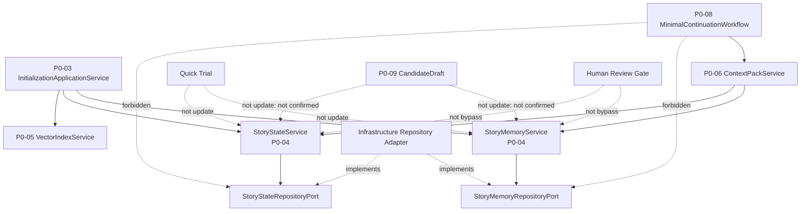

# InkTrace V2.0-P0-04 StoryMemory 与 StoryState 详细设计

版本：v2.0-p0-detail-04  
状态：P0 模块级详细设计  
依据文档：

- `docs/01_requirements/InkTrace-V2.0-需求规格说明书.md`
- `docs/07_overview/InkTrace-V2.0-概要设计说明书.md`
- `docs/02_architecture/InkTrace-V2.0-架构设计说明书.md`
- `docs/03_design/InkTrace-V2.0-P0-详细设计总纲.md`
- `docs/03_design/InkTrace-V2.0-P0-01-AI基础设施详细设计.md`
- `docs/03_design/InkTrace-V2.0-P0-02-AIJobSystem详细设计.md`
- `docs/03_design/InkTrace-V2.0-P0-03-初始化流程详细设计.md`

---

## 一、文档定位与设计范围

### 1.1 文档定位

本文档是 InkTrace V2.0-P0 的第四个模块级详细设计文档，仅覆盖 P0 StoryMemory 与 StoryState。

本文档用于冻结 P0 StoryMemorySnapshot 的结构定义、StoryState analysis_baseline 的结构定义、StoryMemoryService / StoryStateService / RepositoryPort 的职责边界，以及这两个模块与 P0-03 初始化流程、P0-06 ContextPack、P0-09 CandidateDraft / HumanReviewGate、Quick Trial 之间的交互边界。

本文档不写代码、不修改源码、不生成数据库迁移、不拆 Task、不进入开发计划。

### 1.2 设计范围

本模块覆盖：

- P0 StoryMemorySnapshot 定义与字段方向。
- P0 StoryState analysis_baseline 定义与字段方向。
- StoryMemoryService 职责、输入、输出、依赖。
- StoryStateService 职责、输入、输出、依赖。
- StoryMemoryRepositoryPort 职责边界。
- StoryStateRepositoryPort 职责边界。
- 初始化流程调用 StoryMemoryService / StoryStateService 的顺序与写入规则。
- 已确认正文变化后的 stale / reanalysis 对 StoryMemory / StoryState 的影响。
- 与 ContextPack 的读取边界与 blocked / degraded 条件。
- 与 CandidateDraft / HumanReviewGate 的边界。
- 与 Quick Trial 的边界。
- 数据一致性与写入顺序约束。
- StoryMemory / StoryState 的错误处理与降级。

### 1.3 本文档不覆盖

本文档不覆盖：

- P0-03 初始化流程的内部状态机与 partial_success 判定。
- P0-05 VectorRecall 的切片、Embedding、VectorStore、召回策略。
- P0-06 ContextPack 的组装策略、TokenBudgetPolicy、ContextPriorityPolicy、AttentionFilter、ContextPackSnapshot 详细结构。
- P0-08 MinimalContinuationWorkflow 的单章续写编排。
- P0-09 CandidateDraft 接受与 HumanReviewGate 详细流程。
- P0-10 AIReview 详细设计。
- 完整 Agent Runtime。
- AgentSession / AgentStep / AgentObservation / AgentTrace。
- 五 Agent Workflow。
- 自动连续续写队列。
- Style DNA。
- Citation Link。
- @ 标签引用系统。
- 成本看板。
- 分析看板。
- 完整 Memory Revision（P1）。
- 完整四层剧情轨道（P1）。
- AI Suggestion / Conflict Guard 完整能力（P1）。

---

## 二、P0 StoryMemory / StoryState 目标

### 2.1 StoryMemory 目标

P0 StoryMemory 的目标是形成作品级 AI 记忆快照，供后续 ContextPack 构建和正式续写前的上下文准备。

StoryMemory 解决的核心问题：

- 算法作品已有多少章，已发展到故事哪个位置。
- 哪些角色已出场、当前状态是什么。
- 世界观中哪些设定事实已建立。
- 哪些伏笔已埋下、哪些问题仍未解答。
- AI 在续写时不需要重新阅读全书，而是从 StoryMemorySnapshot 中获取上下文。

P0 的 StoryMemory 不做：

- 持续更新（P0 只做初始化快照，后续修改通过 stale / reanalysis 触发重建）。
- 用户采纳 AI 建议后自动更新（P1）。
- 多版本管理与回滚（P1）。
- 完整角色卡 / 风格画像 / 事件图谱（P1）。
- AI 输出静默更新正式记忆（禁止）。

### 2.2 StoryState 目标

P0 StoryState 的目标是锁定当前故事发展到哪一步，防止 AI 续写时写崩。

StoryState 解决的核心问题：

- 当前故事处于哪个阶段（开端 / 发展 / 高潮 / 收束）。
- 当前章节在什么时间位置、什么地点范围。
- 当前有哪些活跃角色、他们的状态是什么。
- 当前活跃冲突是什么。
- 哪些伏笔处于未解状态、哪些已解决。
- 直到目前为止已发生的关键事件序列。
- 当前还有哪些未解答的问题。

P0 的 StoryState 不做：

- AI Suggestion 更新正式 StoryState（P0 只有 analysis_baseline）。
- 复杂四层剧情轨道（P1）。
- 剧情分支推演（P1）。
- 用户手动编辑 StoryState（P1 / P2）。
- Conflict Guard 完整性（P1）。

### 2.3 为什么是正式续写前置条件

StoryMemorySnapshot 和 StoryState analysis_baseline 是正式续写的必需输入：

- ContextPack 必须从 StoryMemorySnapshot 读取全书进度摘要、角色状态、设定事实等。
- ContextPack 必须从 StoryState analysis_baseline 读取当前阶段、活跃冲突、活跃角色等。
- 缺失时 ContextPack 无法组装基本上下文，正式续写 blocked。
- 缺失时 Quick Trial 可以用临时上下文运行，但必须标记上下文不足。

---

## 三、模块边界与不做事项

### 3.1 P0 做什么

P0 StoryMemory / StoryState 必须完成：

- 基于 P0-03 初始化输入构建 StoryMemorySnapshot。
- 基于 confirmed_chapter_analysis 构建 StoryState analysis_baseline。
- 提供 RepositoryPort 用于持久化与读取。
- 支持 stale 标记与过期状态维护。
- 支持重新分析后重建或标记过期。
- 向 ContextPack 提供读取接口。
- 记录 source_job_id / source_analysis_version / source_chapter_analysis_ids 用于追踪。

### 3.2 P0 不做什么

P0 StoryMemory / StoryState 不做：

- 完整 StoryMemory Revision（P1）。
- AI Suggestion 更新正式 StoryState（P1）。
- 用户采纳 AI 建议写入正式 StoryState（P1）。
- 用户手动编辑正式资产影响 StoryState（P1 / P2）。
- 四层剧情轨道（P1）。
- A/B/C 剧情方向推演（P1）。
- 复杂手动 StoryState 维护（P2）。
- Knowledge Graph（P2）。
- Memory Agent 自动更新建议（P1）。
- Conflict Guard 完整冲突检测（P1）。
- 完整 Agent Runtime。
- AgentSession / AgentStep / AgentObservation / AgentTrace。
- 五 Agent Workflow。
- 自动连续续写队列。
- Style DNA。
- Citation Link。
- @ 标签引用系统。
- 成本看板。
- 分析看板。
- P0-05 VectorRecall 的切片、Embedding、VectorStore、召回策略。
- P0-06 ContextPack 的组装策略、TokenBudgetPolicy、ContextPriorityPolicy、AttentionFilter、ContextPackSnapshot 详细结构。
- P0-09 CandidateDraft 接受与 HumanReviewGate 详细流程。
- P0-10 AIReview 详细设计。

### 3.3 禁止行为

- StoryMemoryService 不得修改正式正文。
- StoryMemoryService 不得覆盖用户原始大纲。
- StoryMemoryService 不得覆盖正式资产。
- StoryStateService 不得基于未接受 CandidateDraft 构建 baseline。
- StoryStateService 不得基于 Quick Trial 输出构建 baseline。
- StoryStateService 不得静默更新正式 StoryState。
- Workflow / Agent 不得直接访问 StoryMemoryRepositoryPort / StoryStateRepositoryPort。
- Workflow / Agent 不得直接修改 StoryMemorySnapshot 内容。
- ContextPack 不得把 StoryMemory / StoryState 当成正式资产覆盖回项目。
- 普通日志不得记录完整正文、完整 Prompt、API Key。

---

## 四、总体架构

### 4.1 模块关系说明

StoryMemory / StoryState 属于 Core Application 层。

上下游关系：

- P0-03 初始化流程调用 StoryMemoryService.build_snapshot() 和 StoryStateService.build_analysis_baseline()。
- StoryMemoryService / StoryStateService 是 Application Service，通过 RepositoryPort 持久化。
- P0-06 ContextPackService 读取 latest StoryMemorySnapshot 和 latest StoryState analysis_baseline。
- P0-03 reanalysis 触发后，通过 StoryMemoryService / StoryStateService 重新构建或标记 stale。
- P0-08 MinimalContinuationWorkflow 通过 ContextPack 间接使用 StoryMemory / StoryState，不直接访问。
- Infrastructure Adapter 实现 StoryMemoryRepositoryPort / StoryStateRepositoryPort。

### 4.2 模块关系图



### 4.3 与相邻模块的边界

| 模块 | 关系 | 方向 |
|---|---|---|
| P0-03 初始化流程 | 调用方 | 初始化流程调用 StoryMemoryService / StoryStateService |
| P0-05 VectorRecall | 同级，不依赖 | 无直接调用关系，共享同一初始化触发 |
| P0-06 ContextPack | 读取方 | ContextPackService 读取 StoryMemory / StoryState |
| P0-08 MinimalContinuationWorkflow | 间接使用 | 通过 ContextPack 间接使用，不直接访问 |
| P0-09 CandidateDraft / HumanReviewGate | 隔离 | CandidateDraft 不更新 StoryMemory / StoryState |
| Quick Trial | 隔离 | Quick Trial 不更新 StoryMemory / StoryState |

### 4.4 禁止调用路径

- Workflow 不得直接调用 StoryMemoryRepositoryPort.save_snapshot。
- Workflow 不得直接调用 StoryStateRepositoryPort.save_analysis_baseline。
- Workflow 不得直接修改 StoryMemorySnapshot 内容。
- Agent / Workflow 不得绕过 StoryStateService 直接写 StoryState baseline。
- Quick Trial 不得调用 StoryMemoryService.build_snapshot。
- Quick Trial 不得调用 StoryStateService.build_analysis_baseline。
- CandidateDraft accept 流程不得自动触发 StoryMemory / StoryState 更新。

---

## 五、StoryMemorySnapshot 详细设计

### 5.1 定义

P0 StoryMemorySnapshot 是初始化后的作品级 AI 记忆快照。

它：

- 是 P0 初始化产物。
- 不等于正式资产。
- 不覆盖用户手动设定。
- 不替代正式正文。
- 可以被 ContextPack 读取。
- 可以被后续续写 Workflow 间接使用。
- 不允许被 Agent / Workflow 直接静默修改。
- P0 不做多版本复杂治理。

### 5.2 职责

- 记录当前已分析章节的全书级摘要。
- 记录已提取的基础角色状态（只做初始化快照，不做持续追踪）。
- 记录已提取的基础设定事实。
- 记录已提取的基础伏笔候选。
- 记录当前未解答的问题。
- 记录可选的时间线事实。
- 记录 source 追溯信息（job_id、analysis_version、chapter_analysis_ids）。
- 记录 stale_status 和 warnings。
- 记录 confidence 级别。

### 5.3 字段方向

| 字段 | 说明 | P0 必须 | 来源 |
|---|---|---|---|
| snapshot_id | 快照 ID | 是 | 系统生成 |
| work_id | 作品 ID | 是 | 初始化输入 |
| source | 来源类型，固定为 initialization_analysis | 是 | P0-03 |
| source_job_id | 初始化 Job ID | 是 | P0-03 |
| source_analysis_version | 初始化分析批次版本号 | 是 | InitializationApplicationService |
| outline_analysis_id | 依赖的 OutlineAnalysisResult ID | 是 | P0-03 |
| story_blueprint_id | 依赖的 OutlineStoryBlueprint ID | 是 | P0-03 |
| chapter_analysis_ids | 参与构建的 ChapterAnalysisResult ID 列表 | 是 | P0-03 |
| current_story_summary | 当前全书进度摘要对象 | 是 | 聚合自 ChapterAnalysisResult |
| character_states | 角色状态列表 | 是 | 聚合自 ChapterAnalysisResult |
| setting_facts | 设定事实列表 | 是 | 聚合自 ChapterAnalysisResult |
| foreshadow_candidates | 伏笔候选列表 | 是 | 聚合自 ChapterAnalysisResult |
| unresolved_questions | 未解问题列表 | 是 | 聚合自 ChapterAnalysisResult |
| timeline_facts | 时间线事实列表 | 可选 | 聚合自 ChapterAnalysisResult |
| warnings | 警告列表 | 是 | 汇总自分析过程 |
| confidence | 快照置信度 | 是 | 根据分析质量计算 |
| stale_status | 过期状态枚举：fresh / stale / partial_stale | 是 | 默认 fresh |
| created_at | 创建时间 | 是 | 系统时间 |
| updated_at | 更新时间 | 是 | 系统时间 |

source 命名规则：

- StoryMemorySnapshot.source 统一为 initialization_analysis。
- initialization_analysis 表示该快照来自 P0 初始化分析结果。
- 该 source 与未来可能出现的人工维护、Memory Revision、AI Suggestion 等来源区分。
- P0 只使用 initialization_analysis 作为 StoryMemorySnapshot 的正式初始化来源。
- P0 不引入新的 source 类型。
- P0 不设计 P1 / P2 的多 source 治理。

source_analysis_version 规则：

- source_analysis_version 由 InitializationApplicationService 在一次初始化批次中生成或传入。
- source_analysis_version 用于标识同一轮初始化分析批次。
- 同一轮初始化分析中的 OutlineAnalysisResult、OutlineStoryBlueprint、ChapterAnalysisResult、StoryMemorySnapshot、StoryState analysis_baseline 应共享或可追溯到同一个 source_analysis_version。
- source_analysis_version 不是模型版本。
- source_analysis_version 不是 PromptTemplate version。
- source_analysis_version 不等于 StoryMemoryRevision。
- P0 不做复杂多版本治理，只保留该字段用于最小溯源、retry / resume、防重复创建与后续排查。
- retry / resume 时，如果复用已有分析结果，必须保留原 source_analysis_version。
- retry / resume 时，如果重新生成一轮完整初始化分析，可生成新的 source_analysis_version，具体由 InitializationApplicationService 决定。
- P1 / P2 可在此基础上扩展 StoryMemoryRevision、差异对比和版本治理。

stale_status 规则：

- P0 推荐 stale_status 使用枚举：fresh、stale、partial_stale。
- fresh 表示当前 StoryMemorySnapshot 可作为正式 ContextPack 的正常输入。
- stale 表示整体已过期，通常需要 reanalysis 后才能作为正式 ContextPack 输入。
- partial_stale 表示部分输入可能过期，需要根据 affected_chapter_ids、stale_reason、影响范围判断 blocked / degraded。
- 如果实现阶段为了简化使用 boolean，也必须同时记录 stale_reason、affected_chapter_ids、stale_since。
- ContextPack 不得只凭 boolean stale_status 判断 blocked / degraded。
- stale_status 是 StoryMemorySnapshot 自身状态，不等同于作品级 initialization_status = stale。

### 5.4 输入

StoryMemorySnapshot 的 P0 初始化输入只能来自：

- 用户原始大纲。
- OutlineAnalysisResult。
- OutlineStoryBlueprint。
- confirmed chapters 的 ChapterAnalysisResult。

不允许作为输入：

- 未接受的 CandidateDraft。
- Quick Trial 输出。
- 临时候选区内容。
- 未保存草稿。
- 未经用户确认的 AI 输出。

### 5.5 构建规则

1. current_story_summary 聚合自所有成功分析章节的 ChapterSummary。
2. character_states 聚合自所有章节的 character_state_delta，取最终状态。
3. setting_facts 聚合自所有章节的 setting_fact_delta，取最终事实集合。
4. foreshadow_candidates 聚合自所有章节的 foreshadow_candidate_delta。
5. unresolved_questions 聚合自所有章节的 unresolved_questions。
6. timeline_facts 按时间顺序聚合（可选）。
7. confidence 根据 analyzed_chapter_count / total_chapter_count 和分析质量计算。
8. stale_status 初始设为 fresh。
9. warnings 汇总自初始化过程的所有 warning。

### 5.6 ModelRole 默认路由口径

StoryMemory / StoryState 的结构化抽取、摘要、记忆生成如需要模型辅助，默认使用 `model_role = memory_extractor`，默认 Provider 倾向 Kimi。

如果存在规划、状态推导或 Writing Task 构建相关的模型辅助，可使用 `model_role = planner` 或 `writing_task_builder`，默认 Provider 倾向 Kimi。

规则：

- StoryMemoryService / StoryStateService 不得直接调用 Kimi Provider，也不得硬编码 Kimi / DeepSeek。
- P0-04 只提交 `model_role` 或消费 P0-03 已确认分析结果；实际 provider / model 由 P0-01 ModelRouter / ModelRoleConfig / AI Settings 决定。
- 默认 Kimi 倾向不改变 P0-04 的字段表、Repository Port 行为、snapshot / baseline 写入、stale / reanalysis、数据一致性、安全隐私规则。

### 5.7 不允许做的事情

- 不允许修改正式正文。
- 不允许覆盖用户原始大纲。
- 不允许覆盖正式资产。
- 不允许静默更新 StoryState。
- 不允许创建 CandidateDraft。
- 不允许调用 Provider SDK。
- 不允许硬编码 Kimi / DeepSeek。
- 不允许直接调用 Agent Runtime。
- 不允许把 Quick Trial 输出写入正式 StoryMemorySnapshot。
- 不允许把未接受 CandidateDraft 内容写入 StoryMemorySnapshot。

---

## 六、StoryState analysis_baseline 详细设计

### 6.1 定义

P0 StoryState analysis_baseline 是基于 confirmed_chapter_analysis 得出的当前故事状态基线。

它：

- 是 P0 唯一的 StoryState 类型（P0 不做 AI Suggestion 更新正式 StoryState）。
- source 必须是 confirmed_chapter_analysis。
- 不等于用户手动资产。
- 不覆盖正式设定。
- 缺失时正式续写不可用。
- stale 时正式续写可能 blocked 或 degraded。

### 6.2 职责

- 记录当前故事处于哪个阶段。
- 记录当前章节 ID 和顺序。
- 记录当前时间位置（可选）。
- 记录当前活跃角色及状态。
- 记录当前活跃冲突。
- 记录活跃伏笔和已解决伏笔。
- 记录当前关键设定事实。
- 记录最近关键事件列表。
- 记录未解答问题。
- 记录分析置信度和 stale_status。
- 记录 source 追溯信息。

### 6.3 字段方向

| 字段 | 说明 | P0 必须 | 来源 |
|---|---|---|---|
| story_state_id | 状态 ID | 是 | 系统生成 |
| work_id | 作品 ID | 是 | 初始化输入 |
| baseline_type | 固定为 analysis_baseline | 是 | 固定值 |
| source | 固定为 confirmed_chapter_analysis | 是 | 固定值 |
| source_job_id | 初始化 Job ID | 是 | P0-03 |
| source_snapshot_id | 关联的 StoryMemorySnapshot ID | 可选 | P0-04 |
| source_chapter_analysis_ids | 参与的 ChapterAnalysisResult ID 列表 | 是 | P0-03 |
| current_chapter_id | 当前章节 ID | 是 | 章节元数据 |
| current_chapter_order | 当前章节顺序 | 是 | 章节元数据 |
| current_story_phase | 当前故事阶段 | 是 | 分析聚合 |
| current_time_position | 当前时间位置 | 可选 | 分析聚合 |
| active_characters | 当前活跃角色列表 | 是 | 最近章节分析 |
| current_character_states | 角色当前状态 | 是 | 最近章节分析 |
| active_conflicts | 活跃冲突列表 | 是 | 分析聚合 |
| active_foreshadows | 活跃伏笔列表 | 是 | 分析聚合 |
| resolved_foreshadows | 已解决伏笔列表 | 是 | 分析聚合 |
| important_setting_facts | 重要设定事实 | 是 | 分析聚合 |
| current_location_scope | 当前地点范围 | 可选 | 分析聚合 |
| recent_key_events | 最近关键事件列表 | 是 | 最近章节摘要 |
| unresolved_questions | 未解答问题列表 | 是 | 分析聚合 |
| analysis_confidence | 分析置信度 | 是 | 根据分析质量计算 |
| stale_status | 过期状态枚举：fresh / stale / partial_stale | 是 | 默认 fresh |
| created_at | 创建时间 | 是 | 系统时间 |
| updated_at | 更新时间 | 是 | 系统时间 |

stale_status 规则：

- P0 推荐 stale_status 使用枚举：fresh、stale、partial_stale。
- fresh 表示当前 StoryState analysis_baseline 可作为正式 ContextPack 的正常输入。
- stale 表示整体已过期，通常需要 reanalysis 后才能作为正式 ContextPack 输入。
- partial_stale 表示部分输入可能过期，需要根据 affected_chapter_ids、stale_reason、影响范围判断 blocked / degraded。
- 如果实现阶段为了简化使用 boolean，也必须同时记录 stale_reason、affected_chapter_ids、stale_since。
- ContextPack 不得只凭 boolean stale_status 判断 blocked / degraded。
- stale_status 是 StoryState analysis_baseline 自身状态，不等同于作品级 initialization_status = stale。

### 6.4 source 规则

- source 必须为 confirmed_chapter_analysis。
- source 不能是 candidate_draft_analysis。
- source 不能是 quick_trial_analysis。
- source 不能是 temp_selection_analysis。
- source_job_id 必须能追溯到初始化 Job。
- source_chapter_analysis_ids 必须全部是已持久化的 confirmed ChapterAnalysisResult。

### 6.5 构建规则

1. 只基于 P0-03 传入的 confirmed_chapter_analysis 集合构建。
2. current_story_phase 从最近章节分析结果的 plot_progress 推断。
3. active_characters 从最近 3 章分析结果的 character_state_delta 聚合。
4. current_character_states 取角色在最近章节中的最新状态。
5. active_conflicts 聚合自最近章节中的 deviations_from_outline 和 unresolved_questions。
6. active_foreshadows 取未回收的 foreshadow_candidate_delta。
7. resolved_foreshadows 取已回收的 foreshadow_candidate_delta。
8. recent_key_events 取最近 3-5 章的 key_events。
9. important_setting_facts 取当前相关的 setting_fact_delta。
10. stale_status 初始设为 fresh。
11. analysis_confidence 根据依赖的章节分析质量综合计算。

### 6.6 不允许做的事情

- 不基于未接受 CandidateDraft 构建 StoryState。
- 不基于 Quick Trial 输出构建 StoryState。
- 不基于临时候选区或未保存草稿构建 StoryState。
- 不静默写入用户正式资产。
- 不做 AI Suggestion 更新正式 StoryState。
- 不做用户采纳建议流程。
- 不创建 CandidateDraft。
- 不写正式正文。
- 不调用 Provider SDK。
- 不实现四层剧情轨道。

---

## 七、StoryMemoryService 详细设计

### 7.1 职责

StoryMemoryService 是 Application Service，负责构建和管理 P0 StoryMemorySnapshot。

具体职责：

1. 接收 P0-03 初始化流程输入（OutlineAnalysisResult / OutlineStoryBlueprint / ChapterAnalysisResult 列表）。
2. 聚合 CurrentStorySummary：从 ChapterSummary 列表合并为全书当前进度摘要。
3. 聚合 BasicCharacterState：从所有章节的 character_state_delta 汇总角色最终状态。
4. 聚合 BasicSettingFact：从所有章节的 setting_fact_delta 汇总已建立的设定事实。
5. 聚合 BasicForeshadowCandidate：从所有章节的 foreshadow_candidate_delta 汇总伏笔候选。
6. 聚合 unresolved_questions：从所有章节的 unresolved_questions 汇总未解问题。
7. 记录 source_job_id / source_analysis_version / source_chapter_analysis_ids。
8. 生成 stale_status（初始为 fresh）。
9. 通过 StoryMemoryRepositoryPort 持久化 StoryMemorySnapshot。
10. 向初始化流程返回 snapshot_id。
11. 在 reanalysis 后支持重建或标记过期。

### 7.2 输入

| 输入 | 说明 | 来源 |
|---|---|---|
| work_id | 作品 ID | P0-03 |
| outline_analysis_id | OutlineAnalysisResult ID | P0-03 |
| story_blueprint_id | OutlineStoryBlueprint ID | P0-03 |
| chapter_analysis_results | 成功分析的 ChapterAnalysisResult 列表 | P0-03 |
| source_job_id | 初始化 Job ID | P0-03 |
| source_analysis_version | 初始化分析批次版本号 | InitializationApplicationService |
| warnings | 初始化过程中的 warning 列表 | P0-03 |

source_analysis_version 输入规则：

- source_analysis_version 由 InitializationApplicationService 在一次初始化批次中生成或传入。
- StoryMemoryService 接收 source_analysis_version 后写入 StoryMemorySnapshot。
- source_analysis_version 用于把同一轮初始化中的 OutlineAnalysisResult、OutlineStoryBlueprint、ChapterAnalysisResult、StoryMemorySnapshot、StoryState analysis_baseline 串联为同一分析批次。
- source_analysis_version 仅用于 P0 最小溯源、retry / resume、防重复创建与排查。
- source_analysis_version 不是模型版本、PromptTemplate version 或 StoryMemoryRevision。

### 7.3 输出

| 输出 | 说明 |
|---|---|
| snapshot_id | 已持久化的 StoryMemorySnapshot ID |
| StoryMemorySnapshot | 完整的快照对象（包含所有字段） |
| success | 构建是否成功 |
| error_code | 失败时的错误码 |

### 7.4 依赖

- StoryMemoryRepositoryPort：持久化与读取 StoryMemorySnapshot。
- 不依赖 ModelRouter / ProviderPort。
- 不依赖 PromptRegistry / OutputValidator。
- 不依赖 AIJobService（由初始化流程协调）。

### 7.5 写入顺序

- 构建过程不涉及 Provider 调用，是纯内存聚合操作。
- 持久化必须在聚合完成后执行。
- 持久化成功后向初始化流程返回 snapshot_id。
- 持久化失败时，初始化流程不得进入后续步骤。

### 7.6 错误处理

| 场景 | 处理 |
|---|---|
| chapter_analysis_results 为空 | 构建失败，返回 empty_chapter_analysis_results |
| 输入缺失（outline_analysis_id 等） | 构建失败，返回 missing_input 及缺失项 |
| 持久化失败 | 构建失败，返回 persistence_error |
| 部分角色状态冲突 | 取最近的版本，记录 warning |

---

## 八、StoryStateService 详细设计

### 8.1 职责

StoryStateService 是 Application Service，负责基于 confirmed_chapter_analysis 构建 StoryState analysis_baseline。

具体职责：

1. 接收 P0-03 初始化流程传入的 confirmed ChapterAnalysisResult 集合。
2. 从 ChapterAnalysisResult 中提取当前故事阶段。
3. 聚合最近 3-5 章的关键事件。
4. 聚合当前活跃角色及状态。
5. 聚合活跃冲突。
6. 聚合活跃伏笔和已解决伏笔。
7. 聚合当前重要的设定事实。
8. 记录 source = confirmed_chapter_analysis。
9. 记录 source_job_id / source_chapter_analysis_ids。
10. 通过 StoryStateRepositoryPort 持久化 StoryState analysis_baseline。
11. 向初始化流程返回 story_state_id。
12. 在 reanalysis 后支持重新评估 baseline 或标记过期。

### 8.2 输入

| 输入 | 说明 | 来源 |
|---|---|---|
| work_id | 作品 ID | P0-03 |
| current_chapter_id | 当前续写目标章节 ID | P0-03 |
| current_chapter_order | 当前续写目标章节顺序 | P0-03 |
| chapter_analysis_results | 成功分析的全部 ChapterAnalysisResult | P0-03 |
| source_job_id | 初始化 Job ID | P0-03 |
| source_snapshot_id | 关联的 StoryMemorySnapshot ID（可选） | P0-04 |

### 8.3 输出

| 输出 | 说明 |
|---|---|
| story_state_id | 已持久化的 StoryState analysis_baseline ID |
| StoryState | 完整的 StoryState 对象 |
| success | 构建是否成功 |
| error_code | 失败时的错误码 |

### 8.4 依赖

- StoryStateRepositoryPort：持久化与读取 StoryState。
- 不依赖 ModelRouter / ProviderPort。
- 不依赖 PromptRegistry / OutputValidator。
- 不依赖 AIJobService（由初始化流程协调）。

### 8.5 写入顺序

- 构建过程不涉及 Provider 调用，是纯内存聚合操作。
- 持久化必须在聚合完成后执行。
- 持久化成功后向初始化流程返回 story_state_id。
- 持久化失败时，初始化流程不得进入后续步骤。

### 8.6 错误处理

| 场景 | 处理 |
|---|---|
| chapter_analysis_results 不足 | 构建失败，返回 insufficient_chapter_analysis |
| 最近章节分析结果缺失 | 构建失败，返回 missing_recent_chapter_analysis |
| 持久化失败 | 构建失败，返回 persistence_error |
| 输入缺失 | 构建失败，返回 missing_input |

---

## 九、Repository Port 详细设计

### 9.1 StoryMemoryRepositoryPort

StoryMemoryRepositoryPort 是 Application 层定义的持久化接口，属于 Port 边界。

方法：

| 方法 | 说明 | P0 必须 | 参数 | 返回值 |
|---|---|---|---|---|
| save_snapshot | 保存新的 StoryMemorySnapshot | 是 | StoryMemorySnapshot | snapshot_id |
| get_latest_snapshot_by_work | 获取作品最新的快照 | 是 | work_id | StoryMemorySnapshot \| None |
| get_snapshot_by_id | 按 ID 获取快照 | 是 | snapshot_id | StoryMemorySnapshot \| None |
| mark_snapshot_stale | 标记快照过期 | 是 | snapshot_id, stale_reason | success |
| list_snapshots_by_work | 列出作品所有快照 | 可选 | work_id, limit, offset | List[StoryMemorySnapshot] |
| update_snapshot_status | 更新快照状态 | 可选 | snapshot_id, status | success |

规则：

- save_snapshot 新建记录，不覆盖已有快照（P0 不做版本覆盖）。
- get_latest_snapshot_by_work 按 created_at 降序返回最新一条。
- mark_snapshot_stale 只更新 stale_status 和 updated_at，不删除数据。
- list_snapshots_by_work 可用于调试和 P1 版本管理扩展。

### 9.2 StoryStateRepositoryPort

StoryStateRepositoryPort 是 Application 层定义的持久化接口，属于 Port 边界。

方法：

| 方法 | 说明 | P0 必须 | 参数 | 返回值 |
|---|---|---|---|---|
| save_analysis_baseline | 保存新的 StoryState analysis_baseline | 是 | StoryState | story_state_id |
| get_latest_analysis_baseline_by_work | 获取作品最新的 baseline | 是 | work_id | StoryState \| None |
| get_story_state_by_id | 按 ID 获取 StoryState | 是 | story_state_id | StoryState \| None |
| mark_story_state_stale | 标记 StoryState 过期 | 是 | story_state_id, stale_reason | success |
| update_story_state_status | 更新状态 | 可选 | story_state_id, status | success |
| list_story_states_by_work | 列出作品所有状态 | 可选 | work_id, limit, offset | List[StoryState] |

规则：

- save_analysis_baseline 新建记录，不覆盖已有 baseline。
- get_latest_analysis_baseline_by_work 只返回 baseline_type = analysis_baseline 且按 created_at 降序的最新一条。
- mark_story_state_stale 只更新 stale_status 和 updated_at，不删除数据。

### 9.3 Adapter 边界

- StoryMemoryRepositoryPort 和 StoryStateRepositoryPort 是 Application Port，不强制对应具体数据库表数量。
- Infrastructure Adapter 负责实现持久化逻辑，可以映射到一张或多张表。
- Adapter 实现 Port 接口，不承载业务规则。
- 普通日志不记录完整正文（StoryMemorySnapshot 和 StoryState 不保存完整正文）。

### 9.4 访问控制

- Workflow / Agent 不得直接访问 StoryMemoryRepositoryPort 或 StoryStateRepositoryPort。
- ContextPackService 读取 StoryMemory / StoryState 时必须通过 Application Service 或受控查询接口，不得直接绕过 Repository 边界。
- 唯一允许直接访问 Repository Port 的调用方是：StoryMemoryService、StoryStateService、InitializationApplicationService（在 finalize 阶段校验持久化结果时）。

---

## 十、stale / reanalysis 规则

### 10.1 stale 触发源

以下情况可导致 StoryMemorySnapshot / StoryState analysis_baseline 可能 stale：

| 触发源 | 影响 StoryMemory | 影响 StoryState | 规则 |
|---|---|---|---|
| 已确认章节正文修改 | 是 | 是 | 影响范围决定 blocked / degraded |
| 已确认章节新增 | 是 | 是 | 新增章节需分析后才算 |
| 已确认章节删除 | 是 | 是 | 旧分析结果不得继续作为上下文 |
| 章节顺序变化 | 是 | 是 | 可标记 stale / warning |

### 10.2 影响范围分级

#### 10.2.1 影响当前续写目标章节或最近 3 章

- 正式续写 blocked。
- 直到相关章节重新分析成功，且 StoryMemory / StoryState 评估或重建完成。
- StoryMemorySnapshot 必须重新构建或确认不受影响。
- StoryState analysis_baseline 必须重新评估或确认不受影响。

#### 10.2.2 影响较早章节（非最近 3 章）

- 正式续写 degraded / warning。
- ContextPack 标记 memory_stale 或 state_stale。
- 提示用户重新分析，但不强制阻断。
- 如果删除的章节参与了 StoryState baseline 或 StoryMemorySnapshot 构建，则必须标记 stale。

### 10.3 StoryMemory 过期处理

- mark_snapshot_stale 标记当前 StoryMemorySnapshot 过期。
- stale_status 字段设为 stale 或 partial_stale。
- mark_snapshot_stale 必须同时记录 stale_reason、affected_chapter_ids、stale_since，或确保这些信息可由 metadata 提供。
- ContextPack 读取时不得只凭 boolean stale_status 判断 degraded 或 blocked。
- ContextPack 必须结合 stale_status、stale_reason、affected_chapter_ids 和影响范围判断 degraded / blocked。
- P0 不做自动全量重建。
- 用户触发重新分析后，P0-03 调用 StoryMemoryService 构建新快照。
- 新快照的 stale_status = fresh。
- 旧快照保留历史记录，不作为 ContextPack 默认读取目标。

### 10.4 StoryState 过期处理

- mark_story_state_stale 标记当前 StoryState analysis_baseline 过期。
- stale_status 字段设为 stale 或 partial_stale。
- mark_story_state_stale 必须同时记录 stale_reason、affected_chapter_ids、stale_since，或确保这些信息可由 metadata 提供。
- ContextPack 读取时不得只凭 boolean stale_status 判断 degraded 或 blocked。
- ContextPack 必须结合 stale_status、stale_reason、affected_chapter_ids 和影响范围判断 degraded / blocked。
- P0 不做自动基线重建。
- 修改 / 删除 / 新增的章节重新分析成功后，StoryStateService 构建新 baseline。
- 新 baseline 的 stale_status = fresh，source 仍为 confirmed_chapter_analysis。
- 旧 baseline 保留历史记录。

### 10.5 删除已参与 baseline 的章节

- 该章节的 ChapterAnalysisResult 不得继续作为当前正式续写上下文。
- StoryMemorySnapshot 必须被标记 stale 或 partial_stale（如果该章节参与了构建）。
- StoryState analysis_baseline 必须被标记 stale 或 partial_stale（如果该章节是 source_chapter_analysis_ids 的一部分）。
- 历史分析记录可保留用于调试，但不作为正式续写依赖。

### 10.6 新增章节未分析

- 新增章节未分析前不得计入 analyzed_chapter_count。
- 新增章节属于最近 3 章或目标上下文时，必须分析成功后才能正式续写。
- 新增章节属于最近 3 章或目标上下文且未分析时，StoryMemorySnapshot / StoryState analysis_baseline 应标记 partial_stale 或 stale。
- 新增章节属于较早章节时，允许 degraded / warning，提示重新分析。
- 修改较早章节时，可标记 partial_stale，并允许 ContextPack degraded。
- StoryMemory / StoryState 不因新增章节自动 stale，但新增章节被确认并分析后，应纳入重建评估。

### 10.7 P0 不做

- P0 不做复杂版本依赖图。
- P0 不做自动全量重建。
- P0 只做最小 stale 标记、必要阻断、手动重新分析触发。
- P1 / P2 可扩展 StoryMemoryRevision、Conflict Guard、自动依赖失效和差异对比。

---

## 十一、与 ContextPack 的边界

### 11.1 读取权限

- ContextPackService 可以读取 latest StoryMemorySnapshot。
- ContextPackService 可以读取 latest StoryState analysis_baseline。
- ContextPackService 只能读取 source = confirmed_chapter_analysis 的 StoryState baseline。
- ContextPackService 通过 StoryMemoryService / StoryStateService 或受控查询接口读取，不得直接绕过 Repository Port。

### 11.2 blocked 条件

以下情况正式续写 blocked：

- StoryMemorySnapshot 缺失（未构建或持久化失败）。
- StoryState analysis_baseline 缺失（未构建或持久化失败）。
- StoryState baseline source 不是 confirmed_chapter_analysis。
- StoryMemorySnapshot stale_status = stale，且影响范围涉及最近 3 章或当前目标章节。
- StoryState analysis_baseline stale_status = stale，且影响范围涉及最近 3 章或当前目标章节。
- StoryMemorySnapshot stale_status = partial_stale，且 affected_chapter_ids 命中最近 3 章或当前目标章节。
- StoryState analysis_baseline stale_status = partial_stale，且 affected_chapter_ids 命中最近 3 章或当前目标章节。

### 11.3 degraded 条件

以下情况正式续写 degraded：

- StoryMemorySnapshot stale_status = partial_stale，且影响范围只涉及较早章节。
- StoryState analysis_baseline stale_status = partial_stale，且影响范围只涉及较早章节。
- StoryMemorySnapshot confidence 低于阈值。
- StoryState analysis_baseline analysis_confidence 低于阈值。

判断规则：

- ContextPack 不得只凭 boolean stale_status 判断 blocked / degraded。
- ContextPack 必须结合 stale_status、stale_reason、affected_chapter_ids、stale_since 和影响范围判断。
- 影响当前续写目标章节或最近 3 章时，正式续写 blocked。
- 只影响较早章节时，正式续写 degraded / warning。
- stale_status 是 StoryMemory / StoryState 自身状态，不等同于作品级 initialization_status = stale。

### 11.4 其他规则

- Quick Trial 可以绕过正式 StoryMemory / StoryState，但必须标记 context_insufficient / degraded_context。
- stale 状态下 Quick Trial 还必须标记 stale_context。
- ContextPack 不得把 StoryMemory / StoryState 当成正式资产覆盖回项目。

---

## 十二、与 CandidateDraft / HumanReviewGate 的边界

### 12.1 核心规则

- CandidateDraft 不属于 confirmed chapters。
- 未接受的 CandidateDraft 不得更新 StoryMemorySnapshot。
- 未接受的 CandidateDraft 不得更新 StoryState analysis_baseline。
- AI 不得因为生成 CandidateDraft 就自动更新 StoryMemory / StoryState。
- HumanReviewGate 之前的 AI 输出不能影响正式 StoryState。

### 12.2 接受后流程

用户接受 CandidateDraft 后：

1. 内容进入章节草稿区或正式正文保存链路（V1.1 Local-First）。
2. 接受动作本身不触发 StoryMemory / StoryState 更新。
3. 后续用户触发 reanalysis 时，新确认的正文才可能影响 StoryMemory / StoryState。
4. 只有用户确认并保存后的正文，才可能进入后续 reanalysis。
5. accept_candidate_draft 不是 StoryMemoryService 或 StoryStateService 的触发点。
6. apply_candidate_to_draft 不是 Agent Tool。
7. accept_candidate_draft / apply_candidate_to_draft 不属于 P0-04。

### 12.3 禁止行为

- accept_candidate_draft 不是 StoryMemoryService 或 StoryStateService 的触发点。
- apply_candidate_to_draft 不是 Agent Tool。
- Agent / Workflow 不得在生成 CandidateDraft 后自动调用 StoryMemoryService / StoryStateService 更新。
- Agent / Workflow 不得伪造用户确认。
- HumanReviewGate 之前的 AI 输出不能影响正式 StoryState。

---

## 十三、与 Quick Trial 的边界

### 13.1 核心规则

- Quick Trial 输出不属于 confirmed chapters。
- Quick Trial 不更新 StoryMemorySnapshot。
- Quick Trial 不更新 StoryState analysis_baseline。
- Quick Trial 不改变 initialization_status。
- Quick Trial 不使正式续写入口可用。

### 13.2 上下文规则

- Quick Trial 可以读取少量临时上下文，例如当前章节、当前选区、用户输入的大纲、作品原始大纲、其他临时上下文。
- Quick Trial 不读取或不依赖完整正式 StoryMemorySnapshot / StoryState analysis_baseline。
- Quick Trial 可以在 StoryMemory / StoryState 缺失时运行，但必须标记上下文不足。
- Quick Trial 结果必须标记 context_insufficient / degraded_context。
- stale 状态下 Quick Trial 还必须标记 stale_context。
- Quick Trial 成功不代表 StoryMemory / StoryState 已构建完成。
- Quick Trial 不能因为读取临时上下文就更新 StoryMemory / StoryState。

### 13.3 禁止行为

- Quick Trial 不能调用 StoryMemoryService.build_snapshot。
- Quick Trial 不能调用 StoryStateService.build_analysis_baseline。
- Quick Trial 输出不得作为 StoryMemorySnapshot 或 StoryState baseline 的输入。
- Quick Trial 不得绕过 HumanReviewGate。

---

## 十四、数据一致性与写入顺序

### 14.1 写入顺序约束

P0 初始化流程中，StoryMemorySnapshot 和 StoryState analysis_baseline 的写入顺序必须遵循：

```
manuscript_chapter_analysis completed
  → StoryMemorySnapshot 持久化成功
    → 记录 story_memory_snapshot_id
  → StoryState analysis_baseline 持久化成功
    → 记录 story_state_baseline_id
  → initialization_status = completed
```

具体规则：

1. StoryMemorySnapshot 持久化成功后，初始化流程才能记录 story_memory_snapshot_id。
2. StoryState analysis_baseline 持久化成功后，初始化流程才能记录 story_state_baseline_id。
3. initialization_status = completed 必须在 StoryMemorySnapshot 与 StoryState baseline 持久化成功后写入。
4. StoryMemory 构建失败时，不得写 completed。
5. StoryState 构建失败时，不得写 completed。
6. 如果 StoryMemory 成功但 StoryState 失败，initialization_status 不得 completed。
7. 如果 StoryState 成功但 StoryMemory 失败，initialization_status 不得 completed。
8. 如果 finalize 写 completed 失败，StoryMemory / StoryState 可保留，但作品仍不得视为初始化完成。

### 14.2 重复创建防护

- 后续 retry / resume 必须能识别已有快照，避免重复创建冲突。
- P0-03 InitializationApplicationService 在调用 StoryMemoryService 前检查是否已有同 source_job_id 的 StoryMemorySnapshot。
- 如果已有且状态正常，可复用现有快照（由 InitializationApplicationService 决定）。
- 如果已有但 stale，则重新构建新快照。
- retry / resume 时，如果复用已有分析结果，必须保留原 source_analysis_version。
- retry / resume 时，如果重新生成一轮完整初始化分析，可生成新的 source_analysis_version，具体由 InitializationApplicationService 决定。
- source_analysis_version 用于辅助判断同一批次快照是否已存在，避免重复创建冲突。

### 14.3 P0 事务原则

- P0 不要求复杂分布式事务。
- 但必须保证：initialization_status = completed 之前，StoryMemorySnapshot 和 StoryState baseline 已明确持久化成功。
- 如果 finalize 写入 initialization_status 失败但 StoryMemory / StoryState 已持久化成功，系统状态为：已存在有效快照和 baseline，但作品初始化状态仍然是 not_started / failed / paused。此时正式续写不可用，用户应重新触发 finalize 或检查错误原因。
- 不允许出现 initialization_status = completed 但缺少 StoryMemorySnapshot 或 StoryState baseline 的状态。

---

## 十五、错误处理与降级

### 15.1 错误场景表

| 场景 | error_code | P0 行为 | V1.1 影响 |
|---|---|---|---|
| StoryMemory 输入缺失：chapter_analysis_results 为空 | empty_chapter_analysis_results | 构建失败，初始化不得进入 completed | 不影响 |
| StoryState 输入缺失：chapter_analysis_results 不足 | insufficient_chapter_analysis | 构建失败，初始化不得进入 completed | 不影响 |
| OutlineAnalysisResult 缺失 | missing_outline_analysis | StoryMemory 构建失败，报错返回 | 不影响 |
| OutlineStoryBlueprint 缺失 | missing_story_blueprint | StoryMemory 构建失败，报错返回 | 不影响 |
| ChapterAnalysisResult 不足（< 阈值要求） | insufficient_chapter_analysis | StoryState 构建失败，初始化不得进入后续步骤 | 不影响 |
| confirmed_chapter_analysis source 缺失 | missing_confirmed_source | StoryState 构建拒绝，source 必须合法 | 不影响 |
| StoryMemorySnapshot 持久化失败 | story_memory_persistence_error | 构建失败，初始化不得 completed | 不影响 |
| StoryState baseline 持久化失败 | story_state_persistence_error | 构建失败，初始化不得 completed | 不影响 |
| stale 影响正式续写目标（最近 3 章） | stale_affects_target | 正式续写 blocked，标记 stale，要求重新分析 | 不影响 |
| stale 只影响较早章节 | stale_affects_early_only | 正式续写 degraded / warning，不阻断 | 不影响 |
| CandidateDraft 误作为 StoryMemory 输入 | invalid_input_source | 拒绝输入，返回 source_invalid | 不影响 |
| Quick Trial 输出误作为 StoryState 输入 | invalid_input_source | 拒绝输入，返回 source_invalid | 不影响 |
| Repository 写入失败 | repository_write_error | 持久化失败，初始化流程处理 retry | 不影响 |
| 服务重启后 StoryMemory / StoryState 状态恢复 | service_restart | 已有快照保留，需校验 stale_status | 不影响 |
| reanalysis 失败 | story_memory_reanalysis_failed / story_state_reanalysis_failed | 如影响必需上下文，正式续写 blocked | 不影响 |
| 删除已参与 baseline 的章节 | chapter_deleted_stale | 标记 StoryMemory / StoryState stale，旧分析结果不再作为上下文 | 不影响 |

### 15.2 错误隔离原则

- StoryMemory / StoryState 错误不影响 V1.1 写作、保存、导入、导出。
- StoryMemory / StoryState 错误不得破坏正式正文。
- StoryMemory / StoryState 错误不得覆盖用户原始大纲。
- StoryMemory / StoryState 错误不得写正式资产。
- StoryMemory / StoryState 错误不得让正式续写入口误开启。

---

## 十六、安全、隐私与日志

### 16.1 日志边界

- 普通日志不记录完整正文。
- 普通日志不记录完整 Prompt。
- 普通日志不记录 API Key。
- error_message 必须脱敏。

### 16.2 数据存储边界

- StoryMemorySnapshot 可以保存摘要、状态、设定事实、伏笔候选，但不应复制完整章节正文。
- current_story_summary 只包含摘要文本（<= 500 tokens），不包含完整章节内容。
- character_states 只记录角色名、当前状态、近期行动摘要，不复制角色原文描写。
- setting_facts 只记录设定类型和描述摘要，不复制相关原文段落。
- StoryState analysis_baseline 不保存完整章节正文。
- recent_key_events 只保存事件摘要，不保存完整事件描写。

### 16.3 资产保护

- 用户原始大纲不被覆盖。
- 正式正文不被覆盖。
- 用户手动正式资产优先于 AI 分析结果。
- 清理失败 Job 不得删除正式正文、用户原始大纲或正式资产。
- 分析结果清理策略后续另行定义。

---

## 十七、P0 验收标准

### 17.1 StoryMemory 验收项

- [ ] 可以基于 P0-03 初始化结果构建 StoryMemorySnapshot。
- [ ] StoryMemorySnapshot 只能基于 confirmed chapters、用户原始大纲、大纲分析结果、正文分析结果。
- [ ] StoryMemorySnapshot 不基于未接受 CandidateDraft。
- [ ] StoryMemorySnapshot 不基于 Quick Trial 输出。
- [ ] StoryMemorySnapshot 不基于临时候选区或未保存草稿。
- [ ] StoryMemorySnapshot 构建失败阻断正式续写。
- [ ] StoryMemorySnapshot 持久化成功后返回 snapshot_id。
- [ ] StoryMemorySnapshot 包含 current_story_summary、character_states、setting_facts、foreshadow_candidates、unresolved_questions。
- [ ] StoryMemorySnapshot 记录 source_job_id / source_analysis_version / source_chapter_analysis_ids。
- [ ] source_analysis_version 由 InitializationApplicationService 在初始化批次中生成或传入。
- [ ] source_analysis_version 用于最小溯源、retry / resume、防重复创建与排查。
- [ ] source_analysis_version 不是模型版本、PromptTemplate version 或 StoryMemoryRevision。
- [ ] StoryMemorySnapshot 支持 stale_status 标记。
- [ ] StoryMemorySnapshot stale_status 使用 fresh / stale / partial_stale 枚举口径。
- [ ] StoryMemorySnapshot 不支持 AI / Agent / Workflow 直接静默修改。

### 17.2 StoryState 验收项

- [ ] 可以基于 confirmed_chapter_analysis 构建 StoryState analysis_baseline。
- [ ] StoryState baseline source = confirmed_chapter_analysis。
- [ ] StoryState analysis_baseline 不基于未接受 CandidateDraft。
- [ ] StoryState analysis_baseline 不基于 Quick Trial 输出。
- [ ] StoryState analysis_baseline 不基于临时候选区或未保存草稿。
- [ ] StoryState analysis_baseline 构建失败阻断正式续写。
- [ ] StoryState analysis_baseline 持久化成功后返回 story_state_id。
- [ ] StoryState analysis_baseline 包含 current_story_phase、active_characters、active_conflicts、active_foreshadows、resolved_foreshadows、recent_key_events。
- [ ] StoryState analysis_baseline 支持 stale_status 标记。
- [ ] StoryState analysis_baseline stale_status 使用 fresh / stale / partial_stale 枚举口径。
- [ ] StoryState analysis_baseline 不支持 AI Suggestion 更新。

### 17.3 写入顺序验收项

- [ ] initialization_status = completed 必须在 StoryMemorySnapshot 和 StoryState baseline 持久化成功后写入。
- [ ] StoryMemory 构建失败时不得写 completed。
- [ ] StoryState 构建失败时不得写 completed。
- [ ] 不允许出现 initialization_status = completed 但缺少 StoryMemorySnapshot 或 StoryState baseline 的状态。

### 17.4 ContextPack 边界验收项

- [ ] StoryMemory / StoryState 缺失时 ContextPack blocked。
- [ ] StoryMemory / StoryState stale 且影响最近 3 章时 ContextPack blocked。
- [ ] StoryMemory / StoryState stale 只影响较早章节时 ContextPack degraded。
- [ ] ContextPack 不得只凭 boolean stale_status 判断 blocked / degraded。
- [ ] ContextPack 必须结合 stale_status、stale_reason、affected_chapter_ids、stale_since 和影响范围判断。
- [ ] ContextPack 只能读取 source = confirmed_chapter_analysis 的 StoryState baseline。
- [ ] ContextPack 不得把 StoryMemory / StoryState 当成正式资产覆盖回项目。

### 17.5 CandidateDraft / HumanReviewGate 边界验收项

- [ ] CandidateDraft 生成不会自动更新 StoryMemory / StoryState。
- [ ] CandidateDraft 接受后仍需通过 V1.1 Local-First 正文保存链路。
- [ ] 只有用户确认并保存后的正文，后续 reanalysis 才能影响 StoryMemory / StoryState。
- [ ] accept_candidate_draft 不是 StoryMemoryService 或 StoryStateService 的触发点。
- [ ] apply_candidate_to_draft 不是 Agent Tool。
- [ ] Agent / Workflow 不得伪造用户确认。
- [ ] HumanReviewGate 之前的 AI 输出不能影响正式 StoryState。

### 17.6 Quick Trial 边界验收项

- [ ] Quick Trial 不更新 StoryMemory / StoryState。
- [ ] Quick Trial 不改变 initialization_status。
- [ ] Quick Trial 不使正式续写入口可用。
- [ ] Quick Trial 结果必须标记 context_insufficient / degraded_context。
- [ ] stale 状态下 Quick Trial 必须额外标记 stale_context。
- [ ] Quick Trial 可以读取少量临时上下文，但不依赖完整正式 StoryMemorySnapshot / StoryState analysis_baseline。
- [ ] Quick Trial 成功不代表 StoryMemory / StoryState 已构建完成。
- [ ] Quick Trial 输出不属于 confirmed chapters。

### 17.7 stale / reanalysis 验收项

- [ ] 删除已参与 baseline 的章节后，旧 ChapterAnalysisResult 不得继续作为当前正式续写上下文。
- [ ] 章节新增可标记 StoryMemory / StoryState stale。
- [ ] 章节删除可标记 StoryMemory / StoryState stale。
- [ ] 章节正文修改可标记 StoryMemory / StoryState stale。
- [ ] 章节顺序变化可标记 StoryMemory / StoryState stale。
- [ ] 影响最近 3 章或目标章节时正式续写 blocked。
- [ ] 只影响较早章节时正式续写 degraded / warning。
- [ ] 重新分析成功后可解除 stale。
- [ ] 删除已参与 baseline 的章节时，StoryMemorySnapshot / StoryState analysis_baseline 至少标记 stale 或 partial_stale。
- [ ] 新增章节未分析且影响最近 3 章或目标上下文时，StoryMemorySnapshot / StoryState analysis_baseline 标记 partial_stale 或 stale。
- [ ] 修改较早章节时，可标记 partial_stale，并允许 ContextPack degraded。

### 17.8 P0 不做事项验收项

- [ ] P0 不实现 Story Memory Revision。
- [ ] P0 不实现 AI Suggestion / Conflict Guard。
- [ ] P0 不实现完整四层剧情轨道。
- [ ] P0 不实现完整手动 StoryState 维护。
- [ ] P0 不实现 Knowledge Graph。
- [ ] P0 不实现 A/B/C 剧情方向推演。
- [ ] P0 不实现完整 Agent Runtime。
- [ ] P0 不实现 AgentSession / AgentStep / AgentObservation / AgentTrace。
- [ ] P0 不实现五 Agent Workflow。
- [ ] P0 不实现自动连续续写队列。
- [ ] P0 不实现 Style DNA。
- [ ] P0 不实现 Citation Link。
- [ ] P0 不实现 @ 标签引用系统。
- [ ] P0 不实现成本看板。
- [ ] P0 不实现分析看板。

### 17.9 安全与日志验收项

- [ ] 普通日志不记录 API Key、完整正文、完整 Prompt。
- [ ] StoryMemorySnapshot 不保存完整章节正文。
- [ ] StoryState analysis_baseline 不保存完整章节正文。
- [ ] StoryMemory / StoryState 错误不影响 V1.1 写作、保存、导入、导出。
- [ ] StoryMemory / StoryState 不覆盖正式正文、用户原始大纲或正式资产。
- [ ] StoryMemory / StoryState 错误不得让正式续写入口误开启。
