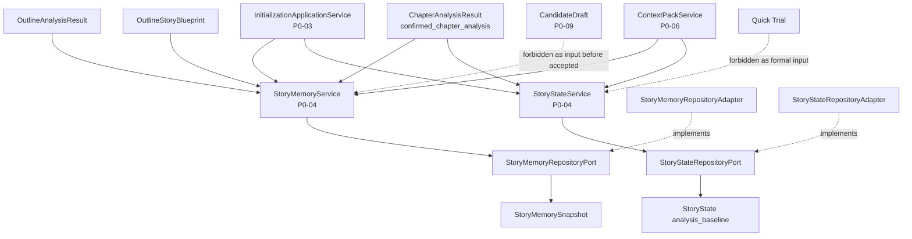

# InkTrace V2.0-P0-04 StoryMemory 与 StoryState 详细设计

版本：v2.0-p0-detail-04  
状态：P0 模块级详细设计  
依据文档：

- `docs/01_requirements/InkTrace-V2.0-需求规格说明书.md`
- `docs/07_overview/InkTrace-V2.0-概要设计说明书.md`
- `docs/02_architecture/InkTrace-V2.0-架构设计说明书.md`
- `docs/03_design/InkTrace-V2.0-P0-详细设计总纲.md`
- `docs/03_design/InkTrace-V2.0-P0-01-AI基础设施详细设计.md`
- `docs/03_design/InkTrace-V2.0-P0-02-AIJobSystem详细设计.md`
- `docs/03_design/InkTrace-V2.0-P0-03-初始化流程详细设计.md`

---

## 一、文档定位与设计范围

### 1.1 文档定位

本文档是 InkTrace V2.0-P0 的模块级详细设计文档，仅覆盖 P0 StoryMemory 与 StoryState。

本文档用于冻结 P0 StoryMemorySnapshot、StoryState analysis_baseline、StoryMemoryService、StoryStateService、Repository Port、stale / reanalysis、ContextPack 读取边界、CandidateDraft 边界、Quick Trial 边界与初始化完成写入顺序。

本文档不写代码、不修改源码、不生成数据库迁移、不拆 Task、不进入开发计划。

### 1.2 设计范围

本模块覆盖：

- P0 StoryMemorySnapshot。
- P0 StoryState analysis_baseline。
- StoryMemoryService。
- StoryStateService。
- StoryMemoryRepositoryPort。
- StoryStateRepositoryPort。
- StoryMemorySnapshot 构建输入。
- StoryState analysis_baseline 构建输入。
- confirmed_chapter_analysis source。
- 初始化流程如何调用 StoryMemoryService / StoryStateService。
- StoryMemory / StoryState 与 ContextPack 的边界。
- StoryMemory / StoryState 与 CandidateDraft 的边界。
- StoryMemory / StoryState 与 Quick Trial 的边界。
- stale / reanalysis 对 StoryMemory / StoryState 的影响。

### 1.3 本文档不覆盖

P0-04 不覆盖：

- AI Suggestion 更新正式 StoryState。
- 完整 Story Memory Revision。
- 复杂手动 StoryState 维护。
- Knowledge Graph。
- 完整四层剧情轨道。
- A/B/C 剧情方向推演。
- 完整 Agent Runtime。
- AgentSession / AgentStep / AgentObservation / AgentTrace。
- 五 Agent Workflow。
- 自动连续续写队列。
- Style DNA。
- Citation Link。
- @ 标签引用系统。
- 成本看板。
- 分析看板。
- VectorRecall 切片、Embedding、召回策略。
- ContextPack 组装策略。
- CandidateDraft 接受与 Human Review Gate 详细流程。

---

## 二、P0 StoryMemory / StoryState 目标

### 2.1 StoryMemory 目标

P0 StoryMemorySnapshot 是初始化后的作品级 AI 记忆快照。

目标：

- 承接 P0-03 初始化流程的大纲分析与正文分析结果。
- 为后续 ContextPack 构建提供最小可用长期记忆。
- 为正式续写提供作品当前进度、主要角色状态、设定事实、伏笔候选、未解问题等上下文来源。
- 保持与正式正文、正式资产隔离。
- 避免 AI 分析结果静默覆盖用户手动维护内容。

StoryMemorySnapshot 是 AI 分析快照，不是正式资产，不替代正式正文。

### 2.2 StoryState 目标

P0 StoryState analysis_baseline 是基于 confirmed_chapter_analysis 得出的当前故事状态基线。

目标：

- 标识故事当前推进到哪里。
- 记录当前章节位置、当前故事阶段、活跃角色、角色当前状态、活跃冲突、活跃伏笔、已解决伏笔、重要设定事实、近期关键事件。
- 为正式续写前的 ContextPack 与 Writing Task 提供当前状态锁。
- 阻止 AI 在缺少当前状态基线时进行正式续写。

StoryState analysis_baseline 不是用户手动资产，不覆盖正式设定。

### 2.3 正式续写前置条件

正式续写依赖 StoryMemorySnapshot 与 StoryState analysis_baseline。

规则：

- StoryMemorySnapshot 缺失时，正式续写不可用。
- StoryState analysis_baseline 缺失时，正式续写不可用。
- StoryState analysis_baseline 的 source 必须是 confirmed_chapter_analysis。
- StoryMemorySnapshot 与 StoryState analysis_baseline 必须在 initialization_status = completed 前持久化成功。
- VectorIndex 失败可降级，但 StoryMemory / StoryState 缺失必须阻断 completed。

---

## 三、模块边界与不做事项

### 3.1 P0 做什么

P0-04 负责：

- 定义 P0 StoryMemorySnapshot 最小结构。
- 定义 P0 StoryState analysis_baseline 最小结构。
- 定义 StoryMemoryService 构建规则。
- 定义 StoryStateService 构建规则。
- 定义 Repository Port 边界。
- 定义初始化流程对 StoryMemory / StoryState 的调用与写入顺序。
- 定义 stale / reanalysis 对 StoryMemory / StoryState 的影响。
- 定义 ContextPack 对 StoryMemory / StoryState 的读取边界。
- 定义 CandidateDraft / Quick Trial 不得更新 StoryMemory / StoryState 的边界。

### 3.2 P0 不做什么

P0-04 不做：

- AI Suggestion 更新正式 StoryState。
- 用户采纳 AI 建议写入正式 StoryState。
- Story Memory Revision 完整能力。
- Conflict Guard 完整能力。
- 复杂手动 StoryState 编辑。
- Knowledge Graph。
- 完整四层剧情轨道。
- 剧情分支推演。
- 自动依赖图失效。
- 自动全量重建策略。
- 多版本复杂治理。

### 3.3 禁止行为

禁止：

- 基于未接受 CandidateDraft 构建 StoryMemorySnapshot。
- 基于未接受 CandidateDraft 构建 StoryState analysis_baseline。
- 基于 Quick Trial 输出构建 StoryMemorySnapshot。
- 基于 Quick Trial 输出构建 StoryState analysis_baseline。
- 基于临时候选区内容构建 StoryState。
- 基于未保存草稿构建 StoryState。
- 将 StoryMemorySnapshot 作为正式资产覆盖用户维护内容。
- 将 StoryState analysis_baseline 静默写入用户正式资产。
- 修改正式正文。
- 覆盖用户原始大纲。
- 直接调用 Provider SDK。
- 硬编码 Kimi / DeepSeek。
- 直接调用 Agent Runtime。

---

## 四、总体架构

### 4.1 模块关系说明

P0-04 位于 Core Application + Domain Policy + Repository Port 边界内。

关系：

- P0-03 InitializationApplicationService 调用 StoryMemoryService 构建 StoryMemorySnapshot。
- P0-03 InitializationApplicationService 调用 StoryStateService 构建 StoryState analysis_baseline。
- StoryMemoryService 读取 OutlineAnalysisResult / OutlineStoryBlueprint / ChapterAnalysisResult 作为输入。
- StoryStateService 仅基于 confirmed_chapter_analysis 构建 analysis_baseline。
- StoryMemoryService 通过 StoryMemoryRepositoryPort 持久化快照。
- StoryStateService 通过 StoryStateRepositoryPort 持久化 baseline。
- P0-06 ContextPack 通过 Application Service 或受控查询接口读取 latest StoryMemorySnapshot / StoryState analysis_baseline。
- P0-08 MinimalContinuationWorkflow 不直接访问 Repository Port。
- P0-09 CandidateDraft 不直接更新 StoryMemory / StoryState。

### 4.2 模块关系图

### 4.3 与相邻模块的边界

| 模块 | P0-04 关系 | 边界 |
|---|---|---|
| P0-03 初始化流程 | 调用 StoryMemoryService / StoryStateService | P0-03 负责流程与完成判定，P0-04 负责内部结构与构建规则 |
| P0-05 VectorRecall | 可读取章节分析结果和正文切片 | P0-04 不设计切片、Embedding、VectorStore |
| P0-06 ContextPack | 读取 latest StoryMemorySnapshot / StoryState baseline | P0-04 不设计 ContextPack 组装、裁剪、Token 策略 |
| P0-08 MinimalContinuationWorkflow | 间接使用 ContextPack 中的 Memory / State | Workflow 不直接访问 Repository Port |
| P0-09 CandidateDraft | 接受后经 V1.1 Local-First 保存链路进入后续 reanalysis | 未接受 CandidateDraft 不影响 StoryMemory / StoryState |

### 4.4 禁止调用路径

禁止路径：

- Workflow / Agent -> StoryMemoryRepositoryPort。
- Workflow / Agent -> StoryStateRepositoryPort。
- Workflow / Agent -> StoryMemorySnapshot 直接写入。
- Workflow / Agent -> StoryState analysis_baseline 直接写入。
- CandidateDraft -> StoryMemorySnapshot 自动更新。
- CandidateDraft -> StoryState 自动更新。
- Quick Trial -> StoryMemorySnapshot 自动更新。
- Quick Trial -> StoryState 自动更新。
- StoryMemoryService -> Provider SDK。
- StoryStateService -> Provider SDK。

---

## 五、StoryMemorySnapshot 详细设计

### 5.1 定义

StoryMemorySnapshot 是 P0 初始化后生成的作品级 AI 记忆快照。

它用于后续 ContextPack 构建和正式续写前的上下文准备。

StoryMemorySnapshot 是 P0 初始化产物，不等于正式资产，不覆盖用户手动设定，不替代正式正文。

### 5.2 职责

StoryMemorySnapshot 负责保存：

- 当前故事整体摘要。
- 当前已分析章节范围。
- 主要角色状态。
- 基础设定事实。
- 基础伏笔候选。
- 未解问题。
- 可选时间线事实。
- 初始化分析来源与置信度。
- stale 状态。

### 5.3 字段方向

| 字段 | 说明 |
|---|---|
| snapshot_id | StoryMemorySnapshot ID |
| work_id | 作品 ID |
| source | 来源，P0 默认为 initialization_analysis |
| source_job_id | ai_initialization Job ID |
| source_analysis_version | 分析版本方向，用于 P0 最小溯源 |
| outline_analysis_id | OutlineAnalysisResult ID |
| story_blueprint_id | OutlineStoryBlueprint ID |
| chapter_analysis_ids | 纳入快照的 ChapterAnalysisResult ID 列表 |
| current_story_summary | CurrentStorySummary |
| character_states | BasicCharacterState 集合 |
| setting_facts | BasicSettingFact 集合 |
| foreshadow_candidates | BasicForeshadowCandidate 集合 |
| unresolved_questions | 未解问题集合 |
| timeline_facts | 时间线事实，可选 |
| warnings | 构建警告 |
| confidence | 整体置信度 |
| stale_status | fresh / stale / partial_stale |
| created_at | 创建时间 |
| updated_at | 更新时间 |

说明：

- 以上是概念字段方向，不是数据库迁移设计。
- P0 不要求复杂版本表，但必须保留 source_analysis_version 方向。
- P1 / P2 可扩展为 StoryMemoryRevision、差异对比、用户审核和 Conflict Guard。

### 5.4 输入

StoryMemorySnapshot 构建输入：

- work_id。
- source_job_id。
- OutlineAnalysisResult。
- OutlineStoryBlueprint。
- ChapterAnalysisResult 集合。
- CurrentStorySummary。
- BasicCharacterState 集合。
- BasicSettingFact 集合。
- BasicForeshadowCandidate 集合。
- unresolved_questions。
- warnings。

输入限制：

- 只能基于 confirmed chapters 的分析结果。
- 可以基于用户原始大纲。
- 可以基于大纲分析结果。
- 不得基于未接受 CandidateDraft。
- 不得基于 Quick Trial 输出。
- 不得基于临时候选区内容。
- 不得基于未保存草稿。
- 未经用户确认的 AI 输出不得作为 P0 StoryMemorySnapshot 初始化输入。

### 5.5 输出

StoryMemoryService 输出：

- StoryMemorySnapshot。
- snapshot_id。
- warnings。
- stale_status。
- confidence。

初始化流程使用 snapshot_id 写入 completed metadata。

### 5.6 构建规则

规则：

- StoryMemorySnapshot 必须由 StoryMemoryService 构建。
- StoryMemorySnapshot 必须记录 source_job_id。
- StoryMemorySnapshot 必须记录 outline_analysis_id。
- StoryMemorySnapshot 必须记录 story_blueprint_id。
- StoryMemorySnapshot 必须记录 chapter_analysis_ids。
- skipped / failed / chapter_empty minimal 不得计入高质量成功分析统计。
- 如果输入章节分析低于 P0-03 最小完成阈值，StoryMemoryService 不得生成可用于正式续写的有效快照。
- StoryMemorySnapshot 构建失败必须阻断正式续写。
- StoryMemorySnapshot 可以被 ContextPack 读取。
- StoryMemorySnapshot 可以被后续续写 Workflow 间接使用。
- StoryMemorySnapshot 不允许被 Agent / Workflow 直接静默修改。

### 5.7 不允许做的事情

StoryMemorySnapshot 不允许：

- 作为正式资产覆盖用户维护内容。
- 替代正式正文。
- 覆盖用户原始大纲。
- 接收 Quick Trial 输出。
- 接收未接受 CandidateDraft。
- 静默更新 StoryState。
- 作为 Memory Revision 复杂治理对象。

---

## 六、StoryState analysis_baseline 详细设计

### 6.1 定义

StoryState analysis_baseline 是基于 confirmed_chapter_analysis 得出的当前故事状态基线。

它用于后续续写判断“当前故事已经发展到哪里”，并为 ContextPack 和 Writing Task 提供当前状态锁。

P0 StoryState 只有 analysis_baseline。

### 6.2 职责

StoryState analysis_baseline 负责描述：

- 当前章节位置。
- 当前故事阶段。
- 当前时间位置，可选。
- 活跃角色。
- 当前角色状态。
- 活跃冲突。
- 活跃伏笔。
- 已解决伏笔。
- 重要设定事实。
- 当前地点范围，可选。
- 最近关键事件。
- 未解问题。
- 分析置信度。
- stale 状态。

### 6.3 字段方向

| 字段 | 说明 |
|---|---|
| story_state_id | StoryState ID |
| work_id | 作品 ID |
| baseline_type | 固定为 analysis_baseline |
| source | 固定为 confirmed_chapter_analysis |
| source_job_id | ai_initialization Job ID |
| source_snapshot_id | StoryMemorySnapshot ID，可选 |
| source_chapter_analysis_ids | 参与 baseline 的 ChapterAnalysisResult ID 列表 |
| current_chapter_id | 当前章节 ID |
| current_chapter_order | 当前章节顺序 |
| current_story_phase | 当前故事阶段 |
| current_time_position | 当前时间位置，可选 |
| active_characters | 活跃角色集合 |
| current_character_states | 当前角色状态集合 |
| active_conflicts | 活跃冲突集合 |
| active_foreshadows | 活跃伏笔集合 |
| resolved_foreshadows | 已解决伏笔集合 |
| important_setting_facts | 重要设定事实集合 |
| current_location_scope | 当前地点范围，可选 |
| recent_key_events | 最近关键事件集合 |
| unresolved_questions | 未解问题集合 |
| analysis_confidence | 分析置信度 |
| stale_status | fresh / stale / partial_stale |
| created_at | 创建时间 |
| updated_at | 更新时间 |

说明：

- 以上是概念字段方向，不是数据库迁移设计。
- P0 不实现完整 StoryState 版本化。
- P0 不实现复杂手动 StoryState 编辑。

### 6.4 source 规则

StoryState analysis_baseline 的 source 规则：

- source 必须是 confirmed_chapter_analysis。
- source_chapter_analysis_ids 必须来自 confirmed chapters 的正文分析结果。
- 未接受 CandidateDraft 不得进入 source。
- Quick Trial 输出不得进入 source。
- 临时候选区内容不得进入 source。
- 未保存草稿不得进入 source。
- 未经用户确认的 AI 输出不得进入 source。

### 6.5 构建规则

规则：

- StoryState analysis_baseline 必须由 StoryStateService 构建。
- StoryState analysis_baseline 只能来自 confirmed_chapter_analysis。
- StoryState analysis_baseline 缺失时正式续写不可用。
- StoryState stale 时正式续写可能 blocked 或 degraded，规则继承 P0-03。
- StoryState analysis_baseline 不等于用户手动资产。
- StoryState analysis_baseline 不覆盖正式设定。
- StoryState analysis_baseline 不写正式资产。

### 6.6 不允许做的事情

StoryState analysis_baseline 不允许：

- 基于未接受 CandidateDraft 构建。
- 基于 Quick Trial 输出构建。
- 基于临时候选区或未保存草稿构建。
- 静默写入用户正式资产。
- 通过 AI Suggestion 更新正式 StoryState。
- 执行用户采纳建议流程。
- 创建 CandidateDraft。
- 写正式正文。
- 调用 Provider SDK。
- 实现四层剧情轨道。
- 执行剧情分支推演。

---

## 七、StoryMemoryService 详细设计

### 7.1 职责

StoryMemoryService 负责：

- 接收 P0-03 初始化流程输入。
- 基于 OutlineAnalysisResult / OutlineStoryBlueprint / ChapterAnalysisResult 构建 StoryMemorySnapshot。
- 聚合 CurrentStorySummary。
- 聚合 BasicCharacterState。
- 聚合 BasicSettingFact。
- 聚合 BasicForeshadowCandidate。
- 聚合 unresolved_questions。
- 聚合 timeline_facts，可选。
- 记录 source_job_id。
- 记录 source_analysis_version。
- 记录 source_chapter_analysis_ids。
- 生成 stale_status。
- 持久化 StoryMemorySnapshot。
- 向初始化流程返回 snapshot_id。
- 在 reanalysis 后支持重建或标记过期。

### 7.2 输入

输入：

- work_id。
- source_job_id。
- source_analysis_version。
- OutlineAnalysisResult。
- OutlineStoryBlueprint。
- ChapterAnalysisResult 集合。
- CurrentStorySummary。
- BasicCharacterState 集合。
- BasicSettingFact 集合。
- BasicForeshadowCandidate 集合。
- unresolved_questions。
- warnings。

### 7.3 输出

输出：

- snapshot_id。
- StoryMemorySnapshot。
- stale_status。
- warnings。
- confidence。

### 7.4 依赖

StoryMemoryService 依赖：

- StoryMemoryRepositoryPort。
- P0-03 初始化流程提供的分析结果。
- Job / Step 状态信息，只作为 source_job_id 与溯源数据。

StoryMemoryService 不依赖：

- Provider SDK。
- ModelRouter。
- Agent Runtime。
- CandidateDraftService。
- Quick Trial 输出。

### 7.5 写入顺序

写入顺序：

1. 校验输入完整性。
2. 校验 ChapterAnalysisResult 来源。
3. 聚合 StoryMemorySnapshot。
4. 调用 StoryMemoryRepositoryPort.save_snapshot。
5. 持久化成功后返回 snapshot_id。
6. 初始化流程记录 story_memory_snapshot_id。
7. StoryStateService 可选择引用 source_snapshot_id。
8. finalize_initialization 最后写 initialization_status = completed。

### 7.6 错误处理

错误规则：

- 输入缺失时，StoryMemorySnapshot 不生成。
- OutlineAnalysisResult 缺失时，StoryMemorySnapshot 不生成。
- OutlineStoryBlueprint 缺失时，StoryMemorySnapshot 不生成。
- ChapterAnalysisResult 不足且低于 P0-03 阈值时，StoryMemorySnapshot 不生成。
- Repository 写入失败时，返回 story_memory_persist_failed。
- StoryMemorySnapshot 构建失败必须阻断正式续写。
- StoryMemorySnapshot 构建失败不得破坏正式正文。
- StoryMemorySnapshot 构建失败不得覆盖正式资产。

### 7.7 不允许做的事情

StoryMemoryService 不允许：

- 修改正式正文。
- 覆盖用户原始大纲。
- 覆盖正式资产。
- 静默更新 StoryState。
- 创建 CandidateDraft。
- 调用 Provider SDK。
- 硬编码 Kimi / DeepSeek。
- 直接调用 Agent Runtime。
- 做 Memory Revision 复杂治理。
- 把 Quick Trial 输出写入正式 StoryMemorySnapshot。

---

## 八、StoryStateService 详细设计

### 8.1 职责

StoryStateService 负责：

- 基于 confirmed_chapter_analysis 构建 StoryState analysis_baseline。
- 从 ChapterAnalysisResult 中提取当前故事阶段。
- 聚合最近章节关键事件。
- 聚合当前角色状态。
- 聚合活跃冲突。
- 聚合活跃伏笔 / 已解决伏笔。
- 聚合重要设定事实。
- 标记 source = confirmed_chapter_analysis。
- 记录 source_chapter_analysis_ids。
- 持久化 StoryState analysis_baseline。
- 向初始化流程返回 story_state_id。
- 在 reanalysis 后支持重新评估 baseline 或标记过期。

### 8.2 输入

输入：

- work_id。
- source_job_id。
- source_snapshot_id，可选。
- confirmed_chapter_analysis 集合。
- ChapterAnalysisResult 集合。
- current_chapter_id。
- current_chapter_order。
- recent chapter analysis results。
- P0-03 初始化完成判定结果。

### 8.3 输出

输出：

- story_state_id。
- StoryState analysis_baseline。
- stale_status。
- warnings。
- analysis_confidence。

### 8.4 依赖

StoryStateService 依赖：

- StoryStateRepositoryPort。
- confirmed_chapter_analysis。
- ChapterAnalysisResult。
- 可选 StoryMemorySnapshot ID。

StoryStateService 不依赖：

- Provider SDK。
- ModelRouter。
- Agent Runtime。
- CandidateDraftService。
- Quick Trial 输出。

### 8.5 写入顺序

写入顺序：

1. 校验 source = confirmed_chapter_analysis。
2. 校验 source_chapter_analysis_ids 有效。
3. 校验未包含 CandidateDraft / Quick Trial / 临时候选区 / 未保存草稿。
4. 聚合 StoryState analysis_baseline。
5. 调用 StoryStateRepositoryPort.save_analysis_baseline。
6. 持久化成功后返回 story_state_id。
7. 初始化流程记录 story_state_baseline_id。
8. finalize_initialization 最后写 initialization_status = completed。

### 8.6 错误处理

错误规则：

- confirmed_chapter_analysis source 缺失时，不生成 StoryState analysis_baseline。
- source_chapter_analysis_ids 无效时，不生成 StoryState analysis_baseline。
- 输入包含未接受 CandidateDraft 时，拒绝构建。
- 输入包含 Quick Trial 输出时，拒绝构建。
- Repository 写入失败时，返回 story_state_persist_failed。
- StoryState analysis_baseline 构建失败必须阻断正式续写。
- StoryState analysis_baseline 构建失败不得写正式资产。

### 8.7 不允许做的事情

StoryStateService 不允许：

- 基于未接受 CandidateDraft 构建 StoryState。
- 基于 Quick Trial 输出构建 StoryState。
- 基于临时候选区或未保存草稿构建 StoryState。
- 静默写入用户正式资产。
- 做 AI Suggestion 更新正式 StoryState。
- 做用户采纳建议流程。
- 创建 CandidateDraft。
- 写正式正文。
- 调用 Provider SDK。
- 实现四层剧情轨道。

---

## 九、Repository Port 详细设计

### 9.1 StoryMemoryRepositoryPort

StoryMemoryRepositoryPort 是 Application 层职责边界。

至少支持：

| 方法方向 | 说明 |
|---|---|
| save_snapshot | 保存 StoryMemorySnapshot |
| get_latest_snapshot_by_work | 获取作品最新 StoryMemorySnapshot |
| get_snapshot_by_id | 按 ID 获取 StoryMemorySnapshot |
| mark_snapshot_stale | 标记快照 stale |
| list_snapshots_by_work | 列出作品快照，可选 |
| update_snapshot_status | 更新快照状态，可选 |

规则：

- Port 不强制对应具体数据库表数量。
- Port 不强制对应独立 Repository Adapter 实现类。
- Infrastructure Adapter 负责持久化。
- 普通日志不得记录完整正文。

### 9.2 StoryStateRepositoryPort

StoryStateRepositoryPort 是 Application 层职责边界。

至少支持：

| 方法方向 | 说明 |
|---|---|
| save_analysis_baseline | 保存 StoryState analysis_baseline |
| get_latest_analysis_baseline_by_work | 获取作品最新 analysis_baseline |
| get_story_state_by_id | 按 ID 获取 StoryState |
| mark_story_state_stale | 标记 StoryState stale |
| update_story_state_status | 更新 StoryState 状态，可选 |
| list_story_states_by_work | 列出作品 StoryState，可选 |

规则：

- Port 不强制对应具体数据库表数量。
- Port 不强制对应独立 Repository Adapter 实现类。
- Infrastructure Adapter 负责持久化。
- 普通日志不得记录完整正文。

### 9.3 Adapter 边界

Infrastructure Adapter 负责：

- 将 StoryMemorySnapshot 持久化到存储介质。
- 将 StoryState analysis_baseline 持久化到存储介质。
- 执行持久化对象与应用对象的映射。
- 返回持久化结果或错误。

Infrastructure Adapter 不负责：

- 判断正式续写是否可用。
- 判断 partial_success 阈值。
- 判断 Human Review Gate。
- 修改正式正文。
- 覆盖正式资产。

### 9.4 访问控制

访问规则：

- Workflow / Agent 不得直接访问 Repository Port。
- ContextPackService 读取 StoryMemory / StoryState 时必须通过 Application Service 或受控查询接口。
- ContextPackService 不得直接绕过 Repository 边界。
- CandidateDraftService 不得直接更新 StoryMemory / StoryState。
- Quick Trial 不得写入 StoryMemory / StoryState。

---

## 十、stale / reanalysis 规则

### 10.1 stale 触发源

以下事件会导致相关 StoryMemorySnapshot / StoryState analysis_baseline 可能 stale：

- 已确认章节正文修改。
- 已确认章节新增。
- 已确认章节删除。
- 章节顺序变化，可选。

### 10.2 影响范围分级

当前续写目标章节或最近 3 章受影响：

- 正式续写 blocked。
- 必须完成相关 reanalysis。
- 必须完成必要 StoryMemory / StoryState 评估。
- ContextPack 必须标记 blocked 或 state_stale / memory_stale。

较早章节受影响：

- 正式续写可 degraded / warning。
- ContextPack 必须标记 memory_stale 或 state_stale。
- 系统应提示重新分析。

### 10.3 StoryMemory stale 处理

规则：

- StoryMemorySnapshot stale 时，ContextPack 必须标记 memory_stale 或 degraded。
- reanalysis 影响 StoryMemorySnapshot 输入时，应重新触发 StoryMemory 构建或标记 StoryMemory 可能过期。
- P0 不做自动全量重建。
- P0 只做最小 stale 标记、必要阻断、手动重新分析触发。
- P1 / P2 可扩展 StoryMemoryRevision、差异对比、自动依赖失效。

### 10.4 StoryState stale 处理

规则：

- StoryState analysis_baseline stale 时，ContextPack 必须标记 state_stale 或 blocked / degraded。
- reanalysis 影响 StoryState analysis_baseline 所依赖章节时，应重新触发 StoryState baseline 评估。
- 修改 / 新增 / 删除当前续写目标章节或最近 3 章时，正式续写 blocked，直到相关 reanalysis 和必要 StoryState 评估完成。
- P0 不做复杂手动 StoryState 维护。
- P1 / P2 可扩展 Conflict Guard 与正式 StoryState 变更审核。

### 10.5 删除已参与 baseline 的章节

删除已参与 baseline 的章节后：

- 该章节的旧 ChapterAnalysisResult 不得继续作为当前正式续写上下文。
- 该章节的历史分析记录可保留用于调试。
- StoryMemorySnapshot 必须标记 stale 或 partial_stale。
- StoryState analysis_baseline 必须标记 stale 或 partial_stale。
- 如果删除影响当前续写目标或最近 3 章，正式续写 blocked。

### 10.6 新增章节未分析

新增章节未分析前：

- 不得计入 analyzed_chapter_count。
- 不得作为 StoryState analysis_baseline 输入。
- 不得作为 StoryMemorySnapshot 高质量输入。
- 如果新增章节属于最近 3 章或目标上下文，则必须分析成功后才能正式续写。
- 如果新增章节属于较早章节，可 degraded / warning。

### 10.7 P0 不做

P0 不做：

- 复杂版本依赖图。
- 自动全量重建。
- StoryMemoryRevision。
- Conflict Guard。
- 自动依赖失效。
- 差异对比。

---

## 十一、与 ContextPack 的边界

### 11.1 读取边界

ContextPack 可以读取：

- latest StoryMemorySnapshot。
- latest StoryState analysis_baseline。

读取规则：

- ContextPack 只能读取 source = confirmed_chapter_analysis 的 StoryState baseline。
- ContextPack 读取 StoryMemory / StoryState 必须通过 Application Service 或受控查询接口。
- ContextPack 不得绕过 Repository Port 边界。
- ContextPack 不得把 StoryMemory / StoryState 当成正式资产覆盖回项目。

### 11.2 blocked 条件

正式续写 ContextPack 必须 blocked：

- StoryMemorySnapshot 缺失。
- StoryState analysis_baseline 缺失。
- StoryState source 不是 confirmed_chapter_analysis。
- StoryMemorySnapshot stale 且影响当前续写目标章节或最近 3 章。
- StoryState analysis_baseline stale 且影响当前续写目标章节或最近 3 章。
- 删除已参与 baseline 的章节后尚未完成必要 reanalysis。

### 11.3 degraded 条件

ContextPack 可以 degraded：

- StoryMemorySnapshot stale 但只影响较早章节。
- StoryState analysis_baseline stale 但只影响较早章节。
- VectorIndex 缺失或失败，无 RAG 层。
- 大纲为空且 StoryMemory / StoryState 仍满足最小阈值。

### 11.4 Quick Trial 例外

Quick Trial 可以绕过正式 StoryMemory / StoryState，但必须满足：

- 标记 context_insufficient。
- 标记 degraded_context。
- stale 状态下额外标记 stale_context。
- 不更新 StoryMemorySnapshot。
- 不更新 StoryState analysis_baseline。
- 不改变 initialization_status。

### 11.5 P0-04 不展开的内容

P0-04 不展开：

- ContextPack 层级组装策略。
- TokenBudgetPolicy。
- ContextPriorityPolicy。
- AttentionFilter。
- RAG 召回策略。
- ContextPackSnapshot 详细结构。

---

## 十二、与 CandidateDraft / HumanReviewGate 的边界

### 12.1 CandidateDraft 输入边界

规则：

- CandidateDraft 不属于 confirmed chapters。
- 未接受的 CandidateDraft 不得更新 StoryMemorySnapshot。
- 未接受的 CandidateDraft 不得更新 StoryState analysis_baseline。
- AI 不得因为生成 CandidateDraft 就自动更新 StoryMemory / StoryState。
- Human Review Gate 之前的 AI 输出不能影响正式 StoryState。

### 12.2 接受后流程

用户接受 CandidateDraft 后：

- 内容进入章节草稿区或正式正文保存链路。
- 后续保存继续走 V1.1 Local-First。
- 只有用户确认并保存后的正文，才可能进入后续 reanalysis。
- reanalysis 成功后，才可能影响 StoryMemorySnapshot / StoryState analysis_baseline。

### 12.3 禁止行为

禁止：

- CandidateDraft 自动更新 StoryMemorySnapshot。
- CandidateDraft 自动更新 StoryState analysis_baseline。
- CandidateDraft 绕过 Human Review Gate。
- Agent / Workflow 伪造用户确认。
- accept_candidate_draft / apply_candidate_to_draft 作为 Agent Tool 出现在 P0-04。

---

## 十三、与 Quick Trial 的边界

### 13.1 核心规则

Quick Trial 输出：

- 不属于 confirmed chapters。
- 不更新 StoryMemorySnapshot。
- 不更新 StoryState analysis_baseline。
- 不改变 initialization_status。
- 不使正式续写入口可用。
- 成功不代表 StoryMemory / StoryState 已构建完成。

### 13.2 上下文规则

Quick Trial 可以读取少量临时上下文：

- 当前章节。
- 当前选区。
- 用户输入的大纲。
- 作品原始大纲。
- 其他临时上下文。

Quick Trial 不依赖完整正式 StoryMemory / StoryState。

### 13.3 标记规则

Quick Trial 结果必须标记：

- context_insufficient。
- degraded_context。

stale 状态下还必须标记：

- stale_context。

### 13.4 禁止行为

Quick Trial 不允许：

- 写 StoryMemorySnapshot。
- 写 StoryState analysis_baseline。
- 触发 StoryMemory reanalysis。
- 触发 StoryState baseline 更新。
- 改变 initialization_status。
- 打开正式续写入口。

---

## 十四、数据一致性与写入顺序

### 14.1 写入顺序约束

初始化完成写入顺序：

1. P0-03 完成 final_partial_success_check。
2. StoryMemoryService 构建 StoryMemorySnapshot。
3. StoryMemorySnapshot 持久化成功。
4. 初始化流程记录 story_memory_snapshot_id。
5. StoryStateService 构建 StoryState analysis_baseline。
6. StoryState analysis_baseline 持久化成功。
7. 初始化流程记录 story_state_baseline_id。
8. finalize_initialization 最后写 initialization_status = completed。

### 14.2 completed 写入条件

写 initialization_status = completed 之前，必须满足：

- StoryMemorySnapshot 已持久化成功。
- StoryState analysis_baseline 已持久化成功。
- story_memory_snapshot_id 已可记录。
- story_state_baseline_id 已可记录。
- StoryState baseline source = confirmed_chapter_analysis。

### 14.3 失败规则

规则：

- StoryMemory 构建失败时，不得写 completed。
- StoryState 构建失败时，不得写 completed。
- 如果 StoryMemory 成功但 StoryState 失败，initialization_status 不得 completed。
- 如果 StoryState 成功但 StoryMemory 失败，initialization_status 不得 completed。
- 如果 finalize 写 completed 失败，StoryMemory / StoryState 可保留，但作品仍不得视为初始化完成。

### 14.4 retry / resume 一致性

retry / resume 规则：

- 后续 retry / resume 必须能识别已有快照。
- retry / resume 不得重复创建冲突快照。
- 是否复用或重建由 InitializationApplicationService 决定。
- P0 不要求复杂事务设计。
- P0 必须保证不会出现 initialization_status = completed 但缺少 StoryMemorySnapshot 或 StoryState baseline 的状态。

---

## 十五、错误处理与降级

### 15.1 错误场景表

| 场景 | error_code / status_reason | P0 行为 | V1.1 影响 |
|---|---|---|---|
| StoryMemory 输入缺失 | story_memory_input_missing | StoryMemorySnapshot 不生成，初始化 failed 或 paused | 不影响 |
| StoryState 输入缺失 | story_state_input_missing | StoryState baseline 不生成，初始化 failed 或 paused | 不影响 |
| OutlineAnalysisResult 缺失 | outline_analysis_missing | StoryMemorySnapshot 不生成 | 不影响 |
| OutlineStoryBlueprint 缺失 | story_blueprint_missing | StoryMemorySnapshot 不生成 | 不影响 |
| ChapterAnalysisResult 不足 | chapter_analysis_insufficient | StoryMemory / StoryState 不生成或初始化 paused | 不影响 |
| confirmed_chapter_analysis source 缺失 | confirmed_chapter_analysis_missing | StoryState baseline 不生成 | 不影响 |
| StoryMemorySnapshot 持久化失败 | story_memory_persist_failed | 初始化不得 completed | 不影响 |
| StoryState baseline 持久化失败 | story_state_persist_failed | 初始化不得 completed | 不影响 |
| stale 影响正式续写目标 | state_or_memory_stale_required_context | 正式续写 blocked，要求 reanalysis | 不影响 |
| stale 只影响较早章节 | state_or_memory_stale_degraded | ContextPack degraded / warning | 不影响 |
| CandidateDraft 误作为输入 | invalid_candidate_draft_source | 拒绝构建 | 不影响 |
| Quick Trial 输出误作为输入 | invalid_quick_trial_source | 拒绝构建 | 不影响 |
| Repository 写入失败 | repository_write_failed | 对应构建失败 | 不影响 |
| 服务重启后状态恢复 | service_restarted | 根据已持久化快照和 Job 状态恢复 | 不影响 |
| reanalysis 失败 | reanalysis_failed | 标记 stale 或 failed / paused | 不影响 |
| 删除已参与 baseline 的章节 | baseline_source_deleted | 标记 stale，旧分析结果不得作为当前上下文 | 不影响 |

### 15.2 错误隔离原则

规则：

- StoryMemory / StoryState 错误不影响 V1.1 写作、保存、导入、导出。
- StoryMemory / StoryState 错误不得破坏正式正文。
- StoryMemory / StoryState 错误不得覆盖用户原始大纲。
- StoryMemory / StoryState 错误不得写正式资产。
- StoryMemory / StoryState 错误不得让正式续写入口误开启。
- StoryMemory / StoryState 错误不得删除用户手动维护资产。
- StoryMemory / StoryState 错误不得自动创建 CandidateDraft。

---

## 十六、安全、隐私与日志

### 16.1 日志边界

普通日志不得记录：

- 完整正文。
- 完整 Prompt。
- API Key。
- 完整 Provider 原始响应。

### 16.2 数据存储边界

规则：

- StoryMemorySnapshot 可以保存摘要、状态、设定事实、伏笔候选。
- StoryMemorySnapshot 不应复制完整章节正文。
- StoryState analysis_baseline 不保存完整章节正文。
- error_message 必须脱敏。
- 用户原始大纲不被覆盖。
- 正式正文不被覆盖。

### 16.3 资产保护

规则：

- 用户手动正式资产优先于 AI 分析结果。
- StoryMemorySnapshot 不覆盖正式资产。
- StoryState analysis_baseline 不覆盖正式资产。
- 清理失败 Job 不得删除正式正文。
- 清理失败 Job 不得删除用户原始大纲。
- 清理失败 Job 不得删除正式资产。
- 分析结果清理策略后续另行定义。

---

## 十七、P0 验收标准

### 17.1 StoryMemory 验收项

- 可以基于 P0-03 初始化结果构建 StoryMemorySnapshot。
- StoryMemorySnapshot 只能基于 confirmed chapters、用户原始大纲、大纲分析结果、正文分析结果。
- StoryMemorySnapshot 不基于未接受 CandidateDraft。
- StoryMemorySnapshot 不基于 Quick Trial 输出。
- StoryMemorySnapshot 包含 snapshot_id、work_id、source、source_job_id、source_analysis_version、outline_analysis_id、story_blueprint_id、chapter_analysis_ids。
- StoryMemorySnapshot 包含 current_story_summary、character_states、setting_facts、foreshadow_candidates、unresolved_questions、warnings、confidence、stale_status。
- StoryMemorySnapshot 构建失败阻断正式续写。
- StoryMemorySnapshot 不覆盖正式正文、用户原始大纲或正式资产。

### 17.2 StoryState 验收项

- 可以基于 confirmed_chapter_analysis 构建 StoryState analysis_baseline。
- StoryState baseline source = confirmed_chapter_analysis。
- StoryState analysis_baseline 不基于未接受 CandidateDraft。
- StoryState analysis_baseline 不基于 Quick Trial 输出。
- StoryState analysis_baseline 包含 story_state_id、work_id、baseline_type、source、source_job_id、source_chapter_analysis_ids。
- StoryState analysis_baseline 包含 current_chapter_id、current_chapter_order、current_story_phase、active_characters、current_character_states、active_conflicts、active_foreshadows、resolved_foreshadows、important_setting_facts。
- StoryState analysis_baseline 构建失败阻断正式续写。
- StoryState analysis_baseline 不覆盖正式设定。

### 17.3 写入顺序验收项

- initialization_status = completed 必须在 StoryMemorySnapshot 和 StoryState baseline 持久化成功后写入。
- StoryMemorySnapshot 持久化成功后，初始化流程才能记录 story_memory_snapshot_id。
- StoryState analysis_baseline 持久化成功后，初始化流程才能记录 story_state_baseline_id。
- StoryMemory 构建失败时，不得写 completed。
- StoryState 构建失败时，不得写 completed。
- 不允许出现 completed 但缺少 StoryMemorySnapshot 或 StoryState baseline 的状态。

### 17.4 ContextPack 边界验收项

- StoryMemory / StoryState 缺失时 ContextPack blocked。
- StoryMemory / StoryState stale 时 ContextPack blocked 或 degraded，取决于影响范围。
- ContextPack 只能读取 source = confirmed_chapter_analysis 的 StoryState baseline。
- ContextPack 不得把 StoryMemory / StoryState 当成正式资产覆盖回项目。

### 17.5 CandidateDraft / HumanReviewGate 边界验收项

- CandidateDraft 生成不会自动更新 StoryMemory / StoryState。
- 未接受 CandidateDraft 不得进入 StoryMemory / StoryState 输入。
- CandidateDraft 接受后仍需通过 V1.1 Local-First 正文保存链路，后续 reanalysis 才能影响 StoryMemory / StoryState。
- accept_candidate_draft / apply_candidate_to_draft 不是 Agent Tool，不属于 P0-04。

### 17.6 Quick Trial 边界验收项

- Quick Trial 不更新 StoryMemory / StoryState。
- Quick Trial 不改变 initialization_status。
- Quick Trial 不使正式续写入口可用。
- Quick Trial 结果必须标记 context_insufficient / degraded_context。
- stale 状态下 Quick Trial 还必须标记 stale_context。
- Quick Trial 成功不代表 StoryMemory / StoryState 已构建完成。

### 17.7 stale / reanalysis 验收项

- 删除已参与 baseline 的章节后，旧 ChapterAnalysisResult 不得继续作为当前正式续写上下文。
- 章节新增 / 删除 / 修改可标记 StoryMemory / StoryState stale。
- StoryMemorySnapshot stale 时，ContextPack 必须标记 memory_stale 或 degraded。
- StoryState stale 时，ContextPack 必须标记 state_stale 或 blocked / degraded。
- 修改 / 新增 / 删除当前续写目标章节或最近 3 章时，正式续写 blocked，直到相关 reanalysis 和必要 StoryMemory / StoryState 评估完成。
- 新增章节未分析前，不得计入 analyzed_chapter_count。
- P0 不实现自动全量重建。

### 17.8 P0 不做事项验收项

- P0 不实现 Story Memory Revision。
- P0 不实现 AI Suggestion / Conflict Guard。
- P0 不实现完整四层剧情轨道。
- P0 不实现复杂 Knowledge Graph。
- P0 不实现复杂手动 StoryState 维护。
- P0 不实现 Agent Runtime。

### 17.9 安全与日志验收项

- 普通日志不记录 API Key。
- 普通日志不记录完整正文。
- 普通日志不记录完整 Prompt。
- StoryMemorySnapshot 不复制完整章节正文。
- StoryState analysis_baseline 不保存完整章节正文。
- StoryMemory / StoryState 错误不影响 V1.1 写作、保存、导入、导出。
- StoryMemory / StoryState 不覆盖正式正文、用户原始大纲或正式资产。
