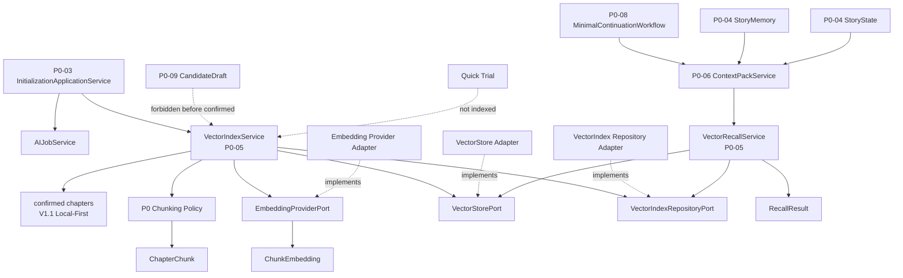
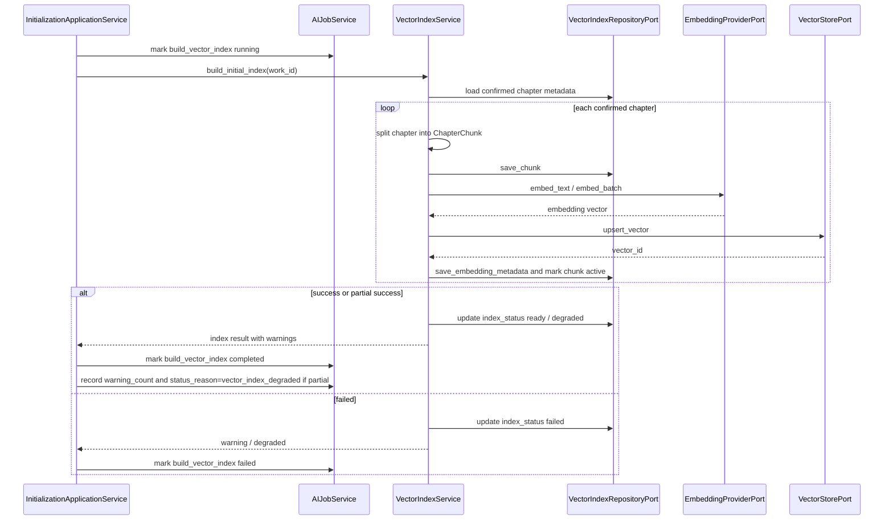
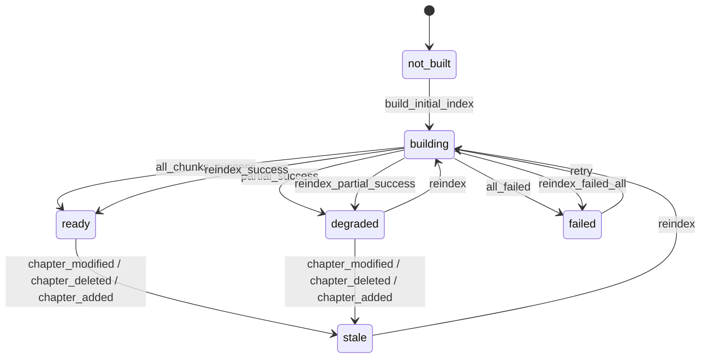

# InkTrace V2.0-P0-05 VectorRecall 详细设计

版本：v2.0-p0-detail-05  
状态：已冻结 / P0 模块级详细设计冻结版  
依据文档：

- `docs/01_requirements/InkTrace-V2.0-需求规格说明书.md`
- `docs/07_overview/InkTrace-V2.0-概要设计说明书.md`
- `docs/02_architecture/InkTrace-V2.0-架构设计说明书.md`
- `docs/03_design/InkTrace-V2.0-P0-详细设计总纲.md`
- `docs/03_design/InkTrace-V2.0-P0-01-AI基础设施详细设计.md`
- `docs/03_design/InkTrace-V2.0-P0-02-AIJobSystem详细设计.md`
- `docs/03_design/InkTrace-V2.0-P0-03-初始化流程详细设计.md`
- `docs/03_design/InkTrace-V2.0-P0-04-StoryMemory与StoryState详细设计.md`

---

## 一、文档定位与设计范围

### 1.1 文档定位

本文档是 InkTrace V2.0-P0 的第五个模块级详细设计文档，仅覆盖 P0 VectorRecall。

本文档用于冻结 P0 VectorIndexService、VectorRecallService、ChapterChunk、ChunkEmbedding、EmbeddingProviderPort、VectorStorePort、VectorIndexRepositoryPort、初始化初始索引构建、P0 最小切片策略、P0 最小 Embedding 策略、RecallQuery / RecallResult、索引状态、stale / reanalysis、ContextPack 边界、CandidateDraft / Quick Trial 边界、错误降级与隐私日志规则。

本文档不写代码、不修改源码、不生成数据库迁移、不拆 Task、不进入开发计划。

### 1.2 设计范围

本模块覆盖：

- VectorIndexService。
- VectorRecallService。
- ChapterChunk。
- ChunkEmbedding。
- VectorStorePort。
- EmbeddingProviderPort。
- VectorIndexRepositoryPort。
- VectorRecallRepositoryPort，可选。
- 初始化阶段的初始向量索引构建。
- 章节切片策略的 P0 最小设计。
- Embedding 生成策略的 P0 最小设计。
- VectorStore 写入与查询边界。
- RecallQuery / RecallResult。
- RecallResult 排序、过滤、top_k、score_threshold。
- 与 AIJobSystem 的关系。
- 与 ContextPack 的边界。
- 与 StoryMemory / StoryState 的边界。
- 与 CandidateDraft / Quick Trial 的边界。
- stale / reanalysis 对 VectorIndex 的影响。
- VectorIndex degraded 规则。

### 1.3 本文档不覆盖

P0-05 不覆盖：

- 复杂 RAG pipeline。
- 复杂 Knowledge Graph。
- 多路召回融合。
- Citation Link。
- @ 标签引用系统。
- 自动连续续写队列。
- 完整 Agent Runtime。
- AgentSession / AgentStep / AgentObservation / AgentTrace。
- 五 Agent Workflow。
- 完整 AI Suggestion / Conflict Guard。
- 完整 Story Memory Revision。
- 成本看板。
- 分析看板。
- P0-06 ContextPack 组装策略。
- P0-08 MinimalContinuationWorkflow 编排细节。
- P0-09 CandidateDraft / HumanReviewGate 详细流程。

---

## 二、P0 VectorRecall 目标

### 2.1 VectorIndex 目标

VectorIndex 的目标是在 P0 初始化或后续 reindex 中，把 confirmed chapters 切分为可召回的正文片段，并为这些片段生成 embedding 和向量索引。

VectorIndex 解决的问题：

- 为 ContextPack 提供与当前写作任务相关的历史正文片段。
- 避免每次续写读取全书正文。
- 支持在正式续写时补充 StoryMemory / StoryState 之外的细节上下文。
- 在索引不可用时允许 ContextPack degraded，而不影响 V1.1 写作链路。

### 2.2 VectorRecall 目标

VectorRecall 的目标是根据 ContextPackService 提供的 query_text、work_id、target_chapter_id、recall_scope 等条件，从已构建向量索引中召回相关 Chunk。

VectorRecall 只返回内部上下文片段，不生成正文、不创建候选稿、不更新正式资产。

### 2.3 可降级上游定位

VectorRecall 是 ContextPack 的可降级上游。

规则：

- StoryMemory / StoryState 是 ContextPack 的必需上游。
- VectorRecall 是 ContextPack 的可选增强层。
- VectorIndex 缺失、失败或不可用时，ContextPack 可以 degraded，无 RAG 层。
- VectorIndex 构建失败不阻断 initialization_status = completed。
- VectorIndex 错误不影响 V1.1 写作、保存、导入、导出。

---

## 三、模块边界与不做事项

### 3.1 P0 做什么

P0 VectorRecall 必须完成：

- 从 confirmed chapters 构建 ChapterChunk。
- 为 ChapterChunk 生成 ChunkEmbedding。
- 将向量写入 VectorStore。
- 记录 chunk / embedding / index 状态。
- 支持初始化初始索引构建。
- 支持章节级 reindex 行为边界。
- 支持章节删除后的 chunk / embedding 失效。
- 支持 VectorRecallService 返回 RecallResult。
- 支持 top_k、score_threshold、recall_scope 的 P0 最小口径。
- 支持 VectorIndex degraded。

### 3.2 P0 不做什么

P0 VectorRecall 不做：

- 复杂 RAG pipeline。
- 多路召回融合。
- 语义切片高级策略。
- 场景级 / 段落级高级切片。
- 复杂 Knowledge Graph。
- Citation Link。
- @ 标签引用系统。
- Vector recall 结果可视化分析看板。
- 成本看板。
- 多模型 embedding 策略。
- 自动依赖图失效。
- 自动连续续写队列。

### 3.3 禁止行为

禁止：

- 未接受 CandidateDraft 进入 VectorIndex。
- Quick Trial 输出进入 VectorIndex。
- 临时候选区内容进入 VectorIndex。
- 未保存草稿进入 VectorIndex。
- VectorRecallService 创建 CandidateDraft。
- VectorRecallService 生成正文。
- VectorRecallService 更新 StoryMemory / StoryState。
- VectorRecallService 写正式正文。
- VectorRecallService 把 RecallResult 当作正式资产。
- Workflow / Agent 直接访问 VectorStorePort。
- ContextPackService 绕过 VectorRecallService 直接访问 VectorStorePort。
- 业务服务硬编码具体 Embedding Provider。
- 普通日志记录完整正文、完整 chunk_text、完整 Prompt、API Key。

---

## 四、总体架构

### 4.1 模块关系说明

VectorRecall 位于 Core Application + Ports / Adapters 边界内。

关系：

- P0-03 InitializationApplicationService 触发 VectorIndexService.build_initial_index。
- VectorIndexService 读取 confirmed chapters，并排除未确认 AI 输出、临时候选区和未保存草稿。
- VectorIndexService 调用 EmbeddingProviderPort 生成 embedding。
- VectorIndexService 调用 VectorStorePort 写入向量。
- VectorIndexService 通过 VectorIndexRepositoryPort 保存 chunk / embedding metadata / index_status。
- P0-06 ContextPackService 调用 VectorRecallService 获取 RecallResult。
- VectorRecallService 调用 VectorStorePort 查询相似 chunk，并通过 VectorIndexRepositoryPort 校验 chunk 状态与来源。
- P0-08 MinimalContinuationWorkflow 只通过 ContextPack 间接使用召回结果。
- P0-09 CandidateDraft / Quick Trial 不写入 VectorIndex。

### 4.2 模块关系图

### 4.3 与相邻模块的边界

| 模块 | 关系 | 边界 |
|---|---|---|
| P0-03 初始化流程 | 触发 build_vector_index Step | P0-05 负责切片、embedding、写入和降级 |
| P0-04 StoryMemory / StoryState | ContextPack 必需上游 | VectorRecall 不替代 StoryMemory / StoryState |
| P0-06 ContextPack | 召回调用方 | P0-05 只返回 RecallResult，不组装 ContextPack |
| P0-08 MinimalContinuationWorkflow | 间接使用方 | Workflow 不直接访问 VectorStorePort |
| P0-09 CandidateDraft / HumanReviewGate | 隔离 | 未确认 AI 输出不得进入 VectorIndex |
| Quick Trial | 降级能力 | Quick Trial 可不依赖 VectorRecall；如使用也不得更新索引 |

### 4.4 禁止调用路径

禁止：

- Workflow / Agent -> VectorStorePort。
- Workflow / Agent -> EmbeddingProviderPort。
- Workflow / Agent -> VectorIndexRepositoryPort。
- ContextPackService -> VectorStorePort 直接查询。
- CandidateDraft -> VectorIndexService 自动写入。
- Quick Trial -> VectorIndexService 自动写入。
- VectorRecallService -> CandidateDraftService。
- VectorRecallService -> StoryMemoryService 更新。
- VectorRecallService -> StoryStateService 更新。

---

## 五、ChapterChunk 详细设计

### 5.1 定义

ChapterChunk 是从 confirmed chapters 切分出的最小召回文本单元。

ChapterChunk 只服务 VectorIndex / VectorRecall，不替代正式正文，不作为正式资产。

### 5.2 字段方向

| 字段 | 说明 | P0 必须 | 来源 |
|---|---|---|---|
| chunk_id | Chunk ID | 是 | 系统生成 |
| work_id | 作品 ID | 是 | confirmed chapter |
| chapter_id | 章节 ID | 是 | confirmed chapter |
| chapter_order | 章节顺序 | 是 | confirmed chapter |
| chunk_index | 章节内 chunk 序号 | 是 | 切片策略 |
| text_excerpt / chunk_text | 召回片段文本 | 是 | confirmed chapter |
| content_hash | chunk_text 内容 hash | 是 | 系统计算 |
| token_count | 近似 token 数，可选 | 可选 | 切片策略 |
| start_offset | 原章节起始偏移，可选 | 可选 | 切片策略 |
| end_offset | 原章节结束偏移，可选 | 可选 | 切片策略 |
| source | 固定为 confirmed_chapter | 是 | 固定值 |
| index_status | active / stale / deleted / failed / skipped | 是 | VectorIndexService |
| stale_status | fresh / stale / partial_stale | 是 | VectorIndexService |
| created_at | 创建时间 | 是 | 系统时间 |
| updated_at | 更新时间 | 是 | 系统时间 |

### 5.3 来源规则

ChapterChunk 只能来自 confirmed chapters。

不允许来源：

- 未接受 CandidateDraft。
- Quick Trial 输出。
- 临时候选区内容。
- 未保存草稿。
- 未经用户确认的 AI 输出。

### 5.4 stale / deleted 边界

规则：

- 修改章节后，相关 chunk 必须 stale，等待 reindex。
- 删除章节后，相关 chunk 必须 deleted / invalid，不得继续被正式 ContextPack 使用。
- 新增章节确认保存后，才可创建 chunk。
- stale / deleted chunk 默认不参与正式召回。
- ChapterChunk 不应保存超出召回需要的完整作品正文副本。
- P0 可保存必要 chunk_text / excerpt，但普通日志不得记录完整正文或完整 chunk_text。

---

## 六、ChunkEmbedding 详细设计

### 6.1 定义

ChunkEmbedding 是 ChapterChunk 的 embedding metadata 与 VectorStore 中向量记录的关联对象。

### 6.2 字段方向

| 字段 | 说明 | P0 必须 | 来源 |
|---|---|---|---|
| embedding_id | Embedding metadata ID | 是 | 系统生成 |
| chunk_id | Chunk ID | 是 | ChapterChunk |
| work_id | 作品 ID | 是 | ChapterChunk |
| chapter_id | 章节 ID | 是 | ChapterChunk |
| embedding_model | Embedding 模型名 | 是 | EmbeddingProviderPort |
| embedding_provider | Embedding Provider | 是 | EmbeddingProviderPort |
| embedding_version | Embedding 版本 | 是 | EmbeddingProviderPort / 配置 |
| vector_id | VectorStore 中向量 ID | 是 | VectorStorePort |
| content_hash | 与 chunk 绑定的 content_hash | 是 | ChapterChunk |
| status | active / stale / deleted / failed | 是 | VectorIndexService |
| created_at | 创建时间 | 是 | 系统时间 |
| updated_at | 更新时间 | 是 | 系统时间 |

### 6.3 content_hash 绑定

规则：

- Embedding 与 chunk content_hash 绑定。
- content_hash 变化后，旧 embedding 不再有效。
- reindex 成功后，新 embedding active，旧 embedding stale / deleted。
- content_hash mismatch 时，召回结果不得进入正式 ContextPack。

### 6.4 Provider 抽象

规则：

- EmbeddingProviderPort 抽象具体 Provider。
- 业务服务不得硬编码具体 Embedding Provider。
- P0 可使用默认 embedding model 配置。
- P0 不做复杂多模型 embedding 策略。
- Embedding Provider 的 retry 规则继承 P0-01 AI 基础设施 Provider retry 规则。
- embedding_timeout / embedding_rate_limited / embedding_provider_unavailable 可按 P0-01 Provider retry 策略重试。
- P0 默认 Provider retry 最多 1 次，单个 Embedding 调用总 Provider 调用次数不得超过 P0-01 规定的上限。
- embedding_auth_failed、Provider Key 缺失、Provider 未配置不 retry。
- Embedding 调用不得绕过 EmbeddingProviderPort / Infrastructure Adapter 抽象。
- Embedding 不保存 API Key。
- 普通日志不记录 API Key、完整 chunk_text、完整 query_text。

---

## 七、VectorIndexService 详细设计

### 7.1 职责

VectorIndexService 负责：

- 接收初始化流程触发的 build_initial_index。
- 读取 confirmed chapters。
- 排除未接受 CandidateDraft、Quick Trial 输出、临时候选区、未保存草稿。
- 对章节进行 P0 最小切片。
- 调用 EmbeddingProviderPort 生成 embedding。
- 调用 VectorStorePort 写入向量。
- 记录 work 级 index_status。
- 记录 chapter_id / chunk_id / content_hash / embedding_version。
- 支持按 work_id 重建索引。
- 支持章节级重新索引。
- 支持删除章节后使相关 chunk / embedding 失效。
- 支持 stale 标记。
- 向 AIJobService 汇报 build_vector_index Step 状态。
- VectorIndex 构建失败时返回 warning / degraded，而不是阻断 initialization_status = completed。

### 7.2 输入

| 输入 | 说明 | 来源 |
|---|---|---|
| work_id | 作品 ID | 初始化流程 / reindex 请求 |
| confirmed chapters | 已确认章节正文集合 | V1.1 Local-First 正式正文保存链路 |
| source_job_id | 初始化 Job ID，可选 | P0-03 |
| index_scope | full_work / chapter | 调用方 |
| target_chapter_ids | 指定章节 ID，可选 | reindex |
| embedding_config | Embedding model/provider 配置 | AI Settings / 配置 |

### 7.3 输出

| 输出 | 说明 |
|---|---|
| index_status | work 级索引状态 |
| indexed_chapter_count | 成功索引章节数 |
| indexed_chunk_count | 成功 chunk 数 |
| failed_chunk_count | 失败 chunk 数 |
| warning_count | warning 数 |
| degraded_reason | 降级原因，可选 |

### 7.4 初始索引构建流程

Step 状态规则：

- P0-02 AIJobStep 状态只有 pending / running / paused / failed / skipped / completed。
- P0-05 不新增额外的“带 warning 的 completed”作为 AIJobStep.status。
- VectorIndex 部分失败时，AIJobStep.status 可以是 completed，同时记录 warning_count。
- VectorIndex 部分失败时，status_reason 可为 vector_index_degraded。
- VectorIndex 部分失败时，work 级 index_status 可为 degraded。
- VectorIndex 完全失败时，AIJobStep.status 可为 failed，work 级 index_status = failed。
- VectorIndex 完全失败不阻断 initialization_status = completed，只导致 ContextPack degraded，无 RAG 层。
- Embedding Provider 调用失败时，retry 规则继承 P0-01；timeout / rate_limited / unavailable 可重试，auth_failed / provider_missing 不重试。
- Embedding retry 最终失败时，对应 chunk 标记 failed，work 级 index_status 根据失败范围进入 degraded 或 failed。
- 如果该 Embedding 调用参与 AIJobStep，必须记录 request_id / trace_id / attempt_no 或等价追踪信息。

### 7.5 reindex 行为

规则：

- P0 默认不自动全量 reindex。
- P0 默认不在每次正文保存后立即自动 reindex。
- P0 默认不在正式续写前静默自动 reindex。
- P0 只做最小 stale 标记、必要阻断、用户或系统入口触发的受控 reindex。
- reindex 的触发方可以是用户在 Presentation / UI 中手动点击“重建索引”或“重新索引章节”。
- reindex 的触发方可以是 InitializationApplicationService 在初始化流程中触发 build_initial_index。
- reindex 的触发方可以是 reanalysis 流程完成后，由 Application Service 受控触发相关章节 reindex。
- 系统检测到索引 stale 后，应提示用户触发 reindex，而不是静默执行。
- work 级 reindex 可重建全部 confirmed chapters 的索引。
- chapter 级 reindex 可只重建指定章节。
- 章节修改后，应先标记旧 chunk stale，再创建新 chunk / embedding。
- 章节删除后，应标记旧 chunk / vector deleted / invalid。
- reindex 成功后，新 chunk active，旧 chunk stale / deleted。
- reindex 失败时保持 degraded / stale / failed，具体由影响范围决定。
- cancel 后迟到 embedding / vector write 不得污染当前 active index。
- reindex 入口属于 Application Service / Presentation API 的受控操作，P0-05 只定义行为边界，不展开 API 详细设计。
- reindex 可以复用 AIJobSystem，也可以作为普通受控操作；是否纳入 AIJob 由后续实现或 P0-11 API 设计明确。
- reindex 必须继续遵守 CandidateDraft / Quick Trial 不进入索引、stale / deleted 旧 chunk 不参与正式召回、普通日志不记录完整正文 / chunk_text / query_text / API Key 等边界。
- P0 不把自动 reindex、依赖图自动失效、后台全量重建作为默认能力。

### 7.6 不允许做的事情

VectorIndexService 不允许：

- 修改正式正文。
- 覆盖用户原始大纲。
- 写 StoryMemorySnapshot。
- 写 StoryState analysis_baseline。
- 创建 CandidateDraft。
- 读取未接受 CandidateDraft。
- 读取 Quick Trial 输出。
- 把召回结果写回正式资产。
- 直接调用 Provider SDK。
- 硬编码具体 Embedding Provider。
- 实现复杂 Knowledge Graph。
- 实现 Citation Link。

---

## 八、VectorRecallService 详细设计

### 8.1 职责

VectorRecallService 负责：

- 接收 ContextPackService 的召回请求。
- 根据 work_id、target_chapter_id、query_text、recall_scope 执行向量召回。
- P0 默认由 VectorRecallService 内部调用 EmbeddingProviderPort 生成 query_embedding。
- ContextPackService 默认只传入 query_text，不直接生成 query_embedding。
- 调用 VectorStorePort 查询相似 chunk。
- 过滤 stale / deleted / invalid chunk。
- 过滤未确认章节来源。
- 返回 RecallResult 列表。
- 支持 top_k。
- 支持 score_threshold。
- 支持按章节范围过滤，例如最近 N 章、当前目标上下文附近章节、全书范围。
- 支持 ContextPack degraded 标记。
- 不直接组装 ContextPack，只提供召回结果。
- query_embedding 生成失败时，VectorRecallService 返回 recall failed / degraded，由 ContextPack 无 RAG 层降级。
- query_embedding 生成属于 Embedding Provider 调用，必须遵守 P0-01 retry / timeout / logging 规则。
- query_embedding 生成过程不写 LLMCallLog，除非 P0-01 已明确将 Embedding Provider 调用纳入 LLMCallLog；否则至少记录脱敏 request_id / trace_id / provider / model / duration / status 等 EmbeddingCallLog 或等价元数据。

### 8.2 RecallQuery

| 字段 | 说明 | P0 必须 |
|---|---|---|
| work_id | 作品 ID | 是 |
| target_chapter_id | 目标章节 ID，可选 | 可选 |
| target_chapter_order | 目标章节顺序，可选 | 可选 |
| query_text | 查询文本 | 是 |
| query_embedding | 查询向量，P0 默认由 VectorRecallService 内部生成；外部传入仅作为后续扩展或受控测试 / 调试入口 | 可选 |
| top_k | 返回数量 | 是 |
| score_threshold | 最低分数阈值 | 是 |
| recall_scope | recall 范围 | 是 |
| include_recent_chapters | 是否包含最近章节范围 | 是 |
| exclude_chapter_ids | 排除章节 ID，可选 | 可选 |
| allow_stale | 是否允许 stale chunk，默认 false | 是 |
| request_id / trace_id | 追踪 ID，可选 | 可选 |

query_text 来源边界：

- query_text 由 ContextPackService 基于 WritingTask、StoryState、当前目标章节信息等生成或传入。
- P0-05 不负责设计 query_text 构造策略。
- query_text 构造策略属于 P0-06 ContextPack 或 P0-08 Workflow 的边界。
- VectorRecallService 只负责将 query_text 转成 query_embedding 并召回。
- 正式续写路径默认不允许外部传入 query_embedding 绕过 VectorRecallService。
- 如果未来允许 query_embedding 由上游传入，仍必须通过受控接口记录 trace_id / request_id / embedding_model / embedding_version，并校验 vector_dimension。
- query_text 不应在普通日志中完整记录。

### 8.3 RecallResult

| 字段 | 说明 | P0 必须 |
|---|---|---|
| chunk_id | Chunk ID | 是 |
| work_id | 作品 ID | 是 |
| chapter_id | 章节 ID | 是 |
| chapter_order | 章节顺序 | 是 |
| chunk_index | chunk 序号 | 是 |
| score | 相似度分数 | 是 |
| text_excerpt | 召回片段文本 | 是 |
| source | 固定为 confirmed_chapter | 是 |
| stale_status | fresh / stale / partial_stale | 是 |
| reason | 召回原因，可选 | 可选 |
| content_hash | 内容 hash | 是 |
| vector_id | VectorStore ID，可选 | 可选 |

### 8.4 过滤与排序规则

规则：

- RecallResult 只来自 confirmed chapters。
- stale / deleted chunk 默认不返回。
- allow_stale = true 只用于调试或 degraded 场景，不用于正式续写默认路径。
- 正式续写默认路径不得使用 allow_stale = true。
- allow_stale = true 只允许用于调试、诊断、degraded 场景下的受控查询。
- 即使 allow_stale = true，也不得返回 deleted chunk。
- 即使 allow_stale = true，也不得返回 failed / skipped chunk。
- 即使 allow_stale = true，也不得返回 source != confirmed_chapter 的 chunk。
- stale_status = partial_stale 的 chunk 默认不返回，除非满足 chunk.index_status = active、allow_stale = true、受控 degraded / 调试场景、source = confirmed_chapter，且结果带 warning reason。
- allow_stale 返回的结果必须带 stale_status 和 warning reason。
- ContextPack 如使用 stale 召回结果，必须标记 degraded / warning。
- active chunk 是正式召回的必要条件。
- score_threshold 以下结果过滤。
- top_k 默认建议为 5~8。
- 结果按 score 降序排序。
- 同 score 时，可按 chapter_order 接近 target_chapter_order 的优先。
- exclude_chapter_ids 命中的结果必须排除。
- source 不是 confirmed_chapter 的结果必须排除。
- content_hash mismatch 的结果必须排除。

### 8.5 不允许做的事情

VectorRecallService 不允许：

- 直接调用模型生成正文。
- 创建 CandidateDraft。
- 更新 StoryMemory / StoryState。
- 写正式正文。
- 绕过 ContextPackService 参与写作编排。
- 把 RecallResult 当作正式资产。
- 在 P0 做复杂多路召回融合。
- 在 P0 做 Citation Link。
- 在 P0 做 @ 标签引用系统。

---

## 九、切片策略 P0 最小设计

### 9.1 默认策略

P0 采用固定长度 + overlap 的简单切片策略。

建议默认值：

- chunk_size：800~1200 中文字符，或近似 token 数。
- overlap：100~200 字。
- 默认不跨章节切片。
- 保留 chapter_id、chapter_order、chunk_index。
- 章节过短时可以单 chunk。
- 章节过长时拆分多个 chunk。

默认参数表：

| 参数 | 默认值 | 说明 |
|---|---|---|
| chunk_size | 1000 字，或 800~1200 中文字符范围内可配置 | 单个 chunk 的目标长度，可按 token 数近似 |
| overlap_size | 150 字，或 100~200 字范围内可配置 | 相邻 chunk 之间的重叠字符数 |
| min_chunk_size | 100 字 | 低于该长度的片段不单独创建有效 chunk，或创建 small_chunk warning |
| max_chunks_per_chapter | P0 不设硬上限 | 按章节实际长度决定 |

说明：

- 具体数值是默认建议，不写死为不可变规则。
- 实现阶段可根据模型上下文与性能调整。
- 实现阶段可根据中文 token 估算调整。
- P0 不做复杂语义切片。

### 9.2 边界规则

规则：

- chunk 不跨作品。
- 默认不跨章节切片。
- 空章节不创建有效 chunk，记录 warning。
- 低于 min_chunk_size 的短章节可以创建单 chunk 并记录 small_chunk warning，或不创建有效 chunk；具体由实现策略决定，但必须记录 warning。
- 章节过长可拆分多个 chunk。
- P0 不做场景级 / 段落级高级切片。
- P1 / P2 可扩展更智能切片。

---

## 十、Port 与 Adapter 边界

### 10.1 EmbeddingProviderPort

EmbeddingProviderPort 是 Application Port。

至少支持：

| 方法 | 说明 | P0 必须 |
|---|---|---|
| embed_text | 对单段文本生成 embedding | 是 |
| embed_batch | 批量生成 embedding | 可选 |
| get_embedding_model_info | 获取模型信息 | 是 |

规则：

- Infrastructure Adapter 实现 EmbeddingProviderPort。
- 业务服务不得硬编码具体 Embedding Provider。
- Provider API Key 不进入普通日志。
- embed_batch 用于批量构建时提升性能，P0 可选。
- get_embedding_model_info 返回 model_name、model_version、vector_dimension。
- 返回的 vector_dimension 需要与 VectorStore 配置一致。
- Embedding Provider retry 规则继承 P0-01 AI 基础设施 Provider retry 规则。
- embedding_timeout / embedding_rate_limited / embedding_provider_unavailable 可按 P0-01 策略重试。
- P0 默认 Provider retry 最多 1 次，Provider retry 不得突破单个 Embedding 调用总次数上限。
- embedding_auth_failed、embedding_provider_missing、Provider 未配置不 retry。
- 如果 Embedding 调用参与 AIJobStep，需要记录 request_id / trace_id / attempt_no 或等价追踪信息。
- Embedding 调用不得绕过 ProviderPort / Adapter 抽象。
- 普通日志不得记录 API Key、完整 chunk_text、完整 query_text。

### 10.2 VectorStorePort

VectorStorePort 是 Application Port。

至少支持：

| 方法 | 说明 | P0 必须 |
|---|---|---|
| upsert_vector | 写入或更新单条向量 | 是 |
| upsert_vectors | 批量写入向量 | 可选 |
| search_similar | 相似向量查询 | 是 |
| delete_vector / mark_vector_deleted | 删除或标记删除向量 | 是 |
| delete_by_chapter / mark_by_chapter_stale | 按章节删除或标记 stale | 是 |
| get_vector_status | 获取向量状态 | 可选 |

规则：

- Infrastructure Adapter 实现 VectorStorePort。
- Workflow / Agent 不得直接访问 VectorStorePort。
- ContextPackService 不得绕过 VectorRecallService 直接查询 VectorStorePort。
- search_similar 返回结果必须携带 score。
- search_similar 返回 metadata 至少包含 work_id、chapter_id、chunk_id、status、source。
- P0 不锁死具体 VectorStore 产品。

### 10.3 VectorIndexRepositoryPort

VectorIndexRepositoryPort 是 Application Port。

至少支持：

| 方法 | 说明 | P0 必须 |
|---|---|---|
| save_chunk | 保存 ChapterChunk metadata | 是 |
| save_embedding_metadata | 保存 ChunkEmbedding metadata | 是 |
| get_chunks_by_work | 获取作品 chunks | 是 |
| get_chunks_by_chapter | 获取章节 chunks | 是 |
| mark_chunks_stale_by_chapter | 按章节标记 stale | 是 |
| mark_chunks_deleted_by_chapter | 按章节标记 deleted | 是 |
| get_index_status_by_work | 获取 work 级 index_status | 是 |
| update_index_status | 更新 work 级 index_status | 是 |
| list_stale_chunks | 列出 stale chunks | 可选 |

规则：

- Port 是 Application 层职责边界。
- Infrastructure Adapter 负责具体持久化。
- 不强制具体数据库表数量。
- 普通日志不记录完整正文、完整 chunk_text、API Key。

### 10.4 VectorRecallRepositoryPort

P0 可选定义 VectorRecallRepositoryPort。

用途：

- 记录召回请求元数据，可选。
- 记录 RecallResult 调试信息，可选。
- 支撑后续排查，可选。

边界：

- P0 不要求保存完整 query_text 或完整 chunk_text。
- P0 不实现召回分析看板。
- P0 不实现 Citation Link。

### 10.5 访问控制

Port 访问控制规则：

- Workflow / Agent 不得直接访问 VectorStorePort。
- Workflow / Agent 不得直接访问 EmbeddingProviderPort。
- Workflow / Agent 不得直接访问 VectorIndexRepositoryPort。
- ContextPackService 不得绕过 VectorRecallService 直接访问 VectorStorePort。
- ContextPackService 默认不直接访问 EmbeddingProviderPort，也不直接生成 query_embedding。
- VectorRecallService 是正式召回路径中唯一应调用 VectorStorePort.search_similar 的 Application Service。
- 正式续写路径中，query_embedding 默认只能由 VectorRecallService 通过 EmbeddingProviderPort 生成。
- VectorIndexService 只负责写入、重建、删除、stale 标记等索引维护操作。
- CandidateDraft / Quick Trial 不得调用 VectorIndexService 自动写入索引。
- Adapter 只实现 Port，不承载业务规则。

---

## 十一、VectorIndex status / stale 设计

### 11.1 work 级 index_status

work 级 index_status：

| 状态 | 含义 |
|---|---|
| not_built | 尚未构建索引 |
| building | 正在构建索引 |
| ready | 可用于正式 ContextPack 的 RAG 层 |
| degraded | 部分构建失败或部分不可用 |
| stale | 正文修改、新增、删除或顺序变化导致索引过期 |
| failed | 索引不可用，ContextPack 无 RAG 层 |

### 11.2 work 级状态流转图

状态说明：

- ready 表示可用于正式 ContextPack 的 RAG 层。
- degraded 表示部分可用，可供 ContextPack degraded 使用。
- stale 表示索引可能过期，是否 blocked / degraded 由影响范围决定。
- failed 表示索引不可用，ContextPack 无 RAG 层。
- reindex 成功后可恢复 ready。
- reindex 部分失败后保持 degraded。
- P0 不做复杂依赖图。

### 11.3 chapter / chunk 级 status

chapter / chunk 级 status：

| 状态 | 含义 |
|---|---|
| active | 可参与正式召回 |
| stale | 已过期，默认不参与正式召回 |
| deleted | 已删除或失效，禁止参与正式召回 |
| failed | 构建失败，禁止参与正式召回 |
| skipped | 空章节或跳过构建 |

### 11.4 状态规则

规则：

- work 级 index_status 描述整个作品索引的可用状态，包括 not_built / building / ready / degraded / stale / failed。
- chunk 级 index_status 描述单个 chunk 的处理状态，包括 active / stale / deleted / failed / skipped。
- stale_status 描述过期影响范围，包括 fresh / stale / partial_stale。
- fresh 表示未过期。
- stale 表示整体过期或该对象不可作为正式召回输入。
- partial_stale 表示对象所在章节或 work 存在部分过期影响，但该对象本身是否可召回需要结合 index_status、affected_chapter_ids 与影响范围判断。
- index_status 不等同于 stale_status，ContextPack 不得只凭 stale_status 判断 blocked / degraded。
- index_status = ready 表示可用于正式 ContextPack 的 RAG 层。
- index_status = degraded 表示部分构建失败，但不影响 V1.1。
- index_status = stale 表示正文修改、新增、删除或顺序变化导致索引过期。
- index_status = failed 表示索引不可用，ContextPack 无 RAG 层。
- 对单个 Chunk 来说，P0 推荐优先使用 chunk.index_status 表达可召回性。
- chunk.stale_status = fresh 表示该 chunk 本身未过期。
- chunk.stale_status = stale 表示该 chunk 自身内容已过期。
- chunk.stale_status = partial_stale 更适合用于 work / chapter 级影响范围，不建议作为单个 chunk 的正式召回通过条件。
- Chunk stale 时默认不参与正式召回。
- Chunk partial_stale 如用于 chunk stale_status，也必须结合影响范围判断，默认不参与正式召回，除非 chunk.index_status = active、allow_stale = true、处于受控 degraded / 调试场景、source = confirmed_chapter、且返回结果带 warning reason。
- partial_stale 不表示 chunk 文本部分变化但 content_hash 未变；如果文本变化，content_hash 必须变化，旧 chunk 应标记 stale。
- partial_stale 更适合表达章节级或作品级部分过期，例如某些章节已修改但其他章节 chunk 仍 active。
- RecallResult.stale_status 来自对应 chunk / work / chapter 的过期状态汇总，用于 ContextPack 标记 degraded / warning，不用于绕过正式过滤规则。
- 删除章节对应 chunk 必须 deleted 或 invalid。
- deleted chunk 永远不得进入正式召回。
- failed chunk 不得进入正式召回。
- skipped chunk 不得进入正式召回。
- active chunk 才能进入正式召回。
- 历史 chunk 可保留用于调试，但不得作为当前正式续写上下文。
- 新增章节未索引前不能参与召回。
- reindex 成功后可以恢复 ready。
- reindex 失败时保持 degraded / stale / failed，具体由影响范围决定。
- P0 不做复杂依赖图。

---

## 十二、与 AIJobSystem 的关系

### 12.1 build_vector_index Step

规则：

- build_vector_index 是 ai_initialization Job 的 Step。
- build_vector_index 是可降级 Step，不是 initialization_status = completed 的硬阻断项。
- build_vector_index failed 不阻断 initialization_status = completed。
- build_vector_index failed 必须记录 warning。
- build_vector_index failed 后 ContextPack degraded，无 RAG 层。
- VectorIndexService 通过 AIJobService 更新 Step 状态。
- VectorIndex 部分失败时，AIJobStep.status = completed，同时记录 warning_count。
- VectorIndex 部分失败时，status_reason 可为 vector_index_degraded，work 级 index_status = degraded。
- VectorIndex 完全失败时，AIJobStep.status = failed，work 级 index_status = failed。

### 12.2 进度与重试

规则：

- 每个章节或批次 indexing 可作为内部进度。
- P0 不要求拆成复杂子 Job。
- retry build_vector_index 可重建索引。
- reindex chapter 可以作为后续操作。
- reindex chapter 是否纳入 AIJob 由后续实现决定，但 P0 定义行为边界。
- P0 默认不在每次正文保存后立即自动 reindex。
- P0 默认不在正式续写前静默自动 reindex。
- 正文修改 / 新增 / 删除 / 顺序变化后，先标记 work index_status = stale 或相关 chunk stale / deleted。
- 如果 stale 影响最近 3 章或当前目标上下文，正式 ContextPack blocked 或 degraded，由 P0-06 进一步定义。
- 用户手动触发、初始化流程触发、reanalysis 完成后的受控触发，才进入 reindex。
- reindex 无论是否纳入 AIJob，都必须遵守 cancel 后迟到写入不污染 active index 的规则。

### 12.3 cancel 与迟到写入

规则：

- cancel 后迟到的 embedding / vector write 不得继续污染当前 active index。
- cancel 后迟到结果最多记录脱敏日志或 ignored_result。
- cancel 后不得将 chunk 标记 active。
- cancel 后不得将 work index_status 标记 ready。

---

## 十三、与 ContextPack 的边界

### 13.1 调用边界

规则：

- P0-05 只提供 VectorRecall，不组装 ContextPack。
- ContextPackService 调用 VectorRecallService 获取 RecallResult。
- StoryMemory / StoryState 是 ContextPack 的必需上游。
- VectorRecall 是 ContextPack 的可降级上游。
- VectorRecall 不得绕过 StoryMemory / StoryState 的 blocked 规则。
- ContextPackService 不得直接访问 VectorStorePort。
- VectorRecall 不替代 StoryMemory / StoryState。
- StoryMemory / StoryState 缺失时，即使 VectorIndex ready，正式 ContextPack 仍然 blocked。
- VectorIndex ready 只代表 RAG 层可用，不代表初始化完成。
- VectorIndex failed / not_built / degraded 不影响 initialization_status = completed。
- VectorIndex 不写 StoryMemorySnapshot。
- VectorIndex 不写 StoryState analysis_baseline。
- VectorIndex 不改变 initialization_status。
- VectorIndex 不改变 confirmed chapters。
- 正式续写路径中，ContextPackService 是 RecallResult 的受控消费方；调试、诊断或测试可以通过受控查询接口查看 RecallResult，但不得绕过 ContextPack 进入写作链路。

### 13.2 degraded 规则

规则：

- VectorIndex 不可用时，ContextPack 可以无 RAG 层 degraded。
- VectorIndex ready 时，ContextPack 可加入召回片段。
- VectorIndex stale 且影响最近章节 / 目标上下文时，ContextPack blocked 或 degraded，具体由 P0-06 定义。
- VectorRecall 查询失败时，ContextPack 可以 degraded，无 RAG 层。
- P0-05 不在 ContextPack 构建前静默触发 reindex。
- ContextPackService 发现 VectorIndex stale / degraded 时，应按 P0-06 规则 blocked / degraded，并提示用户或受控流程触发 reindex。

### 13.3 RecallResult 边界

规则：

- VectorRecall 不把召回内容写回正式正文或资产。
- RecallResult 不等于 Citation Link。
- P0 不保证可追溯引用链，只提供内部上下文片段。
- P0 不做 Citation Link，只提供内部 RecallResult。

---

## 十四、与 CandidateDraft / Quick Trial 的边界

### 14.1 CandidateDraft 边界

规则：

- CandidateDraft 不进入 VectorIndex。
- 未接受 CandidateDraft 不参与 chunk。
- AI 生成内容在 Human Review Gate 前不得影响 VectorIndex。
- 用户接受 CandidateDraft 后，仍需进入 V1.1 Local-First 正文保存链路。
- CandidateDraft 内容成为 confirmed chapter 后，后续 reindex 才能进入 VectorIndex。

### 14.2 Quick Trial 边界

规则：

- Quick Trial 输出不进入 VectorIndex。
- Quick Trial 可以不依赖 VectorRecall。
- Quick Trial 若使用 VectorRecall，必须标记 degraded_context / context_insufficient。
- stale 状态下 Quick Trial 还必须标记 stale_context。
- Quick Trial 不得更新正式索引。
- Quick Trial 成功不代表 VectorIndex 可用。

### 14.3 其他未确认内容

以下内容不进入 VectorIndex：

- 临时候选区内容。
- 未保存草稿。
- 未经用户确认的 AI 输出。

---

## 十五、数据一致性与写入顺序

### 15.1 写入顺序

VectorIndex 写入顺序：

1. 读取 confirmed chapters。
2. 生成 ChapterChunk。
3. 保存 ChapterChunk metadata。
4. Embedding 生成成功。
5. VectorStore upsert 成功。
6. 保存 ChunkEmbedding metadata。
7. 标记 chunk active。
8. 更新 work index_status。

### 15.2 失败处理顺序

规则：

- Chunk 保存成功后才能写 embedding metadata。
- Embedding 生成成功后才能 upsert vector。
- VectorStore upsert 成功后才能标记 chunk active / index ready。
- 如果 embedding 失败，chunk 可保留为 failed / pending，但不得参与正式召回。
- 如果 vector upsert 失败，embedding metadata 不得标记 active。
- 如果章节删除，应先标记相关 chunk / vector deleted 或 invalid，再更新 index_status。
- 如果章节修改，应标记旧 chunk stale，再创建新 chunk / embedding。
- reindex 成功后，新 chunk active，旧 chunk stale / deleted。
- cancel 后迟到写入不得覆盖当前 active index。
- P0 不要求复杂分布式事务，但必须保持 active index 不污染。
- 同时必须保证 stale / deleted / failed chunk 默认不参与正式召回。
- 服务重启后，未完成写入不得被误判 active。

---

## 十六、错误处理与降级

| 场景 | error_code / status_reason | P0 行为 | V1.1 影响 |
|---|---|---|---|
| confirmed chapters 为空 | confirmed_chapters_empty | 不创建有效 chunk，index_status = degraded 或 failed，记录 warning | 不影响 |
| 章节内容为空 | chapter_empty | 不创建有效 chunk，记录 warning，chapter status = skipped | 不影响 |
| 章节过长 | chapter_too_long | 分片处理；失败时记录 warning | 不影响 |
| Embedding Provider 未配置 | embedding_provider_missing | 不 retry；build_vector_index failed / degraded，ContextPack 无 RAG 层 | 不影响 |
| Embedding Provider 鉴权失败 | embedding_auth_failed | 不 retry；build_vector_index failed / degraded | 不影响 |
| Embedding Provider timeout | embedding_timeout | 按 P0-01 Provider retry 策略最多重试 1 次，失败后 degraded | 不影响 |
| Embedding Provider 限流 | embedding_rate_limited | 按 P0-01 Provider retry 策略最多重试 1 次，失败后 degraded | 不影响 |
| Embedding Provider 不可用 | embedding_provider_unavailable | 按 P0-01 Provider retry 策略最多重试 1 次，失败后 degraded | 不影响 |
| Embedding 生成失败 | embedding_failed | chunk failed，不参与召回 | 不影响 |
| query_embedding 生成失败 | query_embedding_failed | VectorRecall failed / degraded，ContextPack 无 RAG 层 | 不影响 |
| VectorStore 不可用 | vector_store_unavailable | index_status = failed / degraded | 不影响 |
| VectorStore 写入失败 | vector_upsert_failed | embedding metadata 不得 active | 不影响 |
| VectorStore 查询失败 | vector_search_failed | ContextPack degraded，无 RAG 层 | 不影响 |
| chunk 保存失败 | chunk_persist_failed | 对应章节 indexing failed | 不影响 |
| embedding metadata 写入失败 | embedding_metadata_failed | chunk 不得 active | 不影响 |
| content_hash mismatch | content_hash_mismatch | 召回结果过滤，不进入 ContextPack | 不影响 |
| stale chunk 被召回 | stale_chunk_recalled | 默认过滤；allow_stale 仅调试 / degraded | 不影响 |
| deleted chunk 被召回 | deleted_chunk_recalled | 必须过滤，记录 warning | 不影响 |
| 章节删除后旧 vector 未清理 | deleted_chapter_vector_active | 标记 deleted / invalid，阻止召回 | 不影响 |
| reindex 失败 | reindex_failed | 保持 degraded / stale / failed | 不影响 |
| 服务重启 | service_restarted | 从 metadata 恢复 index_status，未完成写入不得 active | 不影响 |
| cancel 后迟到 embedding / vector write | ignored_late_vector_write | 不得污染 active index | 不影响 |

错误隔离原则：

- VectorIndex 错误不影响 V1.1 写作、保存、导入、导出。
- VectorIndex 错误不破坏正式正文。
- VectorIndex 错误不覆盖用户原始大纲。
- VectorIndex 错误不写正式资产。
- VectorIndex 错误不阻断 initialization_status = completed，但会导致 ContextPack degraded。
- VectorRecall 查询失败时，ContextPack 可以 degraded，无 RAG 层。

---

## 十七、安全、隐私与日志

### 17.1 日志边界

普通日志不得记录：

- 完整正文。
- 完整 chunk_text。
- 完整 query_text。
- 完整 Prompt。
- API Key。
- Embedding Provider API Key。

### 17.2 数据边界

规则：

- VectorStore 不保存未确认 AI 输出。
- VectorStore 只保存 confirmed chapters 的 chunk / vector。
- 删除章节后，正式召回不得返回该章节 chunk。
- 用户原始正文仍以 V1.1 正式正文保存链路为准。
- ChapterChunk.text_excerpt / chunk_text 只保存召回所需片段。
- 单章被拆为多个 chunk 时，各 chunk 片段合计可能接近章节全文，但它们不作为正式正文替代存储。
- chunk / embedding 不替代正式正文。
- 清理失败 Job 不得删除正式正文、用户原始大纲或正式资产。
- 索引相关清理策略后续另行定义。

### 17.3 隐私边界

规则：

- Chunk 可保存召回所需文本片段，但不得在普通日志输出。
- RecallResult 可返回 text_excerpt 给 ContextPack，但不得写回正式资产。
- VectorStore 与 Embedding metadata 不保存 API Key。
- 错误信息必须脱敏。
- Embedding retry / query_embedding 生成过程至少记录脱敏 request_id / trace_id / provider / model / duration / status 等元数据。
- 若 Embedding Provider 调用未纳入 LLMCallLog，则可使用 EmbeddingCallLog 或等价元数据记录机制，但不得记录完整 chunk_text / query_text。

---

## 十八、P0 验收标准

### 18.1 Chunk / Embedding 验收项

- [ ] 可以基于 confirmed chapters 构建 ChapterChunk。
- [ ] 未接受 CandidateDraft 不进入 VectorIndex。
- [ ] Quick Trial 输出不进入 VectorIndex。
- [ ] 临时候选区和未保存草稿不进入 VectorIndex。
- [ ] ChapterChunk 只来自 confirmed chapters。
- [ ] 空章节不创建有效 chunk，并记录 warning。
- [ ] 章节过长可分片处理。
- [ ] 单章内容 <= chunk_size 时可以单 chunk。
- [ ] 单章内容 > chunk_size 时可以多 chunk + overlap。
- [ ] 低于 min_chunk_size 的短章节必须记录 warning。
- [ ] ChunkEmbedding 与 content_hash 绑定。
- [ ] content_hash 变化后旧 embedding 不再有效。
- [ ] Embedding Provider retry 规则继承 P0-01。
- [ ] embedding_timeout / embedding_rate_limited / embedding_provider_unavailable 可按 P0-01 策略重试。
- [ ] embedding_auth_failed / embedding_provider_missing 不 retry。
- [ ] Embedding 调用不得绕过 EmbeddingProviderPort / Adapter 抽象。

### 18.2 VectorIndexService 验收项

- [ ] VectorIndexService 可以构建初始索引。
- [ ] VectorIndexService 可以标记章节 stale。
- [ ] VectorIndexService 可以处理章节删除导致的 deleted / invalid chunk。
- [ ] VectorIndex 构建失败不影响 V1.1。
- [ ] VectorIndex 构建失败不阻断 initialization_status = completed。
- [ ] VectorIndex 构建失败会导致 ContextPack degraded，无 RAG 层。
- [ ] VectorIndex 部分失败使用 AIJobStep.status = completed + warning_count / status_reason + index_status = degraded 表达。
- [ ] cancel 后迟到 embedding / vector write 不得污染 active index。
- [ ] P0 默认不在每次正文保存后立即自动 reindex。
- [ ] P0 默认不在正式续写前静默自动 reindex。
- [ ] 正文变化后先 stale 标记，再由用户或受控流程触发 reindex。
- [ ] VectorIndex 不改变 initialization_status。

### 18.3 VectorRecallService 验收项

- [ ] VectorRecallService 可以按 work_id 和 query_text 返回 RecallResult。
- [ ] query_embedding 默认由 VectorRecallService 内部生成。
- [ ] ContextPackService 默认只传 query_text，不直接调用 EmbeddingProviderPort。
- [ ] query_embedding 生成失败会导致 ContextPack degraded，无 RAG 层。
- [ ] query_embedding 生成追踪口径包含 request_id / trace_id / provider / model / duration / status 等脱敏元数据。
- [ ] RecallResult 只来自 confirmed chapters。
- [ ] stale / deleted chunk 默认不参与正式召回。
- [ ] deleted / failed / skipped chunk 不参与正式召回。
- [ ] deleted chunk 即使 allow_stale = true 也不得返回。
- [ ] active chunk 是正式召回必要条件。
- [ ] partial_stale 的含义已定义，不被误解为 chunk 文本部分变化但 content_hash 不变。
- [ ] allow_stale = true 不用于正式续写默认路径。
- [ ] 即使 allow_stale = true，也不得返回 deleted chunk 或 source != confirmed_chapter 的 chunk。
- [ ] allow_stale 返回结果必须带 stale_status 和 warning reason。
- [ ] query_text 来源边界清楚，P0-05 不负责 query_text 构造策略。
- [ ] top_k 和 score_threshold 有 P0 默认值。
- [ ] VectorRecall 查询失败时 ContextPack 可 degraded。
- [ ] RecallResult 不等于 Citation Link。

### 18.4 Port / Adapter 验收项

- [ ] ContextPackService 通过 VectorRecallService 召回，不直接访问 VectorStorePort。
- [ ] Workflow / Agent 不直接访问 VectorStorePort。
- [ ] Workflow / Agent 不直接访问 EmbeddingProviderPort。
- [ ] Workflow / Agent 不直接访问 VectorIndexRepositoryPort。
- [ ] VectorRecallService 是正式召回路径中唯一应调用 VectorStorePort.search_similar 的 Application Service。
- [ ] Infrastructure Adapter 实现 EmbeddingProviderPort。
- [ ] Infrastructure Adapter 实现 VectorStorePort。
- [ ] Infrastructure Adapter 实现 VectorIndexRepositoryPort。

### 18.5 CandidateDraft / Quick Trial 验收项

- [ ] CandidateDraft 生成不会更新 VectorIndex。
- [ ] 用户接受 CandidateDraft 后，仍需通过 V1.1 Local-First 正文保存链路，后续 reindex 才能进入 VectorIndex。
- [ ] Quick Trial 可以不依赖 VectorRecall。
- [ ] Quick Trial 若使用 VectorRecall，必须标记 degraded_context / context_insufficient。
- [ ] stale 状态下 Quick Trial 还必须标记 stale_context。
- [ ] AI 生成内容在 Human Review Gate 前不得影响 VectorIndex。

### 18.6 安全与不做事项验收项

- [ ] 删除章节后旧 chunk / vector 不得作为当前正式续写上下文。
- [ ] VectorRecall 不替代 StoryMemory / StoryState。
- [ ] StoryMemory / StoryState 缺失时，即使 VectorIndex ready，正式 ContextPack 仍然 blocked。
- [ ] VectorIndex 不改变 initialization_status。
- [ ] VectorIndex 不写 StoryMemorySnapshot 或 StoryState analysis_baseline。
- [ ] 普通日志不记录 API Key、完整正文、完整 chunk_text、完整 Prompt。
- [ ] P0 不实现 Citation Link。
- [ ] P0 不实现复杂知识图谱。
- [ ] P0 不实现复杂多路召回融合。
- [ ] P0 不实现 @ 标签引用系统。
- [ ] P0 不实现自动连续续写队列。
