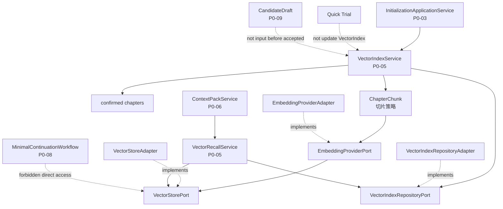
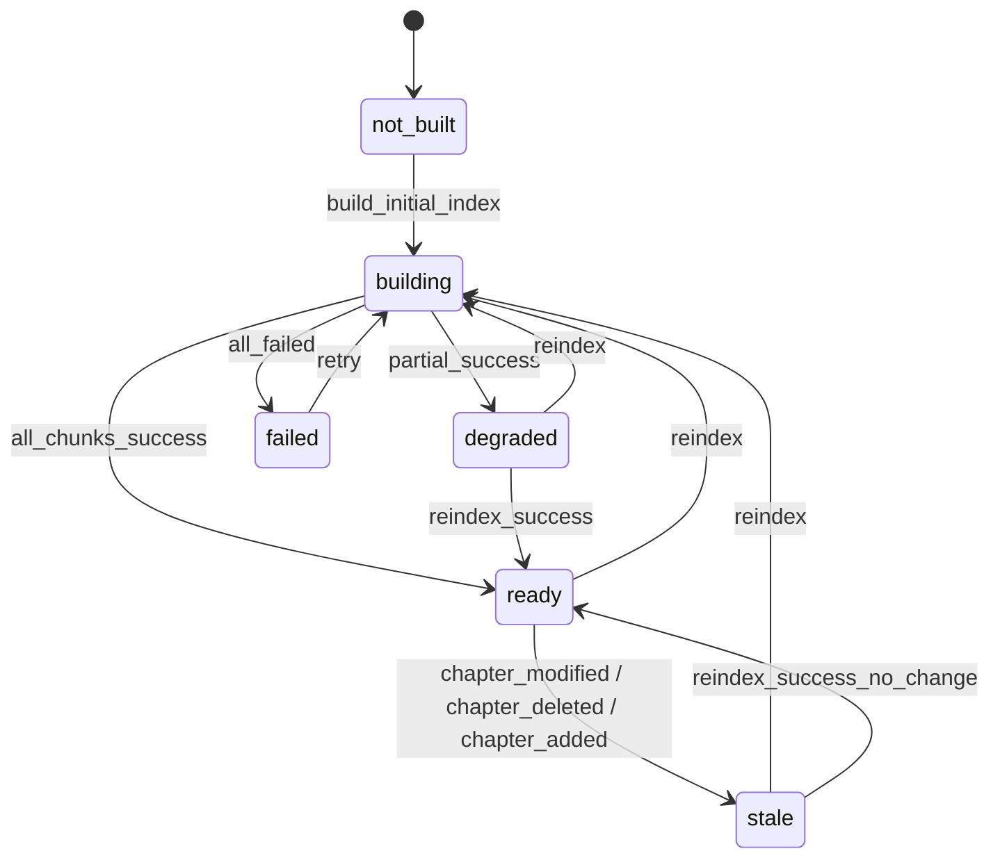

# InkTrace V2.0-P0-05 VectorRecall 详细设计

版本：v2.0-p0-detail-05  
状态：P0 模块级详细设计  
依据文档：

- `docs/01_requirements/InkTrace-V2.0-需求规格说明书.md`
- `docs/07_overview/InkTrace-V2.0-概要设计说明书.md`
- `docs/02_architecture/InkTrace-V2.0-架构设计说明书.md`
- `docs/03_design/InkTrace-V2.0-P0-详细设计总纲.md`
- `docs/03_design/InkTrace-V2.0-P0-01-AI基础设施详细设计.md`
- `docs/03_design/InkTrace-V2.0-P0-02-AIJobSystem详细设计.md`
- `docs/03_design/InkTrace-V2.0-P0-03-初始化流程详细设计.md`
- `docs/03_design/InkTrace-V2.0-P0-04-StoryMemory与StoryState详细设计_001.md`

---

## 一、文档定位与设计范围

### 1.1 文档定位

本文档是 InkTrace V2.0-P0 的第五个模块级详细设计文档，仅覆盖 P0 VectorRecall。

本文档用于冻结 P0 VectorIndexService、VectorRecallService、ChapterChunk、ChunkEmbedding、切片策略、EmbeddingProviderPort、VectorStorePort、VectorIndexRepositoryPort 的职责边界，以及 VectorRecall 与 P0-03 初始化流程、P0-04 StoryMemory/StoryState、P0-06 ContextPack、P0-09 CandidateDraft、Quick Trial 的交互边界。

本文档不写代码、不修改源码、不生成数据库迁移、不拆 Task、不进入开发计划。

### 1.2 设计范围

本模块覆盖：

- VectorIndexService 职责与构建流程。
- VectorRecallService 职责与召回流程。
- ChapterChunk 定义与字段方向。
- ChunkEmbedding 定义与字段方向。
- P0 最小切片策略（固定长度 + overlap）。
- EmbeddingProviderPort 抽象。
- VectorStorePort 抽象。
- VectorIndexRepositoryPort 抽象。
- RecallQuery / RecallResult 设计。
- VectorIndex 状态与 stale 设计。
- 与 AIJobSystem 的关系（build_vector_index Step）。
- 与 ContextPack 的边界（降级关系）。
- 与 StoryMemory / StoryState 的边界。
- 与 CandidateDraft / Quick Trial 的边界。
- 数据一致性与写入顺序。
- 错误处理与降级。

### 1.3 本文档不覆盖

P0-05 不覆盖：

- ContextPack 组装策略与裁剪策略（P0-06）。
- StoryMemory / StoryState 内部结构（P0-04）。
- AI Suggestion / Conflict Guard（P1）。
- 完整 Knowledge Graph（P2）。
- Citation Link（P2）。
- @ 标签引用系统（P2）。
- 复杂多路召回融合（P2）。
- 复杂语义切片（P1/P2）。
- 完整 Agent Runtime（P1）。

---

## 二、P0 VectorRecall 目标

### 2.1 目标

P0 VectorRecall 的目标是为 ContextPack 提供基础的正文片段向量召回能力。

它在 P0 中的作用：

- 将 confirmed chapters 切片为 Chunk。
- 通过 EmbeddingProviderPort 生成向量。
- 通过 VectorStorePort 写入向量索引。
- 在正式续写前，为 ContextPack 提供 RAG（检索增强生成）召回片段。
- 帮助 Writer 在生成时参考前文具体内容（人物描写、场景细节、事件经过）。

### 2.2 为什么是 ContextPack 的可降级上游

VectorRecall 与 StoryMemory / StoryState 的区别：

- StoryMemory / StoryState 提供的是**摘要级**全局状态记忆。
- VectorRecall 提供的是**片段级**原文检索能力。
- 正式续写时，ContextPack 需要 StoryMemory / StoryState（必需）和 VectorRecall（可选辅助）。
- VectorIndex 不可用时，ContextPack 可以无 RAG 层 degraded，但 StoryMemory / StoryState 缺失时 blocked。

---

## 三、模块边界与不做事项

### 3.1 P0 做什么

P0-05 负责：

- 定义 ChapterChunk 结构，仅来自 confirmed chapters。
- 定义 P0 最小切片策略（固定长度 + overlap）。
- 定义 EmbeddingProviderPort 抽象。
- 定义 VectorStorePort 与 VectorIndexRepositoryPort 抽象。
- 实现 VectorIndexService：构建初始索引、reindex、标记 stale/deleted。
- 实现 VectorRecallService：按 work_id / query_text 召回片段。
- 定义 RecallQuery / RecallResult。
- 定义 work / chapter / chunk 级 index_status。
- 支持构建失败降级（不阻断 initialization_status = completed）。
- 支持章节删除后标记 chunk invalid。

### 3.2 P0 不做什么

P0-05 不做：

- 复杂多路召回融合。
- Citation Link（来源可追溯引用）。
- @ 标签引用系统。
- Knowledge Graph。
- 语义切片 / 场景级切片 / 段落级高级切片。
- 跨作品召回。
- 自动全量重建策略。
- 复杂重排序（rerank）。
- 自动章节级切片策略学习。

### 3.3 禁止行为

- 不得基于未接受 CandidateDraft 创建 ChapterChunk。
- 不得基于 Quick Trial 输出创建 ChapterChunk。
- 不得基于临时候选区或未保存草稿创建 Chunk。
- 不得将召回结果写回正式正文或正式资产。
- 不得直接调用 Embedding Provider SDK 而不经过 EmbeddingProviderPort。
- 不得硬编码具体 Embedding Provider。
- Workflow / Agent 不得直接访问 VectorStorePort。
- ContextPackService 不得直接访问 VectorStorePort（必须通过 VectorRecallService）。

---

## 四、总体架构

### 4.1 模块关系说明

P0-05 位于 Core Application + Port 边界内。

上下游关系：

- P0-03 初始化流程触发 VectorIndexService.build_initial_index()。
- VectorIndexService 读取 confirmed chapters，切片后通过 EmbeddingProviderPort 生成 embedding，再通过 VectorStorePort 写入向量。
- P0-06 ContextPackService 调用 VectorRecallService 获取 RecallResult。
- VectorRecallService 通过 VectorStorePort 查询相似向量，通过 VectorIndexRepositoryPort 读取 chunk 元数据。

### 4.2 模块关系图



### 4.3 与相邻模块的边界

| 模块 | P0-05 关系 | 边界 |
|---|---|---|
| P0-03 初始化流程 | 触发 build_initial_index | P0-05 负责切片+Embedding+写入，不阻断 completed |
| P0-04 StoryMemory/StoryState | 同级上游 | VectorRecall 不替代 StoryMemory/StoryState；两者都是 ContextPack 上游，但 StoryMemory/StoryState 是必需，VectorRecall 是可降级 |
| P0-06 ContextPack | 调用 VectorRecallService | ContextPack 通过 VectorRecallService 获取 RecallResult，不直接访问 VectorStorePort |
| P0-08 MinimalContinuationWorkflow | 间接使用 | 通过 ContextPack 间接使用 RecallResult，不直接访问 |
| P0-09 CandidateDraft | 隔离 | 未接受 CandidateDraft 不进入 VectorIndex |

### 4.4 禁止调用路径

- Workflow / Agent → VectorStorePort（禁止直接访问）。
- Workflow / Agent → EmbeddingProviderPort（禁止直接调用）。
- ContextPackService → VectorStorePort（必须通过 VectorRecallService）。
- CandidateDraft → VectorIndexService（禁止自动更新）。
- Quick Trial → VectorIndexService（禁止自动更新）。

---

## 五、ChapterChunk 详细设计

### 5.1 定义

ChapterChunk 是 P0 中对 confirmed chapters 切片后得到的最小正文片段单元，用于生成 embedding 和后续召回。

ChapterChunk：

- 只能来自 confirmed chapters。
- 不来自未接受 CandidateDraft。
- 不来自 Quick Trial 输出。
- 不来自临时候选区或未保存草稿。
- 不替代正式正文。
- 不应保存超出召回需要的完整作品正文副本。

### 5.2 字段方向

| 字段 | 说明 | P0 必须 |
|---|---|---|
| chunk_id | Chunk ID | 是 |
| work_id | 作品 ID | 是 |
| chapter_id | 来源章节 ID | 是 |
| chapter_order | 章节顺序号 | 是 |
| chunk_index | 章节内切片序号 | 是 |
| text_excerpt | Chunk 正文片段 | 是 |
| content_hash | 正文内容哈希，用于绑定 embedding | 是 |
| token_count | 文本 token 数量 | 可选 |
| start_offset | 在章节正文中的起始偏移 | 可选 |
| end_offset | 在章节正文中的结束偏移 | 可选 |
| source | 固定为 confirmed_chapter | 是 |
| index_status | 索引状态（active / stale / deleted / failed） | 是 |
| stale_status | 过期标记 | 是 |
| created_at | 创建时间 | 是 |
| updated_at | 更新时间 | 是 |

### 5.3 来源规则

- source 必须为 confirmed_chapter。
- source 不能是 candidate_draft。
- source 不能是 quick_trial。
- source 不能是 temp_selection。
- source 不能是 unsaved_draft。
- text_excerpt 只保存召回所需的正文片段，不保存完整章节正文副本。
- 空章节不创建有效 chunk，记录 warning。

### 5.4 stale / deleted 边界

- 删除章节后，相关 chunk 必须标记 deleted 或 invalid。
- 修改章节后，旧 chunk 必须标记 stale。
- 新增章节确认保存后才能创建 chunk。
- stale / deleted chunk 默认不参与正式召回。
- 历史 chunk 可保留用于调试，但正式 ContextPack 不得使用。

---

## 六、ChunkEmbedding 详细设计

### 6.1 定义

ChunkEmbedding 记录 Chunk 的 embedding 元数据，与 content_hash 绑定。

### 6.2 字段方向

| 字段 | 说明 | P0 必须 |
|---|---|---|
| embedding_id | Embedding 记录 ID | 是 |
| chunk_id | 关联的 Chunk ID | 是 |
| work_id | 作品 ID | 是 |
| chapter_id | 章节 ID | 是 |
| embedding_model | Embedding 模型名称 | 是 |
| embedding_provider | Embedding Provider 名称 | 是 |
| embedding_version | Embedding 模型版本 | 是 |
| vector_id | VectorStore 中的向量 ID | 是 |
| content_hash | 关联 chunk 的 content_hash | 是 |
| vector_dimension | 向量维度 | 可选 |
| status | 状态（active / stale / deleted / failed） | 是 |
| created_at | 创建时间 | 是 |
| updated_at | 更新时间 | 是 |

### 6.3 content_hash 绑定规则

- Embedding 与 chunk content_hash 绑定。
- content_hash 变化后旧 embedding 不再有效。
- 章节正文修改 → content_hash 变化 → 旧 embedding stale → 需重新生成。
- 章节删除 → chunk deleted → 关联 embedding 标记 deleted。

### 6.4 Provider 抽象

- EmbeddingProviderPort 是 Application Port，抽象具体 Embedding Provider。
- 业务服务不得硬编码具体 Embedding Provider。
- P0 不做复杂多模型 embedding 策略。
- P0 可使用默认 embedding model 配置。
- Embedding Provider API Key 不进入日志。

---

## 七、VectorIndexService 详细设计

### 7.1 职责

VectorIndexService 是 Application Service，负责向量索引的构建、重建和状态管理。

具体职责：

1. 接收初始化流程触发的 build_initial_index。
2. 读取 confirmed chapters。
3. 排除未接受的 CandidateDraft、Quick Trial 输出、临时候选区、未保存草稿。
4. 按 P0 切片策略对章节进行切片，生成 ChapterChunk。
5. 调用 EmbeddingProviderPort 生成 embedding。
6. 调用 VectorStorePort 写入向量。
7. 通过 VectorIndexRepositoryPort 记录 chunk 和 embedding 元数据。
8. 记录 index_status。
9. 支持按 work_id 重建索引。
10. 支持章节级重新索引。
11. 支持删除章节后使相关 chunk / embedding 失效。
12. 支持 stale 标记。
13. 向 AIJobService 汇报 build_vector_index Step 状态。
14. 构建失败时返回 warning / degraded，不阻断 initialization_status = completed。

### 7.2 输入

| 输入 | 说明 | 来源 |
|---|---|---|
| work_id | 作品 ID | P0-03 |
| confirmed_chapters | 已确认章节正文列表 | P0-03 |
| source_job_id | 初始化 Job ID | P0-03 |

### 7.3 输出

| 输出 | 说明 |
|---|---|
| index_status | work 级索引状态 |
| chunk_count | 成功切片数 |
| failed_chunk_count | 失败切片数 |
| warning | 构建警告列表 |
| success | 构建是否部分或全部成功 |

### 7.4 构建流程

```
接收 build_initial_index(work_id, confirmed_chapters)
  → 遍历每章 confirmed chapter
    → 跳过空章节（记录 warning）
    → 按切片策略切分 text_excerpt
    → 为每个 chunk 计算 content_hash
    → 调用 EmbeddingProviderPort.embed_text(chunk_text)
    → 调用 VectorStorePort.upsert_vector(chunk_id, embedding)
    → 通过 VectorIndexRepositoryPort 保存 chunk 元数据
    → 保存 embedding 元数据
    → 标记 chunk status = active
  → 汇总结果
  → 更新 work 级 index_status
  → 向 AIJobService 回报 Step 状态
```

### 7.5 Reindex

- 支持按 work_id 重建全量索引：清除旧 active 状态 → 重新切片 → 重新 embedding → 重新写入。
- 支持章节级 reindex：标记旧 chunk stale/deleted → 创建新 chunk → 新 embedding → 新 vector upsert。
- reindex 成功后新 chunk active，旧 chunk stale/deleted。
- reindex 失败时保持 degraded / stale。

### 7.6 不允许做的事情

- 不修改正式正文。
- 不覆盖用户原始大纲。
- 不写 StoryMemorySnapshot。
- 不写 StoryState analysis_baseline。
- 不创建 CandidateDraft。
- 不读取未接受 CandidateDraft。
- 不读取 Quick Trial 输出。
- 不把召回结果写回正式资产。
- 不直接调用 Provider SDK（必须通过 EmbeddingProviderPort）。
- 不硬编码具体 Embedding Provider。

---

## 八、VectorRecallService 详细设计

### 8.1 职责

VectorRecallService 是 Application Service，负责根据查询条件从 VectorIndex 中召回相关正文片段。

具体职责：

1. 接收 ContextPackService 的召回请求（RecallQuery）。
2. 根据 work_id、query_text、recall_scope 执行向量召回。
3. 内部调用 EmbeddingProviderPort 将 query_text 转为 query_embedding。
4. 调用 VectorStorePort.search_similar 查询相似 chunk。
5. 过滤 stale / deleted / invalid chunk。
6. 过滤未确认章节来源。
7. 按 score 降序排序，取 top_k。
8. 应用 score_threshold 过滤低分结果。
9. 支持按章节范围过滤（最近 N 章、目标上下文附近章节、全书范围）。
10. 返回 RecallResult 列表。
11. 不直接组装 ContextPack，只提供召回结果。

### 8.2 RecallQuery

| 字段 | 说明 | P0 必须 |
|---|---|---|
| work_id | 作品 ID | 是 |
| target_chapter_id | 目标章节 ID | 可选 |
| target_chapter_order | 目标章节顺序 | 可选 |
| query_text | 查询文本（用于生成 query_embedding 和召回） | 是 |
| query_embedding | 预生成的 query embedding（内部使用） | 可选 |
| top_k | 返回结果数量上限 | 是 |
| score_threshold | 分数阈值，低于此值的结果不返回 | 是 |
| recall_scope | 召回范围（recent_n / target_area / full_work） | 是 |
| include_recent_chapters | 是否包含最近 N 章 | 是 |
| exclude_chapter_ids | 排除的章节 ID 列表 | 可选 |
| allow_stale | 是否允许召回 stale chunk，默认 false | 是 |
| request_id | 请求 ID，用于追踪 | 可选 |
| trace_id | Trace ID，用于追踪 | 可选 |

recall_scope 枚举方向：

- `recent_n`：只召回最近 N 章（如最近 5 章、10 章）。
- `target_area`：目标章节附近区域（当前章节 ±N 章）。
- `full_work`：全书范围召回。

P0 默认值：

- top_k：5（默认），可配置范围为 3~10。
- score_threshold：0.0（不过滤），可配置。
- recall_scope 默认取决于 ContextPack 策略，P0-05 不固定。
- allow_stale：false。

### 8.3 RecallResult

| 字段 | 说明 | P0 必须 |
|---|---|---|
| chunk_id | Chunk ID | 是 |
| work_id | 作品 ID | 是 |
| chapter_id | 来源章节 ID | 是 |
| chapter_order | 章节顺序号 | 是 |
| chunk_index | 章节内切片序号 | 是 |
| score | 相似度分数 | 是 |
| text_excerpt | 正文片段文本 | 是 |
| source | 固定为 confirmed_chapter | 是 |
| stale_status | chunk 过期状态 | 是 |
| content_hash | 内容哈希 | 是 |
| vector_id | 向量 ID | 可选 |
| reason | 召回理由，可选 | 可选 |

### 8.4 过滤规则

1. 只返回 status = active 的 chunk。
2. stale / deleted / failed chunk 默认不返回。
3. allow_stale = true 时可返回 stale chunk（仅用于调试或 degraded 场景）。
4. 只返回 source = confirmed_chapter 的 chunk。
5. score 低于 score_threshold 的结果不返回。
6. exclude_chapter_ids 中指定的章节对应 chunk 不返回。

### 8.5 排序规则

- 按 score 降序排列。
- 取前 top_k 条。
- 不进行 P0 复杂 rerank。

### 8.6 不允许做的事情

- 不直接调用模型生成正文。
- 不创建 CandidateDraft。
- 不更新 StoryMemory / StoryState。
- 不写正式正文。
- 不绕过 ContextPackService（RecallResult 只能由 ContextPackService 消费）。
- 不把 RecallResult 当作正式资产。
- 不在 P0 做复杂多路召回融合。
- 不在 P0 做 Citation Link。

---

## 九、切片策略 P0 最小设计

### 9.1 策略说明

P0 采用固定长度 + overlap 的简单切片策略，不做复杂语义切片。

### 9.2 默认参数

| 参数 | 默认值 | 说明 |
|---|---|---|
| chunk_size | 1000 字（中文字符） | 单个 chunk 的目标长度，可按 token 数近似 |
| overlap_size | 150 字 | 相邻 chunk 之间的重叠字符数 |
| min_chunk_size | 100 字 | 最小有效 chunk 长度，低于此值不创建独立 chunk |
| max_chunks_per_chapter | 不设硬上限 | 按章节实际长度决定 |

### 9.3 切片规则

1. 按章节为单位切片，不跨章节。
2. 章节正文长度 <= chunk_size 时：单 chunk 包含完整章节内容。
3. 章节正文长度 > chunk_size 时：按 chunk_size 切分，相邻 chunk 之间保留 overlap_size 重叠。
4. 章节正文长度介于 min_chunk_size 与 chunk_size 之间时：单 chunk。
5. 章节正文长度 < min_chunk_size 时：不创建独立 chunk，内容可合并到相邻章节或记录 warning。
6. 空章节不创建有效 chunk，记录 warning。
7. 保留 chapter_id、chapter_order、chunk_index 用于映射。
8. 计算 content_hash 用于后续 embedding 绑定和 stale 检测。

### 9.4 边界规则

- 章节内容 < min_chunk_size 且不是空章节时：创建单 chunk 但记录 small_chunk warning。
- 章节过长时拆分为多个 chunk，不做摘要合并。
- 每个 chunk 的 text_excerpt 是原文片段，不做改写。
- P0 不做场景级 / 段落级高级切片。
- P1 / P2 可扩展更智能切片。

---

## 十、Port 与 Adapter 边界

### 10.1 EmbeddingProviderPort

EmbeddingProviderPort 是 Application 层定义的调用抽象，属于 Port 边界。

方法：

| 方法 | 说明 | P0 必须 | 参数 | 返回值 |
|---|---|---|---|---|
| embed_text | 单文本 embedding | 是 | text: str | embedding: List[float] |
| embed_batch | 批量文本 embedding | 可选 | texts: List[str] | embeddings: List[List[float]] |
| get_embedding_model_info | 获取当前模型信息 | 是 | 无 | model_name, model_version, vector_dimension |

规则：

- embed_text 是 P0 必须实现的核心方法。
- embed_batch 可选，用于批量构建时提升性能。
- 返回的 vector_dimension 需与 VectorStorePort 配置一致。
- EmbeddingProviderAdapter 实现此 Port，不得硬编码在业务服务中。

### 10.2 VectorStorePort

VectorStorePort 是 Application 层定义的向量存储抽象，属于 Port 边界。

方法：

| 方法 | 说明 | P0 必须 | 参数 | 返回值 |
|---|---|---|---|---|
| upsert_vector | 写入或更新单个向量 | 是 | vector_id, embedding, metadata | success |
| upsert_vectors | 批量写入向量 | 可选 | List[vector_id, embedding, metadata] | success |
| search_similar | 查询相似向量 | 是 | query_embedding, top_k, filter | List[vector_id, score, metadata] |
| delete_vector | 删除单个向量 | 是 | vector_id | success |
| delete_by_chapter | 按章节删除/标记向量 | 是 | chapter_id | success |
| get_vector_status | 查询向量状态 | 可选 | vector_id | status |

规则：

- VectorStoreAdapter 实现此 Port。
- filter 参数用于按 work_id / chapter_id / status 等过滤。
- P0 不要求实现复杂 filter 语法，基础等于/不等即可。
- P0 默认 metadata 至少携带 work_id、chapter_id、chunk_id、status、source。
- search_similar 返回结果必须携带 score。

### 10.3 VectorIndexRepositoryPort

VectorIndexRepositoryPort 是 Application 层定义的元数据持久化接口，属于 Port 边界。

方法：

| 方法 | 说明 | P0 必须 | 参数 | 返回值 |
|---|---|---|---|---|
| save_chunk | 保存 ChapterChunk 元数据 | 是 | ChapterChunk | chunk_id |
| save_embedding_metadata | 保存 embedding 元数据 | 是 | ChunkEmbedding | embedding_id |
| get_chunks_by_work | 获取作品所有 chunk | 是 | work_id | List[ChapterChunk] |
| get_chunks_by_chapter | 获取章节的所有 chunk | 是 | work_id, chapter_id | List[ChapterChunk] |
| mark_chunks_stale_by_chapter | 按章节标记 chunk stale | 是 | chapter_id, reason | success |
| mark_chunks_deleted_by_chapter | 按章节标记 chunk deleted | 是 | chapter_id, reason | success |
| get_index_status_by_work | 获取作品级索引状态 | 是 | work_id | index_status |
| update_index_status | 更新作品级索引状态 | 是 | work_id, index_status | success |
| list_stale_chunks | 列出所有 stale chunk | 可选 | work_id, limit | List[ChapterChunk] |

### 10.4 Adapter 边界

- EmbeddingProviderPort、VectorStorePort、VectorIndexRepositoryPort 是 Application Port，不强制对应具体数据库表或具体 VectorStore 产品。
- Infrastructure Adapter 负责实现具体逻辑。
- P0 可选择本地 embedding 模型（如 bge-small-zh）和本地向量存储（如 SQLite 向量扩展或文件型索引）。
- Adapter 实现 Port，不承载业务规则。
- 普通日志不记录完整 chunk_text、完整 Prompt、API Key。

### 10.5 访问控制

- Workflow / Agent 不得直接访问 VectorStorePort。
- Workflow / Agent 不得直接访问 EmbeddingProviderPort。
- ContextPackService 只能通过 VectorRecallService 调用召回。
- VectorRecallService 是唯一应调用的 VectorStorePort 查询入口（VectorIndexService 只用于写入和维护）。

---

## 十一、VectorIndex status / stale 设计

### 11.1 work 级 index_status

| 状态 | 含义 |
|---|---|
| not_built | 尚未构建索引 |
| building | 正在构建索引 |
| ready | 索引就绪，可用于正式 ContextPack RAG 层 |
| degraded | 部分构建失败，可提供部分 RAG 能力 |
| stale | 正文修改/新增/删除导致索引可能过期 |
| failed | 索引不可用，ContextPack 无 RAG 层 |

### 11.2 chapter / chunk 级 status

| 状态 | 含义 |
|---|---|
| active | Chunk 有效，可参与召回 |
| stale | 正文已修改，旧 chunk 不再有效 |
| deleted | 章节已删除，chunk 不可用 |
| failed | Chunk 处理失败 |
| skipped | Chunk 跳过处理（如空章节） |

### 11.3 状态流转



### 11.4 规则

- index_status = ready：可用于正式 ContextPack 的 RAG 层。
- index_status = degraded：部分构建失败，ContextPack 可带 warning 使用部分 RAG。
- index_status = stale：正文修改导致索引过期，默认不用于正式召回。
- index_status = failed：索引不可用，ContextPack 无 RAG 层。
- Chunk stale 时默认不参与正式召回。
- 删除章节对应 chunk 必须标记 deleted。
- 新增章节未索引前不能参与召回。
- reindex 成功后可恢复 ready。
- reindex 失败时保持 degraded / stale / failed。
- P0 不做复杂依赖图。

---

## 十二、与 AIJobSystem 的关系

### 12.1 build_vector_index Step

- build_vector_index 是 ai_initialization Job 的 Step。
- build_vector_index 是可降级 Step，不是 initialization completed 的硬阻断项。
- build_vector_index failed 不阻断 initialization_status = completed。
- build_vector_index failed 必须记录 warning。
- build_vector_index failed 后 ContextPack degraded，无 RAG 层。

### 12.2 Step 状态管理

- VectorIndexService 通过 AIJobService 更新 Step 状态。
- 每个章节或批次 indexing 可作为内部进度，但 P0 不要求拆成复杂子 Job。
- retry build_vector_index 可重建索引。
- reindex chapter 可以作为后续操作，P0 需要定义行为边界。

### 12.3 cancel 处理

- cancel 后迟到的 embedding / vector write 不得继续污染当前 active index。
- 如果 cancel 时部分 chunk 已写入，这些 chunk 应保留但标记 index_status 为 building 或 failed。
- 取消后不应继续执行新的 embedding / vector upsert。
- 后续 rebuild 时清除 cancel 前的部分写入。

---

## 十三、与 ContextPack 的边界

### 13.1 读取边界

- P0-05 只提供 VectorRecall，不组装 ContextPack。
- ContextPackService 调用 VectorRecallService.recall(RecallQuery) 获取 RecallResult。
- ContextPackService 是 RecallResult 的唯一消费方。
- ContextPackService 不得直接访问 VectorStorePort。

### 13.2 blocked / degraded 规则

| 场景 | ContextPack 状态 |
|---|---|
| index_status = ready | 正常 RAG 层 |
| index_status = degraded | degraded，部分 RAG |
| index_status = stale 且影响最近章节/目标上下文 | blocked 或 degraded，具体由 P0-06 定义 |
| index_status = stale 且只影响较早章节 | degraded + warning |
| index_status = failed | degraded，无 RAG 层 |
| index_status = not_built | degraded，无 RAG 层 |
| VectorRecallService.recall 查询失败 | degraded，无 RAG 层 |

### 13.3 层级关系

- StoryMemory / StoryState 是 ContextPack 的必需上游。
- VectorRecall 是 ContextPack 的可降级上游。
- VectorRecall 不得绕过 StoryMemory / StoryState 的 blocked 规则。
- VectorRecall 不把召回内容写回正式正文或资产。
- P0 不做 Citation Link，只提供内部 RecallResult。

---

## 十四、与 CandidateDraft / Quick Trial 的边界

### 14.1 CandidateDraft

- CandidateDraft 不进入 VectorIndex。
- 未接受 CandidateDraft 不参与 chunk 创建。
- 用户接受 CandidateDraft 后，内容进入 V1.1 Local-First 正文保存链路。
- 成为 confirmed chapter 后，后续 reindex 才能进入 VectorIndex。
- AI 生成内容在 Human Review Gate 前不得影响 VectorIndex。

### 14.2 Quick Trial

- Quick Trial 输出不进入 VectorIndex。
- Quick Trial 可以不依赖 VectorRecall。
- Quick Trial 若使用 VectorRecall，必须标记 degraded_context / context_insufficient，且不得更新正式索引。
- stale 状态下 Quick Trial 还必须标记 stale_context。

---

## 十五、数据一致性与写入顺序

### 15.1 写入顺序约束

```
ChapterChunk 保存成功
  → Embedding 生成成功
    → VectorStore upsert 成功
      → 标记 chunk & embedding metadata active
        → 更新 work 级 index_status = ready
```

具体规则：

1. ChapterChunk 保存成功后才能调用 EmbeddingProviderPort。
2. Embedding 生成成功后才能调用 VectorStorePort.upsert_vector。
3. VectorStore upsert 成功后才能标记 chunk status = active、embedding status = active。
4. 如果 embedding 失败，chunk 可保留为 status = failed，但不得参与正式召回。
5. 如果 vector upsert 失败，embedding metadata 不得标记 active。
6. 所有 chunks 处理完成后更新 work 级 index_status。

### 15.2 删除 / 修改顺序

1. 章节删除：先 mark_chunks_deleted_by_chapter，再 delete_by_chapter（VectorStore），再更新 index_status。
2. 章节修改：先 mark_chunks_stale_by_chapter，再创建新 chunk → 新 embedding → 新 vector upsert。
3. reindex 成功后，新 chunk active，旧 chunk stale/deleted。
4. cancel 后迟到写入不得覆盖当前 active index。

### 15.3 P0 事务原则

- P0 不要求复杂分布式事务。
- 必须保证 stale/deleted chunk 默认不参与正式召回。
- 必须保证 active index 不被 cancel 后迟到写入污染。

---

## 十六、错误处理与降级

### 16.1 错误场景表

| 场景 | error_code | P0 行为 | V1.1 影响 |
|---|---|---|---|
| confirmed chapters 为空 | empty_confirmed_chapters | 跳过索引构建，index_status = not_built + warning | 不影响 |
| 章节内容为空 | chapter_empty | 不创建有效 chunk，记录 warning | 不影响 |
| 章节过长 | chapter_too_long | 按切片策略分片，每片独立处理 | 不影响 |
| Embedding Provider 未配置 | embedding_provider_not_configured | VectorIndex 构建失败，index_status = failed | 不影响 |
| Embedding Provider 鉴权失败 | embedding_auth_failed | 对应 chunk embedding failed，记录 error | 不影响 |
| Embedding Provider timeout | embedding_timeout | 对应 chunk 重试或标记 failed | 不影响 |
| Embedding 生成失败 | embedding_generation_failed | 对应 chunk status = failed，index 可 degraded | 不影响 |
| VectorStore 不可用 | vector_store_unavailable | 索引构建失败，index_status = failed | 不影响 |
| VectorStore 写入失败 | vector_upsert_failed | 对应 embedding metadata 不标记 active | 不影响 |
| VectorStore 查询失败 | vector_search_failed | ContextPack degraded，无 RAG 层 | 不影响 |
| Chunk 保存失败 | chunk_persistence_failed | 对应 chunk 不创建，记录 error | 不影响 |
| Embedding metadata 写入失败 | embedding_metadata_persistence_failed | 对应 chunk 保持 status = pending/failed | 不影响 |
| content_hash mismatch | content_hash_mismatch | 拒绝写入，记录 warning 并重试 | 不影响 |
| stale chunk 被召回（allow_stale=false 时） | stale_chunk_recalled | 过滤，不在正式结果中返回 | 不影响 |
| deleted chunk 被召回 | deleted_chunk_recalled | 过滤，不在正式结果中返回 | 不影响 |
| 章节删除后旧 vector 未清理 | orphan_vector | 不影响 V1.1，但应标记 stale/deleted | 不影响 |
| reindex 失败 | reindex_failed | index_status 保持 degraded/stale/failed | 不影响 |
| 服务重启 | service_restart | 已保存 chunk/embedding 保留，index_status 需校验 | 不影响 |
| cancel 后迟到 embedding/vector write | late_write_after_cancel | 拒绝写入或标记废弃 | 不影响 |

### 16.2 错误隔离原则

- VectorIndex 错误不影响 V1.1 写作、保存、导入、导出。
- VectorIndex 错误不破坏正式正文。
- VectorIndex 错误不覆盖用户原始大纲。
- VectorIndex 错误不写正式资产。
- VectorIndex 错误不阻断 initialization_status = completed，但会导致 ContextPack degraded。
- VectorRecall 查询失败时，ContextPack 可以 degraded，无 RAG 层。
- 单章 chunk 处理失败不阻断整书索引构建（index_status = degraded）。

---

## 十七、安全、隐私与日志

### 17.1 日志边界

- 普通日志不记录完整正文。
- 普通日志不记录完整 chunk_text。
- 普通日志不记录完整 Prompt。
- 普通日志不记录 API Key。
- Embedding Provider API Key 不进入日志。
- error_message 必须脱敏。

### 17.2 数据存储边界

- ChapterChunk.text_excerpt 只保存召回所需的正文片段，不保存完整章节正文副本。
- 单章被拆为多 chunk 时，各 chunk 片段合计可能接近章节全长度，但不作为正式正文的替代存储。
- VectorStore 只保存 confirmed chapters 的 chunk / vector。
- VectorStore 不保存未确认 AI 输出。
- 用户原始正文仍以 V1.1 正式正文保存链路为准。

### 17.3 资产保护

- chunk / embedding 不替代正式正文。
- 删除章节后，正式召回不得返回该章节 chunk。
- 清理失败 Job 不得删除正式正文、用户原始大纲或正式资产。
- 索引相关清理策略后续另行定义。

---

## 十八、P0 验收标准

### 18.1 ChapterChunk 验收项

- [ ] 可以基于 confirmed chapters 构建 ChapterChunk。
- [ ] 未接受 CandidateDraft 不进入 VectorIndex。
- [ ] Quick Trial 输出不进入 VectorIndex。
- [ ] 临时候选区和未保存草稿不进入 VectorIndex。
- [ ] ChapterChunk 只来自 confirmed chapters。
- [ ] ChapterChunk.source = confirmed_chapter。
- [ ] 空章节不创建有效 chunk，并记录 warning。
- [ ] 章节过长可分片处理。
- [ ] ChapterChunk 保存 content_hash 用于绑定 embedding 和 stale 检测。
- [ ] 删除章节后相关 chunk 标记 deleted。
- [ ] 修改章节后旧 chunk 标记 stale。
- [ ] stale / deleted chunk 默认不参与正式召回。

### 18.2 ChunkEmbedding 验收项

- [ ] ChunkEmbedding 与 content_hash 绑定。
- [ ] content_hash 变化后旧 embedding 不再有效。
- [ ] EmbeddingProviderPort 抽象具体 Provider，业务代码不硬编码。
- [ ] Embedding Provider API Key 不进入日志。

### 18.3 VectorIndexService 验收项

- [ ] VectorIndexService 可以基于 confirmed chapters 构建初始索引。
- [ ] VectorIndexService 可以标记章节 stale。
- [ ] VectorIndexService 可以处理章节删除导致的 deleted chunk。
- [ ] VectorIndexService 支持按 work_id 重建索引。
- [ ] VectorIndexService 支持章节级 reindex。
- [ ] VectorIndexService 构建失败不影响 V1.1。
- [ ] VectorIndexService 构建失败不阻断 initialization_status = completed。
- [ ] VectorIndexService 构建失败会记录 warning，并导致 ContextPack degraded。
- [ ] build_vector_index Step 是可降级的。
- [ ] cancel 后迟到 embedding / vector write 不得污染 active index。

### 18.4 VectorRecallService 验收项

- [ ] VectorRecallService 可以按 work_id 和 query_text 返回 RecallResult。
- [ ] RecallResult 只来自 confirmed chapters。
- [ ] stale / deleted chunk 默认不参与正式召回。
- [ ] top_k 和 score_threshold 有 P0 默认值。
- [ ] recall_scope 支持 basic 范围过滤（全书/最近 N 章/目标区域）。
- [ ] RecallResult 包含 chunk_id、chapter_id、chapter_order、score、text_excerpt。
- [ ] VectorRecall 查询失败时 ContextPack 可 degraded，不影响 V1.1。

### 18.5 边界验收项

- [ ] ContextPackService 通过 VectorRecallService 召回，不直接访问 VectorStorePort。
- [ ] Workflow / Agent 不直接访问 VectorStorePort。
- [ ] Workflow / Agent 不直接访问 EmbeddingProviderPort。
- [ ] StoryMemory / StoryState 缺失时 ContextPack blocked（VectorRecall 不绕过此规则）。
- [ ] VectorIndex 不可用时 ContextPack degraded 而非 blocked。
- [ ] CandidateDraft 生成不会更新 VectorIndex。
- [ ] 用户接受 CandidateDraft 后，仍需通过 V1.1 Local-First 正文保存链路，后续 reindex 才能进入 VectorIndex。
- [ ] Quick Trial 不更新 VectorIndex。
- [ ] 删除章节后旧 chunk / vector 不得作为当前正式续写上下文。

### 18.6 切片策略验收项

- [ ] 支持固定长度 + overlap 切片。
- [ ] 单章内容 <= chunk_size 时单 chunk。
- [ ] 单章内容 > chunk_size 时多 chunk + overlap。
- [ ] 空章节不创建有效 chunk，记录 warning。
- [ ] 不跨章节切片。

### 18.7 P0 不做事项验收项

- [ ] P0 不实现 Citation Link。
- [ ] P0 不实现复杂知识图谱。
- [ ] P0 不实现复杂多路召回融合。
- [ ] P0 不实现复杂语义切片。
- [ ] P0 不实现 rerank。

### 18.8 安全与日志验收项

- [ ] 普通日志不记录 API Key、完整正文、完整 chunk_text、完整 Prompt。
- [ ] Embedding Provider API Key 不进入日志。
- [ ] VectorStore 只保存 confirmed chapters 的 chunk / vector。
- [ ] chunk / embedding 不替代正式正文。
- [ ] VectorIndex 错误不影响 V1.1 写作、保存、导入、导出。
- [ ] VectorIndex 错误不覆盖正式正文、用户原始大纲或正式资产。
