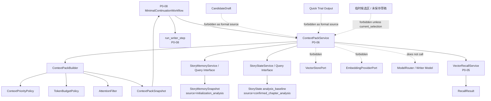
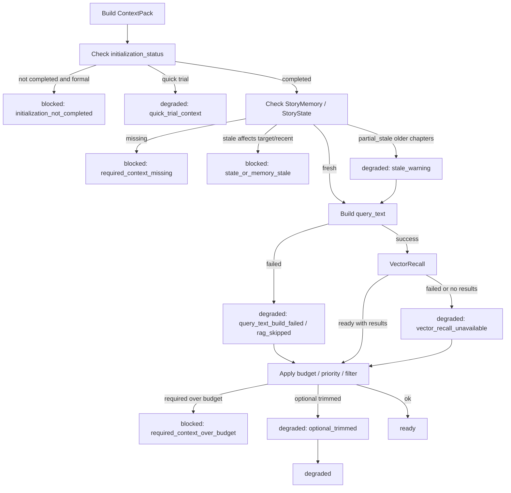
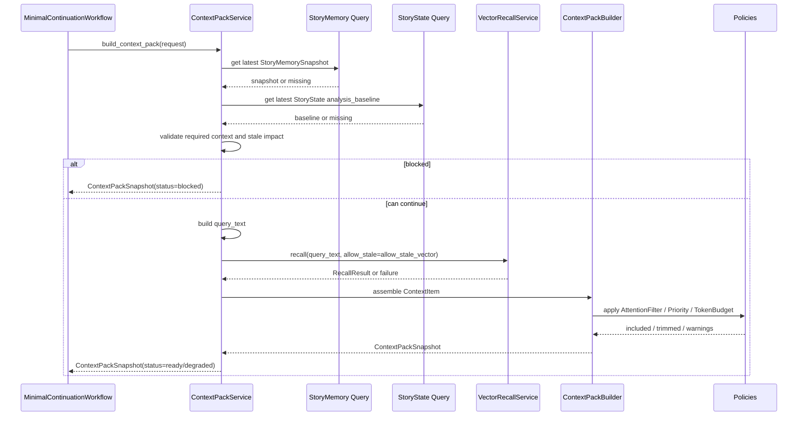

# InkTrace V2.0-P0-06 ContextPack 详细设计

版本：v2.0-p0-detail-06  
状态：P0 模块级详细设计  
依据文档：

- `docs/01_requirements/InkTrace-V2.0-需求规格说明书.md`
- `docs/07_overview/InkTrace-V2.0-概要设计说明书.md`
- `docs/02_architecture/InkTrace-V2.0-架构设计说明书.md`
- `docs/03_design/InkTrace-V2.0-P0-详细设计总纲.md`
- `docs/03_design/InkTrace-V2.0-P0-01-AI基础设施详细设计.md`
- `docs/03_design/InkTrace-V2.0-P0-02-AIJobSystem详细设计.md`
- `docs/03_design/InkTrace-V2.0-P0-03-初始化流程详细设计.md`
- `docs/03_design/InkTrace-V2.0-P0-04-StoryMemory与StoryState详细设计.md`
- `docs/03_design/InkTrace-V2.0-P0-05-VectorRecall详细设计.md`

---

## 一、文档定位与设计范围

### 1.1 文档定位

本文档是 InkTrace V2.0-P0 的第六个模块级详细设计文档，仅覆盖 P0 ContextPack。

ContextPack 是正式 AI 续写前的受控上下文包。它负责在正式写作模型调用之前，从已确认的作品状态中读取 StoryMemorySnapshot、StoryState analysis_baseline、当前章节上下文、WritingTask、用户指令与可降级的 VectorRecall 结果，形成可追踪、可裁剪、可判定 blocked / degraded / ready 的结构化上下文。

本文档不替代 P0-04 StoryMemory / StoryState 详细设计，不替代 P0-05 VectorRecall 详细设计，不替代 P0-08 MinimalContinuationWorkflow 详细设计，不写代码、不修改源码、不生成数据库迁移、不拆 Task、不进入开发计划。

### 1.2 设计范围

本模块覆盖：

- ContextPackService。
- ContextPackSnapshot。
- ContextPackBuilder。
- TokenBudgetPolicy。
- ContextPriorityPolicy。
- AttentionFilter。
- ContextSource。
- ContextItem。
- ContextPack 构建输入。
- ContextPack 构建输出。
- ContextPack blocked / degraded / ready 状态。
- 与 StoryMemorySnapshot 的读取边界。
- 与 StoryState analysis_baseline 的读取边界。
- 与 VectorRecall 的读取边界。
- 与 WritingTask / MinimalContinuationWorkflow 的边界。
- 与 CandidateDraft / HumanReviewGate 的边界。
- 与 Quick Trial 的边界。
- stale / partial_stale / degraded 对 ContextPack 的影响。
- 正式续写前的上下文准备规则。

### 1.3 本文档不覆盖

P0-06 不覆盖：

- 完整 Agent Runtime。
- AgentSession / AgentStep / AgentObservation / AgentTrace。
- 五 Agent Workflow。
- 完整 AI Suggestion / Conflict Guard。
- 完整 Story Memory Revision。
- 复杂 Knowledge Graph。
- Citation Link。
- @ 标签引用系统。
- 复杂多路召回融合。
- 自动连续续写队列。
- 成本看板。
- 分析看板。
- P0-04 StoryMemory / StoryState 内部结构重建策略。
- P0-05 VectorRecall 的切片、Embedding、VectorStore 详细实现。
- P0-08 MinimalContinuationWorkflow 的完整编排细节。
- P0-09 CandidateDraft / HumanReviewGate 详细流程。

---

## 二、P0 ContextPack 目标

### 2.1 核心目标

P0 ContextPack 的目标是：

- 在正式 AI 续写前，组装一个受控、可追踪、可裁剪的上下文包。
- 把 StoryMemorySnapshot、StoryState analysis_baseline、当前写作任务、当前章节上下文、必要的 VectorRecall 片段组合成模型输入前的结构化上下文。
- 判断正式续写是否 blocked、degraded 或 ready。
- 在 token budget 内按优先级裁剪上下文。
- 防止未确认 CandidateDraft、Quick Trial 输出、临时候选区或未保存草稿错误进入正式续写上下文。
- 为 P0-08 MinimalContinuationWorkflow 提供 Writer 输入上下文。

### 2.2 受控上下文包定位

ContextPack 不是模型调用器，也不是正式数据写入器。

规则：

- ContextPackService 不直接调用 ModelRouter。
- ContextPackService 不直接调用 Writer 模型。
- ContextPackService 不创建 CandidateDraft。
- ContextPackService 不写正式正文。
- ContextPackService 不更新 StoryMemory / StoryState / VectorIndex。
- ContextPackSnapshot 是一次构建结果，不是正式资产。
- ContextPackSnapshot 可以作为 Workflow 的只读输入。

### 2.3 blocked / degraded / ready 的价值

ContextPack 的状态用于让 Workflow 和 UI 在调用 Writer 前做明确判断：

- ready：上下文完整，可正常进入正式续写。
- degraded：上下文存在 warning，但仍可进入正式续写，UI / Workflow 必须展示 warning。
- blocked：正式续写不可用，必须先初始化、重新分析或修复关键上下文。

---

## 三、模块边界与不做事项

### 3.1 P0 做什么

P0 ContextPack 必须完成：

- 读取 latest StoryMemorySnapshot。
- 读取 latest StoryState analysis_baseline。
- 校验 StoryMemory / StoryState 是否缺失、stale、partial_stale 或 source 非法。
- 校验 initialization_status 是否满足正式续写前置条件。
- 构造 VectorRecall query_text。
- 通过 VectorRecallService 获取 RecallResult。
- 过滤非法来源和不可用 RecallResult。
- 组装 ContextItem。
- 按 ContextPriorityPolicy 排序。
- 按 TokenBudgetPolicy 裁剪。
- 通过 AttentionFilter 排除不应进入正式续写上下文的内容。
- 生成 ContextPackSnapshot。
- 返回 ready / degraded / blocked 状态。

### 3.2 P0 不做什么

P0 ContextPack 不做：

- 不调用 Writer 模型。
- 不创建 CandidateDraft。
- 不接受 CandidateDraft。
- 不写正式正文。
- 不更新正式资产。
- 不更新 StoryMemorySnapshot。
- 不更新 StoryState analysis_baseline。
- 不更新 VectorIndex。
- 不直接访问 VectorStorePort。
- 不直接访问 EmbeddingProviderPort。
- 不实现复杂多路召回融合。
- 不实现复杂 query rewriting。
- 不实现 rerank。
- 不实现 Citation Link。
- 不实现 @ 标签引用系统。
- 不实现完整 Agent Runtime context memory。

### 3.3 禁止行为

禁止：

- 正式续写路径读取未接受 CandidateDraft。
- 正式续写路径读取 Quick Trial 输出。
- 正式续写路径读取临时候选区或未保存草稿，除非它们是用户当前明确提供的 current_selection / user_instruction，并且不写回正式记忆。
- ContextPackService 绕过 VectorRecallService 直接访问 VectorStorePort。
- ContextPackService 直接调用 EmbeddingProviderPort。
- ContextPackService 把 StoryMemory / StoryState 当作正式资产覆盖回项目。
- ContextPackService 把 RecallResult 写回正式正文或资产。
- 普通日志记录完整正文、完整 ContextPack、完整 user_instruction、完整 query_text、完整 RecallResult text_excerpt、API Key。

---

## 四、总体架构

### 4.1 模块关系说明

ContextPack 位于 Core Application 层。它通过受控 Application Service / Repository 查询读取 StoryMemorySnapshot、StoryState analysis_baseline，并通过 VectorRecallService 获取可降级 RAG 片段。

关系：

- P0-08 MinimalContinuationWorkflow 调用 ContextPackService 构建上下文。
- ContextPackService 读取 P0-04 StoryMemorySnapshot 和 StoryState analysis_baseline。
- ContextPackService 调用 P0-05 VectorRecallService 获取 RecallResult。
- ContextPackService 不直接访问 VectorStorePort / EmbeddingProviderPort。
- ContextPackService 产出 ContextPackSnapshot，作为 Writer 输入的一部分。
- CandidateDraft 生成前使用 ContextPack；CandidateDraft 生成后不回写 ContextPack。

### 4.2 模块关系图

### 4.3 与相邻模块的边界

| 模块 | 关系 | 边界 |
|---|---|---|
| P0-04 StoryMemory / StoryState | 必需上游 | 缺失时正式 ContextPack blocked |
| P0-05 VectorRecall | 可降级上游 | 不可用时 ContextPack degraded，无 RAG 层 |
| P0-08 MinimalContinuationWorkflow | 调用方 | Workflow 根据 ContextPack status 决定是否调用 Writer |
| P0-09 CandidateDraft / HumanReviewGate | 下游隔离层 | CandidateDraft 不回写 ContextPack，不作为正式 ContextPack 输入 |
| Quick Trial | 降级试写 | 可构建 degraded ContextPack，但不改变正式初始化和正式上下文 |

### 4.4 禁止调用路径

禁止：

- Workflow -> StoryMemoryRepositoryPort 直接读取。
- Workflow -> StoryStateRepositoryPort 直接读取。
- Workflow -> VectorStorePort 直接读取。
- ContextPackService -> VectorStorePort 直接读取。
- ContextPackService -> EmbeddingProviderPort 直接生成 query_embedding。
- ContextPackService -> ModelRouter。
- ContextPackService -> CandidateDraftService 创建候选稿。
- ContextPackService -> StoryMemoryService 写入。
- ContextPackService -> StoryStateService 写入。
- ContextPackService -> VectorIndexService 写入。

---

## 五、ContextPack 状态设计

### 5.1 状态定义

| 状态 | 含义 | 是否可进入正式续写 |
|---|---|---|
| ready | 上下文完整，可正常进入正式续写 | 是 |
| degraded | 可进入正式续写，但存在上下文不足、VectorRecall 不可用、旧章节 stale 等 warning | 是，但必须展示 warning |
| blocked | 正式续写不可用，必须先初始化、重新分析或修复关键上下文 | 否 |

### 5.2 状态规则

规则：

- ready / degraded / blocked 是 ContextPack 构建结果状态，不是 AIJob.status。
- degraded 不是 initialization_status。
- blocked 不是 AIJob.status。
- blocked 必须提供 blocked_reason / error_code。
- degraded 必须提供 warnings / degraded_reason。
- ContextPack blocked 不影响 V1.1 写作、保存、导入、导出。
- Quick Trial 可以在正式 ContextPack blocked 时运行，但结果必须标记 context_insufficient / degraded_context，stale 时还要标记 stale_context。

### 5.3 状态流转图

---

## 六、ContextPackBuildRequest 设计

### 6.1 字段方向

| 字段 | 说明 | P0 必须 |
|---|---|---|
| work_id | 作品 ID | 是 |
| writing_task_id | WritingTask ID，可选 | 可选 |
| target_chapter_id | 目标章节 ID | 是 |
| target_chapter_order | 目标章节顺序 | 是 |
| current_chapter_text | 当前章节文本，可选 | 可选 |
| current_selection | 当前选区，可选 | 可选 |
| user_instruction | 用户指令 | 是 |
| continuation_mode | continue_chapter / expand_scene / rewrite_selection，可选 | 可选 |
| max_context_tokens | 上下文 token 预算 | 是 |
| model_role | 默认 writer | 是 |
| request_id / trace_id | 追踪 ID | 是 |
| allow_degraded | 是否允许 degraded，默认 true | 是 |
| allow_stale_vector | 是否允许 stale vector，默认 false | 是 |
| is_quick_trial | 是否 Quick Trial，默认 false | 是 |

allow_stale_vector 规则：

- P0-06 ContextPackBuildRequest.allow_stale_vector 对应 P0-05 RecallQuery.allow_stale。
- ContextPackService 调用 VectorRecallService 时，应将 allow_stale_vector 映射为 RecallQuery.allow_stale。
- 正式续写路径默认 allow_stale_vector = false。
- 正式续写默认路径不得使用 allow_stale_vector = true。
- allow_stale_vector = true 只允许用于调试、诊断、degraded 场景下的受控查询，或非正式 Quick Trial 场景。
- 即使 allow_stale_vector = true，也不得使用 deleted / failed / skipped chunk。
- 即使 allow_stale_vector = true，也不得使用 source != confirmed_chapter 的 RecallResult。
- 使用 stale RecallResult 时，ContextPack 必须标记 degraded / warning。
- Quick Trial 如果使用 stale vector，必须额外标记 stale_context。
- 文档中出现 allow_stale 时，均指 P0-05 RecallQuery.allow_stale；P0-06 请求字段统一使用 allow_stale_vector。

### 6.2 正式续写路径

规则：

- 正式续写路径 is_quick_trial = false。
- 正式续写路径要求 initialization_status = completed。
- 正式续写路径必须读取 StoryMemorySnapshot 和 StoryState analysis_baseline。
- 正式续写路径不得读取未接受 CandidateDraft。
- 正式续写路径不得读取 Quick Trial 输出。
- 正式续写路径不得读取临时候选区或未保存草稿，除非它们就是当前用户明确提供的 current_selection / user_instruction。
- current_selection 可以作为用户当前操作上下文，但不能变成 confirmed chapter。
- user_instruction 可以进入 ContextPack，但普通日志不得记录完整内容。
- max_context_tokens 是上下文预算，不等于模型最大上下文。

### 6.3 Quick Trial 路径

规则：

- Quick Trial 路径 is_quick_trial = true。
- Quick Trial 可以缺少 StoryMemory / StoryState。
- Quick Trial 可以使用当前章节、当前选区、用户输入的大纲、作品原始大纲等临时上下文。
- Quick Trial ContextPack 必须标记 context_insufficient / degraded_context。
- stale 状态下 Quick Trial 还必须标记 stale_context。
- Quick Trial 不改变 initialization_status。
- Quick Trial 不使正式续写入口可用。
- Quick Trial 不更新 StoryMemory / StoryState / VectorIndex。

### 6.4 continuation_mode 定义

continuation_mode 用于影响 ContextPack 的 required item、priority 和裁剪策略，不直接决定是否调用 Writer。

| continuation_mode | 定义 | P0 required / priority 口径 |
|---|---|---|
| continue_chapter | 从当前章节末尾继续生成正文 | current_chapter 通常是 required；current_selection 可选；StoryState、StoryMemory、user_instruction 仍是重要上下文 |
| expand_scene | 围绕当前选区、当前场景或用户指定片段扩展描写 | current_selection 通常高优先级，可能是 required；current_chapter 通常作为背景上下文，不一定完整 required；user_instruction 仍是 required |
| rewrite_selection | 改写当前选区 | current_selection 通常是 required；current_chapter 可作为辅助背景；不应默认把完整 current_chapter 强制 required |

规则：

- continuation_mode 为空时，P0 默认按 continue_chapter 处理。
- continuation_mode 未知时，P0 推荐降级为 degraded，使用 continue_chapter 的保守 required 策略，并记录 warning = unknown_continuation_mode。
- continuation_mode 未知不直接 blocked，除非缺失必需上下文。
- P0 不扩展更多复杂 mode。
- P1 / P2 可以扩展更细的写作模式。

---

## 七、ContextPackSnapshot / ContextItem 设计

### 7.1 ContextPackSnapshot 字段方向

| 字段 | 说明 | P0 必须 |
|---|---|---|
| context_pack_id | ContextPack ID | 是 |
| work_id | 作品 ID | 是 |
| writing_task_id | WritingTask ID，可选 | 可选 |
| status | ready / degraded / blocked | 是 |
| blocked_reason | blocked 原因，可选 | 可选 |
| degraded_reason | degraded 原因，可选 | 可选 |
| warnings | warning 列表 | 是 |
| source_story_memory_snapshot_id | 来源 StoryMemorySnapshot ID | 正式路径必须 |
| source_story_state_id | 来源 StoryState ID | 正式路径必须 |
| vector_recall_status | ready / degraded / skipped / failed | 是 |
| vector_recall_result_ids / recall_result_refs | 召回结果引用 | 可选 |
| context_items | 上下文项 | 是 |
| token_budget | token 预算 | 是 |
| estimated_token_count | 估算 token 总数 | 是 |
| trimmed_items | 被裁剪项 | 是 |
| query_text | VectorRecall 查询文本，可选 | 可选 |
| model_role | 模型角色，例如 writer | 是 |
| request_id / trace_id | 追踪 ID | 是 |
| created_at | 创建时间 | 是 |

### 7.2 ContextItem 字段方向

| 字段 | 说明 | P0 必须 |
|---|---|---|
| item_id | ContextItem ID | 是 |
| source_type | 来源类型 | 是 |
| source_id | 来源 ID | 可选 |
| priority | 优先级 | 是 |
| content_summary / content_text | 摘要或文本 | 是 |
| token_estimate | token 估算 | 是 |
| required | 是否必选 | 是 |
| included | 是否进入最终包 | 是 |
| trim_reason | 裁剪原因；仅 item 被裁剪时必填 | 可选 |
| stale_status | fresh / stale / partial_stale，可选 | 可选 |
| warning | warning，可选 | 可选 |

### 7.3 source_type

source_type 至少包括：

| source_type | 含义 |
|---|---|
| story_memory | StoryMemorySnapshot 内容 |
| story_state | StoryState analysis_baseline 内容 |
| current_chapter | 当前章节上下文 |
| user_instruction | 用户指令 |
| vector_recall | VectorRecall 召回片段 |
| current_selection | 当前选区 |
| outline_blueprint | 大纲蓝图，可选 |
| system_policy | 系统边界和写作约束，可选 |

### 7.4 Snapshot 边界

规则：

- ContextPackSnapshot 是一次构建结果，不是正式资产。
- P0 默认不要求持久化完整 ContextPackSnapshot。
- P0 默认不强制长期持久化完整 ContextPackSnapshot。
- P0 可以只在内存中向 Workflow 返回 ContextPackSnapshot。
- 如果为了排查、审计或恢复需要持久化，默认只持久化轻量 metadata 与 source refs。
- ContextPackSnapshot 不覆盖 StoryMemory / StoryState。
- ContextPackSnapshot 不写正式正文。
- ContextPackSnapshot 不创建 CandidateDraft。
- ContextPackSnapshot 可以作为 Workflow 的只读输入。
- ContextPackSnapshot 不是 AgentTrace。
- ContextPackSnapshot 不等于 Writer Prompt。
- P0-06 不负责最终 Prompt 拼接。
- Writer Prompt 由 P0-08 Workflow / WritingGenerationService 根据 ContextPackSnapshot、PromptTemplate 和用户指令在调用前组装。
- P0-06 不保存完整 Prompt。
- 普通日志不记录完整 ContextPack 正文内容。
- P0 默认不长期保存完整正文拼接内容。
- P0 默认不持久化完整 Writer Prompt。
- P0 默认不持久化完整 user_instruction。
- P0 默认不持久化完整 query_text。
- P0 默认不持久化完整 RecallResult text_excerpt。
- 如 P0 选择持久化 ContextPackSnapshot，默认保存 context_pack_id、work_id、writing_task_id、status、blocked_reason、degraded_reason、warnings、source_story_memory_snapshot_id、source_story_state_id、vector_recall_status、vector_recall_result_ids / recall_result_refs、token_budget、estimated_token_count、trimmed_items、request_id / trace_id、created_at。
- 如果实现阶段确实需要保存部分 ContextItem 内容，也必须遵守脱敏、最小化和清理策略。
- context_pack_snapshot_persist_failed 只适用于实现选择持久化 ContextPackSnapshot 或轻量 metadata 的场景。
- 如果没有启用持久化，则不存在 context_pack_snapshot_persist_failed 这个运行时错误场景。
- ContextPackSnapshot 持久化失败不得导致正式正文、StoryMemory、StoryState、VectorIndex 被修改、删除或回滚。
- ContextPackSnapshot 持久化失败不得触发重新生成正文，不得重复调用 Writer，不得写 CandidateDraft。

---

## 八、ContextPackService 详细设计

### 8.1 职责

ContextPackService 负责：

- 接收 ContextPackBuildRequest。
- 读取 latest StoryMemorySnapshot。
- 读取 latest StoryState analysis_baseline。
- 判断 StoryMemory / StoryState 是否缺失。
- 判断 StoryMemory / StoryState stale_status 与影响范围。
- 判断正式 ContextPack 是否 blocked / degraded / ready。
- 构造 VectorRecall query_text。
- 调用 VectorRecallService.recall。
- 根据 VectorIndex / VectorRecall 结果判断 RAG 层是否 degraded。
- 组装 ContextItem。
- 应用 ContextPriorityPolicy。
- 应用 TokenBudgetPolicy。
- 应用 AttentionFilter。
- 生成 ContextPackSnapshot。
- 返回给 MinimalContinuationWorkflow。

### 8.2 输入

| 输入 | 说明 | 来源 |
|---|---|---|
| ContextPackBuildRequest | 构建请求 | Workflow / Quick Trial |
| StoryMemorySnapshot | 作品级 P0 记忆快照 | P0-04 |
| StoryState analysis_baseline | 当前故事状态基线 | P0-04 |
| RecallResult | 可降级 RAG 片段 | P0-05 |
| WritingTask | 写作目标与约束 | P0-08 / WritingTaskService |
| current_chapter / current_selection | 当前操作上下文 | Presentation / Workbench |

### 8.3 输出

| 输出 | 说明 |
|---|---|
| ContextPackSnapshot | 构建结果 |
| status | ready / degraded / blocked |
| blocked_reason | blocked 原因 |
| warnings | degraded 或过滤警告 |
| context_items | Writer 输入上下文项 |
| trimmed_items | 裁剪记录 |

### 8.4 不允许做的事情

ContextPackService 不允许：

- 直接调用 ModelRouter。
- 直接调用 Writer 模型。
- 直接调用 EmbeddingProviderPort。
- 直接访问 VectorStorePort。
- 创建 CandidateDraft。
- 接受 CandidateDraft。
- 写正式正文。
- 更新 StoryMemory / StoryState / VectorIndex。
- 把 Quick Trial 输出写入正式上下文来源。
- 把未确认 AI 输出当作 confirmed chapter。

### 8.5 构建流程

---

## 九、query_text 构造规则

### 9.1 默认构造责任

P0 默认 query_text 由 ContextPackService 构造。

规则：

- query_text 用于 VectorRecallService 召回正文片段。
- ContextPackService 默认只传 query_text 给 VectorRecallService。
- ContextPackService 不生成 query_embedding。
- ContextPackService 不直接调用 EmbeddingProviderPort。
- VectorRecallService 负责将 query_text 转成 query_embedding 并召回。

### 9.2 默认构造来源

query_text 可由以下内容组合：

- user_instruction。
- target_chapter_title。
- current_story_phase。
- active_conflicts。
- active_characters。
- recent_key_events。
- current_selection 摘要。
- 当前续写目标说明。

### 9.3 构造边界

规则：

- query_text 不应直接等于完整当前章节正文。
- query_text 应尽量短，避免把完整正文送入日志或 embedding。
- query_text 普通日志不得完整记录。
- query_text 构造失败不应直接 blocked，可导致 VectorRecall skipped / degraded。
- P0 不做复杂 query rewriting。
- P0 不做多 query 扩展。
- P0 不做 rerank。
- P0-05 只负责执行召回，不负责 query_text 构造策略。

---

## 十、TokenBudgetPolicy 设计

### 10.1 职责

TokenBudgetPolicy 用于控制 ContextPack 总 token，确保 Writer 输入上下文在预算内。

规则：

- P0 可以使用估算 token，不要求精确 tokenizer。
- max_context_tokens 来自请求或 model_role 配置。
- P0 默认保留安全余量，例如 10%~20%。
- token 超限不应静默截断。
- 裁剪结果必须记录 trimmed_items 和 trim_reason。
- P0 不做成本看板。
- P0 不做复杂 token 优化。

### 10.2 required item 规则

required item 不应被裁剪，除非超出硬限制导致 blocked。

P0 默认 required item 方向：

- system_policy，如有。
- user_instruction。
- StoryState analysis_baseline。
- StoryMemorySnapshot current_story_summary。
- current_chapter / current_selection 中对本次操作必需的部分。

required 判断规则：

- required item 与 priority 分开。
- current_chapter / current_selection 中对本次操作必需的部分可作为 required item。
- continue_chapter 模式下，current_chapter 通常 required。
- rewrite_selection / expand_scene 模式下，current_selection 可能比完整 current_chapter 更关键。
- required 判断由 ContextPackService 根据 continuation_mode 和 request 输入决定。
- P0 不要求完整 current_chapter 在所有模式下强制 required。

### 10.3 超预算规则

| 场景 | P0 默认行为 |
|---|---|
| required items 超出预算 | ContextPack status = blocked，blocked_reason = required_context_over_budget |
| optional items 超出预算 | 裁剪 optional item，status = degraded 或 ready + warning，视裁剪影响决定 |
| VectorRecall 片段超出预算 | 按优先级裁剪，记录 trim_reason = token_budget_exceeded |
| outline_blueprint 超出预算 | 可裁剪或摘要化，记录 warning |

建议默认：required items 超预算则 blocked，非 required 超预算则裁剪并 degraded / warning。

### 10.4 裁剪顺序

P0 默认裁剪顺序：

1. 先计算 required items 的 token_estimate 总和。
2. 如果 required items 已超出 max_context_tokens，则 ContextPack status = blocked，blocked_reason = required_context_over_budget。
3. 如果 required items 未超预算，再处理 optional items。
4. optional items 按 priority 从低优先级到高优先级裁剪。
5. 同一 priority 内，优先裁剪 token_estimate 更大的 item。
6. 每裁剪一个 item，都必须记录 trimmed_items 和 trim_reason。
7. 裁剪后仍超预算，继续裁剪下一批低优先级 optional items。
8. 裁剪到只剩 required items 仍超预算时，转 blocked。
9. token 超限不允许静默截断。
10. P0 不做复杂 token 优化，也不做成本看板。

### 10.5 trim_reason 枚举

trim_reason 用于 TokenBudgetPolicy 裁剪，建议枚举：

| trim_reason | 含义 |
|---|---|
| token_budget_exceeded | token 预算超限导致裁剪 |
| low_priority | 低优先级被裁剪 |
| duplicate | 重复内容被裁剪 |
| stale_filtered | stale 内容被裁剪 |
| optional_trimmed | optional item 被裁剪 |
| illegal_source | 非法来源被裁剪 |
| required_over_budget | required item 超预算导致 blocked |

规则：

- trim_reason 只在 item 被裁剪时必填。
- trim_reason 与 filter_reason 可以有重叠，但 trim_reason 只描述 TokenBudgetPolicy 的裁剪结果。
- P0 统一使用 token_budget_exceeded 表达 token 预算超限裁剪，不再保留 budget_exceeded 作为同义项。
- required items 超预算导致 blocked 时，使用 blocked_reason = required_context_over_budget；如需在 trim_reason 侧表达，可使用 required_over_budget。
- 普通日志不得记录完整被裁剪内容。

---

## 十一、ContextPriorityPolicy 设计

### 11.1 默认优先级

建议优先级从高到低：

| 优先级 | ContextItem 类型 | 说明 |
|---|---|---|
| 1 | system_policy | 系统边界和安全约束，如有 |
| 2 | user_instruction | 用户当前明确意图 |
| 3 | StoryState analysis_baseline | 当前故事状态基线 |
| 4 | current_chapter / current_selection | 当前写作上下文 |
| 5 | StoryMemorySnapshot current_story_summary | 全书当前进度摘要 |
| 6 | recent_key_events | 最近关键事件 |
| 7 | active_characters / active_conflicts / active_foreshadows | 活跃要素 |
| 8 | VectorRecall results | 辅助历史正文片段 |
| 9 | outline_blueprint | 大纲蓝图，可选 |
| 10 | lower confidence warnings / optional facts | 低置信度或可选信息 |

### 11.2 required 与 priority 的关系

规则：

- required item 与 priority 分开。
- 高 priority 不必然 required。
- required item 应先满足 TokenBudgetPolicy。
- user_instruction 优先级高，但不能绕过安全和边界。
- StoryState 是正式续写的高优先级上下文。
- VectorRecall 是辅助层，不能挤掉 StoryState。
- stale / degraded item 可以降低优先级或带 warning。
- P0 不做复杂注意力学习。
- P0 不做动态强化学习式优先级调整。

---

## 十二、AttentionFilter 设计

### 12.1 职责

AttentionFilter 用于过滤明显不应进入正式续写上下文的内容，并记录 filter_reason。

### 12.2 过滤规则

必须过滤：

- 未确认 CandidateDraft。
- Quick Trial 输出。
- 临时候选区或未保存草稿，除非是当前用户明确提供的 current_selection。
- deleted / failed / skipped VectorRecall chunk。
- stale chunk，正式默认不使用 allow_stale。
- source != confirmed_chapter 的 RecallResult。
- 超过 token budget 且非 required 的 item。
- 重复或低优先级内容。
- 来源非法的 ContextItem。

### 12.3 degraded 受控例外

规则：

- degraded 受控场景可以带 warning 使用部分 stale 信息，但正式默认不使用 allow_stale_vector。
- allow_stale_vector 映射到 P0-05 RecallQuery.allow_stale。
- 即使 allow_stale_vector = true，也不得使用 deleted / failed / skipped chunk。
- 即使 allow_stale_vector = true，也不得使用 source != confirmed_chapter 的 RecallResult。
- 使用 stale RecallResult 时，ContextPack 必须标记 degraded / warning。
- Quick Trial 如果使用 stale vector，必须额外标记 stale_context。
- AttentionFilter 不修改源数据。

### 12.4 filter_reason 枚举

filter_reason 用于 AttentionFilter 过滤，建议枚举：

| filter_reason | 含义 |
|---|---|
| illegal_source | 非法来源 |
| stale_content | stale 内容被过滤 |
| deleted_content | deleted 内容被过滤 |
| failed_chunk | failed chunk 被过滤 |
| skipped_chunk | skipped chunk 被过滤 |
| unconfirmed_draft | 未确认 CandidateDraft 被过滤 |
| quick_trial_output | Quick Trial 输出被过滤 |
| temp_or_unsaved_source | 临时候选区或未保存草稿被过滤 |
| duplicate | 重复内容被过滤 |
| low_priority | 低优先级内容被过滤 |
| token_budget_exceeded | token 预算超限 |
| content_hash_mismatch | content_hash 不匹配 |

规则：

- filter_reason 与 trim_reason 可以有重叠，但 filter_reason 只描述 AttentionFilter 的过滤原因。
- ContextItem.trim_reason 只在 item 被裁剪时必填。
- 被过滤的 item 如果不进入 ContextPackSnapshot，可记录到 warnings 或 filtered_items，可选。
- P0 不要求完整过滤日志表。
- 普通日志不得记录完整被过滤内容。

---

## 十三、blocked / degraded / ready 判定规则

### 13.1 blocked 条件

| 条件 | blocked_reason / error_code | 说明 |
|---|---|---|
| StoryMemorySnapshot 缺失 | story_memory_missing | 正式 ContextPack 必需上游缺失 |
| StoryState analysis_baseline 缺失 | story_state_missing | 正式 ContextPack 必需上游缺失 |
| StoryState source 非 confirmed_chapter_analysis | invalid_story_state_source | 来源非法 |
| initialization_status 未 completed | initialization_not_completed | 正式续写前置条件不满足 |
| StoryMemory stale 影响目标章节或最近 3 章 | story_memory_stale_required_context | 必需上下文过期 |
| StoryState stale 影响目标章节或最近 3 章 | story_state_stale_required_context | 必需状态过期 |
| current target chapter 不存在 | target_chapter_missing | 目标章节缺失 |
| current target chapter 不是 confirmed chapter | target_chapter_not_confirmed | 正式路径非法 |
| required ContextItem 超出 token budget | required_context_over_budget | 必需上下文无法裁剪 |
| 未接受 CandidateDraft 被当作 confirmed chapter | illegal_candidate_draft_source | 非法输入来源 |
| RecallResult 来源非法且无法过滤 | illegal_recall_source | RAG 来源非法 |

### 13.2 degraded 条件

| 条件 | degraded_reason | 说明 |
|---|---|---|
| VectorIndex not_built / failed / degraded | vector_index_unavailable | 无 RAG 层 |
| VectorRecall 查询失败 | vector_recall_failed | 无 RAG 层 |
| VectorRecall 无结果 | vector_recall_empty | 可继续但提示上下文不足 |
| 只有 RAG 层 warning | vector_recall_warning | VectorRecall 是可降级上游，不阻断正式续写 |
| StoryMemory / StoryState partial_stale 只影响较早章节 | stale_warning | 允许 degraded |
| VectorIndex stale 只影响较早章节 | vector_index_stale_warning | 允许 degraded |
| outline_empty | outline_empty_warning | 大纲为空导致 warning |
| optional ContextItem 被裁剪 | optional_context_trimmed | token budget 裁剪 |
| confidence 较低 | low_confidence_warning | 置信度 warning |
| query_text 构造失败 | query_text_build_failed | 跳过 RAG |
| continuation_mode 未知 | unknown_continuation_mode | degraded，使用 continue_chapter 的保守 required 策略 |
| Quick Trial 路径 | quick_trial_context | 非正式降级试写 |

### 13.3 ready 条件

ready 必须满足：

- initialization_status = completed。
- StoryMemorySnapshot 可用且未阻断。
- StoryState analysis_baseline 可用且未阻断。
- StoryState source = confirmed_chapter_analysis。
- required ContextItem 在 token budget 内。
- 非法输入已过滤。
- required 上下文足以支持正式续写。

VectorRecall 可用且无影响正式续写质量的关键 warning 时，ContextPack 可以 ready。P0 默认策略是：VectorRecall 不可用、查询失败、无结果、VectorIndex failed / not_built / degraded，或只有 RAG 层 warning 时，ContextPack 应为 degraded，以便 UI 提示“无 RAG 层”。VectorRecall 不可用不得导致正式 ContextPack blocked，除非同时伴随 StoryMemory / StoryState 等必需上下文缺失、StoryState source 非法、required item 超预算、target chapter 非法等必需上下文问题。

### 13.4 判定边界

规则：

- ready / degraded / blocked 是 ContextPack 构建状态，不是 AIJob.status。
- blocked 不影响 V1.1 写作。
- degraded 可以进入正式续写，但 Workflow / UI 必须展示 warning。
- Quick Trial 即使生成 ContextPack，也不能使正式续写入口可用。
- StoryMemory / StoryState 是必需上游。
- VectorRecall 是可降级上游，不是必需上游。
- VectorRecall 不可用、查询失败或无结果时，ContextPack degraded，无 RAG 层；不得仅因 VectorRecall 不可用而 blocked。

---

## 十四、与 MinimalContinuationWorkflow 的边界

### 14.1 Workflow 调用规则

规则：

- P0-08 Workflow 调用 ContextPackService 构建上下文。
- ContextPackService 不调用 Writer。
- ContextPackService 不创建 CandidateDraft。
- ContextPackSnapshot 是 Writer 输入的一部分。
- ContextPackSnapshot 不是 Writer Prompt。
- Writer Prompt 由 P0-08 Workflow / WritingGenerationService 根据 ContextPackSnapshot、PromptTemplate 和用户指令在调用前组装。
- P0-06 不负责最终 Prompt 拼接。
- P0-06 不保存完整 Prompt。
- ContextPackSnapshot 不是 AgentTrace。
- P0 不做完整 Agent Runtime context memory。

### 14.2 status 决策

Workflow 根据 ContextPack status 决定是否继续：

| ContextPack status | Workflow 行为 |
|---|---|
| blocked | 不得调用 Writer；可将 continuation Job 标记 failed 或 paused，具体由 P0-08 定义 |
| degraded | 可以调用 Writer，但必须携带 warning，并在 UI 展示上下文不足 |
| ready | 正常调用 Writer |

### 14.3 禁止绕过

Workflow 不得绕过 ContextPackService 直接读取：

- StoryMemorySnapshot。
- StoryState analysis_baseline。
- VectorStorePort。
- EmbeddingProviderPort。
- VectorIndexRepositoryPort。

---

## 十五、与 CandidateDraft / HumanReviewGate 的边界

规则：

- CandidateDraft 不属于 confirmed chapters。
- 未接受 CandidateDraft 不进入正式 ContextPack。
- CandidateDraft 生成前使用 ContextPack。
- CandidateDraft 生成后不回写 ContextPack。
- HumanReviewGate 之前的 AI 输出不能影响 StoryMemory / StoryState / VectorIndex。
- accept_candidate_draft / apply_candidate_to_draft 不属于 P0-06。
- 用户接受 CandidateDraft 后，仍需进入 V1.1 Local-First 保存链路，后续 reanalysis / reindex 才能影响正式上下文。
- Agent / Workflow 不得伪造用户确认。

---

## 十六、与 Quick Trial 的边界

规则：

- Quick Trial 可以构建降级 ContextPack。
- Quick Trial ContextPack 可以缺少 StoryMemory / StoryState。
- Quick Trial ContextPack 使用 degraded 表达非正式降级试写，不新增其他 Quick Trial 专用状态。
- Quick Trial 结果必须标记 context_insufficient / degraded_context。
- stale 状态下 Quick Trial 还必须标记 stale_context。
- Quick Trial 不改变 initialization_status。
- Quick Trial 不更新 StoryMemory / StoryState / VectorIndex。
- Quick Trial 不使正式续写入口可用。
- Quick Trial 不作为正式续写质量验收依据。
- Quick Trial 不绕过 HumanReviewGate。

---

## 十七、错误处理与降级

| 场景 | error_code / reason | P0 行为 | V1.1 影响 |
|---|---|---|---|
| StoryMemorySnapshot 缺失 | story_memory_missing | 正式 ContextPack blocked | 不影响 |
| StoryState baseline 缺失 | story_state_missing | 正式 ContextPack blocked | 不影响 |
| StoryState source 非 confirmed_chapter_analysis | invalid_story_state_source | blocked | 不影响 |
| initialization_status 未 completed | initialization_not_completed | 正式 ContextPack blocked；Quick Trial 可 degraded | 不影响 |
| StoryMemory stale 影响目标上下文 | story_memory_stale_required_context | blocked，提示重新分析 | 不影响 |
| StoryState stale 影响目标上下文 | story_state_stale_required_context | blocked，提示重新分析 | 不影响 |
| VectorIndex failed / not_built / degraded | vector_index_unavailable | degraded，无 RAG 层 | 不影响 |
| VectorRecall 查询失败 | vector_recall_failed | degraded，无 RAG 层 | 不影响 |
| query_text 构造失败 | query_text_build_failed | degraded，跳过 RAG | 不影响 |
| RecallResult 来源非法 | illegal_recall_source | 可过滤时 degraded / warning；无法过滤且影响 required context 时 blocked | 不影响 |
| RecallResult 全部被过滤 | recall_result_empty_after_filter | degraded / warning，无 RAG 层或无有效 RAG 层 | 不影响 |
| required ContextItem token 超限 | required_context_over_budget | blocked | 不影响 |
| optional ContextItem 被裁剪 | optional_context_trimmed | degraded / warning，必须记录 trim_reason | 不影响 |
| CandidateDraft 误入正式 ContextPack | illegal_candidate_draft_source | blocked，并记录安全 warning | 不影响 |
| Quick Trial 输出误入正式 ContextPack | illegal_quick_trial_source | blocked，并记录安全 warning | 不影响 |
| current target chapter 缺失 | target_chapter_missing | blocked | 不影响 |
| current target chapter 不是 confirmed chapter | target_chapter_not_confirmed | blocked | 不影响 |
| 服务重启后 ContextPack 重建 | service_restarted | 重新构建，不复用未完成上下文 | 不影响 |
| ContextPackSnapshot 持久化失败 | context_pack_snapshot_persist_failed | 仅适用于实现选择持久化 ContextPackSnapshot 或轻量 metadata 的场景；可返回内存结果继续，或由 P0-08 Workflow 决定暂停 / failed；不得触发重新生成正文、重复调用 Writer 或写 CandidateDraft | 不影响 |
| 普通日志脱敏失败 | log_redaction_failed | 不写入未脱敏日志，记录安全错误；不得为了写日志暴露正文、Prompt、query_text、user_instruction、API Key | 不影响 |

错误隔离原则：

- ContextPack 错误不影响 V1.1 写作、保存、导入、导出。
- ContextPack 错误不得破坏正式正文。
- ContextPack 错误不得覆盖用户原始大纲。
- ContextPack 错误不得写 StoryMemory / StoryState / VectorIndex。
- ContextPack blocked 不等于 Job failed，除非 Workflow 决定标记任务失败。
- ContextPack degraded 需要返回 warnings。
- ContextPackSnapshot 持久化失败不得导致正式正文、StoryMemory、StoryState、VectorIndex 被修改、删除或回滚。
- context_pack_snapshot_persist_failed 只适用于实现选择持久化 ContextPackSnapshot 或轻量 metadata 的场景。
- 如果没有启用持久化，则不存在 context_pack_snapshot_persist_failed 这个运行时错误场景。
- 如果内存中的 ContextPackSnapshot 已成功构建，P0 可允许 Workflow 使用内存结果继续；也可由 P0-08 Workflow 决定暂停 / failed。
- P0-06 只定义 ContextPackSnapshot 持久化失败的行为边界，不替 P0-08 决定 Workflow 状态。
- 如果后续排查依赖持久化快照，持久化失败必须返回 warning 或 error_code = context_pack_snapshot_persist_failed。
- ContextPackSnapshot 持久化失败不得触发重新生成正文、不得重复调用 Writer、不得写 CandidateDraft。

---

## 十八、安全、隐私与日志

### 18.1 日志边界

普通日志不得记录：

- 完整正文。
- 完整 ContextPack 内容。
- 完整 user_instruction。
- 完整 query_text。
- 完整 RecallResult text_excerpt。
- 完整 Writer Prompt。
- 完整 Prompt。
- API Key。

### 18.2 Snapshot 持久化边界

规则：

- ContextPackSnapshot 如持久化，不应长期保存完整正文拼接内容。
- ContextPackSnapshot 可以保存 source refs、token estimate、status、warnings、trimmed_items。
- P0 默认不要求持久化完整 ContextPackSnapshot。
- P0 默认不强制长期持久化完整 ContextPackSnapshot。
- P0 可以只在内存中向 Workflow 返回 ContextPackSnapshot。
- 如果为了排查、审计或恢复需要持久化，默认只持久化轻量 metadata 与 source refs。
- ContextPackSnapshot 内容清理策略后续设计。
- P0 默认不持久化完整 Writer Prompt。
- P0 默认不持久化完整 user_instruction。
- P0 默认不持久化完整 query_text。
- P0 默认不持久化完整 RecallResult text_excerpt。
- ContextPackSnapshot 不等于 Writer Prompt。
- P0-06 不负责最终 Prompt 拼接。
- 如后续调试需要追踪 Prompt，应遵守 P0-01 的日志脱敏和 LLMCallLog 边界。
- context_pack_snapshot_persist_failed 只适用于实现选择持久化 ContextPackSnapshot 或轻量 metadata 的场景。
- 如果没有启用持久化，则不存在 context_pack_snapshot_persist_failed 这个运行时错误场景。
- ContextPackSnapshot 持久化失败不得修改、删除或回滚正式正文、StoryMemory、StoryState、VectorIndex。
- ContextPackSnapshot 持久化失败不得触发重新生成正文、重复调用 Writer 或写 CandidateDraft。
- ContextPack 不替代正式正文。
- ContextPack 不替代 StoryMemory / StoryState。
- 清理 ContextPack 不得删除正式正文、用户原始大纲、StoryMemory、StoryState、VectorIndex。

### 18.3 数据隔离

规则：

- 未接受 CandidateDraft 不进入正式 ContextPack。
- Quick Trial 输出不进入正式 ContextPack。
- 临时候选区 / 未保存草稿不进入正式 ContextPack，除非作为用户当前明确 current_selection。
- current_selection 进入 ContextPack 不会让它成为 confirmed chapter。
- ContextPack 不写正式资产。

---

## 十九、P0 验收标准

### 19.1 构建与状态验收项

- [ ] ContextPackService 可以基于 work_id / target_chapter 构建 ContextPack。
- [ ] StoryMemorySnapshot 缺失时正式 ContextPack blocked。
- [ ] StoryState analysis_baseline 缺失时正式 ContextPack blocked。
- [ ] StoryState source 非 confirmed_chapter_analysis 时 blocked。
- [ ] initialization_status 未 completed 时正式 ContextPack blocked。
- [ ] StoryMemory / StoryState stale 影响最近 3 章或目标上下文时 blocked。
- [ ] StoryMemory / StoryState partial_stale 只影响较早章节时 degraded。
- [ ] VectorIndex failed / not_built 时 ContextPack degraded，无 RAG 层。
- [ ] VectorRecall 查询失败时 ContextPack degraded。
- [ ] VectorRecall 无结果时 ContextPack degraded 或 warning。
- [ ] VectorRecall 不可用 / 查询失败 / 无结果时 ContextPack degraded，而不是 ready，也不是 blocked。
- [ ] VectorRecall 不可用不得导致正式 ContextPack blocked，除非同时伴随 StoryMemory / StoryState 等必需上下文缺失或非法。
- [ ] StoryMemory / StoryState 仍是必需上游。
- [ ] VectorRecall 仍是可降级上游。
- [ ] ready 条件不把 VectorRecall 可用性作为硬性必需条件。

### 19.2 VectorRecall 与 query_text 验收项

- [ ] ContextPackService 通过 VectorRecallService 召回，不直接访问 VectorStorePort。
- [ ] ContextPackService 默认不直接调用 EmbeddingProviderPort。
- [ ] ContextPackBuildRequest.allow_stale_vector 映射到 P0-05 RecallQuery.allow_stale。
- [ ] 正式续写默认 allow_stale_vector = false。
- [ ] allow_stale_vector = true 只用于调试、诊断、degraded 受控查询或 Quick Trial。
- [ ] deleted / failed / skipped chunk 即使 allow_stale_vector = true 也不得使用。
- [ ] source != confirmed_chapter 的 RecallResult 即使 allow_stale_vector = true 也不得使用。
- [ ] 使用 stale RecallResult 时必须 degraded / warning。
- [ ] query_text 由 ContextPackService 构造。
- [ ] P0-05 不负责 query_text 构造策略。
- [ ] query_text 不直接等于完整当前章节正文。
- [ ] query_text 构造失败时 ContextPack degraded，跳过 RAG。
- [ ] query_text 构造失败不会调用 VectorRecall。
- [ ] query_text 构造失败不会 blocked，而是 degraded / rag_skipped。

### 19.3 输入隔离验收项

- [ ] CandidateDraft 不进入正式 ContextPack。
- [ ] Quick Trial 输出不进入正式 ContextPack。
- [ ] 临时候选区 / 未保存草稿不进入正式 ContextPack，除非作为当前用户明确 current_selection。
- [ ] current_selection 不会被视为 confirmed chapter。
- [ ] AttentionFilter 能过滤 deleted / failed / skipped / illegal RecallResult。
- [ ] HumanReviewGate 之前的 AI 输出不能影响 StoryMemory / StoryState / VectorIndex。

### 19.4 Token 与优先级验收项

- [ ] TokenBudgetPolicy 能裁剪 optional ContextItem。
- [ ] TokenBudgetPolicy 先计算 required items，required 超预算时 blocked。
- [ ] optional items 按低优先级到高优先级裁剪。
- [ ] 同一 priority 内优先裁剪 token_estimate 更大的 item。
- [ ] 裁剪到只剩 required items 仍超预算时 blocked。
- [ ] trimmed_items 和 trim_reason 被记录。
- [ ] trim_reason / filter_reason 枚举已定义且语义区分。
- [ ] 裁剪不会静默截断。
- [ ] ContextPriorityPolicy 不允许 VectorRecall 挤掉 StoryState。
- [ ] user_instruction 优先级高，但不能绕过安全和边界。
- [ ] stale / degraded item 可以降低优先级或带 warning。
- [ ] current_chapter 不在所有模式下强制 required，required 判断由 continuation_mode 和 request 输入决定。
- [ ] continuation_mode 的 continue_chapter / expand_scene / rewrite_selection 已定义。
- [ ] continuation_mode 为空时默认按 continue_chapter 处理。
- [ ] continuation_mode 未知时 degraded，使用 continue_chapter 的保守 required 策略，并记录 unknown_continuation_mode。
- [ ] current_selection 在 rewrite_selection / expand_scene 下可为高优先级或 required。

### 19.5 Workflow / Quick Trial 验收项

- [ ] ContextPack status = blocked 时 Workflow 不得调用 Writer。
- [ ] ContextPack status = degraded 时 Workflow 可以调用 Writer，但必须携带 warning。
- [ ] ContextPack status = ready 时 Workflow 正常调用 Writer。
- [ ] Quick Trial ContextPack 必须标记 context_insufficient / degraded_context。
- [ ] stale 状态下 Quick Trial ContextPack 必须标记 stale_context。
- [ ] Quick Trial 不改变 initialization_status。
- [ ] Quick Trial 不更新 StoryMemory / StoryState / VectorIndex。
- [ ] Quick Trial 不使正式续写入口可用。

### 19.6 安全与不做事项验收项

- [ ] ContextPack 不写正式正文。
- [ ] ContextPack 不更新 StoryMemory / StoryState / VectorIndex。
- [ ] ContextPack 不创建 CandidateDraft。
- [ ] ContextPackSnapshot 持久化失败不会修改、删除或回滚正式正文 / StoryMemory / StoryState / VectorIndex。
- [ ] ContextPackSnapshot 持久化失败不得触发重新生成正文、重复调用 Writer 或写 CandidateDraft。
- [ ] P0 默认不强制长期持久化完整 ContextPackSnapshot。
- [ ] context_pack_snapshot_persist_failed 只适用于实现选择持久化的场景。
- [ ] 如果没有启用持久化，不会出现 context_pack_snapshot_persist_failed。
- [ ] P0 默认不持久化完整 Writer Prompt。
- [ ] P0 默认不持久化完整 user_instruction / query_text / RecallResult text_excerpt。
- [ ] ContextPackSnapshot 不等于 Writer Prompt。
- [ ] P0-06 不负责最终 Prompt 拼接。
- [ ] 普通日志不记录 API Key、完整正文、完整 ContextPack、完整 user_instruction、完整 query_text、完整 RecallResult text_excerpt、完整 Writer Prompt。
- [ ] P0 不实现 Citation Link。
- [ ] P0 不实现复杂多路召回融合。
- [ ] P0 不实现完整 Agent Runtime。
- [ ] P0 不实现 @ 标签引用系统。
- [ ] P0 不实现自动连续续写上下文滚动队列。

