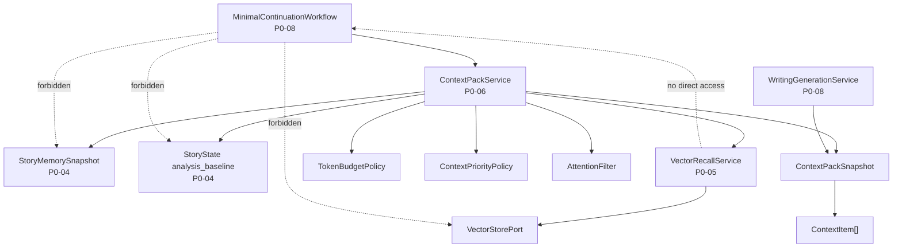

# InkTrace V2.0-P0-06 ContextPack 详细设计

版本：v2.0-p0-detail-06  
状态：P0 模块级详细设计  
依据文档：

- `docs/01_requirements/InkTrace-V2.0-需求规格说明书.md`
- `docs/07_overview/InkTrace-V2.0-概要设计说明书.md`
- `docs/02_architecture/InkTrace-V2.0-架构设计说明书.md`
- `docs/03_design/InkTrace-V2.0-P0-详细设计总纲.md`
- `docs/03_design/InkTrace-V2.0-P0-01-AI基础设施详细设计.md`
- `docs/03_design/InkTrace-V2.0-P0-02-AIJobSystem详细设计.md`
- `docs/03_design/InkTrace-V2.0-P0-03-初始化流程详细设计.md`
- `docs/03_design/InkTrace-V2.0-P0-04-StoryMemory与StoryState详细设计.md`
- `docs/03_design/InkTrace-V2.0-P0-05-VectorRecall详细设计_001.md`

---

## 一、文档定位与设计范围

### 1.1 文档定位

本文档是 InkTrace V2.0-P0 的第六个模块级详细设计文档，仅覆盖 P0 ContextPack。

本文档用于冻结 ContextPackService、ContextPackSnapshot、ContextPackBuildRequest、ContextItem、TokenBudgetPolicy、ContextPriorityPolicy、AttentionFilter 的职责边界，以及 ContextPack 与 P0-04 StoryMemory/StoryState、P0-05 VectorRecall、P0-08 MinimalContinuationWorkflow、P0-09 CandidateDraft、Quick Trial 的交互边界。

本文档不写代码、不修改源码、不生成数据库迁移、不拆 Task、不进入开发计划。

### 1.2 设计范围

本模块覆盖：

- ContextPackService 职责与构建流程。
- ContextPack 状态（ready / degraded / blocked）设计。
- ContextPackBuildRequest 输入设计。
- ContextPackSnapshot / ContextItem 输出设计。
- TokenBudgetPolicy 设计。
- ContextPriorityPolicy 设计。
- AttentionFilter 设计。
- query_text 构造规则。
- blocked / degraded / ready 判定规则。
- 与 MinimalContinuationWorkflow 的边界。
- 与 StoryMemory / StoryState / VectorRecall 的读取边界。
- 与 CandidateDraft / HumanReviewGate 的边界。
- 与 Quick Trial 的边界。

### 1.3 本文档不覆盖

P0-06 不覆盖：

- MinimalContinuationWorkflow 的单章续写编排（P0-08）。
- CandidateDraft 接受与 HumanReviewGate 详细流程（P0-09）。
- AIReview 详细设计（P0-10）。
- 完整 Agent Runtime（P1）。
- AgentSession / AgentStep / AgentObservation / AgentTrace（P1）。
- 五 Agent Workflow（P1）。
- 自动连续续写队列（P2）。
- Style DNA（P2）。
- Citation Link（P2）。
- @ 标签引用系统（P2）。
- 成本看板（P2）。
- 分析看板（P2）。
- 完整四层剧情轨道（P1）。
- AI Suggestion / Conflict Guard（P1）。
- Story Memory Revision（P1）。

---

## 二、P0 ContextPack 目标

P0 ContextPack 的目标：

1. 在正式 AI 续写前，组装一个受控、可追踪、可裁剪的上下文包。
2. 把 StoryMemorySnapshot、StoryState analysis_baseline、当前写作任务、当前章节上下文、必要的 VectorRecall 片段组合成模型输入前的结构化上下文。
3. 判断正式续写是否 blocked、degraded 或 ready。
4. 在 token budget 内按优先级裁剪上下文。
5. 防止把未确认 CandidateDraft、Quick Trial 输出、临时候选区或未保存草稿错误放入正式续写上下文。
6. 为 P0-08 MinimalContinuationWorkflow 提供 Writer 输入上下文。
7. 不直接调用模型生成正文。
8. 不创建 CandidateDraft。
9. 不写正式正文。
10. 不更新 StoryMemory / StoryState / VectorIndex。

---

## 三、模块边界与不做事项

### 3.1 P0 做什么

P0-06 负责：

- 定义 ContextPackBuildRequest。
- 定义 ContextPackSnapshot / ContextItem。
- 定义 ContextPack status = ready / degraded / blocked。
- 定义 TokenBudgetPolicy。
- 定义 ContextPriorityPolicy。
- 定义 AttentionFilter。
- 实现 ContextPackService 构建流程。
- 定义 query_text 构造规则。
- 定义 blocked / degraded / ready 判定规则。
- 定义与 StoryMemory / StoryState / VectorRecall 的读取边界。
- 定义与 Workflow / CandidateDraft / Quick Trial 的边界。

### 3.2 P0 不做什么

P0-06 不做：

- 直接调用 ModelRouter 或 Writer 模型。
- 创建 CandidateDraft。
- 写正式正文。
- 更新 StoryMemory / StoryState / VectorIndex。
- 完整 Agent Runtime context memory。
- Citation Link。
- 复杂多路召回融合。
- 复杂 query rewriting。
- 自动连续续写上下文滚动队列。
- 成本看板。

### 3.3 禁止行为

- ContextPackService 不得调用 Provider SDK。
- ContextPackService 不得写正式正文。
- ContextPackService 不得创建 CandidateDraft。
- ContextPackService 不得更新 StoryMemory / StoryState / VectorIndex。
- ContextPackService 不得直接访问 VectorStorePort（必须通过 VectorRecallService）。
- Workflow 不得绕过 ContextPackService 直接读取 StoryMemory / StoryState / VectorRecall。
- 普通日志不得记录完整正文、完整 ContextPack 内容、完整 user_instruction、完整 query_text。

---

## 四、总体架构

### 4.1 模块关系说明

ContextPackService 位于 Core Application 层，是正式续写前上下文准备的核心服务。

上下游关系：

- P0-04：读取 StoryMemorySnapshot 和 StoryState analysis_baseline。
- P0-05：调用 VectorRecallService 获取 RecallResult。
- P0-08：Workflow 调用 ContextPackService，根据返回 status 决定是否调用 Writer。
- ContextPackService 处理后的输出进入 WritingGenerationService。

### 4.2 模块关系图



### 4.3 与相邻模块的边界

| 模块 | P0-06 关系 | 边界 |
|---|---|---|
| P0-04 StoryMemory/StoryState | 读取上游 | 必需上游，缺失时 blocked |
| P0-05 VectorRecall | 读取上游 | 可降级上游，不可用时 degraded |
| P0-08 MinimalContinuationWorkflow | 调用方 | Workflow 调 ContextPackService，根据 status 决策 |
| P0-09 CandidateDraft | 隔离 | 未接受 CandidateDraft 不进入正式 ContextPack |
| Quick Trial | 隔离 | Quick Trial 可构建 degraded ContextPack，但不改变正式状态 |

### 4.4 禁止调用路径

- Workflow → StoryMemoryRepositoryPort（禁止）。
- Workflow → StoryStateRepositoryPort（禁止）。
- Workflow → VectorStorePort（禁止）。
- ContextPackService → VectorStorePort（必须通过 VectorRecallService）。
- ContextPackService → Provider SDK（禁止）。
- ContextPackService → CandidateDraftService 写候选稿（禁止）。

---

## 五、ContextPack 状态设计

### 5.1 状态定义

| 状态 | 含义 |
|---|---|
| ready | 上下文完整，可进入正式续写 |
| degraded | 可进入正式续写，但存在上下文不足、VectorRecall 不可用、旧章节 stale 等 warning |
| blocked | 正式续写不可用，必须先初始化、重新分析或修复关键上下文 |

### 5.2 规则

- ready / degraded / blocked 是 ContextPack 构建结果状态，不是 initialization_status，也不是 AIJob.status。
- blocked 必须提供 blocked_reason / error_code。
- degraded 必须提供 warning / degraded_reason。
- blocked 不影响 V1.1 写作、保存、导入、导出。
- Quick Trial 可以在 blocked 状态下运行，但结果必须标记 context_insufficient / degraded_context。
- stale 状态下 Quick Trial 还必须标记 stale_context。
- degraded 的正式续写 Workflow 必须展示 warning。
- ContextPack blocked 不等于 Job failed，Workflow 可根据 blocked 状态标记任务失败或暂停。

---

## 六、ContextPackBuildRequest 设计

### 6.1 字段方向

| 字段 | 说明 | P0 必须 |
|---|---|---|
| work_id | 作品 ID | 是 |
| writing_task_id | 关联的 WritingTask ID | 可选 |
| target_chapter_id | 目标章节 ID | 是 |
| target_chapter_order | 目标章节顺序 | 是 |
| current_chapter_text | 当前章节正文 | 可选 |
| current_selection | 当前用户选区内容 | 可选 |
| user_instruction | 用户指令/续写要求 | 是 |
| continuation_mode | 续写模式：continue_chapter / expand_scene / rewrite_selection | 可选 |
| max_context_tokens | 上下文 token 预算 | 是 |
| model_role | 目标模型角色，例如 writer | 是 |
| request_id | 请求 ID | 可选 |
| trace_id | Trace ID | 可选 |
| allow_degraded | 是否允许 degraded 状态继续，默认 true | 是 |
| allow_stale_vector | 是否允许 stale VectorRecall，默认 false | 是 |
| is_quick_trial | 是否为 Quick Trial 路径，默认 false | 是 |

### 6.2 正式续写与 Quick Trial 差异

| 维度 | 正式续写 | Quick Trial |
|---|---|---|
| is_quick_trial | false | true |
| StoryMemory/StoryState | 必需，缺失时 blocked | 可缺失，degraded |
| VectorRecall | 可选，不可用时 degraded | 可选，不可用时 degraded |
| 结果标记 | 无额外标记 | context_insufficient / degraded_context |
| stale 时 | blocked 或 degraded 取决于影响范围 | 额外标记 stale_context |
| 改变 initialization_status | 否 | 否 |
| 使正式续写入口可用 | 否 | 否 |

### 6.3 输入合法性规则

- 正式续写路径（is_quick_trial = false）不得读取未接受 CandidateDraft。
- 正式续写路径不得读取 Quick Trial 输出。
- 正式续写路径不得读取临时候选区或未保存草稿，除非作为 current_selection / user_instruction。
- current_selection 可以作为用户当前操作上下文，但不能变成 confirmed chapter。
- user_instruction 可以进入 ContextPack，但普通日志不得记录完整内容。
- max_context_tokens 只是上下文预算，不等于模型最大上下文。

---

## 七、ContextPackSnapshot / ContextItem 设计

### 7.1 ContextPackSnapshot

| 字段 | 说明 | P0 必须 |
|---|---|---|
| context_pack_id | ContextPack ID | 是 |
| work_id | 作品 ID | 是 |
| writing_task_id | 关联 WritingTask ID | 可选 |
| status | ready / degraded / blocked | 是 |
| blocked_reason | blocked 原因 | 条件必需 |
| degraded_reason | degraded 原因 | 条件必需 |
| warnings | 警告列表 | 是 |
| source_story_memory_snapshot_id | 来源 StoryMemorySnapshot ID | 是 |
| source_story_state_id | 来源 StoryState ID | 是 |
| vector_recall_status | VectorRecall 状态：available / degraded / skipped / failed | 是 |
| vector_recall_result_ids | 引用 RecallResult ID 列表 | 可选 |
| context_items | 上下文条目列表 | 是 |
| token_budget | 预算 token 数 | 是 |
| estimated_token_count | 估算 token 数 | 是 |
| trimmed_items | 被裁剪条目信息列表 | 是 |
| query_text | 用于 VectorRecall 的查询文本 | 是 |
| model_role | 目标模型角色 | 是 |
| request_id | 请求 ID | 可选 |
| trace_id | Trace ID | 可选 |
| created_at | 创建时间 | 是 |

### 7.2 ContextItem

| 字段 | 说明 | P0 必须 |
|---|---|---|
| item_id | 条目 ID | 是 |
| source_type | 来源类型 | 是 |
| source_id | 来源 ID | 是 |
| priority | 优先级（数值，越小越高） | 是 |
| content_summary | 内容摘要或内容文本 | 是 |
| token_estimate | 估算 token 数 | 是 |
| required | 是否为必需条目 | 是 |
| included | 是否被包含在最终 ContextPack 中 | 是 |
| trim_reason | 裁剪原因 | 条件必需 |
| stale_status | 过期状态 | 可选 |
| warning | 条目级 warning | 可选 |

### 7.3 source_type 枚举

| source_type | 说明 |
|---|---|
| story_memory | StoryMemorySnapshot 中的内容 |
| story_state | StoryState analysis_baseline |
| current_chapter | 当前章节上下文 |
| user_instruction | 用户指令 |
| vector_recall | VectorRecall 召回结果 |
| current_selection | 当前选区内容 |
| outline_blueprint | OutlineStoryBlueprint 内容 |
| system_policy | 系统安全策略指令 |

### 7.4 规则

- ContextPackSnapshot 是一次构建结果，不是正式资产。
- ContextPackSnapshot 不覆盖 StoryMemory / StoryState。
- ContextPackSnapshot 不写正式正文。
- ContextPackSnapshot 不创建 CandidateDraft。
- ContextPackSnapshot 可以作为 Workflow 的只读输入。
- 普通日志不记录完整 ContextPack 正文内容。

---

## 八、ContextPackService 详细设计

### 8.1 职责

ContextPackService 是 Application Service，负责构建 P0 ContextPack。

职责：

1. 接收 ContextPackBuildRequest。
2. 读取 latest StoryMemorySnapshot。
3. 读取 latest StoryState analysis_baseline。
4. 判断 StoryMemory / StoryState 是否缺失，是否 stale，是否影响当前上下文。
5. 判断正式 ContextPack 是否 blocked / degraded / ready。
6. 构造 VectorRecall query_text。
7. 调用 VectorRecallService.recall 获取 RecallResult。
8. 根据 VectorIndex 状态判断 RAG 层是否 degraded。
9. 组装 ContextItem 列表。
10. 应用 AttentionFilter 过滤非法条目。
11. 应用 ContextPriorityPolicy 排序。
12. 应用 TokenBudgetPolicy 裁剪。
13. 生成 ContextPackSnapshot。
14. 返回给调用方（Workflow）。

### 8.2 输入

| 输入 | 说明 | 来源 |
|---|---|---|
| ContextPackBuildRequest | 构建请求 | P0-08 Workflow |

### 8.3 输出

| 输出 | 说明 |
|---|---|
| ContextPackSnapshot | 完整上下文包快照 |
| status | ready / degraded / blocked |
| blocked_reason | blocked 原因（如有） |
| warnings | 警告列表（如有） |

### 8.4 依赖

- StoryMemoryService（读取 latest StoryMemorySnapshot）。
- StoryStateService（读取 latest StoryState analysis_baseline）。
- VectorRecallService（调用 recall）。
- TokenBudgetPolicy（裁剪逻辑）。
- ContextPriorityPolicy（优先级排序）。
- AttentionFilter（过滤逻辑）。

### 8.5 构建流程

```
接收 ContextPackBuildRequest
  → 读取 StoryMemorySnapshot(work_id)
    → 如果缺失且 is_quick_trial=false → blocked
  → 读取 StoryState analysis_baseline(work_id)
    → 如果缺失且 is_quick_trial=false → blocked
    → 如果 source != confirmed_chapter_analysis → blocked
  → 检查 stale 状态与影响范围
    → 影响目标章节/最近3章且 is_quick_trial=false → blocked
    → 只影响较早章节 → degraded
  → 构造 query_text
    → 如果构造失败 → VectorRecall skipped, degraded
  → 调用 VectorRecallService.recall(RecallQuery)
    → 如果查询失败 → degraded, 无 RAG 层
    → 如果无结果 → degraded, warning
  → 组装 ContextItem 列表
  → 应用 AttentionFilter
  → 应用 ContextPriorityPolicy 排序
  → 应用 TokenBudgetPolicy 裁剪
    → 如果 required items 超预算 → blocked
    → 如果 optional items 被裁剪 → degraded/warning
  → 生成 ContextPackSnapshot
  → 返回
```

### 8.6 不允许做的事情

- 不直接调用 ModelRouter。
- 不直接调用 Provider SDK。
- 不直接访问 VectorStorePort。
- 不创建 CandidateDraft。
- 不写正式正文。
- 不更新 StoryMemory / StoryState / VectorIndex。
- 不持久化 Writer 输入。

---

## 九、query_text 构造规则

### 9.1 职责归属

P0-05 已冻结：query_text 构造策略属于 P0-06 或 P0-08 边界。P0-06 承担 P0 默认构造规则。

### 9.2 P0 默认构造规则

query_text 由 ContextPackService 在构建流程中自动构造。

构造来源组合（按优先级）：

1. user_instruction。
2. target_chapter_title。
3. current_story_phase（来自 StoryState）。
4. active_conflicts（来自 StoryState）。
5. active_characters（来自 StoryState）。
6. recent_key_events（来自 StoryState）。
7. current_selection 摘要（如有）。
8. 当前续写目标说明。

### 9.3 规则

- query_text 不应直接等于完整当前章节正文。
- query_text 应尽量短，避免把完整正文送入日志或 embedding。
- query_text 普通日志不得完整记录。
- query_text 构造失败不应直接 blocked，应导致 VectorRecall skipped / degraded。
- P0 不做复杂 query rewriting。
- P0 不做多 query 扩展。
- P0 不做 rerank。

### 9.4 构造示例（概念方向）

```
user_instruction: "继续写下一段，主角进入森林"
target_chapter_title: "第三章 森林之谜"
current_story_phase: "发展"
active_conflicts: "主角与反派的第一次对峙"
active_characters: "林明、张薇"
recent_key_events: "主角收到神秘信件，决定前往森林"
```

→ 构造 query_text 方向：`"主角进入森林，收到神秘信件后决定前往。当前阶段：发展。冲突：与反派第一次对峙。"`

### 9.5 失败降级

- 构造失败 → VectorRecall skipped。
- ContextPack status = degraded。
- degraded_reason 记录 query_text_construction_failed。
- 不阻断正式续写，但无 RAG 层。

---

## 十、TokenBudgetPolicy 设计

### 10.1 职责

TokenBudgetPolicy 用于控制 ContextPack 总 token 在预算内。

### 10.2 规则

- max_context_tokens 来自 ContextPackBuildRequest，当前模型角色配置。
- P0 可以使用估算 token，不要求精确 tokenizer。
- P0 默认保留 20% 安全余量（模型上限的 80% 为 max_context_tokens，实际使用不超过 max_context_tokens 的 100%）。
- required ContextItem 应被保留，不应被裁剪。
- 可裁剪项按优先级从低到高裁剪。
- 裁剪结果必须记录 trimmed_items 和 trim_reason。
- token 超限不应静默截断（必须明确记录被裁剪的 items）。
- 如果 required items 超出预算 → ContextPack blocked，blocked_reason = required_items_exceed_budget。
- 如果 required items 在预算内但 optional items 超出 → 裁剪 optional items → ContextPack degraded。

### 10.3 裁剪顺序

1. 从最低优先级开始裁剪。
2. 同优先级内，按 token_estimate 从大到小裁剪。
3. 裁剪后如果仍然超限，继续裁剪次低优先级。
4. 裁剪到 required items 级别时停止并判断是否 blocked。

### 10.4 记录要求

- 每条被裁剪的 ContextItem 记录 trim_reason。
- trim_reason 方向：`budget_exceeded` / `low_priority` / `duplicate` / `stale_filtered`。
- 最终 ContextPackSnapshot 中 trimmed_items 包含被裁剪条目的 item_id、priority、token_estimate、trim_reason。

---

## 十一、ContextPriorityPolicy 设计

### 11.1 优先级定义

P0 默认优先级（数值越小优先级越高）：

| 优先级 | source_type | required | 说明 |
|---|---|---|---|
| 1 | system_policy | 是 | 系统安全策略指令 |
| 2 | user_instruction | 是 | 用户指令 |
| 3 | story_state | 是 | StoryState analysis_baseline |
| 4 | current_chapter | 是 | 当前章节上下文 |
| 5 | current_selection | 可选 | 当前选区内容 |
| 6 | story_memory | 是 | StoryMemorySnapshot current_story_summary |
| 7 | story_memory | 可选 | StoryMemorySnapshot recent_key_events / active_characters / active_conflicts |
| 8 | vector_recall | 可选 | VectorRecall 召回结果 |
| 9 | outline_blueprint | 可选 | OutlineStoryBlueprint 内容 |
| 10 | story_memory | 可选 | 低置信度 warning / optional facts |

### 11.2 规则

- StoryState 是正式续写的高优先级上下文（优先级 3），不应被裁剪。
- user_instruction 优先级高（优先级 2），不能绕过安全和边界。
- VectorRecall 是辅助层（优先级 8），不能挤掉 StoryState。
- stale / degraded item 可降低优先级或带 warning。
- required 与 priority 分开：priority 决定裁剪顺序，required 决定是否可被裁剪。
- required = true 的 item 不可被裁剪，只有在 total required items 超预算时 blocked。
- P0 不做复杂注意力学习。
- P0 不做动态强化学习式优先级调整。

---

## 十二、AttentionFilter 设计

### 12.1 职责

AttentionFilter 负责过滤明显不应进入正式续写上下文的内容。

### 12.2 过滤规则

1. 排除 source_type != confirmed_chapter 的 RecallResult。
2. 排除 content_hash 不匹配的 VectorRecall 结果。
3. 排除 status = deleted / failed / skipped 的 chunk。
4. 默认排除 stale chunk（allow_stale = false 时）。
5. 排除来源为未接受 CandidateDraft 的条目。
6. 排除来源为 Quick Trial 输出的条目。
7. 排除来源为临时候选区或未保存草稿的内容（除非作为当前用户明确提供的 current_selection）。
8. 排除超过 token budget 且非 required 的 item。
9. 排除重复或低优先级内容（内容相同且优先级较低的去重）。
10. 记录 filter_reason。

### 12.3 规则

- filter_reason 方向：`illegal_source` / `stale_content` / `deleted_content` / `unconfirmed_draft` / `budget_exceeded` / `duplicate` / `low_priority`。
- 过滤不修改源数据（Source 数据不受影响）。
- allow_stale = true 时，stale chunk 可以进入（仅用于调试、诊断、degraded 场景）。
- allow_stale 默认 false，不用于正式续写默认路径。

---

## 十三、blocked / degraded / ready 判定规则

### 13.1 blocked 条件

| 条件 | blocked_reason |
|---|---|
| StoryMemorySnapshot 缺失 | story_memory_missing |
| StoryState analysis_baseline 缺失 | story_state_missing |
| StoryState source != confirmed_chapter_analysis | story_state_invalid_source |
| initialization_status != completed | initialization_not_completed |
| StoryMemory stale 且影响当前目标章节或最近 3 章 | story_memory_stale_affects_target |
| StoryState stale 且影响当前目标章节或最近 3 章 | story_state_stale_affects_target |
| current target chapter 不存在或不是 confirmed chapter | target_chapter_invalid |
| required ContextItem 超出 token budget 且无法裁剪 | required_items_exceed_budget |
| ContextPack 输入来源非法且无法过滤 | illegal_input_source |
| 其他关键上下文缺失 | critical_context_missing |

### 13.2 degraded 条件

| 条件 | degraded_reason |
|---|---|
| VectorIndex not_built / failed / degraded | vector_index_degraded |
| VectorRecall 查询失败 | vector_recall_failed |
| VectorRecall 无结果 | vector_recall_empty |
| StoryMemory partial_stale 且只影响较早章节 | story_memory_stale_early_only |
| StoryState partial_stale 且只影响较早章节 | story_state_stale_early_only |
| VectorIndex stale 且只影响较早章节 | vector_stale_early_only |
| 大纲为空 | outline_empty |
| 部分 optional ContextItem 被裁剪 | optional_items_trimmed |
| confidence 较低（StoryMemory / StoryState） | low_confidence |
| query_text 构造失败，跳过 RAG | query_text_construction_failed |
| is_quick_trial = true | quick_trial_degraded |
| allow_stale_vector 且使用了 stale chunk | stale_vector_used_with_warning |

### 13.3 ready 条件

全部满足：

1. initialization_status = completed。
2. StoryMemorySnapshot 可用且未导致 blocked（缺失或 stale 影响目标时 blocked；partial_stale 仅影响较早时 degraded）。
3. StoryState analysis_baseline 可用且未导致 blocked。
4. StoryState source = confirmed_chapter_analysis。
5. required ContextItem 在 token budget 内。
6. 非法输入已过滤。
7. target chapter 是 confirmed chapter。
8. VectorRecall 可用或不可用不影响本条件（不可用则 degraded）。

### 13.4 规则

- ready / degraded / blocked 是 ContextPack 构建状态，不是 AIJob.status。
- blocked 不影响 V1.1 写作。
- degraded 可以进入正式续写，但 Workflow / UI 必须展示 warning。
- Quick Trial 即使生成 ContextPack，也不能使正式续写入口可用。

---

## 十四、与 MinimalContinuationWorkflow 的边界

### 14.1 关系

- P0-08 Workflow 调用 ContextPackService 构建上下文。
- ContextPackService 不调用 Writer。
- ContextPackService 不创建 CandidateDraft。
- Workflow 根据 ContextPack status 决定是否继续。

### 14.2 Workflow 决策规则

| ContextPack status | Workflow 行为 |
|---|---|
| blocked | 不得调用 Writer，返回 blocked 原因给用户 |
| degraded | 可以调用 Writer，但必须携带 warning 到 UI |
| ready | 正常调用 Writer |

### 14.3 禁止行为

- Workflow 不得绕过 ContextPackService 直接读取 StoryMemoryRepositoryPort / StoryStateRepositoryPort / VectorStorePort。
- Workflow 不得在 ContextPack blocked 状态下继续调用 Writer。
- ContextPackSnapshot 是 Writer 输入的一部分，但不是 AgentTrace。

---

## 十五、与 CandidateDraft / HumanReviewGate 的边界

### 15.1 核心规则

- CandidateDraft 不属于 confirmed chapters。
- 未接受 CandidateDraft 不进入正式 ContextPack。
- CandidateDraft 生成前使用 ContextPack（ContextPack 是生成 CandidateDraft 的输入）。
- CandidateDraft 生成后不回写 ContextPack。
- HumanReviewGate 之前的 AI 输出不能影响 StoryMemory / StoryState / VectorIndex。
- accept_candidate_draft / apply_candidate_to_draft 不属于 P0-06。

### 15.2 接受后流程

- 用户接受 CandidateDraft 后，内容进入 V1.1 Local-First 正文保存链路。
- 接受动作本身不触发 ContextPack 更新。
- 后续 reanalysis / reindex 后才能影响正式上下文。

---

## 十六、与 Quick Trial 的边界

### 16.1 核心规则

- Quick Trial 可以构建降级 ContextPack。
- Quick Trial ContextPack 可以缺少 StoryMemory / StoryState。
- Quick Trial ContextPack 必须 status = degraded。
- Quick Trial 结果必须标记 context_insufficient / degraded_context。
- stale 状态下 Quick Trial 还必须标记 stale_context。
- Quick Trial 不改变 initialization_status。
- Quick Trial 不更新 StoryMemory / StoryState / VectorIndex。
- Quick Trial 不使正式续写入口可用。
- Quick Trial 不作为正式续写质量验收依据。

### 16.2 ContextPack 差异

| 维度 | 正式 ContextPack | Quick Trial ContextPack |
|---|---|---|
| StoryMemory/StoryState | 必需 | 可缺省 |
| blocked 时 | 不可用 | 仍可用，degraded |
| 状态 | ready / degraded / blocked | degraded |
| 标记 | 无 | context_insufficient / degraded_context |
| stale 时额外标记 | 无 | stale_context |

---

## 十七、错误处理与降级

### 17.1 错误场景表

| 场景 | error_code | ContextPack 行为 | V1.1 影响 |
|---|---|---|---|
| StoryMemorySnapshot 缺失 | story_memory_missing | blocked | 不影响 |
| StoryState baseline 缺失 | story_state_missing | blocked | 不影响 |
| StoryState source 非 confirmed_chapter_analysis | story_state_invalid_source | blocked | 不影响 |
| initialization_status 未 completed | initialization_not_completed | blocked | 不影响 |
| StoryMemory stale 影响目标上下文 | story_memory_stale_affects_target | blocked | 不影响 |
| StoryState stale 影响目标上下文 | story_state_stale_affects_target | blocked | 不影响 |
| VectorIndex failed / not_built | vector_index_degraded | degraded，无 RAG 层 | 不影响 |
| VectorRecall 查询失败 | vector_recall_failed | degraded，无 RAG 层 | 不影响 |
| query_text 构造失败 | query_text_construction_failed | RAG skipped，degraded | 不影响 |
| RecallResult 来源非法 | illegal_recall_source | 过滤，degraded + warning | 不影响 |
| RecallResult 全部被过滤 | all_recall_results_filtered | degraded，无 RAG 层 | 不影响 |
| required ContextItem token 超限 | required_items_exceed_budget | blocked | 不影响 |
| optional ContextItem 被裁剪 | optional_items_trimmed | degraded + warning | 不影响 |
| CandidateDraft 误入正式 ContextPack | illegal_draft_source | AttentionFilter 拒绝，blocked | 不影响 |
| Quick Trial 输出误入正式 ContextPack | illegal_quick_trial_source | AttentionFilter 拒绝，blocked | 不影响 |
| current target chapter 缺失 | target_chapter_missing | blocked | 不影响 |
| current target chapter 非 confirmed | target_chapter_not_confirmed | blocked | 不影响 |
| 服务重启后 ContextPack 重建 | service_restart | 无历史 ContextPack，需重新构建 | 不影响 |
| ContextPackSnapshot 持久化失败 | context_pack_persistence_failed | 不影响 Writer 调用，但调试信息丢失 | 不影响 |
| 普通日志脱敏失败 | log_sanitization_failed | 不可写入日志，记录 error（不影响上下文构建） | 不影响 |

### 17.2 错误隔离原则

- ContextPack 错误不影响 V1.1 写作、保存、导入、导出。
- ContextPack 错误不得破坏正式正文。
- ContextPack 错误不得覆盖用户原始大纲。
- ContextPack 错误不得写 StoryMemory / StoryState / VectorIndex。
- ContextPack blocked 不等于 Job failed，除非 Workflow 决定标记任务失败。
- ContextPack degraded 必须返回 warnings。

---

## 十八、安全、隐私与日志

### 18.1 日志边界

- 普通日志不记录完整正文。
- 普通日志不记录完整 ContextPack 内容。
- 普通日志不记录完整 user_instruction。
- 普通日志不记录完整 query_text。
- 普通日志不记录完整 RecallResult text_excerpt。
- 普通日志不记录 API Key。
- error_message 必须脱敏。

### 18.2 数据存储边界

- ContextPackSnapshot 如持久化，不应长期保存完整正文拼接内容。
- ContextPackSnapshot 可以保存 source refs、token estimate、status、warnings、trimmed_items。
- ContextPackSnapshot 内容清理策略后续设计。
- ContextPack 不替代正式正文。
- ContextPack 不替代 StoryMemory / StoryState。

### 18.3 资产保护

- 清理 ContextPack 不得删除正式正文、用户原始大纲、StoryMemory、StoryState、VectorIndex。
- ContextPack 不会写正式资产。
- ContextPack 不会覆盖用户手动维护内容。

---

## 十九、P0 验收标准

### 19.1 上下文构建验收项

- [ ] ContextPackService 可以基于 work_id / target_chapter 构建 ContextPack。
- [ ] ContextPackService 通过 VectorRecallService 召回，不直接访问 VectorStorePort。
- [ ] ContextPackService 默认不直接调用 EmbeddingProviderPort。
- [ ] query_text 由 ContextPackService 构造。
- [ ] ContextPackSnapshot 包含 context_items、token_budget、estimated_token_count、trimmed_items。
- [ ] ContextItem 包含 source_type、priority、required、included、trim_reason。

### 19.2 blocked 验收项

- [ ] StoryMemorySnapshot 缺失时正式 ContextPack blocked。
- [ ] StoryState analysis_baseline 缺失时正式 ContextPack blocked。
- [ ] StoryState source 非 confirmed_chapter_analysis 时 blocked。
- [ ] initialization_status 未 completed 时正式 ContextPack blocked。
- [ ] StoryMemory stale 影响最近 3 章或目标上下文时 blocked。
- [ ] StoryState stale 影响最近 3 章或目标上下文时 blocked。
- [ ] required ContextItem 超预算时 blocked。
- [ ] target chapter 非 confirmed chapter 时 blocked。

### 19.3 degraded 验收项

- [ ] StoryMemory partial_stale 只影响较早章节时 degraded。
- [ ] StoryState partial_stale 只影响较早章节时 degraded。
- [ ] VectorIndex failed / not_built 时 ContextPack degraded，无 RAG 层。
- [ ] VectorRecall 查询失败时 ContextPack degraded。
- [ ] VectorRecall 无结果时 ContextPack degraded + warning。
- [ ] query_text 构造失败时 RAG skipped，ContextPack degraded。
- [ ] optional ContextItem 被裁剪时 degraded + warning。

### 19.4 过滤验收项

- [ ] CandidateDraft 不进入正式 ContextPack。
- [ ] Quick Trial 输出不进入正式 ContextPack。
- [ ] 临时候选区 / 未保存草稿不进入正式 ContextPack（除非是 current_selection）。
- [ ] AttentionFilter 能过滤 deleted / failed / skipped / illegal RecallResult。
- [ ] stale chunk 默认不参与正式召回（allow_stale = false）。
- [ ] source != confirmed_chapter 的 RecallResult 被过滤。

### 19.5 TokenBudgetPolicy 验收项

- [ ] TokenBudgetPolicy 能裁剪 optional ContextItem。
- [ ] required ContextItem 超预算时 blocked。
- [ ] trimmed_items 和 trim_reason 被记录。
- [ ] 裁剪不会静默截断。

### 19.6 ContextPriorityPolicy 验收项

- [ ] ContextPriorityPolicy 不允许 VectorRecall 挤掉 StoryState。
- [ ] StoryState 优先级高于 VectorRecall。
- [ ] user_instruction 优先级高但不能绕过安全和边界。

### 19.7 Quick Trial 验收项

- [ ] Quick Trial ContextPack 必须标记 context_insufficient / degraded_context。
- [ ] stale 状态下 Quick Trial ContextPack 必须标记 stale_context。
- [ ] Quick Trial ContextPack 不改变 initialization_status。
- [ ] Quick Trial ContextPack 不更新 StoryMemory / StoryState / VectorIndex。

### 19.8 边界验收项

- [ ] ContextPackService 不写正式正文。
- [ ] ContextPackService 不更新 StoryMemory / StoryState / VectorIndex。
- [ ] ContextPackService 不创建 CandidateDraft。
- [ ] ContextPackService 不直接调用 Provider SDK。
- [ ] Workflow 不得绕过 ContextPackService 直接读取 StoryMemory / StoryState / VectorStorePort。
- [ ] ContextPack degraded 的 Workflow 必须展示 warning。
- [ ] ContextPack blocked 不影响 V1.1 写作。

### 19.9 安全与日志验收项

- [ ] 普通日志不记录 API Key、完整正文、完整 ContextPack、完整 user_instruction、完整 query_text、完整 RecallResult text_excerpt。
- [ ] ContextPack 不替代正式正文。
- [ ] ContextPack 不替代 StoryMemory / StoryState。
- [ ] 清理 ContextPack 不得删除正式正文、用户原始大纲、StoryMemory、StoryState、VectorIndex。

### 19.10 P0 不做事项验收项

- [ ] P0 不实现 Citation Link。
- [ ] P0 不实现复杂多路召回融合。
- [ ] P0 不实现复杂 query rewriting。
- [ ] P0 不实现完整 Agent Runtime。
- [ ] P0 不实现完整四层剧情轨道。
