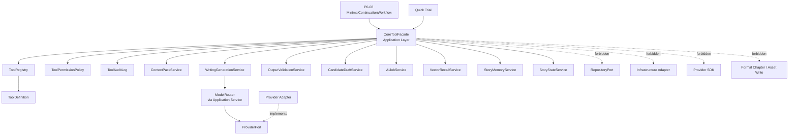

# InkTrace V2.0-P0-07 ToolFacade 与权限详细设计

版本：v2.0-p0-detail-07  
状态：P0 模块级详细设计  
依据文档：

- `docs/01_requirements/InkTrace-V2.0-需求规格说明书.md`
- `docs/07_overview/InkTrace-V2.0-概要设计说明书.md`
- `docs/02_architecture/InkTrace-V2.0-架构设计说明书.md`
- `docs/03_design/InkTrace-V2.0-P0-详细设计总纲.md`
- `docs/03_design/InkTrace-V2.0-P0-01-AI基础设施详细设计.md`
- `docs/03_design/InkTrace-V2.0-P0-02-AIJobSystem详细设计.md`
- `docs/03_design/InkTrace-V2.0-P0-03-初始化流程详细设计.md`
- `docs/03_design/InkTrace-V2.0-P0-04-StoryMemory与StoryState详细设计.md`
- `docs/03_design/InkTrace-V2.0-P0-05-VectorRecall详细设计.md`
- `docs/03_design/InkTrace-V2.0-P0-06-ContextPack详细设计.md`

---

## 一、文档定位与设计范围

### 1.1 文档定位

本文档是 InkTrace V2.0-P0 的第七个模块级详细设计文档，仅覆盖 P0 ToolFacade 与权限边界。

P0-07 的核心目标是定义 MinimalContinuationWorkflow / Quick Trial 等 P0 AI 编排能力可以调用哪些受控工具，以及这些工具如何安全地映射到 Core Application Service。ToolFacade 是 Application 层受控门面，不是完整 Agent Runtime，不是完整 Function Calling 框架，也不是第二套业务系统。

本文档不替代 P0-08 MinimalContinuationWorkflow 详细设计，不替代 P0-09 CandidateDraft 与 HumanReviewGate 详细设计，不写代码、不修改源码、不生成数据库迁移、不拆 Task、不进入开发计划。

### 1.2 设计范围

本模块覆盖：

- CoreToolFacade。
- ToolRegistry。
- ToolDefinition。
- ToolPermissionPolicy。
- ToolExecutionContext。
- ToolCallRequest。
- ToolCallResult。
- ToolResultEnvelope。
- ToolError。
- ToolAuditLog。
- P0 工具白名单。
- Tool 名称与 Application Service 方法的映射。
- Tool 调用权限。
- Tool 参数校验。
- Tool 输出封装。
- Tool 错误处理。
- Tool 审计与日志。
- Tool 调用与 AIJobSystem 的边界。
- Tool 调用与 MinimalContinuationWorkflow 的边界。
- Tool 调用与 CandidateDraft / HumanReviewGate 的边界。
- Tool 调用与 Quick Trial 的边界。
- Tool 调用与 Provider / ModelRouter 的边界。

### 1.3 本文档不覆盖

P0-07 不覆盖：

- 完整 Agent Runtime。
- AgentSession / AgentStep / AgentObservation / AgentTrace。
- 五 Agent Workflow。
- 完整 AI Suggestion / Conflict Guard。
- 完整 Story Memory Revision。
- 复杂 Knowledge Graph。
- Citation Link。
- @ 标签引用系统。
- 复杂多路召回融合。
- 自动连续续写队列。
- 成本看板。
- 分析看板。
- P0-08 Workflow 的完整编排实现。
- P0-09 CandidateDraft / HumanReviewGate 的详细流程。
- Provider SDK 适配实现。
- Repository / Infrastructure 具体实现。

---

## 二、P0 ToolFacade 目标

### 2.1 核心定位

CoreToolFacade 是 Core Application 层的受控工具门面。

目标：

- 提供 P0 Workflow 可调用的最小工具白名单。
- 将 Tool 名称映射到受控 Application Service 方法。
- 校验 ToolExecutionContext。
- 执行 ToolPermissionPolicy。
- 校验参数和输出结构。
- 统一封装 ToolCallResult / ToolResultEnvelope。
- 统一封装 ToolError。
- 记录 ToolAuditLog。
- 阻断越权、危险写操作和 formal_write。

### 2.2 关键边界

必须明确：

- ToolFacade 是 Application 层的受控门面。
- ToolFacade 不是 Agent Runtime。
- ToolFacade 不等于完整 Function Calling 框架。
- ToolFacade 不直接暴露 RepositoryPort。
- ToolFacade 不直接暴露 Infrastructure Adapter。
- ToolFacade 不直接暴露 Provider SDK。
- ToolFacade 不直接调用 ModelRouter，除非通过已定义的 Application Service 间接发生。
- Workflow / Writer 不得绕过 ToolFacade 调用受控工具。
- ToolFacade 只允许调用 P0 白名单内的工具。
- ToolFacade 不负责生成正文。
- ToolFacade 不替代 P0-08 MinimalContinuationWorkflow。
- ToolFacade 不替代 P0-06 ContextPackService。

### 2.3 Tool 名与 Service 方法名

规则：

- Tool 名是 Workflow / AI 编排层可见的受控名称。
- Tool 名不等于 Application Service 方法名。
- `generate_candidate_text()` 是 Application Service 方法名方向，不作为 Tool 名。
- `run_writer_step` 是 Tool 名时，内部映射到 WritingGenerationService 的候选文本生成能力。
- `run_writer_step` 不是 Provider 直连工具。
- ToolFacade 设计中必须避免 Tool 名和 Service 方法名混淆。

---

## 三、模块边界与不做事项

### 3.1 P0 做什么

P0 ToolFacade 必须完成：

- 注册 P0 Tool 白名单。
- 定义 ToolDefinition。
- 定义 ToolExecutionContext。
- 校验 caller_type、work_id、job_id、step_id、context_pack_status。
- 校验 Quick Trial 限制。
- 校验 side_effect_level。
- 禁止 formal_write。
- 封装 ToolCallRequest / ToolCallResult。
- 封装 ToolResultEnvelope / ToolError。
- 记录 ToolAuditLog。
- 明确 Tool 到 Application Service 的映射。

### 3.2 P0 不做什么

P0 ToolFacade 不做：

- 不实现完整 Agent Runtime。
- 不实现 AgentSession / AgentStep / AgentObservation / AgentTrace。
- 不实现五 Agent Workflow。
- 不直接生成正文。
- 不直接调用 Provider SDK。
- 不直接调用 ModelRouter。
- 不直接访问 RepositoryPort。
- 不直接访问 Infrastructure Adapter。
- 不直接写正式正文。
- 不直接更新正式资产。
- 不直接更新 StoryMemory / StoryState / VectorIndex。
- 不绕过 HumanReviewGate。
- 不绕过 V1.1 Local-First 保存链路。

### 3.3 禁止行为

禁止：

- 未注册 Tool 被调用。
- disabled Tool 被调用。
- Workflow / Agent 伪造 ToolExecutionContext。
- ToolFacade 允许 formal_write。
- ToolFacade 允许 AI 输出直接进入 confirmed chapters。
- ToolFacade 允许 Agent / Workflow 伪造用户确认。
- ToolFacade 允许 Writer 直接访问 VectorStorePort / EmbeddingProviderPort。
- ToolFacade 返回裸内部对象。
- ToolAuditLog 记录完整正文、完整 Prompt、API Key。

范围限定：上述"不得绕过"约束仅适用于 AI 编排工具调用路径，包括 P0-08 MinimalContinuationWorkflow、Quick Trial、未来 Agent 工具调用、Writer / AI 模型可触发的受控工具调用。普通非 AI 的 Application 内部协作、UI 查询、系统维护接口不在 P0-07 的工具调用约束范围内，但这些调用仍需遵守对应 Application Service 的权限、输入校验和安全边界。Writer / AI 模型不得借普通接口绕过 ToolFacade。P0-07 不定义普通 UI / 系统维护接口的完整权限模型。

---

## 四、总体架构

### 4.1 模块关系说明

CoreToolFacade 位于 Core Application 层。P0-08 MinimalContinuationWorkflow 通过 CoreToolFacade 调用受控工具。CoreToolFacade 根据 ToolRegistry 查找 ToolDefinition，通过 ToolPermissionPolicy 校验权限，再调用对应 Application Service。

关系：

- Workflow / Quick Trial 调用 CoreToolFacade。
- CoreToolFacade 读取 ToolRegistry。
- CoreToolFacade 执行 ToolPermissionPolicy。
- CoreToolFacade 调用 ContextPackService、WritingGenerationService、OutputValidationService、CandidateDraftService、AIJobService、VectorRecallService、StoryStateService、StoryMemoryService 等 Application Service。
- Application Service 可以按既有边界间接调用 ModelRouter / Ports。
- CoreToolFacade 不直接调用 ModelRouter / Provider SDK / RepositoryPort / Infrastructure Adapter。

### 4.2 模块关系图



### 4.3 与相邻模块的边界

| 模块 | 关系 | 边界 |
|---|---|---|
| P0-01 AI 基础设施 | Provider / ModelRouter / OutputValidator | ToolFacade 不直连 Provider SDK / ModelRouter |
| P0-02 AIJobSystem | Job / Step 状态 | ToolFacade 不替代 AIJobService 状态机 |
| P0-06 ContextPack | build_context_pack | ContextPack blocked 时不得 run_writer_step |
| P0-08 Workflow | Tool 调用方 | Workflow 通过 ToolFacade 调用受控工具 |
| P0-09 CandidateDraft | 候选稿保存 | save_candidate_draft 只写候选稿，不写正式正文 |

### 4.4 禁止调用路径

禁止：

- Workflow -> Application Service 绕过 ToolFacade 调用受控工具。
- Workflow -> RepositoryPort。
- Workflow -> Infrastructure Adapter。
- Workflow -> Provider SDK。
- ToolFacade -> RepositoryPort。
- ToolFacade -> Infrastructure Adapter。
- ToolFacade -> Provider SDK。
- ToolFacade -> Formal Chapter Write。
- ToolFacade -> accept_candidate_draft / apply_candidate_to_draft。

范围限定：上述禁止路径仅约束 AI 编排工具调用路径（Workflow、Quick Trial、未来 Agent、Writer / AI 模型受控工具）。普通非 AI 的 Application 内部协作、UI 查询、系统维护接口不在此约束范围内，但仍需遵守对应 Application Service 的权限和安全边界。

---

## 五、ToolRegistry / ToolDefinition 设计

### 5.1 ToolRegistry 职责

ToolRegistry 负责维护 P0 Tool 白名单。

职责：

- 注册 P0 可用 ToolDefinition。
- 根据 tool_name 查找 ToolDefinition。
- 判断 Tool 是否 enabled。
- 拒绝未注册 Tool。
- 拒绝 disabled Tool。
- 为 ToolPermissionPolicy 提供 side_effect_level、permission_key、allowed_callers 等元数据。

### 5.2 ToolDefinition 字段方向

| 字段 | 说明 | P0 必须 |
|---|---|---|
| tool_name | Tool 唯一名称 | 是 |
| display_name | 展示名称 | 是 |
| description | Tool 描述 | 是 |
| category | read / build / write / job / debug 等分类 | 是 |
| allowed_callers | 允许调用方 | 是 |
| mapped_service | 映射 Application Service | 是 |
| mapped_method | 映射方法方向 | 是 |
| input_schema_key | 输入 schema key | 是 |
| output_schema_key | 输出 schema key | 是 |
| permission_key | 权限 key | 是 |
| side_effect_level | 副作用等级 | 是 |
| requires_human_confirmation | 是否需要人工确认 | 是 |
| audit_required | 是否强制审计 | 是 |
| timeout_policy_key | 超时策略 key | 可选 |
| retry_policy_key | 重试策略 key | 可选 |
| enabled | 是否启用 | 是 |
| p0_scope | 是否 P0 范围 | 是 |
| created_at | 创建时间，可选 | 可选 |
| updated_at | 更新时间，可选 | 可选 |

schema 说明：

- P0 Tool 必须具备 input_schema_key / output_schema_key 或等价 schema 引用，两者均为 P0 必须。
- P0 可以使用轻量 JSON Schema、Pydantic Model、Typed DTO 或等价结构表达 schema，不要求复杂 Schema Registry UI。
- Tool 参数校验必须基于 input_schema_key 或等价 schema。
- Tool 输出封装 / 校验应参考 output_schema_key。
- schema 不得包含 API Key 明文。
- schema 校验不应绕过 ToolPermissionPolicy。

### 5.3 side_effect_level

side_effect_level 建议包含：

| side_effect_level | 含义 | P0 规则 |
|---|---|---|
| read_only | 只读查询 | 允许 |
| transient_write | 临时写，如 ContextPackSnapshot 内存构建、Job Progress 更新 | 允许 |
| candidate_write | 候选数据写入，如 CandidateDraft | 允许，但必须进入 CandidateDraft / HumanReviewGate 边界 |
| formal_write | 正式数据写入 | P0 AI Tool 默认禁止 |
| external_call | 外部调用，如模型调用 | 只能通过 Application Service 间接发生 |

规则：

- P0 默认不允许 AI 工具执行 formal_write。
- P0 允许 candidate_write，但必须进入 CandidateDraft / HumanReviewGate 边界。
- P0 允许 read_only。
- P0 允许 transient_write。
- external_call 必须通过 P0-01 AI 基础设施和 Application Service 间接完成，不得 Provider SDK 直连。

---

## 六、ToolExecutionContext 设计

### 6.1 字段方向

| 字段 | 说明 | P0 必须 |
|---|---|---|
| work_id | 作品 ID | 是 |
| user_id | 用户 ID，可选 | 可选 |
| session_id | 会话 ID，可选 | 可选 |
| job_id | AIJob ID | 是 |
| step_id | AIJobStep ID | 是 |
| workflow_id | Workflow ID，可选 | 可选 |
| writing_task_id | WritingTask ID，可选 | 可选 |
| request_id | 请求 ID | 是 |
| trace_id | Trace ID | 是 |
| caller_type | workflow / quick_trial / system / user_action | 是 |
| is_quick_trial | 是否 Quick Trial | 是 |
| permission_scope | 权限范围 | 是 |
| initialization_status | 作品初始化状态 | 是 |
| context_pack_status | ready / degraded / blocked，可选 | 可选 |
| created_at | 创建时间 | 是 |

### 6.2 构造规则

规则：

- ToolExecutionContext 由 Application / Workflow 侧构造。
- AI 模型不得自行伪造 ToolExecutionContext。
- ToolFacade 必须校验 work_id / job_id / step_id 等上下文是否匹配。
- ToolExecutionContext 不记录完整正文。
- ToolExecutionContext 不记录完整 Prompt。
- ToolExecutionContext 不记录 API Key。
- is_quick_trial = true 时 caller_type 必须为 quick_trial。
- caller_type = quick_trial 时 is_quick_trial 必须为 true。
- Quick Trial 不得调用会影响正式上下文的工具。

### 6.3 匹配校验

ToolFacade 至少校验：

- work_id 是否属于当前 Job / Workflow。
- job_id 是否存在且未 cancelled。
- step_id 是否属于 job_id。
- caller_type 是否在 ToolDefinition.allowed_callers 内。
- is_quick_trial 与 caller_type 是否一致（两者必须同时为 quick_trial / true，或同时为非 quick_trial / false）。
- context_pack_status 是否满足 Tool 调用前置条件。
- request_id / trace_id 是否存在。

---

## 七、ToolPermissionPolicy 设计

### 7.1 权限维度

ToolPermissionPolicy 至少包含：

- caller_type 权限。
- tool_name 白名单。
- work_id / job_id / step_id 匹配校验。
- initialization_status 校验。
- context_pack_status 校验。
- Quick Trial 限制。
- CandidateDraft / HumanReviewGate 限制。
- side_effect_level 限制。
- formal_write 禁止。
- read_only / transient_write / candidate_write 的边界。

### 7.2 基础规则

规则：

- 正式 Workflow 可以调用 build_context_pack。
- 正式 Workflow 在 ContextPack ready / degraded 时可以调用 run_writer_step。
- ContextPack blocked 时不得调用 run_writer_step。
- Quick Trial 可以调用 Quick Trial 专用或降级上下文工具，但不得更新正式 StoryMemory / StoryState / VectorIndex。
- Quick Trial 不得使正式续写入口可用。
- AI 模型不得直接调用 save formal chapter。
- CandidateDraft 写入必须是候选稿写入，不是正式正文写入。
- 用户接受 CandidateDraft 后仍需走 V1.1 Local-First 正文保存链路。
- ToolFacade 不得允许 Agent / Workflow 伪造用户确认。
- 未通过 HumanReviewGate 的 AI 输出不得进入 confirmed chapters。
- ToolFacade 不得让未接受 CandidateDraft 进入 StoryMemory / StoryState / VectorIndex / ContextPack 正式输入。

### 7.3 side_effect 权限

| side_effect_level | P0 权限 |
|---|---|
| read_only | workflow / quick_trial 可按白名单调用 |
| transient_write | workflow 可调用；quick_trial 仅限不影响正式状态的工具 |
| candidate_write | 仅允许候选稿写入，不允许正式正文写入 |
| formal_write | 禁止 |
| external_call | 仅允许通过 Application Service 间接发生 |

### 7.4 权限结果

ToolPermissionPolicy 输出统一的权限结果枚举：

| 权限结果 | 含义 |
|---|---|
| allowed | 允许调用 |
| denied_tool_not_found | Tool 未注册 |
| denied_tool_disabled | Tool 已禁用 |
| denied_caller_type | caller_type 不在 allowed_callers 中 |
| denied_work_id_mismatch | work_id 与 Job / Workflow 不匹配 |
| denied_job_not_running | Job / Step 不在允许状态 |
| denied_context_pack_blocked | ContextPack blocked，不得调用 run_writer_step |
| denied_quick_trial_forbidden | Quick Trial 无权调用该 Tool |
| denied_formal_write | formal_write 默认禁止 |
| denied_human_review_required | 需要 Human Review，不能继续自动执行 |
| denied_invalid_execution_context | ToolExecutionContext 无效 |
| denied_initialization_not_completed | 正式续写相关 Tool 在 initialization_status 未 completed 时被拒绝 |

规则：

- 权限结果用于 ToolPermissionPolicy 输出。
- 权限结果可映射为 ToolError.error_code。
- tool_not_found / tool_disabled 仍可作为外部 error_code。
- 如 permission_result = denied_tool_not_found，则 ToolError.error_code = tool_not_found，两者不重复混乱。
- human_review_required 不是系统错误，而是受控阻断状态。
- formal_write_forbidden 必须 blocked。

### 7.5 P0 默认权限矩阵

以下为 P0 各 Tool 对 workflow / quick_trial / system / user_action 四种 caller_type 的默认权限配置：

| Tool | workflow | quick_trial | system | user_action | 说明 |
|---|---|---|---|---|---|
| build_context_pack | 允许 | 允许 | 允许 | 允许 | Quick Trial 只能构建 degraded / trial context |
| run_writer_step | 允许，需 ContextPack ready/degraded | 允许，降级试写 | 允许 | 禁止 | 输出不得直接进入正式正文 |
| validate_writer_output | 允许 | 允许 | 允许 | 允许 | 只校验输出 |
| save_candidate_draft | 允许 | 受限 | 允许 | 禁止 | Quick Trial 默认不自动保存正式 CandidateDraft |
| get_job_status | 允许 | 允许 | 允许 | 允许 | 只读 |
| update_job_step_progress | 允许 | 禁止 | 允许 | 禁止 | P0 默认 Quick Trial 不更新正式 AIJobStep；如需临时试写进度，后续可设计 trial progress |
| mark_job_step_failed | 允许 | 禁止 | 允许 | 禁止 | Quick Trial 不得更新正式 JobStep |
| mark_job_step_completed | 允许 | 禁止 | 允许 | 禁止 | Quick Trial 不得更新正式 JobStep |
| request_vector_recall | 受限，仅调试 / 诊断 / 非正式路径；正式续写主路径禁止直接调用 | 允许，降级 | 允许 | 允许 | 正式续写主路径必须通过 build_context_pack / ContextPackService 间接受控调用 |
| get_story_state_baseline | 允许只读 | 允许只读，标记 degraded | 允许 | 允许只读 | 不得作为正式基线更新 |
| get_story_memory_snapshot | 允许只读 | 允许只读，标记 degraded | 允许 | 允许只读 | 不得写入正式记忆 |

补充说明：

1. Quick Trial 默认禁止更新正式 AIJobStep。
2. 如果后续需支持 Quick Trial 临时试写进度，可另行设计 trial progress，但 trial progress 不是正式 AIJobStep，不改变 initialization_status，不推进正式 Workflow，不使正式续写入口可用。
3. P0-07 不展开 trial progress 设计；P0 默认禁止 Quick Trial 调用 update_job_step_progress。
4. Quick Trial 默认不自动保存正式 CandidateDraft。
5. Quick Trial 只有在用户明确执行"保存为候选稿"动作后，才能转入 P0-09 CandidateDraft 流程。
6. user_action 不等于用户确认 CandidateDraft；用户确认属于 P0-09 HumanReviewGate。
7. system 调用也必须遵守 side_effect_level 和 formal_write 禁止。

### 7.6 Quick Trial 限制

Quick Trial 限制：

- ToolExecutionContext.is_quick_trial 必须为 true。
- Quick Trial 可 build degraded ContextPack。
- Quick Trial 可调用受控 run_writer_step 生成试写输出。
- Quick Trial 不得更新 StoryMemory / StoryState / VectorIndex。
- Quick Trial 不得使正式续写入口可用。
- Quick Trial ToolResult 必须标记 context_insufficient / degraded_context。
- stale 状态下 Quick Trial 还必须标记 stale_context。

---

## 八、ToolCallRequest / ToolCallResult 设计

### 8.1 ToolCallRequest

| 字段 | 说明 | P0 必须 |
|---|---|---|
| tool_name | Tool 名称 | 是 |
| arguments | Tool 参数 | 是 |
| execution_context | ToolExecutionContext | 是 |
| request_id | 请求 ID | 是 |
| trace_id | Trace ID | 是 |
| caller_type | 调用方类型 | 是 |
| dry_run | 是否只校验不执行，可选 | 可选 |
| idempotency_key | 幂等 key，可选 | 可选 |

规则：

- arguments 必须按 input_schema_key 或等价 schema 校验。
- 普通日志不得记录完整参数正文。
- invalid_tool_arguments 不 retry。
- execution_context 必须由 Application / Workflow 侧构造。
- ToolFacade 不信任模型自行提交的上下文。
- **dry_run 策略**：
  - P0 不实现 dry_run 的完整执行语义。
  - dry_run 字段保留给 P1 / 调试扩展。
  - P0 正式 Tool 调用默认 dry_run = false。
  - 如果 P0 收到 dry_run = true：
    - 不执行实际 Tool 副作用；
    - 不调用 mapped Application Service；
    - 返回 dry_run_not_supported，ToolResultEnvelope.status = skipped / blocked；
    - ToolError.safe_message 应说明当前版本不支持 dry_run。
  - 即使 dry_run 不支持，ToolFacade 仍可先执行最小参数解析，确保错误可安全返回。
  - dry_run 不得绕过 ToolPermissionPolicy。
  - dry_run 不得被用于探测未授权 Tool 的内部信息。
  - dry_run 不得写 CandidateDraft。
  - dry_run 不得调用 Provider。
  - dry_run 不得更新 JobStep。
  - dry_run 不得写 StoryMemory / StoryState / VectorIndex。
- **idempotency_key 策略**：
  - idempotency_key 是可选字段，但对 save_candidate_draft 这类 candidate_write 工具强烈建议提供。
  - P0 最小要求：save_candidate_draft 必须支持 idempotency_key 或等价去重机制，防止重复创建 CandidateDraft。
  - 幂等作用范围建议：work_id + job_id + step_id + tool_name + idempotency_key。
  - 同一作用范围内重复调用 save_candidate_draft：不得重复创建新的 CandidateDraft；应返回已有 candidate_id / existing result ref；或返回 duplicate_request，并附带已有候选稿引用。
  - 如果 idempotency_key 缺失：save_candidate_draft 仍可执行，但文档需返回 warning 说明存在重复创建风险，具体由 P0-08 衔接。
  - run_writer_step / external_call 类工具可选支持 idempotency_key，P0-07 不强制全局幂等。
  - P0 不要求复杂全局幂等存储，不要求定义幂等 key 的长期失效时间；如需过期策略可后续补充。
  - idempotency_key 不得包含完整正文、Prompt、API Key 或敏感信息。
  - ToolAuditLog 可以记录 idempotency_key 的 hash 或引用，不记录原始敏感值。

### 8.2 ToolCallResult

| 字段 | 说明 | P0 必须 |
|---|---|---|
| tool_name | Tool 名称 | 是 |
| success | 是否成功 | 是 |
| result | 结果 payload | 可选 |
| error | ToolError | 可选 |
| warnings | warning 列表 | 是 |
| side_effect_summary | 副作用摘要 | 是 |
| audit_log_id | 审计日志 ID，可选 | 可选 |
| request_id | 请求 ID | 是 |
| trace_id | Trace ID | 是 |
| started_at | 开始时间 | 是 |
| finished_at | 结束时间 | 是 |

规则：

- 所有 Tool 返回必须统一封装。
- 不允许裸返回内部对象。
- 不允许返回完整正文到普通日志。
- 错误必须结构化。
- warnings 必须可展示给 Workflow / UI。
- side_effect_summary 只描述副作用，不包含完整正文。
- ToolCallResult 不等于 CandidateDraft。
- ToolCallResult 不等于 ContextPackSnapshot。
- ToolCallResult 可引用已有对象 ID。
- Tool 输出封装 / 校验应参考 output_schema_key 或等价 schema。

---

## 九、ToolResultEnvelope / ToolError 设计

### 9.1 ToolResultEnvelope

| 字段 | 说明 | P0 必须 |
|---|---|---|
| status | success / failed / skipped / blocked | 是 |
| payload | 结果载荷 | 可选 |
| warnings | warning 列表 | 是 |
| error | ToolError，可选 | 可选 |
| metadata | 安全元数据 | 可选 |
| trace_id | Trace ID | 是 |

### 9.2 ToolError

| 字段 | 说明 | P0 必须 |
|---|---|---|
| error_code | 标准错误码 | 是 |
| message | 脱敏内部错误信息 | 是 |
| retryable | 是否可重试 | 是 |
| user_visible | 是否展示给用户 | 是 |
| safe_message | UI 安全文案 | 是 |
| debug_ref | 调试引用 | 可选 |
| source_tool | 来源 Tool | 是 |
| source_service | 来源 Service | 是 |
| occurred_at | 发生时间 | 是 |

### 9.3 错误与 retry 边界

规则：

- error.message 内部可记录脱敏错误。
- safe_message 用于 UI。
- 普通日志不得记录 API Key、完整正文、完整 Prompt。
- retryable 必须遵守 P0-01 / P0-02 的 retry 边界。
- 鉴权失败不 retry。
- Provider timeout / rate_limited / unavailable 按 P0-01 retry 边界。
- ToolFacade 本身不无限 retry。
- Tool retry 不得叠加导致超过 P0-01 / P0-02 上限。

---

## 十、P0 Tool 白名单与 Service 映射

### 10.1 P0 Tool 映射表

| Tool 名 | Application Service | 方法方向 | side_effect_level | 是否需要 Human Review | 说明 |
|---|---|---|---|---|---|
| build_context_pack | ContextPackService | build_context_pack | transient_write 或 read_only | 否 | 是否 transient_write 取决于是否持久化轻量 metadata |
| run_writer_step | WritingGenerationService | generate_candidate_text 或等价方法 | external_call + candidate_write 前置 | 需要后续 HumanReviewGate | 生成结果不得直接进入正式正文 |
| validate_writer_output | OutputValidationService | validate_candidate_output | read_only | 否 | 校验 writer 输出结构 |
| save_candidate_draft | CandidateDraftService | save_candidate_draft | candidate_write | 需要后续 HumanReviewGate | 只写候选稿 |
| get_job_status | AIJobService | get_job_status | read_only | 否 | 查询 Job 状态 |
| update_job_step_progress | AIJobService | update_progress | transient_write | 否 | 更新步骤进度 |
| mark_job_step_failed | AIJobService | mark_step_failed | transient_write | 否 | 标记 Step failed |
| mark_job_step_completed | AIJobService | mark_step_completed | transient_write | 否 | 标记 Step completed |
| request_vector_recall | VectorRecallService | recall | read_only | 否 | 正式续写主路径禁止直接调用，必须通过 ContextPackService 内部受控调用；仅调试 / 诊断 / Quick Trial 降级等非正式路径可经 ToolFacade 调用 |
| get_story_state_baseline | StoryStateService | get_latest_analysis_baseline | read_only | 否 | 只读，调试或受控 Workflow 可用 |
| get_story_memory_snapshot | StoryMemoryService | get_latest_snapshot | read_only | 否 | 只读，调试或受控 Workflow 可用 |

### 10.2 映射规则

规则：

- 每个 Tool 必须映射到一个或多个 Application Service 方法。
- Tool 不得直接映射到 RepositoryPort。
- Tool 不得直接映射到 Infrastructure Adapter。
- Tool 不得直接映射到 Provider SDK。
- Tool 不得绕过 HumanReviewGate。
- Tool 不得绕过 V1.1 Local-First 保存链路。
- Tool 不得静默写正式正文。
- Tool 不得静默更新 StoryMemory / StoryState / VectorIndex。

### 10.3 只读调试工具边界

规则：

- **正式续写主路径中，Workflow 不得直接调用 request_vector_recall。**
- 正式续写主路径必须通过 build_context_pack → ContextPackService → VectorRecallService 间接受控召回。
- request_vector_recall 作为 Tool 仅用于：调试、诊断、Quick Trial 降级试写、system 受控维护、非正式路径的受控查询。
- request_vector_recall 不得让 Writer 绕过 ContextPack 直接拼上下文。
- request_vector_recall 不得返回 deleted / failed / skipped chunk 给正式路径。
- get_story_state_baseline / get_story_memory_snapshot 是只读工具，可用于调试或受控 Workflow。
- get_story_state_baseline / get_story_memory_snapshot 不得让 Writer 绕过 ContextPack 直接拼上下文。

---

## 十一、run_writer_step 映射专项说明

### 11.1 Tool 名与方法名

规则：

- `run_writer_step` 是 Tool 名。
- `WritingGenerationService.generate_candidate_text()` 或等价方法是 Application Service 方法方向。
- `generate_candidate_text` 不是 Tool 名。
- `run_writer_step` 不是 Provider 直连。
- `run_writer_step` 通过 WritingGenerationService 间接调用 PromptRegistry、ModelRouter、OutputValidator、LLMCallLog 等 P0-01 能力。

### 11.2 输入边界

run_writer_step 的输入应来自：

- ContextPackSnapshot 引用或安全 payload。
- WritingTask 引用。
- ToolExecutionContext。
- model_role = writer。
- request_id / trace_id。

禁止输入：

- 未确认 CandidateDraft 作为正式上下文。
- Quick Trial 输出作为正式上下文。
- Provider SDK 参数。
- API Key。
- Repository 内部对象。

### 11.3 输出边界

规则：

- run_writer_step 输出只能成为 CandidateDraft 的输入。
- run_writer_step 输出不能直接保存正式正文。
- run_writer_step 输出必须经过 validate_writer_output。
- 通过校验后才可 save_candidate_draft。
- run_writer_step 输出在 ToolAuditLog 中不得记录完整候选文本。

---

## 十二、与 AIJobSystem 的关系

### 12.1 Job / Step 关系

规则：

- Tool 调用可发生在 AIJobStep 执行期间。
- ToolExecutionContext 必须携带 job_id / step_id。
- ToolFacade 可以调用 AIJobService 更新进度。
- ToolFacade 不替代 AIJobService 状态机。
- Tool 调用失败不一定等于 Job failed。
- 是否把 Job 标为 failed / paused / skipped / completed 由 Workflow / AIJobService 规则决定。
- ToolFacade 不得绕过 P0-02 状态机直接写状态。

### 12.2 cancel / retry 边界

规则：

- cancel 后迟到 ToolResult 不得推进 JobStep。
- cancel 后迟到 ToolResult 最多记录 ignored / stale audit。
- Tool retry 必须受 P0-02 attempt 上限约束。
- Tool retry 不得删除历史 attempt / LLMCallLog / ToolAuditLog。
- ToolAuditLog 可以关联 job_id / step_id / trace_id。

---

## 十三、与 ContextPack / Workflow 的关系

### 13.1 ContextPack 状态影响

规则：

- P0-08 Workflow 调用 ToolFacade。
- ContextPackService 负责上下文构建。
- ToolFacade 可以暴露 build_context_pack 给 Workflow。
- ContextPack blocked 时 Workflow 不得调用 run_writer_step。
- ContextPack degraded 时 Workflow 可以调用 run_writer_step，但必须携带 warning。
- ContextPack ready 时 Workflow 正常调用 run_writer_step。
- Writer / Workflow 不得绕过 ContextPackService 直接读取 StoryMemory / StoryState / VectorStore。
- ToolFacade 不得让 Writer 直接调用 VectorStorePort / EmbeddingProviderPort。

### 13.2 Prompt 边界

规则：

- ToolFacade 不得把 ContextPackSnapshot 当成 Writer Prompt。
- P0-08 负责最终 Prompt 组装与 Writer 调用编排。
- P0-07 只定义工具门面和权限。
- ContextPackSnapshot 作为 run_writer_step 的输入引用或安全 payload。
- ToolAuditLog 不记录完整 Prompt。

### 13.3 约束范围

规则：

- "不得绕过 ToolFacade"仅约束 AI 编排工具调用路径。
- 受约束对象包括：P0-08 MinimalContinuationWorkflow、Quick Trial、未来 Agent 工具调用、Writer / AI 模型可触发的受控工具调用。
- 普通非 AI 的 Application 内部协作、UI 查询、系统维护接口不在 P0-07 的工具调用约束范围内。
- 即使普通 Application 内部协作不经过 ToolFacade，也必须遵守对应 Application Service 的权限、输入校验和安全边界。
- Writer / AI 模型不得借普通接口绕过 ToolFacade。
- P0-07 不定义普通 UI / 系统维护接口的完整权限模型。

---

## 十四、与 CandidateDraft / HumanReviewGate 的关系

规则：

- run_writer_step 产生的模型输出不是正式正文。
- run_writer_step 输出必须经过 validate_writer_output。
- 通过校验后可以 save_candidate_draft。
- save_candidate_draft 写入的是候选稿，不是正式正文。
- CandidateDraft 不属于 confirmed chapters。
- 未接受 CandidateDraft 不得进入 StoryMemory / StoryState / VectorIndex / 正式 ContextPack。
- HumanReviewGate 之前的 AI 输出不能影响正式 StoryState。
- accept_candidate_draft / apply_candidate_to_draft 不属于 P0-07，后续由 P0-09 详细设计。
- Agent / Workflow / ToolFacade 不得伪造用户确认。
- 用户接受 CandidateDraft 后仍需进入 V1.1 Local-First 保存链路。
- save_candidate_draft 必须支持 idempotency_key 或等价去重机制，防止重复创建 CandidateDraft。

### 14.2 调用流

```
run_writer_step（生成候选正文）
  → validate_writer_output（校验输出）
    → 校验失败 → 按 P0-01 / P0-08 输出校验重试规则处理，或标记失败
    → 校验成功
      → save_candidate_draft（保存候选稿）
        → HumanReviewGate（用户确认，P0-09）
          → 拒绝 → 候选稿不进入正式正文
          → 接受 → apply_candidate_to_draft（P0-09）→ V1.1 Local-First 保存链路
```

---

## 十五、与 Quick Trial 的关系

规则：

- Quick Trial 可以调用受限 Tool。
- Quick Trial ToolExecutionContext 必须标记 is_quick_trial = true。
- Quick Trial 可以 build degraded ContextPack。
- Quick Trial 可以调用受控 run_writer_step 生成试写输出。
- Quick Trial 输出不保存为正式 CandidateDraft，除非后续有明确用户动作并进入候选稿流程。
- Quick Trial 不改变 initialization_status。
- Quick Trial 不更新 StoryMemory / StoryState / VectorIndex。
- Quick Trial 不使正式续写入口可用。
- Quick Trial ToolResult 必须标记 context_insufficient / degraded_context。
- stale 状态下 Quick Trial 还必须标记 stale_context。
- Quick Trial 不绕过 HumanReviewGate。

Quick Trial 允许工具建议：

| Tool 名 | Quick Trial 是否允许 | 限制 |
|---|---|---|
| build_context_pack | 允许 | 只能构建 degraded / quick trial context |
| run_writer_step | 允许 | 输出标记 context_insufficient / degraded_context |
| validate_writer_output | 允许 | 只校验试写输出 |
| save_candidate_draft | 受限 | 只有用户明确进入候选稿流程时允许 |
| update_job_step_progress | 禁止 | P0 默认 Quick Trial 不更新正式 AIJobStep；如需临时试写进度，后续可设计 trial progress |
| get_story_state_baseline | 受限只读 | 不得作为正式基线更新 |
| get_story_memory_snapshot | 受限只读 | 不得写入正式记忆 |
| request_vector_recall | 受限 | stale vector 必须 stale_context / degraded_context |

说明：P0-07 不展开 trial progress 设计。trial progress 不是正式 AIJobStep，不改变 initialization_status，不推进正式 Workflow，不使正式续写入口可用。

## 十六、错误处理与降级

| 场景 | error_code / status | P0 行为 | retry |
|---|---|---|---|
| Tool 未注册 | tool_not_found | failed | 否 |
| Tool disabled | tool_disabled | failed | 否 |
| 权限不足 | tool_permission_denied | blocked | 否 |
| Tool 参数非法 | invalid_tool_arguments | failed | 否 |
| ExecutionContext 非法 | invalid_execution_context | failed | 否 |
| ContextPack blocked | context_pack_blocked | blocked，不调用 run_writer_step | 否 |
| ContextPack degraded | context_pack_degraded_warning | success with warning | 否 |
| Job 已取消 | job_cancelled | blocked / skipped | 否 |
| Step 非 running | job_step_not_running | failed / blocked | 否 |
| 初始化未完成 | initialization_not_completed | blocked，正式续写相关 Tool 拒绝 | 否 |
| 迟到 ToolResult | stale_tool_result | ignored / skipped | 否 |
| Provider timeout | provider_timeout | 按 P0-01 retry | 是，受上限约束 |
| Provider 鉴权失败 | provider_auth_failed | failed | 否 |
| Provider rate limited | provider_rate_limited | 按 P0-01 retry | 是，受上限约束 |
| 输出校验失败 | output_validation_failed | 按 P0-01 / P0-08 输出校验重试规则处理 | 受上限约束 |
| CandidateDraft 保存失败 | candidate_save_failed | failed，不写正式正文 | 视错误类型 |
| 幂等重复请求 | duplicate_request | 返回已有 candidate_id / existing result ref | 否 |
| 幂等 key 冲突 | idempotency_conflict | 相同 key 但参数摘要不一致，拒绝执行 | 否 |
| Repository 写入失败 | repository_write_failed | failed，保持正式数据不变 | 视错误类型 |
| AuditLog 写入失败 | audit_log_failed | 区分两阶段：audit_intent 写入失败 → blocked，不执行副作用；audit_result 写入失败 → 不回滚业务，记录 warning 并尝试 fallback audit | 否 |
| Quick Trial 调用禁用工具 | quick_trial_forbidden_tool | blocked | 否 |
| formal_write 请求 | formal_write_forbidden | blocked | 否 |
| 需要人工审核 | human_review_required | blocked / requires_review | 否 |
| dry_run 不支持 | dry_run_not_supported | skipped / blocked，不执行副作用，不调用 Service | 否 |

错误规则：

- tool_permission_denied 不 retry。
- invalid_tool_arguments 不 retry。
- provider_timeout / rate_limited / unavailable 按 P0-01 retry。
- provider_auth_failed 不 retry。
- output_validation_failed 可按 P0-01 / P0-08 的输出校验重试规则处理，不得无限重试。
- audit_log_failed 分为 audit_intent（执行前）和 audit_result（执行后）两个阶段。
- 对于 audit_required = true 且 side_effect_level 为 candidate_write / external_call 的工具：audit_intent 写入失败应 blocked / failed，不继续执行副作用。
- 业务已成功但 audit_result 写入失败：不回滚业务结果，必须记录安全 warning，必须尝试 fallback audit 或安全错误记录，ToolCallResult.warnings 应包含 audit_result_failed。
- 对于 read_only / transient_write 工具：audit_log_failed 可降级为 warning，但不得泄露敏感信息。
- formal_write 本来禁止，不进入该分支。
- audit_log_failed 不应导致正式正文写入。
- audit_log_failed 不得为了补日志而记录完整正文 / 完整 Prompt / 完整 CandidateDraft / 完整 user_instruction / API Key。
- audit_required = true 的工具必须有明确审计策略。
- formal_write_forbidden 必须 blocked。
- human_review_required 不是错误，而是受控阻断状态。
- Tool 错误不影响 V1.1 写作、保存、导入、导出。
- Tool 错误不得破坏正式正文、用户原始大纲、StoryMemory、StoryState、VectorIndex。

---

## 十七、安全、隐私与日志

### 17.1 普通日志边界

普通日志不得记录：

- 完整正文。
- 完整 Prompt。
- 完整 ContextPack。
- 完整 CandidateDraft。
- 完整 user_instruction。
- API Key。

### 17.2 ToolAuditLog

ToolAuditLog 分两个阶段：

- **audit_intent / audit_precheck**：执行副作用前记录调用意图。
- **audit_result**：执行后记录执行结果。

对 audit_required = true 且 side_effect_level 为 candidate_write / external_call 的工具：

- 如果执行前 audit_intent 写入失败，P0 默认应 blocked / failed，不继续执行副作用。
- 如果业务已成功但执行后 audit_result 写入失败，不回滚已成功业务结果，必须记录安全 warning，必须尝试 fallback audit 或安全错误记录，ToolCallResult.warnings 应包含 audit_result_failed。

对 read_only / transient_write 工具，audit_log_failed 可降级为 warning，但不得泄露敏感信息。

dry_run 审计策略：P0 可记录一次安全 ToolAuditLog，标记 status = skipped / blocked，error_code = dry_run_not_supported；日志不得记录完整正文 / Prompt / CandidateDraft / API Key。

ToolAuditLog 记录字段：

- tool_name。
- caller_type。
- status。
- safe metadata。
- trace_id。
- job_id。
- step_id。
- error_code。
- duration。
- side_effect_summary。

ToolAuditLog 不记录：

- 完整正文。
- 完整 Prompt。
- 完整 CandidateDraft。
- API Key。
- Provider Key。

### 17.3 参数与 payload 脱敏

规则：

- ToolCallRequest.arguments 如包含正文片段，日志必须脱敏或只记录引用。
- ToolCallResult.payload 如包含候选文本，日志必须脱敏或只记录 candidate_id / ref。
- ToolFacade 不得暴露 Provider Key。
- ToolFacade 不得暴露 Repository 内部实现细节。
- 清理 ToolAuditLog 不得删除正式正文、用户原始大纲、StoryMemory、StoryState、VectorIndex、CandidateDraft。

---

## 十八、P0 验收标准

### 18.1 ToolRegistry / Definition 验收项

- [ ] ToolRegistry 能列出 P0 白名单 Tool。
- [ ] 未注册 Tool 调用返回 tool_not_found。
- [ ] disabled Tool 调用返回 tool_disabled。
- [ ] ToolDefinition 包含 tool_name、mapped_service、mapped_method、side_effect_level、permission_key、input_schema_key、output_schema_key。
- [ ] P0 可使用轻量 JSON Schema / Pydantic Model / Typed DTO 表达 schema，不要求复杂 Schema Registry UI。
- [ ] formal_write 默认禁止。

### 18.2 ToolPermissionPolicy 验收项

- [ ] ToolFacade 能校验 ToolExecutionContext。
- [ ] ToolFacade 能拒绝非法 work_id / job_id / step_id。
- [ ] ToolFacade 能执行 ToolPermissionPolicy。
- [ ] caller_type 不在白名单中时拒绝。
- [ ] ContextPack blocked 时不得调用 run_writer_step。
- [ ] ContextPack degraded 时可调用 run_writer_step，但必须返回 warning。
- [ ] initialization_status 未 completed 时正式续写相关 Tool 被拒绝。
- [ ] formal_write 默认禁止。
- [ ] Quick Trial 只能调用受限 Tool。
- [ ] 权限结果表输出完整，permission_result 与 error_code 映射正确。
- [ ] invalid_tool_arguments 不 retry。

### 18.3 Tool 映射验收项

- [ ] run_writer_step 映射到 WritingGenerationService.generate_candidate_text 或等价方法。
- [ ] generate_candidate_text 不是 Tool 名。
- [ ] run_writer_step 不是 Provider 直连。
- [ ] run_writer_step 输出只能成为 CandidateDraft 的输入。
- [ ] build_context_pack 映射到 ContextPackService。
- [ ] save_candidate_draft 只写候选稿。
- [ ] 正式续写主路径中 Workflow 不得直接调用 request_vector_recall，必须经 build_context_pack / ContextPackService。
- [ ] get_story_state_baseline / get_story_memory_snapshot 是只读工具，Writer 不得绕过 ContextPack 直接拼上下文。

### 18.4 边界验收项

- [ ] ToolFacade 不直接访问 RepositoryPort。
- [ ] ToolFacade 不直接访问 Infrastructure Adapter。
- [ ] ToolFacade 不直接访问 Provider SDK。
- [ ] ToolFacade 不直接访问 VectorStorePort。
- [ ] ToolFacade 不直接访问 EmbeddingProviderPort。
- [ ] ToolFacade 不直接调用 ModelRouter。
- [ ] AI 编排路径（Workflow、Quick Trial、Agent 等）不得绕过 ToolFacade 直接调用 Application Service。
- [ ] 普通非 AI 的 Application 内部协作、UI 查询、系统维护接口不在 P0-07 的工具调用约束范围内，但仍需遵守各自的安全边界。
- [ ] ToolFacade 不允许 formal_write。
- [ ] ToolFacade 不允许 Agent / Workflow 伪造用户确认。
- [ ] ToolCallResult 使用统一封装。
- [ ] ToolError 有 safe_message。
- [ ] dry_run = true 时不执行副作用，不调用 mapped Application Service。
- [ ] dry_run = true 返回 dry_run_not_supported，不绕过 ToolPermissionPolicy。

### 18.5 CandidateDraft / HumanReviewGate 验收项

- [ ] CandidateDraft 写入不是正式正文写入。
- [ ] save_candidate_draft 只写候选稿。
- [ ] 未接受 CandidateDraft 不进入 StoryMemory / StoryState / VectorIndex / 正式 ContextPack。
- [ ] HumanReviewGate 之前 AI 输出不能影响正式 StoryState。
- [ ] accept_candidate_draft / apply_candidate_to_draft 不属于 P0-07。
- [ ] save_candidate_draft 支持 idempotency_key 或等价去重机制。
- [ ] 重复 save_candidate_draft 不重复创建 CandidateDraft，返回已有引用或 duplicate_request。

### 18.6 Quick Trial 验收项

- [ ] Quick Trial ToolExecutionContext 标记 is_quick_trial = true。
- [ ] Quick Trial 只能调用 allowed_callers 包含 quick_trial 的 Tool。
- [ ] Quick Trial 不更新 StoryMemory / StoryState / VectorIndex。
- [ ] Quick Trial 不使正式续写入口可用。
- [ ] Quick Trial ToolCallResult 标记 context_insufficient / degraded_context。

### 18.7 AIJob / retry 验收项

- [ ] Tool retry 不会超过 P0-01 / P0-02 边界。
- [ ] cancel 后迟到 ToolResult 不推进 JobStep。
- [ ] Tool 调用失败不一定等于 Job failed。
- [ ] ToolFacade 不替代 AIJobService 状态机。

### 18.8 安全与日志验收项

- [ ] ToolAuditLog 不记录完整正文、完整 Prompt、API Key。
- [ ] 普通日志不记录 API Key、完整正文、完整 Prompt、完整 ContextPack、完整 CandidateDraft。
- [ ] schema 不得包含 API Key 明文。
- [ ] Tool 错误不影响 V1.1 写作、保存、导入、导出。
- [ ] ToolFacade 不暴露 Provider Key。
- [ ] ToolFacade 不暴露 Repository 内部细节。
- [ ] audit_required = true 的工具必须有明确审计策略。
- [ ] audit_intent 写入失败时，candidate_write / external_call 工具不继续执行副作用。

### 18.9 P0 不做事项验收项

- [ ] ToolFacade 不实现完整 Agent Runtime。
- [ ] ToolFacade 不实现 AgentSession / AgentStep / AgentObservation / AgentTrace。
- [ ] P0 不实现五 Agent Workflow。
- [ ] P0 不实现 Citation Link / @ 标签系统。
- [ ] P0 不实现完整 Function Calling 框架。

