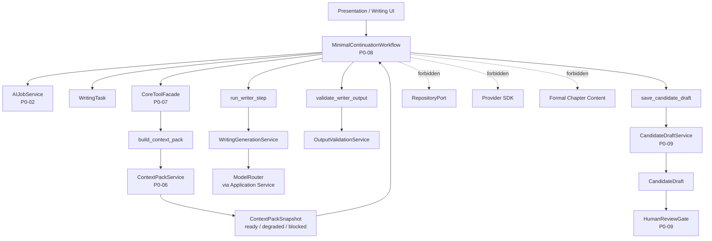
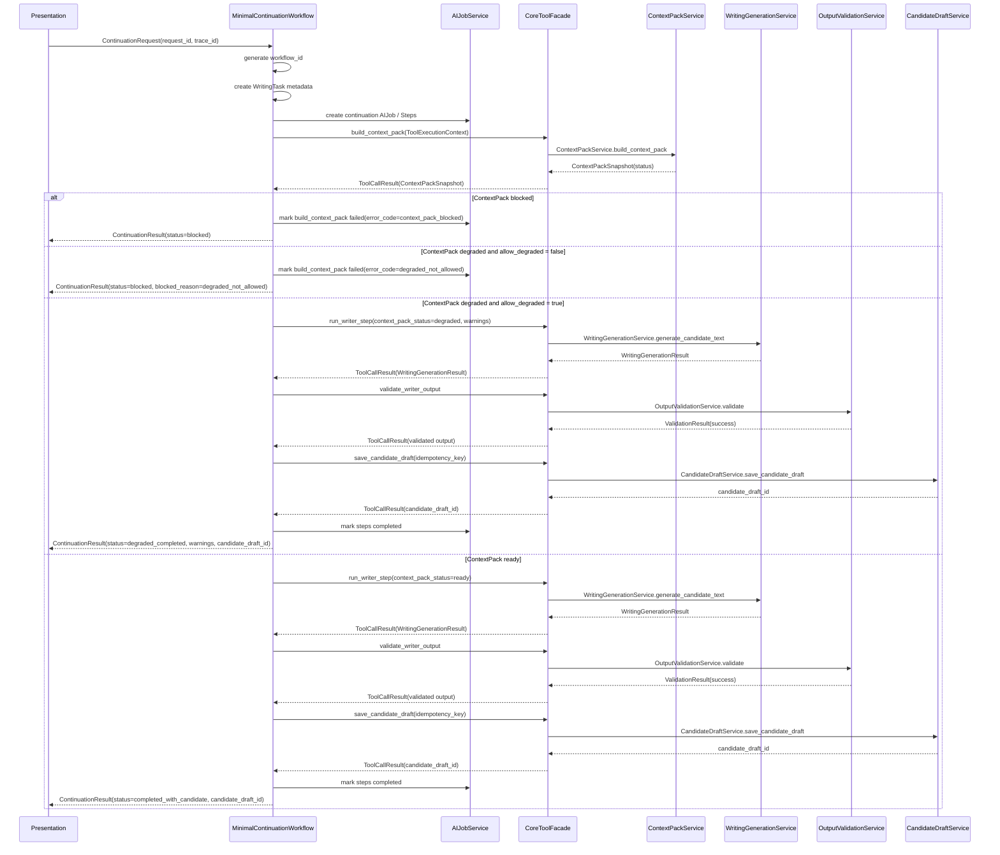
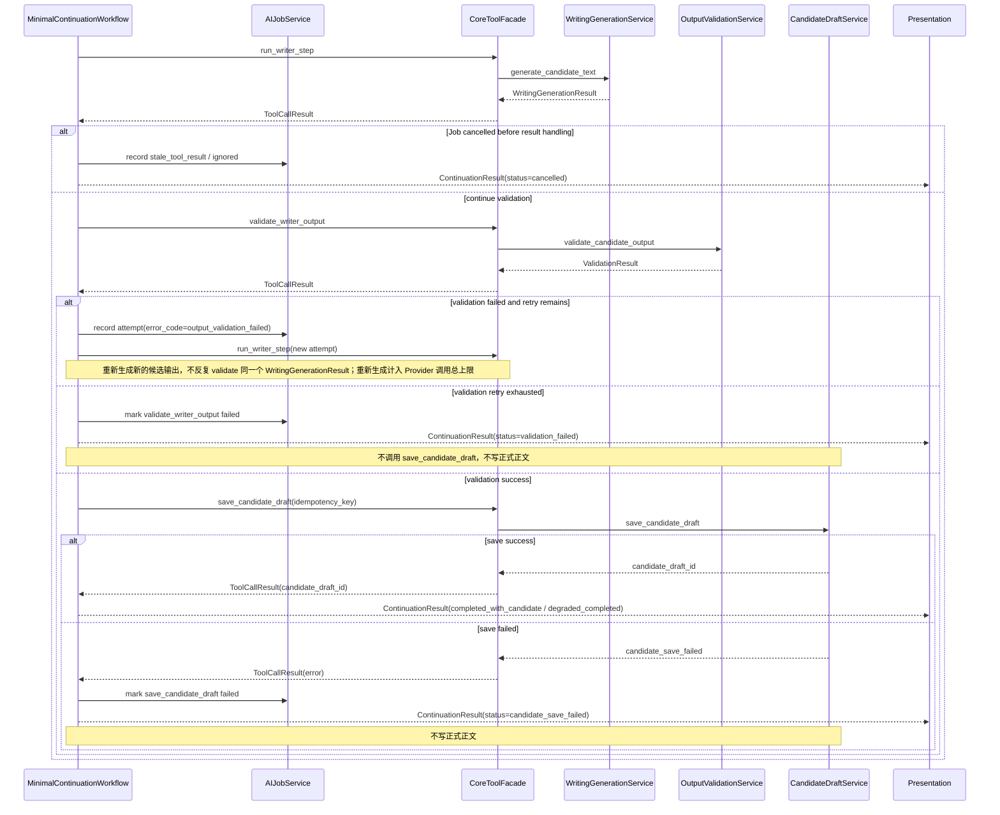

# InkTrace V2.0-P0-08 MinimalContinuationWorkflow 详细设计

版本：v2.0-p0-detail-08  
状态：P0 模块级详细设计  
依据文档：

- `docs/01_requirements/InkTrace-V2.0-需求规格说明书.md`
- `docs/07_overview/InkTrace-V2.0-概要设计说明书.md`
- `docs/02_architecture/InkTrace-V2.0-架构设计说明书.md`
- `docs/03_design/InkTrace-V2.0-P0-详细设计总纲.md`
- `docs/03_design/InkTrace-V2.0-P0-01-AI基础设施详细设计.md`
- `docs/03_design/InkTrace-V2.0-P0-02-AIJobSystem详细设计.md`
- `docs/03_design/InkTrace-V2.0-P0-03-初始化流程详细设计.md`
- `docs/03_design/InkTrace-V2.0-P0-04-StoryMemory与StoryState详细设计.md`
- `docs/03_design/InkTrace-V2.0-P0-05-VectorRecall详细设计.md`
- `docs/03_design/InkTrace-V2.0-P0-06-ContextPack详细设计.md`
- `docs/03_design/InkTrace-V2.0-P0-07-ToolFacade与权限详细设计.md`

---

## 一、文档定位与设计范围

### 1.1 文档定位

本文档是 InkTrace V2.0-P0 的第八个模块级详细设计文档，仅覆盖 P0 MinimalContinuationWorkflow。

MinimalContinuationWorkflow 是 P0 正式单章受控续写的最小编排流程。它负责把 WritingTask、AIJob、ContextPack、run_writer_step、OutputValidation、CandidateDraft 保存串成一个最小闭环，但不实现完整 Agent Runtime，不实现五 Agent Workflow，不做自动连续续写队列。

本文档不替代 P0-09 CandidateDraft 与 HumanReviewGate 详细设计，不写代码、不修改源码、不生成数据库迁移、不拆 Task、不进入开发计划。

### 1.2 设计范围

本模块覆盖：

- MinimalContinuationWorkflow。
- WritingTask。
- ContinuationRequest。
- ContinuationResult。
- WorkflowExecutionContext。
- WorkflowStep。
- WorkflowState。
- Workflow 与 AIJobSystem 的关系。
- Workflow 与 ToolFacade 的关系。
- Workflow 与 ContextPack 的关系。
- Workflow 与 run_writer_step 的关系。
- Workflow 与 OutputValidationService 的关系。
- Workflow 与 CandidateDraft / HumanReviewGate 的边界。
- Workflow 与 Quick Trial 的边界。
- Writer Prompt 组装边界。
- Provider / ModelRouter 调用边界。
- retry / cancel / resume 行为。
- blocked / degraded / ready 的处理。
- 错误处理与降级。
- 安全、隐私与日志。

### 1.3 本文档不覆盖

P0-08 不覆盖：

- 完整 Agent Runtime。
- AgentSession / AgentStep / AgentObservation / AgentTrace。
- 五 Agent Workflow。
- 完整 AI Suggestion / Conflict Guard。
- 完整 Story Memory Revision。
- 复杂 Knowledge Graph。
- Citation Link。
- @ 标签引用系统。
- 复杂多路召回融合。
- 自动连续续写队列。
- 成本看板。
- 分析看板。
- CandidateDraft 接受 / 应用到章节草稿区的详细流程。
- HumanReviewGate 详细交互。
- Provider SDK 适配实现。
- 具体 API DTO / 数据库表结构。

---

## 二、P0 MinimalContinuationWorkflow 目标

### 2.1 核心目标

P0 MinimalContinuationWorkflow 的目标是定义最小正式续写工作流：

- 接收 ContinuationRequest。
- 创建 WritingTask。
- 创建或关联 continuation AIJob。
- 通过 ToolFacade 构建 ContextPack。
- 根据 ContextPack status 决定是否调用 Writer。
- 通过 ToolFacade 调用 run_writer_step。
- 对 Writer 输出执行 validate_writer_output。
- 通过 ToolFacade 调用 save_candidate_draft。
- 返回 ContinuationResult。

### 2.2 核心边界

必须明确：

- MinimalContinuationWorkflow 是 P0 正式续写的最小编排流程。
- MinimalContinuationWorkflow 不是完整 Agent Workflow。
- MinimalContinuationWorkflow 不实现五 Agent Workflow。
- MinimalContinuationWorkflow 不自动连续续写多轮。
- MinimalContinuationWorkflow 不自行读取 RepositoryPort。
- MinimalContinuationWorkflow 不直接访问 VectorStorePort。
- MinimalContinuationWorkflow 不直接访问 EmbeddingProviderPort。
- MinimalContinuationWorkflow 不直接调用 Provider SDK。
- MinimalContinuationWorkflow 不绕过 ToolFacade。
- MinimalContinuationWorkflow 通过 ToolFacade 调用 build_context_pack、run_writer_step、validate_writer_output、save_candidate_draft 等受控工具。
- MinimalContinuationWorkflow 不直接写正式正文。
- MinimalContinuationWorkflow 不接受 CandidateDraft。
- MinimalContinuationWorkflow 不伪造用户确认。
- MinimalContinuationWorkflow 输出的是 CandidateDraft，后续由 P0-09 HumanReviewGate 处理。

### 2.3 与 Agent Runtime 的区别

P0 MinimalContinuationWorkflow 是 Agent-ready 的轻量编排，不是完整 Agent Runtime。

区别：

- 不实现 AgentSession。
- 不实现 AgentStep。
- 不实现 AgentObservation。
- 不实现 AgentTrace。
- 不实现 Memory Agent / Planner Agent / Writer Agent / Reviewer Agent / Rewriter Agent。
- 不实现完整 PPAO 循环。
- 只围绕单次正式续写请求完成最小闭环。

---

## 三、模块边界与不做事项

### 3.1 P0 做什么

P0 MinimalContinuationWorkflow 必须完成：

- 创建 WritingTask。
- 创建或关联 continuation AIJob。
- 构造 WorkflowExecutionContext。
- 构造 ToolExecutionContext。
- 调用 build_context_pack。
- 处理 ContextPack blocked / degraded / ready。
- 调用 run_writer_step。
- 调用 validate_writer_output。
- 调用 save_candidate_draft。
- 处理 retry / cancel / resume 的最小边界。
- 返回 ContinuationResult。

### 3.2 P0 不做什么

P0 MinimalContinuationWorkflow 不做：

- 不实现完整 Agent Runtime。
- 不实现五 Agent Workflow。
- 不实现自动连续续写。
- 不直接调用 WritingGenerationService。
- 不直接调用 ContextPackService。
- 不直接调用 ModelRouter。
- 不直接调用 Provider SDK。
- 不直接访问 RepositoryPort。
- 不直接访问 Infrastructure Adapter。
- 不写正式正文。
- 不接受 CandidateDraft。
- 不更新 StoryMemory / StoryState / VectorIndex。
- 不绕过 ToolFacade。
- 不绕过 HumanReviewGate。
- 不持久化完整 Writer Prompt。

### 3.3 禁止行为

范围说明：

- “不得绕过 ToolFacade”仅约束 AI 编排工具调用路径。
- 受约束对象包括 P0-08 MinimalContinuationWorkflow、Quick Trial、未来 Agent 工具调用，以及 Writer / AI 模型可触发的受控工具调用。
- 普通非 AI 的 Application 内部协作、UI 查询、系统维护接口不在 P0-08 的工具调用约束范围内。
- 即使普通 Application 内部协作不经过 ToolFacade，也必须遵守对应 Application Service 的权限、输入校验和安全边界。
- Writer / AI 模型不得借普通接口绕过 ToolFacade。
- P0-08 不定义普通 UI / 系统维护接口的完整权限模型。

禁止：

- ContextPack blocked 时调用 run_writer_step。
- run_writer_step 输出直接写正式正文。
- validation_failed 时保存 CandidateDraft。
- candidate_save_failed 时写正式正文。
- retry / resume 重复创建 CandidateDraft。
- cancel 后迟到 run_writer_step 结果保存 CandidateDraft。
- Quick Trial 改变 initialization_status。
- Quick Trial 更新 StoryMemory / StoryState / VectorIndex。
- Workflow / ToolFacade 伪造用户确认。
- 普通日志记录完整正文、完整 Prompt、完整 ContextPack、完整 CandidateDraft、API Key。

---

## 四、总体架构

### 4.1 模块关系说明

MinimalContinuationWorkflow 位于 Core Application 编排边界内。它本身不直接调用底层服务，而是通过 P0-07 CoreToolFacade 调用受控工具。

关系：

- Presentation API 触发正式续写或 Quick Trial。
- MinimalContinuationWorkflow 创建 WritingTask 和 WorkflowExecutionContext。
- MinimalContinuationWorkflow 创建或关联 AIJob。
- MinimalContinuationWorkflow 通过 ToolFacade 调用 build_context_pack。
- MinimalContinuationWorkflow 根据 ContextPack status 决定是否调用 run_writer_step。
- MinimalContinuationWorkflow 通过 ToolFacade 调用 validate_writer_output。
- MinimalContinuationWorkflow 通过 ToolFacade 调用 save_candidate_draft。
- CandidateDraft 后续进入 P0-09 HumanReviewGate。

### 4.2 模块关系图



### 4.3 与相邻模块的边界

| 模块 | 关系 | 边界 |
|---|---|---|
| P0-01 AI 基础设施 | Writer 模型调用间接依赖 | Workflow 不直接调用 ModelRouter / Provider SDK |
| P0-02 AIJobSystem | Job / Step 生命周期 | Workflow 通过 AIJobService 管理状态，不绕过状态机 |
| P0-06 ContextPack | 上下文构建 | Workflow 通过 ToolFacade 调用 build_context_pack |
| P0-07 ToolFacade | 工具门面 | Workflow 所有受控工具调用必须经 ToolFacade |
| P0-09 CandidateDraft / HumanReviewGate | 候选稿与人工门控 | Workflow 只假定存在 save_candidate_draft 受控入口；完整字段、状态机、版本规则、接受 / 拒绝流程和 HumanReviewGate 交互由 P0-09 冻结 |

### 4.4 禁止调用路径

以下禁止调用路径约束 AI 编排工具调用路径，不覆盖普通非 AI 的 Application 内部协作、UI 查询或系统维护接口。普通接口即使不经过 ToolFacade，也不得被 Writer / AI 模型借用来绕过受控工具权限。

禁止：

- Workflow -> ContextPackService 直接调用。
- Workflow -> WritingGenerationService 直接调用。
- Workflow -> ModelRouter。
- Workflow -> Provider SDK。
- Workflow -> VectorStorePort / EmbeddingProviderPort。
- Workflow -> RepositoryPort。
- Workflow -> Formal Chapter Write。
- Workflow -> accept_candidate_draft / apply_candidate_to_draft。

---

## 五、WritingTask 设计

### 5.1 定义

WritingTask 是一次续写请求的结构化写作任务描述，用于让 ContextPackService、WritingGenerationService 和 Workflow 对齐目标、约束、输出范围。

WritingTask 不等于 CandidateDraft，不写正式正文，不进入 StoryMemory / StoryState。

P0 默认策略：

- WritingTask 是 Workflow 输入任务描述，不是正式资产。
- P0 正式续写路径中，WritingTask 应至少以轻量 metadata 形式关联到 workflow_id / job_id / writing_task_id / work_id / target_chapter_id / continuation_mode / request_id / trace_id / created_at。
- P0 不要求长期持久化完整 user_instruction / current_selection / current_chapter_text。
- 如需保存 user_instruction / current_selection，只能按安全策略保存摘要、引用或脱敏内容。
- resume 时优先通过 writing_task_id + workflow_id / job_id + safe refs 恢复任务上下文。
- 如果 WritingTask metadata 不存在，Workflow 不应安全 resume，应要求重新发起 ContinuationRequest。
- Quick Trial 可以只在内存中创建 WritingTask，或创建 transient trial task metadata；P0-08 不展开 trial task 存储。

### 5.2 字段方向

| 字段 | 说明 | P0 必须 |
|---|---|---|
| writing_task_id | WritingTask ID | 是 |
| work_id | 作品 ID | 是 |
| target_chapter_id | 目标章节 ID | 是 |
| target_chapter_order | 目标章节顺序 | 是 |
| continuation_mode | continue_chapter / expand_scene / rewrite_selection | 是 |
| user_instruction | 用户指令 | 是 |
| current_selection | 当前选区，可选 | 可选 |
| current_chapter_ref | 当前章节引用 | 是 |
| model_role | 固定为 writer | 是 |
| max_context_tokens | 上下文预算 | 是 |
| max_output_tokens | 输出预算 | 是 |
| style_constraints | 风格约束，可选 | 可选 |
| request_id | 请求 ID | 是 |
| trace_id | Trace ID | 是 |
| created_at | 创建时间 | 是 |

### 5.3 continuation_mode

continuation_mode 继承 P0-06 定义：

| continuation_mode | 含义 | P0 行为 |
|---|---|---|
| continue_chapter | 从当前章节末尾继续生成正文 | current_chapter 通常 required |
| expand_scene | 扩展当前选区、场景或用户指定片段 | current_selection 通常高优先级，可能 required |
| rewrite_selection | 改写当前选区 | current_selection 通常 required，完整 current_chapter 仅作辅助背景 |

规则：

- continuation_mode 为空时按 continue_chapter 处理。
- continuation_mode 未知时 ContextPack degraded，使用 continue_chapter 的保守策略。
- continuation_mode 影响 ContextPack 的 required item、priority 和裁剪策略。
- continuation_mode 不直接决定是否调用 Writer。

### 5.4 持久化与日志边界

持久化边界：

- WritingTask metadata 可用于 trace、audit、resume 判断和 ContinuationResult 关联。
- WritingTask metadata 不替代 CandidateDraft，不替代正式正文保存记录。
- WritingTask metadata 不进入 StoryMemory / StoryState / VectorIndex。
- 清理 WritingTask metadata 不得删除正式正文、用户原始大纲、StoryMemory、StoryState、VectorIndex、CandidateDraft。

普通日志不得记录：

- 完整 user_instruction。
- 完整 current_selection。
- 完整 current_chapter_text。
- 完整 Writer Prompt。

---

## 六、ContinuationRequest / ContinuationResult 设计

### 6.1 ContinuationRequest

| 字段 | 说明 | P0 必须 |
|---|---|---|
| work_id | 作品 ID | 是 |
| target_chapter_id | 目标章节 ID | 是 |
| target_chapter_order | 目标章节顺序 | 是 |
| user_instruction | 用户指令 | 是 |
| continuation_mode | continue_chapter / expand_scene / rewrite_selection | 是 |
| current_selection | 当前选区，可选 | 可选 |
| max_context_tokens | 上下文预算 | 是 |
| max_output_tokens | 输出预算 | 是 |
| allow_degraded | 是否允许 degraded，默认 true | 是 |
| is_quick_trial | 是否 Quick Trial，默认 false | 是 |
| request_id | 请求 ID | 是 |
| trace_id | Trace ID | 是 |

allow_degraded 规则：

- allow_degraded 默认 true。
- allow_degraded = true 时，ContextPack degraded 后 Workflow 可以继续调用 run_writer_step，并必须将 degraded warnings 传递给 run_writer_step / ContinuationResult / UI。
- allow_degraded = false 时，ContextPack degraded 后 Workflow 不得调用 run_writer_step；ContinuationResult.status = blocked，blocked_reason = degraded_not_allowed，AIJobStep 可标记 failed，error_code = degraded_not_allowed。
- ContextPack ready 时不受 allow_degraded 影响。
- ContextPack blocked 时无论 allow_degraded 为 true 还是 false，都不得调用 run_writer_step。
- Quick Trial 默认允许 degraded，但必须标记 context_insufficient / degraded_context；stale 状态下还必须标记 stale_context。

### 6.2 ContinuationResult

| 字段 | 说明 | P0 必须 |
|---|---|---|
| workflow_id | Workflow ID | 是 |
| job_id | AIJob ID，可选 Quick Trial 可为空 | 可选 |
| writing_task_id | WritingTask ID | 是 |
| context_pack_id | ContextPack ID，可选 | 可选 |
| candidate_draft_id | CandidateDraft ID，可选 | 可选 |
| status | 结果状态 | 是 |
| warnings | warning 列表 | 是 |
| error | 错误，可选 | 可选 |
| request_id | 请求 ID | 是 |
| trace_id | Trace ID | 是 |
| created_at | 创建时间 | 是 |
| finished_at | 完成时间，可选 | 可选 |

### 6.3 status

| status | 含义 |
|---|---|
| completed_with_candidate | 候选稿已生成并保存，不代表正式正文已更新 |
| degraded_completed | 正式 Workflow 中表示在 degraded ContextPack 下生成并保存了 CandidateDraft；Quick Trial 中仅表示降级试写输出已生成完成 |
| blocked | 未调用 Writer |
| failed | Workflow 失败 |
| cancelled | Workflow 被取消 |
| validation_failed | 模型输出校验失败且不可继续重试 |
| candidate_save_failed | 候选稿保存失败，不写正式正文 |

规则：

- ContinuationResult 不等于 CandidateDraft。
- ContinuationResult 不等于正式正文保存结果。
- completed_with_candidate 不代表正式正文已更新。
- 正式 Workflow 中，degraded_completed 表示在 degraded ContextPack 下生成并保存了 CandidateDraft，candidate_draft_id 应存在。
- Quick Trial 中，degraded_completed 仅表示降级试写输出已生成完成，不代表 CandidateDraft 已保存，candidate_draft_id 默认为空。
- Quick Trial 的 degraded_completed 结果必须标记 context_insufficient / degraded_context；stale 状态下还必须标记 stale_context。
- P0 不新增 trial_completed / quick_trial_completed 等状态；如后续需要更明确区分，可在 P1 或后续设计中扩展。
- blocked 表示未调用 Writer。
- validation_failed 不写 CandidateDraft。
- candidate_save_failed 不写正式正文。

---

## 七、WorkflowExecutionContext 设计

### 7.1 字段方向

| 字段 | 说明 | P0 必须 |
|---|---|---|
| workflow_id | Workflow ID | 是 |
| work_id | 作品 ID | 是 |
| job_id | AIJob ID | 正式路径必须 |
| current_step_id | 当前 Step ID | 正式路径必须 |
| writing_task_id | WritingTask ID | 是 |
| request_id | 请求 ID | 是 |
| trace_id | Trace ID | 是 |
| caller_type | workflow / quick_trial | 是 |
| is_quick_trial | 是否 Quick Trial | 是 |
| initialization_status | 初始化状态 | 是 |
| context_pack_status | ready / degraded / blocked，可选 | 可选 |
| allow_degraded | 是否允许 degraded | 是 |
| created_at | 创建时间 | 是 |

### 7.2 构造规则

规则：

- workflow_id 由 MinimalContinuationWorkflow / Application 层在启动时生成。
- Presentation 可以传 request_id / trace_id，但不直接指定 workflow_id。
- WorkflowExecutionContext 由 Application / Workflow 创建。
- AI 模型不得自行伪造 WorkflowExecutionContext。
- WorkflowExecutionContext 用于构造 ToolExecutionContext。
- is_quick_trial = true 时 caller_type 必须 quick_trial。
- 正式 Workflow caller_type = workflow。
- WorkflowExecutionContext 不记录完整正文、完整 Prompt、API Key。
- allow_degraded 从 ContinuationRequest 传入，默认 true。
- allow_degraded = false 时，WorkflowExecutionContext 必须携带该限制，供 check_context_pack_status 判断是否阻止 degraded 续写。

workflow_id 生命周期：

- 正式续写路径中，workflow_id 通常关联一个 continuation AIJob，workflow_id 与 job_id 通常是一对一关系。
- 一个 workflow_id 不应跨多个正式 continuation Job 复用。
- Quick Trial 中 workflow_id 仍必须生成，job_id 可以为空。
- Quick Trial 的 workflow_id 用于 trace、audit、ContinuationResult 返回和临时执行识别。
- workflow_id 应贯穿 WorkflowExecutionContext、ToolExecutionContext、ToolAuditLog、Workflow 日志、ContinuationResult、WritingTask metadata。
- P0 不要求复杂长期 Workflow 持久化。
- P0 至少需要保留 workflow_id 与 job_id / request_id / trace_id 的安全元数据关联，便于排查和 resume 判断。
- workflow_id 不得包含用户正文、Prompt、API Key 或敏感信息。

### 7.3 ToolExecutionContext 映射

Workflow 调用 ToolFacade 时，必须从 WorkflowExecutionContext 派生 ToolExecutionContext。

映射规则：

- work_id 保持一致。
- job_id / step_id 来自当前 AIJobStep。
- writing_task_id 保持一致。
- request_id / trace_id 保持一致或按 P0-02 retry 策略生成子 request_id。
- workflow_id 保持一致。
- caller_type = workflow 或 quick_trial。
- is_quick_trial 必须一致。
- context_pack_status 在 build_context_pack 后更新。

---

## 八、Workflow 步骤设计

### 8.1 最小步骤表

| Step | 调用 Tool | 输入 | 输出 | 失败处理 |
|---|---|---|---|---|
| create_writing_task | 无，Application 内部创建 | ContinuationRequest | WritingTask | 创建失败则 failed |
| create_ai_job | AIJobService | WritingTask / request_id / trace_id | continuation Job | 创建失败则 failed；Quick Trial 默认不创建正式 continuation Job |
| build_context_pack | build_context_pack | WritingTask / WorkflowExecutionContext | ContextPackSnapshot | blocked 则停止；failed 则 failed |
| check_context_pack_status | 无，Workflow 内部判断 | ContextPackSnapshot / allow_degraded | status decision | blocked 不调用 Writer；degraded 根据 allow_degraded 决定继续或 blocked |
| run_writer_step | run_writer_step | ContextPackSnapshot ref / WritingTask / ToolExecutionContext | WritingGenerationResult | 失败按 retry 策略；最终失败则 failed |
| validate_writer_output | validate_writer_output | WritingGenerationResult | validated output | validation_failed 不保存 CandidateDraft |
| save_candidate_draft | save_candidate_draft | validated output / idempotency_key | candidate_draft_id | 保存失败则 candidate_save_failed |
| finalize_workflow_result | 无，Workflow 内部汇总 | 前序结果 | ContinuationResult | 返回安全结果 |

### 8.2 步骤规则

规则：

- create_writing_task 创建 WritingTask。
- create_ai_job 创建 AIJob / AIJobStep。
- build_context_pack 通过 ToolFacade 调用 build_context_pack。
- check_context_pack_status：blocked 停止，不调用 run_writer_step。
- check_context_pack_status：degraded 且 allow_degraded = true 时继续，warnings 传递给 run_writer_step / ContinuationResult / UI。
- check_context_pack_status：degraded 且 allow_degraded = false 时停止，不调用 run_writer_step，ContinuationResult.status = blocked，blocked_reason = degraded_not_allowed。
- check_context_pack_status：ready 继续。
- run_writer_step 通过 ToolFacade 调用 run_writer_step。
- validate_writer_output 通过 ToolFacade 调用 validate_writer_output。
- save_candidate_draft 通过 ToolFacade 调用 save_candidate_draft。
- finalize_workflow_result 返回 ContinuationResult。
- Workflow 不直接调用 WritingGenerationService。
- Workflow 不直接调用 ModelRouter。
- Workflow 不直接访问 Provider SDK。
- Workflow 不写正式正文。

### 8.3 工作流时序图



### 8.4 validate retry / cancel 分支图



关键分支说明：

- ContextPack blocked 时不调用 run_writer_step。
- ContextPack degraded 且 allow_degraded = false 时不调用 run_writer_step。
- ContextPack degraded 且 allow_degraded = true 时，ToolExecutionContext / ToolCallRequest 必须携带 context_pack_status = degraded，并将 warnings 传递给 ContinuationResult / UI。
- validate_writer_output 可重试失败时，重新触发 run_writer_step 生成新的候选输出，不对同一个 WritingGenerationResult 反复 validate。
- 重新生成候选输出必须计入 Provider 调用总上限。
- Job cancelled 后迟到 ToolResult 只能记录 stale_tool_result / ignored，不推进 JobStep。
- 迟到 run_writer_step 结果不得保存 CandidateDraft。

---

## 九、与 AIJobSystem 的关系

### 9.1 Job / Step

规则：

- MinimalContinuationWorkflow 应创建或关联 AIJob。
- 每个正式续写请求对应一个 continuation Job。
- Job / Step 状态遵守 P0-02。
- Workflow 不绕过 AIJobService 直接写状态。
- ToolFacade 可通过 AIJobService 更新进度。

正式 continuation Job 至少包含 Step：

- build_context_pack。
- run_writer_step。
- validate_writer_output。
- save_candidate_draft。

### 9.2 blocked / failed 默认规则

P0 默认：

- ContextPack blocked 时，Job Step 标记 failed，error_code = context_pack_blocked；如需要用户修复上下文，可由 UI 表达为等待用户处理。
- Writer 输出校验失败且重试耗尽时，validate_writer_output Step failed，ContinuationResult.status = validation_failed。
- CandidateDraft 保存失败时，save_candidate_draft Step failed，ContinuationResult.status = candidate_save_failed。
- CandidateDraft 保存失败不写正式正文。

### 9.3 Job / Step 状态与 Workflow 影响

| Job / Step 状态 | Workflow 影响 |
|---|---|
| build_context_pack Step 成功 | 继续到 check_context_pack_status |
| build_context_pack Step failed | Workflow 返回 blocked 或 failed；P0 默认按错误类型处理 |
| ContextPack blocked | 不调用 run_writer_step；ContinuationResult.status = blocked |
| ContextPack degraded 且 allow_degraded = true | 继续到 run_writer_step，并传递 degraded warnings |
| ContextPack degraded 且 allow_degraded = false | 不调用 run_writer_step；ContinuationResult.status = blocked，error_code = degraded_not_allowed |
| run_writer_step Step 成功 | 继续到 validate_writer_output |
| run_writer_step Step failed，可重试 | retry，不超过 P0-01 / P0-02 上限 |
| run_writer_step Step failed，不可重试 | Job Step failed，Workflow 返回 failed |
| validate_writer_output Step 成功 | 继续到 save_candidate_draft |
| validate_writer_output Step failed，可重试 | 重新触发 run_writer_step 生成新候选输出，而不是仅重复校验同一输出 |
| validate_writer_output Step failed，超过上限 | Job Step failed，Workflow 返回 validation_failed |
| save_candidate_draft Step 成功 | Workflow 返回 completed_with_candidate 或 degraded_completed |
| save_candidate_draft Step failed | Job Step failed，Workflow 返回 candidate_save_failed |
| Job cancelled | Workflow 停止后续 Tool 调用，返回 cancelled |
| stale ToolResult | ignored，不推进 JobStep |

约束：

- 本表不新增 P0-02 未定义的 AIJob / AIJobStep 状态。
- ContextPack blocked 时，P0 默认可将 build_context_pack Step 标记 failed，error_code = context_pack_blocked。
- 如果未来 UI 需要表达“等待用户修复上下文”，应由 UI 或后续设计表达，不在 P0-08 新增 Job 状态。
- validate_writer_output 可重试失败时，重试目标是重新生成新的候选输出；不得仅对同一份不合格输出无限重复校验。

### 9.4 cancel / retry / resume

规则：

- cancel 后迟到 ToolResult 不得推进 JobStep。
- resume 时不得重复创建 CandidateDraft。
- retry 时必须遵守 P0-01 / P0-02 调用上限。
- Tool retry 与 Provider retry 不得叠加超过 P0-01 / P0-02 规定上限。
- Workflow 不得绕过 P0-02 状态机直接写状态。

### 9.5 continuation 与 reanalysis / initialization 并发边界

P0 最小策略：

- P0 不支持 continuation Job 与 reanalysis / reinitialization Job 的复杂并发编排。
- 启动正式 continuation 前，必须检查 initialization_status = completed。
- 启动正式 continuation 前，必须检查 StoryMemory / StoryState / ContextPack 未处于会导致 blocked 的 stale 状态。
- 启动正式 continuation 前，必须检查没有同一 work_id 下正在运行的 reanalysis / reinitialization Job 阻断正式续写。
- 如果检测到 reanalysis 正在运行，正式 continuation blocked，error_code = reanalysis_in_progress，不调用 run_writer_step。
- 如果检测到 initialization / reinitialization 正在运行，正式 continuation blocked，error_code = initialization_in_progress，不调用 run_writer_step。
- 如果 continuation 运行期间检测到 StoryMemory / StoryState / ContextPack 已 stale，后续 ToolResult 应标记 stale_tool_result，或 Workflow failed / blocked。
- 如果 run_writer_step 已完成但 save_candidate_draft 前检测到关键上下文 stale，P0 默认不保存 CandidateDraft，ContinuationResult.status = blocked 或 failed，error_code = context_stale_during_workflow。
- 如果 CandidateDraft 已保存后才发生 reanalysis，CandidateDraft 仍是候选稿，不是正式正文；后续是否标记 CandidateDraft stale 由 P0-09 或后续设计决定。
- 未接受 CandidateDraft 不进入 StoryMemory / StoryState / VectorIndex。
- P0 不实现复杂 Job 锁、抢占、优先级队列、自动等待和自动恢复。
- P1 / 后续设计可引入更完整的 work-level AIJob concurrency policy。
- P0 只做保守阻断和 stale 结果隔离。

---

## 十、ContextPack status 处理

### 10.1 blocked

规则：

- Workflow 不得调用 run_writer_step。
- ContinuationResult.status = blocked。
- P0 默认将 build_context_pack Step 标记 failed，error_code = context_pack_blocked。
- blocked 不写 CandidateDraft。
- blocked 不写正式正文。
- reanalysis_in_progress / initialization_in_progress / context_stale_during_workflow 均可使 Workflow blocked 或 failed，且不得调用 run_writer_step 或保存 CandidateDraft。

### 10.2 degraded

规则：

- allow_degraded = true 时，Workflow 可以调用 run_writer_step。
- allow_degraded = true 时，必须传递 degraded warnings。
- allow_degraded = true 时，run_writer_step ToolCallRequest / ToolExecutionContext 应携带 context_pack_status = degraded。
- allow_degraded = true 且最终成功时，ContinuationResult.status 可以为 degraded_completed。
- allow_degraded = false 时，Workflow 不得调用 run_writer_step。
- allow_degraded = false 时，ContinuationResult.status = blocked，blocked_reason = degraded_not_allowed，AIJobStep 可标记 failed，error_code = degraded_not_allowed。
- UI 必须可展示 warning。

### 10.3 ready

规则：

- Workflow 正常调用 run_writer_step。
- 无额外 degraded warning。
- ContinuationResult.status 最终可以 completed_with_candidate。

### 10.4 ContextPackSnapshot 边界

规则：

- ContextPackSnapshot 作为 run_writer_step 输入引用或安全 payload。
- ContextPackSnapshot 不等于 Writer Prompt。
- ContextPackSnapshot 是结构化上下文来源，Writer Prompt 是 PromptTemplate、ContextPackSnapshot、WritingTask、user_instruction 等输入在调用前渲染出的模型请求内容。
- Workflow 负责最终 Prompt 组装边界，但不直接调用 WritingGenerationService；Prompt 组装由 run_writer_step 映射的 WritingGenerationService 或等价 Application Service 完成。
- Workflow 不直接拼接完整 Prompt 字符串。
- Workflow 不持久化完整 Writer Prompt。
- 普通日志不记录完整 Writer Prompt。

---

## 十一、Prompt 组装边界

### 11.1 规则

- P0-08 负责 Writer 调用前的 Prompt 组装边界。
- Prompt 组装可以由 WritingGenerationService 内部完成。
- MinimalContinuationWorkflow 不直接拼接完整 Prompt 字符串，或只传递 Prompt 组装所需结构化输入。
- PromptTemplate 来自 P0-01 AI 基础设施。
- ContextPackSnapshot 是 Prompt 输入来源之一，不是 Prompt 本身。
- user_instruction 是 Prompt 输入来源之一，但普通日志不得完整记录。
- run_writer_step 不是 Provider 直连。
- WritingGenerationService 通过 ModelRouter 调用 Provider。
- LLMCallLog / Provider request 记录遵守 P0-01。
- 普通日志不得记录完整 Prompt、完整正文、API Key。
- P0 不做复杂 prompt chain。
- P0 不做多 Agent prompt routing。
- Prompt 渲染失败时不得记录完整 Prompt。

### 11.2 Prompt 组装流程

P0 默认 Writer Prompt 组装链路如下：

```text
Workflow
  -> run_writer_step（通过 ToolFacade）
    -> ToolExecutionContext（含 ContextPackSnapshot 引用）
    -> WritingGenerationService.generate_candidate_text()
      -> PromptRegistry 获取 PromptTemplate
      -> 使用 ContextPackSnapshot + WritingTask + user_instruction 渲染 Prompt
      -> ModelRouter 调用 Provider
      -> OutputValidator 校验输出
      -> 返回 WritingGenerationResult
```

说明：

- Workflow 只传递 Prompt 组装所需的结构化输入和安全引用，不持有、不持久化完整 Writer Prompt。
- run_writer_step 是 Tool 名，不是 Provider 直连；generate_candidate_text 是 Application Service 方法方向，不是 Tool 名。
- WritingGenerationService 负责在 P0-01 约束下使用 PromptRegistry、ModelRouter、OutputValidator、LLMCallLog 等能力。
- ContextPackSnapshot 可以作为渲染输入来源，但不得被当作最终 Prompt 或 AgentTrace。
- Prompt 组装失败时，Workflow 返回安全错误；不得写 CandidateDraft，不得写正式正文。

---

## 十二、run_writer_step 与 Writer 调用

### 12.1 调用边界

规则：

- Workflow 通过 ToolFacade 调用 run_writer_step。
- Workflow 不直接调用 WritingGenerationService。
- run_writer_step 映射到 WritingGenerationService.generate_candidate_text 或等价方法。
- generate_candidate_text 不是 Tool 名。
- run_writer_step 不是 Provider 直连。
- run_writer_step 通过 WritingGenerationService 间接调用 PromptRegistry、ModelRouter、OutputValidator、LLMCallLog 等 P0-01 能力。
- “Workflow 通过 ToolFacade 调用 run_writer_step”仅约束 AI 编排工具调用路径；普通非 AI 的 Application 内部协作不由 P0-08 定义。
- Writer / AI 模型不得借普通接口绕过 ToolFacade 调用 Writer、Provider、Repository 或正式写入能力。

### 12.2 输入

run_writer_step 输入包括：

- WritingTask 引用。
- ContextPackSnapshot 引用或安全 payload。
- context_pack_status。
- degraded warnings，可选。
- ToolExecutionContext。
- request_id / trace_id。

禁止输入：

- API Key。
- Provider SDK 参数。
- Repository 内部对象。
- 未确认 CandidateDraft 作为正式上下文。
- Quick Trial 输出作为正式上下文。

### 12.3 输出

规则：

- run_writer_step 输出是 WritingGenerationResult 或等价结构。
- run_writer_step 输出不是 CandidateDraft。
- run_writer_step 输出不是正式正文。
- run_writer_step 输出必须经过 validate_writer_output。
- run_writer_step 输出在普通日志 / ToolAuditLog 中不得记录完整候选文本。

### 12.4 非流式与前端感知机制

P0 默认策略：

- P0-08 默认非流式。
- run_writer_step 完成后，Workflow 一次性进入 validate_writer_output 和 save_candidate_draft。
- P0-08 不直接负责 SSE token stream。
- P0-08 不向前端逐 token 推送正文。
- P0-08 默认通过 ContinuationResult、get_job_status、AIJob / AIJobStep 状态轮询、Tool / Workflow safe warnings 让前端感知进度。
- 如果 Presentation 层使用 SSE，P0 只能推送安全状态事件，例如 job_started、step_started、step_progress、step_completed、workflow_blocked、workflow_failed、candidate_ready、warning。
- P0 SSE 事件不得推送完整正文 token stream。
- P0 SSE 事件不得推送完整 Prompt、完整 ContextPack、完整 CandidateDraft、API Key。
- 流式 token 输出、实时 partial candidate 展示、边生成边保存属于 P1 或后续增强。
- 非流式策略不影响 LLMCallLog / ToolAuditLog / Job Progress 的正常记录。

---

## 十三、OutputValidation 与 retry

### 13.1 校验规则

规则：

- run_writer_step 输出必须经过 validate_writer_output。
- OutputValidationService 继承 P0-01 输出校验策略。
- schema 校验失败最多 2 次重试。
- Provider timeout / rate_limited / unavailable 按 P0-01 Provider retry 规则处理。
- Provider auth failed 不 retry。
- Tool retry、Provider retry、OutputValidation retry 的总调用上限必须与 P0-01 / P0-02 一致。
- validation_failed 不写 CandidateDraft。
- validation_failed 不写正式正文。
- validation_failed 不更新 StoryMemory / StoryState / VectorIndex。

### 13.2 总调用次数上限

P0 默认继承 P0-01 / P0-02：

- OutputValidator schema 校验失败默认最多重试 2 次。
- 总调用次数 = 首次调用 + 2 次 schema 修复重试。
- 单个 AIJobStep 总 Provider 调用次数上限为 3 次。
- Provider retry 不得突破 AIJobStep 总调用上限。
- Tool retry 不得额外叠加突破总上限。

---

## 十四、CandidateDraft 保存边界

P0-08 对 P0-09 的依赖边界：

- P0-08 只假定存在受控 Tool / Application Service 入口：save_candidate_draft。
- P0-08 只定义“保存候选稿”这个边界动作。
- CandidateDraft 的完整字段由 P0-09 详细设计冻结。
- CandidateDraft 的状态机由 P0-09 详细设计冻结。
- CandidateDraft 的版本规则由 P0-09 详细设计冻结。
- 用户接受 / 拒绝流程由 P0-09 详细设计冻结。
- HumanReviewGate 交互由 P0-09 详细设计冻结。
- P0-08 不定义 accept_candidate_draft。
- P0-08 不定义 apply_candidate_to_draft。
- P0-08 不定义 CandidateDraft 的完整生命周期。
- P0-08 不定义 HumanReviewGate UI。

规则：

- save_candidate_draft 只写候选稿。
- CandidateDraft 不属于 confirmed chapters。
- CandidateDraft 不直接进入 StoryMemory / StoryState / VectorIndex / 正式 ContextPack。
- HumanReviewGate 之前的 AI 输出不能影响正式 StoryState。
- accept_candidate_draft / apply_candidate_to_draft 不属于 P0-08，由 P0-09 设计。
- 用户接受 CandidateDraft 后仍需进入 V1.1 Local-First 保存链路。
- Workflow / ToolFacade 不得伪造用户确认。
- save_candidate_draft 必须使用 idempotency_key 或等价去重机制。
- retry / resume 不得重复创建 CandidateDraft。
- duplicate save_candidate_draft 应返回已有 candidate_draft_id 或 duplicate_request。
- candidate_save_failed 不写正式正文。
- 普通日志不记录完整候选文本。

---

## 十五、Quick Trial 工作流边界

### 15.1 默认策略

P0 默认策略：

- Quick Trial 不创建正式 continuation Job。
- Quick Trial 可创建 transient trial execution 记录，或者仅返回内存结果。
- P0-08 只定义边界，不展开 trial execution 存储。

### 15.2 步骤复用

规则：

- Quick Trial 可以复用 MinimalContinuationWorkflow 的部分步骤。
- Quick Trial 使用 is_quick_trial = true。
- Quick Trial caller_type = quick_trial。
- Quick Trial 可以 build degraded ContextPack。
- Quick Trial 可以 run_writer_step。
- Quick Trial 可以 validate_writer_output。
- Quick Trial 默认不 save_candidate_draft。
- Quick Trial 只有用户明确“保存为候选稿”时才进入 P0-09 CandidateDraft 流程。
- Quick Trial 如返回 degraded_completed，仅表示降级试写输出已生成完成，不代表 CandidateDraft 已保存。
- Quick Trial 的 candidate_draft_id 默认为空。
- Quick Trial 输出不得自动进入正式 CandidateDraft。
- Quick Trial 进入 P0-09 流程后，CandidateDraft 字段、状态机、版本规则和 HumanReviewGate 交互仍由 P0-09 定义。

### 15.3 正式上下文边界

规则：

- Quick Trial 不更新正式 AIJobStep。
- Quick Trial 不改变 initialization_status。
- Quick Trial 不更新 StoryMemory / StoryState / VectorIndex。
- Quick Trial 不使正式续写入口可用。
- Quick Trial 输出必须标记 context_insufficient / degraded_context。
- stale 状态下 Quick Trial 还必须标记 stale_context。
- Quick Trial 不绕过 HumanReviewGate。
- Quick Trial 不写正式正文。

---

## 十六、cancel / retry / resume 设计

### 16.1 cancel

规则：

- cancel 后 Workflow 停止后续 Tool 调用。
- cancel 后迟到 ToolResult 不得推进 JobStep。
- cancel 后迟到 run_writer_step 结果不得保存为 CandidateDraft。
- cancel 不删除已有 CandidateDraft。
- cancel 不影响 V1.1 正文草稿。

### 16.2 retry

规则：

- retry run_writer_step 必须遵守 P0-01 / P0-02 上限。
- retry validate_writer_output 必须遵守 P0-01 schema retry 上限。
- retry save_candidate_draft 必须使用 idempotency_key 防重复。
- retry 不删除历史 ToolAuditLog / LLMCallLog / AIJobStep attempt。
- retry 不写正式正文。

### 16.3 resume

规则：

- resume 时必须使用 workflow_id / job_id / writing_task_id 对齐已有状态。
- 如果 workflow_id 不存在或无法匹配 job_id / writing_task_id，则不得继续 resume。
- 如果 WritingTask metadata 不存在，Workflow 不应安全 resume，应返回 writing_task_missing，并要求重新发起 ContinuationRequest。
- resume 时必须检查已有 ContextPackSnapshot / WritingGenerationResult / CandidateDraft。
- resume 时优先通过 writing_task_id + workflow_id / job_id + safe refs 恢复任务上下文。
- resume 不得重复创建 CandidateDraft。
- resume 不得重复调用 Provider，除非前一次没有有效结果或已明确作废。
- Workflow 失败后再次启动，必须以新的 request_id / trace_id 或明确复用策略处理。
- P0 不做复杂长期 Workflow 持久化。
- P0 不做自动连续重试队列。

---

## 十七、错误处理与降级

| 场景 | error_code / status | P0 行为 | 正式正文影响 |
|---|---|---|---|
| 初始化未完成 | initialization_not_completed | blocked，不调用 Writer | 不影响 |
| 初始化 / 重新初始化运行中 | initialization_in_progress | blocked，不调用 run_writer_step | 不影响 |
| reanalysis 运行中 | reanalysis_in_progress | blocked，不调用 run_writer_step | 不影响 |
| ContextPack blocked | context_pack_blocked | blocked，不调用 run_writer_step | 不影响 |
| ContextPack degraded | context_pack_degraded_warning | allow_degraded = true 时可继续并携带 warning；allow_degraded = false 时 blocked | 不影响 |
| ContextPack degraded 但不允许降级 | degraded_not_allowed | blocked，不调用 run_writer_step，AIJobStep 可 failed | 不影响 |
| Workflow 运行中关键上下文 stale | context_stale_during_workflow | blocked / failed，不保存 CandidateDraft | 不影响 |
| build_context_pack 失败 | build_context_pack_failed | failed / blocked | 不影响 |
| run_writer_step 失败 | run_writer_step_failed | retry 或 failed | 不影响 |
| Provider timeout | provider_timeout | 按 P0-01 retry | 不影响 |
| Provider 鉴权失败 | provider_auth_failed | failed，不 retry | 不影响 |
| Provider rate limited | provider_rate_limited | 按 P0-01 retry | 不影响 |
| 输出校验失败 | output_validation_failed | 按 schema retry | 不影响 |
| 输出校验重试耗尽 | output_validation_retry_exhausted | validation_failed，不保存 CandidateDraft | 不影响 |
| CandidateDraft 保存失败 | candidate_save_failed | candidate_save_failed | 不影响 |
| 重复候选稿请求 | duplicate_candidate_request | 返回已有 candidate_draft_id 或 duplicate_request | 不影响 |
| 幂等冲突 | idempotency_conflict | failed，等待人工处理 | 不影响 |
| Job 已取消 | job_cancelled | cancelled，停止后续 Tool | 不影响 |
| Step 非 running | job_step_not_running | failed / blocked | 不影响 |
| 迟到 ToolResult | stale_tool_result | ignored，不推进 JobStep | 不影响 |
| WritingTask metadata 缺失 | writing_task_missing | 不安全 resume，要求重新发起 ContinuationRequest | 不影响 |
| workflow_id 不匹配 | workflow_id_mismatch | blocked / ignored，不推进 JobStep | 不影响 |
| audit intent 写入失败 | audit_intent_failed | audit_required 工具不得继续执行副作用 | 不影响 |
| audit result 写入失败 | audit_result_failed | 记录安全 warning | 不影响 |
| PromptTemplate 缺失 | prompt_template_missing | failed | 不影响 |
| Prompt 渲染失败 | prompt_render_failed | failed，不记录完整 Prompt | 不影响 |
| Tool 权限不足 | tool_permission_denied | blocked | 不影响 |
| Tool 参数非法 | invalid_tool_arguments | failed | 不影响 |
| dry_run 不支持 | dry_run_not_supported | failed | 不影响 |

错误隔离原则：

- Workflow 错误不影响 V1.1 写作、保存、导入、导出。
- Workflow 错误不得写正式正文。
- Workflow 错误不得覆盖用户原始大纲。
- Workflow 错误不得更新 StoryMemory / StoryState / VectorIndex。
- Workflow blocked 不等于正式正文失败。
- CandidateDraft 保存失败不写正式正文。
- Provider / validation / save 失败都必须返回安全错误。
- 普通日志不得记录完整正文、完整 Prompt、完整 CandidateDraft、API Key。

---

## 十八、安全、隐私与日志

### 18.1 普通日志边界

普通日志不得记录：

- 完整正文。
- 完整 Prompt。
- 完整 ContextPack。
- 完整 CandidateDraft。
- 完整 user_instruction。
- API Key。

### 18.2 调用日志边界

规则：

- LLMCallLog 遵守 P0-01。
- ToolAuditLog 遵守 P0-07。
- Workflow 日志只记录 workflow_id、job_id、step_id、tool_name、status、error_code、duration、safe refs。
- P0 至少需要保留 workflow_id 与 job_id / request_id / trace_id 的安全元数据关联，便于排查和 resume 判断。
- WritingTask metadata 只保存安全元数据、摘要、引用或脱敏内容，不长期保存完整 user_instruction / current_selection / current_chapter_text。
- CandidateDraft 内容不进入普通日志。
- Prompt 渲染失败时不得记录完整 Prompt。
- Provider 错误不得泄露 API Key。
- 清理 Workflow 日志或 WritingTask metadata 不得删除正式正文、用户原始大纲、StoryMemory、StoryState、VectorIndex、CandidateDraft。

---

## 十九、P0 验收标准

### 19.1 Workflow 基础验收项

- [ ] Workflow 可以基于 ContinuationRequest 创建 WritingTask。
- [ ] Workflow 可以创建或关联 AIJob。
- [ ] workflow_id 由 Workflow / Application 层生成，不由 Presentation 直接指定。
- [ ] 正式路径中 workflow_id 通常与 continuation job_id 一对一关联。
- [ ] Quick Trial 仍生成 workflow_id，job_id 可以为空。
- [ ] workflow_id 贯穿 WorkflowExecutionContext / ToolExecutionContext / ToolAuditLog / ContinuationResult。
- [ ] Workflow 通过 ToolFacade 调用 build_context_pack。
- [ ] Workflow 不直接调用 ContextPackService。
- [ ] Workflow 不直接调用 WritingGenerationService。
- [ ] Workflow 不直接调用 ModelRouter / Provider SDK。
- [ ] “不得绕过 ToolFacade”限定为 AI 编排工具调用路径。
- [ ] 普通非 AI 的 Application 内部协作、UI 查询、系统维护接口不被 P0-08 误伤。
- [ ] Writer / AI 模型不得借普通接口绕过 ToolFacade。

### 19.2 ContextPack 处理验收项

- [ ] ContextPack blocked 时 Workflow 不调用 run_writer_step。
- [ ] allow_degraded 默认 true。
- [ ] allow_degraded = true 且 ContextPack degraded 时，Workflow 可调用 run_writer_step，并携带 warning。
- [ ] allow_degraded = false 且 ContextPack degraded 时，Workflow 不调用 run_writer_step。
- [ ] allow_degraded = false 且 ContextPack degraded 时，ContinuationResult.status = blocked。
- [ ] degraded_not_allowed 可作为 blocked_reason / error_code。
- [ ] ContextPack blocked 时不受 allow_degraded 影响，永远不调用 run_writer_step。
- [ ] ContextPack ready 时 Workflow 正常调用 run_writer_step。
- [ ] ContextPackSnapshot 不是 Writer Prompt。
- [ ] Workflow 只向 run_writer_step 传递 ContextPackSnapshot 引用或安全 payload。
- [ ] Workflow 不直接拼接完整 Writer Prompt。
- [ ] P0-08 不持久化完整 Writer Prompt。
- [ ] 8.3 时序图覆盖 ContextPack blocked、degraded_not_allowed、degraded allowed、ready 主分支。

### 19.3 Writer / Validation 验收项

- [ ] run_writer_step 不是 Provider 直连。
- [ ] generate_candidate_text 不是 Tool 名。
- [ ] run_writer_step 通过 WritingGenerationService.generate_candidate_text 或等价方法执行 Writer 生成。
- [ ] PromptTemplate 由 PromptRegistry 获取。
- [ ] WritingGenerationService 通过 ModelRouter 调用 Provider。
- [ ] run_writer_step 输出必须经过 validate_writer_output。
- [ ] output_validation_failed 不写 CandidateDraft。
- [ ] validate_writer_output 可重试失败时，重新触发 run_writer_step 生成新候选输出，而不是仅重复校验同一输出。
- [ ] 重新生成候选输出计入 Provider 调用总上限。
- [ ] validation retry exhausted 时不调用 save_candidate_draft。
- [ ] validate_writer_output 成功后才可 save_candidate_draft。
- [ ] Tool retry 不超过 P0-01 / P0-02 边界。
- [ ] OutputValidation retry 不超过 P0-01 边界。
- [ ] P0-08 默认非流式。
- [ ] run_writer_step 完成后才一次性进入 validate_writer_output 和 save_candidate_draft。
- [ ] P0-08 不向前端逐 token 推送正文。
- [ ] 前端通过 ContinuationResult / get_job_status / AIJob 状态轮询 / safe warnings 感知进度。
- [ ] 如使用 SSE，仅推送安全状态事件，不推送正文 token stream。
- [ ] 流式 token 输出属于 P1 或后续增强。

### 19.4 CandidateDraft 验收项

- [ ] save_candidate_draft 只写候选稿。
- [ ] P0-08 只假定存在 save_candidate_draft 受控入口。
- [ ] P0-08 不定义 CandidateDraft 完整字段 / 状态机 / 版本规则。
- [ ] P0-08 不定义 accept_candidate_draft / apply_candidate_to_draft。
- [ ] P0-08 不定义 HumanReviewGate UI。
- [ ] CandidateDraft 不属于 confirmed chapters。
- [ ] 未接受 CandidateDraft 不进入 StoryMemory / StoryState / VectorIndex / 正式 ContextPack。
- [ ] run_writer_step 已完成但 save_candidate_draft 前检测到关键上下文 stale 时，不保存 CandidateDraft。
- [ ] Workflow / ToolFacade 不伪造用户确认。
- [ ] save_candidate_draft 使用 idempotency_key 或等价去重机制。
- [ ] retry / resume 不重复创建 CandidateDraft。
- [ ] cancel 后迟到 ToolResult 不推进 JobStep。
- [ ] cancel 后迟到 run_writer_step 结果不保存 CandidateDraft。

### 19.5 Quick Trial 验收项

- [ ] Quick Trial 不创建正式 continuation Job。
- [ ] Quick Trial 不更新正式 AIJobStep。
- [ ] Quick Trial 不保存正式 CandidateDraft，除非用户明确保存为候选稿并进入 P0-09 流程。
- [ ] Quick Trial 中 degraded_completed 不代表 CandidateDraft 已保存。
- [ ] Quick Trial 的 candidate_draft_id 默认为空。
- [ ] Quick Trial 不改变 initialization_status。
- [ ] Quick Trial 不更新 StoryMemory / StoryState / VectorIndex。
- [ ] Quick Trial 输出标记 context_insufficient / degraded_context。
- [ ] stale 状态下 Quick Trial 输出标记 stale_context。

### 19.6 resume / 并发验收项

- [ ] WritingTask 至少以轻量 metadata 形式关联 workflow_id / job_id / writing_task_id / request_id / trace_id。
- [ ] WritingTask 不长期保存完整 user_instruction / current_selection / current_chapter_text。
- [ ] resume 时通过 workflow_id / job_id / writing_task_id 对齐已有状态。
- [ ] WritingTask metadata 缺失时不安全 resume，要求重新发起 ContinuationRequest。
- [ ] workflow_id 不存在或无法匹配 job_id / writing_task_id 时不得继续 resume。
- [ ] 启动正式 continuation 前检查 initialization_status = completed。
- [ ] reanalysis_in_progress / initialization_in_progress 时正式 continuation blocked，不调用 run_writer_step。
- [ ] context_stale_during_workflow 时不得自动保存 CandidateDraft。
- [ ] CandidateDraft 已保存后仍只是候选稿，不是正式正文。
- [ ] P0 不实现复杂 Job 锁、抢占、优先级队列、自动等待和自动恢复。

### 19.7 安全与不做事项验收项

- [ ] 普通日志不记录完整正文、完整 Prompt、完整 ContextPack、完整 CandidateDraft、API Key。
- [ ] Workflow 错误不影响 V1.1 写作、保存、导入、导出。
- [ ] P0 不实现完整 Agent Runtime。
- [ ] P0 不实现五 Agent Workflow。
- [ ] P0 不实现自动连续续写队列。
- [ ] P0 不实现 Citation Link。
- [ ] P0 不实现 @ 标签引用系统。

