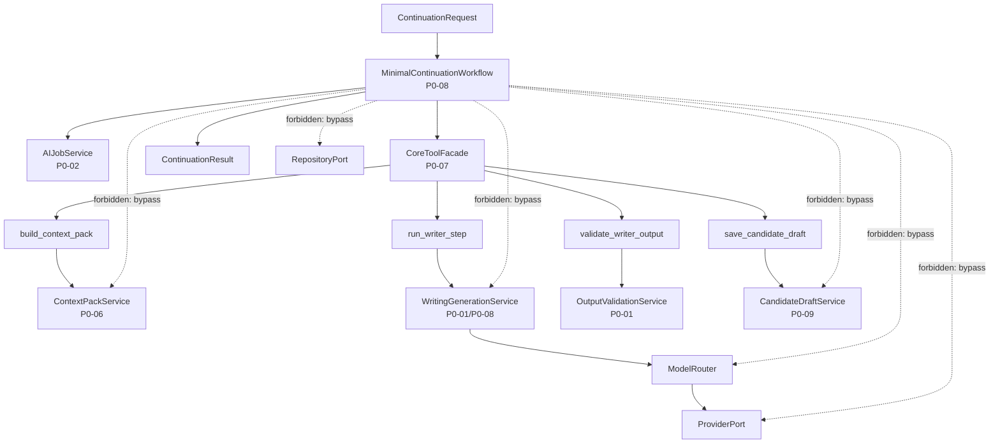

# InkTrace V2.0-P0-08 MinimalContinuationWorkflow 详细设计

版本：v2.0-p0-detail-08  
状态：P0 模块级详细设计  
依据文档：

- `docs/01_requirements/InkTrace-V2.0-需求规格说明书.md`
- `docs/07_overview/InkTrace-V2.0-概要设计说明书.md`
- `docs/02_architecture/InkTrace-V2.0-架构设计说明书.md`
- `docs/03_design/InkTrace-V2.0-P0-详细设计总纲.md`
- `docs/03_design/InkTrace-V2.0-P0-01-AI基础设施详细设计.md`
- `docs/03_design/InkTrace-V2.0-P0-02-AIJobSystem详细设计.md`
- `docs/03_design/InkTrace-V2.0-P0-03-初始化流程详细设计.md`
- `docs/03_design/InkTrace-V2.0-P0-04-StoryMemory与StoryState详细设计.md`
- `docs/03_design/InkTrace-V2.0-P0-05-VectorRecall详细设计.md`
- `docs/03_design/InkTrace-V2.0-P0-06-ContextPack详细设计.md`
- `docs/03_design/InkTrace-V2.0-P0-07-ToolFacade与权限详细设计.md`

---

## 一、文档定位与设计范围

### 1.1 文档定位

本文档是 InkTrace V2.0-P0 的第八个模块级详细设计文档，仅覆盖 P0 MinimalContinuationWorkflow。

P0-08 的核心目标是定义最小正式续写工作流，包括从 ContinuationRequest 到 WritingTask 创建、ContextPack 构建、Writer 调用、输出校验、CandidateDraft 保存的完整编排流程，以及与 AIJobSystem、ToolFacade、ContextPack、Quick Trial 的交互边界。

本文档不替代 P0-09 CandidateDraft 与 HumanReviewGate 详细设计，不写代码、不修改源码、不生成数据库迁移、不拆 Task、不进入开发计划。

### 1.2 设计范围

本模块覆盖：

- MinimalContinuationWorkflow。
- WritingTask。
- ContinuationRequest。
- ContinuationResult。
- WorkflowExecutionContext。
- WorkflowStep。
- WorkflowState。
- Workflow 与 AIJobSystem 的关系。
- Workflow 与 ToolFacade 的关系。
- Workflow 与 ContextPack 的关系。
- Workflow 与 WritingGenerationService 的关系。
- Workflow 与 OutputValidationService 的关系。
- Workflow 与 CandidateDraft / HumanReviewGate 的边界。
- Workflow 与 Quick Trial 的边界。
- Writer Prompt 组装边界。
- Provider / ModelRouter 调用边界。
- retry / cancel / resume 行为。
- blocked / degraded / ready 的处理。
- 错误处理与降级。
- 安全、隐私与日志。

### 1.3 本文档不覆盖

P0-08 不覆盖：

- CandidateDraft 完整状态与 HumanReviewGate 详细流程（P0-09）。
- AIReview 详细设计（P0-10）。
- 完整 Agent Runtime（P1）。
- AgentSession / AgentStep / AgentObservation / AgentTrace（P1）。
- 五 Agent Workflow（P1）。
- 自动连续续写多轮队列（P1）。
- 完整 AI Suggestion / Conflict Guard（P1）。
- 完整 Story Memory Revision（P1）。
- 复杂 Knowledge Graph（P2）。
- Citation Link（P2）。
- @ 标签引用系统（P2）。
- 复杂多路召回融合（P2）。
- 成本看板（P2）。
- 分析看板（P2）。

---

## 二、P0 MinimalContinuationWorkflow 目标

### 2.1 核心定位

MinimalContinuationWorkflow 是 P0 正式续写的最小编排流程。

它不是：

- 完整 Agent Workflow。
- 五 Agent Workflow。
- 自动连续续写队列。
- 第二套业务系统。

它是：

- P0 单章正式续写的受控流程编排。
- AIJobSystem 驱动的、通过 ToolFacade 调用 Application Service 的编排流程。
- 从 Request 到 CandidateDraft 的最小路径。

### 2.2 目标

1. 定义 P0 最小正式续写编排步骤。
2. 确保所有 AI 工具调用通过 ToolFacade。
3. 确保 ContextPack blocked 时停止 Writer 调用。
4. 确保 run_writer_step 输出必须经过 validate_writer_output。
5. 确保 validate_writer_output 通过后才 save_candidate_draft。
6. 确保 save_candidate_draft 只写候选稿，不写正式正文。
7. 确保 retry / cancel / resume 行为受控。
8. 确保 Quick Trial 不创建正式 Job 不保存正式 CandidateDraft。
9. 确保 Workflow 错误不影响 V1.1。

---

## 三、模块边界与不做事项

### 3.1 P0 做什么

P0-08 负责：

- 定义 MinimalContinuationWorkflow 编排流程。
- 定义 WritingTask / ContinuationRequest / ContinuationResult。
- 定义 WorkflowExecutionContext。
- 定义 check_context_pack_status 对 blocked / degraded / ready 的处理。
- 定义 run_writer_step 调用边界与输出处理。
- 定义 OutputValidation 与 retry 边界。
- 定义 CandidateDraft 保存边界与幂等要求。
- 定义 Quick Trial 工作流边界。
- 定义 cancel / retry / resume 行为。
- 定义 Workflow 级别的错误处理。

### 3.2 P0 不做什么

P0-08 不做：

- 不替代 P0-09 CandidateDraft / HumanReviewGate。
- 不替代 P0-06 ContextPackService。
- 不替代 P0-07 ToolFacade。
- 不替代 AIJobSystem 状态机。
- 不直接调用 Provider SDK。
- 不直接访问 ModelRouter。
- 不直接访问 RepositoryPort / VectorStorePort / EmbeddingProviderPort。
- 不实现完整 Agent Runtime。
- 不实现 AgentSession / AgentStep / AgentObservation / AgentTrace。
- 不实现五 Agent Workflow。
- 不实现自动连续续写队列。
- 不实现复杂 prompt chain。
- 不实现多 Agent prompt routing。

### 3.3 禁止行为

- Workflow 不得绕过 ToolFacade 调用 Application Service。
- Workflow 不得直接调用 WritingGenerationService。
- Workflow 不得直接调用 ModelRouter / Provider SDK。
- Workflow 不得直接访问 RepositoryPort / VectorStorePort / EmbeddingProviderPort。
- Workflow 不得直接写正式正文。
- Workflow 不得接受 CandidateDraft（属于 P0-09）。
- Workflow 不得伪造用户确认。
- Workflow 不得绕过 HumanReviewGate。
- Workflow 不得绕过 V1.1 Local-First 保存链路。
- Workflow 不得在 ContextPack blocked 时调用 run_writer_step。
- Workflow 不得无限 retry。
- 普通日志不得记录完整正文、完整 Prompt、完整 ContextPack、完整 CandidateDraft、完整 user_instruction、API Key。

---

## 四、总体架构

### 4.1 模块关系说明

MinimalContinuationWorkflow 位于 Core Application 层，是 P0 正式续写的最小编排流程。

关系：

- ContinuationRequest 触发 Workflow 启动。
- Workflow 调用 AIJobService 创建 AIJob / AIJobStep。
- Workflow 通过 ToolFacade 调用 build_context_pack。
- Workflow 通过 ToolFacade 调用 run_writer_step。
- Workflow 通过 ToolFacade 调用 validate_writer_output。
- Workflow 通过 ToolFacade 调用 save_candidate_draft。
- ToolFacade 内部映射到 ContextPackService / WritingGenerationService / OutputValidationService / CandidateDraftService。
- WritingGenerationService 通过 ModelRouter 调用 Provider。
- Workflow 最终返回 ContinuationResult。

### 4.2 模块关系图



### 4.3 与相邻模块的边界

| 模块 | P0-08 关系 | 边界 |
|---|---|---|
| P0-01 AI Infrastructure | 间接调用 | Workflow 通过 run_writer_step 间接使用 Provider / ModelRouter，不直接调用 |
| P0-02 AIJobSystem | 调用 | Workflow 调用 AIJobService 创建 Job 和 Step，但不替代状态机 |
| P0-06 ContextPack | 受控调用 | Workflow 通过 ToolFacade 调用 build_context_pack，不直接调用 ContextPackService |
| P0-07 ToolFacade | 受控调用 | Workflow 所有 AI 工具调用必须通过 ToolFacade |
| P0-09 CandidateDraft / HumanReviewGate | 下游 | save_candidate_draft 只写候选稿，不接受候选稿 |

### 4.4 禁止调用路径

- Workflow → WritingGenerationService 直接调用（必须通过 ToolFacade）。
- Workflow → ContextPackService 直接调用（必须通过 ToolFacade）。
- Workflow → ModelRouter / Provider SDK 直接调用（禁止）。
- Workflow → RepositoryPort / VectorStorePort / EmbeddingProviderPort（禁止）。
- Workflow → accept_candidate_draft / apply_candidate_to_draft（禁止，属于 P0-09）。
- ToolFacade → Formal Chapter Write（禁止）。

---

## 五、WritingTask 设计

### 5.1 字段方向

| 字段 | 说明 | P0 必须 |
|---|---|---|
| writing_task_id | WritingTask 唯一 ID | 是 |
| work_id | 作品 ID | 是 |
| target_chapter_id | 目标章节 ID | 是 |
| target_chapter_order | 目标章节顺序号 | 是 |
| continuation_mode | continue_chapter / expand_scene / rewrite_selection | 是 |
| user_instruction | 用户续写指令 | 是 |
| current_selection | 当前选区文本，可选 | 可选 |
| current_chapter_ref | 当前章节引用 | 是 |
| model_role | 模型角色，默认 writer | 是 |
| max_context_tokens | 上下文 token 预算 | 是 |
| max_output_tokens | 输出 token 上限 | 是 |
| style_constraints | 风格约束，可选 | 可选 |
| request_id | 请求 ID | 是 |
| trace_id | Trace ID | 是 |
| created_at | 创建时间 | 是 |

### 5.2 continuation_mode 规则

continuation_mode 继承 P0-06 定义：

| 模式 | 含义 | ContextPack 影响 |
|---|---|---|
| continue_chapter | 续写当前章节 | 正常构建上下文 |
| expand_scene | 扩写当前场景 | 正常构建上下文 |
| rewrite_selection | 重写选中段落 | 包含 current_selection 作为输入上下文 |

规则：

- continuation_mode 为空时按 continue_chapter 处理。
- continuation_mode 未知时 ContextPack degraded，使用 continue_chapter 的保守策略。
- 不同 continuation_mode 对 ContextPack 的影响由 P0-06 定义，P0-08 不重新定义。

### 5.3 WritingTask 边界

- WritingTask 不等于 CandidateDraft。
- WritingTask 是 Workflow 的输入，不是输出。
- WritingTask 不写正式正文。
- WritingTask 不进入 StoryMemory / StoryState。
- WritingTask 可以作为 ContextPackBuildRequest 的输入引用。
- 普通日志不得记录完整 user_instruction / current_selection / current_chapter_text。

---

## 六、ContinuationRequest / ContinuationResult 设计

### 6.1 ContinuationRequest

| 字段 | 说明 | P0 必须 |
|---|---|---|
| work_id | 作品 ID | 是 |
| target_chapter_id | 目标章节 ID | 是 |
| target_chapter_order | 目标章节顺序号 | 是 |
| user_instruction | 用户续写指令 | 是 |
| continuation_mode | continue_chapter / expand_scene / rewrite_selection | 是 |
| current_selection | 当前选区文本，可选 | 可选 |
| max_context_tokens | 上下文 token 预算 | 是 |
| max_output_tokens | 输出 token 上限 | 是 |
| allow_degraded | 是否允许 degraded 下续写，默认 true | 是 |
| is_quick_trial | 是否 Quick Trial，默认 false | 是 |
| request_id | 请求 ID | 是 |
| trace_id | Trace ID | 是 |

### 6.2 ContinuationResult

| 字段 | 说明 | P0 必须 |
|---|---|---|
| workflow_id | Workflow 实例 ID | 是 |
| job_id | AIJob ID，可选 | 可选 |
| writing_task_id | WritingTask ID | 是 |
| context_pack_id | ContextPack ID，可选 | 可选 |
| candidate_draft_id | CandidateDraft ID，可选 | 可选 |
| status | Workflow 执行状态 | 是 |
| warnings | warning 列表 | 是 |
| error | 错误信息，可选 | 可选 |
| request_id | 请求 ID | 是 |
| trace_id | Trace ID | 是 |
| created_at | 创建时间 | 是 |
| finished_at | 完成时间，可选 | 可选 |

### 6.3 status 枚举

| 状态 | 含义 |
|---|---|
| completed_with_candidate | 候选稿已生成并保存，不代表正式正文已更新 |
| degraded_completed | 在 degraded ContextPack 下生成候选稿 |
| blocked | 未调用 Writer（通常因 ContextPack blocked） |
| failed | Workflow 执行失败，未生成候选稿 |
| cancelled | Workflow 被取消 |
| validation_failed | 模型输出校验失败且不可继续重试 |
| candidate_save_failed | 候选稿保存失败，不写正式正文 |

### 6.4 规则

- completed_with_candidate 表示候选稿已生成并保存，不代表正式正文已更新。
- degraded_completed 表示在 degraded ContextPack 下生成候选稿。
- blocked 表示未调用 Writer，通常因 ContextPack blocked 或 initialization_not_completed。
- validation_failed 表示模型输出校验失败且不可继续重试。
- candidate_save_failed 表示候选稿保存失败，不写正式正文。
- ContinuationResult 不等于 CandidateDraft。
- ContinuationResult 不等于正式正文保存结果。

---

## 七、WorkflowExecutionContext 设计

### 7.1 字段方向

| 字段 | 说明 | P0 必须 |
|---|---|---|
| workflow_id | Workflow 实例 ID | 是 |
| work_id | 作品 ID | 是 |
| job_id | AIJob ID | 是 |
| current_step_id | 当前 Step ID | 是 |
| writing_task_id | WritingTask ID | 是 |
| request_id | 请求 ID | 是 |
| trace_id | Trace ID | 是 |
| caller_type | workflow / quick_trial | 是 |
| is_quick_trial | 是否 Quick Trial | 是 |
| initialization_status | 当前 initialization_status | 是 |
| context_pack_status | 当前 ContextPack 状态，可选 | 可选 |
| allow_degraded | 是否允许 degraded | 是 |
| created_at | 创建时间 | 是 |

### 7.2 规则

- WorkflowExecutionContext 由 Application / Workflow 创建，AI 模型不得自行伪造。
- WorkflowExecutionContext 用于构造 ToolExecutionContext，ToolFacade 使用 ToolExecutionContext（不是 WorkflowExecutionContext）进行权限校验。
- 正式 Workflow 的 caller_type = workflow，is_quick_trial = false。
- Quick Trial 的 caller_type = quick_trial，is_quick_trial = true。
- is_quick_trial = true 时 caller_type 必须为 quick_trial；caller_type = quick_trial 时 is_quick_trial 必须为 true。
- WorkflowExecutionContext 不记录完整正文、完整 Prompt、完整 user_instruction、API Key。

---

## 八、Workflow 步骤设计

### 8.1 最小步骤序列

| Step | 调用 Tool / Service | 输入 | 输出 | 失败处理 |
|---|---|---|---|---|
| create_writing_task | 创建 WritingTask 对象 | ContinuationRequest | WritingTask | 返回 failed |
| create_ai_job | AIJobService.create_job | WritingTask | AIJob / AIJobStep | 返回 failed |
| build_context_pack | ToolFacade → build_context_pack | WorkflowExecutionContext + WritingTask | ContextPackSnapshot 引用 | 降级或 blocked |
| check_context_pack_status | 读取 ContextPack status | ContextPackSnapshot | ready / degraded / blocked | blocked 时停止 |
| run_writer_step | ToolFacade → run_writer_step | WorkflowExecutionContext + ContextPackSnapshot | WritingGenerationResult | 按 P0-01 retry 或 failed |
| validate_writer_output | ToolFacade → validate_writer_output | WritingGenerationResult | ValidationResult | 按 P0-01 schema retry |
| save_candidate_draft | ToolFacade → save_candidate_draft | Validated 输出 + idempotency_key | CandidateDraft 引用 | failed 但不写正式正文 |
| finalize_workflow_result | 构造 ContinuationResult | 各步骤输出 | ContinuationResult | 返回错误状态 |

### 8.2 步骤详情

#### 8.2.1 create_writing_task

基于 ContinuationRequest 创建 WritingTask：

- 根据 work_id / target_chapter_id 确定 WritingTask 参数。
- continuation_mode 为空时按 continue_chapter 处理。
- 创建完成后进入下一步。

#### 8.2.2 create_ai_job

调用 AIJobService 创建 AIJob 和 AIJobStep：

- 创建 continuation Job，包含 build_context_pack / run_writer_step / validate_writer_output / save_candidate_draft 等 Step。
- 如果是 Quick Trial，不创建正式 Job（见第十五章）。
- Job 创建失败时 Workflow 返回 failed。

#### 8.2.3 build_context_pack

通过 ToolFacade 调用 build_context_pack：

- 使用 WorkflowExecutionContext 构造 ToolExecutionContext。
- 传入 WritingTask 相关信息。
- 获取 ContextPackSnapshot 引用和 status。

#### 8.2.4 check_context_pack_status

根据 ContextPack 状态判断是否继续：

- **blocked**：停止 Workflow，ContinuationResult.status = blocked。AIJobStep 可标记为 paused 或 failed，P0 默认规则为 marked failed。
- **degraded**：继续，但必须将 degraded warnings 传递给后续步骤和 ContinuationResult。
- **ready**：继续，无额外 warning。

#### 8.2.5 run_writer_step

通过 ToolFacade 调用 run_writer_step：

- ContextPack blocked 时不得调用此步骤。
- ContextPack degraded 时继续但标记 warning。
- 传递 ContextPackSnapshot 引用或安全 payload 作为输入。
- 输出 WritingGenerationResult（包含候选文本、token 用量等）。

#### 8.2.6 validate_writer_output

通过 ToolFacade 调用 validate_writer_output：

- 校验 WritingGenerationResult。
- 校验成功 → 进入 save_candidate_draft。
- 校验失败且未超过重试上限 → 返回 run_writer_step 重试。
- 校验失败且超过重试上限 → ContinuationResult.status = validation_failed。

#### 8.2.7 save_candidate_draft

通过 ToolFacade 调用 save_candidate_draft：

- 使用 idempotency_key 防止重复创建。
- 只写候选稿，不写正式正文。
- 保存成功 → 记录 candidate_draft_id。
- 保存失败 → ContinuationResult.status = candidate_save_failed。

#### 8.2.8 finalize_workflow_result

构造 ContinuationResult 返回：

- 设置 status、warnings、error。
- 关联 context_pack_id / candidate_draft_id。
- 返回给调用方。

### 8.3 步骤规则

- Workflow 不直接调用 WritingGenerationService。
- Workflow 不直接调用 ModelRouter。
- Workflow 不直接访问 Provider SDK。
- Workflow 不写正式正文。
- Workflow 不跳过 check_context_pack_status。
- Workflow 不跳过 validate_writer_output。
- Workflow 不跳过 save_candidate_draft 直接写正式正文。

---

## 九、与 AIJobSystem 的关系

### 9.1 Job / Step 关系

- MinimalContinuationWorkflow 应创建或关联 AIJob。
- 每个正式续写请求对应一个 continuation Job。
- Job 至少包含以下 step：
  - build_context_pack。
  - run_writer_step。
  - validate_writer_output。
  - save_candidate_draft。
- Job / Step 状态遵守 P0-02 定义。
- Workflow 不绕过 AIJobService 直接写状态。
- ToolFacade 可通过 AIJobService.update_progress 更新进度。

### 9.2 Job 状态与 Workflow 对应

| Job / Step 状态 | Workflow 影响 |
|---|---|
| build_context_pack Step 成功 | 继续到 check_context_pack_status |
| build_context_pack Step failed | Job 可进入 paused 或 failed；Workflow 返回 blocked |
| run_writer_step Step 成功 | 继续到 validate_writer_output |
| run_writer_step Step failed（可重试） | retry，不超过上限 |
| run_writer_step Step failed（不可重试） | Job Step failed，Workflow 返回 failed |
| validate_writer_output Step 成功 | 继续到 save_candidate_draft |
| validate_writer_output Step failed（可重试） | 返回 re-run run_writer_step，总调用上限 3 次 |
| validate_writer_output Step failed（超过上限） | Job Step failed，Workflow 返回 validation_failed |
| save_candidate_draft Step 成功 | Workflow 返回 completed_with_candidate |
| save_candidate_draft Step failed | Job Step failed，Workflow 返回 candidate_save_failed |

### 9.3 retry / cancel / resume 行为

见第十六章。

---

## 十、ContextPack status 处理

### 10.1 规则

- P0-08 继承 P0-06 的全部 ContextPack 结论。
- ContextPack 状态来自 build_context_pack 的构建结果。
- ContextPack status 不是 AIJob.status，也不是 initialization_status。

### 10.2 ContextPack blocked

| 维度 | 规则 |
|---|---|
| Writer 调用 | 禁止 |
| run_writer_step | 不得调用 |
| ContinuationResult.status | blocked |
| AIJobStep | 可标记为 failed（P0 默认）或 paused |
| warnings | 包含 blocked_reason / error_code |
| V1.1 影响 | 不影响 |

### 10.3 ContextPack degraded

| 维度 | 规则 |
|---|---|
| Writer 调用 | 允许 |
| run_writer_step | 可以调用，必须传递 degraded warnings |
| ContinuationResult.status | degraded_completed |
| warnings | 必须包含 degraded_reason |
| UI 展示 | 必须展示 warning |

### 10.4 ContextPack ready

| 维度 | 规则 |
|---|---|
| Writer 调用 | 允许 |
| run_writer_step | 正常调用 |
| ContinuationResult.status | completed_with_candidate |
| warnings | 无额外 degraded warning |

### 10.5 ContextPackSnapshot 与 Prompt 的关系

- ContextPackSnapshot 是 run_writer_step 的输入引用或安全 payload。
- ContextPackSnapshot 不等于 Writer Prompt。
- P0-08 负责最终 Prompt 组装或调用 WritingGenerationService 完成 Prompt 组装。
- P0-08 不持久化完整 Writer Prompt。
- 普通日志不记录完整 Writer Prompt。

---

## 十一、Prompt 组装边界

### 11.1 规则

- P0-08 负责 Writer 调用前的 Prompt 组装边界。
- Prompt 组装可以由 WritingGenerationService 内部完成，Workflow 不直接拼接完整 Prompt 字符串。
- Workflow 传递 Prompt 组装所需的结构化输入（ContextPackSnapshot、user_instruction、WritingTask 等）。
- PromptTemplate 来自 P0-01 AI 基础设施的 PromptRegistry。
- ContextPackSnapshot 是 Prompt 输入来源之一，不是 Prompt 本身。
- user_instruction 是 Prompt 输入来源之一，但普通日志不得完整记录。

### 11.2 Prompt 组装流程

```
Workflow
  → run_writer_step（通过 ToolFacade）
    → ToolExecutionContext（含 ContextPackSnapshot 引用）
    → WritingGenerationService.generate_candidate_text()
      → PromptRegistry 获取 PromptTemplate
      → 使用 ContextPackSnapshot + WritingTask + user_instruction 渲染 Prompt
      → ModelRouter 调用 Provider
      → OutputValidator 校验输出
      → 返回 WritingGenerationResult
```

### 11.3 边界

- run_writer_step 不是 Provider 直连。
- WritingGenerationService 通过 ModelRouter 调用 Provider。
- LLMCallLog / Provider request 记录遵守 P0-01。
- 普通日志不得记录完整 Prompt、完整正文、API Key。
- P0 不做复杂 prompt chain。
- P0 不做多 Agent prompt routing。
- Prompt 渲染失败时不得记录完整 Prompt。

---

## 十二、run_writer_step 与 Writer 调用

### 12.1 映射关系

| 维度 | 说明 |
|---|---|
| Tool 名 | run_writer_step |
| mapped_service | WritingGenerationService |
| mapped_method | generate_candidate_text（方向名） |
| side_effect_level | external_call + candidate_write |
| 是否需要 Human Review | 后续 save_candidate_draft + HumanReviewGate |

### 12.2 规则

- run_writer_step 是 Tool 名，不是 Application Service 方法名。
- generate_candidate_text 是 Application Service 方法名方向，不作为 Tool 名。
- run_writer_step 不是 Provider 直连工具。
- run_writer_step 内部调用 WritingGenerationService.generate_candidate_text()，通过 ModelRouter 调用 Provider。
- run_writer_step 的输出只能成为 CandidateDraft 的输入，不能直接保存正式正文。
- run_writer_step 的调用受 ContextPack status 约束（blocked 时禁止）。
- run_writer_step 执行后必须调用 validate_writer_output。

---

## 十三、OutputValidation 与 retry

### 13.1 规则

- run_writer_step 输出必须经过 validate_writer_output。
- validate_writer_output 通过 ToolFacade 调用 OutputValidationService。
- OutputValidationService 继承 P0-01 输出校验策略。

### 13.2 retry 边界

| 失败类型 | 重试规则 | 上限 |
|---|---|---|
| Provider timeout | 按 P0-01 Provider retry，最多重试 1 次 | 单 Step 总调用 ≤ 3 次 |
| Provider rate_limited | 按 P0-01 Provider retry，最多重试 1 次 | 单 Step 总调用 ≤ 3 次 |
| Provider unavailable | 按 P0-01 Provider retry，最多重试 1 次 | 单 Step 总调用 ≤ 3 次 |
| Provider auth failed | 不 retry | — |
| schema 校验失败 | 最多重试 2 次 | 单 Step 总调用 ≤ 3 次 |
| Tool retry | 受 P0-02 attempt 上限约束 | 单 Step 最多 3 次 Provider 调用 |
| 总调用上限 | Provider retry + schema retry 总调用不超过 3 次 | 3 次 |

### 13.3 总调用上限规则

- 单 AIJobStep 的 Provider 调用总次数上限为 3 次。
- 包含：首次调用 + Provider retry（最多 1 次）+ schema 校验失败后重试回退。
- 超过上限后 AIJobStep.status = failed。
- 超过上限后不得创建 CandidateDraft 或正式数据。
- validation_failed 不写 CandidateDraft。
- validation_failed 不写正式正文。
- validation_failed 不更新 StoryMemory / StoryState / VectorIndex。

---

## 十四、CandidateDraft 保存边界

### 14.1 规则

- save_candidate_draft 只写候选稿。
- CandidateDraft 不属于 confirmed chapters。
- CandidateDraft 不直接进入 StoryMemory / StoryState / VectorIndex / 正式 ContextPack。
- HumanReviewGate 之前的 AI 输出不能影响正式 StoryState。
- accept_candidate_draft / apply_candidate_to_draft 不属于 P0-08，由 P0-09 设计。
- 用户接受 CandidateDraft 后仍需进入 V1.1 Local-First 保存链路。
- Workflow / ToolFacade 不得伪造用户确认。

### 14.2 幂等要求

- save_candidate_draft 必须使用 idempotency_key 或等价去重机制。
- 幂等作用范围：work_id + job_id + step_id + tool_name + idempotency_key。
- 同一作用范围内重复调用 save_candidate_draft：
  - 不得重复创建新的 CandidateDraft。
  - 应返回已有 candidate_id / existing result ref。
  - 或返回 duplicate_request，并附带已有候选稿引用。
- retry / resume 不得重复创建 CandidateDraft。
- 如果 idempotency_key 缺失：save_candidate_draft 仍可执行，但 Workflow 应尽量提供。
- candidate_save_failed 不写正式正文。
- 普通日志不记录完整候选文本。

---

## 十五、Quick Trial 工作流边界

### 15.1 规则

- Quick Trial 可以复用 MinimalContinuationWorkflow 的部分步骤。
- Quick Trial 使用 is_quick_trial = true，caller_type = quick_trial。
- Quick Trial 不创建正式 continuation Job。

### 15.2 P0 默认策略

| 维度 | P0 默认策略 |
|---|---|
| 正式 Job 创建 | Quick Trial 不创建正式 continuation Job |
| 执行记录 | Quick Trial 可创建 transient trial execution 记录，或仅返回内存结果；P0-08 不展开 trial execution 存储 |
| AIJobStep 更新 | Quick Trial 不得更新正式 AIJobStep |
| ContextPack | Quick Trial 可以 build degraded ContextPack |
| run_writer_step | Quick Trial 可以调用，输出标记 context_insufficient / degraded_context |
| validate_writer_output | Quick Trial 可以调用 |
| save_candidate_draft | Quick Trial 默认不保存；只有用户明确"保存为候选稿"时才进入 P0-09 流程 |
| initialization_status | 不改变 |
| StoryMemory / StoryState / VectorIndex | 不更新 |
| 正式续写入口 | 不使可用 |
| HumanReviewGate | 不绕过 |
| stale 状态 | stale 状态下还必须标记 stale_context |

### 15.3 Quick Trial 执行流程

```
Quick Trial Request
  → create_writing_task（同正式流程）
  → 不创建正式 AIJob（或创建 transient trial record）
  → build_context_pack（degraded）
  → check_context_pack_status（degraded 可继续）
  → run_writer_step（标记 context_insufficient / degraded_context）
  → validate_writer_output（同正式流程）
  → 默认不 save_candidate_draft
  → 返回 ContinuationResult（status = degraded_completed）
  → 只有用户"保存为候选稿" → P0-09 流程
```

---

## 十六、cancel / retry / resume 设计

### 16.1 cancel 规则

- cancel 后 Workflow 停止后续 Tool 调用。
- cancel 后迟到 ToolResult 不得推进 JobStep。
- cancel 后迟到 run_writer_step 结果不得保存为 CandidateDraft。
- cancel 后迟到 ToolResult 最多记录 ignored / stale audit。

### 16.2 retry 规则

- retry run_writer_step 必须遵守 P0-01 / P0-02 上限（单 Step 最多 3 次 Provider 调用）。
- retry validate_writer_output 必须遵守 P0-01 schema retry 上限（最多 2 次）。
- retry save_candidate_draft 必须使用 idempotency_key 防重复。
- Provider retry、Tool retry、schema retry 不得叠加超过总上限。

### 16.3 resume 规则

- resume 时必须检查已有 ContextPackSnapshot / WritingGenerationResult / CandidateDraft。
- resume 不得重复创建 CandidateDraft。
- resume 不得重复调用 Provider，除非前一次没有有效结果或已明确作废。
- Workflow 失败后再次启动，必须以新的 request_id / trace_id 或明确复用策略处理。

### 16.4 不做事项

- P0 不做复杂长期 Workflow 持久化。
- P0 不做自动连续重试队列。

---

## 十七、错误处理与降级

### 17.1 错误场景表

| 场景 | error_code | P0 行为 | retry | 对 Workflow 的影响 |
|---|---|---|---|---|
| 初始化未完成 | initialization_not_completed | blocked | 否 | ContinuationResult.status = blocked |
| ContextPack blocked | context_pack_blocked | 停止，不调用 run_writer_step | 否 | ContinuationResult.status = blocked |
| ContextPack degraded | context_pack_degraded_warning | 继续，传递 warning | 否 | ContinuationResult.status = degraded_completed |
| build_context_pack 失败 | build_context_pack_failed | failed | 按具体错误 | ContinuationResult.status = blocked / failed |
| run_writer_step 失败 | run_writer_step_failed | 按 P0-01 retry 或 failed | 是（受上限） | 可 retry 或 failed |
| Provider timeout | provider_timeout | 按 P0-01 retry，最多 1 次 | 是 | 重试或 failed |
| Provider auth failed | provider_auth_failed | failed | 否 | ContinuationResult.status = failed |
| Provider rate limited | provider_rate_limited | 按 P0-01 retry，最多 1 次 | 是 | 重试或 failed |
| Provider unavailable | provider_unavailable | 按 P0-01 retry，最多 1 次 | 是 | 重试或 failed |
| 输出校验失败 | output_validation_failed | schema retry，最多 2 次 | 是 | 重试或 validation_failed |
| 输出校验重试耗尽 | output_validation_retry_exhausted | failed，不写候选稿 | 否 | ContinuationResult.status = validation_failed |
| 候选稿保存失败 | candidate_save_failed | failed，不写正式正文 | 视错误类型 | ContinuationResult.status = candidate_save_failed |
| 幂等重复请求 | duplicate_request | 返回已有 candidate_id | 否 | 正常，已有候选稿引用 |
| 幂等 key 冲突 | idempotency_conflict | 拒绝执行 | 否 | ContinuationResult.status = failed |
| Job 已取消 | job_cancelled | 停止后续 Tool 调用 | 否 | ContinuationResult.status = cancelled |
| JobStep 非 running | job_step_not_running | 拒绝调用 | 否 | ContinuationResult.status = failed |
| 迟到 ToolResult | stale_tool_result | 忽略，不推进 JobStep | 否 | 不影响 |
| audit_intent 写入失败 | audit_intent_failed | blocked，不执行副作用 | 否 | ContinuationResult.status = failed |
| audit_result 写入失败 | audit_result_failed | 不回滚业务，记录 warning | 否 | ContinuationResult.status 正常带 warning |
| PromptTemplate 缺失 | prompt_template_missing | failed | 否 | ContinuationResult.status = failed |
| Prompt 渲染失败 | prompt_render_failed | failed | 否 | ContinuationResult.status = failed |
| Tool 权限不足 | tool_permission_denied | blocked | 否 | ContinuationResult.status = blocked |
| Tool 参数非法 | invalid_tool_arguments | failed | 否 | ContinuationResult.status = failed |
| dry_run 不支持 | dry_run_not_supported | skipped / blocked | 否 | 不执行副作用 |

### 17.2 错误隔离原则

- Workflow 错误不影响 V1.1 写作、保存、导入、导出。
- Workflow 错误不得写正式正文。
- Workflow 错误不得覆盖用户原始大纲。
- Workflow 错误不得更新 StoryMemory / StoryState / VectorIndex。
- Workflow blocked 不等于正式正文失败。
- CandidateDraft 保存失败不写正式正文。
- Provider / validation / save 失败都必须返回安全错误。
- 普通日志不得记录完整正文、完整 Prompt、完整 CandidateDraft、API Key。

---

## 十八、安全、隐私与日志

### 18.1 普通日志边界

普通日志不得记录：

- 完整正文。
- 完整 Prompt。
- 完整 ContextPack。
- 完整 CandidateDraft。
- 完整 user_instruction。
- API Key。

### 18.2 Workflow 日志

Workflow 日志只记录：

- workflow_id。
- job_id。
- step_id。
- tool_name。
- caller_type。
- status。
- error_code。
- duration。
- safe refs（candidate_draft_id、context_pack_id 等，不包含完整内容）。

### 18.3 关联日志

- LLMCallLog 遵守 P0-01 AI 基础设施日志规则。
- ToolAuditLog 遵守 P0-07 ToolFacade 日志规则（不记录完整正文、完整 Prompt、完整 CandidateDraft、API Key）。
- CandidateDraft 内容不进入普通日志。
- Prompt 渲染失败时不得记录完整 Prompt。
- Provider 错误不得泄露 API Key。

### 18.4 资产保护

- 清理 Workflow 日志不得删除正式正文、用户原始大纲、StoryMemory、StoryState、VectorIndex、CandidateDraft。
- run_writer_step 输出在日志中只能记录引用，不记录完整候选文本。
- Workflow 不持久化完整 Writer Prompt。
- Workflow 不直接访问 RepositoryPort / VectorStorePort / EmbeddingProviderPort。

---

## 十九、P0 验收标准

### 19.1 Workflow 编排验收项

- [ ] Workflow 可以基于 ContinuationRequest 创建 WritingTask。
- [ ] Workflow 可以创建或关联 AIJob。
- [ ] Workflow 通过 ToolFacade 调用 build_context_pack。
- [ ] Workflow 不直接调用 ContextPackService。
- [ ] Workflow 不直接调用 WritingGenerationService。
- [ ] Workflow 不直接调用 ModelRouter / Provider SDK。
- [ ] Workflow 不直接访问 RepositoryPort / VectorStorePort / EmbeddingProviderPort。
- [ ] Workflow 不直接写正式正文。
- [ ] Workflow 不跳过 check_context_pack_status。
- [ ] Workflow 不跳过 validate_writer_output。
- [ ] Workflow 不跳过 save_candidate_draft 直接写正式正文。

### 19.2 ContextPack 处理验收项

- [ ] ContextPack blocked 时 Workflow 不调用 run_writer_step。
- [ ] ContextPack blocked 时 ContinuationResult.status = blocked。
- [ ] ContextPack degraded 时 Workflow 可调用 run_writer_step，并携带 warning。
- [ ] ContextPack degraded 时 ContinuationResult.status = degraded_completed。
- [ ] ContextPack ready 时 Workflow 正常调用 run_writer_step。
- [ ] ContextPackSnapshot 不是 Writer Prompt。
- [ ] P0-08 不持久化完整 Writer Prompt。

### 19.3 Writer 调用与校验验收项

- [ ] run_writer_step 是 Tool 名，不是 Application Service 方法名。
- [ ] run_writer_step 映射到 WritingGenerationService.generate_candidate_text 或等价方法。
- [ ] generate_candidate_text 不是 Tool 名。
- [ ] run_writer_step 不是 Provider 直连。
- [ ] run_writer_step 输出必须经过 validate_writer_output。
- [ ] validate_writer_output 通过 ToolFacade 调用。
- [ ] output_validation_failed 不写 CandidateDraft。
- [ ] schema 校验失败最多重试 2 次。
- [ ] Provider timeout / rate_limited 最多重试 1 次。
- [ ] 单 AIJobStep 总 Provider 调用不超过 3 次。
- [ ] 超过 retry 上限后 AIJobStep.status = failed。
- [ ] 超过 retry 上限后不得创建 CandidateDraft 或正式数据。

### 19.4 CandidateDraft 保存验收项

- [ ] save_candidate_draft 只写候选稿。
- [ ] CandidateDraft 不属于 confirmed chapters。
- [ ] validate_writer_output 成功后才可 save_candidate_draft。
- [ ] 未接受 CandidateDraft 不进入 StoryMemory / StoryState / VectorIndex / 正式 ContextPack。
- [ ] Workflow / ToolFacade 不伪造用户确认。
- [ ] accept_candidate_draft / apply_candidate_to_draft 不属于 P0-08。
- [ ] save_candidate_draft 使用 idempotency_key 或等价去重机制。
- [ ] retry / resume 不重复创建 CandidateDraft。
- [ ] 重复 save_candidate_draft 返回已有 candidate_id 或 duplicate_request。
- [ ] candidate_save_failed 不写正式正文。

### 19.5 cancel / retry / resume 验收项

- [ ] cancel 后迟到 ToolResult 不推进 JobStep。
- [ ] cancel 后迟到 run_writer_step 结果不保存 CandidateDraft。
- [ ] Tool retry 不超过 P0-01 / P0-02 边界。
- [ ] OutputValidation retry 不超过 P0-01 边界。
- [ ] resume 不重复创建 CandidateDraft。
- [ ] resume 不重复调用 Provider，除非前一次无有效结果。

### 19.6 Quick Trial 验收项

- [ ] Quick Trial 不创建正式 continuation Job。
- [ ] Quick Trial 不更新正式 AIJobStep。
- [ ] Quick Trial 不保存正式 CandidateDraft，除非用户明确保存为候选稿并进入 P0-09 流程。
- [ ] Quick Trial 不改变 initialization_status。
- [ ] Quick Trial 不更新 StoryMemory / StoryState / VectorIndex。
- [ ] Quick Trial 不使正式续写入口可用。
- [ ] Quick Trial 输出标记 context_insufficient / degraded_context。
- [ ] stale 状态下 Quick Trial 输出标记 stale_context。

### 19.7 安全与日志验收项

- [ ] 普通日志不记录完整正文、完整 Prompt、完整 ContextPack、完整 CandidateDraft、API Key。
- [ ] Workflow 错误不影响 V1.1 写作、保存、导入、导出。
- [ ] Workflow 错误不得写正式正文。
- [ ] Workflow 错误不得覆盖用户原始大纲。
- [ ] Workflow 错误不得更新 StoryMemory / StoryState / VectorIndex。
- [ ] Prompt 渲染失败时不得记录完整 Prompt。
- [ ] Provider 错误不得泄露 API Key。
- [ ] 清理 Workflow 日志不得删除正式正文、用户原始大纲、StoryMemory、StoryState、VectorIndex、CandidateDraft。

### 19.8 P0 不做事项验收项

- [ ] P0 不实现完整 Agent Runtime。
- [ ] P0 不实现 AgentSession / AgentStep / AgentObservation / AgentTrace。
- [ ] P0 不实现五 Agent Workflow。
- [ ] P0 不实现自动连续续写队列。
- [ ] P0 不实现 Citation Link / @ 标签系统。
- [ ] P0 不实现复杂 prompt chain。
- [ ] P0 不实现多 Agent prompt routing。
