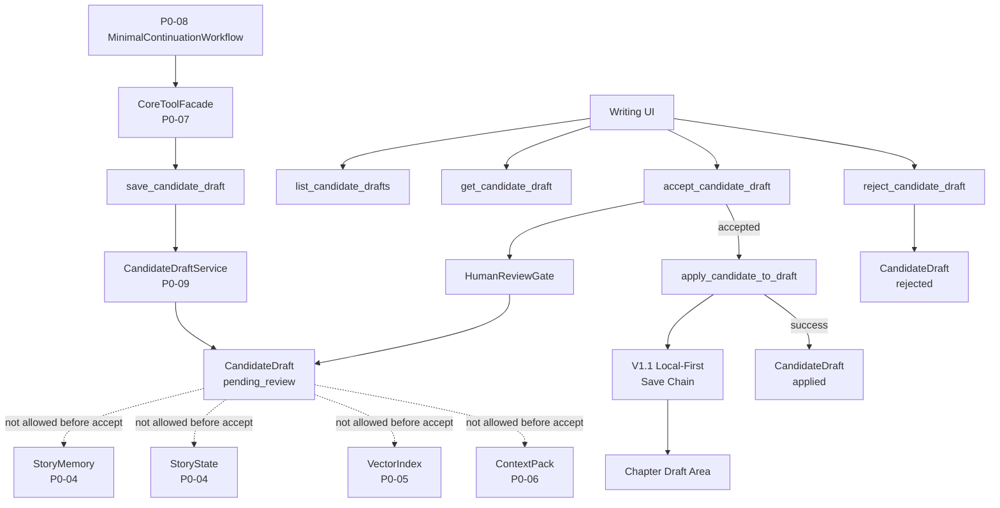
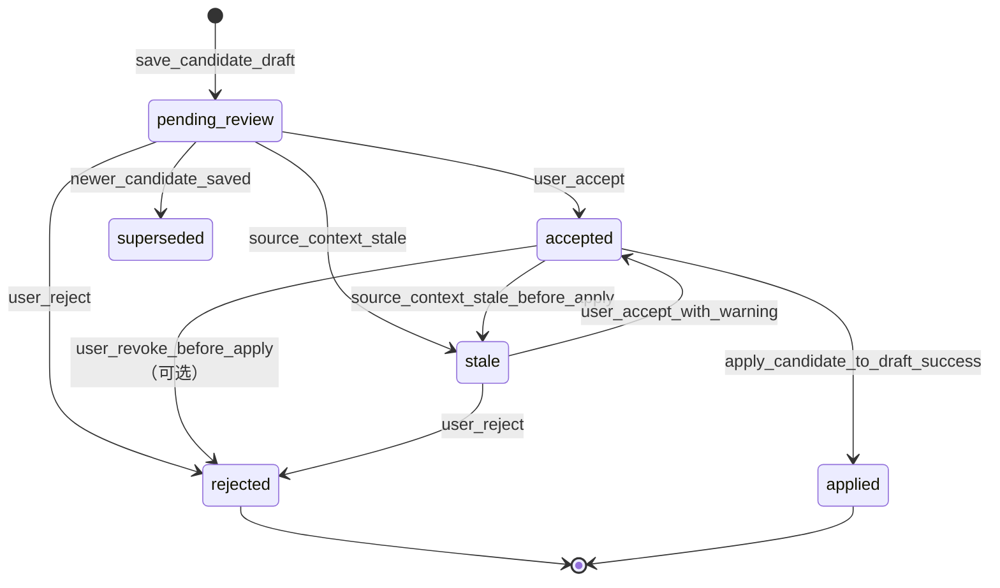

# InkTrace V2.0-P0-09 CandidateDraft 与 HumanReviewGate 详细设计

版本：v2.0-p0-detail-09  
状态：P0 模块级详细设计  
依据文档：

- `docs/01_requirements/InkTrace-V2.0-需求规格说明书.md`
- `docs/07_overview/InkTrace-V2.0-概要设计说明书.md`
- `docs/02_architecture/InkTrace-V2.0-架构设计说明书.md`
- `docs/03_design/InkTrace-V2.0-P0-详细设计总纲.md`
- `docs/03_design/InkTrace-V2.0-P0-01-AI基础设施详细设计.md`
- `docs/03_design/InkTrace-V2.0-P0-02-AIJobSystem详细设计.md`
- `docs/03_design/InkTrace-V2.0-P0-03-初始化流程详细设计.md`
- `docs/03_design/InkTrace-V2.0-P0-04-StoryMemory与StoryState详细设计.md`
- `docs/03_design/InkTrace-V2.0-P0-05-VectorRecall详细设计.md`
- `docs/03_design/InkTrace-V2.0-P0-06-ContextPack详细设计.md`
- `docs/03_design/InkTrace-V2.0-P0-07-ToolFacade与权限详细设计.md`
- `docs/03_design/InkTrace-V2.0-P0-08-MinimalContinuationWorkflow详细设计.md`

---

## 一、文档定位与设计范围

### 1.1 文档定位

本文档是 InkTrace V2.0-P0 的第九个模块级详细设计文档，仅覆盖 P0 CandidateDraft 与 HumanReviewGate。

P0-09 的核心目标是定义 AI 续写候选稿的保存、展示、用户确认、拒绝、应用边界。CandidateDraft 是 AI 生成结果的候选稿，不是正式正文。HumanReviewGate 是 AI 输出进入正式草稿区前的人工确认门。用户接受 CandidateDraft 后，仍必须进入 V1.1 Local-First 正文保存链路。

本文档不写代码、不修改源码、不生成数据库迁移、不拆 Task、不进入开发计划。

### 1.2 设计范围

本模块覆盖：

- CandidateDraft 数据模型。
- CandidateDraftStatus 状态机。
- CandidateDraftVersion，可选。
- CandidateDraftSource。
- CandidateDraftReviewDecision。
- CandidateDraftService。
- HumanReviewGate。
- CandidateDraftRepositoryPort。
- CandidateDraftAuditLog。
- save_candidate_draft。
- list_candidate_drafts。
- get_candidate_draft。
- reject_candidate_draft。
- accept_candidate_draft。
- apply_candidate_to_draft。
- CandidateDraft 与正式章节草稿区的边界。
- CandidateDraft 与 V1.1 Local-First 保存链路的边界。
- CandidateDraft 与 StoryMemory / StoryState / VectorIndex 的边界。
- CandidateDraft 与 ContextPack 的边界。
- CandidateDraft 与 Quick Trial 的边界。
- CandidateDraft 的幂等、防重复、版本与状态流转。
- HumanReviewGate 的用户确认边界。
- 错误处理。
- 安全、隐私与日志。

### 1.3 本文档不覆盖

P0-09 不覆盖：

- MinimalContinuationWorkflow 完整编排（P0-08）。
- AIReview 详细设计（P0-10）。
- API 与前端交互完整设计（P0-11）。
- 完整 Agent Runtime（P1）。
- AgentSession / AgentStep / AgentObservation / AgentTrace（P1）。
- 五 Agent Workflow（P1）。
- 完整 AI Suggestion / Conflict Guard（P1）。
- 完整 Story Memory Revision（P1）。
- 复杂 Knowledge Graph（P2）。
- Citation Link（P2）。
- @ 标签引用系统（P2）。
- 复杂多路召回融合（P2）。
- 自动连续续写队列（P1）。
- 成本看板（P2）。
- 分析看板（P2）。
- Provider SDK 适配实现。
- 具体 API DTO / 数据库表结构。
- UI 交互组件详细设计。
- V1.1 正文编辑、保存、同步的具体实现。

---

## 二、P0 CandidateDraft 与 HumanReviewGate 目标

### 2.1 核心目标

1. 定义 AI 生成候选稿的受控保存、展示、确认、拒绝、应用边界。
2. 定义 HumanReviewGate 作为 AI 输出进入正式草稿区前的人工确认门。
3. 确保 CandidateDraft 不直接进入正式正文。
4. 确保 CandidateDraft 不直接进入 StoryMemory / StoryState / VectorIndex / 正式 ContextPack。
5. 确保用户确认 CandidateDraft 后，仍必须进入 V1.1 Local-First 正文保存链路。
6. 确保 Workflow / ToolFacade / Agent / Model 不得伪造用户确认。
7. 确保 Quick Trial 输出默认不是 CandidateDraft。
8. 确保 save_candidate_draft 支持幂等。

### 2.2 核心边界

必须明确：

- CandidateDraft 是 AI 生成结果的候选稿，不是正式正文。
- CandidateDraft 不属于 confirmed chapters。
- CandidateDraft 不直接进入 StoryMemory。
- CandidateDraft 不直接进入 StoryState。
- CandidateDraft 不直接进入 VectorIndex。
- CandidateDraft 不直接进入正式 ContextPack。
- CandidateDraft 不直接更新初始化状态。
- CandidateDraft 不直接更新章节正文。
- HumanReviewGate 是 AI 输出进入正式草稿区前的人工确认门。
- 用户接受 CandidateDraft 后，仍必须进入 V1.1 Local-First 正文保存链路。
- ToolFacade / Workflow / Agent / Model 不得伪造用户确认。
- Quick Trial 输出默认不是 CandidateDraft。
- Quick Trial 输出只有用户明确"保存为候选稿"时才进入 CandidateDraft 流程。
- P0-09 不负责重新分析 StoryMemory / StoryState。
- P0-09 不负责自动 reindex。
- CandidateDraft 被接受后，后续 reanalysis / reindex 由 P0-03 / P0-04 / P0-05 的流程或后续设计处理。

---

## 三、模块边界与不做事项

### 3.1 P0 做什么

P0-09 负责：

- 定义 CandidateDraft 数据模型。
- 定义 CandidateDraft 状态机。
- 定义 CandidateDraftService 核心方法。
- 定义 HumanReviewGate 确认边界。
- 定义 accept_candidate_draft / reject_candidate_draft / apply_candidate_to_draft。
- 定义 save_candidate_draft 的幂等规则。
- 定义 CandidateDraft 与正式章节草稿区的边界。
- 定义 CandidateDraft 与 V1.1 Local-First 保存链路的边界。
- 定义 CandidateDraft 与 StoryMemory / StoryState / VectorIndex / ContextPack 的边界。
- 定义 CandidateDraft 与 Quick Trial 的边界。

### 3.2 P0 不做什么

P0-09 不做：

- 不重新分析 StoryMemory / StoryState。
- 不自动 reindex。
- 不实现完整版本管理（P1 / P2）。
- 不实现复杂比较 Diff（P1）。
- 不实现自动批量接受 / 拒绝（P1）。
- 不实现 AIReview（P0-10）。
- 不实现完整 Agent Runtime。
- 不实现五 Agent Workflow。
- 不实现 Citation Link。
- 不实现 @ 标签引用系统。
- 不实现复杂多路召回融合。
- 不实现自动连续续写队列。
- 不写正式正文。
- 不更新 StoryMemory / StoryState / VectorIndex。
- 不直接调用 Provider SDK。

### 3.3 禁止行为

- CandidateDraft 被接受前不得进入 confirmed chapters。
- CandidateDraft 被接受前不得影响 StoryMemory / StoryState / VectorIndex。
- CandidateDraft 被接受前不得作为正式 ContextPack 输入。
- ToolFacade / Workflow / Agent / Model 不得伪造用户确认。
- User rejection 后不得自动将同一候选稿标记为 accepted（除非用户重新操作）。
- save_candidate_draft 不得写正式正文。
- apply_candidate_to_draft 不得绕过 V1.1 Local-First 保存链路。
- apply_candidate_to_draft 不得直接触发 reanalysis / reindex。
- 普通日志不得记录完整候选正文、完整 Prompt、API Key。
- list_candidate_drafts 不得向非授权 caller 暴露 content_text。

---

## 四、总体架构

### 4.1 模块关系说明

CandidateDraftService 位于 Core Application 层，是候选稿的受控管理服务。

关系：

- P0-08 MinimalContinuationWorkflow 通过 ToolFacade 调用 save_candidate_draft。
- save_candidate_draft 创建 CandidateDraft（status = pending_review）。
- Writing UI / API 可以 list_candidate_drafts / get_candidate_draft。
- 用户在 UI 上审查候选稿后，执行 accept 或 reject。
- accept_candidate_draft 将 CandidateDraft 标记 accepted。
- apply_candidate_to_draft 将 accepted 候选稿内容通过 V1.1 Local-First 保存链路写入章节草稿区。
- apply_candidate_to_draft 成功后标记 CandidateDraft 为 applied。
- reject_candidate_draft 标记为 rejected。
- HumanReviewGate 是上述用户确认过程的逻辑封装。

### 4.2 模块关系图



### 4.3 与相邻模块的边界

| 模块 | 关系 | 边界 |
|---|---|---|
| P0-07 ToolFacade | 受控工具门面 | save_candidate_draft 通过 ToolFacade 调用，P0-09 不直接暴露 Tool |
| P0-08 MinimalContinuationWorkflow | 上游 | Workflow 输出 CandidateDraft，后续由 P0-09 处理 |
| V1.1 Local-First | 下游保存链路 | apply_candidate_to_draft 通过 V1.1 保存链路写入正式正文，不直接写 Repository |
| P0-04 StoryMemory | 禁止直接写入 | CandidateDraft 被接受后不触发自动更新 |
| P0-05 VectorIndex | 禁止直接写入 | CandidateDraft 被接受后不触发自动 reindex |

### 4.4 禁止调用路径

- save_candidate_draft → Formal Chapter Write。
- accept_candidate_draft → StoryMemory / StoryState 直接更新。
- accept_candidate_draft → VectorIndex 直接更新。
- accept_candidate_draft → ContextPack 直接更新。
- apply_candidate_to_draft → StoryMemory / StoryState / VectorIndex 直接更新。
- apply_candidate_to_draft → reanalysis / reindex 自动触发。
- ToolFacade / Workflow → accept_candidate_draft（禁止绕过用户确认）。
- Model / Agent → reject_candidate_draft（禁止 AI 自行拒绝）。

---

## 五、CandidateDraft 数据模型设计

### 5.1 字段方向

| 字段 | 说明 | P0 必须 |
|---|---|---|
| candidate_draft_id | 候选稿唯一 ID | 是 |
| work_id | 作品 ID | 是 |
| target_chapter_id | 目标章节 ID | 是 |
| target_chapter_order | 目标章节顺序 | 是 |
| writing_task_id | WritingTask ID | 是 |
| workflow_id | Workflow 实例 ID | 是 |
| job_id | AIJob ID，可选 | 可选 |
| source | 候选稿来源 | 是 |
| status | 候选稿状态 | 是 |
| content_text 或 content_ref | 候选正文文本或安全引用 | 是 |
| content_summary | 内容摘要，可选 | 可选 |
| model_name | 模型名称，可选 | 可选 |
| provider_name | Provider 名称，可选 | 可选 |
| prompt_template_key | PromptTemplate key，可选 | 可选 |
| context_pack_id | ContextPack ID，可选 | 可选 |
| context_pack_status | 构建时 ContextPack 状态，可选 | 可选 |
| degraded_reasons | degraded 原因列表 | 是 |
| warnings | 警告列表 | 是 |
| validation_status | 校验状态 | 是 |
| validation_errors | 校验错误列表，可选 | 可选 |
| idempotency_key | 幂等 key | 是 |
| idempotency_scope | 幂等作用范围 | 是 |
| created_by | 创建者（workflow / quick_trial / system） | 是 |
| created_at | 创建时间 | 是 |
| updated_at | 更新时间 | 是 |
| reviewed_by | 审核者用户 ID，可选 | 可选 |
| reviewed_at | 审核时间，可选 | 可选 |
| review_decision | 审核决定，可选 | 可选 |
| applied_at | 应用到草稿区时间，可选 | 可选 |
| applied_chapter_id | 应用后的章节 ID，可选 | 可选 |
| apply_result_ref | 应用结果引用，可选 | 可选 |
| stale_status | 候选稿是否 stale，可选 | 可选 |
| stale_reason | stale 原因，可选 | 可选 |
| request_id | 请求 ID | 是 |
| trace_id | Trace ID | 是 |

### 5.2 CandidateDraftSource

| 来源 | 含义 | P0 必须 |
|---|---|---|
| minimal_continuation_workflow | 正式 Workflow 输出 | 是 |
| quick_trial_saved_by_user | 用户从 Quick Trial 保存为候选稿 | 是 |
| retry_resume | 重试或恢复产生的候选稿 | 是 |
| manual_import | 手动导入，可选 | 可选 |

### 5.3 CandidateDraftStatus

| 状态 | 含义 |
|---|---|
| pending_review | 候选稿已保存，等待用户确认 |
| accepted | 用户已接受，但不一定已经写入正式草稿区 |
| rejected | 用户拒绝 |
| applied | 已通过 V1.1 Local-First 保存链路应用到章节草稿区 |
| stale | 候选稿生成依据可能过期，需用户确认是否仍可用 |
| superseded | 被新的候选稿替代，可选 |

规则：

- pending_review 表示候选稿已保存，等待用户确认。
- accepted 表示用户已接受，但不一定已经写入正式草稿区。
- applied 表示已通过 V1.1 Local-First 保存链路应用到章节草稿区。
- rejected 表示用户拒绝。
- stale 表示候选稿生成依据可能过期（如 StoryMemory / StoryState 已被更新）。
- superseded 表示被新的候选稿替代，可选。
- failed 不建议作为常规 CandidateDraft 状态，保存失败应在 Workflow / ToolResult 层表达。

### 5.4 CandidateDraftReviewDecision

| 决定 | 含义 |
|---|---|
| accepted | 用户接受 |
| rejected | 用户拒绝 |
| accepted_with_warning | 用户接受但知晓 warning，仅当 stale 时可选择 |

---

## 六、CandidateDraft 状态机设计

### 6.1 状态流转图



### 6.2 状态流转规则

| 当前状态 | 触发动作 | 目标状态 | 条件 |
|---|---|---|---|
| [*] | save_candidate_draft | pending_review | 保存成功 |
| pending_review | 用户接受 | accepted | 用户确认 |
| pending_review | 用户拒绝 | rejected | 用户拒绝 |
| pending_review | 上下文过期检测 | stale | StoryMemory / StoryState 已变更 |
| pending_review | 同一作用域新候选稿保存 | superseded | 新候选稿 idempotency_scope 重叠 |
| accepted | apply_candidate_to_draft 成功 | applied | V1.1 保存成功 |
| accepted | 用户撤销接受 | rejected | 仅在 applied 前允许，可选 |
| accepted | 上下文过期检测 | stale | StoryMemory / StoryState 已变更 |
| stale | 用户接受（带 warning） | accepted | 用户确认使用过期候选稿 |
| stale | 用户拒绝 | rejected | 用户拒绝过期候选稿 |

### 6.3 状态规则

- 状态转变由 CandidateDraftService 统一管理。
- 不允许跳过 pending_review 直接到 applied。
- 不允许从 rejected 直接到 applied（用户拒绝后需重新生成）。
- stale 状态不自动流转，等待用户决策。
- superseded 状态不自动删除，标记后保留查阅能力。
- failed 不建议作为常规 CandidateDraft 状态。

---

## 七、CandidateDraftVersion 设计（可选）

### 7.1 P0 策略

P0 对 CandidateDraftVersion 的最小策略：

- P0 不要求完整版本管理。
- P0 不支持复杂版本 Diff / 版本对比 UI。
- P0 支持轻量版本链：同一 target_chapter_id 下多个 CandidateDraft 按 created_at 排序。
- P0 不支持版本回退（superseded 不恢复为 pending_review）。
- 如果同一次 Workflow 中 validate_writer_output 失败后重新生成新候选稿，新候选稿可通过 superseded 标记替换旧候选稿。
- P1 / 后续设计可以引入完整版本管理和 Diff 比较。

### 7.2 轻量版本链

规则：

- 同一 work_id + target_chapter_id 下的 CandidateDraft 按 created_at 排序。
- superseded 标记只用于跟踪最新的候选稿。
- 用户可查看 pending_review / accepted / stale 的候选稿列表。
- accepted 后新候选稿仍可继续生成，但不会自动 supersede 已 accepted 的候选稿。
- 如果新候选稿被 accepted，旧 accepted 候选稿变为 superseded。

---

## 八、CandidateDraftService 设计

### 8.1 核心方法

| 方法 | 说明 | 访问入口 |
|---|---|---|
| save_candidate_draft | 保存候选稿 | ToolFacade 受控入口 |
| list_candidate_drafts | 列出候选稿 | 内部 Service 或 API |
| get_candidate_draft | 获取单个候选稿 | 内部 Service 或 API |
| accept_candidate_draft | 用户接受候选稿 | HumanReviewGate |
| reject_candidate_draft | 用户拒绝候选稿 | HumanReviewGate |
| apply_candidate_to_draft | 应用候选稿到正式草稿区 | 内部 Service |
| mark_candidate_stale | 标记候选稿为 stale | 内部 Service |
| get_candidate_draft_by_idempotency | 按幂等 key 查询候选稿 | 内部 Service |

### 8.2 save_candidate_draft

输入：

- work_id。
- target_chapter_id。
- target_chapter_order。
- writing_task_id。
- workflow_id。
- job_id，可选。
- source。
- content_text 或 content_ref。
- content_summary，可选。
- model_name，可选。
- provider_name，可选。
- context_pack_id，可选。
- context_pack_status，可选。
- degraded_reasons。
- warnings。
- validation_status。
- validation_errors，可选。
- idempotency_key。
- idempotency_scope。
- created_by。
- request_id。
- trace_id。

输出：

- candidate_draft_id。
- status = pending_review。

规则：

- 通过 ToolFacade 受控调用。
- 必须使用 idempotency_key 防重复。
- 同一 idempotency_key + idempotency_scope 范围内重复调用返回已有 CandidateDraft 引用。
- content_text 不在普通日志中完整记录。
- 保存后候选稿 status = pending_review。

### 8.3 list_candidate_drafts

输入：

- work_id。
- target_chapter_id，可选。
- status 过滤，可选。
- source 过滤，可选。
- pagination。

输出：

- CandidateDraft 列表（不含 content_text 或只含 content_summary）。

规则：

- 默认不返回完整 content_text。
- 列表只包含安全摘要和 metadata。
- 需要 content_text 的调用方应使用 get_candidate_draft。

### 8.4 get_candidate_draft

输入：

- candidate_draft_id。

输出：

- 完整 CandidateDraft（含 content_text）。

规则：

- 需要 caller 权限校验（至少 work_id 匹配）。
- content_text 不在普通日志中完整记录。

### 8.5 accept_candidate_draft

输入：

- candidate_draft_id。
- user_id。
- review_decision（accepted / accepted_with_warning）。
- request_id。
- trace_id。

输出：

- status = accepted。

规则：

- 调用方必须是用户操作（UI / API），Workflow / ToolFacade 禁止直接调用。
- pending_review 或 stale 状态可接受。
- stale 候选稿接受时 review_decision 应为 accepted_with_warning。
- 接受后不自动触发 apply_candidate_to_draft。
- 接受后不自动触发 reanalysis / reindex。

### 8.6 reject_candidate_draft

输入：

- candidate_draft_id。
- user_id。
- reject_reason，可选。
- request_id。
- trace_id。

输出：

- status = rejected。

规则：

- pending_review、stale、superseded 状态可拒绝。
- 用户拒绝后同一候选稿不可重新接受（除非重新生成）。

### 8.7 apply_candidate_to_draft

输入：

- candidate_draft_id。
- user_id。
- request_id。
- trace_id。

输出：

- applied_chapter_id。
- apply_result_ref。

规则：

- 只有 accepted 状态的 CandidateDraft 可应用。
- 通过 V1.1 Local-First 保存链路写入章节草稿区。
- 不直接写 RepositoryPort。
- 成功后 status = applied。
- 失败时 status 不变（仍为 accepted），返回错误，不写正式正文。
- 应用后不自动触发 reanalysis / reindex。
- 应用后不自动更新 StoryMemory / StoryState / VectorIndex。

### 8.8 mark_candidate_stale

输入：

- candidate_draft_id。
- stale_reason。
- request_id。
- trace_id。

输出：

- status = stale。

规则：

- pending_review 或 accepted 状态的候选稿可标记 stale。
- stale 表示候选稿生成依据可能过期。
- stale 不自动删除候选稿。
- stale 候选稿用户仍可选择接受（带 warning）或拒绝。

---

## 九、与 ToolFacade 的关系

### 9.1 规则

- save_candidate_draft 通过 P0-07 ToolFacade 作为受控工具暴露。
- ToolFacade 中对 save_candidate_draft 的权限控制：
  - workflow：允许。
  - quick_trial：受限（默认不自动保存）。
  - system：允许。
  - user_action：禁止（user_action 不等于用户确认 CandidateDraft）。
- ToolFacade 不得暴露 accept_candidate_draft / apply_candidate_to_draft。
- 用户确认 CandidateDraft 通过 HumanReviewGate 处理，不在 ToolFacade 的工具白名单中。
- ToolFacade 不得绕过 HumanReviewGate。
- save_candidate_draft 通过 ToolFacade 的 audit_intent / audit_result 机制审计：
  - audit_intent 写入失败时 blocked，不执行保存。
  - audit_result 写入失败时不回滚已保存结果，记录 warning 并尝试 fallback。

### 9.2 save_candidate_draft 的 Tool 权限

| 维度 | 值 |
|---|---|
| Tool 名 | save_candidate_draft |
| side_effect_level | candidate_write |
| 是否需要 Human Review | 后续需要 HumanReviewGate |
| workflow 权限 | 允许 |
| quick_trial 权限 | 受限（默认不自动保存） |
| system 权限 | 允许 |
| user_action 权限 | 禁止 |

---

## 十、HumanReviewGate 设计

### 10.1 定位

HumanReviewGate 是 AI 输出进入正式草稿区前的人工确认门。

它不是：

- 系统自动门控。
- ToolFacade 工具。
- Workflow 步骤。

它是：

- 用户主动确认的逻辑封装。
- accept_candidate_draft / reject_candidate_draft 的用户操作边界。
- ToolFacade / Workflow 不得绕过的安全门。

### 10.2 HumanReviewGate 流程

```
用户打开 Writing UI
  → UI 加载列表：list_candidate_drafts（status = pending_review / accepted / stale）
  → UI 展示候选稿摘要（content_summary、degraded_reasons、warnings）
  → 用户选择候选稿查看详情：get_candidate_draft
  → 用户审查完整候选正文

用户操作：
  → 接受候选稿：accept_candidate_draft
    → 如果候选稿有 warning，UI 展示确认风险提示
    → 接受后 status = accepted
    → 用户可手动触发 apply_candidate_to_draft
    → 应用后通过 V1.1 Local-First 保存链路写入章节草稿区

  → 拒绝候选稿：reject_candidate_draft
    → 可选填写拒绝原因
    → 拒绝后 status = rejected
    → 用户可重新执行 Quick Trial 或正式续写

  → 对 stale 候选稿：
    → 接受带 warning：accept_candidate_draft（accepted_with_warning）
    → 拒绝：reject_candidate_draft
```

### 10.3 HumanReviewGate 边界

| 维度 | 规则 |
|---|---|
| 谁可以接受 | 用户（通过 UI / API） |
| 谁可以拒绝 | 用户（通过 UI / API） |
| Workflow 是否可以接受 | 禁止 |
| ToolFacade 是否可以接受 | 禁止 |
| Model / Agent 是否可以接受 | 禁止 |
| 系统是否可以自动接受 | 禁止 |
| 接受后是否自动应用 | 否，用户手动触发或后续流程控制 |
| UI 是否可以跳过 HumanReviewGate | 禁止 |
| stale 候选稿是否可以接受 | 可以，但必须 warning |

### 10.4 UI 展示要求

P0-09 对 UI 的最小要求：

- 必须展示 pending_review 候选稿列表。
- 必须展示 degraded_reasons / warnings。
- 必须展示 content_summary（content_text 可选安全展示）。
- 必须提供 accept / reject 操作入口。
- 接受 stale 候选稿时必须展示 stale_reason 和确认提示。
- 必须展示 accepted 候选稿及其 applied 状态。
- 必须展示 rejected 候选稿及其拒绝原因（如有）。
- UI 不得在用户未确认时自动调用 apply_candidate_to_draft。

---

## 十一、accept_candidate_draft 与 apply_candidate_to_draft

### 11.1 accept_candidate_draft

| 维度 | 规则 |
|---|---|
| 触发 | 用户操作 |
| 前置条件 | CandidateDraft.status = pending_review 或 stale |
| 后置状态 | accepted |
| 副作用 | 不写正式正文；不触发 apply；不触发 reanalysis / reindex |
| 重复操作 | 同一候选稿再次 accept 返回已有 accepted 状态 |
| 审计 | 记录 review_decision、user_id、reviewed_at |

### 11.2 apply_candidate_to_draft

| 维度 | 规则 |
|---|---|
| 触发 | 用户操作 |
| 前置条件 | CandidateDraft.status = accepted |
| 后置状态 | applied |
| 写入目标 | V1.1 Local-First 保存链路 |
| 写入结果 | 章节草稿区 |
| 失败处理 | 不写正式正文；status 不变（仍 accepted）；记录错误 |
| 重复操作 | 同一候选稿再次 apply 返回已有 applied 结果 |
| 审计 | 记录 applied_at、applied_chapter_id |
| reanalysis / reindex | 不自动触发 |

### 11.3 边界

- accept 不等于 apply。
- accept 表示用户认可候选稿内容，但不代表已写入草稿区。
- apply 是实际写入行为。
- 用户可以在 accept 后不 apply，等后续再决定。
- apply 失败时不应丢失 accepted 状态。
- P0-09 不提供自动 apply 策略。
- P0-09 不提供批量 apply。

---

## 十二、与 V1.1 Local-First 保存链路的关系

### 12.1 规则

- apply_candidate_to_draft 必须通过 V1.1 Local-First 保存链路写入正式章节草稿区。
- apply_candidate_to_draft 不直接写 RepositoryPort。
- 写入后的内容与用户手动编写的正文属于同一正文存储。
- 写入后覆盖或合并到 target_chapter 的草稿区，不是直接覆盖 confirmed chapters。
- 用户后续可以在 UI 中继续编辑已应用的候选稿正文。

### 12.2 边界

- V1.1 Local-First 保存链路是正式正文的持久化入口，不属于 P0-09 范围。
- P0-09 不重新定义 V1.1 保存链路。
- P0-09 仅定义调用 V1.1 保存链路的时机和条件。
- CandidateDraft 应用后的正文编辑属于 V1.1 正文编辑功能，不属于 P0-09。

---

## 十三、与 StoryMemory / StoryState / VectorIndex / ContextPack 的关系

### 13.1 规则

- CandidateDraft 被接受前不得进入 StoryMemory / StoryState / VectorIndex / 正式 ContextPack。
- CandidateDraft 被接受后不自动触发 reanalysis / reindex。
- CandidateDraft 被应用后不自动触发 reanalysis / reindex。
- 用户确认 CandidateDraft 是同意将候选稿内容作为章节草稿，不是确认 StoryMemory / StoryState 已更新。
- 后续的 reanalysis（StoryMemory / StoryState 更新）和 reindex（VectorIndex 更新）不属于 P0-09。
- P0-09 可以标记"需要 reanalysis"的候选状态（如 accepted 或 applied），但不触发执行。

### 13.2 P0 最小策略

| 步骤 | 是否触发 reanalysis | 是否触发 reindex |
|---|---|---|
| save_candidate_draft | 否 | 否 |
| accept_candidate_draft | 否 | 否 |
| apply_candidate_to_draft | 否 | 否 |
| CandidateDraft applied 后用户关闭续写 | 否，由后续设计或用户手动触发 | 否 |

---

## 十四、与 Quick Trial 的关系

### 14.1 规则

- Quick Trial 输出默认不是 CandidateDraft。
- Quick Trial 不自动 save_candidate_draft。
- Quick Trial 只有用户明确"保存为候选稿"动作后，才能转入 P0-09 CandidateDraft 流程。
- 用户从 Quick Trial 保存候选稿时，source = quick_trial_saved_by_user。
- Quick Trial 保存的候选稿同样遵守所有 CandidateDraft 规则（pending_review → HumanReviewGate）。
- Quick Trial 候选稿的 warnings 必须包含 context_insufficient / degraded_context。
- stale 状态下 Quick Trial 候选稿还必须标记 stale_context。

### 14.2 Quick Trial 候选稿流程

```
Quick Trial 执行完毕
  → 展示试写结果（非 CandidateDraft）
  → 用户审查试写内容
  → 用户点击"保存为候选稿"（明确用户动作）
    → CandidateDraftService.save_candidate_draft
      → source = quick_trial_saved_by_user
      → status = pending_review
      → 后续进入 HumanReviewGate 标准流程
```

### 14.3 边界

- Quick Trial 候选稿与被正式 Workflow 保存的候选稿使用同一 CandidateDraft 数据模型。
- Quick Trial 候选稿的 source 可区分，但不影响后续 HumanReviewGate 流程。
- Quick Trial 候选稿不会自动 supersede 正式 Workflow 候选稿。
- P0 不自动清理未保存的 Quick Trial 试写结果。

---

## 十五、幂等、防重复、stale 处理

### 15.1 幂等

- save_candidate_draft 必须支持 idempotency_key。
- 幂等作用范围：work_id + job_id + step_id + tool_name + idempotency_key。
- 同一作用范围内的重复请求返回已有 CandidateDraft 引用。
- 幂等 key 冲突（相同 key 但 content 不一致）返回 idempotency_conflict。

### 15.2 防重复

- retry / resume 不重复创建 CandidateDraft。
- Workflow 重试时优先通过 idempotency_key 查询已有候选稿。
- 同一次 Workflow 执行中最多产生一个 CandidateDraft（被 supersede 的不算）。
- 同一 idempotency_scope 下的新候选稿可将旧候选稿标记 superseded。

### 15.3 stale 处理

- stale 候选稿的检测由外部触发（如 StoryMemory / StoryState 更新后通知）。
- stale 标识用于 UI 展示 warning，不自动删除或阻断用户操作。
- stale 候选稿用户仍可以选择接受（带 warning）或拒绝。
- stale 状态不会自动阻止 apply_candidate_to_draft（但 UI 应强烈 warning）。

---

## 十六、错误处理与降级

### 16.1 错误场景表

| 场景 | error_code | P0 行为 | retry |
|---|---|---|---|
| CandidateDraft 保存失败 | candidate_save_failed | 不写正式正文 | 视错误类型 |
| 幂等重复请求 | duplicate_request | 返回已有 candidate_id / existing result ref | 否 |
| 幂等 key 冲突 | idempotency_conflict | 相同 key 但参数摘要不一致，拒绝执行 | 否 |
| 候选稿未找到 | candidate_not_found | 返回 not_found | 否 |
| 候选稿状态不允许接受 | candidate_not_accept_allowed | 仅 pending_review 或 stale 可接受 | 否 |
| 候选稿状态不允许拒绝 | candidate_not_reject_allowed | 仅 pending_review / stale / superseded 可拒绝 | 否 |
| 候选稿状态不允许应用 | candidate_not_apply_allowed | 仅 accepted 可 apply | 否 |
| 候选稿已应用 | candidate_already_applied | 返回已有 applied 结果 | 否 |
| 候选稿已拒绝 | candidate_already_rejected | 返回已拒绝状态，不可重新接受 | 否 |
| 用户无权限 | permission_denied | blocked | 否 |
| accept 调用者非用户 | accept_not_allowed_caller | 仅用户可接受 | 否 |
| apply 到 V1.1 保存失败 | apply_to_draft_failed | 不写正式正文，候选稿状态不变（仍 accepted） | 视错误类型 |
| audit_intent 写入失败 | audit_intent_failed | blocked，不保存候选稿 | 否 |
| audit_result 写入失败 | audit_result_failed | 不回滚业务，记录 warning | 否 |

### 16.2 错误隔离原则

- CandidateDraft 错误不影响 V1.1 写作、保存、导入、导出。
- CandidateDraft 错误不得写正式正文。
- CandidateDraft 错误不得覆盖用户原始大纲。
- CandidateDraft 错误不得更新 StoryMemory / StoryState / VectorIndex。
- save_candidate_draft 失败不写正式正文。
- apply_candidate_to_draft 失败不写正式正文。
- accept / reject 不影响候选稿内容。

---

## 十七、安全、隐私与日志

### 17.1 普通日志边界

普通日志不得记录：

- 完整候选正文（content_text）。
- 完整 Prompt。
- 完整 ContextPack。
- API Key。

### 17.2 CandidateDraftAuditLog

CandidateDraftAuditLog 至少包含：

- audit_log_id。
- candidate_draft_id。
- tool_name（save_candidate_draft 等）。
- caller_type。
- work_id。
- job_id，可选。
- workflow_id，可选。
- user_id，可选（用户操作时记录）。
- action（save / accept / reject / apply / mark_stale）。
- status（pending_review / accepted / rejected / applied / stale）。
- review_decision，可选。
- error_code，可选。
- duration_ms。
- request_id。
- trace_id。
- created_at。

规则：

- CandidateDraftAuditLog 不记录完整候选正文。
- CandidateDraftAuditLog 不记录 API Key。
- CandidateDraftAuditLog 可关联对象 ID（candidate_draft_id、writing_task_id 等）。

### 17.3 UI 展示安全

- list_candidate_drafts 默认不返回 content_text，只返回 content_summary。
- get_candidate_draft 返回 content_text，但需要 caller 权限校验。
- content_text 在前端安全展示（遵守前端安全策略，不属于 P0-09 范围）。

### 17.4 资产保护

- 不得向未授权 caller 暴露候选正文。
- accept / reject / apply 必须校验 caller 对 work_id 的权限。
- 清理 CandidateDraft 不得删除正式正文、用户原始大纲、StoryMemory、StoryState、VectorIndex。
- 删除 CandidateDraft 不影响已 applied 的章节正文。

---

## 十八、P0 验收标准

### 18.1 数据模型验收项

- [ ] CandidateDraft 包含 candidate_draft_id、work_id、target_chapter_id、status、source、content_text/content_ref、idempotency_key。
- [ ] CandidateDraftSource 包含 minimal_continuation_workflow、quick_trial_saved_by_user、retry_resume。
- [ ] CandidateDraftStatus 包含 pending_review、accepted、rejected、applied、stale。
- [ ] CandidateDraftReviewDecision 包含 accepted、rejected、accepted_with_warning。

### 18.2 状态机验收项

- [ ] save_candidate_draft 创建 status = pending_review 的候选稿。
- [ ] pending_review 可流转到 accepted、rejected、stale、superseded。
- [ ] accepted 可流转到 applied、stale、rejected。
- [ ] stale 可流转到 accepted（带 warning）或 rejected。
- [ ] rejected 和 applied 为终态。

### 18.3 save_candidate_draft 验收项

- [ ] save_candidate_draft 通过 ToolFacade 受控调用。
- [ ] save_candidate_draft 只写候选稿，不写正式正文。
- [ ] save_candidate_draft 支持 idempotency_key 幂等。
- [ ] 同一作用范围内重复 save_candidate_draft 返回已有引用或 duplicate_request。
- [ ] save_candidate_draft 失败不写正式正文。
- [ ] retry / resume 不重复创建 CandidateDraft。

### 18.4 HumanReviewGate 验收项

- [ ] 用户可查看 pending_review / accepted / stale 候选稿列表。
- [ ] 用户可查看候选稿详情（含 content_text）。
- [ ] 用户可接受候选稿（accept_candidate_draft）。
- [ ] 用户可拒绝候选稿（reject_candidate_draft）。
- [ ] 只有用户可接受候选稿，Workflow / ToolFacade / Model 禁止。
- [ ] 接受 stale 候选稿必须带 warning。
- [ ] 用户拒绝后同一候选稿不可重新接受。

### 18.5 apply_candidate_to_draft 验收项

- [ ] 只有 accepted 状态的候选稿可应用。
- [ ] apply_candidate_to_draft 通过 V1.1 Local-First 保存链路写入章节草稿区。
- [ ] apply_candidate_to_draft 成功后将 CandidateDraft 标记 applied。
- [ ] apply_candidate_to_draft 失败不写正式正文，status 不变。
- [ ] apply_candidate_to_draft 不自动触发 reanalysis / reindex。

### 18.6 与相邻模块的边界验收项

- [ ] CandidateDraft 被接受前不得进入 StoryMemory / StoryState / VectorIndex / 正式 ContextPack。
- [ ] CandidateDraft 被接受后不自动触发 reanalysis / reindex。
- [ ] accept_candidate_draft 不属于 P0-07 工具白名单。
- [ ] accept_candidate_draft 不属于 P0-08 Workflow 步骤。
- [ ] ToolFacade 不得绕过 HumanReviewGate。
- [ ] save_candidate_draft 不属于 P0-08 Workflow 直接 Service 调用，必须经 ToolFacade。

### 18.7 Quick Trial 验收项

- [ ] Quick Trial 输出默认不是 CandidateDraft。
- [ ] Quick Trial 不自动 save_candidate_draft。
- [ ] 用户明确"保存为候选稿"后，source = quick_trial_saved_by_user，status = pending_review。
- [ ] Quick Trial 候选稿的 warnings 包含 context_insufficient / degraded_context。
- [ ] stale 状态下 Quick Trial 候选稿标记 stale_context。

### 18.8 安全与日志验收项

- [ ] 普通日志不记录完整候选正文、完整 Prompt、API Key。
- [ ] CandidateDraftAuditLog 不记录完整候选正文。
- [ ] list_candidate_drafts 默认不返回 content_text。
- [ ] CandidateDraft 错误不影响 V1.1 写作、保存、导入、导出。
- [ ] CandidateDraft 错误不得写正式正文。
- [ ] CandidateDraft 错误不得更新 StoryMemory / StoryState / VectorIndex。

### 18.9 P0 不做事项验收项

- [ ] P0 不实现完整版本管理（Diff 比较）。
- [ ] P0 不实现自动批量接受 / 拒绝。
- [ ] P0 不实现 AIReview。
- [ ] P0 不实现完整 Agent Runtime。
- [ ] P0 不实现五 Agent Workflow。
- [ ] P0 不实现 Citation Link / @ 标签系统。
- [ ] P0 不实现自动 reanalysis / reindex。
