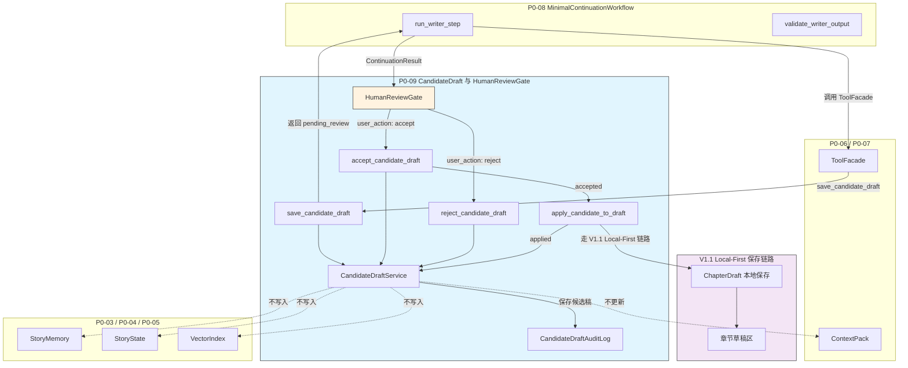
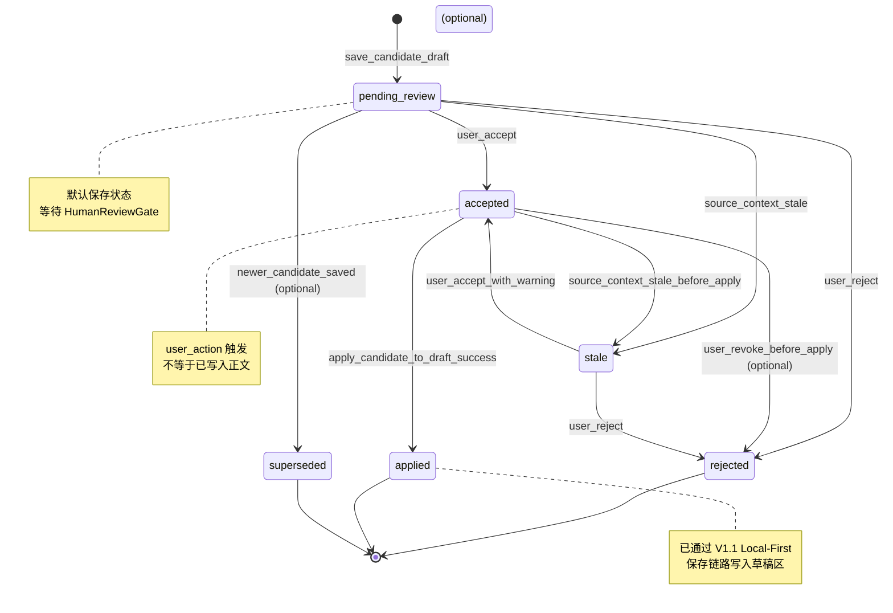

# InkTrace V2.0-P0-09 CandidateDraft 与 HumanReviewGate 详细设计

版本：v2.0-p0-detail-09  
状态：P0 模块级详细设计  
依据文档：

- `docs/01_requirements/InkTrace-V2.0-需求规格说明书.md`
- `docs/07_overview/InkTrace-V2.0-概要设计说明书.md`
- `docs/02_architecture/InkTrace-V2.0-架构设计说明书.md`
- `docs/03_design/InkTrace-V2.0-P0-详细设计总纲.md`
- `docs/03_design/InkTrace-V2.0-P0-01-AI基础设施详细设计.md`
- `docs/03_design/InkTrace-V2.0-P0-02-AIJobSystem详细设计.md`
- `docs/03_design/InkTrace-V2.0-P0-03-初始化流程详细设计.md`
- `docs/03_design/InkTrace-V2.0-P0-04-StoryMemory与StoryState详细设计.md`
- `docs/03_design/InkTrace-V2.0-P0-05-VectorRecall详细设计.md`
- `docs/03_design/InkTrace-V2.0-P0-06-ContextPack详细设计.md`
- `docs/03_design/InkTrace-V2.0-P0-07-ToolFacade与权限详细设计.md`
- `docs/03_design/InkTrace-V2.0-P0-08-MinimalContinuationWorkflow详细设计.md`

---

## 一、文档定位与设计范围

### 1.1 文档定位

本文档是 InkTrace V2.0-P0 的第九个模块级详细设计文档，仅覆盖 P0 CandidateDraft 与 HumanReviewGate。

CandidateDraft 是 AI 续写生成结果的候选稿暂存区，不是正式正文，不属于 confirmed chapters。HumanReviewGate 是 AI 输出进入正式草稿区前的人工确认门，确保用户对 AI 生成内容进入正文保有最终控制权。

本文档不替代 P0-08 MinimalContinuationWorkflow 详细设计，不写代码、不修改源码、不生成数据库迁移、不拆 Task、不进入开发计划。

### 1.2 设计范围

本模块覆盖：

- CandidateDraft 数据模型。
- CandidateDraftVersion，可选。
- CandidateDraftStatus 状态机。
- CandidateDraftSource。
- CandidateDraftReviewDecision。
- CandidateDraftService。
- HumanReviewGate。
- CandidateDraftRepositoryPort。
- CandidateDraftAuditLog。
- save_candidate_draft。
- list_candidate_drafts。
- get_candidate_draft。
- reject_candidate_draft。
- accept_candidate_draft。
- apply_candidate_to_draft。
- mark_candidate_stale。
- idempotency_key 与防重复设计。
- CandidateDraft 与正式章节草稿区的边界。
- CandidateDraft 与 V1.1 Local-First 保存链路的边界。
- CandidateDraft 与 StoryMemory / StoryState / VectorIndex 的边界。
- CandidateDraft 与 ContextPack 的边界。
- CandidateDraft 与 Quick Trial 的边界。
- CandidateDraft 的幂等、防重复、版本与状态流转。
- HumanReviewGate 的用户确认边界。
- 版本、冲突与 stale 处理。
- 错误处理与降级。
- 安全、隐私与日志。

### 1.3 本文档不覆盖

P0-09 不覆盖：

- 完整 Agent Runtime。
- AgentSession / AgentStep / AgentObservation / AgentTrace。
- 五 Agent Workflow。
- 完整 AI Suggestion / Conflict Guard。
- 完整 Story Memory Revision。
- 复杂 Knowledge Graph。
- Citation Link。
- @ 标签引用系统。
- 复杂多路召回融合。
- 自动连续续写队列。
- 成本看板。
- 分析看板。
- Provider SDK 适配实现。
- Repository / Infrastructure 具体实现。
- 数据库表结构 DDL。
- AIReview 详细设计（由 P0-10 覆盖）。
- API / 前端交互详细设计（由 P0-11 覆盖）。
- 复杂多版本 CandidateDraft 分支树。
- AI 自动冲突解决。
- 复杂三方 merge。
- 完整 CandidateDraft 内容清理策略。
- 长期幂等 key 失效策略。

---

## 二、P0 CandidateDraft / HumanReviewGate 目标

### 2.1 核心目标

P0 CandidateDraft 与 HumanReviewGate 的目标：

1. 定义 AI 续写候选稿的保存、展示、用户确认、拒绝、应用边界。
2. CandidateDraft 是 AI 生成结果的候选稿，不是正式正文。
3. CandidateDraft 不属于 confirmed chapters。
4. CandidateDraft 不直接进入 StoryMemory / StoryState / VectorIndex / 正式 ContextPack。
5. CandidateDraft 不直接更新初始化状态。
6. CandidateDraft 不直接更新章节正文。
7. HumanReviewGate 是 AI 输出进入正式草稿区前的人工确认门。
8. 用户接受 CandidateDraft 后，仍必须进入 V1.1 Local-First 正文保存链路。
9. ToolFacade / Workflow / Agent / Model 不得伪造用户确认。
10. Quick Trial 输出默认不是 CandidateDraft。
11. Quick Trial 输出只有用户明确"保存为候选稿"时才进入 CandidateDraft 流程。
12. P0-09 不负责重新分析 StoryMemory / StoryState。
13. P0-09 不负责自动 reindex。
14. CandidateDraft 被接受后，后续 reanalysis / reindex 由 P0-03 / P0-04 / P0-05 的流程或后续设计处理。

### 2.2 核心边界

必须明确：

- CandidateDraft 是 AI 生成结果的候选暂存区。
- CandidateDraft 不属于 confirmed chapters。
- CandidateDraft 不属于正式 StoryState。
- CandidateDraft 不直接进入 StoryMemory。
- CandidateDraft 不直接进入 StoryState。
- CandidateDraft 不直接进入 VectorIndex。
- CandidateDraft 不直接进入正式 ContextPack。
- CandidateDraft 不改变 initialization_status。
- CandidateDraft 不触发自动 reanalysis。
- CandidateDraft 不触发自动 reindex。
- HumanReviewGate 是用户确认门，不是 AI 校验器。
- HumanReviewGate 不重新生成文本。
- HumanReviewGate 不调用 Provider。
- HumanReviewGate 不更新 StoryMemory / StoryState / VectorIndex。
- 用户确认后 apply 走 V1.1 Local-First 保存链路。
- apply 后正文变化经由后续 P0-03 / P0-04 / P0-05 流程影响上下文。

### 2.3 继承 P0-08 的结论

P0-09 必须继承以下 P0-08 已冻结规则：

1. MinimalContinuationWorkflow 输出的是 CandidateDraft，后续由 P0-09 HumanReviewGate 处理。
2. save_candidate_draft 只写候选稿。
3. CandidateDraft 不属于 confirmed chapters。
4. 未接受 CandidateDraft 不进入 StoryMemory / StoryState / VectorIndex / 正式 ContextPack。
5. HumanReviewGate 之前的 AI 输出不能影响正式 StoryState。
6. accept_candidate_draft / apply_candidate_to_draft 属于 P0-09。
7. 用户接受 CandidateDraft 后仍需进入 V1.1 Local-First 保存链路。
8. Workflow / ToolFacade 不得伪造用户确认。
9. save_candidate_draft 必须使用 idempotency_key 或等价去重机制。
10. retry / resume 不得重复创建 CandidateDraft。
11. duplicate save_candidate_draft 应返回已有 candidate_draft_id 或 duplicate_request。
12. candidate_save_failed 不写正式正文。
13. Quick Trial 默认不 save_candidate_draft。
14. Quick Trial 只有用户明确"保存为候选稿"时才进入 P0-09 CandidateDraft 流程。
15. Quick Trial 的 candidate_draft_id 默认为空。
16. Quick Trial 输出不得自动进入正式 CandidateDraft。

---

## 三、模块边界与不做事项

### 3.1 P0-09 负责

| 模块 | 职责 |
|------|------|
| CandidateDraft | AI 候选稿的保存、查询、状态管理 |
| CandidateDraftService | 候选稿核心服务，含 CRUD、状态变更、幂等校验 |
| HumanReviewGate | 用户确认门，防止 AI 伪造确认 |
| CandidateDraftAuditLog | 候选稿审计日志 |
| accept_candidate_draft | 用户接受候选稿 |
| reject_candidate_draft | 用户拒绝候选稿 |
| apply_candidate_to_draft | 将已接受候选稿应用到章节草稿区 |
| mark_candidate_stale | 标记候选稿过期 |
| mark_candidate_superseded | 标记候选稿被替代（可选） |
| check_idempotency | 幂等校验 |

### 3.2 P0-09 不负责

| 模块 | 不属于 P0-09 |
|------|---------------|
| 正式正文保存 | 属于 V1.1 Local-First 保存链路 |
| StoryMemory 更新 | 属于 P0-04 |
| StoryState 更新 | 属于 P0-04 |
| VectorIndex 更新 | 属于 P0-05 |
| ContextPack 构建 | 属于 P0-06 |
| reanalysis | 属于 P0-03 / P0-04 |
| reindex | 属于 P0-05 |
| AI 重新生成 | 属于 run_writer_step / P0-08 |
| AI 校验 | 属于 validate_writer_output / P0-08 |
| 完整多版本候选树 | P0 不做 |
| AI 自动冲突解决 | P0 不做 |
| 复杂三方 merge | P0 不做 |
| Provider 调用 | P0-01 / P0-02 |
| ModelRouter | P0-01 |

### 3.3 禁止行为

- AI / Workflow / ToolFacade 不得调用 accept_candidate_draft。
- AI / Workflow / ToolFacade 不得调用 apply_candidate_to_draft。
- save_candidate_draft 不得写正式正文。
- save_candidate_draft 不得更新 StoryMemory / StoryState / VectorIndex。
- save_candidate_draft 不得改变 initialization_status。
- accept_candidate_draft 不得写正式正文。
- apply_candidate_to_draft 不得绕过 V1.1 Local-First 保存链路。
- apply_candidate_to_draft 不得直接写 confirmed chapters。
- apply 失败不得标记 candidate status 为 applied。
- 普通日志不得记录完整 CandidateDraft 内容。
- CandidateDraft 状态变化不得自动更新 StoryMemory / StoryState / VectorIndex。

---

## 四、总体架构

### 4.1 模块关系说明

CandidateDraftService 位于 Core Application 层，是候选稿的受控管理服务。

关系：

- P0-08 MinimalContinuationWorkflow 通过 ToolFacade 调用 save_candidate_draft。
- save_candidate_draft 创建 CandidateDraft（status = pending_review）。
- Writing UI / API 可以 list_candidate_drafts / get_candidate_draft。
- 用户在 UI 上审查候选稿后，通过 HumanReviewGate 执行 accept 或 reject。
- accept_candidate_draft 将 CandidateDraft 标记 accepted。
- apply_candidate_to_draft 将 accepted 候选稿内容通过 V1.1 Local-First 保存链路写入章节草稿区。
- apply_candidate_to_draft 成功后标记 CandidateDraft 为 applied。
- reject_candidate_draft 标记为 rejected。
- HumanReviewGate 是上述用户确认过程的逻辑封装。

### 4.2 模块关系图



### 4.3 模块依赖与边界

| 依赖方向 | 模块 | 说明 |
|----------|------|------|
| P0-09 → | P0-07 ToolFacade | save_candidate_draft 通过 ToolFacade 调用 |
| P0-09 → | P0-08 Workflow | Workflow 调用 save_candidate_draft，返回 ContinuationResult |
| P0-09 → | V1.1 Local-First | apply_candidate_to_draft 走 V1.1 保存链路 |
| P0-09 → | P0-02 AIJobSystem | job_id 可选关联 |
| → P0-09 | P0-10 AIReview | 后续设计可能引用 CandidateDraft 作为评审对象 |
| → P0-09 | P0-11 API/前端 | 前端需要展示 CandidateDraft、触发 HumanReviewGate |

### 4.4 与 P0-06 ContextPack 的边界

- save_candidate_draft 接收 context_pack_id 和 context_pack_status 作为引用记录。
- save_candidate_draft 不访问 ContextPack 内容。
- save_candidate_draft 不重新构建 ContextPack。
- degraded ContextPack 生成的 CandidateDraft 可保存，须记录 degraded_reasons。
- stale ContextPack 生成的 CandidateDraft 可保存，须标记 stale_context_warning。
- CandidateDraft 不进入正式 ContextPack。
- CandidateDraft 被接受并 apply 后，正文变化需要后续流程才能影响 ContextPack。

### 4.5 与 P0-07 ToolFacade 的边界

- save_candidate_draft 是 P0 AI Workflow 可调用的受控 Tool，通过 ToolFacade 暴露。
- accept_candidate_draft、apply_candidate_to_draft、reject_candidate_draft 是 user_action 驱动的 Core Application Use Case，不作为 AI Workflow / Agent / Writer 可调用 Tool 暴露。
- ToolFacade / Workflow / AI 模型不得调用 accept / apply / reject 冒充用户。
- 如果实现层统一通过 Application Service 调度，也必须校验 caller_type = user_action。
- user_action 必须来自 Presentation / UI 的明确用户操作。
- accept / apply / reject 可以经过安全 API / Application Service，但不属于 AI 编排工具调用路径。
- P0-09 不定义完整 API 权限模型，P0-11 再细化。
- ToolAuditLog 继承 P0-07 规则。

### 4.6 与 P0-08 MinimalContinuationWorkflow 的边界

- MinimalContinuationWorkflow 在 validate_writer_output 成功后调用 save_candidate_draft。
- save_candidate_draft 是 Workflow 的最后一个数据写入步骤。
- Workflow 不调用 accept_candidate_draft / apply_candidate_to_draft / reject_candidate_draft。
- Workflow 返回的 ContinuationResult 包含 candidate_draft_id，状态为 pending_review。
- HumanReviewGate 在 Workflow 完成后的用户交互层处理。

### 4.7 与 V1.1 Local-First 保存链路的边界

- apply_candidate_to_draft 进入 V1.1 Local-First 正文保存链路。
- apply 不绕过本地优先保存逻辑。
- apply 不直接写 confirmed chapters。
- apply 保存的是章节草稿区 / 正文草稿，不是最终确认态。
- 保存链路检测到 content_version 冲突时返回 chapter_version_conflict。

---

## 五、CandidateDraft 数据模型设计

### 5.1 CandidateDraft 字段

| 字段 | 类型 | 必填 | 说明 |
|------|------|------|------|
| candidate_draft_id | string | 是 | 候选稿唯一标识 |
| work_id | string | 是 | 所属作品 ID |
| target_chapter_id | string | 是 | 目标章节 ID |
| target_chapter_order | int | 是 | 目标章节序号 |
| writing_task_id | string | 是 | 关联 WritingTask ID |
| workflow_id | string | 是 | 生成该候选稿的 Workflow ID |
| job_id | string | 否 | 关联 AIJob ID |
| source | CandidateDraftSource | 是 | 候选稿来源 |
| status | CandidateDraftStatus | 是 | 候选稿状态 |
| content_text 或 content_ref | text/string | 是 | 候选稿正文内容或安全引用 |
| content_summary | string | 否 | 候选稿摘要，用于列表展示 |
| model_name | string | 否 | 生成模型名称 |
| provider_name | string | 否 | 生成服务商名称 |
| prompt_template_key | string | 否 | 使用的 Prompt 模板 Key |
| context_pack_id | string | 否 | 生成时使用的 ContextPack ID |
| context_pack_status | string | 否 | 生成时 ContextPack 状态 |
| degraded_reasons | string[] | 否 | 降级原因列表 |
| warnings | string[] | 否 | 警告列表 |
| validation_status | string | 是 | 输出校验状态 |
| validation_errors | string[] | 否 | 校验错误详情 |
| chapter_revision | string | 否 | 生成时目标章节修订版本 |
| content_version | string | 否 | 生成时目标章节内容版本 |
| idempotency_key | string | 是 | 幂等键 |
| idempotency_scope | string | 是 | 幂等作用范围 |
| created_by | string | 是 | 创建方引用，例如 workflow_id、quick_trial user_action、system actor；用于审计和追踪，不替代 CandidateDraftSource |
| created_at | datetime | 是 | 创建时间 |
| updated_at | datetime | 是 | 更新时间 |
| reviewed_by | string | 否 | 评审者用户 ID |
| reviewed_at | datetime | 否 | 评审时间 |
| review_decision | CandidateDraftReviewDecision | 否 | 评审决定 |
| applied_at | datetime | 否 | 应用时间 |
| applied_chapter_id | string | 否 | 应用后的章节草稿 ID |
| apply_result_ref | string | 否 | 应用结果安全引用 |
| stale_status | boolean | 否 | 是否标记为过期（P0 推荐优先使用标记而非覆盖主状态） |
| stale_reason | string | 否 | 过期原因 |
| stale_context_warning | boolean | 否 | 是否标记过期上下文警告 |
| previous_status | CandidateDraftStatus | 否 | 状态被覆盖前的原状态（如 stale 覆盖 accepted 时保留） |
| stale_since | datetime | 否 | 标记为 stale 的时间 |
| request_id | string | 是 | 请求追溯 ID |
| trace_id | string | 是 | 全链路追踪 ID |

### 5.2 CandidateDraft 内容保存策略

P0 默认允许 CandidateDraft 在受控 CandidateDraft 存储中持久化候选稿正文内容，以支持用户后续查看、比较和应用。也可以实现为 content_ref，由受控内容存储保存正文。

规则：

- 无论使用 content_text 还是 content_ref，HumanReviewGate 必须能够在用户查看时读取候选稿完整内容。
- 普通日志不得记录完整 CandidateDraft 内容。
- CandidateDraftAuditLog 不得记录完整 CandidateDraft 内容。
- ToolAuditLog 不得记录完整 CandidateDraft 内容。
- 如果长期保存 CandidateDraft 正文内容，必须提供后续清理/删除策略方向。P0 可只给清理策略方向，不实现完整内容生命周期。
- CandidateDraft 内容清理不得删除正式正文、用户原始大纲、StoryMemory、StoryState、VectorIndex。
- 如果候选稿内容因清理不可用，get_candidate_draft 应返回 candidate_content_unavailable 或等价安全错误。

### 5.3 CandidateDraftSource

| 来源 | 说明 | P0 必选 |
|------|------|---------|
| minimal_continuation_workflow | 由 P0-08 MinimalContinuationWorkflow 生成 | 是 |
| quick_trial_saved_by_user | 由 Quick Trial 输出经用户明确保存生成 | 是 |
| retry_resume | 由 Workflow retry/resume 触发保存 | 是 |
| manual_import | 手动导入（外部内容导入为候选稿） | 否，P0 可不实现 |

#### source 与 created_by 区分

- CandidateDraftSource 表达候选稿的**来源类型**（由什么流程或操作产生）。
- created_by（见 5.1 字段表）表达**创建方引用或 actor**（哪个工作流或用户触发了创建），用于审计和追踪。
- source 与 created_by 不应混用：
  - minimal_continuation_workflow、quick_trial_saved_by_user、retry_resume 属于 source。
  - workflow_id、user_id、system actor 属于 created_by 或相关审计字段。
- Quick Trial 保存为候选稿时：
  - source = quick_trial_saved_by_user；
  - created_by 可记录触发保存的 user_action / user_id / actor ref。
- 正式 Workflow 保存候选稿时：
  - source = minimal_continuation_workflow；
  - created_by 可记录 workflow_id 或 system workflow actor。
- created_by 不替代 CandidateDraftAuditLog.user_id，审计日志中的 user_id 由 audit 层独立记录。

### 5.4 CandidateDraftStatus

| 状态 | 说明 | P0 必选 |
|------|------|---------|
| pending_review | 候选稿已保存，等待用户确认 | 是 |
| accepted | 用户已接受，但不一定已经写入正式草稿区 | 是 |
| rejected | 用户已拒绝 | 是 |
| applied | 已通过 V1.1 Local-First 保存链路应用到章节草稿区 | 是 |
| stale | 候选稿生成依据可能过期 | 是 |
| superseded | 被新的候选稿替代 | 否，P0 可选 |
| failed | 不建议作为常规 CandidateDraft 状态，保存失败应在 Workflow/ToolResult 层表达 | 否 |

说明：

- pending_review 表示候选稿已保存，等待用户确认。
- accepted 表示用户已接受，但不一定已经写入正式草稿区。
- applied 表示已通过 V1.1 Local-First 保存链路应用到章节草稿区。
- rejected 表示用户拒绝。
- stale 表示候选稿生成依据可能过期。
- superseded 表示被新的候选稿替代，可选。
- failed 不建议作为常规 CandidateDraft 状态，保存失败应在 Workflow / ToolResult 层表达。

stale 实现说明：

- P0 推荐将 stale 优先作为 stale_status / stale_context_warning / stale_reason 这类标记实现，而不是强制覆盖主状态 CandidateDraftStatus。
- CandidateDraftStatus 主状态默认保持 pending_review / accepted / rejected / applied，不因 stale 而丢失原状态语义。
- 如果实现选择将 CandidateDraft.status 直接置为 stale，必须保留 previous_status、review_decision、reviewed_at、stale_reason、stale_since，避免丢失 accepted / pending_review 历史。
- 状态机图可以保留 stale 作为状态分支，但实现者必须保证不丢失原状态语义。

#### pending_review 生命周期规则

P0 pending_review 生命周期与超时策略：

- P0 不实现 pending_review 自动超时。
- CandidateDraft 保存后保持 pending_review，直到：
  - 用户 accept；
  - 用户 reject；
  - 用户 defer；
  - 系统标记 stale_status / stale_context_warning；
  - 系统可选标记 superseded。
- defer 不改变 status，CandidateDraft 仍保持 pending_review。
- pending_review 不会因为时间流逝自动变 rejected。
- pending_review 不会因为时间流逝自动变 applied。
- pending_review 不会因为时间流逝自动删除。
- P0 不自动清理未处理 CandidateDraft 正文内容。
- 如果同一章节有多个 pending_review CandidateDraft，P0 默认全部保留并可查询。
- 新 CandidateDraft 生成后，可以可选将旧 pending_review 标记 superseded，但 P0 不强制。
- 长期未处理 CandidateDraft 可能因章节变化被标记 stale，但不是因为时间超时自动 stale。
- P1 / 后续设计可引入过期策略、自动归档、清理策略。

### 5.5 CandidateDraftReviewDecision

CandidateDraftReviewDecision 是用户评审决定，不是 CandidateDraft 状态。它与 CandidateDraftStatus.pending_review 语义不同，不得混用。

| 决定 | 说明 | P0 必选 |
|------|------|---------|
| accept | 用户接受候选稿 | 是 |
| reject | 用户拒绝候选稿 | 是 |
| defer | 用户暂不处理 | 是 |

规则：

- accept 表示用户接受候选稿。
- reject 表示用户拒绝候选稿。
- defer 表示用户暂不处理。
- defer 不改变 CandidateDraft.status。
- defer 后 CandidateDraft.status 仍保持 pending_review。
- 不要用 pending 作为 review_decision，避免和 CandidateDraftStatus.pending_review 混淆。

---

## 六、CandidateDraft 状态机设计

### 6.1 状态流转图



### 6.2 状态流转规则表

| 起始状态 | 目标状态 | 触发条件 | 说明 |
|----------|----------|----------|------|
| [*] | pending_review | save_candidate_draft 成功 | 默认保存状态 |
| pending_review | accepted | user_action: accept | 必须由用户触发 |
| pending_review | rejected | user_action: reject | 必须由用户触发，或批量清理 |
| pending_review | stale | 系统检测生成依据过期 | 不自动改变状态，由 stale 检测触发 |
| pending_review | superseded | 新候选稿生成（可选） | P0 可选实现 |
| accepted | applied | apply_candidate_to_draft 成功 | 必须由用户触发，走 V1.1 链路 |
| accepted | rejected | user revoke（可选） | P0 可选，默认不做 |
| accepted | stale | 系统检测源上下文过期 | 在 apply 之前检测到 |
| stale | accepted | user_action: accept with warning | 允许用户确认，须记录 stale_context_warning |
| stale | rejected | user_action: reject | 用户拒绝过期稿 |
| rejected | [*] | 终态 | 不再回退 |
| applied | [*] | 终态 | 不再回退 |

stale 状态实现说明（参见 5.4 stale 实现说明）：

- P0 推荐将 stale 优先作为 stale_status 标记实现，不覆盖主状态。
- 如果实现选择将 status 置为 stale，必须保留 previous_status / review_decision / reviewed_at / stale_reason / stale_since。
- stale 状态不得导致 accepted / pending_review 历史丢失。
- stale → accepted 时，应恢复 previous_status 或保留原 accepted 记录。

### 6.3 P0 简化约束

- P0 简化状态为 pending_review / accepted / rejected / applied / stale。
- superseded 是可选状态，P0 可以不实现。
- failed 不作为 CandidateDraft 状态，保存失败在 Workflow / ToolResult 层表达。
- pending_review 是 save_candidate_draft 成功后唯一默认状态。
- user_accept 必须来自真实用户操作，禁止 AI / Workflow / ToolFacade 伪造。
- accepted 不等于 applied，两个语义阶段必须分开。
- rejected / applied 为终态，P0 默认不提供回退。
- stale candidate 允许接受，但必须标记 stale_context_warning。
- 状态变化不得自动更新 StoryMemory / StoryState / VectorIndex。

### 6.4 pending_review 生命周期补充

参见 5.4 pending_review 生命周期规则。状态机层面仅确认：

- pending_review 没有自动超时触发状态流转。
- pending_review → stale 仅由系统检测章节上下文变更触发，不是时间驱动。
- pending_review 不因时间推移自动变为 rejected / applied / deleted。
- 多个 pending_review 共存时，状态机不做自动合并，均由 list / get 查询暴露给用户。

### 6.5 stale 状态图与 stale_status 标记的关系

状态机图中以下路径需结合 5.4 stale 实现说明理解：

```text
pending_review --> stale
accepted --> stale
stale --> accepted
```

说明：

- 状态机图中的 stale 表示系统级语义分支（候选稿生成依据可能过期），**不是强制主状态覆盖**。
- 如实现遵循 P0 推荐的 stale_status 标记方案：
  - stale 不作为 CandidateDraftStatus 主状态流转。
  - pending_review 和 accepted 的主状态保持不变。
  - stale_status / stale_reason / stale_context_warning 作为标记附加。
  - 此时状态机图的 stale 节点理解为标记状态附加，而非主状态转移。
- 如实现选择将 status 置为 stale：
  - 必须记录 previous_status。
  - stale → accepted 时，应恢复 previous_status（accepted）或保留原记录。
- stale 标记不得导致 pending_review / accepted 的 review_decision、reviewed_at、created_at 历史丢失。
- 状态机图中 stale → accepted 路径存在的前提是：用户被告知 stale 风险后仍选择接受，系统记录 stale_context_warning。

---

## 七、CandidateDraftService 设计

### 7.1 职责与方法

| 方法 | 调用者 | 说明 |
|------|--------|------|
| save_candidate_draft | Workflow / ToolFacade | 保存候选稿，AI Workflow 可调用 Tool |
| get_candidate_draft | HumanReviewGate / 查询 | 获取单个候选稿 |
| list_candidate_drafts | HumanReviewGate / 查询 | 列表查询候选稿 |
| reject_candidate_draft | user_action | 拒绝候选稿，Core Application Use Case，不作为 AI Workflow Tool |
| accept_candidate_draft | user_action | 接受候选稿，Core Application Use Case，不作为 AI Workflow Tool |
| apply_candidate_to_draft | user_action | 应用候选稿到章节草稿区，Core Application Use Case，不作为 AI Workflow Tool |
| mark_candidate_stale | 系统内部 | 标记候选稿过期 |
| mark_candidate_superseded | 系统内部（可选） | 标记候选稿被替代 |
| check_idempotency | 内部校验 | 检查幂等 |
| record_review_decision | 内部记录 | 记录评审决定 |
| record_audit_log | 内部记录 | 记录审计日志 |

调用者校验规则：

- save_candidate_draft 可以由 AI Workflow 通过 ToolFacade 调用。
- accept_candidate_draft / apply_candidate_to_draft / reject_candidate_draft 必须校验 caller_type = user_action。
- 如果实现层统一通过 Application Service 调度，也必须在校验通过后才路由到 Core Use Case。
- user_action 必须来自 Presentation / UI 的明确用户操作。

### 7.2 禁止行为

CandidateDraftService 禁止：

- 不直接写 StoryMemory。
- 不直接写 StoryState。
- 不直接写 VectorIndex。
- 不直接调用 ModelRouter。
- 不调用 Provider。
- 不重新生成正文。
- 不执行 AI 校验。
- 不改变 initialization_status。
- 不触发自动 reanalysis。
- 不触发自动 reindex。

### 7.3 list_candidate_drafts 查询规则

list_candidate_drafts 默认规则：

1. **默认排序**：按 created_at desc 排序，最新创建的候选稿优先展示。
2. **过滤条件**：支持按以下字段过滤：
   - work_id（必选）
   - target_chapter_id（可选）
   - status（可选，含 pending_review / accepted / rejected / applied / stale）
   - source（可选）
   - stale_status（可选）
   - created_at range（可选，起止时间范围）
3. **分页**：P0 建议支持分页，推荐 cursor + limit 或 page + page_size。默认 page_size / limit 由 P0-11 API 详细设计确定。
4. **多候选稿可见性**：
   - 同一章节多个 CandidateDraft 默认全部可查询。
   - rejected / applied CandidateDraft 默认可通过过滤查看。
   - stale CandidateDraft 默认可通过过滤查看。
5. **列表摘要**：list 结果默认返回摘要信息（candidate_draft_id、status、source、content_summary、created_at、target_chapter_id、target_chapter_order 等），不返回完整候选稿内容。
6. **完整内容获取**：get_candidate_draft 才返回完整候选稿内容或 content_ref 解析后的内容。
7. **日志安全**：list 不得在普通日志中记录完整候选稿内容。
8. **UI 展示**：
   - UI 默认可突出展示最新 pending_review 或 accepted CandidateDraft。
   - UI 不得静默隐藏旧 CandidateDraft，除非用户主动过滤、折叠或 P0-11 明确展示策略。
9. **P0-11 细化**：P0-11 API / 前端可基于以上规则细化展示策略。

---

## 八、save_candidate_draft 设计

### 8.1 输入

| 参数 | 类型 | 必填 | 说明 |
|------|------|------|------|
| work_id | string | 是 | 所属作品 ID |
| target_chapter_id | string | 是 | 目标章节 ID |
| target_chapter_order | int | 是 | 目标章节序号 |
| writing_task_id | string | 是 | 关联 WritingTask ID |
| workflow_id | string | 是 | 生成 Workflow ID |
| job_id | string | 否 | 关联 AIJob ID |
| generated_content | text | 是 | AI 生成正文 |
| validation_result | object | 是 | 包含 validation_status、validation_errors |
| context_pack_id | string | 否 | ContextPack ID |
| context_pack_status | string | 否 | ContextPack 状态 |
| degraded_reasons | string[] | 否 | 降级原因 |
| warnings | string[] | 否 | 警告 |
| source | CandidateDraftSource | 是 | 候选稿来源 |
| chapter_revision | string | 否 | 生成时章节修订版本 |
| content_version | string | 否 | 生成时章节内容版本 |
| idempotency_key | string | 是 | 幂等键（正式 Workflow 必须） |
| request_id | string | 是 | 请求追溯 ID |
| trace_id | string | 是 | 全链路追踪 ID |

### 8.2 输出

| 字段 | 类型 | 说明 |
|------|------|------|
| candidate_draft_id | string | 候选稿 ID |
| status | CandidateDraftStatus | 固定为 pending_review |
| duplicate_of | string | 如为重复请求，返回已有 ID |
| warnings | string[] | 警告列表 |
| request_id | string | 请求追溯 ID |
| trace_id | string | 全链路追踪 ID |

### 8.3 规则

- save_candidate_draft 只写 CandidateDraft。
- save_candidate_draft 不写正式正文。
- save_candidate_draft 不更新 StoryMemory / StoryState / VectorIndex。
- save_candidate_draft 不改变 initialization_status。
- save_candidate_draft 不调用 Provider。
- save_candidate_draft 不触发自动 reanalysis / reindex。
- validation_result 必须成功。validation_failed 不得 save_candidate_draft。
- generated_content 为空不得保存，返回 candidate_content_empty。
- target_chapter_id 缺失不得保存。
- work_id / target_chapter_id 必须匹配。
- idempotency_key 必须参与去重（正式 Workflow 必须带 idempotency_key）。
- 同一 idempotency_scope 下重复保存且参数摘要一致，返回已有 candidate_draft_id。
- 同一 idempotency_key 但参数摘要不一致，返回 idempotency_conflict。
- degraded ContextPack 生成的 CandidateDraft 可以保存，但必须保留 degraded_reasons / warnings。
- stale ContextPack 生成的 CandidateDraft 如允许保存，必须标记 stale_context_warning。
- Quick Trial 默认不调用 save_candidate_draft。
- Quick Trial 只有用户明确"保存为候选稿"时才可调用，source = quick_trial_saved_by_user。
- 正式 Workflow 和 Quick Trial 保存路径的幂等规则一致：缺少 idempotency_key 时返回 idempotency_key_missing，不保存。
- 普通日志不得记录完整 generated_content。

#### 版本记录规则

- candidatDraft 必须记录生成时目标章节版本信息。
- 字段使用 chapter_revision 和 content_version（见 5.1 字段表），表示"生成时版本"。
- 版本信息应在 save_candidate_draft 时记录，不应推迟到 accept / apply 阶段。
- 版本信息来源：
  - WritingTask 传递的章节版本信息。
  - ContextPackSnapshot 记录的目标章节版本。
  - 当前章节草稿快照提供的 content_version / draft_revision。
  - V1.1 Local-First 保存链路提供的章节版本。
- 如果版本信息不可用：
  - save_candidate_draft 仍可保存 CandidateDraft，但必须记录 version_missing warning。
  - CandidateDraft 保持 pending_review，不在 save 阶段根据未来 apply_mode 直接拒绝保存。
  - 版本信息缺失不影响幂等性检查。
- replace_selection / insert_at_cursor 模式下版本缺失拒绝，发生在 apply_candidate_to_draft 阶段（见 12.5）。

### 8.4 前置校验顺序

1. work_id / target_chapter_id 匹配性校验。
2. generated_content 非空校验。
3. validation_result 成功校验。
4. idempotency_key 存在性校验（正式 Workflow 必选）。
5. idempotency 去重校验。
6. 幂等通过后创建 CandidateDraft，status = pending_review。
7. 记录 CandidateDraftAuditLog。

---

## 九、idempotency_key 与防重复设计

### 9.1 幂等设计目标

idempotency_key 是防止 retry / resume 重复创建 CandidateDraft 的关键机制。P0 对 save_candidate_draft 必须支持 idempotency_key 或等价去重机制。

### 9.2 幂等作用范围（idempotency_scope）

幂等作用范围包含以下维度：

- work_id。
- job_id（可选）。
- step_id（可选）。
- workflow_id。
- writing_task_id。
- tool_name = save_candidate_draft。
- idempotency_key。

所有维度组合作为一个幂等作用域。

### 9.3 重复调用处理

| 场景 | 行为 |
|------|------|
| 重复调用且参数摘要一致 | 返回已有 candidate_draft_id；不创建新 CandidateDraft；返回 duplicate_request |
| 重复调用但参数摘要不一致 | 返回 idempotency_conflict；不创建新 CandidateDraft；需人工处理或重新生成 idempotency_key |
| idempotency_key 缺失 | 返回 idempotency_key_missing；不保存（正式 Workflow 和 Quick Trial 保存路径一致） |

### 9.4 P0 默认策略

| 条件 | 策略 |
|------|------|
| 正式 Workflow（source = minimal_continuation_workflow） | idempotency_key 必选，缺失则 failed |
| retry_resume | idempotency_key 必选，缺失则 failed |
| Quick Trial 保存为候选稿 | 必须生成 idempotency_key |
| Quick Trial 未保存为候选稿 | 不涉及 idempotency_key |

### 9.5 安全规则

- idempotency_key 不得包含正文、Prompt、API Key 或敏感信息。
- idempotency_key 应使用 UUID 或安全随机字符串。
- ToolAuditLog 可记录 idempotency_key hash，不记录敏感原文。
- P0 不要求复杂全局幂等存储。
- P0 不要求长期幂等 key 失效策略（由后续设计补充）。

---

## 十、HumanReviewGate 设计

### 10.1 职责

HumanReviewGate 是 AI 输出进入正式草稿区前的人工确认门。职责：

- 展示 CandidateDraft 给用户（必须能够从 content_text 或 content_ref 读取候选稿完整内容）。
- 展示生成来源与 source。
- 展示 degraded_reasons / warnings / stale 信息。
- 展示 validation 结果。
- 允许用户接受候选稿。
- 允许用户拒绝候选稿。
- 允许用户暂不处理候选稿（defer）。
- 防止 AI / Workflow / ToolFacade 伪造确认。
- 记录用户 review_decision。
- 触发 accept_candidate_draft。
- 触发 apply_candidate_to_draft（可选分步或合并）。

### 10.2 HumanReviewGate 边界

HumanReviewGate 不负责：

- 不重新生成文本。
- 不调用 Provider。
- 不调用 ModelRouter。
- 不更新 StoryMemory / StoryState / VectorIndex。
- 不自动 reanalysis。
- 不自动 reindex。
- 不修改 ContextPack。

### 10.3 用户确认要求

- 用户确认必须来自 user_action。
- user_action 必须可审计。
- user_action 记录到 CandidateDraftAuditLog。
- AI / Workflow / ToolFacade 不得调用 accept_candidate_draft 冒充用户。
- AI / Workflow / ToolFacade 不得调用 apply_candidate_to_draft 冒充用户。

### 10.4 两步语义

P0 推荐两步语义（即使 UI 合并为一次点击，服务内部保持两个阶段）：

| 阶段 | 操作 | 状态变化 |
|------|------|----------|
| 阶段一 | user_accept → accept_candidate_draft | pending_review → accepted |
| 阶段二 | user_apply → apply_candidate_to_draft | accepted → applied |

如果 UI 层一次点击完成 accept + apply，服务内部也必须顺序执行两个阶段：

1. accept_candidate_draft（pending_review → accepted）。
2. apply_candidate_to_draft（accepted → applied）。

如果阶段一成功但阶段二失败，candidate 状态保持 accepted，不标记 applied。

### 10.5 展示内容

HumanReviewGate 应向用户展示：

- 候选稿正文（diff 或完整展示）。
- 目标章节名称 / 位置。
- 生成来源（minimal_continuation_workflow / quick_trial_saved_by_user）。
- model_name / provider_name（可选）。
- 生成时间。
- degraded_reasons（如有）。
- warnings（如有）。
- stale_context_warning（如有）。
- validation_errors（如有）。
- 冲突检测结果（如有 chapter_version_conflict）。

### 10.6 HumanReviewGate 流程

```
用户打开 Writing UI
  → UI 加载列表：list_candidate_drafts（status = pending_review / accepted / stale）
  → UI 展示候选稿摘要（content_summary、degraded_reasons、warnings）
  → 用户选择候选稿查看详情：get_candidate_draft
  → 用户审查完整候选正文

用户操作：
  → 接受候选稿：accept_candidate_draft
    → 如果候选稿有 warning，UI 展示确认风险提示
    → 接受后 status = accepted
    → 用户可手动触发 apply_candidate_to_draft
    → 应用后通过 V1.1 Local-First 保存链路写入章节草稿区

  → 拒绝候选稿：reject_candidate_draft
    → 可选填写拒绝原因
    → 拒绝后 status = rejected
    → 用户可重新执行 Quick Trial 或正式续写

  → 暂不处理：defer
    → review_decision = defer
    → CandidateDraft.status 保持 pending_review
    → 候选稿仍在列表中保留，后续可继续处理

  → 对 stale 候选稿：
    → 接受带 warning：accept_candidate_draft（stale_context_warning）
    → 拒绝：reject_candidate_draft
```

#### 多候选展示与 pending_review 可见性

- 同一章节多个 CandidateDraft 默认全部可查询。
- list_candidate_drafts 按 created_at desc 排序，最新候选稿优先展示。
- UI 默认可突出展示最新 pending_review 或 accepted 候选稿，但不得静默隐藏旧候选稿。
- rejected / applied CandidateDraft 可通过过滤查看。
- deferred CandidateDraft 仍保持 pending_review，继续在列表中展示。
- 因章节变化被标记 stale 的 CandidateDraft 仍在列表中展示，标注 stale 警告。
- pending_review 候选稿不会因为时间流逝自动消失或删除。
- 展示策略的细化由 P0-11 API / 前端详细设计确定。

---

## 十一、accept_candidate_draft 设计

### 11.1 输入

| 参数 | 类型 | 必填 | 说明 |
|------|------|------|------|
| candidate_draft_id | string | 是 | 候选稿 ID |
| work_id | string | 是 | 所属作品 ID |
| target_chapter_id | string | 是 | 目标章节 ID |
| user_id | string | 否 | 用户 ID |
| review_decision | string | 是 | 固定为 accept |
| request_id | string | 是 | 请求追溯 ID |
| trace_id | string | 是 | 全链路追踪 ID |

### 11.2 输出

| 字段 | 类型 | 说明 |
|------|------|------|
| candidate_draft_id | string | 候选稿 ID |
| status | CandidateDraftStatus | 变为 accepted |
| stale_context_warning | boolean | 是否标记了过期警告 |
| warnings | string[] | 警告列表 |
| request_id | string | 请求追溯 ID |
| trace_id | string | 全链路追踪 ID |

### 11.3 规则

- 只能由 user_action 调用。
- ToolFacade / Workflow / AI 模型不得调用 accept_candidate_draft 冒充用户。
- candidate 必须存在，不存在返回 candidate_not_found。
- candidate 必须属于当前 work_id，不匹配返回 candidate_work_mismatch。
- candidate target_chapter_id 必须匹配，不匹配返回 candidate_chapter_mismatch。
- candidate status 必须是 pending_review 或 stale。
- pending_review → accepted：正常接受。
- stale → accepted：允许接受，须记录 stale_context_warning。
- rejected candidate 默认不能接受，返回 candidate_already_rejected。
- applied candidate 不能重复接受，返回 candidate_already_applied。
- accept 不等于 apply。
- accept 不写正式正文。
- accept 不更新 StoryMemory / StoryState / VectorIndex。
- accept 不触发 reanalysis / reindex。
- accept 必须记录 CandidateDraftAuditLog。

---

## 十二、apply_candidate_to_draft 设计

### 12.1 输入

| 参数 | 类型 | 必填 | 说明 |
|------|------|------|------|
| candidate_draft_id | string | 是 | 候选稿 ID |
| work_id | string | 是 | 所属作品 ID |
| target_chapter_id | string | 是 | 目标章节 ID |
| apply_mode | ApplyMode | 是 | 应用模式 |
| apply_anchor | string | 否 | 应用锚点（由 apply_mode 决定语义） |
| selection_range | string | 否 | 替换选区范围（replace_selection 时必须提供） |
| cursor_position | int | 否 | 光标位置（insert_at_cursor 时必须提供） |
| base_content_version | string | 否 | 生成时目标章节内容版本，用于冲突检测 |
| draft_revision | string | 否 | 生成时目标章节草稿修订版本，用于冲突检测 |
| user_id | string | 否 | 用户 ID |
| request_id | string | 是 | 请求追溯 ID |
| trace_id | string | 是 | 全链路追踪 ID |

### 12.2 ApplyMode

| 模式 | 说明 | P0 是否支持 | 定位参数要求 |
|------|------|-------------|---------------|
| append_to_chapter_end | 追加到章节末尾 | 是 | 不需要 selection_range / cursor_position |
| replace_selection | 替换用户选定的范围 | 是 | 必须提供 selection_range |
| insert_at_cursor | 在光标处插入 | 是 | 必须提供 cursor_position |
| replace_chapter_draft | 替换整个章节草稿 | 否，P0 默认不支持 | 不适用 |

### 12.3 输出

| 字段 | 类型 | 说明 |
|------|------|------|
| candidate_draft_id | string | 候选稿 ID |
| applied_chapter_id | string | 应用后的章节草稿 ID |
| status | CandidateDraftStatus | 变为 applied |
| apply_result_ref | string | 应用结果安全引用 |
| warnings | string[] | 警告列表 |
| request_id | string | 请求追溯 ID |
| trace_id | string | 全链路追踪 ID |

### 12.4 规则

- apply_candidate_to_draft 必须由 user_action 触发。
- candidate 必须存在，不存在返回 candidate_not_found。
- candidate 必须是 accepted 状态，否则返回 candidate_status_invalid。
- candidate 必须未 applied，已 applied 返回 candidate_already_applied。
- candidate target_chapter_id 必须匹配，不匹配返回 candidate_chapter_mismatch。
- apply_candidate_to_draft 不绕过 V1.1 Local-First 正文保存链路。
- apply 更新的是章节草稿区 / 正文草稿，不是最终 confirmed chapters。
- apply 后不得立即更新 StoryMemory / StoryState / VectorIndex。
- apply 后不得立即写 VectorIndex。
- apply 后是否触发 reanalysis / stale 标记由 P0-03 / P0-04 / P0-05 或后续设计处理。
- apply 失败不得改变 candidate status 为 applied。
- apply 成功后 candidate status = applied。
- apply_result_ref 只保存安全引用，不记录完整正文到普通日志。

定位参数规则：

- append_to_chapter_end 不需要 selection_range / cursor_position。
- replace_selection 必须提供 selection_range，否则返回 apply_target_missing。
- insert_at_cursor 必须提供 cursor_position，否则返回 apply_target_missing。
- replace_chapter_draft P0 默认不支持，如请求该模式返回 apply_mode_not_supported。
- apply 时必须校验 base_content_version / draft_revision，以避免覆盖用户新编辑。
- 缺少定位参数时返回 apply_target_missing。

#### 版本一致性规则

- apply_candidate_to_draft 以 CandidateDraft 保存时的 chapter_revision / content_version 作为基准版本。
- apply 请求传入的 base_content_version / draft_revision 必须与 CandidateDraft 记录的生成时版本一致或兼容。
- 如果 apply 请求版本与 CandidateDraft 记录版本不一致，返回 candidate_version_mismatch。
- 如果当前章节实际版本与 CandidateDraft 生成时版本不一致，返回 chapter_version_conflict（见 12.5）。
- candidate_version_mismatch 与 chapter_version_conflict 的区别：
  - candidate_version_mismatch：请求方传入的版本与 CandidateDraft 记录版本不匹配，说明请求方使用的 CandidateDraft 上下文可能错误。
  - chapter_version_conflict：当前章节实际版本与 CandidateDraft 生成时版本不匹配，说明生成后用户已修改章节。
- 版本一致性校验不得绕过 V1.1 Local-First 保存链路的乐观锁冲突检测。

### 12.5 冲突检测

- apply 时比较当前 target chapter 的 content_version / draft_revision 与 CandidateDraft 保存的 chapter_revision / content_version（生成时版本）。
- 如果当前章节版本与生成时版本不匹配，返回 chapter_version_conflict。
- chapter_version_conflict 时不自动覆盖用户正文。
- P0 不做复杂三方 merge。
- P0 不做 AI 自动冲突解决。
- 冲突时向 HumanReviewGate 报告版本差异，由用户决定如何处理。
- 如果 CandidateDraft 缺少生成时版本信息（版本缺失），按以下策略处理：
  - replace_selection / insert_at_cursor：拒绝 apply，返回 candidate_version_missing。
  - append_to_chapter_end：可在 warning 下允许，但 V1.1 Local-First 保存链路仍会做最终冲突保护。

### 12.6 apply 后处理

apply 成功后：

- CandidateDraft status = applied。
- applied_at 记录时间戳。
- applied_chapter_id 记录章节草稿 ID。
- 正文变更通过 V1.1 本地保存链路完成。
- 正文变更不自动触发 reanalysis（由后续流程处理）。
- 正文变更不自动触发 reindex（由后续流程处理）。

### 12.7 apply 成功后正文变更事件通知

apply_candidate_to_draft 成功后，本质上产生了章节草稿正文变更。该变更需要传递到下游模块，使 P0-03 / P0-04 / P0-05 能感知并标记相关状态可能 stale。

规则：

1. **P0-09 不直接执行 reanalysis / reindex**。apply 后正文变更的 reanalysis / reindex 由 P0-03 / P0-04 / P0-05 或后续集成流程处理。
2. **P0-09 不直接写 StoryMemory / StoryState / VectorIndex**。
3. **正文变更必须通过 V1.1 Local-First 保存链路或 Application 层统一变更事件向外暴露**，不得静默生效而不通知下游。
4. **建议事件名称或等价通知方向**（以下为 P0-09 的期望，不强制下游使用特定名称）：
   - `chapter_draft_changed`
   - `chapter_content_changed`
   - `candidate_applied_to_chapter`
5. **事件消费方**：P0-03 / P0-04 / P0-05 或后续集成流程消费该事件，用于标记相关章节分析、StoryState、VectorIndex、ContextPack 可能 stale。
6. **P0-09 的职责**是确保 apply 成功后返回以下信息，使后续 stale 标记链路有可追踪的输入：
   - `apply_result_ref`
   - `applied_chapter_id`
   - `request_id`
   - `trace_id`
7. **如果 Local-First 保存失败**（如 local_first_save_failed），则不得发出成功事件，CandidateDraft 保持 accepted。
8. **如果 apply 成功但后续 stale 标记失败**：
   - CandidateDraft 仍已 applied，正文保存结果不回滚。
   - 必须记录 warning，如 stale_mark_pending / stale_mark_failed。
   - 具体重试 / 补偿由 P0-03 / P0-04 / P0-05 或后续集成设计处理。
9. **P0-09 不做自动 reanalysis / reindex**，只负责确保正文变更事件或等价通知不被静默吞掉。
10. **apply 后正文变化经由后续流程影响 ContextPack**，不是 CandidateDraft 直接进入 ContextPack。

---

## 十三、reject_candidate_draft 设计

### 13.1 输入

| 参数 | 类型 | 必填 | 说明 |
|------|------|------|------|
| candidate_draft_id | string | 是 | 候选稿 ID |
| work_id | string | 是 | 所属作品 ID |
| user_id | string | 否 | 用户 ID |
| review_decision | string | 是 | 固定为 reject |
| reason | string | 否 | 拒绝原因（可选） |
| request_id | string | 是 | 请求追溯 ID |
| trace_id | string | 是 | 全链路追踪 ID |

### 13.2 输出

| 字段 | 类型 | 说明 |
|------|------|------|
| candidate_draft_id | string | 候选稿 ID |
| status | CandidateDraftStatus | 变为 rejected |
| request_id | string | 请求追溯 ID |
| trace_id | string | 全链路追踪 ID |

### 13.3 规则

- reject 必须由 user_action 触发，或用户明确批量清理。
- candidate 必须存在，不存在返回 candidate_not_found。
- candidate 必须属于当前 work_id，不匹配返回 candidate_work_mismatch。
- candidate status 必须是 pending_review 或 stale。
- rejected candidate 不写正式正文。
- rejected candidate 不更新 StoryMemory / StoryState / VectorIndex。
- rejected candidate 可保留用于审计或历史。
- 普通日志不记录完整 rejected candidate 内容。
- rejected candidate 默认不能再次 apply。
- 如允许重新打开 rejected candidate，属于 P1 / 后续设计，P0 不做。
- reject 必须记录 CandidateDraftAuditLog。

---

## 十四、CandidateDraft 与正式正文 / Local-First 保存链路

### 14.1 核心边界

| 阶段 | 是否进入正式正文 | 说明 |
|------|-----------------|------|
| CandidateDraft saved (pending_review) | 否 | 候选稿暂存区 |
| CandidateDraft accepted | 否 | 用户接受但尚未写入 |
| CandidateDraft applied | 是 | 通过 V1.1 Local-First 写入章节草稿区 |
| CandidateDraft rejected | 否 | 不写入任何正式区域 |

### 14.2 规则

- CandidateDraft 不是正式正文。
- CandidateDraft 保存不触发正式正文保存。
- accept_candidate_draft 不触发正式正文保存。
- apply_candidate_to_draft 才进入章节草稿区 / 正文草稿修改。
- apply_candidate_to_draft 必须走 V1.1 Local-First 保存链路。
- apply 不得绕过本地优先保存。
- apply 不得直接写 confirmed chapters。
- apply 不得直接写 StoryMemory / StoryState / VectorIndex。
- apply 后章节变更如何触发 stale / reanalysis，由 P0-03 / P0-04 / P0-05 或后续设计承接。
- apply 与用户手动编辑正文的保存链路保持一致。
- 如果保存失败，CandidateDraft 不得标记 applied。
- 如果本地草稿区版本冲突，返回 chapter_version_conflict。

### 14.3 V1.1 Local-First 保存链路集成

apply_candidate_to_draft 调用 V1.1 保存链路时：

1. 传入 target_chapter_id、content_text、apply_mode。
2. 传入 content_version 用于冲突检测。
3. 保存链路校验版本一致性。
4. 版本一致 → 写入章节草稿区 → 返回 success。
5. 版本冲突 → 返回 chapter_version_conflict → CandidateDraft 保持 accepted。
6. 保存失败 → 返回 local_first_save_failed → CandidateDraft 保持 accepted。

### 14.4 apply 后正文变更事件

apply_candidate_to_draft 成功写入章节草稿区后，正文变更事件处理（继承 12.7 规则）：

- P0-09 不直接触发 reanalysis / reindex。
- P0-09 不直接更新 StoryMemory / StoryState / VectorIndex。
- 正文变更事件通过 V1.1 Local-First 保存链路或 Application 层统一变更事件向外暴露。
- 事件由 P0-03 / P0-04 / P0-05 或后续集成流程消费，用于标记相关分析可能 stale。
- P0-09 确保 apply 成功后返回 apply_result_ref / applied_chapter_id / request_id / trace_id。
- 如保存失败（local_first_save_failed），不得发出成功事件。
- 如 apply 成功但后续 stale 标记失败，正文不回滚，记录 warning。

---

## 十五、CandidateDraft 与 ContextPack / StoryMemory / StoryState / VectorIndex

### 15.1 ContextPack 边界

| 场景 | 是否影响正式 ContextPack | 说明 |
|------|-------------------------|------|
| CandidateDraft pending_review | 否 | 不进入 ContextPack |
| CandidateDraft accepted | 否 | 仍不进入正式 ContextPack |
| CandidateDraft applied | 否（立即） | apply 后正文变更需要后续流程才能影响 ContextPack |
| CandidateDraft rejected | 否 | 完全不进入 |
| CandidateDraft stale | 否 | 不影响 ContextPack |

### 15.2 StoryMemory / StoryState / VectorIndex 边界

| 操作 | StoryMemory | StoryState | VectorIndex | initialization_status |
|------|-------------|------------|-------------|----------------------|
| save_candidate_draft | 不写 | 不写 | 不写 | 不改变 |
| accept_candidate_draft | 不写 | 不写 | 不写 | 不改变 |
| apply_candidate_to_draft | 不写（立即） | 不写（立即） | 不写（立即） | 不改变 |
| reject_candidate_draft | 不写 | 不写 | 不写 | 不改变 |

### 15.3 规则

- CandidateDraft 不进入正式 ContextPack。
- 未接受 CandidateDraft 不进入 ContextPack。
- accepted 但未 applied 的 CandidateDraft 仍不进入正式 ContextPack。
- applied 后的正文变化，需要通过正式正文保存链路和后续 reanalysis 才能影响 ContextPack。
- CandidateDraft 不写 StoryMemory。
- CandidateDraft 不写 StoryState。
- CandidateDraft 不写 VectorIndex。
- CandidateDraft 不改变 initialization_status。
- CandidateDraft stale 不等于 StoryMemory stale。
- CandidateDraft stale 只说明候选稿生成依据可能过期。
- Quick Trial 输出默认不进入 CandidateDraft。
- Quick Trial 保存为候选稿后也仍然不进入正式上下文，除非用户后续接受并应用到正文，再经过相应分析流程。

---

## 十六、版本、冲突与 stale 处理

### 16.1 版本记录

- save_candidate_draft 时记录生成时的 chapter_revision 和 content_version（见 5.1 字段表），表示"生成时版本"。
- 这些版本信息用于 apply 时的冲突检测。
- 不应在 accept_candidate_draft 或 apply_candidate_to_draft 时才记录生成版本，否则无法准确判断生成后用户是否修改过章节。
- 版本信息来源：WritingTask、ContextPackSnapshot、当前章节草稿快照、V1.1 Local-First 保存链路提供的章节版本。
- P0 不要求强制版本号，但推荐支持轻量版本标记。
- apply 时以 CandidateDraft 保存的生成时版本作为基准版本，与当前章节实际版本做比较（见 12.4 版本一致性规则）。
- 如果版本信息缺失：
  - replace_selection / insert_at_cursor 拒绝 apply，返回 candidate_version_missing。
  - append_to_chapter_end 可在 warning 下允许，由 V1.1 Local-First 保存链路做最终冲突保护。

### 16.2 冲突检测

| 场景 | 行为 |
|------|------|
| apply 时版本一致 | 正常写入 |
| apply 时版本不一致 | 返回 chapter_version_conflict，不自动覆盖 |
| 用户手动编辑过章节 | 版本不一致 → 冲突 |
| 其他 workflow 已应用 | 检测到 applied 状态 → candidate_already_applied |

### 16.3 P0 冲突处理策略

- P0 不做复杂三方 merge。
- P0 不做 AI 自动冲突解决。
- chapter_version_conflict 时，向 HumanReviewGate 报告差异。
- 用户决定：覆盖当前草稿 / 手动合并 / 取消 apply。

### 16.4 Stale 处理

| 触发条件 | 行为 |
|----------|------|
| ContextPack 生成后 StoryMemory 更新 | 可标记 CandidateDraft stale |
| ContextPack 生成后 StoryState 变更 | 可标记 CandidateDraft stale |
| 目标章节已被修改 | 可标记 CandidateDraft stale |
| 新 CandidateDraft 生成 | 旧 CandidateDraft 可选标记 superseded |

| stale 状态下操作 | 行为 |
|-----------------|------|
| 展示 stale candidate | 允许展示，标注 stale 警告 |
| accept stale candidate | 允许，须记录 stale_context_warning |
| apply stale candidate | 须二次确认或 warning |
| stale candidate 历史 | 不得因 stale 覆盖丢失原 accepted / pending_review 的 review_decision / reviewed_at |
| 自动删除 stale candidate | P0 不自动删除 |
| CandidateDraft stale 与 StoryMemory stale | CandidateDraft stale 不等于 StoryMemory stale，不自动更新 |

### 16.5 多版本策略

- P0 不要求完整 CandidateDraft 多版本树。
- CandidateDraftVersion 可选，P0 可以只保留当前候选稿记录和审计日志。
- 如果实现 CandidateDraftVersion，必须不影响 P0 简化状态机。
- 新 CandidateDraft 生成后，可选将旧 pending_review 标记 superseded。

---

## 十七、Quick Trial 保存为候选稿边界

### 17.1 默认行为

| 条件 | 行为 |
|------|------|
| Quick Trial 执行完成 | 不自动调用 save_candidate_draft |
| Quick Trial 输出展示 | 默认 candidate_draft_id 为空 |
| Quick Trial 输出标记 | context_insufficient / degraded_context 标记 |
| stale 状态下 Quick Trial | 额外标记 stale_context |

### 17.2 用户明确保存

用户点击"保存为候选稿"后：

| 步骤 | 说明 |
|------|------|
| 1 | 用户触发保存操作 |
| 2 | 调用 save_candidate_draft，source = quick_trial_saved_by_user |
| 3 | 生成 idempotency_key |
| 4 | CandidateDraft status = pending_review |
| 5 | 仍需 HumanReviewGate |
| 6 | 不得自动 apply |
| 7 | 不得绕过 V1.1 Local-First 保存链路 |
| 8 | 不得更新 StoryMemory / StoryState / VectorIndex |

### 17.3 规则

- Quick Trial 输出默认不是 CandidateDraft。
- Quick Trial 输出默认不保存。
- Quick Trial 输出默认 candidate_draft_id 为空。
- Quick Trial 输出不得自动进入正式 CandidateDraft 流程。
- 只有用户明确"保存为候选稿"时才可调用 save_candidate_draft。
- 保存后仍需 HumanReviewGate，不自动跳过。
- Quick Trial 保存为候选稿也必须使用 idempotency_key。

---

## 十八、错误处理与降级

### 18.1 错误场景表

| error_code | HTTP 类比 | 说明 | 处理方式 |
|------------|-----------|------|----------|
| candidate_content_empty | 400 | 候选稿内容为空 | 不保存，返回错误 |
| candidate_validation_missing | 400 | 缺少 validation 结果 | 不保存，返回错误 |
| candidate_validation_failed | 400 | validation 失败 | 不保存，返回错误 |
| idempotency_key_missing | 400 | 正式 Workflow 缺 idempotency_key | 不保存，返回 failed |
| duplicate_request | 200 | 重复请求，参数摘要一致 | 返回已有 candidate_draft_id |
| idempotency_conflict | 409 | 重复 key，参数摘要不一致 | 不创建新 CandidateDraft，需人工处理 |
| candidate_not_found | 404 | 指定 CandidateDraft 不存在 | 返回错误 |
| candidate_work_mismatch | 400 | work_id 不匹配 | 拒绝操作 |
| candidate_chapter_mismatch | 400 | target_chapter_id 不匹配 | 拒绝操作 |
| candidate_status_invalid | 400 | 状态不允许当前操作 | 拒绝操作 |
| candidate_already_applied | 400 | 已 applied 不能重复 apply | 返回错误 |
| candidate_already_rejected | 400 | 已 rejected 不能 accept | 返回错误 |
| candidate_content_unavailable | 404 | 候选稿内容因清理不可用 | 返回安全错误，不暴露正文 |
| candidate_version_missing | 400 | CandidateDraft 缺少生成时版本信息 | replace_selection / insert_at_cursor 拒绝 apply；append_to_chapter_end 可在 warning 下允许 |
| candidate_version_mismatch | 409 | apply 请求版本与 CandidateDraft 记录版本不匹配 | 拒绝 apply，返回错误 |
| apply_target_missing | 400 | 缺少 apply 定位参数，如 selection_range / cursor_position | 拒绝 apply，不写正文 |
| apply_mode_not_supported | 400 | 请求的 apply_mode 不在 P0 支持范围 | 返回错误 |
| stale_candidate_warning | 200 | stale 候选稿操作有警告 | 返回 warning，可继续 |
| context_stale_warning | 200 | ContextPack stale 警告 | 返回 warning，可保存 |
| stale_mark_pending | 200 | apply 成功但 stale 标记待处理 | 记录 warning，正文不回滚 |
| stale_mark_failed | 200 | apply 成功但 stale 标记失败 | 记录 warning，正文不回滚，补偿由下游处理 |
| chapter_version_conflict | 409 | 目标章节版本不一致 | 不自动覆盖，报告冲突 |
| local_first_save_failed | 500 | V1.1 保存链路失败 | CandidateDraft 保持 accepted |
| candidate_save_failed | 500 | 候选稿保存失败 | 返回错误 |
| candidate_accept_failed | 500 | accept 操作失败 | 状态不回退 |
| candidate_apply_failed | 500 | apply 操作失败 | 状态不回退 |
| candidate_reject_failed | 500 | reject 操作失败 | 状态不回退 |
| human_review_required | 403 | 需要人工确认 | 受控阻断，不是系统错误 |
| user_confirmation_required | 403 | 缺少用户确认 | 不能继续 apply |
| permission_denied | 403 | 无权限 | 拒绝操作 |
| audit_log_failed | 500 | 审计日志写入失败 | 按 P0-07 审计规则处理 |
| quick_trial_save_requires_user_action | 400 | Quick Trial 保存需用户主动操作 | 不接受自动保存 |

### 18.2 说明

- human_review_required 不是系统错误，而是受控阻断状态。表示需要用户通过 HumanReviewGate 确认。
- user_confirmation_required 表示缺少用户确认，不能继续 apply。
- idempotency_key_missing 对正式 Workflow save_candidate_draft 应 failed。
- duplicate_request 返回已有 candidate_draft_id，不创建新记录。
- idempotency_conflict 不创建新 CandidateDraft，需要人工介入。
- chapter_version_conflict 不自动覆盖用户正文。
- candidate_version_missing 时，replace_selection / insert_at_cursor 拒绝 apply；append_to_chapter_end 可在 warning 下允许。
- candidate_version_mismatch 时拒绝 apply，说明请求方使用的 CandidateDraft 上下文可能错误。
- stale_mark_pending / stale_mark_failed 不是系统错误，是正文已 applied 但下游 stale 标记未完成的 warning；正文不回滚。
- local_first_save_failed 时 CandidateDraft 不得标记 applied。
- apply 失败不得写 StoryMemory / StoryState / VectorIndex。
- audit_log_failed 规则继承 P0-07：audit_intent 写入失败时 blocked，audit_result 写入失败时不回滚业务但记录 warning。
- 所有错误不得破坏正式正文。
- 所有错误不得覆盖用户原始大纲。
- 所有错误不得更新 StoryMemory / StoryState / VectorIndex。
- 普通日志不得记录完整 CandidateDraft 内容。

---

## 十九、安全、隐私与日志

### 19.1 普通日志规则

普通日志不得记录：

- 完整 CandidateDraft 内容。
- 完整正文。
- 完整 Prompt。
- 完整 ContextPack。
- 完整 user_instruction。
- API Key。
- idempotency_key 原文（可记录 hash）。

### 19.2 CandidateDraftAuditLog

CandidateDraftAuditLog 记录以下字段：

| 字段 | 说明 |
|------|------|
| audit_id | 审计记录 ID |
| candidate_draft_id | 候选稿 ID |
| work_id | 作品 ID |
| target_chapter_id | 目标章节 ID |
| from_status | 状态变更前 |
| to_status | 状态变更后 |
| review_decision | 评审决定（accept / reject / defer） |
| user_id | 用户 ID（可选） |
| request_id | 请求追溯 ID |
| trace_id | 全链路追踪 ID |
| error_code | 错误码（如有） |
| safe_refs | 安全引用（不记录完整内容） |
| created_at | 记录时间 |

CandidateDraftAuditLog 不记录：

- 完整候选稿内容。
- 完整正文。
- 完整 Prompt。
- API Key。
- 敏感用户信息。

注意：CandidateDraftAuditLog.user_id 由 audit 层独立记录，不被 CandidateDraft.created_by 替代。created_by 是创建方引用或 actor（如 workflow_id），而 audit_log.user_id 记录执行操作的最终用户。

### 19.3 日志继承

| 日志类型 | 依据文档 |
|----------|----------|
| ToolAuditLog | 继承 P0-07 |
| Workflow 日志 | 继承 P0-08 |
| LLMCallLog | 继承 P0-01 |
| CandidateDraftAuditLog | 本文档 |

### 19.4 数据清理

- 清理 CandidateDraftAuditLog 不得删除正式正文、用户原始大纲、StoryMemory、StoryState、VectorIndex。
- CandidateDraft 内容清理策略可后续定义。
- 如果 CandidateDraft 内容长期保存，需要明确用户可删除 / 清理边界，P0 可只给方向不做完整策略。
- 如果候选稿正文内容因清理不可用，get_candidate_draft 返回 candidate_content_unavailable，不暴露空正文或错误正文。
- P0 不自动清理 pending_review / accepted / stale CandidateDraft 正文内容。

---

## 二十、P0 验收标准

### 20.1 save_candidate_draft

| 验收项 | 预期 |
|--------|------|
| save_candidate_draft 只写候选稿 | CandidateDraft 保存后不在正式正文中 |
| save_candidate_draft 不写正式正文 | 正式正文无变化 |
| save_candidate_draft 不更新 StoryMemory | StoryMemory 无变化 |
| save_candidate_draft 不更新 StoryState | StoryState 无变化 |
| save_candidate_draft 不更新 VectorIndex | VectorIndex 无变化 |
| validation_failed 内容不得保存 | 返回 candidate_validation_failed |
| content 为空不得保存 | 返回 candidate_content_empty |
| target_chapter_id 缺失不得保存 | 返回校验错误 |
| work_id / target_chapter_id 不匹配不得保存 | 返回 candidate_work_mismatch |
| save_candidate_draft 时记录生成时版本 | chapter_revision / content_version 已按规则填充 |
| 版本信息缺失时 save_candidate_draft 仍可保存 | 保存为 pending_review，记录 version_missing warning |
| 版本缺失不因未来 apply_mode 拒绝 save | save 阶段不做 apply_mode 预设判断 |
| 版本缺失时高风险 apply（replace_selection / insert_at_cursor）在 apply 阶段拒绝 | 返回 candidate_version_missing |

### 20.2 幂等与防重复

| 验收项 | 预期 |
|--------|------|
| 正式 Workflow 缺少 idempotency_key 时 failed | 返回 idempotency_key_missing |
| Quick Trial 保存为候选稿缺少 idempotency_key 时不保存 | 返回 idempotency_key_missing |
| 重复调用且参数摘要一致不重复创建 | 返回已有 candidate_draft_id |
| idempotency_conflict 不创建 CandidateDraft | 返回错误，不写入 |
| idempotency_key 不含敏感信息 | 使用 UUID 或安全随机串 |

### 20.3 状态与 HumanReviewGate

| 验收项 | 预期 |
|--------|------|
| CandidateDraft 默认 status = pending_review | 保存后状态正确 |
| CandidateDraft 不属于 confirmed chapters | confirmed chapters 不变 |
| CandidateDraft 不进入正式 ContextPack | ContextPack 不变 |
| 未接受 CandidateDraft 不进入 StoryMemory | StoryMemory 不变 |
| 未接受 CandidateDraft 不进入 StoryState | StoryState 不变 |
| 未接受 CandidateDraft 不进入 VectorIndex | VectorIndex 不变 |
| accepted 但未 applied 仍不进入正式 ContextPack | ContextPack 不变 |
| accept 必须由 user_action 触发 | 无 user_action 时拒绝 |
| apply 必须由 user_action 触发 | 无 user_action 时拒绝 |
| ToolFacade / Workflow / AI 不得调用 accept | 权限拒绝 |
| ToolFacade / Workflow / AI 不得调用 apply | 权限拒绝 |
| accept/apply/reject 不作为 AI Workflow Tool 暴露 | 不在 ToolFacade 注册 |
| defer 不改变 CandidateDraft.status | 保持 pending_review |
| accept 不写正式正文 | 正式正文无变化 |
| apply 走 V1.1 Local-First 保存链路 | 不绕过本地保存 |
| apply 后 CandidateDraft status = applied | 状态正确 |
| apply 失败 CandidateDraft 不得标记 applied | 状态保持 accepted |
| pending_review 不因时间流逝自动变 rejected / applied / 删除 | 仍保留在列表中 |
| 同一章节多个 pending_review 全部可查询 | list 返回全部，不过滤 |
| P0 不自动清理未处理 CandidateDraft 正文内容 | 内容保留直到用户操作或主动清理 |
| list_candidate_drafts 默认按 created_at desc 排序 | 最新优先 |
| list_candidate_drafts 支持按 status / source / target_chapter_id 过滤 | 过滤可用 |
| list 返回摘要信息，不返回完整候选稿内容 | 需 get_candidate_draft 获取完整内容 |
| list 不在普通日志中记录完整候选稿内容 | 日志安全 |
| rejected / applied CandidateDraft 可通过过滤查看 | 不静默删除 |

### 20.4 reject

| 验收项 | 预期 |
|--------|------|
| reject 必须由 user_action 触发 | 无 user_action 时拒绝 |
| rejected CandidateDraft 不写正式正文 | 正式正文无变化 |
| rejected CandidateDraft 不得 apply | 返回 candidate_already_rejected |
| reject 记录审计日志 | CandidateDraftAuditLog 有记录 |

### 20.5 冲突、stale 与 apply 定位

| 验收项 | 预期 |
|--------|------|
| chapter_version_conflict 不自动覆盖用户正文 | 返回冲突，不写入 |
| stale CandidateDraft 接受时 warning | 返回 stale_context_warning |
| stale CandidateDraft apply 时 warning | 返回 stale_context_warning |
| stale 不丢失原状态语义 | previous_status / review_decision / reviewed_at 保留 |
| P0 不自动删除 stale CandidateDraft | 保留 |
| replace_selection 缺少 selection_range | 返回 apply_target_missing |
| insert_at_cursor 缺少 cursor_position | 返回 apply_target_missing |
| replace_chapter_draft 请求 | 返回 apply_mode_not_supported |
| apply 请求版本与 CandidateDraft 记录版本不匹配 | 返回 candidate_version_mismatch |
| candidate_version_missing 时 replace_selection / insert_at_cursor 拒绝 apply | 返回错误 |
| candidate_version_missing 时 append_to_chapter_end 可在 warning 下允许 | 记录 warning |
| apply 成功但 stale 标记待处理 | 记录 stale_mark_pending warning，正文不回滚 |
| apply 成功但 stale 标记失败 | 记录 stale_mark_failed warning，正文不回滚 |

### 20.6 Quick Trial

| 验收项 | 预期 |
|--------|------|
| Quick Trial 输出默认不是 CandidateDraft | 不自动保存 |
| Quick Trial 输出默认 candidate_draft_id 为空 | 无候选稿关联 |
| Quick Trial 用户保存后仍需 HumanReviewGate | 不自动跳过 |
| Quick Trial 保存为候选稿使用 idempotency_key | 幂等校验通过 |
| Quick Trial 未保存为候选稿不调用 save_candidate_draft | 不走 CandidateDraft 流程 |

### 20.7 边界

| 验收项 | 预期 |
|--------|------|
| CandidateDraft 不改变 initialization_status | 初始化状态不变 |
| CandidateDraft 不触发自动 reanalysis | 无自动 reanalysis |
| CandidateDraft 不触发自动 reindex | 无自动 reindex |
| CandidateDraftAuditLog 不记录完整候选稿内容 | 审计日志安全 |
| 普通日志不记录完整正文 | 日志安全 |
| 普通日志不记录完整 Prompt | 日志安全 |
| 普通日志不记录完整 ContextPack | 日志安全 |
| 普通日志不记录完整 CandidateDraft | 日志安全 |
| 普通日志不记录 API Key | 日志安全 |
| HumanReviewGate 能读取受控候选稿完整内容 | 通过 content_text 或 content_ref |
| 候选稿内容因清理不可用时返回安全错误 | 返回 candidate_content_unavailable |
| P0 不实现复杂多版本候选树 | 简化状态机可用 |
| P0 不实现 AI 自动冲突解决 | 冲突时返回人工处理 |
| P0 不实现复杂三方 merge | 不做自动合并 |
| ToolAuditLog 不记录完整 CandidateDraft 内容 | 审计日志安全 |
| apply 成功后正文变更事件向外暴露（非静默生效） | 返回 apply_result_ref / applied_chapter_id / request_id / trace_id |
| Local-First 保存失败不发出成功事件 | CandidateDraft 保持 accepted |
| apply 成功但 stale 标记失败时正文不回滚 | 正文已写入，记录 warning |
| pending_review 不自动超时 | 无时间驱动的自动状态变更 |
| 同一章节多个 pending_review 全部保留 | 不因新候选稿自动删除旧候选稿 |

---

## 附录 A：术语表

| 术语 | 说明 |
|------|------|
| CandidateDraft | AI 生成结果的候选稿暂存区 |
| CandidateDraftSource | 候选稿来源枚举 |
| CandidateDraftStatus | 候选稿状态枚举 |
| CandidateDraftReviewDecision | 用户评审决定（accept / reject / defer） |
| CandidateDraftService | 候选稿服务 |
| HumanReviewGate | 人工确认门 |
| accept_candidate_draft | 接受候选稿（user_action 驱动的 Core Application Use Case） |
| reject_candidate_draft | 拒绝候选稿（user_action 驱动的 Core Application Use Case） |
| apply_candidate_to_draft | 应用候选稿到章节草稿区（user_action 驱动的 Core Application Use Case） |
| defer | 用户暂不处理候选稿，status 保持 pending_review |
| pending_review | 候选稿等待用户确认 |
| stale_context_warning | 上下文已过期的警告标记 |
| stale_status | 候选稿过期标记，P0 推荐优先使用标记而非覆盖主状态 |
| previous_status | stale 覆盖前保留的原状态 |
| chapter_version_conflict | 章节版本冲突 |
| apply_target_missing | 缺少 apply 定位参数错误 |
| apply_mode_not_supported | apply 模式不在 P0 支持范围 |
| candidate_content_unavailable | 候选稿内容因清理不可用 |
| V1.1 Local-First | InkTrace V1.1 本地优先保存链路 |
| idempotency_key | 幂等键，防重复 |
| CandidateDraftAuditLog | 候选稿审计日志 |
| caller_type | 调用方类型，用于区分 user_action 和 AI Workflow 调用 |

## 附录 B：与上下游模块的引用关系

| 下游模块 | 引用方 | 引用内容 |
|----------|--------|----------|
| P0-06 ContextPack | save_candidate_draft | 引用 context_pack_id、context_pack_status |
| P0-07 ToolFacade | save_candidate_draft | 通过 ToolFacade 调用（AI Workflow 可调用 Tool） |
| P0-07 ToolFacade | accept/apply/reject | 不通过 ToolFacade 暴露（不作为 AI Workflow Tool） |
| P0-08 Workflow | save_candidate_draft | Workflow 调用 save_candidate_draft |
| P0-08 Workflow | ContinuationResult | 包含 candidate_draft_id |
| V1.1 Local-First | apply_candidate_to_draft | apply 调用 V1.1 保存链路（user_action 驱动） |
| P0-10 AIReview | CandidateDraft | 后续可作为评审对象（待设计） |
| P0-11 API/前端 | HumanReviewGate | 前端展示候选稿和确认界面（待设计） |
