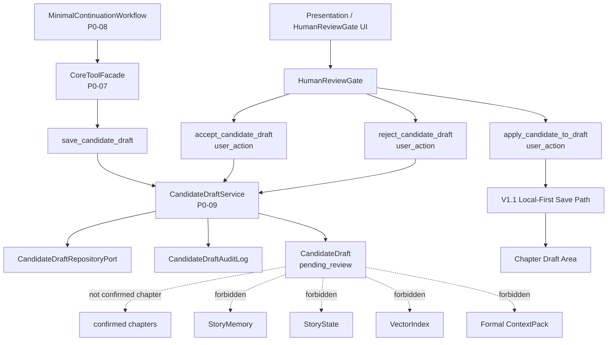
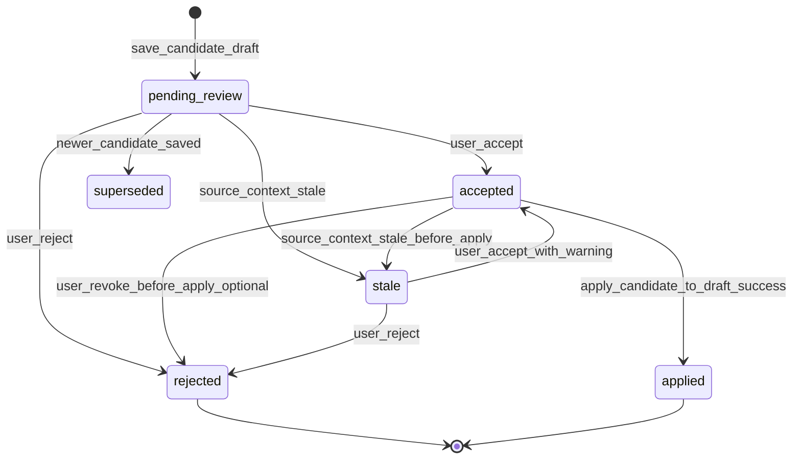

# InkTrace V2.0-P0-09 CandidateDraft 与 HumanReviewGate 详细设计

版本：v2.0-p0-detail-09  
状态：P0 模块级详细设计  
依据文档：

- `docs/01_requirements/InkTrace-V2.0-需求规格说明书.md`
- `docs/07_overview/InkTrace-V2.0-概要设计说明书.md`
- `docs/02_architecture/InkTrace-V2.0-架构设计说明书.md`
- `docs/03_design/InkTrace-V2.0-P0-详细设计总纲.md`
- `docs/03_design/InkTrace-V2.0-P0-01-AI基础设施详细设计.md`
- `docs/03_design/InkTrace-V2.0-P0-02-AIJobSystem详细设计.md`
- `docs/03_design/InkTrace-V2.0-P0-03-初始化流程详细设计.md`
- `docs/03_design/InkTrace-V2.0-P0-04-StoryMemory与StoryState详细设计.md`
- `docs/03_design/InkTrace-V2.0-P0-05-VectorRecall详细设计.md`
- `docs/03_design/InkTrace-V2.0-P0-06-ContextPack详细设计.md`
- `docs/03_design/InkTrace-V2.0-P0-07-ToolFacade与权限详细设计.md`
- `docs/03_design/InkTrace-V2.0-P0-08-MinimalContinuationWorkflow详细设计.md`

---

## 一、文档定位与设计范围

### 1.1 文档定位

本文档是 InkTrace V2.0-P0 的第九个模块级详细设计文档，仅覆盖 P0 CandidateDraft 与 HumanReviewGate。

CandidateDraft 是 AI 生成结果进入正式章节草稿区之前的候选稿容器。HumanReviewGate 是用户确认门，负责保证 AI 输出不会绕过人工确认、不会静默写入正式正文、不会直接影响 StoryMemory / StoryState / VectorIndex / 正式 ContextPack。

本文档不替代 P0-08 MinimalContinuationWorkflow，不写代码、不修改源码、不生成数据库迁移、不拆 Task、不进入开发计划。

### 1.2 设计范围

本模块覆盖：

- CandidateDraft。
- CandidateDraftVersion，可选。
- CandidateDraftStatus。
- CandidateDraftSource。
- CandidateDraftReviewDecision。
- CandidateDraftService。
- HumanReviewGate。
- CandidateDraftRepositoryPort。
- CandidateDraftAuditLog。
- save_candidate_draft。
- list_candidate_drafts。
- get_candidate_draft。
- reject_candidate_draft。
- accept_candidate_draft。
- apply_candidate_to_draft。
- CandidateDraft 与正式章节草稿区的边界。
- CandidateDraft 与 V1.1 Local-First 保存链路的边界。
- CandidateDraft 与 StoryMemory / StoryState / VectorIndex 的边界。
- CandidateDraft 与 ContextPack 的边界。
- CandidateDraft 与 Quick Trial 的边界。
- CandidateDraft 的幂等、防重复、版本与状态流转。
- HumanReviewGate 的用户确认边界。
- 错误处理。
- 安全、隐私与日志。

### 1.3 本文档不覆盖

P0-09 不覆盖：

- 完整 Agent Runtime。
- AgentSession / AgentStep / AgentObservation / AgentTrace。
- 五 Agent Workflow。
- 完整 AI Suggestion / Conflict Guard。
- 完整 Story Memory Revision。
- 复杂 Knowledge Graph。
- Citation Link。
- @ 标签引用系统。
- 复杂多路召回融合。
- 自动连续续写队列。
- 成本看板。
- 分析看板。
- AI 自动冲突解决。
- 复杂三方 merge。
- 复杂 CandidateDraft 多版本树。
- StoryMemory / StoryState reanalysis 内部流程。
- VectorIndex reindex 内部流程。
- P0-11 API DTO / 数据库表结构。

---

## 二、P0 CandidateDraft / HumanReviewGate 目标

### 2.1 核心目标

P0 CandidateDraft / HumanReviewGate 的目标是：

- 保存 AI 续写产生的候选稿。
- 将 AI 输出与正式正文隔离。
- 为用户展示候选稿、来源、warning、degraded / stale 信息。
- 支持用户接受、拒绝、暂不处理。
- 支持用户接受后将候选稿应用到章节草稿区。
- 保证应用正文必须经过 V1.1 Local-First 保存链路。
- 保证 ToolFacade / Workflow / Agent / Model 不得伪造用户确认。
- 保证未接受、未应用的 CandidateDraft 不影响 StoryMemory / StoryState / VectorIndex / 正式 ContextPack。

### 2.2 核心边界

必须明确：

- CandidateDraft 是 AI 生成结果的候选稿，不是正式正文。
- CandidateDraft 不属于 confirmed chapters。
- CandidateDraft 不直接进入 StoryMemory。
- CandidateDraft 不直接进入 StoryState。
- CandidateDraft 不直接进入 VectorIndex。
- CandidateDraft 不直接进入正式 ContextPack。
- CandidateDraft 不直接更新 initialization_status。
- CandidateDraft 不直接更新章节正文。
- HumanReviewGate 是 AI 输出进入正式草稿区前的人工确认门。
- 用户接受 CandidateDraft 后，仍必须进入 V1.1 Local-First 正文保存链路。
- ToolFacade / Workflow / Agent / Model 不得伪造用户确认。
- Quick Trial 输出默认不是 CandidateDraft。
- Quick Trial 输出只有用户明确“保存为候选稿”时才进入 CandidateDraft 流程。
- P0-09 不负责重新分析 StoryMemory / StoryState。
- P0-09 不负责自动 reindex。
- CandidateDraft 被接受并应用后，后续 reanalysis / reindex 由 P0-03 / P0-04 / P0-05 的流程或后续设计处理。

### 2.3 继承 P0-08 的冻结结论

P0-09 继承 P0-08 以下规则：

- MinimalContinuationWorkflow 输出的是 CandidateDraft，后续由 P0-09 HumanReviewGate 处理。
- save_candidate_draft 只写候选稿。
- CandidateDraft 不属于 confirmed chapters。
- 未接受 CandidateDraft 不进入 StoryMemory / StoryState / VectorIndex / 正式 ContextPack。
- HumanReviewGate 之前的 AI 输出不能影响正式 StoryState。
- accept_candidate_draft / apply_candidate_to_draft 属于 P0-09。
- 用户接受 CandidateDraft 后仍需进入 V1.1 Local-First 保存链路。
- Workflow / ToolFacade 不得伪造用户确认。
- save_candidate_draft 必须使用 idempotency_key 或等价去重机制。
- retry / resume 不得重复创建 CandidateDraft。
- duplicate save_candidate_draft 应返回已有 candidate_draft_id 或 duplicate_request。
- candidate_save_failed 不写正式正文。
- Quick Trial 默认不 save_candidate_draft。
- Quick Trial 只有用户明确“保存为候选稿”时才进入 P0-09 CandidateDraft 流程。
- Quick Trial 的 candidate_draft_id 默认为空。
- Quick Trial 输出不得自动进入正式 CandidateDraft。

---

## 三、模块边界与不做事项

### 3.1 P0 做什么

P0-09 必须完成：

- 定义 CandidateDraft 最小数据模型。
- 定义 CandidateDraft 状态与状态流转。
- 定义 CandidateDraftSource。
- 定义 CandidateDraftReviewDecision。
- 定义 CandidateDraftService 的职责边界。
- 定义 save_candidate_draft 的输入、输出、幂等、防重复规则。
- 定义 accept_candidate_draft 的用户确认边界。
- 定义 apply_candidate_to_draft 的 Local-First 保存边界。
- 定义 reject_candidate_draft 的审计边界。
- 定义 CandidateDraft 与正式上下文、正式资产的隔离规则。
- 定义 Quick Trial 保存为候选稿的受控入口。
- 定义错误处理、安全、隐私和日志边界。

### 3.2 P0 不做什么

P0-09 不做：

- 不重新生成 AI 正文。
- 不执行 AI 输出校验。
- 不调用 ModelRouter。
- 不调用 Provider。
- 不直接写 StoryMemory。
- 不直接写 StoryState。
- 不直接写 VectorIndex。
- 不自动 reanalysis。
- 不自动 reindex。
- 不直接写 confirmed chapters。
- 不绕过 V1.1 Local-First 保存链路。
- 不绕过 HumanReviewGate。
- 不允许 Workflow / ToolFacade / AI 模型伪造用户确认。
- 不实现复杂三方 merge。
- 不实现 AI 自动冲突解决。
- 不实现复杂多版本候选树。

### 3.3 禁止行为

禁止：

- save_candidate_draft 写正式正文。
- validation_failed 后保存 CandidateDraft。
- CandidateDraft 自动进入 StoryMemory / StoryState / VectorIndex。
- CandidateDraft 自动进入正式 ContextPack。
- accept_candidate_draft 由 Workflow / ToolFacade / AI 模型触发。
- apply_candidate_to_draft 绕过 V1.1 Local-First 保存链路。
- Quick Trial 输出自动变成 CandidateDraft。
- Quick Trial 保存为候选稿后自动 apply。
- stale CandidateDraft 静默应用。
- chapter_version_conflict 时自动覆盖用户正文。
- 普通日志记录完整 CandidateDraft 内容、完整正文、完整 Prompt、完整 ContextPack、API Key。

---

## 四、总体架构

### 4.1 模块关系说明

P0-09 位于 Core Application + Domain + Repository Port 的候选稿与人审门控边界内。

关系：

- P0-08 MinimalContinuationWorkflow 通过 ToolFacade 调用 save_candidate_draft。
- CandidateDraftService 保存 CandidateDraft，默认 status = pending_review。
- HumanReviewGate 展示 CandidateDraft 和 warning，并等待用户动作。
- user_action 触发 accept_candidate_draft 或 reject_candidate_draft。
- apply_candidate_to_draft 在 accepted 后触发，并进入 V1.1 Local-First 保存链路。
- apply 成功后 CandidateDraft.status = applied。
- apply 失败不得标记 applied。
- CandidateDraft 的任何状态变化不得自动更新 StoryMemory / StoryState / VectorIndex。

### 4.2 模块关系图

### 4.3 与相邻模块的边界

| 模块 | 关系 | 边界 |
|---|---|---|
| P0-06 ContextPack | CandidateDraft 生成前的上下文来源 | CandidateDraft 不回写 ContextPack |
| P0-07 ToolFacade | save_candidate_draft 受控工具入口 | accept / apply 不得由 AI 工具伪造 user_action |
| P0-08 MinimalContinuationWorkflow | 产生候选稿并调用 save_candidate_draft | Workflow 不接受、不应用 CandidateDraft |
| V1.1 Local-First | apply_candidate_to_draft 的正文保存链路 | apply 不得绕过本地优先保存 |
| P0-03 / P0-04 / P0-05 | applied 后可能触发 stale / reanalysis / reindex | P0-09 只定义边界，不执行重建流程 |

### 4.4 禁止调用路径

禁止：

- CandidateDraftService -> ModelRouter。
- CandidateDraftService -> Provider SDK。
- CandidateDraftService -> StoryMemoryRepositoryPort 写入。
- CandidateDraftService -> StoryStateRepositoryPort 写入。
- CandidateDraftService -> VectorStorePort / VectorIndex 写入。
- Workflow / ToolFacade / AI 模型 -> accept_candidate_draft 伪造用户确认。
- Workflow / ToolFacade / AI 模型 -> apply_candidate_to_draft 伪造用户确认。
- apply_candidate_to_draft -> confirmed_chapter_analysis 直接写入。

---

## 五、CandidateDraft 数据模型设计

### 5.1 CandidateDraft 定义

CandidateDraft 是 AI 生成文本在正式进入章节草稿区之前的候选稿记录。

CandidateDraft 保存 AI 生成内容或安全内容引用、来源、校验结果、上下文状态、warning、幂等信息、人审状态和审计关联。CandidateDraft 不等于正式正文，也不等于 confirmed chapters。

### 5.2 CandidateDraft 字段方向

| 字段 | 说明 | P0 必须 | 来源 |
|---|---|---|---|
| candidate_draft_id | 候选稿 ID | 是 | CandidateDraftService |
| work_id | 作品 ID | 是 | Workflow / request |
| target_chapter_id | 目标章节 ID | 是 | WritingTask |
| target_chapter_order | 目标章节顺序 | 是 | WritingTask |
| writing_task_id | WritingTask ID | 是 | P0-08 |
| workflow_id | Workflow ID | 是 | P0-08 |
| job_id | AIJob ID | 可选 | P0-02 / P0-08 |
| source | CandidateDraftSource | 是 | Workflow / user_action |
| status | CandidateDraftStatus | 是 | CandidateDraftService |
| content_text 或 content_ref | 候选稿正文或安全引用 | 是 | run_writer_step 输出 |
| content_summary | 候选稿摘要 | 可选 | save_candidate_draft |
| model_name | 模型名称 | 可选 | LLMCallLog / WritingGenerationResult |
| provider_name | Provider 名称 | 可选 | LLMCallLog / WritingGenerationResult |
| prompt_template_key | PromptTemplate key | 可选 | P0-01 |
| context_pack_id | ContextPack ID | 可选 | P0-06 |
| context_pack_status | ready / degraded / blocked 来源状态 | 可选 | P0-06 |
| degraded_reasons | degraded 原因 | 是 | ContextPack / Workflow |
| warnings | warning 列表 | 是 | Workflow / Validator |
| validation_status | validation success / failed | 是 | OutputValidationService |
| validation_errors | 校验错误 | 可选 | OutputValidationService |
| idempotency_key | 幂等 key | 是 | ToolFacade / Workflow |
| idempotency_scope | 幂等作用域 | 是 | CandidateDraftService |
| created_by | system / workflow / user_action | 是 | 调用方 |
| created_at | 创建时间 | 是 | Repository |
| updated_at | 更新时间 | 是 | Repository |
| reviewed_by | 审核用户 | 可选 | HumanReviewGate |
| reviewed_at | 审核时间 | 可选 | HumanReviewGate |
| review_decision | accept / reject | 可选 | HumanReviewGate |
| applied_at | 应用时间 | 可选 | apply_candidate_to_draft |
| applied_chapter_id | 应用章节 ID | 可选 | Local-First 保存链路 |
| apply_result_ref | 应用结果安全引用 | 可选 | Local-First 保存链路 |
| stale_status | fresh / stale | 可选 | reanalysis / context change |
| stale_reason | stale 原因 | 可选 | Application Service |
| request_id | 请求 ID | 是 | Workflow / ToolFacade |
| trace_id | Trace ID | 是 | Workflow / ToolFacade |

### 5.3 CandidateDraftSource

| source | 含义 | P0 默认 |
|---|---|---|
| minimal_continuation_workflow | 正式最小续写 Workflow 生成并保存 | 必须支持 |
| quick_trial_saved_by_user | Quick Trial 输出由用户明确保存为候选稿 | 必须支持 |
| retry_resume | retry / resume 路径复用或保存候选稿 | 必须支持 |
| manual_import | 用户手动导入候选稿 | P0 可不实现 |

规则：

- Quick Trial 输出默认不是 CandidateDraft。
- Quick Trial 只有用户明确“保存为候选稿”时，source 才能是 quick_trial_saved_by_user。
- manual_import 仅作为可选扩展，不作为 P0 必须实现能力。

### 5.4 CandidateDraftStatus

| status | 含义 | P0 说明 |
|---|---|---|
| pending_review | 候选稿已保存，等待用户确认 | 默认保存状态 |
| accepted | 用户已接受，但不一定已写入章节草稿区 | accept 后状态 |
| rejected | 用户拒绝候选稿 | 终态方向 |
| applied | 已通过 V1.1 Local-First 保存链路应用到章节草稿区 | 终态方向 |
| stale | 候选稿生成依据可能过期 | 可在 warning 下处理 |
| superseded | 被新的候选稿替代 | 可选 |
| failed | 保存后处理失败 | 不建议作为常规状态 |

规则：

- pending_review 表示候选稿已保存，等待用户确认。
- accepted 表示用户已接受，但不一定已经写入正式草稿区。
- applied 表示已通过 V1.1 Local-First 保存链路应用到章节草稿区。
- rejected 表示用户拒绝。
- stale 表示候选稿生成依据可能过期。
- superseded 表示被新的候选稿替代，可选。
- failed 不建议作为常规 CandidateDraft 状态，保存失败应在 Workflow / ToolResult 层表达。

### 5.5 CandidateDraftReviewDecision

| decision | 含义 |
|---|---|
| accept | 用户接受候选稿 |
| reject | 用户拒绝候选稿 |
| defer | 用户暂不处理 |

规则：

- accept / reject 必须来自 user_action。
- defer 不改变 CandidateDraft 正式状态，可保留 pending_review。
- review_decision 可记录到 CandidateDraftAuditLog。

---

## 六、CandidateDraft 状态机设计

### 6.1 状态流转图

### 6.2 P0 简化状态

P0 可以简化为：

- pending_review。
- accepted。
- rejected。
- applied。
- stale。

superseded 可选，failed 不作为常规状态使用。

### 6.3 状态规则

规则：

- pending_review 是默认保存状态。
- 用户接受是 HumanReviewGate 的明确动作。
- ToolFacade / Workflow / AI 模型不得触发 user_accept。
- accepted 不等于 applied。
- applied 需要走 V1.1 Local-First 保存链路。
- rejected / applied 状态一般不再回退。
- CandidateDraft 状态变化不得自动更新 StoryMemory / StoryState / VectorIndex。
- stale candidate 是否允许接受需要明确 warning。
- P0 默认允许用户在 warning 下接受 stale candidate，但必须标记 stale_context_warning。
- stale candidate apply 时必须二次确认或 warning。
- P0 不要求复杂多版本分支。

---

## 七、CandidateDraftService 设计

### 7.1 职责

CandidateDraftService 负责：

- save_candidate_draft。
- get_candidate_draft。
- list_candidate_drafts。
- reject_candidate_draft。
- accept_candidate_draft。
- apply_candidate_to_draft。
- mark_candidate_stale。
- mark_candidate_superseded，可选。
- check_idempotency。
- record_review_decision。
- record_audit_log。

### 7.2 输入输出边界

CandidateDraftService 接收来自 Workflow / ToolFacade / HumanReviewGate / user_action 的请求，返回结构化结果或安全错误。

CandidateDraftService 不返回裸内部对象，不将完整候选稿内容写入普通日志，不暴露 Repository 内部实现。

### 7.3 不允许做的事情

CandidateDraftService 不允许：

- 不直接写正式正文。
- 不直接写 StoryMemory。
- 不直接写 StoryState。
- 不直接写 VectorIndex。
- 不直接调用 ModelRouter。
- 不调用 Provider。
- 不重新生成正文。
- 不执行 AI 校验。
- 不绕过 V1.1 Local-First 保存链路。
- 不伪造用户确认。

### 7.4 方法规则

| 方法 | 触发方 | P0 规则 |
|---|---|---|
| save_candidate_draft | Workflow / ToolFacade | 只保存候选稿，默认 pending_review |
| get_candidate_draft | UI / Application | 读取候选稿详情，普通日志不得记录完整内容 |
| list_candidate_drafts | UI / Application | 列出候选稿摘要和状态 |
| accept_candidate_draft | user_action | 必须由用户触发 |
| reject_candidate_draft | user_action / 用户明确批量清理 | 必须审计 |
| apply_candidate_to_draft | user_action | 必须 accepted 后执行，进入 Local-First |
| mark_candidate_stale | Application Service | 仅标记候选稿 stale，不删除 |
| mark_candidate_superseded | Application Service | 可选，标记旧候选稿被替代 |

---

## 八、save_candidate_draft 设计

### 8.1 输入

save_candidate_draft 输入至少包含：

| 字段 | 说明 | P0 必须 |
|---|---|---|
| work_id | 作品 ID | 是 |
| target_chapter_id | 目标章节 ID | 是 |
| target_chapter_order | 目标章节顺序 | 是 |
| writing_task_id | WritingTask ID | 是 |
| workflow_id | Workflow ID | 是 |
| job_id | AIJob ID | 可选 |
| generated_content 或 content_ref | 生成内容或安全引用 | 是 |
| validation_result | 输出校验结果 | 是 |
| context_pack_id | ContextPack ID | 可选 |
| context_pack_status | ready / degraded | 可选 |
| degraded_reasons | degraded 原因 | 是 |
| warnings | warning 列表 | 是 |
| source | CandidateDraftSource | 是 |
| idempotency_key | 幂等 key | 是 |
| request_id | 请求 ID | 是 |
| trace_id | Trace ID | 是 |

### 8.2 输出

save_candidate_draft 输出至少包含：

| 字段 | 说明 |
|---|---|
| candidate_draft_id | 候选稿 ID |
| status | pending_review |
| duplicate_of | 重复请求对应的已有 candidate_draft_id，可选 |
| warnings | warning 列表 |
| request_id | 请求 ID |
| trace_id | Trace ID |

### 8.3 保存规则

规则：

- save_candidate_draft 只写 CandidateDraft。
- save_candidate_draft 不写正式正文。
- save_candidate_draft 不更新 StoryMemory / StoryState / VectorIndex。
- save_candidate_draft 不改变 initialization_status。
- save_candidate_draft 需要 validation_result 成功。
- validation_failed 不得 save_candidate_draft。
- content 为空不得保存，返回 candidate_content_empty。
- target_chapter_id 缺失不得保存。
- work_id / target_chapter_id 必须匹配。
- idempotency_key 必须参与去重。
- 同一 idempotency_scope 下重复保存返回已有 candidate_draft_id。
- 同一 idempotency_key 但参数摘要不一致，返回 idempotency_conflict。
- degraded ContextPack 生成的 CandidateDraft 可以保存，但必须保留 degraded_reasons / warnings。
- stale ContextPack 生成的 CandidateDraft 如允许保存，必须标记 stale_context_warning。
- Quick Trial 默认不调用 save_candidate_draft。
- Quick Trial 只有用户明确“保存为候选稿”时才可调用 save_candidate_draft，source = quick_trial_saved_by_user。
- 普通日志不得记录完整 generated_content。

### 8.4 validation 前置

save_candidate_draft 只接受通过 validate_writer_output 的输出。

如果 validation_result 缺失，返回 candidate_validation_missing。  
如果 validation_result failed，返回 candidate_validation_failed。  
这两种情况都不得创建 CandidateDraft。

---

## 九、idempotency_key 与防重复设计

### 9.1 幂等目标

idempotency_key 是防止 retry / resume 重复创建 CandidateDraft 的关键。

P0 对 save_candidate_draft 必须支持 idempotency_key 或等价去重机制。

### 9.2 幂等作用范围

建议 idempotency_scope 包含：

- work_id。
- job_id。
- step_id，可选。
- workflow_id。
- writing_task_id。
- tool_name = save_candidate_draft。
- idempotency_key。

### 9.3 重复请求处理

重复调用且参数摘要一致：

- 返回已有 candidate_draft_id。
- 不创建新 CandidateDraft。
- 返回 duplicate_request / existing_candidate_ref。

重复调用但参数摘要不一致：

- 返回 idempotency_conflict。
- 不创建新 CandidateDraft。
- 需要人工处理或重新生成 idempotency_key。

### 9.4 idempotency_key 缺失

P0 默认策略：

- 正式 Workflow 的 save_candidate_draft 必须带 idempotency_key。
- idempotency_key 缺失时，candidate_write failed，error_code = idempotency_key_missing。
- Quick Trial 保存为候选稿时也必须生成 idempotency_key。
- idempotency_key 不得包含正文、Prompt、API Key 或敏感信息。
- ToolAuditLog 可记录 idempotency_key hash，不记录敏感原文。
- P0 不要求复杂全局幂等存储。
- P0 不要求长期幂等 key 失效策略，后续由 P0-11 / 实现设计补充。

---

## 十、HumanReviewGate 设计

### 10.1 定义

HumanReviewGate 是用户确认门，不是 AI 校验器。

它负责向用户展示 CandidateDraft、来源、warning、degraded / stale / validation 信息，并接收用户明确动作。

### 10.2 职责

HumanReviewGate 负责：

- 展示 CandidateDraft 给用户。
- 展示生成来源与 warnings。
- 展示 degraded / stale / validation warning。
- 允许用户接受。
- 允许用户拒绝。
- 允许用户暂不处理。
- 防止 AI / Workflow / ToolFacade 伪造确认。
- 记录用户 decision。
- 触发 accept_candidate_draft。
- 触发 apply_candidate_to_draft，可选分步。

### 10.3 不允许做的事情

HumanReviewGate 不允许：

- 不重新生成文本。
- 不调用 Provider。
- 不更新 StoryMemory / StoryState / VectorIndex。
- 不自动 reanalysis。
- 不静默 apply。
- 不绕过 V1.1 Local-First 保存链路。
- 不让 AI / Workflow / ToolFacade 伪造用户确认。

### 10.4 accept / apply 语义

P0 推荐两步语义：

- accept_candidate_draft：用户接受候选稿。
- apply_candidate_to_draft：将候选稿应用到章节草稿区并走 V1.1 Local-First 保存链路。

如果实现上 UI 一次点击完成 accept + apply，也必须在服务内部保留两个语义阶段。

---

## 十一、accept_candidate_draft 设计

### 11.1 输入

accept_candidate_draft 输入至少包含：

| 字段 | 说明 |
|---|---|
| candidate_draft_id | 候选稿 ID |
| work_id | 作品 ID |
| target_chapter_id | 目标章节 ID |
| user_id | 用户 ID，可选 |
| review_decision | accept |
| request_id | 请求 ID |
| trace_id | Trace ID |

### 11.2 输出

accept_candidate_draft 输出至少包含：

| 字段 | 说明 |
|---|---|
| candidate_draft_id | 候选稿 ID |
| status | accepted |
| warnings | warning 列表 |
| request_id | 请求 ID |
| trace_id | Trace ID |

### 11.3 规则

规则：

- 只能由 user_action 调用。
- ToolFacade / Workflow / AI 模型不得调用 accept_candidate_draft 冒充用户。
- candidate 必须存在。
- candidate 必须属于当前 work_id。
- candidate target_chapter_id 必须匹配。
- candidate status 必须是 pending_review 或 stale。
- rejected candidate 默认不能 accept。
- applied candidate 不能重复 accept。
- stale candidate 可以在 warning 下 accept，必须记录 stale_context_warning。
- accept 不等于 apply。
- accept 不写正式正文。
- accept 不更新 StoryMemory / StoryState / VectorIndex。
- accept 必须记录 CandidateDraftAuditLog。

---

## 十二、apply_candidate_to_draft 设计

### 12.1 输入

apply_candidate_to_draft 输入至少包含：

| 字段 | 说明 |
|---|---|
| candidate_draft_id | 候选稿 ID |
| work_id | 作品 ID |
| target_chapter_id | 目标章节 ID |
| apply_mode | 应用模式 |
| user_id | 用户 ID，可选 |
| request_id | 请求 ID |
| trace_id | Trace ID |

### 12.2 apply_mode

| apply_mode | 含义 | P0 说明 |
|---|---|---|
| append_to_chapter_end | 追加到章节末尾 | P0 推荐支持 |
| replace_selection | 替换当前选区 | P0 推荐支持 |
| insert_at_cursor | 插入到光标位置 | P0 推荐支持 |
| replace_chapter_draft | 替换章节草稿 | P0 谨慎，可选 |

### 12.3 输出

apply_candidate_to_draft 输出至少包含：

| 字段 | 说明 |
|---|---|
| candidate_draft_id | 候选稿 ID |
| applied_chapter_id | 应用章节 ID |
| status | applied |
| apply_result_ref | 应用结果安全引用 |
| warnings | warning 列表 |
| request_id | 请求 ID |
| trace_id | Trace ID |

### 12.4 规则

规则：

- apply_candidate_to_draft 必须由 user_action 触发。
- candidate 必须 accepted。
- candidate 必须未 applied。
- candidate target_chapter_id 必须匹配。
- apply_candidate_to_draft 不绕过 V1.1 Local-First 正文保存链路。
- apply 后更新的是章节草稿区 / 正文草稿，不直接等于 confirmed chapter analysis。
- apply 后不得立即更新 StoryMemory / StoryState。
- apply 后不得立即写 VectorIndex。
- apply 后是否触发 reanalysis / stale 标记由 P0-03 / P0-04 / P0-05 或后续设计处理。
- apply 失败不得改变 candidate status 为 applied。
- apply 成功后 candidate status = applied。
- apply_result_ref 只保存安全引用，不记录完整正文到普通日志。
- 如果 target chapter 已被用户修改，P0 默认应检测 content_version / draft_revision，冲突时返回 chapter_version_conflict，不自动覆盖。
- P0 不做复杂三方 merge。
- P0 不做 AI 自动冲突解决。

---

## 十三、reject_candidate_draft 设计

### 13.1 输入

reject_candidate_draft 输入至少包含：

| 字段 | 说明 |
|---|---|
| candidate_draft_id | 候选稿 ID |
| work_id | 作品 ID |
| user_id | 用户 ID，可选 |
| review_decision | reject |
| reason | 拒绝原因，可选 |
| request_id | 请求 ID |
| trace_id | Trace ID |

### 13.2 规则

规则：

- reject 必须由 user_action 触发，或用户明确批量清理。
- rejected candidate 不写正式正文。
- rejected candidate 不更新 StoryMemory / StoryState / VectorIndex。
- rejected candidate 可保留用于审计或历史，但普通日志不记录完整内容。
- rejected candidate 默认不能再次 apply。
- 如允许重新打开 rejected candidate，属于 P1 / 后续设计，P0 不做。
- reject 必须记录 CandidateDraftAuditLog。

---

## 十四、CandidateDraft 与正式正文 / Local-First 保存链路

规则：

- CandidateDraft 不是正式正文。
- CandidateDraft 保存不触发正式正文保存。
- accept_candidate_draft 不触发正式正文保存。
- apply_candidate_to_draft 才进入章节草稿区 / 正文草稿修改。
- apply_candidate_to_draft 必须走 V1.1 Local-First 保存链路。
- apply 不得绕过本地优先保存。
- apply 不得直接写 confirmed chapters。
- apply 不得直接写 StoryMemory / StoryState / VectorIndex。
- apply 后章节变更如何触发 stale / reanalysis，由 P0-03 / P0-04 / P0-05 或后续设计承接。
- apply 与用户手动编辑正文的保存链路保持一致。
- 如果保存失败，CandidateDraft 不得标记 applied。
- 如果本地草稿区版本冲突，返回 chapter_version_conflict。

---

## 十五、CandidateDraft 与 ContextPack / StoryMemory / StoryState / VectorIndex

规则：

- CandidateDraft 不进入正式 ContextPack。
- 未接受 CandidateDraft 不进入 ContextPack。
- accepted 但未 applied 的 CandidateDraft 仍不进入正式 ContextPack。
- applied 后的正文变化，需要通过正式正文保存链路和后续 reanalysis 才能影响 ContextPack。
- CandidateDraft 不写 StoryMemory。
- CandidateDraft 不写 StoryState。
- CandidateDraft 不写 VectorIndex。
- CandidateDraft 不改变 initialization_status。
- CandidateDraft stale 不等于 StoryMemory stale。
- CandidateDraft stale 只说明候选稿生成依据可能过期。
- Quick Trial 输出默认不进入 CandidateDraft。
- Quick Trial 保存为候选稿后，也仍然不进入正式上下文，除非用户后续接受并应用到正文，再经过相应分析流程。

---

## 十六、版本、冲突与 stale 处理

### 16.1 版本边界

规则：

- CandidateDraft 应记录生成时的 target_chapter_id 和可选 chapter_revision / content_version。
- apply_candidate_to_draft 时应校验 target chapter 当前版本是否与生成时一致或兼容。
- 如果版本不一致，P0 默认返回 chapter_version_conflict，不自动覆盖。
- P0 不做复杂三方 merge。
- P0 不做 AI 自动冲突解决。

### 16.2 stale 规则

规则：

- 如果 StoryMemory / StoryState / ContextPack 在生成后 stale，CandidateDraft 可标记 stale。
- stale CandidateDraft 默认仍可展示。
- stale CandidateDraft 接受时必须 warning。
- stale CandidateDraft apply 时必须二次确认或 warning。
- P0 不自动删除 stale CandidateDraft。
- CandidateDraft stale 不会自动更新 StoryMemory / StoryState / VectorIndex。

### 16.3 版本与 superseded

规则：

- 新 CandidateDraft 生成后，可以将旧 pending_review 标记 superseded，可选。
- P0 不要求完整 CandidateDraft 多版本树。
- CandidateDraftVersion 可选，P0 可以只保留当前候选稿记录和审计日志。
- 如果实现 CandidateDraftVersion，必须不影响 P0 简化状态机。

---

## 十七、Quick Trial 保存为候选稿边界

规则：

- Quick Trial 输出默认不是 CandidateDraft。
- Quick Trial 输出默认不保存。
- Quick Trial 输出默认 candidate_draft_id 为空。
- Quick Trial 输出必须标记 context_insufficient / degraded_context。
- stale 状态下 Quick Trial 输出还必须标记 stale_context。
- 用户明确点击“保存为候选稿”后，才可调用 save_candidate_draft。
- 此时 source = quick_trial_saved_by_user。
- 保存后 status = pending_review。
- 仍需 HumanReviewGate。
- 不得自动 apply。
- 不得绕过 V1.1 Local-First 保存链路。
- 不得更新 StoryMemory / StoryState / VectorIndex。
- Quick Trial 保存为候选稿也必须使用 idempotency_key。

---

## 十八、错误处理与降级

| 场景 | error_code / status | P0 行为 | 正式正文影响 |
|---|---|---|---|
| 候选稿内容为空 | candidate_content_empty | failed，不保存 CandidateDraft | 不影响 |
| validation_result 缺失 | candidate_validation_missing | failed，不保存 CandidateDraft | 不影响 |
| validation_result failed | candidate_validation_failed | failed，不保存 CandidateDraft | 不影响 |
| idempotency_key 缺失 | idempotency_key_missing | 正式 Workflow save failed | 不影响 |
| 重复请求 | duplicate_request | 返回已有 candidate_draft_id | 不影响 |
| 幂等冲突 | idempotency_conflict | 不创建新 CandidateDraft，等待人工处理 | 不影响 |
| candidate 不存在 | candidate_not_found | failed / not found | 不影响 |
| work 不匹配 | candidate_work_mismatch | permission / validation failed | 不影响 |
| chapter 不匹配 | candidate_chapter_mismatch | validation failed | 不影响 |
| 状态不允许 | candidate_status_invalid | blocked / failed | 不影响 |
| 已 applied | candidate_already_applied | blocked | 不影响 |
| 已 rejected | candidate_already_rejected | blocked | 不影响 |
| stale candidate | stale_candidate_warning | 可在 warning 下处理 | 不影响 |
| 章节版本冲突 | chapter_version_conflict | 不自动覆盖用户正文 | 不影响 |
| Local-First 保存失败 | local_first_save_failed | apply failed，不标记 applied | 不影响 |
| 候选稿保存失败 | candidate_save_failed | failed，不写正式正文 | 不影响 |
| 接受失败 | candidate_accept_failed | failed，不写正式正文 | 不影响 |
| 应用失败 | candidate_apply_failed | failed，不标记 applied | 不影响 |
| 拒绝失败 | candidate_reject_failed | failed，保留原状态 | 不影响 |
| 需要人审 | human_review_required | 受控阻断状态，不是系统错误 | 不影响 |
| 缺少用户确认 | user_confirmation_required | blocked，不继续 apply | 不影响 |
| 权限不足 | permission_denied | blocked / failed | 不影响 |
| 审计日志失败 | audit_log_failed | 继承 P0-07，按副作用级别处理 | 不影响 |
| Quick Trial 缺少用户保存动作 | quick_trial_save_requires_user_action | blocked，不保存 CandidateDraft | 不影响 |
| 上下文 stale warning | context_stale_warning | warning，要求展示 | 不影响 |

错误规则：

- human_review_required 不是系统错误，而是受控阻断状态。
- user_confirmation_required 表示缺少用户确认，不能继续 apply。
- idempotency_key_missing 对正式 Workflow save_candidate_draft 应 failed。
- duplicate_request 返回已有 candidate_draft_id。
- idempotency_conflict 不创建新 CandidateDraft。
- chapter_version_conflict 不自动覆盖用户正文。
- local_first_save_failed 时 CandidateDraft 不得标记 applied。
- apply 失败不得写 StoryMemory / StoryState / VectorIndex。
- audit_log_failed 规则继承 P0-07。
- 所有错误不得破坏正式正文。
- 所有错误不得覆盖用户原始大纲。
- 所有错误不得更新 StoryMemory / StoryState / VectorIndex。
- 普通日志不得记录完整 CandidateDraft 内容。

---

## 十九、安全、隐私与日志

### 19.1 普通日志边界

普通日志不得记录：

- 完整 CandidateDraft 内容。
- 完整正文。
- 完整 Prompt。
- 完整 ContextPack。
- 完整 user_instruction。
- API Key。

### 19.2 CandidateDraftAuditLog

CandidateDraftAuditLog 记录：

- candidate_draft_id。
- work_id。
- target_chapter_id。
- status change。
- review_decision。
- user_id，可选。
- request_id。
- trace_id。
- error_code。
- safe refs。

CandidateDraftAuditLog 不记录：

- 完整候选稿内容。
- 完整正文。
- 完整 Prompt。
- 完整 ContextPack。
- API Key。

### 19.3 日志继承关系

规则：

- ToolAuditLog 继承 P0-07。
- Workflow 日志继承 P0-08。
- LLMCallLog 继承 P0-01。
- CandidateDraft 内容不进入普通日志。
- apply_result_ref 只保存安全引用。
- idempotency_key 可记录 hash，不记录敏感原文。
- 清理 CandidateDraftAuditLog 不得删除正式正文、用户原始大纲、StoryMemory、StoryState、VectorIndex。
- CandidateDraft 内容清理策略可后续定义。
- 如果 CandidateDraft 内容长期保存，需要明确用户可删除 / 清理边界；P0 只给方向，不做完整策略。

---

## 二十、P0 验收标准

### 20.1 保存与幂等验收项

- [ ] save_candidate_draft 只写候选稿。
- [ ] save_candidate_draft 不写正式正文。
- [ ] save_candidate_draft 不更新 StoryMemory / StoryState / VectorIndex。
- [ ] validation_failed 不得 save_candidate_draft。
- [ ] 正式 Workflow save_candidate_draft 缺少 idempotency_key 时 failed。
- [ ] duplicate save_candidate_draft 不重复创建 CandidateDraft。
- [ ] idempotency_conflict 不创建 CandidateDraft。
- [ ] CandidateDraft 默认 status = pending_review。

### 20.2 正式上下文隔离验收项

- [ ] CandidateDraft 不属于 confirmed chapters。
- [ ] CandidateDraft 不进入正式 ContextPack。
- [ ] 未接受 CandidateDraft 不进入 StoryMemory / StoryState / VectorIndex。
- [ ] accepted 但未 applied 的 CandidateDraft 仍不进入正式 ContextPack。
- [ ] CandidateDraft 不改变 initialization_status。
- [ ] CandidateDraft 不触发自动 reanalysis。
- [ ] CandidateDraft 不触发自动 reindex。

### 20.3 HumanReviewGate 验收项

- [ ] accept_candidate_draft 必须由 user_action 触发。
- [ ] ToolFacade / Workflow / AI 模型不得伪造用户确认。
- [ ] accept_candidate_draft 不写正式正文。
- [ ] apply_candidate_to_draft 必须由 user_action 触发。
- [ ] apply_candidate_to_draft 必须走 V1.1 Local-First 保存链路。
- [ ] apply 成功后 CandidateDraft status = applied。
- [ ] apply 失败时 CandidateDraft 不得标记 applied。
- [ ] rejected CandidateDraft 不得 apply。
- [ ] stale CandidateDraft 接受 / 应用必须 warning。

### 20.4 Local-First 与冲突验收项

- [ ] chapter_version_conflict 不自动覆盖用户正文。
- [ ] apply 不直接写 confirmed chapters。
- [ ] apply 不直接写 StoryMemory / StoryState / VectorIndex。
- [ ] P0 不实现复杂三方 merge。
- [ ] P0 不实现 AI 自动冲突解决。
- [ ] P0 不实现复杂多版本候选树。

### 20.5 Quick Trial 验收项

- [ ] Quick Trial 输出默认不是 CandidateDraft。
- [ ] Quick Trial 输出默认不保存。
- [ ] Quick Trial 输出默认 candidate_draft_id 为空。
- [ ] Quick Trial 只有用户明确“保存为候选稿”时才调用 save_candidate_draft。
- [ ] Quick Trial 保存为候选稿后仍需 HumanReviewGate。
- [ ] Quick Trial 保存为候选稿也必须使用 idempotency_key。
- [ ] Quick Trial 保存为候选稿不更新 StoryMemory / StoryState / VectorIndex。

### 20.6 安全与不做事项验收项

- [ ] CandidateDraftAuditLog 不记录完整候选稿内容。
- [ ] 普通日志不记录完整正文、完整 Prompt、完整 ContextPack、完整 CandidateDraft、API Key。
- [ ] P0 不实现完整 Agent Runtime。
- [ ] P0 不实现五 Agent Workflow。
- [ ] P0 不实现 Citation Link。
- [ ] P0 不实现 @ 标签引用系统。
- [ ] P0 不实现自动连续续写队列。

