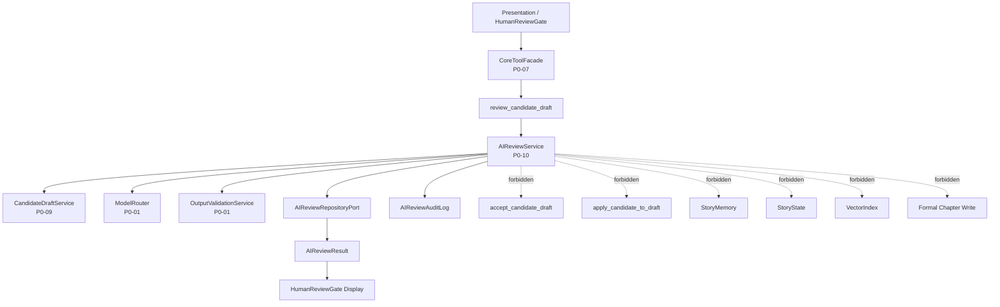

# InkTrace V2.0-P0-10 AIReview 详细设计

版本：v2.0-p0-detail-10  
状态：P0 模块级详细设计  
依据文档：

- `docs/01_requirements/InkTrace-V2.0-需求规格说明书.md`
- `docs/07_overview/InkTrace-V2.0-概要设计说明书.md`
- `docs/02_architecture/InkTrace-V2.0-架构设计说明书.md`
- `docs/03_design/InkTrace-V2.0-P0-详细设计总纲.md`
- `docs/03_design/InkTrace-V2.0-P0-01-AI基础设施详细设计.md`
- `docs/03_design/InkTrace-V2.0-P0-02-AIJobSystem详细设计.md`
- `docs/03_design/InkTrace-V2.0-P0-03-初始化流程详细设计.md`
- `docs/03_design/InkTrace-V2.0-P0-04-StoryMemory与StoryState详细设计.md`
- `docs/03_design/InkTrace-V2.0-P0-05-VectorRecall详细设计.md`
- `docs/03_design/InkTrace-V2.0-P0-06-ContextPack详细设计.md`
- `docs/03_design/InkTrace-V2.0-P0-07-ToolFacade与权限详细设计.md`
- `docs/03_design/InkTrace-V2.0-P0-08-MinimalContinuationWorkflow详细设计.md`
- `docs/03_design/InkTrace-V2.0-P0-09-CandidateDraft与HumanReviewGate详细设计.md`

---

## 一、文档定位与设计范围

### 1.1 文档定位

本文档是 InkTrace V2.0-P0 的第十个模块级详细设计文档，仅覆盖 P0 AIReview。

AIReview 是针对 CandidateDraft、章节草稿或 Quick Trial 输出的轻量 AI 审阅能力。它为 HumanReviewGate 提供风险提示、质量提示和人工判断辅助，但不替代用户确认，不自动修改、接受、拒绝或应用任何正文。

本文档不替代 P0-09 CandidateDraft 与 HumanReviewGate 详细设计，不写代码、不修改源码、不生成数据库迁移、不拆 Task、不进入开发计划。

### 1.2 设计范围

本模块覆盖：

- AIReview。
- AIReviewRequest。
- AIReviewResult。
- AIReviewItem。
- AIReviewSeverity。
- AIReviewCategory。
- AIReviewStatus。
- AIReviewService。
- AIReviewRepositoryPort。
- AIReviewAuditLog。
- review_candidate_draft（P0 主路径）。
- review_chapter_draft（P0 可选，非必选）。
- list_review_results。
- get_review_result。
- AIReview 与 CandidateDraft 的关系。
- AIReview 与 HumanReviewGate 的关系。
- AIReview 与 StoryMemory / StoryState / VectorIndex / ContextPack 的边界。
- AIReview 与 ToolFacade / MinimalContinuationWorkflow 的边界。
- AIReview 与 Provider / ModelRouter 的边界。
- AIReview 的输入输出 schema。
- AIReview 的错误处理。
- AIReview 的安全、隐私与日志。
- AIReview 的 P0 验收标准。

### 1.3 本文档不覆盖

P0-10 不覆盖：

- 完整 Agent Runtime。
- AgentSession / AgentStep / AgentObservation / AgentTrace。
- 五 Agent Workflow。
- 完整 AI Suggestion / Conflict Guard。
- 完整 Story Memory Revision。
- 复杂 Knowledge Graph。
- Citation Link。
- @ 标签引用系统。
- 复杂多路召回融合。
- 自动连续续写队列。
- 成本看板。
- 分析看板。
- 自动重写。
- AI 自动冲突修复。
- 复杂三方 merge。
- 深度文学评审体系。
- 逐句 Citation。
- AIReview 驱动的自动记忆修正。

---

## 二、P0 AIReview 目标

### 2.1 核心目标

P0 AIReview 的目标是定义 AI 对候选稿或章节草稿的轻量审阅能力，用于给用户提供风险提示、质量提示和人工判断辅助。

AIReview 可以辅助用户理解：

- 候选稿是否连贯。
- 候选稿是否与人物、剧情、语气、风格存在明显偏差。
- 候选稿是否存在重复、矛盾或明显不适合直接应用的风险。
- 候选稿是否受 degraded / stale / version conflict 等上下文条件影响。
- 将候选稿应用到正文时是否存在风险提示。

### 2.2 核心边界

必须明确：

- AIReview 是辅助审阅，不是自动裁决。
- AIReview 不自动修改正文。
- AIReview 不自动接受 CandidateDraft。
- AIReview 不自动拒绝 CandidateDraft。
- AIReview 不自动 apply CandidateDraft。
- AIReview 不直接写 confirmed chapters。
- AIReview 不直接写 StoryMemory。
- AIReview 不直接写 StoryState。
- AIReview 不直接写 VectorIndex。
- AIReview 不直接更新正式 ContextPack。
- AIReview 不改变 initialization_status。
- AIReview 不触发自动 reanalysis。
- AIReview 不触发自动 reindex。
- AIReview 输出是 review result / warning / suggestion，不是正文修改。
- AIReview 可以作为 HumanReviewGate 的辅助信息展示。
- AIReview 不替代 HumanReviewGate。
- 用户是否接受 / 拒绝 / apply CandidateDraft，仍由 P0-09 的 user_action 决定。
- AIReview 不是完整 AI Suggestion 系统。
- AIReview 不是 Conflict Guard 完整设计。
- AIReview 不做复杂自动修复。

### 2.3 P0 审阅维度

P0 AIReview 建议覆盖以下轻量检查维度：

| 维度 | 含义 |
|---|---|
| coherence | 上下文连贯性 |
| style_consistency | 风格一致性 |
| character_consistency | 人物一致性 |
| plot_consistency | 剧情一致性 |
| repetition | 重复 / 啰嗦 |
| contradiction | 明显矛盾 |
| tone_issue | 语气不一致 |
| unsafe_output | 不适合直接应用的内容风险 |
| context_degraded_warning | 上下文降级风险 |
| stale_context_warning | 上下文过期风险 |
| version_conflict_warning | 章节版本冲突风险 |
| apply_risk | 应用到正文的风险提示 |

P0 不保证发现所有问题，Review 结果只用于辅助用户判断。

### 2.4 继承 P0-09 的冻结结论

P0-10 继承 P0-09 以下规则：

- CandidateDraft 是 AI 生成结果的候选稿，不是正式正文。
- CandidateDraft 不属于 confirmed chapters。
- CandidateDraft 不直接进入 StoryMemory / StoryState / VectorIndex / 正式 ContextPack。
- HumanReviewGate 是 AI 输出进入正式草稿区前的人工确认门。
- ToolFacade / Workflow / AI 模型不得伪造用户确认。
- accept_candidate_draft / apply_candidate_to_draft / reject_candidate_draft 是 user_action 驱动的 Core Application Use Case。
- accept_candidate_draft 不等于 apply_candidate_to_draft。
- apply_candidate_to_draft 必须走 V1.1 Local-First 保存链路。
- Quick Trial 输出默认不是 CandidateDraft。
- Quick Trial 保存为候选稿后仍需 HumanReviewGate。
- CandidateDraft 可包含 degraded_reasons / warnings / stale_context_warning。
- CandidateDraft 可出现 chapter_version_conflict / stale candidate 等风险。
- CandidateDraft 内容可以受控持久化或通过 content_ref 读取。
- 普通日志 / CandidateDraftAuditLog / ToolAuditLog 不记录完整候选稿内容。
- CandidateDraft 不自动 reanalysis / reindex。
- apply 后正文变更通过 Local-First 或 Application 事件通知下游 stale 标记流程。
- AIReview 不能绕过这些边界。

---

## 三、模块边界与不做事项

### 3.1 P0 做什么

P0 AIReview 必须完成：

- 定义 AIReviewRequest。
- 定义 AIReviewResult / AIReviewItem。
- 定义 AIReviewSeverity / AIReviewCategory / AIReviewStatus。
- 定义 AIReviewService 的职责边界。
- 定义 review_candidate_draft 主路径。
- 定义 get_review_result / list_review_results。
- 定义 Review Context 构建边界。
- 定义通过 ModelRouter 的审阅模型调用边界。
- 定义输出 schema 校验和重试边界。
- 定义 AIReviewResult 持久化策略。
- 定义与 CandidateDraft / HumanReviewGate / ToolFacade / AIJobSystem 的边界。
- 定义错误处理、安全、隐私与日志。

### 3.2 P0 不做什么

P0 AIReview 不做：

- 不自动修改正文。
- 不自动接受 CandidateDraft。
- 不自动拒绝 CandidateDraft。
- 不自动 apply CandidateDraft。
- 不调用 accept_candidate_draft。
- 不调用 apply_candidate_to_draft。
- 不调用 reject_candidate_draft。
- 不直接写 confirmed chapters。
- 不直接写 StoryMemory / StoryState / VectorIndex。
- 不更新正式 ContextPack。
- 不改变 initialization_status。
- 不触发自动 reanalysis / reindex。
- 不实现自动重写。
- 不实现完整 AI Suggestion / Conflict Guard。
- 不做复杂三方 merge。
- 不做复杂知识图谱一致性推理。

另外，关于 review_chapter_draft：

- review_chapter_draft 是 P0 可选能力，不是 P0 必选。
- 如果实现 review_chapter_draft：
  - 只能审阅当前章节草稿的安全引用或受控内容；
  - 不得直接读取未授权正文；
  - 不得修改正文；
  - 不得触发 reanalysis / reindex；
  - 不得写 StoryMemory / StoryState / VectorIndex；
  - 不得自动生成 CandidateDraft；
  - 不得绕过 HumanReviewGate；
  - 普通日志不得记录完整章节正文。
- P0-11 可决定是否暴露 chapter_draft review API。
- review_chapter_draft failed 不影响章节正文保存和普通编辑。

### 3.3 禁止行为

禁止：

- AIReviewResult 自动改变 CandidateDraft.status。
- AIReviewResult 自动使 CandidateDraft accepted / rejected / applied。
- AIReviewTool 触发 formal_write。
- AIReviewTool 直接调用 Provider SDK。
- AIReviewTool 直接调用 run_writer_step。
- AIReviewTool 自动重写候选稿。
- AIReview 失败阻断 HumanReviewGate 的基本 accept / reject / apply。
- 普通日志记录完整 CandidateDraft 内容、完整章节正文、完整 Review Prompt、完整 ContextPack、API Key。

---

## 四、总体架构

### 4.1 模块关系说明

AIReviewService 位于 Core Application 层。它可以读取 CandidateDraft 内容或安全引用，构造 Review Context，通过 P0-01 AI 基础设施调用 reviewer 模型，校验输出 schema，持久化轻量 AIReviewResult，并将结果提供给 HumanReviewGate 展示。

AIReview 不在正式续写主链路中强制执行，不是 MinimalContinuationWorkflow 的必需步骤。关键规则：

1. P0 默认不由 MinimalContinuationWorkflow 自动触发 AIReview。
2. P0 默认 `review_candidate_draft` 以轻量 AIJob 异步执行。同步请求只负责创建 review job 或返回 review_result_pending / job_id。
3. 前端通过 get_review_result / list_review_results / get_job_status 获取结果（P0-11 细化轮询接口）。P0 不实现 SSE token stream，不逐 token 推送 Review 输出。
4. review_candidate_draft 主要由 HumanReviewGate / UI 的 user_action 手动触发。
5. Workflow 触发 AIReview 仅作为后续策略或受控扩展，不是 P0 默认必需路径。
6. P0-08 续写完成后只需生成 CandidateDraft，不必须自动 AIReview。
7. AIReview 失败不影响 CandidateDraft 生成结果，也不影响用户在 HumanReviewGate 中手动 accept / reject / apply。
8. 如果未来需要自动审阅策略，由 P1 或后续设计扩展。

### 4.2 模块关系图

### 4.3 与相邻模块边界

| 模块 | 关系 | 边界 |
|---|---|---|
| P0-01 AI 基础设施 | 模型调用、Prompt、OutputValidator、LLMCallLog | AIReviewService 通过 ModelRouter / ProviderPort 间接调用模型 |
| P0-02 AIJobSystem | 可作为轻量 review Job | 遵守 P0-02 状态机，不是续写必需步骤 |
| P0-07 ToolFacade | 受控 Tool 入口 | review_candidate_draft 必须经 ToolFacade 暴露给 UI / user_action；Workflow 触发仅作为后续策略或受控扩展 |
| P0-09 CandidateDraft / HumanReviewGate | 审阅目标与展示位置 | AIReviewResult 只辅助用户，不改变 CandidateDraft 状态 |
| P0-11 API / 集成边界 | 后续 API 暴露 | P0-10 不定义 API DTO 和数据库迁移 |

### 4.4 与 P0-01 AI 基础设施的边界

- AIReviewService 不直接访问 Provider SDK。
- AIReviewService 通过 P0-01 ModelRouter / ProviderPort 间接调用模型。
- Provider retry 继承 P0-01。
- Provider auth failed 不 retry。
- Provider timeout / provider_rate_limited / provider_unavailable 均按 P0-01 retry 边界。
- AIReview 输出必须经过 schema 校验，继承 P0-01 输出校验规则。
- schema 校验失败可重试，最多 2 次。
- 总调用次数不得超过 P0-01 / P0-02 上限。
- LLMCallLog 继承 P0-01。

### 4.5 与 P0-07 ToolFacade 的边界

- review_candidate_draft 可以作为 P0 受控 Tool 暴露。
- review_candidate_draft 作为 Tool 时必须通过 ToolFacade。
- P0 默认持久化 AIReviewResult 时，review_candidate_draft 的 side_effect_level = review_write 或 transient_write。
- 如果只做临时审阅且不持久化结果，可视为 read_only / transient_write。
- formal_write 永远禁止。
- review_write 只表示写入 AIReviewResult / AIReviewAuditLog，不表示写正式正文。
- review_write 不允许更新 CandidateDraft.status。
- review_write 不允许写 StoryMemory / StoryState / VectorIndex。
- review_write 不允许写正式 ContextPack。
- AIReview Tool 不得调用 accept_candidate_draft / apply_candidate_to_draft / reject_candidate_draft。
- AIReview Tool 不得直接调用 save_candidate_draft。
- AIReview Tool 不得直接调用 run_writer_step。
- AIReview Tool 不得自动重写候选稿。
- AIReview Tool 输出必须统一封装为 ToolResultEnvelope / AIReviewResult。
- ToolAuditLog 不记录完整候选稿内容或完整 Prompt。

### 4.6 与 P0-09 CandidateDraft / HumanReviewGate 的边界

- CandidateDraft 可以作为 AIReview 的主要审阅对象。
- AIReviewResult 可以显示在 HumanReviewGate 中。
- AIReviewResult 帮助用户判断 accept / reject / defer / apply，但不得自动执行。
- AIReviewResult 不自动改变 CandidateDraft.status。
- 如果 AIReviewResult overall_severity = high / critical，HumanReviewGate 应展示强 warning。
- 即使 AIReviewResult 为 low / info，仍不能自动 apply。
- stale CandidateDraft 的 AIReview 必须携带 stale warning。
- degraded CandidateDraft 的 AIReview 必须携带 degraded warning。
- chapter_version_conflict 状态下 AIReview 可提示 apply risk，但不能解决冲突。
- AIReview 不替代 Local-First 的版本冲突检测。

### 4.7 与 ContextPack / StoryMemory / StoryState / VectorIndex 的边界

- AIReview 可读取 ContextPack 安全引用或摘要作为审阅上下文。
- AIReview 不构建正式 ContextPack。
- AIReview 不更新正式 ContextPack。
- AIReview 不写 StoryMemory。
- AIReview 不写 StoryState。
- AIReview 不写 VectorIndex。
- AIReview 不改变 initialization_status。
- AIReview 不触发 reanalysis。
- AIReview 不触发 reindex。
- AIReviewResult 不进入正式 ContextPack。
- AIReviewResult 不作为 Writer Prompt 的正式上下文来源。
- P0 不做基于 AIReviewResult 的自动记忆修正。

### 4.8 禁止调用路径

禁止：

- AIReviewService -> Provider SDK。
- AIReviewService -> accept_candidate_draft。
- AIReviewService -> apply_candidate_to_draft。
- AIReviewService -> reject_candidate_draft。
- AIReviewService -> StoryMemory / StoryState / VectorIndex 写入。
- AIReviewResult -> 正式 ContextPack 输入。
- AIReviewResult -> Writer Prompt 正式上下文来源。

---

## 五、AIReview 数据模型设计

### 5.1 AIReviewResult

| 字段 | 说明 | P0 必须 | 来源 |
|---|---|---|---|
| review_result_id | ReviewResult ID | 是 | AIReviewService |
| work_id | 作品 ID | 是 | request |
| target_chapter_id | 目标章节 ID | 是 | request / CandidateDraft |
| candidate_draft_id | CandidateDraft ID | 可选 | request |
| chapter_draft_ref | 章节草稿安全引用 | 可选 | request |
| review_target_type | candidate_draft / chapter_draft / quick_trial_output | 是 | request |
| review_status | completed / completed_with_warnings / failed / skipped / blocked | 是 | AIReviewService |
| overall_severity | info / low / medium / high / critical | 是 | Review 输出 |
| summary | 审阅摘要 | 是 | Review 输出 |
| items | AIReviewItem 列表 | 是 | Review 输出 |
| warnings | warning 列表 | 是 | Review Context / Review 输出 |
| source_context_refs | 安全上下文引用 | 是 | Review Context |
| review_model_name | Review 模型名称 | 可选 | LLMCallLog / Provider response |
| provider_name | Provider 名称 | 可选 | ModelRouter |
| prompt_template_key | PromptTemplate key | 可选 | PromptRegistry |
| context_pack_id | ContextPack ID | 可选 | request / CandidateDraft |
| context_pack_status | ready / degraded / stale 等 | 可选 | CandidateDraft / ContextPack |
| stale_status | fresh / stale，可选 | 可选 | CandidateDraft / Context |
| degraded_reasons | degraded 原因 | 是 | CandidateDraft / Context |
| idempotency_key | 幂等 key | 可选 | request |
| request_id | 请求 ID | 是 | request |
| trace_id | Trace ID | 是 | request |
| created_at | 创建时间 | 是 | Repository |
| updated_at | 更新时间 | 是 | Repository |

规则：

- AIReviewResult 不等于 CandidateDraft。
- AIReviewResult 不等于正式正文。
- AIReviewResult 不进入 StoryMemory / StoryState / VectorIndex。
- AIReviewResult 可以被 HumanReviewGate 展示。
- AIReviewResult 不改变 CandidateDraft.status。

#### 5.1.1 AIReviewResult stale 判定规则

AIReviewResult 应记录或引用用于 stale 判断的基准信息：

- candidate_draft_id；
- candidate_draft_updated_at；
- candidate_draft_stale_status；
- candidate_draft_content_hash（可选）；
- target_chapter_id；
- target_chapter_content_version；
- target_chapter_draft_revision；
- context_pack_id；
- context_pack_status；
- source_context_refs；
- review_scope；
- created_at。

**判定规则：**

1. P0 不采用单纯时间 TTL 判断 AIReviewResult 过期。
2. AIReviewResult stale 主要由依赖对象变化触发。
3. 当以下条件发生时，已有 AIReviewResult 可判定为 stale：
   - 关联 CandidateDraft 被标记 stale；
   - 关联 CandidateDraft 被 superseded；
   - 关联 CandidateDraft 内容变化或 content_hash 变化；
   - 关联 CandidateDraft 被 applied 后，目标章节 content_version / draft_revision 变化；
   - 目标章节 content_version / draft_revision 与 review 时记录的版本不一致；
   - Review Context 依赖的 ContextPack / StoryMemory / StoryState 摘要发生变化；
   - review_scope 对应的依赖输入已变更。

**检测与处理规则：**

4. P0 不要求后台自动扫描所有 AIReviewResult。
5. P0 默认在 get_review_result / list_review_results 时进行轻量 stale 检测。
6. 检测到过期依据时：
   - 返回 stale_review_result warning；
   - AIReviewResult.stale_status = stale 或等价标记；
   - 不改变 CandidateDraft.status；
   - 不阻断用户 accept / reject / apply；
   - UI 应提示"该审阅结果可能基于旧上下文"。
7. 如果无法判断是否 stale：
   - 可返回 review_stale_unknown warning；
   - 不阻断用户操作。
8. mark_review_result_stale 是可选 RepositoryPort 方法。
9. P0 不要求完整自动 stale 扫描或后台补偿任务。

### 5.2 AIReviewItem

| 字段 | 说明 | P0 必须 |
|---|---|---|
| item_id | Review item ID | 是 |
| category | AIReviewCategory | 是 |
| severity | AIReviewSeverity | 是 |
| title | 简短标题 | 是 |
| description | 描述 | 是 |
| evidence_ref | 证据安全引用，可选 | 可选 |
| location_ref | 位置安全引用，可选 | 可选 |
| suggested_action | 建议动作，可选 | 可选 |
| user_visible | 是否展示给用户 | 是 |
| created_at | 创建时间 | 是 |

规则：

- evidence_ref / location_ref 是安全引用，不应记录完整正文片段。
- suggested_action 是建议，不是自动修改。
- suggested_action 不得触发 accept / reject / apply。

### 5.3 AIReviewStatus

| status | 含义 |
|---|---|
| completed | 审阅完成，无关键 warning |
| completed_with_warnings | 审阅完成，但存在 degraded / stale / context warning |
| failed | 审阅失败 |
| skipped | 审阅被跳过 |
| blocked | 输入不合法或权限不足，不能审阅 |

### 5.4 AIReviewSeverity

| severity | 含义 |
|---|---|
| info | 信息提示 |
| low | 低风险 |
| medium | 中等风险 |
| high | 高风险，HumanReviewGate 应强提示 |
| critical | 严重风险，HumanReviewGate 应强提示 |

### 5.5 AIReviewCategory

| category | 含义 |
|---|---|
| coherence | 连贯性 |
| style_consistency | 风格一致性 |
| character_consistency | 人物一致性 |
| plot_consistency | 剧情一致性 |
| repetition | 重复 / 啰嗦 |
| contradiction | 明显矛盾 |
| tone_issue | 语气问题 |
| unsafe_output | 不适合直接应用的风险 |
| context_warning | 上下文降级 warning |
| stale_warning | 上下文过期 warning |
| version_warning | 版本冲突 warning |
| apply_risk | 应用风险 |
| other | 其他 |

---

## 六、AIReviewRequest 设计

### 6.1 字段方向

| 字段 | 说明 | P0 必须 |
|---|---|---|
| work_id | 作品 ID | 是 |
| target_chapter_id | 目标章节 ID | 是 |
| candidate_draft_id | CandidateDraft ID，可选 | 可选 |
| chapter_draft_ref | 章节草稿引用，可选 | 可选 |
| review_target_type | candidate_draft / chapter_draft / quick_trial_output | 是 |
| review_scope | 审阅范围 | 是 |
| user_instruction | 用户补充要求，可选 | 可选 |
| context_pack_id | ContextPack ID，可选 | 可选 |
| context_pack_status | ContextPack 状态，可选 | 可选 |
| allow_degraded | 是否允许 degraded，默认 true | 是 |
| idempotency_key | 幂等 key，可选 | 否 |
| request_id | 请求 ID | 是 |
| trace_id | Trace ID | 是 |

### 6.2 review_scope

| review_scope | 含义 |
|---|---|
| basic_quality | 基础质量检查 |
| consistency | 一致性检查 |
| apply_risk | 应用风险提示 |
| all_p0 | P0 全部轻量维度 |

P0 默认 review_scope = basic_quality + apply_risk。

### 6.3 allow_degraded 语义

1. allow_degraded 默认 true。
2. allow_degraded = true 时：
   - Review Context degraded 可继续审阅；
   - AIReviewStatus = completed_with_warnings；
   - warnings 包含 review_context_degraded / degraded_candidate_warning。
3. allow_degraded = false 且 Review Context degraded 时：
   - 不调用 Review 模型；
   - AIReviewStatus = blocked 或 skipped；
   - error_code = review_context_degraded_not_allowed；
   - 不创建 completed AIReviewResult；
   - 不改变 CandidateDraft.status；
   - 不影响 HumanReviewGate 基本 accept / reject / apply。
4. Quick Trial review 默认允许 degraded，但必须标记 context_insufficient / degraded_context。
5. stale CandidateDraft 与 degraded Context 是不同概念：
   - stale 走 stale_candidate_warning；
   - degraded 走 review_context_degraded / degraded_candidate_warning。

### 6.4 请求规则

规则：

- AIReviewRequest 不得携带完整 API Key。
- AIReviewRequest 如携带正文内容，应走受控内容读取或安全引用。
- 普通日志不得记录完整 CandidateDraft / ChapterDraft / Prompt。
- candidate_draft_id 与 chapter_draft_ref 至少一个存在。
- review_target_type 必须与输入目标匹配。
- Quick Trial 输出只有在用户明确请求 review 时才可审阅。
- AIReview 不会自动保存 Quick Trial 输出为 CandidateDraft。

### 6.5 idempotency_key 规则

1. idempotency_key 可选。
2. 如果提供，则用于 duplicate_review_request / review_idempotency_conflict 判断。
3. 如果缺失，允许生成新的 AIReviewResult，但必须记录 request_id / trace_id。
4. idempotency_key 不得包含正文、Prompt、API Key 或敏感信息。
5. AIReviewAuditLog / ToolAuditLog 可记录 idempotency_key hash，不记录原文。

---

## 七、AIReviewService 设计

### 7.1 职责

AIReviewService 负责：

- review_candidate_draft。
- review_chapter_draft，可选。
- review_quick_trial_output，可选。
- get_review_result。
- list_review_results。
- persist_review_result。
- validate_review_input。
- build_review_context。
- call_review_model。
- parse_review_output。
- record_review_audit_log。

### 7.2 主路径

review_candidate_draft 是 P0 主路径。

**P0 默认执行方式：轻量 AIJob 异步执行。**

1. P0 默认 `review_candidate_draft` 以轻量 AIJob 异步执行。
2. 同步请求只负责创建 review job 或返回 review_result_pending / job_id。
3. 前端通过以下方式获取结果：
   - get_review_result；
   - list_review_results；
   - get_job_status；
   - P0-11 细化的轮询接口。
4. P0 不实现 SSE token stream。
5. P0 不逐 token 推送 Review 输出。
6. 如果实现同步短路径，只能作为优化，不改变默认语义。
7. 同步短路径超时后应降级为异步 job 或返回 review_result_pending。

典型异步流程：

1. validate_review_input。
2. 创建轻量 AIJob（review_candidate_draft step），遵守 P0-02 状态机。
3. 返回 review_job_created（含 job_id / request_id / trace_id）或 review_result_pending。
4. Job 内执行：读取 CandidateDraft 安全内容或 content_ref。
5. Job 内执行：构建 Review Context（受 token budget 限制）。
6. Job 内执行：通过 PromptRegistry 获取 Review PromptTemplate。
7. Job 内执行：通过 ModelRouter 使用 reviewer model_role 调用模型。
8. Job 内执行：通过 OutputValidationService 校验 Review 输出 schema。
9. Job 内执行：持久化轻量 AIReviewResult。
10. Job 内执行：记录 AIReviewAuditLog。
11. 前端通过 get_review_result 获取完成的 AIReviewResult。

关键约束：

- P0 默认不由 MinimalContinuationWorkflow 自动触发 AIReview。
- review_candidate_draft 主要由 HumanReviewGate / UI 的 user_action 手动触发。
- Workflow 触发 AIReview 仅作为后续策略或受控扩展，不是 P0 默认必需路径。
- P0-08 续写完成后只需生成 CandidateDraft，不必须自动 AIReview。
- AIReview 失败不影响 CandidateDraft 生成结果，也不影响用户在 HumanReviewGate 中手动 accept / reject / apply。
- 如果未来需要自动审阅策略，由 P1 或后续设计扩展。

### 7.3 可选路径

规则：

- review_chapter_draft P0 可选；若实现，必须不改变正文。
- review_quick_trial_output P0 可选；若实现，不自动保存 CandidateDraft。
- Quick Trial review 结果默认只作为本次 trial 的临时结果。

### 7.4 不允许做的事情

AIReviewService 不允许：

- 不直接访问 Provider SDK。
- 不直接写 StoryMemory / StoryState / VectorIndex。
- 不直接更新 CandidateDraft.status。
- 不触发 accept / reject / apply。
- 不伪造 user_action。
- 不自动保存 Quick Trial 输出。
- 不重新生成正文。
- 不直接修改 ContextPack。

---

## 八、与 ToolFacade 的关系

### 8.1 Tool 暴露

review_candidate_draft 可以作为 P0 受控 Tool 暴露给 UI / user_action。Workflow 触发 AIReview 仅作为后续策略或受控扩展，不是 P0 默认必需路径。

作为 Tool 时：

- 必须通过 ToolFacade。
- P0 默认持久化 AIReviewResult 时，side_effect_level = review_write 或 transient_write。
- 如果只做临时审阅且不持久化结果，可视为 read_only / transient_write。
- formal_write 永远禁止。
- review_write 只表示写入 AIReviewResult / AIReviewAuditLog，不表示写正式正文。
- review_write 不允许更新 CandidateDraft.status。
- review_write 不允许写 StoryMemory / StoryState / VectorIndex。
- review_write 不允许写正式 ContextPack。
- 输出必须统一封装为 ToolResultEnvelope / AIReviewResult。

### 8.1.1 触发来源与权限矩阵

P0 默认只允许 `user_action` 触发 review_candidate_draft。其他 caller_type 受限或默认禁止。

| caller_type | review_candidate_draft 权限 | 说明 |
|---|---|---|
| user_action | 允许 | P0 默认主路径，HumanReviewGate / UI 手动触发 |
| workflow | 受限 / 默认禁止 | 后续策略或显式配置开启才允许，不是 P0 默认路径 |
| quick_trial | 可选受限 | 仅临时 review，不保存 CandidateDraft，不自动 apply |
| system | 可选受限 | 仅诊断 / 维护，不影响正式状态 |

**user_action 触发规则：**

- P0 默认唯一允许的触发来源。
- trigger_source = human_review_gate 或 tool_facade。
- 用户明确操作（点击"审阅候选稿"按钮等）触发。

**workflow 触发规则（受限 / 默认禁止）：**

- P0 默认不允许 Workflow 触发 review_candidate_draft。
- 如果后续允许 Workflow 触发，必须满足：
  - caller_type = workflow；
  - workflow_id / job_id / trace_id 完整；
  - 不在 MinimalContinuationWorkflow 主路径中强制执行；
  - 不影响 CandidateDraft.status；
  - 不阻断 HumanReviewGate 基本操作；
  - 审计日志必须标记 trigger_source = workflow_extension。
- 不得把 review_candidate_draft 放入 MinimalContinuationWorkflow 必需步骤。
- 不得写成 P0-08 必须自动触发 AIReview。

**quick_trial 触发规则（可选受限）：**

- P0 可选。
- 默认只作为临时 review。
- 不保存 CandidateDraft。
- 不自动 accept / apply。
- 必须标记 context_insufficient / degraded_context。
- 审计日志 trigger_source = quick_trial。

**system 触发规则（可选受限）：**

- P0 可选。
- 仅限诊断 / 维护场景。
- 不自动改变 CandidateDraft.status。
- trigger_source = system。

### 8.2 禁止 Tool 行为

AIReview Tool 不得：

- 调用 accept_candidate_draft。
- 调用 apply_candidate_to_draft。
- 调用 reject_candidate_draft。
- 直接调用 save_candidate_draft。
- 直接调用 run_writer_step。
- 自动重写候选稿。
- 直接调用 Provider SDK。
- 记录完整候选稿内容或完整 Prompt 到 ToolAuditLog。

### 8.3 Tool 权限

规则：

- review_candidate_draft 需要合法 work_id / candidate_draft_id / trace_id。
- Quick Trial review 需要 is_quick_trial 或等价上下文标记。
- AIReview Tool failed 不得影响 CandidateDraft.status。
- AIReview Tool retry 不得突破 P0-01 / P0-02 上限。

---

## 九、与 CandidateDraft / HumanReviewGate 的关系

规则：

- CandidateDraft 可以作为 AIReview 的主要审阅对象。
- AIReviewResult 可以显示在 HumanReviewGate 中。
- AIReviewResult 可以帮助用户判断 accept / reject / defer / apply。
- AIReviewResult 不自动改变 CandidateDraft.status。
- AIReviewResult 不自动标记 CandidateDraft rejected。
- AIReviewResult 不自动标记 CandidateDraft accepted。
- AIReviewResult 不自动标记 CandidateDraft applied。
- HumanReviewGate 仍是最终用户确认门。
- 如果 AIReviewResult overall_severity = high / critical，HumanReviewGate 应展示强 warning。
- 即使 AIReviewResult 为 low / info，仍不能自动 apply。
- stale CandidateDraft 的 AIReview 必须携带 stale warning。
- degraded CandidateDraft 的 AIReview 必须携带 degraded warning。
- chapter_version_conflict 状态下 AIReview 可提示 apply risk，但不能解决冲突。
- AIReview 不替代 Local-First 的版本冲突检测。

---

## 十、与 ContextPack / StoryMemory / StoryState / VectorIndex 的关系

规则：

- AIReview 可读取 ContextPack 安全引用或摘要作为审阅上下文。
- AIReview 不构建正式 ContextPack。
- AIReview 不更新正式 ContextPack。
- AIReview 不写 StoryMemory。
- AIReview 不写 StoryState。
- AIReview 不写 VectorIndex。
- AIReview 不改变 initialization_status。
- AIReview 不触发 reanalysis。
- AIReview 不触发 reindex。
- AIReviewResult 不进入正式 ContextPack。
- AIReviewResult 不作为 Writer Prompt 的正式上下文来源。
- P0 不做基于 AIReviewResult 的自动记忆修正。

---

## 十一、Review Context 构建边界

### 11.1 可用输入

AIReview 可使用：

- CandidateDraft 内容或 content_ref。
- CandidateDraft metadata。
- CandidateDraft warnings / degraded_reasons / stale_context_warning。
- target_chapter_id / target_chapter_order。
- StoryState / StoryMemory 安全摘要，可选。
- ContextPack safe refs / summary，可选。
- user_instruction，可选。
- apply_mode / version conflict 信息，可选。

### 11.2 边界规则

规则：

- Review Context 不是正式 ContextPack。
- Review Context 不进入 Writer Prompt。
- Review Context 不更新 StoryMemory / StoryState。
- Review Context 可以比正式 ContextPack 更轻量。
- P0 不要求 VectorRecall 参与 AIReview。
- P0 不要求复杂 RAG 审阅。
- 如果 Review Context 缺少 StoryMemory / StoryState，可降级审阅，但必须 warning。
- Review Context 普通日志不得记录完整 CandidateDraft 内容。

### 11.3 allow_degraded 与 Review Context 的联动

- allow_degraded 默认 true。
- allow_degraded = true 且 Review Context degraded 时：可继续审阅，status = completed_with_warnings，warnings 包含 review_context_degraded。
- allow_degraded = false 且 Review Context degraded 时：不调用 Review 模型，AIReviewStatus = blocked 或 skipped，error_code = review_context_degraded_not_allowed，不创建 completed AIReviewResult。
- stale CandidateDraft 与 degraded Context 是不同概念：stale 走 stale_candidate_warning，degraded 走 review_context_degraded / degraded_candidate_warning。

### 11.4 Review Context token budget 策略

P0 Review Context 必须受 token budget 限制，但不复用正式续写 ContextPack 的完整 TokenBudgetPolicy，而是使用更轻量的 `review_context_token_budget`。

`review_context_token_budget` 可来自：

- AISettings；
- PromptTemplate；
- ReviewScope；
- 系统默认值。

**P0 默认 token budget 方向：**

1. Review Context 总 token 不应超过正式 ContextPack token budget 的 50%，或由 AISettings / PromptTemplate 明确配置。
2. 如果无法获取正式 ContextPack budget，则使用系统默认上限。

**裁剪优先级（从高到低）：**

1. 第一优先级：CandidateDraft 内容或受控内容引用 —— 必须保留。
2. 第二优先级：CandidateDraft metadata / warnings / degraded_reasons / stale_context_warning —— 必须保留。
3. 第三优先级：target_chapter_id / target_chapter_order / apply risk / version conflict 信息。
4. 第四优先级：目标章节安全摘要。
5. 第五优先级：StoryState / StoryMemory 安全摘要 —— 可裁剪。
6. 第六优先级：ContextPack safe refs / summary —— 可裁剪。
7. 第七优先级：user_instruction —— 可按长度限制裁剪。
8. 不引入 VectorRecall 全量结果。

**裁剪后处理：**

- 如果裁剪导致背景信息不足：
  - AIReviewStatus 可为 completed_with_warnings；
  - warnings 包含 review_context_trimmed；
  - 不影响 CandidateDraft.status；
  - 不阻断 HumanReviewGate 基本操作。
- 如果超过预算且无法安全裁剪：
  - blocked / skipped；
  - error_code = review_context_token_budget_exceeded；
  - 不调用 Review 模型；
  - CandidateDraft 不改变。

**约束：**

- 普通日志不得记录完整 Review Context。
- Review Context token budget 超限不得导致正文修改、CandidateDraft 状态变更、StoryMemory / StoryState / VectorIndex 写入。
- P0 不做复杂多轮压缩和多阶段审阅。

---

## 十二、Review 模型调用与输出校验

### 12.1 模型调用

规则：

- AIReviewService 通过 P0-01 ModelRouter / ProviderPort 调用模型。
- AIReviewService 不直接访问 Provider SDK。
- review_candidate_draft 使用 `model_role = reviewer`。
- P0 默认 reviewer 的 Provider 倾向为 Kimi，但该默认值只存在于 ModelRoleConfig / AI Settings 中，AIReviewService 不得硬编码 Kimi。
- AIReviewService 只提交 `model_role = reviewer`，由 ModelRouter / AI Settings 决定实际 provider / model。
- 如果 review_quick_trial_output 使用模型，P0 默认同样使用 `model_role = reviewer`，不新增 quick_trial_reviewer role。
- Provider retry 继承 P0-01。
- Provider auth failed 不 retry。
- Provider timeout / provider_rate_limited / provider_unavailable 均按 P0-01 retry 边界。
- LLMCallLog / request_id / trace_id 记录继承 P0-01。

reviewer 默认 Kimi 倾向不改变 AIReview 的边界：AIReview 不自动 accept / reject / apply，不改变 CandidateDraft.status，不阻断 HumanReviewGate 基本操作，也不写 StoryMemory / StoryState / VectorIndex / ContextPack。

### 12.2 输出 schema

AIReview 输出必须经过 schema 校验。

Review output schema 至少包含：

- summary。
- overall_severity。
- items。
- warnings。

规则：

- schema 校验失败可重试，最多 2 次，继承 P0-01 输出校验规则。
- 总调用次数不得超过 P0-01 / P0-02 上限。
- AIReview schema 校验失败不影响 CandidateDraft 本身。
- AIReview 失败不影响 HumanReviewGate 的基本 accept / reject / apply 流程。
- AIReview 失败只导致 review_result failed / skipped / unavailable。
- 普通日志不得记录完整 Review Prompt、完整 CandidateDraft 内容、API Key。

---

## 十三、AIReviewResult 持久化策略

### 13.1 P0 默认策略

P0 默认：

- AIReviewResult 可以持久化为轻量结果。
- 持久化内容包括 summary、severity、category、safe refs、warnings、created_at。
- 不持久化完整 Review Prompt。
- 不在普通日志中记录完整 CandidateDraft。
- AIReviewResult 可关联 candidate_draft_id。
- AIReviewResult 不改变 CandidateDraft.status。
- AIReviewResult 可被 list_review_results / get_review_result 查询。
- P0 不要求复杂 ReviewResult 版本树。
- AIReviewResult 清理策略后续定义。

### 13.2 idempotency

P0 默认：

- 同一 candidate_draft_id + review_scope + idempotency_key 重复请求返回已有 review_result_id。
- duplicate_review_request 返回已有 review_result_id。
- review_idempotency_conflict 不创建新 ReviewResult。
- 如果缺少 idempotency_key，允许生成新的 AIReviewResult，但需记录 request_id / trace_id。
- idempotency_key 不得包含正文、Prompt、API Key 或敏感信息。

### 13.3 AIReviewRepositoryPort

AIReviewRepositoryPort 是 Application 层的持久化边界，用于保存和查询 AIReviewResult / AIReviewAuditLog 的轻量记录。

P0 最小方法方向：

| 方法方向 | P0 必须 | 说明 |
|---|---:|---|
| save_review_result | 是 | 保存 AIReviewResult 轻量结果；不得保存完整 Review Prompt |
| get_review_result | 是 | 按 review_result_id 查询单条结果 |
| list_review_results | 是 | 按 work_id / candidate_draft_id / target_chapter_id 查询结果列表 |
| find_by_idempotency_key | 是 | 支持 duplicate_review_request / review_idempotency_conflict 判断 |
| save_review_audit_log | 是 | 记录 AIReviewAuditLog 安全元数据 |
| mark_review_result_stale | 可选 | 当候选稿或上下文过期时标记 review result stale |
| update_review_status | 可选 | 更新 completed / completed_with_warnings / failed / skipped / blocked |

边界规则：

- Repository Port 不强制对应具体数据库表数量。
- Infrastructure Adapter 负责具体持久化实现。
- Workflow / Agent / Tool 不得直接访问 AIReviewRepositoryPort。
- AIReviewService 通过 Repository Port 保存轻量结果和审计记录。
- Repository Port 不保存完整 CandidateDraft 内容、完整章节正文、完整 Review Prompt、完整 ContextPack 或 API Key。
- AIReviewResult 持久化失败不得影响 CandidateDraft.status，不得写正式正文，不得更新 StoryMemory / StoryState / VectorIndex。

---

## 十四、与 AIJobSystem 的关系

规则：

- P0 默认 `review_candidate_draft` 以轻量 AIJob 异步执行。
- 同步请求只负责创建 review job 或返回 review_result_pending / job_id。
- 前端通过 get_review_result / list_review_results / get_job_status 轮询结果（P0-11 细化）。
- P0 不实现 SSE token stream，不逐 token 推送 Review 输出。
- 如果实现同步短路径，只能作为优化，不改变默认异步语义；超时后降级为异步 job 或返回 review_result_pending。
- 使用 AIJob 时：
  - 遵守 P0-02 状态机；
  - 创建 review_candidate_draft step；
  - cancel 后迟到 AIReviewResult 不得推进 JobStep；
  - cancel 后迟到 AIReviewResult 不得持久化为 completed；
  - stale_review_result 不推进已取消 JobStep。
- AIReview failed 不影响 CandidateDraft 状态。
- AIReview failed 不阻断 HumanReviewGate 基本操作。
- AIReview retry 不得超过 P0-01 / P0-02 上限。
- AIReview 不属于 MinimalContinuationWorkflow 的必需步骤。
- P0 默认不由 MinimalContinuationWorkflow 自动触发 AIReview。
- P0-08 续写完成后不必须自动 AIReview。
- AIReview 可由用户在 HumanReviewGate 中手动触发，或由后续策略触发。
- P0 不实现自动批量审稿队列。
- P0 不实现复杂 review job 优先级调度。

---

## 十五、Quick Trial 与 AIReview 的关系

规则：

- Quick Trial 输出默认不是 CandidateDraft。
- Quick Trial 输出默认不保存。
- Quick Trial 输出可被临时 review，但 P0 可选。
- Quick Trial review caller_type = quick_trial，权限为可选受限。
- Quick Trial review trigger_source = quick_trial。
- Quick Trial review 不自动保存 CandidateDraft。
- Quick Trial review 不自动 accept / apply。
- Quick Trial review 结果默认只作为本次 trial 的临时结果。
- 用户若保存 Quick Trial 为 CandidateDraft 后，可按 candidate_draft review 流程审阅。
- Quick Trial review 必须标记 context_insufficient / degraded_context。
- stale 状态下 Quick Trial review 必须标记 stale_context。
- Quick Trial review 不更新 StoryMemory / StoryState / VectorIndex。

---

## 十六、错误处理与降级

### 16.1 错误场景表

| error_code | HTTP 类比 | 说明 | 处理方式 | CandidateDraft 影响 |
|---|---|---|---|---|
| review_target_missing | 400 | 缺少审阅目标（candidate_draft_id / chapter_draft_ref 均无） | 不审阅，返回错误 | 不改变 |
| review_target_not_found | 404 | 审阅目标不存在（如 CandidateDraft 已删除） | 不审阅，返回错误 | 不改变 |
| review_target_mismatch | 400 | review_target_type 与输入目标不匹配 | 拒绝审阅 | 不改变 |
| candidate_not_found | 404 | 关联 CandidateDraft 不存在 | 不审阅，返回错误 | 不改变 |
| candidate_content_unavailable | 404 | 候选稿内容因清理不可用 | 跳过审阅，返回 skipped | 不改变 |
| review_context_missing | 400 | 缺少必要审阅上下文 | 降级或拒绝审阅 | 不改变 |
| review_context_degraded | 200 | 审阅上下文降级（allow_degraded = true） | 可审阅，标记 completed_with_warnings | 不改变 |
| review_context_degraded_not_allowed | 400 | allow_degraded = false 且 Review Context degraded | 不调用 Review 模型，blocked / skipped | 不改变 |
| review_context_trimmed | 200 | Review Context 因 token budget 被裁剪 | 可继续审阅，status = completed_with_warnings | 不改变 |
| review_context_token_budget_exceeded | 400 | Review Context 超过预算且无法安全裁剪 | blocked / skipped，不调用 Review 模型 | 不改变 |
| stale_candidate_warning | 200 | 候选稿已过期 | 返回 warning，可继续审阅 | 不改变 |
| degraded_candidate_warning | 200 | 候选稿上下文降级 | 返回 warning，可继续审阅 | 不改变 |
| provider_timeout | 504 | Provider 调用超时 | 按 P0-01 retry 后 failed | 不改变 |
| provider_auth_failed | 401 | Provider 认证失败 | 不 retry，返回 failed | 不改变 |
| provider_rate_limited | 429 | Provider 限流 | 按 P0-01 retry 后 failed | 不改变 |
| provider_unavailable | 503 | Provider 不可用 | 按 P0-01 retry 后 failed | 不改变 |
| review_output_validation_failed | 400 | 模型输出 schema 校验失败 | 按 P0-01 重试，最多 2 次 | 不改变 |
| review_output_validation_retry_exhausted | 500 | schema 校验重试耗尽 | 返回 failed | 不改变 |
| review_result_save_failed | 500 | 审阅结果持久化失败 | 记录 error，不影响 CandidateDraft | 不改变 |
| review_permission_denied | 403 | 无审阅权限 | 拒绝操作 | 不改变 |
| review_job_cancelled | 200 | 审阅 Job 被取消 | 返回 no_result | 不改变 |
| stale_review_result | 200 | 审阅结果可能基于过期上下文 | 返回 warning，信息仅供参考 | 不改变 |
| review_stale_unknown | 200 | 无法判断 ReviewResult 是否 stale | 返回 warning，不阻断用户操作 | 不改变 |
| duplicate_review_request | 200 | 重复审阅请求 | 返回已有 review_result_id | 不改变 |
| review_idempotency_conflict | 409 | 幂等冲突 | 不创建新 ReviewResult | 不改变 |
| review_result_pending | 202 | review job 已创建，结果尚未完成 | 前端继续轮询 | 不改变 |
| review_job_created | 201 | 轻量 AIJob 创建成功 | 返回 job_id / request_id / trace_id | 不改变 |
| audit_log_failed | 500 | 审计日志写入失败 | 按 P0-07 审计规则处理 | 不改变 |

### 16.2 错误规则

- review_context_degraded 是 warning，可 completed_with_warnings。
- review_context_degraded_not_allowed 表示 allow_degraded = false 且 Review Context degraded，应 blocked / skipped。
- review_context_trimmed：Review Context 因 token budget 被裁剪，可继续审阅，status = completed_with_warnings。
- review_context_token_budget_exceeded：超过预算且无法安全裁剪，blocked / skipped，不调用 Review 模型。
- stale_candidate_warning 是 warning，不是系统错误。
- degraded_candidate_warning 是 warning，不是系统错误。
- provider_auth_failed 不 retry。
- provider_timeout / provider_rate_limited / provider_unavailable 均按 P0-01 retry。
- review_output_validation_failed 可按 P0-01 输出校验重试。
- review_result_save_failed 不影响 CandidateDraft.status。
- AIReview failed 不阻断用户手动 accept / reject / apply，但 UI 应展示 review unavailable。
- duplicate_review_request 返回已有 review_result_id。
- review_idempotency_conflict 不创建新 ReviewResult。
- review_stale_unknown：无法判断是否 stale 时返回 warning，不阻断用户操作。
- review_result_pending：review job 已创建，结果尚未完成，前端继续轮询。
- review_job_created：轻量 AIJob 创建成功，返回 job_id / request_id / trace_id。
- cancel 后迟到 AIReviewResult 不推进 JobStep，不持久化为 completed。
- 所有错误不得写正式正文。
- 所有错误不得更新 StoryMemory / StoryState / VectorIndex。
- 普通日志不得记录完整 CandidateDraft 内容 / Review Prompt / API Key。

---

## 十七、安全、隐私与日志

### 17.1 普通日志边界

普通日志不得记录：

- 完整 CandidateDraft 内容。
- 完整章节正文。
- 完整 Review Prompt。
- 完整 ContextPack。
- 完整 user_instruction。
- API Key。
- idempotency_key 原文（可记录 hash）。

### 17.2 AIReviewAuditLog

AIReviewAuditLog 记录：

- review_result_id。
- candidate_draft_id。
- work_id。
- target_chapter_id。
- review_status。
- overall_severity。
- item_count。
- request_id。
- trace_id。
- error_code。
- safe refs。
- caller_type（user_action / workflow / quick_trial / system）。
- trigger_source（human_review_gate / tool_facade / workflow_extension / quick_trial / system）。
- created_at。

AIReviewAuditLog 不记录：

- 完整 CandidateDraft 内容。
- 完整章节正文。
- 完整 Review Prompt。
- 完整 ContextPack。
- API Key。
- idempotency_key 原文（可记录 hash）。

### 17.3 日志继承关系

规则：

- LLMCallLog 继承 P0-01。
- ToolAuditLog 继承 P0-07。
- CandidateDraftAuditLog 继承 P0-09。
- 清理 AIReviewAuditLog 不得删除 CandidateDraft、正式正文、StoryMemory、StoryState、VectorIndex。
- AIReviewResult 清理策略可后续定义。

---

## 十八、P0 验收标准

### 18.1 基础边界验收项

| 验收项 | 预期 |
|---|---|
| AIReview 不自动修改正文 | 正文无变化 |
| AIReview 不自动接受 CandidateDraft | CandidateDraft 状态不变 |
| AIReview 不自动拒绝 CandidateDraft | CandidateDraft 状态不变 |
| AIReview 不自动 apply CandidateDraft | CandidateDraft 状态不变 |
| AIReviewResult 不改变 CandidateDraft.status | status 保持不变 |
| AIReviewResult 不进入 StoryMemory | StoryMemory 不变 |
| AIReviewResult 不进入 StoryState | StoryState 不变 |
| AIReviewResult 不进入 VectorIndex | VectorIndex 不变 |
| AIReviewResult 不进入正式 ContextPack | ContextPack 不变 |
| AIReview failed 不阻断 HumanReviewGate 基本操作 | accept / reject / apply 正常 |
| P0 默认 review_candidate_draft 以轻量 AIJob 异步执行 | 同步请求返回 job_id 或 review_result_pending |
| P0 不实现 SSE token stream | 不逐 token 推送 Review 输出 |
| cancel 后迟到 AIReviewResult 不推进 JobStep | JobStep 不变 |
| cancel 后迟到 AIReviewResult 不持久化为 completed | 不写入 |

### 18.2 CandidateDraft 审阅验收项

| 验收项 | 预期 |
|---|---|
| CandidateDraft 不存在时 review 返回 candidate_not_found | 不审阅，返回错误 |
| CandidateDraft 内容不可用时 review 返回 candidate_content_unavailable | 跳过审阅，返回 skipped |
| stale CandidateDraft review 携带 stale warning | 返回 stale_candidate_warning |
| degraded CandidateDraft review 携带 degraded warning | 返回 degraded_candidate_warning |
| HumanReviewGate 可展示 AIReviewResult | 正常展示 |
| high / critical severity 应在 HumanReviewGate 强提示 | 强 warning 展示 |

### 18.3 ToolFacade 与权限验收项

| 验收项 | 预期 |
|---|---|
| review_candidate_draft 通过 ToolFacade 调用时遵守权限 | 权限正确校验 |
| review_candidate_draft 不调用 accept / apply / reject | 不触发状态变更 |
| AIReview Tool side_effect_level 非 formal_write | 符合 review_write / transient_write / read_only |
| AIReview Tool 不得直接调用 save_candidate_draft | 不绕过 P0-09 |
| AIReview Tool 不得直接调用 run_writer_step | 不触发续写 |
| P0 默认持久化 AIReviewResult 时 side_effect_level = review_write 或 transient_write | side_effect 正确标记 |
| review_write 不更新 CandidateDraft.status | CandidateDraft 不变 |
| review_write 不写 StoryMemory / StoryState / VectorIndex / 正式 ContextPack | 不变 |
| P0 默认只允许 user_action 触发 review_candidate_draft | 其他 caller_type 受限或默认禁止 |
| workflow 触发 review_candidate_draft 默认禁止 | 仅后续策略或显式配置开启 |
| Quick Trial review 标记为可选受限 | 仅临时 review，不保存 CandidateDraft |
| AIReviewAuditLog 记录 caller_type / trigger_source | 审计日志完整 |

### 18.4 模型调用验收项

| 验收项 | 预期 |
|---|---|
| AIReviewService 不直接访问 Provider SDK | 通过 ModelRouter / ProviderPort |
| AIReviewService 通过 ModelRouter / ProviderPort 调用模型 | 间接调用 |
| Provider retry 继承 P0-01 | 按 P0-01 策略 |
| Output schema validation 继承 P0-01 | 按 P0-01 策略 |
| schema retry 不超过 2 次 | 重试次数合规 |
| 总调用次数不超过 P0-01 / P0-02 上限 | 调用次数合规 |
| Provider auth failed 不 retry | 直接返回 failed |
| provider_timeout / provider_rate_limited / provider_unavailable 均按 P0-01 retry | retry 后 failed |
| AIReview 输出满足 schema 要求 | 包含 summary / overall_severity / items / warnings |

### 18.5 持久化与幂等验收项

| 验收项 | 预期 |
|---|---|
| review_result_save_failed 不影响 CandidateDraft 状态 | CandidateDraft 不变 |
| duplicate_review_request 返回已有 review_result_id | 不重复创建 |
| review_idempotency_conflict 不创建新结果 | 不写入 |
| AIReviewResult 不持久化完整 Review Prompt | 仅保存 safe refs |
| AIReviewResult 可通过 list_review_results / get_review_result 查询 | 查询可用 |
| stale_review_result 不改变 CandidateDraft.status | CandidateDraft 不变 |
| get/list 检测到过期 review_result 时返回 stale_review_result warning | warning 正确返回 |
| P0 不采用单纯时间 TTL 判断 AIReviewResult stale | 以依赖对象变化触发 |
| 无法判断 stale 时返回 review_stale_unknown warning | 不阻断用户操作 |
| mark_review_result_stale 为可选方法 | P0 不强制自动 stale 扫描 |
| idempotency_key 可选，提供时用于幂等判断 | 正确复用已有结果 |
| idempotency_key 不包含正文 / Prompt / API Key | 敏感信息安全 |
| AIReviewAuditLog 可记录 idempotency_key hash | 不记录原文 |

### 18.6 Review Context token budget 验收项

| 验收项 | 预期 |
|---|---|
| Review Context 受 token budget 限制 | 不超过配置上限 |
| Review Context 不复用正式 ContextPack 的完整 TokenBudgetPolicy | 使用 review_context_token_budget |
| CandidateDraft 内容 / metadata 是最高优先级输入 | 裁剪时最后被移除 |
| StoryMemory / StoryState 摘要和 ContextPack safe refs 可裁剪 | 按优先级正确裁剪 |
| 裁剪后背景信息不足时返回 review_context_trimmed | completed_with_warnings |
| 超预算且无法安全裁剪时返回 review_context_token_budget_exceeded | blocked / skipped，不调用模型 |
| token budget 超限不改变 CandidateDraft.status | CandidateDraft 不变 |
| token budget 超限不写 StoryMemory / StoryState / VectorIndex | 不变 |
| 普通日志不记录完整 Review Context | 日志安全 |

### 18.7 Quick Trial 验收项

| 验收项 | 预期 |
|---|---|
| Quick Trial review 不保存 CandidateDraft | 无候选稿创建 |
| Quick Trial review 不自动 accept / apply | 状态无变化 |
| Quick Trial review 不更新 StoryMemory / StoryState / VectorIndex | 不变 |
| Quick Trial review 标记 context_insufficient / degraded_context | warning 正确 |
| stale 状态下 Quick Trial review 标记 stale_context | warning 正确 |
| Quick Trial review caller_type = quick_trial | 审计日志 trigger_source = quick_trial |

### 18.8 安全与不做事项验收项

| 验收项 | 预期 |
|---|---|
| 普通日志不记录完整 CandidateDraft 内容 | 日志安全 |
| 普通日志不记录完整 Review Prompt | 日志安全 |
| 普通日志不记录完整正文 | 日志安全 |
| 普通日志不记录 API Key | 日志安全 |
| P0 不实现完整 AI Suggestion / Conflict Guard | 简化审阅 |
| P0 不实现自动重写 | 不修改正文 |
| P0 不实现复杂三方 merge | 不自动合并 |
| P0 不实现五 Agent Workflow | 简化调用 |
| P0 不实现 SSE token stream | 不逐 token 推送 |
| P0 不实现自动批量审稿队列 | 不自动 |
| P0 不实现复杂 review job 优先级调度 | 简化调度 |

---

## 附录 A：术语表

| 术语 | 说明 |
|------|------|
| AIReview | AI 对候选稿或章节草稿的轻量审阅能力 |
| AIReviewResult | 审阅结果，包含 summary、severity、items |
| AIReviewItem | 单项审阅结果，包含 category、severity、title、description |
| AIReviewStatus | 审阅状态（completed / completed_with_warnings / failed / skipped / blocked） |
| AIReviewSeverity | 严重程度（info / low / medium / high / critical） |
| AIReviewCategory | 审阅类别（coherence / style_consistency / contradiction / apply_risk 等） |
| AIReviewService | 审阅核心服务 |
| AIReviewRequest | 审阅请求 |
| AIReviewAuditLog | 审阅审计日志 |
| Review Context | 审阅上下文，不等于正式 ContextPack |
| review_candidate_draft | 对候选稿执行 AI 审阅，P0 主路径 |
| review_chapter_draft | 对章节草稿执行 AI 审阅（P0 可选） |
| review_quick_trial_output | 对 Quick Trial 临时输出执行审阅（P0 可选） |
| overall_severity | 总体严重程度 |
| stale_context_warning | 上下文已过期的警告标记 |
| context_degraded | 上下文降级标记 |
| apply_risk | 应用到正文的风险提示 |
| review_context_token_budget | Review Context 专用的轻量 token budget，不复用正式 ContextPack TokenBudgetPolicy |
| review_context_trimmed | Review Context 因 token budget 被裁剪的 warning |
| review_context_token_budget_exceeded | Review Context 超过预算且无法安全裁剪的错误 |
| review_stale_unknown | 无法判断 ReviewResult 是否 stale 的 warning |
| review_result_pending | review job 已创建但结果尚未完成的状态 |
| review_job_created | 轻量 AIJob 创建成功的状态 |
| caller_type | 触发来源类型（user_action / workflow / quick_trial / system） |
| trigger_source | 触发来源详细标记（human_review_gate / tool_facade / workflow_extension / quick_trial / system） |
| provider_unavailable | Provider 不可用错误码，继承 P0-01 retry 规则 |

## 附录 B：与上下游模块的引用关系

| 下游模块 | 引用方 | 引用内容 |
|----------|--------|----------|
| P0-01 ModelRouter | AIReviewService | 通过 ModelRouter 间接调用 Provider |
| P0-01 LLMCallLog | AIReview | 继承模型调用日志 |
| P0-06 ContextPack | AIReview | 可选读取安全引用 / 摘要作为审阅上下文 |
| P0-07 ToolFacade | review_candidate_draft | 作为受控 Tool 暴露 |
| P0-07 ToolAuditLog | AIReview | 继承 Tool 审计日志 |
| P0-09 CandidateDraft | AIReview | 读取候选稿内容作为审阅目标 |
| P0-09 CandidateDraftAuditLog | AIReview | 继承候选稿审计日志边界 |
| P0-09 HumanReviewGate | AIReviewResult | 展示审阅结果辅助用户判断 |
| P0-02 AIJobSystem | AIReview | 可选以轻量 AIJob 执行审阅 |
| P0-11 API/前端 | AIReview | 前端展示 AIReviewResult、触发 review（待设计） |
