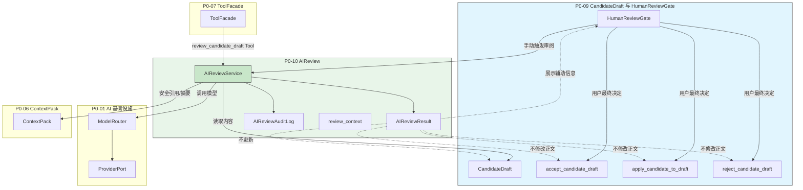

# InkTrace V2.0-P0-10 AIReview 详细设计

版本：v2.0-p0-detail-10  
状态：P0 模块级详细设计  
依据文档：

- `docs/01_requirements/InkTrace-V2.0-需求规格说明书.md`
- `docs/07_overview/InkTrace-V2.0-概要设计说明书.md`
- `docs/02_architecture/InkTrace-V2.0-架构设计说明书.md`
- `docs/03_design/InkTrace-V2.0-P0-详细设计总纲.md`
- `docs/03_design/InkTrace-V2.0-P0-01-AI基础设施详细设计.md`
- `docs/03_design/InkTrace-V2.0-P0-02-AIJobSystem详细设计.md`
- `docs/03_design/InkTrace-V2.0-P0-03-初始化流程详细设计.md`
- `docs/03_design/InkTrace-V2.0-P0-04-StoryMemory与StoryState详细设计.md`
- `docs/03_design/InkTrace-V2.0-P0-05-VectorRecall详细设计.md`
- `docs/03_design/InkTrace-V2.0-P0-06-ContextPack详细设计.md`
- `docs/03_design/InkTrace-V2.0-P0-07-ToolFacade与权限详细设计.md`
- `docs/03_design/InkTrace-V2.0-P0-08-MinimalContinuationWorkflow详细设计.md`
- `docs/03_design/InkTrace-V2.0-P0-09-CandidateDraft与HumanReviewGate详细设计.md`

---

## 一、文档定位与设计范围

### 1.1 文档定位

本文档是 InkTrace V2.0-P0 的第十个模块级详细设计文档，仅覆盖 P0 AIReview。

AIReview 是 AI 对候选稿或章节草稿的轻量审阅能力，用于给用户提供风险提示、质量提示和人工判断辅助。AIReview 是辅助审阅，不是自动裁决，不替代 HumanReviewGate。

本文档不替代 P0-09 CandidateDraft 与 HumanReviewGate 详细设计，不写代码、不修改源码、不生成数据库迁移、不拆 Task、不进入开发计划。

### 1.2 设计范围

本模块覆盖：

- AIReview 数据模型（AIReviewResult、AIReviewItem、Severity、Category、Status）。
- AIReviewRequest。
- AIReviewService。
- AIReviewRepositoryPort。
- AIReviewAuditLog。
- review_candidate_draft。
- review_chapter_draft，可选。
- list_review_results。
- get_review_result。
- AIReview 与 CandidateDraft / HumanReviewGate 的关系。
- AIReview 与 StoryMemory / StoryState / VectorIndex / ContextPack 的边界。
- AIReview 与 ToolFacade / MinimalContinuationWorkflow 的边界。
- AIReview 与 Provider / ModelRouter 的边界。
- AIReview 的输入输出 schema。
- AIReview 的错误处理。
- AIReview 的安全、隐私与日志。
- AIReview 的 P0 验收标准。

### 1.3 本文档不覆盖

P0-10 不覆盖：

- 完整 Agent Runtime。
- AgentSession / AgentStep / AgentObservation / AgentTrace。
- 五 Agent Workflow。
- 完整 AI Suggestion / Conflict Guard。
- 完整 Story Memory Revision。
- 复杂 Knowledge Graph。
- Citation Link。
- @ 标签引用系统。
- 复杂多路召回融合。
- 自动连续续写队列。
- 成本看板。
- 分析看板。
- Provider SDK 适配实现。
- Repository / Infrastructure 具体实现。
- 数据库表结构 DDL。
- API / 前端交互详细设计（由 P0-11 覆盖）。
- 复杂多版本 CandidateDraft 分支树。
- AI 自动冲突解决。
- 复杂三方 merge。
- 复杂深度文学评审。
- 多 Agent 审稿。
- 自动重写候选稿。
- 复杂冲突修复。
- 逐句 Citation。
- 知识图谱一致性推理。

---

## 二、P0 AIReview 目标

### 2.1 核心目标

P0 AIReview 的目标：

1. 定义 AI 对候选稿的轻量审阅能力。
2. AIReview 是辅助审阅，不是自动裁决。
3. AIReview 不自动修改正文。
4. AIReview 不自动接受 CandidateDraft。
5. AIReview 不自动拒绝 CandidateDraft。
6. AIReview 不自动 apply CandidateDraft。
7. AIReview 不直接写 confirmed chapters。
8. AIReview 不直接写 StoryMemory / StoryState / VectorIndex。
9. AIReview 不直接更新正式 ContextPack。
10. AIReview 不改变 initialization_status。
11. AIReview 不触发自动 reanalysis / reindex。
12. AIReview 输出是 review result / warning / suggestion，不是正文修改。
13. AIReview 可以作为 HumanReviewGate 的辅助信息展示。
14. AIReview 不替代 HumanReviewGate。
15. 用户是否接受 / 拒绝 / apply CandidateDraft，仍由 P0-09 的 user_action 决定。
16. AIReview 不是完整 AI Suggestion 系统。
17. AIReview 不是 Conflict Guard 完整设计。
18. AIReview 不做复杂自动修复。

### 2.2 检查维度

P0 AIReview 建议覆盖以下检查维度：

| 维度 | 说明 | P0 必选 |
|------|------|---------|
| coherence | 上下文连贯性 | 是 |
| style_consistency | 风格一致性 | 是 |
| character_consistency | 人物一致性 | 是 |
| plot_consistency | 剧情一致性 | 是 |
| repetition | 重复 / 啰嗦 | 是 |
| contradiction | 明显矛盾 | 是 |
| tone_issue | 语气不一致 | 是 |
| unsafe_output | 不适合直接应用的内容风险 | 是 |
| context_degraded_warning | 上下文降级风险 | 是 |
| stale_context_warning | 上下文过期风险 | 是 |
| version_conflict_warning | 章节版本冲突风险 | 是 |
| apply_risk | 应用到正文的风险提示 | 是 |

补充说明：

- P0 不做复杂深度文学评审。
- P0 不做多 Agent 审稿。
- P0 不做自动重写。
- P0 不做复杂冲突修复。
- P0 不做逐句 Citation。
- P0 不做知识图谱一致性推理。
- P0 不保证发现所有问题。
- P0 Review 结果只用于辅助用户判断。

---

## 三、模块边界与不做事项

### 3.1 P0-10 负责

| 模块 | 职责 |
|------|------|
| AIReviewResult | 审阅结果的保存、查询、状态管理 |
| AIReviewItem | 审阅项的类别化输出 |
| AIReviewService | 核心审阅服务，含 review_candidate_draft、get/list、persist |
| AIReviewAuditLog | 审阅审计日志 |
| review_candidate_draft | 对候选稿执行 AI 审阅 |
| review_chapter_draft | 对章节草稿执行 AI 审阅（P0 可选） |
| review_quick_trial_output | 对 Quick Trial 输出临时审阅（P0 可选） |
| get_review_result | 获取单个审阅结果 |
| list_review_results | 列表查询审阅结果 |
| validate_review_input | 审阅输入校验 |
| build_review_context | 构建审阅上下文 |
| call_review_model | 通过 ModelRouter 调用审阅模型 |
| parse_review_output | 解析模型输出为结构化审阅结果 |
| check_review_idempotency | 审阅幂等校验 |

### 3.2 P0-10 不负责

| 模块 | 不属于 P0-10 |
|------|---------------|
| 正式正文修改 | 属于 V1.1 Local-First 保存链路 |
| CandidateDraft 状态变更 | 属于 P0-09 |
| HumanReviewGate | 属于 P0-09 |
| StoryMemory 更新 | 属于 P0-04 |
| StoryState 更新 | 属于 P0-04 |
| VectorIndex 更新 | 属于 P0-05 |
| ContextPack 构建与更新 | 属于 P0-06 |
| reanalysis | 属于 P0-03 / P0-04 |
| reindex | 属于 P0-05 |
| AI 重新生成 | 属于 run_writer_step / P0-08 |
| AI 自动冲突解决 | P0 不做 |
| 复杂三方 merge | P0 不做 |
| 自动重写 | P0 不做 |
| 主动自动审稿 | P0 不做 |
| 批量审稿队列 | P0 不做 |
| Provider 调用（直接） | 通过 P0-01 ModelRouter / ProviderPort |
| Provider SDK 适配 | P0-01 |

### 3.3 禁止行为

- AIReview 不得自动修改正文。
- AIReview 不得自动接受 CandidateDraft。
- AIReview 不得自动拒绝 CandidateDraft。
- AIReview 不得自动 apply CandidateDraft。
- AIReview 不得改变 CandidateDraft.status。
- AIReview 不得写 StoryMemory / StoryState / VectorIndex。
- AIReview 不得更新正式 ContextPack。
- AIReview 不得改变 initialization_status。
- AIReview 不得触发自动 reanalysis / reindex。
- AIReview Tool 不得调用 accept_candidate_draft / apply_candidate_to_draft / reject_candidate_draft。
- AIReview Tool 不得直接调用 save_candidate_draft。
- AIReview Tool 不得直接调用 run_writer_step。
- 普通日志不得记录完整 CandidateDraft 内容。
- 普通日志不得记录完整 Review Prompt。
- AIReviewAuditLog 不得记录完整 CandidateDraft 内容。
- AIReviewAuditLog 不得记录完整 Review Prompt。
- AIReviewResult 不进入正式 ContextPack。
- AIReviewResult 不作为 Writer Prompt 正式上下文来源。

---

## 四、总体架构

### 4.1 模块关系说明

AIReviewService 位于 Core Application 层，是候选稿审阅的受控服务。

关系：

- review_candidate_draft 可以被 HumanReviewGate / UI 手动触发，也可作为 Workflow 下游的受控 Tool。
- AIReviewService 通过 P0-01 ModelRouter / ProviderPort 间接调用模型。
- AIReviewService 读取 CandidateDraft 内容（content_text 或 content_ref），但不写 CandidateDraft。
- AIReviewService 读取 ContextPack 安全引用或摘要（可选），但不更新 ContextPack。
- AIReview 输出 AIReviewResult，不自动触发任何下游操作。
- AIReviewResult 可以被 HumanReviewGate 展示，辅助用户判断。
- 用户最终仍通过 P0-09 HumanReviewGate 执行 accept / reject / apply。

### 4.2 模块关系图

### 4.3 模块依赖与边界

| 依赖方向 | 模块 | 说明 |
|----------|------|------|
| P0-10 → | P0-01 ModelRouter | 通过 ModelRouter 间接调用 Provider |
| P0-10 → | P0-07 ToolFacade | review_candidate_draft 可作为受控 Tool |
| P0-10 → | P0-09 CandidateDraft | 读取候选稿内容作为审阅目标 |
| P0-10 → | P0-06 ContextPack | 读取 ContextPack 安全引用/摘要作为审阅上下文 |
| → P0-10 | P0-11 API/前端 | 前端展示 AIReviewResult、触发 review 操作 |

### 4.4 与 P0-01 AI 基础设施的边界

- AIReviewService 不直接访问 Provider SDK。
- AIReviewService 通过 P0-01 ModelRouter / ProviderPort 间接调用模型。
- Provider retry 继承 P0-01。
- Provider auth failed 不 retry。
- Provider timeout / rate_limited / unavailable 按 P0-01 retry 边界。
- AIReview 输出必须经过 schema 校验，继承 P0-01 输出校验规则。
- schema 校验失败可重试，最多 2 次。
- 总调用次数不得超过 P0-01 / P0-02 上限。
- LLMCallLog 继承 P0-01。

### 4.5 与 P0-07 ToolFacade 的边界

- review_candidate_draft 可以作为 P0 受控 Tool 暴露给 Workflow / UI / user_action。
- review_candidate_draft 作为 Tool 时必须通过 ToolFacade。
- review_candidate_draft 的 side_effect_level 建议为 read_only 或 transient_write。
- 如果持久化 AIReviewResult，side_effect_level 可为 transient_write / review_write。
- P0 不允许 AIReview Tool 触发 formal_write。
- AIReview Tool 不得调用 accept_candidate_draft。
- AIReview Tool 不得调用 apply_candidate_to_draft。
- AIReview Tool 不得调用 reject_candidate_draft。
- AIReview Tool 不得直接调用 save_candidate_draft。
- AIReview Tool 不得直接调用 run_writer_step。
- AIReview Tool 不得自动重写候选稿。
- AIReview Tool 的输出必须统一封装为 ToolResultEnvelope / AIReviewResult。
- ToolAuditLog 不记录完整候选稿内容或完整 Prompt。

### 4.6 与 P0-09 CandidateDraft / HumanReviewGate 的边界

- CandidateDraft 可以作为 AIReview 的主要审阅对象。
- AIReviewResult 可以显示在 HumanReviewGate 中。
- AIReviewResult 帮助用户判断 accept / reject / defer / apply，但不得自动执行。
- AIReviewResult 不自动改变 CandidateDraft.status。
- HumanReviewGate 仍是最终用户确认门。
- 如果 AIReviewResult overall_severity = high / critical，HumanReviewGate 应展示强 warning。
- 即使 AIReviewResult 为 low / info，仍不能自动 apply。
- stale CandidateDraft 的 AIReview 必须携带 stale warning。
- degraded CandidateDraft 的 AIReview 必须携带 degraded warning。
- chapter_version_conflict 状态下 AIReview 可提示 apply risk，但不能解决冲突。
- AIReview 不替代 Local-First 的版本冲突检测。

### 4.7 与 ContextPack / StoryMemory / StoryState / VectorIndex 的边界

- AIReview 可读取 ContextPack 安全引用或摘要作为审阅上下文。
- AIReview 不构建正式 ContextPack。
- AIReview 不更新正式 ContextPack。
- AIReview 不写 StoryMemory。
- AIReview 不写 StoryState。
- AIReview 不写 VectorIndex。
- AIReview 不改变 initialization_status。
- AIReview 不触发 reanalysis。
- AIReview 不触发 reindex。
- AIReviewResult 不进入正式 ContextPack。
- AIReviewResult 不作为 Writer Prompt 的正式上下文来源。
- P0 不做基于 AIReviewResult 的自动记忆修正。

### 4.8 与 AIJobSystem 的边界

- AIReview 可以作为独立 AIJob 执行，也可以作为 CandidateDraft 详情页的异步任务。
- P0 默认可选择轻量 AIJob：review_candidate_draft step。
- 如果 AIReview 使用 AIJob，则遵守 P0-02 状态机。
- cancel 后迟到 AIReviewResult 不得推进 JobStep。
- AIReview failed 不影响 CandidateDraft 状态。
- AIReview failed 不阻断 HumanReviewGate 基本操作。
- AIReview retry 不得超过 P0-01 / P0-02 上限。
- AIReview 不属于 MinimalContinuationWorkflow 的必需步骤。
- P0-08 续写完成后不必须自动 AIReview。
- AIReview 可由用户在 HumanReviewGate 中手动触发，或由后续策略触发。
- P0 不实现自动批量审稿队列。

---

## 五、AIReview 数据模型设计

### 5.1 AIReviewResult 字段

| 字段 | 类型 | 必填 | 说明 |
|------|------|------|------|
| review_result_id | string | 是 | 审阅结果唯一标识 |
| work_id | string | 是 | 所属作品 ID |
| target_chapter_id | string | 是 | 目标章节 ID |
| candidate_draft_id | string | 否 | 关联 CandidateDraft ID |
| chapter_draft_ref | string | 否 | 章节草稿安全引用 |
| review_target_type | ReviewTargetType | 是 | 审阅目标类型 |
| review_status | AIReviewStatus | 是 | 审阅状态 |
| overall_severity | AIReviewSeverity | 是 | 总体严重程度 |
| summary | string | 是 | 审阅摘要 |
| items | AIReviewItem[] | 是 | 审阅项列表 |
| warnings | string[] | 否 | 警告列表 |
| source_context_refs | string[] | 否 | 源上下文安全引用 |
| review_model_name | string | 否 | 审阅模型名称 |
| provider_name | string | 否 | 服务商名称 |
| prompt_template_key | string | 否 | 使用的 Prompt 模板 Key |
| context_pack_id | string | 否 | 审阅时使用的 ContextPack ID |
| context_pack_status | string | 否 | 审阅时 ContextPack 状态 |
| stale_status | boolean | 否 | 审阅结果是否可能过期 |
| degraded_reasons | string[] | 否 | 降级原因列表 |
| idempotency_key | string | 否 | 幂等键 |
| request_id | string | 是 | 请求追溯 ID |
| trace_id | string | 是 | 全链路追踪 ID |
| created_at | datetime | 是 | 创建时间 |
| updated_at | datetime | 是 | 更新时间 |

### 5.2 ReviewTargetType

| 类型 | 说明 | P0 必选 |
|------|------|---------|
| candidate_draft | 审阅候选稿 | 是 |
| chapter_draft | 审阅章节草稿 | 否，P0 可选 |
| quick_trial_output | 审阅 Quick Trial 临时输出 | 否，P0 可选 |

### 5.3 AIReviewStatus

| 状态 | 说明 | P0 必选 |
|------|------|---------|
| completed | 审阅完成，无警告 | 是 |
| completed_with_warnings | 审阅完成，有警告 | 是 |
| failed | 审阅失败 | 是 |
| skipped | 审阅跳过（如输入不可用） | 是 |
| blocked | 审阅被阻断（如权限不足） | 是 |

说明：

- completed 表示审阅正常完成，未检测到可能影响审阅可信度的问题。
- completed_with_warnings 表示审阅正常完成，但上下文降级、候选稿过期等 warning 不影响审阅结果的可用性，仅提示用户注意。
- failed 表示审阅过程出错（Provider 超时、schema 校验失败等），不影响 CandidateDraft 状态。
- skipped 表示跳过审阅（如 candidate_content_unavailable、配置不允许等）。
- blocked 表示审阅因权限、策略等原因被阻断。
- failed / skipped / blocked 的 AIReview 不影响 HumanReviewGate 的基本 accept / reject / apply 操作。

### 5.4 AIReviewSeverity

| 严重程度 | 说明 | P0 必选 |
|----------|------|---------|
| info | 信息提示 | 是 |
| low | 低风险提示 | 是 |
| medium | 中等风险 | 是 |
| high | 高风险 | 是 |
| critical | 极高风险 | 是 |

说明：

- overall_severity 取所有 items 最高 severity，但不等于 items 最大值语义，需综合判断。
- info 用于提示性信息，如字数、句式变化等。
- low / medium 用于建议性审阅，用户可参考。
- high / critical 用于风险提示，HumanReviewGate 应展示强 warning。
- overall_severity = high / critical 不阻断用户操作，仅做展示层强提示。

### 5.5 AIReviewCategory

| 类别 | 说明 | P0 必选 |
|------|------|---------|
| coherence | 上下文连贯性 | 是 |
| style_consistency | 风格一致性 | 是 |
| character_consistency | 人物一致性 | 是 |
| plot_consistency | 剧情一致性 | 是 |
| repetition | 重复 / 啰嗦 | 是 |
| contradiction | 明显矛盾 | 是 |
| tone_issue | 语气不一致 | 是 |
| unsafe_output | 不适合直接应用的内容风险 | 是 |
| context_warning | 上下文相关警告 | 是 |
| stale_warning | 上下文过期警告 | 是 |
| version_warning | 章节版本冲突警告 | 是 |
| apply_risk | 应用到正文的风险提示 | 是 |
| other | 其他未分类 | 是 |

说明：

- coherence / style_consistency / character_consistency / plot_consistency 属于内容质量审阅。
- repetition / contradiction / tone_issue 属于文本质量审阅。
- unsafe_output 用于内容安全风险提示。
- context_warning / stale_warning / version_warning / apply_risk 属于操作风险提示。
- other 用于未归类提示。
- P0 不要求每个维度都输出，但输出时必须分类明确。

### 5.6 AIReviewItem

| 字段 | 类型 | 必填 | 说明 |
|------|------|------|------|
| item_id | string | 是 | 审阅项唯一标识 |
| category | AIReviewCategory | 是 | 审阅类别 |
| severity | AIReviewSeverity | 是 | 严重程度 |
| title | string | 是 | 审阅项标题，简明可读 |
| description | string | 是 | 审阅项详细描述 |
| evidence_ref | string | 否 | 证据安全引用，不应记录完整正文片段 |
| location_ref | string | 否 | 位置引用，指示候选稿中的相关区域 |
| suggested_action | string | 否 | 建议操作，不是自动修改指令 |
| user_visible | boolean | 是 | 是否对用户可见 |
| created_at | datetime | 是 | 创建时间 |

说明：

- evidence_ref 是安全引用（如段落索引、行范围），不应记录完整正文片段到普通日志。
- location_ref 引用候选稿中的位置（如段落序号、字符偏移），不是正式章节引用。
- suggested_action 是给用户的建议，不是自动修改指令。AIReview 不得自动执行 suggested_action。
- user_visible = false 表示该审阅项仅用于内部记录，不在 HumanReviewGate 展示。
- AIReviewItem 不包含完整正文内容。

---

## 六、AIReviewRequest 设计

### 6.1 AIReviewRequest 字段

| 字段 | 类型 | 必填 | 说明 |
|------|------|------|------|
| work_id | string | 是 | 所属作品 ID |
| target_chapter_id | string | 是 | 目标章节 ID |
| candidate_draft_id | string | 否 | 关联 CandidateDraft ID |
| chapter_draft_ref | string | 否 | 章节草稿安全引用 |
| review_target_type | ReviewTargetType | 是 | 审阅目标类型 |
| review_scope | ReviewScope | 是 | 审阅范围 |
| user_instruction | string | 否 | 用户附加审阅指令 |
| context_pack_id | string | 否 | ContextPack ID |
| context_pack_status | string | 否 | ContextPack 状态 |
| allow_degraded | boolean | 是 | 是否允许降级审阅，默认 true |
| idempotency_key | string | 否 | 幂等键 |
| request_id | string | 是 | 请求追溯 ID |
| trace_id | string | 是 | 全链路追踪 ID |

### 6.2 ReviewScope

| 范围 | 说明 | P0 必选 |
|------|------|---------|
| basic_quality | 基础质量检查（coherence / repetition / contradiction / tone_issue） | 是 |
| consistency | 一致性检查（style / character / plot） | 是 |
| apply_risk | 应用风险检查（context_warning / stale_warning / version_warning） | 是 |
| all_p0 | 全部 P0 检查维度 | 是 |

说明：

- P0 默认 review_scope = basic_quality + apply_risk。
- review_scope 不改变 AIReview 禁止行为。
- review_scope 不影响数据模型的字段完整性。

### 6.3 规则

- AIReviewRequest 不得携带完整 API Key。
- AIReviewRequest 如携带正文内容，应走受控内容读取或安全引用。
- 普通日志不得记录完整 AIReviewRequest 正文内容。
- candidate_draft_id 与 chapter_draft_ref 至少一个存在。
- review_target_type 必须与输入目标匹配。
- Quick Trial 输出只有在用户明确请求 review 时才可审阅。
- AIReview 不会自动保存 Quick Trial 输出为 CandidateDraft。

---

## 七、AIReviewService 设计

### 7.1 职责与方法

| 方法 | 调用者 | 说明 |
|------|--------|------|
| review_candidate_draft | HumanReviewGate / ToolFacade / user_action | 对候选稿执行 AI 审阅，P0 主路径 |
| review_chapter_draft | 用户 / UI | 对章节草稿执行 AI 审阅（P0 可选） |
| review_quick_trial_output | 用户 / UI | 对 Quick Trial 临时输出审阅（P0 可选） |
| get_review_result | 查询 | 获取单个审阅结果 |
| list_review_results | 查询 | 列表查询审阅结果 |
| persist_review_result | 内部 | 持久化审阅结果 |
| validate_review_input | 内部 | 校验审阅输入 |
| build_review_context | 内部 | 构建审阅上下文 |
| call_review_model | 内部 | 通过 ModelRouter 调用模型 |
| parse_review_output | 内部 | 解析模型输出为 AIReviewResult |
| record_review_audit_log | 内部 | 记录审计日志 |

### 7.2 调用规则

- review_candidate_draft 是 P0 主路径。
- review_chapter_draft P0 可选；若实现，必须不改变正文。
- review_quick_trial_output P0 可选；若实现，不自动保存 CandidateDraft。
- review_candidate_draft 可以作为受控 Tool 通过 ToolFacade 暴露，也可以由 HumanReviewGate 直接调用。
- get_review_result / list_review_results 属于查询操作，无 side effect。

### 7.3 禁止行为

AIReviewService 禁止：

- 不直接写 StoryMemory。
- 不直接写 StoryState。
- 不直接写 VectorIndex。
- 不直接更新 CandidateDraft.status。
- 不触发 accept / reject / apply。
- 不伪造 user_action。
- 不直接调用 Provider SDK。
- 不自动重写候选稿。
- 不改变 initialization_status。
- 不触发自动 reanalysis。
- 不触发自动 reindex。
- 不更新正式 ContextPack。

---

## 八、Review Context 构建边界

### 8.1 输入来源

AIReview 可使用以下信息构建审阅上下文：

| 来源 | 说明 | P0 必选 |
|------|------|---------|
| CandidateDraft 内容 | 通过 content_text 或 content_ref 读取 | 是 |
| CandidateDraft metadata | source、warnings、degraded_reasons、stale_status 等 | 是 |
| target_chapter_id / order | 目标章节标识和序号 | 是 |
| StoryState 安全摘要 | 从 P0-04 获取，可选 | 否 |
| StoryMemory 安全摘要 | 从 P0-04 获取，可选 | 否 |
| ContextPack safe refs / summary | 从 P0-06 获取，可选 | 否 |
| user_instruction | 用户附加审阅指令 | 否 |
| apply_mode / version conflict | apply 阶段风险信息 | 否 |

### 8.2 边界规则

- Review Context 不是正式 ContextPack。
- Review Context 不进入 Writer Prompt。
- Review Context 不更新 StoryMemory / StoryState。
- Review Context 可以比正式 ContextPack 更轻量。
- P0 不要求 VectorRecall 参与 AIReview。
- P0 不要求复杂 RAG 审阅。
- 如果 Review Context 缺少 StoryMemory / StoryState，可降级审阅，但必须记录 warning。
- Review Context 普通日志不得记录完整 CandidateDraft 内容。

---

## 九、Review 模型调用与输出校验

### 9.1 模型调用

- AIReviewService 通过 P0-01 ModelRouter / ProviderPort 间接调用模型。
- AIReview 使用轻量 Review Prompt，不包含完整 Writer Prompt。
- Provider retry 继承 P0-01。
- Provider auth failed 不 retry。
- Provider timeout / rate_limited / unavailable 按 P0-01 retry 边界。
- 总调用次数不得超过 P0-01 / P0-02 上限。

### 9.2 输出 schema

AIReview 输出 schema 至少包含：

| 字段 | 类型 | 必填 | 说明 |
|------|------|------|------|
| summary | string | 是 | 审阅摘要，简明概述审阅结论 |
| overall_severity | AIReviewSeverity | 是 | 总体严重程度 |
| items | AIReviewItem[] | 是 | 审阅项列表 |
| warnings | string[] | 否 | 警告列表 |

### 9.3 输出校验规则

- AIReview 输出必须经过 schema 校验。
- schema 校验失败可重试，最多 2 次，继承 P0-01 输出校验规则。
- 总 schema 校验重试次数不得超过 P0-01 上限。
- AIReview schema 校验失败不影响 CandidateDraft 本身。
- AIReview 失败不影响 HumanReviewGate 的基本 accept / reject / apply 流程。
- AIReview 失败只导致 review_result failed / skipped / unavailable。
- 普通日志不得记录完整 Review Prompt、完整 CandidateDraft 内容、API Key。

---

## 十、AIReviewResult 持久化策略

### 10.1 P0 默认策略

AIReviewResult 持久化规则：

1. AIReviewResult 可以持久化为轻量结果。
2. 持久化内容包括 summary、overall_severity、category、safe refs、warnings、created_at。
3. 不持久化完整 Review Prompt。
4. 不在普通日志中记录完整 CandidateDraft。
5. AIReviewResult 可关联 candidate_draft_id。
6. AIReviewResult 不改变 CandidateDraft.status。
7. AIReviewResult 可被 list_review_results / get_review_result 查询。
8. P0 不要求复杂 ReviewResult 版本树。

### 10.2 幂等与防重复

| 场景 | 行为 |
|------|------|
| 同一 candidate_draft_id + review_scope + idempotency_key 重复请求 | 返回已有 review_result_id，不创建新结果 |
| 缺少 idempotency_key | 允许生成新的 AIReviewResult，记录 request_id / trace_id |
| 同一 candidate_draft_id 但不同 review_scope | 不视为重复 |
| 同一请求但参数摘要不一致 | 返回 review_idempotency_conflict |

### 10.3 清理策略

- AIReviewResult 清理策略可后续定义。
- 清理 AIReviewResult 不得删除 CandidateDraft、正式正文、StoryMemory、StoryState、VectorIndex。

---

## 十一、Quick Trial 与 AIReview 的关系

### 11.1 默认行为

| 条件 | 行为 |
|------|------|
| Quick Trial 执行完成 | 不自动触发 AIReview |
| Quick Trial 输出展示 | 默认 review_result_id 为空 |
| 用户明确请求 Quick Trial review | 可执行临时审阅（P0 可选） |

### 11.2 规则

- Quick Trial 输出默认不是 CandidateDraft。
- Quick Trial 输出默认不保存。
- Quick Trial 输出可被临时 review，但 P0 可选。
- Quick Trial review 不自动保存 CandidateDraft。
- Quick Trial review 不自动 accept / apply。
- Quick Trial review 结果默认只作为本次 trial 的临时结果。
- 用户若保存 Quick Trial 为 CandidateDraft 后，可按 candidate_draft review 流程审阅。
- Quick Trial review 必须标记 context_insufficient / degraded_context。
- stale 状态下 Quick Trial review 必须标记 stale_context。
- Quick Trial review 不更新 StoryMemory / StoryState / VectorIndex。

---

## 十二、错误处理与降级

### 12.1 错误场景表

| error_code | HTTP 类比 | 说明 | 处理方式 |
|------------|-----------|------|----------|
| review_target_missing | 400 | 缺少审阅目标（candidate_draft_id / chapter_draft_ref 均无） | 不审阅，返回错误 |
| review_target_not_found | 404 | 审阅目标不存在（如 CandidateDraft 已删除） | 不审阅，返回错误 |
| review_target_mismatch | 400 | review_target_type 与输入目标不匹配 | 拒绝审阅 |
| candidate_not_found | 404 | 关联 CandidateDraft 不存在 | 不审阅，返回错误 |
| candidate_content_unavailable | 404 | 候选稿内容因清理不可用 | 跳过审阅，返回 skipped |
| review_context_missing | 400 | 缺少必要审阅上下文 | 降级或拒绝审阅 |
| review_context_degraded | 200 | 审阅上下文降级 | 可审阅，标记 completed_with_warnings |
| stale_candidate_warning | 200 | 候选稿已过期 | 返回 warning，可继续审阅 |
| degraded_candidate_warning | 200 | 候选稿上下文降级 | 返回 warning，可继续审阅 |
| provider_timeout | 504 | Provider 调用超时 | 按 P0-01 retry 后 failed |
| provider_auth_failed | 401 | Provider 认证失败 | 不 retry，返回 failed |
| provider_rate_limited | 429 | Provider 限流 | 按 P0-01 retry 后 failed |
| review_output_validation_failed | 400 | 模型输出 schema 校验失败 | 按 P0-01 重试，最多 2 次 |
| review_output_validation_retry_exhausted | 500 | schema 校验重试耗尽 | 返回 failed |
| review_result_save_failed | 500 | 审阅结果持久化失败 | 不影响 CandidateDraft，记录 error |
| review_permission_denied | 403 | 无审阅权限 | 拒绝操作 |
| review_job_cancelled | 200 | 审阅 Job 被取消 | 返回 no_result |
| stale_review_result | 200 | 审阅结果可能过期 | 返回 warning，信息仅供参考 |
| duplicate_review_request | 200 | 重复审阅请求 | 返回已有 review_result_id |
| review_idempotency_conflict | 409 | 幂等冲突 | 不创建新结果 |
| audit_log_failed | 500 | 审计日志写入失败 | 按 P0-07 审计规则处理 |

### 12.2 说明

- review_context_degraded 不一定 failed，可 completed_with_warnings。
- stale_candidate_warning 是 warning，不是系统错误。
- degraded_candidate_warning 是 warning，不是系统错误。
- provider_auth_failed 不 retry。
- provider_timeout / rate_limited / unavailable 按 P0-01 retry。
- review_output_validation_failed 可按 P0-01 输出校验重试。
- review_result_save_failed 不影响 CandidateDraft 状态。
- AIReview failed 不阻断用户手动 accept / reject / apply，但 UI 应展示 review unavailable。
- duplicate_review_request 返回已有 review_result_id。
- review_idempotency_conflict 不创建新 ReviewResult。
- 所有错误不得写正式正文。
- 所有错误不得更新 StoryMemory / StoryState / VectorIndex。
- 普通日志不得记录完整 CandidateDraft 内容 / Review Prompt / API Key。

---

## 十三、安全、隐私与日志

### 13.1 普通日志规则

普通日志不得记录：

- 完整 CandidateDraft 内容。
- 完整章节正文。
- 完整 Review Prompt。
- 完整 ContextPack。
- 完整 user_instruction。
- API Key。
- idempotency_key 原文（可记录 hash）。

### 13.2 AIReviewAuditLog

AIReviewAuditLog 记录以下字段：

| 字段 | 说明 |
|------|------|
| audit_id | 审计记录 ID |
| review_result_id | 审阅结果 ID |
| candidate_draft_id | 候选稿 ID |
| work_id | 作品 ID |
| target_chapter_id | 目标章节 ID |
| review_status | 审阅状态（completed / failed / skipped / blocked） |
| overall_severity | 总体严重程度 |
| item_count | 审阅项数量 |
| request_id | 请求追溯 ID |
| trace_id | 全链路追踪 ID |
| error_code | 错误码（如有） |
| safe_refs | 安全引用（不记录完整内容） |
| created_at | 记录时间 |

AIReviewAuditLog 不记录：

- 完整 CandidateDraft 内容。
- 完整 Review Prompt。
- 完整正文。
- API Key。
- 敏感用户信息。

### 13.3 日志继承

| 日志类型 | 依据文档 |
|----------|----------|
| LLMCallLog | 继承 P0-01 |
| ToolAuditLog | 继承 P0-07 |
| CandidateDraftAuditLog | 继承 P0-09 |
| AIReviewAuditLog | 本文档 |

### 13.4 数据清理

- 清理 AIReviewAuditLog 不得删除 CandidateDraft、正式正文、StoryMemory、StoryState、VectorIndex。
- AIReviewResult 清理策略可后续定义。
- 如果 AIReviewResult 长期保存，需要明确用户可删除 / 清理边界，P0 可只给方向不做完整策略。

---

## 十四、P0 验收标准

### 14.1 AIReview 核心约束

| 验收项 | 预期 |
|--------|------|
| AIReview 不自动修改正文 | 正文无变化 |
| AIReview 不自动接受 CandidateDraft | CandidateDraft 状态不变 |
| AIReview 不自动拒绝 CandidateDraft | CandidateDraft 状态不变 |
| AIReview 不自动 apply CandidateDraft | CandidateDraft 状态不变 |
| AIReviewResult 不改变 CandidateDraft.status | status 保持不变 |
| AIReviewResult 不进入 StoryMemory | StoryMemory 不变 |
| AIReviewResult 不进入 StoryState | StoryState 不变 |
| AIReviewResult 不进入 VectorIndex | VectorIndex 不变 |
| AIReviewResult 不进入正式 ContextPack | ContextPack 不变 |
| AIReview failed 不阻断 HumanReviewGate 基本操作 | accept / reject / apply 正常 |

### 14.2 输入校验

| 验收项 | 预期 |
|--------|------|
| CandidateDraft 不存在时 review | 返回 candidate_not_found |
| CandidateDraft 内容不可用时 review | 返回 candidate_content_unavailable |
| review_target_type 与输入不匹配 | 返回 review_target_mismatch |
| candidate_draft_id / chapter_draft_ref 均缺失 | 返回 review_target_missing |
| stale CandidateDraft review 携带 stale warning | 返回 stale_candidate_warning |
| degraded CandidateDraft review 携带 degraded warning | 返回 degraded_candidate_warning |

### 14.3 ToolFacade 与权限

| 验收项 | 预期 |
|--------|------|
| review_candidate_draft 通过 ToolFacade 调用时遵守权限 | 权限正确校验 |
| review_candidate_draft 不调用 accept / apply / reject | 不触发状态变更 |
| AIReview Tool side_effect_level 非 formal_write | 符合 read_only / transient_write / review_write |
| AIReview Tool 不得直接调用 save_candidate_draft | 不绕过 P0-09 |
| AIReview Tool 不得直接调用 run_writer_step | 不触发续写 |

### 14.4 模型调用

| 验收项 | 预期 |
|--------|------|
| AIReviewService 不直接访问 Provider SDK | 通过 ModelRouter / ProviderPort |
| AIReviewService 通过 ModelRouter 调用模型 | 间接调用 |
| Provider retry 继承 P0-01 | 按 P0-01 策略 |
| Output schema validation 继承 P0-01 | 按 P0-01 策略 |
| schema retry 不超过 2 次 | 重试次数合规 |
| 总调用次数不超过 P0-01 / P0-02 上限 | 调用次数合规 |
| Provider auth failed 不 retry | 直接返回 failed |
| AIReview 输出满足 schema 要求 | 包含 summary / overall_severity / items / warnings |

### 14.5 持久化与幂等

| 验收项 | 预期 |
|--------|------|
| review_result_save_failed 不影响 CandidateDraft 状态 | CandidateDraft 不变 |
| duplicate_review_request 返回已有 review_result_id | 不重复创建 |
| review_idempotency_conflict 不创建新结果 | 不写入 |
| AIReviewResult 可关联 candidate_draft_id | 关联正确 |
| AIReviewResult 可被 list / get 查询 | 查询可用 |
| P0 不要求复杂 ReviewResult 版本树 | 简化存储 |

### 14.6 Quick Trial (P0 可选)

| 验收项 | 预期 |
|--------|------|
| Quick Trial review 不保存 CandidateDraft | 无候选稿创建 |
| Quick Trial review 不自动 accept / apply | 状态无变化 |
| Quick Trial review 不更新 StoryMemory / StoryState / VectorIndex | 不变 |
| Quick Trial review 标记 context_insufficient / degraded_context | warning 正确 |
| stale 状态下 Quick Trial review 标记 stale_context | warning 正确 |

### 14.7 边界

| 验收项 | 预期 |
|--------|------|
| AIReview 不改变 initialization_status | 初始化状态不变 |
| AIReview 不触发自动 reanalysis | 无自动 reanalysis |
| AIReview 不触发自动 reindex | 无自动 reindex |
| AIReviewAuditLog 不记录完整候选稿内容 | 审计日志安全 |
| AIReviewAuditLog 不记录完整 Review Prompt | 审计日志安全 |
| 普通日志不记录完整 CandidateDraft 内容 | 日志安全 |
| 普通日志不记录完整 Review Prompt | 日志安全 |
| 普通日志不记录完整正文 | 日志安全 |
| 普通日志不记录 API Key | 日志安全 |
| P0 不实现完整 AI Suggestion / Conflict Guard | 简化审阅 |
| P0 不实现自动重写 | 不修改正文 |
| P0 不实现复杂三方 merge | 不自动合并 |
| P0 不实现五 Agent Workflow | 简化调用 |

---

## 附录 A：术语表

| 术语 | 说明 |
|------|------|
| AIReview | AI 对候选稿或章节草稿的轻量审阅能力 |
| AIReviewResult | 审阅结果，包含 summary、severity、items |
| AIReviewItem | 单项审阅结果，包含 category、severity、title、description |
| AIReviewStatus | 审阅状态（completed / completed_with_warnings / failed / skipped / blocked） |
| AIReviewSeverity | 严重程度（info / low / medium / high / critical） |
| AIReviewCategory | 审阅类别（coherence / style_consistency / contradiction / apply_risk 等） |
| AIReviewService | 审阅核心服务 |
| AIReviewRequest | 审阅请求 |
| AIReviewAuditLog | 审阅审计日志 |
| Review Context | 审阅上下文，不等于正式 ContextPack |
| review_candidate_draft | 对候选稿执行 AI 审阅，P0 主路径 |
| review_chapter_draft | 对章节草稿执行 AI 审阅（P0 可选） |
| review_quick_trial_output | 对 Quick Trial 临时输出执行审阅（P0 可选） |
| overall_severity | 总体严重程度 |
| stale_context_warning | 上下文已过期的警告标记 |
| context_degraded | 上下文降级标记 |
| apply_risk | 应用到正文的风险提示 |

## 附录 B：与上下游模块的引用关系

| 下游模块 | 引用方 | 引用内容 |
|----------|--------|----------|
| P0-01 ModelRouter | AIReviewService | 通过 ModelRouter 间接调用 Provider |
| P0-01 LLMCallLog | AIReview | 继承模型调用日志 |
| P0-06 ContextPack | AIReview | 可选读取安全引用 / 摘要作为审阅上下文 |
| P0-07 ToolFacade | review_candidate_draft | 作为受控 Tool 暴露 |
| P0-07 ToolAuditLog | AIReview | 继承 Tool 审计日志 |
| P0-09 CandidateDraft | AIReview | 读取候选稿内容作为审阅目标 |
| P0-09 CandidateDraftAuditLog | AIReview | 继承候选稿审计日志边界 |
| P0-09 HumanReviewGate | AIReviewResult | 展示审阅结果辅助用户判断 |
| P0-02 AIJobSystem | AIReview | 可选以轻量 AIJob 执行审阅 |
| P0-11 API/前端 | AIReview | 前端展示 AIReviewResult、触发 review（待设计） |
