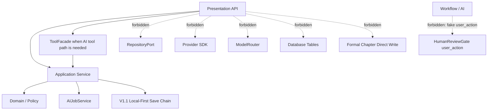

# InkTrace V2.0-P0-11 API 与集成边界详细设计

版本：v1.0 / P0 模块级详细设计候选冻结版  
状态：候选冻结  
所属阶段：InkTrace V2.0 P0  
设计范围：API / Presentation / 集成边界  

依据文档：

- `docs/01_requirements/InkTrace-V2.0-需求规格说明书.md`
- `docs/07_overview/InkTrace-V2.0-概要设计说明书.md`
- `docs/02_architecture/InkTrace-V2.0-架构设计说明书.md`
- `docs/03_design/InkTrace-V2.0-P0-详细设计总纲.md`
- `docs/03_design/InkTrace-V2.0-P0-01-AI基础设施详细设计.md`
- `docs/03_design/InkTrace-V2.0-P0-02-AIJobSystem详细设计.md`
- `docs/03_design/InkTrace-V2.0-P0-03-初始化流程详细设计.md`
- `docs/03_design/InkTrace-V2.0-P0-04-StoryMemory与StoryState详细设计.md`
- `docs/03_design/InkTrace-V2.0-P0-05-VectorRecall详细设计.md`
- `docs/03_design/InkTrace-V2.0-P0-06-ContextPack详细设计.md`
- `docs/03_design/InkTrace-V2.0-P0-07-ToolFacade与权限详细设计.md`
- `docs/03_design/InkTrace-V2.0-P0-08-MinimalContinuationWorkflow详细设计.md`
- `docs/03_design/InkTrace-V2.0-P0-09-CandidateDraft与HumanReviewGate详细设计.md`
- `docs/03_design/InkTrace-V2.0-P0-10-AIReview详细设计.md`

说明：本文档忽略所有 `*_001.md` 文件。

---

## 一、文档定位与设计范围

本文档定义 InkTrace V2.0 P0 AI 能力对 Presentation / API 层的最小可用集成边界，覆盖 API 分组、DTO 方向、统一错误响应、caller_type 权限、idempotency_key 传递、request_id / trace_id 贯穿、轮询 / SSE 边界，以及与 Application Service / ToolFacade / V1.1 Local-First 保存链路的衔接规则。

本文档只覆盖 P0 API 与集成边界，不替代 P0-01 到 P0-10 的模块内部设计，不写代码，不修改源码，不生成数据库迁移，不拆 Task，不写开发计划。

### 1.1 本文档覆盖

- AI Settings API。
- Initialization API。
- AIJob API。
- Continuation / Workflow API。
- CandidateDraft / HumanReviewGate API。
- AIReview API。
- Quick Trial API。
- SSE / 轮询边界。
- API 权限与 caller_type。
- API DTO / Request / Response 方向。
- 错误码统一格式。
- idempotency_key 在 API 层的传递。
- request_id / trace_id 在 API 层的传递。
- API 与 ToolFacade / Application Service / V1.1 Local-First 的边界。
- API 与前端状态展示的边界。
- 安全、隐私与日志。

### 1.2 本文档不覆盖

- 不重新设计 InkTrace V2.0 总体架构。
- 不推翻 P0 详细设计总纲。
- 不推翻已冻结的 P0-01 到 P0-10。
- 不定义数据库表、索引、迁移脚本。
- 不定义前端 UI 组件、页面布局或交互细节。
- 不实现完整 Agent Runtime。
- 不设计五 Agent Workflow。
- 不设计完整 AI Suggestion / Conflict Guard。
- 不设计复杂 Knowledge Graph。
- 不设计 Citation Link。
- 不设计 @ 标签引用系统。
- 不设计复杂多路召回融合。
- 不设计自动连续续写队列。
- 不设计成本看板。
- 不设计分析看板。
- 不设计复杂权限系统。
- 不设计完整多租户 RBAC。
- 不新增 P1 / P2 能力。

---

## 二、P0 API 总体目标

P0-11 的核心目标是定义 P0 AI 能力对 Presentation / API 层的最小可用集成边界，使前端、Application Service、ToolFacade、AIJobSystem 与 V1.1 Local-First 保存链路之间有清晰、可测试、可追踪的协议。

### 2.1 API 层职责

- 接收用户操作或前端查询请求。
- 校验基础 Request DTO、caller_type、work_id、target_chapter_id、idempotency_key 等边界字段。
- 生成或贯穿 request_id / trace_id。
- 将请求交给 Application Service 或受控 ToolFacade。
- 返回统一 Response / Error 结构。
- 提供 Job / Result 轮询能力。
- 提供安全状态事件边界。
- 将用户确认动作明确标记为 user_action。

### 2.2 API 层禁止行为

- API 层不得绕过 Application Service。
- API 层不得直接访问 RepositoryPort。
- API 层不得直接访问 Infrastructure Adapter。
- API 层不得直接访问 Provider SDK。
- API 层不得直接访问 ModelRouter。
- API 层不得伪造 user_action。
- API 层不得让 AI / Workflow 冒充用户确认。
- API 层不得直接写正式正文绕过 V1.1 Local-First。
- API 层不得把 CandidateDraft 当作 confirmed chapter。
- API 层不得把 AIReviewResult 当作正式 ContextPack 输入。

### 2.3 API 与模块关系

- API 层面向 Presentation，承接用户动作与状态查询。
- Application Service 承担业务用例与状态规则。
- ToolFacade 承担 AI 编排工具调用的受控门面与权限判断。
- AIJobSystem 承担异步任务状态机、重试、取消与迟到结果隔离。
- V1.1 Local-First 保存链路仍是正式正文保存的唯一入口。

---

## 三、模块边界与不做事项

### 3.1 P0 做什么

P0 API 层提供最小、稳定、可追踪的 AI 能力入口：

- 允许用户配置和测试 Provider。
- 允许用户启动初始化、查询初始化状态、重试或取消初始化。
- 允许前端查询 AIJob / Step 状态、warning、result_ref。
- 允许用户启动正式续写、查询续写结果、取消续写。
- 允许用户发起 Quick Trial，并在明确用户动作下保存为候选稿。
- 允许用户查看、接受、应用、拒绝 CandidateDraft。
- 允许用户发起 CandidateDraft AIReview，并查询 ReviewResult。
- 统一 request_id / trace_id / error_code / safe_message。
- 明确 P0 默认轮询，不做正文 token stream。

### 3.2 P0 不做什么

- 不实现 SSE token stream。
- 不逐 token 推送 Writer 输出。
- 不逐 token 推送 Review 输出。
- 不直接暴露 Provider SDK。
- 不直接暴露 ToolFacade 内部对象。
- 不暴露 RepositoryPort。
- 不暴露数据库表结构。
- 不提供 AI 伪造用户确认入口。
- 不提供正式正文自动覆盖接口。
- 不提供 CandidateDraft 自动 apply 接口。
- 不提供 AIReview 自动 accept / reject / apply 接口。
- 不提供复杂 RBAC、组织、多租户权限矩阵。
- 不提供 P1 / P2 能力入口。

### 3.3 禁止调用路径

---

## 四、API 总体分组

### 4.0 路由前缀方向

| 分组 | 路由前缀（方向） | 核心职责 |
|---|---|---|
| AI Settings | `/api/v2/ai/settings` | Provider 配置、模型角色、连接测试 |
| Initialization | `/api/v2/ai/init` | 作品初始化启动、状态查询、取消、重试 |
| AIJob | `/api/v2/ai/jobs` | Job / Step 状态查询、取消、重试 |
| Continuation | `/api/v2/ai/continuation` | 正式续写、Quick Trial、保存为候选稿 |
| CandidateDraft | `/api/v2/ai/candidates` | 候选稿列表、详情、accept / apply / reject |
| AIReview | `/api/v2/ai/review` | 审阅启动、结果查询、取消 |

说明：

- 路由前缀只是方向性建议，不是强制实现。
- 最终路径以后端路由注册为准。
- `/api/v2/ai` 用于区分 V1 非 AI API。
- V1.1 正文保存 Local-First 不在 P0-11 新路由范围内，继续走现有 V1 路由或既有保存链路。
- API 路由不代表绕过 Application Service；所有请求仍必须进入 Application Service 或受控 ToolFacade。
### 4.1 AI Settings API

覆盖 API：get_ai_settings、update_ai_settings、test_provider_connection、list_available_models（可选）、get_prompt_template_info（可选）。

继承 P0-01：Provider 配置不暴露 API Key 明文；API Key 只允许写入 / 更新，不允许读取明文；test_provider_connection 结果应写回 last_test_status / last_test_at；Provider auth failed 不 retry；Provider timeout / rate_limited / unavailable 按 P0-01 retry；普通日志不记录 API Key。

### 4.2 Initialization API

覆盖 API：start_initialization、get_initialization_status、retry_initialization_step、cancel_initialization、get_initialization_report（可选）、mark_initialization_stale / refresh_initialization（可选）。

继承 P0-03：initialization_status 包含 pending / running / completed / failed / cancelled / stale 等；initialization_not_completed 时正式续写 blocked；stale 重新分析成功后回到 completed；partial_success 判定由 P0-03 承担；analyzed_chapter_count 统计规则继承 P0-03；初始化失败不破坏用户正文。

### 4.3 AIJob API

覆盖 API：get_job_status、list_jobs、get_job_steps、retry_job、retry_step、cancel_job、get_job_warnings、get_job_result_ref。

继承 P0-02：Job / Step 状态机不重新设计；retry_job / retry_step 行为继承 P0-02；cancel 后迟到 ToolResult ignored；stale ToolResult 不推进 JobStep；can_retry / can_skip 字段按 P0-02 规则展示；partial_success 不在 P0-11 重新定义。

### 4.4 Continuation / Workflow API

覆盖 API：start_continuation、get_continuation_result、get_continuation_job_status、cancel_continuation、retry_continuation（可选）、quick_trial_continuation、save_quick_trial_as_candidate（可选）。

继承 P0-08：start_continuation 默认非流式；P0-08 不实现 SSE token stream；前端通过 ContinuationResult / get_job_status / AIJob 轮询感知进度；ContextPack blocked 时不调用 run_writer_step；ContextPack degraded 受 allow_degraded 控制；allow_degraded = false 且 degraded 时 blocked；completed_with_candidate 表示 CandidateDraft 已保存，不代表正式正文已更新；degraded_completed 在正式 Workflow 中表示 degraded ContextPack 下生成并保存 CandidateDraft；Quick Trial 的 degraded_completed 不代表 CandidateDraft 已保存；Quick Trial 默认不创建正式 continuation Job；Quick Trial 默认不保存 CandidateDraft；Quick Trial 不更新正式 AIJobStep；Quick Trial 不改变 initialization_status；Quick Trial 输出必须标记 degraded_context / context_insufficient；stale 状态下 Quick Trial 输出必须标记 stale_context。

### 4.5 CandidateDraft / HumanReviewGate API

覆盖 API：list_candidate_drafts、get_candidate_draft、accept_candidate_draft、apply_candidate_to_draft、reject_candidate_draft、mark_candidate_defer（可选）、save_quick_trial_as_candidate、get_candidate_audit_summary（可选）。

继承 P0-09：CandidateDraft 不是正式正文；CandidateDraft 不属于 confirmed chapters；CandidateDraft 不进入 StoryMemory / StoryState / VectorIndex / 正式 ContextPack；accepted 不等于 applied；accept / apply / reject 必须由 user_action 触发；ToolFacade / Workflow / AI 模型不得伪造 user_action；apply_candidate_to_draft 必须走 V1.1 Local-First 保存链路；apply 成功后通过 Local-First 或 Application 事件通知下游 stale 标记流程；apply 失败不得标记 applied；chapter_version_conflict 不自动覆盖用户正文；replace_chapter_draft P0 默认不支持；Quick Trial 保存为候选稿必须有 idempotency_key；list_candidate_drafts 默认按 created_at desc 排序，支持过滤和分页；list 默认返回摘要，不返回完整内容；get_candidate_draft 返回完整内容或受控 content_ref。

### 4.6 AIReview API

覆盖 API：start_review_candidate_draft、get_review_result、list_review_results、cancel_review_job、review_chapter_draft（可选）、review_quick_trial_output（可选）。

继承 P0-10：P0 默认 review_candidate_draft 以轻量 AIJob 异步执行；同步请求只创建 review job 或返回 review_result_pending / job_id；前端通过 get_review_result / list_review_results / get_job_status 轮询结果；P0 不实现 SSE token stream；review_candidate_draft 默认只允许 user_action 触发；workflow 触发默认禁止 / 受限；quick_trial review 可选受限；AIReview failed 不阻断 HumanReviewGate 基本 accept / reject / apply；AIReviewResult 不改变 CandidateDraft.status；AIReview 不写 StoryMemory / StoryState / VectorIndex / ContextPack；Review Context 受 review_context_token_budget 限制；allow_degraded = false 且 Review Context degraded 时不调用模型；stale_review_result 不改变 CandidateDraft.status；get/list 检测到过期 review_result 时返回 stale_review_result warning；provider_unavailable 继承 P0-01 retry。

---

## 五、通用 Request / Response / Error 规范

### 5.1 通用 Request 字段

所有 AI 相关 API Request 建议包含以下通用字段：

| 字段 | 类型 | 必填 | 说明 |
|---|---|---|---|
| request_id | string | 否 | 前端可传，后端未传时自动生成 |
| trace_id | string | 否 | 后端生成或贯穿，前端可传以关联客户端上下文 |
| idempotency_key | string | 否 | 涉及写入 / 触发任务时建议或必须 |
| caller_type | string | 是 | user_action / workflow / quick_trial / system |
| work_id | string | 是 | 作品 ID |
| target_chapter_id | string | 否 | 目标章节 ID |
| client_timestamp | string | 否 | 客户端时间戳，用于审计 |

规则：user_action API 的 caller_type 必须是 user_action；Quick Trial API 的 caller_type 可为 quick_trial；Workflow 内部 API 不应由前端直接调用；request_id / trace_id 必须贯穿 Application / ToolFacade / AIJob / AuditLog；idempotency_key 不得包含正文、Prompt、API Key 或敏感信息。

### 5.2 通用 Response 字段

所有 AI 相关 API Response 建议包含以下通用字段：

| 字段 | 类型 | 必填 | 说明 |
|---|---|---|---|
| request_id | string | 是 | 请求 ID |
| trace_id | string | 是 | 追踪 ID |
| status | string | 是 | ok / error / pending |
| data | object | 否 | 业务数据，成功时返回 |
| warnings | string[] | 否 | 警告列表 |
| error | ErrorDetail | 否 | 错误详情，仅失败时返回 |
| job_id | string | 否 | 关联 AIJob ID，异步任务时返回 |
| result_ref | string | 否 | 结果引用，指向可查询的结果资源 |
| created_at | string | 否 | 创建时间 |
| updated_at | string | 否 | 更新时间 |
| polling_hint | object | 否 | 轮询提示，详见 6.1.1 polling_hint 字段方向 |

### 5.3 通用 Error 格式

统一错误结构：

| 字段 | 类型 | 必填 | 说明 |
|---|---|---|---|
| error_code | string | 是 | 错误码，如 `candidate_not_found` |
| safe_message | string | 是 | 可展示给用户的安全消息 |
| detail_ref | string | 否 | 指向安全日志或审计引用 |
| retryable | boolean | 是 | 是否可重试 |
| request_id | string | 是 | 请求 ID |
| trace_id | string | 是 | 追踪 ID |

规则：

1. safe_message 可展示给用户。
2. detail_ref 指向安全日志或审计引用。
3. 错误响应不得包含完整正文。
4. 错误响应不得包含完整 Prompt。
5. 错误响应不得包含完整 CandidateDraft。
6. 错误响应不得包含 API Key。
7. retryable 必须与 P0-01 / P0-02 retry 规则一致。

### 5.4 DTO 命名与字段口径

- API DTO 面向 Presentation，不等于 Domain Entity。
- API DTO 不暴露 Repository 内部结构。
- API DTO 不暴露 Provider SDK 响应原文。
- P0-11 只定义字段方向，不定义具体序列化框架。

---

## 六、SSE / 轮询边界

### 6.1 P0 默认策略

- P0 不实现正文 token stream。
- P0 不逐 token 推送 Writer 输出。
- P0 不逐 token 推送 Review 输出。
- P0 默认通过轮询获取 Job / Result 状态。
- P0 SSE 如存在，只推送安全状态事件。
- P1 / 后续可设计 streaming token 输出。

### 6.1.1 轮询策略

P0 默认轮询，前端不得以小于 1s 的固定频率高频轮询。推荐按任务类型采用分段退避或指数退避。

#### 短任务轮询（continuation / AIReview 等）

- 初始轮询间隔建议 1.5s ~ 2s；
- 连续轮询 30s 后可退避到 3s；
- 超过 120s 未完成，前端不自动判定失败，应显示"仍在处理中"，允许用户取消或稍后查看。

#### 长任务轮询（initialization / reanalysis 等）

- 初始轮询间隔建议 3s ~ 5s；
- 连续轮询 2min 后可退避到 8s ~ 10s；
- 超过 10min 未完成，不自动判定失败，前端提示"初始化仍在后台进行"。

#### AIJob 通用轮询

- 推荐使用分段退避或指数退避；
- 后端 Response 可选返回 polling_hint；
- 前端不得以小于 1s 的固定频率高频轮询。

#### polling_hint 字段方向

后端可在 Response 中可选返回 polling_hint，建议包含以下子字段：

| 子字段 | 类型 | 必填 | 说明 |
|---|---|---|---|
| next_poll_after_ms | integer | 建议 | 建议前端在此时间后再发起下一次轮询 |
| max_poll_interval_ms | integer | 可选 | 最大建议轮询间隔 |
| timeout_hint_ms | integer | 可选 | 预估完成时间，前端可据此调整轮询策略 |
| still_running_message | string | 可选 | 长时间未完成时前端可展示的安全提示消息 |

#### 超时处理

- 前端轮询超时不等于 Job failed；
- Job 是否 failed 以 get_job_status / get_job_steps 返回状态为准；
- 前端应允许用户继续等待、取消、或稍后查看；
- 后端不得因为前端停止轮询而取消 Job。

### 6.2 轮询 API

P0 默认轮询 API 包括：get_job_status、get_job_steps、get_continuation_result、list_candidate_drafts、get_review_result、list_review_results、get_initialization_status。

上述轮询 API 的 Response 可携带 polling_hint，前端应根据 next_poll_after_ms / max_poll_interval_ms 调整轮询频率，详见 6.1.1 轮询策略。

### 6.3 安全 SSE 事件

P0 SSE 只推送安全状态事件，前后端必须使用以下白名单内的事件名。不得自行新增未列入白名单的 SSE 事件名。

#### 通用 Job 事件

| 事件名 | 说明 |
|---|---|
| job_started | Job 已创建 |
| job_status_changed | Job 状态变更 |
| step_started | Step 开始 |
| step_progress | Step 进度 |
| step_completed | Step 完成 |
| step_failed | Step 失败 |
| job_completed | Job 完成 |
| job_failed | Job 失败 |
| job_cancelled | Job 已取消 |

#### Initialization 事件

| 事件名 | 说明 |
|---|---|
| initialization_status_changed | 初始化状态变更 |
| initialization_completed | 初始化完成 |
| initialization_failed | 初始化失败 |
| initialization_stale | 初始化结果过期 |

#### Continuation 事件

| 事件名 | 说明 |
|---|---|
| workflow_blocked | Workflow blocked |
| workflow_failed | Workflow failed |
| continuation_completed | 续写完成（CandidateDraft 已保存） |
| candidate_ready | CandidateDraft 已生成引用 |

#### CandidateDraft 事件

| 事件名 | 说明 |
|---|---|
| candidate_draft_created | CandidateDraft 已创建 |
| candidate_status_changed | CandidateDraft 状态变更 |

#### AIReview 事件

| 事件名 | 说明 |
|---|---|
| review_job_created | Review Job 已创建 |
| review_completed | ReviewResult 已完成引用 |
| review_failed | Review 执行失败 |

#### 通用 Warning

| 事件名 | 说明 |
|---|---|
| warning | 安全 warning |

#### SSE payload 安全规则

SSE payload 只能包含以下安全字段：

| 允许字段 | 说明 |
|---|---|
| event_type | 事件类型，对应上述白名单事件名 |
| status | 状态值 |
| job_id | 关联 Job ID |
| step_id | 关联 Step ID |
| workflow_id | 关联 Workflow ID |
| candidate_draft_id | 关联 CandidateDraft ID |
| review_result_id | 关联 ReviewResult ID |
| request_id | 请求 ID |
| trace_id | 追踪 ID |
| warning_code | Warning 枚举码 |
| error_code | 错误枚举码 |
| safe_message | 可展示给用户的安全消息 |
| progress | 可选，进度信息 |

SSE payload 不得包含：

- 完整正文；
- Writer token stream；
- Review token stream；
- Prompt；
- ContextPack；
- CandidateDraft 完整内容；
- Review Prompt；
- API Key；
- user_instruction 原文。

SSE 不得推送完整正文 token stream、完整 Prompt、完整 ContextPack、完整 CandidateDraft、完整 Review Prompt 或 API Key。

---

## 七、caller_type 与权限矩阵

### 7.1 caller_type 定义

| caller_type | 说明 |
|---|---|
| user_action | 用户显式操作，适用于确认、接受、应用、拒绝等动作 |
| workflow | AI 编排内部调用，不允许伪造用户确认 |
| quick_trial | Quick Trial 非正式试写路径 |
| system | 内部诊断 / 维护 / 受控系统动作 |

规则：Presentation API 默认 caller_type = user_action；用户显式 Quick Trial 请求可转换为 caller_type = quick_trial；Workflow caller_type 不应由前端伪造；system caller_type 仅用于内部诊断 / 维护；accept_candidate_draft / apply_candidate_to_draft / reject_candidate_draft 只能 user_action；review_candidate_draft P0 默认只允许 user_action；workflow 触发 review_candidate_draft 默认禁止 / 受限；save_candidate_draft 由 Workflow / ToolFacade 触发，不应由普通前端直接调用正式路径；quick_trial 保存为候选稿必须转为明确 user_action；API 层必须把 caller_type 传递到 Application Service / ToolExecutionContext / AuditLog；API 层不得让 AI / Workflow 冒充 user_action。

### 7.2 权限矩阵

| API / Action | user_action | workflow | quick_trial | system |
|---|---:|---:|---:|---:|
| start_initialization | 允许 | 禁止 | 禁止 | 受限允许 |
| get_initialization_status | 允许 | 受限内部查询 | 受限内部查询 | 允许 |
| cancel_initialization | 允许 | 禁止 | 禁止 | 受限允许 |
| retry_initialization_step | 允许 | 禁止 | 禁止 | 受限允许 |
| start_continuation | 允许 | 禁止 | 禁止 | 受限允许 |
| get_continuation_result | 允许 | 受限内部查询 | 受限内部查询 | 允许 |
| cancel_continuation | 允许 | 受限内部取消 | 禁止 | 受限允许 |
| quick_trial_continuation | 允许触发并转换为 quick_trial | 禁止 | 允许 | 受限允许 |
| save_quick_trial_as_candidate | 允许，必须 user_action | 禁止 | 禁止直接保存 | 受限允许 |
| list_candidate_drafts | 允许 | 禁止公开调用 | 禁止 | 受限允许 |
| get_candidate_draft | 允许 | 禁止公开调用 | 禁止 | 受限允许 |
| accept_candidate_draft | 允许 | 禁止 | 禁止 | 禁止 |
| apply_candidate_to_draft | 允许 | 禁止 | 禁止 | 禁止 |
| reject_candidate_draft | 允许 | 禁止 | 禁止 | 禁止 |
| start_review_candidate_draft | 允许 | 默认禁止 / 受限 | 禁止，除非转 user_action | 受限允许 |
| get_review_result | 允许 | 受限内部查询 | 受限内部查询 | 允许 |
| list_review_results | 允许 | 受限内部查询 | 禁止公开调用 | 允许 |
| cancel_review_job | 允许 | 受限内部取消 | 受限内部取消 | 允许 |
| review_quick_trial_output | 允许触发 | 禁止 | 允许，临时结果 | 受限允许 |
| get_job_status | 允许 | 受限内部查询 | 受限内部查询 | 允许 |
| get_job_steps | 允许 | 受限内部查询 | 受限内部查询 | 允许 |
| cancel_job | 允许 | 受限内部取消 | 受限内部取消 | 允许 |
| retry_job | 允许 | 禁止公开调用 | 禁止 | 受限允许 |
| retry_step | 允许 | 禁止公开调用 | 禁止 | 受限允许 |
| get_ai_settings | 允许 | 禁止公开调用 | 禁止 | 受限允许 |
| update_ai_settings | 允许 | 禁止 | 禁止 | 受限允许 |
| test_provider_connection | 允许 | 禁止 | 禁止 | 受限允许 |

权限规则：

- accept_candidate_draft / apply_candidate_to_draft / reject_candidate_draft 只能 user_action。
- save_quick_trial_as_candidate 必须 user_action + idempotency_key。
- start_review_candidate_draft P0 默认只允许 user_action，workflow 默认禁止 / 受限。
- quick_trial_continuation 可以由 user_action 触发并转换为 quick_trial，或 caller_type = quick_trial。
- review_quick_trial_output 可由 quick_trial 受限调用。
- start_continuation 只能 user_action，workflow 不得由前端伪造。
- save_candidate_draft 不应作为普通前端 API 暴露正式路径，由 Workflow / ToolFacade 内部触发。
- 查询类 get_* / list_* API 可以允许 user_action；workflow / system 只允许受控内部路径，不扩大为公开前端入口。
- system 只用于内部诊断 / 维护，不得 accept / apply / reject。
- API 层必须把 caller_type 传递到 Application Service / ToolExecutionContext / AuditLog。
- API 层不得让 AI / Workflow 冒充 user_action。

### 7.3 用户确认边界

HumanReviewGate 的 accept / apply / reject 必须来自 user_action；API 层应记录 user_action_context 或等价审计信息；ToolFacade / Workflow / AI 模型不得调用用户确认 API 冒充用户；Quick Trial 保存为候选稿必须由用户明确点击或等价动作触发。

---

## 八、idempotency_key API 层规则

### 8.1 总体规则

idempotency_key 用于避免重复创建 Job、CandidateDraft、ReviewResult 或重复 apply。idempotency_key 不得包含正文、Prompt、API Key 或敏感信息。API 层可以记录 idempotency_key hash，不记录原文。涉及写入和副作用的 API 应将 idempotency_key 传递到 Application Service / ToolFacade / AuditLog。

### 8.2 API 级要求

| API | idempotency_key 要求 | 说明 |
|---|---|---|
| start_continuation | 建议 | 避免前端重复提交创建多个 continuation Job |
| save_candidate_draft | 内部必须 | 由 Workflow / ToolFacade 触发；API 普通前端不直接调用正式路径 |
| save_quick_trial_as_candidate | 必须 | 防止同一 trial 输出重复保存 |
| accept_candidate_draft | 可不强制 | 重复 accept 幂等返回当前 accepted 状态 |
| apply_candidate_to_draft | 建议强制 idempotency_key 或 apply_request_id | 防止重复 apply |
| reject_candidate_draft | 可不强制 | 重复 reject 幂等返回当前 rejected 状态 |
| start_review_candidate_draft | 可选 | 提供时用于 duplicate_review_request |
| test_provider_connection | 不需要 | 非业务写入，按 Provider 测试边界处理 |

### 8.3 冲突处理

- 重复请求且参数摘要一致：返回已有 result_ref / job_id / candidate_draft_id / review_result_id。
- 重复请求但参数摘要不一致：返回 idempotency_conflict 或 review_idempotency_conflict。
- apply 类重复请求如检测到已 applied，应返回 candidate_already_applied 或当前 applied 状态，不重复写正文。

---

## 九、AI Settings API

| API 名称 | 调用者 | caller_type | 异步 | 返回 job_id | idempotency_key | 关键错误码 |
|---|---|---|---:|---:|---|---|
| get_ai_settings | Presentation | user_action | 否 | 否 | 不需要 | permission_denied |
| update_ai_settings | Presentation | user_action | 否 | 否 | 建议 | provider_auth_failed |
| test_provider_connection | Presentation | user_action | 可同步或轻量异步 | 可选 | 不需要 | provider_timeout / provider_auth_failed / provider_rate_limited / provider_unavailable |
| list_available_models | Presentation | user_action | 否 | 否 | 不需要 | provider_unavailable |
| get_prompt_template_info | Presentation / system | user_action / system | 否 | 否 | 不需要 | prompt_template_missing |

### 9.1 get_ai_settings

Request DTO：work_id（可选）、request_id、trace_id、caller_type = user_action。

Response DTO：provider 配置摘要、key_configured、last_test_status、last_test_at、model_role_configs、timeout / max_tokens / temperature 等安全配置摘要。

model_role_configs 按 model_role 返回配置摘要，例如：outline_analyzer、manuscript_analyzer、memory_extractor、planner、writer、reviewer、quick_trial_writer。

规则：默认 Provider 倾向继承 P0-01 ModelRoleConfig；API 层不硬编码 Kimi / DeepSeek；业务服务 / Workflow / ToolFacade / API 只提交或展示 model_role；实际 provider / model 由 AI Settings 与 ModelRoleConfig 决定；本轮不做完整“模型路由一致性补丁”；后续会统一补 Kimi / DeepSeek 默认分工到相关文档；不得出现绑定具体 Provider 的固定路由名。

安全规则：不返回 API Key 明文；不返回 Provider SDK 内部配置；普通日志不记录任何 Key。

### 9.2 update_ai_settings

Request DTO：provider_name、api_key_write_only（可选）、model_role_configs（可选，仅提交 model_role 到 provider / model 的配置摘要，不使用写死命名）、timeout / max_tokens / temperature（可选）、request_id、trace_id、caller_type = user_action。

Response DTO：status、provider_name、key_configured、updated_at、warnings。

规则：API Key 只允许写入 / 更新，不允许读取明文；更新失败不得暴露 Key；API 层不硬编码 Kimi / DeepSeek，不定义绑定具体 Provider 的固定路由名；如果配置会影响正在运行 Job，P0 只返回 warning，不做复杂热切换治理。

### 9.3 test_provider_connection

Request DTO：provider_name、model_name（可选）、request_id、trace_id、caller_type = user_action。

Response DTO：test_status、last_test_status、last_test_at、provider_name、model_info（可选）、error（可选）。

规则：test_provider_connection 结果应写回 last_test_status / last_test_at；Provider auth failed 不 retry；Provider timeout / rate_limited / unavailable 按 P0-01 retry；普通日志不记录 API Key。

---

## 十、Initialization API

| API 名称 | 调用者 | caller_type | 异步 | 返回 job_id | idempotency_key | 关键错误码 |
|---|---|---|---:|---:|---|---|
| start_initialization | Presentation | user_action | 是 | 是 | 建议 | initialization_in_progress |
| get_initialization_status | Presentation | user_action | 否 | 可选 | 不需要 | work_not_found |
| cancel_initialization | Presentation | user_action | 否 | 否 | 不需要 | job_cancelled / job_not_found |
| retry_initialization_step | Presentation | user_action | 是 | 是 | 建议 | step_not_retryable / retry_limit_exceeded |
| get_initialization_report | Presentation | user_action | 否 | 否 | 不需要 | initialization_not_completed |
| refresh_initialization | Presentation | user_action | 是 | 是 | 建议 | reanalysis_in_progress |

### 10.1 start_initialization

Request DTO：work_id、initialization_scope（可选）、request_id、trace_id、idempotency_key（建议）、caller_type = user_action。

Response DTO：initialization_status = running / pending、job_id、request_id、trace_id、warnings。

规则：同一 work_id 已存在 running initialization / reinitialization 时，返回 initialization_in_progress；初始化失败不破坏用户正文；VectorIndex 构建失败不阻断 completed，但返回 warning / degraded 信息；StoryMemory / StoryState 缺失阻断 completed，继承 P0-03 / P0-04。

### 10.2 get_initialization_status

Response DTO：work_id、initialization_status、analyzed_chapter_count、total_chapter_count、story_memory_snapshot_id（可选）、story_state_baseline_id（可选）、vector_index_status、warnings、stale_reason（可选）、affected_chapter_ids（可选）。

规则：analyzed_chapter_count 统计规则继承 P0-03；stale 重新分析成功后回到 completed；partial_success 判定不在 P0-11 重新定义。

### 10.3 cancel_initialization / retry_initialization_step

#### cancel_initialization

规则：cancel 后迟到结果不得推进 JobStep。

#### retry_initialization_step

retry_initialization_step 不创建新的 initialization job，在原 job_id 下创建新的 step attempt 或重置指定 step 的执行 attempt。

retry_initialization_step Response 必须返回：

| 字段 | 类型 | 必填 | 说明 |
|---|---|---|---|
| job_id | string | 是 | 原 initialization job ID |
| step_id | string | 是 | 被重试的 Step ID |
| attempt_no | integer | 是 | 新建或重置后的 attempt 编号 |
| status | string | 是 | 重试后 step / job 状态 |
| request_id | string | 是 | 请求 ID |
| trace_id | string | 是 | 追踪 ID |

前端使用规则：

- 前端继续使用原 job_id 调用 get_job_status / get_job_steps 轮询；
- 前端不得为 retry 创建新的轮询上下文。

错误处理：

| 错误场景 | error_code | 说明 |
|---|---|---|
| 原 job_id 不存在 | job_not_found | 初始化记录不存在 |
| step_id 不存在 | step_not_found | Step 不属于该 job 或不存在 |
| step 不可重试 | step_not_retryable | 继承 P0-02 判定 |

边界规则：

- retry 边界继承 P0-02，不在 P0-11 重新定义；
- attempt 上限继承 P0-02；
- retry 不得重复创建冲突快照，具体复用 / 重建由 InitializationApplicationService 决定。

---

## 十一、AIJob API

| API 名称 | 调用者 | caller_type | 异步 | 返回 job_id | idempotency_key | 关键错误码 |
|---|---|---|---:|---:|---|---|
| get_job_status | Presentation / Workflow | user_action / workflow | 否 | 是 | 不需要 | job_not_found |
| get_job_steps | Presentation / Workflow | user_action / workflow | 否 | 是 | 不需要 | job_not_found |
| cancel_job | Presentation | user_action | 否 | 是 | 不需要 | job_cancelled / job_not_found |
| retry_job | Presentation | user_action | 是 | 是 | 建议 | retry_limit_exceeded |
| retry_step | Presentation | user_action | 是 | 是 | 建议 | step_not_retryable |
| get_job_warnings | Presentation | user_action | 否 | 是 | 不需要 | job_not_found |
| get_job_result_ref | Presentation | user_action | 否 | 是 | 不需要 | job_not_found |

### 11.1 get_job_status

Response DTO：job_id、job_type、status、progress、can_retry、can_cancel、can_skip、warning_count、error_code（可选）、result_ref（可选）、request_id、trace_id。

规则：Job / Step 状态机继承 P0-02，不新增状态；partial_success 不在 P0-11 重新定义；前端可通过 can_retry / can_skip 展示操作入口。

### 11.2 get_job_steps

Response DTO：job_id、steps 列表；每个 Step 包含 step_id、step_name、status、progress、attempt_no、max_attempts、warning、error_code、updated_at。

规则：cancel 后迟到 ToolResult ignored；stale ToolResult 不推进 JobStep；普通日志不记录完整正文、Prompt、ContextPack、CandidateDraft。

### 11.3 cancel_job / retry_job / retry_step

规则：cancel_job 只能由 user_action 或受控 system 调用；retry_job / retry_step 继承 P0-02 retry 边界；retryable 必须与 P0-01 / P0-02 保持一致；step_not_retryable 时返回 safe_message，不泄露内部异常。

---

## 十二、Continuation / Quick Trial API

| API 名称 | 调用者 | caller_type | 异步 | 返回 job_id | idempotency_key | 关键错误码 |
|---|---|---|---:|---:|---|---|
| start_continuation | Presentation | user_action | 是 | 是 | 建议 | initialization_not_completed / context_pack_blocked / degraded_not_allowed |
| get_continuation_result | Presentation | user_action | 否 | 可选 | 不需要 | writing_task_missing / workflow_id_mismatch |
| get_continuation_job_status | Presentation | user_action | 否 | 是 | 不需要 | job_not_found |
| cancel_continuation | Presentation | user_action | 否 | 是 | 不需要 | job_cancelled |
| retry_continuation | Presentation | user_action | 是 | 是 | 建议 | retry_limit_exceeded |
| quick_trial_continuation | Presentation | quick_trial | 可同步或轻量异步 | 可选；若返回则 job_type = quick_trial | 可选 | context_pack_degraded / trial_prompt_empty / trial_output_empty |
| save_quick_trial_as_candidate | Presentation | user_action | 否 | 否 | 必须 | quick_trial_save_requires_user_action / idempotency_key_missing |

### 12.1 start_continuation

Request DTO：work_id、target_chapter_id、target_chapter_order、user_instruction、continuation_mode、current_selection（可选）、max_context_tokens、max_output_tokens、allow_degraded（默认 true）、request_id、trace_id、idempotency_key（建议）、caller_type = user_action。

Response DTO：workflow_id、job_id、writing_task_id、status = accepted / blocked、warnings、request_id、trace_id。

规则：默认非流式；ContextPack blocked 时不调用 run_writer_step；ContextPack degraded 且 allow_degraded = false 时 blocked，error_code = degraded_not_allowed；ContextPack degraded 且 allow_degraded = true 时可继续，最终成功返回 degraded_completed；completed_with_candidate 表示 CandidateDraft 已保存，不代表正式正文已更新。

### 12.2 get_continuation_result

Response DTO：workflow_id、job_id、writing_task_id、context_pack_id（可选）、candidate_draft_id（可选）、status、warnings、error、request_id、trace_id、created_at、finished_at。

规则：blocked 表示未调用 Writer；validation_failed 表示未保存 CandidateDraft；candidate_save_failed 表示未写正式正文；degraded_completed 在正式 Workflow 中表示 degraded ContextPack 下生成并保存 CandidateDraft；Quick Trial 的 degraded_completed 不代表 CandidateDraft 已保存。

### 12.3 quick_trial_continuation

Request DTO：work_id、target_chapter_id（可选）、user_instruction、current_selection（可选）、allow_degraded（默认 true）、request_id、trace_id、caller_type = quick_trial。

Response DTO：trial_result_ref 或 transient output ref、status = degraded_completed / failed / blocked、candidate_draft_id 默认空、job_id（可选）、job_type（返回 job_id 时必须为 quick_trial）、warnings 包含 context_insufficient / degraded_context、stale 状态下包含 stale_context、request_id、trace_id。

规则：Quick Trial 默认不创建正式 continuation Job；P0 可实现为同步短路径或轻量 quick_trial job；如果返回 job_id，该 job_type 必须是 quick_trial；该 job_id 不得混入正式 continuation Job / AIJobStep；Quick Trial 默认不保存 CandidateDraft；Quick Trial 输出仅作为 trial_result_ref / transient output ref，除非用户明确 save_quick_trial_as_candidate；Quick Trial 不更新正式 AIJobStep；不改变 initialization_status；不使正式续写入口可用。

### 12.4 save_quick_trial_as_candidate

Request DTO：work_id、target_chapter_id、trial_result_ref 或 generated_content_ref、user_action_context、idempotency_key（必须）、request_id、trace_id、caller_type = user_action。

Response DTO：candidate_draft_id、status = pending_review、source = quick_trial_saved_by_user、duplicate_of（可选）、warnings。

规则：必须是用户明确保存动作；仍需 HumanReviewGate；不得自动 apply；不得更新 StoryMemory / StoryState / VectorIndex。

---

## 十三、CandidateDraft / HumanReviewGate API

| API 名称 | 调用者 | caller_type | 异步 | 返回 job_id | idempotency_key | 关键错误码 |
|---|---|---|---:|---:|---|---|
| list_candidate_drafts | Presentation | user_action | 否 | 否 | 不需要 | permission_denied |
| get_candidate_draft | Presentation | user_action | 否 | 否 | 不需要 | candidate_not_found |
| accept_candidate_draft | Presentation | user_action | 否 | 否 | 可选 | candidate_status_invalid / user_confirmation_required |
| apply_candidate_to_draft | Presentation | user_action | 同步短操作；可转轻量异步 | 可选；异步时有 | 建议强制 | chapter_version_conflict / local_first_save_failed / apply_pending / apply_timeout / apply_failed |
| reject_candidate_draft | Presentation | user_action | 否 | 否 | 可选 | candidate_already_rejected |
| mark_candidate_defer | Presentation | user_action | 否 | 否 | 不需要 | candidate_not_found |
| get_candidate_audit_summary | Presentation | user_action | 否 | 否 | 不需要 | candidate_not_found |

### 13.1 list_candidate_drafts

Request DTO：

| 字段 | 类型 | 必填 | 说明 |
|---|---|---|---|
| work_id | string | 是 | 作品 ID |
| target_chapter_id | string | 否 | 目标章节过滤 |
| status | string | 否 | CandidateDraft 状态过滤 |
| source | string | 否 | 来源过滤（continuation / quick_trial_saved_by_user / 等） |
| stale_status | string | 否 | staleness 状态过滤 |
| review_status | string | 否 | Review 状态过滤 |
| created_at_after | string | 否 | created_at 范围起 |
| created_at_before | string | 否 | created_at 范围止 |
| cursor | string | 否 | 游标分页 cursor |
| limit | integer | 否 | 游标分页大小，默认 20 |
| page | integer | 否 | 页码分页（兼容），默认 1 |
| page_size | integer | 否 | 页码大小（兼容），默认 20 |
| request_id | string | 否 | 请求 ID |
| trace_id | string | 否 | 追踪 ID |

分页规则：

- P0 推荐 cursor + limit 分页；
- 可兼容 page + page_size；
- 默认 page_size / limit = 20；
- 最大 page_size / limit = 100；
- 超过最大值时后端默认截断到最大值，并返回 warning = "page_size_truncated"。

排序规则：

- 默认按 created_at desc 排序。

过滤规则：

- work_id 必填；
- target_chapter_id 可选，用于按章节过滤；
- status 可选，按 CandidateDraft.status 过滤；
- source 可选，按来源过滤；
- stale_status 可选，按 staleness 状态过滤；
- review_status 可选，按关联 review 状态过滤；
- created_at_after / created_at_before 可选，按创建时间范围过滤。

Response DTO：candidates 摘要列表；每项至少包含以下摘要字段：

| 摘要字段 | 必含 | 说明 |
|---|---|---|
| candidate_draft_id | 是 | 候选稿 ID |
| work_id | 是 | 作品 ID |
| target_chapter_id | 是 | 目标章节 ID |
| status | 是 | CandidateDraft 状态 |
| source | 是 | 来源 |
| content_summary | 是 | 内容摘要，不返回完整正文 |
| word_count | 是 | 字数统计 |
| warnings | 是 | 警告列表 |
| stale_status | 是 | staleness 状态 |
| review_summary_refs | 可选 | 关联 review 结果引用列表 |
| created_at | 是 | 创建时间 |
| updated_at | 是 | 更新时间 |

规则：

- list 只返回摘要，不返回完整正文；
- 完整内容只能通过 get_candidate_draft 获取；
- 普通 API 日志不得记录完整 CandidateDraft 内容；
- pagination 字段按所选分页方式返回 cursor / next_cursor 或 page / total_pages / total_count。

### 13.2 get_candidate_draft

Response DTO：candidate_draft_id、work_id、target_chapter_id、status、content_text 或 content_ref、content_summary、context_pack_status、degraded_reasons、warnings、validation_status、review summary refs（可选）、request_id、trace_id。

规则：可返回完整内容或受控 content_ref；CandidateDraft 不是正式正文；CandidateDraft 不属于 confirmed chapters。

### 13.3 accept_candidate_draft

Request DTO：candidate_draft_id、work_id、target_chapter_id、user_action_context、request_id、trace_id、caller_type = user_action。

Response DTO：candidate_draft_id、status = accepted、warnings、request_id、trace_id。

规则：只能 user_action；accepted 不等于 applied；不写正式正文；不更新 StoryMemory / StoryState / VectorIndex；stale candidate 可在 warning 下 accept。

### 13.4 apply_candidate_to_draft

Request DTO 至少包含：candidate_draft_id、work_id、target_chapter_id、apply_mode、apply_anchor（可选）、selection_range（可选）、cursor_position（可选）、base_content_version 或 content_version、draft_revision（可选）、user_action_context、idempotency_key 或 apply_request_id（建议强制）、request_id、trace_id、caller_type = user_action。

apply_mode 支持：

| apply_mode | P0 支持 | 定位要求 |
|---|---:|---|
| append_to_chapter_end | 是 | 不需要 selection_range / cursor_position |
| replace_selection | 是 | 必须提供 selection_range |
| insert_at_cursor | 是 | 必须提供 cursor_position |
| replace_chapter_draft | 否 | 返回 apply_mode_not_supported |
| whole_chapter_replace | 否 | 返回 apply_mode_not_supported |
| 整章静默覆盖 | 否 | 返回 apply_mode_not_supported |

Response DTO：

同步成功时：

| 字段 | 类型 | 必填 | 说明 |
|---|---|---|---|
| candidate_draft_id | string | 是 | 候选稿 ID |
| status | string | 是 | applied |
| applied_chapter_id | string | 是 | 应用到的章节 ID |
| apply_result_ref | string | 是 | apply 结果引用 |
| warnings | string[] | 否 | 警告列表 |
| request_id | string | 是 | 请求 ID |
| trace_id | string | 是 | 追踪 ID |

转为异步时：

| 字段 | 类型 | 必填 | 说明 |
|---|---|---|---|
| candidate_draft_id | string | 是 | 候选稿 ID |
| status | string | 是 | apply_pending |
| job_id | string | 是 | 异步 apply job ID |
| apply_result_ref | string | 是 | apply 结果引用 |
| warnings | string[] | 否 | 警告列表 |
| request_id | string | 是 | 请求 ID |
| trace_id | string | 是 | 追踪 ID |

执行策略：

1. apply_candidate_to_draft 默认按同步短操作处理。
2. 同步 apply 必须设置服务端超时，建议 10s ~ 15s。
3. 如果 V1.1 Local-First 保存链路预计耗时较长，或超过同步超时：
   - 可转为轻量异步 apply job；
   - 返回 status = apply_pending；
   - 返回 job_id / apply_result_ref；
   - 前端通过 get_job_status 或 get_candidate_draft 轮询结果。
4. 无论同步还是异步：
   - apply 成功前不得标记 CandidateDraft.status = applied；
   - apply 失败不得标记 applied；
   - chapter_version_conflict 必须返回安全错误，不自动覆盖用户正文；
   - 不得绕过 V1.1 Local-First 保存链路。
5. 如果异步 apply job 取消或失败：
   - CandidateDraft.status 不得标记 applied；
   - 返回 apply_failed / local_first_save_failed 或 job_cancelled；
   - 不得产生 candidate_applied_to_chapter 成功事件。
6. apply 成功后才允许返回 applied_chapter_id / apply_result_ref，并触发下游 stale 标记事件。

新增状态 / 错误码口径：

| 值 | 类型 | 说明 |
|---|---|---|
| apply_pending | status | apply 已转异步，等待完成 |
| apply_timeout | error_code | 同步 apply 超时，可转异步或返回失败 |
| apply_failed | error_code | apply 执行失败，不标记 applied，可复用 local_first_save_failed 或在明确归因时使用 apply_failed |
| local_first_save_failed | error_code | 保留现有语义；当 apply 失败可归因为 Local-First 保存链路时复用此错误码；当需要区分 apply 层失败时使用 apply_failed |

规则：

- apply 必须 caller_type = user_action。
- accepted 不等于 applied。
- apply 必须走 V1.1 Local-First 保存链路。
- apply 成功后通过 Local-First 或 Application 事件通知下游 stale 标记流程。
- apply 失败不得标记 applied。
- chapter_version_conflict 不自动覆盖用户正文。
- replace_selection 缺少 selection_range 时返回 apply_target_missing。
- insert_at_cursor 缺少 cursor_position 时返回 apply_target_missing。
- replace_chapter_draft / whole_chapter_replace / 整章静默覆盖 P0 默认不支持，返回 apply_mode_not_supported。
- P0 不做复杂三方 merge。
- P0 不做 AI 自动冲突解决。
### 13.5 reject_candidate_draft

规则：只能 user_action 或用户明确批量清理；rejected CandidateDraft 不得 apply；rejected CandidateDraft 不写正式正文；rejected CandidateDraft 不更新 StoryMemory / StoryState / VectorIndex；重复 reject 幂等返回当前 rejected 状态。

---

## 十四、AIReview API

| API 名称 | 调用者 | caller_type | 异步 | 返回 job_id | idempotency_key | 关键错误码 |
|---|---|---|---:|---:|---|---|
| start_review_candidate_draft | Presentation | user_action | 是 | 是 | 可选 | review_target_not_found / review_context_degraded_not_allowed |
| get_review_result | Presentation | user_action | 否 | 可选 | 不需要 | review_result_pending / stale_review_result |
| list_review_results | Presentation | user_action | 否 | 否 | 不需要 | candidate_not_found |
| cancel_review_job | Presentation | user_action | 否 | 是 | 不需要 | review_job_cancelled |
| review_quick_trial_output | Presentation | quick_trial / user_action | 可选 | 可选 | 可选 | review_target_missing |
| review_chapter_draft | Presentation | user_action | 可选 | 可选 | 可选 | review_target_missing |

### 14.1 start_review_candidate_draft

Request DTO：work_id、target_chapter_id、candidate_draft_id、review_scope（默认 basic_quality + apply_risk）、allow_degraded（默认 true）、idempotency_key（可选）、request_id、trace_id、caller_type = user_action。

Response DTO：status = review_job_created / review_result_pending、job_id、review_result_id（可选）、request_id、trace_id、warnings。

规则：P0 默认以轻量 AIJob 异步执行；同步请求只创建 review job 或返回 review_result_pending / job_id；review_candidate_draft 默认只允许 user_action 触发；workflow 触发默认禁止 / 受限；allow_degraded = false 且 Review Context degraded 时不调用模型，返回 review_context_degraded_not_allowed；provider_unavailable 继承 P0-01 retry。

### 14.2 get_review_result

Response DTO：review_result_id、candidate_draft_id、review_status、overall_severity、summary、items、warnings、stale_status / stale warning、request_id、trace_id。

规则：get 检测到过期 review_result 时返回 stale_review_result warning；stale_review_result 不改变 CandidateDraft.status；AIReview failed 不阻断 HumanReviewGate 基本 accept / reject / apply。

### 14.3 list_review_results

规则：支持按 candidate_draft_id / work_id / target_chapter_id 查询；默认按 created_at desc 排序；返回轻量摘要，不返回完整 Review Prompt；可包含 stale_review_result warning。

### 14.4 review_quick_trial_output / review_chapter_draft

规则：P0 可选；Quick Trial review 默认只作为临时结果，不保存 CandidateDraft；Quick Trial review 必须标记 context_insufficient / degraded_context；stale 状态下 Quick Trial review 必须标记 stale_context；review_chapter_draft 不改变正文，不绕过 Local-First。

---

## 十五、错误码统一收敛

P0-11 不重新定义底层错误语义，只定义 API 层如何透出 safe_message / error_code / retryable。retryable 必须符合 P0-01 / P0-02，不向前端暴露敏感 detail。

### 15.1 AI Infrastructure

| error_code | retryable | API 层说明 |
|---|---:|---|
| provider_timeout | 是 | 按 P0-01 Provider retry |
| provider_auth_failed | 否 | 提示用户检查 Provider Key |
| provider_rate_limited | 是 | 可重试，但受 P0-01 上限约束 |
| provider_unavailable | 是 | 可重试或提示 Provider 不可用 |
| provider_config_invalid | 否 | Provider 配置不合法，不暴露敏感 detail |
| model_role_invalid | 否 | model_role 未配置或不受支持 |
| output_validation_failed | 条件 | 按输出校验重试规则 |
| prompt_template_missing | 否 | 配置或模板缺失 |
| prompt_render_failed | 条件 | 不暴露完整 Prompt |

### 15.2 Initialization

| error_code | retryable | API 层说明 |
|---|---:|---|
| initialization_not_completed | 否 | 正式续写 blocked |
| initialization_in_progress | 否 | 同 work 正在初始化 |
| initialization_not_found | 否 | 初始化记录不存在 |
| work_empty | 否 | 作品缺少可初始化内容 |
| initialization_stale | 条件 | 需要重新分析或刷新 |
| reanalysis_in_progress | 否 | 正式 continuation blocked |
| chapter_empty | 否 | 空章节无法分析 |
| partial_success | 条件 | 由 P0-03 判定，不在 P0-11 重定义 |

说明：

- initialization_in_progress 是主错误码；initialization_already_running 仅作为 safe_message 场景或兼容别名，不作为并列独立语义。
- initialization_already_completed 可作为明确错误码或 safe_message 场景，表示已完成且非 stale，force_reinitialize = false 时不重复启动。

### 15.3 AIJob

| error_code | retryable | API 层说明 |
|---|---:|---|
| job_not_found | 否 | Job 不存在或无权限 |
| job_cancelled | 否 | 已取消 |
| job_step_not_running | 否 | 当前 Step 不在可推进状态 |
| job_not_cancellable | 否 | Job 当前状态不可取消 |
| job_not_retryable | 否 | Job 当前状态不可重试 |
| step_not_found | 否 | Step 不存在 |
| stale_tool_result | 否 | 迟到结果 ignored |
| retry_limit_exceeded | 否 | 超过 P0-02 上限 |
| step_not_retryable | 否 | Step 不可重试 |

### 15.4 ContextPack / Continuation

| error_code | retryable | API 层说明 |
|---|---:|---|
| context_pack_blocked | 条件 | 修复关键上下文后可重试 |
| context_pack_degraded | 条件 | allow_degraded 决定是否继续 |
| degraded_not_allowed | 否 | allow_degraded = false |
| context_stale_during_workflow | 条件 | 需重新构建上下文 |
| trial_prompt_empty | 否 | Quick Trial 输入为空，不能生成试写 |
| trial_job_not_found | 否 | quick_trial job 不存在或已清理 |
| trial_output_empty | 否 | Quick Trial 无可保存输出 |
| writing_task_missing | 否 | 不安全 resume，需重新发起 |
| workflow_id_mismatch | 否 | 不推进 JobStep |
| candidate_save_failed | 条件 | 不写正式正文 |
| validation_failed | 条件 | 不保存 CandidateDraft |

### 15.5 CandidateDraft

| error_code | retryable | API 层说明 |
|---|---:|---|
| candidate_not_found | 否 | 候选稿不存在 |
| candidate_content_empty | 否 | 空内容不得保存 |
| candidate_content_unavailable | 条件 | 内容引用不可用 |
| candidate_validation_failed | 条件 | 校验失败不得保存 |
| idempotency_key_missing | 否 | 正式 save_candidate_draft failed |
| duplicate_request | 否 | 返回已有 candidate_draft_id |
| idempotency_conflict | 否 | 不创建新 CandidateDraft |
| candidate_status_invalid | 否 | 状态不允许当前动作 |
| candidate_already_accepted | 否 | 重复 accept 幂等返回当前状态 |
| candidate_already_applied | 否 | 幂等返回当前状态 |
| candidate_already_rejected | 否 | 幂等返回当前状态 |
| chapter_version_conflict | 否 | 不自动覆盖用户正文 |
| candidate_version_mismatch | 否 | 版本不匹配 |
| candidate_version_missing | 否 | 缺少版本信息 |
| apply_target_missing | 否 | apply 目标缺失 |
| apply_mode_not_supported | 否 | P0 不支持 replace_chapter_draft |
| apply_pending | 否 | apply 已转异步，等待完成，非错误 |
| apply_timeout | 条件 | 同步 apply 超时，可能已转异步或返回失败 |
| apply_failed | 否 | apply 执行失败，不标记 applied；可复用 local_first_save_failed 或在明确归因时使用 apply_failed |
| local_first_save_failed | 条件 | 不标记 applied；当 apply 失败可归因为 Local-First 保存链路时复用此错误码 |
| human_review_required | 否 | 受控阻断，不是系统错误 |
| user_confirmation_required | 否 | 缺少用户确认 |
| quick_trial_save_requires_user_action | 否 | 必须用户明确保存 |

### 15.6 AIReview

| error_code | retryable | API 层说明 |
|---|---:|---|
| review_target_missing | 否 | 缺少审阅目标 |
| review_target_not_found | 否 | 审阅目标不存在 |
| review_target_mismatch | 否 | 类型与输入不匹配 |
| review_result_not_found | 否 | ReviewResult 不存在 |
| review_permission_denied | 否 | 当前 caller_type 无权审阅 |
| review_job_cancelled | 否 | Review Job 已取消 |
| review_context_missing | 条件 | 可降级或失败 |
| review_context_degraded | 条件 | 可 completed_with_warnings |
| review_context_degraded_not_allowed | 否 | allow_degraded = false |
| review_context_trimmed | 否 | warning |
| review_context_token_budget_exceeded | 条件 | 可能 blocked / failed |
| stale_review_result | 否 | warning，不改变 CandidateDraft.status |
| review_stale_unknown | 否 | 无法判断 stale，返回 warning |
| duplicate_review_request | 否 | 返回已有 review_result_id |
| review_idempotency_conflict | 否 | 不创建新 ReviewResult |
| review_result_pending | 否 | 结果未完成 |
| review_job_created | 否 | Job 已创建 |
| review_result_save_failed | 条件 | 不影响 CandidateDraft.status |

### 15.7 warning / 状态类口径

以下值在 API 层主要作为 warning 或状态透出，不应混成系统 error：

- partial_success 是 warning / 状态，不是系统错误。
- context_pack_degraded 是状态 / warning。
- review_context_degraded 是 warning / 可 completed_with_warnings。
- review_context_trimmed 是 warning。
- stale_review_result 是 warning，不改变 CandidateDraft.status。
- review_stale_unknown 是 warning。
- review_result_pending 是状态。
- review_job_created 是状态。

阻断类错误仍使用明确错误码表达：

- degraded_not_allowed 表示 allow_degraded = false 的阻断错误。
- review_context_token_budget_exceeded 表示 Review Context 超预算，可能 blocked / failed。

---

## 十六、安全、隐私与日志

### 16.1 API Request / Response 安全

- API Request / Response 不得包含 API Key 明文。
- get_ai_settings 不得返回 API Key 明文。
- 错误响应不得包含完整正文。
- 错误响应不得包含完整 Prompt。
- 错误响应不得包含完整 ContextPack。
- 错误响应不得包含完整 CandidateDraft。
- 错误响应不得包含完整 Review Prompt。
- 错误响应不得包含完整 user_instruction。
- idempotency_key 不得包含正文、Prompt、API Key 或敏感信息。

### 16.2 普通 API 日志

普通 API 日志只记录 request_id、trace_id、endpoint / api_name、caller_type、status、error_code、duration、safe refs、idempotency_key hash（可选）。

普通 API 日志不得记录完整正文、完整 Prompt、完整 ContextPack、完整 CandidateDraft、完整 Review Prompt、完整 user_instruction、API Key、idempotency_key 原文。

### 16.3 AuditLog 继承关系

- LLMCallLog：继承 P0-01。
- ToolAuditLog：继承 P0-07。
- CandidateDraftAuditLog：继承 P0-09。
- AIReviewAuditLog：继承 P0-10。

API 层不负责清理业务数据，但不得阻断下游清理策略。

### 16.4 前端状态展示边界

- 前端可以展示 status、warnings、safe_message、trace_id、job progress、result_ref。
- 前端不得依赖 API 返回的内部 Provider 原始错误。
- 前端不得把 Quick Trial 输出误标为已保存 CandidateDraft。
- 前端不得把 completed_with_candidate 展示为正式正文已更新。
- 前端应把 AIReview failed 展示为 review unavailable，而不是阻断 HumanReviewGate 基本操作。

---

## 十七、P0 验收标准

### 17.1 通用规范验收项

| 验收项 | 预期 |
|---|---|
| 所有 AI API 返回 request_id / trace_id | 全链路可追踪 |
| request_id / trace_id 贯穿 Application / ToolFacade / AIJob / AuditLog | 贯穿 |
| 错误响应使用统一格式（error_code / safe_message / retryable / request_id / trace_id） | 格式统一 |
| 错误响应不包含完整正文 / Prompt / CandidateDraft / API Key | 安全 |
| retryable 与 P0-01 / P0-02 一致 | 正确 |

### 17.2 AI Settings 验收项

| 验收项 | 预期 |
|---|---|
| get_ai_settings 不返回 API Key 明文 | API Key 返回 mask |
| update_ai_settings 允许写入 API Key | 写入正常 |
| test_provider_connection 结果写回 last_test_status / last_test_at | 写回正确 |
| provider_auth_failed 不 retry | 一次失败即返回 |
| provider_timeout / rate_limited / unavailable 按 P0-01 retry | retry 正确 |

### 17.3 Initialization 验收项

| 验收项 | 预期 |
|---|---|
| start_initialization 创建 AIJob 后立即返回 job_id | 异步非阻塞 |
| get_initialization_status 返回完整状态和阶段进度 | 可轮询 |
| initialization_not_completed 时正式续写 blocked | blocked |
| cancel_initialization 取消正在运行的 Job | cancel 正确 |
| retry_initialization_step 仅重试指定 Step | retry 正确 |
| retry_initialization_step 不创建新的 initialization job | 原 job_id |
| retry_initialization_step 返回 job_id / step_id / attempt_no / status | 追踪完整 |
| retry_initialization_step 前端继续用原 job_id 轮询 get_job_status / get_job_steps | 轮询一致 |
| 初始化失败不破坏用户正文 | 正文不变 |

### 17.4 AIJob 验收项

| 验收项 | 预期 |
|---|---|
| get_job_status / get_job_steps 可用于轮询状态 | 轮询可用 |
| cancel 后迟到 ToolResult ignored | ignored |
| stale ToolResult 不推进 JobStep | 不推进 |
| retryable / can_retry / can_skip 与 P0-02 一致 | 一致 |

### 17.5 Continuation / Quick Trial 验收项

| 验收项 | 预期 |
|---|---|
| start_continuation 默认非流式 | 返回 job_id / workflow_id |
| start_continuation 返回 job_id / workflow_id / request_id / trace_id | 字段完整 |
| ContextPack blocked 时不会调用 run_writer_step | 不调用 |
| ContextPack blocked 时不会生成 CandidateDraft | blocked |
| allow_degraded = false 且 ContextPack degraded 时 blocked | blocked |
| completed_with_candidate 表示 CandidateDraft 已保存，不代表正式正文已更新 | 状态正确 |
| get_continuation_result 轮询返回 candidate_draft_id（完成时） | 轮询可用 |
| Quick Trial 默认不创建正式 continuation Job | 不创建 |
| Quick Trial 默认不保存 CandidateDraft | 不保存 |
| Quick Trial 输出标记 context_insufficient / degraded_context | 标记正确 |
| stale 状态下 Quick Trial 输出标记 stale_context | 标记正确 |
| save_quick_trial_as_candidate 必须 user_action + idempotency_key | 权限 + 幂等正确 |

### 17.6 CandidateDraft / HumanReviewGate 验收项

| 验收项 | 预期 |
|---|---|
| list_candidate_drafts 默认按 created_at desc 排序 | 排序正确 |
| list_candidate_drafts 默认不返回完整内容 | 仅摘要 |
| list_candidate_drafts 支持分页（cursor + limit 推荐，可兼容 page + page_size） | 分页可用 |
| list_candidate_drafts 默认 page_size / limit = 20，最大 100，超限截断并返回 warning | 分页边界正确 |
| list_candidate_drafts 支持按 work_id / target_chapter_id / status / source / stale_status / review_status / created_at range 过滤 | 过滤完整 |
| list_candidate_drafts 摘要字段含 candidate_draft_id / work_id / target_chapter_id / status / source / content_summary / word_count / warnings / stale_status / created_at / updated_at | 摘要字段完整 |
| get_candidate_draft 可返回完整内容或 content_ref 解析结果 | 内容可获取 |
| 完整内容只能通过 get_candidate_draft 获取 | 安全 |
| accept_candidate_draft 只能 user_action | workflow/system 被拒绝 |
| apply_candidate_to_draft 只能 user_action | workflow/system 被拒绝 |
| apply_candidate_to_draft 默认同步短操作 | 同步 |
| apply_candidate_to_draft 同步超时建议 10s ~ 15s | 超时配置 |
| apply_candidate_to_draft 可转为轻量异步，返回 status = apply_pending + job_id | 异步降级 |
| apply_candidate_to_draft 走 V1.1 Local-First 保存链路 | Local-First |
| apply_candidate_to_draft 不得绕过 V1.1 Local-First 保存链路 | 不绕过 |
| apply 成功前不得标记 CandidateDraft.status = applied | 不提前标记 |
| apply 失败不得标记 applied | 状态不变 |
| apply 异步取消或失败不得标记 applied | 状态不变 |
| apply 成功后才允许返回 applied_chapter_id / apply_result_ref | 成功后透出 |
| apply_timeout / apply_pending / apply_failed / local_first_save_failed 口径一致 | 错误码一致 |
| reject_candidate_draft 只能 user_action | workflow/system 被拒绝 |
| AI / Workflow 不能伪造 user_action | 伪造被拒绝 |
| chapter_version_conflict 不自动覆盖用户正文 | 冲突提示 |
| CandidateDraft 不属于 confirmed chapters | 不属于 |
| CandidateDraft 不进入 StoryMemory / StoryState / VectorIndex / 正式 ContextPack | 不进入 |

### 17.7 AIReview 验收项

| 验收项 | 预期 |
|---|---|
| start_review_candidate_draft 默认 user_action | 其他 caller_type 受限 |
| start_review_candidate_draft 默认创建轻量 AIJob 异步执行 | 异步 |
| start_review_candidate_draft 返回 job_id / review_result_pending | pending |
| AIReview failed 不阻断 HumanReviewGate accept / reject / apply | 不阻断 |
| AIReviewResult 不改变 CandidateDraft.status | 状态不变 |
| AIReview 不写 StoryMemory / StoryState / VectorIndex / ContextPack | 不写 |
| get_review_result 检测 stale_review_result / review_stale_unknown warning | warning 正确 |
| allow_degraded = false 且 Review Context degraded 时不调用模型 | 不调用 |
| review_result_save_failed 不影响 CandidateDraft.status | 不影响 |
| duplicate_review_request 返回已有 review_result_id | 返回已有 |
| review_quick_trial_output 默认 caller_type = quick_trial | 权限正确 |
| review_chapter_draft 标记为 P0 可选 | 非必选 |

### 17.8 SSE / 轮询验收项

| 验收项 | 预期 |
|---|---|
| P0 不实现正文 token stream | 非流式 |
| P0 不实现 SSE token stream | 非流式 |
| P0 不逐 token 推送 Writer 输出 | 非流式 |
| P0 不逐 token 推送 Review 输出 | 非流式 |
| SSE 如存在，只推送安全状态事件 | 白名单内事件 |
| SSE 事件名限于白名单：通用 Job / Initialization / Continuation / CandidateDraft / AIReview / warning | 事件名受限 |
| SSE 不得自行新增未列入白名单的 SSE 事件名 | 白名单封闭 |
| SSE payload 只允许 event_type / status / job_id / step_id / workflow_id / candidate_draft_id / review_result_id / request_id / trace_id / warning_code / error_code / safe_message / progress | payload 字段安全 |
| SSE 不推送完整正文 / Writer token stream / Review token stream / Prompt / ContextPack / CandidateDraft 完整内容 / Review Prompt / API Key / user_instruction 原文 | 安全 |
| 前端通过轮询 API 获取异步结果 | 轮询可用 |
| 前端不得以小于 1s 的固定频率高频轮询 | 低频率 |
| 短任务轮询超 120s 不自动判定失败 | 不误判 |
| 长任务轮询超 10min 不自动判定失败 | 不误判 |
| 后端不得因为前端停止轮询而取消 Job | 取消隔离 |
| Response 可携带 polling_hint（next_poll_after_ms / max_poll_interval_ms / timeout_hint_ms / still_running_message） | 字段方向正确 |

### 17.9 安全与日志验收项

| 验收项 | 预期 |
|---|---|
| 普通 API 日志不记录完整正文 | 日志安全 |
| 普通 API 日志不记录完整 Prompt | 日志安全 |
| 普通 API 日志不记录完整 CandidateDraft | 日志安全 |
| 普通 API 日志不记录 API Key | 日志安全 |
| 普通 API 日志记录 request_id / trace_id / endpoint / status / error_code / duration | 日志完整 |
| idempotency_key 不记录原文，可记录 hash | 安全 |
| API 层不得绕过 Application Service | 边界正确 |
| API 层不得直接访问 Provider SDK / ModelRouter / RepositoryPort | 边界正确 |

### 17.10 P0 范围验收项

| 验收项 | 预期 |
|---|---|
| P0-11 不定义数据库迁移 | 不覆盖 |
| P0-11 不写代码 | 不覆盖 |
| P0-11 不新增 P1 / P2 能力 | 不覆盖 |
| P0-11 不设计五 Agent Workflow | 不覆盖 |
| P0-11 不设计完整 AI Suggestion / Conflict Guard | 不覆盖 |

---

## 附录 A：API 列表总表

| 分组 | API | 方法 | caller_type | 异步 | job_id | idempotency_key |
|---|---|---|---|---|---|---|
| AI Settings | get_ai_settings | GET | user_action | 否 | 否 | 不需要 |
| AI Settings | update_ai_settings | PUT/PATCH | user_action | 否 | 否 | 不强制 |
| AI Settings | test_provider_connection | POST | user_action | 短同步 | 否 | 不需要 |
| AI Settings | list_available_models | GET | user_action | 否 | 否 | 不需要 |
| AI Settings | get_prompt_template_info | GET | user_action | 否 | 否 | 不需要 |
| Initialization | start_initialization | POST | user_action | 是 | 是 | 建议 |
| Initialization | get_initialization_status | GET | user_action | 否 | 否 | 不需要 |
| Initialization | cancel_initialization | POST | user_action | 否 | 否 | 不需要 |
| Initialization | retry_initialization_step | POST | user_action | 是 | 返回原 job_id | 建议 |
| Initialization | get_initialization_report | GET | user_action | 否 | 否 | 不需要 |
| AIJob | get_job_status | GET | user_action | 否 | 否 | 不需要 |
| AIJob | get_job_steps | GET | user_action | 否 | 否 | 不需要 |
| AIJob | cancel_job | POST | user_action | 否 | 否 | 不需要 |
| AIJob | retry_job | POST | user_action | 是 | 是 | 建议 |
| AIJob | retry_step | POST | user_action | 是 | 否 | 建议 |
| Continuation | start_continuation | POST | user_action | 是 | 是 | 建议 |
| Continuation | get_continuation_result | GET | user_action | 否 | 否 | 不需要 |
| Continuation | cancel_continuation | POST | user_action | 否 | 否 | 不需要 |
| Continuation | quick_trial_continuation | POST | quick_trial | 可同步或轻量异步 | 可选；若返回则 job_type = quick_trial | 可选 |
| Continuation | save_quick_trial_as_candidate | POST | user_action | 否 | 否 | 必须 |
| CandidateDraft | list_candidate_drafts | GET | user_action | 否 | 否 | 不需要 |
| CandidateDraft | get_candidate_draft | GET | user_action | 否 | 否 | 不需要 |
| CandidateDraft | accept_candidate_draft | POST | user_action | 否 | 否 | 不强制 |
| CandidateDraft | apply_candidate_to_draft | POST | user_action | 同步短操作；可转轻量异步 | 可选 | 建议强制 |
| CandidateDraft | reject_candidate_draft | POST | user_action | 否 | 否 | 不强制 |
| AIReview | start_review_candidate_draft | POST | user_action | 是 | 是 | 可选 |
| AIReview | get_review_result | GET | user_action | 否 | 否 | 不需要 |
| AIReview | list_review_results | GET | user_action | 否 | 否 | 不需要 |
| AIReview | cancel_review_job | POST | user_action | 否 | 否 | 不需要 |
| AIReview | review_quick_trial_output | POST | quick_trial | 可选 | 可选 | 可选 |
| AIReview | review_chapter_draft | POST | user_action | 是 | 是 | 可选 |

---

## 附录 B：错误码总表

| 类别 | error_code |
|---|---|
| AI Infrastructure | provider_timeout |
| AI Infrastructure | provider_auth_failed |
| AI Infrastructure | provider_rate_limited |
| AI Infrastructure | provider_unavailable |
| AI Infrastructure | provider_config_invalid |
| AI Infrastructure | model_role_invalid |
| AI Infrastructure | output_validation_failed |
| AI Infrastructure | prompt_template_missing |
| AI Infrastructure | prompt_render_failed |
| Initialization | initialization_not_completed |
| Initialization | initialization_in_progress |
| Initialization | initialization_not_found |
| Initialization | work_empty |
| Initialization | initialization_stale |
| Initialization | reanalysis_in_progress |
| Initialization | chapter_empty |
| Initialization | partial_success |
| AIJob | job_not_found |
| AIJob | job_cancelled |
| AIJob | job_step_not_running |
| AIJob | job_not_cancellable |
| AIJob | job_not_retryable |
| AIJob | step_not_found |
| AIJob | stale_tool_result |
| AIJob | retry_limit_exceeded |
| AIJob | step_not_retryable |
| ContextPack / Continuation | context_pack_blocked |
| ContextPack / Continuation | context_pack_degraded |
| ContextPack / Continuation | degraded_not_allowed |
| ContextPack / Continuation | context_stale_during_workflow |
| ContextPack / Continuation | trial_prompt_empty |
| ContextPack / Continuation | trial_job_not_found |
| ContextPack / Continuation | trial_output_empty |
| ContextPack / Continuation | writing_task_missing |
| ContextPack / Continuation | workflow_id_mismatch |
| ContextPack / Continuation | candidate_save_failed |
| ContextPack / Continuation | validation_failed |
| CandidateDraft | candidate_not_found |
| CandidateDraft | candidate_content_empty |
| CandidateDraft | candidate_content_unavailable |
| CandidateDraft | candidate_validation_failed |
| CandidateDraft | idempotency_key_missing |
| CandidateDraft | duplicate_request |
| CandidateDraft | idempotency_conflict |
| CandidateDraft | candidate_status_invalid |
| CandidateDraft | candidate_already_accepted |
| CandidateDraft | candidate_already_applied |
| CandidateDraft | candidate_already_rejected |
| CandidateDraft | chapter_version_conflict |
| CandidateDraft | candidate_version_mismatch |
| CandidateDraft | candidate_version_missing |
| CandidateDraft | apply_target_missing |
| CandidateDraft | apply_mode_not_supported |
| CandidateDraft | apply_pending |
| CandidateDraft | apply_timeout |
| CandidateDraft | apply_failed |
| CandidateDraft | local_first_save_failed |
| CandidateDraft | human_review_required |
| CandidateDraft | user_confirmation_required |
| CandidateDraft | quick_trial_save_requires_user_action |
| AIReview | review_target_missing |
| AIReview | review_target_not_found |
| AIReview | review_target_mismatch |
| AIReview | review_result_not_found |
| AIReview | review_permission_denied |
| AIReview | review_job_cancelled |
| AIReview | review_context_missing |
| AIReview | review_context_degraded |
| AIReview | review_context_degraded_not_allowed |
| AIReview | review_context_trimmed |
| AIReview | review_context_token_budget_exceeded |
| AIReview | stale_review_result |
| AIReview | review_stale_unknown |
| AIReview | duplicate_review_request |
| AIReview | review_idempotency_conflict |
| AIReview | review_result_pending |
| AIReview | review_job_created |
| AIReview | review_result_save_failed |

---

## 附录 C：与 P0-01 ~ P0-10 的引用关系

| 上游文档 | P0-11 继承内容 |
|---|---|
| P0-01 AI 基础设施 | Provider retry、ModelRouter 边界、Prompt / OutputValidation / LLMCallLog、安全日志 |
| P0-02 AIJobSystem | Job / Step 状态机、retry、cancel、stale ToolResult、can_retry / can_skip |
| P0-03 初始化流程 | initialization_status、partial_success、stale / reanalysis、正式续写 blocked 条件 |
| P0-04 StoryMemory / StoryState | StoryMemory / StoryState 是 ContextPack 必需上游，stale_status 影响 blocked / degraded |
| P0-05 VectorRecall | VectorRecall 是可降级上游，P0 不做 token stream / 复杂 RAG API |
| P0-06 ContextPack | ready / degraded / blocked、allow_stale_vector、query_text、TokenBudgetPolicy 与 ContextPack 安全持久化 |
| P0-07 ToolFacade 与权限 | caller_type、Tool 权限、ToolAuditLog、AI 编排路径不得绕过 ToolFacade |
| P0-08 MinimalContinuationWorkflow | start_continuation、allow_degraded、Quick Trial、非流式、workflow_id / job_id、CandidateDraft 生成边界 |
| P0-09 CandidateDraft / HumanReviewGate | accept / apply / reject user_action、Local-First、idempotency_key、chapter_version_conflict |
| P0-10 AIReview | review_candidate_draft 异步轻量 Job、AIReviewResult 不改 CandidateDraft.status、review failed 不阻断 HumanReviewGate |

