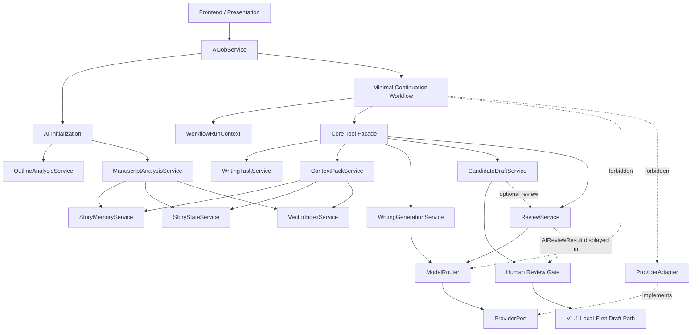
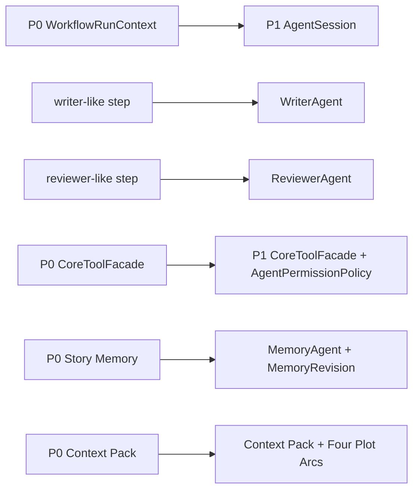
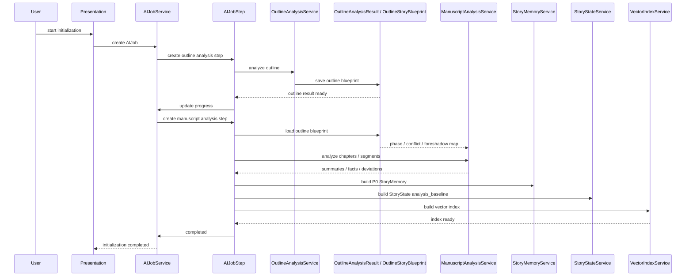
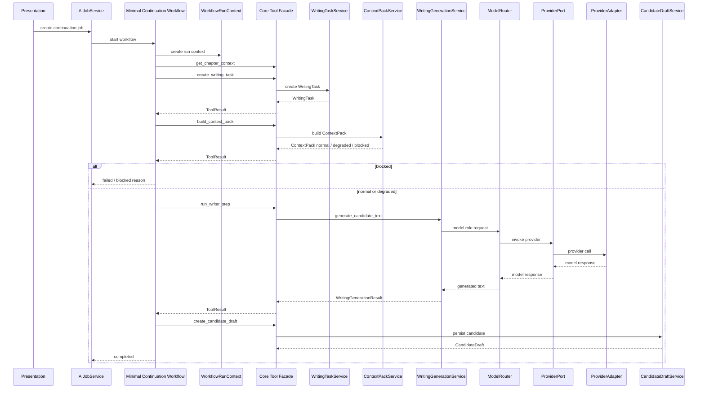
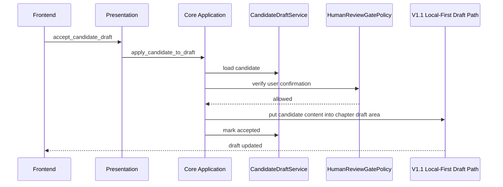
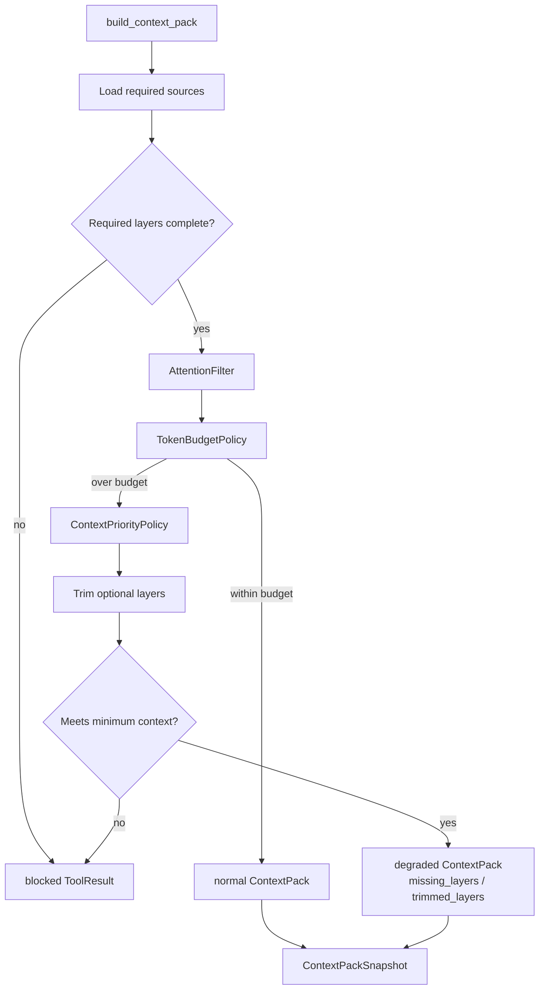
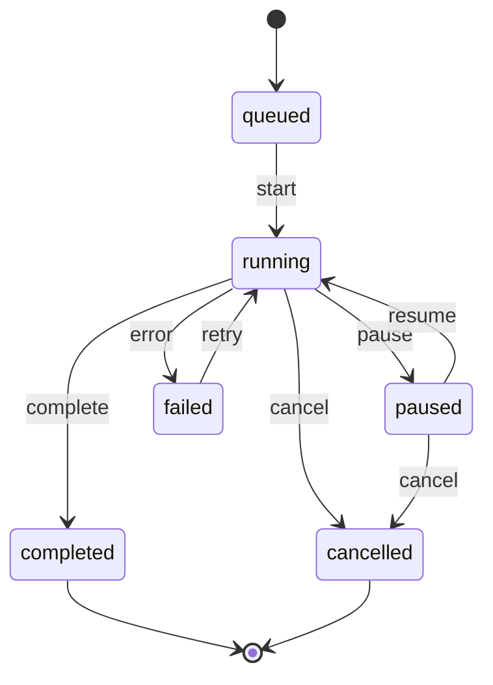
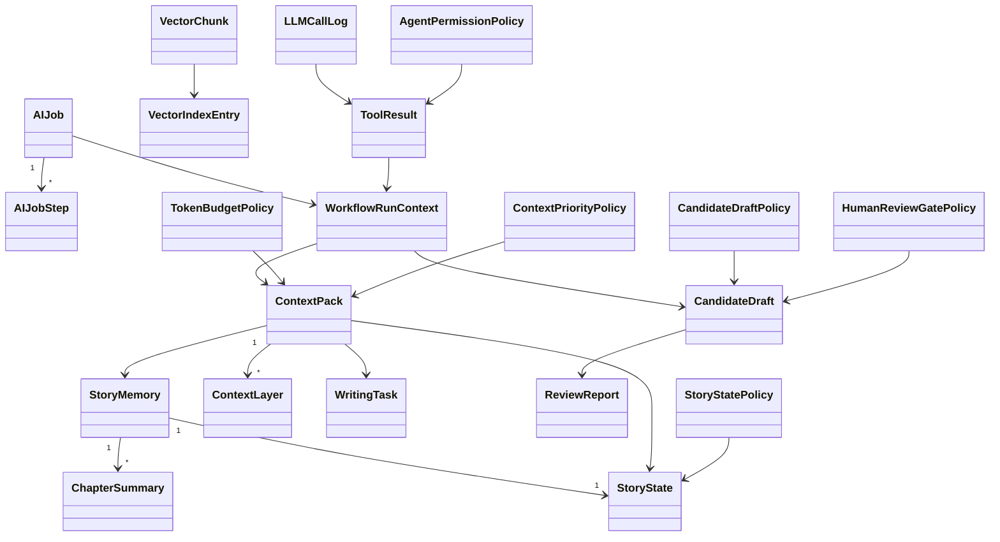

# InkTrace V2.0-P0 详细设计总纲

## 一、P0 详细设计目标与范围

### 1.1 文档定位

本文档是 InkTrace V2.0-P0 的详细设计总纲。

本文档用于指导后续 P0 各模块详细设计文档，不替代模块级详细设计，不进入开发计划，不拆 Task，不写代码，不生成数据库迁移脚本。

本文档为 P0 总体设计总纲，模块内部状态机、字段、错误码、API DTO、权限矩阵等最终口径，以 P0-01 ~ P0-11 各模块级详细设计为准；该说明不弱化总纲对 P0 范围和边界的约束。

### 1.2 P0 目标

P0 的目标是完成“AI 初始化 + 单章受控续写”的最小闭环。

P0 必须在 V1.1 非 AI 写作工作台基础上接入受控 AI 能力，并保持 V1.1 Local-First 正文保存链路不变。

### 1.3 P0 必须实现范围

- AI Settings。
- Provider 抽象。
- Model Router。
- Prompt Registry。
- Output Validator。
- LLM Call Log。
- AI Job System。
- 两阶段初始化：大纲分析 → 正文分析。
- P0 Story Memory。
- Story State。
- Vector Recall 初始索引。
- Context Pack 最小可用版本。
- Writing Task。
- Writing Generation。
- Core Tool Facade。
- Minimal Continuation Workflow。
- WorkflowRunContext。
- Candidate Draft。
- Human Review Gate。
- AI Review 基础能力。
- Quick Trial 快速试写降级。
- P0 非流式输出默认方案。

### 1.4 P0 明确不包含

- 完整 Agent Runtime。
- AgentSession / AgentStep / AgentObservation / AgentTrace 完整能力。
- 五 Agent Workflow。
- 完整四层剧情轨道。
- A/B/C 剧情方向推演。
- 多轮候选稿迭代。
- AI Suggestion / Conflict Guard 完整能力。
- Story Memory Revision 完整能力。
- 多章续写。
- 自动连续续写队列。
- Style DNA。
- Citation Link。
- @ 标签引用系统。
- Opening Agent。
- 成本看板。
- 分析看板。

### 1.5 核心边界

边界声明：

- Core Tool Facade 属于 Core Application 层。
- Tool Facade 是 P0 Workflow / P1 Agent 调用 Core 的唯一受控入口。
- Tool Facade 不承载核心业务逻辑。
- 核心业务逻辑必须位于 Application Service / Domain Policy。
- Model Router 只能由 Core Application Service 调用。
- Workflow 不能直接调用 Model Router、Provider SDK、数据库、Vector DB、Embedding 或 Infrastructure。
- ContextPackService 属于 Core Application。
- Candidate Draft 是 AI 正文输出与正式正文之间的隔离层。
- `accept_candidate_draft` / `apply_candidate_to_draft` 不是 Agent Tool。
- 用户接受候选稿后，由 Presentation 调用 Core Application 用例，将候选稿内容放入章节草稿区。
- 后续保存继续走 V1.1 Local-First。
- P0 默认不启用流式输出。

使用说明：

```text
application/
  ai/
    tools/
      core_tool_facade
      tool_registry
      tool_result
      agent_permission_policy
```

以上为逻辑目录方向，最终文件路径以后端当前项目结构为准。

CoreToolFacade 是 Application 层独立门面服务，不内嵌在 MinimalContinuationWorkflow 中。MinimalContinuationWorkflow 只能依赖 CoreToolFacade，P1 Agent Runtime 也复用同一个 CoreToolFacade。

## 二、P0 总体详细设计视图

### 2.1 P0 模块清单

| 模块 | P0 职责 | 扩展点 |
|---|---|---|
| AI Infrastructure | Provider、Model Router、Prompt、Validator、日志 | P2：成本看板、更多 Provider |
| AI Job System | 长任务生命周期、进度、失败恢复 | P1：Agent Trace 关联；P2：自动队列 |
| AI Initialization | 大纲分析、正文分析、初始记忆、索引 | P1：Memory Agent 完整化 |
| Story Memory / Story State | P0 最小可用记忆和当前状态锁 | P1：Memory Revision、完整资产建议 |
| Vector Recall | 初始切片、Embedding、Top-K 召回 | P2：Citation Link、重排、更多索引策略 |
| Context Pack | 最小上下文包、blocked / degraded | P1：完整四层轨道；P2：Style DNA |
| Writing Task | 单章续写任务约束 | P1：章节计划、多方向规划 |
| Writing Generation | 根据 ContextPack + WritingTask 生成候选正文 | P1：WriterAgent / RewriterAgent |
| Core Tool Facade | P0 Workflow 受控工具入口 | P1：Agent 权限矩阵 |
| Minimal Continuation Workflow | 单章候选续写编排 | P1：Agent Runtime |
| Candidate Draft | 候选稿隔离、接受、丢弃、P0 拒绝理由 | P1：多轮版本树、拒绝理由统计 |
| AI Review | 基础审稿报告 | P1：Reviewer / Rewriter Agent |
| Human Review Gate | 用户确认门控 | P1：Conflict Guard 完整化 |
| Quick Trial | 未初始化快速试写降级 | P1/P2：更完整试写模式 |

### 2.2 P0 主链路

作品 AI 初始化：

```text
AI Settings
→ AI Job
→ 大纲分析
→ OutlineAnalysisResult / OutlineStoryBlueprint
→ 正文分析
→ P0 Story Memory / Story State
→ Vector Index
→ 初始化完成
```

正式续写主链路：

```text
用户触发续写
→ AI Job
→ Minimal Continuation Workflow
→ Core Tool Facade
→ Writing Task
→ Context Pack
→ WritingGenerationService
→ Candidate Draft
→ HumanReviewGate / 用户确认
→ user_action apply
→ 章节草稿区
→ V1.1 Local-First 保存
```

可选辅助审阅链路：

```text
Candidate Draft
→（可选 AIReview）
→ AIReviewResult
→ HumanReviewGate 展示
```

AIReview 是辅助审阅，不是门控。P0 默认不由 MinimalContinuationWorkflow 自动触发 AIReview；P0-08 续写完成后只需要生成 CandidateDraft，不必须自动 AIReview。AIReview 可以由 HumanReviewGate / UI 的 user_action 手动触发；AIReview failed 不阻断 HumanReviewGate 的 accept / reject / apply 基本操作，AIReviewResult 不改变 CandidateDraft.status，也不自动 accept / reject / apply CandidateDraft。

### 2.3 P0 模块关系图

注：实线表示调用 / 用例依赖，虚线 `implements` 表示 Infrastructure Adapter 实现 Application Port。该图仅表达 P0 最小闭环，P1 Agent Runtime 不在 P0 实现。



### 2.4 P0 与 P1 / P2 边界

P0 只实现 Agent-ready 的最小编排。P0 的 WorkflowRunContext 必须保留向 P1 AgentSession 演进的空间，但不得实现完整 Agent Runtime。

P0 只保留 Plot Arc 最小占位，不实现完整四层剧情轨道。P0 的 AI Review 只生成基础审稿报告，不实现 Rewriter Agent。

### 2.5 P0 → P1 演进图

注：该图只表示演进方向，不表示 P0 已实现 P1 对象。



## 三、P0 模块拆分

### 3.1 AI Infrastructure

职责：

- 管理 AI Settings。
- 定义 ProviderPort。
- 接入 KimiProviderAdapter、DeepSeekProviderAdapter。
- 按模型角色通过 ModelRouter 选择 Provider。
- 管理 PromptRegistry 与 PromptTemplate。
- 使用 OutputValidator 校验结构化输出。
- 写入 LLMCallLog。

核心对象：

- AISettings。
- ProviderPort。
- KimiProviderAdapter。
- DeepSeekProviderAdapter。
- ModelRouter。
- ModelRoleConfig。
- PromptRegistry。
- PromptTemplate。
- OutputValidator。
- LLMCallLog。

边界：

- 模型请求只能由 Core Application Service 发起。
- Workflow 不能直接调用 ModelRouter。
- Workflow 不能直接调用 Provider SDK。
- Prompt 不能承载越权业务规则。
- 结构化输出不通过 schema 校验时，不得进入正式数据或候选数据。

OutputValidator 重试策略，P0 默认：

- schema 校验失败默认最多重试 2 次。
- 总调用次数 = 首次调用 + 2 次重试。
- 重试时不重新构建 Context Pack。
- 重试时沿用同一个 ContextPackSnapshot。
- 重试时沿用同一个 WritingTask。
- 重试时重新调用模型。
- 重试 Prompt 可附加 schema 修复提示，例如“必须返回合法 JSON / 必须符合 schema”。
- 每次失败写入 LLMCallLog。
- 每次失败写入 AIJobStep attempt / error。
- 超过最大重试次数后，AIJobStep.status = failed，错误原因记录为 output_schema_invalid。
- 超过最大重试次数后，不得创建候选数据或正式数据。

扩展点：

- P1：Agent Trace 关联完整 prompt_key / prompt_version / context_pack_snapshot_id。
- P2：成本看板消费 LLMCallLog。

### 3.2 AI Job System

职责：

- 创建 AIJob。
- 维护 AIJobStep。
- 管理 queued、running、paused、failed、cancelled、completed 状态。
- 记录 Job Progress。
- 支持 pause / resume / cancel / retry。
- 处理服务重启后的恢复策略。

核心对象：

- AIJob。
- AIJobStep。
- Job Progress。
- RetryPolicy，可选。

边界：

- AIJobService 负责任务生命周期，不承载模型生成业务逻辑。
- Job Step 记录阶段进度，不保存完整正文或完整 Prompt。
- P0 默认非流式输出，Job Progress 只展示步骤级进度。
- OutputValidator schema 校验失败时，AIJobStep 必须记录 attempt、error_code、error_message。
- 超过最大重试次数后，AIJobStep.status = failed，error_code = output_schema_invalid。
- 正文分析某章 schema 校验失败时，该章节 AIJobStep failed，允许跳过或重试；除非失败比例超过后续详细设计设定阈值，否则不必整书初始化失败。

扩展点：

- P1：AgentSession 可关联 AIJob。
- P2：自动续写队列复用 AIJob 生命周期。

### 3.3 AI Initialization

职责：

- 执行两阶段初始化。
- 第一阶段：OutlineAnalysisService 分析作品大纲。
- 第二阶段：ManuscriptAnalysisService 分析已有正文。
- 保存 OutlineAnalysisResult / OutlineStoryBlueprint。
- ManuscriptAnalysisService 必须读取 OutlineAnalysisResult / OutlineStoryBlueprint。
- 构建 P0 StoryMemory。
- 构建 StoryState。
- 构建 VectorIndex 初始索引。

核心对象：

- OutlineAnalysisResult。
- OutlineStoryBlueprint。
- ChapterSummary。
- CurrentStorySummary。
- BasicCharacterState。
- BasicForeshadowCandidate。
- BasicSettingFact。

边界：

- 正文分析不是独立摘要任务，必须对照大纲分析结果。
- 大纲分析结果不覆盖用户原始大纲。
- 初始化未完成时，正式续写不可用。
- 快速试写可用，但必须标记上下文不足。

扩展点：

- P1：Memory Agent 接管更完整的大纲分析、正文分析和记忆更新建议。

### 3.4 Story Memory / Story State，P0 最小版

职责：

- 存储 P0 最小可用记忆。
- 为 Context Pack 提供章节摘要、全书当前进度摘要、主要角色状态、基础伏笔候选、基础设定事实。
- 维护 StoryState 候选状态和正式续写基线边界。

P0 最小内容：

- ChapterSummary。
- CurrentStorySummary。
- BasicCharacterState。
- BasicForeshadowCandidate。
- BasicSettingFact。
- StoryState。

StoryState 边界：

- AI 分析生成的 StoryState 只是候选状态或分析快照。
- P0 中，StoryState 正式续写基线只来自“已确认章节正文 + 初始化 / 正文分析形成的确定性结果”。
- P0 默认可将初始化完成后的 StoryState 标记为 analysis_baseline，用于正式续写。
- analysis_baseline 的来源必须是 confirmed_chapter_analysis。
- P0 可允许用户在初始化结果确认页查看 StoryState baseline。
- 如果后续用户修改正文，则需要重新分析相关章节，或标记 StoryState 可能过期。
- P0 不通过 AI Suggestion 更新正式 StoryState。
- P0 不提供复杂手动 StoryState 维护入口。
- P0 不实现完整 StoryState 手动编辑和版本化。
- AI 不能静默更新正式 StoryState。

扩展点：

- P1：“用户采纳 AI 建议”路径进入 StoryState。
- P1 / P2：“用户手动维护正式资产影响 StoryState”路径扩展。
- P1：StoryMemoryRevision。
- P1：AI Suggestion / Conflict Guard 完整流程。

### 3.5 Vector Recall

职责：

- 将章节正文切分为 VectorChunk。
- 通过 EmbeddingPort 生成向量。
- 通过 VectorStorePort 写入 VectorIndexEntry。
- 为 Context Pack 提供 RAG Top-K 召回。

核心对象：

- VectorChunk。
- VectorIndexEntry。
- EmbeddingPort。
- VectorStorePort。
- VectorIndexService。
- LocalEmbeddingAdapter。

边界：

- Agent / Workflow 不直接调用 Embedding 或 Vector DB。
- RAG 结果只能通过 ContextPackService 进入 Context Pack。
- 向量索引未完成时，Context Pack 可降级，不影响 V1.1 写作。

扩展点：

- P1：AttentionFilter。
- P2：Citation Link。

### 3.6 Context Pack

职责：

- 由 ContextPackService 统一构建 P0 Context Pack。
- 生成 ContextLayer。
- 生成 ContextPackSnapshot。
- 执行 TokenBudgetPolicy。
- 执行 ContextPriorityPolicy。
- 执行 AttentionFilter，P0 可为最小实现。
- 返回 normal / degraded / blocked。

P0 最小 Context Pack：

- 当前章节 / 当前选区上下文。
- Writing Task。
- StoryState。
- 全书当前进度摘要。
- 最近章节摘要。
- RAG 召回片段，可缺省降级。
- P0 最小剧情轨道占位。

blocked / degraded 策略：

- 必选层缺失：正式续写 blocked。
- 保底层可以压缩，但不能完全缺失。
- 可裁剪层按相关性与优先级裁剪。
- 可裁剪层不足：返回 degraded，并记录 missing_layers、trimmed_layers、token_budget、actual_tokens、degrade_reason。
- 裁剪后低于最低上下文要求：正式续写 blocked。

扩展点：

- P1：完整四层剧情轨道进入 Context Pack。
- P2：Style DNA / Citation Link 进入可选层。

### 3.7 Writing Task

职责：

- 生成本次单章续写任务。
- 明确目标、限制、目标字数、禁止事项、风格提示。
- 支持用户查看、编辑或确认。

核心字段方向：

- goal。
- constraints。
- target_word_count。
- forbidden_items。
- style_hints。

边界：

- Writing Task 不创建正式章节。
- Writing Task 不改变正式大纲。
- Writing Task 是 Context Pack 的必选层。

扩展点：

- P1：Planner Agent 生成章节计划与 Writing Task。

### 3.8 Writing Generation / AI Writing，P0

职责：

- WritingGenerationService 是 P0 AI Writing / Continuation 子域下的独立 Core Application Service。
- 根据 ContextPack + WritingTask 调用 ModelRouter 生成候选正文。
- 调用 PromptRegistry 获取 writer 角色 Prompt。
- 调用 OutputValidator 校验模型输出。
- 写入 LLMCallLog。

核心对象：

- WritingGenerationService。
- WritingGenerationResult。
- ContextPack。
- WritingTask。
- ModelRoleConfig，model_role = writer。

边界：

- WritingGenerationService 不是 MinimalContinuationWorkflow 的内部组件。
- WritingGenerationService 不属于 Infrastructure。
- WritingGenerationService 不属于 Tool Facade。
- WritingGenerationService 由 CoreToolFacade 调用。
- WritingGenerationService 不创建 CandidateDraft。
- WritingGenerationService 不持久化候选稿。
- WritingGenerationService 不写正式正文。
- CandidateDraftService 才负责保存候选稿。
- `generate_candidate_text()` 是 Application Service 方法名方向，不作为 Tool 名。

扩展点：

- P1：WriterAgent。
- P1：RewriterAgent。

### 3.9 Core Tool Facade，P0

职责：

- 管理 ToolRegistry。
- 执行 P0 最小 AgentPermissionPolicy。
- 适配参数。
- 调用 Application Service。
- 包装 ToolResult。
- 记录 forbidden / observation。

P0 Workflow 可调用工具：

- `get_work_outline`。
- `get_chapter_context`。
- `get_story_memory`。
- `get_story_state`。
- `search_related_memories`。
- `build_context_pack`。
- `create_writing_task`。
- `run_writer_step`。
- `review_candidate_draft`（可选辅助审阅，默认由 HumanReviewGate / UI 的 user_action 触发）。
- `create_candidate_draft`。
- `request_human_review`。
- `update_ai_job_progress`。
- `record_tool_observation`。

Tool 与 Application Service 映射：

- `run_writer_step` Tool 内部调用 `WritingGenerationService.generate_candidate_text()`。
- `review_candidate_draft` 可作为可选辅助审阅 Tool，内部调用 P0-10 AIReviewService 的 review_candidate_draft / 等价用例。
- Tool 名与 Application Service 方法名不得混淆。
- `generate_candidate_text()` / `generate_review_report()` 是 Application Service 方法名方向，不作为 Tool 名。

Forbidden Tools：

- `update_official_chapter_content`。
- `overwrite_character_asset`。
- `delete_asset`。
- `create_official_chapter_directly`。
- `update_story_memory_directly`。
- `accept_suggestion_as_user`。
- `bypass_human_review_gate`。
- `call_llm_provider_directly`。
- `access_database_directly`。
- `access_vector_db_directly`。
- `accept_candidate_draft`。
- `apply_candidate_to_draft`。

边界：

- Forbidden Tools 不是实际注册工具。
- Tool Facade 不承载核心业务逻辑。
- Tool Facade 不允许成为 CRUD 后门。

### 3.10 Minimal Continuation Workflow

职责：

- 执行 P0 单章续写最小编排。
- 维护 WorkflowRunContext。
- 执行 writer-like step。
- 执行 reviewer-like step。
- 通过 Tool Facade 调用 Core。

边界：

- 非完整 Agent Runtime。
- 不实现 AgentSession / AgentStep / AgentObservation / AgentTrace 完整能力。
- 不直接调用 ModelRouter、Provider SDK、Repository、Vector DB。

扩展点：

- P1：WorkflowRunContext 演进为 AgentSession。
- P1：writer-like step 演进为 WriterAgent。
- P1：reviewer-like step 演进为 ReviewerAgent。

### 3.11 Candidate Draft

职责：

- 保存 AI 生成正文候选稿。
- 记录候选稿状态。
- 支持用户接受、拒绝、应用候选稿。
- 用户接受候选稿后，由 Presentation 调用 Core Application 的 `accept_candidate_draft` / `apply_candidate_to_draft` 用例，将候选稿内容放入章节草稿区。
- CandidateDraftService 只负责加载候选稿、状态流转与标记 pending_review / accepted / rejected / applied / stale / superseded，不绕过 Human Review Gate。

P0 状态，以 P0-09 CandidateDraft 与 HumanReviewGate 详细设计为最终口径：

- pending_review：CandidateDraft 已生成，等待用户审阅。
- accepted：用户已接受候选稿，但不等于已写入正式正文。
- rejected：用户拒绝候选稿。
- applied：候选稿已通过 V1.1 Local-First 保存链路应用到正式章节草稿。
- stale：候选稿或其上下文已经过期。
- superseded：候选稿已被后续候选稿替代。

状态规则：

- `accepted != applied`。
- CandidateDraft 不是正式正文。
- CandidateDraft 不属于 confirmed chapters。
- CandidateDraft 不进入 StoryMemory / StoryState / VectorIndex / 正式 ContextPack。
- generated / reviewed / review_failed / discarded 是历史草案术语，已被 P0-09 收敛替换，不作为 CandidateDraft 正式状态枚举。

拒绝理由：

- rejected 时允许记录 reject_reason_text。
- P0 必须支持 reject_reason_text，可为空。
- P0 可选支持 reject_reason_code。
- reason_code 枚举方向：off_topic、style_mismatch、logic_conflict、too_ai_like、too_long、too_short、bad_rhythm、user_other。
- P0 不做复杂统计分析。

边界：

- AI 只能创建 Candidate Draft。
- AI 不能接受候选稿。
- 接受候选稿必须由用户触发。
- 进入章节草稿区后，保存继续走 V1.1 Local-First。

扩展点：

- P1：多轮 CandidateDraftVersion。
- P1：reject_reason_code 统计、质量分析与 Prompt 优化闭环。

### 3.12 AI Review，P0 基础版

职责：

- 对 Candidate Draft 生成 ReviewReport。
- P0 可将 ReviewIssue 作为报告内部结构或 P1 扩展对象。
- 检查基础审稿维度。

基础审稿维度：

- 人物一致性。
- 设定冲突。
- 时间线冲突。
- 伏笔误用。
- 风格漂移。
- AI 味。
- Writing Task 完成度。
- P0 最小剧情轨道偏离。

P0-10 AIReview 详细设计中使用英文枚举作为实现口径；总纲中的中文审阅维度是产品语义描述，两者对应关系如下。

| 总纲中文维度 | P0-10 AIReviewCategory | 说明 |
|---|---|---|
| 人物一致性 | character_consistency | 人物设定、行为、关系是否一致 |
| 设定冲突 | plot_consistency / contradiction | 世界观、剧情设定是否冲突 |
| 时间线冲突 | plot_consistency / contradiction | 时间顺序、事件因果是否矛盾 |
| 伏笔误用 | plot_consistency / coherence | 伏笔使用是否突兀或不连贯 |
| 风格漂移 | style_consistency / tone_issue | 文风、语气是否偏离 |
| AI 味 / 生硬表达 | tone_issue / repetition | 表达是否机械、重复、突兀 |
| 重复啰嗦 | repetition | 内容是否重复或冗余 |
| 上下文不连贯 | coherence | 与前文、当前上下文是否衔接 |
| 不安全或不适合直接应用 | unsafe_output / apply_risk | 是否存在不适合直接应用的风险 |

失败策略：

- 审稿失败时，AIReviewResult 可标记 failed / unavailable，但不得改变 CandidateDraft.status。
- P0 允许用户手动决定是否使用候选稿。
- AIReview failed 不阻断 HumanReviewGate 的 accept / reject / apply 基本操作。
- AIReview 不自动 accept / reject / apply CandidateDraft。
- `generate_review_report()` 是 ReviewService 的 Application Service 方法名方向，不作为 Tool 名。

扩展点：

- P1：Reviewer Agent。
- P1：Rewriter Agent。

### 3.13 Human Review Gate，P0

职责：

- 阻止 AI 自动合并正文。
- 阻止 AI 自动创建正式章节。
- 阻止 AI 自动覆盖正式资产。
- 保证 Candidate Draft 接受必须由用户触发。

边界：

- `apply_candidate_to_draft` 是用户确认后的 Core Application Use Case。
- `apply_candidate_to_draft` 不是 Agent Tool。
- Agent / Workflow 无权伪造用户确认。

### 3.14 Quick Trial / 快速试写降级

职责：

- 未初始化时允许用户试用临时候选稿。
- 只能使用当前章节、当前选区、用户输入的大纲或作品原始大纲等临时上下文。
- 生成结果只能进入 Candidate Draft 或临时候选区。
- 标记“上下文不足，非正式智能续写”。
- Quick Trial 不是正式续写，不等于初始化完成。

边界：

- 不更新 Story Memory。
- 不生成正式 Memory Update Suggestion。
- 不更新正式 StoryState。
- 不作为正式续写质量验收依据。
- 不绕过 Candidate Draft 隔离。
- 不绕过 Human Review Gate。
- 不改变正式续写必须初始化完成的主规则。

## 四、P0 核心流程详细设计总览

### 4.1 P0 AI 初始化流程图



### 4.2 P0 单章续写时序图

注：Tool 名统一为 `run_writer_step`；Service 方法名为 `generate_candidate_text`。AIReview 是可选辅助审阅，不是 P0 单章续写必经步骤。



可选 AIReview 由 HumanReviewGate / UI 的 user_action 手动触发，不由 MinimalContinuationWorkflow 默认自动触发。AIReview 失败不阻断用户继续 accept / reject / apply CandidateDraft。

### 4.3 Candidate Draft 接受流程图



### 4.4 Context Pack blocked / degraded 流程图



### 4.5 AI Job 状态机图



## 五、P0 Application Service 设计总览

| Service | 职责 | 输入 | 输出 | 依赖 | 不允许做的事情 | 扩展点 |
|---|---|---|---|---|---|---|
| AISettingsService | 管理 AI 配置 | Key、模型角色配置 | AISettings | AISettingsRepositoryPort | 写普通日志暴露 Key | P2：更多 Provider 配置 |
| ModelRouter / ModelRouterService | 按模型角色选择 Provider | model_role、prompt、参数 | 模型响应 | ProviderPort、ModelRoleConfig | 被 Workflow 直接调用 | P2：成本策略、更多路由 |
| PromptRegistryService | 管理 PromptTemplate | prompt_key / version | PromptTemplate | PromptTemplateRepositoryPort | 承载越权业务规则 | P1：Prompt 版本治理 |
| OutputValidationService | 校验结构化输出 | 输出文本、schema | 校验结果 | Schema registry、RetryPolicy | 放行不合规输出；超过重试次数仍创建数据 | P1：自动修复策略 |
| AIJobService | 管理 Job 生命周期 | 任务请求、attempt/error | AIJob、Progress | AIJobRepositoryPort | 执行模型生成细节；吞掉 output_schema_invalid | P1：AgentSession 关联 |
| OutlineAnalysisService | 分析作品大纲 | work outline | OutlineStoryBlueprint | ModelRouter、PromptRegistry、Validator | 覆盖原始大纲 | P1：Memory Agent |
| ManuscriptAnalysisService | 分析正文 | chapters、OutlineStoryBlueprint | summaries / facts | ModelRouter、PromptRegistry、Validator | 脱离大纲独立分析 | P1：Memory Agent |
| StoryMemoryService | 构建 P0 最小记忆 | 分析结果 | StoryMemorySnapshot | StoryMemoryRepositoryPort | 静默写正式 Memory Revision | P1：Revision |
| StoryStateService | 维护当前状态锁 | confirmed_chapter_analysis | StoryState analysis_baseline | StoryStatePolicy | 通过 AI Suggestion 静默更新正式基线 | P1：可独立拆分 |
| VectorIndexService | 构建索引 | chapters | VectorChunk / Index | EmbeddingPort、VectorStorePort | 直接改章节正文 | P1：重建策略 |
| VectorRecallService | Top-K 召回 | query、work_id | recall snippets | VectorStorePort | 直接进入 Prompt 不经 ContextPack | P1：rerank |
| ContextPackService | 组装上下文包 | chapter、memory、task、RAG | ContextPack | TokenBudgetPolicy、ContextPriorityPolicy | 由 Workflow 自己拼上下文 | P1：四层轨道 |
| WritingTaskService | 创建续写任务 | chapter、memory、user intent | WritingTask | StoryMemoryService | 改正式大纲或章节 | P1：Planner Agent |
| CoreToolFacade | 受控工具入口 | Tool request | ToolResult | ToolRegistry、AgentPermissionPolicy | 承载核心业务逻辑 | P1：完整权限矩阵 |
| MinimalContinuationWorkflow | 编排单章续写 | continuation request | CandidateDraft | CoreToolFacade | 直接调用 Router / Infra、默认强制 AIReview | P1：Agent Runtime |
| WritingGenerationService | 独立 Core Application Service，生成候选正文 | ContextPack、WritingTask、model_role=writer | generated_text / WritingGenerationResult | PromptRegistry、ModelRouter、OutputValidator、LLMCallLog | 创建 CandidateDraft、持久化候选稿、写正式正文、直接访问 Provider SDK | P1：WriterAgent / RewriterAgent |
| CandidateDraftService | 管理候选稿 | generated text、user action | CandidateDraft | CandidateDraftRepositoryPort、Policy | 代替用户接受候选稿 | P1：版本树 |
| ReviewService / AIReviewService | 可选基础审稿 | CandidateDraft、ContextPack 安全引用 | ReviewReport / AIReviewResult | ModelRouter、Validator | 修改正式正文、改变 CandidateDraft.status、阻断 HumanReviewGate 基本操作 | P1：ReviewerAgent |
| HumanReviewGateService | 用户确认门控 | user action、resource | decision | HumanReviewGatePolicy | 被 Workflow 绕过 | P1：Conflict Guard |

## 六、P0 Domain 对象与 Policy 设计总览

### 6.1 P0 领域对象

- AIJob。
- AIJobStep。
- WorkflowRunContext。
- StoryMemory。
- StoryState。
- ChapterSummary。
- VectorChunk。
- VectorIndexEntry。
- ContextPack。
- ContextLayer。
- WritingTask。
- CandidateDraft。
- ReviewReport。
- ToolResult。
- LLMCallLog。

### 6.2 P0 Policies

- HumanReviewGatePolicy：控制正式数据变更必须来自用户确认。
- CandidateDraftPolicy：控制候选稿状态流转。
- ContextPriorityPolicy：控制上下文层级优先级与裁剪顺序。
- TokenBudgetPolicy：控制 token 预算与 blocked / degraded。
- StoryStatePolicy：控制 StoryState 候选状态与 analysis_baseline 边界。
- AgentPermissionPolicy，P0 最小版：控制 Workflow 只能调用允许工具。
- RetryPolicy，可选：控制 Provider / Validator / Job 重试策略。

### 6.3 P0 领域对象概念类图



## 七、P0 Ports / Adapters 设计总览

### 7.1 Ports

- ProviderPort。
- EmbeddingPort。
- VectorStorePort。
- AISettingsRepositoryPort。
- WorkRepositoryPort。
- ChapterRepositoryPort。
- StoryMemoryRepositoryPort。
- AIJobRepositoryPort。
- CandidateDraftRepositoryPort。
- ReviewReportRepositoryPort。
- PromptTemplateRepositoryPort。
- LLMCallLogRepositoryPort。
- FileStoragePort，可选。
- EventPublisherPort，可选。

### 7.2 Adapters

- KimiProviderAdapter。
- DeepSeekProviderAdapter。
- LocalEmbeddingAdapter。
- VectorStoreAdapter。
- SQLite Repository Adapters。
- LLMCallLogger。
- AISettingsStore。

### 7.3 依赖倒置规则

- Application 依赖 Ports。
- Infrastructure 实现 Ports。
- Infrastructure Adapter 实现 Port 使用虚线 `-. "implements" .->` 表达。
- Agent / Workflow 不直接调用 Adapters。
- Infrastructure 可映射 Domain 对象，但不得承载或修改 Domain 业务规则。

### 7.4 Ports / Adapters 依赖图

```mermaid
flowchart TB
    subgraph Application["Application"]
        Services["Application Services"]
        Router["ModelRouter"]
        Context["ContextPackService"]
    end

    subgraph Ports["Application Ports"]
        ProviderPort["ProviderPort"]
        EmbeddingPort["EmbeddingPort"]
        VectorPort["VectorStorePort"]
        AISettingsRepo["AISettingsRepositoryPort"]
        WorkRepo["WorkRepositoryPort"]
        ChapterRepo["ChapterRepositoryPort"]
        MemoryRepo["StoryMemoryRepositoryPort"]
        JobRepo["AIJobRepositoryPort"]
        DraftRepo["CandidateDraftRepositoryPort"]
        ReviewRepo["ReviewReportRepositoryPort"]
        PromptRepo["PromptTemplateRepositoryPort"]
        LogRepo["LLMCallLogRepositoryPort"]
    end

    subgraph Infrastructure["Infrastructure Adapters"]
        Kimi["KimiProviderAdapter"]
        DeepSeek["DeepSeekProviderAdapter"]
        Embedding["LocalEmbeddingAdapter"]
        Vector["VectorStoreAdapter"]
        SQLite["SQLite Repository Adapters"]
        Logger["LLMCallLogger"]
        Settings["AISettingsStore"]
    end

    Services --> AISettingsRepo
    Services --> WorkRepo
    Services --> ChapterRepo
    Services --> MemoryRepo
    Services --> JobRepo
    Services --> DraftRepo
    Services --> ReviewRepo
    Services --> PromptRepo
    Services --> LogRepo
    Context --> VectorPort
    Router --> ProviderPort
    Services --> EmbeddingPort

    Kimi -. "implements" .-> ProviderPort
    DeepSeek -. "implements" .-> ProviderPort
    Embedding -. "implements" .-> EmbeddingPort
    Vector -. "implements" .-> VectorPort
    SQLite -. "implements" .-> WorkRepo
    SQLite -. "implements" .-> ChapterRepo
    SQLite -. "implements" .-> MemoryRepo
    SQLite -. "implements" .-> JobRepo
    SQLite -. "implements" .-> DraftRepo
    SQLite -. "implements" .-> ReviewRepo
    SQLite -. "implements" .-> PromptRepo
    Logger -. "implements" .-> LogRepo
    Settings -. "implements" .-> AISettingsRepo
```



## 八、P0 持久化对象总览

| 对象 | 用途 | 数据性质 | 是否正式数据 | 是否需要用户确认 | 与 V1.1 的关系 | P0 | 预留 |
|---|---|---|---|---|---|---|---|
| ai_settings | AI 配置 | 配置 | 否 | 否 | 不改 V1.1 | 是 | P2：更多 Provider |
| model_role_configs | 模型角色配置 | 配置 | 否 | 否 | 不改 V1.1 | 是 | P2：成本策略 |
| prompt_templates | Prompt 模板 | 配置 | 否 | 否 | 不改 V1.1 | 是 | P1：版本治理 |
| ai_jobs | AI 任务 | Job | 否 | 否 | 不影响正文 | 是 | P1：AgentSession 关联 |
| ai_job_steps | AI 任务步骤 | Job | 否 | 否 | 不影响正文 | 是 | P1：AgentStep 关联 |
| llm_call_logs | LLM 调用日志 | 日志 | 否 | 否 | 不记录完整正文 | 是 | P2：成本看板 |
| outline_analysis_results | 大纲分析结果 | AI 分析 | 否 | 作为正式记忆需确认 | 不覆盖用户大纲 | 是 | P1：Memory Agent |
| story_memory_snapshots | P0 记忆快照 | AI 分析 / 快照 | 候选或分析结果 | 正式化需确认 | 不覆盖资产 | 是 | P1：Revision |
| story_states | 当前状态锁 | AI 分析 / 状态 | analysis_baseline 是 P0 正式续写基线 | 来源固定为 confirmed_chapter_analysis | 不改正文；正文修改后需重分析或标记过期 | 是 | P1：AI Suggestion / 手动资产路径 |
| chapter_summaries | 章节摘要 | AI 分析 | 否 | 否 | 不改章节正文 | 是 | P1：分层摘要 |
| vector_chunks | 向量切片 | 索引 | 否 | 否 | 只读引用章节 | 是 | P2：Citation Link |
| vector_index_entries | 向量索引 | 索引 | 否 | 否 | 不改正文 | 是 | P1：重排 / 重建 |
| context_pack_snapshots | 上下文快照 | 快照 / Trace | 否 | 否 | 默认不存完整正文 | 是 | P1：Agent Trace |
| writing_tasks | 写作任务 | 任务约束 | 否 | 用户可编辑确认 | 不改章节 | 是 | P1：Planner Agent |
| candidate_drafts | 候选稿与 P0 拒绝理由 | 候选 | 否 | accepted 后仍需 apply 才进入草稿 | 不直接写正式正文；rejected 可保存 reject_reason_text | 是 | P1：版本树、reason_code 统计 |
| review_reports | 审稿报告 | 报告 | 否 | 否 | 不改正文 | 是 | P1：ReviewIssue |

## 九、P0 API 方向总览

| API 方向 | 用途 | P0 说明 |
|---|---|---|
| AI Settings API | 配置 Key、模型角色、连接测试 | 必须支持 Kimi / DeepSeek |
| AI Initialization API | 启动大纲分析、正文分析、初始化流程 | 通过 AIJob 执行 |
| AI Job API | 查询进度、暂停、继续、取消、重试 | 步骤级进度，P0 非流式 |
| Context Pack Preview API | 高级模式预览上下文与裁剪结果 | 可查看 blocked / degraded 原因 |
| Writing Task API | 查看、编辑、确认 Writing Task | P0 单章任务 |
| Continuation API | 触发单章候选续写 | 创建 AIJob + Workflow |
| Candidate Draft API | 查看候选稿、拒绝、重新生成、保存 reject_reason_text | 不直接进入正式正文；未填写拒绝理由时允许 rejected 并记录空理由 |
| Review API | 查看审稿报告 | 审稿失败不阻断用户手动决策 |
| Quick Trial API | 未初始化快速试写 | 标记上下文不足 |
| Accept Candidate Draft API | 用户接受候选稿 | 不是 Agent Tool，进入 Core Application，用于写入 V1.1 草稿链路 |

Accept Candidate Draft API 是用户确认入口，不是 Agent Tool。它进入 Core Application 的 `accept_candidate_draft` / `apply_candidate_to_draft` 用例，最终进入 V1.1 Local-First 草稿链路。

## 十、P0 前端模块总览

| 前端模块 | 触发 API | 展示状态 | 需要用户确认 | P0 不做 / 预留 |
|---|---|---|---|---|
| AI Settings 页面 | AI Settings API | Key 配置、连接测试、Provider 状态 | 保存配置 | P2：成本看板 |
| 作品 AI 初始化向导 | AI Initialization API | 初始化步骤、前置条件 | 开始 / 取消 / 重试 | P1：Memory Agent 完整流程 |
| 初始化进度面板 | AI Job API | queued / running / paused / failed / completed | 暂停 / 继续 / 重试 / 取消 | P0 不做：token streaming |
| 写作页 AI 续写入口 | Continuation API | 可用 / 不可用 / 初始化要求 | 触发续写 | P2：多章续写 |
| 快速试写入口 | Quick Trial API | 上下文不足标记 | 触发试写 | P0 不做：正式记忆更新 |
| Candidate Draft 候选稿区 | Candidate Draft API | pending_review / accepted / rejected / applied / stale / superseded | 接受 / 拒绝 / 应用 / 重新生成 / 填写拒绝理由 | P1：多轮版本对比、拒绝理由统计 |
| 审稿报告面板 | Review API | 审稿维度、问题摘要、失败状态 | 用户决定是否采纳候选稿 | P1：Rewriter Agent |
| Context Pack 预览/调试面板 | Context Pack Preview API | normal / degraded / blocked、裁剪层 | 高级模式查看 | P0 不做：完整 Prompt 保存 |

## 十一、P0 错误处理与降级总览

| 场景 | 处理 | V1.1 是否受影响 |
|---|---|---|
| Provider Key 未配置 | AI 能力不可用，提示配置 | 不影响 |
| Provider 超时 | Job step failed，可 retry | 不影响 |
| 模型输出不符合 schema | OutputValidator 拒绝，进入 retry / failed | 不影响 |
| OutputValidator 超过最大重试次数 | AIJobStep.status = failed，error_code = output_schema_invalid；不创建候选数据或正式数据 | 不影响 |
| 续写生成 schema 校验失败 | 首次调用 + 2 次重试后仍失败则 continuation Job failed，不创建 CandidateDraft | 不影响 |
| 审稿 schema 校验失败 | CandidateDraft 可保留；AIReviewResult 不创建或标记 failed / unavailable；用户可手动决定是否使用候选稿 | 不影响 |
| AI Job 中断 | 保留 Job 状态，允许继续 / 重试 / 取消 | 不影响 |
| 服务重启 | running Job 标记 paused / failed | 不影响 |
| 大纲分析失败 | 初始化失败，可重试大纲分析 | 不影响 |
| 正文分析某章节失败 | 标记失败章节，允许跳过或重试 | 不影响 |
| 向量索引未完成 | Context Pack 降级，不使用 RAG 层 | 不影响 |
| Context Pack 必选层缺失 | 正式续写 blocked，可选择快速试写 | 不影响 |
| Context Pack degraded | 允许生成，但必须显示 degraded 原因 | 不影响 |
| StoryState 缺失 | 正式续写 blocked 或快速试写降级 | 不影响 |
| 候选稿生成失败 | Candidate Draft 不创建；失败由 Workflow / ToolResult 表达，不作为 CandidateDraft 正式状态 | 不影响 |
| 审稿失败 | AIReviewResult 标记 failed / unavailable，不改变 CandidateDraft.status，HumanReviewGate 基本操作仍可用 | 不影响 |
| Candidate Draft 接受失败 | 不写入草稿区，保留候选稿状态 | 不影响 |
| Local-First 保存冲突 | 沿用 V1.1 409 / 本地草稿优先规则 | 不影响 |
| Tool 未注册 | 返回 forbidden | 不影响 |
| forbidden tool call | 写安全日志 / observation | 不影响 |
| 快速试写降级 | 标记上下文不足，不更新 Memory | 不影响 |

## 十二、P0 安全、隐私与成本总览

### 12.1 安全与隐私

- API Key 必须加密存储。
- 普通日志不记录完整正文。
- 普通日志不记录完整 Prompt。
- 普通日志不记录 API Key。
- P0 默认不保存完整 Prompt / Context Pack。
- Context Pack Snapshot 默认保存摘要、层级、引用 ID、裁剪记录。
- 用户可清理失败 Job、丢弃候选稿、过期调试信息。

### 12.2 LLMCallLog

LLMCallLog 必须记录：

- prompt_key。
- prompt_version。
- model_role。
- provider。
- model。
- context_pack_snapshot_id。
- output_schema_key。
- request_id / trace_id。
- token usage。
- elapsed time。
- error code / error message。
- OutputValidator 每次 schema 校验失败均写入 LLMCallLog。
- 同一 ContextPackSnapshot / WritingTask 下的重试调用必须可通过 request_id / trace_id 串联。

### 12.3 成本与预算

- P0 必须记录 token usage。
- P0 必须记录模型调用耗时。
- P0 必须支持基础 token 预算。
- P0 默认不启用流式输出。
- P0 只展示 AI Job 步骤级进度。
- 模型完成后一次性创建 Candidate Draft。
- 审稿在完整候选稿生成后触发。

## 十三、P0 开发前必须决策项

| 决策项 | 默认建议 | 说明 |
|---|---|---|
| P0 是否启用流式输出 | 不启用 | 只展示 AI Job 进度；模型完成后一次性创建 Candidate Draft；审稿在完整生成后触发 |
| Vector DB 选型 | 详细设计前确定 | 候选：ChromaDB / SQLite 向量扩展 / 本地文件索引 |
| 本地 Embedding 模型选型 | 详细设计前确定 | 候选：bge-small-zh / BGE-M3 |
| API Key 存储方式 | 加密存储 | 不允许明文普通日志 |
| StoryMemoryService 与 StoryStateService 是否拆分 | 架构允许拆分 | 详细设计决定；P0 StoryState 正式基线来源固定为 confirmed_chapter_analysis，P1 再扩展 AI Suggestion / 手动资产路径 |
| Context Pack 是否保存完整快照 | 默认不保存完整正文 | 保存摘要和引用 ID；完整内容进入待确认 |

## 十四、P0 详细设计文档拆分建议

建议后续按以下顺序拆分独立详细设计文档：

1. InkTrace-V2.0-P0-01-AI基础设施详细设计.md。
2. InkTrace-V2.0-P0-02-AIJobSystem详细设计.md。
3. InkTrace-V2.0-P0-03-初始化流程详细设计.md。
4. InkTrace-V2.0-P0-04-StoryMemory与StoryState详细设计.md。
5. InkTrace-V2.0-P0-05-VectorRecall详细设计.md。
6. InkTrace-V2.0-P0-06-ContextPack详细设计.md。
7. InkTrace-V2.0-P0-07-ToolFacade与权限详细设计.md。
8. InkTrace-V2.0-P0-08-MinimalContinuationWorkflow详细设计.md。
9. InkTrace-V2.0-P0-09-CandidateDraft与HumanReviewGate详细设计.md。
10. InkTrace-V2.0-P0-10-AIReview详细设计.md。
11. InkTrace-V2.0-P0-11-API与前端交互详细设计.md。

WritingGenerationService 的详细设计优先并入 `InkTrace-V2.0-P0-08-MinimalContinuationWorkflow详细设计.md`，因为它直接服务单章续写闭环。若 AI Infrastructure 详细设计需要统一模型调用策略，可在 `InkTrace-V2.0-P0-01-AI基础设施详细设计.md` 中仅引用其 ModelRouter / PromptRegistry / OutputValidator 依赖关系。

## 十五、P0 验收标准总览

- 可以配置 Kimi / DeepSeek。
- 可以测试 Provider 连接。
- 可以执行大纲分析。
- 大纲分析结果落库。
- 正文分析必须基于大纲分析结果。
- 可以分析已有章节并生成 P0 Story Memory。
- 可以构建 StoryState。
- 初始化完成后可形成 P0 StoryState analysis_baseline。
- StoryState baseline 来源必须可追踪到已确认章节正文分析，source = confirmed_chapter_analysis。
- P0 不支持通过 AI Suggestion 静默更新正式 StoryState。
- 可以构建向量索引。
- 可以构建 P0 Context Pack。
- Context Pack 支持 blocked / degraded。
- 可以生成 Writing Task。
- 可以执行单章候选续写。
- OutputValidator schema 校验失败默认最多重试 2 次，且每次失败写入 LLMCallLog 与 AIJobStep attempt / error。
- 超过最大重试次数后，AIJobStep.status = failed，error_code = output_schema_invalid，且不得创建候选数据或正式数据。
- AI 生成内容进入 Candidate Draft。
- 候选稿可审稿。
- 用户丢弃或拒绝候选稿时，系统允许填写拒绝理由。
- P0 至少能保存 reject_reason_text。
- 未填写拒绝理由时，系统仍允许丢弃，但记录为空理由。
- 用户接受后进入章节草稿区。
- 正文保存仍走 V1.1 Local-First。
- AI 不能直接写正式正文。
- AI 不能直接覆盖正式资产。
- AI 不能直接创建正式章节。
- Workflow 不能直接调用 ModelRouter、Provider SDK、数据库、Vector DB、Embedding 或 Infrastructure。
- AI 不可用时 V1.1 仍可用。
- P0 不实现完整 Agent Runtime。
