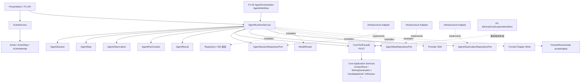
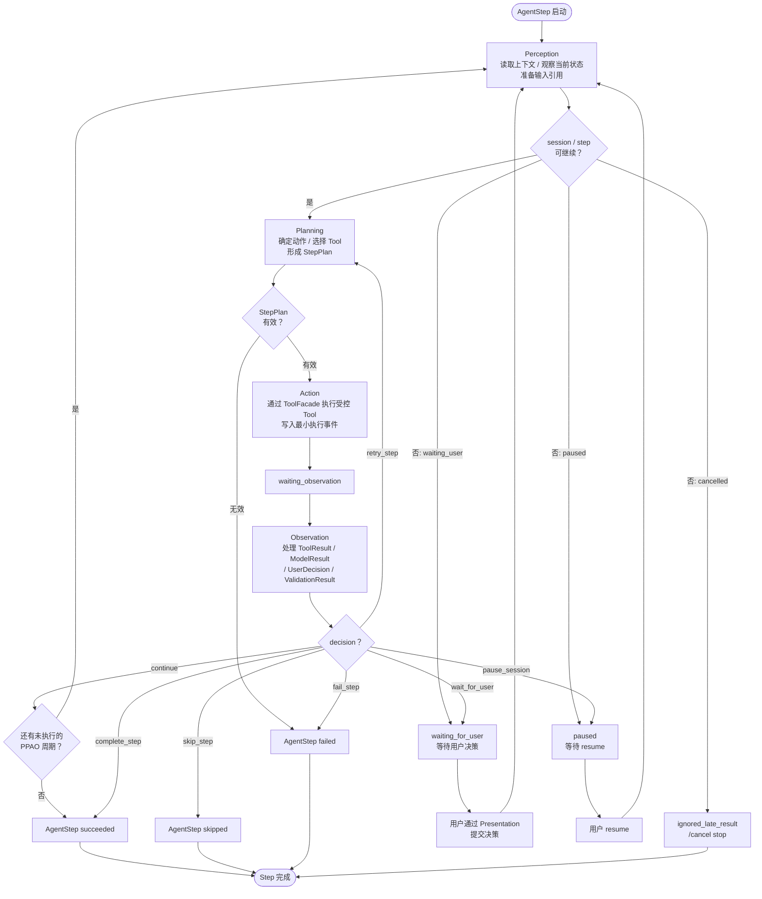
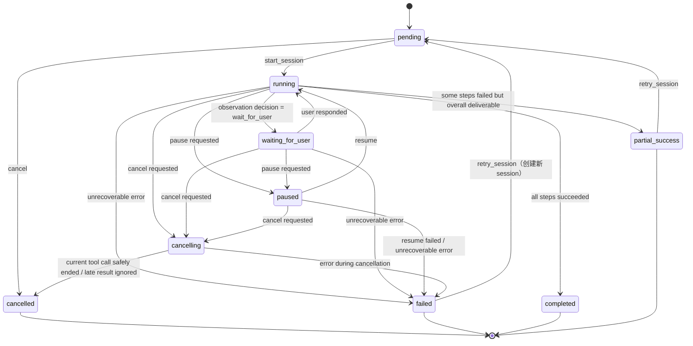
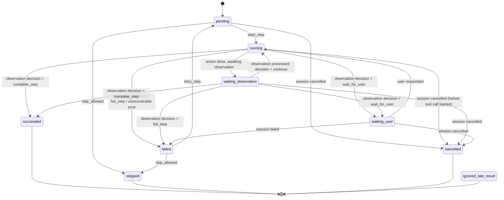

# InkTrace V2.0-P1-01 AgentRuntime 详细设计

版本：v1.2 / P1 模块级详细设计候选冻结版
状态：候选冻结
所属阶段：InkTrace V2.0 P1
设计范围：Agent Runtime 基础设施

合并说明：本文档以 `_001` 版本为主稿结构和主语义，吸收原始版本中更清晰、更收敛的冻结结论，经对比合并、去重、口径统一后形成。保留 `_001` 的完整细节，不压缩为概要版。

依据文档：

- `docs/01_requirements/InkTrace-V2.0-需求规格说明书.md`
- `docs/07_overview/InkTrace-V2.0-概要设计说明书.md`
- `docs/02_architecture/InkTrace-V2.0-架构设计说明书.md`
- `docs/03_design/InkTrace-V2.0-P1-详细设计总纲.md`
- `docs/03_design/V2/InkTrace-V2.0-P0-02-AIJobSystem详细设计.md`
- `docs/03_design/V2/InkTrace-V2.0-P0-07-ToolFacade与权限详细设计.md`
- `docs/03_design/V2/InkTrace-V2.0-P0-08-MinimalContinuationWorkflow详细设计.md`
- `docs/03_design/V2/InkTrace-V2.0-P0-09-CandidateDraft与HumanReviewGate详细设计.md`
- `docs/03_design/V2/InkTrace-V2.0-P0-11-API与集成边界详细设计.md`

说明：本文档只冻结 P1 Agent Runtime 基础设施，不进入五 Agent 职责细节，不忽略 P0 已冻结边界，不推翻 P0 已实现设计。

---

## 一、文档定位与设计范围

### 1.1 文档定位

本文档是 InkTrace V2.0-P1 的第一个模块级详细设计文档，仅覆盖 P1 Agent Runtime 基础设施。

P1-01 的目标是冻结 Runtime 层通用机制：AgentSession、AgentStep、AgentObservation、AgentRunContext、AgentResult、AgentRuntimeService、Repository Ports、状态机、PPAO 执行循环，以及 Runtime 与 AIJobSystem、ToolFacade、P0 MinimalContinuationWorkflow 的关系。

本文档不替代 P1 总纲，不进入开发计划，不拆开发任务，不写代码，不生成数据库迁移，不修改任何 P0 文档，不修改 P1 总纲。

### 1.2 设计范围

本模块覆盖：

- AgentSession 数据模型、状态机、生命周期。
- AgentStep 数据模型、类型、状态机。
- AgentObservation 数据模型、类型、决策规则。
- AgentRunContext 数据模型与安全引用。
- AgentResult 数据模型与终态规则。
- AgentRuntimeService 核心用例。
- AgentSessionRepositoryPort / AgentStepRepositoryPort / AgentObservationRepositoryPort 接口方向。
- PPAO 执行循环（Perception → Planning → Action → Observation）。
- AgentSession 状态机与 AgentStep 状态机。
- pause / resume / cancel / retry 规则。
- waiting_for_user 规则。
- cancelled 后迟到结果 ignored 规则。
- request_id / trace_id 贯穿规则。
- 基础审计与安全日志边界。
- AgentSession 与 AIJobSystem 的关系冻结。
- AgentRuntime 与 ToolFacade 的关系。
- AgentRuntime 与五 Agent Workflow 的关系。
- AgentRuntime 与 P0 MinimalContinuationWorkflow 的兼容关系。

### 1.3 不覆盖范围

P1-01 不覆盖：

- 五 Agent 的具体职责细节（Memory / Planner / Writer / Reviewer / Rewriter）。
- 五 Agent 的完整 Tool 权限表（属于 P1-02 / P1-03）。
- 四层剧情轨道（属于 P1-04）。
- A/B/C 方向推演（属于 P1-05）。
- 章节计划（属于 P1-05）。
- 多轮 CandidateDraft 迭代（属于 P1-06）。
- AI Suggestion（属于 P1-07）。
- Conflict Guard（属于 P1-08）。
- StoryMemory Revision（属于 P1-09）。
- Agent Trace 完整详细设计（属于 P1-10）。
- P1 API 与前端集成详细设计（属于 P1-11）。
- P2 自动连续续写队列。
- 正文 token streaming。
- AI 自动 apply。
- AI 自动写正式正文。

### 1.4 与 P1 总纲的关系

P1 总纲已冻结以下前提，P1-01 必须直接继承：

1. PPAO 是 Agent Runtime 的通用执行循环。
2. 五 Agent Workflow 是 Agent 之间的编排顺序。
3. 每个 Agent 内部都可以按 Perception → Planning → Action → Observation 执行自己的步骤。
4. 不能简单理解为 Memory Agent = Perception、Planner Agent = Planning、Writer Agent = Action、Reviewer Agent = Observation。
5. P1-01 负责冻结 Runtime 层 PPAO 机制。
6. P1-03 才负责冻结五 Agent 职责与协作边界。
7. Agent Runtime 不直接访问数据库、Repository、Provider SDK、ModelRouter、VectorStore、EmbeddingProvider。
8. Agent Runtime 不直接写正式正文。
9. Agent Runtime 不绕过 HumanReviewGate。
10. Agent Runtime 不伪造 user_action。
11. Agent Runtime 只通过 ToolFacade 调用 Core 能力。
12. 正式正文仍走 V1.1 Local-First 保存链路。
13. AI 生成正文只能进入 CandidateDraft / CandidateDraftVersion，不得直接进入正式正文。

### 1.5 与 P0 的关系

P1 AgentRuntime 是 P0 MinimalContinuationWorkflow 的完整化扩展，不是替换。继承关系如下：

| P0 成果 | P1 继承方式 |
|---|---|
| AIJobSystem | 复用，P1 通过 AIJob 跟踪 AgentSession 的异步状态与前端轮询进度 |
| ToolFacade | 复用 CoreToolFacade，P1 扩展完整 Agent 权限矩阵（权限矩阵本身属于 P1-02/P1-03） |
| MinimalContinuationWorkflow | 作为兼容路径保留；P1 主链路优先使用 Agent Workflow |
| CandidateDraft / HumanReviewGate | 复用，安全边界继续有效 |
| V1.1 Local-First | 不变，不接触 |
| caller_type = user_action | 复用，Agent 不得伪造 |

P1 对 P0 的扩展原则：只扩展，不推翻；只增强，不越权。

---

## 二、AgentRuntime 目标与核心原则

### 2.1 模块目标

AgentRuntime 在 P1 中负责提供完整智能体运行基础设施，但不承载具体 Agent 业务逻辑。

它必须完成：

- 维护一次完整 Agent 会话的生命周期。
- 按 PPAO 推进步骤执行。
- 管理 Runtime 级状态机与 Step 级状态机。
- 将 Agent 业务步骤映射到通用执行框架。
- 与 AIJobSystem 形成稳定协作关系。
- 与 ToolFacade 形成唯一受控调用边界。
- 为 P1-02、P1-03、P1-10、P1-11 提供稳定底座。

### 2.2 Runtime 负责什么

AgentRuntime 负责：

- AgentSession 的创建、启动、状态推进、完成、失败。
- AgentStep 的创建、执行、观察、重试、跳过、取消。
- AgentObservation 的记录与下一步决策。
- PPAO 循环的状态推进。
- AgentRunContext 的构建与安全引用管理。
- pause / resume / cancel / retry 的规则执行。
- waiting_for_user 的识别与阻断。
- cancelled 后迟到结果的隔离。
- 同步 AIJob / AIJobStep 进度与通用状态。
- request_id / trace_id 的贯穿。
- 基础审计事件记录。

### 2.3 Runtime 不负责什么

AgentRuntime 不负责：

- 不实现五 Agent 的业务规则。
- 不定义 Plot Arc、Direction Proposal、Chapter Plan 的业务结构。
- 不直接生成 CandidateDraftVersion 业务逻辑。
- 不直接实现 AI Suggestion、Conflict Guard、StoryMemory Revision。
- 不直接承担 Agent Trace 完整模型。
- 不直接承担 API / 前端协议细节。
- 不直接访问数据库、Repository、Provider SDK、ModelRouter、VectorStore、EmbeddingProvider。
- 不直接写正式正文。
- 不绕过 HumanReviewGate。
- 不伪造 user_action。
- 不直接调用 AI 模型。
- 不构建 Prompt。
- 不校验模型输出。

### 2.4 核心安全原则

1. AgentRuntime 只通过 ToolFacade 调用 Core 能力。
2. caller_type = agent 不能执行 user_action 专属操作。
3. AgentRuntime 不持有 formal_write 权限。
4. accept / reject / apply CandidateDraft 必须走 Presentation → Core Application 的 user_action 路径。
5. 正式正文仍走 V1.1 Local-First 保存链路。
6. AI 生成正文只能进入 CandidateDraft / CandidateDraftVersion。
7. 普通日志不记录完整正文、完整 Prompt、完整 CandidateDraft、完整 ContextPack、API Key。
8. request_id / trace_id 贯穿全链路。

---

## 三、AgentRuntime 总体架构

### 3.1 模块关系说明

P1 AgentRuntime 位于 P1 Agent Layer 与 Core Application 之间，是一层"受控执行基础设施"，而不是具体 Agent 业务服务。

核心关系：

- **Presentation / P1 API** → AgentRuntimeService：创建、查询、控制 AgentSession。
- **AgentRuntimeService** → AgentSession / AgentStep / AgentObservation：管理会话与步骤生命周期。
- **AgentRuntimeService** → AIJobService：同步 Agent 进度到 AIJob / AIJobStep，供前端轮询。
- **AgentRuntimeService** → ToolFacade：Agent 执行 Action 时通过 ToolFacade 调用受控 Tool。
- **P1-02 AgentOrchestrator** → AgentRuntimeService：编排五 Agent 执行顺序，通过 Runtime 推进每个 Agent 的 PPAO 步骤。
- **AgentRuntimeService** → Repository Ports：持久化 AgentSession / AgentStep / AgentObservation。

AgentRuntimeService 不直接调用任何 Core Application Service，必须通过 ToolFacade。

### 3.2 与 AIJobSystem 的关系

**冻结方案：AgentSession 独立建模并独立持久化，一个 AgentSession 关联一个主 AIJob（一对一），AgentStep 默认一对一映射为 AIJobStep，Step 内 retry 通过 AIJobAttempt 或等价 attempt 机制表达，不默认拆成多个 AIJobStep。**

理由：

1. AgentSession 与 AIJob 的职责不同——AgentSession 表达"P1 业务编排语义"（PPAO 阶段、Agent 类型、Observation 决策），AIJob 表达"异步任务与前端轮询语义"（进度、取消、失败、重试）。两者职责不同，不应合并为一个实体。
2. AgentSession 的状态机（pending / running / waiting_for_user / paused / cancelling / cancelled / failed / completed / partial_success）比 AIJob 状态机（queued / running / paused / failed / cancelled / completed）更丰富。AgentSession 需要表达 waiting_for_user、partial_success 等 Agent 特有状态，不应将这些语义强行塞入 AIJob。
3. 前端已有基于 AIJob 的轮询机制。P1 通过 AIJob 跟踪 AgentSession 的异步状态与前端轮询进度，不需要前端重构轮询逻辑。
4. AgentStep 映射 AIJobStep 可复用 P0 进度展示与迟到结果 ignored 规则。
5. Step 内 retry 通过 attempt 机制表达，避免前端出现大量伪步骤噪音。

**不采用的方案**：

- 不采用"仅用 AIJob 代替 AgentSession"的方案。
- 不采用"一个 AgentSession 对应多个并列主 AIJob"的默认方案。
- 不采用"父子 AIJob 树"作为 P1 默认方案。

**状态映射表**：

| AgentSession.status | AIJob.status | 说明 |
|---|---|---|
| pending | queued | 会话已创建，等待启动 |
| running | running | 执行中 |
| waiting_for_user | running | waiting_for_user 是 Agent 层语义，AIJob 层仍视为 running，前端通过 AgentSession API 获取详情 |
| paused | paused | 用户暂停 |
| cancelling | running | 中间状态，等待当前 Tool 调用安全结束 |
| cancelled | cancelled | 终态 |
| failed | failed | 终态 |
| completed | completed | 终态 |
| partial_success | completed | partial_success 是 Agent 层终态，AIJob 层映射为 completed，前端通过 AgentSession API 获取 partial_success 详情 |

**AgentStep 到 AIJobStep 的映射**：

- 一个 AgentStep 默认映射一个 AIJobStep（一对一）。
- AgentStep.step_id ↔ AIJobStep.id。
- AIJobStep.step_type = `agent_step:{agent_type}:{action}`。
- AgentStep 状态变更时，AgentRuntimeService 同步更新 AIJobStep 状态。
- Step 内 retry 通过 AIJobAttempt 或等价 attempt 机制表达，不默认新增 AIJobStep。
- AIJob 不承载 agent_type、PPAO 阶段、Observation 决策等 Agent 业务语义。
- AgentRuntimeService 负责状态同步，AgentSession 是主真源，AIJob 是投影。

### 3.3 与 ToolFacade 的关系

AgentRuntime 通过 ToolFacade 调用 Core 能力，ToolFacade 是唯一受控入口。

规则：

- Agent 在 Action 阶段通过 ToolFacade 调用 Tool。
- 每次 Tool 调用必须携带 ToolExecutionContext（含 agent_session_id、agent_type、agent_step_id、caller_type = agent）。
- ToolFacade 必须校验 agent_type / tool_name / side_effect_level / caller_type / resource_scope / session_status / step_status 前置条件。
- AgentRuntime 不绕过 ToolFacade 直接调用任何 Application Service（ContextPackService、WritingGenerationService、CandidateDraftService、AIReviewService 等）。
- Tool 调用结果封装为 ToolCallResult，进入 Observation 阶段处理。

**P1 对 P0 ToolExecutionContext 的扩展**：

| 字段 | 说明 | P1 新增 |
|---|---|---|
| agent_session_id | AgentSession ID | 是 |
| agent_type | 当前 Agent 类型（memory / planner / writer / reviewer / rewriter） | 是 |
| agent_step_id | 当前 AgentStep ID | 是 |

其余字段（work_id、job_id、step_id、request_id、trace_id、caller_type、is_quick_trial 等）继承 P0 ToolExecutionContext。

### 3.4 与五 Agent Workflow 的关系

**PPAO 与五 Agent Workflow 是两个正交维度，不可混淆。**

- **PPAO 是 Agent 内部的执行机制**：PPAO 是 Runtime 在每个 Agent 内部执行步骤时的统一机制。每个 Agent（Memory / Planner / Writer / Reviewer / Rewriter）在 AgentRuntime 中按 PPAO 循环执行自己的步骤。
- **五 Agent Workflow 是 Agent 之间的编排顺序**：AgentOrchestrator（P1-02）负责按 Memory → Planner → Writer → Reviewer → [Rewriter] 的顺序编排五个 Agent，定义的是"谁在什么时候做什么"。
- **Runtime 与 Orchestrator 的分工**：
  - AgentRuntimeService 提供 `run_next_step(session_id)` 等原语，负责单个 AgentStep 内部的 PPAO 推进。
  - AgentOrchestrator（P1-02）负责决定"下一步启动哪个 Agent"、"是否进入 Rewriter"、"是否回到 Reviewer"。
  - AgentRuntime 不关心 Agent 之间的编排顺序，只关心当前 AgentStep 的 PPAO 状态。
  - AgentRuntime 不判断"是否回到 Reviewer"、"是否进入 Rewriter"，这些属于 P1-02。
- **不能简单映射**：Memory Agent ≠ Perception、Planner Agent ≠ Planning、Writer Agent ≠ Action、Reviewer Agent ≠ Observation。每个 Agent 内部都有自己的微 PPAO 循环——例如 Writer Agent 内部可能先感知 ContextPack（Perception）、规划生成策略（Planning）、调用 writer model（Action）、检查输出校验结果（Observation）。
- **PPAO 的灵活性**：一个 Agent 在单个 Step 内可以执行完整 PPAO（微 PPAO）；一个复杂 Agent 也可以跨多个 AgentStep 表达完整 PPAO（宏 PPAO）。

### 3.5 与 P0 MinimalContinuationWorkflow 的兼容关系

P1 AgentRuntime 不要求删除 P0 MinimalContinuationWorkflow。兼容策略：

1. P0 MinimalContinuationWorkflow 作为兼容路径保留，继续可用于单章续写。
2. P1 主链路优先使用 Agent Workflow（通过 AgentRuntime + AgentOrchestrator）。
3. P0 WorkflowRunContext 的字段（work_id、chapter_id、continuation_mode、user_instruction、allow_degraded）可作为 AgentRunContext 的初始化输入，但不是直接替代。
4. P0 AIJobSystem 继续复用，AgentSession 通过主 AIJob 跟踪进度。
5. P0 ToolFacade 继续复用，P1 Agent 通过 ToolFacade 调用受控 Tool。
6. P0 CandidateDraft / HumanReviewGate 安全边界继续有效。
7. 用户可选择使用 P0 轻量续写或 P1 完整 Agent 流程，两条路径共存不互斥。

### 3.6 模块关系图



### 3.7 依赖方向

规则：

- Presentation 调用 AgentRuntimeService 和 AIJobService。
- AgentOrchestrator（P1-02）调用 AgentRuntimeService 推进 AgentStep。
- AgentRuntimeService 依赖 AgentSession / AgentStep / AgentObservation / AgentRunContext / AgentResult 领域对象。
- AgentRuntimeService 通过 ToolFacade 调用 Core Application Service。
- AgentRuntimeService 通过 AIJobService 同步任务进度。
- AgentRuntimeService 通过 Repository Ports 持久化 Agent 数据。
- AgentRuntime 不直接访问 Repository、数据库、Provider SDK、ModelRouter、VectorStore、EmbeddingProvider。
- AgentRuntime 不直接写正式正文、不绕过 HumanReviewGate。

---

## 四、PPAO 执行循环详细设计

### 4.1 PPAO 定义

PPAO（Perception → Planning → Action → Observation）是 Agent Runtime 的通用执行循环。每个 Agent 在 AgentRuntime 中都可以按 PPAO 模式执行自己的步骤。

PPAO 定义的是单个 Agent 内部"如何执行"的机制：

- **Perception**：读取上下文、观察当前状态、准备输入引用。
- **Planning**：确定下一步动作、选择 Tool、形成 StepPlan。
- **Action**：通过 ToolFacade 执行受控 Tool。
- **Observation**：处理 ToolResult / ModelResult / UserDecision / ValidationResult，决定下一步。

PPAO 可以在一个 AgentStep 内完整执行（微 PPAO），也可以跨多个 AgentStep 表达（宏 PPAO）。一个复杂 Agent 可能用多个 Step 分别表达 perceive_context → plan_action → run_tool → observe_result 的完整链路。

### 4.2 PPAO 与五 Agent 的关系

PPAO 和五 Agent Workflow 是两个正交维度：

| 维度 | PPAO | 五 Agent Workflow |
|---|---|---|
| 定义 | Agent 内部的执行循环 | Agent 之间的编排顺序 |
| 负责 | AgentRuntime（P1-01） | AgentOrchestrator（P1-02） |
| 粒度 | 单个 AgentStep 内 / 跨多个 AgentStep | 跨五个 Agent |
| 关系 | 每个 Agent 内部都按 PPAO 执行 | 编排决定"谁在什么时候做什么" |

关键澄清：

- Memory Agent 内部有自己的 PPAO：感知 StoryMemory → 规划提取策略 → 调用 memory_extractor_model → 观察提取结果。
- Writer Agent 内部有自己的 PPAO：感知 ContextPack → 规划生成策略 → 调用 writer_model → 观察校验结果。
- 五 Agent Workflow 的编排顺序（Memory → Planner → Writer → Reviewer → Rewriter）不等于 PPAO 的四阶段。
- 不能把 Memory Agent 简化为 Perception、Planner Agent 简化为 Planning、Writer Agent 简化为 Action、Reviewer Agent 简化为 Observation。

### 4.3 Perception 阶段

**定义**：Agent 读取上下文、观察当前状态、准备输入引用的阶段。

**输入**：
- AgentRunContext（session_id、work_id、chapter_id、current_agent_type 等）。
- 前序 AgentStep 的 Observation 结果（如果有）。
- AgentSession 的当前状态。

**行为**：
- 读取上下文并判断当前 session / step / resource 是否可继续。
- 判断是否存在 stale、cancel、waiting_user、paused、version_changed 等前置阻断。
- 确定当前 Agent 需要感知的上下文范围。
- 通过 ToolFacade 调用只读 Tool（如 get_story_memory、get_story_state、get_chapter_context、get_story_arcs）获取上下文引用。
- 组装 PerceptionResult，包含上下文引用列表、感知状态（ready / degraded / blocked）。

**输出**：
- PerceptionResult：包含上下文引用（safe_ref 列表）、感知状态、warnings。

**状态**：AgentStep 处于 running 状态，step_phase = perception。

**失败处理**：
- 上下文不可用（如 StoryMemory 缺失）→ PerceptionResult.status = blocked，AgentStep 可进入 failed。
- session 已 cancelled → 阻断推进，进入 ignored_late_result。
- session 已 paused → 阻断推进，等待 resume。
- 只读 Tool 调用失败 → 根据错误类型决定 retry 或 failed。

### 4.4 Planning 阶段

**定义**：Agent 确定下一步动作、选择 Tool、形成 StepPlan 的阶段。

**输入**：
- PerceptionResult（上下文引用与状态）。
- AgentRunContext。
- Agent 类型（决定可用的 Tool 白名单）。

**行为**：
- 根据 Agent 类型和当前任务，确定要执行的 Tool 序列。
- 形成 StepPlan：包含 planned_tools（Tool 调用计划列表）、plan_strategy、expected_outputs。
- 判断当前 step 是继续执行、等待用户、跳过还是失败。
- 判断是否允许 degraded 执行。
- Planning 本身不调用有副作用的 Tool。

**StepPlan 最小字段**：

| 字段 | 说明 |
|---|---|
| next_action_type | 下一步动作类型 |
| target_tool_name | 目标 Tool 名，可选 |
| expected_observation_type | 期望的 Observation 类型 |
| retryable | 是否可重试 |
| requires_user_decision | 是否需要等待用户决策 |
| side_effect_level | 副作用等级 |

**输出**：
- StepPlan：包含 planned_tools、plan_strategy、expected_outputs。

**状态**：AgentStep 处于 running 状态，step_phase = planning。

**失败处理**：
- 无法确定有效 Tool 序列 → StepPlan 为空，AgentStep failed。
- Planning 逻辑错误（如 Agent 类型无法执行请求的任务）→ AgentStep failed。

### 4.5 Action 阶段

**定义**：Agent 通过 ToolFacade 执行受控 Tool 的阶段。

**输入**：
- StepPlan（来自 Planning）。
- AgentRunContext。
- ToolExecutionContext（由 AgentRuntimeService 构造，caller_type = agent）。

**行为**：
- 按 StepPlan 顺序调用 ToolFacade。
- 每次 Tool 调用携带 ToolExecutionContext（含 agent_session_id、agent_type、caller_type = agent）。
- Tool 调用结果暂存，不立即决策下一步。
- 所有 Tool 调用完成后进入 Observation 阶段。
- 写入最小执行事件。

**输出**：
- ToolCallResults：每个 Tool 调用的 ToolCallResult 列表。

**状态**：AgentStep 处于 running 状态，step_phase = action。

**Action 不负责**：
- 不直接调用 Provider / ModelRouter。
- 不直接写正式正文或正式资产。

**安全约束**：
- 所有 Tool 调用必须经过 ToolFacade 权限校验。
- caller_type = agent 不能执行 user_action 专属操作。
- formal_write 类 Tool 被 ToolFacade 拒绝。
- Tool 调用必须记录到 AgentTrace（trace_id 贯穿）。

**失败处理**：
- Tool 调用被 ToolFacade 拒绝 → ToolCallResult.error_code = tool_permission_denied，进入 Observation 处理。
- Provider 超时 / 限流 → 按 P0-01 retry 策略，在 Step 内重试。
- Provider 鉴权失败 → 不重试，ToolCallResult.error_code = provider_auth_failed。

### 4.6 Observation 阶段

**定义**：Agent 处理 ToolResult / ModelResult / UserDecision / ValidationResult，决定下一步的阶段。

**输入**：
- ToolCallResults（来自 Action）。
- PerceptionResult（来自 Perception）。
- AgentRunContext。

**行为**：
- 逐条检查 ToolCallResult：
  - 全部 success → 判断 AgentStep 是否完成。
  - 部分 failed（可重试）→ 决定是否 retry 当前 Step。
  - 需要用户输入 → 创建 UserDecisionObservation，AgentSession 进入 waiting_for_user。
  - 全部 failed（不可重试）→ AgentStep failed。
- 检查是否需要额外 Action（如 retry 某个 Tool）。
- 生成 AgentObservation 记录。

**输出**：
- AgentObservation：包含 observation_type、decision、safe_message。
- decision 取值：continue / retry_step / wait_for_user / fail_step / complete_step / skip_step / pause_session。

**状态**：AgentStep 处于 waiting_observation 或 running（如果 decision = continue，Runtime 自动推进到下一个 PPAO 周期或完成 Step）。

**关键规则**：
- waiting_for_user 不能被 Agent 自动跳过。只有用户通过 Presentation 提交决策后，Runtime 才能继续。
- Observation 不直接修改正式数据。
- Observation 的 safe_message 不能包含完整正文、完整 Prompt、API Key。
- Observation 的结果必须进入 AgentObservation 持久化，而不是只保留在临时内存中。

### 4.7 PPAO 状态推进

PPAO 的状态推进由 AgentRuntimeService 负责。推进规则：

```text
Step 启动 → Perception
  → Perception 完成 → Planning
    → Planning 完成 → Action
      → Action 完成 → waiting_observation
        → Observation 完成
          → decision = continue → 如果当前 Step 还有未执行的 PPAO 周期 → 回到 Perception
          → decision = continue → 如果当前 Step 的 PPAO 周期已全部完成 → AgentStep succeeded
          → decision = retry_step → 重新进入 Planning（保留原 Step，新建 attempt）
          → decision = wait_for_user → AgentStep.waiting_user，AgentSession.waiting_for_user
          → decision = fail_step → AgentStep failed
          → decision = complete_step → AgentStep succeeded
          → decision = skip_step → AgentStep skipped
          → decision = pause_session → AgentSession paused
```

Runtime 不自动决定"下一步启动哪个 Agent"，该决策由 AgentOrchestrator（P1-02）负责。Runtime 只负责当前 AgentStep 内的 PPAO 推进。

### 4.8 PPAO 失败与恢复

失败来源：

| 阶段 | 失败码方向 | 说明 |
|---|---|---|
| Perception | perception_input_missing | 输入上下文不可用 |
| Planning | plan_invalid | 无法形成有效 StepPlan |
| Action | tool_permission_denied | ToolFacade 拒绝调用 |
| Action | tool_execution_failed | Tool 执行失败 |
| Action | validation_failed | 输出校验失败 |
| Observation | observation_unresolved | 无法确定下一步 |
| Observation | user_required_but_missing | 需要用户但无法等待 |
| 任意阶段 | session_cancelled | 会话已取消 |

恢复规则：

- Perception / Planning / Action / Observation 任一阶段失败后，必须有明确状态落点。
- 可恢复失败允许 retry step（受 attempt 上限约束）。
- 不可恢复失败直接 fail step 或 fail session。
- 若失败点需要用户处理，进入 waiting_for_user，而不是自动跳过。
- Runtime 不自动重试 formal_write / apply / memory_formalize 类操作。

### 4.9 PPAO 流程图



---

## 五、AgentSession 详细设计

### 5.1 AgentSession 职责

AgentSession 表示一次完整 Agent 任务的业务会话容器。它是 Agent 业务状态的主真源。

它负责表达：

- 本次任务属于哪个 workflow 类型。
- 当前运行到哪个 Agent、哪个 step。
- 当前 session 处于什么状态。
- 当前是否等待用户。
- 当前是否已取消、失败、部分成功或完成。
- 当前 session 与主 AIJob、request_id、trace_id 的关联。

### 5.2 字段方向

| 字段 | 类型 | 说明 |
|---|---|---|
| session_id | string | Agent 会话唯一 ID |
| job_id | string | 关联主 AIJob ID（一对一） |
| work_id | string | 关联作品 ID |
| chapter_id | string | 目标章节 ID，可选 |
| agent_workflow_type | enum | 任务类型：continuation / revision / planning / memory_update / full_workflow |
| status | enum | Agent 会话状态（见 5.3） |
| current_agent_type | string | 当前执行的 Agent 类型（memory / planner / writer / reviewer / rewriter） |
| current_step_id | string | 当前 Step ID，可选 |
| current_phase | enum | 当前 PPAO 阶段：perception / planning / action / observation，可选 |
| result | AgentResult | 最终输出（见第九章） |
| trace_id | string | 关联 AgentTrace ID |
| request_id | string | 请求 ID |
| caller_type | string | 触发来源：user_action / agent / workflow_compat / system_maintenance / quick_trial |
| allow_degraded | boolean | 是否允许 degraded 上下文，默认 true |
| user_instruction | string | 用户指令摘要（安全脱敏，不记录完整正文） |
| metadata | object | 脱敏元数据（不保存完整正文 / Prompt / CandidateDraft / API Key） |
| status_reason | string | 非 failed 状态原因，如 pause_requested / user_cancelled / service_restarted / waiting_user_decision |
| warning_codes | string[] | 警告码列表 |
| error_code | string | 错误码 |
| error_message | string | 脱敏错误信息 |
| created_at | string | 创建时间 |
| started_at | string | 开始时间，可选 |
| waiting_at | string | 进入 waiting_for_user 时间，可选 |
| paused_at | string | 暂停时间，可选 |
| resumed_at | string | 恢复时间，可选 |
| cancelling_at | string | 进入 cancelling 时间，可选 |
| cancelled_at | string | 取消完成时间，可选 |
| finished_at | string | 完成时间，可选 |

### 5.3 状态机

AgentSession 状态：

| 状态 | 含义 | 终态 |
|---|---|---|
| pending | 会话已创建，等待启动 | 否 |
| running | 会话执行中 | 否 |
| waiting_for_user | 等待用户确认或决策 | 否 |
| paused | 用户主动暂停 | 否 |
| cancelling | 取消中（等待当前 Tool 调用安全结束） | 否 |
| cancelled | 已取消 | 是 |
| failed | 不可恢复错误 | 是 |
| completed | 成功完成 | 是 |
| partial_success | 部分成功（部分 Step 失败但整体可交付） | 是 |

终态：cancelled、failed、completed、partial_success。



### 5.4 生命周期

标准生命周期：

```text
pending
→ running
→ waiting_for_user（可选）
→ running（用户处理后恢复）
→ completed / partial_success / failed / cancelling / cancelled
```

取消路径：

```text
running / waiting_for_user / paused
→ cancelling
→ cancelled
```

### 5.5 与 AIJob 的关联

冻结方案：

- AgentSession 独立建模并独立持久化。
- AgentSession 是 P1 Agent 业务会话真源。
- AIJob 是异步任务与前端轮询投影。
- 每个 AgentSession 关联且仅关联一个主 AIJob（一对一）。
- 主 AIJob 的 job_type = agent_session（P1 新增 job_type）。
- AIJob 不承载 Agent 业务语义（不记录 agent_type、PPAO 阶段、Observation 决策等）。
- AgentRuntimeService 负责 AgentSession / AgentStep 与 AIJob / AIJobStep 的状态同步。

为什么不使用父子级或多 Job 编排：

- P1 阶段 AgentSession 内部步骤线性执行（五 Agent 顺序编排），不需要父子 Job 树。
- 如果未来 P2 支持嵌套 AgentSession（如 Writer Agent 内部触发子 Memory Agent），届时可扩展父子关系。P1-01 预留 metadata 中的 parent_session_id 字段方向，但不实现嵌套逻辑。

### 5.6 AgentSession 终态规则

- **completed**：所有必需 AgentStep 全部 succeeded。AgentSession 已产生最终可交付业务结果。
- **partial_success**：部分 AgentStep succeeded，部分 failed / skipped，但整体形成可继续业务结果（如 Writer 成功生成 CandidateDraft 但 Reviewer 审稿失败，CandidateDraft 可供用户进入 HumanReviewGate 查看）。partial_success 的业务判定权属于 AgentOrchestrator（P1-02），Runtime 只提供状态能力。
- **failed**：关键 AgentStep 失败且不可恢复，无法形成可继续业务结果。不属于 waiting_for_user。
- **cancelled**：用户主动取消或系统取消已生效，迟到结果必须 ignored。

### 5.7 安全边界

- AgentSession 不代表用户确认。
- AgentSession 不持有 formal_write 权限。
- AgentSession 不持有 HumanReviewGate accept / apply 调用权限。
- AgentSession 不得记录完整正文、完整 Prompt、完整 CandidateDraft、完整 ContextPack、API Key。
- AgentSession.user_instruction 只保留安全摘要或脱敏内容。
- waiting_for_user 不得被 Runtime 自动跳过。

---

## 六、AgentStep 详细设计

### 6.1 AgentStep 职责

AgentStep 是 AgentSession 内的一个可追踪执行步骤。每个 AgentStep 承载一个 PPAO 周期（或跨多个 PPAO 周期的宏观 Step）。

职责：

- 记录当前执行的 Agent 类型。
- 记录步骤动作（action）和 PPAO 阶段（step_phase）。
- 记录 Tool 调用列表。
- 记录步骤状态。
- 支持 retry / skip / cancel。

### 6.2 字段方向

| 字段 | 类型 | 说明 |
|---|---|---|
| step_id | string | 步骤唯一 ID |
| session_id | string | 所属 AgentSession ID |
| job_step_id | string | 映射的 AIJobStep ID，可选 |
| agent_type | enum | 执行的 Agent 类型：memory / planner / writer / reviewer / rewriter |
| step_order | integer | 在 session 中的步骤序号 |
| step_type | string | 步骤类型（见 6.3） |
| step_phase | enum | 当前 PPAO 阶段：perception / planning / action / observation |
| action | string | 执行的动作（如 extract_memory、generate_draft、review_draft） |
| status | enum | 步骤状态（见 6.4） |
| tool_calls | ToolCallRef[] | 该步骤中的 Tool 调用引用列表（不内联完整参数/结果） |
| step_plan | StepPlan | 来自 Planning 阶段的执行计划 |
| observation | AgentObservation | 最新 Observation 引用 |
| input_ref | string | 输入安全引用 |
| output_refs | string[] | 输出引用列表（safe_ref 格式，如 candidate_draft:cd_xxx） |
| error_code | string | 错误码 |
| error_message | string | 脱敏错误信息 |
| attempt_count | integer | 当前 Step 的 attempt 次数 |
| max_attempts | integer | 最大 attempt 次数，默认 3 |
| retryable | boolean | 是否可重试（动态判定） |
| skippable | boolean | 是否可跳过（动态判定） |
| requires_user_decision | boolean | 是否等待用户决策 |
| skip_reason | string | 跳过原因 |
| started_at | string | 开始时间 |
| waiting_at | string | 进入等待观察或等待用户时间 |
| finished_at | string | 结束时间 |
| metadata | object | 脱敏元数据 |

### 6.3 Step 类型

P1-01 定义两层 Step 类型体系：

**PPAO 通用类型**（Runtime 层面，所有 Agent 共用）：

| step_type | 说明 |
|---|---|
| perceive_context | 感知上下文——读取前序 Observation、构建输入引用 |
| plan_next_action | 规划下一步——选择 Tool、形成 StepPlan |
| call_tool | 调用 Tool——通过 ToolFacade 执行受控 Tool |
| validate_result | 校验结果——执行输出校验 |
| observe_result | 观察结果——处理 ToolResult 并决定下一步 |
| wait_user_decision | 等待用户——暂停等待用户输入 |
| finalize_step | 完成步骤——汇总结果并记录 |

**Agent 业务类型**（agent_type + action 组合，具体清单由 P1-03 冻结，此处仅列方向性示例）：

| agent_type | action 方向 | 说明 |
|---|---|---|
| memory | extract_memory | 提取/分析 StoryMemory |
| memory | generate_memory_suggestion | 生成 MemoryUpdateSuggestion |
| planner | analyze_progress | 分析当前进度 |
| planner | generate_direction | 生成 A/B/C 方向 |
| planner | create_chapter_plan | 生成章节计划 |
| planner | create_writing_task | 生成 WritingTask |
| writer | generate_draft | 生成候选稿 |
| reviewer | review_draft | 审稿候选稿 |
| rewriter | rewrite_draft | 修订候选稿 |

P1-01 只冻结通用 PPAO 类型。Agent 业务 action 清单的最终冻结属于 P1-03。

### 6.4 Step 状态机

AgentStep 状态：

| 状态 | 含义 | 终态 |
|---|---|---|
| pending | 步骤已创建，等待执行 | 否 |
| running | 步骤执行中（PPAO 推进中） | 否 |
| waiting_observation | 等待 Observation 结果 | 否 |
| waiting_user | 等待用户决策 | 否 |
| succeeded | 步骤成功完成 | 是 |
| failed | 步骤失败 | 是 |
| skipped | 步骤被跳过 | 是 |
| cancelled | 步骤被取消 | 是 |
| ignored_late_result | 步骤被取消后迟到结果被忽略 | 是 |

终态：succeeded、failed、skipped、cancelled、ignored_late_result。



### 6.5 retry 规则

- **retry_step**：只重试当前 failed AgentStep。
- retry 默认在同一个 AgentStep 上增加 attempt_count（通过 AIJobAttempt 或等价 attempt 机制表达）。
- 不默认创建新 AgentStep。
- 不默认新增 AIJobStep。
- retry_step 保留历史 attempt 和 Observation 记录，不删除。
- retry_step 使用新的 request_id。
- retry_step 共享原 trace_id（或通过 retry_group_id 关联原 trace_id）。
- retry_step 成功后，AgentRuntimeService 通知 AgentOrchestrator 决定是否继续后续步骤。
- retry_step 失败后，AgentStep.status = failed，attempt_count + 1。
- retry_step 的总 attempt 不超过 max_attempts（默认 3）。
- formal_write / apply / memory_formalize 相关 step 不允许 Runtime 自动重试。

**retry_step 与 retry_session 的区别**：
- retry_step 在同一个 AgentSession 内重试单个 Step，保留原 session 上下文。
- retry_session 创建新 AgentSession 重新执行整个任务，原 session 保留为历史记录。

### 6.6 skip 规则

- AgentStep 可被跳过（skipped），前提是 step_type 的 skippable = true。
- skipped 是终态。
- skipped 必须记录 reason（user_skipped / workflow_skipped / preempted_by_cancel）。
- skipped 不等于 success，不得伪造业务成功。
- continuation 关键步骤不应被标记为 skippable = true（如 generate_draft 不应 skipped）。
- 若关键步骤被 skipped，session 通常进入 partial_success 或 failed。
- 跳过规则最终由 AgentOrchestrator（P1-02）和 AgentPermissionPolicy 判定。

### 6.7 cancel 规则

- AgentSession 进入 cancelling 时，当前 running / waiting_observation / waiting_user 的 AgentStep 进入 cancelled。
- pending 的 AgentStep 也进入 cancelled。
- cancelled 是终态。
- cancel 不删除已 succeeded 的 AgentStep 和已生成的 CandidateDraft。
- cancel 不删除 ToolAuditLog / LLMCallLog / AgentObservation。

### 6.8 late result（迟到结果）规则

- AgentStep 进入 cancelled 或 ignored_late_result 后，迟到 ToolResult 不得推进 Step 状态。
- 迟到结果不得创建 CandidateDraft。
- 迟到结果不得创建 ReviewReport。
- 迟到结果不得更新 StoryMemory / StoryState。
- 迟到结果不得写正式正文或正式资产。
- 迟到结果最多记录脱敏日志和 ignored_late_result 状态。

### 6.9 与 AIJobStep 的映射

冻结方案：

- 一个 AgentStep 默认映射一个主 AIJobStep（一对一）。
- AgentStep.step_id ↔ AIJobStep.id。
- AIJobStep.step_type = `agent_step:{agent_type}:{action}`。
- AgentStep 状态变更 → AgentRuntimeService 调用 AIJobService 同步更新 AIJobStep 状态：
  - AgentStep pending → AIJobStep pending。
  - AgentStep running → AIJobStep running。
  - AgentStep succeeded → AIJobStep completed。
  - AgentStep failed → AIJobStep failed。
  - AgentStep skipped → AIJobStep skipped。
  - AgentStep cancelled / ignored_late_result → AIJobStep failed（AIJobStep 无 cancelled 状态，用 failed 表达，通过 error_code = step_cancelled 区分）。
- AgentStep retry 时，AIJobStep 进入 retry（复用 P0 retry_step 逻辑），不新增 AIJobStep。

---

## 七、AgentObservation 详细设计

### 7.1 Observation 职责

AgentObservation 是 Runtime 对 ToolResult、ModelResult、UserDecision、ValidationResult 等结果的受控记录与决策依据。

Observation 的价值：

- 让下一步能基于明确观测推进。
- 让 pause / resume / retry / late_result 处理有稳定依据。
- 为后续 AgentTrace 提供最小数据基础。

### 7.2 Observation 类型

| observation_type | 说明 | 触发场景 |
|---|---|---|
| tool_result | Tool 调用结果 | Action 阶段每次 Tool 调用后 |
| model_result | 模型输出结果 | LLM 调用完成后 |
| user_decision | 用户决策结果 | waiting_for_user 后用户提交决策 |
| validation_result | 输出校验结果 | OutputValidator 校验后 |
| state_change | 状态变更事件 | Session / Step 状态变更时 |
| error_event | 错误事件 | 任何阶段发生不可恢复错误 |
| warning | 警告观察 | degraded 上下文、非关键失败等 |
| timeout | 超时观察 | Tool 调用超时、Step 整体超时 |
| late_result_ignored | 迟到结果被忽略 | cancelled 后迟到结果到达 |

### 7.3 字段方向

| 字段 | 类型 | 说明 |
|---|---|---|
| observation_id | string | 观察唯一 ID |
| session_id | string | 关联 AgentSession ID |
| step_id | string | 关联 AgentStep ID |
| observation_type | enum | tool_result / model_result / user_decision / validation_result / state_change / error_event / warning / timeout / late_result_ignored |
| source_type | enum | tool / model / user / runtime |
| source_ref | string | 来源引用 |
| data_ref | string | 观察数据安全引用（safe_ref / content_ref / content_hash） |
| status | enum | success / warning / failed / ignored |
| safe_message | string | 安全摘要消息（脱敏，不包含完整正文 / Prompt / API Key） |
| summary | string | 脱敏摘要 |
| decision | enum | 后续动作：continue / retry_step / wait_for_user / fail_step / complete_step / skip_step / pause_session |
| decision_reason | string | 决策理由（脱敏） |
| source_tool_call_id | string | 来源 Tool 调用 ID（如果是 tool_result 类型） |
| source_attempt_no | integer | 来源 attempt 编号 |
| warning_codes | string[] | 警告码 |
| error_code | string | 错误码 |
| error_message | string | 脱敏错误信息 |
| next_action_hint | string | 下一步建议 |
| request_id | string | 请求 ID |
| trace_id | string | Trace ID |
| created_at | string | 创建时间 |
| metadata | object | 脱敏元数据 |

### 7.4 ToolResult 的处理

当 observation_type = tool_result 时：

- 记录 Tool 名、结果状态、结果引用、warning。
- 检查 ToolCallResult.success：
  - true → 记录 data_ref 和 safe_message，decision 通常为 continue 或 complete_step。
  - false → 检查 ToolCallResult.error.retryable：
    - retryable = true 且未超 attempt 上限 → decision = retry_step。
    - retryable = false 或超 attempt 上限 → decision = fail_step。
- 特别处理：
  - tool_permission_denied → decision = fail_step（防御性日志记录）。
  - formal_write_forbidden → decision = fail_step（安全事件记录）。
  - human_review_required → decision = wait_for_user。

### 7.5 ModelResult 的处理

当 observation_type = model_result 时：

- 记录结构化结果摘要，不记录完整 Prompt 与完整正文。
- 检查模型输出是否存在：
  - 存在 → 继续到 validation_result 处理。
  - 不存在（Provider 返回空）→ decision = fail_step 或 retry_step（取决于是否可重试）。
- 记录 ModelResult 的安全引用（model_call_id 或 llm_call_log_id）。

### 7.6 UserDecision 的处理

当 observation_type = user_decision 时：

- 记录用户选择方向、计划、版本、确认或拒绝等动作。
- UserDecision 必须来自 Presentation → Core 的 user_action 路径。
- decision 字段由用户选择（如 confirm_direction、reject_direction、accept_draft、reject_draft、retry_plan）。
- Agent 不得伪造 UserDecision。
- Agent 不得自动跳过 waiting_for_user。

### 7.7 ValidationResult 的处理

当 observation_type = validation_result 时：

- 记录 schema 校验或业务校验结果。
- validation_failed 不应被视为业务成功。
- 校验成功 → decision = continue 或 complete_step。
- 校验失败：
  - 可重试（schema retry）且未超上限 → decision = retry_step，回到 Action 重新生成。
  - 不可重试或超上限 → decision = fail_step。

### 7.8 Observation 如何驱动下一步

Observation 的 decision 字段是 PPAO 状态推进的核心输入：

| decision | 效果 |
|---|---|
| continue | 继续当前 AgentStep 的下一个 PPAO 周期（回到 Perception） |
| retry_step | 重新执行当前 AgentStep（保留 attempt 记录） |
| wait_for_user | AgentStep 进入 waiting_user，AgentSession 进入 waiting_for_user |
| fail_step | AgentStep failed，AgentOrchestrator 决定后续 |
| complete_step | AgentStep succeeded，AgentOrchestrator 决定是否启动下一个 AgentStep |
| skip_step | AgentStep skipped |
| pause_session | AgentSession paused |

AgentRuntimeService.record_observation(step_id, observation) 是推进状态的核心入口。

---

## 八、AgentRunContext 详细设计

### 8.1 职责

AgentRunContext 是一次 Agent 任务执行的上下文容器。它贯穿整个 AgentSession 生命周期，为每个 AgentStep 提供统一的执行上下文。

职责：

- 持有当前 session 的最小执行定位信息。
- 承载当前可用业务引用。
- 向 ToolFacade 传递 caller_type、trace_id、scope 和安全边界。
- 避免各 Agent / Step 直接拼接底层上下文。
- 提供安全引用而非内联完整数据。

### 8.2 字段方向

| 字段 | 类型 | 说明 | 必须 |
|---|---|---|---|
| session_id | string | AgentSession ID | 是 |
| job_id | string | 关联主 AIJob ID | 是 |
| work_id | string | 作品 ID | 是 |
| chapter_id | string | 目标章节 ID | 是 |
| agent_workflow_type | enum | 任务类型：continuation / revision / planning / memory_update / full_workflow | 是 |
| current_agent_type | enum | 当前执行的 Agent 类型 | 是 |
| current_step_id | string | 当前 Step ID | 是 |
| current_phase | enum | 当前 PPAO 阶段 | 是 |
| caller_type | string | 调用方类型：agent / user_action / workflow_compat / system_maintenance | 是 |
| request_id | string | 请求 ID | 是 |
| trace_id | string | Trace ID | 是 |
| selected_direction_id | string | 用户选择的剧情方向 ID | 可选 |
| selected_chapter_plan_id | string | 当前生效的章节计划 ID | 可选 |
| current_candidate_draft_id | string | 当前候选稿 ID | 可选 |
| current_candidate_version_id | string | 当前候选稿版本 ID | 可选 |
| latest_review_id | string | 最新审稿报告 ID | 可选 |
| latest_memory_update_suggestion_id | string | 最新记忆更新建议 ID | 可选 |
| allow_degraded | boolean | 是否允许 degraded 上下文，默认 true | 是 |
| user_instruction | string | 用户指令摘要（脱敏） | 是 |
| warning_codes | string[] | 警告码列表 | 否 |
| resource_scope_refs | string[] | 资源作用域引用列表 | 否 |
| prior_observation_refs | string[] | 前序 Observation 引用列表 | 否 |
| execution_guard_flags | object | 执行守护标志（如 pause_requested、cancel_requested 等） | 否 |
| metadata | object | 脱敏扩展元数据 | 否 |

### 8.3 与 P0 WorkflowRunContext 的演进关系

P0 WorkflowRunContext 主要承载单章续写的最小编排上下文。P1 AgentRunContext 是其直接演进：

- 从"单次 continuation workflow"扩展为"完整 agent session"。
- 从"最小工具执行上下文"扩展为"多 agent / 多 step / 多 observation 上下文"。
- 保留 P0 中 request_id、trace_id、work_id、chapter_id、allow_degraded 等关键字段方向。

演进关系：

| P0 WorkflowRunContext | P1 AgentRunContext | 说明 |
|---|---|---|
| workflow_id | session_id | P0 Workflow 升级为 P1 AgentSession |
| job_id | job_id | 保留 |
| work_id | work_id | 保留 |
| writing_task_id | 移入 metadata 或 selected_chapter_plan_id | WritingTask 由 Planner Agent 生成，引用方式变化 |
| current_step_id | current_step_id | 保留 |
| request_id | request_id | 保留 |
| trace_id | trace_id | 保留 |
| caller_type | caller_type | 扩展 agent / workflow_compat / system_maintenance 等新 caller_type |
| is_quick_trial | 移入 metadata | P1 AgentSession 不是 Quick Trial 专用 |
| initialization_status | 由 AgentOrchestrator 检查，不放入 Context | Runtime 不直接关心初始化状态 |
| context_pack_status | 由 Perception 阶段动态判断 | 不作为 Context 静态字段 |
| allow_degraded | allow_degraded | 保留 |
| N/A（P1 新增） | current_agent_type | 当前 Agent 类型 |
| N/A（P1 新增） | current_phase | 当前 PPAO 阶段 |
| N/A（P1 新增） | selected_direction_id | 用户选择的方向 |
| N/A（P1 新增） | selected_chapter_plan_id | 章节计划 |
| N/A（P1 新增） | current_candidate_draft_id | 当前候选稿 |
| N/A（P1 新增） | latest_review_id | 最新审稿 |
| N/A（P1 新增） | latest_memory_update_suggestion_id | 最新记忆建议 |

### 8.4 caller_type / agent_type / side_effect_level

**caller_type**：

| caller_type | 说明 | 权限范围 |
|---|---|---|
| user_action | 用户直接操作 | 可执行需要用户确认的操作（accept / apply / reject CandidateDraft 等） |
| agent | P1 Agent 自动化调用 | P1 Agent 受控 Tool 白名单（不包含 user_action 专属操作） |
| workflow_compat | P0 Workflow 兼容路径 | P0 受控 Tool 白名单 |
| system_maintenance | 系统内部维护调用 | 系统维护操作 |

核心规则：

- caller_type = agent 时，不能执行 user_action 专属操作。
- caller_type = agent 时，不持有 formal_write 权限。
- AgentRuntime 通过 ToolFacade 调用 Tool 时，ToolExecutionContext.caller_type 固定为 agent。
- ToolFacade 必须校验 caller_type：如果 Tool 的 allowed_callers 不包含 agent，拒绝调用。

**workflow_compat 的定义**：

- workflow_compat 是 P1 为保留 P0 MinimalContinuationWorkflow 兼容路径而引入的 caller_type。
- 它只用于 P0 兼容路径或由 P0 Workflow 迁移到 P1 Runtime 旁路执行时的受控调用。
- 它不是新的 Agent caller_type。
- 它不代表 user_action。
- 它不能执行 user_action 专属操作。
- 它不能执行 formal_write / apply / accept / reject 等需要用户确认的操作。
- 它的默认权限边界应等同或严于 P0 workflow，不得比 P0 workflow 更宽。
- workflow_compat 与 P0 workflow 的关系：
  - 如果 P0 已存在 caller_type = workflow，则 workflow_compat 仅表示"P1 文档中的兼容语义别名 / 迁移期标识"。
  - 最终是否保留 workflow_compat，还是继续沿用 P0 caller_type = workflow，由 P1-02 / P1-11 或开发计划阶段统一冻结。
  - 在冻结前，不允许开发者把 workflow_compat 当成权限扩展通道。

**system_maintenance 的定义**：

- system_maintenance 表示系统维护类调用，例如服务重启恢复、清理过期 session、标记 stuck session、补写脱敏审计事件、迁移期状态修复。
- system_maintenance 不是 Agent 调用。
- system_maintenance 不是 user_action。
- system_maintenance 不得伪造用户确认。
- system_maintenance 默认不得执行正式业务写入。
- system_maintenance 不得调用 accept / reject / apply CandidateDraft。
- system_maintenance 不得确认 MemoryRevision。
- system_maintenance 不得采纳 AI Suggestion。
- system_maintenance 不得绕过 Conflict Guard / HumanReviewGate / MemoryReviewGate。
- system_maintenance 是否允许执行极少数系统级状态修复（例如 running → paused，reason = service_restarted），必须由明确的系统维护用例限定。
- system_maintenance 绝不能作为绕过权限的后门。
- system_maintenance 也不能调用 formal_write_forbidden 类 Tool。
- 如未来确需系统维护级正式修复，必须单独设计 migration / admin repair 流程，不属于 AgentRuntime 普通执行路径，不进入 P1-01 默认权限。
- system_maintenance 的可调用 Tool 白名单是否需要单独矩阵：P1-01 默认其权限仅限系统状态维护和脱敏审计，不允许 user_action、formal_write、正式资产写入，最终由 P1-11 或安全权限设计冻结。

**agent_type**：

- Runtime 只识别 agent_type 用于 ToolFacade 权限校验和 AgentTrace 分类。
- agent_type 的具体职责和 Tool 白名单由 P1-03 冻结。
- P1-01 不冻结 agent_type 枚举的完整语义。

**side_effect_level**：

P1 在 P0 side_effect_level 基础上扩展：

| level | 说明 | 示例 Tool |
|---|---|---|
| read_only | 只读 | get_story_memory、get_story_state |
| plan_write | 写规划类结果 | create_writing_task、create_chapter_plan |
| safe_write_candidate | 写候选稿 | create_candidate_draft、create_candidate_version |
| safe_write_review | 写审稿报告 | create_review_report |
| safe_write_suggestion | 写 AI 建议 | create_ai_suggestion、create_memory_update_suggestion |
| trace_only | 仅写 Trace | write_agent_trace |
| formal_write_forbidden | 正式数据写入（永远禁止 Agent 调用） | update_official_chapter_content、overwrite_character_asset |

Agent 永远不被授予 formal_write_forbidden 权限。

### 8.5 上下文安全引用

AgentRunContext 不直接持有完整敏感内容，而应优先持有安全引用：

- `context_pack:{pack_id}` — ContextPack 引用。
- `candidate_draft:{draft_id}` — 候选稿引用。
- `candidate_version:{version_id}` — 候选稿版本引用。
- `review:{review_id}` — 审稿报告引用。
- `memory_suggestion:{suggestion_id}` — 记忆建议引用。
- `direction:{direction_id}` — 方向引用。
- `chapter_plan:{plan_id}` — 章节计划引用。
- `content_ref:{entity_type}:{entity_id}` — 通用实体引用。
- `content_hash:{sha256}` — 内容哈希。
- `excerpt:{truncated_text}` — 截断摘要（最多 120 字符，仅安全展示必要时使用）。

AgentRunContext 不内联完整正文、完整 Prompt、完整 CandidateDraft、API Key。

---

## 九、AgentResult 详细设计

### 9.1 职责

AgentResult 是 AgentSession 的最终输出容器。它汇聚一次 Agent 任务的完整结果，供 AgentOrchestrator 和 Presentation 使用。

职责：

- 记录最终状态（success / partial_success / failed / cancelled）。
- 记录输出引用（CandidateDraft、ReviewReport、MemoryUpdateSuggestion 等的 safe_ref）。
- 记录步骤摘要。
- 记录 warnings 和 error。

### 9.2 字段方向

| 字段 | 类型 | 说明 |
|---|---|---|
| session_id | string | 关联 AgentSession ID |
| status | enum | success / partial_success / failed / cancelled |
| result_refs | ResultRef[] | 输出引用列表 |
| primary_output_type | string | 主要输出类型（如 candidate_draft、review_report） |
| primary_output_ref | string | 主要输出引用 |
| step_summary | StepSummary | 步骤执行摘要 |
| warnings | Warning[] | 警告列表 |
| error_code | string | 最终错误码（如果 failed） |
| error_message | string | 脱敏错误信息 |
| next_user_action | string | 建议的下一步用户动作 |
| total_steps | integer | 总步骤数 |
| succeeded_steps | integer | 成功步骤数 |
| failed_steps | integer | 失败步骤数 |
| skipped_steps | integer | 跳过步骤数 |
| total_elapsed_ms | integer | 总耗时 |
| finished_at | string | 完成时间 |

### 9.3 ResultRef 设计

ResultRef 表示 AgentSession 产出的一个输出引用：

| 字段 | 类型 | 说明 |
|---|---|---|
| ref_type | enum | candidate_draft / review_report / memory_suggestion / direction_proposal / chapter_plan / writing_task |
| ref_id | string | 引用实体 ID（safe_ref 格式） |
| source_agent_type | string | 产生此结果的 Agent 类型 |
| source_step_id | string | 产生此结果的 AgentStep ID |
| status | string | 该结果的状态（如 CandidateDraft 的 generated / reviewed 等） |

### 9.4 成功结果（success / completed）

- 所有必需 AgentStep 全部 succeeded。
- result_refs 包含所有产出引用（CandidateDraft、ReviewReport 等）。
- step_summary 记录完整执行轨迹。

### 9.5 partial_success 结果

- Session 形成了可用结果，但存在部分步骤失败、跳过或降级。
- 该状态不等于 failed。
- result_refs 包含已成功的产出引用（如 Writer 成功但 Reviewer 失败，仍有 CandidateDraft 引用）。
- 失败的 AgentStep 在 step_summary 中记录 error_code 和 error_message。
- partial_success 表示"有可交付的部分结果"。

**Runtime 层 partial_success 最低判定原则**：

P1-01 不冻结具体 Agent 业务规则，但冻结以下最低原则：

- partial_success 必须存在至少一个可交付业务结果 result_ref。
- 对 continuation / revision 类 workflow，通常至少需要 candidate_draft 或 candidate_version 这类 candidate_write 结果已成功生成。
- 如果 Writer Agent / Rewriter Agent 未产生任何 CandidateDraft / CandidateDraftVersion，则通常不得判定为 partial_success，应判定为 failed。
- 如果 Writer 成功生成 CandidateDraft，但 Reviewer / AIReview / Rewriter / MemoryUpdateSuggestion 后续非关键步骤失败，可以进入 partial_success。
- partial_success 不等于 completed。
- partial_success 不自动 apply。
- partial_success 不自动 accept。
- partial_success 是否允许进入 HumanReviewGate，由 P1-02 AgentWorkflow 与 P1-09 / P0 HumanReviewGate 边界协同确认。
- Runtime 只提供状态能力、result_ref 容器和最低安全约束，不替代 AgentOrchestrator 的业务判定。

### 9.6 failed 结果

- 无法形成可继续使用的业务结果。
- 不属于 waiting_for_user。
- 不属于 cancelled。
- result_refs 为空或只有中间产出。

### 9.7 cancelled 结果

- 用户或系统取消已生效。
- 迟到结果已 ignored。

### 9.8 waiting_for_user 说明

AgentResult 不直接表达 waiting_for_user。waiting_for_user 是 AgentSession 的状态（详见 5.3），不是最终结果。当 AgentSession 处于 waiting_for_user 时：

- AgentResult 尚未生成（AgentSession 尚未进入终态）。
- 用户通过 Presentation 提交决策后，AgentSession 回到 running，继续执行后续 AgentStep。
- 如果用户在 waiting_for_user 时取消，AgentResult.status = cancelled。

### 9.9 安全约束

- AgentResult 不内联完整正文、完整 Prompt、完整 CandidateDraft、API Key。
- result_refs 只使用 safe_ref 引用。
- step_summary 只包含安全摘要，不包含完整输出内容。

---

## 十、AgentRuntimeService 核心用例

### 10.1 职责

AgentRuntimeService 是 Application 层服务，负责 AgentSession / AgentStep / AgentObservation 的生命周期管理和 PPAO 状态推进。

职责：

- 创建和管理 AgentSession。
- 创建和管理 AgentStep。
- 推进 PPAO 循环（run_next_step）。
- 记录和处理 AgentObservation。
- 管理 pause / resume / cancel / retry。
- 同步状态到 AIJobService。
- 通过 ToolFacade 调用受控 Tool。

### 10.2 create_session

**输入**：work_id、chapter_id、agent_workflow_type、user_instruction、allow_degraded、request_id、trace_id、caller_type。

**行为**：
1. 创建 AgentSession（status = pending）。
2. 生成 session_id、trace_id（如果未提供）。
3. 创建主 AIJob（job_type = agent_session）。
4. 持久化 AgentSession。
5. 返回 session_id 和 job_id。

**输出**：AgentSession 引用（session_id、job_id、status = pending）。

**约束**：
- work_id 必须存在。
- caller_type 必须合法（user_action / agent / workflow_compat / system_maintenance / quick_trial）。
- user_instruction 脱敏后存储。

### 10.3 start_session

**输入**：session_id。

**行为**：
1. 校验 AgentSession.status = pending。
2. AgentSession.status = running、started_at = now。
3. 同步 AIJob.status = running。
4. 通知 AgentOrchestrator（P1-02）开始编排。

**输出**：AgentSession 引用（status = running）。

### 10.4 run_next_step

**输入**：session_id、agent_type、action、step_plan（可选）。

**行为**：
1. 校验 AgentSession.status = running。
2. 创建 AgentStep（status = pending）。
3. 创建映射 AIJobStep。
4. 执行 PPAO 循环（详见 4.7 节）：Perception → Planning → Action → Observation。
5. 每次 Tool 调用通过 ToolFacade，携带 ToolExecutionContext（caller_type = agent）。
6. 记录 AgentObservation。
7. 根据 Observation.decision 决定：
   - continue → 继续 PPAO 循环。
   - complete_step → AgentStep.succeeded。
   - fail_step → AgentStep.failed。
   - wait_for_user → AgentStep.waiting_user，AgentSession.waiting_for_user。
8. 同步 AgentStep / AgentSession 状态到 AIJobService。

**输出**：AgentStep 引用（含最新 status 和 observation）。

**约束**：
- 此方法由 AgentOrchestrator（P1-02）调用，不直接由 Presentation 调用。
- step_plan 由 AgentOrchestrator 或 Agent 内部的 Planning 阶段生成。
- Runtime 不判断"应该执行哪个 Agent"，只推进给定 agent_type 的 Step。

### 10.5 pause_session

**输入**：session_id。

**行为**：
1. 校验 AgentSession.status = running 或 waiting_for_user。
2. 如果当前 AgentStep 正在执行 Tool 调用（step_phase = action），等待当前 Tool 调用完成。
3. 当前 Tool 调用完成后，不自动启动下一个 Tool 或下一个 Step。
4. AgentSession.status = paused、paused_at = now。
5. 同步 AIJob.status = paused。

**输出**：AgentSession 引用（status = paused）。

**约束**：
- pause 不中断正在执行的 Provider 请求（与 P0 保持一致）。
- pause 后迟到 ToolResult 仍正常记录，但不自动推进到下一步。
- pause 后 AgentSession 等待 resume。

### 10.6 resume_session

**输入**：session_id。

**行为**：
1. 校验 AgentSession.status = paused。
2. 恢复前重新校验 session 是否仍可继续。
3. AgentSession.status = running、resumed_at = now。
4. 同步 AIJob.status = running。
5. 从当前 AgentStep 的当前 PPAO 阶段继续。
6. 如果暂停前 AgentStep 未完成，继续执行该 Step 的剩余 PPAO 周期。
7. 通知 AgentOrchestrator 继续编排。

**输出**：AgentSession 引用（status = running）。

**约束**：
- resume 不重复执行已完成的 AgentStep。
- 如果关键状态丢失导致无法安全 resume（如 WritingTask metadata 缺失），返回 error_code = writing_task_missing，要求用户重新发起。

### 10.7 cancel_session

**输入**：session_id。

**行为**：
1. 校验 AgentSession.status 为 pending / running / waiting_for_user / paused。
2. AgentSession.status = cancelling、cancelling_at = now。
3. 拒绝后续业务推进。
4. 如果当前 AgentStep 正在执行 Tool 调用，等待当前 Tool 调用安全结束。
5. 当前 Tool 调用完成后，不推进后续步骤。
6. AgentSession.status = cancelled、cancelled_at = now。
7. 所有 pending / waiting_observation 的 AgentStep → cancelled。
8. 取消关联 AIJob。
9. 后续迟到 ToolResult → ignored_late_result。

**输出**：AgentSession 引用（status = cancelled）。

**约束**：
- cancel 不删除已 succeeded 的 AgentStep、已生成的 CandidateDraft、LLMCallLog / ToolAuditLog。
- cancel 不影响 V1.1 正文草稿。

### 10.8 retry_session

**输入**：session_id（原 failed 或 partial_success 的 session）。

**行为**：
1. 校验原 AgentSession.status = failed 或 partial_success。
2. 创建新 AgentSession（新的 session_id、新的 trace_id）。
3. 新 AgentSession.metadata 记录 retry_of_session_id = 原 session_id。
4. 创建新主 AIJob。
5. 原 AgentSession 保持不变（历史记录保留）。
6. 新 AgentSession.status = pending，等待 start_session。

**输出**：新 AgentSession 引用（session_id、job_id、status = pending）。

**约束**：
- retry_session 不修改原 AgentSession。
- retry_session 保留原 AgentSession 的历史记录（AgentStep / AgentObservation / AgentResult）。
- retry_session 使用新的 request_id 和 trace_id。

### 10.9 retry_step

**输入**：session_id、step_id。

**行为**：
1. 校验 AgentStep.status = failed。
2. 校验 attempt_count < max_attempts。
3. AgentStep.status = pending（重新进入执行队列）。
4. AgentStep.attempt_count + 1。
5. 保留原 attempt 的 AgentObservation 记录。
6. 重新执行该 AgentStep 的 PPAO 循环。

**输出**：AgentStep 引用（status = pending，attempt_count 已增加）。

**约束**：
- retry_step 不删除历史 attempt 和 Observation。
- retry_step 使用新的 request_id。
- retry_step 共享原 trace_id（或通过 retry_group_id 关联）。
- Runtime 不自动重试 formal_write / apply / memory_formalize 类操作。

### 10.10 record_observation

**输入**：step_id、observation（observation_type、data_ref、safe_message、summary、decision）。

**行为**：
1. 创建 AgentObservation 记录。
2. 更新 AgentStep 的 observation 引用。
3. 根据 observation.decision 推进状态：
   - continue → AgentStep.step_phase 推进到下一个 PPAO 阶段。
   - complete_step → AgentStep.status = succeeded。
   - fail_step → AgentStep.status = failed。
   - wait_for_user → AgentStep.status = waiting_user，AgentSession.status = waiting_for_user。
   - skip_step → AgentStep.status = skipped。
   - pause_session → AgentSession.status = paused。
4. 同步 AgentStep 状态到 AIJobStep。

**输出**：AgentObservation 引用，更新后的 AgentStep 和 AgentSession 状态。

### 10.11 complete_session

**输入**：session_id。

**行为**：
1. 校验所有必需 AgentStep 已完成。
2. 汇总 AgentResult（status = success 或 partial_success）。
3. AgentSession.status = completed 或 partial_success、finished_at = now。
4. 同步 AIJob.status = completed。

**输出**：AgentResult。

### 10.12 fail_session

**输入**：session_id、error_code、error_message。

**行为**：
1. AgentSession.status = failed、finished_at = now。
2. AgentResult.status = failed。
3. 同步 AIJob.status = failed。

**输出**：AgentResult。

### 10.13 mark_late_result_ignored

**输入**：session_id、step_id、tool_call_id。

**行为**：
1. 校验 AgentSession.status = cancelled 且 AgentStep.status = cancelled。
2. 记录 AgentObservation（observation_type = late_result_ignored，decision_reason = late_result_ignored）。
3. AgentStep 可标记为 ignored_late_result（如果尚未进入终态）。
4. 不推进任何业务状态，不改写最终结果。

**输出**：AgentObservation 引用。

### 10.14 与 RepositoryPort 的关系

- AgentRuntimeService 依赖 AgentSessionRepositoryPort、AgentStepRepositoryPort、AgentObservationRepositoryPort。
- Runtime 只依赖 Port，不依赖具体 Infrastructure Adapter。

### 10.15 与 AIJobService 的关系

AgentRuntimeService 调用 AIJobService 同步状态：

- create_session → AIJobService.create_job。
- start_session → AIJobService.start_job。
- run_next_step → AIJobService.update_progress / mark_step_running / mark_step_completed / mark_step_failed。
- pause_session → AIJobService.pause_job。
- resume_session → AIJobService.resume_job。
- cancel_session → AIJobService.cancel_job。
- complete_session → AIJobService.mark_job_completed。
- fail_session → AIJobService.mark_job_failed。

AgentRuntimeService 不绕过 AIJobService 直接访问 AIJobRepositoryPort。AIJobService 不理解 Agent 业务语义。

---

## 十一、Repository Ports 设计

### 11.1 AgentSessionRepositoryPort

职责：

- save_session：创建或更新 AgentSession。
- get_session：按 session_id 查询。
- find_by_job_id：按 job_id 查询。
- update_status：更新状态、current_agent_type、current_step_id、current_phase。
- update_result：更新 AgentResult。
- list_sessions_by_work：按 work_id 查询列表，可选。
- find_recoverable_sessions：查询服务重启后可恢复的会话。

### 11.2 AgentStepRepositoryPort

职责：

- save_step：创建或更新 AgentStep。
- get_step：按 step_id 查询。
- list_steps_by_session：按 session_id 查询步骤列表。
- get_current_step：获取当前 step。
- update_step_status：更新状态、step_phase、attempt_count、error_code、observation 引用。
- find_by_job_step_id：按 job_step_id 查询。

### 11.3 AgentObservationRepositoryPort

职责：

- save_observation：创建 AgentObservation。
- get_observation：按 observation_id 查询。
- list_by_session：按 session_id 查询列表。
- list_by_step：按 step_id 查询列表。

### 11.4 是否需要 AgentRuntimeUnitOfWork

P1-01 结论：

- 不强制要求独立的 AgentRuntimeUnitOfWork 抽象。
- 允许后续实现使用统一底层存储以一次事务性保存 session / step / observation。
- 但 Application 层职责边界必须通过三个独立 RepositoryPort 明确表达。
- 是否在 Port 层面抽象 UnitOfWork，留给实现阶段根据具体持久化方案决定。

### 11.5 P0 阶段文件存储 / DB 存储兼容方向

- P1-01 只定义 Port 方向，不定义数据库表或迁移。
- 允许文件存储、单表存储、分表存储或聚合存储。
- 物理存储如何实现，不影响 Runtime 逻辑职责冻结。
- Infrastructure Adapter 可以使用同一底层存储统一持久化。
- Repository Ports 的接口拆分是 Application 层的职责边界，不强制对应三个物理表。

### 11.6 不生成数据库迁移，只定义方向

- 本文档不设计 DDL。
- 本文档不设计索引。
- 本文档不设计迁移脚本。

---

## 十二、权限与安全边界

### 12.1 AgentRuntime 禁止行为

AgentRuntime 明确禁止：

1. 不直接访问 Infrastructure（数据库、文件系统、向量存储）。
2. 不直接调用 ModelRouter。
3. 不直接调用 Provider SDK。
4. 不直接写正式正文（不持有 V1.1 Local-First 保存链路引用）。
5. 不直接写正式人物、设定、时间线、伏笔、大纲。
6. 不绕过 HumanReviewGate（不持有 accept / apply CandidateDraft 的调用权限）。
7. 不绕过 V1.1 Local-First 保存链路。
8. 不伪造 user_action。
9. 不维护自己的业务真源（所有正式数据在 Core Domain 中）。

### 12.2 caller_type 规则

- caller_type = agent 不能执行 user_action 专属操作。
- caller_type = agent 不能调用 accept / reject / apply CandidateDraft。
- caller_type = agent 不能确认 Memory Revision。
- caller_type = agent 不能采纳 / 拒绝 AI Suggestion。
- ToolFacade 必须校验 caller_type：如果 Tool 的 allowed_callers 不包含 agent，拒绝调用。

### 12.3 user_action 边界

以下操作必须由 caller_type = user_action 发起，Agent 不得执行：

- accept_candidate_draft：接受候选稿。
- reject_candidate_draft：拒绝候选稿。
- apply_candidate_to_draft：将候选稿应用到章节草稿区。
- accept_ai_suggestion：采纳 AI 建议。
- reject_ai_suggestion：拒绝 AI 建议。
- confirm_memory_revision：确认记忆更新。
- rollback_memory_revision：回滚记忆版本。
- confirm_direction：确认剧情方向。
- confirm_chapter_plan：确认章节计划。

这些操作必须走 Presentation → Core Application 路径。AgentRuntime 不得伪造 user_action。API 层也不得伪造 user_action。

### 12.4 formal_write 禁止

AgentRuntime 永远不持有 formal_write 权限。formal_write_forbidden 类 Tool 的 allowed_callers 不包含 agent。

formal_write 类 Tool 包括：

- update_official_chapter_content：更新正式章节正文。
- overwrite_character_asset：覆盖正式人物资产。
- overwrite_foreshadow_asset：覆盖正式伏笔资产。
- overwrite_setting_asset：覆盖正式设定资产。
- create_official_chapter_directly：直接创建正式章节。
- update_story_memory_directly：直接更新正式 StoryMemory。

这些 Tool 在 P1 仍然全部禁止 Agent 调用。ToolFacade 必须拒绝 formal_write_forbidden 调用。

### 12.5 ToolFacade 权限校验点

Agent 通过 ToolFacade 调用 Tool 时，ToolFacade 至少校验：

1. agent_type 是否在 ToolDefinition.allowed_agent_types 中。
2. tool_name 是否在 ToolRegistry 中且 enabled = true。
3. side_effect_level 是否为 formal_write_forbidden（如果是，拒绝）。
4. caller_type = agent 时，Tool 的 allowed_callers 是否包含 agent。
5. resource_scope 是否在允许范围内。
6. session_status / step_status 前置条件是否满足。
7. ToolExecutionContext 的有效性（agent_session_id、agent_step_id、work_id 匹配）。
8. Tool 的 requires_human_confirmation 是否为 true（如果是，Agent 不能直接调用，需触发 waiting_for_user）。

### 12.6 日志与隐私

普通日志不记录：

- 完整正文。
- 完整 Prompt。
- 完整 ContextPack。
- 完整 CandidateDraft。
- 完整 CandidateDraftVersion。
- 完整 user_instruction。
- API Key。
- Provider Key。

AgentSession / AgentStep / AgentObservation 的持久化同样遵守上述隐私边界。

### 12.7 request_id / trace_id

- **request_id**：每次 AgentSession 创建时生成唯一 request_id。AgentStep retry 时生成新的 request_id。
- **trace_id**：AgentSession 创建时生成 trace_id。同一 AgentSession 内的所有 AgentStep 共享该 trace_id。AgentStep retry 时共享原 trace_id（或生成 retry_trace_id 关联原 trace_id）。
- request_id / trace_id 必须贯穿：AgentSession → AgentStep → AgentObservation → ToolExecutionContext → ToolAuditLog → AIJob / AIJobStep → AgentTrace。
- Trace 详细内容留到 P1-10 AgentTrace 详细设计，P1-01 只定义 trace_id 贯穿与最小事件记录。

**最小事件记录**（P1-01 负责定义）：

| 事件 | 触发条件 | 记录内容 |
|---|---|---|
| agent_session_created | AgentSession 创建 | session_id、job_id、agent_workflow_type、request_id、trace_id |
| agent_session_started | AgentSession 启动 | session_id、started_at |
| agent_step_started | AgentStep 开始执行 | step_id、session_id、agent_type、step_type、step_order |
| agent_step_completed | AgentStep 成功完成 | step_id、session_id、finished_at |
| agent_step_failed | AgentStep 失败 | step_id、session_id、error_code、error_message（脱敏） |
| agent_step_waiting_user | AgentStep 等待用户 | step_id、session_id、waiting_reason |
| tool_call_forbidden | Agent 尝试调用禁止的 Tool | agent_type、tool_name、caller_type、denied_reason |
| agent_session_completed | AgentSession 成功完成 | session_id、finished_at、result.status |
| agent_session_failed | AgentSession 失败 | session_id、error_code |
| agent_session_cancelled | AgentSession 取消 | session_id、cancelled_at |
| late_result_ignored | cancelled 后迟到结果被忽略 | session_id、step_id、tool_call_id |

所有事件记录不包含完整正文、完整 Prompt、完整 CandidateDraft、API Key。

---

## 十三、错误处理、暂停、恢复、取消、重试

### 13.1 错误分类

| 错误类别 | 示例 error_code | 可重试 | 处理方式 |
|---|---|---|---|
| Provider 临时故障 | provider_timeout、provider_rate_limited、provider_unavailable | 是 | 按 P0-01 retry 策略，受 Step 总 attempt 上限约束 |
| Provider 永久故障 | provider_auth_failed、provider_key_missing、provider_disabled | 否 | AgentStep failed |
| 输出校验失败 | output_validation_failed、validation_error | 是（受上限约束） | schema retry，受 P0-01 上限约束 |
| Tool 权限拒绝 | tool_permission_denied、permission_denied | 否 | AgentStep failed，防御性日志 |
| formal_write 请求 | formal_write_forbidden | 否 | AgentStep failed，安全事件 |
| 上下文/输入错误 | input_error、perception_input_missing、context_unavailable、context_pack_blocked | 否 | AgentStep failed 或 waiting_user |
| 状态冲突 | state_conflict | 否 | AgentStep failed |
| 需要用户 | user_required | 否 | waiting_for_user |
| 无效参数 | invalid_arguments | 否 | AgentStep failed |
| 会话已取消 | session_cancelled | 否 | 迟到结果 ignored |
| 服务重启 | service_restarted | 否 | AgentSession → paused |

### 13.2 可重试错误

可重试错误的重试规则继承 P0-01 / P0-02：

- Provider 调用重试最多 1 次（provider_timeout、provider_rate_limited、provider_unavailable）。
- OutputValidator schema 校验失败默认最多重试 2 次。
- 单个 AgentStep 总 Provider 调用次数上限为 3 次。
- AgentStep 的 max_attempts 默认为 3。
- retry 不删除历史 attempt / Observation / ToolAuditLog / LLMCallLog。

### 13.3 不可重试错误

以下错误不可重试，AgentStep 直接进入 failed：

- provider_auth_failed / provider_key_missing / provider_disabled。
- tool_permission_denied / formal_write_forbidden。
- user_action_required。
- state_conflict 且不可恢复。
- 非法 user_decision 来源。
- 超过 max_attempts 上限。
- Runtime 不自动重试 formal_write / apply / memory_formalize 类操作。

### 13.4 pause / resume

**pause**：

- 只能作用于 pending / running / waiting_for_user。
- 如果当前 AgentStep 正在执行 Tool 调用，等待当前 Tool 调用完成后生效（P1 不强制中断正在执行的外部 Provider 请求）。
- paused 状态下不得推进新的 Action。
- pause 后迟到 ToolResult 仍正常记录，但不自动启动下一个 Tool 或下一个 Step。
- pause 不删除已生成的 CandidateDraft、ReviewReport、AgentStep、Observation。

**resume**：

- 只能从 paused 恢复到 running。
- 恢复前必须重新做状态校验。
- 已 succeeded / skipped 的 AgentStep 不重复执行。
- 如果 resume 时发现关键状态丢失（如 WritingTask metadata 缺失），返回 writing_task_missing，要求用户重新发起。

### 13.5 cancel

- 可从 running / waiting_for_user / paused 进入 cancelling。
- cancelling 表示取消请求已受理，但仍可能有 in-flight 结果返回。
- cancelling 期间不启动新的 Tool 调用。
- 当前 Tool 调用安全结束后，进入 cancelled。
- cancelled 是终态，不可恢复。
- cancel 不删除已 succeeded 的 AgentStep、已生成的 CandidateDraft、LLMCallLog / ToolAuditLog / AgentObservation。
- cancel 不影响 V1.1 正文草稿。

### 13.6 cancelled 后迟到结果 ignored

冻结规则：

- AgentSession 进入 cancelled 后，所有迟到 ToolResult / ModelResult / ValidationResult 都必须写为 ignored。
- 迟到结果对应的 AgentStep 可落为 ignored_late_result。
- 迟到结果不得推进业务状态。
- 迟到结果不得创建正式结果。
- 迟到结果不得创建 CandidateDraft。
- 迟到结果不得创建 ReviewReport。
- 迟到结果不得更新 StoryMemory / StoryState。
- 迟到结果不得写正式正文或正式资产。
- 迟到结果不得改变用户可见最终决策。
- 迟到结果最多记录：
  - AgentObservation（observation_type = late_result_ignored）。
  - 脱敏安全日志。
- AgentRuntimeService.mark_late_result_ignored 是处理迟到结果的唯一入口。

### 13.7 retry session / retry step

- **retry_step** 是默认推荐方式：在同一个 AgentSession 内重试单个 failed Step，保留原 session 上下文。retry 默认在同一个 AgentStep 上增加 attempt_count，不默认创建新 step，不默认新增 AIJobStep。
- **retry_session** 仅用于当前 session 可安全整体重跑时使用：创建新 AgentSession（新的 session_id、job_id、request_id、trace_id），原 session 保留为历史记录。
- retry 不得自动重试 formal_write / apply / memory_formalize。
- retry 不删除原 session 的任何记录。

### 13.8 partial_success

partial_success 与 failed 的区别：

- partial_success：存在失败 / 跳过 / 降级，但仍形成可继续业务结果（如 Writer 成功生成 CandidateDraft 但 Reviewer 审稿失败）。
- failed：未形成可继续业务结果（如 Writer Agent 生成失败，没有 CandidateDraft）。
- partial_success 的业务判定权属于 AgentOrchestrator（P1-02），Runtime 只提供状态能力。

**Runtime 层最低判定原则**（与 9.5 节一致）：

- partial_success 必须存在至少一个可交付业务结果 result_ref。
- continuation / revision 场景通常要求 CandidateDraft / CandidateDraftVersion 已生成。
- Writer / Rewriter Agent 未产生任何 CandidateDraft / CandidateDraftVersion → 通常不得判定为 partial_success，应判定为 failed。
- Writer 成功但后续非关键步骤（Reviewer / AIReview / Rewriter / MemoryUpdateSuggestion）失败 → 可进入 partial_success。
- partial_success 不等于 completed，不自动 apply，不自动 accept。

### 13.9 waiting_for_user

- waiting_for_user 表示必须等待用户决策。
- 该状态不能被 Agent 自动跳过。
- 该状态只能由合法 user_action 解除。
- waiting_for_user 可被 pause 或 cancel。
- waiting_for_user 无默认超时（超时策略如需引入，由 P1-11 定义）。

---

## 十四、与相邻模块的接口边界

### 14.1 P1-02 AgentWorkflow（AgentOrchestrator）

P1-01 对 P1-02 的接口承诺：

- AgentRuntimeService 提供：create_session、start_session、run_next_step、pause_session、resume_session、cancel_session、retry_step、retry_session、record_observation、complete_session、fail_session。
- AgentOrchestrator 调用 run_next_step 推进每个 Agent 的 Step。
- AgentOrchestrator 负责决定"下一步启动哪个 Agent"、"是否进入 Rewriter"、"是否回到 Reviewer"。
- AgentOrchestrator 不直接访问 AgentSession / AgentStep / AgentObservation 的 Repository Ports。
- AgentOrchestrator 不直接构造 ToolExecutionContext。

P1-02 对 P1-01 的依赖：

- AgentOrchestrator 需要 AgentRuntimeService 提供 AgentSession 状态查询能力。
- AgentOrchestrator 依赖 Observation.decision 决定编排分支。
- AgentOrchestrator 负责 partial_success / failed 的业务判定。

### 14.2 P1-03 五 Agent 职责与编排

P1-01 对 P1-03 的接口承诺：

- 提供通用 PPAO 循环，每个 Agent 在 Runtime 中按 PPAO 执行。
- 提供 AgentStep 的 agent_type + action 字段方向，供 P1-03 定义每个 Agent 的具体 Step 序列。
- 不预判每个 Agent 的具体 action 清单、Tool 权限表、Step 序列。

P1-03 对 P1-01 的依赖：

- P1-03 需要冻结每个 Agent 的 action 清单，P1-01 已预留 AgentStep.action 字段方向。
- P1-03 需要冻结每个 Agent 的 Tool 白名单，P1-01 已定义 ToolFacade 权限校验点。
- P1-03 需要冻结每个 Agent 的 PPAO 微循环细节，P1-01 已提供通用循环框架。

### 14.3 P1-10 AgentTrace

P1-01 对 P1-10 的接口承诺：

- 提供 trace_id 贯穿机制。
- 提供最小事件记录（12.7 节）。
- AgentSession / AgentStep / AgentObservation 的数据结构可供 Trace 引用。

P1-10 的职责：

- Agent Trace 的完整详细设计（AgentStepTrace、ToolCallTrace、ObservationTrace、Prompt/Context 安全引用、审计日志）属于 P1-10。
- P1-01 不定义 Trace 的完整存储结构、查询 API、展示格式。

### 14.4 P1-11 API 与前端集成

P1-01 对 P1-11 的接口承诺：

- 提供 AgentSession 状态查询能力（前端通过 AgentSession API 获取当前 Agent、当前 Step、状态、进度）。
- 提供 waiting_for_user 状态标识（前端可据此高亮等待用户确认节点）。
- 提供 AgentSession 控制能力（pause / resume / cancel）。
- AgentSession 通过主 AIJob 提供前端轮询兼容（前端仍可通过 get_ai_job 获取基础进度）。

P1-11 的职责：

- P1 Agent Session API 的路由、DTO、错误码定义。
- waiting_for_user 与前端事件模型的最终冻结。
- 轮询 / SSE 策略。
- 前端最小入口定义。

### 14.5 P0 AIJobSystem

- 继续复用。
- AIJob 仍负责通用任务生命周期、进度、取消、失败等通用状态。
- AgentRuntime 不把业务语义塞进 AIJob。
- P1 新增 job_type = agent_session。

### 14.6 P0 ToolFacade

- 继续复用。
- Runtime 所有 Core 调用都必须经 ToolFacade。
- P1 扩展 ToolExecutionContext（增加 agent_session_id、agent_type、agent_step_id）。
- P1 扩展 caller_type（增加 agent、workflow_compat、system_maintenance）。
- P1 扩展 side_effect_level（增加 plan_write、safe_write_candidate、safe_write_review、safe_write_suggestion、trace_only、formal_write_forbidden）。

### 14.7 P0 CandidateDraft / HumanReviewGate

- 继续复用其安全边界。
- Runtime 只可让正文输出进入 CandidateDraft 隔离层。
- apply / accept / reject 必须留在 user_action 路径。
- AgentRuntime 不持有 HumanReviewGate accept / apply 权限。

---

## 十五、P1-01 不做事项清单

P1-01 不做：

1. 不实现五 Agent 业务逻辑（Memory / Planner / Writer / Reviewer / Rewriter 的职责细节）。
2. 不实现 Plot Arc（四层剧情轨道）。
3. 不实现 Direction Proposal（A/B/C 方向推演）。
4. 不实现 ChapterPlan（章节计划）。
5. 不实现多轮 CandidateDraft 迭代（CandidateDraftVersion）。
6. 不实现 AI Suggestion。
7. 不实现 Conflict Guard。
8. 不实现 StoryMemory Revision。
9. 不实现 Agent Trace 完整详情（只定义 trace_id 贯穿与最小事件记录）。
10. 不实现 P1 API / 前端集成。
11. 不实现 P2 自动连续续写队列。
12. 不实现正文 token streaming。
13. 不实现 AI 自动 apply。
14. 不实现 AI 自动写正式正文。
15. 不修改 P0 文档。
16. 不修改 P1 总纲。
17. 不进入 P1-02 / P1-03 的详细设计。
18. 不生成数据库迁移。
19. 不生成开发计划。
20. 不拆开发任务。

---

## 十六、P1-01 验收标准

### 16.1 PPAO 与五 Agent 关系

- [ ] PPAO 是 Agent Runtime 的通用执行循环，与五 Agent Workflow 的编排顺序正交。
- [ ] 每个 Agent 内部都按 PPAO 执行自己的步骤。
- [ ] Memory Agent ≠ Perception、Planner Agent ≠ Planning、Writer Agent ≠ Action、Reviewer Agent ≠ Observation。
- [ ] 一个 Agent 在单个 Step 内可执行完整 PPAO，也可跨多个 Step 表达。
- [ ] PPAO 流程图文语义准确（Perception → Planning → Action → Observation → decision）。

### 16.2 AgentSession 与 AIJob 关系

- [ ] AgentSession 独立建模并独立持久化。
- [ ] AgentSession 是 P1 Agent 业务会话真源，AIJob 是异步任务与前端轮询投影。
- [ ] 一个 AgentSession 关联一个主 AIJob（一对一）。
- [ ] AgentStep 默认映射一个 AIJobStep（一对一）。
- [ ] Step 内 retry 通过 attempt 机制表达，不默认新增 AIJobStep。
- [ ] AIJob 不承载 Agent 业务语义。
- [ ] AgentSession 状态变更同步到 AIJob。
- [ ] 前端可通过 AIJob 轮询 Agent 进度。
- [ ] waiting_for_user 映射为 AIJob running，partial_success 映射为 AIJob completed。

### 16.3 状态机

- [ ] AgentSession 状态机完整：pending / running / waiting_for_user / paused / cancelling / cancelled / failed / completed / partial_success（9 状态，4 终态）。
- [ ] AgentStep 状态机完整：pending / running / waiting_observation / waiting_user / succeeded / failed / skipped / cancelled / ignored_late_result（9 状态，5 终态）。
- [ ] 终态明确。
- [ ] 状态流转图语义准确。

### 16.4 pause / resume / cancel / retry

- [ ] pause 在当前 Tool 调用完成后生效，不中断 Provider 请求。
- [ ] resume 从未完成 Step 继续。
- [ ] cancel 经过 cancelling 中间状态。
- [ ] cancelled 后所有迟到 ToolResult / ModelResult / ValidationResult 都写为 ignored。
- [ ] retry_step 保留历史 attempt，在同一个 AgentStep 上增加 attempt_count，不默认创建新 step，不默认新增 AIJobStep。
- [ ] retry_session 创建新 session，保留原 session 历史。
- [ ] formal_write / apply / memory_formalize 相关 step 不允许 Runtime 自动重试。

### 16.5 waiting_for_user

- [ ] waiting_for_user 不能被 Agent 自动跳过。
- [ ] 只有用户通过 Presentation 提交决策后才能继续。
- [ ] waiting_for_user 可被 pause / cancel。

### 16.6 权限与安全

- [ ] caller_type = agent 不能执行 user_action 专属操作。
- [ ] accept / apply CandidateDraft 必须走 user_action 路径。
- [ ] AgentRuntime 不持有 formal_write 权限。
- [ ] ToolFacade 必须校验 agent_type / tool_name / side_effect_level / caller_type / resource_scope / session_status / step_status。
- [ ] 普通日志不记录完整正文、完整 Prompt、完整 CandidateDraft、完整 ContextPack、API Key。
- [ ] request_id / trace_id 贯穿全链路。

### 16.7 与 P0 兼容

- [ ] P0 MinimalContinuationWorkflow 可作为兼容路径保留。
- [ ] P1 AgentRuntime 不要求删除 P0 Workflow。
- [ ] P0 WorkflowRunContext 可演进为 AgentRunContext。
- [ ] P0 AIJobSystem 继续复用。
- [ ] P0 ToolFacade 继续复用。
- [ ] P0 CandidateDraft / HumanReviewGate 安全边界继续有效。

### 16.8 不进入其他模块

- [ ] 不进入 P1-02 / P1-03 / P2 的设计范围。
- [ ] 不写代码、不生成数据库迁移、不拆 Task。

---

## 十七、P1-01 待确认点

以下问题需要在后续模块协同确认，P1-01 只登记不解决：

1. **AgentStep 与 AIJobStep 是否在所有场景都严格保持一一映射**：P1-01 默认一对一。如果 P1-02 AgentWorkflow 需要少量聚合 step 映射为单个 AIJobStep（或反之），需在 P1-02 中提出并回刷 P1-01。

2. **AgentTrace 存储是否与 AgentSession 同库**：P1-01 已定义 trace_id 贯穿和最小事件记录。AgentTrace 的完整存储方案（独立表 / 独立文件 / 与 AgentSession 同库）由 P1-10 决定。

3. **AgentRunContext 中 selected_direction_id / selected_chapter_plan_id 的最终字段**：这些字段的最终名称、类型和是否必填，由 P1-05 方向推演与章节计划详细设计冻结。P1-01 已预留可选字段方向。

4. **waiting_for_user 与前端事件模型如何在 P1-11 冻结**：P1-01 定义了 waiting_for_user 的状态规则。前端如何感知（轮询 / SSE）、用户如何提交决策（API 格式）、是否引入超时策略，由 P1-11 定义。

5. **Runtime 是否支持嵌套 AgentSession**：P1-01 默认不支持嵌套 AgentSession（如 Writer Agent 内部触发子 Memory Agent）。如果 P2 需要此能力，由 P2 设计。P1-01 在 AgentRunContext.metadata 中预留 parent_session_id 字段方向。

6. **partial_success 的最终业务判定条件**：P1-01 已给出最低原则——必须存在可交付 result_ref，continuation / revision 场景通常要求 CandidateDraft / CandidateDraftVersion 已生成；最终哪些 Step 组合可进入 partial_success，由 P1-02 AgentWorkflow 与 P1-03 五 Agent 职责协同冻结。

7. **caller_type 体系是否细分为 agent_memory / agent_planner 等**：P1-01 以 agent 为基础 caller_type（另保留 workflow_compat、system_maintenance、user_action）。如果 P1-02 / P1-03 需要更细粒度的 caller_type 用于权限校验，需在相应文档中提出并回刷 P1-01。

8. **AgentSession 的 user_instruction 脱敏粒度**：P1-01 要求 user_instruction 只保留安全摘要或脱敏内容。脱敏的具体规则（保留多长、是否保留关键词）由 P1-11 结合隐私设计确认。

9. **AgentSession 的最大执行时间**：P1-01 未定义 AgentSession 的全局超时。如果 P1-02 或 P1-11 需要超时策略，需在相应文档中定义。

10. **服务重启后 AgentSession 的恢复策略**：P1-01 继承 P0-02 策略——running AgentSession 标记为 paused，reason = service_restarted。是否自动 resume、是否通知用户，由 P1-11 结合前端体验确认。

11. **cancelling 状态是否对前端单独展示**：P1-01 建议 cancelling 作为内部过渡状态保留，前端可选择性展示。最终展示策略由 P1-11 确认。

12. **step retry 的最大次数是否统一由 Runtime 配置**：P1-01 只冻结"必须可配置"（默认 max_attempts = 3），不冻结具体数值是否由 Runtime 统一管理还是由具体 AgentWorkflow / Tool 类型决定。最终由 P1-02 / P1-03 确认。

13. **workflow_compat 是否作为独立 caller_type 保留**：P1-01 已将 workflow_compat 定义为 P0 MinimalContinuationWorkflow 兼容路径的迁移期标识。最终是否保留 workflow_compat，还是回归 P0 caller_type = workflow；其权限边界默认等同或严于 P0 workflow，不得执行 user_action 或 formal_write，最终由 P1-02 / P1-11 冻结。

14. **system_maintenance 的可调用 Tool 白名单是否需要单独矩阵**：P1-01 默认其权限仅限系统状态维护和脱敏审计，不允许 user_action、formal_write、正式资产写入。最终由 P1-11 或安全权限设计冻结。

以上待确认点不影响 P1-01 作为后续模块设计的基础。各模块进入详细设计前，建议先过待确认点。

---

## 附录 A：P1-01 术语表

| 术语 | 定义 |
|---|---|
| PPAO | Perception → Planning → Action → Observation，Agent Runtime 的通用执行循环 |
| AgentSession | 一次完整 Agent 任务的会话容器，Agent 业务状态主真源 |
| AgentStep | AgentSession 内的一个可追踪执行步骤 |
| AgentObservation | PPAO 循环中对执行结果的观察与决策记录 |
| AgentRunContext | 贯穿 AgentSession 的执行上下文 |
| AgentResult | AgentSession 的最终输出容器 |
| AgentRuntimeService | AgentSession / AgentStep / AgentObservation 生命周期管理服务 |
| AgentOrchestrator | 五 Agent 编排器（P1-02），负责 Agent 之间的执行顺序 |
| ToolFacade | Core Application 层受控工具门面（P0-07），Agent 调用 Core 的唯一入口 |
| HumanReviewGate | 用户确认门控（P0-09），管控 CandidateDraft 的 accept / apply |
| waiting_for_user | Agent 等待用户决策的状态，不可被 Agent 自动跳过 |
| partial_success | 部分 AgentStep 成功但整体可交付的终态 |
| cancelling | 取消中间态，等待当前 Tool 调用安全结束 |
| late result | AgentSession 取消后迟到的 Tool 调用结果，必须 ignored |
| ignored_late_result | AgentStep 的迟到结果终态 |
| safe_ref | 安全引用格式：entity_type:entity_id |
| formal_write_forbidden | 正式数据写入权限，Agent 永远不持有 |
| attempt | AgentStep 内的一次执行尝试，用于 retry 记录 |

## 附录 B：P1-01 与 P1 总纲的对照

| P1 总纲要求 | P1-01 冻结内容 |
|---|---|
| PPAO 是通用执行循环 | 第四章：PPAO 定义、四阶段设计、状态推进、流程图 |
| AgentSession 字段方向 | 第五章：完整字段方向、状态机、生命周期 |
| AgentStep 字段方向 | 第六章：完整字段方向、Step 类型（通用 + 业务方向）、状态机 |
| AgentObservation 字段方向 | 第七章：完整字段方向、Observation 类型、决策规则 |
| AgentRunContext 字段方向 | 第八章：完整字段方向、与 P0 演进关系 |
| AgentResult 字段方向 | 第九章：完整字段方向、ResultRef 设计 |
| Agent 状态机 | 第五章：pending / running / waiting_for_user / paused / cancelling / cancelled / failed / completed / partial_success |
| AgentStep 状态机 | 第六章：pending / running / waiting_observation / waiting_user / succeeded / failed / skipped / cancelled / ignored_late_result |
| Agent 与 AIJobSystem 的关系 | 第三章 / 第五章：AgentSession 独立建模 + 独立持久化，一对一主 AIJob，状态映射表，明确不采用方案 |
| Agent 调用 ToolFacade 的方式 | 第三章 / 第十章：通过 ToolFacade，caller_type = agent，ToolExecutionContext 扩展 |
| Agent 失败/暂停/恢复/取消/重试 | 第十三章：完整规则闭环 |
| 与 P0 兼容 | 第三章 / 第十四章：P0 路径保留，ToolFacade / AIJobSystem / CandidateDraft / HumanReviewGate 复用 |
| AgentRuntime 禁止行为 | 第二章 / 第十二章：不直连基础设施、不绕过 HumanReviewGate、不持有 formal_write |
| caller_type = agent | 第八章 / 第十二章：P1 新增 caller_type 体系，agent 权限边界 |
| 不覆盖五 Agent 职责 | 第一章 / 第十五章：明确不覆盖边界 |
