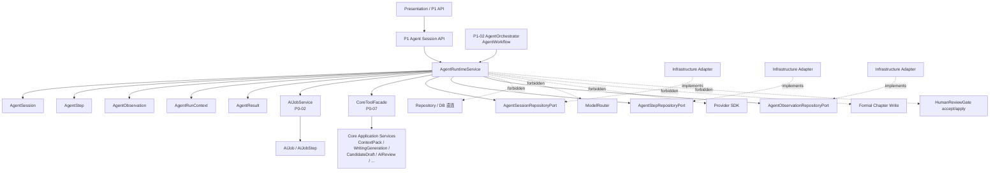
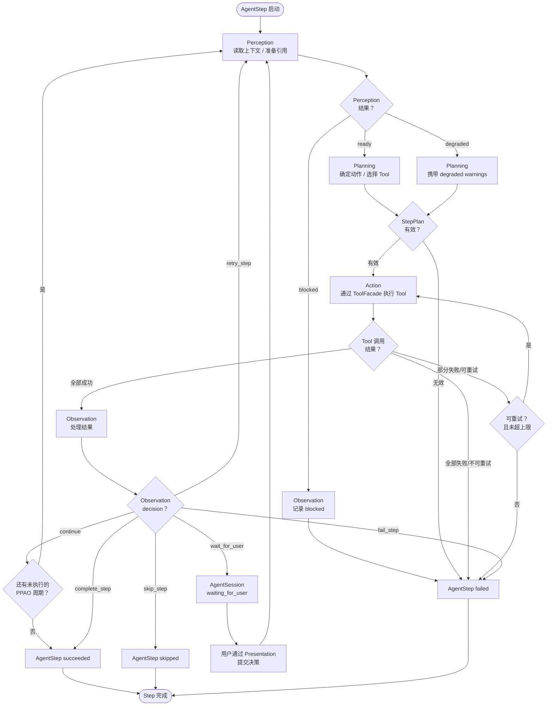
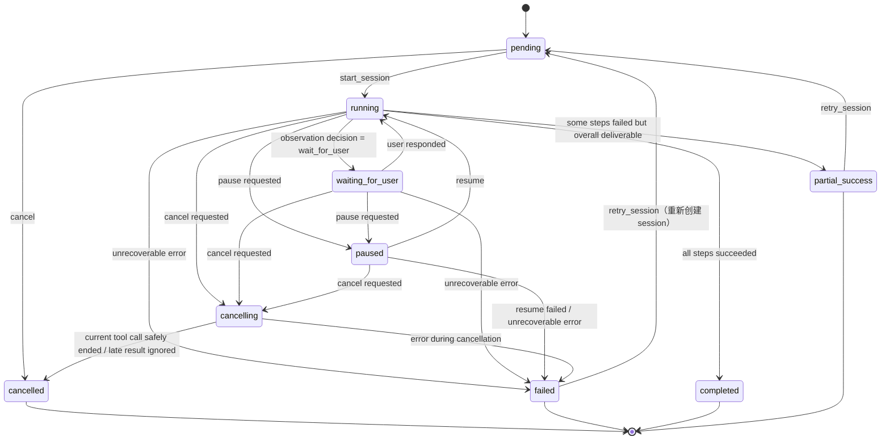
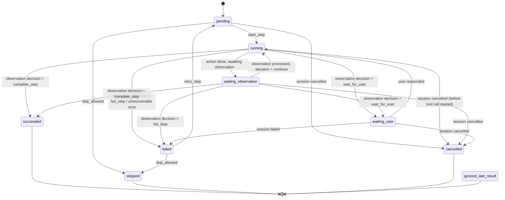

# InkTrace V2.0-P1-01 AgentRuntime 详细设计

版本：v1.0 / P1 模块级详细设计候选冻结版
状态：候选冻结
所属阶段：InkTrace V2.0 P1
设计范围：Agent Runtime 基础设施

依据文档：

- `docs/01_requirements/InkTrace-V2.0-需求规格说明书.md`
- `docs/07_overview/InkTrace-V2.0-概要设计说明书.md`
- `docs/02_architecture/InkTrace-V2.0-架构设计说明书.md`
- `docs/03_design/InkTrace-V2.0-P1-详细设计总纲.md`
- `docs/03_design/V2/InkTrace-V2.0-P0-02-AIJobSystem详细设计.md`
- `docs/03_design/V2/InkTrace-V2.0-P0-07-ToolFacade与权限详细设计.md`
- `docs/03_design/V2/InkTrace-V2.0-P0-08-MinimalContinuationWorkflow详细设计.md`
- `docs/03_design/V2/InkTrace-V2.0-P0-09-CandidateDraft与HumanReviewGate详细设计.md`
- `docs/03_design/V2/InkTrace-V2.0-P0-11-API与集成边界详细设计.md`

---

## 一、文档定位与设计范围

### 1.1 文档定位

本文档是 InkTrace V2.0-P1 的第一个模块级详细设计文档，仅覆盖 P1 Agent Runtime 基础设施。

本文档用于冻结 Agent Runtime 层的 PPAO 执行循环、AgentSession / AgentStep / AgentObservation / AgentRunContext / AgentResult 的数据模型与状态机、AgentRuntimeService 的核心用例、Repository Ports 接口方向、权限与安全边界，以及与 P0 AIJobSystem / ToolFacade / MinimalContinuationWorkflow 的兼容关系。

本文档不写代码、不修改源码、不生成数据库迁移、不拆 Task、不进入开发计划、不进入 P1-02 / P1-03 的详细设计。

### 1.2 设计范围

本模块覆盖：

- AgentSession 数据模型、状态机、生命周期。
- AgentStep 数据模型、类型、状态机。
- AgentObservation 数据模型、类型、决策规则。
- AgentRunContext 数据模型与安全引用。
- AgentResult 数据模型与终态规则。
- AgentRuntimeService 核心用例。
- AgentSessionRepositoryPort / AgentStepRepositoryPort / AgentObservationRepositoryPort 接口方向。
- PPAO 执行循环（Perception → Planning → Action → Observation）。
- Agent 状态机与 AgentStep 状态机。
- pause / resume / cancel / retry 规则。
- waiting_for_user 规则。
- cancelled 后迟到结果 ignored 规则。
- request_id / trace_id 贯穿规则。
- 基础审计与安全日志边界。
- AgentSession 与 AIJobSystem 的关系冻结。
- AgentRuntime 与 ToolFacade 的关系。
- AgentRuntime 与五 Agent Workflow 的关系。
- AgentRuntime 与 P0 MinimalContinuationWorkflow 的兼容关系。

### 1.3 不覆盖范围

本文档不覆盖：

- 五 Agent 的具体职责细节（Memory / Planner / Writer / Reviewer / Rewriter）。
- 五 Agent 的完整 Tool 权限表（属于 P1-02 / P1-03）。
- 四层剧情轨道（属于 P1-04）。
- A/B/C 方向推演（属于 P1-05）。
- 章节计划（属于 P1-05）。
- 多轮 CandidateDraft 迭代（属于 P1-06）。
- AI Suggestion（属于 P1-07）。
- Conflict Guard（属于 P1-08）。
- StoryMemory Revision（属于 P1-09）。
- Agent Trace 完整详细设计（属于 P1-10）。
- P1 API 与前端集成详细设计（属于 P1-11）。
- P2 自动连续续写队列。
- 正文 token streaming。
- AI 自动 apply。
- AI 自动写正式正文。

### 1.4 与 P1 总纲的关系

本文档是 P1 详细设计总纲第 3.1 节「Agent Runtime」和第 4 节「P1 Agent Runtime 总体设计」的模块级展开。本文档继承并冻结总纲中的以下方向：

1. PPAO 是 Agent Runtime 的通用执行循环。
2. 五 Agent Workflow 是 Agent 之间的编排顺序。
3. 每个 Agent 内部都可以按 Perception → Planning → Action → Observation 执行自己的步骤。
4. 不能简单理解为 Memory Agent = Perception、Planner Agent = Planning、Writer Agent = Action、Reviewer Agent = Observation。
5. P1-01 负责冻结 Runtime 层 PPAO 机制。
6. P1-03 才负责冻结五 Agent 职责与协作边界。

本文档不推翻总纲中的任何设计方向，如有发现冲突，只在第十七章登记为待确认点。

### 1.5 与 P0 的关系

P1 AgentRuntime 是 P0 MinimalContinuationWorkflow 的完整化扩展，不是替换。继承关系如下：

| P0 成果 | P1 继承方式 |
|---|---|
| AIJobSystem | 复用，P1 通过 AIJob 跟踪 AgentSession 的异步状态与前端轮询进度 |
| ToolFacade | 复用 CoreToolFacade，P1 扩展完整 Agent 权限矩阵（权限矩阵本身属于 P1-02/P1-03） |
| MinimalContinuationWorkflow | 作为兼容路径保留；P1 主链路优先使用 Agent Workflow |
| CandidateDraft / HumanReviewGate | 复用，安全边界继续有效 |
| V1.1 Local-First | 不变，不接触 |
| caller_type = user_action | 复用，Agent 不得伪造 |

P1 对 P0 的扩展原则：只扩展，不推翻；只增强，不越权。

---

## 二、AgentRuntime 目标与核心原则

### 2.1 模块目标

AgentRuntime 是 P1 智能体工作流的基础设施层，负责：

1. 提供统一的 AgentSession 容器，承载一次完整 Agent 任务的会话生命周期。
2. 提供 PPAO（Perception → Planning → Action → Observation）通用执行循环，作为每个 Agent 内部步骤推进的机制。
3. 提供 AgentStep / AgentObservation 的细粒度执行追踪。
4. 提供 pause / resume / cancel / retry 的确定性状态规则。
5. 通过 ToolFacade 作为调用 Core 能力的唯一受控入口。
6. 与 AIJobSystem 协作，将 Agent 业务状态映射为前端可轮询的任务进度。

### 2.2 Runtime 负责什么

AgentRuntime 负责：

- AgentSession 的创建、启动、状态推进、完成、失败。
- AgentStep 的创建、执行、观察、重试、跳过、取消。
- AgentObservation 的记录与下一步决策。
- PPAO 循环的状态推进。
- AgentRunContext 的构建与安全引用管理。
- pause / resume / cancel / retry 的规则执行。
- waiting_for_user 的识别与阻断。
- cancelled 后迟到结果的隔离。
- request_id / trace_id 的贯穿。
- 基础审计事件记录。

### 2.3 Runtime 不负责什么

AgentRuntime 不负责：

- 不直接访问数据库、Repository、Provider SDK、ModelRouter、VectorStore、EmbeddingProvider。
- 不直接写正式正文。
- 不绕过 HumanReviewGate。
- 不伪造 user_action。
- 不直接调用 AI 模型。
- 不构建 Prompt。
- 不校验模型输出。
- 不执行具体 Agent 的业务逻辑（Memory / Planner / Writer / Reviewer / Rewriter 的业务逻辑属于 P1-03）。
- 不编排五 Agent 之间的执行顺序（编排逻辑属于 P1-02）。

### 2.4 核心安全原则

1. AgentRuntime 只通过 ToolFacade 调用 Core 能力。
2. caller_type = agent 不能执行 user_action 专属操作。
3. AgentRuntime 不持有 formal_write 权限。
4. accept / reject / apply CandidateDraft 必须走 Presentation → Core Application 的 user_action 路径。
5. 正式正文仍走 V1.1 Local-First 保存链路。
6. AI 生成正文只能进入 CandidateDraft / CandidateDraftVersion。
7. 普通日志不记录完整正文、完整 Prompt、完整 CandidateDraft、完整 ContextPack、API Key。
8. request_id / trace_id 贯穿全链路。

---

## 三、AgentRuntime 总体架构

### 3.1 模块关系说明

AgentRuntime 位于 Application 层，是 Agent 执行的基础设施。它不直接访问 Infrastructure，不直接调用 Provider，不直接操作正式数据。

核心关系：

- **Presentation / P1 API** → AgentRuntimeService：创建、查询、控制 AgentSession。
- **AgentRuntimeService** → AgentSession / AgentStep / AgentObservation：管理会话与步骤生命周期。
- **AgentRuntimeService** → AIJobService：同步 Agent 进度到 AIJob/AIJobStep，供前端轮询。
- **AgentRuntimeService** → ToolFacade：Agent 执行 Action 时通过 ToolFacade 调用受控 Tool。
- **P1-02 AgentWorkflow（AgentOrchestrator）** → AgentRuntimeService：编排五 Agent 执行顺序，通过 Runtime 推进每个 Agent 的 PPAO 步骤。
- **AgentRuntimeService** → Repository Ports：持久化 AgentSession / AgentStep / AgentObservation。

### 3.2 与 AIJobSystem 的关系

**冻结方案：AgentSession 独立建模，一个 AgentSession 关联一个主 AIJob。**

理由：

1. **语义分离**：AgentSession 承载 Agent 业务语义（PPAO 状态、Agent 类型、Observation 决策）；AIJob 承载通用异步任务语义（进度、取消、失败、重试）。两者职责不同，不应合并为一个实体。
2. **独立演进**：AgentSession 的状态机（pending / running / waiting_for_user / paused / cancelling / cancelled / failed / completed / partial_success）比 AIJob 状态机（queued / running / paused / failed / cancelled / completed）更丰富。AgentSession 需要表达 waiting_for_user、partial_success 等 Agent 特有状态，不应将这些语义强行塞入 AIJob。
3. **前端兼容**：前端已有基于 AIJob 的轮询机制。P1 通过 AIJob 跟踪 AgentSession 的异步状态与前端轮询进度，不需要前端重构轮询逻辑。
4. **P0 复用**：AIJobSystem 的 pause / resume / cancel / retry / progress 能力直接复用，不重复建设。

关联规则：

- 一个 AgentSession 在创建时同步创建一个主 AIJob（job_type = agent_session）。
- AgentSession.session_id 与 AIJob.id 一一对应，互不替代。
- AIJob 不承载 Agent 业务语义（不记录 agent_type、PPAO 阶段、Observation 决策等）。
- AgentRuntimeService 在 AgentStep 状态变更时同步更新 AIJobStep 进度。
- AgentSession 取消时同步取消关联 AIJob。
- AIJob 的 job_type = agent_session 作为 P1 新增 job_type，不影响 P0 已有 job_type。

AgentStep 与 AIJobStep 的映射：

- 一个 AgentStep 可映射为一个 AIJobStep。
- 映射关系：AgentStep.step_id ↔ AIJobStep.id（一对一）。
- AIJobStep.step_type 使用 AgentStep 的 action 或 agent_type + step_order 拼接。
- AgentStep 的状态变更由 AgentRuntimeService 同步到 AIJobService（update_progress / mark_step_completed / mark_step_failed 等）。
- AgentStep 不直接访问 AIJobRepositoryPort。

### 3.3 与 ToolFacade 的关系

AgentRuntime 通过 ToolFacade 调用 Core 能力，ToolFacade 是唯一受控入口。

规则：

- Agent 在 Action 阶段通过 ToolFacade 调用 Tool。
- 每次 Tool 调用必须携带 ToolExecutionContext（含 session_id、step_id、agent_type、caller_type = agent）。
- ToolFacade 必须校验 agent_type / tool_name / side_effect_level / caller_type。
- AgentRuntime 不绕过 ToolFacade 直接调用任何 Application Service。
- Tool 调用结果封装为 ToolResult，进入 Observation 阶段处理。
- P1 在 P0 ToolExecutionContext 基础上增加 agent_session_id、agent_type、agent_step_id 字段。

P1 ToolExecutionContext 扩展方向：

| 字段 | 说明 | P1 新增 |
|---|---|---|
| agent_session_id | AgentSession ID | 是 |
| agent_type | 当前 Agent 类型（memory / planner / writer / reviewer / rewriter） | 是 |
| agent_step_id | 当前 AgentStep ID | 是 |

其余字段（work_id、job_id、step_id、request_id、trace_id、caller_type、is_quick_trial 等）继承 P0 ToolExecutionContext。

### 3.4 与五 Agent Workflow 的关系

- **PPAO 是 Agent 内部的执行机制**：每个 Agent（Memory / Planner / Writer / Reviewer / Rewriter）在 AgentRuntime 中按 PPAO 循环执行自己的步骤。
- **五 Agent Workflow 是 Agent 之间的编排顺序**：AgentOrchestrator（P1-02）负责按 Memory → Planner → Writer → Reviewer → [Rewriter] 的顺序编排五个 Agent。
- **Runtime 与 Workflow 的分工**：
  - AgentRuntimeService 提供 `run_next_step(session_id)` 等原语，负责单个 AgentStep 的 PPAO 推进。
  - AgentOrchestrator（P1-02）负责决定"下一步启动哪个 Agent"、"是否进入 Rewriter"、"是否回到 Reviewer"。
  - AgentRuntime 不关心 Agent 之间的编排顺序，只关心当前 AgentStep 的 PPAO 状态。
- **不能简单映射**：Memory Agent ≠ Perception、Planner Agent ≠ Planning、Writer Agent ≠ Action、Reviewer Agent ≠ Observation。每个 Agent 内部都有自己的微 PPAO 循环。

### 3.5 与 P0 MinimalContinuationWorkflow 的兼容关系

P1 AgentRuntime 不要求删除 P0 MinimalContinuationWorkflow。兼容策略：

1. P0 MinimalContinuationWorkflow 作为兼容路径保留，继续可用于单章续写。
2. P1 主链路优先使用 Agent Workflow（通过 AgentRuntime + AgentOrchestrator）。
3. P0 WorkflowRunContext 的字段（work_id、chapter_id、continuation_mode、user_instruction、allow_degraded）可作为 AgentRunContext 的初始化输入。
4. P0 AIJobSystem 继续复用，AgentSession 通过主 AIJob 跟踪进度。
5. P0 ToolFacade 继续复用，P1 Agent 通过 ToolFacade 调用受控 Tool。
6. P0 CandidateDraft / HumanReviewGate 安全边界继续有效。
7. 用户可选择使用 P0 轻量续写或 P1 完整 Agent 流程，两条路径共存不互斥。

### 3.6 模块关系图



### 3.7 依赖方向

规则：

- Presentation 调用 AgentRuntimeService 和 AIJobService。
- AgentOrchestrator（P1-02）调用 AgentRuntimeService 推进 AgentStep。
- AgentRuntimeService 依赖 AgentSession / AgentStep / AgentObservation / AgentRunContext / AgentResult 领域对象。
- AgentRuntimeService 通过 ToolFacade 调用 Core Application Service。
- AgentRuntimeService 通过 AIJobService 同步任务进度。
- AgentRuntimeService 通过 Repository Ports 持久化 Agent 数据。
- AgentRuntime 不直接访问 Repository、数据库、Provider SDK、ModelRouter、VectorStore、EmbeddingProvider。
- AgentRuntime 不直接写正式正文、不绕过 HumanReviewGate。

---

## 四、PPAO 执行循环详细设计

### 4.1 PPAO 定义

PPAO（Perception → Planning → Action → Observation）是 Agent Runtime 的通用执行循环。每个 Agent 在 AgentRuntime 中都可以按 PPAO 模式执行自己的步骤。

PPAO 定义的是单个 Agent 内部"如何执行"的机制：

- **Perception**：读取上下文、观察当前状态、准备输入引用。
- **Planning**：确定下一步动作、选择 Tool、形成 StepPlan。
- **Action**：通过 ToolFacade 执行受控 Tool。
- **Observation**：处理 ToolResult / ModelResult / UserDecision / ValidationResult，决定下一步。

PPAO 可以在一个 AgentStep 内完整执行（微 PPAO），也可以跨多个 AgentStep 表达（宏 PPAO）。

### 4.2 PPAO 与五 Agent 的关系

PPAO 和五 Agent Workflow 是两个正交维度：

| 维度 | PPAO | 五 Agent Workflow |
|---|---|---|
| 定义 | Agent 内部的执行循环 | Agent 之间的编排顺序 |
| 负责 | AgentRuntime（P1-01） | AgentOrchestrator（P1-02） |
| 粒度 | 单个 AgentStep 内 / 跨多个 AgentStep | 跨五个 Agent |
| 关系 | 每个 Agent 内部都按 PPAO 执行 | 编排决定"谁在什么时候做什么" |

关键澄清：

- Memory Agent 内部有自己的 PPAO：感知 StoryMemory → 规划提取策略 → 调用 memory_extractor_model → 观察提取结果。
- Writer Agent 内部有自己的 PPAO：感知 ContextPack → 规划生成策略 → 调用 writer_model → 观察校验结果。
- 五 Agent Workflow 的编排顺序（Memory → Planner → Writer → Reviewer → Rewriter）不等于 PPAO 的四阶段。

### 4.3 Perception 阶段

**定义**：Agent 读取上下文、观察当前状态、准备输入引用的阶段。

**输入**：
- AgentRunContext（session_id、work_id、chapter_id、current_agent_type 等）。
- 前序 AgentStep 的 Observation 结果（如果有）。
- AgentSession 的当前状态。

**行为**：
- 确定当前 Agent 需要感知的上下文范围。
- 通过 ToolFacade 调用只读 Tool（如 get_story_memory、get_story_state、get_chapter_context、get_story_arcs）获取上下文引用。
- 组装 PerceptionResult，包含上下文引用列表、感知状态（ready / degraded / blocked）。

**输出**：
- PerceptionResult：包含上下文引用（safe_ref 列表）、感知状态、warnings。

**状态**：AgentStep 处于 running 状态，step_phase = perception。

**失败处理**：
- 上下文不可用（如 StoryMemory 缺失）→ PerceptionResult.status = blocked，AgentStep 可进入 waiting_observation 或 failed。
- 只读 Tool 调用失败 → 根据错误类型决定 retry 或 failed。

### 4.4 Planning 阶段

**定义**：Agent 确定下一步动作、选择 Tool、形成 StepPlan 的阶段。

**输入**：
- PerceptionResult（上下文引用与状态）。
- AgentRunContext。
- Agent 类型（决定可用的 Tool 白名单）。

**行为**：
- 根据 Agent 类型和当前任务，确定要执行的 Tool 序列。
- 形成 StepPlan：包含 tool_name、arguments（安全引用）、执行顺序、预期输出。
- Planning 本身不调用有副作用的 Tool。

**输出**：
- StepPlan：包含 planned_tools（Tool 调用计划列表）、plan_strategy、expected_outputs。

**状态**：AgentStep 处于 running 状态，step_phase = planning。

**失败处理**：
- 无法确定有效 Tool 序列 → StepPlan 为空，AgentStep failed。
- Planning 逻辑错误（如 Agent 类型无法执行请求的任务）→ AgentStep failed。

### 4.5 Action 阶段

**定义**：Agent 通过 ToolFacade 执行受控 Tool 的阶段。

**输入**：
- StepPlan（来自 Planning）。
- AgentRunContext。
- ToolExecutionContext（由 AgentRuntimeService 构造）。

**行为**：
- 按 StepPlan 顺序调用 ToolFacade。
- 每次 Tool 调用携带 ToolExecutionContext（含 agent_session_id、agent_type、caller_type = agent）。
- Tool 调用结果暂存，不立即决策下一步。
- 所有 Tool 调用完成后进入 Observation 阶段。

**输出**：
- ToolCallResults：每个 Tool 调用的 ToolCallResult 列表。

**状态**：AgentStep 处于 running 状态，step_phase = action。

**安全约束**：
- 所有 Tool 调用必须经过 ToolFacade 权限校验。
- caller_type = agent 不能执行 user_action 专属操作。
- formal_write 类 Tool 被 ToolFacade 拒绝。
- Tool 调用必须记录到 AgentTrace（trace_id 贯穿）。

**失败处理**：
- Tool 调用被 ToolFacade 拒绝 → ToolCallResult.error_code = tool_permission_denied，进入 Observation 处理。
- Provider 超时 / 限流 → 按 P0-01 retry 策略，在 Step 内重试。
- Provider 鉴权失败 → 不重试，ToolCallResult.error_code = provider_auth_failed。

### 4.6 Observation 阶段

**定义**：Agent 处理 ToolResult / ModelResult / UserDecision / ValidationResult，决定下一步的阶段。

**输入**：
- ToolCallResults（来自 Action）。
- PerceptionResult（来自 Perception）。
- AgentRunContext。

**行为**：
- 逐条检查 ToolCallResult：
  - 全部 success → 判断 AgentStep 是否完成。
  - 部分 failed（可重试）→ 决定是否 retry 当前 Step。
  - 需要用户输入 → 创建 UserDecisionObservation，AgentSession 进入 waiting_for_user。
  - 全部 failed（不可重试）→ AgentStep failed。
- 检查是否需要额外 Action（如 retry 某个 Tool）。
- 生成 AgentObservation 记录。

**输出**：
- AgentObservation：包含 observation_type、decision、safe_message。
- decision 取值：continue / retry_step / wait_for_user / fail_step / complete_step / skip_step。

**状态**：AgentStep 处于 waiting_observation 或 running（如果 decision = continue，Runtime 自动推进到下一个 PPAO 周期或完成 Step）。

**关键规则**：
- waiting_for_user 不能被 Agent 自动跳过。只有用户通过 Presentation 提交决策后，Runtime 才能继续。
- Observation 不直接修改正式数据。
- Observation 的 safe_message 不能包含完整正文、完整 Prompt、API Key。

### 4.7 PPAO 状态推进

PPAO 的状态推进由 AgentRuntimeService 负责。推进规则：

```text
Step 启动 → Perception
  → Perception 完成 → Planning
    → Planning 完成 → Action
      → Action 完成 → Observation
        → Observation decision = continue → 如果当前 Step 还有未执行的 PPAO 周期 → 回到 Perception
        → Observation decision = continue → 如果当前 Step 的 PPAO 周期已全部完成 → AgentStep 完成
        → Observation decision = retry_step → 重新进入 Perception（保留原 Step，新建 attempt）
        → Observation decision = wait_for_user → AgentSession 进入 waiting_for_user，暂停推进
        → Observation decision = fail_step → AgentStep failed
        → Observation decision = complete_step → AgentStep succeeded
        → Observation decision = skip_step → AgentStep skipped
```

Runtime 不自动决定"下一步启动哪个 Agent"，该决策由 AgentOrchestrator（P1-02）负责。Runtime 只负责当前 AgentStep 内的 PPAO 推进。

### 4.8 PPAO 失败与恢复

- **Perception 失败**：上下文不可用 → PerceptionResult.status = blocked。AgentStep 可进入 failed（不可恢复）或 waiting_observation（需外部干预）。
- **Planning 失败**：无法形成有效 StepPlan → AgentStep failed，不进入 Action。
- **Action 失败**：Tool 调用失败 → 根据错误类型：
  - provider_timeout / provider_rate_limited / provider_unavailable → 可重试（受 P0-01 上限约束）。
  - provider_auth_failed / provider_key_missing → 不可重试，AgentStep failed。
  - tool_permission_denied → 不可重试，AgentStep failed（防御性日志记录）。
  - output_validation_failed → 可重试（受 P0-01 schema retry 上限约束）。
- **Observation 失败**：Observation 本身通常不失败（它是判断逻辑）。但在 waiting_for_user 超时（如果有）等场景，可由 AgentOrchestrator 决定后续行为。

### 4.9 PPAO 流程图



---

## 五、AgentSession 详细设计

### 5.1 AgentSession 职责

AgentSession 是一个完整 Agent 任务的会话容器。它承载一次用户触发的 Agent 任务的完整生命周期，包括：

- 记录任务类型（agent_workflow_type）。
- 记录当前 Agent 类型和当前 Step。
- 聚合多个 AgentStep。
- 聚合多个 AgentObservation。
- 维护会话级状态机。
- 关联主 AIJob（供前端轮询）。
- 承载 AgentResult。

### 5.2 字段方向

| 字段 | 类型 | 说明 |
|---|---|---|
| session_id | string | Agent 会话唯一 ID |
| job_id | string | 关联主 AIJob ID（一对一） |
| work_id | string | 关联作品 ID |
| chapter_id | string | 目标章节 ID，可选 |
| agent_workflow_type | enum | 任务类型：continuation / revision / planning / memory_update / full_workflow |
| status | enum | Agent 会话状态（见 5.3） |
| current_agent_type | string | 当前执行的 Agent 类型（memory / planner / writer / reviewer / rewriter） |
| current_step_id | string | 当前 Step ID，可选 |
| steps | AgentStep[] | 已执行步骤列表（逻辑关联，物理通过 AgentStepRepositoryPort 查询） |
| observations | AgentObservation[] | 观察记录列表（逻辑关联，物理通过 AgentObservationRepositoryPort 查询） |
| result | AgentResult | 最终输出（见第九章） |
| trace_id | string | 关联 AgentTrace ID |
| request_id | string | 请求 ID |
| caller_type | string | 触发来源：user_action / workflow / agent（agent 嵌套场景预留） |
| allow_degraded | boolean | 是否允许 degraded 上下文，默认 true |
| user_instruction | string | 用户指令摘要（安全脱敏，不记录完整正文） |
| metadata | object | 脱敏元数据（不保存完整正文 / Prompt / CandidateDraft / API Key） |
| status_reason | string | 非 failed 状态原因，如 pause_requested / user_cancelled / service_restarted / waiting_user_decision |
| created_at | string | 创建时间 |
| started_at | string | 开始时间，可选 |
| paused_at | string | 暂停时间，可选 |
| resumed_at | string | 恢复时间，可选 |
| finished_at | string | 完成时间，可选 |
| cancelled_at | string | 取消时间，可选 |

### 5.3 状态机

AgentSession 状态：

| 状态 | 含义 | 终态 |
|---|---|---|
| pending | 会话已创建，等待启动 | 否 |
| running | 会话执行中 | 否 |
| waiting_for_user | 等待用户确认或决策 | 否 |
| paused | 用户主动暂停 | 否 |
| cancelling | 取消中（等待当前 Tool 调用安全结束） | 否 |
| cancelled | 已取消 | 是 |
| failed | 不可恢复错误 | 是 |
| completed | 成功完成 | 是 |
| partial_success | 部分成功（部分 Step 失败但整体可交付） | 是 |

终态：cancelled、failed、completed、partial_success。



### 5.4 生命周期规则

- pending 只能进入 running 或 cancelled。
- running 可进入 waiting_for_user、paused、cancelling、failed、completed、partial_success。
- waiting_for_user 不能被 Agent 自动跳过。只有用户通过 Presentation 提交决策后，Runtime 才能继续（waiting_for_user → running）。
- waiting_for_user 可被 pause 或 cancel。
- paused 只能进入 running、cancelling 或 failed。
- cancelling 是中间状态，用于等待当前 Tool 调用安全结束。cancelling 最终进入 cancelled。
- cancelled 是终态，不可恢复。
- completed 是终态，表示所有必需 Step 成功完成。
- partial_success 是终态，表示部分 Step 失败但整体任务可交付（如 Planner 成功但 Reviewer 失败）。
- failed 是终态，但可通过 retry_session 创建新 AgentSession 重新执行。retry_session 不修改原 session，保留历史记录。
- cancelled 后迟到结果 ignored（见 13.5 节）。

### 5.5 与 AIJob 的关联

**冻结方案：一个 AgentSession 关联一个主 AIJob（一对一），AgentStep 可映射为 AIJobStep。**

关联规则：

- AgentSession 创建时同步创建 AIJob（job_type = agent_session）。
- AgentSession.session_id ↔ AIJob.id 一一对应。
- AgentSession.status 变更时同步更新 AIJob.status：
  - AgentSession pending → AIJob queued。
  - AgentSession running → AIJob running。
  - AgentSession paused → AIJob paused。
  - AgentSession waiting_for_user → AIJob running（waiting_for_user 是 Agent 层语义，AIJob 层仍视为 running，前端通过 AgentSession API 获取 waiting_for_user 详情）。
  - AgentSession cancelling → AIJob 保持 running 直到进入 cancelled。
  - AgentSession cancelled → AIJob cancelled。
  - AgentSession failed → AIJob failed。
  - AgentSession completed → AIJob completed。
  - AgentSession partial_success → AIJob completed（AIJob 层不区分 completed 与 partial_success，前端通过 AgentSession API 获取 partial_success 详情）。
- AgentStep 映射为 AIJobStep：每个 AgentStep 对应一个 AIJobStep，step_type 使用 AgentStep.agent_type + step_order。
- AIJob 不承载 Agent 业务语义（不记录 agent_type、PPAO 阶段、Observation 决策等）。
- AgentRuntimeService 负责双向同步，AgentSession 是主真源，AIJob 是投影。

为什么不使用父子级或多 Job 编排：

- P1 阶段 AgentSession 内部步骤线性执行（五 Agent 顺序编排），不需要父子 Job 树。
- 如果未来 P2 支持嵌套 AgentSession（如 Writer Agent 内部触发子 Memory Agent），届时可扩展父子关系。P1-01 预留 metadata 中的 parent_session_id 字段方向，但不实现嵌套逻辑。

### 5.6 AgentSession 终态规则

- **completed**：所有必需 AgentStep 全部 succeeded。
- **partial_success**：部分 AgentStep succeeded，部分 failed / skipped，但整体结果可交付（如 Writer 成功但 Reviewer 失败，CandidateDraft 已生成可进入 HumanReviewGate）。
- **failed**：关键 AgentStep 失败且不可恢复，或用户选择放弃。
- **cancelled**：用户主动取消，或系统取消。

partial_success 与 failed 的区别：

- partial_success 表示"有可交付的部分结果"，如 CandidateDraft 已生成但审稿失败，用户仍可进入 HumanReviewGate 查看。
- failed 表示"没有可交付结果"，如 Writer Agent 生成失败，没有 CandidateDraft。
- 是否判定为 partial_success 由 AgentOrchestrator（P1-02）根据 Agent 职责和步骤结果判定，AgentRuntime 只提供状态能力。

### 5.7 安全边界

AgentSession 安全约束：

- AgentSession 不持有 formal_write 权限。
- AgentSession 不直接访问正式正文保存接口。
- AgentSession 不持有 HumanReviewGate accept / apply 调用权限。
- AgentSession.metadata 不保存完整正文、完整 Prompt、完整 CandidateDraft、API Key。
- AgentSession.user_instruction 只保留安全摘要或脱敏内容。

---

## 六、AgentStep 详细设计

### 6.1 AgentStep 职责

AgentStep 是 AgentSession 内的一个可追踪执行步骤。每个 AgentStep 承载一个 PPAO 周期（或跨多个 PPAO 周期的宏观 Step）。

职责：

- 记录当前执行的 Agent 类型。
- 记录步骤动作（action）。
- 记录 PPAO 阶段（step_phase）。
- 记录 Tool 调用列表。
- 记录步骤状态。
- 支持 retry / skip / cancel。

### 6.2 字段方向

| 字段 | 类型 | 说明 |
|---|---|---|
| step_id | string | 步骤唯一 ID |
| session_id | string | 所属 AgentSession ID |
| job_step_id | string | 映射的 AIJobStep ID，可选 |
| agent_type | enum | 执行的 Agent 类型：memory / planner / writer / reviewer / rewriter |
| step_order | integer | 步骤序号 |
| step_phase | enum | 当前 PPAO 阶段：perception / planning / action / observation |
| action | string | 执行的动作（如 extract_memory、generate_direction、generate_draft、review_draft、rewrite_draft） |
| tool_calls | ToolCallRef[] | 该步骤中的 Tool 调用引用列表（不内联完整参数/结果） |
| step_plan | StepPlan | 来自 Planning 阶段的执行计划 |
| status | enum | 步骤状态（见 6.4） |
| observation | AgentObservation | 最新 Observation 引用 |
| output_refs | string[] | 输出引用列表（safe_ref 格式，如 candidate_draft:cd_xxx） |
| error_code | string | 错误码 |
| error_message | string | 脱敏错误信息 |
| attempt_count | integer | 当前 Step 的 attempt 次数 |
| max_attempts | integer | 最大 attempt 次数，默认 3 |
| retryable | boolean | 是否可重试（动态判定） |
| skippable | boolean | 是否可跳过（动态判定） |
| started_at | string | 开始时间 |
| finished_at | string | 完成时间 |

### 6.3 Step 类型

Step 类型由 agent_type + action 组合标识。典型 action 方向（具体 action 清单由 P1-03 冻结）：

| agent_type | action 方向 | 说明 |
|---|---|---|
| memory | extract_memory | 提取/分析 StoryMemory |
| memory | generate_memory_suggestion | 生成 MemoryUpdateSuggestion |
| planner | analyze_progress | 分析当前进度 |
| planner | generate_direction | 生成 A/B/C 方向 |
| planner | create_chapter_plan | 生成章节计划 |
| planner | create_writing_task | 生成 WritingTask |
| writer | generate_draft | 生成候选稿 |
| reviewer | review_draft | 审稿候选稿 |
| rewriter | rewrite_draft | 修订候选稿 |

P1-01 只定义 Step 的通用模型和状态机。action 的具体语义和每个 Agent 的 Step 序列由 P1-03 冻结。

### 6.4 Step 状态机

AgentStep 状态：

| 状态 | 含义 | 终态 |
|---|---|---|
| pending | 步骤已创建，等待执行 | 否 |
| running | 步骤执行中（PPAO 推进中） | 否 |
| waiting_observation | 等待 Observation 结果（如等待 Tool 调用返回后的异步处理） | 否 |
| waiting_user | 等待用户决策 | 否 |
| succeeded | 步骤成功完成 | 是 |
| failed | 步骤失败 | 是 |
| skipped | 步骤被跳过 | 是 |
| cancelled | 步骤被取消 | 是 |
| ignored_late_result | 步骤被取消后迟到结果被忽略 | 是 |

终态：succeeded、failed、skipped、cancelled、ignored_late_result。



### 6.5 retry 规则

- **retry_step**：只重试当前 failed AgentStep。
- retry_step 保留原 Step ID，新执行记录为新的 attempt（attempt_count + 1）。
- retry_step 保留历史 attempt 记录，不删除。
- retry_step 使用新的 request_id。
- retry_step 共享原 trace_id（或生成 retry_trace_id 关联原 trace_id）。
- retry_step 成功后，AgentRuntimeService 通知 AgentOrchestrator 决定是否继续后续步骤。
- retry_step 失败后，AgentStep.status = failed，attempt_count + 1。
- retry_step 的总 attempt 不超过 max_attempts（默认 3）。
- Runtime 不自动重试 formal_write / apply / memory_formalize 类操作。

**retry_step 与 retry_session 的区别**：
- retry_step 在同一个 AgentSession 内重试单个 Step。
- retry_session 创建新 AgentSession 重新执行整个任务，原 session 保留为历史记录。

### 6.6 skip 规则

- AgentStep 可被跳过（skipped），前提是 step_type 的 skippable = true。
- skipped 是终态。
- skipped 必须记录 reason（user_skipped / workflow_skipped / preempted_by_cancel）。
- skipped 不等于 success。
- continuation 关键步骤不应被标记为 skippable = true（如 generate_draft 不应 skipped）。
- 跳过规则最终由 AgentOrchestrator（P1-02）和 AgentPermissionPolicy 判定。

### 6.7 cancel 规则

- AgentSession 进入 cancelling 时，当前 running / waiting_observation / waiting_user 的 AgentStep 进入 cancelled。
- pending 的 AgentStep 也进入 cancelled。
- cancelled 是终态。
- cancel 不删除已 succeeded 的 AgentStep 和已生成的 CandidateDraft。
- cancel 不删除 ToolAuditLog / LLMCallLog。

### 6.8 late result（迟到结果）规则

- AgentStep 进入 cancelled 或 ignored_late_result 后，迟到 ToolResult 不得推进 Step 状态。
- 迟到结果最多记录脱敏日志和 ignored_late_result 状态。
- 迟到结果不得创建 CandidateDraft。
- 迟到结果不得创建 ReviewReport。
- 迟到结果不得更新 StoryMemory / StoryState。
- 迟到结果不得写正式正文或正式资产。

### 6.9 与 AIJobStep 的映射

- 一个 AgentStep 映射为一个 AIJobStep（一对一）。
- AgentStep.step_id ↔ AIJobStep.id。
- AIJobStep.step_type = agent_step:{agent_type}:{action}（如 agent_step:writer:generate_draft）。
- AgentStep 状态变更 → AgentRuntimeService 调用 AIJobService 同步更新 AIJobStep 状态：
  - AgentStep pending → AIJobStep pending。
  - AgentStep running → AIJobStep running。
  - AgentStep succeeded → AIJobStep completed。
  - AgentStep failed → AIJobStep failed。
  - AgentStep skipped → AIJobStep skipped。
  - AgentStep cancelled / ignored_late_result → AIJobStep failed（AIJobStep 无 cancelled 状态，用 failed 表达，通过 error_code = step_cancelled 区分）。
- AgentStep retry 时，AIJobStep 进入 retry（复用 P0 retry_step 逻辑）。

---

## 七、AgentObservation 详细设计

### 7.1 Observation 职责

AgentObservation 是 Agent 在 PPAO 循环中对执行结果的观察与决策记录。每次 Observation 回答"当前发生了什么"和"接下来做什么"。

职责：

- 记录观察类型。
- 记录观察数据的安全引用。
- 记录决策（下一步动作）。
- 驱动 PPAO 状态推进。

### 7.2 Observation 类型

| observation_type | 说明 | 触发场景 |
|---|---|---|
| tool_result | Tool 调用结果 | Action 阶段每次 Tool 调用后 |
| model_result | 模型输出结果 | LLM 调用完成后 |
| user_decision | 用户决策结果 | waiting_for_user 后用户提交决策 |
| validation_result | 输出校验结果 | OutputValidator 校验后 |
| error | 错误观察 | 任何阶段发生错误 |
| warning | 警告观察 | degraded 上下文、非关键失败等 |
| timeout | 超时观察 | Tool 调用超时、Step 整体超时 |

### 7.3 字段方向

| 字段 | 类型 | 说明 |
|---|---|---|
| observation_id | string | 观察唯一 ID |
| step_id | string | 关联 AgentStep ID |
| session_id | string | 关联 AgentSession ID |
| observation_type | enum | tool_result / model_result / user_decision / validation_result / error / warning / timeout |
| data_ref | string | 观察数据安全引用（safe_ref / content_ref / content_hash） |
| safe_message | string | 安全摘要消息（脱敏，不包含完整正文 / Prompt / API Key） |
| decision | enum | 后续动作：continue / retry_step / wait_for_user / fail_step / complete_step / skip_step / pause_session |
| decision_reason | string | 决策理由（脱敏） |
| source_tool_call_id | string | 来源 Tool 调用 ID（如果是 tool_result 类型） |
| source_attempt_no | integer | 来源 attempt 编号 |
| created_at | string | 创建时间 |

### 7.4 ToolResult 的处理

当 observation_type = tool_result 时：

- 检查 ToolCallResult.success：
  - true → 记录 data_ref 和 safe_message，decision 通常为 continue 或 complete_step。
  - false → 检查 ToolCallResult.error.retryable：
    - retryable = true 且未超 attempt 上限 → decision = retry_step。
    - retryable = false 或超 attempt 上限 → decision = fail_step。
- 特别处理：
  - tool_permission_denied → decision = fail_step（防御性日志记录）。
  - formal_write_forbidden → decision = fail_step（安全事件记录）。
  - human_review_required → decision = wait_for_user。

### 7.5 ModelResult 的处理

当 observation_type = model_result 时：

- 检查模型输出是否存在：
  - 存在 → 继续到 validation_result 处理。
  - 不存在（Provider 返回空）→ decision = fail_step 或 retry_step（取决于是否可重试）。
- 记录 ModelResult 的安全引用（model_call_id 或 llm_call_log_id）。
- 不记录完整模型输出正文到 Observation.safe_message。

### 7.6 UserDecision 的处理

当 observation_type = user_decision 时：

- 这是 waiting_for_user 后用户通过 Presentation 提交的决策。
- decision 字段由用户选择（如 confirm_direction、reject_direction、accept_draft、reject_draft、retry_plan）。
- Runtime 据此推进 AgentSession 状态：
  - 用户确认 → AgentSession 回到 running，继续执行后续 AgentStep。
  - 用户拒绝 → AgentOrchestrator 决定是否重新执行前序 Agent 或结束 Session。
  - 用户取消 → AgentSession 进入 cancelling。
- UserDecision 不可被 Agent 伪造。UserDecision 的 caller_type 必须为 user_action。

### 7.7 ValidationResult 的处理

当 observation_type = validation_result 时：

- 校验成功 → decision = continue 或 complete_step（取决于是否还有后续 Tool 调用）。
- 校验失败：
  - 可重试（schema retry）且未超上限 → decision = retry_step，回到 Action 重新生成。
  - 不可重试或超上限 → decision = fail_step。

### 7.8 Observation 如何驱动下一步

Observation 的 decision 字段是 PPAO 状态推进的核心输入：

| decision | 效果 |
|---|---|
| continue | 继续当前 AgentStep 的下一个 PPAO 周期（回到 Perception） |
| retry_step | 重新执行当前 AgentStep（保留 attempt 记录） |
| wait_for_user | AgentStep 进入 waiting_user，AgentSession 进入 waiting_for_user |
| fail_step | AgentStep failed，AgentOrchestrator 决定后续 |
| complete_step | AgentStep succeeded，AgentOrchestrator 决定是否启动下一个 AgentStep |
| skip_step | AgentStep skipped |
| pause_session | AgentSession paused |

AgentRuntimeService.record_observation(step_id, observation) 是推进状态的核心入口。

---

## 八、AgentRunContext 详细设计

### 8.1 职责

AgentRunContext 是一次 Agent 任务执行的上下文容器。它贯穿整个 AgentSession 生命周期，为每个 AgentStep 提供统一的执行上下文。

职责：

- 携带会话标识（session_id、job_id）。
- 携带作品与章节标识（work_id、chapter_id）。
- 携带当前执行位置（current_agent_type、current_step_id）。
- 携带安全与追踪标识（caller_type、request_id、trace_id）。
- 携带可选业务引用（direction_id、chapter_plan_id、candidate_draft_id 等）。
- 提供安全引用而非内联完整数据。

### 8.2 字段方向

| 字段 | 类型 | 说明 | 必须 |
|---|---|---|---|
| session_id | string | AgentSession ID | 是 |
| job_id | string | 关联主 AIJob ID | 是 |
| work_id | string | 作品 ID | 是 |
| chapter_id | string | 目标章节 ID | 是 |
| agent_workflow_type | enum | 任务类型：continuation / revision / planning / memory_update / full_workflow | 是 |
| current_agent_type | enum | 当前执行的 Agent 类型 | 是 |
| current_step_id | string | 当前 Step ID | 是 |
| caller_type | string | 调用方类型：user_action / agent | 是 |
| request_id | string | 请求 ID | 是 |
| trace_id | string | Trace ID | 是 |
| selected_direction_id | string | 用户选择的剧情方向 ID | 可选 |
| selected_chapter_plan_id | string | 当前生效的章节计划 ID | 可选 |
| current_candidate_draft_id | string | 当前候选稿 ID | 可选 |
| current_candidate_version_id | string | 当前候选稿版本 ID | 可选 |
| latest_review_id | string | 最新审稿报告 ID | 可选 |
| latest_memory_update_suggestion_id | string | 最新记忆更新建议 ID | 可选 |
| allow_degraded | boolean | 是否允许 degraded 上下文，默认 true | 是 |
| user_instruction | string | 用户指令摘要（脱敏） | 是 |
| metadata | object | 脱敏扩展元数据 | 否 |

### 8.3 与 P0 WorkflowRunContext 的演进关系

P0 WorkflowRunContext 的字段（workflow_id、work_id、job_id、current_step_id、writing_task_id、request_id、trace_id、caller_type、is_quick_trial、initialization_status、context_pack_status、allow_degraded）在 P1 中演进为 AgentRunContext。

演进关系：

| P0 WorkflowRunContext | P1 AgentRunContext | 说明 |
|---|---|---|
| workflow_id | session_id | P0 Workflow 升级为 P1 AgentSession |
| job_id | job_id | 保留 |
| work_id | work_id | 保留 |
| writing_task_id | 移入 metadata 或 selected_chapter_plan_id | WritingTask 由 Planner Agent 生成，引用方式变化 |
| current_step_id | current_step_id | 保留 |
| request_id | request_id | 保留 |
| trace_id | trace_id | 保留 |
| caller_type | caller_type | 扩展 agent 作为新 caller_type |
| is_quick_trial | 移入 metadata | P1 AgentSession 不是 Quick Trial 专用 |
| initialization_status | 由 AgentOrchestrator 检查，不放入 Context | Runtime 不直接关心初始化状态 |
| context_pack_status | 由 Perception 阶段动态判断 | 不作为 Context 静态字段 |
| allow_degraded | allow_degraded | 保留 |
| N/A（P1 新增） | current_agent_type | 当前 Agent 类型 |
| N/A（P1 新增） | selected_direction_id | 用户选择的方向 |
| N/A（P1 新增） | selected_chapter_plan_id | 章节计划 |
| N/A（P1 新增） | current_candidate_draft_id | 当前候选稿 |
| N/A（P1 新增） | latest_review_id | 最新审稿 |
| N/A（P1 新增） | latest_memory_update_suggestion_id | 最新记忆建议 |

### 8.4 caller_type / agent_type / side_effect_level

AgentRunContext 中的 caller_type 与 ToolExecutionContext 中的 caller_type 保持一致：

- AgentSession 由用户操作触发 → caller_type = user_action。
- AgentSession 内 Agent 通过 ToolFacade 调用 Tool → ToolExecutionContext.caller_type = agent。
- AgentRuntimeService 构造 ToolExecutionContext 时，caller_type 自动设为 agent。

agent_type（当前 Agent 类型）用于：

- ToolFacade 权限校验（agent_type × tool_name × side_effect_level 三维校验）。
- AgentTrace 分类。
- 审计日志。

side_effect_level 不在 AgentRunContext 中，而在 ToolDefinition 中。ToolFacade 根据 agent_type + tool_name 查找对应 side_effect_level 并执行权限校验。

### 8.5 上下文安全引用

AgentRunContext 中的业务引用字段（selected_direction_id、current_candidate_draft_id 等）使用 safe_ref 格式：

- `direction:{direction_id}`
- `chapter_plan:{plan_id}`
- `candidate_draft:{draft_id}`
- `candidate_version:{version_id}`
- `review:{review_id}`
- `memory_suggestion:{suggestion_id}`

AgentRunContext 不内联完整正文、完整 Prompt、完整 CandidateDraft、API Key。

---

## 九、AgentResult 详细设计

### 9.1 职责

AgentResult 是 AgentSession 的最终输出容器。它汇聚一次 Agent 任务的完整结果，供 AgentOrchestrator 和 Presentation 使用。

职责：

- 记录最终状态（success / partial_success / failed / cancelled）。
- 记录输出引用（CandidateDraft、ReviewReport、MemoryUpdateSuggestion 等的 safe_ref）。
- 记录步骤摘要。
- 记录 warnings 和 error。

### 9.2 字段方向

| 字段 | 类型 | 说明 |
|---|---|---|
| session_id | string | 关联 AgentSession ID |
| status | enum | success / partial_success / failed / cancelled |
| result_refs | ResultRef[] | 输出引用列表 |
| step_summary | StepSummary | 步骤执行摘要 |
| warnings | Warning[] | 警告列表 |
| error_code | string | 最终错误码（如果 failed） |
| error_message | string | 脱敏错误信息 |
| total_steps | integer | 总步骤数 |
| succeeded_steps | integer | 成功步骤数 |
| failed_steps | integer | 失败步骤数 |
| skipped_steps | integer | 跳过步骤数 |
| total_elapsed_ms | integer | 总耗时 |
| finished_at | string | 完成时间 |

### 9.3 ResultRef 设计

ResultRef 表示 AgentSession 产出的一个输出引用：

| 字段 | 类型 | 说明 |
|---|---|---|
| ref_type | enum | candidate_draft / review_report / memory_suggestion / direction_proposal / chapter_plan / writing_task |
| ref_id | string | 引用实体 ID（safe_ref 格式） |
| source_agent_type | string | 产生此结果的 Agent 类型 |
| source_step_id | string | 产生此结果的 AgentStep ID |
| status | string | 该结果的状态（如 CandidateDraft 的 generated / reviewed 等） |

### 9.4 成功结果

AgentResult.status = success：

- 所有必需 AgentStep 全部 succeeded。
- result_refs 包含所有产出引用（CandidateDraft、ReviewReport 等）。
- step_summary 记录完整执行轨迹。

### 9.5 partial_success 结果

AgentResult.status = partial_success：

- 部分 AgentStep succeeded，部分 failed / skipped。
- result_refs 包含已成功的产出引用（如 Writer 成功但 Reviewer 失败，仍有 CandidateDraft 引用）。
- 失败的 AgentStep 在 step_summary 中记录 error_code 和 error_message。
- 用户可决定是否进入 HumanReviewGate 查看已有 CandidateDraft。
- partial_success 是否允许进入 HumanReviewGate 由 AgentOrchestrator（P1-02）判定，AgentRuntime 不阻止。

### 9.6 failed 结果

AgentResult.status = failed：

- 关键 AgentStep 失败，没有可交付的结果。
- result_refs 为空或只有中间产出。
- error_code 记录最终失败原因。

### 9.7 waiting_for_user 结果

AgentResult 不直接表达 waiting_for_user。waiting_for_user 是 AgentSession 的状态（详见 5.3），不是最终结果。当 AgentSession 处于 waiting_for_user 时：

- AgentResult 尚未生成（AgentSession 尚未进入终态）。
- 用户通过 Presentation 提交决策后，AgentSession 回到 running，继续执行后续 AgentStep。
- 如果用户在 waiting_for_user 时取消，AgentResult.status = cancelled。

### 9.8 安全约束

- AgentResult 不内联完整正文、完整 Prompt、完整 CandidateDraft、API Key。
- result_refs 只使用 safe_ref 引用。
- step_summary 只包含安全摘要，不包含完整输出内容。

---

## 十、AgentRuntimeService 详细设计

### 10.1 职责

AgentRuntimeService 是 Application 层服务，负责 AgentSession / AgentStep / AgentObservation 的生命周期管理和 PPAO 状态推进。

职责：

- 创建和管理 AgentSession。
- 创建和管理 AgentStep。
- 推进 PPAO 循环（run_next_step）。
- 记录和处理 AgentObservation。
- 管理 pause / resume / cancel / retry。
- 同步状态到 AIJobService。
- 通过 ToolFacade 调用受控 Tool。

### 10.2 核心用例

#### create_session

**输入**：work_id、chapter_id、agent_workflow_type、user_instruction、allow_degraded、request_id、trace_id、caller_type。

**行为**：
1. 创建 AgentSession（status = pending）。
2. 生成 session_id、trace_id（如果未提供）。
3. 创建主 AIJob（job_type = agent_session）。
4. 持久化 AgentSession。
5. 返回 session_id 和 job_id。

**输出**：AgentSession 引用（session_id、job_id、status = pending）。

**约束**：
- work_id 必须存在。
- caller_type 必须合法（user_action 或 system）。
- user_instruction 脱敏后存储。

#### start_session

**输入**：session_id。

**行为**：
1. 校验 AgentSession.status = pending。
2. 更新 AgentSession.status = running、started_at = now。
3. 同步 AIJob.status = running。
4. 通知 AgentOrchestrator（P1-02）开始编排。

**输出**：AgentSession 引用（status = running）。

#### run_next_step

**输入**：session_id、agent_type、action、step_plan。

**行为**：
1. 校验 AgentSession.status = running。
2. 创建 AgentStep（status = pending）。
3. 创建映射 AIJobStep。
4. 执行 PPAO 循环（详见 4.7 节）：
   - Perception → Planning → Action → Observation。
5. 每次 Tool 调用通过 ToolFacade，携带 ToolExecutionContext（caller_type = agent）。
6. 记录 AgentObservation。
7. 根据 Observation.decision 决定：
   - continue → 继续 PPAO 循环。
   - complete_step → AgentStep.succeeded。
   - fail_step → AgentStep.failed。
   - wait_for_user → AgentStep.waiting_user，AgentSession.waiting_for_user。
8. 同步 AgentStep/AIAgentSession 状态到 AIJobService。

**输出**：AgentStep 引用（含最新 status 和 observation）。

**约束**：
- 此方法由 AgentOrchestrator（P1-02）调用，不直接由 Presentation 调用。
- step_plan 由 AgentOrchestrator 或 Agent 内部的 Planning 阶段生成。
- Runtime 不判断"应该执行哪个 Agent"，只推进给定 agent_type 的 Step。

#### pause_session

**输入**：session_id。

**行为**：
1. 校验 AgentSession.status = running 或 waiting_for_user。
2. 如果当前 AgentStep 正在执行 Tool 调用（step_phase = action），等待当前 Tool 调用完成。
3. 当前 Tool 调用完成后，不自动启动下一个 Tool 或下一个 Step。
4. AgentSession.status = paused、paused_at = now。
5. 同步 AIJob.status = paused。

**输出**：AgentSession 引用（status = paused）。

**约束**：
- pause 不中断正在执行的 Provider 调用（与 P0 保持一致）。
- pause 后迟到 ToolResult 仍正常记录，但不自动推进到下一步。
- pause 后 AgentSession 等待 resume。

#### resume_session

**输入**：session_id。

**行为**：
1. 校验 AgentSession.status = paused。
2. AgentSession.status = running、resumed_at = now。
3. 同步 AIJob.status = running。
4. 从当前 AgentStep 的当前 PPAO 阶段继续。
5. 如果暂停前 AgentStep 未完成，继续执行该 Step 的剩余 PPAO 周期。
6. 通知 AgentOrchestrator 继续编排。

**输出**：AgentSession 引用（status = running）。

**约束**：
- resume 不重复执行已完成的 AgentStep。
- 如果 WritingTask metadata 缺失导致无法安全 resume，返回 error_code = writing_task_missing。

#### cancel_session

**输入**：session_id。

**行为**：
1. 校验 AgentSession.status 为 pending / running / waiting_for_user / paused。
2. AgentSession.status = cancelling。
3. 如果当前 AgentStep 正在执行 Tool 调用，等待当前 Tool 调用安全结束。
4. 当前 Tool 调用完成后，不推进后续步骤。
5. AgentSession.status = cancelled、cancelled_at = now。
6. 所有 pending / waiting_observation 的 AgentStep → cancelled。
7. 取消关联 AIJob。
8. 后续迟到 ToolResult → ignored_late_result（详见 13.5）。

**输出**：AgentSession 引用（status = cancelled）。

**约束**：
- cancel 不删除已 succeeded 的 AgentStep。
- cancel 不删除已生成的 CandidateDraft。
- cancel 不删除 LLMCallLog / ToolAuditLog。
- cancel 不影响 V1.1 正文草稿。

#### retry_session

**输入**：session_id（原 failed 或 partial_success 的 session）。

**行为**：
1. 校验原 AgentSession.status = failed 或 partial_success。
2. 创建新 AgentSession（新的 session_id、新的 trace_id）。
3. 新 AgentSession.metadata 记录 retry_of_session_id = 原 session_id。
4. 创建新主 AIJob。
5. 原 AgentSession 保持不变（历史记录保留）。
6. 新 AgentSession.status = pending，等待 start_session。

**输出**：新 AgentSession 引用（session_id、job_id、status = pending）。

**约束**：
- retry_session 不修改原 AgentSession。
- retry_session 保留原 AgentSession 的历史记录（AgentStep / AgentObservation / AgentResult）。
- retry_session 使用新的 request_id 和 trace_id。

#### retry_step

**输入**：session_id、step_id。

**行为**：
1. 校验 AgentStep.status = failed。
2. 校验 attempt_count < max_attempts。
3. AgentStep.status = pending（重新进入执行队列）。
4. AgentStep.attempt_count + 1。
5. 保留原 attempt 的 AgentObservation 记录。
6. 重新执行该 AgentStep 的 PPAO 循环。

**输出**：AgentStep 引用（status = pending，attempt_count 已增加）。

**约束**：
- retry_step 不删除历史 attempt 和 Observation。
- retry_step 使用新的 request_id。
- retry_step 共享原 trace_id（或通过 retry_group_id 关联）。
- Runtime 不自动重试 formal_write / apply / memory_formalize 类操作。

#### record_observation

**输入**：step_id、observation（observation_type、data_ref、safe_message、decision）。

**行为**：
1. 创建 AgentObservation 记录。
2. 更新 AgentStep.observation 引用。
3. 根据 observation.decision 推进状态（见 7.8 节）：
   - continue → AgentStep.step_phase 推进到下一个 PPAO 阶段。
   - complete_step → AgentStep.status = succeeded。
   - fail_step → AgentStep.status = failed。
   - wait_for_user → AgentStep.status = waiting_user，AgentSession.status = waiting_for_user。
   - skip_step → AgentStep.status = skipped。
4. 同步 AgentStep 状态到 AIJobStep。

**输出**：AgentObservation 引用，更新后的 AgentStep 和 AgentSession 状态。

#### complete_session

**输入**：session_id。

**行为**：
1. 校验所有必需 AgentStep 已完成。
2. 汇总 AgentResult（status = success 或 partial_success）。
3. AgentSession.status = completed 或 partial_success、finished_at = now。
4. 同步 AIJob.status = completed。

**输出**：AgentResult。

#### fail_session

**输入**：session_id、error_code、error_message。

**行为**：
1. AgentSession.status = failed、finished_at = now。
2. AgentResult.status = failed。
3. 同步 AIJob.status = failed。

**输出**：AgentResult。

#### mark_late_result_ignored

**输入**：session_id、step_id、tool_call_id。

**行为**：
1. 校验 AgentSession.status = cancelled 且 AgentStep.status = cancelled。
2. 记录 AgentObservation（observation_type = warning，decision_reason = late_result_ignored）。
3. AgentStep 可标记为 ignored_late_result（如果尚未进入终态）。
4. 不推进任何业务状态。

**输出**：AgentObservation 引用。

### 10.3 与 RepositoryPort 的关系

AgentRuntimeService 通过 Repository Ports 持久化 Agent 数据：

- AgentSessionRepositoryPort：创建、查询、更新 AgentSession。
- AgentStepRepositoryPort：创建、查询、更新 AgentStep。
- AgentObservationRepositoryPort：创建、查询 AgentObservation。

AgentRuntimeService 不直接访问 Repository 实现（Infrastructure Adapter）。

### 10.4 与 AIJobService 的关系

AgentRuntimeService 调用 AIJobService 同步状态：

- create_session → AIJobService.create_job。
- start_session → AIJobService.start_job。
- run_next_step → AIJobService.update_progress / mark_step_running / mark_step_completed / mark_step_failed。
- pause_session → AIJobService.pause_job。
- resume_session → AIJobService.resume_job。
- cancel_session → AIJobService.cancel_job。
- complete_session → AIJobService.mark_job_completed。
- fail_session → AIJobService.mark_job_failed。

AgentRuntimeService 不绕过 AIJobService 直接访问 AIJobRepositoryPort。

---

## 十一、Repository Ports 设计

### 11.1 AgentSessionRepositoryPort

职责：

- 创建 AgentSession。
- 按 session_id 查询 AgentSession。
- 按 work_id 查询 AgentSession 列表。
- 更新 AgentSession 状态。
- 更新 AgentSession 的 current_agent_type / current_step_id。
- 更新 AgentSession.result。
- 按 job_id 查询 AgentSession。
- 查询可恢复的 AgentSession（如服务重启后 status = running 的会话）。

### 11.2 AgentStepRepositoryPort

职责：

- 创建 AgentStep。
- 按 step_id 查询 AgentStep。
- 按 session_id 查询 AgentStep 列表。
- 更新 AgentStep 状态。
- 更新 AgentStep 的 step_phase / attempt_count / error_code / observation。
- 按 session_id + agent_type 查询 AgentStep。
- 按 job_step_id 查询 AgentStep。

### 11.3 AgentObservationRepositoryPort

职责：

- 创建 AgentObservation。
- 按 observation_id 查询 AgentObservation。
- 按 step_id 查询 AgentObservation 列表。
- 按 session_id 查询 AgentObservation 列表。

### 11.4 是否需要 AgentRuntimeUnitOfWork

P1-01 不冻结是否需要独立的 AgentRuntimeUnitOfWork。理由：

- P0 阶段 AIJobRepositoryPort / AIJobStepRepositoryPort / AIJobAttemptRepositoryPort 的实现弹性规则（不强制独立表或独立实现类）同样适用于 P1 Agent 仓储。
- AgentRuntimeService 的用例通常涉及跨 Session / Step / Observation 的原子更新（如完成 Step 同时记录 Observation）。实现时可由 Infrastructure Adapter 在同一个事务中完成。
- 是否在 Port 层面抽象 UnitOfWork，留给实现阶段根据具体持久化方案决定。P1-01 只定义 Port 接口方向。

### 11.5 P0 阶段文件存储 / DB 存储兼容方向

P1 AgentSession / AgentStep / AgentObservation 的持久化方案遵循 P0 的存储演进方向：

- P0 阶段不强制要求独立数据库表。P1 同样不强制。
- Infrastructure Adapter 可以使用同一底层存储（SQLite / 文件）统一持久化。
- Repository Ports 的接口拆分（三个独立 Port）是 Application 层的职责边界，不强制对应三个物理表。
- 无论物理实现如何，AgentRuntimeService 通过 Port 接口访问，不直接依赖存储细节。
- 不生成数据库迁移。

---

## 十二、权限与安全边界

### 12.1 AgentRuntime 禁止行为

AgentRuntime 明确禁止：

1. 不直接访问 Infrastructure（数据库、文件系统、向量存储）。
2. 不直接调用 ModelRouter。
3. 不直接调用 Provider SDK。
4. 不直接写正式正文（不持有 V1.1 Local-First 保存链路引用）。
5. 不绕过 HumanReviewGate（不持有 accept / apply CandidateDraft 的调用权限）。
6. 不伪造 user_action。
7. 不维护自己的业务真源（所有正式数据在 Core Domain 中）。
8. 不直接访问 RepositoryPort（只通过 AgentRuntimeService 间接使用自己的 Repository Ports，不直接访问 Core Domain 的 RepositoryPort）。

### 12.2 caller_type 规则

P1 在 P0 caller_type 基础上新增 agent：

| caller_type | 说明 | 权限范围 |
|---|---|---|
| user_action | 用户直接操作 | 可执行需要用户确认的操作（accept / apply CandidateDraft、确认 MemoryRevision 等） |
| workflow | P0 Workflow 调用 | P0 受控 Tool 白名单 |
| quick_trial | Quick Trial 调用 | Quick Trial 受限 Tool 白名单 |
| system | 系统内部调用 | 系统维护操作 |
| agent | P1 Agent 自动化调用 | P1 Agent 受控 Tool 白名单（不包含 user_action 专属操作） |

核心规则：

- caller_type = agent 不能执行 caller_type = user_action 专属操作。
- Agent Runtime 通过 ToolFacade 调用 Tool 时，ToolExecutionContext.caller_type 固定为 agent。
- ToolFacade 必须校验 caller_type：如果 Tool 的 allowed_callers 不包含 agent，拒绝调用。
- accept / reject / apply CandidateDraft 的 allowed_callers 仅限于 user_action。

### 12.3 user_action 边界

以下操作必须由 caller_type = user_action 发起，Agent 不得执行：

- accept_candidate_draft：接受候选稿。
- reject_candidate_draft：拒绝候选稿。
- apply_candidate_to_draft：将候选稿应用到章节草稿区。
- accept_ai_suggestion：采纳 AI 建议。
- reject_ai_suggestion：拒绝 AI 建议。
- confirm_memory_revision：确认记忆更新。
- rollback_memory_revision：回滚记忆版本。
- confirm_direction：确认剧情方向。
- confirm_chapter_plan：确认章节计划。

这些操作必须走 Presentation → Core Application 路径，Agent 不参与。

### 12.4 formal_write 禁止

AgentRuntime 永远不持有 formal_write 权限。formal_write 类 Tool 的 allowed_callers 不包含 agent。

formal_write 类 Tool 包括：

- update_official_chapter_content：更新正式章节正文。
- overwrite_character_asset：覆盖正式人物资产。
- overwrite_foreshadow_asset：覆盖正式伏笔资产。
- overwrite_setting_asset：覆盖正式设定资产。
- create_official_chapter_directly：直接创建正式章节。
- update_story_memory_directly：直接更新正式 StoryMemory。

这些 Tool 在 P1 仍然全部禁止 Agent 调用。

### 12.5 ToolFacade 权限校验点

Agent 通过 ToolFacade 调用 Tool 时，ToolFacade 必须校验：

1. agent_type 是否在 ToolDefinition.allowed_agent_types 中。
2. tool_name 是否在 ToolRegistry 中且 enabled = true。
3. side_effect_level 是否为 formal_write（如果是，拒绝）。
4. caller_type = agent 时，Tool 的 allowed_callers 是否包含 agent。
5. ToolExecutionContext 的有效性（session_id、step_id、work_id 匹配）。
6. Tool 的 requires_human_confirmation 是否为 true（如果是，Agent 不能直接调用，需触发 waiting_for_user）。

### 12.6 日志与隐私

普通日志不记录：

- 完整正文。
- 完整 Prompt。
- 完整 ContextPack。
- 完整 CandidateDraft。
- 完整 CandidateDraftVersion。
- 完整 user_instruction。
- API Key。
- Provider Key。

AgentSession / AgentStep / AgentObservation 的持久化同样遵守上述隐私边界。

### 12.7 request_id / trace_id

- **request_id**：每次 AgentSession 创建时生成唯一 request_id。AgentStep retry 时生成新的 request_id。
- **trace_id**：AgentSession 创建时生成 trace_id。同一 AgentSession 内的所有 AgentStep 共享该 trace_id。AgentStep retry 时共享原 trace_id（或生成 retry_trace_id 关联原 trace_id）。
- request_id / trace_id 贯穿：AgentSession → AgentStep → AgentObservation → ToolExecutionContext → ToolAuditLog → AgentTrace。
- Trace 详细内容留到 P1-10 AgentTrace 详细设计，P1-01 只定义 trace_id 贯穿与最小事件记录。

**最小事件记录**（P1-01 负责定义）：

| 事件 | 触发条件 | 记录内容 |
|---|---|---|
| agent_session_created | AgentSession 创建 | session_id、job_id、agent_workflow_type、request_id、trace_id |
| agent_session_started | AgentSession 启动 | session_id、started_at |
| agent_step_started | AgentStep 开始执行 | step_id、session_id、agent_type、action、step_order |
| agent_step_completed | AgentStep 成功完成 | step_id、session_id、finished_at |
| agent_step_failed | AgentStep 失败 | step_id、session_id、error_code、error_message（脱敏） |
| agent_step_waiting_user | AgentStep 等待用户 | step_id、session_id、waiting_reason |
| tool_call_forbidden | Agent 尝试调用禁止的 Tool | agent_type、tool_name、caller_type、denied_reason |
| agent_session_completed | AgentSession 成功完成 | session_id、finished_at、result.status |
| agent_session_failed | AgentSession 失败 | session_id、error_code |
| agent_session_cancelled | AgentSession 取消 | session_id、cancelled_at |
| late_result_ignored | cancelled 后迟到结果被忽略 | session_id、step_id、tool_call_id |

所有事件记录不包含完整正文、完整 Prompt、完整 CandidateDraft、API Key。

---

## 十三、错误处理、暂停、恢复、取消、重试

### 13.1 错误分类

| 错误类别 | 示例 error_code | 可重试 | 处理方式 |
|---|---|---|---|
| Provider 临时故障 | provider_timeout、provider_rate_limited、provider_unavailable | 是 | 按 P0-01 retry 策略，受 Step 总 attempt 上限约束 |
| Provider 永久故障 | provider_auth_failed、provider_key_missing、provider_disabled | 否 | AgentStep failed |
| 输出校验失败 | output_validation_failed | 是 | schema retry，受 P0-01 上限约束 |
| Tool 权限拒绝 | tool_permission_denied | 否 | AgentStep failed，防御性日志 |
| formal_write 请求 | formal_write_forbidden | 否 | AgentStep failed，安全事件 |
| 上下文不可用 | context_unavailable、context_pack_blocked | 否 | AgentStep failed 或 waiting_user |
| 无效参数 | invalid_arguments | 否 | AgentStep failed |
| 会话已取消 | session_cancelled | 否 | 迟到结果 ignored |
| 服务重启 | service_restarted | 否 | AgentSession → paused |

### 13.2 可重试错误

可重试错误的重试规则继承 P0-01 / P0-02：

- Provider 调用重试最多 1 次（provider_timeout、provider_rate_limited、provider_unavailable）。
- OutputValidator schema 校验失败默认最多重试 2 次。
- 单个 AgentStep 总 Provider 调用次数上限为 3 次。
- AgentStep 的 max_attempts 默认为 3。
- retry 不删除历史 attempt / Observation / ToolAuditLog / LLMCallLog。

### 13.3 不可重试错误

以下错误不可重试，AgentStep 直接进入 failed：

- provider_auth_failed。
- provider_key_missing。
- provider_disabled。
- tool_permission_denied。
- formal_write_forbidden。
- invalid_execution_context。
- 超过 max_attempts 上限。
- Runtime 不自动重试 formal_write / apply / memory_formalize 类操作。

### 13.4 pause / resume

**pause 规则**：

- running 或 waiting_for_user 的 AgentSession 可暂停。
- 如果当前 AgentStep 正在执行 Tool 调用（正在等待 Provider 响应），pause 在当前 Tool 调用完成后生效。
- P1 不强制中断正在执行的外部 Provider 请求（与 P0 保持一致）。
- pause 后 AgentSession.status = paused。
- pause 后当前 Tool 调用返回时，不自动启动下一个 Tool 或下一个 Step。
- pause 不删除已生成的 CandidateDraft、ReviewReport、AgentStep、Observation。

**resume 规则**：

- paused AgentSession 可恢复。
- resume 从未完成的 AgentStep 继续。
- 已 succeeded / skipped 的 AgentStep 不重复执行。
- resume 后 AgentSession.status = running。
- 如果暂停前 AgentStep 处于 step_phase = action 且 Tool 调用未完成，resume 后从该 Tool 调用的 Observation 开始。
- 如果 resume 时发现关键状态丢失（如 WritingTask metadata 缺失），返回 error_code = writing_task_missing，要求用户重新发起。

### 13.5 cancel

**cancel 规则**：

- pending / running / waiting_for_user / paused 的 AgentSession 可取消。
- cancel 后 AgentSession.status = cancelling（中间状态），等待当前 Tool 调用安全结束。
- 当前 Tool 调用安全结束后，AgentSession.status = cancelled。
- cancelling 期间不启动新的 Tool 调用。
- cancelled 是终态，不可恢复。
- cancel 不删除已 succeeded 的 AgentStep。
- cancel 不删除已生成的 CandidateDraft。
- cancel 不删除 LLMCallLog / ToolAuditLog / AgentObservation。
- cancel 不影响 V1.1 正文草稿。

**cancelled 后迟到结果 ignored**：

- AgentSession 进入 cancelled 后，任何迟到的 ToolResult 不得推进 AgentStep。
- 迟到结果不得创建 CandidateDraft。
- 迟到结果不得创建 ReviewReport。
- 迟到结果不得更新 StoryMemory / StoryState。
- 迟到结果不得写正式正文或正式资产。
- 迟到结果最多记录：
  - AgentObservation（observation_type = warning，decision_reason = late_result_ignored）。
  - AgentStep 标记为 ignored_late_result（如果尚未终态）。
  - 脱敏安全日志。
- AgentRuntimeService.mark_late_result_ignored 是处理迟到结果的唯一入口。

### 13.6 retry session / retry step

**retry_session**：

- 原 AgentSession 必须是终态（failed 或 partial_success）。
- 创建新 AgentSession，保留原 session 历史。
- 新 session 使用新的 session_id、job_id、request_id、trace_id。
- retry_session 不删除原 session 的任何记录。

**retry_step**：

- 原 AgentStep 必须是 failed。
- 在当前 AgentSession 内重试，不创建新 session。
- retry_step 保留 attempt 历史。
- retry_step 受 max_attempts 约束。
- retry_step 成功后，AgentOrchestrator 决定是否继续后续步骤。

### 13.7 partial_success

partial_success 的判定规则：

- partial_success 表示"有可交付的部分结果，但并非所有 AgentStep 都成功"。
- 典型场景：Writer Agent 成功生成 CandidateDraft，但 Reviewer Agent 审稿失败 → partial_success，CandidateDraft 可供用户查看。
- 反例场景：Writer Agent 失败 → failed，因为没有可交付的 CandidateDraft。
- partial_success 的具体判定条件由 AgentOrchestrator（P1-02）根据 Agent 职责和步骤结果确定。
- AgentRuntime 提供 AgentSession.status = partial_success 的状态能力。
- partial_success 后，用户可通过 HumanReviewGate 查看已生成的 CandidateDraft。

### 13.8 waiting_for_user

waiting_for_user 规则：

- waiting_for_user 由 Observation decision = wait_for_user 触发。
- waiting_for_user 表示 Agent 需要用户输入才能继续（如确认方向、确认计划、确认是否接受建议）。
- waiting_for_user 不能被 Agent 自动跳过。只有用户通过 Presentation 提交决策后，Runtime 才能继续。
- waiting_for_user 状态下：
  - AgentSession.status = waiting_for_user。
  - 当前 AgentStep.status = waiting_user。
  - AIJob.status = running（AIJob 层不区分 waiting_for_user，前端通过 AgentSession API 感知等待状态）。
- waiting_for_user 可被 pause 或 cancel。
- waiting_for_user 无默认超时。如果后续需要超时策略，由 P1-11 API 与前端集成边界详细设计定义。

---

## 十四、与相邻模块的接口边界

### 14.1 P1-02 AgentWorkflow（AgentOrchestrator）

P1-01 对 P1-02 的接口承诺：

- AgentRuntimeService 提供：create_session、start_session、run_next_step、pause_session、resume_session、cancel_session、retry_step、record_observation、complete_session、fail_session。
- AgentOrchestrator 调用 run_next_step 推进每个 Agent 的 Step。AgentOrchestrator 决定"下一步启动哪个 Agent"、"是否进入 Rewriter"、"是否回到 Reviewer"。
- AgentOrchestrator 不直接访问 AgentSession / AgentStep / AgentObservation 的 Repository Ports。
- AgentOrchestrator 不直接构造 ToolExecutionContext。

P1-02 对 P1-01 的依赖：

- AgentOrchestrator 需要 AgentRuntimeService 提供 AgentSession 状态查询能力（当前处于哪个 Agent、当前 Step 状态）。
- AgentOrchestrator 依赖 Observation.decision 决定编排分支。

### 14.2 P1-03 五 Agent 职责与编排

P1-01 对 P1-03 的接口承诺：

- 提供通用 PPAO 循环，每个 Agent 在 Runtime 中按 PPAO 执行。
- 提供 AgentStep 的 agent_type + action 字段，供 P1-03 定义每个 Agent 的具体 Step 序列。
- 不预判每个 Agent 的具体 action 清单、Tool 权限表、Step 序列。

P1-03 对 P1-01 的依赖：

- P1-03 需要冻结每个 Agent 的 action 清单，P1-01 已预留 AgentStep.action 字段方向。
- P1-03 需要冻结每个 Agent 的 Tool 白名单，P1-01 已定义 ToolFacade 权限校验点。
- P1-03 需要冻结每个 Agent 的 PPAO 微循环细节，P1-01 已提供通用循环框架。

### 14.3 P1-10 AgentTrace

P1-01 对 P1-10 的接口承诺：

- 提供 trace_id 贯穿机制。
- 提供最小事件记录（12.7 节）。
- AgentSession / AgentStep / AgentObservation 的数据结构可供 Trace 引用。

P1-10 的职责：

- Agent Trace 的完整详细设计（AgentStepTrace、ToolCallTrace、ObservationTrace、Prompt/Context 安全引用、审计日志）属于 P1-10。
- P1-01 不定义 Trace 的完整存储结构、查询 API、展示格式。

### 14.4 P1-11 API 与前端集成

P1-01 对 P1-11 的接口承诺：

- 提供 AgentSession 状态查询能力（前端通过 AgentSession API 获取当前 Agent、当前 Step、状态、进度）。
- 提供 waiting_for_user 状态标识（前端可据此高亮等待用户确认节点）。
- 提供 AgentSession 控制能力（pause / resume / cancel）。
- AgentSession 通过主 AIJob 提供前端轮询兼容（前端仍可通过 get_ai_job 获取基础进度）。

P1-11 的职责：

- P1 Agent Session API 的路由、DTO、错误码定义。
- waiting_for_user 与前端事件模型的最终冻结。
- 轮询 / SSE 策略。
- 前端最小入口定义。

### 14.5 P0 AIJobSystem

P1-01 对 P0-02 的复用：

- 复用 AIJobService 的任务生命周期管理能力。
- 复用 AIJob / AIJobStep 的 pause / resume / cancel / retry 机制。
- 复用 AIJobProgress 的前端轮询兼容。
- P1 新增 job_type = agent_session。

P1-01 不修改 P0-02 的任何设计。

### 14.6 P0 ToolFacade

P1-01 对 P0-07 的复用：

- 复用 CoreToolFacade 作为 Agent 调用 Core 的唯一受控入口。
- 复用 ToolRegistry / ToolDefinition / ToolPermissionPolicy 的权限框架。
- P1 扩展 ToolExecutionContext（增加 agent_session_id、agent_type、agent_step_id）。
- P1 扩展 caller_type（增加 agent）。
- P1 扩展 side_effect_level（增加 plan_write、review_write、suggestion_write——具体在 P1-02/P1-03 中冻结）。

P1-01 不修改 P0-07 的任何设计。

### 14.7 P0 CandidateDraft / HumanReviewGate

P1-01 继承 P0-09 的安全边界：

- AgentRuntime 不持有 accept / apply CandidateDraft 权限。
- CandidateDraft 仍是 AI 正文输出与正式正文之间的隔离层。
- HumanReviewGate 仍是用户确认门。
- Agent 不伪造 user_action。
- 正式正文仍走 V1.1 Local-First 保存链路。

P1-01 不修改 P0-09 的任何设计。

---

## 十五、P1-01 不做事项清单

P1-01 明确不做以下事项：

1. 不实现五 Agent 业务逻辑（Memory / Planner / Writer / Reviewer / Rewriter 的职责细节）。
2. 不实现四层剧情轨道（Plot Arc）。
3. 不实现 A/B/C 方向推演（Direction Proposal）。
4. 不实现章节计划（ChapterPlan）。
5. 不实现多轮 CandidateDraft 迭代（CandidateDraftVersion）。
6. 不实现 AI Suggestion。
7. 不实现 Conflict Guard。
8. 不实现 StoryMemory Revision。
9. 不实现 Agent Trace 完整详情（只定义 trace_id 贯穿与最小事件记录）。
10. 不实现 P1 API / 前端集成。
11. 不实现 P2 自动连续续写队列。
12. 不实现正文 token streaming。
13. 不实现 AI 自动 apply。
14. 不实现 AI 自动写正式正文。
15. 不修改 P0 文档。
16. 不修改 P1 总纲。
17. 不进入 P1-02 / P1-03 的详细设计。
18. 不生成数据库迁移。
19. 不生成开发计划。
20. 不拆开发任务。

---

## 十六、P1-01 验收标准

### 16.1 PPAO 与五 Agent 关系

- [ ] PPAO 是 Agent Runtime 的通用执行循环，与五 Agent Workflow 的编排顺序正交。
- [ ] 每个 Agent 内部都按 PPAO 执行自己的步骤。
- [ ] Memory Agent ≠ Perception、Planner Agent ≠ Planning、Writer Agent ≠ Action、Reviewer Agent ≠ Observation。
- [ ] PPAO 流程图文语义准确（Perception → Planning → Action → Observation → decision）。

### 16.2 AgentSession 与 AIJob 关系

- [ ] AgentSession 独立建模，与 AIJob 一对一关联。
- [ ] AIJob 不承载 Agent 业务语义。
- [ ] AgentSession 状态变更同步到 AIJob。
- [ ] AgentStep 可映射为 AIJobStep。
- [ ] 前端可通过 AIJob 轮询 Agent 进度。

### 16.3 状态机

- [ ] AgentSession 状态机完整：pending / running / waiting_for_user / paused / cancelling / cancelled / failed / completed / partial_success。
- [ ] AgentStep 状态机完整：pending / running / waiting_observation / waiting_user / succeeded / failed / skipped / cancelled / ignored_late_result。
- [ ] 终态明确：cancelled、failed、completed、partial_success（AgentSession）；succeeded、failed、skipped、cancelled、ignored_late_result（AgentStep）。
- [ ] 状态流转图语义准确。

### 16.4 pause / resume / cancel / retry

- [ ] pause 在当前 Tool 调用完成后生效，不中断 Provider 请求。
- [ ] resume 从未完成 Step 继续。
- [ ] cancel 经过 cancelling 中间状态。
- [ ] cancelled 后迟到结果 ignored。
- [ ] retry_step 保留历史 attempt。
- [ ] retry_session 创建新 session，保留原 session 历史。
- [ ] Runtime 不自动重试 formal_write / apply / memory_formalize。

### 16.5 waiting_for_user

- [ ] waiting_for_user 不能被 Agent 自动跳过。
- [ ] 只有用户通过 Presentation 提交决策后才能继续。
- [ ] waiting_for_user 可被 pause / cancel。

### 16.6 权限与安全

- [ ] caller_type = agent 不能执行 user_action 专属操作。
- [ ] accept / apply CandidateDraft 必须走 user_action 路径。
- [ ] AgentRuntime 不持有 formal_write 权限。
- [ ] ToolFacade 必须校验 agent_type / tool_name / side_effect_level / caller_type。
- [ ] 普通日志不记录完整正文、完整 Prompt、完整 CandidateDraft、完整 ContextPack、API Key。
- [ ] request_id / trace_id 贯穿全链路。

### 16.7 与 P0 兼容

- [ ] P0 MinimalContinuationWorkflow 可作为兼容路径保留。
- [ ] P1 AgentRuntime 不要求删除 P0 Workflow。
- [ ] P0 WorkflowRunContext 可演进为 AgentRunContext。
- [ ] P0 AIJobSystem 继续复用。
- [ ] P0 ToolFacade 继续复用。
- [ ] P0 CandidateDraft / HumanReviewGate 安全边界继续有效。

### 16.8 不进入其他模块

- [ ] 不进入 P1-02 / P1-03 / P2 的设计范围。
- [ ] 不写代码、不生成数据库迁移、不拆 Task。

---

## 十七、P1-01 待确认点

以下问题需要在后续模块协同确认，P1-01 只登记不解决：

1. **AgentStep 与 AIJobStep 是否严格一一映射**：P1-01 建议一对一映射。如果 P1-02 AgentWorkflow 需要一个 AgentStep 对应多个 AIJobStep（或反之），需在 P1-02 中提出并回刷 P1-01。

2. **AgentTrace 存储是否与 AgentSession 同库**：P1-01 已定义 trace_id 贯穿和最小事件记录。AgentTrace 的完整存储方案（独立表 / 独立文件 / 与 AgentSession 同库）由 P1-10 决定。

3. **AgentRunContext 中 selected_direction_id / selected_chapter_plan_id 的最终字段**：这些字段的最终名称、类型和是否必填，由 P1-05 方向推演与章节计划详细设计冻结。P1-01 已预留可选字段方向。

4. **waiting_for_user 与前端事件模型如何在 P1-11 冻结**：P1-01 定义了 waiting_for_user 的状态规则。前端如何感知（轮询 / SSE）、用户如何提交决策（API 格式）、超时策略，由 P1-11 定义。

5. **Runtime 是否支持嵌套 AgentSession**：P1-01 不支持嵌套 AgentSession（如 Writer Agent 内部触发子 Memory Agent）。如果 P2 需要此能力，由 P2 设计。P1-01 在 AgentRunContext.metadata 中预留 parent_session_id 字段方向。

6. **partial_success 是否允许进入 HumanReviewGate**：P1-01 建议允许（如果 Writer Agent 成功生成 CandidateDraft，即使 Reviewer Agent 失败，用户仍可查看候选稿）。最终规则由 P1-02 AgentWorkflow 和 P1-09 HumanReviewGate 协同确认。

7. **caller_type 体系是否细分为 agent_memory / agent_planner 等**：P1 总纲建议以 agent 为基础 caller_type，细分类别在 AgentTrace 中通过 agent_type 字段区分。如果 P1-02 / P1-03 需要更细粒度的 caller_type 用于权限校验，需在相应文档中提出并回刷 P1-01。

8. **AgentSession 的 user_instruction 脱敏粒度**：P1-01 要求 user_instruction 只保留安全摘要或脱敏内容。脱敏的具体规则（保留多长、是否保留关键词）由 P1-11 结合隐私设计确认。

9. **AgentSession 的最大执行时间**：P1-01 未定义 AgentSession 的全局超时。如果 P1-02 或 P1-11 需要超时策略，需在相应文档中定义。

10. **服务重启后 AgentSession 的恢复策略**：P1-01 继承 P0-02 策略——running AgentSession 标记为 paused，reason = service_restarted。是否自动 resume、是否通知用户，由 P1-11 结合前端体验确认。

以上待确认点不影响 P1-01 作为后续模块设计的基础。各模块进入详细设计前，建议先过待确认点。

---

## 附录 A：P1-01 术语表

| 术语 | 定义 |
|---|---|
| PPAO | Perception → Planning → Action → Observation，Agent Runtime 的通用执行循环 |
| AgentSession | 一次完整 Agent 任务的会话容器 |
| AgentStep | AgentSession 内的一个可追踪执行步骤 |
| AgentObservation | PPAO 循环中对执行结果的观察与决策记录 |
| AgentRunContext | 贯穿 AgentSession 的执行上下文 |
| AgentResult | AgentSession 的最终输出容器 |
| AgentRuntimeService | AgentSession / AgentStep / AgentObservation 生命周期管理服务 |
| AgentOrchestrator | 五 Agent 编排器（P1-02），负责 Agent 之间的执行顺序 |
| ToolFacade | Core Application 层受控工具门面（P0-07），Agent 调用 Core 的唯一入口 |
| HumanReviewGate | 用户确认门控（P0-09），管控 CandidateDraft 的 accept / apply |
| waiting_for_user | Agent 等待用户决策的状态，不可被 Agent 自动跳过 |
| partial_success | 部分 AgentStep 成功但整体可交付的终态 |
| late result | AgentSession 取消后迟到的 Tool 调用结果 |
| safe_ref | 安全引用格式：entity_type:entity_id |
| formal_write | 正式数据写入权限，Agent 永远不持有 |

## 附录 B：P1-01 与 P1 总纲的对照

| P1 总纲要求 | P1-01 冻结内容 |
|---|---|
| PPAO 是通用执行循环 | 第四章：PPAO 定义、四阶段设计、状态推进、流程图 |
| AgentSession 字段方向 | 第五章：完整字段方向、状态机、生命周期 |
| AgentStep 字段方向 | 第六章：完整字段方向、Step 类型、状态机 |
| AgentObservation 字段方向 | 第七章：完整字段方向、Observation 类型、决策规则 |
| AgentTrace 字段方向 | 第八章（AgentRunContext）：trace_id 贯穿；第十二章：最小事件记录 |
| Agent 状态机 | 第五章：pending / running / waiting_for_user / paused / cancelling / cancelled / failed / completed / partial_success |
| AgentStep 状态机 | 第六章：pending / running / waiting_observation / waiting_user / succeeded / failed / skipped / cancelled / ignored_late_result |
| Agent 与 AIJobSystem 的关系 | 第三章 / 第五章：AgentSession 独立建模，一对一主 AIJob |
| Agent 调用 ToolFacade 的方式 | 第三章 / 第十章：通过 ToolFacade，caller_type = agent，携带 ToolExecutionContext |
| Agent 失败/暂停/恢复/取消/重试 | 第十三章：完整规则 |
| 与 P0 兼容 | 第三章 / 第十四章：P0 路径保留，ToolFacade/AIJobSystem/CandidateDraft 复用 |
| AgentRuntime 禁止行为 | 第二章 / 第十二章：不直连基础设施、不绕过 HumanReviewGate、不持有 formal_write |
| caller_type = agent | 第十二章：P1 新增 agent caller_type，权限边界 |
| 不覆盖五 Agent 职责 | 第一章 / 第十五章：明确不覆盖边界 |
