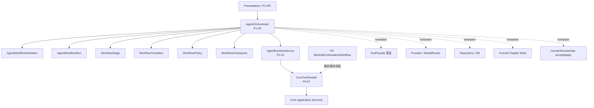
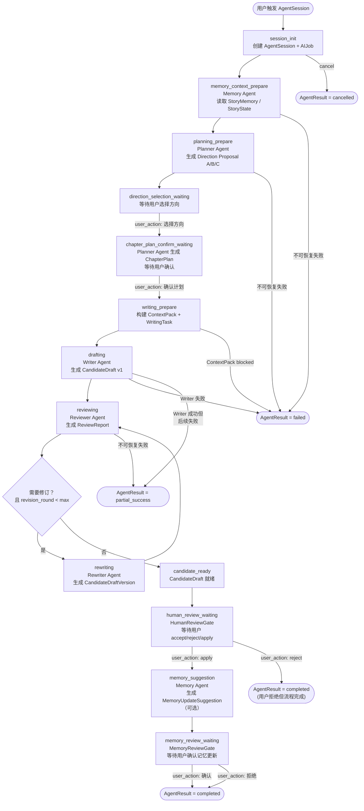

# InkTrace V2.0-P1-02 AgentWorkflow 详细设计

版本：v1.2 / P1 模块级详细设计候选冻结版
状态：候选冻结
所属阶段：InkTrace V2.0 P1
设计范围：AgentWorkflow 编排层

依据文档：

- `docs/01_requirements/InkTrace-V2.0-需求规格说明书.md`
- `docs/07_overview/InkTrace-V2.0-概要设计说明书.md`
- `docs/02_architecture/InkTrace-V2.0-架构设计说明书.md`
- `docs/03_design/InkTrace-V2.0-P1-详细设计总纲.md`
- `docs/03_design/InkTrace-V2.0-P1-01-AgentRuntime详细设计.md`
- `docs/03_design/V2/InkTrace-V2.0-P0-02-AIJobSystem详细设计.md`
- `docs/03_design/V2/InkTrace-V2.0-P0-07-ToolFacade与权限详细设计.md`
- `docs/03_design/V2/InkTrace-V2.0-P0-08-MinimalContinuationWorkflow详细设计.md`
- `docs/03_design/V2/InkTrace-V2.0-P0-09-CandidateDraft与HumanReviewGate详细设计.md`
- `docs/03_design/V2/InkTrace-V2.0-P0-11-API与集成边界详细设计.md`

说明：本文档只冻结 P1 AgentWorkflow 编排层设计，不进入五 Agent 具体职责与 Tool 权限细节，不忽略 P0 已冻结边界，不推翻 P0 已实现设计。

---

## 一、文档定位与设计范围

### 1.1 文档定位

本文档是 InkTrace V2.0-P1 的第二个模块级详细设计文档，仅覆盖 P1 AgentWorkflow 编排层设计。

P1-02 的目标是冻结五 Agent 之间的编排顺序、工作流阶段（WorkflowStage）、流转规则（WorkflowTransition）、决策机制（WorkflowDecision）、策略约束（WorkflowPolicy）、检查点（WorkflowCheckpoint），以及 AgentOrchestrator 如何基于 P1-01 AgentRuntime 推进一次完整的多 Agent 协作任务。

本文档只解决"多个 Agent 之间如何编排"的问题，不解决"单个 AgentStep 如何执行"的问题。单个 AgentStep 的 PPAO 推进、Tool 调用、Observation 记录、Runtime 状态机，以 `docs/03_design/InkTrace-V2.0-P1-01-AgentRuntime详细设计.md` 为准。

本文档不替代 P1-01 AgentRuntime，不进入五 Agent 具体职责与 Tool 权限细节（P1-03），不进入剧情轨道（P1-04）、方向推演（P1-05）等下游模块的内部设计。本文档不写代码、不修改源码、不生成数据库迁移、不拆 Task、不进入开发计划。

### 1.2 设计范围

本模块覆盖：

- AgentWorkflowDefinition：工作流定义模型。
- AgentWorkflowRun：工作流运行实例。
- WorkflowStage：工作流阶段定义与状态规则。
- WorkflowTransition：阶段间流转规则。
- WorkflowDecision：编排决策类型与来源。
- WorkflowPolicy：工作流策略与默认约束。
- WorkflowCheckpoint：工作流检查点（pause / resume / recovery）。
- AgentOrchestrator：核心编排逻辑——决定下一个 Agent、处理 waiting_for_user / partial_success / failed / completed。
- 五 Agent 之间的编排顺序（标准主链路 + 条件分支）。
- AgentWorkflow 与 P1-01 AgentRuntime 的关系（如何调用 AgentRuntimeService）。
- AgentWorkflow 如何处理 waiting_for_user（DirectionSelection / PlanConfirmation / HumanReviewGate / MemoryReviewGate 的不同确认边界）。
- AgentWorkflow 如何处理 partial_success / failed / completed。
- AgentWorkflow 如何处理 pause / resume / cancel / retry。
- AgentWorkflow 如何处理 degraded / blocked。
- AgentWorkflow 与 P0 MinimalContinuationWorkflow 的兼容关系。

### 1.3 不覆盖范围

P1-02 不覆盖：

- 五 Agent 的完整职责与 Tool 权限表（属于 P1-03）。
- 每个 Agent 的 Prompt / 模型调用细节（属于 P1-03）。
- 四层剧情轨道数据结构（属于 P1-04）。
- A/B/C 方向推演算法（属于 P1-05）。
- 章节计划结构（属于 P1-05）。
- CandidateDraftVersion 数据结构（属于 P1-06）。
- AI Suggestion 类型系统（属于 P1-07）。
- Conflict Guard 规则矩阵（属于 P1-08）。
- StoryMemory Revision 数据结构（属于 P1-09）。
- Agent Trace 完整字段（属于 P1-10）。
- API 路由 / DTO / 前端展示（属于 P1-11）。
- P2 自动连续续写队列。
- 正文 token streaming。
- AI 自动 apply。
- AI 自动写正式正文。

### 1.4 与 P1 总纲的关系

P1 总纲已冻结以下 AgentWorkflow 相关方向，P1-02 必须直接继承：

1. 五 Agent Workflow 是 Agent 之间的编排顺序。
2. 标准流程：Memory Agent → Planner Agent → Writer Agent → Reviewer Agent → [Rewriter Agent → Reviewer Agent] → HumanReviewGate → [Memory Agent update suggestion → MemoryReviewGate]。
3. 用户可在任意节点暂停、取消或请求重新执行某个 Agent。
4. Direction Proposal 的用户确认路径独立于 HumanReviewGate。
5. HumanReviewGate 只管 CandidateDraft 的 accept / reject / apply。
6. MemoryReviewGate 只管 StoryMemoryUpdateSuggestion / MemoryRevision。
7. 多门控同时触发时，默认顺序为：Conflict Guard → HumanReviewGate → MemoryReviewGate。

### 1.5 与 P1-01 AgentRuntime 的关系

P1-02 继承 P1-01 的全部冻结结论（详细见 P1-01 第一章 1.4 节和第十四章 14.1 节）。核心继承点：

| P1-01 冻结结论 | P1-02 继承方式 |
|---|---|
| AgentRuntimeService 提供 create_session / start_session / run_next_step / pause_session / resume_session / cancel_session / retry_step / retry_session / record_observation / complete_session / fail_session | AgentOrchestrator 通过这些接口推进 Workflow |
| AgentOrchestrator 调用 run_next_step 推进每个 Agent 的 Step | AgentOrchestrator 按 Workflow 阶段决定何时调用、传什么参数 |
| AgentOrchestrator 决定"下一步启动哪个 Agent"、"是否进入 Rewriter"、"是否回到 Reviewer" | AgentOrchestrator 的 WorkflowTransition 机制负责这些决策 |
| Runtime 不关心 Agent 间编排顺序 | AgentOrchestrator 是 Workflow 编排的唯一负责人 |
| PPAO 与五 Agent Workflow 正交 | AgentOrchestrator 编排的是 Agent 粒度，每个 Agent 内部的 PPAO 由 Runtime 负责 |
| waiting_for_user 不能被 Agent 自动跳过 | AgentOrchestrator 在进入等待状态时必须标记 stage，并在用户响应后推进 |
| partial_success 判定权属于 AgentOrchestrator | AgentOrchestrator 根据 WorkflowPolicy 和 AgentResult 判定整体结果 |
| ToolFacade 是唯一受控入口 | AgentOrchestrator 不直接调用 Tool，所有 Tool 调用通过 Runtime 转交 ToolFacade |
| AgentSession 独立建模并独立持久化，是 P1 Agent 业务会话真源 | AgentOrchestrator 以 session_id 关联，不创建独立的 Agent 业务实体 |
| AIJob 是异步任务与前端轮询投影，不承载 Agent 业务语义 | AIJob 创建与状态同步由 AgentRuntimeService 负责，AgentOrchestrator 不直接操作 AIJob |
| 一个 AgentSession 关联一个主 AIJob | 继承，AgentOrchestrator 不改变此关联 |
| AgentStep 默认映射一个 AIJobStep | 继承 |
| Step 内 retry 通过 attempt 机制表达 | 继承，retry_step 由 Runtime 层执行 |
| caller_type = agent 不能执行 user_action 专属操作 | 继承 |
| AgentRuntime 不持有 formal_write 权限 | 继承 |
| cancelled 后迟到结果必须 ignored | 继承 |
| partial_success 必须存在至少一个可交付 result_ref | 继承，continuation / revision 通常要求 CandidateDraft / CandidateDraftVersion 已生成 |

### 1.6 与 P0 的关系

- P0 MinimalContinuationWorkflow 作为兼容路径保留。
- P1 AgentWorkflow 是完整化扩展，不是删除 P0。
- P0 轻量续写路径可继续存在（用户可选择 P0 模式或 P1 完整 Agent 模式）。
- 两者共享 AIJobSystem / ToolFacade / CandidateDraft / HumanReviewGate 安全边界。
- workflow_compat caller_type 用于 P0 兼容路径的迁移期语义，权限等同或严于 P0 workflow。

---

## 二、AgentWorkflow 目标与核心原则

### 2.1 模块目标

AgentWorkflow 是 P1 智能体工作流的编排层，负责：

1. 定义五 Agent 的编排顺序与条件分支。
2. 将一次完整的 Agent 协作任务划分为可管理的工作流阶段（WorkflowStage）。
3. 基于 AgentRuntime 提供的 step 执行能力和 Observation 反馈，决定阶段间的流转。
4. 处理 workflow 级别的 pause / resume / cancel / retry 决策。
5. 处理 waiting_for_user、partial_success / failed / completed 的 workflow 级判定。
6. 确保所有正式写入操作仍走 Presentation → Core Application 的 user_action 路径。

### 2.2 Workflow 负责什么

AgentWorkflow 负责：

- 定义 workflow_type 和对应的 stage 序列。
- 创建和维护 AgentWorkflowRun（与 AgentSession 一一关联）。
- 管理 WorkflowStage 的进入 / 退出条件。
- 决定当前阶段结束后进入哪个阶段（WorkflowTransition）。
- 根据 AgentRuntime.record_observation 返回的 decision / observation 推进下一阶段。
- 管理 WorkflowPolicy（max_revision_rounds / allow_degraded 等）。
- 管理 WorkflowCheckpoint（用于 pause / resume / recovery）。
- 处理多门控顺序（Conflict Guard → HumanReviewGate → MemoryReviewGate）。
- 在执行完所有 stage 后调用 AgentRuntimeService.complete_session 或 fail_session。

### 2.3 Workflow 不负责什么

AgentWorkflow 不负责：

- 不直接执行 Tool（Tool 调用由 AgentRuntime 通过 ToolFacade 执行）。
- 不直接访问 Provider / ModelRouter / Repository / DB。
- 不直接调用 ContextPackService、WritingGenerationService、CandidateDraftService 等 Application Service。
- 不绕过 AgentRuntimeService。
- 不伪造 user_action。
- 不直接写正式正文。
- 不执行 accept / apply CandidateDraft。
- 不确认 MemoryRevision。
- 不采纳 AI Suggestion。
- 不绕过 Conflict Guard / HumanReviewGate / MemoryReviewGate。
- 不定义单个 Agent 的具体职责（属于 P1-03）。
- 不记录完整正文、完整 Prompt、完整 CandidateDraft、API Key。

### 2.4 核心原则

1. **编排与执行分离**：AgentWorkflow 决定"何时做什么"，AgentRuntime 负责"怎么做"。
2. **阶段驱动推进**：Workflow 以 Stage 为最小编排单元，Stages 之间有明确的 transition 条件。
3. **用户确认门不可自动跳过**：DirectionSelection、PlanConfirmation、HumanReviewGate、MemoryReviewGate 均需 user_action 才能跨越。
4. **安全边界不可逾越**：Workflow 不可授予 formal_write 权限，不可伪造 user_action，不可绕过 P0 安全边界。
5. **策略可配置但有默认约束**：max_revision_rounds 等参数可配置，但存在默认上限。
6. **与 P0 兼容共存**：不强制替换 P0 MinimalContinuationWorkflow。
7. **Runtime 执行 Step，Workflow 编排 Step**：PPAO 是 Agent 内部机制，Workflow 是 Agent 间顺序。
8. **blocked 不得伪造成 ready**：degraded 必须带 warning_codes。
9. **partial_success 必须有可交付 result_ref**。
10. **Rewriter / Reviewer 循环必须有 max_revision_rounds 上限**。
11. **P1 不引入 AI 自动 apply 或 AI 自动写正式正文**。

---

## 三、AgentWorkflow 总体架构

### 3.1 模块关系说明

AgentWorkflow 位于 P1 Application 编排层，在 AgentRuntime 之上，不直接接触 Infrastructure 或 Core Application Service。

```text
Presentation / P1 API
    ↓
AgentOrchestrator (P1-02)
    ↓ 调用
AgentRuntimeService (P1-01)
    ↓ 通过 ToolFacade 调用
Core Application Services (P0-06/07/08/09)
```

核心关系：

- **Presentation / P1 API** → AgentOrchestrator：用户触发 workflow 创建、暂停、恢复、取消。
- **AgentOrchestrator** → AgentRuntimeService：创建 session、推进 step、记录 observation、完成/失败 session。
- **AgentRuntimeService** → ToolFacade → Core Application Services：Agent Step 内部的 Tool 调用（AgentOrchestrator 不直接参与）。
- **AgentOrchestrator** → WorkflowPolicy / WorkflowCheckpoint：读取策略、管理检查点。

AgentOrchestrator 不直接调用 AIJobService。AIJob 创建与状态同步由 AgentRuntimeService 在 create_session / start_session / run_next_step / pause_session / complete_session / fail_session 内部完成。AgentOrchestrator 如需工作流整体进度信息，应通过 AgentRuntimeService 查询 AgentSession 状态后推断，而不是直接访问 AIJobService。AIJob 仍只是异步任务与前端轮询投影，不承载 AgentWorkflow 业务语义。

### 3.2 AgentWorkflow 与 AgentRuntimeService 的调用关系

AgentOrchestrator 通过以下接口使用 AgentRuntimeService：

| AgentRuntimeService 接口 | AgentOrchestrator 调用场景 |
|---|---|
| create_session | workflow 启动时创建 AgentSession |
| start_session | workflow 初始化完成后启动 |
| run_next_step | 每个 WorkflowStage 内推进 Agent Step |
| record_observation | run_next_step 返回后处理 observation |
| pause_session | 用户暂停或系统暂停 |
| resume_session | 用户恢复 |
| cancel_session | 用户取消或系统取消 |
| retry_step | 某个 step 失败后重试 |
| retry_session | workflow 整体重试 |
| complete_session | workflow 所有 stage 成功完成 |
| fail_session | workflow 不可恢复失败 |

AgentOrchestrator 不直接调用 ToolFacade，不直接调用任何 Application Service。

### 3.3 AgentOrchestrator 定位

AgentOrchestrator 是 P1-02 的核心组件，它是一段编排逻辑（非独立持久化实体），负责：

1. 读取 AgentWorkflowDefinition，确定当前 workflow_type 的 stage 序列。
2. 根据当前 WorkflowStage 和 AgentRunContext，决定调用 run_next_step 传递的参数（agent_type、action、step_plan）。
3. 接收 AgentRuntime 返回的 AgentObservation，解析 decision，映射为 WorkflowDecision。
4. 根据 WorkflowDecision 和 WorkflowPolicy，触发 WorkflowTransition，进入下一 stage。
5. 管理 waiting_for_user 状态（标记当前 stage 为等待用户，等待 user_action 后恢复）。
6. 在最后一个 stage 完成后调用 complete_session 或 fail_session。

AgentOrchestrator 不持久化自身——其运行状态通过 AgentSession（P1-01）和 WorkflowCheckpoint（P1-02）持久化。

### 3.4 AgentWorkflow 与 ToolFacade

AgentOrchestrator 不直接调用 ToolFacade。Tool 调用链路是：

```text
AgentOrchestrator
  → AgentRuntimeService.run_next_step(session_id, agent_type, action)
    → AgentRuntime 内部 PPAO 循环
      → Action 阶段：ToolFacade.call(tool_name, ToolExecutionContext)
        → Core Application Service
```

AgentOrchestrator 在创建 session 时传递 caller_type = user_action（如果是用户触发）或 system（如果是系统触发）。AgentRuntime 在内部构造 ToolExecutionContext 时 caller_type 固定为 agent。AgentOrchestrator 不伪造 ToolExecutionContext。

### 3.5 AgentWorkflow 与 AIJobSystem

- AgentOrchestrator 不直接调用 AIJobService。
- AIJob 的创建和状态同步由 AgentRuntimeService 在 create_session / start_session / run_next_step / pause_session / complete_session / fail_session 内部完成。
- AgentOrchestrator 不持有 AIJob 引用。
- 如 AgentOrchestrator 需要查询 workflow 整体进度，通过 AgentRuntimeService 获取 AgentSession 状态后推断。
- 一个 AgentSession 关联一个主 AIJob。AgentStep 默认映射 AIJobStep。AIJob 用于前端轮询与任务投影，AgentSession 才是 Agent 业务语义真源。

### 3.6 AgentWorkflow 与 P0 MinimalContinuationWorkflow

- P0 MinimalContinuationWorkflow 作为兼容路径保留。
- P1 主链路使用 AgentOrchestrator + AgentRuntime。
- 两条路径共享：AIJobSystem、ToolFacade、CandidateDraft / HumanReviewGate、V1.1 Local-First 保存链路。
- workflow_compat caller_type 用于标记从 P0 兼容路径进入的执行，权限等同或严于 P0 workflow。

### 3.7 模块关系图



---

## 四、AgentWorkflow 核心模型

### 4.1 AgentWorkflowDefinition

AgentWorkflowDefinition 是工作流的静态定义，描述一个 workflow_type 的阶段序列、流转规则和默认策略。

**字段方向**：

| 字段 | 类型 | 说明 |
|---|---|---|
| workflow_type | enum | continuation_workflow / revision_workflow / planning_workflow / memory_update_workflow / review_workflow / full_workflow |
| stages | WorkflowStage[] | 阶段列表（有序） |
| transitions | WorkflowTransition[] | 流转规则 |
| default_policy | WorkflowPolicy | 默认策略 |
| p1_status | enum | required / optional / reserved（见 5.1） |
| enabled | boolean | 是否启用 |
| version | string | 定义版本 |

### 4.2 AgentWorkflowRun

AgentWorkflowRun 是一个工作流的运行实例。它与 AgentSession 一一关联（通过 session_id）。

AgentWorkflowRun 是 Workflow 运行实例的逻辑视图。P1-02 不新增 AgentWorkflowRunRepositoryPort。AgentWorkflowRun 的关键状态通过 AgentSession + WorkflowCheckpoint 联合表达。AgentOrchestrator 在运行时维护 WorkflowRun 的内存视图。如后续实现确需独立持久化，只能作为实现层优化，不改变 P1-02 逻辑边界。

**字段方向**：

| 字段 | 类型 | 说明 |
|---|---|---|
| run_id | string | WorkflowRun 唯一 ID |
| session_id | string | 关联 AgentSession ID（一对一） |
| workflow_type | enum | 工作流类型 |
| current_stage | enum | 当前 WorkflowStage |
| stage_history | StageRecord[] | 已完成阶段的历史记录 |
| policy | WorkflowPolicy | 当前生效的策略（可覆盖 default_policy） |
| checkpoints | WorkflowCheckpoint[] | 检查点列表 |
| revision_round | integer | 当前修订轮次 |
| status | enum | 与 AgentSession.status 同步：pending / running / waiting_for_user / paused / cancelling / cancelled / failed / completed / partial_success |
| result | AgentResult | 与 AgentSession.result 一致（引用） |
| result_refs | ResultRef[] | 可交付结果引用 |
| warning_codes | string[] | 降级或风险提示 |
| error_code | string | 失败原因 |
| request_id / trace_id | string | 追踪字段 |
| created_at | string | 创建时间 |
| finished_at | string | 完成时间 |

### 4.3 WorkflowStage

WorkflowStage 是工作流的一个阶段。每个阶段有明确的进入条件、退出条件、负责的 Agent、可产生的输出和失败处理规则。

WorkflowStage 是编排层阶段，不等同于 AgentStep 状态。详细规则见第七章。

**字段方向**：

| 字段 | 类型 | 说明 |
|---|---|---|
| stage_name | enum | 阶段名称（见 7.1） |
| stage_order | integer | 阶段序号 |
| responsible_agent_type | string | 负责的 Agent 类型（memory / planner / writer / reviewer / rewriter），可为空 |
| entry_conditions | StageCondition[] | 进入条件 |
| exit_conditions | StageCondition[] | 退出条件 |
| expected_result_refs | string[] | 期望的产出引用类型（如 candidate_draft、review_report） |
| allow_degraded | boolean | 是否允许 degraded 上下文 |
| allow_waiting_user | boolean | 是否允许在此阶段进入 waiting_for_user |
| allow_retry | boolean | 是否允许重试此阶段 |
| allow_skip | boolean | 是否允许跳过此阶段 |
| is_optional | boolean | 是否为可选阶段 |
| is_terminal | boolean | 是否为终态阶段 |
| failure_behavior | enum | 失败行为：fail_workflow / partial_success_possible / enter_waiting_user |
| max_retry_per_stage | integer | 此阶段最大重试次数，默认 1 |

### 4.4 WorkflowTransition

WorkflowTransition 描述从当前阶段到下一阶段的流转规则。

**字段方向**：

| 字段 | 类型 | 说明 |
|---|---|---|
| from_stage | enum | 来源阶段 |
| to_stage | enum | 目标阶段 |
| trigger | enum | 触发类型：auto / user_action / observation_decision / policy_rule |
| condition | string | 条件描述（如 "observation.decision = complete_step AND stage.result_refs contains candidate_draft"） |
| decision_source | enum | 决策来源：agent_orchestrator / user_action / runtime_observation / tool_result / policy |
| reason_code | string | 流转原因码（如 writer_success、review_failed、user_selected_direction） |
| created_at | string | 创建时间 |

Transition 不记录完整正文、Prompt、CandidateDraft、ContextPack。

### 4.5 WorkflowDecision

WorkflowDecision 是 AgentOrchestrator 在 stage 结束时的决策枚举。

| decision | 含义 | 谁可以产生 |
|---|---|---|
| continue | 继续进入下一个 stage | AgentOrchestrator（基于 observation） |
| wait_for_user | 暂停等待用户输入 | AgentOrchestrator（当 stage 需要用户确认时） |
| retry_step | 重试当前 step | AgentOrchestrator（基于 observation.decision = retry_step） |
| retry_stage | 重试当前 stage | AgentOrchestrator（基于 policy 和 attempt 限制） |
| skip_optional_stage | 跳过可选阶段 | AgentOrchestrator（基于 policy 和 stage 类型） |
| enter_rewriter | 进入 Rewriter 阶段 | AgentOrchestrator（基于 Reviewer 结果） |
| return_to_reviewer | 修订后回到 Reviewer | AgentOrchestrator（基于 revision_round < max） |
| mark_partial_success | 标记为部分成功 | AgentOrchestrator（基于 WorkflowPolicy 和 AgentResult） |
| fail_workflow | 工作流失败 | AgentOrchestrator（不可恢复错误） |
| complete_workflow | 工作流完成 | AgentOrchestrator（所有 stage 成功完成） |
| cancel_workflow | 取消工作流 | user_action 或 system |

**关键约束**：

- wait_for_user / cancel_workflow / accept / reject / apply 必须由 user_action 驱动。
- continue / enter_rewriter / return_to_reviewer / complete_workflow 可由 AgentOrchestrator 基于 observation 和 policy 自动产生。
- fail_workflow 可由 AgentOrchestrator 基于不可恢复错误自动产生。
- retry_step / retry_stage 可由 AgentOrchestrator 基于可重试错误和 attempt 上限自动产生。
- mark_partial_success 可由 AgentOrchestrator 基于 policy（allow_partial_success = true）和 AgentResult 自动产生。
- 所有自动 decision 必须记录 decision_reason，供 AgentTrace 审计。

### 4.6 WorkflowPolicy

WorkflowPolicy 定义工作流的可配置策略约束。

**字段方向**：

| 字段 | 类型 | 说明 | 默认值 |
|---|---|---|---|
| max_revision_rounds | integer | 最大修订轮次（Rewriter → Reviewer 循环次数） | 1 |
| max_retry_per_stage | integer | 每个 stage 最大重试次数 | 1 |
| allow_degraded | boolean | 是否允许 degraded 上下文下继续 | true |
| require_direction_confirmation | boolean | 是否需要用户确认方向 | true |
| require_chapter_plan_confirmation | boolean | 是否需要用户确认章节计划 | true |
| require_review_before_candidate_ready | boolean | 候选稿就绪前是否需要审稿 | true |
| allow_partial_success | boolean | 是否允许 partial_success 终态 | true |
| allow_skip_reviewer | boolean | 是否允许跳过 Reviewer | false |
| allow_skip_rewriter | boolean | 是否允许跳过 Rewriter | true |
| allow_memory_suggestion_after_apply | boolean | apply 后是否生成 MemoryUpdateSuggestion | true |
| conflict_blocking_strategy | enum | blocking 级冲突策略：block_workflow / warn_but_continue | block_workflow |
| timeout_policy | object | 超时策略，可选 | 无默认超时 |
| formal_write_allowed | boolean | 是否允许 formal_write（永远 false） | false |
| auto_apply_allowed | boolean | 是否允许 AI 自动 apply（永远 false） | false |
| metadata | object | 扩展元数据 | - |

以上默认值均为 P1-02 推荐方向。说明：

- 后续模块可以提出更细规则，但不得把 formal_write_allowed / auto_apply_allowed 改为 true。
- 用户可配置项（如 allow_degraded、require_direction_confirmation）不得越过 user_action 边界。
- 策略在 WorkflowTransition 判断时生效。

**策略生效点**：

- 策略在 AgentWorkflowRun 创建时从 AgentWorkflowDefinition.default_policy 继承。
- 用户可以覆盖部分策略参数（如 allow_degraded、require_direction_confirmation）。
- formal_write_allowed 和 auto_apply_allowed 不可覆盖，永远为 false。
- 策略在 WorkflowTransition 判断时生效。

**策略与 Runtime 的关系**：

- WorkflowPolicy 是 Workflow 层的约束，AgentRuntime 不感知 WorkflowPolicy。
- max_retry_per_stage（Workflow 层）与 max_attempts（Runtime 层 AgentStep）是不同级别的约束：
  - max_attempts 限制单个 AgentStep 的 PPAO 重试次数。
  - max_retry_per_stage 限制整个 WorkflowStage（可能包含多个 Step）的重试次数。
- AgentOrchestrator 在 stage 级别执行 retry 判定时参考 max_retry_per_stage。

### 4.7 WorkflowCheckpoint

WorkflowCheckpoint 是工作流在特定时刻的状态快照，用于 pause / resume 和服务重启恢复。

**字段方向**：

| 字段 | 类型 | 说明 |
|---|---|---|
| checkpoint_id | string | 检查点唯一 ID |
| session_id | string | 关联 AgentSession ID |
| workflow_type | enum | 工作流类型 |
| current_stage | enum | 当前阶段 |
| current_agent_type | string | 当前 Agent 类型 |
| current_step_id | string | 当前 AgentStep ID |
| revision_round | integer | 当前修订轮次 |
| result_refs | ResultRef[] | 当前已产生的输出引用（safe_ref） |
| warning_codes | string[] | 警告码列表 |
| error_code | string | 错误码（如有） |
| waiting_for_user_reason | string | 等待用户原因（如 direction_selection、human_review） |
| selected_direction_id | string | 已选方向 ID，可选 |
| selected_chapter_plan_id | string | 已选章节计划 ID，可选 |
| current_candidate_draft_id | string | 当前候选稿 ID，可选 |
| current_candidate_version_id | string | 当前候选稿版本 ID，可选 |
| created_at | string | 创建时间 |

**使用场景**：

- **pause**：在 AgentRuntimeService.pause_session 前后记录 checkpoint，确保 resume 时能恢复 Workflow 层状态。
- **resume**：AgentOrchestrator 读取最近 checkpoint，恢复 current_stage / revision_round / result_refs，然后继续推进。
- **recovery**：服务重启后，AgentOrchestrator 读取最近 checkpoint，恢复 running WorkflowRun。
- **安全约束**：checkpoint 不存完整正文、完整 Prompt、完整 CandidateDraft、API Key；checkpoint 不替代 AgentTrace；checkpoint 不替代 AgentSession；checkpoint 只保存安全引用。AgentTrace 负责完整审计，不由 WorkflowCheckpoint 替代。

### 4.8 AgentWorkflowDefinition 来源与加载方式

1. P1-02 推荐 AgentWorkflowDefinition 采用代码内静态注册表或配置文件注册，不建议 P1 默认使用数据库动态配置。
2. 原因：
   - P1-02 仍处于核心流程冻结阶段；
   - workflow_type 不多；
   - WorkflowDefinition 涉及安全边界和用户确认门，不应在运行时被任意修改；
   - 避免 P1 为配置化 workflow 提前引入数据库迁移和权限复杂度。
3. 每个 workflow_type 对应一个 AgentWorkflowDefinition 实例。
4. AgentOrchestrator 启动 workflow 时，根据 workflow_type 从 AgentWorkflowDefinitionRegistry 加载定义。
5. AgentWorkflowDefinitionRegistry 应只读加载，不允许普通用户动态修改。
6. 如果未来需要数据库化 / 后台配置化 workflow definition，属于 P2 或后续增强，不进入 P1-02 默认方案。
7. 不生成数据库迁移。

---

## 五、Workflow 类型设计

### 5.1 workflow_type 清单

| workflow_type | P1 边界 | 说明 |
|---|---|---|
| continuation_workflow | P1 必须 | P1 默认完整续写主流程：Memory → Planner → Writer → Reviewer → [Rewriter → Reviewer] → CandidateReady → HumanReviewGate → [MemoryUpdateSuggestion] |
| revision_workflow | P1 必须 | 基于已有 CandidateDraft / CandidateDraftVersion 的修订流程：Rewriter → Reviewer → [Rewriter → Reviewer] → CandidateReady |
| planning_workflow | P1 必须 | 只做方向推演与章节计划：Memory → Planner → DirectionSelection → ChapterPlan，不生成正式候选稿 |
| memory_update_workflow | P1 可选独立 workflow | MemoryUpdateSuggestion / MemoryReviewGate 能力属于 P1-09，但独立 workflow_type 不作为 P1 默认必须。MemorySuggestion / MemoryReviewGate 可以作为 continuation_workflow apply 后的可选阶段存在，但这不等于 memory_update_workflow 独立 workflow 必须产品化 |
| review_workflow | P1 可选独立 workflow | Reviewer Agent 审稿能力是主链路的一部分，但独立 review_workflow 不作为 P1 默认必须 |
| full_workflow | 预留 / P1 可选 | 一键全流程编排类型：Memory → Planner → DirectionSelection → ChapterPlan → Writer → Reviewer → [Rewriter → Reviewer] → CandidateReady → HumanReviewGate → MemoryUpdateSuggestion → MemoryReviewGate。不作为 P1 默认必须交付。full_workflow 是否进入 P1 必须范围，保留为待确认点或交由 P1 开发计划决定 |

P1 默认主链路仍以 continuation_workflow 为核心。P1-02 只冻结类型方向。各类型的具体 Agent 职责与 Tool 权限由 P1-03 细化。

### 5.2 workflow_type 与 AgentSession.agent_workflow_type 的映射

| AgentWorkflowDefinition.workflow_type | AgentSession.agent_workflow_type | 说明 |
|---|---|---|
| continuation_workflow | continuation | 一一对应 |
| revision_workflow | revision | 一一对应 |
| planning_workflow | planning | 一一对应 |
| memory_update_workflow | memory_update | 一一对应 |
| review_workflow | — （P0 候选稿审稿使用 candidate_review job_type） | 可复用 P0 candidate_review 路径或 P1 review_workflow |
| full_workflow | full_workflow | 一一对应 |

### 5.3 各 workflow_type 的 Stage 序列

**continuation_workflow（完整续写）**：

```text
session_init
→ memory_context_prepare
→ planning_prepare
→ direction_selection_waiting
→ chapter_plan_confirm_waiting
→ writing_prepare
→ drafting
→ reviewing
→ [rewriting → reviewing]（最多 max_revision_rounds 轮）
→ candidate_ready
→ human_review_waiting
→ [memory_suggestion]
→ [memory_review_waiting]
→ completed
```

**revision_workflow（修订）**：

```text
session_init
→ writing_prepare（加载已有 CandidateDraft 和 ReviewReport）
→ rewriting
→ reviewing
→ [rewriting → reviewing]（最多 max_revision_rounds 轮）
→ candidate_ready
→ human_review_waiting
→ completed
```

**planning_workflow（规划）**：

```text
session_init
→ memory_context_prepare
→ planning_prepare
→ direction_selection_waiting
→ chapter_plan_confirm_waiting
→ completed
```

**memory_update_workflow（记忆更新，P1 可选独立 workflow）**：

```text
session_init
→ memory_context_prepare
→ memory_suggestion
→ memory_review_waiting
→ completed
```

**review_workflow（审阅，P1 可选独立 workflow）**：

```text
session_init
→ reviewing
→ completed
```

**full_workflow（全流程，预留 / P1 可选）**：

```text
session_init
→ memory_context_prepare
→ planning_prepare
→ direction_selection_waiting
→ chapter_plan_confirm_waiting
→ writing_prepare
→ drafting
→ reviewing
→ [rewriting → reviewing]（最多 max_revision_rounds 轮）
→ candidate_ready
→ human_review_waiting
→ memory_suggestion
→ memory_review_waiting
→ completed
```

### 5.4 revision_workflow 触发来源与边界

1. revision_workflow 面向"已有 CandidateDraft / CandidateDraftVersion 的受控修订"，不是从零生成续写。
2. revision_workflow 的典型触发来源：
   - 用户在 HumanReviewGate 中 reject CandidateDraft 后选择"基于审稿意见修订"；
   - 用户在候选稿详情页主动请求"重写 / 修订当前候选稿"；
   - Reviewer Agent 产生 ReviewReport 后，用户选择进入 Rewriter；
   - CandidateDraftVersion 已存在，用户要求基于某一版本继续修订。
3. revision_workflow 与 continuation_workflow 的区别：
   - continuation_workflow：从 Memory / Planner / Writer 开始，目标是生成新的 CandidateDraft；
   - revision_workflow：以已有 CandidateDraft / CandidateDraftVersion / ReviewReport 为输入，目标是生成新的 CandidateDraftVersion；
   - revision_workflow 不负责方向推演和章节计划的完整链路，除非现有计划缺失或用户要求重新规划；
   - revision_workflow 不自动 apply，不自动 accept。
4. revision_workflow 的最低输入：
   - work_id；
   - chapter_id；
   - base_candidate_draft_id 或 base_candidate_version_id；
   - 可选 review_id；
   - user_instruction；
   - expected_version / base_content_version 方向性引用（具体字段由 P1-06 / P1-11 冻结）。
5. revision_workflow 完成后进入 candidate_ready / human_review_waiting，而不是直接写正文。
6. 如果 revision_workflow 没有生成 CandidateDraftVersion，通常 failed；如果旧 CandidateDraft 仍可交付，可根据 policy 判定 partial_success。

---

## 六、默认五 Agent 编排主链路

### 6.1 主链路说明

P1 默认完整续写 Workflow 的主链路为：

```text
Memory Agent → Planner Agent → Writer Agent → Reviewer Agent
  → [Rewriter Agent → Reviewer Agent]（可选，最多 max_revision_rounds 轮）
  → CandidateReady → HumanReviewGate
  → [Memory Agent → MemoryReviewGate]（可选）
```

关键规则：

- **Memory Agent**：在撰写前的第一道工序，读取 StoryMemory / StoryState，准备上下文基础。
- **Planner Agent**：基于 Memory Agent 的上下文，生成 Direction Proposal（A/B/C）和 ChapterPlan。
- **DirectionSelection / PlanConfirmation**：用户确认门——Planner 产生建议，用户必须选择或确认后，Writer 才能启动。
- **Writer Agent**：在 Planning 完成且用户确认后，基于 ContextPack + WritingTask 生成 CandidateDraft。
- **Reviewer Agent**：对 CandidateDraft 执行多维度审稿，输出 ReviewReport。如果 review 失败（非阻塞性），不影响 Workflow 继续。
- **Rewriter Agent**（可选）：基于 ReviewReport 和用户反馈修订 CandidateDraft，生成新 CandidateDraftVersion。修订后回到 Reviewer 重新审稿。
- **Rewriter 循环上限**：由 max_revision_rounds 控制，默认 1 轮（即 1 次 Rewriter + 1 次 Reviewer 后最多 1 轮修订）。P1-02 默认值 1，最终取 1 还是 2 登记为待确认点。达到上限后不得再进入 Rewriter。
- **CandidateReady**：CandidateDraft（含所有版本）就绪，进入 HumanReviewGate 等待用户确认。CandidateReady 表示 CandidateDraft / CandidateDraftVersion 可供用户查看，不表示正式正文已更新。
- **HumanReviewGate**：用户 accept / reject / apply CandidateDraft。apply 走 V1.1 Local-First。HumanReviewGate 等待 user_action。accept / reject / apply 必须由 user_action 触发。apply 才可能写入章节草稿区。用户 reject CandidateDraft 可以使 Workflow 业务流程 completed，但不代表正文更新。completed 代表 workflow 流程终态，不必然代表正式正文发生变化。
- **MemoryUpdateSuggestion（可选）**：CandidateDraft apply 后，由 Memory Agent 生成记忆更新建议，经 MemoryReviewGate 用户确认后形成正式 MemoryRevision。

### 6.2 主链路 Mermaid 流程图



### 6.3 条件分支说明

| 分支 | 触发条件 | 处理 |
|---|---|---|
| cancel | 用户在任意阶段取消 | AgentSession → cancelling → cancelled。cancel 不删除已成功生成的 CandidateDraft。迟到结果 ignored。默认不把 cancelled 自动转为 partial_success。 |
| ContextPack blocked | 构建 ContextPack 时 blocked | 不进入 Writer。如果 allow_degraded = true 且 workflow_type 允许，可 degraded 继续；否则 failed。 |
| Writer 失败 | Writer Agent 未生成 CandidateDraft | 如果可重试且 < max_retry → retry_stage；否则 failed。 |
| Writer 成功但 Reviewer 失败 | ReviewReport 未生成或严重错误 | 仍可进入 candidate_ready（CandidateDraft 已生成）。最终 Result 可能为 partial_success。 |
| Rewriter 未改进 | 修订后 Reviewer 评分未改善 | 记录 warning，但可退出修订循环。 |
| revision_round 达上限 | revision_round >= max_revision_rounds | 不得再进入 Rewriter，继续到 candidate_ready。 |
| DirectionSelection / PlanConfirmation 用户取消 | 用户选择不继续 | 不产生 CandidateDraft。如 planning_workflow 仅做规划，completed。如 continuation_workflow，可 partial_success 或 cancelled。 |

---

## 七、WorkflowStage 详细设计

### 7.1 Stage 清单

| stage_name | 负责 Agent | 是否可选 | 是否终态 | allow_degraded | allow_waiting_user |
|---|---|---|---|---|---|
| session_init | 无（系统） | 否 | 否 | N/A | 否 |
| memory_context_prepare | memory | 否（full/continuation/planning/memory_update 必须） | 否 | 否 | 否 |
| planning_prepare | planner | 否（full/continuation/planning 必须） | 否 | 否 | 否 |
| direction_selection_waiting | 无（用户） | 否（如果 require_direction_confirmation = true） | 否 | N/A | 是 |
| chapter_plan_confirm_waiting | 无（用户） | 否（如果 require_chapter_plan_confirmation = true） | 否 | N/A | 是 |
| writing_prepare | planner / writer | 否（full/continuation/revision 必须） | 否 | 是 | 否 |
| drafting | writer | 否（full/continuation 必须） | 否 | 是 | 否 |
| reviewing | reviewer | 否（如果 allow_skip_reviewer = false） | 否 | 否 | 否 |
| rewriting | rewriter | 是 | 否 | 是 | 否 |
| candidate_ready | 无（系统） | 否 | 否 | N/A | 否 |
| human_review_waiting | 无（用户） | 否 | 否 | N/A | 是 |
| memory_suggestion | memory | 是 | 否 | 否 | 否 |
| memory_review_waiting | 无（用户） | 是 | 否 | N/A | 是 |
| completed | 无（系统） | 否 | 是 | N/A | 否 |
| partial_success | 无（系统） | 否 | 是 | N/A | 否 |
| failed | 无（系统） | 否 | 是 | N/A | 否 |
| cancelled | 无（系统） | 否 | 是 | N/A | 否 |

### 7.2 各 Stage 详细规则

#### session_init

- **进入条件**：AgentWorkflowRun 创建且 AgentSession.status = pending。
- **退出条件**：AgentSession.status = running（AgentRuntimeService.start_session 成功）。
- **负责 Agent**：无（系统操作）。
- **产出 result_ref**：session_ref / job_ref。
- **失败行为**：failed（如果 AIJob 创建失败等）。

#### memory_context_prepare

- **进入条件**：session_init 完成。
- **退出条件**：Memory Agent 完成上下文感知（AgentStep.succeeded）。
- **负责 Agent**：memory。
- **产出 result_ref**：memory_context_ref / warning_refs（Memory 分析结果通过 StoryMemory 服务持久化，不直接作为 Workflow result_ref）。
- **degraded 规则**：此阶段通常不允许 degraded（需要完整 StoryMemory）。关键记忆缺失可 blocked / failed。
- **失败行为**：如果 StoryMemory 不可用且不可恢复 → failed。可重试错误 → retry_stage（受 max_retry_per_stage 限制）。
- **是否可 skip**：否。

#### planning_prepare

- **进入条件**：memory_context_prepare 完成。
- **退出条件**：Planner Agent 生成 Direction Proposal（AgentStep.succeeded）。
- **负责 Agent**：planner。
- **产出 result_ref**：direction_refs / chapter_plan_refs。
- **失败行为**：Plan 无效 → retry_stage 或 failed。无计划且必须计划时 failed。
- **是否可 skip**：否。

#### direction_selection_waiting

- **进入条件**：planning_prepare 完成且 require_direction_confirmation = true。
- **退出条件**：用户选择方向（user_action: confirm_direction）或用户取消。
- **负责 Agent**：无（用户操作）。
- **产出 result_ref**：selected_direction_id。
- **waiting_for_user 规则**：AgentSession.status = waiting_for_user。Agent 不得自动跳过。用户选择 A/B/C 之一或手动编辑方向后确认。如果用户取消，根据 workflow_type 决定后续（planning_workflow → completed；continuation_workflow → partial_success 或 cancelled）。
- **是否可 skip**：如果 require_direction_confirmation = false，可跳过此阶段。

#### chapter_plan_confirm_waiting

- **进入条件**：direction_selection_waiting 完成（或 planning_prepare 完成如果 direction 不需要确认）。
- **退出条件**：用户确认章节计划（user_action: confirm_chapter_plan）或用户取消。
- **负责 Agent**：无（用户操作）。
- **产出 result_ref**：selected_chapter_plan_id。
- **waiting_for_user 规则**：同 direction_selection_waiting。
- **是否可 skip**：如果 require_chapter_plan_confirmation = false，可跳过此阶段。

#### writing_prepare

- **进入条件**：chapter_plan_confirm_waiting 完成（或 planning_prepare 完成如果不需要确认）。
- **退出条件**：ContextPack + WritingTask 构建完成。
- **负责 Agent**：planner（生成 WritingTask）+ 系统（ContextPack 构建）。
- **产出 result_ref**：writing_context_ref / writing_task_id / context_pack_id。
- **degraded 规则**：allow_degraded = true 时可 degraded。ContextPack blocked 时不得继续到 drafting。
- **失败行为**：ContextPack blocked 且不可恢复 → failed。可重试 → retry_stage。

#### drafting

- **进入条件**：writing_prepare 完成（ContextPack ready 或 degraded）。
- **退出条件**：Writer Agent 成功生成 CandidateDraft（AgentStep.succeeded）。
- **负责 Agent**：writer。
- **产出 result_ref**：candidate_draft_ref / candidate_version_ref。
- **失败行为**：Writer 未生成 CandidateDraft → retry_stage 或 failed。这是最关键的非可选阶段，Writer 失败通常导致 failed（除非其他 stage 已有可交付结果且 allow_partial_success = true，但对于 continuation_workflow 无 Writer 输出即无 CandidateDraft → failed）。
- **是否可 skip**：否。
- **安全约束**：Writer 输出只进入 CandidateDraft，不进入正式正文。

#### reviewing

- **进入条件**：drafting 完成（或 rewriting 完成，如果是修订后的审阅）。
- **退出条件**：Reviewer Agent 完成审稿（AgentStep.succeeded 或 failed）。
- **负责 Agent**：reviewer。
- **产出 result_ref**：review_result_ref / review_id（ReviewReport）。
- **失败行为**：Reviewer 失败不影响 CandidateDraft 可用性。可进入 candidate_ready（如果后续不需要修订）。Writer 成功但 Reviewer 失败可 partial_success。如果 allow_skip_reviewer = true，此阶段可 skip。
- **是否可 skip**：如果 allow_skip_reviewer = true。

#### rewriting

- **进入条件**：reviewing 完成 + revision_round < max_revision_rounds + Rewriter 进入条件满足（ReviewReport 存在修订建议 或 用户触发修订）。
- **退出条件**：Rewriter Agent 成功修订（AgentStep.succeeded）。
- **负责 Agent**：rewriter。
- **产出 result_ref**：candidate_version_id。
- **revision_round**：进入此阶段时 revision_round + 1。退出时记录 revision_round。
- **失败行为**：Rewriter 失败但已有 previous CandidateDraftVersion → 可 partial_success，退出修订循环。Rewriter 连续失败 → 退出修订循环，记录 warning。
- **是否可 skip**：是（如果 allow_skip_rewriter = true 或 ReviewReport 无修订建议）。
- **安全约束**：修订稿作为 CandidateDraftVersion，不修改原 CandidateDraft。

#### candidate_ready

- **进入条件**：reviewing 完成（或 rewriting + reviewing 循环结束）。
- **退出条件**：系统完成 CandidateDraft 就绪标记。
- **负责 Agent**：无（系统操作）。
- **产出 result_ref**：candidate_ref（candidate_draft_id + candidate_version_ids）。
- **说明**：CandidateReady 表示 CandidateDraft / CandidateDraftVersion 可供用户查看。不表示正式正文已更新。

#### human_review_waiting

- **进入条件**：candidate_ready。
- **退出条件**：用户 accept / reject / apply CandidateDraft（user_action）。
- **负责 Agent**：无（用户操作）。
- **产出 result_ref**：review_decision_ref。
- **waiting_for_user 规则**：AgentSession.status = waiting_for_user。Agent 不得自动跳过。apply 走 V1.1 Local-First 保存链路。用户拒绝 → 流程 completed（用户拒绝但流程完成，不代表正文更新）。
- **是否可 skip**：否。
- **安全约束**：accept / apply / reject 必须走 user_action 路径。HumanReviewGate 等待 user_action。accept / reject / apply 必须由 user_action 触发。

#### memory_suggestion（可选）

- **进入条件**：human_review_waiting apply 成功 且 allow_memory_suggestion_after_apply = true。
- **退出条件**：Memory Agent 生成 MemoryUpdateSuggestion。
- **负责 Agent**：memory。
- **产出 result_ref**：memory_update_suggestion_id。
- **是否可 skip**：是（如果 allow_memory_suggestion_after_apply = false）。

#### memory_review_waiting（可选）

- **进入条件**：memory_suggestion 完成。
- **退出条件**：用户确认或拒绝 MemoryUpdateSuggestion（user_action: confirm_memory_revision）。
- **负责 Agent**：无（用户操作）。
- **waiting_for_user 规则**：AgentSession.status = waiting_for_user。Agent 不得自动跳过。
- **是否可 skip**：是。

#### completed / partial_success / failed / cancelled

- **终态阶段**。进入条件见第十章。

### 7.3 required / optional Stage 汇总

| Stage | 默认 required / optional | 是否可 skip | skip 条件 | 备注 |
|---|---|---|---|---|
| session_init | required | 否 | — | 系统阶段 |
| memory_context_prepare | required | 否 | — | full/continuation/planning/memory_update 必须 |
| planning_prepare | required | 否 | — | full/continuation/planning 必须 |
| direction_selection_waiting | policy 控制 | 是 | require_direction_confirmation = false 时可 skip | 用户确认门 |
| chapter_plan_confirm_waiting | policy 控制 | 是 | require_chapter_plan_confirmation = false 时可 skip | 用户确认门 |
| writing_prepare | required | 否 | — | full/continuation/revision 必须 |
| drafting | required | 否 | — | full/continuation 必须 |
| reviewing | 默认 required | 是 | allow_skip_reviewer = true 且无 blocking 风险时可 skip | 审稿保障 |
| rewriting | optional | 是 | allow_skip_rewriter = true 或无需修订时可 skip | 修订可选 |
| candidate_ready | required | 否 | — | 系统阶段 |
| human_review_waiting | required | 否 | — | 用户确认门 |
| memory_suggestion | optional | 是 | allow_memory_suggestion_after_apply = false 时可 skip | 记忆建议可选 |
| memory_review_waiting | optional | 是 | 仅 memory_suggestion 产生后进入 | 用户确认门 |
| completed | terminal | 不适用 | — | 终态 |
| partial_success | terminal | 不适用 | — | 终态 |
| failed | terminal | 不适用 | — | 终态 |
| cancelled | terminal | 不适用 | — | 终态 |

---

## 八、WorkflowTransition 与 WorkflowDecision

### 8.1 Transition 字段方向（继承 4.4 节）

详见 4.4 节 WorkflowTransition 字段方向。

### 8.2 Decision 类型（继承 4.5 节）

详见 4.5 节 WorkflowDecision 枚举与约束。

### 8.3 自动 Decision 的生产规则

| 自动 decision | 生产条件 |
|---|---|
| continue | 当前 stage 成功完成，且下一个 stage 的 entry_conditions 满足，且下一个 stage 不需要 waiting_for_user |
| enter_rewriter | reviewing 完成 + ReviewReport 存在修订建议 + revision_round < max_revision_rounds |
| return_to_reviewer | rewriting 完成 + revision_round < max_revision_rounds |
| complete_workflow | 所有 stage 完成且最后一 stage 为终态 |
| fail_workflow | 关键 stage 不可恢复失败 |
| mark_partial_success | 可交付 result_ref 存在 + allow_partial_success = true + 非关键 stage 失败 |
| retry_stage | stage 失败 + 可重试 + attempt < max_retry_per_stage |
| skip_optional_stage | stage.is_optional = true + 对应条件满足 |

### 8.4 user_action Decision 的生产规则

| user_action decision | 触发场景 |
|---|---|
| confirm_direction | DirectionSelection |
| confirm_chapter_plan | PlanConfirmation |
| accept / reject / apply CandidateDraft | HumanReviewGate |
| confirm / reject MemoryRevision | MemoryReviewGate |
| cancel_workflow | 用户取消 |
| retry_stage（用户触发） | 用户手动触发 stage 重试 |

### 8.5 禁止自动 Decision

以下 decision 绝不能由 AgentOrchestrator 自动产生：

- accept / reject / apply CandidateDraft（必须 user_action）。
- confirm_memory_revision（必须 user_action）。
- confirm_direction（必须 user_action）。
- confirm_chapter_plan（必须 user_action）。
- accept_ai_suggestion（必须 user_action）。
- formal_write 相关的任何 decision。
- 跳过 waiting_for_user 的任何 decision。

---

## 九、waiting_for_user 编排规则

### 9.1 waiting_for_user 来源

Workflow 中有四个独立的用户确认门，分别触发 waiting_for_user：

| 确认门 | 触发阶段 | 等待的用户动作 | 负责模块 |
|---|---|---|---|
| DirectionSelection | direction_selection_waiting | 选择方向（A/B/C 或编辑） | AgentWorkflow / Planner |
| PlanConfirmation | chapter_plan_confirm_waiting | 确认章节计划 | AgentWorkflow / Planner |
| HumanReviewGate | human_review_waiting | accept / reject / apply CandidateDraft | P0-09 HumanReviewGate |
| MemoryReviewGate | memory_review_waiting | 确认 / 拒绝 MemoryUpdateSuggestion | P1-09 MemoryReviewGate |

### 9.2 不同确认门的边界

- DirectionSelection ≠ HumanReviewGate：DirectionSelection 管方向选择，HumanReviewGate 管候选稿确认。两者业务对象不同。
- PlanConfirmation ≠ HumanReviewGate：PlanConfirmation 管章节计划确认，HumanReviewGate 管候选稿确认。两者业务对象不同。
- HumanReviewGate 只管 CandidateDraft 的 accept / reject / apply。
- MemoryReviewGate 只管 StoryMemoryUpdateSuggestion / MemoryRevision 的确认。
- AgentWorkflow 不得自动越过任一用户确认门。
- 当多个确认门先后触发时，workflow 依次进入各自的 waiting_for_user 阶段。

### 9.3 等待期间状态映射

| Workflow 层 | AgentRuntime 层 | AIJob 层 | 前端感知 |
|---|---|---|---|
| stage = *_waiting | AgentSession.status = waiting_for_user | AIJob.status = running | 通过 AgentSession API 获取 waiting_for_user 详情，高亮等待节点 |
| waiting_for_user_reason = direction_selection | AgentStep 可处于 waiting_user 或 completed（取决于当前 step 是否在 waiting 中） | AIJobStep 状态同步 | 展示"等待选择方向" |
| waiting_for_user_reason = human_review | 同上 | 同上 | 展示"等待审阅候选稿" |

### 9.4 用户恢复后如何继续

- 用户提交决策 → Presentation 通过 AgentRuntimeService.record_observation（observation_type = user_decision）或通过专门的 user_action API 记录决策。
- AgentOrchestrator 检测到 user_decision 后：
  1. 校验 caller_type = user_action。
  2. 校验 session_id / workflow_run_id / checkpoint 是否匹配。
  3. 更新 WorkflowRun.current_stage 的退出条件为已满足。
  4. 记录 WorkflowTransition。
  5. 触发 WorkflowTransition 进入下一 stage。
  6. 调用 AgentRuntimeService 推进后续 step（如果有）。
  7. 不复用已 cancelled 的 Step 结果推进流程。
- 如果用户拒绝（reject direction / reject chapter_plan / reject CandidateDraft），AgentOrchestrator 根据 workflow_type 决定后续：
  - reject direction → 回到 planning_prepare（重新生成）或 completed（用户放弃）。
  - reject CandidateDraft → Workflow 进入 completed（流程完成但候选稿未应用）。completed 代表 workflow 流程终态，不必然代表正式正文发生变化。

---

## 十、partial_success / failed / completed 判定

### 10.1 继承 P1-01 Runtime 层最低原则

P1-02 继承 P1-01 的 Runtime 层 partial_success 最低判定原则：

- partial_success 必须存在至少一个可交付业务结果 result_ref。
- continuation / revision 场景通常要求 CandidateDraft / CandidateDraftVersion 已生成。
- Writer / Rewriter 未产生任何 CandidateDraft / CandidateDraftVersion → 通常不得判定为 partial_success。
- partial_success 不等于 completed，不自动 apply，不自动 accept。

### 10.2 Workflow 层判定方向

| 场景 | 判定 | 说明 |
|---|---|---|
| Writer 成功 + Reviewer 成功 + 用户 accept + apply 成功 | completed | 主链路全部成功 |
| Writer 成功 + Reviewer 失败（不可恢复） + CandidateDraft 存在 | partial_success | CandidateDraft 可用，但缺少审稿报告。用户仍可进入 HumanReviewGate。 |
| Writer 成功 + Rewriter 连续失败 + CandidateDraft v1 存在 | partial_success | 首个版本可用，修订未成功 |
| Writer 成功 + MemoryUpdateSuggestion 失败 | partial_success（如果 memory_suggestion 是可选阶段）或 completed（如果用户选择跳过） | 正文已成功 apply，记忆建议可选 |
| Writer 失败（未生成 CandidateDraft） | failed | 无可交付候选稿 |
| ContextPack blocked 且不可恢复 | failed | 无法生成 |
| Planner 成功 + Writer 未启动（用户在 DirectionSelection 取消） | planning_workflow → completed；continuation_workflow → partial_success 或 cancelled | 取决于 workflow_type |
| Planner 成功 + 用户未选择方向 | waiting_for_user | 不是 failed，等待用户 |
| ConflictGuard blocking 级冲突未处理 | 不得 completed | 可进入 waiting_for_user 或 partial_success（如果冲突涉及的是非必需 asset） |
| cancelled 后 | cancelled | 迟到结果 ignored。cancel 不删除已成功生成的 CandidateDraft。取消前已有独立可交付结果是否保留并展示，登记为待确认点；默认不把 cancelled 自动转为 partial_success。 |

### 10.3 各 workflow_type 的 completed 条件

| workflow_type | completed 条件 |
|---|---|
| continuation_workflow | 所有必须 stage 成功 → agent_session completed。至少包含：memory → planner → writer → candidate_ready → human_review_waiting（用户 accept/apply 或 reject）。 |
| revision_workflow | rewriter → reviewer → candidate_ready → human_review_waiting 完成。 |
| planning_workflow | memory → planner → direction_selection_waiting（用户选择）→ chapter_plan_confirm_waiting（用户确认）完成。 |
| memory_update_workflow | memory → memory_suggestion → memory_review_waiting（用户确认/拒绝）完成。 |
| review_workflow | reviewer 完成。 |
| full_workflow | 所有 stage 成功，含 DirectionSelection → PlanConfirmation → Writer → Reviewer → [Rewriter] → HumanReviewGate → MemoryReviewGate。 |

### 10.4 completed 语义说明

1. completed 表示 workflow 流程已结束，不必然表示正式正文发生变化。
2. continuation_workflow completed：
   - CandidateDraft / CandidateDraftVersion 已经进入 HumanReviewGate；
   - 用户执行 accept / reject / apply 之一后流程可 completed；
   - 只有 apply 成功才表示章节草稿区发生变化。
3. revision_workflow completed：
   - CandidateDraftVersion 已生成并进入 HumanReviewGate；
   - 用户 accept / reject / apply 后流程可 completed；
   - completed 不等于正式正文修改。
4. planning_workflow completed：
   - DirectionSelection / PlanConfirmation 完成；
   - 不生成 CandidateDraft；
   - 不涉及 HumanReviewGate。
5. memory_update_workflow completed：
   - MemoryUpdateSuggestion 经 MemoryReviewGate 确认或拒绝；
   - 只有用户确认后才形成正式 MemoryRevision。
6. review_workflow completed：
   - Reviewer Agent 产出 ReviewReport；
   - 不修改 CandidateDraft；
   - 不修改正式正文。
7. full_workflow completed：
   - 一键全流程所有必需门控结束；
   - 是否包含 apply / memory revision 取决于用户动作；
   - 不作为 P1 默认必须交付。

---

## 十一、retry / skip / cancel / resume 编排

### 11.1 retry_step

- retry_step 是 Runtime 层能力，由 AgentRuntimeService 执行（P1-01 提供）。
- AgentOrchestrator 在 observation.decision = retry_step 时调用 AgentRuntimeService.retry_step。
- retry_step 在同一个 AgentStep 上增加 attempt_count，不创建新 AgentStep，不新增 AIJobStep。
- AgentOrchestrator 在 retry_step 完成后继续推进当前 stage 的下一个 step。
- stage 内单 Step 失败时优先使用 retry_step。

### 11.2 retry_stage

- retry_stage 是 Workflow 层决策，由 AgentOrchestrator 决定。
- 触发条件：stage 失败 + stage.allow_retry = true + 当前 stage 的 retry 次数 < max_retry_per_stage。
- retry_stage 重新执行当前 stage 的所有 step（通过 AgentRuntime 重新推进）。
- 保留原 stage 的 attempt 记录。
- retry_stage 不创建新 AgentSession。
- max_retry_per_stage 默认 1（即最多 1 次额外重试，总共 2 次执行）。
- retry_stage 是否复用原 AgentStep 还是创建新 AgentStep，保留为待确认点。默认方向：stage 内单 Step 失败时优先使用 retry_step；stage 内多 Step 场景可由 P1-02 / 实现阶段进一步确认。
- 不允许 Runtime / Workflow 自动重试 formal_write / apply / memory formalize。

### 11.3 retry_workflow（可选）

- P1-02 不默认支持 retry_workflow。
- 如果需要整体重试，通过 AgentRuntimeService.retry_session 创建新 AgentSession / 新 WorkflowRun。
- 原 session 保留为历史记录。
- retry_workflow 是否作为标准能力，留待 P1-11 或开发计划确认。

### 11.4 skip_optional_stage

- 只允许跳过 stage.is_optional = true 的阶段。
- 跳过条件由 WorkflowPolicy 决定（如 allow_skip_rewriter = true 时 rewriting 可跳过；reviewing 默认不可跳过，除非 WorkflowPolicy 明确允许且无 blocking 风险）。
- skip 后记录 reason（如 no_revision_needed）。
- 跳过不等于 success。跳过的 stage 不产生 result_ref。

### 11.5 cancel

- 用户或系统取消后，AgentWorkflowRun 进入 cancelling → cancelled。
- AgentOrchestrator 调用 AgentRuntimeService.cancel_session。
- 不启动新 Stage / Step。
- cancel 不删除已成功生成的 CandidateDraft。
- 迟到 ToolResult / Observation 标记 ignored。
- 迟到 Writer / Rewriter 结果不得自动保存为 CandidateDraft。
- 不触发 apply。
- cancel 不删除 ToolAuditLog / LLMCallLog / AgentObservation。
- cancelled 前已有 CandidateDraft 是否可展示和使用，保留为待确认点。默认不把 cancelled 自动转为 partial_success。迟到结果仍必须 ignored。

### 11.6 resume

- 用户恢复后，AgentOrchestrator 调用 AgentRuntimeService.resume_session。
- 从最近 WorkflowCheckpoint 恢复 current_stage。
- 校验 session_id / workflow_run_id / job_id。
- 读取 current_stage / current_step_id。
- 检查 cancelled / failed 终态不可继续。
- 检查 stale 结果不可推进。
- 如果 current_stage 的 step 未完成，从该 step 继续。
- 如果 current_stage 已完成但 WorkflowRun 未进入下一 stage，推进到下一 stage。
- resume 不重复执行已完成的 AgentStep。

### 11.7 service_restarted recovery

- 继承 P0-02 / P1-01 策略：running WorkflowRun 标记为 paused，reason = service_restarted。
- AgentOrchestrator 在服务重启后读取最近 WorkflowCheckpoint，恢复 stage 信息。
- 是否自动 resume 由 P1-11 结合前端体验确认（P1-02 只定义恢复所需的数据结构）。

### 11.8 max_revision_rounds

- 控制 Rewriter → Reviewer 循环的最大次数。
- 默认值：1（即最多 1 次 Rewriter 执行，加上首次 Writer 和 Reviewer）。最终取 1 还是 2 登记为待确认点。
- revision_round 从 0 开始，首次进入 rewriting 时 revision_round = 1。
- 当 revision_round >= max_revision_rounds 时，不再进入 rewriting，直接到 candidate_ready。
- 如果用户手动触发额外修订（revision_round 已满），需要用户从 HumanReviewGate reject 并重新触发修订——此时 AgentOrchestrator 可创建新 workflow 或单独 revision_workflow。

---

## 十二、degraded / blocked 编排规则

### 12.1 blocked 规则

- ContextPack blocked → writing_prepare 阶段标记 blocked。
- blocked 不得进入 drafting（Writer Agent 不得在没有准备好上下文的情况下生成）。
- Workflow 在 blocked 时进入 failed 或 waiting_for_user（取决于 blocked reason 是否需要用户干预）。
- 典型 blocked 条件：
  - Master Arc 不得完全缺失，缺失则 blocked。
  - WritingTask 必须存在，缺失则 blocked。
  - Immediate Window（当前章节上下文）不得缺失，缺失则 blocked。
  - ConflictGuard blocking 级冲突未处理。
  - 用户确认门未完成但后续 Stage 依赖该确认。
  - required context 不足以支持正式写作。
- 具体 blocked 条件由 P1-04 和 P1 ContextPack 增强设计冻结。

### 12.2 degraded 规则

- ContextPack / StoryMemory / StoryState degraded → 如果 WorkflowPolicy.allow_degraded = true，可继续进入对应 stage。
- degraded 必须记录 warning_codes（如 story_memory_degraded、context_pack_degraded）。
- degraded 进入 drafting 时必须在 AgentResult / AgentTrace 中保留安全摘要。
- allow_degraded = false 时，degraded → blocked，不得继续到 drafting。

### 12.3 degraded 进入 Writer 的最低条件

P1-02 不最终冻结此条件（由 P1-04 和 P1 ContextPack 增强设计冻结），但给出方向：

- Master Arc 不得完全缺失（blocked）。
- WritingTask 必须存在（blocked）。
- Immediate Window（当前章节上下文）不得缺失（blocked）。
- StoryMemory / StoryState / Volume Arc / Sequence Arc / Vector Recall 缺失为 degraded（可继续，如果 allow_degraded = true）。
- 具体 blocked / degraded 条件由 P1-04 和 P1 ContextPack 增强设计冻结。

### 12.4 不伪造 ready

- AgentOrchestrator 不得伪造 ContextPack ready 状态。
- AgentOrchestrator 不得在 ContextPack blocked 时跳过 writing_prepare 直接进入 drafting。
- degraded 状态必须如实记录 warning_codes，不得伪装为 ready。
- CandidateDraft 若在 degraded 上下文下生成，必须保留 degraded warning 的安全摘要。

### 12.5 degraded 贯穿后续阶段的处理规则

1. degraded 不是只在 writing_prepare 阶段存在，而是需要贯穿 Writer / Reviewer / Rewriter / CandidateReady。
2. 如果 CandidateDraft 在 degraded 上下文下生成：
   - AgentResult.warning_codes 必须包含 degraded 相关 warning；
   - CandidateDraft / CandidateDraftVersion 的 metadata 中必须保留 degraded_context_summary 或 context_warning_refs；
   - 前端展示时应能提示"上下文不完整 / 降级生成"，具体 UI 由 P1-11 冻结。
3. degraded 状态下 Writer 生成质量不满意时：
   - 用户仍可 reject；
   - 用户可触发 revision_workflow 或进入 Rewriter；
   - Rewriter 不得自动补全缺失正式资产。
4. degraded 状态下 Rewriter 的 max_revision_rounds 默认与正常状态一致，不因 degraded 自动增加轮次。
5. degraded 状态下 Reviewer 应优先标记因上下文不足导致的风险，但不自动阻断 HumanReviewGate。
6. 如果 Reviewer / Conflict Guard 判断 degraded 导致 blocking 风险，则 workflow 不得 completed，应进入 waiting_for_user 或 failed / partial_success。
7. degraded 不得伪造成 ready；所有后续 result_ref 必须能追溯 degraded 来源。

---

## 十三、多门控顺序与安全编排

### 13.1 三门控定义

| 门控 | 保护对象 | 负责模块 | AgentOrchestrator 角色 |
|---|---|---|---|
| Conflict Guard | 正式资产（人物、设定、伏笔、时间线、大纲） | P1-08 | AgentOrchestrator 不直接处理 Conflict Guard。当 AI Suggestion / MemoryUpdateSuggestion 涉及正式资产时，由 P1-08 Conflict Guard 在 Core Application 层拦截。AgentOrchestrator 只等待 conflict resolution 后继续。 |
| HumanReviewGate | CandidateDraft → 章节草稿区 | P0-09 | AgentOrchestrator 在 candidate_ready 后进入 human_review_waiting，等待 user_action。 |
| MemoryReviewGate | MemoryUpdateSuggestion → 正式 StoryMemory | P1-09 | AgentOrchestrator 在 memory_suggestion 后进入 memory_review_waiting，等待 user_action。 |

### 13.2 默认处理顺序

继承 P1 总纲的多门控默认原则：

```text
1. 先处理 Conflict Guard → 确认正式资产冲突是否允许继续
2. 再处理 HumanReviewGate → 决定候选稿是否 accept / apply
3. apply 成功后 → 再处理 MemoryReviewGate → 决定是否形成 MemoryRevision
```

AgentOrchestrator 按此顺序编排 stage，不并行触发等待。

### 13.3 AgentOrchestrator 对多门控的处理

- AgentOrchestrator 不直接执行 Conflict Guard 检查——Conflict Guard 在 Core Application 层（P1-08）执行，当相关 Tool 被调用时（如 create_ai_suggestion、create_memory_update_suggestion）自动触发。
- 如果 Conflict Guard 产生 blocking 冲突且 conflict_blocking_strategy = block_workflow，AgentOrchestrator 将 workflow 置于 waiting_for_user 等待用户处理冲突。
- AgentOrchestrator 不自动修复冲突。
- AgentOrchestrator 不自动 apply。
- AgentOrchestrator 不自动写正式记忆。

### 13.4 并行展示是否允许

- P1-02 默认串行处理多门控。
- 是否允许并行展示（如在 human_review_waiting 期间同时展示 MemoryUpdateSuggestion），留待 P1-11 前端交互设计确认。AgentOrchestrator 在 stage 编排层面保持串行。

### 13.5 多门控等待状态映射

1. 多门控串行处理时，每个门控都是一次独立的 waiting_for_user 状态。
2. AgentSession.status = waiting_for_user。
3. AgentWorkflowRun.status = waiting_for_user。
4. WorkflowCheckpoint.waiting_for_user_reason 必须标明具体门控：
   - conflict_guard_resolution；
   - human_review；
   - memory_review。
5. 用户处理完一个门控后，AgentOrchestrator 必须记录 user_action decision 和 WorkflowTransition，再进入下一个门控对应的 waiting stage。
6. 默认串行顺序：
   - Conflict Guard waiting_for_user；
   - 用户处理冲突；
   - HumanReviewGate waiting_for_user；
   - 用户 accept / reject / apply；
   - 若 apply 成功且 allow_memory_suggestion_after_apply = true，则 MemoryReviewGate waiting_for_user；
   - 用户确认或拒绝 MemoryRevision；
   - completed。
7. AgentOrchestrator 不得在一次 user_action 中隐式跨越多个门控。
8. 前端可以在 UI 上并行展示多个提示，但 Workflow 编排层默认串行推进；并行展示是否允许由 P1-11 冻结。
9. 如果用户在任一门控取消，Workflow 进入 cancelled 或 completed（视业务对象而定），不得自动继续后续门控。

---

## 十四、WorkflowPolicy 详细设计

### 14.1 字段方向与默认值

详见 4.6 节 WorkflowPolicy 字段方向。

P1-02 推荐默认值方向汇总：

| 字段 | 默认方向 |
|---|---|
| max_revision_rounds | 1 |
| max_retry_per_stage | 1 |
| allow_degraded | true |
| require_direction_confirmation | true |
| require_chapter_plan_confirmation | true |
| require_review_before_candidate_ready | true |
| allow_partial_success | true |
| allow_skip_reviewer | false |
| allow_skip_rewriter | true |
| allow_memory_suggestion_after_apply | true |
| conflict_blocking_strategy | block_workflow |
| timeout_policy | 无默认超时，留给 P1-11 / 实现阶段 |
| formal_write_allowed | false，且不可覆盖 |
| auto_apply_allowed | false，且不可覆盖 |

说明：

- 这些是 P1-02 默认方向；
- 后续模块可以提出更细规则，但不得把 formal_write_allowed / auto_apply_allowed 改为 true；
- 用户可配置项不得越过 user_action 边界。

### 14.2 策略生效点

| 策略 | 生效点 |
|---|---|
| max_revision_rounds | reviewing → rewriting transition 判断时 |
| max_retry_per_stage | retry_stage decision 判断时 |
| allow_degraded | writing_prepare / drafting 进入判断时 |
| require_direction_confirmation | direction_selection_waiting 是否进入 |
| require_chapter_plan_confirmation | chapter_plan_confirm_waiting 是否进入 |
| require_review_before_candidate_ready | candidate_ready 进入条件 |
| allow_partial_success | mark_partial_success decision 判断时 |
| allow_skip_reviewer | reviewing 是否可 skip |
| allow_skip_rewriter | rewriting 是否可 skip |
| allow_memory_suggestion_after_apply | memory_suggestion 是否进入 |
| conflict_blocking_strategy | blocking 冲突处理方式 |
| formal_write_allowed | 永远 false，不可覆盖 |
| auto_apply_allowed | 永远 false，不可覆盖 |

### 14.3 策略与 user_action 的边界

- 用户可通过 Presentation 修改部分策略参数（如 require_direction_confirmation）。
- 用户可以手动触发 retry_stage、skip_optional_stage。
- 用户不可修改 formal_write_allowed、auto_apply_allowed。
- 策略修改记录到 AgentTrace。
- WorkflowPolicy 不能授权 AI 自动通过用户确认门。任何需要 user_action 的动作，即使策略允许，也必须等待真实用户动作。

---

## 十五、WorkflowCheckpoint 详细设计

### 15.1 职责与使用场景（继承 4.7 节）

详见 4.7 节。

### 15.2 安全引用

- checkpoint 不存完整正文、完整 Prompt、完整 CandidateDraft、API Key。
- result_refs 使用 safe_ref 格式。
- selected_direction_id / selected_chapter_plan_id 等使用实体 ID 引用。

### 15.3 与 AgentTrace 的边界

- WorkflowCheckpoint 提供 pause / resume / recovery 所需的轻量状态快照。
- AgentTrace（P1-10）提供完整的审计与调试轨迹。
- Checkpoint 不替代 Trace。Trace 包含 ToolCall / LLMCallLog / Observation 详情。
- Checkpoint 只记录 workflow 级别的编排状态。

### 15.4 Checkpoint 恢复粒度

1. WorkflowCheckpoint 是 Workflow 层恢复点，恢复粒度以 Stage 为主、Step 为辅。
2. Checkpoint 必须保存 current_stage、current_step_id、stage_history、result_refs、revision_round、waiting_for_user_reason 等安全引用。
3. resume 时不从整个 workflow 重新开始，而是从最近 Checkpoint 的 current_stage 恢复。
4. 如果 current_stage 内存在未完成的 current_step_id，则优先从该 Step 继续或由 Runtime 判定是否 retry_step。
5. 如果 current_stage 已完成但 transition 尚未落盘，则从 checkpoint 中的 current_stage / stage_history 推导下一 stage。
6. 已成功完成的前置 Stage 默认复用其 result_ref，不重新执行。
7. 示例：
   - Memory Agent 已完成，Planner Agent 失败后 resume：复用 memory_context_ref / warning_refs，不重新执行 Memory Agent；从 planning_prepare 或其失败 step 开始恢复。
   - Writer Agent 已生成 CandidateDraft，Reviewer 失败后 resume：复用 candidate_draft_ref，从 reviewing 或 retry_stage(reviewing) 恢复。
8. 只有当前置 Stage 的 result_ref 被判定为 stale、missing、corrupted 或与当前 work/chapter version 不匹配时，才允许回退重跑前置 Stage。
9. 回退重跑前置 Stage 必须记录 WorkflowTransition 和 reason_code，例如 checkpoint_result_stale / result_ref_missing / version_conflict。
10. Checkpoint 不替代 AgentTrace，也不替代 AgentSession。

### 15.5 WorkflowCheckpoint 持久化方向

1. P1-02 不新增 AgentWorkflowRunRepositoryPort。
2. WorkflowCheckpoint 需要可恢复持久化，不能只存在内存中。
3. P1-02 推荐方向：
   - WorkflowCheckpoint 作为 AgentSession 持久化聚合的一部分保存；
   - 可以实现为 AgentSession.metadata.workflow_checkpoints 中的安全引用列表；
   - 也可以由 AgentSessionRepositoryPort 的实现层以独立物理表 / 文件存储；
   - 但 Application 层不新增 WorkflowCheckpointRepositoryPort。
4. 服务重启恢复时，AgentOrchestrator 通过 AgentRuntimeService / AgentSessionRepositoryPort 读取 AgentSession，并从其 checkpoint_refs 或 metadata 中获取最近 WorkflowCheckpoint。
5. WorkflowCheckpoint 的物理存储方式属于实现层，不改变 P1-02 逻辑边界。
6. 如果后续实现发现 Checkpoint 需要独立 RepositoryPort，必须作为实现层优化或后续设计回刷，不在 P1-02 默认冻结。

---

## 十六、与相邻模块的接口边界

### 16.1 P1-01 AgentRuntime

- AgentOrchestrator 通过 AgentRuntimeService 的接口推进 Workflow。
- AgentOrchestrator 不直接访问 AgentSession / AgentStep / AgentObservation Repository Ports。
- AgentOrchestrator 不直接构造 ToolExecutionContext。
- AgentOrchestrator 依赖 Observation.decision 决定编排分支。
- AgentOrchestrator 负责 partial_success / failed 的 business 判定，AgentRuntime 提供状态能力。

### 16.2 P1-03 五 Agent 职责与编排

- P1-02 只定义五 Agent 的编排顺序、Stage、Transition、Decision、Policy、Checkpoint。
- P1-02 不定义五 Agent 的完整职责、Tool 权限矩阵、Prompt、模型调用、输入输出 schema。
- P1-03 才冻结每个 Agent 的职责、Step 序列、Tool 白名单、输入输出 schema。
- P1-02 中的 responsible_agent_type 和 action 名称都是方向性引用，最终以 P1-03 为准。

### 16.3 P1-04 四层剧情轨道

- P1-02 不定义 Plot Arc 数据结构。
- AgentOrchestrator 不直接读取 Plot Arc。Plot Arc 通过 ContextPack（P0-06）间接影响 writing_prepare 和 drafting 阶段的 blocked / degraded 判定。

### 16.4 P1-05 方向推演与章节计划

- P1-02 只定义 DirectionSelection / PlanConfirmation 两个确认门的 workflow 编排位置。
- P1-02 不定义 Direction Proposal 的算法、评分维度、数据结构。
- P1-02 不定义 ChapterPlan 的完整结构。
- P1-05 负责冻结 Direction Proposal / ChapterPlan 的结构、生成、评分、用户编辑、确认后如何影响 ContextPack。

### 16.5 P1-06 多轮 CandidateDraft

- P1-02 定义了 rewriting → reviewing 的循环上限（max_revision_rounds）和 candidate_ready 阶段。
- P1-06 负责冻结 CandidateDraftVersion 的数据结构、版本链、diff 展示。

### 16.6 P1-08 ConflictGuard

- AgentOrchestrator 不直接执行 Conflict Guard 检查。
- P1-02 只冻结多门控默认顺序中 Conflict Guard 的位置。
- P1-02 不定义 Conflict Guard 规则矩阵。
- 当 conflict_blocking_strategy = block_workflow 且 Conflict Guard 产生 blocking 冲突时，AgentOrchestrator 进入 waiting_for_user。

### 16.7 P1-09 StoryMemoryRevision

- P1-02 定义了 memory_suggestion 和 memory_review_waiting 两个可选阶段。
- P1-02 不定义 MemoryRevision 数据结构。
- P1-09 负责冻结 MemoryUpdateSuggestion / MemoryRevision / MemoryReviewGate 的详细设计。

### 16.8 P1-10 AgentTrace

- P1-02 不定义 AgentTrace 完整字段。
- AgentOrchestrator 产生的 decision 和 transition 应可被 AgentTrace 引用（通过 session_id / stage / decision_reason）。

### 16.9 P1-11 API 与前端集成

- P1-02 不定义 API 路由和 DTO。
- waiting_for_user 的 waiting_for_user_reason 供前端展示使用。
- workflow_type 供前端选择使用。
- 多门控是否允许并行展示，留给 P1-11。

### 16.10 P0 MinimalContinuationWorkflow

- 保留兼容。
- P1 主链路优先。
- workflow_compat caller_type 用于迁移期标识。

---

## 十七、P1-02 不做事项清单

P1-02 不做：

1. 不定义五 Agent 详细职责（属于 P1-03）。
2. 不定义完整 Tool 权限表（属于 P1-03）。
3. 不定义 Plot Arc 结构（属于 P1-04）。
4. 不定义 Direction Proposal 算法（属于 P1-05）。
5. 不定义 ChapterPlan 结构（属于 P1-05）。
6. 不定义 CandidateDraftVersion 结构（属于 P1-06）。
7. 不定义 AI Suggestion 类型（属于 P1-07）。
8. 不定义 Conflict Guard 规则（属于 P1-08）。
9. 不定义 StoryMemory Revision（属于 P1-09）。
10. 不定义 AgentTrace 完整字段（属于 P1-10）。
11. 不定义 API / 前端（属于 P1-11）。
12. 不实现 P2 自动连续续写。
13. 不实现正文 token streaming。
14. 不实现 AI 自动 apply。
15. 不实现 AI 自动写正式正文。
16. 不修改 P0 文档。
17. 不修改 P1 总纲。
18. 不修改 P1-01。
19. 不生成数据库迁移。
20. 不生成开发计划。
21. 不拆开发任务。

---

## 十八、P1-02 验收标准

### 18.1 与 P1-01 Runtime 边界

- [ ] AgentOrchestrator 通过 AgentRuntimeService 接口推进 Workflow，不绕过 Runtime。
- [ ] AgentOrchestrator 不直接调用 ToolFacade、Provider、Repository。
- [ ] AgentOrchestrator 不直接构造 ToolExecutionContext。
- [ ] AgentOrchestrator 的所有 Agent 执行均通过 AgentRuntimeService.run_next_step 或等价 Runtime 接口触发。
- [ ] AgentOrchestrator 不直接 import / 引用 ToolFacade、Provider SDK、ModelRouter、RepositoryPort、数据库适配器。
- [ ] 所有 Tool 调用必须由 AgentRuntimeService 在 Action 阶段经 ToolFacade 触发，并能产生 ToolAuditLog / AgentTrace 可引用记录。
- [ ] AgentOrchestrator 测试中可通过 mock AgentRuntimeService 验证编排逻辑，而不需要真实 ToolFacade / Provider / DB。
- [ ] 对 CandidateDraft apply / accept / reject 的调用路径必须来自 user_action API，而不是 AgentOrchestrator。

### 18.2 五 Agent 编排主链路

- [ ] Memory → Planner → Writer → Reviewer → [Rewriter → Reviewer] → CandidateReady → HumanReviewGate → [MemorySuggestion → MemoryReviewGate] 主链路清楚。
- [ ] Rewriter 循环有 max_revision_rounds 上限。
- [ ] 条件分支覆盖 cancel、blocked、Writer 失败、Reviewer 失败、Revision 达上限等关键路径。

### 18.3 Workflow 类型

- [ ] continuation_workflow、revision_workflow、planning_workflow 三种 P1 必须类型定义清楚。
- [ ] memory_update_workflow、review_workflow 两种 P1 可选独立 workflow 类型定义清楚。
- [ ] full_workflow 预留 / P1 可选类型定义清楚。
- [ ] P1 必须 vs 可选 vs 预留边界明确。

### 18.4 Stage / Transition / Decision

- [ ] 17 个 WorkflowStage 完整定义，每个 stage 有进入条件、退出条件、负责 Agent、失败行为。
- [ ] required / optional Stage 汇总表清楚。
- [ ] WorkflowTransition 和 WorkflowDecision 清晰。
- [ ] 自动 decision 和 user_action decision 的边界明确。

### 18.5 waiting_for_user

- [ ] DirectionSelection / PlanConfirmation / HumanReviewGate / MemoryReviewGate 四个确认门边界清楚。
- [ ] waiting_for_user 不可被 AgentOrchestrator 自动跳过。
- [ ] 等待期间状态映射正确。
- [ ] 多门控等待状态映射正确，每个门控独立 waiting_for_user。

### 18.6 partial_success / failed / completed

- [ ] 继承 P1-01 Runtime 层最低原则。
- [ ] Workflow 层判定方向清晰，覆盖主要场景。
- [ ] 各 workflow_type 的 completed 条件明确。
- [ ] completed 语义按 workflow_type 细分，不必然代表正式正文发生变化。

### 18.7 retry / skip / cancel / resume

- [ ] retry_step / retry_stage / skip_optional_stage / cancel / resume 规则清楚。
- [ ] max_revision_rounds 和 max_retry_per_stage 约束明确。
- [ ] service_restarted recovery 策略明确。
- [ ] retry_step 是 Runtime 层能力，retry_stage 是 Workflow 层决策，边界清楚。
- [ ] Checkpoint 恢复粒度以 Stage 为主、Step 为辅。
- [ ] 不允许 Runtime / Workflow 自动重试 formal_write / apply / memory formalize。

### 18.8 degraded / blocked

- [ ] blocked 不得进入 drafting。
- [ ] degraded 可继续条件 + allow_degraded 策略。
- [ ] 不伪造 ready。
- [ ] Master Arc / WritingTask / Immediate Window 缺失为 blocked；StoryMemory / StoryState / Volume Arc / Sequence Arc / Vector Recall 缺失可 degraded。
- [ ] degraded 贯穿后续阶段的处理规则清楚，后续 result_ref 能追溯 degraded 来源。

### 18.9 多门控顺序

- [ ] Conflict Guard → HumanReviewGate → MemoryReviewGate 默认顺序清楚。
- [ ] AgentOrchestrator 不自动修复、不自动 apply、不自动写正式记忆。
- [ ] 每个门控独立 waiting_for_user，不隐式跨越。

### 18.10 安全边界

- [ ] AgentOrchestrator 不直接写正式正文。
- [ ] AgentOrchestrator 不执行 accept / apply / reject。
- [ ] AgentOrchestrator 不 confirm MemoryRevision。
- [ ] AgentOrchestrator 不绕过 HumanReviewGate / MemoryReviewGate / Conflict Guard。
- [ ] formal_write_allowed 和 auto_apply_allowed 永远 false。
- [ ] AgentOrchestrator 不直接调用 AIJobService。
- [ ] AIJob 创建与状态同步由 AgentRuntimeService 负责。
- [ ] AgentWorkflowRun 不新增独立 RepositoryPort。
- [ ] AgentWorkflowDefinition 采用代码静态注册表或配置文件注册，P1 默认不使用数据库动态配置。

### 18.11 不进入其他模块

- [ ] 不进入 P1-03 / P1-04 / P1-05 / P1-06 / P1-08 / P1-09 / P1-10 / P1-11 / P2。
- [ ] 不写代码、不生成数据库迁移、不拆 Task。

---

## 十九、P1-02 待确认点

### 19.1 P1-02 开发前建议确认

以下问题直接影响 P1-02 开发实现，建议在编码前确认：

1. **max_revision_rounds 默认值最终取 1 还是 2**：P1-02 默认 1。由 P1-03（Rewriter Agent 职责）和 P1-06（多轮迭代）协同确认。

2. **ChapterPlan 是否必须确认后才能 Writer**：P1-02 默认 require_chapter_plan_confirmation = true。是否允许跳过此确认门，由 P1-05 确认。

3. **partial_success 是否允许用户直接进入 HumanReviewGate**：P1-02 默认允许（如果 CandidateDraft 已生成）。最终 UX 规则由 HumanReviewGate 和 P1-11 前端确认。

4. **skip Reviewer 是否允许**：P1-02 默认不允许（allow_skip_reviewer = false）。是否可由用户配置为 true，由 P1-03（Reviewer Agent 职责）和产品需求确认。

5. **degraded 进入 Writer 的最低条件**：P1-02 给出方向（Master Arc + WritingTask + Immediate Window 不得缺失）。具体 blocked / degraded 条件由 P1-04 和 P1 ContextPack 增强设计冻结。

6. **ConflictGuard blocking 级冲突是否强制阻断 completed**：P1-02 默认 block_workflow（blocking 冲突未处理前不得 completed）。最终由 P1-08 确认。

7. **retry_stage 是否需要新 AgentStep 还是复用原 AgentStep**：P1-02 默认方向：stage 内单 Step 失败时优先使用 retry_step；stage 内多 Step 场景可由 P1-02 / 实现阶段进一步确认。最终由 P1-01 和开发实现确认。

8. **AgentWorkflowDefinition 是否采用代码静态注册表还是配置文件注册**：P1-02 推荐代码内静态注册表或配置文件注册，不建议 P1 默认使用数据库动态配置。最终由开发实现确认。

### 19.2 后续模块设计时确认即可

以下问题不阻塞 P1-02 开发，可在后续模块设计时逐步确认：

1. **planning_workflow 是否必须要求 DirectionSelection**：如果用户只需要章节计划而不需要方向推演（如用户已有明确方向），是否可跳过 direction_selection_waiting。P1-02 默认 require_direction_confirmation = true。由 P1-05 确认。

2. **cancelled 前已有 CandidateDraft 是否可保留并展示**：P1-02 默认保留但 workflow 为 cancelled。用户是否可以单独查看和使用该 CandidateDraft，由 P1-09 和 P1-11 确认。

3. **workflow_compat caller_type 是否最终保留**：P1-02 沿用 P1-01 中的 workflow_compat 作为迁移期标识。最终由 P1-11 或开发计划冻结。

4. **多门控是否允许并行展示**：P1-02 默认串行。前端是否希望在 human_review_waiting 期间同时展示 MemoryUpdateSuggestion，由 P1-11 确认。

5. **service_restarted 后是否自动 resume**：P1-02 默认不自动 resume（标记 paused 等待用户）。由 P1-11 结合前端体验确认。

6. **retry_workflow 是否作为标准能力**：P1-02 不默认支持。是否在 P1 阶段提供，由 P1-11 或开发计划确认。

7. **full_workflow 是否在 P1 必须实现**：P1-02 标记为预留 / P1 可选，不作为 P1 默认必须交付。是否纳入 P1 必须交付范围，由 P1 总纲或开发计划确认。

8. **memory_update_workflow 是否作为 P1 独立 workflow 必须实现**：P1-02 标记为 P1 可选独立 workflow。MemoryUpdateSuggestion / MemoryReviewGate 能力属于 P1-09，但独立 workflow_type 不作为 P1 默认必须。是否作为 P1 必须独立 workflow，由 P1-09 或开发计划确认。

9. **review_workflow 是否作为 P1 独立 workflow 必须实现**：P1-02 标记为 P1 可选独立 workflow。Reviewer Agent 审稿能力是主链路的一部分，但独立 review_workflow 不作为 P1 默认必须。是否作为 P1 必须独立 workflow，由 P1-03 或开发计划确认。

10. **AgentWorkflowRun 是否未来需要独立持久化**：当前 P1-02 默认不新增 AgentWorkflowRunRepositoryPort。AgentWorkflowRun 关键状态通过 AgentSession + WorkflowCheckpoint 联合表达。如后续实现确需独立持久化，只能作为实现层优化，不改变 P1-02 逻辑边界。

11. **WorkflowCheckpoint 是否需要独立物理表或文件存储**：P1-02 推荐方向为作为 AgentSession 持久化聚合的一部分保存，不新增 WorkflowCheckpointRepositoryPort。物理存储方式属于实现层，最终由开发实现确认。

---

## 附录 A：P1-02 术语表

| 术语 | 定义 |
|---|---|
| AgentWorkflow | 五 Agent 工作流的编排层，定义 Stage 序列和 Transition 规则 |
| AgentOrchestrator | Workflow 编排的核心逻辑组件，负责决定下一个 Agent / Stage |
| AgentWorkflowDefinition | 工作流的静态定义（workflow_type、stages、transitions、default_policy） |
| AgentWorkflowDefinitionRegistry | 工作流定义注册表，代码内静态注册或配置文件注册，P1 默认不使用数据库动态配置 |
| AgentWorkflowRun | 工作流的运行实例，与 AgentSession 一一关联，是逻辑视图 |
| WorkflowStage | 工作流的一个阶段，有明确的进入/退出条件、负责 Agent、失败行为 |
| WorkflowTransition | 从当前 Stage 到下一 Stage 的流转规则 |
| WorkflowDecision | AgentOrchestrator 在 Stage 结束时的决策（continue / wait_for_user / retry / fail 等） |
| WorkflowPolicy | 工作流的可配置策略约束（max_revision_rounds、allow_degraded 等） |
| WorkflowCheckpoint | 工作流检查点，用于 pause / resume / recovery，恢复粒度以 Stage 为主、Step 为辅 |
| DirectionSelection | 方向选择确认门，不等同于 HumanReviewGate |
| PlanConfirmation | 章节计划确认门，不等同于 HumanReviewGate |
| HumanReviewGate | CandidateDraft 的 accept / reject / apply 确认门（P0-09） |
| MemoryReviewGate | MemoryUpdateSuggestion / MemoryRevision 的确认门（P1-09） |
| CandidateReady | CandidateDraft / CandidateDraftVersion 可供用户查看的阶段标记，不表示正式正文已更新 |
| degraded | 上下文中部分信息缺失但允许继续的状态，必须带 warning_codes，需贯穿后续所有阶段 |
| blocked | 上下文关键信息缺失，不得继续到下一阶段的状态 |
| partial_success | 至少存在一个可交付 result_ref 的终态，不等于 completed |
| workflow_compat | P0 兼容路径过渡期 caller_type 标识 |

## 附录 B：P1-02 与 P1 总纲的对照

| P1 总纲要求 | P1-02 冻结内容 |
|---|---|
| AgentOrchestrator 编排五 Agent 执行顺序 | 第六章：主链路 Memory → Planner → Writer → Reviewer → [Rewriter → Reviewer] |
| 流程暂停/恢复/取消控制 | 第十一章：retry / skip / cancel / resume 编排规则；第十五章：Checkpoint 恢复粒度与持久化方向 |
| 条件分支 | 第六章 6.3 节：条件分支说明表 |
| HumanReviewGate / DirectionSelection / PlanConfirmation / MemoryReviewGate | 第九章：四个确认门边界；第十三章：多门控顺序与等待状态映射 |
| P0 MinimalContinuationWorkflow 兼容 | 第三章 3.6 节：兼容路径保留 |
| 不直接执行 Agent 业务逻辑 | 第二章 2.3 节：Workflow 不负责清单 |
| 不直接写正式数据 | 第二章 / 第十七章：安全边界 |
| 与 P2 边界（自动连续续写属于 P2） | 第一章 1.3 节 / 第十七章：不覆盖 P2 |
| continuation_workflow 为 P1 必须主链路 | 第五章 5.1 节：continuation_workflow 标记为 P1 必须 |
| revision_workflow 为 P1 必须 | 第五章 5.1 节：revision_workflow 标记为 P1 必须；5.4 节：触发来源与边界 |
| planning_workflow 为 P1 必须 | 第五章 5.1 节：planning_workflow 标记为 P1 必须 |
| memory_update_workflow 为 P1 可选独立 workflow | 第五章 5.1 节：标记为 P1 可选独立 workflow，不作为 P1 默认必须 |
| review_workflow 为 P1 可选独立 workflow | 第五章 5.1 节：标记为 P1 可选独立 workflow，不作为 P1 默认必须 |
| full_workflow 为预留 / P1 可选 | 第五章 5.1 节：标记为预留 / P1 可选，不作为 P1 默认必须交付 |
