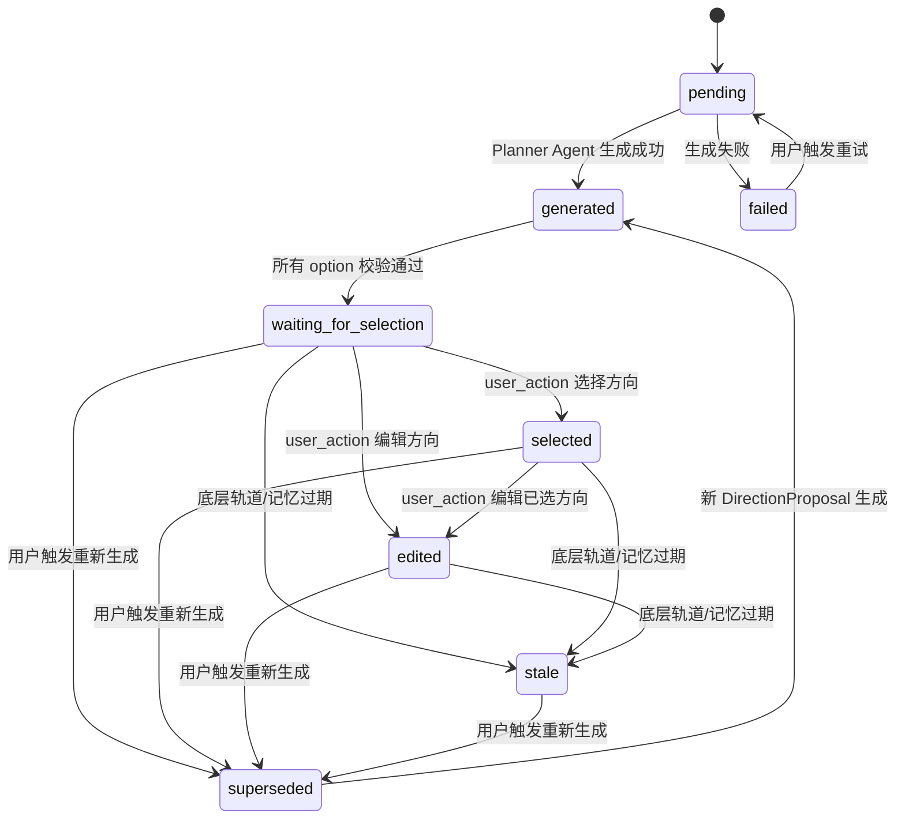
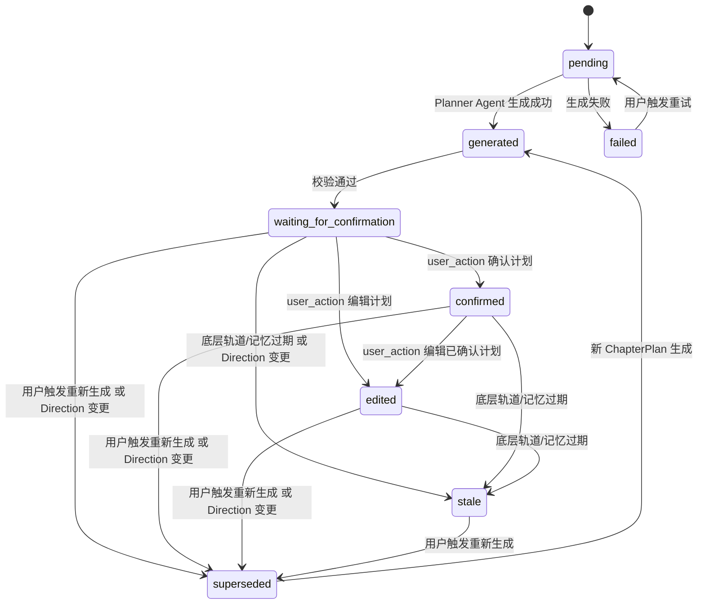
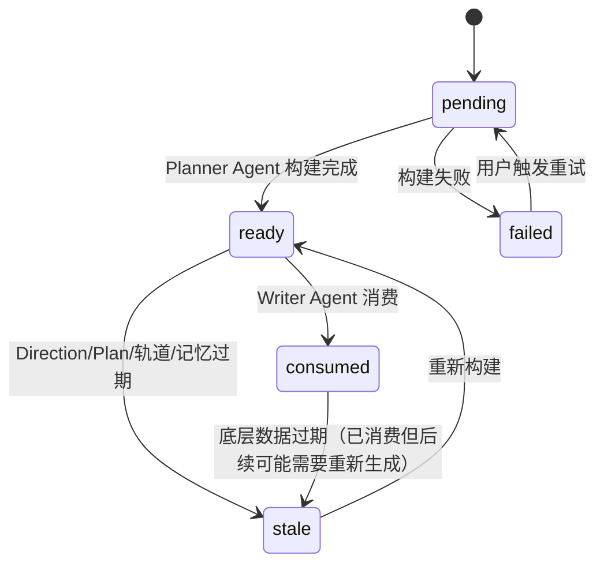
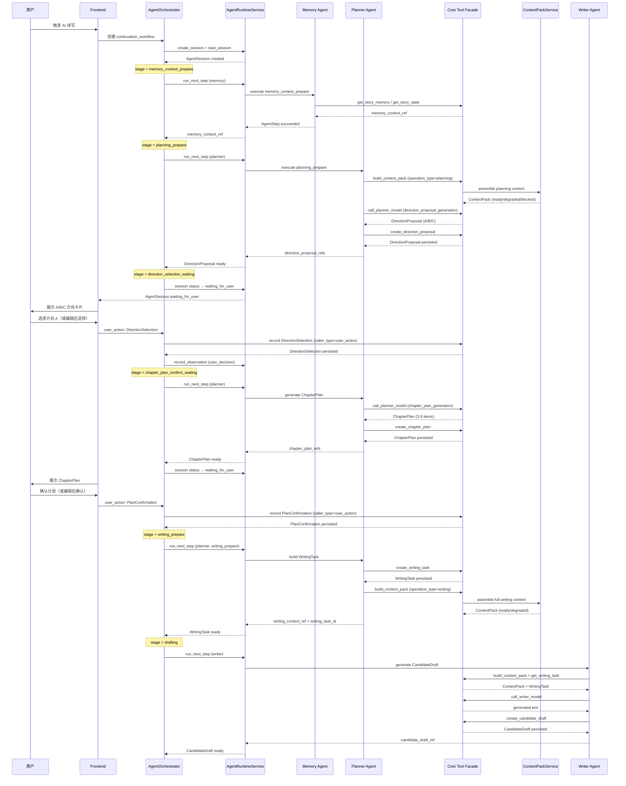
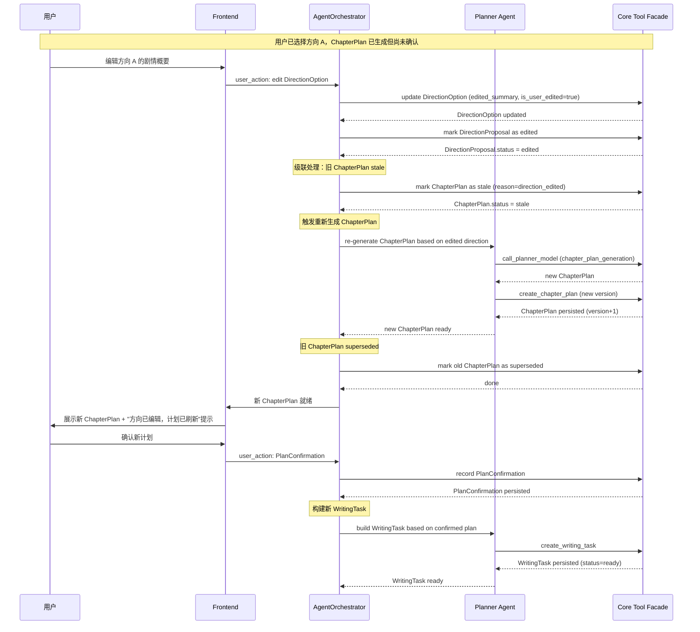
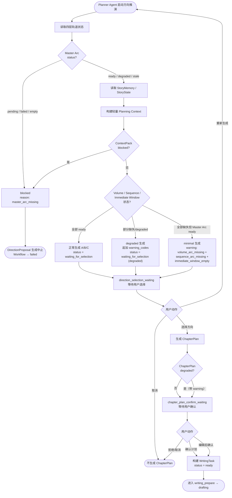

# InkTrace V2.0-P1-05 方向推演与章节计划详细设计

版本：v1.1 / P1 模块级详细设计候选冻结版
状态：候选冻结
所属阶段：InkTrace V2.0 P1
设计范围：方向推演（Direction Proposal A/B/C）、方向选择（DirectionSelection）、章节计划（ChapterPlan）、计划确认（PlanConfirmation）、写作任务（WritingTask）的完整数据模型、状态机、生成规则、用户确认门、与四层剧情轨道的关系、与五 Agent 的关系、与 AgentWorkflow 的衔接、与 ContextPack / CandidateDraft 的关系

合并说明：本文档以正式名 `.md` v1.0 为主版本（与 P1 总纲一致的完整字段定义、状态机、子结构、类图/时序图、安全边界），吸收 `_001.md` 中的 P0 连续性说明、简洁总流程、Workflow 阶段规则表、错误处理细化、以及补充待确认点。`_001.md` 已被完全吸收，不再单独维护。

字段映射说明：`_001.md` 中的 `option_code` / `direction_summary` / `major_risks` / `impact_chapters` / `estimated_words` / `confirmation_mode` / `selection_mode` 分别对应本文档的 `label` / `plot_summary` / `risk_points` / `chapter_preview` / `estimated_word_count` / `confirmation_type` / `selection_type`。`_001.md` 的 `title` / `narrative_benefits` / `confidence` / `editable` 作为展示字段或衍生字段吸收进 DirectionOption。

依据文档：

- `docs/01_requirements/InkTrace-V2.0-需求规格说明书.md`
- `docs/07_overview/InkTrace-V2.0-概要设计说明书.md`
- `docs/02_architecture/InkTrace-V2.0-架构设计说明书.md`
- `docs/03_design/InkTrace-V2.0-P1-详细设计总纲.md`
- `docs/03_design/InkTrace-V2.0-P1-01-AgentRuntime详细设计.md`
- `docs/03_design/InkTrace-V2.0-P1-02-AgentWorkflow详细设计.md`
- `docs/03_design/InkTrace-V2.0-P1-03-五Agent职责与编排详细设计.md`
- `docs/03_design/InkTrace-V2.0-P1-04-四层剧情轨道详细设计.md`
- `docs/03_design/InkTrace-V2.0-P1-UI-界面与交互设计.md`
- `docs/03_design/InkTrace-DESIGN.md`
- `docs/03_design/V2/InkTrace-V2.0-P0-06-ContextPack详细设计.md`
- `docs/03_design/V2/InkTrace-V2.0-P0-09-CandidateDraft与HumanReviewGate详细设计.md`
- `docs/03_design/V2/InkTrace-V2.0-P0-11-API与集成边界详细设计.md`

说明：本文档只冻结 P1 方向推演与章节计划能力。不写代码，不生成开发计划，不拆开发任务，不处理 Git。P0 详细设计正式路径为 `docs/03_design/V2/InkTrace-V2.0-P0-...`，不视为错误路径。

---

## 一、文档定位与设计范围

### 1.1 文档定位

本文档是 InkTrace V2.0-P1 的第五个模块级详细设计文档，仅覆盖 P1 方向推演与章节计划系统。

P1-05 的目标是冻结从"四层剧情轨道就绪 → Planner Agent 生成 A/B/C 方向 → 用户选择/编辑方向（DirectionSelection）→ Planner Agent 生成章节计划 → 用户确认/编辑计划（PlanConfirmation）→ Planner Agent 构建 WritingTask → Writer Agent 可启动"的完整链路中的数据模型、状态机、生成规则、用户确认门、以及与上下游模块的边界关系。

本文档是 P1-06（多轮 CandidateDraft 迭代）和 P1-11（API/前端集成边界）的前置输入基线。

### 1.2 设计范围

本模块覆盖：

- DirectionProposal 数据模型（含 A/B/C 三个 DirectionOption）。
- DirectionOption 的结构、评分维度、轨道引用、展示字段。
- DirectionSelection 用户确认门模型与规则。
- ChapterPlan 数据模型（含 ChapterPlanItem / ChapterBeat）。
- PlanConfirmation 用户确认门模型与规则（含 reject 语义）。
- WritingTask 数据模型（P1 增强版，基于已确认的 Direction + ChapterPlan）。
- DirectionPlanSnapshot（方向与计划联合快照，用于可追溯性）。
- DirectionPlanRef / safe_ref 安全引用体系。
- DirectionProposal 状态机（pending → generated → waiting_for_selection → selected → edited → stale → superseded → failed）。
- ChapterPlan 状态机（pending → generated → waiting_for_confirmation → confirmed → edited → stale → superseded → failed）。
- WritingTask 状态机（pending → ready → stale → consumed → failed）。
- 与四层剧情轨道的关系（Master / Volume / Sequence / Immediate Window）。
- 与五 Agent 的关系（Planner / Memory / Writer / Reviewer / Rewriter）。
- 与 AgentWorkflow 的衔接（WorkflowStage 中的 planning_prepare / direction_selection_waiting / chapter_plan_confirm_waiting / writing_prepare）。
- 与 ContextPack / WritingTask / Writer Agent 的关系。
- 与 CandidateDraft / HumanReviewGate 的边界。
- 与 P0 MinimalContinuationWorkflow 的连续性。
- Direction / Plan 变更后对下游产物的影响规则。
- 错误处理与降级规则。
- 安全边界与禁止事项。

### 1.3 不覆盖范围

P1-05 不覆盖：

- AgentRuntime 状态机与 PPAO 循环（属于 P1-01）。
- AgentWorkflow Stage / Transition / Decision 完整设计（属于 P1-02）。
- 五 Agent 的完整职责与 Tool 权限表（属于 P1-03）。
- 四层剧情轨道完整数据模型与构建策略（属于 P1-04）。
- CandidateDraftVersion 版本链数据结构（属于 P1-06）。
- AI Suggestion 类型系统（属于 P1-07）。
- Conflict Guard 完整规则矩阵（属于 P1-08）。
- StoryMemory Revision 数据结构（属于 P1-09）。
- Agent Trace 完整字段（属于 P1-10）。
- API 路由 / DTO / 前端集成细节（属于 P1-11）。
- Direction Proposal 生成算法细节（打分函数、搜索策略、模型 prompt chain）。
- ChapterPlan 完整 DSL 或执行引擎。
- P2 自动连续续写队列。
- P2 多章无人化生成。
- 正文 token streaming。
- AI 自动 apply / 自动写正式正文。
- 复杂可视化剧情轨道编辑器（属于 P2）。

### 1.4 与 P1 总纲的关系

P1 总纲 §7 已冻结以下方向推演与章节计划相关结论，P1-05 必须直接继承：

1. Direction Proposal A/B/C 是沙盒推演，用户不确认则不产生 CandidateDraft。
2. DirectionSelection 是独立用户确认门，不等于 HumanReviewGate。
3. PlanConfirmation 是独立用户确认门，不等于 HumanReviewGate。
4. 用户必须选择或编辑确认方向后，才能进入 ChapterPlan 生成。
5. 用户确认 ChapterPlan 后，才允许构建 WritingTask 并进入 Writer Agent。
6. 未确认方向前，Writer Agent 不可启动。
7. 未确认 ChapterPlan 前，Writer Agent 不可启动。
8. Direction Proposal 必须引用四层剧情轨道依据。
9. ChapterPlan 必须受 Master / Volume / Sequence / Immediate Window 约束。
10. Direction / Plan 只影响候选生成链路，不直接写正式正文。
11. Direction / Plan 不能绕过 CandidateDraft / HumanReviewGate。
12. Planner Agent 可以生成 Direction Proposal，但不能自动选择方向。
13. Planner Agent 可以生成 ChapterPlan，但不能自动确认计划。
14. 用户编辑方向后，旧 ChapterPlan stale / superseded。
15. 用户编辑 ChapterPlan 后，旧 WritingTask stale / superseded。

### 1.5 与 P1-02 AgentWorkflow 的关系

P1-02 已冻结以下 WorkflowStage 与 P1-05 直接相关：

| WorkflowStage | P1-05 对应产出 | P1-05 负责冻结 |
|---|---|---|
| `planning_prepare` | DirectionProposal 生成 | DirectionProposal 的生成规则、数据模型、状态 |
| `direction_selection_waiting` | DirectionSelection | DirectionSelection 模型、用户动作、确认规则 |
| `chapter_plan_confirm_waiting` | ChapterPlan + PlanConfirmation | ChapterPlan 生成规则、数据模型、PlanConfirmation 模型 |
| `writing_prepare` | WritingTask | WritingTask 的构建规则、数据模型、与 ChapterPlan 的关系 |

P1-05 不重复定义 WorkflowStage 的进入/退出条件（属于 P1-02），但必须确保 DirectionProposal / ChapterPlan / WritingTask 的状态机与 WorkflowStage 的流转条件对齐。

---

## 二、核心概念与总体流程

### 2.1 核心概念定义

| 概念 | 定义 | 产生者 | 确认者 |
|---|---|---|---|
| **DirectionProposal** | 一次方向推演的完整结果容器，包含 A/B/C 三个 DirectionOption | Planner Agent | —（容器本身不确认） |
| **DirectionOption** | 单个剧情方向（A / B / C 之一），含剧情概要、冲突、伏笔、风险、预估章节 | Planner Agent | — |
| **DirectionSelection** | 用户从 A/B/C 中选择一个方向（或编辑后选择）的确认记录 | — | user_action |
| **ChapterPlan** | 基于已选方向生成的后续 3-5 章章节计划，由多个 ChapterPlanItem 组成 | Planner Agent | —（容器本身不确认） |
| **ChapterPlanItem** | 章节计划中的单个章节条目，含章节目标、关键事件、冲突推进、伏笔安排、禁止事项 | Planner Agent | — |
| **PlanConfirmation** | 用户确认（或编辑后确认）ChapterPlan 的确认记录。支持 reject | — | user_action |
| **WritingTask** | 基于已确认 ChapterPlan 构建的当前章节写作任务，是 Writer Agent 的直接输入之一 | Planner Agent | —（跟随 PlanConfirmation 自动 ready） |
| **DirectionPlanSnapshot** | Direction + Plan + Selection + Confirmation 的联合不可变快照，用于可追溯性 | 系统 | — |
| **DirectionPlanRef** | 安全引用，用于 Direction / Plan / WritingTask 之间的数据交接 | 系统 | — |

### 2.2 核心结论（冻结）

1. Planner Agent 可以生成 Direction Proposal，但不能自动选择方向。
2. DirectionSelection 是独立用户确认门，不等于 HumanReviewGate。
3. 用户必须先选择或编辑确认方向，才能进入 ChapterPlan 生成。
4. Planner Agent 可以生成 ChapterPlan，但不能自动确认计划。
5. PlanConfirmation 是独立用户确认门，不等于 HumanReviewGate。
6. 用户确认 ChapterPlan 后，才允许构建 WritingTask 并进入 Writer Agent。
7. 未确认方向前，Writer Agent 不可启动。
8. 未确认 ChapterPlan 前，Writer Agent 不可启动。
9. Direction Proposal 必须引用四层剧情轨道依据。
10. ChapterPlan 必须受 Master / Volume / Sequence / Immediate Window 约束。
11. Direction / Plan 只影响候选生成链路，不直接写正式正文。
12. Direction / Plan 不能绕过 CandidateDraft / HumanReviewGate。

### 2.3 总体流程

```text
planning_request
  → DirectionProposal（Planner Agent 生成 A/B/C）
  → DirectionSelection（user_action：选择或编辑方向）
  → ChapterPlan（Planner Agent 基于已选方向生成 3-5 章计划）
  → PlanConfirmation（user_action：确认、编辑后确认、或拒绝计划）
  → WritingTask（ready，Planner Agent 自动构建）
  → writing_prepare → drafting（Writer Agent 启动）
```

### 2.4 核心原则

1. **Planner Agent 可以生成，不能选择/确认**：DirectionProposal 和 ChapterPlan 的生成是 Planner Agent 的职责，但选择方向（DirectionSelection）和确认计划（PlanConfirmation）必须是 user_action。
2. **沙盒推演，不产生副作用**：用户未确认前，DirectionProposal / ChapterPlan 不产生 CandidateDraft、不更新 StoryMemory、不更新 StoryState、不影响正式章节计划。
3. **方向约束计划，计划约束写作**：DirectionSelection → ChapterPlan → WritingTask → Writer Agent 是单向约束链，下游只能在上游确认后才启动。
4. **独立确认门，不与 HumanReviewGate 混同**：DirectionSelection 和 PlanConfirmation 是两个独立的用户确认门，与 HumanReviewGate（管 CandidateDraft accept/apply）完全分离。
5. **轨道是方向的基础**：DirectionProposal 生成时必须读取四层剧情轨道，DirectionOption 必须记录 base_arc_refs。
6. **安全引用，不透传完整正文**：Direction / Plan / WritingTask 之间的数据交接使用 safe_ref / result_ref，不内联完整正文。
7. **变更级联，下游 stale**：Direction 变更 → ChapterPlan stale → WritingTask stale；ChapterPlan 变更 → WritingTask stale。

### 2.5 与 P0 的连续性

1. P0 仍保留 MinimalContinuationWorkflow 兼容路径。
2. P1 规划链路是 P0 写作链路的上游增强，不推翻 P0 HumanReviewGate。
3. P1 仍遵守 P0 caller_type 与 user_action 边界。
4. P1-05 的 WritingTask 是 P0 WritingTask 的增强版——P1 版本额外包含已确认 Direction 和 ChapterPlan 的引用。P0 兼容路径保留 P0 WritingTask。

---

## 三、Direction Proposal 详细设计

### 3.1 DirectionProposal 数据模型

DirectionProposal 是一次方向推演的完整结果容器，包含 A/B/C 三个 DirectionOption 和生成元数据。

| 字段 | 类型 | 必填 | 说明 |
|---|---|---|---|
| `direction_proposal_id` | string | 是 | 唯一标识，如 `dp_{work_id}_{seq}` |
| `work_id` | string | 是 | 所属作品 ID |
| `chapter_id` | string | 是 | 触发方向推演时的当前章节 ID |
| `chapter_order` | int | 否 | 触发时的当前章节序号 |
| `agent_session_id` | string | 是 | 关联的 AgentSession ID |
| `source_context_pack_id` | string | 是 | 生成时使用的 ContextPack ID（轻量 Planning Context） |
| `source_arc_refs` | ArcRef[] | 是 | 生成时引用的四层轨道快照引用 |
| `source_memory_refs` | string[] | 是 | 生成时引用的 StoryMemory / StoryState 引用 |
| `status` | DirectionPlanStatus | 是 | 容器状态 |
| `version` | int | 是 | 版本号（每次重新生成 +1） |
| `options` | DirectionOption[] | 是 | A/B/C 方向列表（至少 1 个，默认 3 个） |
| `generation_metadata` | object | 是 | 生成元数据：model、prompt_key、prompt_version、token_usage、elapsed_ms |
| `created_by` | string | 是 | 生成者：planner_agent |
| `selected_by` | string | 否 | 选择者：user_action（选择后填写） |
| `selected_option_id` | string | 否 | 被选中的 DirectionOption ID |
| `edited_by` | string | 否 | 编辑者：user_action（编辑后填写） |
| `stale_status` | string | 是 | fresh / stale |
| `stale_reason` | string | 否 | stale 原因 |
| `warning_codes` | string[] | 否 | 降级或风险码 |
| `created_at` | string | 是 | 创建时间 |
| `updated_at` | string | 是 | 更新时间 |
| `request_id` | string | 否 | 请求追溯 ID |
| `trace_id` | string | 否 | 全链路追踪 ID |

### 3.2 DirectionOption 数据模型

每个 DirectionOption 代表一个具体的剧情方向（A / B / C 之一）。

| 字段 | 类型 | 必填 | 说明 |
|---|---|---|---|
| `option_id` | string | 是 | 唯一标识，如 `do_{proposal_id}_a` |
| `direction_proposal_id` | string | 是 | 所属 DirectionProposal ID |
| `label` | string | 是 | 标签（A / B / C） |
| `title` | string | 否 | 方向标题（展示用），max 100 字符 |
| `plot_summary` | string | 是 | 剧情概要（方向摘要），max 800 字符 |
| `narrative_premise` | string | 是 | 叙事前提（一句话核心创意），max 200 字符 |
| `narrative_benefits` | string[] | 否 | 叙事收益列表（选择此方向对故事的增益） |
| `main_conflicts` | ConflictItem[] | 是 | 主要冲突列表 |
| `foreshadow_usage` | ForeshadowUsageItem[] | 是 | 伏笔使用计划 |
| `risk_points` | RiskItem[] | 是 | 风险点列表 |
| `estimated_chapters` | int | 是 | 预估影响章节数（3-5） |
| `chapter_preview` | string[] | 是 | 未来 3-5 章的一句话预告 |
| `base_arc_refs` | ArcRef[] | 是 | 引用的四层轨道摘要（必含 Master Arc 引用） |
| `base_memory_refs` | string[] | 否 | 引用的记忆引用 |
| `score` | DirectionScore | 是 | 综合评分 |
| `confidence` | number | 否 | 可选置信度（0.0-1.0），表示 Planner Agent 对此方向的信心 |
| `tone_direction` | string | 否 | 基调方向描述，max 100 字符 |
| `key_characters_involved` | string[] | 否 | 涉及的关键角色 |
| `edited_summary` | string | 否 | 用户编辑后的剧情概要（如用户编辑过） |
| `is_user_edited` | bool | 是 | 是否被用户编辑过 |
| `editable` | bool | 是 | 是否允许用户编辑（默认 true） |
| `created_at` | string | 是 | 创建时间 |

**字段映射说明**：`_001.md` 使用的 `option_code`、`direction_summary`、`major_risks`、`impact_chapters` 分别对应本文档的 `label`、`plot_summary`、`risk_points`、`chapter_preview`。`narrative_benefits` 在本文档中作为 `narrative_gain`（单字段）的数组替代——当需要逐条展示收益时使用 `narrative_benefits`，当只需一句话摘要时使用 `narrative_premise`。

### 3.3 子结构

**ConflictItem**：

| 字段 | 类型 | 必填 | 说明 |
|---|---|---|---|
| `conflict_name` | string | 是 | 冲突名称，max 100 字符 |
| `conflict_description` | string | 是 | 冲突描述，max 300 字符 |
| `conflict_type` | string | 是 | 冲突类型：internal / external / relationship / environmental |
| `intensity` | string | 否 | 冲突强度：low / medium / high |

**ForeshadowUsageItem**：

| 字段 | 类型 | 必填 | 说明 |
|---|---|---|---|
| `foreshadow_id` | string | 否 | 伏笔 ID（如为已有伏笔） |
| `foreshadow_description` | string | 是 | 伏笔描述，max 200 字符 |
| `usage_plan` | string | 是 | 在本方向中如何使用/推进此伏笔，max 200 字符 |
| `is_new` | bool | 是 | 是否为新建议伏笔 |

**RiskItem**：

| 字段 | 类型 | 必填 | 说明 |
|---|---|---|---|
| `risk_description` | string | 是 | 风险描述，max 200 字符 |
| `risk_severity` | string | 是 | 风险严重度：low / medium / high |
| `mitigation` | string | 否 | 缓解建议，max 200 字符 |

**ArcRef**（四层轨道引用）：

| 字段 | 类型 | 必填 | 说明 |
|---|---|---|---|
| `arc_type` | string | 是 | master / volume / sequence / immediate_window |
| `arc_id` | string | 是 | 轨道 ID |
| `arc_summary` | string | 是 | 轨道摘要（1-2 句），max 200 字符 |
| `arc_status_at_generation` | string | 是 | 生成时该轨道的 ArcStatus |

**DirectionScore**：

| 字段 | 类型 | 必填 | 说明 |
|---|---|---|---|
| `total_score` | int | 是 | 综合评分（0-100） |
| `consistency_score` | int | 是 | 主线一致性（0-100） |
| `conflict_density_score` | int | 是 | 冲突密度（0-100） |
| `satisfaction_rhythm_score` | int | 是 | 爽点节奏（0-100） |
| `foreshadow_progress_score` | int | 是 | 伏笔推进（0-100） |
| `risk_controllability_score` | int | 是 | 风险可控性（0-100） |
| `score_rationale` | string | 否 | 评分理由摘要，max 300 字符 |

### 3.4 DirectionOption 数量规则

1. Planner Agent 默认生成 3 个方向（A / B / C）。
2. 如果 Planner Agent 只成功生成 1 个或 2 个方向：
   - DirectionProposal.status 保持 `waiting_for_selection`，但标记为 degraded 条件（通过 `warning_codes` 追加 `direction_count_degraded` 表达）。
   - 仍可进入 direction_selection_waiting，用户可在可用方向中选择。
3. 如果 Planner Agent 无法生成任何方向：
   - DirectionProposal.status = `failed`。
   - 不进入 direction_selection_waiting。
   - Workflow 按 P1-02 failed 规则处理。
4. P1 不强制必须 3 个方向，但 3 个是默认目标。

### 3.5 DirectionProposal 生成规则

**前置条件**（全部满足才可生成）：

1. 四层剧情轨道中 Master Arc 必须 status ∈ { ready, degraded }（Master Arc pending / failed / empty → blocked，不可生成 DirectionProposal）。
2. work_id 和 chapter_id 有效。
3. AgentSession 状态为 running 且当前 stage 为 planning_prepare。
4. Memory Agent 已完成 memory_context_prepare（提供了 memory_context_ref）。
5. ContextPack（轻量 Planning Context）已构建。

**生成流程**：

1. Planner Agent 通过 ToolFacade 调用 `build_context_pack`（operation_type = planning）获取轻量 Planning Context。
2. Planner Agent 通过 ToolFacade 读取四层轨道摘要、StoryMemory、StoryState。
3. Planner Agent 通过 ToolFacade 调用 `call_planner_model`（prompt_key = `direction_proposal_generation`），传入 Planning Context + 四层轨道约束。
4. 模型输出经 Output Validator 校验（schema = `direction_proposal_output`）。
5. 校验通过后，通过 ToolFacade 调用 `create_direction_proposal` 持久化 DirectionProposal。
6. Workflow 进入 direction_selection_waiting。

**生成约束**：

1. 每个方向必须给出 `base_arc_refs`，至少包含 Master Arc。
2. 每个方向必须给出评分（DirectionScore）和风险点（risk_points）。
3. 不允许 Planner Agent 自动把某方向直接置为 selected。

**降级规则**：

- Volume Arc / Sequence Arc / Immediate Window 缺失 → degraded 生成，DirectionProposal.warning_codes 追加对应 warning。
- Master Arc degraded（如从正文推断）→ degraded 生成，追加 `master_arc_inferred_without_outline`。
- ContextPack degraded → degraded 生成，追加 `context_pack_degraded`。
- 只生成 1-2 个方向 → 降级生成，`warning_codes` 追加 `direction_count_degraded`（status 保持 `waiting_for_selection`，UI 据此展示 degraded 视觉提示）。

### 3.6 持久化策略

1. DirectionProposal 持久化轻量结构（摘要 + 引用 + 状态），不存完整 Prompt。
2. source_context_pack_id / source_arc_refs / source_memory_refs 必须可追溯。
3. 日志只记 safe_ref，不记完整 Prompt / 完整 ContextPack。

---

## 四、Direction Selection 用户确认门

### 4.1 DirectionSelection 数据模型

DirectionSelection 是用户从 A/B/C 方向中选择（或编辑后选择）一个方向的确认记录。

| 字段 | 类型 | 必填 | 说明 |
|---|---|---|---|
| `selection_id` | string | 是 | 唯一标识，如 `ds_{proposal_id}` |
| `direction_proposal_id` | string | 是 | 关联的 DirectionProposal ID |
| `selected_option_id` | string | 是 | 被选中的 DirectionOption ID |
| `work_id` | string | 是 | 所属作品 ID |
| `chapter_id` | string | 是 | 触发时的当前章节 ID |
| `agent_session_id` | string | 是 | 关联的 AgentSession ID |
| `selection_type` | enum | 是 | 选择类型：direct_select / edited_select |
| `edited_fields` | string[] | 否 | 用户编辑的字段列表（如 plot_summary, risk_points） |
| `edited_values` | object | 否 | 编辑后的值（仅保存被修改字段） |
| `user_id` | string | 是 | 执行选择的用户标识 |
| `confirmed_by` | string | 是 | user_action |
| `warning_codes` | string[] | 否 | 选择时的告警 |
| `created_at` | string | 是 | 选择时间 |
| `request_id` | string | 否 | 请求追溯 ID |
| `trace_id` | string | 否 | 全链路追踪 ID |

### 4.2 DirectionSelection 规则

1. **DirectionSelection 是独立用户确认门**，不等于 HumanReviewGate。
2. **只能由 user_action 触发**：Agent（包括 Planner Agent、AgentOrchestrator）不得自动选择方向。
3. **选择时机**：DirectionProposal.status = `waiting_for_selection` 时，用户才能执行选择。
4. **选择动作**：
   - 用户点击 A/B/C 之一的 [选择] 按钮 → `selection_type = direct_select`。
   - 用户编辑某个方向的摘要/内容后确认 → `selection_type = edited_select`，`edited_fields` 记录被编辑的字段。
5. **选择后**：
   - DirectionProposal.status → `selected`（或 `edited`）。
   - DirectionProposal.selected_option_id 更新。
   - Workflow 从 direction_selection_waiting → chapter_plan_confirm_waiting。
   - Planner Agent 开始生成 ChapterPlan。
6. **用户取消**：
   - 不选择任何方向 → DirectionProposal 保持 `waiting_for_selection`。
   - 用户主动取消 → Workflow 根据 workflow_type 决定后续（planning_workflow → completed；continuation_workflow → partial_success 或 cancelled）。
7. **用户重新生成**：
   - 用户点击 [重新生成方向] → 当前 DirectionProposal.status → `superseded`。
   - 系统创建新的 DirectionProposal（version + 1），Planner Agent 重新生成。
8. **禁止行为**：
   - UI 不提供"自动选择"按钮。
   - Agent 不能调用 DirectionSelection 的确认接口。
   - DirectionSelection 不能伪造 user_action。

### 4.3 编辑后的影响

1. 用户编辑 DirectionOption 后，DirectionProposal.status 置 `edited`。
2. 当前 ChapterPlan（若已存在）必须置 `stale` 或 `superseded`。
3. 必须重新生成 ChapterPlan 并重新走 PlanConfirmation。
4. 编辑前的旧方向不删除，保留为历史记录。

### 4.4 DirectionSelection 与 HumanReviewGate 的区别

| 维度 | DirectionSelection | HumanReviewGate |
|---|---|---|
| 确认对象 | DirectionOption（剧情方向） | CandidateDraft（候选稿正文） |
| 触发阶段 | direction_selection_waiting | human_review_waiting |
| 确认动作 | 选择 A/B/C 或编辑后选择 | accept / reject / apply |
| 下游影响 | 触发 ChapterPlan 生成 | 决定正文是否进入章节草稿区 |
| 数据表 | direction_selections | candidate_draft_decisions |
| 审计日志 | DirectionSelectionAuditLog | CandidateDraftAuditLog |

---

## 五、ChapterPlan 详细设计

### 5.1 ChapterPlan 数据模型

ChapterPlan 是基于已选方向生成的后续 3-5 章章节计划。

| 字段 | 类型 | 必填 | 说明 |
|---|---|---|---|
| `chapter_plan_id` | string | 是 | 唯一标识，如 `cp_{work_id}_{seq}` |
| `work_id` | string | 是 | 所属作品 ID |
| `chapter_id` | string | 是 | 触发时的当前章节 ID |
| `direction_proposal_id` | string | 是 | 关联的 DirectionProposal ID |
| `selected_option_id` | string | 是 | 关联的已选 DirectionOption ID |
| `selection_id` | string | 是 | 关联的 DirectionSelection ID |
| `agent_session_id` | string | 是 | 关联的 AgentSession ID |
| `source_context_pack_id` | string | 是 | 生成时使用的 ContextPack ID |
| `source_arc_refs` | ArcRef[] | 是 | 生成时引用的四层轨道快照 |
| `source_memory_refs` | string[] | 是 | 生成时引用的 StoryMemory / StoryState 引用 |
| `status` | DirectionPlanStatus | 是 | 计划状态 |
| `version` | int | 是 | 版本号 |
| `plan_items` | ChapterPlanItem[] | 是 | 章节计划条目列表（3-5 个） |
| `plan_summary` | string | 否 | 计划整体摘要，max 300 字符 |
| `constraints` | string[] | 否 | 计划整体约束 |
| `total_estimated_chapters` | int | 是 | 计划覆盖的总章节数 |
| `total_estimated_words` | int | 否 | 预估总字数 |
| `generation_metadata` | object | 是 | 生成元数据 |
| `created_by` | string | 是 | 生成者：planner_agent |
| `confirmed_by` | string | 否 | 确认者：user_action（确认后填写） |
| `edited_by` | string | 否 | 编辑者：user_action（编辑后填写） |
| `stale_status` | string | 是 | fresh / stale |
| `stale_reason` | string | 否 | stale 原因 |
| `warning_codes` | string[] | 否 | 降级或风险码 |
| `created_at` | string | 是 | 创建时间 |
| `updated_at` | string | 是 | 更新时间 |
| `request_id` | string | 否 | 请求追溯 ID |
| `trace_id` | string | 否 | 全链路追踪 ID |

### 5.2 ChapterPlanItem 数据模型

每个 ChapterPlanItem 代表计划中的一个章节。

| 字段 | 类型 | 必填 | 说明 |
|---|---|---|---|
| `item_id` | string | 是 | 唯一标识，如 `cpi_{plan_id}_{order}` |
| `chapter_plan_id` | string | 是 | 所属 ChapterPlan ID |
| `plan_order` | int | 是 | 计划中的章节序号（1, 2, 3...） |
| `chapter_goal` | string | 是 | 本章目标（本章要达成的叙事目的），max 300 字符 |
| `key_events` | ChapterBeat[] | 是 | 关键事件/节拍列表 |
| `conflict_progression` | string | 是 | 冲突推进描述，max 300 字符 |
| `foreshadow_arrangement` | ForeshadowArrangementItem[] | 是 | 伏笔安排 |
| `forbidden_items` | string[] | 是 | 本章禁止出现的叙事元素 |
| `required_beats` | string[] | 否 | 必须出现的节拍 |
| `estimated_word_count` | int | 否 | 预估字数下限 |
| `estimated_word_count_max` | int | 否 | 预估字数上限 |
| `tone_hint` | string | 否 | 基调提示，max 100 字符 |
| `pov_hint` | string | 否 | 视角提示，max 100 字符 |
| `arc_alignment` | ArcRef[] | 是 | 本章对齐的轨道约束（Sequence Arc key_events 对应、Volume Arc 约束） |
| `source_sequence_event_refs` | string[] | 否 | 关联的 Sequence Arc key_events 引用 |
| `writing_task_id` | string | 否 | 关联的 WritingTask ID（生成后回填） |
| `is_user_edited` | bool | 是 | 是否被用户编辑过 |
| `created_at` | string | 是 | 创建时间 |

### 5.3 子结构

**ChapterBeat**：

| 字段 | 类型 | 必填 | 说明 |
|---|---|---|---|
| `beat_order` | int | 是 | 节拍序号 |
| `beat_name` | string | 是 | 节拍名称，max 100 字符 |
| `beat_description` | string | 是 | 节拍描述，max 300 字符 |
| `beat_type` | string | 是 | setup / development / confrontation / climax / resolution / twist / cliffhanger |
| `emotional_tone` | string | 否 | 情绪基调，max 50 字符 |
| `involved_characters` | string[] | 否 | 涉及角色 |

**ForeshadowArrangementItem**：

| 字段 | 类型 | 必填 | 说明 |
|---|---|---|---|
| `foreshadow_id` | string | 否 | 伏笔 ID |
| `foreshadow_description` | string | 是 | 伏笔描述，max 200 字符 |
| `arrangement` | string | 是 | 在本章中的安排：plant / advance / hint / reveal / resolve，max 100 字符 |
| `arrangement_detail` | string | 否 | 具体安排描述，max 200 字符 |

### 5.4 ChapterPlan 生成规则

**前置条件**（全部满足才可生成）：

1. DirectionSelection 已完成（DirectionProposal.status ∈ { selected, edited }）。
2. Master Arc 状态 ∈ { ready, degraded }。
3. 已选 DirectionOption 的 base_arc_refs 可读取。
4. AgentSession 当前 stage 为 chapter_plan_confirm_waiting（即 direction_selection_waiting 已完成）。

**生成流程**：

1. Planner Agent 读取已选 DirectionOption 的完整内容。
2. Planner Agent 读取四层轨道当前状态（构建 Planning Context）。
3. Planner Agent 通过 ToolFacade 调用 `call_planner_model`（prompt_key = `chapter_plan_generation`）。
4. 模型输出经 Output Validator 校验（schema = `chapter_plan_output`）。
5. 校验通过后，通过 ToolFacade 调用 `create_chapter_plan` 持久化。
6. Workflow 保持 chapter_plan_confirm_waiting，等待 PlanConfirmation。

**约束规则**：

1. ChapterPlan 的每个 ChapterPlanItem 的 `chapter_goal` 必须在 Sequence Arc 的 `sequence_goal` 范围内。
2. `key_events` 必须与 Sequence Arc 的 `key_events` 对齐。
3. `forbidden_items` 必须包含 Volume Arc 和 Sequence Arc 的 `forbidden_items`（逐层累加）。
4. `foreshadow_arrangement` 必须与 Volume Arc 的 `foreshadow_planted` / `foreshadow_resolved` 对齐。
5. 每个 ChapterPlanItem 应显式关联对应的 Sequence Arc key_event（`source_sequence_event_refs`）。
6. ChapterPlan 不直接修改 Master Arc。
7. 必须输出"可执行章节推进"而非泛化抽象愿景。
8. 若方向被编辑，旧计划必须 stale/superseded，且生成新计划版本。

**降级规则**：

- Volume Arc / Sequence Arc 缺失或 degraded → ChapterPlan 可 degraded 生成，追加 warning_codes。
- Immediate Window 空 → ChapterPlan 可 degraded 生成，追加 `immediate_window_empty`。
- 生成 ChapterPlanItem 数量 < 3 → degraded，追加 `chapter_plan_partial`。

---

## 六、PlanConfirmation 用户确认门

### 6.1 PlanConfirmation 数据模型

PlanConfirmation 是用户确认（或编辑后确认，或拒绝）ChapterPlan 的确认记录。

| 字段 | 类型 | 必填 | 说明 |
|---|---|---|---|
| `confirmation_id` | string | 是 | 唯一标识，如 `pc_{plan_id}` |
| `chapter_plan_id` | string | 是 | 关联的 ChapterPlan ID |
| `direction_proposal_id` | string | 是 | 关联的 DirectionProposal ID |
| `work_id` | string | 是 | 所属作品 ID |
| `chapter_id` | string | 是 | 触发时的当前章节 ID |
| `agent_session_id` | string | 是 | 关联的 AgentSession ID |
| `confirmation_type` | enum | 是 | 确认类型：direct_confirm / edited_confirm / reject |
| `edited_items` | string[] | 否 | 被编辑的 ChapterPlanItem ID 列表 |
| `edited_fields` | object | 否 | 编辑后的字段值（按 item_id 分组） |
| `user_edit_notes` | string | 否 | 用户编辑说明 |
| `user_id` | string | 是 | 执行确认的用户标识 |
| `confirmed_by` | string | 是 | user_action |
| `warning_codes` | string[] | 否 | 确认时的告警 |
| `created_at` | string | 是 | 确认时间 |
| `request_id` | string | 否 | 请求追溯 ID |
| `trace_id` | string | 否 | 全链路追踪 ID |

### 6.2 PlanConfirmation 规则

1. **PlanConfirmation 是独立用户确认门**，不等于 HumanReviewGate。
2. **只能由 user_action 触发**：Agent（包括 Planner Agent、AgentOrchestrator）不得自动确认计划。
3. **确认时机**：ChapterPlan.status = `waiting_for_confirmation` 时，用户才能执行确认。
4. **确认动作**：
   - 用户点击 [确认计划] → `confirmation_type = direct_confirm`。
   - 用户编辑 ChapterPlan 内容后确认 → `confirmation_type = edited_confirm`。
   - 用户点击 [拒绝计划] → `confirmation_type = reject`。
5. **确认后**：
   - ChapterPlan.status → `confirmed`（或 `edited`）。
   - Planner Agent 自动构建 WritingTask。
   - Workflow 从 chapter_plan_confirm_waiting → writing_prepare。
6. **拒绝后**：
   - ChapterPlan.status 保持 `waiting_for_confirmation`（默认），或由用户选择回到"编辑计划"还是"重新方向选择"。
   - 用户可重新生成 ChapterPlan 或编辑当前计划后再次确认。
   - 不自动进入 Writer Agent。
7. **用户取消**：
   - 不确认计划 → ChapterPlan 保持 `waiting_for_confirmation`。
   - 用户主动取消 → Workflow 根据 workflow_type 决定后续。
8. **用户重新生成**：
   - 用户点击 [重新生成计划] → 当前 ChapterPlan.status → `superseded`。
   - Planner Agent 基于同一已选方向重新生成 ChapterPlan（version + 1）。
9. **禁止行为**：
   - UI 不提供"自动确认"按钮。
   - Agent 不能调用 PlanConfirmation 的确认接口。
   - PlanConfirmation 不能伪造 user_action。
   - Writer Agent 在计划未确认前不可启动。

### 6.3 编辑后的影响

1. 用户编辑计划后，ChapterPlan.status 置 `edited`。
2. 已生成的 WritingTask（若有）必须标记 `stale`。
3. 必须重构 WritingTask 并重新进入 writing_prepare。

### 6.4 PlanConfirmation 与 HumanReviewGate 的区别

| 维度 | PlanConfirmation | HumanReviewGate |
|---|---|---|
| 确认对象 | ChapterPlan（章节计划） | CandidateDraft（候选稿正文） |
| 触发阶段 | chapter_plan_confirm_waiting | human_review_waiting |
| 确认动作 | 确认/编辑后确认/拒绝计划 | accept / reject / apply |
| 下游影响 | 触发 WritingTask 构建 → Writer Agent | 决定正文是否进入章节草稿区 |
| 数据表 | plan_confirmations | candidate_draft_decisions |
| 审计日志 | PlanConfirmationAuditLog | CandidateDraftAuditLog |

---

## 七、WritingTask 详细设计

### 7.1 WritingTask 数据模型

WritingTask 是基于已确认 ChapterPlan 构建的当前章节写作任务。它是 Writer Agent 的直接输入之一。

P1-05 的 WritingTask 是对 P0 WritingTask 的增强——P1 版本额外包含已确认 Direction 和 ChapterPlan 的引用。

| 字段 | 类型 | 必填 | 说明 |
|---|---|---|---|
| `writing_task_id` | string | 是 | 唯一标识，如 `wt_{work_id}_{chapter_id}_{seq}` |
| `work_id` | string | 是 | 所属作品 ID |
| `chapter_id` | string | 是 | 目标章节 ID |
| `chapter_order` | int | 否 | 章节序号 |
| `direction_proposal_id` | string | 是 | 关联的 DirectionProposal ID |
| `selected_option_id` | string | 是 | 关联的已选 DirectionOption ID |
| `chapter_plan_id` | string | 是 | 关联的已确认 ChapterPlan ID |
| `plan_item_id` | string | 是 | 关联的当前章节 ChapterPlanItem ID |
| `agent_session_id` | string | 是 | 关联的 AgentSession ID |
| `source_context_pack_id` | string | 否 | 构建时使用的 ContextPack ID |
| `source_arc_refs` | string[] | 否 | 构建时引用的轨道引用 |
| `source_memory_refs` | string[] | 否 | 构建时引用的记忆引用 |
| `status` | WritingTaskStatus | 是 | 任务状态 |
| `version` | int | 是 | 版本号 |
| `writing_goal` | string | 是 | 写作目标（综合 Direction + ChapterPlan 的目标），max 500 字符 |
| `must_include` | string[] | 是 | 必须包含的内容列表 |
| `must_not_include` | string[] | 是 | 禁止包含的内容列表（从 forbidden_items 继承） |
| `task_constraints` | string[] | 否 | 额外写作约束 |
| `tone_guidance` | string | 否 | 情绪/基调指引，max 200 字符 |
| `target_word_count` | int | 否 | 目标字数（从 ChapterPlanItem.estimated_word_count 继承） |
| `target_word_count_max` | int | 否 | 目标字数上限 |
| `expected_output_shape` | string | 否 | 期望输出形态摘要 |
| `arc_constraints` | ArcRef[] | 是 | 本任务受约束的轨道摘要 |
| `foreshadow_requirements` | ForeshadowArrangementItem[] | 是 | 本任务中的伏笔要求（从 ChapterPlanItem 继承） |
| `required_beats` | string[] | 否 | 必须覆盖的节拍（从 ChapterPlanItem 继承） |
| `direction_summary` | string | 是 | 已选方向的摘要（safe_ref 格式，max 200 字符） |
| `plan_summary` | string | 是 | 章节计划的当前章摘要（safe_ref 格式，max 200 字符） |
| `stale_status` | string | 是 | fresh / stale |
| `stale_reason` | string | 否 | stale 原因 |
| `warning_codes` | string[] | 否 | 降级或风险码 |
| `generated_by` | string | 是 | 生成者：planner_agent |
| `consumed_by` | string | 否 | 消费者：writer_agent（Writer Agent 启动后填写） |
| `created_at` | string | 是 | 创建时间 |
| `updated_at` | string | 是 | 更新时间 |
| `request_id` | string | 否 | 请求追溯 ID |
| `trace_id` | string | 否 | 全链路追踪 ID |

### 7.2 WritingTaskStatus 枚举

| 状态 | 含义 | 触发条件 |
|---|---|---|
| `pending` | 等待构建 | ChapterPlan 已确认但 Planner Agent 尚未构建 WritingTask |
| `ready` | 就绪 | WritingTask 构建完成，可供 Writer Agent 使用 |
| `stale` | 已过期 | 底层 Direction / ChapterPlan / 轨道 / 记忆过期 |
| `consumed` | 已消费 | Writer Agent 已完成候选稿生成 |
| `failed` | 构建失败 | WritingTask 构建失败 |

### 7.3 WritingTask 规则

1. WritingTask 只能来自已确认 ChapterPlan。
2. WritingTask 是 Writer 输入之一，不等于 Prompt。
3. WritingTask 不保存完整正文，仅保存 safe_ref / 摘要 / 约束。
4. WritingTask consumed 后仍可追溯，不直接删除。
5. Direction / Plan 对 Writer 的输入采用 safe_ref + 结构化摘要。

### 7.4 WritingTask 构建规则

1. **构建时机**：PlanConfirmation 完成后，由 Planner Agent 自动构建。
2. **构建依据**：
   - 已确认 ChapterPlan 中当前章节的 ChapterPlanItem。
   - 已选 DirectionOption 的摘要和约束。
   - 当前四层轨道状态。
   - ContextPack（轻量 Writing Context）。
3. **构建后**：WritingTask.status = `ready`，Workflow 可从 writing_prepare → drafting。
4. **WritingTask 不包含**：完整正文、完整 ContextPack、完整 Prompt。

### 7.5 DirectionPlanSnapshot

DirectionPlanSnapshot 是 Direction + Plan + Selection + Confirmation 的联合不可变快照，用于确保可追溯性。

| 字段 | 类型 | 必填 | 说明 |
|---|---|---|---|
| `snapshot_id` | string | 是 | 唯一标识 |
| `work_id` | string | 是 | 所属作品 ID |
| `chapter_id` | string | 是 | 触发时的当前章节 ID |
| `agent_session_id` | string | 是 | 关联的 AgentSession ID |
| `direction_proposal_id` | string | 是 | DirectionProposal ID |
| `direction_proposal_version` | int | 是 | DirectionProposal 版本号 |
| `selected_option_id` | string | 是 | 被选中的 DirectionOption ID |
| `selection_id` | string | 是 | DirectionSelection ID |
| `chapter_plan_id` | string | 是 | ChapterPlan ID |
| `chapter_plan_version` | int | 是 | ChapterPlan 版本号 |
| `confirmation_id` | string | 是 | PlanConfirmation ID |
| `writing_task_id` | string | 否 | WritingTask ID |
| `snapshot_status` | enum | 是 | ready / degraded / blocked |
| `direction_summary` | string | 是 | 方向摘要（safe_ref），max 300 字符 |
| `plan_summary` | string | 是 | 计划摘要（safe_ref），max 300 字符 |
| `arc_refs_at_snapshot` | ArcRef[] | 是 | 快照时的四层轨道引用 |
| `warning_codes` | string[] | 否 | 告警 |
| `created_at` | string | 是 | 快照时间 |

用途：

- Writer Agent 生成 CandidateDraft 时，记录使用的 DirectionPlanSnapshot ID，确保可追溯。
- Reviewer Agent 审稿时，可对比当前轨道状态与快照时的轨道状态，检测偏离。
- Agent Trace 中引用此快照，用于审计。

### 7.6 DirectionPlanRef / safe_ref

| 字段 | 类型 | 必填 | 说明 |
|---|---|---|---|
| `ref_type` | string | 是 | 引用类型：direction_proposal / chapter_plan / writing_task |
| `ref_id` | string | 是 | 引用实体 ID |
| `ref_scope` | enum | 是 | work / chapter / session |
| `ref_summary` | string | 是 | 安全摘要（不得含完整正文） |
| `checksum` | string | 否 | 一致性校验 |
| `created_at` | string | 是 | 创建时间 |

---

## 八、状态机与生命周期

### 8.1 DirectionPlanStatus 统一枚举

DirectionProposal、DirectionOption、ChapterPlan、ChapterPlanItem 的部分状态共用此枚举：

| 状态 | 适用对象 | 含义 |
|---|---|---|
| `pending` | Proposal / Plan | 等待生成 |
| `generated` | Proposal / Plan | 已生成，等待下一步 |
| `waiting_for_selection` | Proposal | 等待用户选择方向 |
| `waiting_for_confirmation` | Plan | 等待用户确认计划 |
| `selected` | Proposal | 用户已选择方向 |
| `confirmed` | Plan | 用户已确认计划 |
| `edited` | Proposal / Plan | 用户已编辑 |
| `stale` | Proposal / Plan / Task | 底层数据过期 |
| `superseded` | Proposal / Plan | 被新版本替代 |
| `failed` | Proposal / Plan / Task | 生成/构建失败 |

**说明**：`degraded` 不作为 DirectionPlanStatus 主状态枚举值。文档中提到"degraded 生成"或"degraded 条件"时，实际语义为：对象的主状态保持在当前枚举值（如 `waiting_for_selection` / `waiting_for_confirmation`），同时通过 `warning_codes` 字段表达降级条件。UI 层可据此展示 degraded 视觉提示（橙色 ⚠），但数据层不新增 `degraded` 主状态。降级场景汇总见 §15.3。

### 8.2 DirectionProposal 状态机



### 8.3 状态说明

| 状态 | 含义 | 触发条件 |
|---|---|---|
| `pending` | 等待生成 | DirectionProposal 创建但 Planner Agent 尚未开始生成 |
| `generated` | 已生成 | Planner Agent 成功生成 option(s) |
| `waiting_for_selection` | 等待用户选择 | Option 校验通过，等待用户 DirectionSelection |
| `selected` | 已选择 | 用户选择了某个 DirectionOption |
| `edited` | 已编辑 | 用户编辑了 DirectionOption 的摘要/内容 |
| `stale` | 已过期 | 底层四层轨道 / StoryMemory / StoryState 过期 |
| `superseded` | 已被替代 | 用户触发重新生成，新 DirectionProposal 替代当前 |
| `failed` | 生成失败 | Planner Agent 无法生成任何方向 |

### 8.4 ChapterPlan 状态机



### 8.5 状态说明

| 状态 | 含义 | 触发条件 |
|---|---|---|
| `pending` | 等待生成 | DirectionSelection 完成后 Planner Agent 尚未开始生成 |
| `generated` | 已生成 | Planner Agent 成功生成 ChapterPlan |
| `waiting_for_confirmation` | 等待用户确认 | 校验通过，等待 PlanConfirmation |
| `confirmed` | 已确认 | 用户确认 ChapterPlan |
| `edited` | 已编辑 | 用户编辑了 ChapterPlan 内容 |
| `stale` | 已过期 | 底层轨道/记忆过期，或关联的 DirectionProposal 变更 |
| `superseded` | 已被替代 | Direction 变更或用户重新生成导致新 ChapterPlan 替代当前 |
| `failed` | 生成失败 | Planner Agent 无法生成 ChapterPlan |

### 8.6 WritingTask 状态机



### 8.7 stale / superseded 判定

1. **stale**：原对象仍可查看，但不建议继续执行。触发条件：底层轨道/记忆过期、关联上游对象变更。
2. **superseded**：已有新版本明确替代旧版本。触发条件：新 DirectionProposal / ChapterPlan 已成功生成并关联。
3. **stale 不自动转 superseded**，除非新版本已成功生成并关联。

### 8.8 状态转换触发事件汇总

| 事件 | 影响的实体 | 状态变更 |
|---|---|---|
| Planner Agent 生成 DirectionProposal 完成 | DirectionProposal | pending → generated → waiting_for_selection |
| 用户选择方向 | DirectionProposal | waiting_for_selection → selected |
| 用户编辑方向 | DirectionProposal | waiting_for_selection / selected → edited |
| 用户重新生成方向 | DirectionProposal（旧） | any → superseded |
| 四层轨道 / StoryMemory stale | DirectionProposal | any → stale |
| DirectionProposal stale 或 superseded | ChapterPlan（关联） | any → stale 或 superseded |
| Planner Agent 生成 ChapterPlan 完成 | ChapterPlan | pending → generated → waiting_for_confirmation |
| 用户确认计划 | ChapterPlan | waiting_for_confirmation → confirmed |
| 用户编辑计划 | ChapterPlan | waiting_for_confirmation / confirmed → edited |
| 用户拒绝计划 | ChapterPlan | 保持 waiting_for_confirmation |
| 用户重新生成计划 | ChapterPlan（旧） | any → superseded |
| ChapterPlan 确认后 | WritingTask | pending → ready |
| Writer Agent 消费 WritingTask | WritingTask | ready → consumed |
| ChapterPlan 变更 | WritingTask | ready → stale |
| Direction 变更 | ChapterPlan → WritingTask | 级联 stale / superseded |

### 8.9 级联变更规则

**Direction 变更（编辑/重新生成）后**：

1. 已关联的 ChapterPlan（如果已生成）：
   - 如果用户编辑方向：ChapterPlan.status → `stale`，stale_reason = `direction_edited`。
   - 如果用户重新生成方向：ChapterPlan.status → `superseded`，stale_reason = `direction_regenerated`。
2. 已关联的 WritingTask：状态 → `stale`。
3. 已生成的 CandidateDraft：
   - **不自动变为 stale**（CandidateDraft 基于当时的 Direction/Plan 生成，仍可作为历史版本保留）。
   - 但如果用户需要基于新 Direction/Plan 重新生成，现有的 CandidateDraft 可被标记为 `superseded`（由用户或后续 Workflow 触发）。
4. **用户编辑方向后需要重新生成 ChapterPlan**：Planner Agent 必须基于编辑后的方向重新生成或刷新 ChapterPlan。旧 ChapterPlan 标记为 stale/superseded。
5. **用户编辑 ChapterPlan 后需要重新构建 WritingTask**：Planner Agent 必须基于编辑后的 ChapterPlan 重新构建 WritingTask。旧 WritingTask 标记为 stale。

**已生成 CandidateDraft 后，方向或计划变化**：

1. 已有 CandidateDraft 不自动删除、不自动变为不可用。
2. 已有 CandidateDraft 的 metadata 中记录生成时使用的 direction_proposal_id 和 chapter_plan_id，可追溯。
3. Reviewer Agent 审稿时，如果发现 CandidateDraft 基于的 Direction/Plan 已 stale，在 ReviewReport 中标记 `plan_basis_stale`。
4. 用户可在 HumanReviewGate 中决定是否仍使用旧 CandidateDraft（允许但标风险），或基于新 Direction/Plan 重新生成。

**AgentSession cancelled / failed / partial_success 时 Direction / Plan 的状态**：

1. AgentSession cancelled → DirectionProposal / ChapterPlan / WritingTask 保持当前状态，不自动变更。未确认对象保留 `waiting_*` 或 `generated` 状态，标记 `stale_status = unknown`。迟到结果 ignored。
2. AgentSession failed → 同上，保持当前状态。本轮 Direction/Plan 可保留历史，status 不强制置 failed，除非生成动作本身失败。
3. AgentSession partial_success → 同上。如果已产出可交付 Direction/Plan ref，可保留供用户后续确认。已生成的 DirectionProposal / ChapterPlan 可供后续 AgentSession 复用。

---

## 九、与四层剧情轨道的关系

### 9.1 方向推演与轨道

1. **DirectionProposal 生成时必须读取四层轨道**。
   - Planner Agent 在 planning_prepare 阶段必须通过 ToolFacade 读取 Master Arc、Volume Arc、Sequence Arc、Immediate Window。
   - 如果 Master Arc 不可读取（status ∈ { pending, failed, empty }），DirectionProposal 生成 **blocked**。

2. **DirectionOption 必须记录 `base_arc_refs`**。
   - 每个 DirectionOption 的 `base_arc_refs` 字段记录该方向引用的四层轨道摘要。
   - 这是 Reviewer Agent 后续检查 CandidateDraft 是否偏离方向依据的关键引用。

3. **Master Arc 对方向有最高约束**。
   - DirectionOption 的 `plot_summary` 不得与 Master Arc 的 `ultimate_goal` 和 `forbidden_outcomes` 矛盾。
   - 如果 Planner Agent 推断出的某个方向可能与 Master Arc 冲突，必须在 `risk_points` 中标注。

4. **Volume Arc 约束当前阶段边界**。
   - DirectionOption 的 `estimated_chapters` 和 `chapter_preview` 必须在 Volume Arc 的 `chapter_range` 和 `resolution_condition` 范围内。

5. **Sequence Arc 约束近期剧情波次**。
   - DirectionOption 的 `main_conflicts` 和 `foreshadow_usage` 必须与当前 Sequence Arc 的 `key_events` 和 `foreshadow_arrangement` 对齐。

6. **Immediate Window 提供当前上下文起点**。
   - DirectionOption 的叙事起点必须基于 Immediate Window 的 `current_chapter_context` 和 `previous_chapter_hook`。

7. **如果 Master Arc 缺失，Direction Proposal 生成 blocked**。
   - 返回 blocked_reason = `master_arc_missing`。
   - Workflow 按 P1-02 blocked 规则处理。

8. **如果 Volume / Sequence / Immediate Window 缺失，可 degraded 生成**。
   - 必须追加 warning_codes（如 `volume_arc_missing`、`sequence_arc_missing`、`immediate_window_empty`）。
   - DirectionProposal.status 保持 `waiting_for_selection`（degraded 条件通过 `warning_codes` 表达，UI 据此展示橙色 ⚠ 标签）。
   - 轨道 stale → 可 degraded 继续，但必须透传 `arc_stale_warning`。

### 9.2 章节计划与轨道

1. **ChapterPlan 必须受四层轨道约束**。
   - 每个 ChapterPlanItem 的 `chapter_goal` 必须在 Sequence Arc 的 `sequence_goal` 范围内。
   - `key_events` 必须与 Sequence Arc 的 `key_events` 对齐。
   - `forbidden_items` 必须包含 Volume Arc 和 Sequence Arc 的 `forbidden_items`。
   - `foreshadow_arrangement` 必须与 Volume Arc 的 `foreshadow_planted` / `foreshadow_resolved` 对齐。

2. **用户选择方向后，Planner Agent 可构建或更新 Volume Arc**。
   - 如果当前 Volume Arc 为 pending 或 placeholder，Planner Agent 基于已选方向构建新的 Volume Arc（不自动最终确认，走建议流程）。
   - 如果当前 Volume Arc 已存在且用户方向与之一致，可选择性更新。

3. **用户确认 ChapterPlan 后，Planner Agent 可构建或更新 Sequence Arc**。
   - 如果当前 Sequence Arc 为 pending，Planner Agent 基于已确认 ChapterPlan 构建新的 Sequence Arc（不自动最终确认，走建议流程）。
   - 如果当前 Sequence Arc 已存在，Planner Agent 基于 ChapterPlan 更新其 key_events。

4. **ChapterPlan 不直接修改 Master Arc**。
   - 如果 ChapterPlan 的生成过程中 Planner Agent 发现 Master Arc 需要更新，应生成 Master Arc 更新建议（通过 MemoryUpdateSuggestion），而非直接修改。

### 9.3 轨道 stale 对 Direction / Plan 的影响

1. 底层 StoryMemory / StoryState stale → 关联轨道 stale → 依赖该轨道的 DirectionProposal / ChapterPlan 标记为 stale。
2. 四层轨道 stale → 依赖该轨道的 DirectionProposal / ChapterPlan / WritingTask 标记为 stale。
3. stale 不等于不可用：用户仍可基于 stale 的 Direction / Plan 继续（在 degraded 模式下），但 UI 必须明确提示"此方向/计划基于过期上下文生成"。

---

## 十、与五 Agent 的关系

### 10.1 Planner Agent

**职责**：

- 生成 DirectionProposal（含 A/B/C DirectionOption）。
- 生成 ChapterPlan（含 3-5 ChapterPlanItem）。
- 构建 WritingTask。
- 不负责用户确认。

**读取权限**：

- 可读取全部四层轨道（Master / Volume / Sequence / Immediate Window）。
- 可读取 StoryMemory / StoryState。
- 可读取 ContextPack（轻量 Planning Context）。
- 可读取 memory_context_ref（Memory Agent 输出）。

**写入权限**：

- 可写入 DirectionProposal（通过 `create_direction_proposal` Tool）。
- 可写入 ChapterPlan（通过 `create_chapter_plan` Tool）。
- 可写入 WritingTask（通过 `create_writing_task` Tool）。
- 不可写入 DirectionSelection（user_action 专属）。
- 不可写入 PlanConfirmation（user_action 专属）。

**禁止行为**：

- 不自动选择方向。
- 不自动确认计划。
- 不直接启动 Writer Agent。
- 不直接写正式正文。
- 不伪造 user_action。

### 10.2 Memory Agent

**角色**：在方向推演前提供 `memory_context_ref`，供 Planner Agent 使用。

**与 Direction / Plan 的关系**：

- Memory Agent 可为 Planner Agent 提供记忆上下文引用。
- Memory Agent 不参与 DirectionProposal / ChapterPlan 的生成。
- 如果 Direction / Plan 变更导致需要记忆更新，Memory Agent 在后续 memory_suggestion 阶段处理。

### 10.3 Writer Agent

**角色**：只能基于已确认的 Direction + ChapterPlan + WritingTask 生成 CandidateDraft。

**约束**：

- **未确认方向前，Writer Agent 不可启动**。
- **未确认 ChapterPlan 前，Writer Agent 不可启动**。
- Writer Agent 读取 WritingTask 中的 direction_summary 和 plan_summary（safe_ref 格式），不直接读取完整 DirectionProposal / ChapterPlan。
- Writer Agent 生成的 CandidateDraft 必须记录使用的 direction_proposal_id 和 chapter_plan_id。

### 10.4 Reviewer Agent

**角色**：审阅 CandidateDraft 是否偏离 Direction / ChapterPlan。

**约束**：

- Reviewer Agent 可读取 DirectionPlanSnapshot，对比 CandidateDraft 是否偏离已确认的方向和计划。
- 如果发现偏离，生成 `plan_deviation` 类型的 ReviewIssue。
- Reviewer Agent 不修改 Direction / Plan。

### 10.5 Rewriter Agent

**角色**：基于 ReviewReport 和原计划进行修订。

**约束**：

- Rewriter Agent 可读取 ReviewReport 中的 `plan_deviation` 问题。
- Rewriter Agent 可读取原 Direction / Plan 摘要（作为修订参照）。
- Rewriter Agent 不修改 Direction / Plan。

### 10.6 Agent 权限总表（P1-05 相关）

| Agent | 读 Direction | 读 Plan | 读 WritingTask | 写 Direction | 写 Plan | 写 WritingTask | 写 Selection | 写 Confirmation |
|---|---|---|---|---|---|---|---|---|
| Planner Agent | ✓ | ✓ | ✓ | ✓ (create) | ✓ (create) | ✓ (create) | ✗ | ✗ |
| Memory Agent | ✓ | ✓ | — | ✗ | ✗ | ✗ | ✗ | ✗ |
| Writer Agent | 间接(WritingTask) | 间接(WritingTask) | ✓ | ✗ | ✗ | ✗ | ✗ | ✗ |
| Reviewer Agent | ✓(快照) | ✓(快照) | — | ✗ | ✗ | ✗ | ✗ | ✗ |
| Rewriter Agent | ✓(摘要) | ✓(摘要) | — | ✗ | ✗ | ✗ | ✗ | ✗ |

**所有 Agent 都不能伪造 user_action**（DirectionSelection / PlanConfirmation 必须由 user_action 触发）。所有 Agent 均不得绕过 HumanReviewGate。

---

## 十一、与 AgentWorkflow 的关系

### 11.1 P1-05 在 Workflow 中的位置

P1-05 覆盖的 WorkflowStage 序列（在 `continuation_workflow` 和 `planning_workflow` 中）：

```text
memory_context_prepare → planning_prepare → direction_selection_waiting
  → chapter_plan_confirm_waiting → writing_prepare → drafting
```

### 11.2 Workflow 阶段规则表

| 阶段 | 进入条件 | 退出条件 | 产出物 | 失败行为 | degraded 行为 | waiting_for_user |
|---|---|---|---|---|---|---|
| `memory_context_prepare` | AgentSession running | Memory Agent 完成上下文感知 | `memory_context_ref` | failed 或 blocked | 可 degraded（非关键上下文缺失） | 否 |
| `planning_prepare` | memory_context_ref 可用 | Planner Agent 生成 DirectionProposal | DirectionProposal（含 DirectionOption[]） | failed。Master Arc 缺失 → blocked | 可 degraded（下层轨道缺失 + warning_codes） | 否 |
| `direction_selection_waiting` | DirectionProposal generated | 用户选择/编辑方向（user_action） | DirectionSelection | 不主动失败（保持 waiting） | 可携带 degraded warning | 是 |
| `chapter_plan_confirm_waiting` | selected_direction 存在 + ChapterPlan generated | 用户确认/编辑/拒绝计划（user_action） | ChapterPlan + PlanConfirmation | Plan 生成失败 → failed | 可 degraded（非关键层缺失 + warning_codes） | 是 |
| `writing_prepare` | PlanConfirmation 已确认 + WritingTask 构建通过 | WritingTask ready + ContextPack 就绪 | WritingTask（status = ready） | ContextPack blocked → failed | allow_degraded=true 可继续 | 否 |
| `drafting` | WritingTask ready + ContextPack ready/degraded | Writer Agent 生成 CandidateDraft | CandidateDraft | Writer 未生成 → failed 或 partial_success | degraded 透传到候选元数据 | 否 |

### 11.3 waiting_for_user 边界

1. DirectionSelection 与 PlanConfirmation 都属于 waiting_for_user。
2. waiting_for_user 不可被 Agent 自动跳过。
3. 用户恢复后从当前门控继续，不回退已确认门控。

### 11.4 与 WorkflowPolicy 的关系

| WorkflowPolicy 字段 | P1-05 默认值 | 对 P1-05 的影响 |
|---|---|---|
| `require_direction_confirmation` | **true** | 如果 false，可跳过 direction_selection_waiting，直接进入 chapter_plan_confirm_waiting |
| `require_chapter_plan_confirmation` | **true** | 如果 false，可跳过 chapter_plan_confirm_waiting，直接进入 writing_prepare |
| `allow_degraded` | true | 控制 degraded 上下文下是否可继续生成 Direction / Plan |

**重要**：`require_direction_confirmation` 和 `require_chapter_plan_confirmation` 在 P1 默认 `continuation_workflow` 中必须为 **true**。planning_workflow-only 场景是否可设为 false，放入待确认点（§19）。

---

## 十二、与 ContextPack 的关系

### 12.1 规划上下文层次

1. **DirectionProposal 生成前需要轻量 Planning Context**。
   - `operation_type = planning`，由 Planner Agent 通过 ToolFacade 调用 `build_context_pack` 构建。
   - Planning Context 不包含完整 WritingTask（此时 WritingTask 尚未构建），但包含四层轨道摘要、StoryMemory、StoryState、当前章节上下文。
   - Token 预算比完整续写 ContextPack 宽松（规划不需要极详细的近章上下文）。

2. **ChapterPlan 生成前需要已选择 Direction**。
   - 不需要重新构建完整 ContextPack——Planner Agent 复用 DirectionProposal 生成时的轨道引用，加上已选 DirectionOption 的内容。

3. **WritingTask 生成前需要已确认 ChapterPlan**。
   - Planner Agent 基于已确认 ChapterPlan 的当前章节 ChapterPlanItem 构建 WritingTask。

### 12.2 blocked / degraded 规则

1. **ContextPack blocked 时不能生成 Direction**。
   - 如果 Planning Context 构建返回 blocked（如 Master Arc 缺失）→ DirectionProposal 生成 blocked。
   - Workflow 按 P1-02 blocked 规则处理。
   - Master Arc 缺失引发的 blocked 优先于普通 degraded。

2. **ContextPack degraded 时可以生成 Direction / Plan，但必须带 warning_codes**。
   - 追加 warning（如 `context_pack_degraded`）到 DirectionProposal.warning_codes。
   - UI 必须展示降级提示。

### 12.3 WritingTask 与 ContextPack 的关系

1. WritingTask 是 ContextPack（writing_prepare 阶段）的**输入之一**，不是 ContextPack 的全部。
2. WritingTask 不包含完整正文。
3. WritingTask 只保存 safe_ref / 摘要 / 约束。
4. Writer Agent 的完整输入 = ContextPack（完整续写上下文）+ WritingTask（任务约束）。
5. WritingTask 的 direction_summary 和 plan_summary 以 safe_ref 格式（max 200 字符）供 Writer Agent 读取。
6. 不在普通日志记录完整 ContextPack。

---

## 十三、与 UI / DESIGN.md 的关系

### 13.1 Direction Proposal A/B/C 的 UI 展示

依据 P1-UI §11 和 DESIGN.md §6.11（DirectionProposalCard）：

1. **Direction Proposal A/B/C 以卡片展示**（垂直卡片列表）。
2. **每个方向卡片展示**：
   - 方向标签（A / B / C）+ 方向标题（`title`）+ 综合评分（`score.total_score`）。
   - 方向摘要（`plot_summary`）。
   - 叙事收益（`narrative_benefits`，如为空则展示 `narrative_premise`）。
   - 主要风险（`risk_points` 摘要）。
   - 使用的轨道依据（`base_arc_refs` 摘要，每个轨道 1 行）。
   - 伏笔使用（`foreshadow_usage` 摘要）。
   - 预计影响章节（`estimated_chapters`）+ 章节预告（`chapter_preview`）。
   - 置信度（`confidence`，如可用）。
   - [选择] 按钮（主操作）。
   - [编辑] 入口（选择后可编辑方向摘要，`editable` = true 时可用）。
3. **选中态**：被选中卡片高亮蓝边（`--color-primary`）。
4. **状态色**：degraded 方向容器显示橙色 ⚠ 标签；failed 显示红色 ✗ 标签。

### 13.2 ChapterPlan 的 UI 展示

依据 P1-UI §11.3 和 DESIGN.md §6.12（ChapterPlanList）：

1. **ChapterPlan 以列表或卡片流展示**（垂直排列，每个 ChapterPlanItem 一张卡片）。
2. **每个 ChapterPlanItem 展示**：
   - 章节序号 + 章节目标（`chapter_goal`）。
   - 关键事件（`key_events` 中的 ChapterBeat 名称列表）。
   - 冲突推进（`conflict_progression`）。
   - 伏笔安排（`foreshadow_arrangement` 摘要）。
   - 禁止事项（`forbidden_items` 列表，红色标签）。
   - 预估字数（`estimated_word_count`）。
3. **[确认计划] 按钮**（主操作）+ **[编辑计划] 按钮** + **[重新生成] 按钮** + **[拒绝] 按钮**。
4. **状态色**：degraded 计划显示橙色 ⚠ 标签，附带 warning_codes 摘要。

### 13.3 确认门的 UI 区分

1. **DirectionSelection 和 PlanConfirmation 必须有清晰用户动作**。
   - 每个门控独立展示，有独立的确认按钮。
   - 不能把 DirectionSelection 和 PlanConfirmation 合并为一个按钮。
2. **不能把 Direction / Plan 混入 HumanReviewGate**。
   - HumanReviewGate 只管 CandidateDraft 的 accept/reject/apply。
   - DirectionSelection / PlanConfirmation 在 AI Tab 中独立展示，不在审阅 Tab 中。
3. **普通用户不展示**：
   - 完整 Prompt。
   - 完整 ContextPack。
   - 完整 JSON（DirectionProposal / ChapterPlan / WritingTask 的原始 JSON 结构）。
   - API Key。
4. **状态色和组件表现**遵守 InkTrace-DESIGN.md：
   - ready / completed → 绿色。
   - degraded / waiting_for_user → 橙色。
   - blocked / failed → 红色。
   - pending / idle → 灰色。

### 13.4 UI 硬性规则

- **不提供"自动选择方向"按钮**。
- **不提供"自动确认计划"按钮**。
- **DirectionSelection 和 PlanConfirmation 按钮文案明确区分**（"选择方向 A" vs "确认计划"）。
- **未选择方向时，ChapterPlan 区域不可见或显示"请先选择方向"**。
- **未确认计划时，续写按钮不可用或提示"请先确认章节计划"**。

---

## 十四、类图与时序图

### 14.1 类图

```mermaid
classDiagram
    class DirectionProposal {
        +direction_proposal_id
        +work_id
        +chapter_id
        +chapter_order
        +agent_session_id
        +source_context_pack_id
        +source_arc_refs
        +source_memory_refs
        +status
        +version
        +options
        +selected_option_id
        +created_by
        +selected_by
        +stale_status
        +warning_codes
        +created_at
        +updated_at
    }

    class DirectionOption {
        +option_id
        +direction_proposal_id
        +label
        +title
        +plot_summary
        +narrative_premise
        +narrative_benefits
        +main_conflicts
        +foreshadow_usage
        +risk_points
        +estimated_chapters
        +chapter_preview
        +base_arc_refs
        +base_memory_refs
        +score
        +confidence
        +edited_summary
        +is_user_edited
        +editable
    }

    class DirectionScore {
        +total_score
        +consistency_score
        +conflict_density_score
        +satisfaction_rhythm_score
        +foreshadow_progress_score
        +risk_controllability_score
        +score_rationale
    }

    class DirectionSelection {
        +selection_id
        +direction_proposal_id
        +selected_option_id
        +work_id
        +chapter_id
        +agent_session_id
        +selection_type
        +edited_fields
        +user_id
        +confirmed_by
        +warning_codes
        +created_at
    }

    class ChapterPlan {
        +chapter_plan_id
        +work_id
        +chapter_id
        +direction_proposal_id
        +selected_option_id
        +selection_id
        +agent_session_id
        +source_context_pack_id
        +source_arc_refs
        +status
        +version
        +plan_items
        +plan_summary
        +constraints
        +total_estimated_chapters
        +created_by
        +confirmed_by
        +stale_status
        +warning_codes
        +created_at
        +updated_at
    }

    class ChapterPlanItem {
        +item_id
        +chapter_plan_id
        +plan_order
        +chapter_goal
        +key_events
        +conflict_progression
        +foreshadow_arrangement
        +forbidden_items
        +required_beats
        +estimated_word_count
        +estimated_word_count_max
        +arc_alignment
        +source_sequence_event_refs
        +writing_task_id
        +is_user_edited
    }

    class ChapterBeat {
        +beat_order
        +beat_name
        +beat_description
        +beat_type
        +emotional_tone
        +involved_characters
    }

    class PlanConfirmation {
        +confirmation_id
        +chapter_plan_id
        +direction_proposal_id
        +work_id
        +chapter_id
        +agent_session_id
        +confirmation_type
        +edited_items
        +user_edit_notes
        +user_id
        +confirmed_by
        +warning_codes
        +created_at
    }

    class WritingTask {
        +writing_task_id
        +work_id
        +chapter_id
        +chapter_order
        +direction_proposal_id
        +selected_option_id
        +chapter_plan_id
        +plan_item_id
        +agent_session_id
        +source_context_pack_id
        +status
        +version
        +writing_goal
        +must_include
        +must_not_include
        +task_constraints
        +target_word_count
        +arc_constraints
        +foreshadow_requirements
        +direction_summary
        +plan_summary
        +stale_status
        +warning_codes
        +generated_by
        +consumed_by
        +created_at
    }

    class DirectionPlanSnapshot {
        +snapshot_id
        +work_id
        +chapter_id
        +agent_session_id
        +direction_proposal_id
        +direction_proposal_version
        +selected_option_id
        +selection_id
        +chapter_plan_id
        +chapter_plan_version
        +confirmation_id
        +writing_task_id
        +snapshot_status
        +direction_summary
        +plan_summary
        +arc_refs_at_snapshot
        +warning_codes
        +created_at
    }

    class DirectionPlanRef {
        +ref_type
        +ref_id
        +ref_scope
        +ref_summary
        +checksum
        +created_at
    }

    class AgentSession {
        +session_id
        +work_id
        +agent_workflow_type
        +status
        +current_stage
    }

    class ContextPack {
        +context_pack_id
        +work_id
        +operation_type
        +status
    }

    class MasterArc {
        +master_arc_id
        +work_id
        +ultimate_goal
        +final_conflict
        +current_stage
        +status
    }

    class VolumeArc {
        +volume_arc_id
        +work_id
        +master_arc_id
        +core_conflict
        +stage_goal
        +status
    }

    class SequenceArc {
        +sequence_arc_id
        +work_id
        +volume_arc_id
        +sequence_goal
        +key_events
        +status
    }

    class ImmediateWindow {
        +window_id
        +work_id
        +context_pack_id
        +recent_chapters_summary
        +current_chapter_context
    }

    DirectionProposal "1" --> "1..3" DirectionOption : contains
    DirectionOption "1" --> "1" DirectionScore : has
    DirectionOption "1" --> "*" ArcRef : base_arc_refs
    DirectionProposal "1" --> "0..1" DirectionSelection : selected by
    DirectionSelection "1" --> "1" DirectionOption : points to
    DirectionSelection "1" --> "1" DirectionProposal : references
    ChapterPlan "1" --> "*" ChapterPlanItem : contains
    ChapterPlanItem "1" --> "*" ChapterBeat : key_events
    ChapterPlan "1" --> "0..1" PlanConfirmation : confirmed by
    ChapterPlan "1" --> "1" DirectionSelection : depends on
    PlanConfirmation "1" --> "1" ChapterPlan : references
    WritingTask "1" --> "1" DirectionProposal : references
    WritingTask "1" --> "1" ChapterPlan : references
    WritingTask "1" --> "1" ChapterPlanItem : references
    DirectionPlanSnapshot "1" --> "1" DirectionProposal : snapshots
    DirectionPlanSnapshot "1" --> "1" DirectionSelection : snapshots
    DirectionPlanSnapshot "1" --> "1" ChapterPlan : snapshots
    DirectionPlanSnapshot "1" --> "1" PlanConfirmation : snapshots
    DirectionPlanSnapshot "1" --> "0..1" WritingTask : snapshots
    AgentSession "1" --> "*" DirectionProposal : generates
    AgentSession "1" --> "*" ChapterPlan : generates
    ContextPack "1" --> "*" DirectionProposal : source for
    ContextPack "1" --> "*" ChapterPlan : source for
    DirectionProposal "1" --> "*" ArcRef : source_arc_refs
    ChapterPlan "1" --> "*" ArcRef : source_arc_refs
    MasterArc "1" --> "*" ArcRef : referenced as
    VolumeArc "1" --> "*" ArcRef : referenced as
    SequenceArc "1" --> "*" ArcRef : referenced as
    ImmediateWindow "1" --> "*" ArcRef : referenced as
```



### 14.2 主流程时序图



### 14.3 用户编辑方向后的时序图



### 14.4 blocked / degraded 判定流程图



---

## 十五、错误处理与降级规则

### 15.1 典型场景处理表

| 场景 | 处理 | 结果状态 | 备注 |
|---|---|---|---|
| Direction 生成失败 | 记录错误并可 retry_stage | failed | 不自动代选方向 |
| 只生成 1~2 个方向 | 标记告警，允许用户继续选择 | generated（degraded）+ `direction_count_degraded` | 不强制 3 个 |
| 用户长期不选方向 | 保持等待，无自动超时 | waiting_for_selection | 非 failed，AgentSession 保持 waiting_for_user |
| 用户编辑方向 | 旧计划失效，触发重生 | Direction = edited, Plan = stale/superseded | Planner 必须基于编辑后方向重新生成 ChapterPlan |
| ChapterPlan 生成失败 | 记录错误，可重试 | failed | 可通过 retry_stage 重试 |
| 用户拒绝计划 | 留在确认门，可重新生成或编辑 | waiting_for_confirmation（保持） | 不自动进入 Writer |
| ContextPack degraded | 透传 warning_codes，允许继续（策略允许） | degraded | UI 展示降级提示 |
| 四层轨道 stale | 告警并可降级，透传 `arc_stale_warning` | degraded 或 blocked（Master stale 按策略） | 用户可在 degraded 下继续 |
| AgentSession cancelled | 停止后续推进，迟到结果 ignored | cancelled | 不删除已生成的 Direction/Plan |
| Planner Agent late result | 若 session 已 cancelled → ignored；若仍在 waiting → 正常处理 | ignored_late_result（如 cancelled） | 不推进状态 |
| AgentSession failed | 保留历史 Direction/Plan，status 不强制置 failed | 保持当前状态 | 可交付 ref 保留供复用 |
| AgentSession partial_success | 已产出可交付 ref 可保留 | partial_success | 已有 ref 可被后续 session 复用 |
| Direction / Plan 与轨道冲突 | 生成时标注在 risk_points；Reviewer 发现偏离时生成 plan_deviation ReviewIssue | blocked 或 waiting_for_user | 规则矩阵留 P1-08 |

### 15.2 降级原则

1. **degraded 必须携带 `warning_codes`**。
2. **blocked 不得伪装为 ready**。
3. **partial_success 必须有可交付 `direction_ref` 或 `plan_ref` 或 `writing_task_ref`**。
4. **降级不自动转为 blocked**，除非 Master Arc 或关键 ContextPack 缺失。

### 15.3 降级场景汇总

| 降级场景 | warning_code | 是否允许继续 |
|---|---|---|
| Volume Arc 缺失 | `volume_arc_missing` | 是（degraded） |
| Volume Arc degraded | `volume_arc_degraded` | 是（degraded） |
| Sequence Arc 缺失 | `sequence_arc_missing` | 是（degraded） |
| Sequence Arc degraded | `sequence_arc_degraded` | 是（degraded） |
| Immediate Window 空 | `immediate_window_empty` | 是（degraded） |
| Master Arc 从正文推断（无大纲） | `master_arc_inferred_without_outline` | 是（degraded） |
| 只生成 1-2 个方向 | `direction_count_degraded` | 是（degraded） |
| ChapterPlan 只生成 < 3 个 plan items | `chapter_plan_partial` | 是（degraded） |
| ContextPack degraded | `context_pack_degraded` | 是（degraded） |
| 四层轨道 stale | `arc_stale_warning` | 是（degraded） |
| Master Arc pending / failed / empty | — | **否（blocked）** |
| StoryMemory 不存在 | — | **否（blocked，继承 P0）** |
| StoryState 不存在 | — | **否（blocked，继承 P0）** |

---

## 十六、安全边界与禁止事项

### 16.1 强制边界

1. **Planner Agent 不得自动选择方向**：DirectionSelection 必须由 user_action 触发。
2. **Planner Agent 不得自动确认 ChapterPlan**：PlanConfirmation 必须由 user_action 触发。
3. **Planner Agent 不得直接启动 Writer**：Writer Agent 只能在 Workflow 进入 drafting stage 后由 AgentOrchestrator 触发，且前置条件为 DirectionSelection + PlanConfirmation 均已完成。
4. **Direction / Plan 不得直接写正式正文**：Direction / Plan 只影响候选生成链路，不经过 HumanReviewGate 就无法进入正式正文。
5. **Direction / Plan 不得绕过 CandidateDraft / HumanReviewGate**：即使 Direction 已选择、Plan 已确认、WritingTask 已构建、CandidateDraft 已生成，仍需经过 HumanReviewGate（accept/apply）。
6. **非 user_action 不得执行 DirectionSelection / PlanConfirmation**：Agent（包括 Planner Agent、AgentOrchestrator）、Workflow、ToolFacade 均不得伪造 user_action。
7. **不记录完整 Prompt / API Key / 完整 ContextPack**：DirectionProposal / ChapterPlan / WritingTask 的生成元数据中只记录 prompt_key、prompt_version、token_usage，不记录完整 Prompt 正文。
8. **不提前实现 P2 自动连续续写队列**：P1-05 只设计单次 DirectionSelection → PlanConfirmation → WritingTask 链路。多章自动队列属于 P2。
9. **不提前实现复杂可视化剧情轨道编辑器**：P1 只做结构化数据和卡片式展示，不做拖拽轨道、关系图谱等 P2 能力。

### 16.2 审计与追踪

1. 全链路贯穿 request_id / trace_id。
2. 记录 safe_ref，不记录敏感原文。
3. DirectionProposal / ChapterPlan / WritingTask 的持久化记录不包含完整正文、完整 Prompt、API Key。
4. DirectionPlanSnapshot 使用 safe_ref 格式引用轨道和方向/计划数据。
5. cancelled 后迟到结果必须 ignored（继承 P0-02 / P1-01）。

---

## 十七、P1-05 不做事项清单

P1-05 不做：

1. 不定义 AgentRuntime 状态机与 PPAO 循环（属于 P1-01）。
2. 不定义 AgentWorkflow Stage / Transition / Decision 完整设计（属于 P1-02）。
3. 不定义五 Agent 的完整 Tool 权限表（属于 P1-03）。
4. 不定义四层剧情轨道完整数据模型（属于 P1-04）。
5. 不定义 CandidateDraftVersion 版本链数据结构（属于 P1-06）。
6. 不定义 AI Suggestion 类型系统（属于 P1-07）。
7. 不定义 Conflict Guard 完整规则矩阵（属于 P1-08）。
8. 不定义 StoryMemory Revision 数据结构（属于 P1-09）。
9. 不定义 Agent Trace 完整字段（属于 P1-10）。
10. 不定义 API 路由 / DTO / 前端集成细节（属于 P1-11）。
11. 不定义 Direction Proposal 生成算法细节（评分公式、树搜索、模型编排细节、prompt chain）。
12. 不定义 ChapterPlan 完整 DSL 或执行引擎。
13. 不实现 P2 自动连续续写队列。
14. 不实现 P2 多章无人化生成。
15. 不实现复杂可视化剧情轨道编辑器（属于 P2）。
16. 不写代码。
17. 不生成开发计划。
18. 不拆开发任务。
19. 不修改 P0 文档。
20. 不修改 P1 总纲。
21. 不修改 P1-01 ~ P1-04。

---

## 十八、P1-05 验收标准

### 18.1 数据模型

- [ ] DirectionProposal 数据模型完整，字段定义清楚（含 direction_proposal_id / work_id / chapter_id / chapter_order / agent_session_id / source_context_pack_id / source_arc_refs / source_memory_refs / status / version / created_by / selected_by / stale_status / warning_codes / created_at / updated_at）。
- [ ] DirectionOption 数据模型完整（含 option_id / label / title / plot_summary / narrative_premise / narrative_benefits / main_conflicts / foreshadow_usage / risk_points / estimated_chapters / chapter_preview / base_arc_refs / base_memory_refs / score / confidence / edited_summary / is_user_edited / editable）。
- [ ] DirectionScore 子结构完整（含 total_score / consistency_score / conflict_density_score / satisfaction_rhythm_score / foreshadow_progress_score / risk_controllability_score / score_rationale）。
- [ ] DirectionSelection 数据模型完整（含 selection_id / selected_option_id / selection_type / edited_fields / user_id / confirmed_by / warning_codes）。
- [ ] ChapterPlan 数据模型完整（含 chapter_plan_id / selected_option_id / selection_id / status / version / plan_items / plan_summary / constraints / created_by / confirmed_by / edited_by / stale_status / warning_codes）。
- [ ] ChapterPlanItem 数据模型完整（含 item_id / plan_order / chapter_goal / key_events / conflict_progression / foreshadow_arrangement / forbidden_items / required_beats / estimated_word_count / arc_alignment / is_user_edited）。
- [ ] ChapterBeat 数据模型完整（含 beat_order / beat_name / beat_description / beat_type / emotional_tone / involved_characters）。
- [ ] PlanConfirmation 数据模型完整（含 confirmation_id / chapter_plan_id / confirmation_type / edited_items / user_edit_notes / user_id / confirmed_by / warning_codes）。
- [ ] WritingTask 数据模型完整（P1 增强版，含 direction_proposal_id / selected_option_id / chapter_plan_id / plan_item_id / status / writing_goal / must_include / must_not_include / task_constraints / arc_constraints / direction_summary / plan_summary / stale_status / warning_codes）。
- [ ] DirectionPlanSnapshot 数据模型完整。
- [ ] DirectionPlanRef / safe_ref 数据模型完整。
- [ ] DirectionPlanStatus / WritingTaskStatus 枚举完整。

### 18.2 状态机

- [ ] DirectionProposal 状态机完整（pending → generated → waiting_for_selection → selected / edited / stale / superseded / failed）。
- [ ] ChapterPlan 状态机完整（pending → generated → waiting_for_confirmation → confirmed / edited / stale / superseded / failed）。
- [ ] WritingTask 状态机完整（pending → ready → stale / consumed / failed）。
- [ ] 状态转换触发事件明确。
- [ ] stale 触发条件明确（轨道/记忆过期、Direction/Plan 变更级联）。
- [ ] superseded 触发条件明确。
- [ ] 用户编辑方向后 ChapterPlan stale → 自动重新生成 ChapterPlan。
- [ ] 用户编辑 ChapterPlan 后 WritingTask stale → 自动重新构建 WritingTask。
- [ ] 已生成 CandidateDraft 后 Direction/Plan 变化处理规则明确。
- [ ] AgentSession cancelled / failed / partial_success 时 Direction / Plan 状态处理规则明确。

### 18.3 确认门边界

- [ ] DirectionSelection 与 HumanReviewGate 明确分离。
- [ ] PlanConfirmation 与 HumanReviewGate 明确分离。
- [ ] 所有确认动作均要求 user_action。
- [ ] DirectionSelection 和 PlanConfirmation 不可被 Agent 伪造。

### 18.4 与四层剧情轨道的关系

- [ ] Direction Proposal 生成时必须读取四层轨道。
- [ ] DirectionOption 必须记录 base_arc_refs。
- [ ] Master Arc 缺失 → Direction Proposal 生成 blocked。
- [ ] Volume / Sequence / Immediate Window 缺失 → 可 degraded，带 warning_codes。
- [ ] ChapterPlan 受四层轨道约束规则清晰。
- [ ] 用户选择方向后 Planner Agent 可构建或更新 Volume Arc。
- [ ] 用户确认 ChapterPlan 后 Planner Agent 可构建或更新 Sequence Arc。
- [ ] ChapterPlan 不直接修改 Master Arc。

### 18.5 与五 Agent 的关系

- [ ] Planner Agent 负责生成 Direction Proposal / ChapterPlan / WritingTask。
- [ ] Planner Agent 不负责用户确认。
- [ ] Writer Agent 未确认方向前不可启动。
- [ ] Writer Agent 未确认 ChapterPlan 前不可启动。
- [ ] 所有 Agent 都不能伪造 user_action。

### 18.6 与 AgentWorkflow 的关系

- [ ] P1-05 在 Workflow 中的位置明确。
- [ ] Workflow 阶段规则表完整。
- [ ] waiting_for_user 边界清晰。

### 18.7 与 ContextPack 的关系

- [ ] DirectionProposal 生成前需要轻量 Planning Context。
- [ ] WritingTask 是 Writer Agent 的直接输入之一。
- [ ] WritingTask 不包含完整正文。
- [ ] ContextPack blocked 时不能生成 Direction。
- [ ] ContextPack degraded 时可以生成 Direction / Plan，但必须带 warning_codes。

### 18.8 UI 展示方向

- [ ] Direction Proposal A/B/C 以卡片展示。
- [ ] 每个方向卡片展示要素完整。
- [ ] ChapterPlan 以列表/卡片流展示。
- [ ] DirectionSelection 和 PlanConfirmation 有清晰用户动作。
- [ ] Direction / Plan 不与 HumanReviewGate 混同。
- [ ] 普通用户不展示完整 Prompt、完整 ContextPack、完整 JSON。

### 18.9 安全边界

- [ ] Planner Agent 不自动选择方向。
- [ ] Planner Agent 不自动确认 ChapterPlan。
- [ ] Planner Agent 不直接启动 Writer。
- [ ] Direction / Plan 不直接写正式正文。
- [ ] Direction / Plan 不绕过 CandidateDraft / HumanReviewGate。
- [ ] 非 user_action 不能执行 DirectionSelection / PlanConfirmation。
- [ ] 不记录完整 Prompt / API Key / 完整 ContextPack。
- [ ] 不提前实现 P2 自动连续续写队列。

### 18.10 图

- [ ] 类图完整，包含所有核心对象关系。
- [ ] 主流程时序图完整。
- [ ] 用户编辑方向后的时序图完整。
- [ ] blocked / degraded 判定流程图完整。

### 18.11 与相邻模块边界

- [ ] 与 P1-02 边界清晰：不重定义 WorkflowStage。
- [ ] 与 P1-03 边界清晰：不重定义 Agent 完整 Tool 权限。
- [ ] 与 P1-04 边界清晰：不重定义轨道数据模型。
- [ ] 不越界进入 P1-06 ~ P1-11。

---

## 十九、P1-05 待确认点

### 19.1 P1-05 开发前建议确认

1. **DirectionOption 默认数量是否固定为 3 个**：是否允许用户配置生成 2 个或 4 个方向？P1-05 默认 3 个。

2. **DirectionScore 评分维度是否最终确定**：当前为 5 个维度（一致性、冲突密度、爽点节奏、伏笔推进、风险可控性）。是否需要增加/减少维度？

3. **ChapterPlan 覆盖章节数是否固定为 3-5 章**：是否允许用户指定"仅规划下一章"或"规划 10 章"？P1-05 默认 3-5 章。

4. **用户编辑方向后是否必须自动重新生成 ChapterPlan**：P1-05 默认是。是否允许用户选择"保留旧计划"？是否允许"局部刷新计划项"而非全量重生 ChapterPlan？

5. **DirectionPlanSnapshot 是否需要独立持久化**：还是仅作为 AgentTrace 中的引用记录？P1-05 建议独立持久化以确保可追溯性。

6. **WritingTask 在 PlanConfirmation 后是自动构建还是需用户手动触发**：P1-05 默认自动构建。

7. **用户取消 DirectionSelection 或 PlanConfirmation 后，Workflow 是 cancelled 还是 partial_success**：P1-05 建议根据 workflow_type 决定：planning_workflow → completed；continuation_workflow → partial_success 或 cancelled。

8. **PlanConfirmation 被拒绝后，默认是回到"计划编辑"还是"重新方向选择"**：P1-05 默认保持 waiting_for_confirmation，允许用户编辑后重新确认或重新生成。

9. **`require_direction_confirmation` 和 `require_chapter_plan_confirmation` 在 planning_workflow-only 场景是否可默认 false**：P1-05 默认在 continuation_workflow 中均为 true。planning_workflow-only 场景是否可配置为 false，放入此待确认。

10. **Master Arc stale 在规划阶段默认 blocked 还是 degraded**：当前设计为 degraded（数据仍存在仅过期）。是否在某些严重过期场景下应 blocked？

### 19.2 后续模块设计时确认即可

1. **DirectionProposal 的 `source_context_pack_id` 与 ChapterPlan 的 `source_context_pack_id` 是否共享同一个 ContextPack**：P1-05 方向为各自构建（因 Planning Context 和 Plan Generation Context 的需求不同）。

2. **P1-UI 中 Direction Proposal 卡片是垂直堆叠还是水平横排**：P1-05 默认垂直堆叠（与 P1-UI 一致），最终由 P1-11 冻结。

3. **ChapterPlan 编辑是否允许在右侧栏直接编辑文本字段**：P1-05 方向为允许编辑 ChapterPlanItem 的关键字段，最终交互由 P1-11 冻结。

4. **DirectionPlanSnapshot 的快照时机**：P1-05 建议在 WritingTask 构建完成时生成最终快照。

5. **P1-05 的 WritingTask 是否完全替代 P0 WritingTask**：P1-05 建议 P1 主链路使用 P1 增强版 WritingTask，P0 兼容路径保留 P0 WritingTask。

6. **WritingTask stale 后，若候选已生成，是否允许继续审阅旧候选**：建议允许但标风险。旧 CandidateDraft 可保留并标记 plan_basis_stale，由用户在 HumanReviewGate 中决策。

7. **方向/计划冲突触发 ConflictGuard 的时机**：生成时触发、确认时触发、还是 apply 前触发？P1-05 建议生成时 Planner 在 risk_points 中预标注，确认时 Reviewer 审稿检测，apply 前 ConflictGuard 拦截。具体规则矩阵留给 P1-08。

8. **计划项预估字数是否需要标准区间模板**（短章/中章/长章）。P1-05 不强制，留给 P1-11 或开发实现。

9. **UI 中 Direction 卡片默认纵向还是横向布局**：P1-UI 已有方向（垂直卡片列表），待 P1-11 最终冻结。

---

## 附录 A：模型字段速查表

### A.1 DirectionProposal / DirectionOption

| 模型 | 关键字段 |
|---|---|
| DirectionProposal | direction_proposal_id, work_id, chapter_id, chapter_order, agent_session_id, source_context_pack_id, source_arc_refs, source_memory_refs, options, status, version, selected_option_id, stale_status, warning_codes, created_by, selected_by, created_at, updated_at, request_id, trace_id |
| DirectionOption | option_id, direction_proposal_id, label, title, plot_summary, narrative_premise, narrative_benefits, main_conflicts, foreshadow_usage, risk_points, estimated_chapters, chapter_preview, base_arc_refs, base_memory_refs, score, confidence, edited_summary, is_user_edited, editable |

### A.2 DirectionSelection

| 模型 | 关键字段 |
|---|---|
| DirectionSelection | selection_id, direction_proposal_id, selected_option_id, work_id, chapter_id, agent_session_id, selection_type, edited_fields, edited_values, user_id, confirmed_by, warning_codes, created_at, request_id, trace_id |

### A.3 ChapterPlan / ChapterPlanItem / PlanConfirmation

| 模型 | 关键字段 |
|---|---|
| ChapterPlan | chapter_plan_id, work_id, chapter_id, direction_proposal_id, selected_option_id, selection_id, agent_session_id, source_context_pack_id, source_arc_refs, source_memory_refs, status, version, plan_items, plan_summary, constraints, total_estimated_chapters, total_estimated_words, stale_status, warning_codes, created_by, confirmed_by, edited_by, created_at, updated_at, request_id, trace_id |
| ChapterPlanItem | item_id, chapter_plan_id, plan_order, chapter_goal, key_events, conflict_progression, foreshadow_arrangement, forbidden_items, required_beats, estimated_word_count, estimated_word_count_max, tone_hint, pov_hint, arc_alignment, source_sequence_event_refs, writing_task_id, is_user_edited, created_at |
| ChapterBeat | beat_order, beat_name, beat_description, beat_type, emotional_tone, involved_characters |
| ForeshadowArrangementItem | foreshadow_id, foreshadow_description, arrangement, arrangement_detail |
| PlanConfirmation | confirmation_id, chapter_plan_id, direction_proposal_id, work_id, chapter_id, agent_session_id, confirmation_type, edited_items, edited_fields, user_edit_notes, user_id, confirmed_by, warning_codes, created_at, request_id, trace_id |

### A.4 WritingTask / DirectionPlanSnapshot / DirectionPlanRef

| 模型 | 关键字段 |
|---|---|
| WritingTask | writing_task_id, work_id, chapter_id, chapter_order, direction_proposal_id, selected_option_id, chapter_plan_id, plan_item_id, agent_session_id, source_context_pack_id, source_arc_refs, source_memory_refs, status, version, writing_goal, must_include, must_not_include, task_constraints, tone_guidance, target_word_count, target_word_count_max, expected_output_shape, arc_constraints, foreshadow_requirements, required_beats, direction_summary, plan_summary, stale_status, warning_codes, generated_by, consumed_by, created_at, updated_at, request_id, trace_id |
| DirectionPlanSnapshot | snapshot_id, work_id, chapter_id, agent_session_id, direction_proposal_id, direction_proposal_version, selected_option_id, selection_id, chapter_plan_id, chapter_plan_version, confirmation_id, writing_task_id, snapshot_status, direction_summary, plan_summary, arc_refs_at_snapshot, warning_codes, created_at |
| DirectionPlanRef | ref_type, ref_id, ref_scope, ref_summary, checksum, created_at |

---

## 附录 B：P1-05 与 P1 总纲对照

| P1 总纲 §7 冻结结论 | P1-05 落点 |
|---|---|
| A/B/C 方向推演属于沙盒推演，用户不确认则不产生 CandidateDraft | §2.4 核心原则 |
| DirectionSelection 是独立用户确认门，不等于 HumanReviewGate | §4.2 / §4.4 |
| PlanConfirmation 是独立用户确认门，不等于 HumanReviewGate | §6.2 / §6.4 |
| 用户必须选择或编辑确认方向后，才能进入 ChapterPlan 生成 | §3.5 / §5.4 |
| 用户确认 ChapterPlan 后，才允许构建 WritingTask 并进入 Writer Agent | §6.2 / §7.4 |
| 未确认方向前，Writer Agent 不可启动 | §10.3 |
| 未确认 ChapterPlan 前，Writer Agent 不可启动 | §10.3 |
| Direction Proposal 必须引用四层剧情轨道依据 | §9.1 |
| ChapterPlan 必须受 Master / Volume / Sequence / Immediate Window 约束 | §9.2 |
| Direction / Plan 只影响候选生成链路，不直接写正式正文 | §16.1 |
| Direction / Plan 不能绕过 CandidateDraft / HumanReviewGate | §16.1 |
| Planner Agent 可以生成 Direction Proposal，但不能自动选择方向 | §10.1 |
| Planner Agent 可以生成 ChapterPlan，但不能自动确认计划 | §10.1 |
| 用户编辑方向后，旧 ChapterPlan stale / superseded | §8.9 |
| 用户编辑 ChapterPlan 后，旧 WritingTask stale / superseded | §8.9 |
| DirectionProposal 数据结构方向 | §3.1 / §3.2 |
| ChapterPlan 数据结构方向 | §5.1 / §5.2 |
| DirectionSelection 用户确认路径独立于 HumanReviewGate | §4 |
| PlanConfirmation 用户确认路径独立于 HumanReviewGate | §6 |
