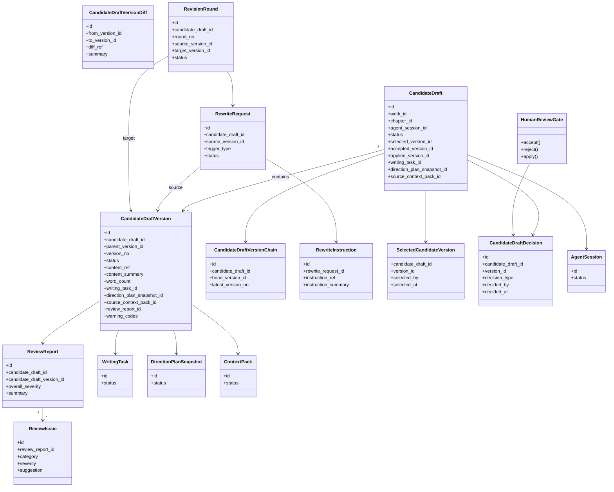
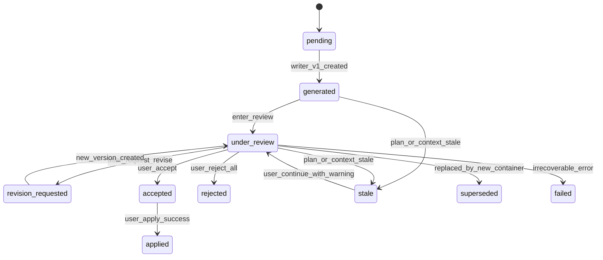
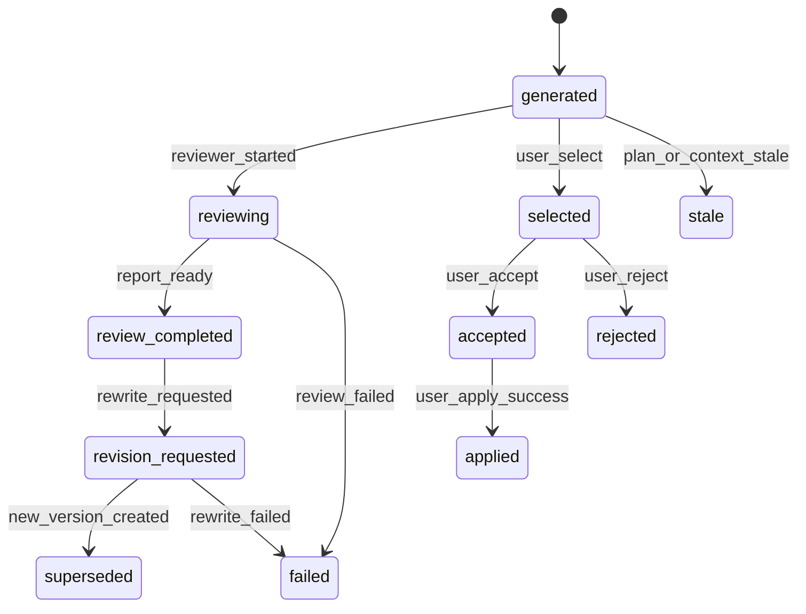
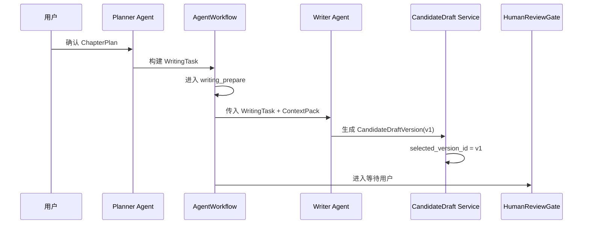
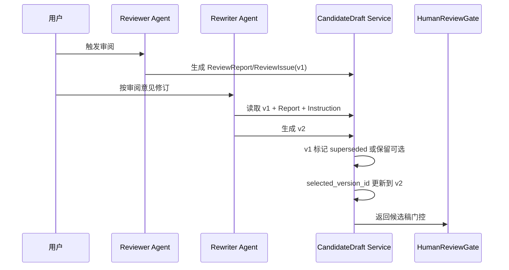
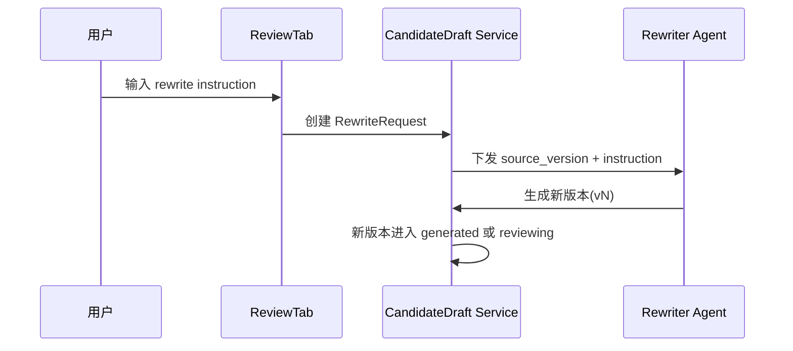

# InkTrace V2.0-P1-06 多轮 CandidateDraft 迭代详细设计

版本：v1.1 / P1 模块级详细设计候选冻结版  
状态：候选冻结

本文档以无后缀 `.md` v1.0 为主版本，吸收 `_001.md` 中的简洁核心结论、状态集合、错误处理补充、UI 展示方向和待确认点；`_001.md` 已被完全吸收，不再单独维护。

## 一、文档定位与设计范围

本文档只覆盖 P1-06 多轮 CandidateDraft / CandidateDraftVersion 迭代能力。

设计范围：

1. CandidateDraft 容器与 CandidateDraftVersion 多版本链路。
2. Writer / Reviewer / Rewriter 与版本迭代闭环。
3. ReviewReport / ReviewIssue 驱动 RewriteRequest / RewriteInstruction。
4. selected_version_id / accepted_version_id / applied_version_id 三指针规则。
5. stale / superseded / failed 生命周期与并发返回仲裁方向。
6. 与 P1-05、HumanReviewGate、ConflictGuard、MemoryReviewGate、UI 的边界。

不覆盖范围：

1. 不定义 P1-08 ConflictGuard 规则矩阵。
2. 不定义 P1-09 StoryMemoryRevision / MemoryReviewGate 数据结构。
3. 不定义 P1-11 API / DTO 细节。
4. 不引入 P2 自动连续续写队列、多章无人化生成、正文 token streaming。
5. 不写代码、不生成开发计划、不处理 Git。

---

## 二、核心概念与总体流程

核心结论（冻结）：

1. CandidateDraft 是候选稿容器。
2. CandidateDraftVersion 是具体文本版本。
3. P1 支持同一 CandidateDraft 下多版本迭代。
4. AI 只生成 CandidateDraftVersion，不直接写正式正文。
5. HumanReviewGate 是 accept / reject / apply 的唯一用户门控。
6. accepted 不等于 applied。
7. Reviewer 只输出 ReviewReport / ReviewIssue，不改正文。
8. Rewriter 只生成新版本，不自动 accept / apply。
9. selected_version 只能由 user_action 或明确系统规则更新。
10. max_revision_rounds 默认 1。

总体流程（简版）：

1. Writer 生成 v1。
2. Reviewer 生成 ReviewReport / ReviewIssue。
3. 用户基于审阅意见或手写指令触发 Rewriter，生成 v2 / v3。
4. 用户最终选择版本并执行 accept / apply。

---

## 三、CandidateDraft 容器设计

### 3.1 职责

CandidateDraft 聚合同一章节、同一写作意图下的多个 CandidateDraftVersion，并维护状态聚合与三指针。

### 3.2 核心字段方向

1. `id`
2. `work_id`
3. `chapter_id`
4. `agent_session_id`
5. `writing_task_id`
6. `direction_plan_snapshot_id`
7. `source_context_pack_id`
8. `status`
9. `selected_version_id`
10. `accepted_version_id`
11. `applied_version_id`
12. `latest_version_no`
13. `revision_round`
14. `max_revision_rounds`
15. `warning_codes`
16. `stale_status`
17. `created_by`
18. `created_at`
19. `updated_at`
20. `request_id`
21. `trace_id`

### 3.3 持久化策略

1. CandidateDraft 独立持久化。
2. 不保存完整 Prompt。
3. 文本通过 `content_ref/text_ref` + `content_summary` 管理。
4. 普通日志不记录完整正文。

---

## 四、CandidateDraftVersion 版本设计

### 4.1 职责

CandidateDraftVersion 是候选稿的最小可审阅、可对比、可接受、可应用对象。

### 4.2 核心字段方向

1. `id`
2. `candidate_draft_id`
3. `work_id`
4. `chapter_id`
5. `agent_session_id`
6. `source_candidate_draft_id`
7. `source_version_id`
8. `parent_version_id`
9. `version_no`
10. `status`
11. `text_ref / content_ref`
12. `content_summary`
13. `word_count`
14. `writing_task_id`
15. `direction_plan_snapshot_id`
16. `source_context_pack_id`
17. `review_report_id`
18. `warning_codes`
19. `stale_status`
20. `created_by`
21. `created_at`
22. `updated_at`
23. `request_id`
24. `trace_id`

### 4.3 版本语义

1. v1 通常由 Writer 生成。
2. v2/v3 通常由 Rewriter 生成。
3. `parent_version_id` 指向修订来源。
4. superseded/rejected 版本保留，不删除。

---

## 五、版本链与 selected / accepted / applied 规则

### 5.1 CandidateDraftVersionChain

1. 默认线性主链，允许轻量分叉引用。
2. 每次修订生成新版本，写入 `parent_version_id`。
3. 并发返回全部入链，不自动覆盖 accepted/applied 指针。

### 5.2 三指针统一口径

1. `selected_version_id`：当前 UI 查看版本。
2. `accepted_version_id`：用户认可版本。
3. `applied_version_id`：已写入章节草稿区版本。

accepted 不等于 applied，且 apply 必须 user_action。

### 5.3 apply 后继续修订（统一口径）

1. apply 后不建议在同一 CandidateDraft 容器继续追加版本。
2. 如需继续修订，默认创建新的 revision_workflow 并生成新的 CandidateDraft 容器。
3. 旧 applied version 保留审计。
4. 是否允许同容器继续追加版本，保留为待确认点。

### 5.4 accepted 后又生成新版本（统一口径）

1. 不自动清空 `accepted_version_id`。
2. UI 必须提示“已有 accepted 版本不是最新版本”。
3. 用户可手动 accept 新版本并更新指针。
4. 是否自动清空 accepted_version_id，保留为待确认点。

### 5.5 superseded 版本（统一口径）

1. superseded 不删除。
2. superseded 允许 selected 用于查看与对比。
3. 默认不可 accept / apply。
4. 是否允许恢复 superseded 为可用版本，保留为待确认点。

---

## 六、ReviewReport 与 ReviewIssue 设计

### 6.1 ReviewReport

字段方向：

1. `id`
2. `candidate_draft_id`
3. `candidate_draft_version_id`
4. `work_id`
5. `chapter_id`
6. `overall_severity`
7. `summary`
8. `issue_count`
9. `warning_codes`
10. `created_by`
11. `created_at`
12. `request_id`
13. `trace_id`

### 6.2 ReviewIssue

字段方向：

1. `id`
2. `review_report_id`
3. `category`
4. `severity`
5. `title`
6. `description`
7. `suggestion`
8. `evidence_ref`
9. `created_at`

---

## 七、RewriteRequest 与 RewriteInstruction 设计

### 7.1 RewriteRequest

字段方向：

1. `id`
2. `candidate_draft_id`
3. `source_version_id`
4. `work_id`
5. `chapter_id`
6. `agent_session_id`
7. `trigger_type`（review_based / user_instruction / reject_regenerate）
8. `review_report_id`（可选）
9. `status`
10. `created_by`
11. `created_at`
12. `updated_at`
13. `request_id`
14. `trace_id`

### 7.2 RewriteInstruction

字段方向：

1. `id`
2. `rewrite_request_id`
3. `instruction_source`
4. `instruction_ref`
5. `instruction_summary`
6. `constraint_refs`
7. `created_at`

### 7.3 触发来源

1. 用户点击“按审阅意见修订”。
2. 用户手写修订要求。
3. 用户 reject 后请求重写。
4. Reviewer 给出高风险建议后用户确认重写。

---

## 八、RevisionRound 与 max_revision_rounds

### 8.1 RevisionRound

字段方向：

1. `id`
2. `candidate_draft_id`
3. `round_no`
4. `source_version_id`
5. `target_version_id`
6. `rewrite_request_id`
7. `status`
8. `created_at`
9. `updated_at`

### 8.2 规则

1. 默认 `max_revision_rounds = 1`。
2. 达上限后阻断继续自动修订并返回 warning。
3. 旧版本可继续审阅，不强制失败。
4. 是否按 workflow_type 或用户配置调整，保留待确认。

---

## 九、状态机与生命周期

### 9.1 CandidateDraft 状态集合

`pending -> generated -> under_review -> revision_requested -> accepted/rejected/applied/stale/superseded/failed`

### 9.2 CandidateDraftVersion 状态集合

`generated -> reviewing -> review_completed -> revision_requested -> selected/accepted/rejected/applied/superseded/stale/failed`

### 9.3 关系规则

1. CandidateDraft.status 为容器聚合态。
2. selected 可切换，不代表 accepted。
3. accepted 仅由 user_action 更新。
4. applied 仅由 apply 成功更新。
5. reject 当前版本后默认允许继续重写。
6. WritingTask / DirectionPlanSnapshot stale 时，候选稿标 stale + warning。
7. late result：session/job 取消后到达结果标 ignored。
8. 并发 Rewriter 返回：全部入链，由用户决策 selected / accepted / applied。

---

## 十、与 P1-05 WritingTask / DirectionPlanSnapshot 的关系

1. CandidateDraftVersion 必须记录 `writing_task_id`。
2. CandidateDraftVersion 必须记录 `direction_plan_snapshot_id`。
3. WritingTask stale 时旧候选稿不删除，但标记 `plan_basis_stale`。
4. 用户可继续审阅旧候选稿，UI 必须提示风险。
5. 新 Direction/Plan 下默认新建 CandidateDraft 容器。
6. CandidateDraft 不修改 DirectionPlanSnapshot。

---

## 十一、与五 Agent 的关系

1. Writer 生成初始版本 v1。
2. Reviewer 基于版本生成 ReviewReport / ReviewIssue。
3. Rewriter 基于版本 + 审阅结果 + 指令生成 v2/v3。
4. Planner / Memory 不直接修改 CandidateDraftVersion。
5. 所有 Agent 都不能 accept / reject / apply。
6. accept / reject / apply 必须来自 user_action。

---

## 十二、与 HumanReviewGate 的关系

1. HumanReviewGate 面向 CandidateDraftVersion，不是抽象容器。
2. 用户可以选择某版本 accept。
3. `accepted_version_id` 记录被接受版本。
4. apply 只能应用 accepted 版本，或 apply 时同步显式确认版本。
5. rejected 版本不删除。
6. apply 仍沿用 P0 version conflict 校验与 Local-First 保存链路。
7. AI 不得修改 `accepted_version_id / applied_version_id`。

---

## 十三、与 ConflictGuard / MemoryReviewGate 的边界

1. P1-06 只记录可能触发 ConflictGuard 的输入和结果引用。
2. 若版本存在 blocking conflict，HumanReviewGate apply 必须受限（规则矩阵由 P1-08 冻结）。
3. P1-06 不直接写 StoryMemory。
4. 若 ReviewIssue 暗示记忆更新，仅挂载 MemoryUpdateSuggestion 引用（实体由 P1-09 冻结）。
5. ConflictGuard 与 MemoryReviewGate 同时触发时，P1-06 只说明候选稿版本挂载状态，不定义门控顺序。

---

## 十四、与 UI / DESIGN.md 的关系

1. ReviewTab 展示 CandidateDraftCard。
2. CandidateDraftCard 默认展示 `selected_version`。
3. 支持版本列表（v1 初稿 / v2 修订稿 / v3 再修订稿）。
4. 支持版本切换与版本对比。
5. 支持 ReviewReport / AIReview 展示。
6. 支持“按审阅意见修订”。
7. 支持“输入修订要求后重写”。
8. apply 前必须明确版本选择。
9. accepted 与 applied 必须视觉区分。
10. 普通用户不展示完整 Prompt / ContextPack / JSON / Tool 原始日志。
11. 状态色遵守 InkTrace-DESIGN.md。

---

## 十五、类图、状态图与时序图

### 15.1 类图

### 15.2 CandidateDraft 状态图

### 15.3 CandidateDraftVersion 状态图

### 15.4 初稿生成主流程时序图

### 15.5 审阅后修订时序图

### 15.6 用户手写重写要求时序图

---

## 十六、错误处理与降级规则

1. Writer 生成失败：当前版本 failed，容器可重试。
2. Writer late result：session 或阶段已取消时标 ignored。
3. Reviewer 失败：不阻断 HumanReviewGate 基础操作。
4. Rewriter 失败：不影响旧版本继续审阅。
5. 超过 max_revision_rounds：阻断继续自动修订并返回 warning。
6. 空文本/校验失败：该版本 failed，不覆盖 selected。
7. DirectionPlanSnapshot stale：标记 stale + `plan_basis_stale`。
8. ContextPack degraded：允许继续，但必须带 warning_codes。
9. ConflictGuard blocking：限制 apply。
10. 用户 reject 当前版本：可切换旧版本或继续 revise。
11. 用户 accept 后又生成新版本：不自动切换 accepted。
12. apply 章节版本冲突：不写正式草稿，不改 applied_version。
13. AgentSession cancelled / failed / partial_success：可保留已有可交付版本。
14. 并发修订返回：全部入链，不自动覆盖 accepted/applied。

---

## 十七、安全边界与禁止事项

1. 禁止 AI 自动 accept。
2. 禁止 AI 自动 reject。
3. 禁止 AI 自动 apply。
4. 禁止 Rewriter 自动覆盖旧版本。
5. 禁止 Reviewer 自动改正文。
6. 禁止 CandidateDraftVersion 直接写正式章节。
7. 禁止绕过 HumanReviewGate 直接 apply。
8. 禁止忽略 version conflict。
9. 禁止记录完整 Prompt / API Key / 完整 ContextPack。
10. 禁止引入 P2 自动连续续写队列。
11. 禁止引入正文 token streaming。

---

## 十八、P1-06 不做事项清单

1. 不把 P1-06 改成 API/DTO 设计。
2. 不进入 P1-07 AI Suggestion。
3. 不进入 P1-08 ConflictGuard 规则矩阵。
4. 不进入 P1-09 StoryMemoryRevision / MemoryReviewGate。
5. 不进入 P1-10 AgentTrace。
6. 不进入 P1-11 前端集成细节。
7. 不引入 P2 自动连续续写队列。
8. 不引入多章无人化生成。
9. 不引入正文 token streaming。
10. 不设计 AI 自动 accept / reject / apply。

---

## 十九、P1-06 验收标准

1. CandidateDraft 容器 + CandidateDraftVersion 版本双层模型完整。
2. 版本链、版本差异、审阅、重写、轮次模型定义完整。
3. selected/accepted/applied 三指针规则清晰并可执行。
4. accepted != applied 保持成立。
5. HumanReviewGate 面向版本级门控，不被绕过。
6. Writer/Reviewer/Rewriter 权限边界明确。
7. stale/superseded 触发与保留策略明确。
8. apply 后默认新建容器继续修订口径已冻结。
9. accepted 后新版本口径已冻结（不自动清空 accepted）。
10. superseded 版本口径已冻结（保留、可对比、默认不可 apply）。
11. max_revision_rounds 默认 1 已冻结。
12. 与 P1-05、P1-08、P1-09 边界清晰且未越界。
13. Mermaid 类图、状态图、时序图完整保留。
14. 未引入任何 P2 能力。

---

## 二十、P1-06 待确认点

1. `max_revision_rounds` 是否允许按 workflow_type 或用户配置调整。
2. accept 后再生成新版本时，是否应自动清空 `accepted_version_id`。
3. apply 后是否允许同容器继续追加版本（当前默认不建议）。
4. superseded 版本是否允许恢复为可 accept/apply 的可用版本。
5. 并发 Rewriter 结果的默认 selected 策略是否固定“最新完成”。
6. Direction/Plan 变化时是否允许“同容器新版本”替代“新容器”。
7. HumanReviewGate 是否支持“accept 但暂不锁定版本”中间态。
8. ConflictGuard blocking 与 MemoryReviewGate 同时存在时 UI 默认顺序。

---

## 附录 A：模型字段速查表

| 模型 | 必要字段（最小） |
|---|---|
| CandidateDraft | id, work_id, chapter_id, agent_session_id, status, selected_version_id, accepted_version_id, applied_version_id, writing_task_id, direction_plan_snapshot_id, source_context_pack_id, warning_codes, created_at, updated_at, request_id, trace_id |
| CandidateDraftVersion | id, candidate_draft_id, parent_version_id, version_no, status, content_ref, content_summary, word_count, writing_task_id, direction_plan_snapshot_id, source_context_pack_id, review_report_id, warning_codes, created_at, updated_at, request_id, trace_id |
| CandidateDraftVersionChain | id, candidate_draft_id, head_version_id, latest_version_no |
| CandidateDraftVersionDiff | id, from_version_id, to_version_id, diff_ref, summary |
| ReviewReport | id, candidate_draft_id, candidate_draft_version_id, overall_severity, summary, created_at |
| ReviewIssue | id, review_report_id, category, severity, suggestion, evidence_ref |
| RewriteRequest | id, candidate_draft_id, source_version_id, trigger_type, status, created_by, created_at |
| RewriteInstruction | id, rewrite_request_id, instruction_ref, instruction_summary |
| RevisionRound | id, candidate_draft_id, round_no, source_version_id, target_version_id, status |
| SelectedCandidateVersion | candidate_draft_id, version_id, selected_by, selected_at |
| CandidateDraftDecision | id, candidate_draft_id, version_id, decision_type, decided_by, decided_at |
| CandidateDraftVersionRef / safe_ref | ref_type, ref_id, ref_scope, summary, checksum, created_at |

---

## 附录 B：P1-06 与 P1 总纲对照

| P1 总纲要求 | P1-06 冻结内容 |
|---|---|
| 多轮候选稿迭代 | CandidateDraft 容器 + CandidateDraftVersion 链 |
| AI 不直接写正式正文 | 仅生成版本，apply 仍经 HumanReviewGate + Local-First |
| 五 Agent 协作 | Writer 初稿、Reviewer 审阅、Rewriter 修订 |
| 用户门控 | accept/reject/apply 必须 user_action |
| 状态可追溯 | selected/accepted/applied 指针 + stale/superseded |
| 与 P1-05 计划耦合 | 版本记录 writing_task_id + direction_plan_snapshot_id |
| 与 P1-08 / P1-09 边界 | 仅挂载引用，不定义规则矩阵和记忆修订模型 |
| 不引入 P2 | 不含自动连续续写/多章无人化/token streaming |

---

## 附录 C：状态枚举速查表

### C.1 CandidateDraftStatus

1. `pending`
2. `generated`
3. `under_review`
4. `revision_requested`
5. `accepted`
6. `rejected`
7. `applied`
8. `stale`
9. `superseded`
10. `failed`

### C.2 CandidateDraftVersionStatus

1. `generated`
2. `reviewing`
3. `review_completed`
4. `revision_requested`
5. `superseded`
6. `selected`
7. `accepted`
8. `rejected`
9. `applied`
10. `stale`
11. `failed`

### C.3 关键语义

1. `selected`：当前查看版本。
2. `accepted`：用户认可版本。
3. `applied`：已写入章节草稿区版本。
4. `stale`：依据过期但可审阅。
5. `superseded`：被新版本替代但保留审计。

