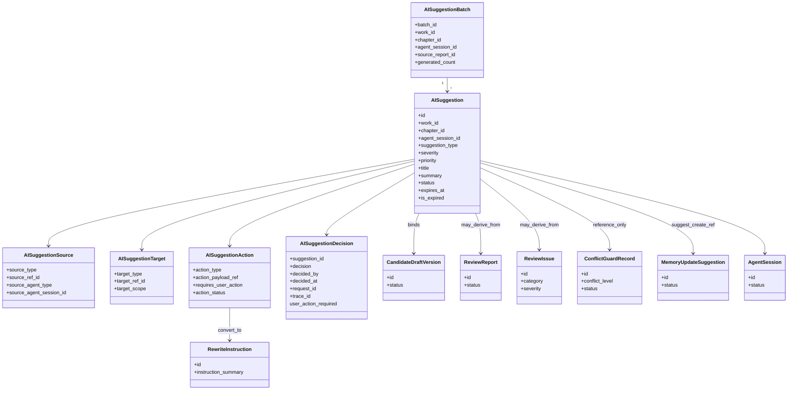
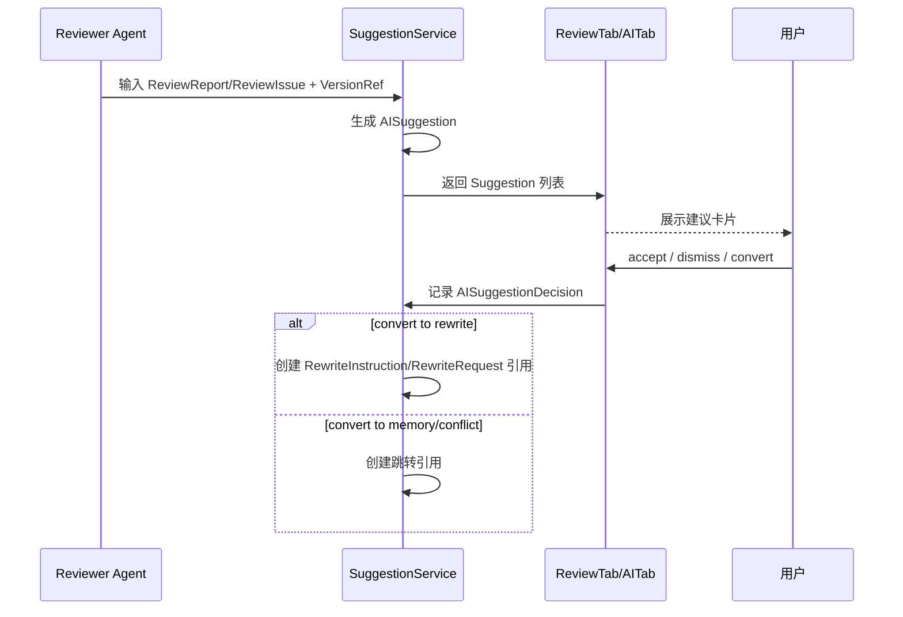
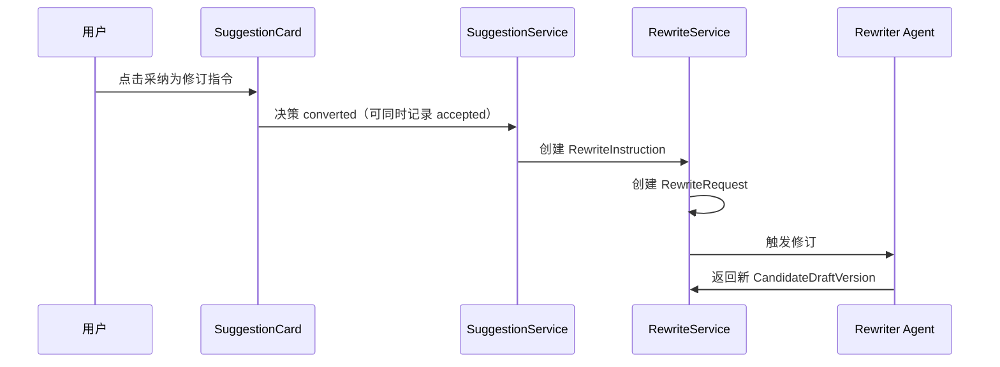
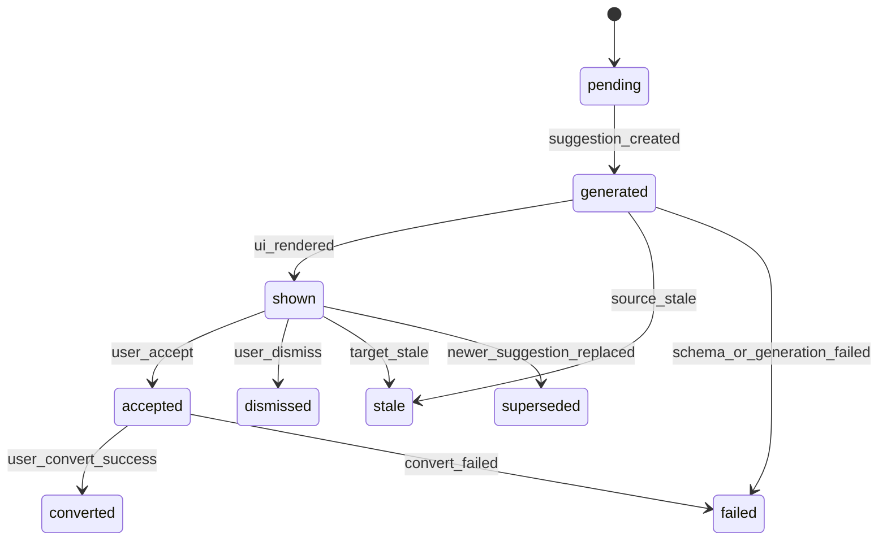

# InkTrace V2.0-P1-07 AI Suggestion 详细设计

版本：v1.1 / P1 模块级详细设计候选冻结版  
状态：候选冻结  
所属阶段：InkTrace V2.0 P1

本文档以无后缀 `.md` v1.0 为主版本，吸收 `_001.md` 中的简洁核心结论、类型处理规则、UI 展示约束、错误处理补充和待确认点；`_001.md` 已被完全吸收，不再单独维护。

## 一、文档定位与设计范围

本文档只覆盖 P1-07 AI Suggestion 详细设计，定义建议层的模型、状态、转化规则和门控边界。

设计范围：

1. AISuggestion 定位与边界。
2. AISuggestion / Source / Target / Action / Decision / Batch / Ref 模型。
3. Suggestion 类型体系与转化规则。
4. 建议状态机、过期策略与生命周期。
5. 与 CandidateDraftVersion / ReviewReport / ReviewIssue 的关系。
6. 与五 Agent 的职责边界。
7. 与 ConflictGuard / MemoryReviewGate 的边界。
8. 与 UI / DESIGN.md 的展示约束。
9. 错误处理与降级规则。

不覆盖范围：

1. 不定义 P1-08 ConflictGuard 规则矩阵。
2. 不定义 P1-09 MemoryReviewGate / StoryMemoryRevision 正式实体。
3. 不定义 P1-11 API / DTO 细节。
4. 不引入 P2 自动执行建议、批量自动修复、复杂知识图谱。
5. 不写代码、不生成开发计划、不处理 Git。

依据文档（对齐输入）：

- `docs/01_requirements/InkTrace-V2.0-需求规格说明书.md`
- `docs/07_overview/InkTrace-V2.0-概要设计说明书.md`
- `docs/02_architecture/InkTrace-V2.0-架构设计说明书.md`
- `docs/03_design/InkTrace-V2.0-P1-详细设计总纲.md`
- `docs/03_design/InkTrace-V2.0-P1-01-AgentRuntime详细设计.md`
- `docs/03_design/InkTrace-V2.0-P1-02-AgentWorkflow详细设计.md`
- `docs/03_design/InkTrace-V2.0-P1-03-五Agent职责与编排详细设计.md`
- `docs/03_design/InkTrace-V2.0-P1-04-四层剧情轨道详细设计.md`
- `docs/03_design/InkTrace-V2.0-P1-05-方向推演与章节计划详细设计.md`
- `docs/03_design/InkTrace-V2.0-P1-06-多轮CandidateDraft迭代详细设计.md`
- `docs/03_design/InkTrace-V2.0-P1-UI-界面与交互设计.md`
- `docs/03_design/InkTrace-DESIGN.md`
- `docs/03_design/V2/InkTrace-V2.0-P0-10-AIReview详细设计.md`
- `docs/03_design/V2/InkTrace-V2.0-P0-11-API与集成边界详细设计.md`

---

## 二、核心概念与总体流程

### 2.1 核心定位（冻结）

1. AI Suggestion 是辅助建议，不是自动执行指令。
2. 不直接修改正式正文。
3. 不直接修改 CandidateDraftVersion。
4. 不直接修改 StoryMemory / StoryState / 四层剧情轨道。
5. 用户确认后才能转化为后续动作。

### 2.2 概念区分

1. ReviewIssue：问题描述（发现了什么）。
2. AISuggestion：可操作建议（建议怎么做）。
3. ConflictGuard：冲突检测与阻断（能否继续）。
4. MemoryUpdateSuggestion：P1-09 的正式记忆更新建议实体。

### 2.3 总体流程

1. Agent（主要是 Reviewer）产出 ReviewReport / ReviewIssue。
2. SuggestionService 基于问题与上下文生成 AISuggestion。
3. UI 以建议卡片展示。
4. 用户执行 accept / dismiss / convert。
5. convert 后生成下游引用或实体（如 RewriteInstruction），否则不产生执行动作。

---

## 三、AISuggestion 数据模型

### 3.1 AISuggestion

字段（最小）：

1. `id`
2. `work_id`
3. `chapter_id`
4. `agent_session_id`
5. `source_type`
6. `source_ref_id`
7. `target_type`
8. `target_ref_id`
9. `suggestion_type`
10. `severity`
11. `priority`
12. `title`
13. `summary`
14. `rationale`
15. `proposed_action`
16. `status`
17. `decision`
18. `decided_by`
19. `warning_codes`
20. `created_by`
21. `created_at`
22. `updated_at`
23. `request_id`
24. `trace_id`
25. `expires_at`（可选）
26. `is_expired`（计算字段）

### 3.2 AISuggestionSource

1. `source_type`（review_issue / review_report / planner_output / memory_note / rewriter_note）
2. `source_ref_id`
3. `source_agent_type`
4. `source_agent_session_id`
5. `source_version_id`（可选）

### 3.3 AISuggestionTarget

1. `target_type`（candidate_draft_version / chapter_plan / direction_option / conflict_record / memory_update_ref）
2. `target_ref_id`
3. `target_scope`（work / chapter / version）
4. `target_snapshot_ref`（可选）

### 3.4 AISuggestionAction

1. `action_type`
2. `action_payload_ref`
3. `requires_user_action`（固定 true）
4. `action_status`

`action_type` 枚举：

1. `convert_to_rewrite_instruction`
2. `open_conflict_resolution`
3. `create_memory_update_ref`
4. `adjust_direction_or_plan`
5. `manual_edit_hint`
6. `dismiss_only`

### 3.5 AISuggestionDecision

1. `suggestion_id`
2. `decision`（accepted / dismissed / converted）
3. `decided_by`
4. `decision_note`
5. `decided_at`
6. `request_id`
7. `trace_id`

### 3.6 AISuggestionBatch

1. `batch_id`
2. `work_id`
3. `chapter_id`
4. `agent_session_id`
5. `source_report_id`
6. `suggestion_ids[]`
7. `generated_count`
8. `stale_count`
9. `created_at`

### 3.7 AISuggestionRef / safe_ref

1. `ref_type`
2. `ref_id`
3. `ref_scope`
4. `summary`
5. `checksum`（可选）
6. `created_at`

持久化原则：

1. 保存建议摘要与引用，不保存完整 Prompt。
2. 普通日志不记录完整 ContextPack / 正文 / JSON / API Key。

---

## 四、Suggestion 类型体系

Suggestion 类型：

1. `rewrite_suggestion`
2. `style_suggestion`
3. `plot_suggestion`
4. `character_suggestion`
5. `foreshadow_suggestion`
6. `memory_update_suggestion_ref`
7. `conflict_resolution_suggestion`
8. `direction_plan_suggestion`
9. `continuity_suggestion`
10. `risk_warning`

类型处理规则：

| suggestion_type | 可转 RewriteInstruction | 仅提示 | 需 P1-08/P1-09 | 可 dismiss | UI 高亮 |
|---|---|---|---|---|---|
| rewrite_suggestion | 是 | 否 | 否 | 是 | 中 |
| style_suggestion | 是 | 否 | 否 | 是 | 中 |
| plot_suggestion | 是 | 否 | 否 | 是 | 中 |
| character_suggestion | 是 | 否 | 否 | 是 | 高 |
| foreshadow_suggestion | 是 | 否 | 否 | 是 | 中 |
| memory_update_suggestion_ref | 否 | 否 | 是（P1-09） | 是 | 高 |
| conflict_resolution_suggestion | 否 | 否 | 是（P1-08） | 是 | 高 |
| direction_plan_suggestion | 否（默认） | 否 | 否（回到 P1-05 规划门） | 是 | 中 |
| continuity_suggestion | 是 | 否 | 否 | 是 | 高 |
| risk_warning | 否 | 是 | 可引用 | 是 | 高 |

冻结口径：

1. `risk_warning` 只允许 acknowledge / dismiss。
2. `risk_warning` 不允许 convert 为 RewriteInstruction。
3. `risk_warning` 不能替代 ConflictGuard blocking 结论。

---

## 五、Source / Target / Action / Decision 设计

### 5.1 Source

1. Reviewer Agent：主要来源。
2. Planner Agent：方向/计划建议来源。
3. Memory Agent：记忆建议引用来源。
4. Rewriter Agent：修订说明建议来源。
5. Writer Agent：默认不生成 Suggestion（待确认是否放开特定类型）。

### 5.2 Target

1. 每条 Suggestion 必须绑定目标对象。
2. `target_ref_id` 必须可追溯。

### 5.3 Action

1. 所有 action 必须 `requires_user_action=true`。
2. accept 不创建下游实体。
3. convert 才允许创建下游实体或跳转引用。

### 5.4 Decision

冻结口径：

1. `accepted`：用户认可建议，但尚未创建下游实体。
2. `converted`：用户确认转化，且已创建下游实体或跳转动作引用。
3. `dismissed`：用户忽略建议，保留审计记录。

---

## 六、状态机与生命周期

主状态枚举（冻结）：

- `pending`
- `generated`
- `shown`
- `accepted`
- `dismissed`
- `converted`
- `superseded`
- `stale`
- `failed`

关键统一口径：

1. `expired` 不是主状态。
2. 过期通过 `expires_at` + `is_expired` 表达。
3. 过期不改变 `status`。
4. 前端默认隐藏“过期且未处理”的建议。
5. 已 `accepted` / `converted` 的建议不因过期被隐藏。

生命周期规则：

1. `generated -> shown`：UI 首次成功渲染。
2. `shown -> accepted/dismissed/converted`：用户决策。
3. `stale`：源对象 stale/superseded 或上下文失效。
4. `superseded`：同目标同类型新建议取代旧建议。
5. `failed`：生成失败、schema 校验失败或转化失败。
6. `dismissed` 默认不可恢复为 shown（是否支持恢复见待确认点）。

---

## 七、与 CandidateDraftVersion / ReviewReport 的关系

1. AISuggestion 可绑定 CandidateDraftVersion。
2. AISuggestion 可由 ReviewIssue 派生。
3. ReviewIssue 不等于 AISuggestion。
4. rewrite_suggestion 可 convert 为 RewriteInstruction。
5. dismiss Suggestion 不影响原 ReviewIssue。
6. CandidateDraftVersion superseded 后，关联 Suggestion 默认 stale。
7. 新版本生成后，旧 Suggestion 不自动迁移。
8. 不改变 P1-06 selected / accepted / applied 规则。

---

## 八、与五 Agent 的关系

权限总表（冻结）：

| Agent | create_ai_suggestion | accept/dismiss/convert | formal_write |
|---|---|---|---|
| Memory Agent | 允许 | 禁止 | 禁止 |
| Planner Agent | 允许 | 禁止 | 禁止 |
| Writer Agent | 默认禁止（待确认） | 禁止 | 禁止 |
| Reviewer Agent | 允许 | 禁止 | 禁止 |
| Rewriter Agent | 允许 | 禁止 | 禁止 |

统一权限口径：

1. 所有 Agent 只能 `create_ai_suggestion`。
2. 所有 Agent 不得 accept / dismiss / convert。
3. AISuggestionDecision 只能由 `user_action` 创建。
4. `create_ai_suggestion` 的 `side_effect_level = safe_write_suggestion`。
5. `formal_write` 永远禁止。

---

## 九、与 ConflictGuard / MemoryReviewGate 的边界

1. `conflict_resolution_suggestion` 不是 ConflictGuardRecord。
2. AI Suggestion 不能覆盖 ConflictGuard blocking。
3. blocking conflict 是否阻断 apply 由 P1-08 冻结。
4. P1-07 只展示冲突处理建议和跳转入口。
5. `memory_update_suggestion_ref` 不是正式 MemoryUpdateSuggestion。
6. 用户 convert 后只能进入 P1-09 门控或创建待处理引用。
7. P1-07 不定义 MemoryUpdateSuggestion 字段、审批流程、MemoryRevision。

---

## 十、与 UI / DESIGN.md 的关系

展示约束：

1. 建议在 ReviewTab / AITab 以轻量卡片展示。
2. 每条卡片展示：类型、严重度、标题、摘要、依据、建议动作。
3. 操作按钮：accept / dismiss / convert。
4. 高风险建议使用 warning/error 状态色。
5. `risk_warning` 仅允许 acknowledge/dismiss。
6. `rewrite_suggestion` 支持 convert 为 RewriteInstruction。
7. `memory_update_suggestion_ref` 引导进入 MemoryReviewGate。
8. `conflict_resolution_suggestion` 引导查看 ConflictGuard。
9. 普通用户不展示完整 Prompt / ContextPack / JSON / Tool 原始日志。
10. 状态色遵守 InkTrace-DESIGN.md。

---

## 十一、类图、状态图与时序图

### 11.1 Mermaid 类图

### 11.2 Suggestion 生成主流程时序图

### 11.3 Suggestion 转 RewriteInstruction 时序图

### 11.4 AISuggestion 状态图

---

## 十二、错误处理与降级规则

1. Suggestion 生成失败：标记 failed。
2. Suggestion 输出为空：标记 failed 或 skipped（默认 failed）。
3. Suggestion schema 校验失败：按既有校验重试边界处理，超限 failed。
4. ReviewReport stale：关联 Suggestion stale。
5. CandidateDraftVersion superseded：关联 Suggestion stale。
6. 用户 dismiss 后默认不可恢复 shown，仅历史可查。
7. 用户 accept 后 convert 失败：保持 accepted 并记录 convert_failed。
8. RewriteInstruction 创建失败：不回滚 Suggestion 决策，记录失败动作。
9. MemoryUpdateSuggestion 创建失败：仅影响转换动作，不影响 Suggestion 主体。
10. ConflictGuardRecord 不存在：warning + 引导刷新。
11. AgentSession cancelled / failed / partial_success：已落库保留，未落库 late result ignored。
12. late result：session 关闭后到达结果不推进状态。

---

## 十三、安全边界与禁止事项

1. 禁止 AI Suggestion 自动执行。
2. 禁止 AI Suggestion 自动修改正文。
3. 禁止 AI Suggestion 自动修改 CandidateDraftVersion。
4. 禁止 AI Suggestion 自动修改 StoryMemory。
5. 禁止 AI Suggestion 自动解除 ConflictGuard blocking。
6. 禁止 AI Suggestion 绕过 HumanReviewGate。
7. 禁止 AI Suggestion 绕过 MemoryReviewGate。
8. 禁止 AI Suggestion 绕过 user_action。
9. 禁止记录完整 Prompt / API Key / 完整 ContextPack。
10. 禁止引入 P2 批量自动修复。
11. 禁止引入 P2 自动连续续写队列。

---

## 十四、P1-07 不做事项清单

1. 不改造成 API/DTO 设计。
2. 不进入 P1-08 冲突规则矩阵。
3. 不进入 P1-09 记忆修订实体与审批流。
4. 不进入 P1-10 AgentTrace 完整字段。
5. 不进入 P1-11 前端集成细节。
6. 不引入 P2 自动执行建议。
7. 不引入批量自动修复。
8. 不引入复杂知识图谱。
9. 不引入正文 token streaming。

---

## 十五、P1-07 验收标准

1. AI Suggestion 定位清晰，非自动执行。
2. 与 ReviewIssue / ConflictGuard / MemoryUpdateSuggestion 区分清晰。
3. 10 种 suggestion_type 与处理规则完整。
4. Source/Target/Action/Decision/Batch/Ref 模型完整。
5. 主状态枚举完整且不含 expired。
6. 过期策略通过 expires_at/is_expired 表达并已定义。
7. accept 与 convert 语义分离且可审计。
8. dismissed 默认不可恢复策略已定义。
9. risk_warning 策略已定义且不替代 ConflictGuard。
10. 与 P1-06 / P1-08 / P1-09 / P1-11 边界清晰。
11. Agent 权限口径统一（仅 create，不得决策）。
12. Mermaid 类图、状态图、时序图完整。
13. 错误处理覆盖空输出、校验失败、stale、convert 失败、late result。
14. 未引入任何 P2 功能。

---

## 十六、P1-07 待确认点

1. `risk_warning` 是否允许“稍后处理”而非直接 dismiss。
2. `direction_plan_suggestion` 是否允许直接触发 Planner 再规划会话。
3. dismiss 后重新激活建议入口（AITab 或 ReviewTab）。
4. 同目标建议 supersede 策略按时间还是按优先级。
5. convert 失败后的默认重试策略（自动或手动）。
6. Writer Agent 是否开放特定 suggestion 产出。
7. SuggestionBatch 是否需要跨章节聚合视图。
8. stale suggestion 是否默认折叠展示。
9. dismissed 是否支持恢复为 shown（当前默认不支持）。

---

## 附录 A：模型字段速查表

| 模型 | 最小字段 |
|---|---|
| AISuggestion | id, work_id, chapter_id, agent_session_id, source_type, source_ref_id, target_type, target_ref_id, suggestion_type, severity, priority, title, summary, rationale, proposed_action, status, decision, decided_by, warning_codes, created_by, created_at, updated_at, request_id, trace_id, expires_at, is_expired |
| AISuggestionSource | source_type, source_ref_id, source_agent_type, source_agent_session_id, source_version_id |
| AISuggestionTarget | target_type, target_ref_id, target_scope, target_snapshot_ref |
| AISuggestionAction | action_type, action_payload_ref, requires_user_action, action_status |
| AISuggestionDecision | suggestion_id, decision, decided_by, decision_note, decided_at, request_id, trace_id |
| AISuggestionBatch | batch_id, work_id, chapter_id, agent_session_id, source_report_id, suggestion_ids, generated_count, stale_count, created_at |
| AISuggestionRef / safe_ref | ref_type, ref_id, ref_scope, summary, checksum, created_at |

---

## 附录 B：P1-07 与 P1 总纲对照

| P1 总纲要求 | P1-07 冻结内容 |
|---|---|
| 引入 AI Suggestion | 定义 AISuggestion 模型、状态机、类型体系 |
| 用户门控 | accept/dismiss/convert 必须 user_action |
| 不自动执行 | 明确禁止自动修改正文/版本/记忆 |
| 与审阅体系衔接 | ReviewIssue 可派生 Suggestion，二者不等同 |
| 与冲突和记忆边界隔离 | 仅引用 ConflictGuard / MemorySuggestion，不定义其规则 |
| 不提前进入 P2 | 不含自动修复、自动队列、复杂图谱 |

---

## 附录 C：Suggestion 类型与转化目标速查

| suggestion_type | 推荐 action_type | 转化目标 | 说明 |
|---|---|---|---|
| rewrite_suggestion | convert_to_rewrite_instruction | RewriteInstruction / RewriteRequest | 可进入 Rewriter |
| style_suggestion | convert_to_rewrite_instruction | RewriteInstruction / RewriteRequest | 风格与语气优化 |
| plot_suggestion | convert_to_rewrite_instruction | RewriteInstruction / RewriteRequest | 剧情推进调整 |
| character_suggestion | convert_to_rewrite_instruction | RewriteInstruction / RewriteRequest | 人物一致性修正 |
| foreshadow_suggestion | convert_to_rewrite_instruction | RewriteInstruction / RewriteRequest | 伏笔安排调整 |
| continuity_suggestion | convert_to_rewrite_instruction | RewriteInstruction / RewriteRequest | 连续性修正 |
| direction_plan_suggestion | adjust_direction_or_plan | Planner 再规划入口引用 | 不直接改计划实体 |
| conflict_resolution_suggestion | open_conflict_resolution | ConflictGuard 查看/处理入口引用 | 不能覆盖 blocking |
| memory_update_suggestion_ref | create_memory_update_ref | P1-09 处理引用 | 不是正式 MemoryUpdateSuggestion |
| risk_warning | dismiss_only | 无 | 仅提示，不转执行 |
