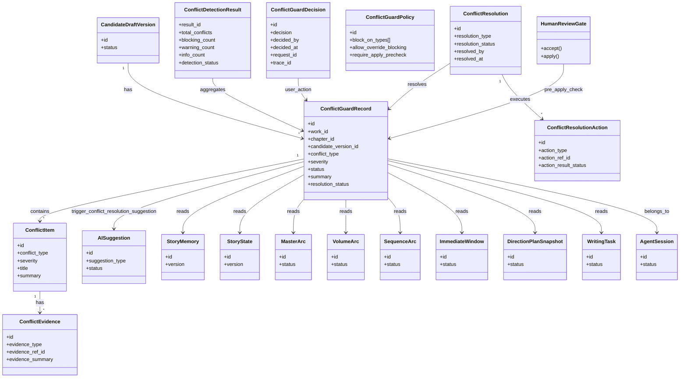
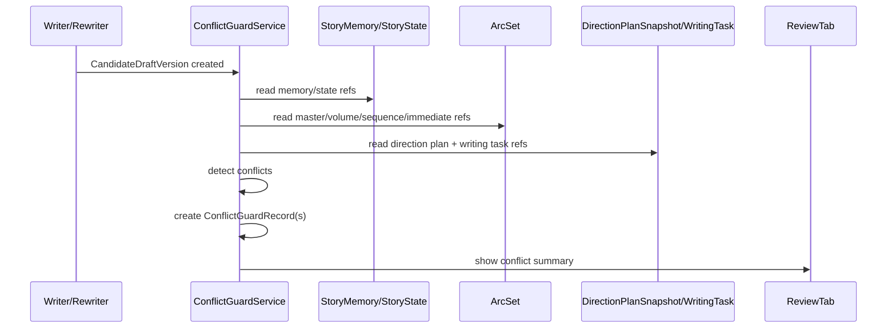
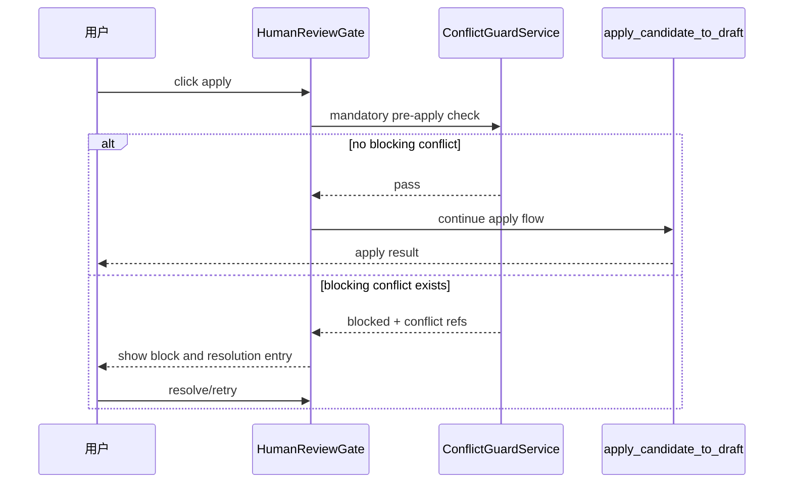
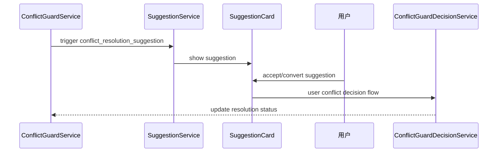
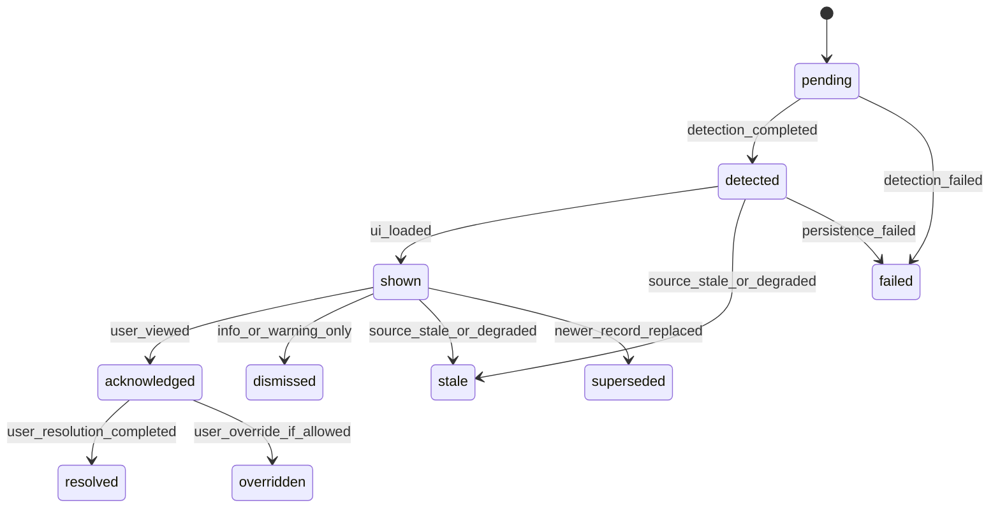

# InkTrace V2.0-P1-08 ConflictGuard 详细设计

版本：v1.1 / P1 模块级详细设计候选冻结版  
状态：候选冻结  
所属阶段：InkTrace V2.0 P1

本文档以无后缀 `.md` v1.0 为主版本，吸收 `_001.md` 中的简洁核心结论、总体流程、UI 展示约束、错误处理补充和待确认点；`_001.md` 已被完全吸收，不再单独维护。

## 一、文档定位与设计范围

本文档只覆盖 P1-08 ConflictGuard 详细设计，目标是冻结冲突检测、冲突阻断、冲突处理决策与边界约束。

设计范围：

1. ConflictGuard 的定位与边界。
2. 冲突检测对象、检测时机与执行策略。
3. 冲突类型体系、严重度体系、阻断规则。
4. ConflictGuardRecord / ConflictDetectionResult / ConflictItem / ConflictEvidence / ConflictResolution / ConflictGuardDecision / ConflictGuardPolicy。
5. 与 CandidateDraftVersion / HumanReviewGate / apply 的关系。
6. 与 StoryMemory / StoryState / 四层剧情轨道 / DirectionPlanSnapshot / WritingTask 的关系。
7. 与 AISuggestion / MemoryReviewGate 的边界。
8. UI 展示方向与安全约束。

不覆盖范围：

1. 不定义 P1-09 StoryMemoryRevision / MemoryReviewGate 完整流程。
2. 不定义 P1-11 API / DTO 细节。
3. 不引入 P2 自动批量修复、复杂知识图谱、自动连续续写队列。
4. 不写代码、不生成开发计划、不处理 Git。

依据文档：

- `docs/01_requirements/InkTrace-V2.0-需求规格说明书.md`
- `docs/07_overview/InkTrace-V2.0-概要设计说明书.md`
- `docs/02_architecture/InkTrace-V2.0-架构设计说明书.md`
- `docs/03_design/InkTrace-V2.0-P1-详细设计总纲.md`
- `docs/03_design/InkTrace-V2.0-P1-01-AgentRuntime详细设计.md`
- `docs/03_design/InkTrace-V2.0-P1-02-AgentWorkflow详细设计.md`
- `docs/03_design/InkTrace-V2.0-P1-03-五Agent职责与编排详细设计.md`
- `docs/03_design/InkTrace-V2.0-P1-04-四层剧情轨道详细设计.md`
- `docs/03_design/InkTrace-V2.0-P1-05-方向推演与章节计划详细设计.md`
- `docs/03_design/InkTrace-V2.0-P1-06-多轮CandidateDraft迭代详细设计.md`
- `docs/03_design/InkTrace-V2.0-P1-07-AISuggestion详细设计.md`
- `docs/03_design/InkTrace-V2.0-P1-UI-界面与交互设计.md`
- `docs/03_design/InkTrace-DESIGN.md`
- `docs/03_design/V2/InkTrace-V2.0-P0-09-CandidateDraft与HumanReviewGate详细设计.md`
- `docs/03_design/V2/InkTrace-V2.0-P0-11-API与集成边界详细设计.md`

---

## 二、核心概念与总体流程

### 2.1 核心结论（冻结）

1. ConflictGuard 是冲突检测与阻断机制，不是自动修复机制。
2. ConflictGuard 不直接修改正式正文。
3. ConflictGuard 不直接修改 CandidateDraftVersion。
4. ConflictGuard 不直接修改 StoryMemory / StoryState / 四层剧情轨道。
5. ConflictGuard 可以阻止 apply，但不能自动 apply。
6. blocking 未处理前，HumanReviewGate apply 必须受限。
7. warning 不阻止 apply，但必须显著提示。
8. info 仅提示，不阻断。
9. 冲突处理必须由 user_action 触发。
10. AI 可生成 `conflict_resolution_suggestion`，但不能替用户解决冲突。

### 2.2 总体流程（简洁版）

1. CandidateDraftVersion 生成后触发异步检测。
2. ConflictGuard 读取记忆、状态、轨道、计划快照和 WritingTask。
3. 生成 ConflictGuardRecord（含冲突项、证据、建议处理引用）。
4. UI 展示冲突卡片。
5. apply 前强制检测 blocking conflict。

---

## 三、ConflictGuard 数据模型

### 3.1 ConflictGuardRecord

字段（最小）：

1. `id`
2. `work_id`
3. `chapter_id`
4. `candidate_draft_id`
5. `candidate_version_id`
6. `agent_session_id`
7. `source_type`
8. `source_ref_id`
9. `target_type`
10. `target_ref_id`
11. `conflict_type`
12. `severity`
13. `status`
14. `title`
15. `summary`
16. `evidence_refs`
17. `suggested_action_refs`
18. `resolution_status`
19. `resolved_by`
20. `resolved_at`
21. `warning_codes`
22. `created_by`
23. `created_at`
24. `updated_at`
25. `request_id`
26. `trace_id`

### 3.2 ConflictDetectionResult

1. `result_id`
2. `work_id`
3. `chapter_id`
4. `candidate_version_id`
5. `total_conflicts`
6. `blocking_count`
7. `warning_count`
8. `info_count`
9. `record_refs[]`
10. `detection_status`
11. `detection_started_at`
12. `detection_finished_at`

### 3.3 ConflictItem

1. `id`
2. `record_id`
3. `conflict_type`
4. `severity`
5. `title`
6. `summary`
7. `affected_scope`
8. `evidence_refs[]`

### 3.4 ConflictEvidence

1. `id`
2. `record_id`
3. `evidence_type`（memory_ref / state_ref / arc_ref / plan_ref / draft_ref）
4. `evidence_ref_id`
5. `evidence_summary`
6. `checksum`（可选）

### 3.5 ConflictResolution

1. `id`
2. `record_id`
3. `resolution_type`（revise_candidate / keep_as_is / defer / reject_candidate / override_blocking）
4. `resolution_note`
5. `resolution_status`
6. `resolved_by`
7. `resolved_at`

### 3.6 ConflictResolutionAction

1. `id`
2. `resolution_id`
3. `action_type`
4. `action_ref_id`
5. `action_result_status`
6. `created_at`

`action_type` 枚举（冻结）：

1. `trigger_rewrite_request`
2. `trigger_recheck`
3. `open_conflict_detail_view`
4. `mark_acknowledged_risk`
5. `reject_candidate_version`
6. `handoff_to_memory_review_gate_ref`
7. `record_override_decision`（仅策略允许时）

### 3.7 ConflictGuardDecision

1. `id`
2. `record_id`
3. `decision`（acknowledged / resolved / dismissed / overridden）
4. `decided_by`
5. `decided_at`
6. `decision_note`
7. `request_id`
8. `trace_id`

### 3.8 ConflictGuardPolicy

1. `id`
2. `work_id`
3. `block_on_types[]`
4. `default_severity_map`
5. `allow_override_blocking`（默认 false）
6. `require_apply_precheck`（固定 true）
7. `metadata`

默认策略方向：

1. `allow_override_blocking = false`
2. `require_apply_precheck = true`
3. `apply_version_conflict` 固定 blocking 且不可 override
4. `unknown_conflict` 默认 blocking
5. `detection_timeout_ms = 10000`（P1 临时默认值，超时可重试）

`default_severity_map` 结构示例：

```text
{
  "character_conflict": "warning",
  "setting_conflict": "warning",
  "timeline_conflict": "warning",
  "arc_conflict": "warning",
  "direction_plan_conflict": "warning",
  "memory_conflict": "warning",
  "foreshadow_conflict": "warning",
  "candidate_version_conflict": "info",
  "user_draft_conflict": "warning",
  "apply_version_conflict": "blocking",
  "unknown_conflict": "blocking"
}
```

### 3.9 ConflictGuardRef / safe_ref

1. `ref_type`
2. `ref_id`
3. `ref_scope`
4. `summary`
5. `created_at`

持久化原则：

1. 持久化冲突摘要与证据引用。
2. 普通日志不记录完整 Prompt / ContextPack / 正文 / API Key。

---

## 四、冲突类型体系

冲突类型：

1. `character_conflict`
2. `setting_conflict`
3. `timeline_conflict`
4. `arc_conflict`
5. `direction_plan_conflict`
6. `memory_conflict`
7. `foreshadow_conflict`
8. `candidate_version_conflict`
9. `user_draft_conflict`
10. `apply_version_conflict`
11. `unknown_conflict`

默认分级与处理：

| conflict_type | 默认 severity | 可 blocking | apply 前需处理 | 可转 AISuggestion | 需 P1-09 |
|---|---|---|---|---|---|
| character_conflict | warning | 是 | 视严重度 | 是 | 否 |
| setting_conflict | warning | 是 | 视严重度 | 是 | 否 |
| timeline_conflict | warning | 是 | 视严重度 | 是 | 否 |
| arc_conflict | warning | 是 | 视严重度 | 是 | 否 |
| direction_plan_conflict | warning | 是 | 视严重度 | 是 | 否 |
| memory_conflict | warning | 是 | 视严重度 | 是 | 是 |
| foreshadow_conflict | warning | 是 | 视严重度 | 是 | 可选 |
| candidate_version_conflict | info | 可提升 | 否 | 是 | 否 |
| user_draft_conflict | warning | 是 | 视严重度 | 是 | 否 |
| apply_version_conflict | blocking | 是 | 是 | 否 | 否 |
| unknown_conflict | blocking | 是 | 是 | 是 | 否 |

统一口径：

1. `unknown_conflict` 默认 blocking（安全优先）。
2. `apply_version_conflict` 永远不可 override。

---

## 五、严重度与阻断策略

严重度：

- `info`
- `warning`
- `blocking`

阻断策略：

1. info：不阻止 apply，仅提示。
2. warning：不阻止 apply，但 apply 前必须显著展示。
3. blocking：阻止 apply，必须处理。
4. warning 的“继续 apply”仅代表 acknowledged risk，不等于 resolved。
5. blocking 与 AISuggestion 风险标签不等价。
6. ConflictGuard blocking 优先级高于 AISuggestion accept。

override 规则：

1. P1 默认 `allow_override_blocking=false`。
2. 即使未来策略允许 override，也不适用于 `apply_version_conflict`。
3. 因 P1 默认不允许 override，P1 UI 不需要实现 override 入口按钮。

---

## 六、ConflictResolution 与用户处理

### 6.1 用户处理流程

1. 查看冲突详情。
2. 执行用户动作：
   - revise candidate（转入修订）；
   - keep as is（仅 info/warning）；
   - defer（仅 info/warning）；
   - reject candidate；
   - override blocking（仅在策略允许时）。
3. 记录 ConflictGuardDecision。
4. 需要时重新检测，再尝试 apply。

### 6.2 语义约束

1. `acknowledged`：已阅读，不等于解决。
2. `resolved`：冲突已处理完成。
3. `dismissed`：仅用于 info/warning。
4. `overridden`：仅用于可覆盖 blocking。

### 6.3 资产写入边界

1. ConflictResolution 只记录用户冲突处理选择。
2. 涉及正式资产写入（如最终正文/记忆）必须转交对应正式流程。
3. ConflictGuard 本身不直接写正式正文、正式资产、StoryMemory、StoryState、四层轨道。

---

## 七、状态机与生命周期

ConflictGuardRecord 状态：

- `pending`
- `detected`
- `shown`
- `acknowledged`
- `resolved`
- `overridden`
- `dismissed`
- `stale`
- `superseded`
- `failed`

状态规则：

1. `pending -> detected`：检测完成并写入冲突项。
2. `detected -> shown`：UI 拉取展示。
3. `shown -> acknowledged`：用户确认已看。
4. `acknowledged -> resolved`：用户处理后复检通过。
5. `acknowledged -> overridden`：用户执行覆盖（策略允许时）。
6. `shown -> dismissed`：仅 info/warning。
7. 包含 blocking 的记录不允许整体 dismissed。
8. `stale`：来源资产 stale/degraded 或版本 superseded。
9. `superseded`：同目标新记录替代旧记录。
10. `failed`：检测失败或持久化失败。

---

## 八、检测时机与执行策略

检测时机：

1. CandidateDraftVersion 生成后（异步）。
2. ReviewReport 生成后（异步）。
3. 用户尝试 accept 时（可轻量预检）。
4. 用户尝试 apply 前（强制同步检查）。
5. DirectionPlanSnapshot / WritingTask stale 后（关联冲突 stale 标记）。
6. CandidateDraftVersion superseded 后（关联冲突 stale）。
7. MemoryUpdateSuggestion 进入审批前（可选预检）。

执行策略：

1. apply 前检查是强制。
2. 生成后与审阅后检查可异步。
3. P1 不做全文实时持续扫描。
4. 冲突检测超时临时默认值：`detection_timeout_ms = 10000`。

apply 前失败策略（统一口径）：

1. 非 apply 前异步检测失败：不阻断已有审阅流程，记录 failed + UI 警告“结果不完整”。
2. apply 前强制检测失败：默认 fail-safe 阻止 apply，允许用户重试检测。
3. 是否允许管理员/特殊策略放行，作为待确认点。

---

## 九、与 CandidateDraftVersion / HumanReviewGate 的关系

1. ConflictGuard 面向 CandidateDraftVersion。
2. 每个版本可关联多个 ConflictGuardRecord。
3. HumanReviewGate 展示当前 selected_version 冲突摘要。
4. accepted 不代表冲突已处理。
5. apply 前必须检查 blocking conflict。
6. 若存在 blocking，apply 必须受限（disabled 或冲突处理入口）。
7. reject/revise 后旧冲突保留审计。
8. 新版本生成后旧冲突不自动迁移。
9. 不改变 P1-06 selected/accepted/applied 三指针规则。

---

## 十、与 AISuggestion 的关系

1. ConflictGuardRecord 是检测结果。
2. `conflict_resolution_suggestion` 是处理建议。
3. ConflictGuard 可触发 AISuggestion 生成。
4. AISuggestion 不能改变 ConflictGuardRecord 状态。
5. AISuggestion accept/convert 不等于冲突 resolved。
6. resolved/overridden/dismissed 必须来自 ConflictResolution/ConflictGuardDecision，且必须 user_action。
7. `risk_warning` 不能替代 ConflictGuard blocking。

---

## 十一、与 StoryMemory / StoryState / 四层剧情轨道的关系

检测依据（只读）：

1. StoryMemory
2. StoryState
3. Master Arc
4. Volume Arc
5. Sequence Arc
6. Immediate Window
7. DirectionPlanSnapshot
8. WritingTask

规则：

1. ConflictGuard 只读取，不写入。
2. 如需记忆更新，仅生成 `memory_update_suggestion_ref` 或转 P1-09 门控。
3. 若检测依据 stale/degraded，结果必须携带 `warning_codes`。
4. UI 必须提示“检测结果可能不完整”。
5. 是否降级 severity 由策略决定，不自动全局降级。

---

## 十二、与 MemoryReviewGate 的边界

1. ConflictGuard 负责“发现冲突”。
2. MemoryReviewGate 负责“审批记忆更新”。
3. ConflictGuard 不直接创建 MemoryRevision。
4. MemoryUpdateSuggestion 与正式资产冲突时可触发 ConflictGuard。
5. CandidateDraft apply 后与记忆建议处理顺序由 P1-09/P1-02 协同冻结。
6. P1-08 只定义冲突侧口径，不定义 MemoryReviewGate 完整流程。

---

## 十三、与 UI / DESIGN.md 的关系

1. ReviewTab / CandidateDraftCard 展示冲突摘要。
2. blocking 使用 error 色。
3. warning 使用 warning 色。
4. info 使用 info 色。
5. apply 前若有 blocking，必须显著阻断提示。
6. 冲突详情展示：类型、严重度、摘要、证据、来源、建议处理方式、用户操作按钮。
7. 普通用户不展示完整 Prompt / ContextPack / JSON / Tool 原始日志。
8. 状态色遵守 InkTrace-DESIGN.md。

warning“显著展示”量化要求（实现约束）：

1. 在 [InkTrace-DESIGN.md](D:/Work/InkTrace/ink-trace/docs/03_design/InkTrace-DESIGN.md) 规定的 `ConflictGuardBanner` 中，warning 必须在 apply 前可见，不可折叠到二级层级后默认隐藏。
2. CandidateDraftCard 的当前 selected_version 卡片必须显示 warning 数量徽标（`warning_count > 0`）。
3. 用户点击 apply 时，若存在 warning，必须弹出“风险确认层”并列出 warning 摘要；用户确认后方可继续 apply。
4. warning 不会禁用 apply 按钮，但必须出现明确的“继续 apply 代表已知风险”文案。

---

## 十四、类图、状态图与时序图

### 14.1 Mermaid 类图



### 14.2 CandidateDraftVersion 生成后检测时序图



### 14.3 apply 前强制检测时序图



### 14.4 ConflictGuard 与 AISuggestion 时序图



### 14.5 ConflictGuardRecord 状态图



---

## 十五、错误处理与降级规则

1. 检测失败：记录 failed。
2. 依据资产缺失：输出 warning_codes，标记结果不完整。
3. StoryMemory / StoryState stale：可检测，但附 stale warning。
4. 四层轨道 degraded：可检测，但附 degraded warning。
5. DirectionPlanSnapshot stale：记录 stale 或 warning。
6. CandidateDraftVersion superseded：关联冲突标 stale。
7. 检测超时：timeout，可重试。
8. apply 前检测失败：默认 fail-safe 阻止 apply。
9. AISuggestion 生成失败：不影响冲突记录本身。
10. 用户处理冲突失败：保持 acknowledged/blocked。
11. late result：session 关闭后到达结果 ignored。
12. AgentSession cancelled/failed/partial_success：已落库保留审计，未落库忽略。
13. 多个 ConflictGuardRecord 并存：聚合展示，blocking 优先。

---

## 十六、安全边界与禁止事项

1. 禁止 ConflictGuard 自动修改正文。
2. 禁止 ConflictGuard 自动修改 CandidateDraftVersion。
3. 禁止 ConflictGuard 自动修改 StoryMemory / StoryState / 轨道。
4. 禁止 ConflictGuard 自动 apply。
5. 禁止 ConflictGuard 绕过 HumanReviewGate。
6. 禁止 AISuggestion 覆盖 ConflictGuard blocking。
7. 禁止 Agent 自动 resolved / overridden / dismissed 冲突。
8. 禁止记录完整 Prompt / API Key / 完整 ContextPack。
9. 禁止引入 P2 自动批量修复。
10. 禁止引入 P2 复杂知识图谱。
11. 禁止引入自动连续续写队列。
12. 禁止引入正文 token streaming。

---

## 十七、P1-08 不做事项清单

1. 不改造成 API/DTO 设计。
2. 不进入 P1-09 完整流程定义。
3. 不进入 P1-10 AgentTrace 完整字段。
4. 不进入 P1-11 前端集成细节。
5. 不引入 P2 自动化冲突修复与自治调度。

---

## 十八、P1-08 验收标准

1. ConflictGuard 定位为检测+阻断已冻结。
2. 11 类冲突类型完整。
3. severity 与阻断策略明确。
4. `unknown_conflict=blocking` 已冻结。
5. `apply_version_conflict` 不可 override 已冻结。
6. apply 前失败 fail-safe 策略已冻结。
7. blocking 不可 dismissed、warning 不阻止 apply 已冻结。
8. ConflictResolution 不直接写正式资产已冻结。
9. AISuggestion 不改变冲突状态已冻结。
10. stale/degraded 检测依据提示已冻结。
11. 与 P1-06/P1-07/P1-09 边界清晰。
12. Mermaid 类图、状态图、时序图完整。
13. 未引入 P2 能力。

---

## 十九、P1-08 待确认点

1. 是否允许用户强制覆盖 blocking conflict。
2. 若允许 override，哪些 conflict_type 可覆盖。
3. apply 前检测失败是否允许管理员/特殊策略放行。
4. warning conflict 是否支持“一次确认多次 apply”缓存。
5. superseded 记录的归档策略与默认查询策略。
6. 冲突检测超时阈值默认值。
7. `memory_conflict` 转 P1-09 的触发粒度（逐条/批量）。
8. 多个 blocking 并存时 UI 处理顺序。

---

## 附录 A：模型字段速查表

| 模型 | 最小字段 |
|---|---|
| ConflictGuardRecord | id, work_id, chapter_id, candidate_draft_id, candidate_version_id, agent_session_id, source_type, source_ref_id, target_type, target_ref_id, conflict_type, severity, status, title, summary, evidence_refs, suggested_action_refs, resolution_status, resolved_by, resolved_at, warning_codes, created_by, created_at, updated_at, request_id, trace_id |
| ConflictDetectionResult | result_id, work_id, chapter_id, candidate_version_id, total_conflicts, blocking_count, warning_count, info_count, record_refs, detection_status, detection_started_at, detection_finished_at |
| ConflictItem | id, record_id, conflict_type, severity, title, summary, affected_scope, evidence_refs |
| ConflictEvidence | id, record_id, evidence_type, evidence_ref_id, evidence_summary, checksum |
| ConflictResolution | id, record_id, resolution_type, resolution_note, resolution_status, resolved_by, resolved_at |
| ConflictResolutionAction | id, resolution_id, action_type, action_ref_id, action_result_status, created_at |
| ConflictGuardDecision | id, record_id, decision, decided_by, decided_at, decision_note, request_id, trace_id |
| ConflictGuardPolicy | id, work_id, block_on_types, default_severity_map, allow_override_blocking, require_apply_precheck, metadata |
| ConflictGuardRef / safe_ref | ref_type, ref_id, ref_scope, summary, created_at |

---

## 附录 B：P1-08 与 P1 总纲对照

| P1 总纲要求 | P1-08 冻结内容 |
|---|---|
| 冲突检测与防护 | ConflictGuard 模型、类型、状态机、阻断策略 |
| 不自动修复 | 明确禁止自动修改正文/版本/记忆/轨道 |
| 用户门控优先 | 决策与处理必须 user_action |
| apply 受控 | apply 前强制检测，blocking 默认阻断 |
| 与 Suggestion 协同 | 建议可触发，不替代冲突决策 |
| 与记忆审批边界分离 | MemoryReviewGate 归 P1-09，P1-08 仅冲突侧定义 |
| 不提前进入 P2 | 不含批量自动修复、复杂图谱、自动连续续写 |
